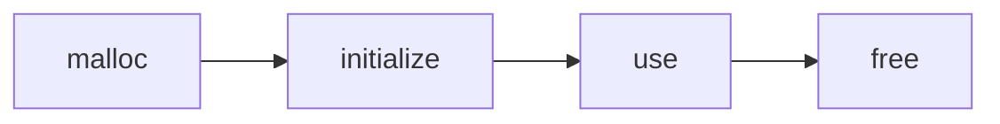
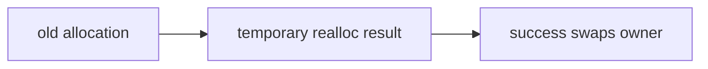
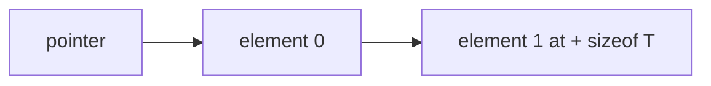
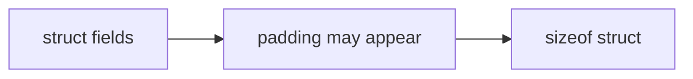

Examples 1–26 introduce lifetime, allocation, pointer-safe representation, and ordinary aggregation.
Each source has a short annotation at the point where its invariant is enforced; compile it directly
from its own directory.

| Examples                                                                         | Focus                                      |
| -------------------------------------------------------------------------------- | ------------------------------------------ |
| 01 malloc-basic; 02 malloc-array; 03 free-basic                                  | allocate, use, and release                 |
| 04 calloc-zeroed; 05 realloc-grow; 06 realloc-shrink                             | initialize and resize safely               |
| 07 pointer-deref; 08 pointer-arith; 09 null-check; 10 stack-vs-heap              | valid pointer lifetime                     |
| 11 sizeof; 12 alignment-alignof                                                  | representation and alignment               |
| 13 bit-set; 14 bit-clear; 15 bit-toggle; 16 bit-test; 17 bit-flags; 18 shift-ops | bit fields                                 |
| 19 struct-basic; 20 struct-padding; 21 struct-pointer; 22 array-of-structs       | aggregate layout                           |
| 23 union-basic; 24 union-type-pun                                                | shared storage, not portable wire encoding |
| 25 dynamic-array-append; 26 dynamic-array-free                                   | growable owned storage                     |

**Run discipline:** failure-path demonstrations must not intentionally execute a double-free, a
use-after-free, or an overflow merely to “prove” a tool works. Build a minimal bad fixture when
learning a diagnostic, then return to these safe counterparts.
