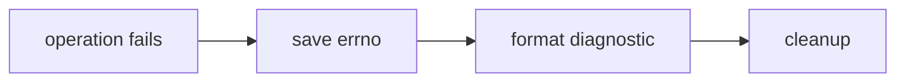
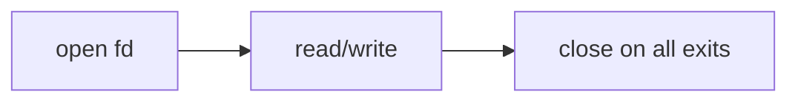
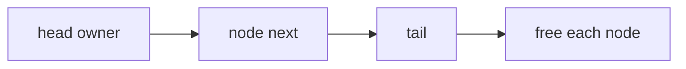

Examples 27–52 make failure paths, descriptor ownership, and byte boundaries explicit.

| Examples                                                                                                             | Focus                                                 |
| -------------------------------------------------------------------------------------------------------------------- | ----------------------------------------------------- |
| 27 double-free-detect; 28 use-after-free-detect; 29 buffer-overflow-detect; 30 dangling-pointer; 31 null-deref-guard | diagnostics explained with safe runnable counterparts |
| 32 integer-overflow-signed; 33 unsigned-wraparound; 34 size-overflow-check                                           | defined arithmetic versus rejected size math          |
| 35 goto-cleanup-single; 36 goto-cleanup-multi                                                                        | portable C cleanup                                    |
| 37 attribute-cleanup; 38 attribute-cleanup-fd                                                                        | GCC/Clang-only comparison; never ISO C                |
| 39 errno-open-fail; 40 perror-strerror; 41 errno-save                                                                | error reporting while errno is fresh                  |
| 42 fd-open-close; 43 fd-leak-detect; 44 read-syscall; 45 write-syscall                                               | descriptors and I/O                                   |
| 46 endianness-detect; 47 htonl-ntohl                                                                                 | host versus network order                             |
| 48 serialize-int; 49 deserialize-int; 50 serialize-struct; 51 serialize-roundtrip                                    | format-defined bytes                                  |
| 52 linked-list-owned                                                                                                 | transfer-free linked ownership                        |

The source for examples 37–38 is intentionally marked extension-only. The reusable course pattern is
examples 35–36: acquire one resource at a time and jump to a single cleanup label on failure.
