Every program under `learning/code/ex-NN-*/` is a standalone, annotated C source file. Examples
1–26 establish allocation and representation; 27–52 make error paths, POSIX resources, and portable
wire bytes deliberate; 53–78 combine separately compiled code, allocators, signals, and sockets.
The intentionally hazardous lessons describe the diagnostic rather than performing undefined behavior:
the companion safe code remains runnable.

## The 30 concepts

| Concept                  | Keep this invariant                                                             |
| ------------------------ | ------------------------------------------------------------------------------- |
| co-01 stack vs heap      | automatic storage ends with its scope; heap storage ends at its owner's release |
| co-02 pointers           | dereference only a live object with the right type and bounds                   |
| co-03 malloc/free        | one successful allocation has one eventual release                              |
| co-04 realloc            | preserve the old pointer until resize succeeds                                  |
| co-05 calloc             | check element-count multiplication before allocating                            |
| co-06 alignment          | store each object at an address aligned for its type                            |
| co-07 ownership          | exactly one owner releases a resource                                           |
| co-08 dangling pointers  | never use a pointer after owner release or scope exit                           |
| co-09 undefined behavior | do not make compiler assumptions your program violates                          |
| co-10 buffer overflow    | carry the capacity with every writable buffer                                   |
| co-11 use after free     | invalidate aliases as ownership ends                                            |
| co-12 double free        | release each allocation once, then clear the owning slot                        |
| co-13 integer overflow   | validate size arithmetic before allocating or indexing                          |
| co-14 fd ownership       | close each owned descriptor once                                                |
| co-15 goto cleanup       | acquire in order; release in reverse on every path                              |
| co-16 attribute cleanup  | GCC/Clang extension only, not portable ISO C                                    |
| co-17 errno              | inspect/save it immediately after a failing call                                |
| co-18 bits               | masks and shifts describe fields precisely                                      |
| co-19 structs            | padding is part of object layout, not a wire format                             |
| co-20 unions             | do not use a union as a portable serialization shortcut                         |
| co-21 endianness         | network bytes are defined order, never host-memory copies                       |
| co-22 serialization      | encode each field to a specified byte sequence                                  |
| co-23 compilation units  | compile interfaces and implementations separately                               |
| co-24 headers            | declarations have include guards and one owner                                  |
| co-25 static linking     | archive members are copied at link time                                         |
| co-26 dynamic linking    | shared-library ABI remains a compatibility contract                             |
| co-27 ABI                | layout and calling conventions cross a binary boundary                          |
| co-28 syscalls           | handle partial I/O and report POSIX failures                                    |
| co-29 signals            | handlers do the minimum async-signal-safe work                                  |
| co-30 sockets            | every endpoint and accepted connection has an owner                             |

## Ownership visual field guide

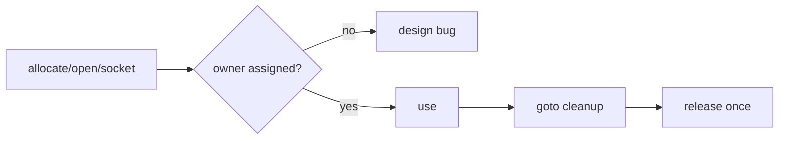

Each small diagram below is an executable mental model, one per concept.

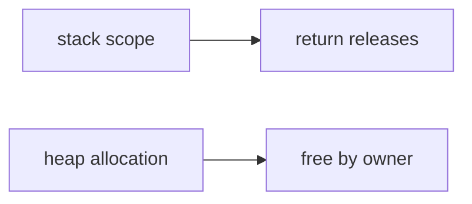

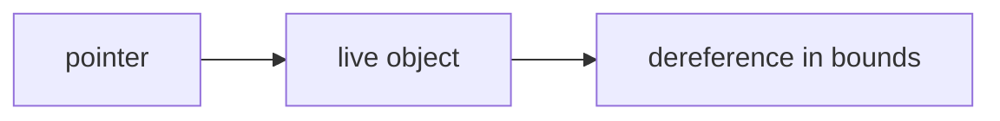

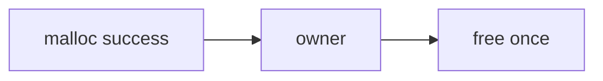

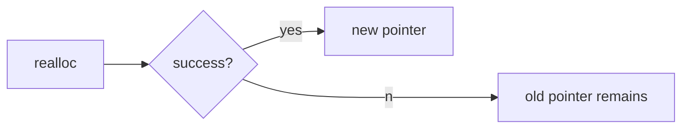

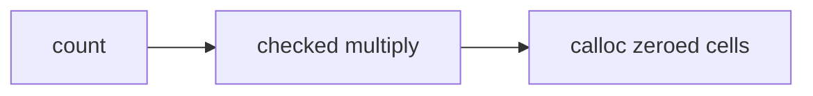

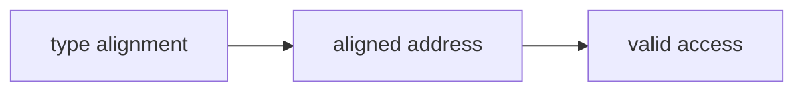

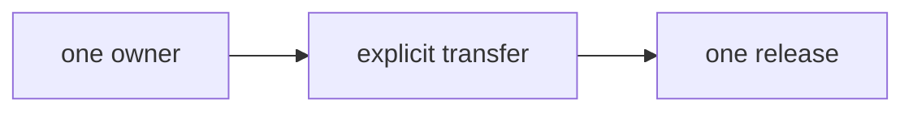

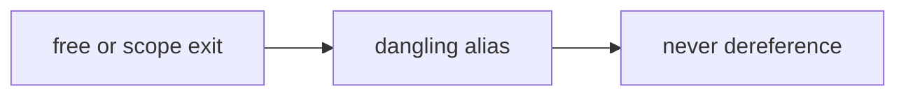

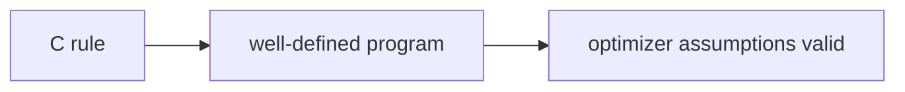

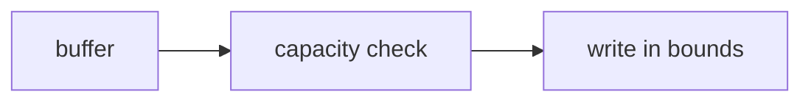

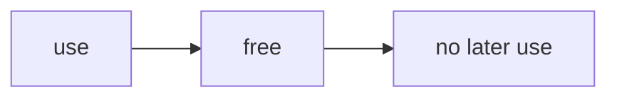

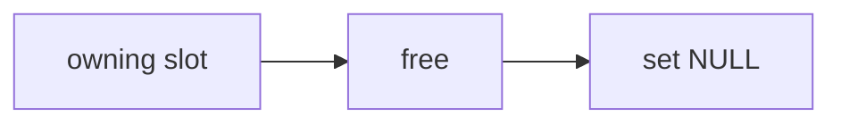

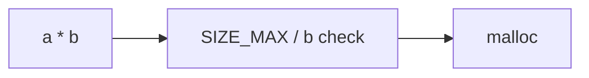

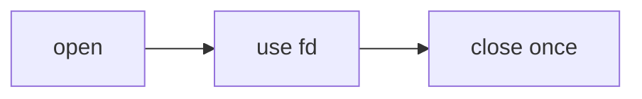

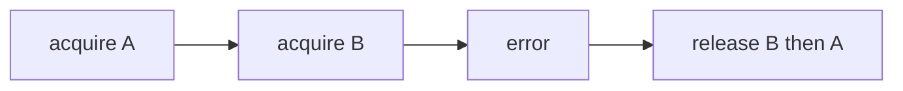

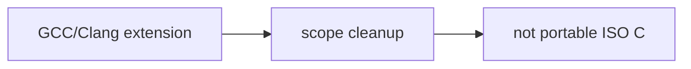

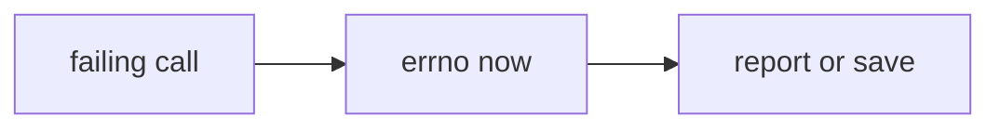

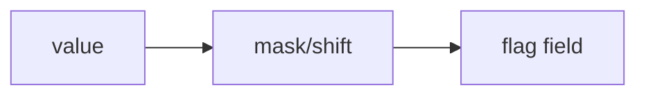

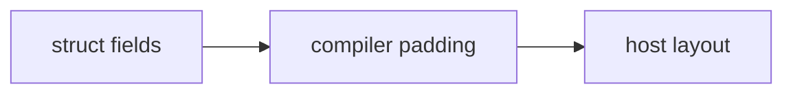

```mermaid
flowchart LR
  U[union storage] --> O[one active representation] --> N[not wire bytes]
```
