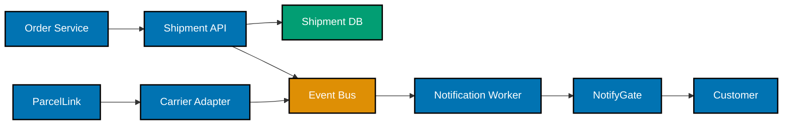
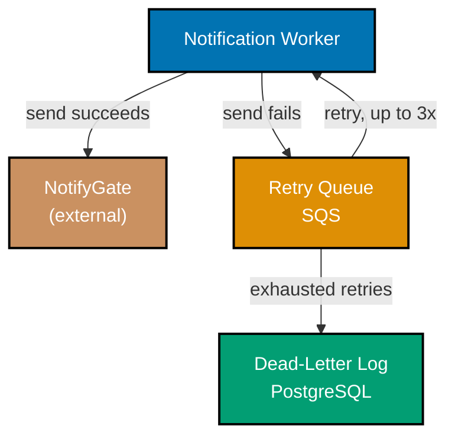

Scenarios 19-25 close the topic at the judgment layer: writing a blameless postmortem end to end,
proving a diagram earns its place over prose, reconciling a diagram with the prose next to it, moving
a drifted doc back close to the code it governs, distilling an accepted RFC into a durable ADR, and
finally running a full document through a reader-review rubric to prove it actually works on a real
reader. Scenarios 19-20 introduce a new incident on the **Harborlight Shipment Tracker**; Scenarios
21-22 and 24 continue threads from the Intermediate scenarios.

---

### Worked Scenario 19: Blameless Postmortem Timeline

**Context**: Exercises co-10. The Shipment API returned 500 errors to a subset of customers for 12
minutes during a Wednesday morning traffic spike. The team writes the incident's timeline first, before
attempting root cause -- and writes it in actor-neutral, timestamped language from the start.

**Decision artifact**:

> **Incident timeline -- Shipment API 500s, 2026-03-11**
>
> - **09:14 UTC** -- automated alert fires: Shipment API error rate exceeds 5% (threshold: 1%).
> - **09:16 UTC** -- on-call acknowledges the alert; begins investigation.
> - **09:19 UTC** -- `shipment_db` connection-pool metrics show the pool at 100% utilization; requests
>   are queueing rather than failing immediately.
> - **09:22 UTC** -- mitigation applied: connection-pool size temporarily raised from 20 to 40 via a
>   config hot-reload, no deploy required.
> - **09:26 UTC** -- error rate returns below 1% threshold; alert clears.
> - **09:41 UTC** -- root-cause investigation begins (Scenario 20).

**Verify**: every entry carries a UTC timestamp and describes an event or an action, never a person's
performance -- "on-call acknowledges the alert" rather than naming who was on call, and no entry
implies anyone was slow or at fault -- satisfying co-10's rule that every timeline entry is
timestamped and actor-neutral.

**Key takeaway**: A twelve-minute incident produces a six-line timeline -- blameless timeline-writing
is not about withholding information, it is about describing what happened rather than who did it.

**Why It Matters**: Writing the timeline before attempting root cause keeps the two separate: a
timeline is a record of what was observed and done, in order; root cause (Scenario 20) is a separate,
deeper analysis. Merging them tempts the writer to insert cause-and-blame language into the timeline
itself, before the actual systemic cause has even been investigated.

---

### Worked Scenario 20: Postmortem Root Cause and Follow-ups

**Context**: Exercises co-10. With Scenario 19's timeline established, the team completes the
postmortem: impact, a 5-whys root cause that stays systemic rather than personal, and follow-ups each
with a named owner and a done-signal.

**Decision artifact**:

> **Impact**: 5% of Shipment API requests returned 500 for 12 minutes (09:14-09:26 UTC); no data loss;
> affected customers who retried succeeded on the retry (Shipment API is idempotent for read
> endpoints).
>
> **Root cause (5 whys)**:
>
> 1. Why did requests 500? The connection pool was exhausted, so new requests timed out waiting for a
>    connection.
> 2. Why was the pool exhausted? A Wednesday-morning order-ingestion burst (this is a known weekly
>    pattern) combined with read traffic from a new dashboard feature launched Monday.
> 3. Why didn't the pool size account for the new dashboard's added read load? The dashboard's launch
>    checklist did not include a connection-pool capacity review.
> 4. Why doesn't the launch checklist include that review? No launch checklist item currently exists
>    for "new feature adds sustained read load to a shared connection pool."
> 5. Why does this gap exist? The checklist was written when Shipment API had one traffic source
>    (mobile app); it was never revisited as more traffic sources were added.
>
> **Systemic root cause**: the launch checklist has a structural gap -- no step verifies a new
> feature's added load against shared-resource capacity -- not any individual engineer's oversight in
> shipping the dashboard.
>
> **Follow-ups**:
>
> | Follow-up                                                                        | Owner | Done-signal                                                                   |
> | -------------------------------------------------------------------------------- | ----- | ----------------------------------------------------------------------------- |
> | Add "shared-resource capacity review" as a required launch checklist item        | Bayu  | Checklist template updated; confirmed present in the next 2 feature launches. |
> | Add automated alerting on connection-pool utilization at 80% (before exhaustion) | Priya | Alert fires in a staging load test at 80% utilization within one sprint.      |
> | Move `shipment_db` to the read-replica architecture proposed in Scenario 2       | Dinar | Replicas live in production; dashboard reads routed to them.                  |

**Verify**: every follow-up has a named owner and a measurable done-signal, and the stated root cause
traces to the launch checklist's structural gap rather than to any individual's mistake -- satisfying
co-10's rule.

**Key takeaway**: The 5-whys chain does not stop at "the dashboard added load" (a fact) -- it keeps
asking until it reaches a systemic, fixable gap (the checklist), which is the only kind of root cause
a follow-up can actually close.

**Why It Matters**: A postmortem that stopped at "an engineer shipped a feature that added load"
would have produced no useful follow-up at all -- you cannot "fix" a person having shipped a feature.
Stopping at the systemic gap instead produces three concrete, ownable follow-ups, one of which
(Scenario 2's read replicas) this topic had already designed the artifact for.

---

### Worked Scenario 21: Diagram Beats Prose

**Context**: Exercises co-11. A design doc's Background section describes the shipment-event
processing flow in a dense paragraph that takes a new reader several passes to parse. The team
replaces it with a diagram and a one-line caption.

**Before (prose)**:

> When an order is placed, the Order Service sends an order-placed event to the Shipment API, which
> writes a shipment record to the Shipment DB and publishes a shipment-event to the Event Bus; the
> Notification Worker consumes that event from the Event Bus and sends a notification via NotifyGate,
> which delivers it to the customer, while separately the Carrier Adapter polls or receives a webhook
> from ParcelLink and writes a carrier-status event back to the Event Bus for the Notification Worker
> to pick up as well.

**After (diagram)**:

_Diagram: two flows converge on the Event Bus -- the order-to-notification path (Order Service through
to the Customer) and the carrier-status path (ParcelLink through the Carrier Adapter) -- and both feed
the Notification Worker._

**Verify**: a reader can state both flows and their convergence point (the Event Bus) after a single
look at the diagram, in less time than it takes to parse the 74-word paragraph -- satisfying co-11's
rule that the diagram conveys the flow faster than the prose it replaced.

**Key takeaway**: The dense paragraph and the diagram encode exactly the same information -- the win
is entirely in how much faster a reader extracts it from the diagram.

**Why It Matters**: The paragraph's single 74-word sentence forces a reader to hold every clause in
their head simultaneously to reconstruct the flow; the diagram lets a reader trace one arrow at a
time. This particular flow -- two converging paths -- is exactly the shape prose struggles with and a
diagram handles naturally, which is precisely the case where co-11 says a diagram earns its place.

---

### Worked Scenario 22: Diagram-Prose Consistency

**Context**: Exercises co-11 and co-12. A later revision of the container diagram (Scenario 18) adds
a new component -- a `retry_queue` for failed notification sends -- to the code, but the diagram and
the prose describing it fall out of sync during a rushed release.

**Before (inconsistent)**: the prose says "failed notification sends are retried via a dedicated
retry queue before falling back to a dead-letter log," but the container diagram still shows only the
original five containers from Scenario 18 -- no `retry_queue` node anywhere.

**Reconciliation**: the diagram is missing a component the prose depends on. The fix adds the missing
node and edge, rather than removing the claim from the prose (the retry queue genuinely exists in the
shipped code).

**After (reconciled)**:

_Diagram: the retry path the prose already described -- a failed send routes to the Retry Queue, retries
up to three times back through the Notification Worker, and exhausted retries land in the Dead-Letter
Log -- now matches the prose exactly._

**Verify**: after reconciliation, every component the prose names (retry queue, dead-letter log) now
appears in the diagram, and every node in the diagram is named in the prose -- no component exists in
one artifact but not the other -- satisfying the combined co-11/co-12 rule.

**Key takeaway**: The inconsistency was caught by checking the diagram and the prose against each
other directly -- not by re-reading the code, which is exactly the check co-11's rule describes.

**Why It Matters**: A reader trusting the stale diagram alone would have concluded the system had no
retry mechanism at all -- a materially wrong picture of the system's actual failure-handling
behavior, and exactly the kind of silent drift that makes an unreconciled diagram worse than no
diagram, because it looks authoritative while being incomplete.

---

### Worked Scenario 23: Doc Rot, Moved Close to Code

**Context**: Exercises co-17. A "Notification Worker Architecture" design doc has lived on the
company wiki for two years, has no visible last-updated date, and has drifted -- it still describes
the original in-process-queue design (superseded by Scenario 12's Kafka RFC over a year ago) with no
indication anything changed.

**Reasoning**: the wiki page's problem is not that its content happens to be wrong today -- it is that
nothing about the page itself signals staleness. A reader has no way to tell, from the page alone,
whether it is current or two years out of date; it reads with exactly the same confident tone either
way.

**Decision artifact**:

> **Action**: delete the wiki page. Move its accurate remaining content (deployment topology, which
> has not changed) into `services/notification-worker/docs/architecture.md`, dated at the top with
> today's date, and rewrite the event-consumption section to describe the actual current Kafka-based
> design (ADR-0005, Scenario 24). Add a one-line pointer in `notification_worker/README.md`: "Full
> architecture: see `docs/architecture.md`."
>
> **Frontmatter added**: `Date: 2026-03-19` (last verified against the running code).

**Verify**: the document now lives in the same repository directory as the code it describes, carries
a date, and is linked from the code's own README -- satisfying co-17's rule that a document resists
rot by being dated, version-controlled, and colocated with the code it governs.

**Key takeaway**: Moving the doc did not just relocate it -- it also forced the rewrite that finally
corrected the two-year-stale event-consumption section, because writing accurately about code sitting
one directory away is a different exercise than writing about it from a wiki with no code in sight.

**Why It Matters**: The wiki page's drift was not a one-time accident -- it is the predictable outcome
of any document that lives somewhere the code's own contributors do not routinely visit. Colocation
does not guarantee a document stays accurate forever, but it puts the document directly in the path
of the people most likely to notice and fix it when it drifts.

---

### Worked Scenario 24: RFC-to-ADR Distillation

**Context**: Exercises co-04 and co-06. Scenario 12's Event Bus RFC was accepted after review
(Scenario 13). The RFC itself -- with its full options analysis, pros/cons tables, and review log --
is not the artifact a future engineer should have to read just to confirm "why Kafka." The team
distills it into a durable ADR.

**Decision artifact**:

> **ADR-0005: Use Kafka for the Shipment Event Bus**
>
> **Status**: Accepted
>
> **Context**: the prior in-process queue between Shipment API and Notification Worker had no replay
> capability, which caused two Notification Worker bugs to require manual data reconciliation instead
> of a replay.
>
> **Decision**: Kafka is the shipment event bus, partitioned by `shipment_id` for per-shipment
> ordering, with 7-day message retention for replay.
>
> **Consequences**: SRE owns Kafka cluster operations (on-call runbook: `docs/runbooks/kafka.md`);
> Notification Worker consumes via a Kafka consumer group (see ADR-0003's webhook decision for the
> upstream carrier-status side of this same event bus).
>
> _(Full deliberation -- both options' pros/cons, the review log, and the retention-cost discussion --
> lives in the RFC, `docs/rfcs/2026-02-event-bus.md`, linked here for historical record but not
> required reading to understand the decision itself.)_

**Verify**: the ADR states the decision and its consequences without reproducing the RFC's options
comparison or review log -- a reader gets the decision in four short sections instead of the RFC's
full deliberation -- satisfying co-04/co-06's combined rule that the ADR captures the decision and
consequence without the RFC's deliberation.

**Key takeaway**: The RFC and the ADR are not duplicates -- the RFC is the permanent record of how the
team reasoned to the decision; the ADR is the permanent record of what the decision is. A future
engineer citing "why Kafka" in a code review only ever needs to link the ADR.

**Why It Matters**: If every future reference to this decision required re-reading the full RFC
(options, pros/cons, three review comments, two deferred follow-ups), the decision would get cited
less often simply because doing so costs more attention than it is worth -- the ADR's job is to make
citing the decision cheap enough that people actually do it.

---

### Worked Scenario 25: Reader-Review Rubric Pass

**Context**: Exercises co-01, co-03, and co-15. Before considering ADR-0005 (Scenario 24) truly done,
the author runs it through a reader-review rubric: hand it to a peer who was not involved in writing
it, and see whether they can restate the decision from the document alone.

**Decision artifact**:

> **Reader-review rubric -- ADR-0005**
>
> - **Skimmable?** Peer reviewer (Priya) read only the Status and Decision lines and restated: "Kafka,
>   accepted, partitioned by shipment ID, 7-day retention." Matches the ADR. Pass.
> - **Decision-first?** The Decision section is the second thing on the page, right after Status --
>   Priya did not have to read Context first to find it. Pass.
> - **Jargon defined?** Priya flagged "consumer group" in Consequences as undefined for a reader
>   outside the Shipment Platform team. Fixed: added a three-word parenthetical, "(a set of
>   coordinated Kafka readers)."
> - **Register-matched?** ADR is written for an engineer audience (the intended reader), consistent
>   with co-15 -- correctly does not attempt an executive framing, since that version already exists
>   separately (Scenario 7's pattern).
>
> **Result**: 3 of 4 checks passed on first read; the jargon gap was fixed and the ADR re-reviewed,
> now passing all four.

**Verify**: a peer reviewer who did not write the document restated the decision correctly from the
document alone, on the first read, for three of the four rubric items, and the fourth was fixed and
re-verified -- satisfying the combined co-01/co-03/co-15 rule that a peer restates the decision from
the doc alone.

**Key takeaway**: The rubric pass caught a real gap (undefined jargon) that the author, already
fluent in the system's vocabulary, could not have caught by re-reading their own document -- only a
genuinely fresh reader could.

**Why It Matters**: Every worked scenario in this topic states its own Verify rule as something the
author can check alone, by reading their own document. This scenario is the exception on purpose: the
final, most reliable check for whether a document actually works is handing it to someone who was not
in the room when it was written, and seeing what they get out of it.

---

← Previous: [Intermediate Scenarios](./intermediate.md) · Next: [Capstone](./capstone/overview.md) →
