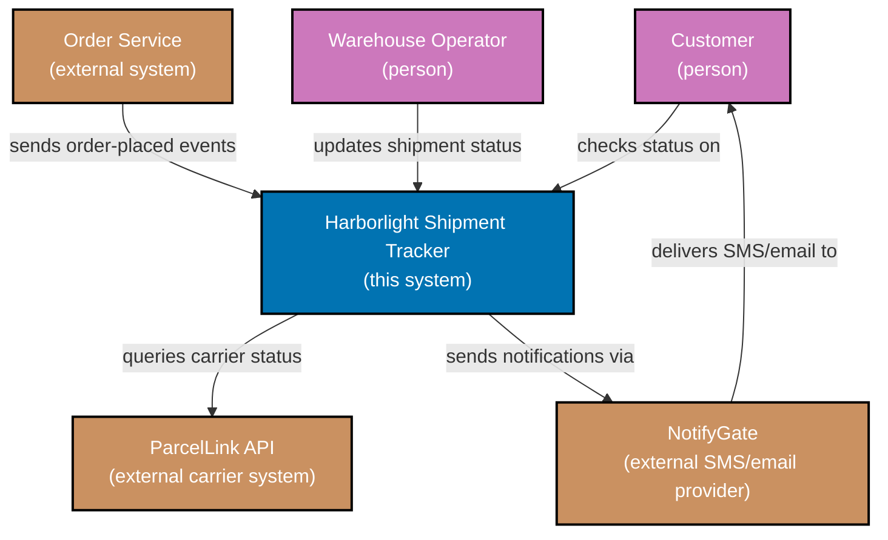

> C4 Level 1 system-context diagram -- exercises co-11 and co-12.

_Diagram: two people (Customer, Warehouse Operator) and three external systems (Order Service,
ParcelLink API, NotifyGate) around the one system this diagram is scoped to, Harborlight Shipment
Tracker. No internal container is shown._
