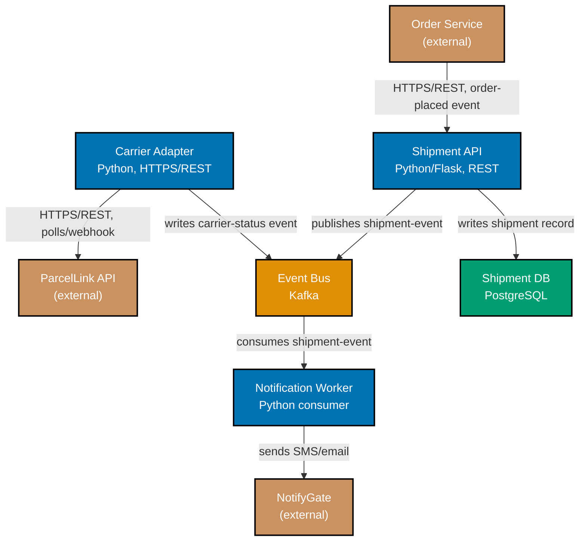

> C4 Level 2 container diagram -- exercises co-12.

_Diagram: five containers (Shipment API, Event Bus, Notification Worker, Shipment DB, Carrier
Adapter) inside the Shipment Tracker boundary, each labeled with its technology, connected by edges
labeled with protocol and purpose._
