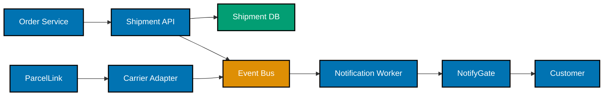

> Shipment-event processing flow, diagram replacing a dense paragraph -- exercises co-11.

_Diagram: two flows converge on the Event Bus -- the order-to-notification path (Order Service through
to the Customer) and the carrier-status path (ParcelLink through the Carrier Adapter) -- and both feed
the Notification Worker._
