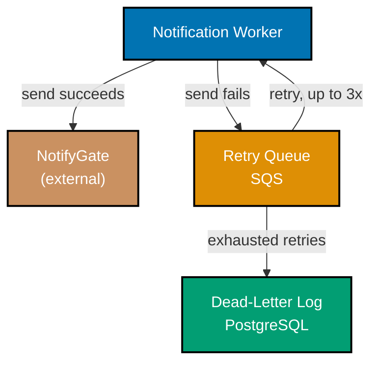

> Container diagram reconciled with the prose describing a retry queue -- exercises co-11 and co-12.

_Diagram: the retry path the prose already described -- a failed send routes to the Retry Queue,
retries up to three times back through the Notification Worker, and exhausted retries land in the
Dead-Letter Log -- now matches the prose exactly._
