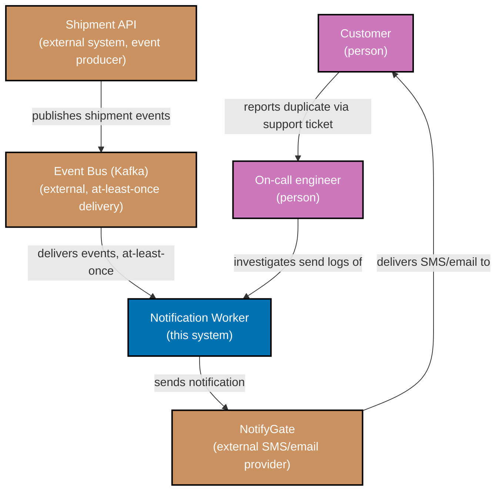

This is the system boundary the [postmortem](./postmortem.md) refers to throughout: the Notification
Worker, the people it affects, and the external systems it depends on at the time of the 2026-04-02
incident. Every node below is named in the postmortem's own timeline and impact sections, and every
system or actor the postmortem names appears here.

_Diagram: two people (Customer, On-call engineer) and three external systems (Shipment API, the
Kafka-based Event Bus, NotifyGate) around the Notification Worker, the system this incident concerns.
The Event Bus is labeled with the exact property (at-least-once delivery) that this incident's root
cause depends on -- the same property named in the postmortem's root-cause section and in the RFC's
Context section._

## Reading this diagram against the postmortem

- **Shipment API** is the upstream system whose events, once duplicated by a rebalance, is what the
  Notification Worker reprocessed -- named in the postmortem's root-cause step 1.
- **Event Bus (Kafka)** is where the consumer-group rebalance that caused the replay actually
  happened -- named in the postmortem's timeline (14:02 entries) and root-cause steps 1 and 3.
- **Notification Worker** is the system whose missing idempotency check is the postmortem's systemic
  root cause, and the system this capstone's ADR and PR change.
- **NotifyGate** is the external provider that actually delivered the duplicate SMS/email messages to
  customers -- the postmortem's Impact section describes what customers received through this system.
- **Customer** and **On-call engineer** are the two people named in the postmortem's timeline: the
  customers who received duplicates and filed support tickets, and the on-call engineer who
  correlated those tickets into a confirmed pattern.

No node in this diagram is absent from the postmortem's prose, and no system or actor named in the
postmortem is missing from this diagram.

---

← Previous: [Capstone Overview](./overview.md)
