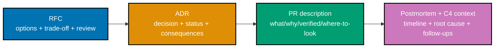

## Goal

Document one real decision and one real incident to a professional bar: an RFC/ADR a peer can act on
without a meeting, and a blameless postmortem a stranger can follow -- proving your writing moves work
forward. This is a leadership `‡` design/decision capstone: no code, zero runnable files. Every
document format combined here was already taught, individually, somewhere in the Beginner,
Intermediate, or Advanced scenarios of this topic; this capstone is where they run together on one
coherent story, at a larger and more realistic scale than any single worked scenario.

The story: on 2026-04-02, a subset of Harborlight customers received duplicate shipment
notifications after a Notification Worker deployment restart replayed already-processed messages.
The RFC and ADR below design and decide the permanent fix; the PR implements it; the postmortem and
its C4 context diagram document the incident itself, with the RFC/ADR/PR trio appearing inside the
postmortem's own follow-ups as the owned fix.

_Diagram: the capstone's build order -- deliberate the fix in an RFC, decide it in an ADR, implement
it in a reviewed PR, and close the loop with a blameless postmortem whose own follow-ups point back at
the RFC/ADR/PR trio as the owned fix. (The underlying incident itself happened first, on 2026-04-02,
before any of these four documents existed -- the postmortem's timeline records that; this diagram is
the order the four documents were written in, not the order events occurred.)_

## Concepts exercised

- [x] BLUF/reader-first structure (co-01, co-02, co-03)
- [x] an ADR (decision + status + consequences, colocated) (co-06, co-07, co-08)
- [x] an RFC with options + trade-off + review (co-04, co-05)
- [x] a PR description (co-09)
- [x] a blameless incident write-up (co-10)
- [x] a C4-style diagram (co-11, co-12)
- [x] precise RFC 2119 keywords + edited, register-matched prose (co-13, co-14, co-15)
- [x] proportional, close-to-code artifacts (co-16, co-17)

## Step 1: ADR and RFC

_exercises co-01, co-02, co-03, co-04, co-05, co-06, co-07, co-08, co-13, co-16, co-17_

The **[RFC](./rfc.md)** states the problem (duplicate notifications after a worker restart), weighs
two options (a Redis-backed idempotency cache versus a full transactional-outbox rearchitecture) with
explicit pros and cons for each, names the decisive trade-off, and carries a review log showing every
question raised was resolved or deferred before its "Accepted" status. The **[ADR](./adr-0006-notification-worker-idempotency-cache.md)**
distills that accepted RFC into a single, durable decision record -- context, decision, consequences,
a status field, dated and colocated with the Notification Worker's own code -- without reproducing the
RFC's full deliberation.

**Verify**: a peer reviewer can restate the decision and its rationale from the ADR and RFC alone,
without a follow-up meeting -- the same reader-review rubric Worked Scenario 25 already demonstrated,
applied here to the capstone's own documents.

## Step 2: PR description

_exercises co-09_

The **[PR description](./pr-description.md)** describes the actual code change that implements the
ADR's decision: what changed, why, how it was verified, and -- because the diff touches several
files -- exactly where a reviewer should look first.

**Verify**: a reviewer knows where to start within thirty seconds of opening the PR description --
the same "where to look first" discipline Worked Scenarios 4 and 16 already demonstrated at smaller
scale.

## Step 3: Postmortem and C4 context diagram

_exercises co-10, co-11, co-12, co-14, co-15_

The **[postmortem](./postmortem.md)** records the original incident: a timestamped, actor-neutral
timeline; the customer-facing impact; a systemic root cause; and owned follow-ups, one of which is
exactly the RFC/ADR/PR trio above. The **[context diagram](./context.md)** (C4 Level 1) shows the
system boundary at the moment of the incident -- every actor and external system the postmortem's
narrative names.

**Verify**: there is no blame language anywhere in the postmortem, every follow-up has a named owner
and a concrete done-signal, and every node the context diagram shows is also named in the postmortem's
or the context page's own prose, and vice versa.

## Acceptance criteria

- Each document passes a reader-review rubric (skimmable, decision-first, no unexplained jargon) --
  the same rubric Worked Scenario 25 walked through for ADR-0005 in the learning track.
- The postmortem is blameless (no individual named in connection with a mistake) and actionable (every
  follow-up has a named owner and a done-signal).
- The C4 context diagram matches the postmortem's prose exactly -- no actor or external system named
  in one is missing from the other.
- The RFC's Open Questions section keeps decided and undecided items visibly separate, and its
  "Accepted" status reflects an actual review cycle, not just a posting.
- The ADR records exactly one decision, carries a status field, and lives in the same repository path
  as the code it governs.

## Done bar

This capstone produces the stated artifact set: an RFC and ADR a peer can act on without a meeting,
a PR description that orients a reviewer in thirty seconds, and a blameless, actionable postmortem
with a matching C4 context diagram -- five documents, one internally consistent story, combining every
format this topic taught (BLUF and reader-first structure, co-01/co-02/co-03; the design-doc/RFC and
ADR formats, co-04 through co-08; PR descriptions, co-09; blameless postmortems, co-10; C4 diagrams,
co-11/co-12; precise RFC 2119 keywords and edited, register-matched prose, co-13/co-14/co-15; and
proportional, close-to-code artifacts, co-16/co-17). Every technique used here traces to a primary
source already cited in this topic's Accuracy notes (RFC 2119, S. Bradner, 1997, clarified by RFC
8174, 2017; Michael Nygard's 2011 ADR format; Simon Brown's C4 model); no new fact was needed to write
this page or the five documents it links.

---

Next: [Drilling](../../drilling/overview.md) →
