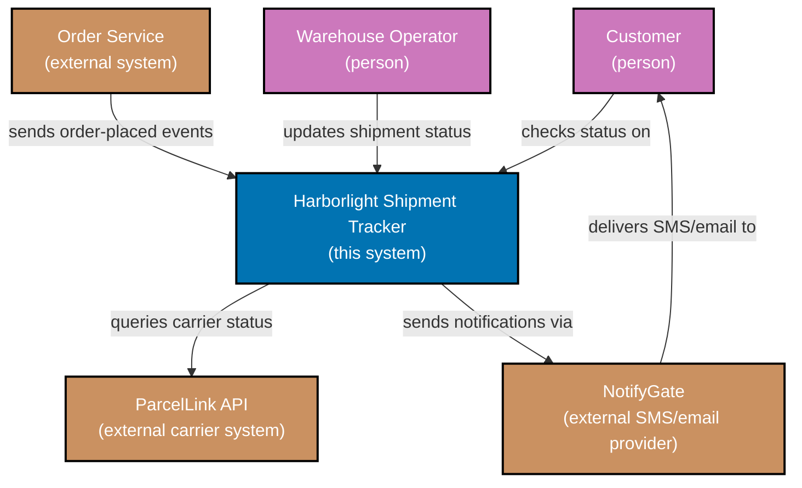
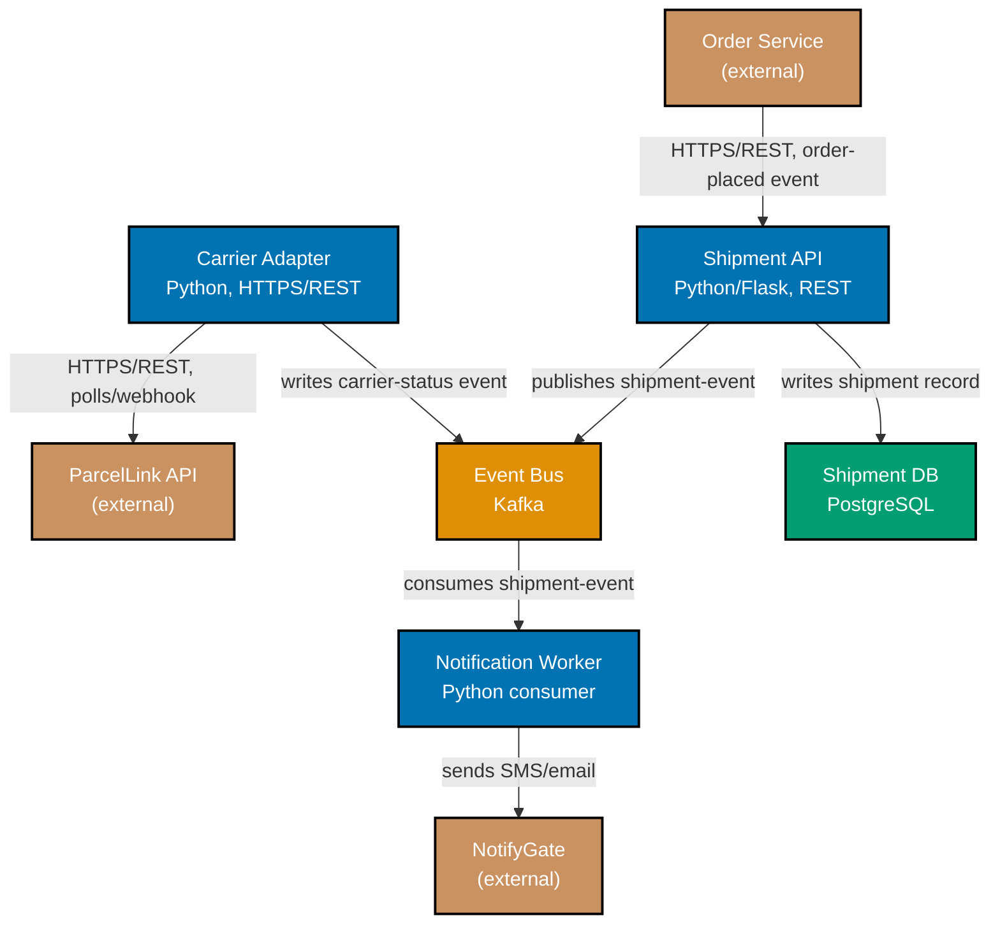

Scenarios 9-18 move from single-document discipline into the heavier formats that capture a durable
decision: ADRs (one decision, a lifecycle status, colocated and immutable), RFCs (options and
trade-off, a real review process), a design doc's open questions, choosing the right artifact weight,
PR review guidance for a large diff, and the two C4 diagram levels this topic uses. Several scenarios
continue the **Harborlight Shipment Tracker** thread from the Beginner scenarios.

---

### Worked Scenario 9: One-Decision ADR

**Context**: Exercises co-06. Shipments in the Harborlight system cross three US time zones between
origin warehouse and destination. An early bug traced back to a shipment event stored with the
warehouse's local time instead of UTC, which briefly made a shipment "delivered" before it "shipped"
once the timestamps were compared across zones. The team writes an ADR recording exactly one decision:
always store event timestamps in UTC.

**Decision artifact**:

> **ADR-0001: Store All Shipment Event Timestamps in UTC**
>
> **Status**: Accepted
>
> **Context**: Shipment events originate from warehouses across three US time zones. Storing each
> event's timestamp in the warehouse's local time made cross-zone comparisons (e.g., "did this
> shipment leave before it arrived") unreliable -- a shipment briefly appeared to arrive before it
> shipped when compared across a time-zone boundary.
>
> **Decision**: every shipment event's timestamp is stored and transmitted in UTC. Display-layer code
> (customer-facing SMS/email, the Warehouse Ops Portal) converts to local time only at render time,
> never before storage.
>
> **Consequences**: all existing event-producing code paths need a one-time audit to confirm they
> already emit UTC (two did not, and were fixed as part of this change). Every future producer must
> follow the same rule -- documented here so a reviewer can point to this ADR in code review instead
> of re-litigating the question.

**Verify**: the ADR records exactly one decision (UTC storage for event timestamps) -- it does not
also decide, for example, how the Warehouse Ops Portal should format displayed times, which stays a
separate, unrecorded implementation detail -- satisfying co-06's rule.

**Key takeaway**: A one-decision ADR is short enough to read in one sitting and precise enough that a
future code reviewer can cite "ADR-0001" instead of re-explaining the reasoning from scratch.

**Why It Matters**: If this ADR had also tried to decide the Warehouse Ops Portal's display format, a
future engineer revisiting only the timestamp-storage question would have to read through unrelated
display reasoning to find it -- and the ADR's own status field (co-07) would have no clean way to
represent "the storage decision is still accepted, but the display decision changed."

---

### Worked Scenario 10: ADR Status Lifecycle

**Context**: Exercises co-07. Harborlight's original approach to tracking shipment status was to poll
the ParcelLink API every five minutes for every in-transit shipment. As shipment volume grew, this
approach started hitting ParcelLink's rate limits. The team decides to switch to ParcelLink's webhook
push notifications instead -- a changed decision, recorded as a new ADR that supersedes the old one.

**Decision artifact**:

> **ADR-0002: Poll ParcelLink for Shipment Status Every 5 Minutes** (original)
>
> **Status**: Superseded by ADR-0003
>
> **Context**: (original reasoning: polling was the simplest integration ParcelLink's older API
> supported at the time.)
>
> **Decision**: (original: poll every 5 minutes per in-transit shipment.)
>
> **Consequences**: (original consequences, now superseded -- see ADR-0003.)
>
> ---
>
> **ADR-0003: Use ParcelLink Webhook Push Notifications for Shipment Status**
>
> **Status**: Accepted (supersedes ADR-0002)
>
> **Context**: polling every in-transit shipment every 5 minutes (ADR-0002) now exceeds ParcelLink's
> rate limit during peak shipping days, causing missed status updates exactly when customers check
> most often.
>
> **Decision**: subscribe to ParcelLink's webhook push API; a shipment's status updates the moment
> ParcelLink has one, with no per-shipment polling.
>
> **Consequences**: requires a publicly reachable webhook endpoint and signature verification on
> incoming payloads (see the RFC 2119 keyword precision this endpoint's own contract doc uses,
> Scenario 6's pattern applied to a new document); removes the rate-limit ceiling ADR-0002 hit.

**Verify**: ADR-0002's status field reads "Superseded by ADR-0003" rather than being silently deleted
or edited, and ADR-0003's own text explicitly states "supersedes ADR-0002," creating a link in both
directions -- satisfying co-07's rule.

**Key takeaway**: Both ADRs still exist, in full, after the change -- superseding is an act of
addition (a new record, a status update), never an act of deletion or silent editing.

**Why It Matters**: A future engineer debugging a stale shipment-status bug who finds ADR-0002 first
(perhaps via an old code comment) is not misled into thinking polling is still the live behavior --
the status field and the forward link redirect them immediately to ADR-0003, which is what actually
governs the code they are reading today.

---

### Worked Scenario 11: Colocated, Immutable ADR

**Context**: Exercises co-08. ADR-0003 from Scenario 10 needs a permanent home. The team places it in
the repository next to the code it governs, rather than in a separate wiki space that requires
knowing to look for it.

**Decision artifact**:

> **File path**: `services/shipment-tracker/docs/adr/0003-parcellink-webhook-push.md`
>
> **Frontmatter**: `Date: 2026-02-18` · `Status: Accepted`
>
> The ADR lives inside `services/shipment-tracker/`, the same repository directory as the
> `carrier_adapter/` code that implements ParcelLink integration -- not in a company wiki, and not in
> a separate documentation repository. A `docs/adr/README.md` index in the same directory lists every
> ADR in this service by number.
>
> When the team later needs to add rate-limit backoff to the webhook receiver itself (a related but
> distinct decision), that becomes ADR-0004 in the same directory -- ADR-0003's own file is never
> reopened for editing after its acceptance date.

**Verify**: the ADR is dated (2026-02-18), lives in the same repository path as the code it governs
(`services/shipment-tracker/`), and its file is never edited after acceptance -- any later related
decision becomes a new, separately numbered ADR file -- satisfying co-08's rule.

**Key takeaway**: Colocation means an engineer who opens `carrier_adapter/` and wonders "why webhooks
and not polling" finds the answer one directory away, without needing to know a wiki space exists.

**Why It Matters**: A decision record's usefulness depends entirely on whether the person who needs it
can find it at the moment they need it -- which is almost always while reading the code, not while
browsing a wiki. Colocation and immutability together are what let a reader trust that the file they
just found is both discoverable and still the live, unedited decision.

---

### Worked Scenario 12: RFC Options and Trade-off

**Context**: Exercises co-04. Harborlight's original polling-then-webhook fix (Scenario 10) still
uses a simple queue for internal event distribution -- Shipment API publishes an event, Notification
Worker consumes it. As event volume grows, the team needs a real event bus and writes an RFC weighing
two options.

**Decision artifact**:

> **RFC: Choosing an Event Bus for Shipment Notifications**
>
> **Problem**: the current in-process queue between Shipment API and Notification Worker has no
> replay capability -- a Notification Worker bug that drops messages cannot be recovered from without
> re-triggering the original events, and there is no ordering guarantee per shipment.
>
> **Option A: Kafka.** Pros: message replay from any offset, per-partition ordering (partitioned by
> `shipment_id`), horizontal scale proven at far larger volume than Harborlight needs today. Cons:
> the team has no existing Kafka operational experience; adds a new piece of infrastructure to run and
> monitor.
>
> **Option B: Amazon SQS + SNS fanout.** Pros: fully managed, zero new infrastructure to operate, the
> team already runs other SQS queues. Cons: no message replay once a message is deleted from the
> queue; no native per-key ordering guarantee (SQS FIFO queues offer ordering but cap throughput well
> below Harborlight's peak volume).
>
> **Decisive trade-off**: replay capability is the deciding factor -- the Shipment Platform team has
> now shipped two Notification Worker bugs in the past year that would have been trivially recoverable
> with replay, and both required a manual data-reconciliation effort without it. Kafka's operational
> cost is real but bounded (one well-documented technology to learn); SQS's missing replay is a
> recurring cost paid every time a future bug ships.
>
> **Decision**: Kafka.
>
> **Open Questions**: who owns Kafka cluster operations day to day (undecided -- SRE and Shipment
> Platform are still discussing); retention period for replay (undecided -- proposal is 7 days,
> pending a cost estimate).

**Verify**: both options list explicit pros and cons, and the decision cites the specific deciding
factor (replay capability, backed by the two-incident history) rather than a bare preference --
satisfying co-04's rule.

**Key takeaway**: The RFC's Open Questions section keeps two genuinely undecided items (ownership,
retention) visibly separate from the one thing that is decided (Kafka itself) -- nothing here is
phrased as settled when it is not.

**Why It Matters**: A trade-off memo that only lists Option A's pros and Option B's cons (or vice
versa) is not actually weighing a trade-off -- it is building a case. Listing both options' real costs
is what lets a reviewer trust the decision was reasoned through rather than reverse-engineered to
justify a preference the author already had.

---

### Worked Scenario 13: RFC Review Process

**Context**: Exercises co-05. The Event Bus RFC from Scenario 12 is posted for team review. Posting it
is not the same as it being reviewed -- the team runs it through an actual comment/approval cycle
before marking it accepted.

**Decision artifact**:

> **Review log -- RFC: Choosing an Event Bus for Shipment Notifications**
>
> - **Dinar (SRE)**: "Who's on call for Kafka if it goes down at 2am? We don't have Kafka runbooks
>   today." → **Resolved**: on-call ownership added to Open Questions (still undecided, explicitly
>   tracked, not silently dropped from the review).
> - **Priya (Notification Worker owner)**: "Does this change the Notification Worker's consumer code
>   much?" → **Resolved**: added a "Migration" section to the RFC describing the consumer-side change
>   as a bounded, one-sprint effort (Scenario 16's PR implements it).
> - **Bayu (tech lead)**: "7-day retention -- have we priced that?" → **Deferred**: retention cost
>   estimate tracked as a follow-up ticket, explicitly listed in Open Questions rather than blocking
>   acceptance of the core Kafka-vs-SQS decision.
>
> **Status: Accepted** (2026-02-24), with two items carried forward in Open Questions: Kafka
> operational ownership, and final retention-period cost.

**Verify**: every question raised during review (on-call ownership, consumer-code impact, retention
cost) carries an explicit resolved-or-deferred annotation, and the RFC only moves to "Accepted" once
every one of them has one -- satisfying co-05's rule.

**Key takeaway**: Two of the three review comments did not get a final answer before acceptance --
and that is fine. The rule is that every question gets an explicit resolution or an explicit deferral,
not that every question gets fully answered before shipping.

**Why It Matters**: If Bayu's retention-cost question had simply been ignored rather than deferred and
tracked, the RFC's "Accepted" status would be misleading -- it would look like every concern was
addressed when one was actually just dropped. The explicit deferral preserves the RFC's honesty about
what is and is not actually settled.

---

### Worked Scenario 14: Design Doc Open Questions

**Context**: Exercises co-04. A design doc proposing automatic ETA recalculation (recompute a
shipment's estimated delivery date whenever its status updates, instead of showing the original
static estimate forever) needs its Open Questions section audited -- an early draft accidentally
phrased one already-decided item as if it were still open.

**Before** (flawed):

> **Open Questions**:
>
> - Should recalculation run synchronously on every status update, or on a schedule? (We're going with
>   synchronous, on every update, since ETA staleness is the whole point we're fixing.)
> - What's the fallback if ParcelLink's own ETA field is missing for a shipment?

**After (corrected)**:

> **Decision**: recalculation runs synchronously on every shipment status update -- not on a schedule
> -- because ETA staleness between updates is the exact problem this doc exists to fix.
>
> **Open Questions**:
>
> - What's the fallback if ParcelLink's own ETA field is missing for a shipment? (undecided --
>   proposal: fall back to a static origin-to-destination average, but this needs the data team's
>   input on whether that average is even tracked today.)

**Verify**: after the fix, the Open Questions section contains only the genuinely undecided
ParcelLink-fallback item -- the synchronous-vs-scheduled question, which was already decided, is
promoted to its own Decision statement instead of being phrased as a question -- satisfying co-04's
rule that no undecided item is stated as a decision (and, symmetrically, no decided item hides inside
Open Questions).

**Key takeaway**: The "before" version's parenthetical -- "(We're going with synchronous...)" -- is a
tell: a genuinely open question does not come with a parenthetical answer already attached to it.

**Why It Matters**: A reviewer skimming the Open Questions section for what still needs their input
would waste review attention re-litigating the synchronous-vs-scheduled question, which was never
actually open -- and might miss that the ParcelLink-fallback question, the one that genuinely needs
their input, was sitting right next to it.

---

### Worked Scenario 15: Doc Proportionality

**Context**: Exercises co-16. Three decisions of genuinely different stakes and reversibility come up
in the same sprint. The team picks the right artifact weight for each rather than defaulting to one
format for everything.

**Decision artifact**:

| Decision                                                           | Reversibility                                          | Artifact chosen   | Why                                                                                                                             |
| ------------------------------------------------------------------ | ------------------------------------------------------ | ----------------- | ------------------------------------------------------------------------------------------------------------------------------- |
| Rename an internal config flag, `retry_max` to `carrier_retry_max` | Trivially reversible; a single grep-and-replace        | Inline PR comment | Low stakes, one file, no cross-team impact -- an RFC would spend review attention nobody needed to spend.                       |
| Add exponential backoff to the Carrier Adapter (Scenario 4)        | Reversible, but touches production error-handling      | PR description    | One team, one component, moderate stakes -- co-09's structure gives a reviewer everything needed without a formal review cycle. |
| Adopt Kafka as the shipment event bus (Scenario 12)                | Expensive to reverse; new infrastructure, new runbooks | Full RFC + ADR    | High stakes, cross-team (SRE now owns on-call for it), genuinely hard to undo once other services depend on Kafka's replay.     |

**Verify**: the lightest decision (a rename) gets the lightest artifact (a comment), and the heaviest
decision (adopting new infrastructure) gets the heaviest artifact (RFC + ADR) -- the reversible,
low-stakes call is never over-weighted into an RFC -- satisfying co-16's rule.

**Key takeaway**: Proportionality is not "always write more" or "always write less" -- it is matching
the artifact's weight to the specific decision's actual stakes, decision by decision.

**Why It Matters**: If the config-flag rename had gone through a full RFC cycle, the review attention
it consumed would not have come free -- it would have been borrowed from a future decision that
genuinely needed that same scrutiny and got a rushed, distracted review instead, because reviewers
had learned to skim RFCs after seeing too many trivial ones.

---

### Worked Scenario 16: Review Guidance for a Large PR

**Context**: Exercises co-09. The PR migrating the Notification Worker to consume from Kafka instead
of the old in-process queue (Scenario 12's decision, now implemented) touches fourteen files. Most of
the diff is mechanical; one file carries the actual risk.

**Decision artifact**:

> **What**: migrates `NotificationWorker` from the legacy in-process queue consumer to a Kafka
> consumer, per ADR-0005 (Scenario 24).
>
> **Why**: enables message replay after worker bugs (RFC, Scenario 12) instead of manual data
> reconciliation.
>
> **How verified**: full existing Notification Worker test suite passes against a local Kafka
> instance; ran a replay drill in staging (killed the consumer mid-batch, restarted, confirmed every
> message the old queue would have delivered is still delivered, in order, under the new Kafka
> consumer).
>
> **Where to review first**: `notification_worker/consumer.py`'s `handle_rebalance()` method --
> everything else in this diff (import changes, config wiring, thirteen other files) is mechanical.
> `handle_rebalance()` is the one place a consumer-group rebalance could replay already-processed
> messages if the offset-commit logic has a bug; get this one function right and the rest of the diff
> is low-risk by comparison.

**Verify**: out of fourteen changed files, the description explicitly names exactly one function in
one file as the risk area and explains why the other thirteen files are lower-risk by comparison --
satisfying co-09's rule that a reviewer's attention is directed to the risky diff.

**Key takeaway**: "Fourteen files changed" tells a reviewer nothing about where to spend their limited
attention; naming the one risky function does.

**Why It Matters**: `handle_rebalance()`'s offset-commit logic is exactly the kind of code a rushed,
diffuse review misses -- it is a small function inside a large diff, syntactically unremarkable, and
its bug only shows up under a specific failure condition (a rebalance mid-batch) that a quick skim
would never trigger. Directing review attention there is what actually catches it.

---

### Worked Scenario 17: C4 Context Diagram

**Context**: Exercises co-11 and co-12. A new engineer joining the Shipment Platform team asks "what
does this system even talk to?" -- exactly the question a C4 Level-1 context diagram answers, at the
level of external actors and system boundaries, with no internal detail.

**Decision artifact**:

_Diagram: two people (Customer, Warehouse Operator) and three external systems (Order Service,
ParcelLink API, NotifyGate) around the one system this diagram is scoped to, Harborlight Shipment
Tracker. No internal container is shown -- that is the container diagram's job (Scenario 18)._

**Verify**: every external actor (Customer, Warehouse Operator) and every system boundary the
Shipment Tracker actually crosses (Order Service, ParcelLink API, NotifyGate) appears in the diagram,
and no internal container of the Shipment Tracker itself appears -- satisfying the combined
co-11/co-12 rule.

**Key takeaway**: A context diagram answers exactly one question -- "who and what does this system
talk to" -- and answers it completely without also trying to show how the system works internally.

**Why It Matters**: A new engineer's first question is almost never "which internal service calls
which" -- it is "what is this system's boundary." A context diagram that also showed internal
containers would force the new engineer to filter out information they do not need yet, exactly the
overloaded-diagram failure mode co-12 warns against.

---

### Worked Scenario 18: C4 Container Diagram

**Context**: Exercises co-12. Once a reader understands the Shipment Tracker's boundary (Scenario
17), the next question is "how is it actually built" -- a C4 Level-2 container diagram, naming each
deployable unit, its technology, and how it talks to its neighbors.

**Decision artifact**:

_Diagram: five containers (Shipment API, Event Bus, Notification Worker, Shipment DB, Carrier
Adapter) inside the Shipment Tracker boundary from Scenario 17's context diagram, each labeled with
its technology, connected by edges labeled with protocol and purpose. The three external systems from
Scenario 17 reappear at the edges, unchanged, so a reader can see how the two diagrams relate._

**Verify**: every container names its own technology (Flask/REST, Kafka, PostgreSQL, HTTPS/REST) and
every edge states how it talks to its neighbor (protocol plus purpose, not just an unlabeled arrow) --
satisfying co-12's rule.

**Key takeaway**: The container diagram is a zoom-in on the single "Harborlight Shipment Tracker" box
from Scenario 17's context diagram -- the three external systems at its edges are the same three
systems, in the same relative positions, so the two diagrams read as one coherent picture at two
different zoom levels.

**Why It Matters**: An unlabeled arrow between two boxes tells a reader that two things are connected
but nothing about how -- synchronous REST call, async event, or a manual export nobody automated yet
are three very different operational realities that look identical as a bare arrow. Naming the
protocol on every edge is what makes this diagram actually load-bearing for an on-call engineer
deciding where to look during an incident.

---

← Previous: [Beginner Scenarios](./beginner.md) · Next: [Advanced Scenarios](./advanced.md) →
