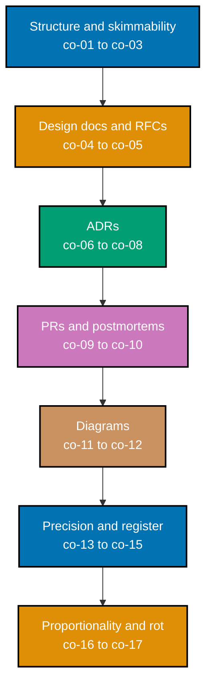

This topic is a **leadership no-code sub-mode** (`‡`) Annotated-concept topic: zero code, zero
runnable files. Every worked scenario produces a **communication artifact** -- a status update, an
RFC, an ADR, a PR description, a blameless postmortem, a C4-style diagram -- the kind of document a
real engineering team could act on directly, without a follow-up meeting to explain what it meant.
Writing that moves work forward is pulled early into this journey despite spanning the whole
curriculum, because communication compounds: every later topic is easier to learn and to ship once
you can write about it clearly.

## Prerequisites

- **Prior topics**: [topic 9 Project Management](/en/c/learn/fundamentally-strong/software-engineer/project-management)
  -- that topic covers how work is scoped and tracked; this one covers how the decisions inside that
  work get written down so someone else can find, follow, and trust them.
- **Tools & environment**: a plain-text/Markdown workflow in version control; an ADR/RFC template; a
  diagramming tool capable of a C4-style context/container view. There is no runtime to install --
  every deliverable in this topic is a document, not a program.
- **Assumed knowledge**: enough of the domain you are writing about to have a defensible point of
  view, and the ability to read a simple table or diagram.

## Why this exists -- the big idea

A good decision no one can find, follow, or trust dies in a hallway conversation; undocumented
context becomes tribal knowledge that walks out the door with the person who held it. The one idea
worth keeping if you forget everything else: **write for the reader's question, not your discovery
order** -- lead with the decision and the "why," put the evidence under it, and make the document
skimmable in about thirty seconds. The failure mode this topic guards against is never a single
dramatic decision to skip documentation; it is the slow accumulation of decisions nobody wrote down,
each individually reasonable to skip, that together leave a codebase governed by memory instead of
by record.

**Cross-cutting big ideas**: `correctness-vs-pragmatism` -- a design doc's job is a decision that
ships and holds, not an exhaustive treatise. An RFC that tries to anticipate and resolve every
conceivable future question before shipping never ships; the professional move is to capture the
trade-off that matters now, name what remains genuinely open, and move (co-04, co-05). `coupling-vs-cohesion`
-- a well-scoped ADR or RFC keeps exactly one decision and its rationale together and cross-links to
neighboring decisions rather than inlining everything into one sprawling document, so each document
can change independently of the others (co-06, co-16). A design doc that tries to also be the ADR,
the runbook, and the onboarding guide is a low-cohesion document that nobody can safely edit without
touching unrelated concerns.

## When NOT to reach for this

More words is not more clear: an exhaustive doc no one reads is worse than a one-page decision they
actually act on -- over-documentation carries a real maintenance and attention cost, and every extra
page is a page someone has to keep accurate later. Docs also drift from reality in a specific,
predictable way: an ADR checked in beside the code and dated stays trustworthy, while a design doc
parked in a wiki nobody updates becomes a confident lie -- it still reads as authoritative long after
it stopped being true. Prefer close-to-code, dated, immutable-decision formats over living prose you
must constantly police (co-17). And not every decision deserves the long form at all: a reversible,
low-stakes decision doesn't need an RFC -- a code comment or a PR description is proportionate.
Reserve heavyweight docs for decisions that are expensive to reverse or that many people must align
on (co-16).

## Why these formats -- lineage

Engineering teams learned the hard way that architecture living only in senior engineers' heads
erodes with every re-org. The IETF's RFC tradition showed that durable, referenceable design writing
scales a distributed community; Michael Nygard's Architecture Decision Records (2011) shrank that
idea to a decision-sized, version-controlled unit that lives with the code instead of in a separate
process; Simon Brown's C4 model gave architecture a lightweight, notation-independent picture instead
of one overloaded diagram trying to answer every reader's question at once. These formats beat "one
big up-front design document" because they are cheap to write, cheap to find, and scoped to change
independently -- and the habit compounds across the rest of this curriculum, feeding directly into
the decision records that later, deeper architecture work formalizes.

## How verification works in this topic

Every earlier topic in this journey verified a claim by running something -- a script, an
interpreter, a test suite -- and reading its output. This topic has no interpreter to run: an ADR, an
RFC, and a postmortem are not executable, so there is no command that can confirm one is "correct" the
way a test suite confirms a function's return value. Verification here instead means checking an
**observable property of the written artifact itself** against a stated rule -- something you can
point at on the page, not a vague description of what a "good" document should feel like. A few
concrete examples that recur throughout this topic:

- A **BLUF** is verifiable: the decision and the ask appear in the literal first sentence -- read it,
  check.
- An **ADR's status field** is verifiable: does the record say `Proposed`, `Accepted`, or `Superseded
by ADR-000X`, and if superseded, does the newer record link back? Read the field, follow the link.
- An **RFC's Open Questions section** is verifiable: is every item there phrased as genuinely
  undecided, with nothing that is actually a decision misfiled as a question? Read the section,
  check each line.

Every concept below and every worked scenario that follows states its own **Verify it** / **Verify**
rule in exactly this observable-property form -- read the artifact, check the stated property, done.

_Diagram: the seven concept clusters this topic teaches, in reading order -- from making a single
document skimmable, through the heavier design-doc/RFC and ADR formats that capture a decision,
through the PR-description and postmortem formats that communicate change and failure, through
diagrams, and finally the precision, register, and proportionality judgment that cuts across every
format above it._

## Concepts

Every worked scenario in this topic's follow-up pages cites the `co-NN` concept it exercises -- this
section is the 1:1 reference those citations point back to. Read it in order: each cluster builds on
the one before it, from "is this single document skimmable" through to "does this document still tell
the truth a year from now."

### co-01 · Reader-First BLUF

Lead with the bottom line up front: the decision and the ask come first, so a reader gets the answer
before the discovery-order narrative that produced it. A status update, a design doc, and an incident
summary all share the same failure mode when this is skipped -- the reader has to excavate the point
from underneath the investigation that led to it.

**Why it matters**: a reader who has to read to the end to find out what you actually want from them
either stops reading before they get there, or reads the whole thing anyway and resents the time it
cost -- both outcomes cost you the exact attention you were trying to earn.

**Verify it**: a document satisfies BLUF if the decision and the ask are both present in the literal
first sentence -- read the first sentence only and check whether both are there.

### co-02 · Inverted Pyramid

Order content most-important to least, so a reader who stops early still has the conclusion;
supporting detail sinks to the bottom where it can be skipped by anyone who doesn't need it. This is
BLUF's structural cousin applied to an entire document, not just its opening sentence: every
subsequent section, not only the first line, keeps ordering by importance rather than by the order
the author discovered the material.

**Why it matters**: most readers do not read to the end -- they read until they have enough to act,
then stop. A document ordered by discovery instead of by importance systematically fails exactly the
readers who stop earliest, which is most of them.

**Verify it**: a reader who stops after the first two paragraphs still has the answer -- read only
those two paragraphs and check whether the document's conclusion is present in them.

### co-03 · Thirty-Second Skim Test

A well-structured document yields its decision and next action from headings, bold text, and first
sentences alone in about thirty seconds. This is the practical test that proves co-01 and co-02 were
actually applied, not just intended -- a document can claim to be "reader-first" while still burying
its real content in unbolded paragraph six.

**Why it matters**: most readers skim before they commit to reading -- a document that fails the skim
test never gets the full read it needed, no matter how good the buried prose turns out to be.

**Verify it**: a document passes the skim test if reading only its headings, bolded phrases, and
first sentences -- nothing else -- yields the decision and the next action within about thirty
seconds.

### co-04 · Design Doc / RFC Structure

A design doc or RFC states problem, context, options considered, decision, trade-offs, and open
questions -- decided and undecided kept explicitly separate. This is the format that scales a
decision from "one person's judgment call" to "a decision a distributed team can review, contest, and
later trust," precisely because every element a reviewer needs to evaluate the reasoning is present
in one place.

**Why it matters**: a design doc that skips "options considered" reads as a decision handed down
rather than a decision reasoned through -- reviewers have nothing concrete to push back on, so
disagreement either goes unspoken or explodes later once the decision is already load-bearing.

**Verify it**: a design doc/RFC is well-formed if all six elements are present, and no item in its
Open Questions section is phrased as a decision already made.

### co-05 · RFC Review Process

An RFC earns "accepted" by running through a comment/approval cycle in which every open question is
answered or explicitly deferred, not by being posted. Posting a document is not the same act as
having it reviewed -- the review cycle is what actually tests whether the reasoning holds up against
people who did not write it.

**Why it matters**: an RFC that skips review is a design doc wearing an RFC's authority without
having earned it -- the entire point of the "R" in RFC is that other people got a real chance to
request changes before the decision became load-bearing.

**Verify it**: an RFC's "Accepted" status is earned only once every open question raised during
review carries an explicit resolved-or-deferred annotation -- an RFC posted but never commented on
has not earned it.

### co-06 · ADR One-Decision Format

An Architecture Decision Record captures exactly one decision with its context and consequences --
one decision per record, not a design treatise. Michael Nygard's original 2011 formulation
(context / decision / consequences) is deliberately small: an ADR is meant to be readable in one
sitting, which only holds if it stays scoped to a single decision.

**Why it matters**: a multi-decision ADR forces a reader who cares about decision B to also read
through decisions A and C to find it, and it forces the ADR's own status field (co-07) to somehow
represent three decisions' worth of lifecycle at once, which it structurally cannot.

**Verify it**: an ADR is well-formed if it records exactly one decision -- a second, unrelated
decision folded into the same record is a sign it should split into two ADRs.

### co-07 · ADR Lifecycle Status

An ADR carries a status (proposed → accepted → superseded); a changed decision is a new ADR that
supersedes and links back, never a silent edit. This is what keeps an ADR trustworthy as a historical
record: reading ADR-0003 six months from now should tell you not just what the team decided, but
whether that decision is still the live one.

**Why it matters**: a silently edited ADR destroys the exact property that made it worth writing in
the first place -- a reader can no longer trust that what they are reading is what the team actually
decided at the time, because the text may have quietly changed underneath them.

**Verify it**: an ADR's lifecycle is well-formed if changing a decision produces a new ADR marked
superseded that links to and from the old one, whose own status field is updated to "Superseded by
ADR-000X" -- never a silent edit to the original text.

### co-08 · ADR Colocation & Immutability

An ADR lives in the repo next to the code it governs and is dated and immutable, so the decision
record stays trustworthy instead of drifting in a wiki. Colocation is what makes an ADR discoverable
by the person who actually needs it -- someone reading the code, not someone who happens to remember
which wiki space the decision lives in.

**Why it matters**: a decision record that lives somewhere other than the code it governs is one
reorg, one wiki migration, or one forgotten link away from becoming undiscoverable -- colocation ties
the document's lifespan to the code's, which is the lifespan that actually matters.

**Verify it**: an ADR is well-formed if it is dated, lives in the same repository as the code it
governs, and its own text is never edited after acceptance -- only appended to via a superseding
record.

### co-09 · PR Description Structure

A pull-request description says what changed, why, how it was verified, and where a reviewer should
look first -- directing attention to the risky diff. A PR description is the smallest, most frequent
communication artifact most engineers write, and also the one most often skipped or reduced to a
single uninformative line.

**Why it matters**: a reviewer facing a large diff with no guidance either reviews everything with
equal, diluted attention, or skims the whole thing and approves without ever finding the one risky
hunk buried in it -- a good description fixes both failure modes by naming the risky part explicitly.

**Verify it**: a PR description is well-formed if all four elements -- what, why, how verified, where
to look -- are present, and, for a large diff, a stated risk-area pointer directs the reviewer's
attention.

### co-10 · Blameless Postmortem Structure

An incident write-up records timeline, impact, root cause, and owned follow-ups in actor-neutral
language, treating failure as systemic, not personal. "Blameless" does not mean "no root cause found"
-- it means the root cause traces to a missing safeguard or an untested assumption in the system,
never to a person's carelessness.

**Why it matters**: a postmortem that names a person instead of a systemic gap teaches the team to
hide near-misses rather than report them -- the very reporting a postmortem process depends on to
catch the next incident before it happens.

**Verify it**: a postmortem is well-formed if every timeline entry is timestamped and names no
individual, the root cause traces to a systemic condition rather than a person's mistake, and every
follow-up has a named owner and a concrete done-signal.

### co-11 · Diagrams as Communication

A diagram earns its place when it conveys a structure or flow faster than the prose it replaces; the
diagram and its prose must name the same things. A diagram is not automatically better than prose --
a diagram for a genuinely linear, three-step process usually adds overhead a sentence would not have.

**Why it matters**: a diagram that omits a component the prose discusses, or vice versa, actively
misleads a reader trying to reconcile the two -- worse than no diagram at all, because it looks
authoritative while being wrong.

**Verify it**: a diagram earns its place if a reader can state the flow or structure it depicts
faster from the diagram than from an equivalent prose paragraph, and every name the diagram uses also
appears in the surrounding prose, and vice versa.

### co-12 · C4 Model Levels

The C4 model pictures architecture at nested levels (context → container → component → code), each
answering a different reader's question without one overloaded diagram. Simon Brown's C4 model is
deliberately notation-independent -- the discipline is in picking the right level for the question at
hand, not in a specific box-and-arrow syntax.

**Why it matters**: a single diagram trying to show both "who talks to this system" (a context-level
question) and "which internal service talks to which" (a container-level question) forces every
reader to filter out the half of the diagram irrelevant to their own question.

**Verify it**: a C4-level diagram is well-formed if it stays at exactly one level -- a context diagram
that also shows internal containers has collapsed two readers' questions into one overloaded picture.

### co-13 · RFC 2119 Keyword Precision

MUST/SHOULD/MAY (RFC 2119, S. Bradner, 1997, clarified by RFC 8174, 2017) make a requirement's
strength unambiguous, replacing vague "should probably" language. RFC 8174 adds one further
precision: these keywords carry this exact meaning only when written in ALL CAPS -- a lowercase
"should" in the same document is read as ordinary English, not as the RFC 2119 keyword.

**Why it matters**: "should probably validate this" leaves a reader to guess whether skipping
validation is a minor style violation or a production incident waiting to happen -- an ambiguity that
costs nothing to write and a great deal to leave unresolved once someone acts on the wrong guess.

**Verify it**: a requirement's strength is unambiguous if it uses an ALL-CAPS RFC 2119 keyword (MUST,
SHOULD, MAY, MUST NOT, SHOULD NOT) rather than a vague qualifier like "should probably" or "ideally."

### co-14 · Editing: Cut Hedging & Filler

Cutting filler (just, really, basically) and hedging (I think, sort of) makes every remaining claim
stand on its own -- editing is removal, not addition. This is the concept most directly opposed to
the instinct to add more words when a point feels underdeveloped; usually the fix is to remove the
words diluting the point that is already there.

**Why it matters**: a hedged claim invites a reader to discount it before they have even evaluated
the evidence behind it -- "I think this is probably fine" reads as substantially less confident than
the underlying reasoning may actually warrant.

**Verify it**: an edited paragraph is well-formed if every hedge and filler word has been removed and
every remaining sentence still reads as a complete, standalone claim.

### co-15 · Audience Register Match

Vocabulary, detail, and framing are chosen for the reader: the same decision is written differently
for an executive than for the engineer who implements it. This is not two different truths -- it is
one truth, written twice, at the level of detail and in the vocabulary each specific audience needs
to act on it.

**Why it matters**: an executive buried in implementation detail tunes out before reaching the
decision that actually needs their sign-off; an implementing engineer handed only an executive
summary has nothing concrete enough to build from -- the same document cannot serve both audiences
well.

**Verify it**: two versions of the same update are well-formed if each one's vocabulary, level of
technical detail, and framing are demonstrably different, driven by what that specific audience needs
to decide or do next.

### co-16 · Doc Proportionality

The artifact weight matches the decision's stakes and reversibility: a reversible low-stakes call
gets a comment or PR note, not a heavyweight RFC. Proportionality is the judgment call that sits on
top of every format this topic teaches -- knowing an RFC's structure (co-04) is only useful once you
also know when NOT to reach for one.

**Why it matters**: writing an RFC for a trivially reversible decision spends a team's limited review
attention on a call that didn't need it, and it trains reviewers to treat RFCs as routine paperwork
rather than as a signal that a genuinely hard trade-off needs their attention.

**Verify it**: an artifact choice is well-formed if its weight matches the decision's stakes and
reversibility -- a reversible, low-stakes call documented as a multi-page RFC is over-weighted.

### co-17 · Doc Rot / Close-to-Code

Documentation kept close to the code, dated, and version-controlled resists rot; a living wiki nobody
updates becomes a confident lie. "Confident lie" is the precise failure mode: the document does not
look stale -- it still reads as current and authoritative, which is exactly what makes it dangerous
once it stops being true.

**Why it matters**: a reader has no way to distinguish an accurate wiki page from a two-year-stale
one just by reading it -- both look equally confident, which means trust in the entire wiki erodes
the first time someone is burned by a stale page, not just trust in that one page.

**Verify it**: a document resists rot if it is dated, version-controlled, and lives in the same
repository as the code it describes -- a wiki page with no date and no link from the code it
describes is already rotting, whether or not its content happens to still be accurate today.

## Scenarios by Level

Twenty-five worked scenarios, grouped Beginner / Intermediate / Advanced, each producing a
communication artifact and citing the `co-NN` it exercises. Several scenarios follow one running
example -- the **Harborlight Shipment Tracker**, a small logistics company's order-to-delivery
notification system -- so the same decisions, incidents, and diagrams keep compounding into a larger,
internally consistent picture, the same way a real engineering team's documents build on each other.

### Beginner (Scenarios 1-8)

- [Worked Scenario 1: BLUF Rewrite](/en/c/learn/fundamentally-strong/software-engineer/technical-communication/learning/beginner#worked-scenario-1-bluf-rewrite)
- [Worked Scenario 2: Inverted-Pyramid Restructure](/en/c/learn/fundamentally-strong/software-engineer/technical-communication/learning/beginner#worked-scenario-2-inverted-pyramid-restructure)
- [Worked Scenario 3: Thirty-Second Skim Test](/en/c/learn/fundamentally-strong/software-engineer/technical-communication/learning/beginner#worked-scenario-3-thirty-second-skim-test)
- [Worked Scenario 4: What-Why-Verify PR Description](/en/c/learn/fundamentally-strong/software-engineer/technical-communication/learning/beginner#worked-scenario-4-what-why-verify-pr-description)
- [Worked Scenario 5: Cut Hedging and Filler](/en/c/learn/fundamentally-strong/software-engineer/technical-communication/learning/beginner#worked-scenario-5-cut-hedging-and-filler)
- [Worked Scenario 6: RFC 2119 Keyword Precision](/en/c/learn/fundamentally-strong/software-engineer/technical-communication/learning/beginner#worked-scenario-6-rfc-2119-keyword-precision)
- [Worked Scenario 7: Audience Register Match](/en/c/learn/fundamentally-strong/software-engineer/technical-communication/learning/beginner#worked-scenario-7-audience-register-match)
- [Worked Scenario 8: Title and TL;DR First](/en/c/learn/fundamentally-strong/software-engineer/technical-communication/learning/beginner#worked-scenario-8-title-and-tldr-first)

### Intermediate (Scenarios 9-18)

- [Worked Scenario 9: One-Decision ADR](/en/c/learn/fundamentally-strong/software-engineer/technical-communication/learning/intermediate#worked-scenario-9-one-decision-adr)
- [Worked Scenario 10: ADR Status Lifecycle](/en/c/learn/fundamentally-strong/software-engineer/technical-communication/learning/intermediate#worked-scenario-10-adr-status-lifecycle)
- [Worked Scenario 11: Colocated, Immutable ADR](/en/c/learn/fundamentally-strong/software-engineer/technical-communication/learning/intermediate#worked-scenario-11-colocated-immutable-adr)
- [Worked Scenario 12: RFC Options and Trade-off](/en/c/learn/fundamentally-strong/software-engineer/technical-communication/learning/intermediate#worked-scenario-12-rfc-options-and-trade-off)
- [Worked Scenario 13: RFC Review Process](/en/c/learn/fundamentally-strong/software-engineer/technical-communication/learning/intermediate#worked-scenario-13-rfc-review-process)
- [Worked Scenario 14: Design Doc Open Questions](/en/c/learn/fundamentally-strong/software-engineer/technical-communication/learning/intermediate#worked-scenario-14-design-doc-open-questions)
- [Worked Scenario 15: Doc Proportionality](/en/c/learn/fundamentally-strong/software-engineer/technical-communication/learning/intermediate#worked-scenario-15-doc-proportionality)
- [Worked Scenario 16: Review Guidance for a Large PR](/en/c/learn/fundamentally-strong/software-engineer/technical-communication/learning/intermediate#worked-scenario-16-review-guidance-for-a-large-pr)
- [Worked Scenario 17: C4 Context Diagram](/en/c/learn/fundamentally-strong/software-engineer/technical-communication/learning/intermediate#worked-scenario-17-c4-context-diagram)
- [Worked Scenario 18: C4 Container Diagram](/en/c/learn/fundamentally-strong/software-engineer/technical-communication/learning/intermediate#worked-scenario-18-c4-container-diagram)

### Advanced (Scenarios 19-25)

- [Worked Scenario 19: Blameless Postmortem Timeline](/en/c/learn/fundamentally-strong/software-engineer/technical-communication/learning/advanced#worked-scenario-19-blameless-postmortem-timeline)
- [Worked Scenario 20: Postmortem Root Cause and Follow-ups](/en/c/learn/fundamentally-strong/software-engineer/technical-communication/learning/advanced#worked-scenario-20-postmortem-root-cause-and-follow-ups)
- [Worked Scenario 21: Diagram Beats Prose](/en/c/learn/fundamentally-strong/software-engineer/technical-communication/learning/advanced#worked-scenario-21-diagram-beats-prose)
- [Worked Scenario 22: Diagram-Prose Consistency](/en/c/learn/fundamentally-strong/software-engineer/technical-communication/learning/advanced#worked-scenario-22-diagram-prose-consistency)
- [Worked Scenario 23: Doc Rot, Moved Close to Code](/en/c/learn/fundamentally-strong/software-engineer/technical-communication/learning/advanced#worked-scenario-23-doc-rot-moved-close-to-code)
- [Worked Scenario 24: RFC-to-ADR Distillation](/en/c/learn/fundamentally-strong/software-engineer/technical-communication/learning/advanced#worked-scenario-24-rfc-to-adr-distillation)
- [Worked Scenario 25: Reader-Review Rubric Pass](/en/c/learn/fundamentally-strong/software-engineer/technical-communication/learning/advanced#worked-scenario-25-reader-review-rubric-pass)

---

← Previous: [17 · Security Essentials Drilling](../../security-essentials/drilling/overview.md) · Next: [Beginner Scenarios](./beginner.md) →
