Examples 61-82 cover recovery (reflog), remotes (add, clone, push, fetch, pull, tracking branches),
annotated tags, cherry-pick, hooks, and the two everyday collaboration flows (pull-request and
trunk-based). Every remote/clone/push/pull example uses a local `git init --bare` repository as a
deterministic stand-in for a real hosted remote -- no network access, no external service, but the exact
same Git mechanics a real GitHub or GitLab remote would exercise.

---

### Example 61: Inspect the Reflog

_ex-61 &middot; exercises co-22_

`git reflog` is a local, per-repository log of every position `HEAD` has occupied -- entirely separate
from the commit graph, and the foundation of Git's undo-of-last-resort.

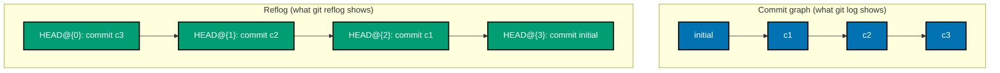

**`learning/code/ex-61-reflog-inspect/setup.sh`**

```bash
WORKDIR=$(mktemp -d) && cd "$WORKDIR"   # => fresh, empty scratch directory for this example
git -c init.defaultBranch=main init -q   # => -q suppresses the init banner -- only the highlighted output below matters
echo "base" > file.txt; git add file.txt; git commit -q -m "initial"   # => baseline commit this example builds on
echo "c1" >> file.txt; git commit -aq -m "c1"
echo "c2" >> file.txt; git commit -aq -m "c2"
echo "c3" >> file.txt; git commit -aq -m "c3"

git reflog                                            # => co-22: a LOCAL, per-repo log of every move HEAD
                                                 #    has made -- each entry is HEAD@{n} (n=0 is the most
                                                 #    recent), the hash it pointed to, and WHY it moved
                                                 #    ("commit", "checkout", "reset", ...) -- this exists
                                                 #    independently of the commit graph itself
```

**Output**:

```text
8c27e7c HEAD@{0}: commit: c3
acfe36e HEAD@{1}: commit: c2
b5f08fc HEAD@{2}: commit: c1
511ed07 HEAD@{3}: commit (initial): initial
```

**Key takeaway**: `git log` shows what the commit graph looks like NOW; `git reflog` shows every place
`HEAD` has ever pointed, including positions no branch reaches anymore.

**Why it matters**: the reflog is what makes Git's supposedly "destructive" operations (`reset
--hard`, amend, rebase) genuinely recoverable for a while afterward -- Example 62 shows the
recovery in action. Unlike the commit graph, the reflog is entirely local and per-repository --
cloning a repository or checking it out on another machine starts with an empty reflog, which is
why this specific safety net only ever protects the machine the mistake happened on.

---

### Example 62: Recover After a Hard Reset

_ex-62 &middot; exercises co-22, co-18_

`git reset --hard` makes commits unreachable from any branch, but the reflog remembers where `HEAD` sat
just before -- `reset --hard HEAD@{1}` restores them completely.

**`learning/code/ex-62-recover-after-hard-reset/setup.sh`**

```bash
WORKDIR=$(mktemp -d) && cd "$WORKDIR"   # => fresh, empty scratch directory for this example
git -c init.defaultBranch=main init -q   # => -q suppresses the init banner -- only the highlighted output below matters
echo "base" > file.txt; git add file.txt; git commit -q -m "initial"   # => baseline commit this example builds on
echo "c1" >> file.txt; git commit -aq -m "c1"
echo "c2" >> file.txt; git commit -aq -m "c2"
git log --oneline   # => confirm the resulting commit sequence

git reset --hard HEAD~2                                # => "loses" c1 and c2 -- no branch points at them
                                                 #    anymore, and `git log` can no longer see them at all
git log --oneline                                       # => only "initial" is visible now

git reflog                                              # => but the reflog remembers HEAD's PREVIOUS
                                                 #    position -- HEAD@{1} is exactly where HEAD sat one
                                                 #    move ago, right before this reset happened

git reset --hard 'HEAD@{1}'                             # => moves HEAD (and the branch, and the working
                                                 #    tree) BACK to that remembered position

git log --oneline                                        # => c1 and c2 are back -- nothing was ever
                                                 #    actually deleted, only unreachable for a moment
```

**Output**:

```text
e704c1e c2
edce045 c1
5809a21 initial
HEAD is now at 5809a21 initial
5809a21 initial
5809a21 HEAD@{0}: reset: moving to HEAD~2
e704c1e HEAD@{1}: commit: c2
edce045 HEAD@{2}: commit: c1
5809a21 HEAD@{3}: commit (initial): initial
HEAD is now at e704c1e c2
e704c1e c2
edce045 c1
5809a21 initial
```

**Key takeaway**: `reset --hard` never actually deletes a commit object -- it only stops any branch from
pointing at it; the object survives (subject to eventual garbage collection) until nothing, including the
reflog, references it anymore.

**Why it matters**: this is precisely why "I ran `reset --hard` on the wrong commit" is rarely a
genuine emergency -- the reflog is the safety net, and this recovery sequence is worth memorizing
outright. The reflog is not permanent, though -- entries eventually expire and unreferenced objects
are eventually garbage-collected, so this recovery window, while generous by default, is not
infinite; acting soon after a mistaken `--hard` reset is still the safer habit.

---

### Example 63: Recover a Deleted Branch

_ex-63 &middot; exercises co-22, co-11_

The reflog also remembers a deleted branch's last tip -- `git branch <name> <hash>` recreates it as a
brand-new pointer at exactly that commit.

**`learning/code/ex-63-recover-deleted-branch/setup.sh`**

```bash
WORKDIR=$(mktemp -d) && cd "$WORKDIR"   # => fresh, empty scratch directory for this example
git -c init.defaultBranch=main init -q   # => -q suppresses the init banner -- only the highlighted output below matters
echo "base" > file.txt; git add file.txt; git commit -q -m "initial"   # => baseline commit this example builds on
git switch -c doomed -q
echo "important work" > important.txt
git add important.txt; git commit -q -m "important work on doomed branch"
DOOMED_TIP=$(git rev-parse doomed)                       # => note the tip hash before deleting, exactly
                                                 #    what a reader would instead read back out of reflog
git switch main -q   # => back to main to continue the example from there

git branch -D doomed                                      # => -D (force delete) removes the branch pointer
                                                 #    EVEN THOUGH its commit was never merged into main --
                                                 #    the commit itself still exists as a Git object, just
                                                 #    unreachable from any branch now
git branch                                                 # => doomed is gone from the branch list

git reflog | head -5                                        # => "checkout: moving from doomed to main" and
                                                 #    the commit made on doomed are both still right there
git branch recovered "$DOOMED_TIP"                          # => co-11: create a NEW branch pointing straight
                                                 #    at the hash reflog (or `git log -g`) revealed

git branch                                                  # => "recovered" now exists
git log --oneline recovered                                 # => and its history includes "important work on
                                                 #    doomed branch" -- fully, genuinely recovered
```

**Output**:

```text
Deleted branch doomed (was aa0be75).
* main
5809a21 HEAD@{0}: checkout: moving from doomed to main
aa0be75 HEAD@{1}: commit: important work on doomed branch
5809a21 HEAD@{2}: checkout: moving from main to doomed
5809a21 HEAD@{3}: commit (initial): initial
* main
  recovered
aa0be75 important work on doomed branch
5809a21 initial
```

**Key takeaway**: recovering a deleted branch is just "look up its last known hash, then create a new
branch there" -- the branch NAME is what was deleted, never the commits themselves.

**Why it matters**: `git branch -D` (force delete, no merge check) is common on genuinely abandoned
branches, but this recovery path means even a mistaken force-delete is not permanent as long as it
is caught before garbage collection eventually cleans up truly unreferenced objects. This is the
same reflog safety net as Example 62, applied to a deleted ref instead of a moved one -- one
underlying mechanism covering both of Git's most commonly feared "destructive" mistakes.

---

### Example 64: Add a Remote

_ex-64 &middot; exercises co-23_

`git remote add` registers a named connection to another repository -- a plain local path here, but the
exact same mechanism as an `ssh://` or `https://` URL to a real hosted remote.

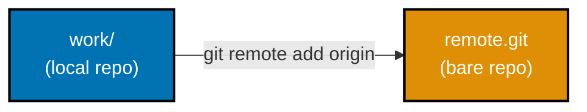

**`learning/code/ex-64-add-remote/setup.sh`**

```bash
ROOT=$(mktemp -d) && cd "$ROOT"   # => scratch root for this example's local "remote" + clone(s)
git init --bare -q remote.git                            # => a BARE repository -- no working tree, just
                                                 #    the .git database itself; the standard shape for
                                                 #    something meant to be pushed to and fetched from,
                                                 #    used here in place of a real network host

mkdir work && cd work   # => an ordinary (non-bare) local clone-shaped working repo
git -c init.defaultBranch=main init -q   # => -q suppresses the init banner -- only the highlighted output below matters
echo "base" > file.txt; git add file.txt; git commit -q -m "initial"   # => baseline commit this example builds on

git remote add origin ../remote.git                        # => "origin" is just a LOCAL nickname for that
                                                 #    other repository's location -- a plain path here,
                                                 #    but the exact same mechanism as an ssh:// or https:// URL

git remote -v                                                # => lists origin twice: once for fetch, once
                                                 #    for push -- they can even point at different URLs,
                                                 #    though here they are identical
```

**Output**:

```text
origin ../remote.git (fetch)
origin ../remote.git (push)
```

**Key takeaway**: a remote is just a named URL (or path) plus separate fetch and push entries -- "origin"
is a convention, not a keyword; any name works.

**Why it matters**: a bare repository (used here in place of a real GitHub host) is what every
hosted Git service actually stores on its own servers -- understanding it demystifies what "the
remote" really is. Every push, fetch, and clone example for the rest of this page reuses this same
bare-repository stand-in, so recognizing that a real GitHub or GitLab remote is fundamentally the
same shape (just reachable over a network) makes those hosted services feel far less like a black
box.

---

### Example 65: Clone a Repository

_ex-65 &middot; exercises co-01, co-23_

`git clone` starts from an existing repository instead of an empty one -- it copies the entire object
database and history, then checks out a working tree matching the source's default branch.

**`learning/code/ex-65-clone-repository/setup.sh`**

```bash
ROOT=$(mktemp -d) && cd "$ROOT"   # => scratch root for this example's local "remote" + clone(s)
mkdir source && cd source
git -c init.defaultBranch=main init -q   # => -q suppresses the init banner -- only the highlighted output below matters
echo "base" > file.txt; git add file.txt; git commit -q -m "initial"   # => baseline commit this example builds on
echo "more" >> file.txt; git commit -aq -m "second commit"   # => a new commit published after the first clone already exists
cd "$ROOT"   # => back to the scratch root to set up the next clone

git clone source dest                                       # => co-01/co-23: unlike `init`, clone starts
                                                 #    from an EXISTING repository -- it copies the whole
                                                 #    object database and history, then checks out a
                                                 #    working tree matching the source's default branch

test -d dest/.git && echo "dest/.git exists: TRUE"           # => a genuine, independent .git/ now exists
git -C dest log --oneline                                     # => -C runs the command AS IF cwd were dest
                                                 #    -- both source commits are present, full history,
                                                 #    not just the latest snapshot
```

**Output**:

```text
Cloning into 'dest'...
done.
dest/.git exists: TRUE
e8e0295 second commit
5809a21 initial
```

**Key takeaway**: `clone` = `init` + copy every object + set up a remote named `origin` pointing back at
the source + check out the default branch, all in one command.

**Why it matters**: this is how nearly every real-world Git workflow begins -- `git clone` against
a hosted URL, not `git init` in an empty folder, since most work happens on an existing shared
history. The remote-tracking setup a clone creates automatically (an `origin` remote plus
`origin/main`) is exactly what later examples like fetch (Example 68) and push (Example 66) rely on
already being in place, without any separate manual configuration step.

---

### Example 66: Push to a Remote

_ex-66 &middot; exercises co-23_

`git push origin main` uploads every commit `main` has that the remote lacks, then moves the remote's own
`main` ref to match.

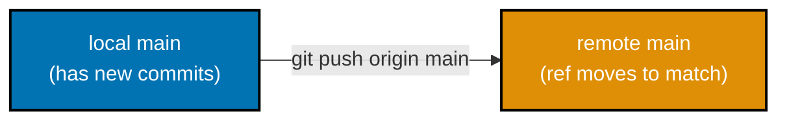

**`learning/code/ex-66-push-to-remote/setup.sh`**

```bash
ROOT=$(mktemp -d) && cd "$ROOT"   # => scratch root for this example's local "remote" + clone(s)
git init --bare -q remote.git   # => a BARE repository -- no working tree, stands in for a hosted remote
mkdir work && cd work   # => an ordinary (non-bare) local clone-shaped working repo
git -c init.defaultBranch=main init -q   # => -q suppresses the init banner -- only the highlighted output below matters
echo "base" > file.txt; git add file.txt; git commit -q -m "initial"   # => baseline commit this example builds on
git remote add origin ../remote.git   # => wire this local repo to the bare "remote" by path

git push origin main                                          # => co-23: uploads every commit main has
                                                 #    that the remote lacks, then moves the remote's own
                                                 #    "main" ref to match -- "[new branch]" because the
                                                 #    bare remote had no main ref at all before this push

git -C ../remote.git log --oneline                              # => the bare remote's OWN log now shows the
                                                 #    pushed commit -- proof the upload actually landed,
                                                 #    inspected directly on the "remote" side
```

**Output**:

```text
To ../remote.git
 * [new branch]      main -> main
5809a21 initial
```

**Key takeaway**: push is an upload of OBJECTS plus a ref update -- both halves matter; a push that
uploaded commits but somehow failed to move the remote ref would not be visible to anyone else cloning or
fetching from it.

**Why it matters**: this is the single command that turns purely local work into something a team
can actually collaborate on -- every other remote example on this page builds on this one
operation. A push failing for any reason -- network, permissions, or the non-fast-forward rejection
Example 71 demonstrates -- leaves both the local and remote repositories in a perfectly valid,
unambiguous state; there is no partial or corrupted push to worry about recovering from.

---

### Example 67: Set Upstream Tracking

_ex-67 &middot; exercises co-24_

`git push -u` does two things at once: pushes a branch's commits AND records that the local branch now
tracks the matching remote-tracking ref for future push/pull.

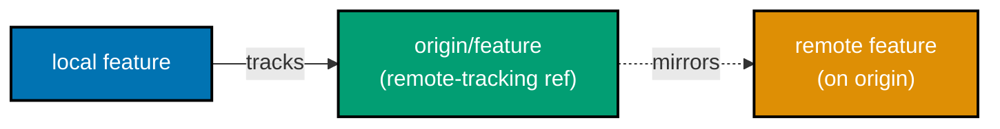

**`learning/code/ex-67-set-upstream-tracking/setup.sh`**

```bash
ROOT=$(mktemp -d) && cd "$ROOT"   # => scratch root for this example's local "remote" + clone(s)
git init --bare -q remote.git   # => a BARE repository -- no working tree, stands in for a hosted remote
mkdir work && cd work   # => an ordinary (non-bare) local clone-shaped working repo
git -c init.defaultBranch=main init -q   # => -q suppresses the init banner -- only the highlighted output below matters
echo "base" > file.txt; git add file.txt; git commit -q -m "initial"   # => baseline commit this example builds on
git remote add origin ../remote.git   # => wire this local repo to the bare "remote" by path
git push -q origin main   # => publish this example's baseline to the bare "remote"
git switch -c feature -q   # => a throwaway feature branch, scoped to this example only
echo "f1" >> file.txt; git commit -aq -m "feature work"

git push -u origin feature                                     # => -u (--set-upstream) does two things at
                                                 #    once: pushes feature's commit, AND records that
                                                 #    feature now TRACKS origin/feature for future push/pull

git branch -vv                                                  # => feature's line shows "[origin/feature]"
                                                 #    -- the tracking relationship co-24 describes, now
                                                 #    visible directly in the branch listing
```

**Output**:

```text
To ../remote.git
 * [new branch]      feature -> feature
branch 'feature' set up to track 'origin/feature'.
* feature 431fb08 [origin/feature] feature work
  main    1412ef2 initial
```

**Key takeaway**: a remote-tracking ref (`origin/feature`) is a local bookmark for "where I last saw
`feature` on `origin`" -- once tracking is set up, plain `git push`/`git pull` (no branch name needed)
know exactly where to go.

**Why it matters**: `-u` is normally only needed the FIRST time a new local branch is pushed --
every push after that reuses the tracking relationship this example establishes. Forgetting `-u` on
that first push is a common early-career stumble -- later plain `git push` commands fail with an
explicit "no upstream branch" error rather than silently doing the wrong thing, so the fix is
always just one `-u` push away.

---

### Example 68: Fetch Updates

_ex-68 &middot; exercises co-23, co-24_

`git fetch` downloads new commits and updates the remote-tracking ref (`origin/main`), but never touches
the local branch (`main`) or working tree at all.

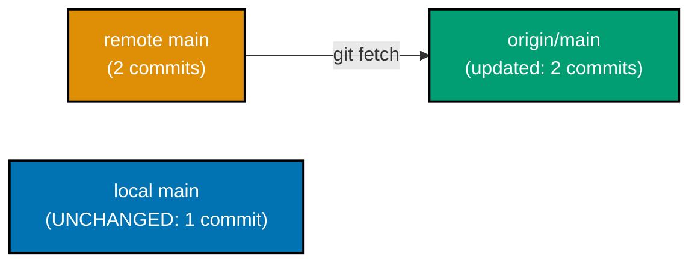

**`learning/code/ex-68-fetch-updates/setup.sh`**

```bash
ROOT=$(mktemp -d) && cd "$ROOT"   # => scratch root for this example's local "remote" + clone(s)
git init --bare -q remote.git   # => a BARE repository -- no working tree, stands in for a hosted remote
git clone -q remote.git ws1   # => the first workspace, simulating one developer's machine
cd ws1   # => the first workspace, simulating one developer's machine
echo "base" > file.txt; git add file.txt; git commit -q -m "initial"   # => baseline commit this example builds on
git push -q origin main   # => publish this example's baseline to the bare "remote"
cd "$ROOT"   # => back to the scratch root to set up the next clone
git clone -q remote.git ws2                                     # => a second, independent clone of the
                                                 #    same remote -- simulates a second developer's machine
cd ws1   # => the first workspace, simulating one developer's machine
echo "more" >> file.txt; git commit -aq -m "second commit"   # => a new commit published after the first clone already exists
git push -q origin main                                          # => ws1 publishes a new commit
cd ../ws2   # => switch to the second workspace, simulating a second developer

git fetch origin                                                  # => co-23/co-24: downloads the new commit
                                                 #    and updates origin/main -- but does NOT touch ws2's
                                                 #    own local main branch or its working tree at all

git log --oneline                                                  # => local main still shows just ONE
                                                 #    commit -- fetch alone never moves it
git log origin/main --oneline                                       # => the remote-tracking ref DID
                                                 #    advance -- it now shows both commits, one step ahead
```

**Output**:

```text
warning: You appear to have cloned an empty repository.
From /var/folders/fr/jg3jv_4d39b48cyqlqz18mgr0000gn/T/tmp.OBfCjChZJQ/remote
   5c484dc..2f40570  main       -> origin/main
5c484dc initial
2f40570 second commit
5c484dc initial
```

**Key takeaway**: `fetch` is deliberately non-destructive and non-intrusive -- it only updates Git's
knowledge of what the remote looks like, leaving every local decision (whether and how to integrate that
new knowledge) entirely to a separate, later step.

**Why it matters**: this separation is exactly what makes `fetch` safe to run at any time, as often
as desired -- it can never surprise a developer mid-edit the way `pull` (Examples 69-70) could.
Many developers run `git fetch` habitually at the start of every work session specifically because
of this guarantee -- it is the safe way to see whether `origin/main` has moved, without any risk of
disturbing whatever is currently checked out or in progress.

---

### Example 69: Pull with a Fast-Forward

_ex-69 &middot; exercises co-23, co-12_

`git pull` is `fetch` plus an integration step -- when the local branch has not diverged, that
integration is a plain fast-forward, the same mechanism Example 36 already demonstrated.

**`learning/code/ex-69-pull-fast-forward/setup.sh`**

```bash
ROOT=$(mktemp -d) && cd "$ROOT"   # => scratch root for this example's local "remote" + clone(s)
git init --bare -q remote.git   # => a BARE repository -- no working tree, stands in for a hosted remote
git clone -q remote.git ws1   # => the first workspace, simulating one developer's machine
cd ws1   # => the first workspace, simulating one developer's machine
echo "base" > file.txt; git add file.txt; git commit -q -m "initial"   # => baseline commit this example builds on
git push -q origin main   # => publish this example's baseline to the bare "remote"
cd "$ROOT"   # => back to the scratch root to set up the next clone
git clone -q remote.git ws2   # => a second, independent clone of the same remote
cd ws1   # => the first workspace, simulating one developer's machine
echo "more" >> file.txt; git commit -aq -m "second commit"   # => a new commit published after the first clone already exists
git push -q origin main   # => publish this example's baseline to the bare "remote"
cd ../ws2   # => switch to the second workspace, simulating a second developer

git pull                                                            # => co-23: `pull` is `fetch` PLUS an
                                                 #    integration step -- here the local main has not
                                                 #    diverged, so that integration is a plain fast-forward
                                                 #    (co-12), the same mechanism ex-36 already demonstrated

git log --oneline                                                    # => local main now shows BOTH commits
                                                 #    -- unlike plain fetch (ex-68), pull moved main itself
```

**Output**:

```text
warning: You appear to have cloned an empty repository.
From /var/folders/fr/jg3jv_4d39b48cyqlqz18mgr0000gn/T/tmp.4rLcWpHo2R/remote
   057607c..4262b36  main       -> origin/main
Updating 057607c..4262b36
Fast-forward
 file.txt | 1 +
 1 file changed, 1 insertion(+)
4262b36 second commit
057607c initial
```

**Key takeaway**: `git pull` = `git fetch` + `git merge origin/<branch>` by default -- when there is
nothing to reconcile, that merge step degrades to a fast-forward, indistinguishable in effect from
Example 36.

**Why it matters**: recognizing `pull` as two composed steps (not one atomic magic command) is what
makes its behavior predictable -- the exact same fetch, followed by whichever integration strategy
is configured or requested. This composition is also exactly why `git pull` can sometimes surprise
a developer with an unexpected merge commit -- the fetch half always behaves identically, but the
integration half depends entirely on local configuration and whether the branches have actually
diverged.

---

### Example 70: Pull with Rebase

_ex-70 &middot; exercises co-24, co-15_

`git pull --rebase` fetches the remote's new commits, then replays local-only commits on top of them
instead of merging -- keeping history linear even when both sides diverged.

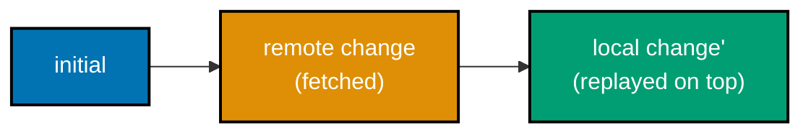

**`learning/code/ex-70-pull-rebase/setup.sh`**

```bash
ROOT=$(mktemp -d) && cd "$ROOT"   # => scratch root for this example's local "remote" + clone(s)
git init --bare -q remote.git   # => a BARE repository -- no working tree, stands in for a hosted remote
git clone -q remote.git ws1   # => the first workspace, simulating one developer's machine
cd ws1   # => the first workspace, simulating one developer's machine
echo "base" > shared.txt; git add shared.txt; git commit -q -m "initial"   # => baseline commit both branches will independently diverge from
git push -q origin main   # => publish this example's baseline to the bare "remote"
cd "$ROOT"   # => back to the scratch root to set up the next clone
git clone -q remote.git ws2   # => a second, independent clone of the same remote
cd ws2   # => the second workspace, simulating a second developer's machine
echo "local-only" > local.txt; git add local.txt; git commit -q -m "local change (own file)"
                                                 # => ws2 now has ONE commit main lacks -- it has diverged
cd ../ws1   # => back to the first workspace
echo "remote-only" > remote.txt; git add remote.txt; git commit -q -m "remote change (own file)"
git push -q origin main                                              # => and origin/main ALSO advanced --
                                                 #    a genuine divergence, both sides moved independently
cd ../ws2   # => switch to the second workspace, simulating a second developer

git pull --rebase                                                     # => co-24/co-15: fetches origin's new
                                                 #    commit, then REPLAYS ws2's own local commit on top of
                                                 #    it -- unlike a plain `pull`, this never creates a
                                                 #    merge commit, keeping history linear

git log --oneline --graph                                              # => a straight line: the fetched
                                                 #    "remote change" commit, then the replayed "local
                                                 #    change" on top -- no fork shape anywhere
```

**Output**:

```text
warning: You appear to have cloned an empty repository.
From /var/folders/fr/jg3jv_4d39b48cyqlqz18mgr0000gn/T/tmp.UhqEcAXykM/remote
   11cb87a..d472475  main       -> origin/main
Successfully rebased and updated refs/heads/main.
* ee0a9a5 local change (own file)
* d472475 remote change (own file)
* 11cb87a initial
```

**Key takeaway**: `pull --rebase` swaps out `pull`'s default merge integration step for a rebase --
same fetch, different reconciliation, and the resulting shape matches Example 43's rebase exactly.

**Why it matters**: teams that enforce linear history often set `pull.rebase=true` so this becomes
the DEFAULT `pull` behavior -- worth recognizing as a configured convention, not a special one-off
command. A `pull --rebase` can hit a conflict exactly the same way a plain `git rebase` can
(Example 44), which is why teams adopting this default should also expect their developers to be
comfortable resolving rebase conflicts as a routine, not exceptional, occurrence.

---

### Example 71: Push Rejected (Non-Fast-Forward)

_ex-71 &middot; exercises co-23_

Pushing a branch whose local tip is behind the remote's is REJECTED, not silently overwritten -- Git
refuses to let a push accidentally discard someone else's already-published commit.

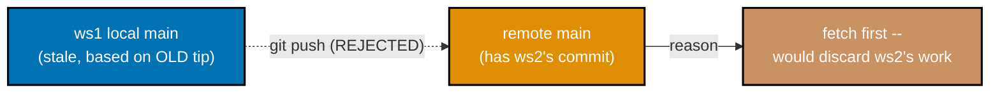

**`learning/code/ex-71-push-rejected-non-fast-forward/setup.sh`**

```bash
ROOT=$(mktemp -d) && cd "$ROOT"   # => scratch root for this example's local "remote" + clone(s)
git init --bare -q remote.git   # => a BARE repository -- no working tree, stands in for a hosted remote
git clone -q remote.git ws1   # => the first workspace, simulating one developer's machine
cd ws1   # => the first workspace, simulating one developer's machine
echo "base" > file.txt; git add file.txt; git commit -q -m "initial"   # => baseline commit this example builds on
git push -q origin main   # => publish this example's baseline to the bare "remote"
cd "$ROOT"   # => back to the scratch root to set up the next clone
git clone -q remote.git ws2                                          # => ws2 clones BEFORE ws1's next push
cd ws2   # => the second workspace, simulating a second developer's machine
echo "d-change" > d.txt; git add d.txt; git commit -q -m "ws2 change"
git push -q origin main                                               # => ws2 publishes first, advancing
                                                 #    origin/main ahead of what ws1 still has locally
cd ../ws1   # => back to the first workspace
echo "c-change" > c.txt; git add c.txt; git commit -q -m "ws1 change (based on the stale tip)"

git push origin main || true                                            # => co-23: ws1's local main does
                                                 #    NOT contain ws2's commit -- pushing it would silently
                                                 #    throw that commit away, so Git REJECTS the push
                                                 #    instead ("fetch first" / non-fast-forward)
```

**Output**:

```text
warning: You appear to have cloned an empty repository.
To /var/folders/fr/jg3jv_4d39b48cyqlqz18mgr0000gn/T/tmp.ViwAutGld0/remote.git
 ! [rejected]        main -> main (fetch first)
error: failed to push some refs to '/var/folders/fr/jg3jv_4d39b48cyqlqz18mgr0000gn/T/tmp.ViwAutGld0/remote.git'
hint: Updates were rejected because the remote contains work that you do
hint: not have locally. This is usually caused by another repository pushing
hint: to the same ref. You may want to first integrate the remote changes
hint: (e.g., 'git pull ...') before pushing again.
hint: See the 'Note about fast-forwards' in 'git push --help' for details.
```

**Key takeaway**: a plain `git push` is itself fast-forward-only, mirroring `git merge`'s default -- the
rejection here is the exact same safety principle from Example 36, applied to the remote instead of a
local branch.

**Why it matters**: this rejection is a feature, not a bug -- it is the moment Git protects the
team from one developer's stale push silently erasing another's already-shared work; the fix is to
`git pull` (or `fetch` + rebase/merge) before pushing again. `git push --force` would override this
protection entirely, which is exactly why it is reserved for rare, deliberate cases on a personal
branch -- never the default reflex for resolving an ordinary rejected push.

---

### Example 72: Check Out a Remote-Tracking Branch

_ex-72 &middot; exercises co-24_

Switching to a branch name that exists only on the remote automatically creates a local tracking branch
from it -- no explicit `git branch` step required.

**`learning/code/ex-72-checkout-remote-tracking-branch/setup.sh`**

```bash
ROOT=$(mktemp -d) && cd "$ROOT"   # => scratch root for this example's local "remote" + clone(s)
git init --bare -q remote.git   # => a BARE repository -- no working tree, stands in for a hosted remote
git clone -q remote.git ws1   # => the first workspace, simulating one developer's machine
cd ws1   # => the first workspace, simulating one developer's machine
echo "base" > file.txt; git add file.txt; git commit -q -m "initial"   # => baseline commit this example builds on
git push -q origin main   # => publish this example's baseline to the bare "remote"
git switch -c reports -q
echo "report" > report.txt; git add report.txt; git commit -q -m "add report"
git push -qu origin reports                                              # => "reports" now exists on the
                                                 #    remote, but only ws1 has ever checked it out locally
cd "$ROOT"   # => back to the scratch root to set up the next clone
git clone -q remote.git ws2                                                # => ws2 sees origin/reports as a
                                                 #    remote-tracking ref, but has no LOCAL reports branch
cd ws2   # => the second workspace, simulating a second developer's machine

git switch reports                                                          # => co-24: no local branch named
                                                 #    "reports" exists yet -- Git recognizes the UNIQUE match
                                                 #    against origin/reports and creates a local tracking
                                                 #    branch from it automatically, in one command

git branch -vv                                                              # => reports now appears locally,
                                                 #    already wired to "[origin/reports]"
```

**Output**:

```text
warning: You appear to have cloned an empty repository.
Switched to a new branch 'reports'
branch 'reports' set up to track 'origin/reports'.
  main    c9fdbe1 [origin/main] initial
* reports b6976bc [origin/reports] add report
```

**Key takeaway**: this auto-creation shortcut only fires when the branch name UNIQUELY matches exactly
one remote-tracking ref -- ambiguity (the same short name on two different remotes) falls back to
requiring an explicit `-c` and `--track`.

**Why it matters**: this is the everyday, zero-friction way to start working on a teammate's
already- pushed branch -- `git switch <name>` alone, with no separate `git branch` or `--track`
flag needed. This convenience only works because the name uniquely resolves to exactly one
remote-tracking ref -- with more than one remote configured, the same shortcut requires spelling
out which remote's branch is intended, since Git can no longer guess unambiguously.

---

### Example 73: Create an Annotated Tag

_ex-73 &middot; exercises co-25_

`git tag -a` creates a genuine tag OBJECT -- unlike a lightweight tag (Example 28), it stores its own
message, tagger name/email, and timestamp, separately from the commit it points at.

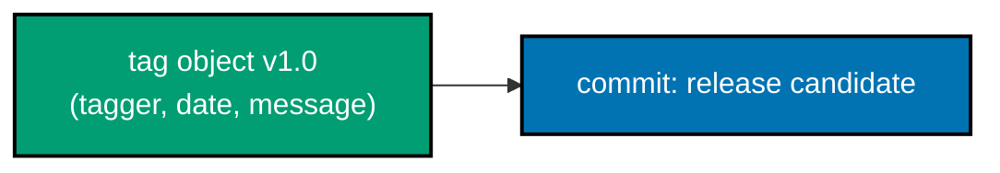

**`learning/code/ex-73-annotated-tag/setup.sh`**

```bash
WORKDIR=$(mktemp -d) && cd "$WORKDIR"   # => fresh, empty scratch directory for this example
git -c init.defaultBranch=main init -q   # => -q suppresses the init banner -- only the highlighted output below matters
echo "base" > file.txt; git add file.txt; git commit -q -m "release candidate"   # => baseline commit this example tags/releases

git tag -a v1.0 -m "release"                             # => -a (annotated) creates a genuine TAG OBJECT
                                                 #    -- unlike a lightweight tag (ex-28), this stores its
                                                 #    own message, tagger name/email, and timestamp,
                                                 #    separately from the commit it points at

git cat-file -t v1.0                                       # => "tag" -- a distinct object TYPE from
                                                 #    "commit", proving this is not just a plain ref
git show v1.0                                                # => shows the tag object's own header
                                                 #    ("Tagger:", "Date:", the -m message) FIRST, then falls
                                                 #    through to the commit it points at underneath
```

**Output**:

```text
tag
tag v1.0
Tagger: Dev <dev@example.com>
Date:   Tue Jul 14 12:35:45 2026 +0700

release

commit b18e6d84ce536b648913fea3cf1ac2444acfeb8c
Author: Dev <dev@example.com>
Date:   Tue Jul 14 12:35:45 2026 +0700

    release candidate

diff --git a/file.txt b/file.txt
new file mode 100644
index 0000000..df967b9
--- /dev/null
+++ b/file.txt
@@ -0,0 +1 @@
+base
```

**Key takeaway**: an annotated tag is Git's fourth object type -- distinct from blob, tree, and commit --
carrying its own metadata, which is exactly why `git cat-file -t` reports "tag", not "commit".

**Why it matters**: release tooling (changelogs, `git describe`, signed releases via `-s`)
generally expects annotated tags specifically, because a lightweight tag has no tagger or message
field for that tooling to read. Defaulting to annotated tags for anything meant to be shared or
referenced later -- and reserving lightweight tags (Example 28) for quick, personal, throwaway
markers -- is a habit worth adopting early, since switching an existing lightweight tag to
annotated later requires recreating it entirely.

---

### Example 74: Push Tags to a Remote

_ex-74 &middot; exercises co-25, co-23_

Tags, like commits, start out purely local -- a plain `git push` never uploads them; `git push --tags`
uploads every local tag the remote lacks in one dedicated call.

**`learning/code/ex-74-push-tags/setup.sh`**

```bash
ROOT=$(mktemp -d) && cd "$ROOT"   # => scratch root for this example's local "remote" + clone(s)
git init --bare -q remote.git   # => a BARE repository -- no working tree, stands in for a hosted remote
mkdir work && cd work   # => an ordinary (non-bare) local clone-shaped working repo
git -c init.defaultBranch=main init -q   # => -q suppresses the init banner -- only the highlighted output below matters
echo "base" > file.txt; git add file.txt; git commit -q -m "release candidate"   # => baseline commit this example tags/releases
git remote add origin ../remote.git   # => wire this local repo to the bare "remote" by path
git push -q origin main   # => publish this example's baseline to the bare "remote"
git tag -a v1.0 -m "release"                                # => tags, like commits, start out purely LOCAL
                                                 #    -- a plain `git push` never uploads them by itself

git push origin --tags                                        # => co-23/co-25: uploads every tag this repo
                                                 #    has that the remote lacks, in a single dedicated call

git -C ../remote.git tag                                       # => v1.0 now genuinely exists on the "remote"
                                                 #    side too, inspected directly on the bare repository
```

**Output**:

```text
To ../remote.git
 * [new tag]         v1.0 -> v1.0
v1.0
```

**Key takeaway**: pushing commits and pushing tags are two independent acts -- forgetting `--tags` after
tagging a release is a common, easy-to-miss gap between "tagged locally" and "released, visibly, to the
team".

**Why it matters**: release automation almost always depends on tags existing on the remote (CI
pipelines that trigger off a pushed tag, for instance) -- this is the step that makes a local tag
actually useful to anyone else. A commonly configured alternative is `git push --follow-tags`,
which automatically includes any annotated tags reachable from the commits being pushed, removing
the need to remember a separate `--tags` push every time a release is cut.

---

### Example 75: Cherry-Pick a Commit

_ex-75 &middot; exercises co-29_

`git cherry-pick` applies one specific commit's change onto another branch -- the result is a new commit
with a different hash, but the same author, message, and content change.

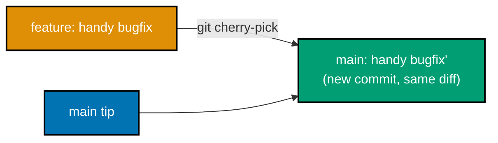

**`learning/code/ex-75-cherry-pick-commit/setup.sh`**

```bash
WORKDIR=$(mktemp -d) && cd "$WORKDIR"   # => fresh, empty scratch directory for this example
git -c init.defaultBranch=main init -q   # => -q suppresses the init banner -- only the highlighted output below matters
echo "base" > shared.txt; git add shared.txt; git commit -q -m "initial"   # => baseline commit both branches will independently diverge from
git switch -c feature -q   # => a throwaway feature branch, scoped to this example only
echo "handy fix" > fix.txt; git add fix.txt; git commit -q -m "handy bugfix"
FIX_HASH=$(git rev-parse HEAD)                             # => the ONE commit worth taking, without
                                                 #    wanting the rest of feature's (imagined) history
git switch main -q   # => back to main to continue the example from there

git cherry-pick "$FIX_HASH"                                  # => co-29: replays JUST that commit's diff
                                                 #    onto main -- the result is a NEW commit, with a
                                                 #    different hash than the original, though the same
                                                 #    author, message, and content change

git log --oneline                                              # => "handy bugfix" now appears on main too
git show --stat HEAD                                             # => and its tree genuinely contains
                                                 #    fix.txt -- a real, independent commit, not a merge
```

**Output**:

```text
[main 84dd260] handy bugfix
 Date: Tue Jul 14 12:35:45 2026 +0700
 1 file changed, 1 insertion(+)
 create mode 100644 fix.txt
84dd260 handy bugfix
7c06248 initial
commit 84dd260c838174241bbe1152d2daf7bdab8477da
Author: Dev <dev@example.com>
Date:   Tue Jul 14 12:35:45 2026 +0700

    handy bugfix

 fix.txt | 1 +
 1 file changed, 1 insertion(+)
```

**Key takeaway**: cherry-pick is a single-commit rebase -- it replays exactly one commit's diff onto a
different parent, the same replay mechanism rebase uses for a whole series at once.

**Why it matters**: this is the tool for "I need JUST this one bugfix on the release branch,
without the rest of the feature branch it happened to be committed on" -- a targeted, one-commit
backport. Because the resulting commit has a new hash, cherry-picking the same change onto two
different branches produces two genuinely separate commits with identical content -- worth
remembering when later trying to trace exactly which branches have received a particular fix.

---

### Example 76: Resolve a Cherry-Pick Conflict

_ex-76 &middot; exercises co-29, co-14_

A cherry-pick conflict pauses mid-replay exactly like a merge or rebase conflict -- resolving it and
running `git cherry-pick --continue` finishes applying the commit.

**`learning/code/ex-76-cherry-pick-conflict/setup.sh`**

```bash
WORKDIR=$(mktemp -d) && cd "$WORKDIR"   # => fresh, empty scratch directory for this example
git -c init.defaultBranch=main init -q   # => -q suppresses the init banner -- only the highlighted output below matters
echo "line" > file.txt; git add file.txt; git commit -q -m "initial"
git switch -c feature -q   # => a throwaway feature branch, scoped to this example only
echo "feature edit" > file.txt; git commit -aq -m "feature edits line"   # => feature rewrites the shared line -- sets up this example's scenario
FIX_HASH=$(git rev-parse HEAD)
git switch main -q   # => back to main to continue the example from there
echo "main edit" > file.txt; git commit -aq -m "main edits line first"    # => main independently rewrote
                                                 #    the SAME line cherry-pick is about to touch

git cherry-pick "$FIX_HASH" || true                                        # => the replay conflicts, exactly
                                                 #    like a merge or rebase conflict would (co-14)
git status                                                                   # => "currently cherry-picking"

echo "resolved: combined edit" > file.txt                                    # => the human resolution
git add file.txt   # => stage the edit above
git cherry-pick --continue --no-edit                                          # => finishes applying the
                                                 #    cherry-picked commit now that the conflict is resolved

git log --oneline                                                              # => the cherry-picked change
                                                 #    lands as a real commit on main, conflict and all
```

**Output**:

```text
Auto-merging file.txt
CONFLICT (content): Merge conflict in file.txt
error: could not apply 3695364... feature edits line
On branch main
You are currently cherry-picking commit 3695364.
  (fix conflicts and run "git cherry-pick --continue")
  (use "git cherry-pick --skip" to skip this patch)
  (use "git cherry-pick --abort" to cancel the cherry-pick operation)

Unmerged paths:
 both modified:   file.txt

no changes added to commit (use "git add" and/or "git commit -a")
[main 10df869] feature edits line
10df869 feature edits line
8ea431e main edits line first
05ce7cf initial
```

**Key takeaway**: cherry-pick conflicts use the exact same conflict-marker-and-resolve workflow as merge
(Example 40) and rebase (Example 44) conflicts -- one consistent mechanic across all three replay
operations.

**Why it matters**: recognizing this as "the same conflict resolution loop, again" (rather than a
special, unfamiliar case) is what makes cherry-pick conflicts feel routine instead of surprising.
By this point in the topic -- merge (Example 40), rebase (Example 44), and now cherry-pick -- the
pattern should feel entirely familiar: markers appear, a human decides the resolved content, `add`
stages it, and a continue command finishes the operation.

---

### Example 77: Install a Pre-Commit Hook

_ex-77 &middot; exercises co-27_

A `.git/hooks/pre-commit` script that exits non-zero blocks a commit outright -- Git runs it BEFORE
creating the commit object, and aborts entirely if the hook refuses.

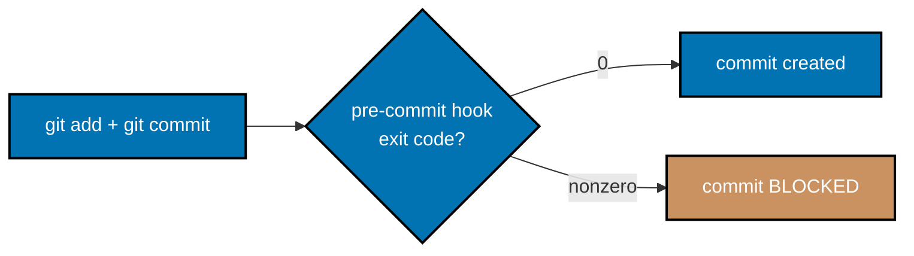

**`learning/code/ex-77-install-pre-commit-hook/setup.sh`**

```bash
WORKDIR=$(mktemp -d) && cd "$WORKDIR"   # => fresh, empty scratch directory for this example
git -c init.defaultBranch=main init -q   # => -q suppresses the init banner -- only the highlighted output below matters
echo "base" > notes.txt; git add notes.txt; git commit -q -m "initial notes"   # => baseline commit the hook will guard future commits on top of

cat > .git/hooks/pre-commit <<'HOOK'          # => write the hook script's SOURCE to this exact path
#!/bin/sh                                     # => a plain POSIX shell script -- no special hook syntax
# pre-commit: block any commit whose staged diff introduces a TODO marker
if git diff --cached | grep -q "TODO"; then   # => inspect exactly what THIS commit is about to stage
  echo "pre-commit: staged changes contain a TODO marker -- commit blocked"
  exit 1                                      # => nonzero exit -- this is what actually blocks the commit
fi
exit 0                                        # => zero exit -- lets the commit through unmodified
HOOK
chmod +x .git/hooks/pre-commit                              # => co-27: hooks live in .git/hooks/, are
                                                 #    plain executable scripts, and run automatically at
                                                 #    the lifecycle point their filename names -- no
                                                 #    plugin system, no config file, just an executable

echo "TODO: fix this later" >> notes.txt   # => a staged diff that WILL trip the hook's grep
git add notes.txt   # => stage it -- the hook inspects staged content, not the working tree

git commit -m "add a todo" || true                            # => Git runs pre-commit BEFORE creating the
                                                 #    commit object -- the hook's grep finds "TODO", exits
                                                 #    1, and Git aborts the commit entirely

git log --oneline                                                # => still only ONE commit -- the blocked
                                                 #    attempt never became history at all
```

**Output**:

```text
pre-commit: staged changes contain a TODO marker -- commit blocked
62ceb76 initial notes
```

**Key takeaway**: a hook is nothing more than an executable file at a well-known path -- no framework, no
configuration format, just a script and an exit code Git checks.

**Why it matters**: this is the mechanism behind every local lint-before-commit,
format-before-commit, or commit-message-format-check tool -- understanding the raw mechanism
demystifies what tools like Husky (used elsewhere in this monorepo) are actually doing underneath.
Because hooks live inside `.git/hooks/` and are not copied by `git clone`, a team relying on a
shared hook typically installs it through a dedicated tool or a setup script rather than assuming
every teammate's local repository has it configured automatically.

---

### Example 78: The Same Hook Allows a Clean Commit

_ex-78 &middot; exercises co-27_

The identical hook exits 0 when its check finds nothing to object to, letting a clean commit through
exactly as if no hook were installed at all.

**`learning/code/ex-78-hook-allows-clean-commit/setup.sh`**

```bash
WORKDIR=$(mktemp -d) && cd "$WORKDIR"   # => fresh, empty scratch directory for this example
git -c init.defaultBranch=main init -q   # => -q suppresses the init banner -- only the highlighted output below matters
echo "base" > notes.txt; git add notes.txt; git commit -q -m "initial notes"   # => baseline commit the hook will guard future commits on top of
cat > .git/hooks/pre-commit <<'HOOK'          # => the identical hook script as Example 77
#!/bin/sh                                     # => same plain POSIX shell script, no changes at all
if git diff --cached | grep -q "TODO"; then   # => this time, the staged diff genuinely has no match
  echo "pre-commit: staged changes contain a TODO marker -- commit blocked"
  exit 1
fi
exit 0                                        # => reached this time -- lets the commit through
HOOK
chmod +x .git/hooks/pre-commit   # => must be re-installed identically in this fresh scratch repo

echo "finished notes, no markers" >> notes.txt                # => this staged diff contains no "TODO"
git add notes.txt   # => stage the clean edit

git commit -m "add finished notes"                              # => co-27: the hook's grep finds nothing,
                                                 #    exits 0, and Git proceeds to create the commit
                                                 #    exactly as if no hook were installed at all

git log --oneline                                                 # => TWO commits now -- the clean one
                                                 #    genuinely landed, unlike ex-77's blocked attempt
```

**Output**:

```text
[main 628b876] add finished notes
 1 file changed, 1 insertion(+)
628b876 add finished notes
67c4a11 initial notes
```

**Key takeaway**: a well-written hook is invisible on the happy path -- it only interrupts the workflow
when its specific condition is actually met, never adding friction to an already-clean commit.

**Why it matters**: this contrast (Example 77 blocks, Example 78 passes, same hook script) is
exactly the behavior the capstone's own pre-commit hook will be proven against, end to end. A hook
that is loud and disruptive on every single commit, clean or not, quickly gets disabled or ignored
by frustrated developers -- staying silent on the happy path, as demonstrated here, is what keeps a
hook trusted and left enabled long-term.

---

### Example 79: A Pull-Request Branch Flow

_ex-79 &middot; exercises co-28, co-13_

A feature branch, published to a shared remote, then landed on trunk through a `--no-ff` merge -- exactly
what a hosted pull-request review's own "merge" button does underneath.

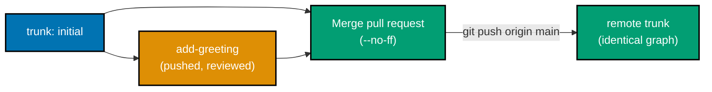

**`learning/code/ex-79-pr-branch-flow/setup.sh`**

```bash
ROOT=$(mktemp -d) && cd "$ROOT"   # => scratch root for this example's local "remote" + clone(s)
git init --bare -q remote.git                                # => stands in for the shared, hosted remote
                                                 #    a real pull-request review would target
mkdir work && cd work   # => an ordinary (non-bare) local clone-shaped working repo
git -c init.defaultBranch=main init -q   # => -q suppresses the init banner -- only the highlighted output below matters
echo "base" > file.txt; git add file.txt; git commit -q -m "initial"   # => baseline commit this example builds on
git remote add origin ../remote.git   # => wire this local repo to the bare "remote" by path
git push -q origin main   # => publish this example's baseline to the bare "remote"

git switch -c add-greeting -q                                  # => co-28: a SHORT-LIVED branch for one
                                                 #    reviewable change, never meant to live very long
echo "hello" > greeting.txt
git add greeting.txt; git commit -q -m "add greeting file"
git push -qu origin add-greeting                                 # => published for review, exactly what a
                                                 #    hosted pull request would be opened against

git switch main -q   # => back to main to continue the example from there
git merge --no-ff add-greeting -m "Merge pull request: add greeting file"  # => co-13: the "merge" button a
                                                 #    PR review UI clicks is, underneath, exactly this --
                                                 #    a --no-ff merge that preserves the branch's shape
git push -q origin main   # => publish this example's baseline to the bare "remote"

git log --oneline --graph                                          # => local trunk shows the merge commit
git -C ../remote.git log --oneline --graph                            # => and the shared remote's trunk
                                                 #    shows the IDENTICAL graph -- the change genuinely landed
```

**Output**:

```text
Merge made by the 'ort' strategy.
 greeting.txt | 1 +
 1 file changed, 1 insertion(+)
 create mode 100644 greeting.txt
*   e8d7dbf Merge pull request: add greeting file
|\
| * b6db666 add greeting file
|/
* 6f2ec24 initial
*   e8d7dbf Merge pull request: add greeting file
|\
| * b6db666 add greeting file
|/
* 6f2ec24 initial
```

**Key takeaway**: a hosted PR review UI adds review, discussion, and CI gating around this flow, but the
underlying Git mechanics -- push a branch, then `--no-ff` merge it into trunk -- are exactly the commands
run here directly.

**Why it matters**: understanding the PR flow as "just Git commands with a review UI layered on
top" demystifies what actually happens when a PR is merged, and explains why the resulting graph
always shows the fork-and-rejoin shape from Example 37. Recognizing this also clarifies what a
"squash and merge" button does differently -- it substitutes Example 46's interactive-rebase squash
for the plain `--no-ff` merge shown here, trading the visible fork shape for a single flattened
commit instead.

---

### Example 80: A Trunk-Based Short-Lived Branch

_ex-80 &middot; exercises co-28, co-12, co-11_

Trunk-based development favors branches this short: one commit, fast-forwarded straight into `main`
almost immediately, then deleted -- never accumulating drift from trunk.

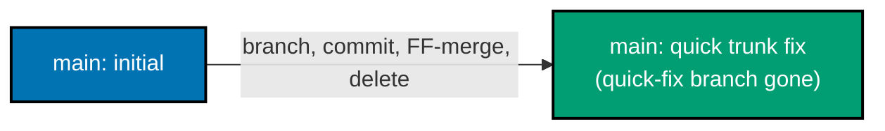

**`learning/code/ex-80-trunk-based-short-branch/setup.sh`**

```bash
WORKDIR=$(mktemp -d) && cd "$WORKDIR"   # => fresh, empty scratch directory for this example
git -c init.defaultBranch=main init -q   # => -q suppresses the init banner -- only the highlighted output below matters
echo "base" > file.txt; git add file.txt; git commit -q -m "initial"   # => baseline commit this example builds on

git switch -c quick-fix -q                                       # => co-28: trunk-based development favors
                                                 #    branches this short-lived -- one commit, integrated
                                                 #    almost immediately, never accumulating drift from main
echo "fixed" > fix.txt; git add fix.txt; git commit -q -m "quick trunk fix"
git switch main -q   # => back to main to continue the example from there

git merge quick-fix                                                 # => co-12: main never moved while
                                                 #    quick-fix existed, so this is a plain fast-forward --
                                                 #    no merge commit needed for such a short-lived branch
git branch -d quick-fix                                                # => co-11: once merged, the branch
                                                 #    pointer itself has served its purpose and is deleted

git log --oneline                                                        # => main advanced to include the fix
git branch                                                                 # => quick-fix is gone -- only
                                                 #    main remains, exactly what trunk-based flow favors
```

**Output**:

```text
Updating 6f2ec24..5419b76
Fast-forward
 fix.txt | 1 +
 1 file changed, 1 insertion(+)
 create mode 100644 fix.txt
Deleted branch quick-fix (was 5419b76).
5419b76 quick trunk fix
6f2ec24 initial
* main
```

**Key takeaway**: this whole example combines three concepts already seen individually -- short-lived
branching (co-11), fast-forward merging (co-12), and post-merge cleanup (co-11 again) -- into the single,
minimal-friction loop trunk-based development is built on.

**Why it matters**: contrasting this example directly against Example 79's PR flow highlights the
real tradeoff: PR flow favors review-before-merge and a visible fork shape; trunk-based flow favors
speed and a nearly linear history, at the cost of less formal per-change review. Teams practicing
trunk-based development typically compensate for the lighter per-branch review with other
safeguards -- feature flags, small commit sizes, and fast CI -- rather than dropping review
altogether.

---

### Example 81: Revert a Merge Commit

_ex-81 &middot; exercises co-19, co-13_

A merge commit has two parents, so `git revert` alone cannot infer which side is "the" original --
`-m 1` says "treat parent 1 as the mainline", undoing only the merged-in branch's contribution.

**`learning/code/ex-81-revert-a-merge/setup.sh`**

```bash
WORKDIR=$(mktemp -d) && cd "$WORKDIR"   # => fresh, empty scratch directory for this example
git -c init.defaultBranch=main init -q   # => -q suppresses the init banner -- only the highlighted output below matters
echo "base" > file.txt; git add file.txt; git commit -q -m "initial"   # => baseline commit this example builds on
git switch -c feature -q   # => a throwaway feature branch, scoped to this example only
echo "feature line" >> file.txt; git commit -aq -m "feature change"
git switch main -q   # => back to main to continue the example from there
git merge --no-ff feature -m "Merge branch 'feature'"           # => co-13: a real merge commit, two parents
MERGE_HASH=$(git rev-parse HEAD)
git log --oneline --graph

git revert -m 1 --no-edit "$MERGE_HASH"                            # => co-19: a merge commit has TWO
                                                 #    parents, so revert alone cannot infer which side is
                                                 #    "the" original -- -m 1 says "treat parent 1 (main) as
                                                 #    the mainline", undoing feature's contribution only

git log --oneline --graph                                            # => the revert lands as a NEW commit
                                                 #    on top -- the merge commit and feature's own commit
                                                 #    both remain, visible in history, exactly like ex-55
cat file.txt                                                          # => back to just "base" -- the net
                                                 #    content change is undone, additively
```

**Output**:

```text
Merge made by the 'ort' strategy.
 file.txt | 1 +
 1 file changed, 1 insertion(+)
*   d8ec948 Merge branch 'feature'
|\
| * 3a379c8 feature change
|/
* 50d1092 initial
[main 48d39cb] Revert "Merge branch 'feature'"
 Date: Tue Jul 14 12:35:48 2026 +0700
 1 file changed, 1 deletion(-)
* 48d39cb Revert "Merge branch 'feature'"
*   d8ec948 Merge branch 'feature'
|\
| * 3a379c8 feature change
|/
* 50d1092 initial
base
```

**Key takeaway**: `-m 1` (or `-m 2`) is not optional guesswork -- it is the required, explicit answer to
"which parent counts as the baseline" that only a two-parent commit ever needs.

**Why it matters**: reverting a whole feature (rather than just its final state) after it has
already merged is a real, occasionally necessary operation -- and getting the mainline parent
number wrong reverts the OPPOSITE side of the merge, so understanding this distinction matters in
practice. Running `git log --graph` immediately before choosing `-m 1` or `-m 2` (as this example
does) is the reliable way to confirm which parent is actually the mainline, rather than guessing
from memory under pressure.

---

### Example 82: Verify History Is Intact After Recovery

_ex-82 &middot; exercises co-22_

After a reflog-based recovery, `git fsck --lost-found` confirms nothing remains genuinely lost --
empty output means every intended commit is reachable from some ref again.

**`learning/code/ex-82-verify-history-intact-after-recovery/setup.sh`**

```bash
WORKDIR=$(mktemp -d) && cd "$WORKDIR"   # => fresh, empty scratch directory for this example
git -c init.defaultBranch=main init -q   # => -q suppresses the init banner -- only the highlighted output below matters
echo "base" > file.txt; git add file.txt; git commit -q -m "initial"   # => baseline commit this example builds on
echo "c1" >> file.txt; git commit -aq -m "c1"
echo "c2" >> file.txt; git commit -aq -m "c2"

git reset --hard HEAD~2 -q                                         # => discards c1 and c2 from any branch
git reset --hard 'HEAD@{1}' -q                                        # => and immediately recovers them via
                                                 #    reflog, exactly like ex-62

git log --graph --oneline --all                                         # => c1 and c2 are back, reachable
                                                 #    from main again, in the normal commit graph

git fsck --lost-found                                                     # => co-22: fsck walks every object
                                                 #    Git knows about and reports anything UNREACHABLE from
                                                 #    a ref -- empty output here means every intended commit
                                                 #    is genuinely reachable, none are still dangling or lost
```

**Output**:

```text
* 11dfeb1 c2
* e84a159 c1
* 50d1092 initial
```

**Key takeaway**: `fsck --lost-found` is the tool for a final, low-level confirmation -- not just "does
`git log` look right", but "does Git's own integrity checker agree nothing is still unreachable".

**Why it matters**: this is the same verification technique the capstone's own reflog-recovery step
relies on -- a habit worth keeping after any recovery operation, to be certain the recovery was
complete before moving on. Because `fsck` walks the entire object database rather than trusting
`git log`'s narrower, ref-relative view, it is the one command in this whole topic capable of
confirming, with certainty, that nothing Git knows about is still unreferenced anywhere.

---

← Previous: [Intermediate Examples](./intermediate.md) · Next: [Capstone](./capstone/overview.md) →
