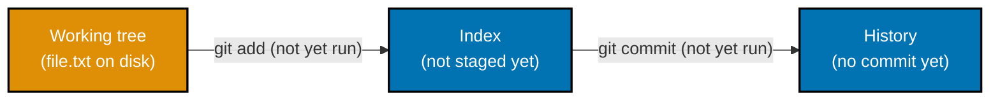
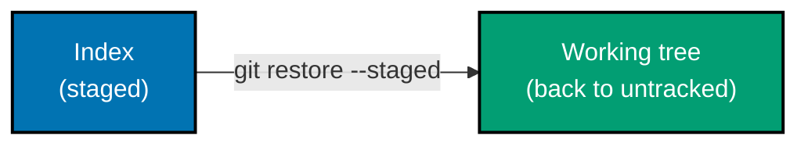
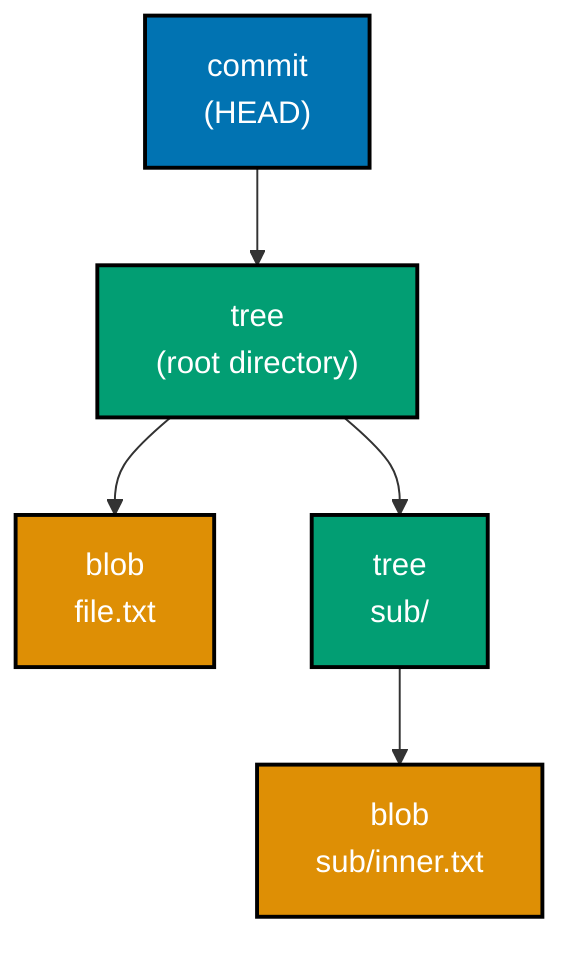
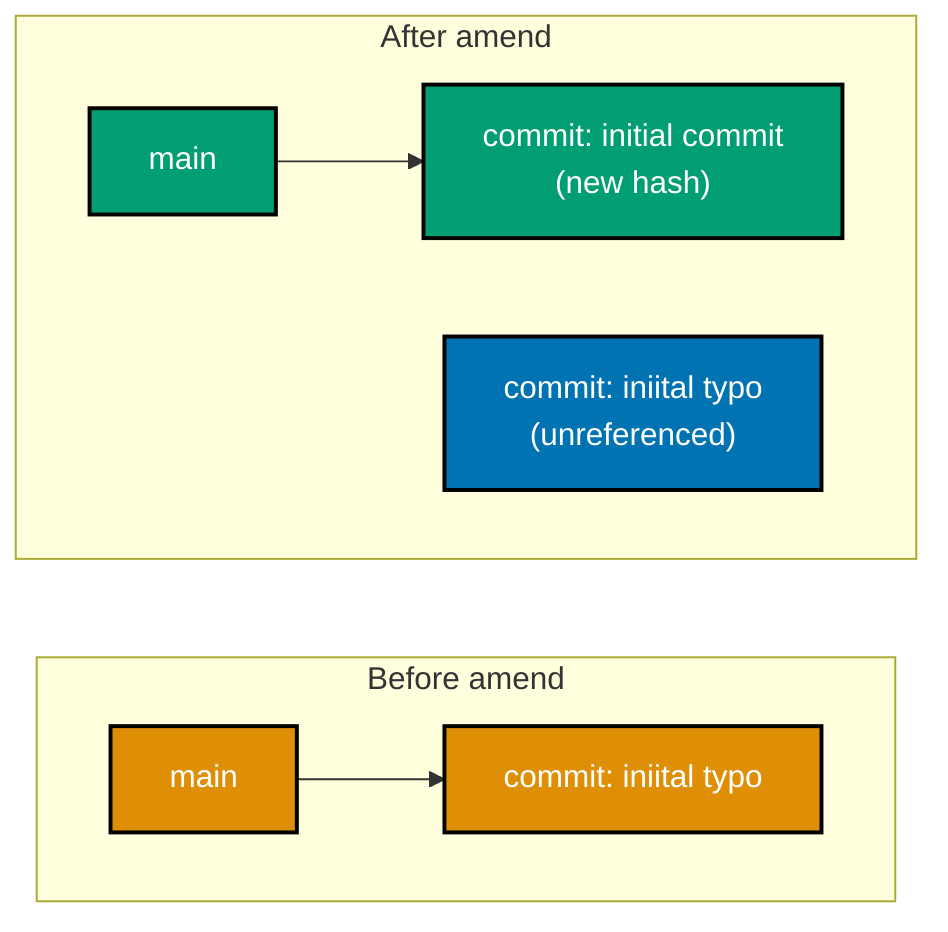
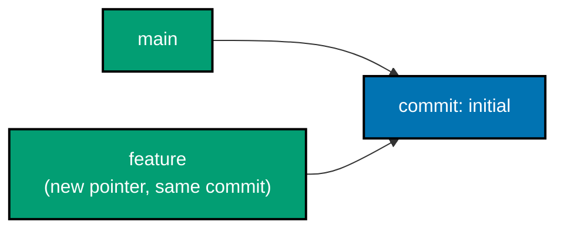
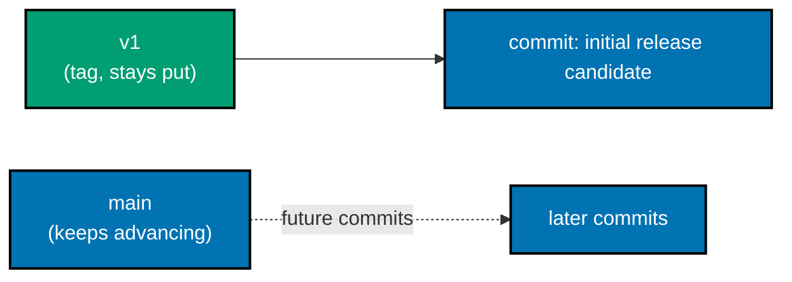

Examples 1-28 build everyday Git fluency: initializing a repository, the three-states model, staging and
committing, reading history and raw objects, amending, `.gitignore`, and basic branching and tagging.
Every example is a complete, self-contained shell script colocated under `learning/code/`; each
`transcript.txt` shows the real, captured output of actually running that script against a genuinely
fresh scratch repository -- nothing in this topic's output is hand-written or simulated. The "Output"
blocks shown inline below are trimmed excerpts of each example's own `transcript.txt` for readability;
the full, byte-for-byte transcript is always available under `learning/code/`.

---

### Example 1: Init a Repository

_ex-01 &middot; exercises co-01_

Before Git can track anything, a plain folder has to become a repository. `git init` does exactly that
-- and only that: it creates the `.git/` directory and nothing else, leaving an empty history behind it.


**`learning/code/ex-01-init-repository/setup.sh`**

```bash
WORKDIR=$(mktemp -d) && cd "$WORKDIR"           # => fresh, empty scratch directory -- not a repo yet
                                                 # => (nothing under WORKDIR resembles a project yet)

git -c init.defaultBranch=main init             # => creates .git/ -- this ONE call turns a plain folder
                                                 #    into a repository; -c pins the initial branch name
                                                 #    to "main" for this command only (no global config)

ls -a .git | head -5                            # => .git/ genuinely exists on disk right after init
                                                 # => (HEAD, config, hooks/, objects/, refs/ all appear)

git status                                       # => the very first status report of a brand-new repo
                                                 # => reports "No commits yet" -- there is no history at all
```

**Output**:

```text
Initialized empty Git repository in /private/var/folders/fr/jg3jv_4d39b48cyqlqz18mgr0000gn/T/tmp.48D1ujQpDg/.git/
.
..
config
description
HEAD
On branch main

No commits yet

nothing to commit (create/copy files and use "git add" to track)
```

**Key takeaway**: `git init` creates `.git/` and nothing else -- a repository with zero commits is still
a completely valid repository, and `git status` says so explicitly.

**Why it matters**: every repository starts here. Recognizing that `.git/` on disk is the ENTIRE
difference between a plain folder and a repository demystifies what "a repo" even is -- it is not a
server-side concept, not a special filesystem, just one directory of Git's own bookkeeping. Every
remote-based workflow later in this topic (Example 65's `git clone`) is built by composing this
same primitive with a copy step, so understanding `init` in isolation first makes that later
composition obvious rather than magical.

---

### Example 2: Check a Clean Status

_ex-02 &middot; exercises co-05_

`git status` is the single most-run Git command -- it always names the current branch and always reports
whether there is anything to commit, even in a repository with zero commits and zero files.

**`learning/code/ex-02-check-status-clean/setup.sh`**

```bash
WORKDIR=$(mktemp -d) && cd "$WORKDIR"
git -c init.defaultBranch=main init -q          # => -q suppresses the "Initialized empty..." banner --
                                                 #    only the deliberate `git status` output matters here

git status                                       # => "On branch main" names the current branch by name
                                                 # => "nothing to commit" -- true even with zero commits,
                                                 #    because there are also zero untracked/modified files
```

**Output**:

```text
On branch main

No commits yet

nothing to commit (create/copy files and use "git add" to track)
```

**Key takeaway**: `git status` names the branch and reports cleanliness unconditionally -- it never
requires a commit to already exist before it can answer truthfully.

**Why it matters**: `git status` is the command to run whenever you are unsure what state a
repository is in -- and this example proves it works from the very first moment, before any file or
commit exists. Reaching for `status` before every `add` and `commit` throughout this whole topic,
rather than guessing, is the single habit that prevents the most common beginner mistake:
committing the wrong files or committing nothing at all.

---

### Example 3: Create an Untracked File

_ex-03 &middot; exercises co-05_

A file Git has never been told about with `git add` is **untracked** -- Git sees it exists on disk but
does not consider it part of any snapshot yet.



**`learning/code/ex-03-create-untracked-file/setup.sh`**

```bash
WORKDIR=$(mktemp -d) && cd "$WORKDIR"
git -c init.defaultBranch=main init -q

echo "hello" > file.txt                          # => creates a file ON DISK -- Git has not been told
                                                 #    about it with `git add` yet, so it is not tracked

git status                                       # => file.txt appears under "Untracked files" -- Git sees
                                                 #    it exists but is not part of any snapshot yet
```

**Output**:

```text
On branch main

No commits yet

Untracked files:
  (use "git add <file>..." to include in what will be committed)
 file.txt

nothing added to commit but untracked files present (use "git add" to track)
```

**Key takeaway**: creating a file on disk and telling Git about it are two separate acts -- the filesystem
and Git's own bookkeeping are independent until `git add` bridges them.

**Why it matters**: this is the very first of the three states (co-02) a new file passes through,
and recognizing "Untracked files" on sight is the foundation for every staging workflow that
follows. Every one of the next several examples assumes this starting point is recognized on sight,
because misreading "Untracked files" as "already tracked and safe" is the root cause of
accidentally losing a brand-new file to a careless `git clean` later.

---

### Example 4: Stage a File

_ex-04 &middot; exercises co-05, co-02_

`git add` copies a file's current content into the index (the staging area) -- the middle of Git's
three-states model, between the working tree and committed history.


**`learning/code/ex-04-stage-a-file/setup.sh`**

```bash
WORKDIR=$(mktemp -d) && cd "$WORKDIR"
git -c init.defaultBranch=main init -q
echo "hello" > file.txt

git add file.txt                                 # => copies file.txt's CURRENT content into the index
                                                 #    (the staging area) -- the middle of the three-states
                                                 #    model: working tree -> index -> committed history

git status                                       # => file.txt now lists under "Changes to be committed",
                                                 #    not "Untracked files" -- it moved out of the working
                                                 #    tree's own section entirely
```

**Output**:

```text
On branch main

No commits yet

Changes to be committed:
  (use "git rm --cached <file>..." to unstage)
 new file:   file.txt
```

**Key takeaway**: `git add` is not "commit this file" -- it is "prepare this file's current content for
the NEXT commit," a deliberate intermediate step distinct from committing.

**Why it matters**: understanding staging as its own state (not a shortcut, not optional
bookkeeping) is what makes hunk staging (Example 29) and focused, reviewable commits possible
later. This distinction is also what makes hunk-level staging (Example 29) possible at all --
without a genuinely separate staging area, there would be no place to build a commit's content
incrementally, one reviewed piece at a time, before committing.

---

### Example 5: Make the First Commit

_ex-05 &middot; exercises co-07_

`git commit` takes whatever is currently staged and records it permanently as a new commit -- the first
commit in a repository is special only in that it has no parent.

**`learning/code/ex-05-first-commit/setup.sh`**

```bash
WORKDIR=$(mktemp -d) && cd "$WORKDIR"   # => fresh, empty scratch directory for this example
export GIT_AUTHOR_NAME="Dev" GIT_AUTHOR_EMAIL="dev@example.com"   # => throwaway identity, scoped to this script only
export GIT_COMMITTER_NAME="Dev" GIT_COMMITTER_EMAIL="dev@example.com"  # => throwaway identity, scoped to
                                                 #    this script only -- never the developer's real config
git -c init.defaultBranch=main init -q   # => -q suppresses the init banner
echo "hello" > file.txt
git add file.txt

git commit -m "add file"                         # => moves the staged index into a new, permanent commit
                                                 # => "(root-commit)" marks it as the very first commit --
                                                 #    it has no parent, so it starts the history graph

git log --oneline                                # => exactly one line -- one commit exists, and only one
```

**Output**:

```text
[main (root-commit) 4a9349b] add file
 1 file changed, 1 insertion(+)
 create mode 100644 file.txt
4a9349b add file
```

**Key takeaway**: `git commit` finalizes whatever is currently staged, tags the result with an
abbreviated hash for reference, and "(root-commit)" flags the special case of a repository's very first
commit.

**Why it matters**: this is the moment work becomes permanent, content-addressed history -- unlike
a plain file save, this snapshot is now identified by the hash of its own content and can never
silently change underneath you. Every later example that inspects history, diffs commits, or
rewinds with reset or revert depends on this permanence -- a commit's hash is a cryptographic
fingerprint of its content, so verifying `git log` output is really verifying the history itself.

---

### Example 6: A Commit Shows Its Snapshot

_ex-06 &middot; exercises co-07, co-10_

`git show HEAD` prints a commit's metadata (author, date, message) and its diff in one command -- the
quickest way to answer "what exactly did this commit change."

**`learning/code/ex-06-commit-shows-snapshot/setup.sh`**

```bash
WORKDIR=$(mktemp -d) && cd "$WORKDIR"   # => fresh, empty scratch directory for this example
export GIT_AUTHOR_NAME="Dev" GIT_AUTHOR_EMAIL="dev@example.com"   # => throwaway identity, scoped to this script only
export GIT_COMMITTER_NAME="Dev" GIT_COMMITTER_EMAIL="dev@example.com"   # => never the developer's real global git config
git -c init.defaultBranch=main init -q   # => -q suppresses the init banner
echo "hello" > file.txt
git add file.txt
git commit -q -m "add file"

git show HEAD                                    # => "commit <hash>" / Author / Date header lines are the
                                                 #    METADATA half; everything after the blank line is a
                                                 #    normal unified diff of what this commit changed --
                                                 #    here, the whole new file appears as all-added lines
```

**Output**:

```text
commit 4a9349bf89bedc69f4e1da7b06c189c5760c7dd9
Author: Dev <dev@example.com>
Date:   Tue Jul 14 12:22:52 2026 +0700

    add file

diff --git a/file.txt b/file.txt
new file mode 100644
index 0000000..ce01362
--- /dev/null
+++ b/file.txt
@@ -0,0 +1 @@
+hello
```

**Key takeaway**: `git show <commit>` combines what `git log` and `git diff` would each show separately
-- metadata first, then the actual content change -- in one command, for one specific commit.

**Why it matters**: this is the everyday command for reviewing a single commit in isolation,
whether it is your own work-in-progress or a teammate's commit you are reviewing before a merge.
Reaching for `git show` instead of separately running `log` then `diff` saves a context switch
during code review, and this single-commit view is exactly what a teammate reads before approving a
pull request (Example 79).

---

### Example 7: Stage All Changes

_ex-07 &middot; exercises co-05_

`git add -A` stages every change across the whole working tree in one call -- modified, new, and deleted
files alike -- instead of naming each path individually.

**`learning/code/ex-07-stage-all-changes/setup.sh`**

```bash
WORKDIR=$(mktemp -d) && cd "$WORKDIR"   # => fresh, empty scratch directory for this example
export GIT_AUTHOR_NAME="Dev" GIT_AUTHOR_EMAIL="dev@example.com"   # => throwaway identity, scoped to this script only
export GIT_COMMITTER_NAME="Dev" GIT_COMMITTER_EMAIL="dev@example.com"   # => never the developer's real global git config
git -c init.defaultBranch=main init -q   # => -q suppresses the init banner
printf "a\n" > alpha.txt                        # => first tracked file, committed below
printf "b\n" > beta.txt                         # => second tracked file, committed alongside it
git add alpha.txt beta.txt                       # => stages both by explicit name (contrast with -A)
git commit -q -m "track alpha and beta"          # => baseline commit -- both files now have history

echo "a2" >> alpha.txt                           # => modifies TWO already-tracked files independently --
echo "b2" >> beta.txt                            #    neither is staged yet after these two edits

git add -A                                        # => -A stages every change in the whole working tree in
                                                 #    one call: modified, new, AND deleted files alike

git status                                       # => both alpha.txt and beta.txt list under "Changes to
                                                 #    be committed" -- one command staged both at once
```

**Output**:

```text
On branch main
Changes to be committed:
  (use "git restore --staged <file>..." to unstage)
 modified:   alpha.txt
 modified:   beta.txt
```

**Key takeaway**: `-A` scans the whole working tree, not just the current directory -- it is the "stage
everything" shortcut for when a change genuinely does span multiple files as one logical unit.

**Why it matters**: `-A` is convenient exactly when the alternative -- hunk staging (Example 29) --
would be overkill, because every changed file genuinely belongs in the same commit together.
Reaching for `-A` without checking `git status` first is also a common source of accidentally
staged debug files or stray build artifacts, which is exactly the failure mode `.gitignore`
(Example 19) exists to prevent before it ever happens.

---

### Example 8: Unstage a File

_ex-08 &middot; exercises co-20, co-05_

`git restore --staged` moves a file back out of the index without touching its content on disk at all --
the working-tree edit survives untouched either way.



**`learning/code/ex-08-unstage-file/setup.sh`**

```bash
WORKDIR=$(mktemp -d) && cd "$WORKDIR"   # => fresh, empty scratch directory for this example
export GIT_AUTHOR_NAME="Dev" GIT_AUTHOR_EMAIL="dev@example.com"   # => throwaway identity, scoped to this script only
export GIT_COMMITTER_NAME="Dev" GIT_COMMITTER_EMAIL="dev@example.com"   # => never the developer's real global git config
git -c init.defaultBranch=main init -q   # => -q suppresses the init banner
echo "base" > base.txt
git add base.txt
git commit -q -m "initial"                        # => a real HEAD must exist first -- restore needs a
                                                 #    baseline commit to compare the index against
echo "hello" > file.txt
git add file.txt                                    # => file.txt is staged -- "Changes to be committed"

git restore --staged file.txt                       # => co-20: pulls the file back OUT of the index --
                                                 #    HEAD has no entry for file.txt, so restoring against
                                                 #    that baseline un-stages it entirely; the working-tree
                                                 #    copy on disk is left completely alone either way

git status                                          # => file.txt returns to "Untracked files" -- unstaged,
                                                 #    but the actual edit on disk is untouched either way
```

**Output**:

```text
On branch main
Untracked files:
  (use "git add <file>..." to include in what will be committed)
 file.txt

nothing added to commit but untracked files present (use "git add" to track)
```

**Key takeaway**: unstaging never discards content -- it only moves a file BACKWARD one state in the
three-states model, from index back to working tree.

**Why it matters**: "I staged the wrong thing" is a common moment, and `git restore --staged` is
the safe, non-destructive fix -- unlike `git reset --hard` (Example 53), nothing here can ever lose
an edit. This same non-destructive philosophy carries through the whole topic -- `restore --staged`
(here), plain `restore` (Example 56), and `stash` (Example 58) all give a way back without risking
content, reserving genuinely destructive operations for when they are explicitly chosen.

---

### Example 9: Diff the Working Tree

_ex-09 &middot; exercises co-09_

Plain `git diff`, with no flags, compares the working tree against the index -- it shows exactly the
edits that are NOT yet staged.

**`learning/code/ex-09-diff-working-tree/setup.sh`**

```bash
WORKDIR=$(mktemp -d) && cd "$WORKDIR"   # => fresh, empty scratch directory for this example
export GIT_AUTHOR_NAME="Dev" GIT_AUTHOR_EMAIL="dev@example.com"   # => throwaway identity, scoped to this script only
export GIT_COMMITTER_NAME="Dev" GIT_COMMITTER_EMAIL="dev@example.com"   # => never the developer's real global git config
git -c init.defaultBranch=main init -q   # => -q suppresses the init banner
echo "hello" > file.txt                          # => the file whose history the diff below inspects
git add file.txt                                 # => stages the original one-line content
git commit -q -m "add file"                      # => baseline commit -- this is what git diff compares

echo "world" >> file.txt                          # => an UNSTAGED edit to an already-tracked file

git diff                                          # => shows the unstaged change: working tree vs. index --
                                                 #    "+world" is the only line the index does not have yet
```

**Output**:

```text
diff --git a/file.txt b/file.txt
index ce01362..94954ab 100644
--- a/file.txt
+++ b/file.txt
@@ -1 +1,2 @@
 hello
+world
```

**Key takeaway**: plain `git diff` answers "what have I changed that is NOT staged yet" -- one specific
comparison out of the several `git diff` can perform.

**Why it matters**: reading `git diff` before every `git add` is the habit that catches accidental
edits (a stray debug line, an unintended whitespace change) before they ever get staged. This same
review discipline scales directly to `git diff --staged` (Example 10) and to comparing whole
branches (Example 33) later -- once reading a diff before acting becomes automatic, every larger
comparison in this topic follows the identical mental model.

---

### Example 10: Diff Staged Changes

_ex-10 &middot; exercises co-09, co-02_

`git diff --staged` compares the index against `HEAD` instead -- once an edit is staged, plain `git diff`
goes quiet and `--staged` is the one that shows it.

**`learning/code/ex-10-diff-staged/setup.sh`**

```bash
WORKDIR=$(mktemp -d) && cd "$WORKDIR"   # => fresh, empty scratch directory for this example
export GIT_AUTHOR_NAME="Dev" GIT_AUTHOR_EMAIL="dev@example.com"   # => throwaway identity, scoped to this script only
export GIT_COMMITTER_NAME="Dev" GIT_COMMITTER_EMAIL="dev@example.com"   # => never the developer's real global git config
git -c init.defaultBranch=main init -q   # => -q suppresses the init banner
echo "hello" > file.txt
git add file.txt
git commit -q -m "add file"
echo "world" >> file.txt
git add file.txt                                  # => the edit is now staged -- index differs from HEAD,
                                                 #    but working tree now EQUALS the index (nothing left
                                                 #    unstaged)

git diff --staged                                 # => shows index vs. HEAD: the same "+world" line, but
                                                 #    from a different comparison than plain `git diff`

git diff                                          # => plain diff is now EMPTY -- working tree matches the
                                                 #    index exactly, so there is nothing left to compare
```

**Output**:

```text
diff --git a/file.txt b/file.txt
index ce01362..94954ab 100644
--- a/file.txt
+++ b/file.txt
@@ -1 +1,2 @@
 hello
+world
```

**Key takeaway**: `git diff` and `git diff --staged` never both show the same content for a fully staged
edit -- once staging catches up, plain `diff` empties out and `--staged` takes over.

**Why it matters**: this is the exact mechanic that lets `git diff --staged` serve as a final,
pre-commit review of precisely what is about to be recorded -- no more, no less. Understanding this
exact mechanic -- staged content compared against `HEAD`, not the working tree -- is what makes
`git commit` predictable: whatever `diff --staged` shows immediately before committing is exactly,
and only, what the resulting commit will contain.

---

### Example 11: View the Log One-Line

_ex-11 &middot; exercises co-10_

`git log --oneline` compresses each commit down to an abbreviated hash and its subject line -- the
fastest way to scan a lot of history at once.

**`learning/code/ex-11-view-log-oneline/setup.sh`**

```bash
WORKDIR=$(mktemp -d) && cd "$WORKDIR"   # => fresh, empty scratch directory for this example
export GIT_AUTHOR_NAME="Dev" GIT_AUTHOR_EMAIL="dev@example.com"   # => throwaway identity, scoped to this script only
export GIT_COMMITTER_NAME="Dev" GIT_COMMITTER_EMAIL="dev@example.com"   # => never the developer's real global git config
git -c init.defaultBranch=main init -q   # => -q suppresses the init banner
echo "v1" > file.txt; git add file.txt; git commit -q -m "initial version"   # => commit 1 of 3
echo "v2" >> file.txt; git commit -aq -m "second revision"                   # => -a skips a separate add
echo "v3" >> file.txt; git commit -aq -m "third revision"                    # => three commits now exist

git log --oneline                                 # => three lines, newest first -- each line is an
                                                 #    abbreviated hash (short enough to stay unambiguous)
                                                 #    followed by that commit's subject, nothing more
```

**Output**:

```text
eb2c725 third revision
f72d927 second revision
d1e2caf initial version
```

**Key takeaway**: `--oneline` trades detail for density -- newest commit first, one line each, exactly the
hash and subject and nothing more.

**Why it matters**: this is the default lens for "what has happened recently" -- most other `git
log` variants in this topic (Examples 12, 34, 35) start from this same one-line baseline and add
exactly one more dimension. Treating `--oneline` as the default lens, rather than the full
multi-line format, keeps a fast mental model of recent work current -- a habit worth building
early, since every merge, rebase, and reset example later relies on quickly scanning this exact
output.

---

### Example 12: View the Log as a Graph

_ex-12 &middot; exercises co-10_

`git log --graph --all` draws the commit history as ASCII art, showing every branch at once -- not just
the one currently checked out.

**`learning/code/ex-12-view-log-graph/setup.sh`**

```bash
WORKDIR=$(mktemp -d) && cd "$WORKDIR"   # => fresh, empty scratch directory for this example
export GIT_AUTHOR_NAME="Dev" GIT_AUTHOR_EMAIL="dev@example.com"   # => throwaway identity, scoped to this script only
export GIT_COMMITTER_NAME="Dev" GIT_COMMITTER_EMAIL="dev@example.com"   # => never the developer's real global git config
git -c init.defaultBranch=main init -q   # => -q suppresses the init banner
echo "base" > file.txt; git add file.txt; git commit -q -m "initial"
git switch -c feature -q
echo "f1" >> file.txt; git commit -aq -m "feature work"    # => feature now has one commit main lacks

git log --graph --oneline --all                   # => --all shows EVERY branch's history, not just the
                                                 #    checked-out one; the "*" and "|" characters draw the
                                                 #    fork where feature diverged from main visually
```

**Output**:

```text
* bfdfd6e feature work
* ca943e2 initial
```

**Key takeaway**: `--all` is the flag that makes `--graph` actually useful for understanding branch
structure -- without it, you only ever see the single branch you happen to be standing on.

**Why it matters**: this is the single command reached for constantly in every later example
involving merges and rebases (Examples 36-50) to confirm the shape of history actually matches what
was intended. Without `--all`, a merge or rebase could silently complete while a whole diverged
branch stays invisible in the log -- learning to reach for the graph view here avoids ever
mistaking "my current branch looks fine" for "the whole repository is in the state I expect".

---

### Example 13: Inspect a Blob with cat-file

_ex-13 &middot; exercises co-03, co-10_

A blob is Git's object type for raw file content, addressed by the hash of that content. `HEAD:file.txt`
resolves to the exact blob the current commit's tree points to for that path.

**`learning/code/ex-13-inspect-blob-cat-file/setup.sh`**

```bash
WORKDIR=$(mktemp -d) && cd "$WORKDIR"   # => fresh, empty scratch directory for this example
export GIT_AUTHOR_NAME="Dev" GIT_AUTHOR_EMAIL="dev@example.com"   # => throwaway identity, scoped to this script only
export GIT_COMMITTER_NAME="Dev" GIT_COMMITTER_EMAIL="dev@example.com"   # => never the developer's real global git config
git -c init.defaultBranch=main init -q   # => -q suppresses the init banner
printf "hello\nworld\n" > file.txt
git add file.txt
git commit -q -m "add file"

git cat-file -p HEAD:file.txt                     # => co-03: a blob is Git's object type for raw FILE
                                                 #    CONTENT, addressed by the hash of that content --
                                                 #    HEAD:file.txt resolves "the blob file.txt pointed to
                                                 #    from HEAD's tree" and prints it byte for byte
```

**Output**:

```text
hello
world
```

**Key takeaway**: `git cat-file -p` prints an object's raw content given a hash or a resolvable
expression like `HEAD:file.txt` -- the same content `cat file.txt` would show, but reached through Git's
own storage instead of the filesystem.

**Why it matters**: this is the first proof that a commit is not magic -- it is a graph of plain,
inspectable objects, and a blob is the simplest one: exactly the bytes of one version of one file.
This same content-addressing principle is exactly why two files with identical content anywhere in
a repository's history share the same blob hash -- Git stores that content exactly once, a
storage-efficiency detail that only makes sense once a blob is understood this concretely.

---

### Example 14: Inspect a Commit Object

_ex-14 &middot; exercises co-03_

`git cat-file -p HEAD` prints a commit object's raw fields directly -- the tree it snapshots, its
author/committer, and its message.

**`learning/code/ex-14-inspect-commit-object/setup.sh`**

```bash
WORKDIR=$(mktemp -d) && cd "$WORKDIR"   # => fresh, empty scratch directory for this example
export GIT_AUTHOR_NAME="Dev" GIT_AUTHOR_EMAIL="dev@example.com"   # => throwaway identity, scoped to this script only
export GIT_COMMITTER_NAME="Dev" GIT_COMMITTER_EMAIL="dev@example.com"   # => never the developer's real global git config
git -c init.defaultBranch=main init -q   # => -q suppresses the init banner
echo "hello" > file.txt
git add file.txt
git commit -q -m "add file"

git cat-file -p HEAD                              # => a commit object is a tiny text record: "tree
                                                 #    <hash>" points at this snapshot's root directory,
                                                 #    "author"/"committer" carry who+when, and the message
                                                 #    is the last field -- no "parent" line here because
                                                 #    this is the repository's root commit
```

**Output**:

```text
tree 4cf9f177c4c015836fca6a31f9c3917e89ae29ec
author Dev <dev@example.com> 1784006573 +0700
committer Dev <dev@example.com> 1784006573 +0700

add file
```

**Key takeaway**: a commit object is genuinely this small -- a tree hash, author/committer lines, zero or
more parent lines, and a message -- everything `git log`/`git show` present richly is derived from these
same plain fields.

**Why it matters**: once "commit" stops meaning "opaque snapshot" and starts meaning "this exact,
tiny, inspectable record," operations like amend (Example 17) and merge (Example 38, two parent
lines) become concrete graph edits instead of magic. Seeing the raw fields directly here is also
what makes the two-parent-line case (Example 38's merge commit) immediately legible later -- rather
than a special format to memorize, a merge commit is simply this same tiny record with one extra
`parent` line.

---

### Example 15: Inspect a Tree Object

_ex-15 &middot; exercises co-03_

`HEAD^{tree}` dereferences a commit down to its root tree object -- Git's object type for a directory
snapshot, one line per entry.



**`learning/code/ex-15-inspect-tree-object/setup.sh`**

```bash
WORKDIR=$(mktemp -d) && cd "$WORKDIR"   # => fresh, empty scratch directory for this example
export GIT_AUTHOR_NAME="Dev" GIT_AUTHOR_EMAIL="dev@example.com"   # => throwaway identity, scoped to this script only
export GIT_COMMITTER_NAME="Dev" GIT_COMMITTER_EMAIL="dev@example.com"   # => never the developer's real global git config
git -c init.defaultBranch=main init -q   # => -q suppresses the init banner
echo "hello" > file.txt
mkdir sub && echo "nested" > sub/inner.txt
git add file.txt sub/inner.txt
git commit -q -m "add file and a subdirectory"

git cat-file -p 'HEAD^{tree}'                     # => HEAD^{tree} dereferences the commit down to its
                                                 #    root tree object -- one line per entry: file MODE,
                                                 #    object TYPE (blob for a file, tree for a directory),
                                                 #    hash, and NAME -- exactly what a directory listing
                                                 #    looks like inside Git's own object model
```

**Output**:

```text
100644 blob ce013625030ba8dba906f756967f9e9ca394464a file.txt
040000 tree cf2bb21ca1f47a5cf860db645c98e681d34a539b sub
```

**Key takeaway**: a tree entry names a MODE, a TYPE (blob for a file, tree for a nested directory), a
hash, and a filename -- a subdirectory is just another tree object, referenced by hash, nested inside its
parent tree.

**Why it matters**: this is the object-model proof that a "snapshot" really is a full directory
listing, recursively -- not a list of changes, and not a reference to the filesystem at all once
committed. This recursive structure -- a tree containing blobs and nested trees -- is precisely why
Git can snapshot an entire directory tree of any depth in one commit, and why two commits with an
unchanged subdirectory can share that subdirectory's tree object entirely, without recopying it.

---

### Example 16: Check an Object's Type

_ex-16 &middot; exercises co-03_

`git cat-file -t` asks for an object's TYPE only, without printing its content -- useful when you just
need to confirm what kind of object a hash resolves to.

**`learning/code/ex-16-object-type/setup.sh`**

```bash
WORKDIR=$(mktemp -d) && cd "$WORKDIR"   # => fresh, empty scratch directory for this example
export GIT_AUTHOR_NAME="Dev" GIT_AUTHOR_EMAIL="dev@example.com"   # => throwaway identity, scoped to this script only
export GIT_COMMITTER_NAME="Dev" GIT_COMMITTER_EMAIL="dev@example.com"   # => never the developer's real global git config
git -c init.defaultBranch=main init -q   # => -q suppresses the init banner
echo "hello" > file.txt                          # => content for the blob wrapped inside this commit
git add file.txt                                 # => stages it so the commit below can include it
git commit -q -m "add file"                      # => HEAD now points at this commit object

git cat-file -t HEAD                              # => -t asks for the TYPE only, not the content -- HEAD
                                                 #    resolves to a "commit" object, one of Git's four
                                                 #    object types (blob, tree, commit, tag)
```

**Output**:

```text
commit
```

**Key takeaway**: `-t` and `-p` are the two everyday `cat-file` flags -- type-only versus full content --
and both accept any resolvable expression, not just a raw hash.

**Why it matters**: distinguishing object types by inspection (rather than assuming) is exactly
what Example 73 later relies on to prove an annotated tag is a genuinely different object type than
a lightweight one. Being able to name an object's type on demand, rather than guessing from
context, is also what makes reading Git's own internal error messages and plumbing-command output
(used throughout `cat-file`-based examples in this topic) genuinely legible instead of opaque.

---

### Example 17: Amend the Last Commit

_ex-17 &middot; exercises co-08_

`git commit --amend` replaces the most recent commit entirely -- same content unless you also stage
something new, but always a brand-new hash.



**`learning/code/ex-17-amend-last-commit/setup.sh`**

```bash
WORKDIR=$(mktemp -d) && cd "$WORKDIR"   # => fresh, empty scratch directory for this example
export GIT_AUTHOR_NAME="Dev" GIT_AUTHOR_EMAIL="dev@example.com"   # => throwaway identity, scoped to this script only
export GIT_COMMITTER_NAME="Dev" GIT_COMMITTER_EMAIL="dev@example.com"   # => never the developer's real global git config
git -c init.defaultBranch=main init -q   # => -q suppresses the init banner
echo "hello" > file.txt
git add file.txt
git commit -q -m "iniital typo"                   # => deliberately misspelled subject line

git commit --amend -m "initial commit"            # => REPLACES the previous commit entirely -- same
                                                 #    parent, same tree unless content also staged, but a
                                                 #    brand-new hash, because the commit's content changed

git log --oneline                                 # => still exactly one commit, but its message and hash
                                                 #    are both the new ones -- the old commit is gone from
                                                 #    any branch, though still reachable via reflog (co-22)
```

**Output**:

```text
[main 9939be3] initial commit
 Date: Tue Jul 14 12:22:53 2026 +0700
 1 file changed, 1 insertion(+)
 create mode 100644 file.txt
9939be3 initial commit
```

**Key takeaway**: amend does not "edit" a commit in place -- Git never mutates an existing object -- it
creates a NEW commit and moves the branch pointer to it, leaving the old one unreferenced.

**Why it matters**: this is the correct fix for "I just committed and immediately noticed a typo"
-- faster and cleaner than a separate "fix typo" commit, as long as the original commit has not
already been pushed and shared (co-17's rebase-vs-merge discipline applies here too). The reflog
(Example 61) is precisely what keeps that old, unreferenced commit recoverable for a while -- so
amend feels safe in practice even though, at the object level, nothing was ever actually edited in
place.

---

### Example 18: Amend In a Forgotten File

_ex-18 &middot; exercises co-08_

`--amend --no-edit` keeps the existing commit message untouched while folding newly staged content into
the same commit -- for when a file was simply left out the first time.

**`learning/code/ex-18-amend-add-forgotten-file/setup.sh`**

```bash
WORKDIR=$(mktemp -d) && cd "$WORKDIR"   # => fresh, empty scratch directory for this example
export GIT_AUTHOR_NAME="Dev" GIT_AUTHOR_EMAIL="dev@example.com"   # => throwaway identity, scoped to this script only
export GIT_COMMITTER_NAME="Dev" GIT_COMMITTER_EMAIL="dev@example.com"   # => never the developer's real global git config
git -c init.defaultBranch=main init -q   # => -q suppresses the init banner
echo "hello" > file.txt
git add file.txt
git commit -q -m "add feature"
echo "helper" > forgotten.txt                     # => a second file that SHOULD have been part of the
                                                 #    same logical change, but was left out of the commit
git add forgotten.txt

git commit --amend --no-edit                      # => --no-edit keeps the existing commit message as-is,
                                                 #    folding the newly staged file into the SAME commit
                                                 #    instead of creating a separate follow-up commit

git show --stat HEAD                              # => HEAD's tree now lists BOTH file.txt and
                                                 #    forgotten.txt -- one commit, two files, as if the
                                                 #    forgotten file had been staged the first time
```

**Output**:

```text
[main ef7e980] add feature
 Date: Tue Jul 14 12:22:54 2026 +0700
 2 files changed, 2 insertions(+)
 create mode 100644 file.txt
 create mode 100644 forgotten.txt
commit ef7e980fa05e659a38f3897b7a7df380d19fe9e7
Author: Dev <dev@example.com>
Date:   Tue Jul 14 12:22:54 2026 +0700

    add feature

 file.txt      | 1 +
 forgotten.txt | 1 +
 2 files changed, 2 insertions(+)
```

**Key takeaway**: `--no-edit` is the flag for "the message was already right, only the content was
incomplete" -- the resulting single commit looks exactly as if both files had been staged from the start.

**Why it matters**: this is the everyday fix for "I forgot to `git add` a file before committing"
-- without it, the natural instinct produces two commits where one logical change belongs. Reaching
for this instead of a second, separate commit keeps history's granularity meaningful -- each commit
stays a genuinely complete, reviewable unit of work, rather than a first attempt followed by a
string of "oops, forgot this too" follow-ups.

---

### Example 19: Gitignore Basics

_ex-19 &middot; exercises co-26_

A `.gitignore` pattern keeps matching files out of `git status` entirely -- not flagged as untracked, not
mentioned at all, even though they genuinely exist on disk.

**`learning/code/ex-19-gitignore-basics/setup.sh`**

```bash
WORKDIR=$(mktemp -d) && cd "$WORKDIR"   # => fresh, empty scratch directory for this example
export GIT_AUTHOR_NAME="Dev" GIT_AUTHOR_EMAIL="dev@example.com"   # => throwaway identity, scoped to this script only
export GIT_COMMITTER_NAME="Dev" GIT_COMMITTER_EMAIL="dev@example.com"   # => never the developer's real global git config
git -c init.defaultBranch=main init -q   # => -q suppresses the init banner
echo "*.log" > .gitignore                          # => a pattern matching any file ending in .log,
                                                 #    anywhere in the working tree
git add .gitignore
git commit -q -m "add gitignore"

touch x.log                                        # => a NEW file that matches the ignore pattern

git status                                          # => x.log never appears -- not as untracked, not as
                                                 #    anything -- .gitignore hid it from status entirely;
                                                 #    "nothing to commit, working tree clean" is genuinely
                                                 #    true even though x.log exists on disk right now
```

**Output**:

```text
On branch main
nothing to commit, working tree clean
```

**Key takeaway**: an ignored file is not "hidden untracked" -- it is entirely absent from `git status`'s
output, which is why "working tree clean" can be true even while a brand-new file sits right there on
disk.

**Why it matters**: `.gitignore` is what keeps build artifacts, dependency directories, and local
secret files from ever cluttering `git status` or risking an accidental commit in the first place.
Without it, a `node_modules/` directory or a compiled binary could get staged by an unsuspecting
`git add -A` (Example 7) and committed by accident, bloating the repository's history with
regeneratable content that never belonged in version control at all.

---

### Example 20: Force-Add an Ignored File

_ex-20 &middot; exercises co-26_

`git add -f` deliberately overrides `.gitignore` for one specific file -- an explicit, one-time exception,
not a permanent unignore.

**`learning/code/ex-20-force-add-ignored/setup.sh`**

```bash
WORKDIR=$(mktemp -d) && cd "$WORKDIR"   # => fresh, empty scratch directory for this example
export GIT_AUTHOR_NAME="Dev" GIT_AUTHOR_EMAIL="dev@example.com"   # => throwaway identity, scoped to this script only
export GIT_COMMITTER_NAME="Dev" GIT_COMMITTER_EMAIL="dev@example.com"   # => never the developer's real global git config
git -c init.defaultBranch=main init -q   # => -q suppresses the init banner
echo "*.log" > .gitignore                        # => any *.log file becomes invisible to plain `git add`
git add .gitignore                               # => the ignore rules themselves ARE tracked, deliberately
git commit -q -m "add gitignore"                 # => baseline commit establishing the ignore rule
touch x.log                                      # => matches *.log -- normally invisible to `git add`

git add -f x.log                                    # => -f (force) stages a file EVEN THOUGH it matches
                                                 #    an ignore pattern -- an explicit override, not a
                                                 #    permanent unignore

git status                                          # => x.log now lists under "Changes to be committed" --
                                                 #    the single forced file is staged despite .gitignore
```

**Output**:

```text
On branch main
Changes to be committed:
  (use "git restore --staged <file>..." to unstage)
 new file:   x.log
```

**Key takeaway**: `-f` stages exactly the file named -- it does not remove the ignore pattern, and a
second, different `*.log` file would still be ignored normally.

**Why it matters**: this is the rare, deliberate exception -- an ignored file that genuinely needs
tracking once (a vendored dependency, a sample config) without weakening the ignore rule for
everything else that pattern was meant to catch. Reaching for `-f` should always prompt a second
thought about whether the ignore pattern itself is too broad -- if a genuinely necessary file keeps
needing this override, the underlying `.gitignore` rule, not the individual file, is usually the
thing worth revisiting.

---

### Example 21: Create a Branch

_ex-21 &middot; exercises co-11_

`git branch <name>` creates a new pointer at the current commit -- cheap, instant, and it does NOT switch
to it; the working tree stays exactly where it was.



**`learning/code/ex-21-create-branch/setup.sh`**

```bash
WORKDIR=$(mktemp -d) && cd "$WORKDIR"   # => fresh, empty scratch directory for this example
export GIT_AUTHOR_NAME="Dev" GIT_AUTHOR_EMAIL="dev@example.com"   # => throwaway identity, scoped to this script only
export GIT_COMMITTER_NAME="Dev" GIT_COMMITTER_EMAIL="dev@example.com"   # => never the developer's real global git config
git -c init.defaultBranch=main init -q   # => -q suppresses the init banner
echo "base" > file.txt; git add file.txt; git commit -q -m "initial"

git branch feature                                  # => creates a new branch pointer at the CURRENT
                                                 #    commit -- cheap, instant, and does NOT check it out;
                                                 #    the working tree stays on main throughout

git branch                                          # => lists both branches -- "*" marks the checked-out
                                                 #    one (main); feature exists but is not active yet
```

**Output**:

```text
  feature
* main
```

**Key takeaway**: creating a branch and switching to it are two separate acts -- `git branch <name>`
alone only performs the first.

**Why it matters**: recognizing branch creation as "just a new pointer, instant, no working-tree
change" is what makes near-free branching (co-04, co-11) click as a genuinely cheap operation, not
a project copy. This near-zero cost is precisely what makes disciplined branching workflows
practical at all -- both the pull-request flow (Example 79) and trunk-based development (Example 80) depend on branches being cheap enough to create for even a single small, short-lived change.

---

### Example 22: Switch Branches

_ex-22 &middot; exercises co-11_

`git switch <name>` moves `HEAD` (and the working tree, if content differs) to point at a different
branch.

**`learning/code/ex-22-switch-branch/setup.sh`**

```bash
WORKDIR=$(mktemp -d) && cd "$WORKDIR"   # => fresh, empty scratch directory for this example
export GIT_AUTHOR_NAME="Dev" GIT_AUTHOR_EMAIL="dev@example.com"   # => throwaway identity, scoped to this script only
export GIT_COMMITTER_NAME="Dev" GIT_COMMITTER_EMAIL="dev@example.com"   # => never the developer's real global git config
git -c init.defaultBranch=main init -q   # => -q suppresses the init banner
echo "base" > file.txt; git add file.txt; git commit -q -m "initial"
git branch feature

git switch feature                                  # => moves HEAD to point at feature instead of main --
                                                 #    since both branches share the same commit here, the
                                                 #    working tree does not change, only which branch HEAD
                                                 #    tracks changes

git status                                          # => "On branch feature" -- switch genuinely moved the
                                                 #    checked-out branch, confirmed by status itself
```

**Output**:

```text
Switched to branch 'feature'
On branch feature
nothing to commit, working tree clean
```

**Key takeaway**: `git switch` is Git's modern, purpose-built command for changing branches -- it is what
`git checkout <branch>` used to do, split out into its own less-overloaded command.

**Why it matters**: this is the everyday act of moving between parallel lines of work -- switching
costs nothing but a moment, unlike anything resembling a project copy. This same command is reached
for dozens of times throughout the rest of this topic, every time an example needs to move between
a feature branch and `main` to set up a merge, rebase, or conflict scenario.

---

### Example 23: Create and Switch in One Step

_ex-23 &middot; exercises co-11_

`git switch -c <name>` combines `git branch <name>` and `git switch <name>` into a single call -- creates
the branch AND checks it out immediately.

**`learning/code/ex-23-create-and-switch/setup.sh`**

```bash
WORKDIR=$(mktemp -d) && cd "$WORKDIR"   # => fresh, empty scratch directory for this example
export GIT_AUTHOR_NAME="Dev" GIT_AUTHOR_EMAIL="dev@example.com"   # => throwaway identity, scoped to this script only
export GIT_COMMITTER_NAME="Dev" GIT_COMMITTER_EMAIL="dev@example.com"   # => never the developer's real global git config
git -c init.defaultBranch=main init -q   # => -q suppresses the init banner
echo "base" > file.txt; git add file.txt; git commit -q -m "initial"

git switch -c hotfix                                # => -c COMBINES `git branch hotfix` and
                                                 #    `git switch hotfix` into a single call -- creates the
                                                 #    branch AND checks it out immediately

git branch                                          # => hotfix exists AND is the checked-out branch ("*")
                                                 #    -- one command produced both effects at once
```

**Output**:

```text
Switched to a new branch 'hotfix'
* hotfix
  main
```

**Key takeaway**: `-c` is the everyday shortcut -- almost every new branch a developer creates is also the
one they immediately want to work on, so the two-step version (Examples 21+22) is rarely used in practice.

**Why it matters**: this single command is the actual first step of nearly every worked example
from here forward that involves a feature branch -- Examples 36 onward all start with some variant
of `switch -c`. Muscle-memory around this single command matters because nearly every merge,
rebase, and conflict example from here forward opens with some variant of it -- internalizing it
early removes friction from following the rest of this topic's worked examples.

---

### Example 24: HEAD Tracks the Branch

_ex-24 &middot; exercises co-04_

`HEAD` is a pointer to the current branch, not a commit hash itself -- resolving `HEAD` and resolving the
branch name directly land on the identical commit.


**`learning/code/ex-24-head-tracks-branch/setup.sh`**

```bash
WORKDIR=$(mktemp -d) && cd "$WORKDIR"   # => fresh, empty scratch directory for this example
export GIT_AUTHOR_NAME="Dev" GIT_AUTHOR_EMAIL="dev@example.com"   # => throwaway identity, scoped to this script only
export GIT_COMMITTER_NAME="Dev" GIT_COMMITTER_EMAIL="dev@example.com"   # => never the developer's real global git config
git -c init.defaultBranch=main init -q   # => -q suppresses the init banner
echo "base" > file.txt; git add file.txt; git commit -q -m "initial"
git switch -c hotfix -q

git rev-parse HEAD                                  # => co-04: HEAD is a pointer to the CURRENT branch,
                                                 #    not a commit hash itself -- resolving it follows that
                                                 #    indirection down to the actual commit
git rev-parse hotfix                                # => resolving the branch name directly reaches the
                                                 #    SAME commit -- HEAD -> hotfix -> this one commit, and
                                                 #    both queries land on the identical hash
```

**Output**:

```text
bdbd96eb1f7dec1dce3508123d0957febf861f48
bdbd96eb1f7dec1dce3508123d0957febf861f48
```

**Key takeaway**: `HEAD -> <branch> -> <commit>` is a two-step indirection, and `git rev-parse` proves it
by resolving both `HEAD` and the branch name to the exact same, identical hash.

**Why it matters**: this indirection is precisely what a "detached HEAD" state (which several later
rebase examples pass through internally) means -- `HEAD` pointing straight at a commit instead of
through a branch. Recognizing this indirection explicitly also explains why deleting a checked-out
branch is refused by Git, and why `git switch --detach` (used internally by several rebase
operations later) is described as leaving the normal, branch-tracking state entirely.

---

### Example 25: List Every Ref

_ex-25 &middot; exercises co-04_

`git show-ref` lists every ref in the repository alongside the exact commit hash it currently resolves
to -- direct, low-level confirmation of the "branch = named pointer" model.

**`learning/code/ex-25-list-refs/setup.sh`**

```bash
WORKDIR=$(mktemp -d) && cd "$WORKDIR"   # => fresh, empty scratch directory for this example
export GIT_AUTHOR_NAME="Dev" GIT_AUTHOR_EMAIL="dev@example.com"   # => throwaway identity, scoped to this script only
export GIT_COMMITTER_NAME="Dev" GIT_COMMITTER_EMAIL="dev@example.com"   # => never the developer's real global git config
git -c init.defaultBranch=main init -q   # => -q suppresses the init banner
echo "base" > file.txt; git add file.txt; git commit -q -m "initial"
git branch feature
git branch hotfix

git show-ref                                        # => one line per ref: the full hash it currently
                                                 #    resolves to, then the ref's full name -- confirms
                                                 #    every branch really is "just a named pointer" (co-04)
git branch -v                                       # => the more readable branch-scoped equivalent: each
                                                 #    branch name, its ABBREVIATED hash, and its subject
```

**Output**:

```text
f1097c7057ab9862bd9855f2069729dc1945a68b refs/heads/feature
f1097c7057ab9862bd9855f2069729dc1945a68b refs/heads/hotfix
f1097c7057ab9862bd9855f2069729dc1945a68b refs/heads/main
  feature f1097c7 initial
  hotfix  f1097c7 initial
* main    f1097c7 initial
```

**Key takeaway**: all three branches here point at the IDENTICAL commit -- `show-ref`'s low-level output
and `branch -v`'s friendlier one agree, just at different levels of detail.

**Why it matters**: `show-ref` (or its plumbing cousin `git for-each-ref`) is the tool for
scripting against refs directly, while `branch -v` is the everyday human-readable equivalent for
the same information. Reaching for `show-ref` or `for-each-ref` becomes essential once a repository
has many branches and tags, where `branch -v`'s friendlier but narrower listing (branches only)
cannot answer questions that span every ref type at once, tags included.

---

### Example 26: Delete a Merged Branch

_ex-26 &middot; exercises co-11_

`git branch -d` (safe delete) only succeeds when Git can confirm the branch's commits are already
reachable from somewhere else -- it refuses to discard genuinely unmerged work.

**`learning/code/ex-26-delete-merged-branch/setup.sh`**

```bash
WORKDIR=$(mktemp -d) && cd "$WORKDIR"   # => fresh, empty scratch directory for this example
export GIT_AUTHOR_NAME="Dev" GIT_AUTHOR_EMAIL="dev@example.com"   # => throwaway identity, scoped to this script only
export GIT_COMMITTER_NAME="Dev" GIT_COMMITTER_EMAIL="dev@example.com"   # => never the developer's real global git config
git -c init.defaultBranch=main init -q   # => -q suppresses the init banner
echo "base" > file.txt; git add file.txt; git commit -q -m "initial"
git switch -c feature -q
echo "f1" >> file.txt; git commit -aq -m "feature work"
git switch main -q
git merge feature -q                                # => fast-forwards main -- feature's commit is now
                                                 #    fully reachable from main too, so nothing would be
                                                 #    lost by deleting the feature pointer

git branch -d feature                               # => -d (safe delete) only SUCCEEDS because Git can
                                                 #    confirm feature's commit is already merged elsewhere

git branch                                          # => feature no longer appears -- only main remains,
                                                 #    and its history still contains the merged commit
```

**Output**:

```text
Deleted branch feature (was 88d5964).
* main
```

**Key takeaway**: deleting a branch only ever removes the POINTER -- the commits it pointed to survive
exactly as long as some other ref still reaches them, here `main` itself.

**Why it matters**: this safety check (`-d` refuses an unmerged branch, requiring `-D` to force it)
is what makes routine post-merge cleanup safe by default -- Example 80's trunk-based flow relies on
it. Relying on this safety check, rather than reaching straight for the force-delete flag out of
habit, is what keeps routine branch cleanup a genuinely low-risk, almost mechanical task instead of
a moment that demands careful manual verification every single time.

---

### Example 27: Rename a Branch

_ex-27 &middot; exercises co-11_

`git branch -m` renames a branch's pointer -- the commit it points to, and that commit's entire history,
is completely unaffected.

**`learning/code/ex-27-rename-branch/setup.sh`**

```bash
WORKDIR=$(mktemp -d) && cd "$WORKDIR"   # => fresh, empty scratch directory for this example
export GIT_AUTHOR_NAME="Dev" GIT_AUTHOR_EMAIL="dev@example.com"   # => throwaway identity, scoped to this script only
export GIT_COMMITTER_NAME="Dev" GIT_COMMITTER_EMAIL="dev@example.com"   # => never the developer's real global git config
git -c init.defaultBranch=main init -q   # => -q suppresses the init banner
echo "base" > file.txt; git add file.txt; git commit -q -m "initial"
git branch old

git branch -m old new                               # => -m (move) renames the ref itself -- the commit it
                                                 #    points to, and that commit's whole history, is
                                                 #    completely unaffected by the rename

git branch                                          # => "new" appears in the branch list; "old" does not
                                                 #    -- same commit, same history, only the pointer's
                                                 #    NAME changed
```

**Output**:

```text
* main
  new
```

**Key takeaway**: a rename changes only the NAME half of "branch = named pointer" -- the pointer's target
commit, and everything that commit's history contains, never moves.

**Why it matters**: renaming is exactly this cheap because there is no content to rewrite -- a
stark contrast with rebase (Example 43), which really does produce new commit hashes. Because no
content is rewritten, renaming a not-yet-pushed local branch never risks the collaboration hazards
that rewriting shared history (Example 43's rebase, or a force-push) can -- it is one of the few
genuinely consequence-free Git operations in this topic.

---

### Example 28: A Lightweight Tag

_ex-28 &middot; exercises co-25_

`git tag <name>` creates a lightweight tag -- a plain ref pointing straight at a commit, with no separate
tag object behind it (unlike an annotated tag, Example 73).



**`learning/code/ex-28-tag-lightweight/setup.sh`**

```bash
WORKDIR=$(mktemp -d) && cd "$WORKDIR"   # => fresh, empty scratch directory for this example
export GIT_AUTHOR_NAME="Dev" GIT_AUTHOR_EMAIL="dev@example.com"   # => throwaway identity, scoped to this script only
export GIT_COMMITTER_NAME="Dev" GIT_COMMITTER_EMAIL="dev@example.com"   # => never the developer's real global git config
git -c init.defaultBranch=main init -q   # => -q suppresses the init banner
echo "base" > file.txt; git add file.txt; git commit -q -m "initial release candidate"

git tag v1                                          # => a LIGHTWEIGHT tag: just a ref pointing straight
                                                 #    at HEAD's commit -- no separate tag object created,
                                                 #    unlike an annotated tag (ex-73)

git tag                                             # => v1 is listed among (here, the only) known tags
git rev-parse v1                                    # => resolves to the identical hash as...
git rev-parse HEAD                                  # => ...HEAD itself -- v1 permanently marks this exact
                                                 #    commit, even after HEAD later moves on past it
```

**Output**:

```text
v1
f81838332bb75a260ddb4eb71a9d974fe856eedd
f81838332bb75a260ddb4eb71a9d974fe856eedd
```

**Key takeaway**: unlike a branch, a tag is meant to stay put -- `v1` will keep resolving to this exact
commit permanently, even after `main` (or any other branch) advances well past it.

**Why it matters**: a lightweight tag is the simplest way to give a permanent, human-readable name
to one specific commit -- Example 73 shows the richer, object-backed alternative for when a release
also needs its own recorded message and tagger. Because a tag intentionally never moves the way a
branch does, tagging a commit the moment it is deemed release-worthy is what lets a team
unambiguously answer "what code shipped in version 1.0" months or years later, regardless of how
far `main` has advanced since.

---

← Previous: [Overview](./overview.md) · Next: [Intermediate Examples](./intermediate.md) →
