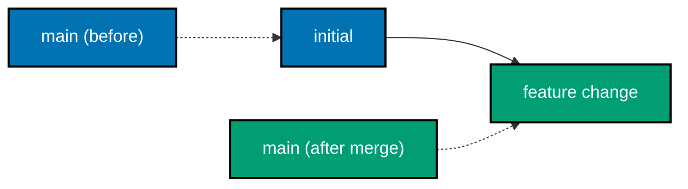
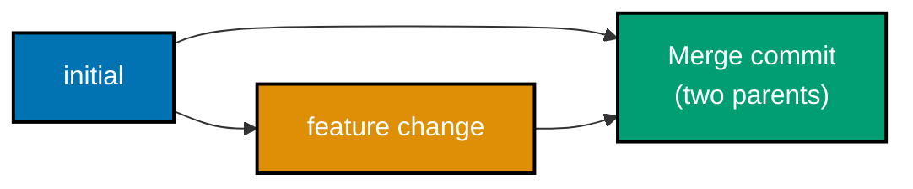
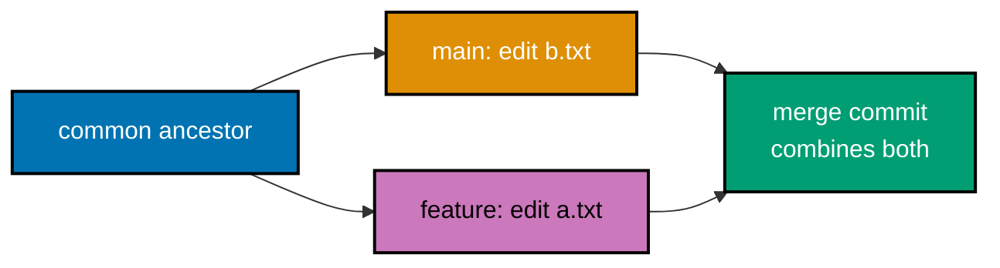
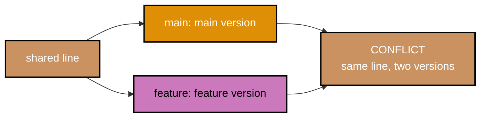
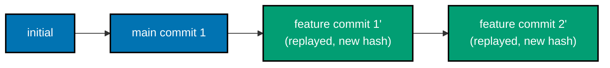
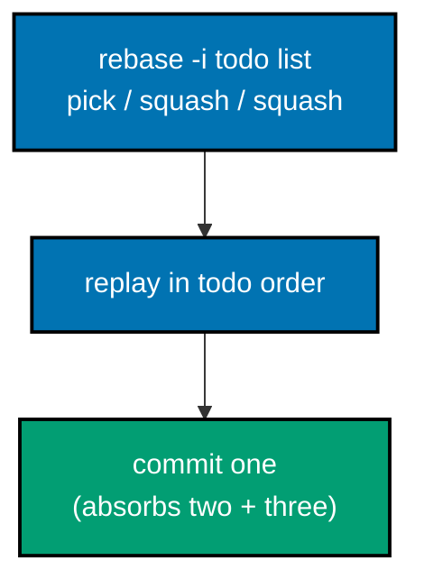
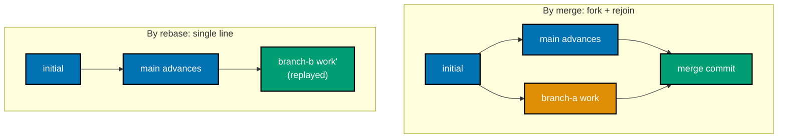
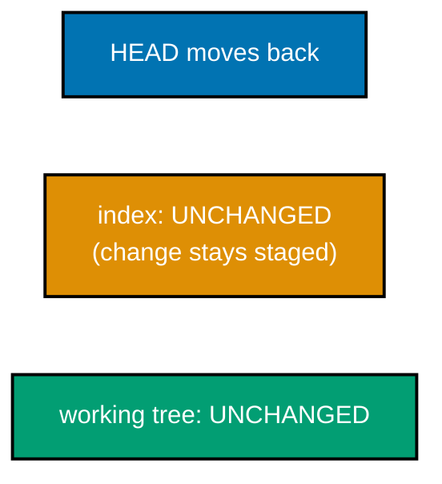
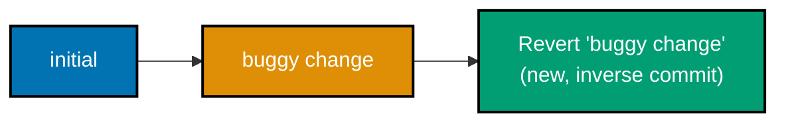
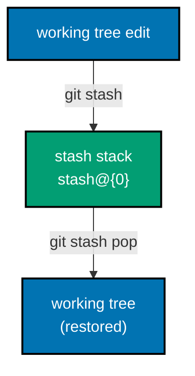

Examples 29-60 build on beginner fluency: hunk-level staging, richer log and diff comparisons, the three
shapes a merge can take (fast-forward, forced merge commit, and real three-way reconciliation), conflict
resolution, rebase (including the four everyday interactive-rebase operations), the three reset modes,
revert, restore, and the stash stack. Every example is self-contained and colocated under
`learning/code/`, with real, captured `transcript.txt` output for every single command shown.

---

### Example 29: Stage Hunks Interactively

_ex-29 &middot; exercises co-06_

`git add -p` walks through a file's changes one hunk at a time and asks whether to stage each one --
turning a single messy edit session into several independently-committable pieces.

**`learning/code/ex-29-stage-hunks-interactively/setup.sh`**

```bash
WORKDIR=$(mktemp -d) && cd "$WORKDIR"   # => fresh, empty scratch directory for this example
git -c init.defaultBranch=main init -q   # => -q suppresses the init banner -- only the highlighted output below matters
seq 1 20 > file.txt   # => a numbered-line file, long enough for far-apart edits to land in separate hunks
git add file.txt   # => stage the edit above
git commit -q -m "initial 20 lines"   # => baseline commit for the hunk-splitting demo
sed -i.bak '2s/.*/2 (edited)/' file.txt && rm -f file.txt.bak    # => two edits far apart -- far enough
sed -i.bak '19s/.*/19 (edited)/' file.txt && rm -f file.txt.bak  #    that Git's default 3-line context
                                                 #    splits them into TWO hunks

printf 'y\nn\n' | git add -p                         # => -p walks each hunk one at a time and asks
                                                 #    y/n/q/...; "y" stages hunk 1 (the line-2 edit), "n"
                                                 #    leaves hunk 2 (the line-19 edit) alone -- one physical
                                                 #    edit session becomes two separately-stageable pieces

git diff --staged                                   # => ONLY the line-2 hunk shows here -- it moved into
                                                 #    the index
git diff                                            # => the line-19 hunk is still here -- still unstaged,
                                                 #    completely untouched by the first hunk's staging
```

**Output**:

```text
(1/2) Stage this hunk [y,n,q,a,d,j,J,g,/,e,?]?
@@ -1,5 +1,5 @@
 1
-2
+2 (edited)
 3
 4
 5
(2/2) Stage this hunk [y,n,q,a,d,K,g,/,e,?]?
diff --git a/file.txt b/file.txt
@@ -1,5 +1,5 @@
 1
-2
+2 (edited)
 3
 4
 5
diff --git a/file.txt b/file.txt
@@ -16,5 +16,5 @@
 16
 17
 18
-19
+19 (edited)
 20
```

**Key takeaway**: `add -p` operates at hunk granularity, not file granularity -- two unrelated edits
inside the same file no longer force each other into the same commit.

**Why it matters**: this is the tool for splitting an accidental "did two things at once" edit
session back into the focused, reviewable commits it should have been in the first place. This
granularity is what makes `git add -p` indispensable during a long exploratory coding session,
where cleanup and the actual feature work end up interleaved in the same file and need to be
separated before review, not after.

---

### Example 30: Split a Hunk

_ex-30 &middot; exercises co-06_

Pressing `s` inside `git add -p` splits one combined hunk into smaller, independently-stageable
sub-hunks -- for when two nearby edits landed inside the same default 3-line-context hunk.

**`learning/code/ex-30-split-a-hunk/setup.sh`**

```bash
WORKDIR=$(mktemp -d) && cd "$WORKDIR"   # => fresh, empty scratch directory for this example
git -c init.defaultBranch=main init -q   # => -q suppresses the init banner -- only the highlighted output below matters
seq 1 10 > file.txt   # => a numbered-line file, short enough for close edits to land in one hunk
git add file.txt   # => stage the edit above
git commit -q -m "initial 10 lines"   # => baseline commit for the hunk-splitting demo
sed -i.bak '2s/.*/2 (edited)/' file.txt && rm -f file.txt.bak  # => two edits CLOSE together (lines 2 and 9
sed -i.bak '9s/.*/9 (edited)/' file.txt && rm -f file.txt.bak  #    in a 10-line file) -- close enough to
                                                 #    land in ONE hunk

printf 's\ny\nn\n' | git add -p                      # => "s" (split) breaks that one combined hunk into two
                                                 #    sub-hunks; then "y" stages the first sub-hunk (line 2)
                                                 #    and "n" leaves the second (line 9) unstaged

git diff --staged                                   # => only the split-off line-2 sub-hunk is staged
git diff                                            # => the line-9 sub-hunk remains, entirely unstaged --
                                                 #    proof the split genuinely separated one hunk in two
```

**Output**:

```text
(1/1) Stage this hunk [y,n,q,a,d,s,e,?]? Split into 2 hunks.
(1/2) Stage this hunk [y,n,q,a,d,j,J,g,/,e,?]?
(2/2) Stage this hunk [y,n,q,a,d,K,g,/,e,?]?
diff --git a/file.txt b/file.txt
@@ -1,5 +1,5 @@
 1
-2
+2 (edited)
 3
 4
 5
diff --git a/file.txt b/file.txt
@@ -6,5 +6,5 @@
 6
 7
 8
-9
+9 (edited)
 10
```

**Key takeaway**: `s` is the escape hatch when two edits are close enough that Git's own default context
window would otherwise force them into one hunk -- it manually re-draws the boundary.

**Why it matters**: without `s`, staging by hunk alone would not be a complete solution -- some
edits are genuinely too close together for context-based splitting to separate on its own.
Recognizing when a hunk needs manual splitting, rather than assuming `add -p`'s default boundaries
are always correct, is what keeps hunk-level staging reliable even in densely edited files where
two unrelated changes happen to land close together.

---

### Example 31: Commit with a Body

_ex-31 &middot; exercises co-07_

A commit message can carry a short subject line AND a longer explanatory body -- a second `-m` flag on
`git commit` becomes that body, separated from the subject by a blank line.

**`learning/code/ex-31-commit-with-body/setup.sh`**

```bash
WORKDIR=$(mktemp -d) && cd "$WORKDIR"   # => fresh, empty scratch directory for this example
git -c init.defaultBranch=main init -q   # => -q suppresses the init banner -- only the highlighted output below matters
echo "base" > file.txt   # => seed content for the next command
git add file.txt   # => stage the edit above

git commit -m "Add change one" -m "Explain why this change is needed in more detail
across a wrapped body paragraph."                   # => a second -m flag becomes the BODY, separated from
                                                 #    the subject by a blank line -- Git's own convention
                                                 #    (Chris Beams' rules) for a well-formed commit message

git log --format=%B -1                              # => %B prints the RAW, full commit message -- subject,
                                                 #    blank separator line, and body all appear, confirming
                                                 #    both pieces were recorded, not just the subject
```

**Output**:

```text
[main (root-commit) 274a1f8] Add change one
 1 file changed, 1 insertion(+)
 create mode 100644 file.txt
Add change one

Explain why this change is needed in more detail
across a wrapped body paragraph.
```

**Key takeaway**: subject and body are separate, purposeful pieces of one message -- the subject answers
"what", the body answers "why", and Git preserves the blank line between them exactly.

**Why it matters**: `git log --oneline` only ever shows the subject, so a body is where the
reasoning that later readers (including future you) actually need lives -- worth writing whenever
"why" is not obvious from the diff alone. Teams that require a body for anything beyond a trivial
change often enforce it via a commit-message linter in CI, precisely because the diff alone
frequently shows what changed but never why a particular approach was chosen over the alternatives.

---

### Example 32: Diff Two Commits

_ex-32 &middot; exercises co-09, co-10_

`git diff` accepts any two commit-ish endpoints, not just the working tree and the index -- comparing
`HEAD~2` against `HEAD` shows the combined change across the two most recent commits at once.

**`learning/code/ex-32-diff-two-commits/setup.sh`**

```bash
WORKDIR=$(mktemp -d) && cd "$WORKDIR"   # => fresh, empty scratch directory for this example
git -c init.defaultBranch=main init -q   # => -q suppresses the init banner -- only the highlighted output below matters
echo "base" > file.txt; git add file.txt; git commit -q -m "initial"   # => baseline commit this example builds on
echo "change one" >> file.txt; git commit -aq -m "Add change one"   # => one more commit in the curated series
echo "change two" >> file.txt; git commit -aq -m "Add change two"   # => one more commit in the curated series
echo "change three" >> file.txt; git commit -aq -m "Add change three"   # => one more commit in the curated series

git diff HEAD~2 HEAD                                # => co-09: diff accepts ANY two commit-ish endpoints,
                                                 #    not just working-tree/index -- this compares the tree
                                                 #    two commits back against the current tip, so BOTH
                                                 #    "change two" and "change three" appear as one diff
```

**Output**:

```text
diff --git a/file.txt b/file.txt
@@ -1,2 +1,4 @@
 base
 change one
+change two
+change three
```

**Key takeaway**: `git diff A B` treats the arguments generically -- a branch name, tag, `HEAD~N`, or a
raw hash all resolve the same way, so the two-commit case is really just one instance of a general rule.

**Why it matters**: this is how to answer "what changed across this whole range of commits", one
diff at a time, instead of reading N separate single-commit diffs and mentally merging them. This
range-diffing generalizes directly to comparing whole branches (Example 33) and to reviewing
everything a pull request adds before approving it -- the same two-endpoint mental model, just with
different kinds of endpoints on either side.

---

### Example 33: Diff Two Branches

_ex-33 &middot; exercises co-09_

`git diff main..feature` compares the tips of two branches directly -- the two-dot form shows exactly
what `feature` adds beyond `main`, regardless of how many commits are behind either tip.


**`learning/code/ex-33-diff-branches/setup.sh`**

```bash
WORKDIR=$(mktemp -d) && cd "$WORKDIR"   # => fresh, empty scratch directory for this example
git -c init.defaultBranch=main init -q   # => -q suppresses the init banner -- only the highlighted output below matters
echo "base" > shared.txt; git add shared.txt; git commit -q -m "initial"   # => baseline commit both branches will independently diverge from
git switch -c feature -q   # => a throwaway feature branch, scoped to this example only
echo "feature only" > feature.txt   # => a NEW file that only exists on the feature branch
git add feature.txt   # => stage the new file
git commit -q -m "feature only file"   # => feature now has one commit main entirely lacks
git switch main -q   # => back to main to continue the example from there

git diff main..feature                              # => the two-dot form diffs the TIPS of both branches
                                                 #    directly -- feature.txt appears as newly added,
                                                 #    because that is the entire delta between the two tips
```

**Output**:

```text
diff --git a/feature.txt b/feature.txt
new file mode 100644
--- /dev/null
+++ b/feature.txt
@@ -0,0 +1 @@
+feature only
```

**Key takeaway**: `main..feature` answers "what would merging feature into main add" -- a tip-to-tip
comparison, distinct from `main...feature` (three dots), which compares against the common ancestor
instead.

**Why it matters**: this is the everyday "preview a merge before doing it" command -- run it before
`git merge` to know exactly what is about to land. Skipping this preview and merging blind is how
surprising, unreviewed changes slip into `main` unnoticed -- teams that require a pull request diff
review before every merge (Example 79) are effectively enforcing this same check as a mandatory
step.

---

### Example 34: Limit and Format the Log

_ex-34 &middot; exercises co-10_

`-N` caps how many commits `git log` prints, and `--pretty=format:"..."` replaces the default
multi-line entry with a custom, single-line template.

**`learning/code/ex-34-log-limit-and-format/setup.sh`**

```bash
WORKDIR=$(mktemp -d) && cd "$WORKDIR"   # => fresh, empty scratch directory for this example
git -c init.defaultBranch=main init -q   # => -q suppresses the init banner -- only the highlighted output below matters
echo "base" > file.txt; git add file.txt; git commit -q -m "initial"   # => baseline commit this example builds on
echo "c1" >> file.txt; git commit -aq -m "Add change one"
echo "c2" >> file.txt; git commit -aq -m "Add change two"
echo "c3" >> file.txt; git commit -aq -m "Add change three"

git log -3 --pretty=format:"%h %s"                  # => -3 caps the log at the three MOST RECENT commits
                                                 #    (out of four total); --pretty=format:"%h %s" replaces
                                                 #    the default multi-line entry with one line per commit:
                                                 #    abbreviated hash (%h) then subject (%s), nothing else
```

**Output**:

```text
46c5c28 Add change three
439bb89 Add change two
b09528f Add change one
```

**Key takeaway**: `-N` and `--pretty=format` are independent knobs -- one controls how MANY commits
print, the other controls what EACH one looks like -- and they compose freely.

**Why it matters**: custom `--pretty=format` strings (with placeholders like `%h`, `%s`, `%an`,
`%ad`) are what power most CI changelog generators and shell aliases -- `--oneline` is really just
one built-in preset of this same mechanism. Recognizing `--oneline` as one specific, hard-coded
`--pretty=format` string, rather than a separate feature entirely, is what makes customizing Git's
own log aliases (a common `~/.gitconfig` habit among experienced developers) approachable instead
of intimidating.

---

### Example 35: Log Restricted to a Path

_ex-35 &middot; exercises co-10_

`git log -- <path>` restricts history to only the commits that actually touched that path -- unrelated
commits, even recent ones, are filtered out entirely.

**`learning/code/ex-35-log-by-path/setup.sh`**

```bash
WORKDIR=$(mktemp -d) && cd "$WORKDIR"   # => fresh, empty scratch directory for this example
git -c init.defaultBranch=main init -q   # => -q suppresses the init banner -- only the highlighted output below matters
echo "base" > file.txt; git add file.txt; git commit -q -m "initial"   # => baseline commit this example builds on
echo "c1" >> file.txt; git commit -aq -m "edit file.txt"
touch other.txt; git add other.txt; git commit -q -m "unrelated other.txt change"

git log --oneline -- file.txt                       # => the "unrelated other.txt change" commit is FILTERED
                                                 #    OUT entirely -- the "-- path" restriction walks the
                                                 #    history and keeps only commits whose tree actually
                                                 #    modified file.txt, in either commit
```

**Output**:

```text
379ccb8 edit file.txt
ef9cc9d initial
```

**Key takeaway**: `-- path` is a real history filter, not a display trick -- Git walks every commit's
tree and only keeps the ones where that specific path's blob actually changed.

**Why it matters**: this is the everyday "when did this file last change, and why" investigation --
essential in any file whose full commit history is buried under thousands of unrelated commits
elsewhere in the repository. Combined with `git log -p -- <path>` (which additionally shows each
matching commit's diff for that file), this path filter is the standard first step of tracking down
a regression: narrow the history to the one file before reading the diffs.

---

### Example 36: A Fast-Forward Merge

_ex-36 &middot; exercises co-12_

When the target branch has not diverged at all, `git merge` just slides its pointer forward to match the
other branch's tip -- no new commit is created, and history stays perfectly linear.



**`learning/code/ex-36-fast-forward-merge/setup.sh`**

```bash
WORKDIR=$(mktemp -d) && cd "$WORKDIR"   # => fresh, empty scratch directory for this example
git -c init.defaultBranch=main init -q   # => -q suppresses the init banner -- only the highlighted output below matters
echo "line1" > file.txt; git add file.txt; git commit -q -m "initial"   # => baseline commit this example builds on
git switch -c feature -q   # => a throwaway feature branch, scoped to this example only
echo "line2" >> file.txt; git commit -aq -m "feature change"    # => main never moved -- feature is the
                                                 #    ONLY branch with new commits, so main has not diverged
git switch main -q   # => back to main to continue the example from there

git merge feature                                    # => "Fast-forward": main's pointer simply slides up
                                                 #    to feature's tip -- no merge commit is created because
                                                 #    there was nothing on main to reconcile against

git log --oneline --graph                            # => a single straight line, two commits -- history
                                                 #    stays perfectly linear after a fast-forward merge
```

**Output**:

```text
Updating 2e44568..68a3d96
Fast-forward
 file.txt | 1 +
 1 file changed, 1 insertion(+)
* 68a3d96 feature change
* 2e44568 initial
```

**Key takeaway**: a fast-forward merge is not really a "merge" in the reconciliation sense -- it is a
pointer move, possible only because nothing on the receiving branch needed to be reconciled against.

**Why it matters**: recognizing when a merge WILL fast-forward (and when `--no-ff` is needed to
prevent one) is the foundation for choosing a deliberate history shape, exercised directly in
Example 37. Teams with strict linear-history policies configure `git merge --ff-only` so that a
fast-forward is not just the natural outcome here but an enforced requirement -- any merge attempt
that cannot fast-forward is rejected outright rather than silently falling back to a merge commit.

---

### Example 37: Force a Merge Commit with --no-ff

_ex-37 &middot; exercises co-13_

`--no-ff` refuses the fast-forward shortcut on purpose, creating a genuine merge commit with two parents
even when a fast-forward was possible -- preserving the feature branch as a visible point in history.



**`learning/code/ex-37-no-ff-merge/setup.sh`**

```bash
WORKDIR=$(mktemp -d) && cd "$WORKDIR"   # => fresh, empty scratch directory for this example
git -c init.defaultBranch=main init -q   # => -q suppresses the init banner -- only the highlighted output below matters
echo "line1" > file.txt; git add file.txt; git commit -q -m "initial"   # => baseline commit this example builds on
git switch -c feature -q   # => a throwaway feature branch, scoped to this example only
echo "line2" >> file.txt; git commit -aq -m "feature change"
git switch main -q   # => back to main to continue the example from there

git merge --no-ff feature -m "Merge branch 'feature'"  # => --no-ff REFUSES the fast-forward shortcut on
                                                 #    purpose -- it creates a genuine merge commit with two
                                                 #    parents even though main could have just slid forward

git log --oneline --graph                            # => the "*   " / "|\" / "| *" / "|/" shape is a real
                                                 #    fork-and-rejoin -- feature's own commit stays visible
                                                 #    as a distinct point in history, not silently absorbed
```

**Output**:

```text
Merge made by the 'ort' strategy.
 file.txt | 1 +
 1 file changed, 1 insertion(+)
*   0922526 Merge branch 'feature'
|\
| * 68a3d96 feature change
|/
* 2e44568 initial
```

**Key takeaway**: `--no-ff` is a deliberate trade -- a slightly noisier graph in exchange for an explicit,
permanent record that a feature branch existed and was merged as its own unit of work.

**Why it matters**: teams that want every feature's boundary visible in `git log --graph` (for
release notes, `git revert -m 1` on a whole feature, or audit trails) enforce `--no-ff` on every
merge -- Example 81 later relies on exactly this shape to revert a whole merge cleanly. This is the
exact opposite trade Example 43's rebase makes, and contrasting the two side by side (Example 50)
is how the merge-versus-rebase decision becomes concrete rather than abstract.

---

### Example 38: A Clean Three-Way Merge

_ex-38 &middot; exercises co-13_

When both branches genuinely diverge but edit different files, `git merge` reconciles them
automatically into one new commit with two parent lines -- a real three-way merge, no conflict.



**`learning/code/ex-38-three-way-merge-clean/setup.sh`**

```bash
WORKDIR=$(mktemp -d) && cd "$WORKDIR"   # => fresh, empty scratch directory for this example
git -c init.defaultBranch=main init -q   # => -q suppresses the init banner -- only the highlighted output below matters
echo "line1" > a.txt; echo "line1" > b.txt
git add . && git commit -q -m "initial"
git switch -c feature -q   # => a throwaway feature branch, scoped to this example only
echo "feature line" >> a.txt; git commit -aq -m "edit a"   # => feature diverges by editing a.txt only
git switch main -q   # => back to main to continue the example from there
echo "main line" >> b.txt; git commit -aq -m "edit b"      # => main ALSO diverges, editing b.txt only --
                                                 #    two different files, so nothing overlaps

git merge feature -m "Merge branch 'feature'"        # => both branches moved since their common ancestor,
                                                 #    so this is a genuine THREE-way merge (base + main tip
                                                 #    + feature tip) -- it succeeds automatically because
                                                 #    the two changes touch different files

git cat-file -p HEAD                                 # => TWO "parent" lines in the raw commit object --
                                                 #    the unambiguous, low-level proof that this commit
                                                 #    really does combine two separate histories
```

**Output**:

```text
Merge made by the 'ort' strategy.
 a.txt | 1 +
 1 file changed, 1 insertion(+)
tree a9181d5ebdd78552aa0301d66ae7595dbd119c37
parent 4c445cd71b33206146bb90740e6078ee0960643b
parent b72f3807b728ce6f1ca0086f292e8fc5e697e2fd
author Dev <dev@example.com> 1784006854 +0700
committer Dev <dev@example.com> 1784006854 +0700

Merge branch 'feature'
```

**Key takeaway**: "three-way" refers to the three trees Git actually compares -- the common ancestor and
both tips -- and two `parent` lines in the resulting commit object are the concrete, inspectable proof of
a real merge.

**Why it matters**: this is the ordinary, everyday case of merging -- most real merges succeed
automatically exactly like this one, because most concurrent work touches different parts of a
codebase. The genuine conflict case (Example 39) is the exception worth preparing for, not the rule
-- most teams merge dozens of branches a week with automatic reconciliation like this one, and only
occasionally hit the overlapping-edit scenario that needs a human decision.

---

### Example 39: Create a Merge Conflict

_ex-39 &middot; exercises co-14_

When both branches rewrite the exact same line differently, `git merge` cannot pick a winner
automatically -- it reports a conflict and leaves the merge unfinished rather than guessing.



**`learning/code/ex-39-create-merge-conflict/setup.sh`**

```bash
WORKDIR=$(mktemp -d) && cd "$WORKDIR"   # => fresh, empty scratch directory for this example
git -c init.defaultBranch=main init -q   # => -q suppresses the init banner -- only the highlighted output below matters
echo "shared line" > file.txt; git add file.txt; git commit -q -m "initial"   # => baseline commit both branches will independently diverge from
git switch -c feature -q   # => a throwaway feature branch, scoped to this example only
echo "feature version" > file.txt; git commit -aq -m "feature edits line"  # => rewrites the SAME line
git switch main -q   # => back to main to continue the example from there
echo "main version" > file.txt; git commit -aq -m "main edits line"        # => main ALSO rewrites it,
                                                 #    differently -- an unavoidable overlap

git merge feature || true                            # => Git cannot pick a winner automatically -- it
                                                 #    reports a conflict and leaves the merge unfinished
                                                 #    rather than silently guessing which edit is "right"

git status                                           # => "both modified: file.txt" -- Git's exact label
                                                 #    for a path both sides changed in a conflicting way
```

**Output**:

```text
Auto-merging file.txt
CONFLICT (content): Merge conflict in file.txt
Automatic merge failed; fix conflicts and then commit the result.
On branch main
You have unmerged paths.
  (fix conflicts and run "git commit")
  (use "git merge --abort" to abort the merge)

Unmerged paths:
  (use "git add <file>..." to mark resolution)
 both modified:   file.txt

no changes added to commit (use "git add" and/or "git commit -a")
```

**Key takeaway**: a conflict is Git's refusal to guess -- it pauses the merge exactly at the one path
where automatic reconciliation genuinely cannot decide, and asks a human instead.

**Why it matters**: understanding a conflict as "an overlapping edit to the same content", not an
error or a failure state, is what makes resolving one (Example 40) feel routine instead of
alarming. Conflicts become more frequent, not less, on long-lived branches that drift far from
`main` -- another concrete argument, alongside trunk-based development's short-lived-branch
philosophy (Example 80), for integrating work back frequently rather than letting divergence
accumulate.

---

### Example 40: Resolve a Merge Conflict

_ex-40 &middot; exercises co-14_

Removing the `<<<<<<<`/`=======`/`>>>>>>>` markers, replacing them with the intended content, staging
the file, and committing finishes an interrupted merge exactly like a conflict-free one.

**`learning/code/ex-40-resolve-conflict/setup.sh`**

```bash
WORKDIR=$(mktemp -d) && cd "$WORKDIR"   # => fresh, empty scratch directory for this example
git -c init.defaultBranch=main init -q   # => -q suppresses the init banner -- only the highlighted output below matters
echo "shared line" > file.txt; git add file.txt; git commit -q -m "initial"   # => baseline commit both branches will independently diverge from
git switch -c feature -q   # => a throwaway feature branch, scoped to this example only
echo "feature version" > file.txt; git commit -aq -m "feature edits line"   # => feature rewrites the shared line -- sets up this example's scenario
git switch main -q   # => back to main to continue the example from there
echo "main version" > file.txt; git commit -aq -m "main edits line"   # => main independently rewrites the SAME line -- sets up the overlap
git merge feature || true                            # => leaves file.txt full of <<<<<<</=======/>>>>>>>
                                                 #    conflict markers around BOTH candidate versions

echo "combined: main version + feature version" > file.txt  # => the human decision: replace the markers
                                                 #    with the actually-intended resolved content
git add file.txt                                     # => re-staging tells Git "this path is resolved now"
git commit --no-edit                                  # => with no message override, Git reuses its own
                                                 #    auto-generated "Merge branch 'feature'" message

git log --graph --oneline                            # => the merge commit appears in the graph, exactly
                                                 #    like a conflict-free merge -- the resolution is
                                                 #    invisible in the graph shape, only in the tree content
```

**Output**:

```text
Auto-merging file.txt
CONFLICT (content): Merge conflict in file.txt
Automatic merge failed; fix conflicts and then commit the result.
[main 1839d88] Merge branch 'feature'
*   1839d88 Merge branch 'feature'
|\
| * 6fe3629 feature edits line
* | a6b01d2 main edits line
|/
* c2264c7 initial
```

**Key takeaway**: resolving a conflict is just editing a file and finishing the commit -- there is no
special "conflict commit" type, and the resulting graph looks identical to any other merge commit.

**Why it matters**: this four-step loop (edit away the markers, `git add`, `git commit`) is the
entire mechanic behind every conflict resolution in this topic, whether inside a merge (here) or a
rebase (Example 44). Editors and IDEs add visual conflict-resolution tooling on top of this loop,
but underneath every "accept incoming" or "accept current" button click is exactly this: edit the
file, stage it, and finish the commit that was paused.

---

### Example 41: Abort a Merge

_ex-41 &middot; exercises co-14_

`git merge --abort` cancels an in-progress conflicted merge completely, restoring the index and working
tree to exactly how they looked before `git merge` ran.

**`learning/code/ex-41-abort-merge/setup.sh`**

```bash
WORKDIR=$(mktemp -d) && cd "$WORKDIR"   # => fresh, empty scratch directory for this example
git -c init.defaultBranch=main init -q   # => -q suppresses the init banner -- only the highlighted output below matters
echo "shared line" > file.txt; git add file.txt; git commit -q -m "initial"   # => baseline commit both branches will independently diverge from
git switch -c feature -q   # => a throwaway feature branch, scoped to this example only
echo "feature version" > file.txt; git commit -aq -m "feature edits line"   # => feature rewrites the shared line -- sets up this example's scenario
git switch main -q   # => back to main to continue the example from there
echo "main version" > file.txt; git commit -aq -m "main edits line"   # => main independently rewrites the SAME line -- sets up the overlap
git merge feature || true                            # => stuck mid-conflict, file.txt full of markers

git merge --abort                                     # => throws the whole in-progress merge away --
                                                 #    restores both the index AND the working tree to
                                                 #    exactly how they looked right before `git merge` ran

git status                                            # => "nothing to commit, working tree clean" -- as if
                                                 #    the merge attempt had never happened at all
```

**Output**:

```text
Auto-merging file.txt
CONFLICT (content): Merge conflict in file.txt
Automatic merge failed; fix conflicts and then commit the result.
On branch main
nothing to commit, working tree clean
```

**Key takeaway**: `--abort` is a complete, lossless rollback -- unlike resolving, it requires no decision
at all, just the choice to walk away and try a different approach later.

**Why it matters**: this is the safety valve for "I started a merge and immediately realized I am
not ready to resolve this conflict right now" -- no partial state is ever left behind to trip over
later. Reaching for `--abort` immediately on an unfamiliar or unexpectedly large conflict, rather
than attempting a rushed resolution, is often the more disciplined choice -- the merge can always
be retried later with more context, or after checking in with whoever wrote the conflicting side.

---

### Example 42: Inspect a Conflict's Combined Diff

_ex-42 &middot; exercises co-14_

During an unresolved conflict, plain `git diff` switches to a special combined format (`diff --cc`) that
shows both sides' content plus the literal conflict markers in one unified view.

**`learning/code/ex-42-inspect-conflict-diff/setup.sh`**

```bash
WORKDIR=$(mktemp -d) && cd "$WORKDIR"   # => fresh, empty scratch directory for this example
git -c init.defaultBranch=main init -q   # => -q suppresses the init banner -- only the highlighted output below matters
echo "shared line" > file.txt; git add file.txt; git commit -q -m "initial"   # => baseline commit both branches will independently diverge from
git switch -c feature -q   # => a throwaway feature branch, scoped to this example only
echo "feature version" > file.txt; git commit -aq -m "feature edits line"   # => feature rewrites the shared line -- sets up this example's scenario
git switch main -q   # => back to main to continue the example from there
echo "main version" > file.txt; git commit -aq -m "main edits line"   # => main independently rewrites the SAME line -- sets up the overlap
git merge feature || true

git diff                                              # => "diff --cc" -- Git's COMBINED diff format for an
                                                 #    unresolved conflict: a "++" prefix marks the literal
                                                 #    conflict-marker lines Git inserted, and a single "+"
                                                 #    (or "-") marks which SIDE each real content line is
                                                 #    from, all in one view instead of two separate diffs
```

**Output**:

```text
Auto-merging file.txt
CONFLICT (content): Merge conflict in file.txt
Automatic merge failed; fix conflicts and then commit the result.
diff --cc file.txt
@@@ -1,1 -1,1 +1,5 @@@
++<<<<<<< HEAD
 +main version
++=======
+ feature version
++>>>>>>> feature
```

**Key takeaway**: `diff --cc` is a genuinely different diff format from the everyday two-file one -- it
exists specifically to show a conflict's markers alongside both candidate contents at once.

**Why it matters**: reading `--cc` output (rather than opening the file in an editor) is a fast way
to understand exactly what each side changed before deciding how to resolve, especially in a
terminal-only workflow. This same combined format also appears any time `git show` displays a merge
commit by default, since a merge commit's diff against either single parent alone would be
misleading -- `--cc` is Git's general answer to "summarize a multi-parent change concisely".

---

### Example 43: Rebase onto Main

_ex-43 &middot; exercises co-15_

`git rebase` replays a branch's commits, one at a time, onto a new base -- each replayed commit gets a
brand-new hash, and the result is a single straight line instead of a fork.



**`learning/code/ex-43-rebase-onto-main/setup.sh`**

```bash
WORKDIR=$(mktemp -d) && cd "$WORKDIR"   # => fresh, empty scratch directory for this example
git -c init.defaultBranch=main init -q   # => -q suppresses the init banner -- only the highlighted output below matters
echo "base" > file.txt; git add file.txt; git commit -q -m "initial"   # => baseline commit this example builds on
git switch -c feature -q   # => a throwaway feature branch, scoped to this example only
echo "f1" >> file.txt; git commit -aq -m "feature commit 1"
echo "f2" >> file.txt; git commit -aq -m "feature commit 2"
git switch main -q   # => back to main to continue the example from there
echo "m1" >> main-only.txt; git add main-only.txt; git commit -q -m "main commit 1"  # => main advanced
                                                 #    independently while feature was being developed
git switch feature -q   # => back onto feature to continue

git rebase main                                       # => REPLAYS each feature commit, one at a time, on
                                                 #    top of main's new tip -- every replayed commit gets a
                                                 #    brand-new hash, because its parent (and therefore its
                                                 #    own content-hash) genuinely changed

git log --oneline --graph --all                       # => a single straight line -- feature's two commits
                                                 #    now sit directly after main's, no fork visible at all
```

**Output**:

```text
Successfully rebased and updated refs/heads/feature.
* 9cf88c3 feature commit 2
* 01f4d89 feature commit 1
* 5cb9b05 main commit 1
* ce3db91 initial
```

**Key takeaway**: rebase does not "move" commits -- it creates entirely new commits with the same diffs
and messages but different parents (and therefore different hashes), then moves the branch pointer to
the last new one.

**Why it matters**: this new-hash behavior is exactly why rebasing already-pushed, already-shared
commits is dangerous (co-17) -- every collaborator's copy of the old hashes silently diverges from
the rewritten ones. The safe rule of thumb worth internalizing here: rebase freely on a branch only
you have pushed, or have not pushed at all, and reach for merge instead the moment collaborators
might already have the original commits checked out.

---

### Example 44: Resolve a Rebase Conflict and Continue

_ex-44 &middot; exercises co-15, co-14_

A rebase conflict pauses mid-replay, just like a merge conflict -- resolving the one affected commit and
running `git rebase --continue` resumes replaying whatever commits remain.

**`learning/code/ex-44-rebase-conflict-continue/setup.sh`**

```bash
WORKDIR=$(mktemp -d) && cd "$WORKDIR"   # => fresh, empty scratch directory for this example
git -c init.defaultBranch=main init -q   # => -q suppresses the init banner -- only the highlighted output below matters
echo "base" > file.txt; git add file.txt; git commit -q -m "initial"   # => baseline commit this example builds on
git switch -c feature -q   # => a throwaway feature branch, scoped to this example only
echo "feature edit" > file.txt; git commit -aq -m "feature edits line"   # => feature rewrites the shared line -- sets up this example's scenario
git switch main -q   # => back to main to continue the example from there
echo "main edit" > file.txt; git commit -aq -m "main edits line"   # => main independently rewrites the SAME line -- sets up the overlap
git switch feature -q   # => back onto feature to continue

git rebase main || true                               # => replaying "feature edits line" onto main's new
                                                 #    tip conflicts -- both sides rewrote the same line

git status                                            # => "You are currently rebasing" -- distinct from a
                                                 #    merge conflict's status wording, same underlying idea
echo "feature edit resolved" > file.txt               # => the human resolution, replacing markers
git add file.txt                                      # => marks this ONE commit's conflict as resolved
git rebase --continue                                 # => resumes replaying any remaining commits after
                                                 #    the resolved one

git log --oneline --graph --all                       # => linear again -- the rebase, once resumed,
                                                 #    finished exactly like ex-43's conflict-free case
```

**Output**:

```text
Auto-merging file.txt
CONFLICT (content): Merge conflict in file.txt
error: could not apply b24bc0e... feature edits line
You are currently rebasing branch 'feature' on 'b13a2e8'.
  (fix conflicts and then run "git rebase --continue")
  (use "git rebase --skip" to skip this patch)
  (use "git rebase --abort" to check out the original branch)

Unmerged paths:
 both modified:   file.txt

no changes added to commit (use "git add" and/or "git commit -a")
[detached HEAD ee6300c] feature edits line
 1 file changed, 1 insertion(+), 1 deletion(-)
Successfully rebased and updated refs/heads/feature.
* ee6300c feature edits line
* b13a2e8 main edits line
* ce3db91 initial
```

**Key takeaway**: rebase pauses one commit at a time -- resolving and continuing only handles the CURRENT
conflicting commit, and the process repeats automatically for any later commit that also conflicts.

**Why it matters**: rebase conflicts feel more granular than merge conflicts precisely because of
this one-commit-at-a-time replay -- each pause is scoped to a single, smaller diff instead of one
giant combined one. This granularity is also why a long feature branch with many commits can
genuinely take several conflict-resolution rounds during one rebase -- each pause resolves cleanly,
but the total number of pauses scales with how many commits actually touch the conflicting content.

---

### Example 45: Abort a Rebase

_ex-45 &middot; exercises co-15_

`git rebase --abort` throws the entire in-progress rebase away, restoring the branch to the exact commit
hash it had before the rebase started -- a complete, lossless rollback.

**`learning/code/ex-45-rebase-abort/setup.sh`**

```bash
WORKDIR=$(mktemp -d) && cd "$WORKDIR"   # => fresh, empty scratch directory for this example
git -c init.defaultBranch=main init -q   # => -q suppresses the init banner -- only the highlighted output below matters
echo "base" > file.txt; git add file.txt; git commit -q -m "initial"   # => baseline commit this example builds on
git switch -c feature -q   # => a throwaway feature branch, scoped to this example only
echo "feature edit" > file.txt; git commit -aq -m "feature edits line"   # => feature rewrites the shared line -- sets up this example's scenario
FEATURE_TIP_BEFORE=$(git rev-parse feature)            # => remember feature's original tip hash up front
git switch main -q   # => back to main to continue the example from there
echo "main edit" > file.txt; git commit -aq -m "main edits line"   # => main independently rewrites the SAME line -- sets up the overlap
git switch feature -q   # => back onto feature to continue
git rebase main || true                                # => hits the same conflict ex-44 resolved

git rebase --abort                                      # => instead of resolving, throw the WHOLE rebase
                                                 #    away -- feature returns to its state before rebase
                                                 #    ever started, no partial replay left behind

git log --oneline                                       # => feature's history is untouched
[ "$(git rev-parse feature)" = "$FEATURE_TIP_BEFORE" ] \
  && echo "feature tip identical to pre-rebase hash: TRUE"  # => the tip hash matches exactly -- proof the
                                                 #    abort was a complete, lossless rollback
git status                                               # => clean -- no lingering rebase state at all
```

**Output**:

```text
Auto-merging file.txt
CONFLICT (content): Merge conflict in file.txt
error: could not apply b7fd775... feature edits line
b7fd775 feature edits line
c646364 initial
feature tip identical to pre-rebase hash: TRUE
On branch feature
nothing to commit, working tree clean
```

**Key takeaway**: unlike `rebase --continue`, `--abort` does not just stop -- it actively restores the
branch's original tip hash, verified here by direct comparison, not just visual inspection of the log.

**Why it matters**: this is the safety valve for a rebase gone wrong mid-conflict -- when the
resolution is not obvious, abandoning entirely and reconsidering the approach is always available
and always lossless. Verifying the restored hash directly, as this example does, is a useful habit
beyond just this one command -- the same rev-parse comparison technique confirms any "this
operation should have left X unchanged" assumption throughout the rest of this topic.

---

### Example 46: Interactive Rebase -- Squash

_ex-46 &middot; exercises co-16_

`git rebase -i` opens an editable todo list of commits; marking one `squash` folds it (and its message)
into the commit directly above it -- turning several small commits into one combined one.



**`learning/code/ex-46-interactive-rebase-squash/setup.sh`**

```bash
WORKDIR=$(mktemp -d) && cd "$WORKDIR"   # => fresh, empty scratch directory for this example
git -c init.defaultBranch=main init -q   # => -q suppresses the init banner -- only the highlighted output below matters
echo "base" > file.txt; git add file.txt; git commit -q -m "initial"   # => baseline commit this example builds on
echo "c1" >> file.txt; git commit -aq -m "commit one"   # => one more commit in the curated series
echo "c2" >> file.txt; git commit -aq -m "commit two"   # => one more commit in the curated series
echo "c3" >> file.txt; git commit -aq -m "commit three"   # => one more commit in the curated series
git log --oneline                                       # => three separate commits before curating

# Non-interactive stand-in for a human editing the todo list by hand: mark lines 2 and 3 "squash".
GIT_SEQUENCE_EDITOR="sed -i.bak -e '2s/^pick/squash/' -e '3s/^pick/squash/'" \
  GIT_EDITOR=true git rebase -i HEAD~3                   # => co-16: squash folds "commit two" and
                                                 #    "commit three" INTO "commit one" -- one resulting
                                                 #    commit combines all three diffs and all three messages

git log --oneline                                        # => only ONE commit now covers what were three
git log --format=%B -1                                    # => the combined message concatenates all three
                                                 #    original subject lines, exactly what squash preserves
```

**Output**:

```text
7935489 commit three
028c09f commit two
1b163d9 commit one
c646364 initial
[detached HEAD b76f6dd] commit one
Successfully rebased and updated refs/heads/main.
b76f6dd commit one
c646364 initial
commit one

commit two

commit three
```

**Key takeaway**: squash does not discard content -- both the diffs and the messages of the squashed
commits are preserved, just combined into the commit above them.

**Why it matters**: squashing a series of "wip" / "fix typo" / "actually fix it" commits into one
clean commit before merging is one of the most common everyday uses of interactive rebase --
Example 46 and the capstone both build on it. Squashing before opening a pull request also keeps
the reviewer's job manageable -- reviewing one coherent commit is far easier than reconstructing
intent across a dozen incremental, exploratory ones.

---

### Example 47: Interactive Rebase -- Reword

_ex-47 &middot; exercises co-16_

Marking a commit `reword` in the todo list pauses to let just that one commit's message be edited --
every other commit's content and message stays byte-for-byte the same.

**`learning/code/ex-47-interactive-rebase-reword/setup.sh`**

```bash
WORKDIR=$(mktemp -d) && cd "$WORKDIR"   # => fresh, empty scratch directory for this example
git -c init.defaultBranch=main init -q   # => -q suppresses the init banner -- only the highlighted output below matters
echo "base" > file.txt; git add file.txt; git commit -q -m "initial"   # => baseline commit this example builds on
echo "c1" >> file.txt; git commit -aq -m "commit one"   # => one more commit in the curated series
echo "c2" >> file.txt; git commit -aq -m "commit two"   # => one more commit in the curated series
echo "c3" >> file.txt; git commit -aq -m "commit three"   # => one more commit in the curated series

GIT_SEQUENCE_EDITOR="sed -i.bak -e '2s/^pick/reword/'" \
  GIT_EDITOR="sed -i.bak -e '1s/.*/commit two (reworded)/'" \
  git rebase -i HEAD~3                                    # => reword pauses to let the message of ONLY
                                                 #    "commit two" be edited -- GIT_EDITOR here stands in
                                                 #    for the human retyping the message in an editor

git log --oneline                                        # => "commit two (reworded)" replaces the old
                                                 #    message; "commit one" and "commit three" are byte-
                                                 #    for-byte unchanged in content, though their hashes
                                                 #    still shift because a commit earlier in the chain moved
```

**Output**:

```text
[detached HEAD bcbf1a8] commit two (reworded)
Successfully rebased and updated refs/heads/main.
b17960c commit three
bcbf1a8 commit two (reworded)
1b163d9 commit one
c646364 initial
```

**Key takeaway**: rewording is precise -- only the ONE named commit's message changes; every other
commit's message and content are exactly what they were before, even though every hash after the
reworded commit still shifts.

**Why it matters**: this is the fix for "I already committed and now realize my commit message does
not explain the change well" -- a much smaller, more targeted operation than squashing. Because
only the named commit's message changes, reword is safe to reach for even deep in a commit series,
without the larger risk of accidentally combining unrelated changes the way a careless squash
could.

---

### Example 48: Interactive Rebase -- Reorder

_ex-48 &middot; exercises co-16_

The todo list's line ORDER is the replay order -- swapping two lines swaps which commit lands first,
with no content change at all as long as the commits do not conflict.

**`learning/code/ex-48-interactive-rebase-reorder/setup.sh`**

```bash
WORKDIR=$(mktemp -d) && cd "$WORKDIR"   # => fresh, empty scratch directory for this example
git -c init.defaultBranch=main init -q   # => -q suppresses the init banner -- only the highlighted output below matters
echo "base" > base.txt; git add base.txt; git commit -q -m "initial"   # => baseline commit this example builds on
echo "one" > one.txt; git add one.txt; git commit -q -m "commit one"   # => its own file -- reordering/dropping it cannot conflict with the others
echo "two" > two.txt; git add two.txt; git commit -q -m "commit two"   # => its own file too
echo "three" > three.txt; git add three.txt; git commit -q -m "commit three"  # => each commit touches its
                                                 #    OWN file, so reordering them cannot conflict
git log --oneline   # => confirm the resulting commit sequence

# Stand-in for a human dragging line 1 below line 2 in the todo editor: swap the first two "pick" lines.
cat > swap.sh <<'HELPER'
#!/bin/bash
f="$1"                                            # => the rebase todo-list file path, passed as $1
l1=$(sed -n '1p' "$f"); l2=$(sed -n '2p' "$f"); rest=$(sed -n '3,$p' "$f")
                                                   # => read line 1, line 2, and everything after separately
{ echo "$l2"; echo "$l1"; echo "$rest"; } > "$f"  # => rewrite the file with lines 1 and 2 swapped
HELPER
chmod +x swap.sh   # => must be executable -- GIT_SEQUENCE_EDITOR runs it directly
GIT_SEQUENCE_EDITOR="$WORKDIR/swap.sh" GIT_EDITOR=true git rebase -i HEAD~3
                                                 # => co-16: the todo-list ORDER is the replay order --
                                                 #    swapping two lines swaps which commit lands first

git log --oneline                                 # => "commit two" now precedes "commit one" -- the
                                                 #    content is identical, only the SEQUENCE changed
```

**Output**:

```text
bec7af4 commit three
26cd034 commit two
68f7e5c commit one
1d5ae21 initial
Successfully rebased and updated refs/heads/main.
1f17efc commit three
4e2bea3 commit one
b28a4ec commit two
1d5ae21 initial
```

**Key takeaway**: reordering only works cleanly when the reordered commits do not conflict with each
other's context -- separate files (as here) guarantee that; overlapping edits could easily create a new
conflict that never existed in the original order.

**Why it matters**: reordering is how a "fix" commit gets moved next to the "bug" commit it fixes
before merging, so a reviewer reading history top-to-bottom sees cause and effect adjacent to each
other. This same technique also separates an accidental mix of unrelated commits -- moving each
logically-grouped change next to its siblings before merging keeps `git log` genuinely useful as a
chronological narrative, not just a raw activity feed.

---

### Example 49: Interactive Rebase -- Drop

_ex-49 &middot; exercises co-16_

Marking a commit `drop` (or simply deleting its line from the todo list) skips replaying it entirely --
its change never lands on the rebased branch at all.

**`learning/code/ex-49-interactive-rebase-drop/setup.sh`**

```bash
WORKDIR=$(mktemp -d) && cd "$WORKDIR"   # => fresh, empty scratch directory for this example
git -c init.defaultBranch=main init -q   # => -q suppresses the init banner -- only the highlighted output below matters
echo "base" > base.txt; git add base.txt; git commit -q -m "initial"   # => baseline commit this example builds on
echo "one" > one.txt; git add one.txt; git commit -q -m "commit one"   # => its own file -- reordering/dropping it cannot conflict with the others
echo "two" > two.txt; git add two.txt; git commit -q -m "commit two"  # => this one gets dropped below
echo "three" > three.txt; git add three.txt; git commit -q -m "commit three"

GIT_SEQUENCE_EDITOR="sed -i.bak -e '2s/^pick/drop/'" \
  GIT_EDITOR=true git rebase -i HEAD~3                    # => drop skips replaying that one commit
                                                 #    entirely -- its change never lands on the rebased
                                                 #    branch at all (separate files avoid any conflict)

git log --oneline                                         # => "commit two" is gone -- only "commit three"
                                                 #    and "commit one" remain, replayed without the middle
ls                                                         # => two.txt was never created on disk either --
                                                 #    the file that commit alone introduced never applied
```

**Output**:

```text
Successfully rebased and updated refs/heads/main.
80529ac commit three
0b15b13 commit one
1d5ae21 initial
base.txt
one.txt
three.txt
```

**Key takeaway**: a dropped commit is not deleted from the object database (its object still exists,
unreferenced) -- it is simply never replayed, so the rebased branch behaves exactly as if that change
had never been made.

**Why it matters**: this is how an experimental or accidentally-committed change gets removed from
a branch's history entirely before it is shared, cleaner than reverting it after the fact. Because
drop rewrites history rather than adding to it, the same rule from Example 43 applies here too --
only ever drop a commit that has not yet been pushed and shared, or the rewritten branch will
diverge from every collaborator's copy.

---

### Example 50: Merge vs. Rebase -- Same Change, Different History

_ex-50 &middot; exercises co-17_

The exact same logical integration -- combining one branch's work into `main` -- produces two visibly
different history shapes depending on whether it is done by merge or by rebase.



**`learning/code/ex-50-compare-merge-vs-rebase-history/setup.sh`**

```bash
WORKDIR=$(mktemp -d) && cd "$WORKDIR"   # => fresh, empty scratch directory for this example

echo "=== integrate branch-a into main BY MERGE ==="   # => a section header, printed for readability
git -c init.defaultBranch=main init -q   # => -q suppresses the init banner -- only the highlighted output below matters
echo "base" > file.txt; git add file.txt; git commit -q -m "initial"   # => baseline commit this example builds on
git switch -c branch-a -q   # => a throwaway branch for the "merge" half of this comparison
echo "a" >> file.txt; git commit -aq -m "branch-a work"   # => branch-a's one and only commit
git switch main -q   # => back to main to continue the example from there
echo "m" >> main-only.txt; git add main-only.txt; git commit -q -m "main advances"   # => main advances independently while the other branch is developed
git merge --no-ff branch-a -m "Merge branch 'branch-a'"    # => --no-ff so the merge commit is not silently
                                                 #    fast-forwarded away, matching a genuinely diverged case
git log --oneline --graph   # => the merge shape: fork, then rejoin

echo "=== the SAME situation, integrated BY REBASE instead ==="   # => a fresh, independent scratch repo
cd "$(mktemp -d)"   # => a SECOND, separate scratch directory -- this half never touches the first
git -c init.defaultBranch=main init -q   # => -q suppresses the init banner -- only the highlighted output below matters
echo "base" > file.txt; git add file.txt; git commit -q -m "initial"   # => baseline commit this example builds on
git switch -c branch-b -q   # => a throwaway branch for the "rebase" half of this comparison
echo "b" >> file.txt; git commit -aq -m "branch-b work"   # => branch-b's one and only commit
git switch main -q   # => back to main to continue the example from there
echo "m" >> main-only.txt; git add main-only.txt; git commit -q -m "main advances"   # => main advances independently while the other branch is developed
git switch branch-b -q   # => back onto branch-b to rebase it
git rebase main                                             # => replays branch-b's one commit onto main's
                                                 #    new tip instead of merging it
git switch main -q   # => back to main to continue the example from there
git merge branch-b                                          # => now a plain fast-forward -- branch-b was
                                                 #    already rebased directly on top of main
git log --oneline --graph                                    # => a single straight line: no merge commit,
                                                 #    no fork shape at all -- the SAME two changes, a
                                                 #    completely different-shaped history
```

**Output**:

```text
=== integrate branch-a into main BY MERGE ===
Merge made by the 'ort' strategy.
*   e7d5230 Merge branch 'branch-a'
|\
| * a987ffb branch-a work
* | b1465fd main advances
|/
* f0ff064 initial
=== the SAME situation, integrated BY REBASE instead ===
Successfully rebased and updated refs/heads/branch-b.
Updating b1465fd..40acf99
Fast-forward
* 40acf99 branch-b work
* b1465fd main advances
* f0ff064 initial
```

**Key takeaway**: merge preserves the fact that two lines of development existed and shows exactly where
they diverged and rejoined; rebase erases that fork shape entirely, presenting the result as if the work
had always been linear.

**Why it matters**: neither shape is universally "correct" -- teams choose merge for an honest
historical record and rebase for a clean, linear-only-history policy, and this is the concrete
side-by-side difference behind that choice (co-17). Many teams settle on a hybrid: rebase a
personal feature branch to stay current with `main` while it is still private, then land it with a
`--no-ff` merge (Example 37) once it is ready for review, keeping both the linear local history and
the visible feature boundary.

---

### Example 51: Reset --soft

_ex-51 &middot; exercises co-18_

`git reset --soft` moves only `HEAD` (and the branch it points to) back one commit -- the index and
working tree are left completely untouched, so the undone commit's change reappears already staged.



**`learning/code/ex-51-reset-soft/setup.sh`**

```bash
WORKDIR=$(mktemp -d) && cd "$WORKDIR"   # => fresh, empty scratch directory for this example
git -c init.defaultBranch=main init -q   # => -q suppresses the init banner -- only the highlighted output below matters
echo "base" > file.txt; git add file.txt; git commit -q -m "initial"   # => baseline commit this example builds on
echo "soft change" >> file.txt; git commit -aq -m "commit to soft-reset"

git reset --soft HEAD~1                              # => --soft moves ONLY HEAD (and the branch it
                                                 #    points to) back one commit -- the index and working
                                                 #    tree are left exactly as they were, completely alone

git log --oneline                                    # => only "initial" remains in history now
git status                                            # => the undone commit's change reappears, already
                                                 #    STAGED -- "Changes to be committed", not unstaged
```

**Output**:

```text
f0ff064 initial
On branch main
Changes to be committed:
  (use "git restore --staged <file>..." to unstage)
 modified:   file.txt
```

**Key takeaway**: `--soft` undoes the COMMIT act only -- the content it recorded is not touched at all,
just handed back to the index as if `git add` had already run.

**Why it matters**: this is the mode to reach for when the only mistake was committing too early --
combine several small commits' content back into the index and re-commit them as one, without
redoing any of the actual editing work. Compared to interactive rebase's squash (Example 46),
`--soft` is the quicker, less structured tool for the specific case of undoing only the MOST RECENT
commit or two, without needing to open any todo-list editor at all.

---

### Example 52: Reset (Mixed, the Default)

_ex-52 &middot; exercises co-18_

Plain `git reset` (no mode flag) uses `--mixed`, the default: it moves `HEAD` back AND resets the index
to match, but leaves the working tree's file content completely untouched.

**`learning/code/ex-52-reset-mixed/setup.sh`**

```bash
WORKDIR=$(mktemp -d) && cd "$WORKDIR"   # => fresh, empty scratch directory for this example
git -c init.defaultBranch=main init -q   # => -q suppresses the init banner -- only the highlighted output below matters
echo "base" > file.txt; git add file.txt; git commit -q -m "initial"   # => baseline commit this example builds on
echo "mixed change" >> file.txt; git commit -aq -m "commit to mixed-reset"

git reset HEAD~1                                      # => no mode flag -- co-18: --mixed is the DEFAULT --
                                                 #    moves HEAD back AND resets the index to match, but
                                                 #    leaves the working tree's file content untouched

git log --oneline                                     # => back to just "initial"
git status                                             # => the change is back, but as UNSTAGED this time
                                                 #    ("Changes not staged for commit") -- present on disk,
                                                 #    just no longer in the index the way --soft left it
```

**Output**:

```text
Unstaged changes after reset:
M file.txt
f0ff064 initial
On branch main
Changes not staged for commit:
  (use "git add <file>..." to update what will be committed)
  (use "git restore <file>..." to discard changes in working directory)
 modified:   file.txt

no changes added to commit (use "git add" and/or "git commit -a")
```

**Key takeaway**: `--mixed` sits between `--soft` and `--hard` -- it undoes both the commit AND the
staging, but stops short of touching the working tree's actual file content.

**Why it matters**: this is `git reset`'s default for a reason -- "un-commit this and let me
re-stage it deliberately" is the single most common reset scenario, and mixed mode matches it
exactly. Contrasting all three modes side by side -- `--soft` keeps staging, `--mixed` clears it,
`--hard` also discards content -- is worth doing once deliberately, since reaching for the wrong
one under pressure is a common source of Git anxiety among newer developers.

---

### Example 53: Reset --hard

_ex-53 &middot; exercises co-18_

`git reset --hard` moves `HEAD` back AND forces the index AND the working tree to match that older
commit exactly -- the destructive mode of the three, discarding content, not just the commit record.

**`learning/code/ex-53-reset-hard/setup.sh`**

```bash
WORKDIR=$(mktemp -d) && cd "$WORKDIR"   # => fresh, empty scratch directory for this example
git -c init.defaultBranch=main init -q   # => -q suppresses the init banner -- only the highlighted output below matters
echo "base" > file.txt; git add file.txt; git commit -q -m "initial"   # => baseline commit this example builds on
echo "hard change" >> file.txt; git commit -aq -m "commit to hard-reset"

git reset --hard HEAD~1                                # => --hard moves HEAD back AND forces the index
                                                 #    AND the working tree to match that older commit
                                                 #    exactly -- this is the DESTRUCTIVE mode of the three

git log --oneline                                       # => back to just "initial"
git status                                               # => clean -- nothing left to stage or discard
cat file.txt                                              # => the file's content is back to "base" too --
                                                 #    the "hard change" line is genuinely gone from disk
```

**Output**:

```text
HEAD is now at aa703ea initial
aa703ea initial
On branch main
nothing to commit, working tree clean
base
```

**Key takeaway**: of the three reset modes, only `--hard` can genuinely discard uncommitted-equivalent
content from disk -- `--soft` and `--mixed` never touch the working tree at all.

**Why it matters**: this is precisely why `--hard` deserves caution -- it is also precisely why
reflog (Example 61-62) exists as a safety net, since the commit `--hard` "throws away" is usually
still recoverable for a while afterward. Running `git status` and `git diff` immediately before any
`--hard` reset is a cheap habit that catches the one genuinely dangerous case -- uncommitted work
that was never staged or committed at all, and therefore has no reflog entry to recover it from.

---

### Example 54: Unstage One File with a Path-Scoped Reset

_ex-54 &middot; exercises co-18, co-05_

A path argument narrows `git reset`'s scope to just that one file's index entry -- `HEAD` itself does not
move at all, unlike every other reset mode on this page.

**`learning/code/ex-54-unstage-with-reset/setup.sh`**

```bash
WORKDIR=$(mktemp -d) && cd "$WORKDIR"   # => fresh, empty scratch directory for this example
git -c init.defaultBranch=main init -q   # => -q suppresses the init banner -- only the highlighted output below matters
echo "base" > file.txt; git add file.txt; git commit -q -m "initial"   # => baseline commit this example builds on
echo "x" > newfile.txt
git add newfile.txt                                     # => newfile.txt staged -- "Changes to be committed"

git reset HEAD newfile.txt                               # => a PATH argument narrows reset's scope down to
                                                 #    just that one file's index entry -- HEAD itself does
                                                 #    not move at all, unlike every other example on this
                                                 #    page; this is reset's oldest, path-scoped use

git status                                                # => newfile.txt is back to "Untracked files" --
                                                 #    unstaged, with no commit undone anywhere
```

**Output**:

```text
On branch main
Untracked files:
  (use "git add <file>..." to include in what will be committed)
 newfile.txt

nothing added to commit but untracked files present (use "git add" to track)
```

**Key takeaway**: `reset` has two entirely different modes of operation -- commit-scoped (moves `HEAD`)
and path-scoped (moves only one index entry) -- and the presence of a path argument is what switches
between them.

**Why it matters**: this path-scoped form predates, and is functionally equivalent to, `git restore
--staged` (Example 8) -- both exist in modern Git, and recognizing them as the same operation
avoids confusion when reading older documentation or scripts. Modern Git tutorials and this topic
both favor `restore --staged` for new code specifically because its name states its intent
directly, while `reset HEAD <path>` requires already knowing reset's dual-mode behavior to predict
what it will do.

---

### Example 55: Revert a Commit

_ex-55 &middot; exercises co-19_

`git revert` creates a brand-new commit whose diff is the exact inverse of a target commit -- undoing
its effect while leaving the original commit fully intact in history.



**`learning/code/ex-55-revert-commit/setup.sh`**

```bash
WORKDIR=$(mktemp -d) && cd "$WORKDIR"   # => fresh, empty scratch directory for this example
git -c init.defaultBranch=main init -q   # => -q suppresses the init banner -- only the highlighted output below matters
echo "line1" > file.txt; git add file.txt; git commit -q -m "initial"   # => baseline commit this example builds on
echo "line2 (buggy)" >> file.txt; git commit -aq -m "buggy change"

git revert --no-edit HEAD                             # => co-19: creates a BRAND NEW commit whose diff is
                                                 #    the exact inverse of "buggy change" -- the ORIGINAL
                                                 #    commit still exists in history, untouched, unlike reset

git log --oneline                                      # => THREE commits now: initial, buggy change, AND
                                                 #    the revert -- nothing was erased, only added to
cat file.txt                                            # => the file's content is back to just "line1" --
                                                 #    the net effect matches reset --hard, the history does not
```

**Output**:

```text
[main 5f05e7e] Revert "buggy change"
5f05e7e Revert "buggy change"
5f5ac2b buggy change
6320a45 initial
line1
```

**Key takeaway**: revert and `reset --hard` can reach the same working-tree content, but only revert
does so ADDITIVELY -- history keeps a permanent record that the buggy change existed and was intentionally
undone.

**Why it matters**: revert is the only safe way to undo a commit that has already been pushed and
shared -- it never rewrites existing hashes, so it cannot break anyone else's copy of the branch
the way `reset` or `rebase` would. This is the mirror image of the rebase-safety rule from Example
43: rebase and hard reset are safe only before sharing, while revert is specifically the tool
designed to remain safe after sharing.

---

### Example 56: Restore a File from HEAD

_ex-56 &middot; exercises co-20_

`git restore <file>`, with no `--source`, defaults to `HEAD` -- it discards an uncommitted edit by
copying `HEAD`'s version of that file straight into the working tree.

**`learning/code/ex-56-restore-file-from-head/setup.sh`**

```bash
WORKDIR=$(mktemp -d) && cd "$WORKDIR"   # => fresh, empty scratch directory for this example
git -c init.defaultBranch=main init -q   # => -q suppresses the init banner -- only the highlighted output below matters
echo "committed content" > file.txt; git add file.txt; git commit -q -m "initial"
echo "accidental local edit" >> file.txt              # => an UNSTAGED, uncommitted change

git restore file.txt                                    # => co-20: with no --source, HEAD is the implicit
                                                 #    default source -- copies HEAD's version of file.txt
                                                 #    straight into the working tree, discarding the edit

cat file.txt                                            # => back to exactly "committed content" -- the
                                                 #    accidental line is gone, with no commit involved at all
git status                                              # => clean -- nothing left to discard or stage
```

**Output**:

```text
committed content
On branch main
nothing to commit, working tree clean
```

**Key takeaway**: `restore` (with no source) is the direct, single-purpose replacement for the older,
more ambiguous `git checkout -- <file>` -- discard uncommitted working-tree edits, nothing else.

**Why it matters**: this is the everyday "undo my last few minutes of editing this one file"
command -- much narrower in scope, and therefore safer, than any full reset. Because its blast
radius is exactly one file, `restore` is the command worth reaching for first whenever only a
single file's edit needs discarding -- reserving the broader, whole-repository reset commands
(Examples 51-53) for when the mistake genuinely spans more than one file.

---

### Example 57: Restore a File from an Older Commit

_ex-57 &middot; exercises co-20_

`--source=<commit>` picks a baseline other than `HEAD` -- restoring a file's content from any earlier
commit's tree, without moving `HEAD` or touching history at all.

**`learning/code/ex-57-restore-file-from-commit/setup.sh`**

```bash
WORKDIR=$(mktemp -d) && cd "$WORKDIR"   # => fresh, empty scratch directory for this example
git -c init.defaultBranch=main init -q   # => -q suppresses the init banner -- only the highlighted output below matters
echo "v1" > versioned.txt; git add versioned.txt; git commit -q -m "v1 of versioned.txt"
echo "v2" > versioned.txt; git commit -aq -m "v2 of versioned.txt"
echo "v3" > versioned.txt; git commit -aq -m "v3 of versioned.txt"
git log --oneline   # => confirm the resulting commit sequence

git restore --source=HEAD~2 versioned.txt               # => --source picks a DIFFERENT baseline than the
                                                 #    default HEAD -- HEAD~2 is two commits back, the
                                                 #    commit that introduced "v1"

cat versioned.txt                                        # => back to "v1" -- restored from that older
                                                 #    commit's tree, with no reset or checkout of HEAD at all
git log --oneline                                        # => still three commits -- history is completely
                                                 #    unchanged; only the working-tree FILE content moved
```

**Output**:

```text
a8fc1d6 v3 of versioned.txt
b0bc86f v2 of versioned.txt
eb9c6ca v1 of versioned.txt
v1
a8fc1d6 v3 of versioned.txt
b0bc86f v2 of versioned.txt
eb9c6ca v1 of versioned.txt
```

**Key takeaway**: `--source` decouples "which commit's content to copy" from "which commit HEAD points
at" -- a targeted, surgical way to bring back one old version of one file, nothing else.

**Why it matters**: this is the fix for "I want this ONE file back the way it looked several
commits ago, but everything else should stay exactly as it is now" -- no branch, no reset, no new
commit required just to look. This surgical precision is what makes `--source` safer than checking
out an old commit entirely just to peek at one file's earlier content, which would leave the
working tree in a detached, easy-to-misuse state for no real benefit.

---

### Example 58: Stash Uncommitted Changes

_ex-58 &middot; exercises co-21_

`git stash` shelves the current index and working-tree state onto a stack, restoring the working tree to
match `HEAD` -- the edit is not lost, just set aside.



**`learning/code/ex-58-stash-changes/setup.sh`**

```bash
WORKDIR=$(mktemp -d) && cd "$WORKDIR"   # => fresh, empty scratch directory for this example
git -c init.defaultBranch=main init -q   # => -q suppresses the init banner -- only the highlighted output below matters
echo "base" > file.txt; git add file.txt; git commit -q -m "initial"   # => baseline commit this example builds on
echo "half-finished work" >> file.txt                    # => a dirty, uncommitted, not-yet-ready edit

git stash                                                  # => pushes the current index+working-tree state
                                                 #    onto a STACK and restores the working tree to match
                                                 #    HEAD -- the edit is not lost, just set aside for now

git status                                                  # => "nothing to commit, working tree clean" --
                                                 #    as if the edit never existed, right this moment
git stash list                                              # => exactly one entry -- the shelved change is
                                                 #    still there, just not in the working tree anymore
```

**Output**:

```text
Saved working directory and index state WIP on main: 5b9ca36 initial
On branch main
nothing to commit, working tree clean
stash@{0}: WIP on main: 5b9ca36 initial
```

**Key takeaway**: a stash is neither a commit nor a discard -- it is a third place uncommitted work can
live, addressed by stack position (`stash@{0}`, `stash@{1}`, ...), completely separate from the branch's
own history.

**Why it matters**: this is the everyday fix for "I need a clean working tree RIGHT NOW to switch
branches, but I am not ready to commit this half-finished edit" -- Example 59 shows how to bring it
back. Because a stash captures both staged and unstaged changes together, it is more thorough than
any single `restore` or `reset` for this specific use case -- the entire messy, half-finished state
is set aside as one unit, ready to return exactly as it was.

---

### Example 59: Pop a Stash

_ex-59 &middot; exercises co-21_

`git stash pop` reapplies the most recent stash entry to the working tree AND removes it from the stack
in one step -- unlike `apply`, `pop` does not leave a copy behind afterward.

**`learning/code/ex-59-stash-pop/setup.sh`**

```bash
WORKDIR=$(mktemp -d) && cd "$WORKDIR"   # => fresh, empty scratch directory for this example
git -c init.defaultBranch=main init -q   # => -q suppresses the init banner -- only the highlighted output below matters
echo "base" > file.txt; git add file.txt; git commit -q -m "initial"   # => baseline commit this example builds on
echo "half-finished work" >> file.txt
git stash -q

git stash pop                                              # => reapplies stash@{0}'s changes to the
                                                 #    working tree AND drops it from the stash stack in one
                                                 #    step -- unlike `apply`, pop does not leave a copy behind

cat file.txt                                                # => "half-finished work" is back on disk
git stash list                                              # => empty -- the stash was consumed by pop,
                                                 #    exactly the way the corresponding commit is consumed
                                                 #    by nothing (stashes are a stack, commits are permanent)
```

**Output**:

```text
On branch main
Changes not staged for commit:
 modified:   file.txt

no changes added to commit (use "git add" and/or "git commit -a")
Dropped refs/stash@{0} (d36ef182adf995925c3137f074b6a277de7a9f4d)
base
half-finished work
```

**Key takeaway**: `pop` = `apply` + drop, in one command -- the common case where a stashed change is
being brought back for good, not just previewed.

**Why it matters**: `stash apply` (without pop) is the alternative when the same stashed change
might need reapplying to more than one branch -- `pop`'s consuming behavior is a deliberate choice
for the more common single-use case. A stash conflict on pop -- when the branch has changed since
the stash was created -- uses this exact same conflict-marker-and-resolve loop as every other
conflict in this topic (Examples 40, 44, 76), one more instance of the same underlying mechanic.

---

### Example 60: A Named Stash and the Stash List

_ex-60 &middot; exercises co-21_

`git stash push -m "<message>"` is the modern, explicit spelling of plain `git stash`, and `-m` attaches
a human-readable label so a stash entry is identifiable later.

**`learning/code/ex-60-stash-named-and-list/setup.sh`**

```bash
WORKDIR=$(mktemp -d) && cd "$WORKDIR"   # => fresh, empty scratch directory for this example
git -c init.defaultBranch=main init -q   # => -q suppresses the init banner -- only the highlighted output below matters
echo "base" > file.txt; git add file.txt; git commit -q -m "initial"   # => baseline commit this example builds on
echo "wip edit" >> file.txt

git stash push -m "wip: half-done feature"                 # => `push` is the modern, explicit spelling of
                                                 #    plain `git stash`; -m attaches a MESSAGE so the stash
                                                 #    is identifiable later instead of just "WIP on main: ..."

git stash list                                              # => the labeled entry shows the custom message
                                                 #    verbatim, not the generic auto-generated description
```

**Output**:

```text
Saved working directory and index state On main: wip: half-done feature
stash@{0}: On main: wip: half-done feature
```

**Key takeaway**: `push -m` is worth the extra keystrokes the moment more than one stash entry might
exist at once -- the generic `"WIP on main: <hash> <subject>"` description gets hard to tell apart
otherwise.

**Why it matters**: stacking several unrelated shelved changes without labels is a common way to
lose track of which `stash@{N}` is which -- a habit of naming every stash avoids that confusion
entirely. This habit matters most on a machine where several branches are worked on in parallel
throughout a day -- an unlabeled stash from yesterday's context switch is easy to forget entirely,
while a named one reads like a to-do list of interrupted work.

---

← Previous: [Beginner Examples](./beginner.md) · Next: [Advanced Examples](./advanced.md) →
