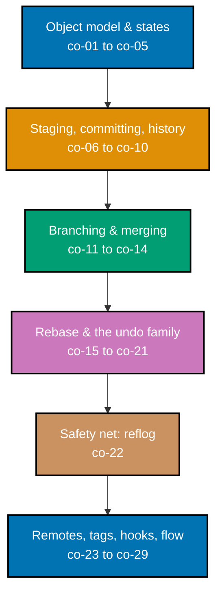

## Prerequisites

- **Prior topics**: [4 · Just Enough Python](../../just-enough-python/learning/overview.md) and
  [5 · Just Enough Bash](../../just-enough-bash/learning/overview.md). This topic assumes comfortable
  terminal fluency (piping, exit codes, editing files from a shell) and enough scripting background to
  read a small commit hook.
- **Tools & environment**: a macOS/Linux terminal; **Git** at a recent stable release (current stable is
  **2.55.0**, released 2026-06-29 -- the exact version is deliberately unpinned in this topic, since the
  core CLI and object model this topic teaches have been stable for years); a GitHub (or equivalent)
  account for the remote/pull-request flow; Neovim/VSCode with Git integration for diffs and blame.
- **Assumed knowledge**: navigating a filesystem and running CLI tools (topic 5); reading a small script
  well enough to understand a commit hook (topic 4).

## Why this exists -- the big idea

Before version control, coordinating change meant zipped folders, `final_v2_REALLY_final` filenames, and
silently overwriting a colleague's work with no way back -- there was no shared, trustworthy record of
who changed what and why. The one idea worth keeping if you forget everything else: **a commit is an
immutable snapshot of the whole tree, identified by the hash of its content, and a branch is just a
movable pointer to one commit** -- once that clicks, merge, rebase, reset, and reflog stop being magic
and become graph operations you can reason about directly.

**Cross-cutting big ideas**: `coupling-vs-cohesion` -- a branch-and-pull-request flow keeps changes that
belong together in one reviewable commit and unrelated work apart, the same discipline that shapes good
module boundaries applied to a change's shape over time. `correctness-vs-pragmatism` -- rebase buys a
clean, linear history but rewrites shared state; the disciplined compromise this topic teaches is
**rebase local work, merge shared work**.

Concretely, this topic covers the object model (blob/tree/commit/tag), everyday staging and committing,
branching with fast-forward and three-way merges, conflict resolution, rebase (including interactive
rebase), the undo family (reset/revert/restore/stash), the safety net (reflog), remotes and the
push/fetch/pull cycle, tagging, `.gitignore`, commit hooks, cherry-pick, and the pull-request /
trunk-based flow that ties it all together. The build-your-own-Git pass that reconstructs the
content-addressed object store from scratch lives in a later topic; this one builds the working
engineer's fluency with the CLI as it exists today.

## How verification works in this topic

Every worked example on the following pages is `†`: driven entirely from the `git` command line, no GUI.
Unlike a config file you can `cat` and inspect at rest, most of what Git does only becomes observable by
actually running a command and reading its real output -- there is no way to "read" a fast-forward merge
without performing one. Every example on the Beginner, Intermediate, and Advanced pages is therefore a
real, self-contained shell script (`setup.sh`) that builds a fresh scratch repository, runs the commands
under discussion, and captures genuine terminal output into `transcript.txt` -- nothing in this topic's
output was hand-written or simulated. Each page's inline "Output" block is a trimmed excerpt of its
example's own `code/*/transcript.txt` for readability (hint text, diffstat lines, and repeated diff
headers are sometimes cut); the full, byte-for-byte real transcript is always available alongside the
`setup.sh` that produced it under `learning/code/`. Examples that need a second repository
(remote/clone/push/pull, Examples 64-74) use a local **bare** repository (`git init --bare`) in place of
a network host -- deterministic, needs no network, and behaves identically to a real remote for every
command this topic teaches.

## Concepts

Every worked example in this topic's follow-up pages cites the `co-NN` concept it exercises -- this
section is the 1:1 reference those citations point back to. Read it in order: the object model comes
first because everything else (staging, branching, rebase, reflog) is ultimately a graph operation over
the objects this section introduces.

### co-01 · Repository Init and Clone

`git init` creates the `.git/` directory that turns a plain folder into a repository, and `git clone`
copies an existing repository plus its full history into a brand-new working tree.

**Why it matters**: every repository starts one of exactly two ways -- from nothing (`init`) or from
something that already exists (`clone`) -- and clone's defining property (the FULL history travels with
it, not just the latest snapshot) is what makes every clone a complete, independent backup of the project.

**Verify it**: `ls -a .git` confirms the directory genuinely exists after `init`; `git -C <dest> log
--oneline` after a clone shows the same commits the source repository has.

### co-02 · Three-States Model

Every tracked file lives in one of three areas: the **working tree** (what you edit on disk), the
**staging area / index** (what the next commit will contain), and **committed history** (permanent,
already-recorded snapshots).

**Why it matters**: nearly every confusing Git moment ("why didn't my edit get committed," "why does
`git diff` show nothing") resolves instantly once you ask "which of the three states am I looking at."
`git add` moves content forward one state; `git commit` moves it forward one more; `git restore` moves it
backward.

**Verify it**: `git status` names, for every changed file, exactly which of the three states it currently
occupies (untracked/unstaged working tree, staged index, or clean relative to the last commit).

### co-03 · Object Model

Git stores content as four hash-addressed object types -- **blob** (file content), **tree** (directory
listing), **commit** (a snapshot plus metadata), and **tag** -- each identified by the hash of its own
content.

**Why it matters**: content-addressing is what makes Git's storage both self-verifying (a corrupted
object's hash simply stops matching) and naturally deduplicating (two identical files anywhere in history
share one blob). Once this clicks, a "commit" stops being a mysterious black box and becomes exactly four
kinds of plain, inspectable objects.

**Verify it**: `git cat-file -p <hash>` prints any object's raw content; `git cat-file -t <hash>` prints
just its type -- both work identically whether `<hash>` is a full hash, an abbreviation, or a ref like
`HEAD`.

### co-04 · Refs, Branches, HEAD

A branch or tag is just a named pointer to a commit, and `HEAD` is a pointer to the _current_ branch (or,
in a detached state, directly to a commit) that decides what "current" means at any moment.

**Why it matters**: branches being cheap, plain pointers (not copies of a project) is the entire reason
Git branching is fast and nearly free -- creating one is a few bytes, not a directory copy.

**Verify it**: `git rev-parse HEAD` and `git rev-parse <branch>` resolve to the identical hash whenever
that branch is checked out; `git show-ref` lists every ref alongside the commit hash it currently points
to.

### co-05 · Staging and Status

`git add` moves changes from the working tree into the index, and `git status` reports which files are
untracked, modified-but-unstaged, or staged.

**Why it matters**: staging is the deliberate pause between "I edited something" and "this edit becomes
part of the next commit" -- it is what lets one physical editing session become several small, focused
commits instead of one large one.

**Verify it**: `git status` after any edit names the file under exactly one of "Untracked files,"
"Changes not staged for commit," or "Changes to be committed."

### co-06 · Hunk Staging

`git add -p` stages selected hunks (or, with `s`, split sub-hunks) so that one physical edit to a file can
become several separately-committed, focused changes.

**Why it matters**: real edits rarely align with commit boundaries -- you fix a bug and clean up a typo in
the same file at the same time. Hunk staging is what lets those two unrelated edits still land as two
separate, reviewable commits.

**Verify it**: after `git add -p` answers `y` to one hunk and `n` to another, `git diff --staged` shows
only the accepted hunk, and plain `git diff` still shows the rejected one.

### co-07 · Committing and Messages

`git commit` records the staged snapshot as a new, permanent commit with a subject line and optional body,
following the imperative-mood convention (Chris Beams' widely cited rules).

**Why it matters**: a commit message is the only artifact that survives to explain _why_ a change happened
-- the diff itself only shows _what_ changed. A second `-m` (or a blank line in an editor) separates the
subject from an explanatory body.

**Verify it**: `git log --format=%B -1` prints a commit's complete, raw message -- subject, blank
separator, and body, exactly as recorded.

### co-08 · Amending Commits

`git commit --amend` rewrites the most recent commit (its message and/or its content), producing a brand
new hash that replaces the previous tip entirely.

**Why it matters**: a typo in the last commit message, or a file forgotten from the last commit, does not
need a whole new "fix typo" commit cluttering history -- amend folds the correction directly into the
commit it belongs to, as if it had been right the first time.

**Verify it**: `git log --oneline` before and after an amend shows the SAME count of commits but a
DIFFERENT tip hash -- proof the old commit was replaced, not appended to.

### co-09 · Diffing

`git diff` compares states: working-tree-vs-index (the default), index-vs-HEAD (`--staged`), or any two
arbitrary commits or branches.

**Why it matters**: "what changed" is only a meaningful question once you know _between which two points_
-- the same `git diff` command answers three genuinely different questions depending only on its flags
and arguments.

**Verify it**: `git diff` and `git diff --staged` show different content for the same working tree the
instant a change is staged but not committed; `git diff <a>..<b>` compares two arbitrary endpoints
directly.

### co-10 · History Inspection

`git log` (with `--oneline`/`--graph`/`--pretty`/`-N`/`-- path`), `git show`, and `git cat-file` reveal the
commit graph and the raw objects underneath it, at whatever level of detail a question requires.

**Why it matters**: history is Git's actual product -- code review, blame, bisecting a regression, and
understanding why a line looks the way it does all start with reading history effectively, not just
committing to it.

**Verify it**: `git log --oneline -- <path>` restricts the log to only the commits that actually touched
that path; `git log --graph --all` renders the shape of every branch's history as ASCII art.

### co-11 · Branching

`git branch`/`git switch`/`git checkout` create, list, rename, delete, and move between branches, each one
a cheap, instantly-created movable pointer (co-04).

**Why it matters**: near-free branching is what makes it practical to isolate every piece of work,
however small, on its own branch -- the foundation the pull-request and trunk-based flow (co-28) is built
on.

**Verify it**: `git branch` lists every local branch with `*` marking the checked-out one; `git switch -c
<name>` creates and checks out a branch in a single step.

### co-12 · Fast-Forward Merge

When the target branch has not diverged from the branch being merged, `git merge` simply advances the
target's pointer -- no new commit is created.

**Why it matters**: a fast-forward is the cheapest possible integration -- recognizing when one is
possible (and when `--no-ff`, co-13, is deliberately forcing a real merge commit instead) explains a large
fraction of "why does my history look like this" questions.

**Verify it**: `git merge` reports the literal word "Fast-forward" in its own output, and `git log --graph`
afterward shows a single straight line with no fork.

### co-13 · Three-Way Merge

When both branches have new commits since their common ancestor, `git merge` creates a genuine **merge
commit** with two parents that combines both divergent trees.

**Why it matters**: this is Git's actual reconciliation mechanism -- most real integration work (landing a
feature branch after main has also moved) is a three-way merge, whether or not the two sides' edits
overlap.

**Verify it**: `git cat-file -p HEAD` on a merge commit shows two separate `parent` lines -- the
unambiguous, low-level signature of a real merge, distinct from any ordinary commit.

### co-14 · Conflict Resolution

Overlapping edits produce conflict markers that must be resolved by hand, re-staged, and committed -- or
the merge/rebase/cherry-pick can be aborted entirely to return to the pre-attempt state.

**Why it matters**: a conflict is not a failure state to fear -- it is Git correctly refusing to guess
which of two genuinely competing edits is "right," leaving that judgment call to a human.

**Verify it**: `git status` during an unresolved conflict lists the affected path as "both modified";
`git diff` shows Git's combined `diff --cc` view with markers for both candidate sides at once.

### co-15 · Rebase

`git rebase` replays a branch's own commits, one at a time, onto a new base commit -- producing brand-new
commit hashes and a linear history with no merge commit.

**Why it matters**: rebase is the tool for keeping a branch's history clean and linear as it sits on top
of a moving base, at the cost that every replayed commit's identity (hash) genuinely changes.

**Verify it**: `git log --oneline --graph --all` after a clean rebase shows a single straight line, no
fork -- and every replayed commit's hash differs from what it was before the rebase.

### co-16 · Interactive Rebase

`git rebase -i` opens (or, scripted, processes) a todo list that curates local history: reordering,
squashing, rewording, editing, or dropping individual commits before they land anywhere permanent.

**Why it matters**: real work rarely produces a clean commit sequence on the first pass -- interactive
rebase is how a messy sequence of "wip" commits becomes the clean, reviewable history a teammate actually
wants to read.

**Verify it**: after a `squash`, `git log --format=%B -1` shows the combined message of every squashed
commit; after a `drop`, that commit's content never appears anywhere in the resulting log or working tree.

### co-17 · Rebase-vs-Merge Policy

Because rebase rewrites commit identity, the discipline this topic teaches is: **rebase local work, merge
shared work -- never rebase history someone else has already pulled.**

**Why it matters**: rebasing a branch others have fetched forces every one of them to reconcile diverging
histories by hand; the clean linear history rebase buys is worth it only while the work is still entirely
yours.

**Verify it**: integrating the identical two-branch situation once by merge and once by rebase (comparing
`git log --graph` for each) makes the shape difference -- and therefore the stakes of picking wrong --
directly visible.

### co-18 · Reset Modes

`git reset` moves `HEAD` and, depending on mode, the index and/or the working tree: `--soft` moves only
`HEAD`; `--mixed` (the **default**) also resets the index; `--hard` also overwrites the working tree.

**Why it matters**: the three modes form an escalating scope of "how much do I want to undo" -- soft keeps
everything staged, mixed keeps everything on disk but unstaged, hard discards the content entirely. Given
one path argument instead of a commit, reset instead just unstages that one file, leaving `HEAD` alone.

**Verify it**: `git status` after each mode shows a different state for the exact same undone commit --
staged (soft), unstaged-but-present (mixed), or gone entirely (hard).

### co-19 · Revert

`git revert` records a brand-new commit whose diff is the exact inverse of an earlier one, undoing its
effect without rewriting or removing anything from history.

**Why it matters**: revert is the _safe_, _additive_ undo -- unlike reset, it is safe to use even on
commits that have already been shared, because it never rewrites a hash anyone else may already have.

**Verify it**: `git log --oneline` after a revert shows one MORE commit than before (never fewer), and
`git cat-file -p HEAD` shows a completely ordinary, single-parent commit whose diff is the inverse of the
target.

### co-20 · Restore Files

`git restore` (with `--staged`/`--source`) recovers file content from the index, or from any commit, back
into the working tree, without touching `HEAD` or any branch pointer at all.

**Why it matters**: restore is the file-scoped counterpart to reset -- reach for it when the goal is
"fix this one file's content," not "move where HEAD points."

**Verify it**: `git restore <path>` with no flags discards an uncommitted edit back to HEAD's version;
`git restore --source=<commit> <path>` pulls that file's content from any arbitrary older commit instead.

### co-21 · Stash

`git stash` shelves uncommitted changes onto a stack, restoring a clean working tree, and `pop`/`apply`
restores them later -- `pop` also removes the entry, `apply` leaves a copy behind.

**Why it matters**: stash is the answer to "I need a clean working tree right now, but I'm not ready to
commit this yet" -- switching branches, pulling updates, or just context-switching, all without losing
in-progress work.

**Verify it**: `git stash list` shows one entry per shelved change, each labeled either with an
auto-generated description or a custom one from `git stash push -m`.

### co-22 · Reflog

`git reflog` records every movement of `HEAD` in this local repository -- every commit, checkout, reset,
and rebase step -- making "lost" commits and deleted branches recoverable long after a destructive
operation.

**Why it matters**: this is Git's actual safety net. Nothing a `reset --hard` or a botched rebase does is
truly permanent locally, as long as the reflog still remembers where things used to be. Git tracks two
separate default expiration windows: reflog entries still reachable from a branch tip expire after 90
days (`gc.reflogExpire`), but entries made unreachable by a `reset --hard` or rebase -- exactly the
recovery scenario here -- expire after only 30 days by default (`gc.reflogExpireUnreachable`).

**Verify it**: `git reflog` lists entries as `HEAD@{n}`, newest first; `git reset --hard 'HEAD@{1}'` (or
recreating a branch at a hash pulled from reflog) restores exactly what a prior destructive command
discarded.

### co-23 · Remotes, Fetch, Push, Pull

`git remote`, `git fetch`, `git push`, and `git pull` connect a local repository to remote copies and
synchronize commits between them -- fetch downloads without touching local branches, push uploads, and
pull is fetch plus an integration step.

**Why it matters**: this is the entire mechanism of distributed collaboration -- every teammate has a
complete, independent repository, and these four commands are how independent histories stay in sync
without a single point of failure.

**Verify it**: `git remote -v` lists every configured remote's fetch/push URLs; a push to a remote that has
since moved is REJECTED, not silently overwritten (co-23's non-fast-forward safety).

### co-24 · Tracking Branches

An upstream (tracking) relationship links a local branch to a remote-tracking ref, so that plain `push` and
`pull` know their default target without naming it every time.

**Why it matters**: without a tracking relationship, every push/pull needs an explicit remote and branch
name; `git push -u` sets it up once, and `git branch -vv` shows exactly which remote branch (and how far
ahead/behind) each local branch tracks.

**Verify it**: `git branch -vv` shows `[origin/<branch>]` next to a tracked branch's name; switching to a
branch that exists only on the remote auto-creates a local tracking branch from it.

### co-25 · Tagging

`git tag` marks a commit with a lightweight (a bare pointer) or annotated (a genuine tag _object_, with
its own message and tagger) name, typically for a release.

**Why it matters**: unlike a branch, a tag is meant to never move -- it is the permanent, human-readable
name for "this exact commit was release v1.0," and an annotated tag additionally records who tagged it and
why.

**Verify it**: `git cat-file -t <tag>` prints "tag" for an annotated tag but resolves straight through to
"commit" for a lightweight one -- the object-model proof of the difference.

### co-26 · Gitignore

`.gitignore` patterns keep generated or secret files untracked and out of `git status`'s listings, while
`git add -f` can deliberately override an ignore rule for one specific file.

**Why it matters**: without it, every build artifact, dependency directory, and local secret file would
constantly clutter `git status` and risk accidental commits -- `.gitignore` is a project's explicit
declaration of what was never meant to be tracked.

**Verify it**: a file matching an ignore pattern never appears in `git status`, under any section, even
though it genuinely exists on disk; `git add -f` stages it anyway, on purpose, for the rare deliberate
exception.

### co-27 · Commit Hooks

Executable scripts in `.git/hooks/` (for example `pre-commit`) run automatically at specific lifecycle
points, and a nonzero exit code from one of them blocks the operation it guards.

**Why it matters**: hooks are how local, automated policy (linting, secret-scanning, message format) gets
enforced BEFORE a commit exists at all, rather than caught later in review.

**Verify it**: a `pre-commit` hook that `exit 1`s genuinely prevents `git commit` from creating a commit
object; the exact same hook `exit 0`s and lets a clean commit through unaffected.

### co-28 · Pull-Request / Trunk-Based Flow

Short-lived branches are integrated to trunk through review (a pull request) and frequent merges -- the
backbone of trunk-based development, where branches exist only briefly rather than accumulating drift.

**Why it matters**: this is the collaboration pattern nearly every real engineering team runs on top of
everything else this topic teaches -- branch, commit, push, review, merge, delete, repeat, on a cadence
measured in hours or a couple of days rather than weeks.

**Verify it**: a short-lived branch, pushed and reviewed, lands on trunk via a `--no-ff` merge (visible as
a merge commit) or a fast-forward for a trivially small change -- either way, `git log` on trunk afterward
shows the change genuinely present and the short-lived branch gone.

### co-29 · Cherry-Pick

`git cherry-pick` applies the change introduced by one specific, individual commit onto the current
branch as a brand-new commit -- without pulling in anything else from the source branch.

**Why it matters**: this is the tool for "I need JUST that one fix, not the rest of that branch's history"
-- a hotfix that needs to land on a release branch and on trunk independently is the canonical use case.

**Verify it**: after a cherry-pick, the target branch's log shows a new commit with the same message and
content-change as the source, but a genuinely DIFFERENT hash.

## Examples by Level

### Beginner (Examples 1–28)

- [Example 1: Init a Repository](/en/c/learn/fundamentally-strong/software-engineer/version-control-and-git/learning/beginner#example-1-init-a-repository)
- [Example 2: Check a Clean Status](/en/c/learn/fundamentally-strong/software-engineer/version-control-and-git/learning/beginner#example-2-check-a-clean-status)
- [Example 3: Create an Untracked File](/en/c/learn/fundamentally-strong/software-engineer/version-control-and-git/learning/beginner#example-3-create-an-untracked-file)
- [Example 4: Stage a File](/en/c/learn/fundamentally-strong/software-engineer/version-control-and-git/learning/beginner#example-4-stage-a-file)
- [Example 5: Make the First Commit](/en/c/learn/fundamentally-strong/software-engineer/version-control-and-git/learning/beginner#example-5-make-the-first-commit)
- [Example 6: A Commit Shows Its Snapshot](/en/c/learn/fundamentally-strong/software-engineer/version-control-and-git/learning/beginner#example-6-a-commit-shows-its-snapshot)
- [Example 7: Stage All Changes](/en/c/learn/fundamentally-strong/software-engineer/version-control-and-git/learning/beginner#example-7-stage-all-changes)
- [Example 8: Unstage a File](/en/c/learn/fundamentally-strong/software-engineer/version-control-and-git/learning/beginner#example-8-unstage-a-file)
- [Example 9: Diff the Working Tree](/en/c/learn/fundamentally-strong/software-engineer/version-control-and-git/learning/beginner#example-9-diff-the-working-tree)
- [Example 10: Diff Staged Changes](/en/c/learn/fundamentally-strong/software-engineer/version-control-and-git/learning/beginner#example-10-diff-staged-changes)
- [Example 11: View the Log One-Line](/en/c/learn/fundamentally-strong/software-engineer/version-control-and-git/learning/beginner#example-11-view-the-log-one-line)
- [Example 12: View the Log as a Graph](/en/c/learn/fundamentally-strong/software-engineer/version-control-and-git/learning/beginner#example-12-view-the-log-as-a-graph)
- [Example 13: Inspect a Blob with cat-file](/en/c/learn/fundamentally-strong/software-engineer/version-control-and-git/learning/beginner#example-13-inspect-a-blob-with-cat-file)
- [Example 14: Inspect a Commit Object](/en/c/learn/fundamentally-strong/software-engineer/version-control-and-git/learning/beginner#example-14-inspect-a-commit-object)
- [Example 15: Inspect a Tree Object](/en/c/learn/fundamentally-strong/software-engineer/version-control-and-git/learning/beginner#example-15-inspect-a-tree-object)
- [Example 16: Check an Object's Type](/en/c/learn/fundamentally-strong/software-engineer/version-control-and-git/learning/beginner#example-16-check-an-objects-type)
- [Example 17: Amend the Last Commit](/en/c/learn/fundamentally-strong/software-engineer/version-control-and-git/learning/beginner#example-17-amend-the-last-commit)
- [Example 18: Amend In a Forgotten File](/en/c/learn/fundamentally-strong/software-engineer/version-control-and-git/learning/beginner#example-18-amend-in-a-forgotten-file)
- [Example 19: Gitignore Basics](/en/c/learn/fundamentally-strong/software-engineer/version-control-and-git/learning/beginner#example-19-gitignore-basics)
- [Example 20: Force-Add an Ignored File](/en/c/learn/fundamentally-strong/software-engineer/version-control-and-git/learning/beginner#example-20-force-add-an-ignored-file)
- [Example 21: Create a Branch](/en/c/learn/fundamentally-strong/software-engineer/version-control-and-git/learning/beginner#example-21-create-a-branch)
- [Example 22: Switch Branches](/en/c/learn/fundamentally-strong/software-engineer/version-control-and-git/learning/beginner#example-22-switch-branches)
- [Example 23: Create and Switch in One Step](/en/c/learn/fundamentally-strong/software-engineer/version-control-and-git/learning/beginner#example-23-create-and-switch-in-one-step)
- [Example 24: HEAD Tracks the Branch](/en/c/learn/fundamentally-strong/software-engineer/version-control-and-git/learning/beginner#example-24-head-tracks-the-branch)
- [Example 25: List Every Ref](/en/c/learn/fundamentally-strong/software-engineer/version-control-and-git/learning/beginner#example-25-list-every-ref)
- [Example 26: Delete a Merged Branch](/en/c/learn/fundamentally-strong/software-engineer/version-control-and-git/learning/beginner#example-26-delete-a-merged-branch)
- [Example 27: Rename a Branch](/en/c/learn/fundamentally-strong/software-engineer/version-control-and-git/learning/beginner#example-27-rename-a-branch)
- [Example 28: A Lightweight Tag](/en/c/learn/fundamentally-strong/software-engineer/version-control-and-git/learning/beginner#example-28-a-lightweight-tag)

### Intermediate (Examples 29–60)

- [Example 29: Stage Hunks Interactively](/en/c/learn/fundamentally-strong/software-engineer/version-control-and-git/learning/intermediate#example-29-stage-hunks-interactively)
- [Example 30: Split a Hunk](/en/c/learn/fundamentally-strong/software-engineer/version-control-and-git/learning/intermediate#example-30-split-a-hunk)
- [Example 31: Commit with a Body](/en/c/learn/fundamentally-strong/software-engineer/version-control-and-git/learning/intermediate#example-31-commit-with-a-body)
- [Example 32: Diff Two Commits](/en/c/learn/fundamentally-strong/software-engineer/version-control-and-git/learning/intermediate#example-32-diff-two-commits)
- [Example 33: Diff Two Branches](/en/c/learn/fundamentally-strong/software-engineer/version-control-and-git/learning/intermediate#example-33-diff-two-branches)
- [Example 34: Limit and Format the Log](/en/c/learn/fundamentally-strong/software-engineer/version-control-and-git/learning/intermediate#example-34-limit-and-format-the-log)
- [Example 35: Log Restricted to a Path](/en/c/learn/fundamentally-strong/software-engineer/version-control-and-git/learning/intermediate#example-35-log-restricted-to-a-path)
- [Example 36: A Fast-Forward Merge](/en/c/learn/fundamentally-strong/software-engineer/version-control-and-git/learning/intermediate#example-36-a-fast-forward-merge)
- [Example 37: Force a Merge Commit with --no-ff](/en/c/learn/fundamentally-strong/software-engineer/version-control-and-git/learning/intermediate#example-37-force-a-merge-commit-with---no-ff)
- [Example 38: A Clean Three-Way Merge](/en/c/learn/fundamentally-strong/software-engineer/version-control-and-git/learning/intermediate#example-38-a-clean-three-way-merge)
- [Example 39: Create a Merge Conflict](/en/c/learn/fundamentally-strong/software-engineer/version-control-and-git/learning/intermediate#example-39-create-a-merge-conflict)
- [Example 40: Resolve a Merge Conflict](/en/c/learn/fundamentally-strong/software-engineer/version-control-and-git/learning/intermediate#example-40-resolve-a-merge-conflict)
- [Example 41: Abort a Merge](/en/c/learn/fundamentally-strong/software-engineer/version-control-and-git/learning/intermediate#example-41-abort-a-merge)
- [Example 42: Inspect a Conflict's Combined Diff](/en/c/learn/fundamentally-strong/software-engineer/version-control-and-git/learning/intermediate#example-42-inspect-a-conflicts-combined-diff)
- [Example 43: Rebase onto Main](/en/c/learn/fundamentally-strong/software-engineer/version-control-and-git/learning/intermediate#example-43-rebase-onto-main)
- [Example 44: Resolve a Rebase Conflict and Continue](/en/c/learn/fundamentally-strong/software-engineer/version-control-and-git/learning/intermediate#example-44-resolve-a-rebase-conflict-and-continue)
- [Example 45: Abort a Rebase](/en/c/learn/fundamentally-strong/software-engineer/version-control-and-git/learning/intermediate#example-45-abort-a-rebase)
- [Example 46: Interactive Rebase -- Squash](/en/c/learn/fundamentally-strong/software-engineer/version-control-and-git/learning/intermediate#example-46-interactive-rebase----squash)
- [Example 47: Interactive Rebase -- Reword](/en/c/learn/fundamentally-strong/software-engineer/version-control-and-git/learning/intermediate#example-47-interactive-rebase----reword)
- [Example 48: Interactive Rebase -- Reorder](/en/c/learn/fundamentally-strong/software-engineer/version-control-and-git/learning/intermediate#example-48-interactive-rebase----reorder)
- [Example 49: Interactive Rebase -- Drop](/en/c/learn/fundamentally-strong/software-engineer/version-control-and-git/learning/intermediate#example-49-interactive-rebase----drop)
- [Example 50: Merge vs. Rebase -- Same Change, Different History](/en/c/learn/fundamentally-strong/software-engineer/version-control-and-git/learning/intermediate#example-50-merge-vs-rebase----same-change-different-history)
- [Example 51: Reset --soft](/en/c/learn/fundamentally-strong/software-engineer/version-control-and-git/learning/intermediate#example-51-reset---soft)
- [Example 52: Reset (Mixed, the Default)](/en/c/learn/fundamentally-strong/software-engineer/version-control-and-git/learning/intermediate#example-52-reset-mixed-the-default)
- [Example 53: Reset --hard](/en/c/learn/fundamentally-strong/software-engineer/version-control-and-git/learning/intermediate#example-53-reset---hard)
- [Example 54: Unstage One File with a Path-Scoped Reset](/en/c/learn/fundamentally-strong/software-engineer/version-control-and-git/learning/intermediate#example-54-unstage-one-file-with-a-path-scoped-reset)
- [Example 55: Revert a Commit](/en/c/learn/fundamentally-strong/software-engineer/version-control-and-git/learning/intermediate#example-55-revert-a-commit)
- [Example 56: Restore a File from HEAD](/en/c/learn/fundamentally-strong/software-engineer/version-control-and-git/learning/intermediate#example-56-restore-a-file-from-head)
- [Example 57: Restore a File from an Older Commit](/en/c/learn/fundamentally-strong/software-engineer/version-control-and-git/learning/intermediate#example-57-restore-a-file-from-an-older-commit)
- [Example 58: Stash Uncommitted Changes](/en/c/learn/fundamentally-strong/software-engineer/version-control-and-git/learning/intermediate#example-58-stash-uncommitted-changes)
- [Example 59: Pop a Stash](/en/c/learn/fundamentally-strong/software-engineer/version-control-and-git/learning/intermediate#example-59-pop-a-stash)
- [Example 60: A Named Stash and the Stash List](/en/c/learn/fundamentally-strong/software-engineer/version-control-and-git/learning/intermediate#example-60-a-named-stash-and-the-stash-list)

### Advanced (Examples 61–82)

- [Example 61: Inspect the Reflog](/en/c/learn/fundamentally-strong/software-engineer/version-control-and-git/learning/advanced#example-61-inspect-the-reflog)
- [Example 62: Recover After a Hard Reset](/en/c/learn/fundamentally-strong/software-engineer/version-control-and-git/learning/advanced#example-62-recover-after-a-hard-reset)
- [Example 63: Recover a Deleted Branch](/en/c/learn/fundamentally-strong/software-engineer/version-control-and-git/learning/advanced#example-63-recover-a-deleted-branch)
- [Example 64: Add a Remote](/en/c/learn/fundamentally-strong/software-engineer/version-control-and-git/learning/advanced#example-64-add-a-remote)
- [Example 65: Clone a Repository](/en/c/learn/fundamentally-strong/software-engineer/version-control-and-git/learning/advanced#example-65-clone-a-repository)
- [Example 66: Push to a Remote](/en/c/learn/fundamentally-strong/software-engineer/version-control-and-git/learning/advanced#example-66-push-to-a-remote)
- [Example 67: Set Upstream Tracking](/en/c/learn/fundamentally-strong/software-engineer/version-control-and-git/learning/advanced#example-67-set-upstream-tracking)
- [Example 68: Fetch Updates](/en/c/learn/fundamentally-strong/software-engineer/version-control-and-git/learning/advanced#example-68-fetch-updates)
- [Example 69: Pull with a Fast-Forward](/en/c/learn/fundamentally-strong/software-engineer/version-control-and-git/learning/advanced#example-69-pull-with-a-fast-forward)
- [Example 70: Pull with Rebase](/en/c/learn/fundamentally-strong/software-engineer/version-control-and-git/learning/advanced#example-70-pull-with-rebase)
- [Example 71: Push Rejected (Non-Fast-Forward)](/en/c/learn/fundamentally-strong/software-engineer/version-control-and-git/learning/advanced#example-71-push-rejected-non-fast-forward)
- [Example 72: Check Out a Remote-Tracking Branch](/en/c/learn/fundamentally-strong/software-engineer/version-control-and-git/learning/advanced#example-72-check-out-a-remote-tracking-branch)
- [Example 73: Create an Annotated Tag](/en/c/learn/fundamentally-strong/software-engineer/version-control-and-git/learning/advanced#example-73-create-an-annotated-tag)
- [Example 74: Push Tags to a Remote](/en/c/learn/fundamentally-strong/software-engineer/version-control-and-git/learning/advanced#example-74-push-tags-to-a-remote)
- [Example 75: Cherry-Pick a Commit](/en/c/learn/fundamentally-strong/software-engineer/version-control-and-git/learning/advanced#example-75-cherry-pick-a-commit)
- [Example 76: Resolve a Cherry-Pick Conflict](/en/c/learn/fundamentally-strong/software-engineer/version-control-and-git/learning/advanced#example-76-resolve-a-cherry-pick-conflict)
- [Example 77: Install a Pre-Commit Hook](/en/c/learn/fundamentally-strong/software-engineer/version-control-and-git/learning/advanced#example-77-install-a-pre-commit-hook)
- [Example 78: The Same Hook Allows a Clean Commit](/en/c/learn/fundamentally-strong/software-engineer/version-control-and-git/learning/advanced#example-78-the-same-hook-allows-a-clean-commit)
- [Example 79: A Pull-Request Branch Flow](/en/c/learn/fundamentally-strong/software-engineer/version-control-and-git/learning/advanced#example-79-a-pull-request-branch-flow)
- [Example 80: A Trunk-Based Short-Lived Branch](/en/c/learn/fundamentally-strong/software-engineer/version-control-and-git/learning/advanced#example-80-a-trunk-based-short-lived-branch)
- [Example 81: Revert a Merge Commit](/en/c/learn/fundamentally-strong/software-engineer/version-control-and-git/learning/advanced#example-81-revert-a-merge-commit)
- [Example 82: Verify History Is Intact After Recovery](/en/c/learn/fundamentally-strong/software-engineer/version-control-and-git/learning/advanced#example-82-verify-history-is-intact-after-recovery)

---

← Previous: [5 · Just Enough Bash Drilling](../../just-enough-bash/drilling/overview.md) · Next:
[Beginner Examples](./beginner.md) →
