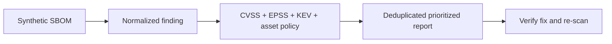

> **Offline by default.** The course script reads only its in-memory fictional fixture. It has no HTTP client, no scanner subprocess, and no host or URL parameter.

## Run your first example

```sh
# => Verifies deterministic synthetic inventory, prioritization, and report invariants.
# => This command reads no network data and does not inspect the surrounding repository.
python3 code/vuln_triage_lab.py verify
```

## Concepts

The course covers lifecycle and identifier stack (`co-01`–`co-06`), CVSS and risk signals (`co-07`–`co-14`), scanning modalities (`co-15`–`co-21`), SBOM and package identity (`co-22`–`co-28`), normalization/correlation/reachability (`co-29`–`co-32`), and program reporting (`co-33`–`co-34`).

## Examples by level

- **Beginner (1–28)**: lifecycle, CVE/CWE/CPE identity, CVSS, SBOM, purl, SAST/DAST/SCA.
- **Intermediate (29–56)**: modality trade-offs, EPSS/KEV policy, SLA/risk acceptance, OSV, normalized findings, VEX, and reachability.
- **Advanced (57–80)**: correlation and deduplication, enrichment, network-scan boundaries, re-scanning, reports, metrics, CI gates, and the complete tool.

## Lab map



The flow is intentionally one-way and local: fixture input becomes an explainable decision, then a reviewable report. It never becomes a scan command or a target-selection workflow.
