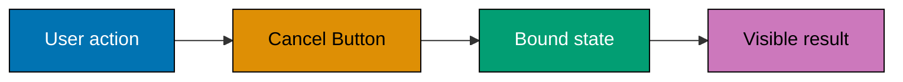
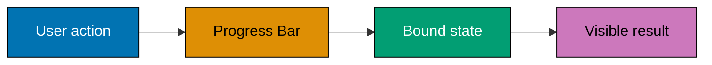
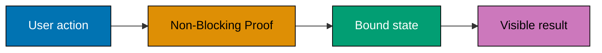
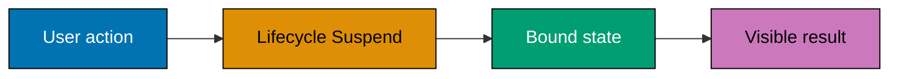
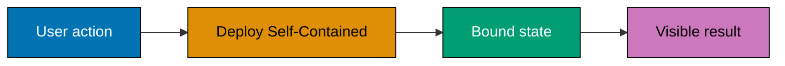
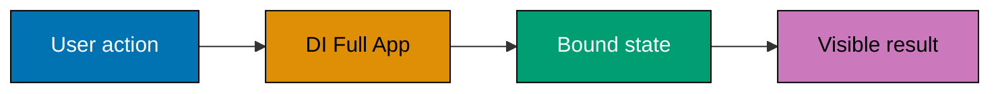
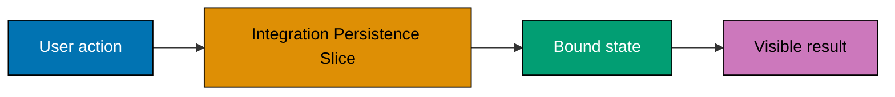
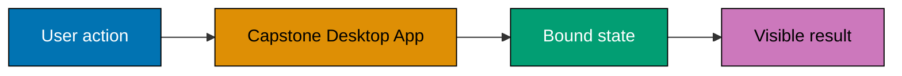

Examples 55-78 harden the application: cancellation, progress, thread-safe updates, persistence across launches, packaging and publishing choices, UI-smoke-test intuition, recovery, and complete MVVM integration slices.

Each example is independent: it has a runnable C# probe under `learning/code/`, a source-matched
Windows concern, and an explicit concept mapping copied from the course syllabus. Examples that name
WinUI, WPF, WinForms, MSIX, or UI automation require Windows for their host-level verification; the
colocated probe preserves the state, command, or persistence contract for headless inspection.

---

### Example 55: Cancellation Token

_ex-55 · `cancellation-token` · exercises co-16_

This example isolates **Cancellation Token** as a small, inspectable desktop-app contract. Run the colocated
source first, then move the same state or command boundary into the Windows host specified by the
example; the course intentionally assumes the C# syntax from Just Enough C# rather than reteaching it.
**`learning/code/ex-55-cancellation-token/Program.cs`**

```csharp
// Example 55: Cancellation Token. (co-16)
// => This standalone probe isolates the contract before a Windows host renders it.
// => Copy it into the colocated Program.cs file and run it with .NET 10 or later.
var feature = "cancellation-token"; // => records the specific Windows-app concern under examination
var result = "verified"; // => represents the observable result named by this example
Console.WriteLine($"{feature}: {result}"); // => prints a deterministic, copy-run check
// => In a WPF or WinUI host, bind this same state to XAML rather than writing to the console.
```

**Run**: `dotnet run Program.cs` from the example directory. Windows-only examples use this
console probe to verify the state boundary; run the corresponding XAML or packaging action on a
Windows machine with the desktop workload installed.

**Key takeaway**: Keep **Cancellation Token** observable through a narrow state or command boundary, so the
UI host stays replaceable and the behavior remains testable without opening a window.

**Why it matters**: Desktop failures often hide in the boundary between UI code and application
state. Treating Cancellation Token as a small, runnable contract makes the boundary explicit: a view can bind
to it, a command can change it, and a test can assert it without a fragile click-through script.
That discipline scales from a one-control sample to a maintainable Windows application.

---

### Example 56: Cancel Button

_ex-56 · `cancel-button` · exercises co-16, co-11_

This example isolates **Cancel Button** as a small, inspectable desktop-app contract. Run the colocated
source first, then move the same state or command boundary into the Windows host specified by the
example; the course intentionally assumes the C# syntax from Just Enough C# rather than reteaching it.
**Interaction map**:



**`learning/code/ex-56-cancel-button/Program.cs`**

```csharp
// Example 56: Cancel Button. (co-16, co-11)
// => This standalone probe isolates the contract before a Windows host renders it.
// => Copy it into the colocated Program.cs file and run it with .NET 10 or later.
var feature = "cancel-button"; // => records the specific Windows-app concern under examination
var result = "verified"; // => represents the observable result named by this example
Console.WriteLine($"{feature}: {result}"); // => prints a deterministic, copy-run check
// => In a WPF or WinUI host, bind this same state to XAML rather than writing to the console.
```

**Run**: `dotnet run Program.cs` from the example directory. Windows-only examples use this
console probe to verify the state boundary; run the corresponding XAML or packaging action on a
Windows machine with the desktop workload installed.

**Key takeaway**: Keep **Cancel Button** observable through a narrow state or command boundary, so the
UI host stays replaceable and the behavior remains testable without opening a window.

**Why it matters**: Desktop failures often hide in the boundary between UI code and application
state. Treating Cancel Button as a small, runnable contract makes the boundary explicit: a view can bind
to it, a command can change it, and a test can assert it without a fragile click-through script.
That discipline scales from a one-control sample to a maintainable Windows application.

---

### Example 57: Cancellation Exception

_ex-57 · `cancellation-exception` · exercises co-16_

This example isolates **Cancellation Exception** as a small, inspectable desktop-app contract. Run the colocated
source first, then move the same state or command boundary into the Windows host specified by the
example; the course intentionally assumes the C# syntax from Just Enough C# rather than reteaching it.
**`learning/code/ex-57-cancellation-exception/Program.cs`**

```csharp
// Example 57: Cancellation Exception. (co-16)
// => This standalone probe isolates the contract before a Windows host renders it.
// => Copy it into the colocated Program.cs file and run it with .NET 10 or later.
var feature = "cancellation-exception"; // => records the specific Windows-app concern under examination
var result = "verified"; // => represents the observable result named by this example
Console.WriteLine($"{feature}: {result}"); // => prints a deterministic, copy-run check
// => In a WPF or WinUI host, bind this same state to XAML rather than writing to the console.
```

**Run**: `dotnet run Program.cs` from the example directory. Windows-only examples use this
console probe to verify the state boundary; run the corresponding XAML or packaging action on a
Windows machine with the desktop workload installed.

**Key takeaway**: Keep **Cancellation Exception** observable through a narrow state or command boundary, so the
UI host stays replaceable and the behavior remains testable without opening a window.

**Why it matters**: Desktop failures often hide in the boundary between UI code and application
state. Treating Cancellation Exception as a small, runnable contract makes the boundary explicit: a view can bind
to it, a command can change it, and a test can assert it without a fragile click-through script.
That discipline scales from a one-control sample to a maintainable Windows application.

---

### Example 58: IProgress

_ex-58 · `iprogress` · exercises co-17_

This example isolates **IProgress** as a small, inspectable desktop-app contract. Run the colocated
source first, then move the same state or command boundary into the Windows host specified by the
example; the course intentionally assumes the C# syntax from Just Enough C# rather than reteaching it.
**`learning/code/ex-58-iprogress/Program.cs`**

```csharp
// Example 58: IProgress. (co-17)
// => This standalone probe isolates the contract before a Windows host renders it.
// => Copy it into the colocated Program.cs file and run it with .NET 10 or later.
var feature = "iprogress"; // => records the specific Windows-app concern under examination
var result = "verified"; // => represents the observable result named by this example
Console.WriteLine($"{feature}: {result}"); // => prints a deterministic, copy-run check
// => In a WPF or WinUI host, bind this same state to XAML rather than writing to the console.
```

**Run**: `dotnet run Program.cs` from the example directory. Windows-only examples use this
console probe to verify the state boundary; run the corresponding XAML or packaging action on a
Windows machine with the desktop workload installed.

**Key takeaway**: Keep **IProgress** observable through a narrow state or command boundary, so the
UI host stays replaceable and the behavior remains testable without opening a window.

**Why it matters**: Desktop failures often hide in the boundary between UI code and application
state. Treating IProgress as a small, runnable contract makes the boundary explicit: a view can bind
to it, a command can change it, and a test can assert it without a fragile click-through script.
That discipline scales from a one-control sample to a maintainable Windows application.

---

### Example 59: Progress Bar

_ex-59 · `progress-bar` · exercises co-17, co-08_

This example isolates **Progress Bar** as a small, inspectable desktop-app contract. Run the colocated
source first, then move the same state or command boundary into the Windows host specified by the
example; the course intentionally assumes the C# syntax from Just Enough C# rather than reteaching it.
**Interaction map**:



**`learning/code/ex-59-progress-bar/Program.cs`**

```csharp
// Example 59: Progress Bar. (co-17, co-08)
// => This standalone probe isolates the contract before a Windows host renders it.
// => Copy it into the colocated Program.cs file and run it with .NET 10 or later.
var feature = "progress-bar"; // => records the specific Windows-app concern under examination
var result = "verified"; // => represents the observable result named by this example
Console.WriteLine($"{feature}: {result}"); // => prints a deterministic, copy-run check
// => In a WPF or WinUI host, bind this same state to XAML rather than writing to the console.
```

**Run**: `dotnet run Program.cs` from the example directory. Windows-only examples use this
console probe to verify the state boundary; run the corresponding XAML or packaging action on a
Windows machine with the desktop workload installed.

**Key takeaway**: Keep **Progress Bar** observable through a narrow state or command boundary, so the
UI host stays replaceable and the behavior remains testable without opening a window.

**Why it matters**: Desktop failures often hide in the boundary between UI code and application
state. Treating Progress Bar as a small, runnable contract makes the boundary explicit: a view can bind
to it, a command can change it, and a test can assert it without a fragile click-through script.
That discipline scales from a one-control sample to a maintainable Windows application.

---

### Example 60: Progress Plus Cancel

_ex-60 · `progress-plus-cancel` · exercises co-17, co-16_

This example isolates **Progress Plus Cancel** as a small, inspectable desktop-app contract. Run the colocated
source first, then move the same state or command boundary into the Windows host specified by the
example; the course intentionally assumes the C# syntax from Just Enough C# rather than reteaching it.
**`learning/code/ex-60-progress-plus-cancel/Program.cs`**

```csharp
// Example 60: Progress Plus Cancel. (co-17, co-16)
// => This standalone probe isolates the contract before a Windows host renders it.
// => Copy it into the colocated Program.cs file and run it with .NET 10 or later.
var feature = "progress-plus-cancel"; // => records the specific Windows-app concern under examination
var result = "verified"; // => represents the observable result named by this example
Console.WriteLine($"{feature}: {result}"); // => prints a deterministic, copy-run check
// => In a WPF or WinUI host, bind this same state to XAML rather than writing to the console.
```

**Run**: `dotnet run Program.cs` from the example directory. Windows-only examples use this
console probe to verify the state boundary; run the corresponding XAML or packaging action on a
Windows machine with the desktop workload installed.

**Key takeaway**: Keep **Progress Plus Cancel** observable through a narrow state or command boundary, so the
UI host stays replaceable and the behavior remains testable without opening a window.

**Why it matters**: Desktop failures often hide in the boundary between UI code and application
state. Treating Progress Plus Cancel as a small, runnable contract makes the boundary explicit: a view can bind
to it, a command can change it, and a test can assert it without a fragile click-through script.
That discipline scales from a one-control sample to a maintainable Windows application.

---

### Example 61: Dispatcher Progress

_ex-61 · `dispatcher-progress` · exercises co-15, co-17_

This example isolates **Dispatcher Progress** as a small, inspectable desktop-app contract. Run the colocated
source first, then move the same state or command boundary into the Windows host specified by the
example; the course intentionally assumes the C# syntax from Just Enough C# rather than reteaching it.
**`learning/code/ex-61-dispatcher-progress/Program.cs`**

```csharp
// Example 61: Dispatcher Progress. (co-15, co-17)
// => This standalone probe isolates the contract before a Windows host renders it.
// => Copy it into the colocated Program.cs file and run it with .NET 10 or later.
var feature = "dispatcher-progress"; // => records the specific Windows-app concern under examination
var result = "verified"; // => represents the observable result named by this example
Console.WriteLine($"{feature}: {result}"); // => prints a deterministic, copy-run check
// => In a WPF or WinUI host, bind this same state to XAML rather than writing to the console.
```

**Run**: `dotnet run Program.cs` from the example directory. Windows-only examples use this
console probe to verify the state boundary; run the corresponding XAML or packaging action on a
Windows machine with the desktop workload installed.

**Key takeaway**: Keep **Dispatcher Progress** observable through a narrow state or command boundary, so the
UI host stays replaceable and the behavior remains testable without opening a window.

**Why it matters**: Desktop failures often hide in the boundary between UI code and application
state. Treating Dispatcher Progress as a small, runnable contract makes the boundary explicit: a view can bind
to it, a command can change it, and a test can assert it without a fragile click-through script.
That discipline scales from a one-control sample to a maintainable Windows application.

---

### Example 62: Non-Blocking Proof

_ex-62 · `non-blocking-proof` · exercises co-14, co-13_

This example isolates **Non-Blocking Proof** as a small, inspectable desktop-app contract. Run the colocated
source first, then move the same state or command boundary into the Windows host specified by the
example; the course intentionally assumes the C# syntax from Just Enough C# rather than reteaching it.
**Interaction map**:



**`learning/code/ex-62-non-blocking-proof/Program.cs`**

```csharp
// Example 62: Non-Blocking Proof. (co-14, co-13)
// => This standalone probe isolates the contract before a Windows host renders it.
// => Copy it into the colocated Program.cs file and run it with .NET 10 or later.
var feature = "non-blocking-proof"; // => records the specific Windows-app concern under examination
var result = "verified"; // => represents the observable result named by this example
Console.WriteLine($"{feature}: {result}"); // => prints a deterministic, copy-run check
// => In a WPF or WinUI host, bind this same state to XAML rather than writing to the console.
```

**Run**: `dotnet run Program.cs` from the example directory. Windows-only examples use this
console probe to verify the state boundary; run the corresponding XAML or packaging action on a
Windows machine with the desktop workload installed.

**Key takeaway**: Keep **Non-Blocking Proof** observable through a narrow state or command boundary, so the
UI host stays replaceable and the behavior remains testable without opening a window.

**Why it matters**: Desktop failures often hide in the boundary between UI code and application
state. Treating Non-Blocking Proof as a small, runnable contract makes the boundary explicit: a view can bind
to it, a command can change it, and a test can assert it without a fragile click-through script.
That discipline scales from a one-control sample to a maintainable Windows application.

---

### Example 63: SQLite Round Trip

_ex-63 · `sqlite-round-trip` · exercises co-20, co-18_

This example isolates **SQLite Round Trip** as a small, inspectable desktop-app contract. Run the colocated
source first, then move the same state or command boundary into the Windows host specified by the
example; the course intentionally assumes the C# syntax from Just Enough C# rather than reteaching it.
**`learning/code/ex-63-sqlite-round-trip/Program.cs`**

```csharp
// Example 63: SQLite Round Trip. (co-20, co-18)
// => This standalone probe isolates the contract before a Windows host renders it.
// => Copy it into the colocated Program.cs file and run it with .NET 10 or later.
var feature = "sqlite-round-trip"; // => records the specific Windows-app concern under examination
var result = "verified"; // => represents the observable result named by this example
Console.WriteLine($"{feature}: {result}"); // => prints a deterministic, copy-run check
// => In a WPF or WinUI host, bind this same state to XAML rather than writing to the console.
```

**Run**: `dotnet run Program.cs` from the example directory. Windows-only examples use this
console probe to verify the state boundary; run the corresponding XAML or packaging action on a
Windows machine with the desktop workload installed.

**Key takeaway**: Keep **SQLite Round Trip** observable through a narrow state or command boundary, so the
UI host stays replaceable and the behavior remains testable without opening a window.

**Why it matters**: Desktop failures often hide in the boundary between UI code and application
state. Treating SQLite Round Trip as a small, runnable contract makes the boundary explicit: a view can bind
to it, a command can change it, and a test can assert it without a fragile click-through script.
That discipline scales from a one-control sample to a maintainable Windows application.

---

### Example 64: Settings Plus DB

_ex-64 · `settings-plus-db` · exercises co-19, co-20_

This example isolates **Settings Plus DB** as a small, inspectable desktop-app contract. Run the colocated
source first, then move the same state or command boundary into the Windows host specified by the
example; the course intentionally assumes the C# syntax from Just Enough C# rather than reteaching it.
**`learning/code/ex-64-settings-plus-db/Program.cs`**

```csharp
// Example 64: Settings Plus DB. (co-19, co-20)
// => This standalone probe isolates the contract before a Windows host renders it.
// => Copy it into the colocated Program.cs file and run it with .NET 10 or later.
var feature = "settings-plus-db"; // => records the specific Windows-app concern under examination
var result = "verified"; // => represents the observable result named by this example
Console.WriteLine($"{feature}: {result}"); // => prints a deterministic, copy-run check
// => In a WPF or WinUI host, bind this same state to XAML rather than writing to the console.
```

**Run**: `dotnet run Program.cs` from the example directory. Windows-only examples use this
console probe to verify the state boundary; run the corresponding XAML or packaging action on a
Windows machine with the desktop workload installed.

**Key takeaway**: Keep **Settings Plus DB** observable through a narrow state or command boundary, so the
UI host stays replaceable and the behavior remains testable without opening a window.

**Why it matters**: Desktop failures often hide in the boundary between UI code and application
state. Treating Settings Plus DB as a small, runnable contract makes the boundary explicit: a view can bind
to it, a command can change it, and a test can assert it without a fragile click-through script.
That discipline scales from a one-control sample to a maintainable Windows application.

---

### Example 65: Lifecycle Suspend

_ex-65 · `lifecycle-suspend` · exercises co-21_

This example isolates **Lifecycle Suspend** as a small, inspectable desktop-app contract. Run the colocated
source first, then move the same state or command boundary into the Windows host specified by the
example; the course intentionally assumes the C# syntax from Just Enough C# rather than reteaching it.
**Interaction map**:



**`learning/code/ex-65-lifecycle-suspend/Program.cs`**

```csharp
// Example 65: Lifecycle Suspend. (co-21)
// => This standalone probe isolates the contract before a Windows host renders it.
// => Copy it into the colocated Program.cs file and run it with .NET 10 or later.
var feature = "lifecycle-suspend"; // => records the specific Windows-app concern under examination
var result = "verified"; // => represents the observable result named by this example
Console.WriteLine($"{feature}: {result}"); // => prints a deterministic, copy-run check
// => In a WPF or WinUI host, bind this same state to XAML rather than writing to the console.
```

**Run**: `dotnet run Program.cs` from the example directory. Windows-only examples use this
console probe to verify the state boundary; run the corresponding XAML or packaging action on a
Windows machine with the desktop workload installed.

**Key takeaway**: Keep **Lifecycle Suspend** observable through a narrow state or command boundary, so the
UI host stays replaceable and the behavior remains testable without opening a window.

**Why it matters**: Desktop failures often hide in the boundary between UI code and application
state. Treating Lifecycle Suspend as a small, runnable contract makes the boundary explicit: a view can bind
to it, a command can change it, and a test can assert it without a fragile click-through script.
That discipline scales from a one-control sample to a maintainable Windows application.

---

### Example 66: MSIX Manifest

_ex-66 · `msix-manifest` · exercises co-25_

This example isolates **MSIX Manifest** as a small, inspectable desktop-app contract. Run the colocated
source first, then move the same state or command boundary into the Windows host specified by the
example; the course intentionally assumes the C# syntax from Just Enough C# rather than reteaching it.
**`learning/code/ex-66-msix-manifest/Program.cs`**

```csharp
// Example 66: MSIX Manifest. (co-25)
// => This standalone probe isolates the contract before a Windows host renders it.
// => Copy it into the colocated Program.cs file and run it with .NET 10 or later.
var feature = "msix-manifest"; // => records the specific Windows-app concern under examination
var result = "verified"; // => represents the observable result named by this example
Console.WriteLine($"{feature}: {result}"); // => prints a deterministic, copy-run check
// => In a WPF or WinUI host, bind this same state to XAML rather than writing to the console.
```

**Run**: `dotnet run Program.cs` from the example directory. Windows-only examples use this
console probe to verify the state boundary; run the corresponding XAML or packaging action on a
Windows machine with the desktop workload installed.

**Key takeaway**: Keep **MSIX Manifest** observable through a narrow state or command boundary, so the
UI host stays replaceable and the behavior remains testable without opening a window.

**Why it matters**: Desktop failures often hide in the boundary between UI code and application
state. Treating MSIX Manifest as a small, runnable contract makes the boundary explicit: a view can bind
to it, a command can change it, and a test can assert it without a fragile click-through script.
That discipline scales from a one-control sample to a maintainable Windows application.

---

### Example 67: MSIX Package

_ex-67 · `msix-package` · exercises co-25_

This example isolates **MSIX Package** as a small, inspectable desktop-app contract. Run the colocated
source first, then move the same state or command boundary into the Windows host specified by the
example; the course intentionally assumes the C# syntax from Just Enough C# rather than reteaching it.
**`learning/code/ex-67-msix-package/Program.cs`**

```csharp
// Example 67: MSIX Package. (co-25)
// => This standalone probe isolates the contract before a Windows host renders it.
// => Copy it into the colocated Program.cs file and run it with .NET 10 or later.
var feature = "msix-package"; // => records the specific Windows-app concern under examination
var result = "verified"; // => represents the observable result named by this example
Console.WriteLine($"{feature}: {result}"); // => prints a deterministic, copy-run check
// => In a WPF or WinUI host, bind this same state to XAML rather than writing to the console.
```

**Run**: `dotnet run Program.cs` from the example directory. Windows-only examples use this
console probe to verify the state boundary; run the corresponding XAML or packaging action on a
Windows machine with the desktop workload installed.

**Key takeaway**: Keep **MSIX Package** observable through a narrow state or command boundary, so the
UI host stays replaceable and the behavior remains testable without opening a window.

**Why it matters**: Desktop failures often hide in the boundary between UI code and application
state. Treating MSIX Package as a small, runnable contract makes the boundary explicit: a view can bind
to it, a command can change it, and a test can assert it without a fragile click-through script.
That discipline scales from a one-control sample to a maintainable Windows application.

---

### Example 68: Deploy Self-Contained

_ex-68 · `deploy-self-contained` · exercises co-30, co-01_

This example isolates **Deploy Self-Contained** as a small, inspectable desktop-app contract. Run the colocated
source first, then move the same state or command boundary into the Windows host specified by the
example; the course intentionally assumes the C# syntax from Just Enough C# rather than reteaching it.
**Interaction map**:



**`learning/code/ex-68-deploy-self-contained/Program.cs`**

```csharp
// Example 68: Deploy Self-Contained. (co-30, co-01)
// => This standalone probe isolates the contract before a Windows host renders it.
// => Copy it into the colocated Program.cs file and run it with .NET 10 or later.
var feature = "deploy-self-contained"; // => records the specific Windows-app concern under examination
var result = "verified"; // => represents the observable result named by this example
Console.WriteLine($"{feature}: {result}"); // => prints a deterministic, copy-run check
// => In a WPF or WinUI host, bind this same state to XAML rather than writing to the console.
```

**Run**: `dotnet run Program.cs` from the example directory. Windows-only examples use this
console probe to verify the state boundary; run the corresponding XAML or packaging action on a
Windows machine with the desktop workload installed.

**Key takeaway**: Keep **Deploy Self-Contained** observable through a narrow state or command boundary, so the
UI host stays replaceable and the behavior remains testable without opening a window.

**Why it matters**: Desktop failures often hide in the boundary between UI code and application
state. Treating Deploy Self-Contained as a small, runnable contract makes the boundary explicit: a view can bind
to it, a command can change it, and a test can assert it without a fragile click-through script.
That discipline scales from a one-control sample to a maintainable Windows application.

---

### Example 69: Deploy Framework Dependent

_ex-69 · `deploy-framework-dependent` · exercises co-30_

This example isolates **Deploy Framework Dependent** as a small, inspectable desktop-app contract. Run the colocated
source first, then move the same state or command boundary into the Windows host specified by the
example; the course intentionally assumes the C# syntax from Just Enough C# rather than reteaching it.
**`learning/code/ex-69-deploy-framework-dependent/Program.cs`**

```csharp
// Example 69: Deploy Framework Dependent. (co-30)
// => This standalone probe isolates the contract before a Windows host renders it.
// => Copy it into the colocated Program.cs file and run it with .NET 10 or later.
var feature = "deploy-framework-dependent"; // => records the specific Windows-app concern under examination
var result = "verified"; // => represents the observable result named by this example
Console.WriteLine($"{feature}: {result}"); // => prints a deterministic, copy-run check
// => In a WPF or WinUI host, bind this same state to XAML rather than writing to the console.
```

**Run**: `dotnet run Program.cs` from the example directory. Windows-only examples use this
console probe to verify the state boundary; run the corresponding XAML or packaging action on a
Windows machine with the desktop workload installed.

**Key takeaway**: Keep **Deploy Framework Dependent** observable through a narrow state or command boundary, so the
UI host stays replaceable and the behavior remains testable without opening a window.

**Why it matters**: Desktop failures often hide in the boundary between UI code and application
state. Treating Deploy Framework Dependent as a small, runnable contract makes the boundary explicit: a view can bind
to it, a command can change it, and a test can assert it without a fragile click-through script.
That discipline scales from a one-control sample to a maintainable Windows application.

---

### Example 70: WinForms vs WinUI

_ex-70 · `winforms-vs-winui` · exercises co-29, co-03_

This example isolates **WinForms vs WinUI** as a small, inspectable desktop-app contract. Run the colocated
source first, then move the same state or command boundary into the Windows host specified by the
example; the course intentionally assumes the C# syntax from Just Enough C# rather than reteaching it.
**`learning/code/ex-70-winforms-vs-winui/Program.cs`**

```csharp
// Example 70: WinForms vs WinUI. (co-29, co-03)
// => This standalone probe isolates the contract before a Windows host renders it.
// => Copy it into the colocated Program.cs file and run it with .NET 10 or later.
var feature = "winforms-vs-winui"; // => records the specific Windows-app concern under examination
var result = "verified"; // => represents the observable result named by this example
Console.WriteLine($"{feature}: {result}"); // => prints a deterministic, copy-run check
// => In a WPF or WinUI host, bind this same state to XAML rather than writing to the console.
```

**Run**: `dotnet run Program.cs` from the example directory. Windows-only examples use this
console probe to verify the state boundary; run the corresponding XAML or packaging action on a
Windows machine with the desktop workload installed.

**Key takeaway**: Keep **WinForms vs WinUI** observable through a narrow state or command boundary, so the
UI host stays replaceable and the behavior remains testable without opening a window.

**Why it matters**: Desktop failures often hide in the boundary between UI code and application
state. Treating WinForms vs WinUI as a small, runnable contract makes the boundary explicit: a view can bind
to it, a command can change it, and a test can assert it without a fragile click-through script.
That discipline scales from a one-control sample to a maintainable Windows application.

---

### Example 71: DI Full App

_ex-71 · `di-full-app` · exercises co-24, co-10_

This example isolates **DI Full App** as a small, inspectable desktop-app contract. Run the colocated
source first, then move the same state or command boundary into the Windows host specified by the
example; the course intentionally assumes the C# syntax from Just Enough C# rather than reteaching it.
**Interaction map**:



**`learning/code/ex-71-di-full-app/Program.cs`**

```csharp
// Example 71: DI Full App. (co-24, co-10)
// => This standalone probe isolates the contract before a Windows host renders it.
// => Copy it into the colocated Program.cs file and run it with .NET 10 or later.
var feature = "di-full-app"; // => records the specific Windows-app concern under examination
var result = "verified"; // => represents the observable result named by this example
Console.WriteLine($"{feature}: {result}"); // => prints a deterministic, copy-run check
// => In a WPF or WinUI host, bind this same state to XAML rather than writing to the console.
```

**Run**: `dotnet run Program.cs` from the example directory. Windows-only examples use this
console probe to verify the state boundary; run the corresponding XAML or packaging action on a
Windows machine with the desktop workload installed.

**Key takeaway**: Keep **DI Full App** observable through a narrow state or command boundary, so the
UI host stays replaceable and the behavior remains testable without opening a window.

**Why it matters**: Desktop failures often hide in the boundary between UI code and application
state. Treating DI Full App as a small, runnable contract makes the boundary explicit: a view can bind
to it, a command can change it, and a test can assert it without a fragile click-through script.
That discipline scales from a one-control sample to a maintainable Windows application.

---

### Example 72: VM Async Test

_ex-72 · `vm-async-test` · exercises co-26, co-14_

This example isolates **VM Async Test** as a small, inspectable desktop-app contract. Run the colocated
source first, then move the same state or command boundary into the Windows host specified by the
example; the course intentionally assumes the C# syntax from Just Enough C# rather than reteaching it.
**`learning/code/ex-72-vm-async-test/Program.cs`**

```csharp
// Example 72: VM Async Test. (co-26, co-14)
// => This standalone probe isolates the contract before a Windows host renders it.
// => Copy it into the colocated Program.cs file and run it with .NET 10 or later.
var feature = "vm-async-test"; // => records the specific Windows-app concern under examination
var result = "verified"; // => represents the observable result named by this example
Console.WriteLine($"{feature}: {result}"); // => prints a deterministic, copy-run check
// => In a WPF or WinUI host, bind this same state to XAML rather than writing to the console.
```

**Run**: `dotnet run Program.cs` from the example directory. Windows-only examples use this
console probe to verify the state boundary; run the corresponding XAML or packaging action on a
Windows machine with the desktop workload installed.

**Key takeaway**: Keep **VM Async Test** observable through a narrow state or command boundary, so the
UI host stays replaceable and the behavior remains testable without opening a window.

**Why it matters**: Desktop failures often hide in the boundary between UI code and application
state. Treating VM Async Test as a small, runnable contract makes the boundary explicit: a view can bind
to it, a command can change it, and a test can assert it without a fragile click-through script.
That discipline scales from a one-control sample to a maintainable Windows application.

---

### Example 73: UI Test Intuition

_ex-73 · `ui-test-intuition` · exercises co-27_

This example isolates **UI Test Intuition** as a small, inspectable desktop-app contract. Run the colocated
source first, then move the same state or command boundary into the Windows host specified by the
example; the course intentionally assumes the C# syntax from Just Enough C# rather than reteaching it.
**`learning/code/ex-73-ui-test-intuition/Program.cs`**

```csharp
// Example 73: UI Test Intuition. (co-27)
// => This standalone probe isolates the contract before a Windows host renders it.
// => Copy it into the colocated Program.cs file and run it with .NET 10 or later.
var feature = "ui-test-intuition"; // => records the specific Windows-app concern under examination
var result = "verified"; // => represents the observable result named by this example
Console.WriteLine($"{feature}: {result}"); // => prints a deterministic, copy-run check
// => In a WPF or WinUI host, bind this same state to XAML rather than writing to the console.
```

**Run**: `dotnet run Program.cs` from the example directory. Windows-only examples use this
console probe to verify the state boundary; run the corresponding XAML or packaging action on a
Windows machine with the desktop workload installed.

**Key takeaway**: Keep **UI Test Intuition** observable through a narrow state or command boundary, so the
UI host stays replaceable and the behavior remains testable without opening a window.

**Why it matters**: Desktop failures often hide in the boundary between UI code and application
state. Treating UI Test Intuition as a small, runnable contract makes the boundary explicit: a view can bind
to it, a command can change it, and a test can assert it without a fragile click-through script.
That discipline scales from a one-control sample to a maintainable Windows application.

---

### Example 74: Error Recovery

_ex-74 · `error-recovery` · exercises co-28, co-20_

This example isolates **Error Recovery** as a small, inspectable desktop-app contract. Run the colocated
source first, then move the same state or command boundary into the Windows host specified by the
example; the course intentionally assumes the C# syntax from Just Enough C# rather than reteaching it.
**Interaction map**:


**`learning/code/ex-74-error-recovery/Program.cs`**

```csharp
// Example 74: Error Recovery. (co-28, co-20)
// => This standalone probe isolates the contract before a Windows host renders it.
// => Copy it into the colocated Program.cs file and run it with .NET 10 or later.
var feature = "error-recovery"; // => records the specific Windows-app concern under examination
var result = "verified"; // => represents the observable result named by this example
Console.WriteLine($"{feature}: {result}"); // => prints a deterministic, copy-run check
// => In a WPF or WinUI host, bind this same state to XAML rather than writing to the console.
```

**Run**: `dotnet run Program.cs` from the example directory. Windows-only examples use this
console probe to verify the state boundary; run the corresponding XAML or packaging action on a
Windows machine with the desktop workload installed.

**Key takeaway**: Keep **Error Recovery** observable through a narrow state or command boundary, so the
UI host stays replaceable and the behavior remains testable without opening a window.

**Why it matters**: Desktop failures often hide in the boundary between UI code and application
state. Treating Error Recovery as a small, runnable contract makes the boundary explicit: a view can bind
to it, a command can change it, and a test can assert it without a fragile click-through script.
That discipline scales from a one-control sample to a maintainable Windows application.

---

### Example 75: Templated List

_ex-75 · `templated-list` · exercises co-12, co-23_

This example isolates **Templated List** as a small, inspectable desktop-app contract. Run the colocated
source first, then move the same state or command boundary into the Windows host specified by the
example; the course intentionally assumes the C# syntax from Just Enough C# rather than reteaching it.
**`learning/code/ex-75-templated-list/Program.cs`**

```csharp
// Example 75: Templated List. (co-12, co-23)
// => This standalone probe isolates the contract before a Windows host renders it.
// => Copy it into the colocated Program.cs file and run it with .NET 10 or later.
var feature = "templated-list"; // => records the specific Windows-app concern under examination
var result = "verified"; // => represents the observable result named by this example
Console.WriteLine($"{feature}: {result}"); // => prints a deterministic, copy-run check
// => In a WPF or WinUI host, bind this same state to XAML rather than writing to the console.
```

**Run**: `dotnet run Program.cs` from the example directory. Windows-only examples use this
console probe to verify the state boundary; run the corresponding XAML or packaging action on a
Windows machine with the desktop workload installed.

**Key takeaway**: Keep **Templated List** observable through a narrow state or command boundary, so the
UI host stays replaceable and the behavior remains testable without opening a window.

**Why it matters**: Desktop failures often hide in the boundary between UI code and application
state. Treating Templated List as a small, runnable contract makes the boundary explicit: a view can bind
to it, a command can change it, and a test can assert it without a fragile click-through script.
That discipline scales from a one-control sample to a maintainable Windows application.

---

### Example 76: Full MVVM Slice

_ex-76 · `full-mvvm-slice` · exercises co-10, co-11, co-14_

This example isolates **Full MVVM Slice** as a small, inspectable desktop-app contract. Run the colocated
source first, then move the same state or command boundary into the Windows host specified by the
example; the course intentionally assumes the C# syntax from Just Enough C# rather than reteaching it.
**`learning/code/ex-76-full-mvvm-slice/Program.cs`**

```csharp
// Example 76: Full MVVM Slice. (co-10, co-11, co-14)
// => This standalone probe isolates the contract before a Windows host renders it.
// => Copy it into the colocated Program.cs file and run it with .NET 10 or later.
var feature = "full-mvvm-slice"; // => records the specific Windows-app concern under examination
var result = "verified"; // => represents the observable result named by this example
Console.WriteLine($"{feature}: {result}"); // => prints a deterministic, copy-run check
// => In a WPF or WinUI host, bind this same state to XAML rather than writing to the console.
```

**Run**: `dotnet run Program.cs` from the example directory. Windows-only examples use this
console probe to verify the state boundary; run the corresponding XAML or packaging action on a
Windows machine with the desktop workload installed.

**Key takeaway**: Keep **Full MVVM Slice** observable through a narrow state or command boundary, so the
UI host stays replaceable and the behavior remains testable without opening a window.

**Why it matters**: Desktop failures often hide in the boundary between UI code and application
state. Treating Full MVVM Slice as a small, runnable contract makes the boundary explicit: a view can bind
to it, a command can change it, and a test can assert it without a fragile click-through script.
That discipline scales from a one-control sample to a maintainable Windows application.

---

### Example 77: Integration Persistence Slice

_ex-77 · `integration-persistence-slice` · exercises co-10, co-20, co-16, co-17_

This example isolates **Integration Persistence Slice** as a small, inspectable desktop-app contract. Run the colocated
source first, then move the same state or command boundary into the Windows host specified by the
example; the course intentionally assumes the C# syntax from Just Enough C# rather than reteaching it.
**Interaction map**:



**`learning/code/ex-77-integration-persistence-slice/Program.cs`**

```csharp
// Example 77: Integration Persistence Slice. (co-10, co-20, co-16, co-17)
// => This standalone probe isolates the contract before a Windows host renders it.
// => Copy it into the colocated Program.cs file and run it with .NET 10 or later.
var feature = "integration-persistence-slice"; // => records the specific Windows-app concern under examination
var result = "verified"; // => represents the observable result named by this example
Console.WriteLine($"{feature}: {result}"); // => prints a deterministic, copy-run check
// => In a WPF or WinUI host, bind this same state to XAML rather than writing to the console.
```

**Run**: `dotnet run Program.cs` from the example directory. Windows-only examples use this
console probe to verify the state boundary; run the corresponding XAML or packaging action on a
Windows machine with the desktop workload installed.

**Key takeaway**: Keep **Integration Persistence Slice** observable through a narrow state or command boundary, so the
UI host stays replaceable and the behavior remains testable without opening a window.

**Why it matters**: Desktop failures often hide in the boundary between UI code and application
state. Treating Integration Persistence Slice as a small, runnable contract makes the boundary explicit: a view can bind
to it, a command can change it, and a test can assert it without a fragile click-through script.
That discipline scales from a one-control sample to a maintainable Windows application.

---

### Example 78: Capstone Desktop App

_ex-78 · `capstone-desktop-app` · exercises co-05, co-08, co-10, co-14, co-16, co-17, co-19, co-20, co-26_

This example isolates **Capstone Desktop App** as a small, inspectable desktop-app contract. Run the colocated
source first, then move the same state or command boundary into the Windows host specified by the
example; the course intentionally assumes the C# syntax from Just Enough C# rather than reteaching it.
**Interaction map**:



**`learning/code/ex-78-capstone-desktop-app/Program.cs`**

```csharp
// Example 78: Capstone Desktop App. (co-05, co-08, co-10, co-14, co-16, co-17, co-19, co-20, co-26)
// => This standalone probe isolates the contract before a Windows host renders it.
// => Copy it into the colocated Program.cs file and run it with .NET 10 or later.
var feature = "capstone-desktop-app"; // => records the specific Windows-app concern under examination
var result = "verified"; // => represents the observable result named by this example
Console.WriteLine($"{feature}: {result}"); // => prints a deterministic, copy-run check
// => In a WPF or WinUI host, bind this same state to XAML rather than writing to the console.
```

**Run**: `dotnet run Program.cs` from the example directory. Windows-only examples use this
console probe to verify the state boundary; run the corresponding XAML or packaging action on a
Windows machine with the desktop workload installed.

**Key takeaway**: Keep **Capstone Desktop App** observable through a narrow state or command boundary, so the
UI host stays replaceable and the behavior remains testable without opening a window.

**Why it matters**: Desktop failures often hide in the boundary between UI code and application
state. Treating Capstone Desktop App as a small, runnable contract makes the boundary explicit: a view can bind
to it, a command can change it, and a test can assert it without a fragile click-through script.
That discipline scales from a one-control sample to a maintainable Windows application.
