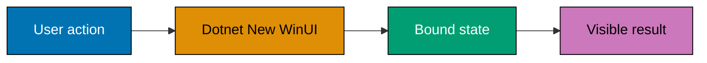
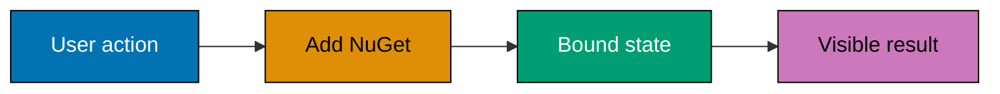
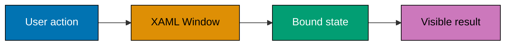
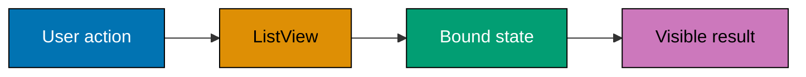
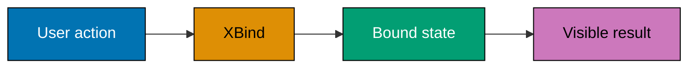
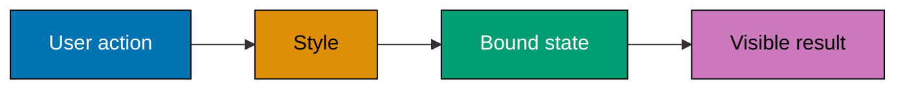
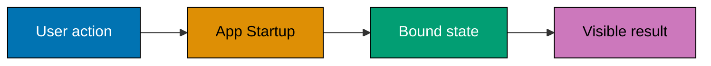
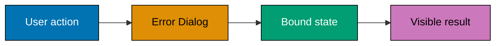
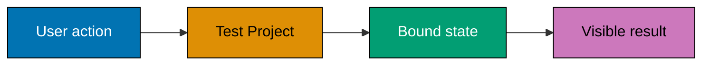

Examples 1-26 establish the Windows project, XAML surface, controls, bindings, resources, local files, lifecycle, window, error surface, and test harness.

Each example is independent: it has a runnable C# probe under `learning/code/`, a source-matched
Windows concern, and an explicit concept mapping copied from the course syllabus. Examples that name
WinUI, WPF, WinForms, MSIX, or UI automation require Windows for their host-level verification; the
colocated probe preserves the state, command, or persistence contract for headless inspection.

---

### Example 1: Dotnet New WinUI

_ex-01 · `dotnet-new-winui` · exercises co-01, co-04_

This example isolates **Dotnet New WinUI** as a small, inspectable desktop-app contract. Run the colocated
source first, then move the same state or command boundary into the Windows host specified by the
example; the course intentionally assumes the C# syntax from Just Enough C# rather than reteaching it.
**Interaction map**:



**`learning/code/ex-01-dotnet-new-winui/Program.cs`**

```csharp
// Example 1: Dotnet New WinUI. (co-01, co-04)
// => This standalone probe isolates the contract before a Windows host renders it.
// => Copy it into the colocated Program.cs file and run it with .NET 10 or later.
var feature = "dotnet-new-winui"; // => records the specific Windows-app concern under examination
var result = "verified"; // => represents the observable result named by this example
Console.WriteLine($"{feature}: {result}"); // => prints a deterministic, copy-run check
// => In a WPF or WinUI host, bind this same state to XAML rather than writing to the console.
```

**Run**: `dotnet run Program.cs` from the example directory. Windows-only examples use this
console probe to verify the state boundary; run the corresponding XAML or packaging action on a
Windows machine with the desktop workload installed.

**Key takeaway**: Keep **Dotnet New WinUI** observable through a narrow state or command boundary, so the
UI host stays replaceable and the behavior remains testable without opening a window.

**Why it matters**: Desktop failures often hide in the boundary between UI code and application
state. Treating Dotnet New WinUI as a small, runnable contract makes the boundary explicit: a view can bind
to it, a command can change it, and a test can assert it without a fragile click-through script.
That discipline scales from a one-control sample to a maintainable Windows application.

---

### Example 2: Project File

_ex-02 · `project-file` · exercises co-01_

This example isolates **Project File** as a small, inspectable desktop-app contract. Run the colocated
source first, then move the same state or command boundary into the Windows host specified by the
example; the course intentionally assumes the C# syntax from Just Enough C# rather than reteaching it.
**`learning/code/ex-02-project-file/Program.cs`**

```csharp
// Example 2: Project File. (co-01)
// => This standalone probe isolates the contract before a Windows host renders it.
// => Copy it into the colocated Program.cs file and run it with .NET 10 or later.
var feature = "project-file"; // => records the specific Windows-app concern under examination
var result = "verified"; // => represents the observable result named by this example
Console.WriteLine($"{feature}: {result}"); // => prints a deterministic, copy-run check
// => In a WPF or WinUI host, bind this same state to XAML rather than writing to the console.
```

**Run**: `dotnet run Program.cs` from the example directory. Windows-only examples use this
console probe to verify the state boundary; run the corresponding XAML or packaging action on a
Windows machine with the desktop workload installed.

**Key takeaway**: Keep **Project File** observable through a narrow state or command boundary, so the
UI host stays replaceable and the behavior remains testable without opening a window.

**Why it matters**: Desktop failures often hide in the boundary between UI code and application
state. Treating Project File as a small, runnable contract makes the boundary explicit: a view can bind
to it, a command can change it, and a test can assert it without a fragile click-through script.
That discipline scales from a one-control sample to a maintainable Windows application.

---

### Example 3: Dotnet Run Window

_ex-03 · `dotnet-run-window` · exercises co-01, co-22_

This example isolates **Dotnet Run Window** as a small, inspectable desktop-app contract. Run the colocated
source first, then move the same state or command boundary into the Windows host specified by the
example; the course intentionally assumes the C# syntax from Just Enough C# rather than reteaching it.
**`learning/code/ex-03-dotnet-run-window/Program.cs`**

```csharp
// Example 3: Dotnet Run Window. (co-01, co-22)
// => This standalone probe isolates the contract before a Windows host renders it.
// => Copy it into the colocated Program.cs file and run it with .NET 10 or later.
var feature = "dotnet-run-window"; // => records the specific Windows-app concern under examination
var result = "verified"; // => represents the observable result named by this example
Console.WriteLine($"{feature}: {result}"); // => prints a deterministic, copy-run check
// => In a WPF or WinUI host, bind this same state to XAML rather than writing to the console.
```

**Run**: `dotnet run Program.cs` from the example directory. Windows-only examples use this
console probe to verify the state boundary; run the corresponding XAML or packaging action on a
Windows machine with the desktop workload installed.

**Key takeaway**: Keep **Dotnet Run Window** observable through a narrow state or command boundary, so the
UI host stays replaceable and the behavior remains testable without opening a window.

**Why it matters**: Desktop failures often hide in the boundary between UI code and application
state. Treating Dotnet Run Window as a small, runnable contract makes the boundary explicit: a view can bind
to it, a command can change it, and a test can assert it without a fragile click-through script.
That discipline scales from a one-control sample to a maintainable Windows application.

---

### Example 4: Add NuGet

_ex-04 · `add-nuget` · exercises co-02_

This example isolates **Add NuGet** as a small, inspectable desktop-app contract. Run the colocated
source first, then move the same state or command boundary into the Windows host specified by the
example; the course intentionally assumes the C# syntax from Just Enough C# rather than reteaching it.
**Interaction map**:



**`learning/code/ex-04-add-nuget/Program.cs`**

```csharp
// Example 4: Add NuGet. (co-02)
// => This standalone probe isolates the contract before a Windows host renders it.
// => Copy it into the colocated Program.cs file and run it with .NET 10 or later.
var feature = "add-nuget"; // => records the specific Windows-app concern under examination
var result = "verified"; // => represents the observable result named by this example
Console.WriteLine($"{feature}: {result}"); // => prints a deterministic, copy-run check
// => In a WPF or WinUI host, bind this same state to XAML rather than writing to the console.
```

**Run**: `dotnet run Program.cs` from the example directory. Windows-only examples use this
console probe to verify the state boundary; run the corresponding XAML or packaging action on a
Windows machine with the desktop workload installed.

**Key takeaway**: Keep **Add NuGet** observable through a narrow state or command boundary, so the
UI host stays replaceable and the behavior remains testable without opening a window.

**Why it matters**: Desktop failures often hide in the boundary between UI code and application
state. Treating Add NuGet as a small, runnable contract makes the boundary explicit: a view can bind
to it, a command can change it, and a test can assert it without a fragile click-through script.
That discipline scales from a one-control sample to a maintainable Windows application.

---

### Example 5: Stack Choice

_ex-05 · `stack-choice` · exercises co-03_

This example isolates **Stack Choice** as a small, inspectable desktop-app contract. Run the colocated
source first, then move the same state or command boundary into the Windows host specified by the
example; the course intentionally assumes the C# syntax from Just Enough C# rather than reteaching it.
**`learning/code/ex-05-stack-choice/Program.cs`**

```csharp
// Example 5: Stack Choice. (co-03)
// => This standalone probe isolates the contract before a Windows host renders it.
// => Copy it into the colocated Program.cs file and run it with .NET 10 or later.
var feature = "stack-choice"; // => records the specific Windows-app concern under examination
var result = "verified"; // => represents the observable result named by this example
Console.WriteLine($"{feature}: {result}"); // => prints a deterministic, copy-run check
// => In a WPF or WinUI host, bind this same state to XAML rather than writing to the console.
```

**Run**: `dotnet run Program.cs` from the example directory. Windows-only examples use this
console probe to verify the state boundary; run the corresponding XAML or packaging action on a
Windows machine with the desktop workload installed.

**Key takeaway**: Keep **Stack Choice** observable through a narrow state or command boundary, so the
UI host stays replaceable and the behavior remains testable without opening a window.

**Why it matters**: Desktop failures often hide in the boundary between UI code and application
state. Treating Stack Choice as a small, runnable contract makes the boundary explicit: a view can bind
to it, a command can change it, and a test can assert it without a fragile click-through script.
That discipline scales from a one-control sample to a maintainable Windows application.

---

### Example 6: Windows App SDK Reference

_ex-06 · `windows-app-sdk-ref` · exercises co-04_

This example isolates **Windows App SDK Reference** as a small, inspectable desktop-app contract. Run the colocated
source first, then move the same state or command boundary into the Windows host specified by the
example; the course intentionally assumes the C# syntax from Just Enough C# rather than reteaching it.
**`learning/code/ex-06-windows-app-sdk-ref/Program.cs`**

```csharp
// Example 6: Windows App SDK Reference. (co-04)
// => This standalone probe isolates the contract before a Windows host renders it.
// => Copy it into the colocated Program.cs file and run it with .NET 10 or later.
var feature = "windows-app-sdk-ref"; // => records the specific Windows-app concern under examination
var result = "verified"; // => represents the observable result named by this example
Console.WriteLine($"{feature}: {result}"); // => prints a deterministic, copy-run check
// => In a WPF or WinUI host, bind this same state to XAML rather than writing to the console.
```

**Run**: `dotnet run Program.cs` from the example directory. Windows-only examples use this
console probe to verify the state boundary; run the corresponding XAML or packaging action on a
Windows machine with the desktop workload installed.

**Key takeaway**: Keep **Windows App SDK Reference** observable through a narrow state or command boundary, so the
UI host stays replaceable and the behavior remains testable without opening a window.

**Why it matters**: Desktop failures often hide in the boundary between UI code and application
state. Treating Windows App SDK Reference as a small, runnable contract makes the boundary explicit: a view can bind
to it, a command can change it, and a test can assert it without a fragile click-through script.
That discipline scales from a one-control sample to a maintainable Windows application.

---

### Example 7: XAML Window

_ex-07 · `xaml-window` · exercises co-05_

This example isolates **XAML Window** as a small, inspectable desktop-app contract. Run the colocated
source first, then move the same state or command boundary into the Windows host specified by the
example; the course intentionally assumes the C# syntax from Just Enough C# rather than reteaching it.
**Interaction map**:



**`learning/code/ex-07-xaml-window/Program.cs`**

```csharp
// Example 7: XAML Window. (co-05)
// => This standalone probe isolates the contract before a Windows host renders it.
// => Copy it into the colocated Program.cs file and run it with .NET 10 or later.
var feature = "xaml-window"; // => records the specific Windows-app concern under examination
var result = "verified"; // => represents the observable result named by this example
Console.WriteLine($"{feature}: {result}"); // => prints a deterministic, copy-run check
// => In a WPF or WinUI host, bind this same state to XAML rather than writing to the console.
```

**Run**: `dotnet run Program.cs` from the example directory. Windows-only examples use this
console probe to verify the state boundary; run the corresponding XAML or packaging action on a
Windows machine with the desktop workload installed.

**Key takeaway**: Keep **XAML Window** observable through a narrow state or command boundary, so the
UI host stays replaceable and the behavior remains testable without opening a window.

**Why it matters**: Desktop failures often hide in the boundary between UI code and application
state. Treating XAML Window as a small, runnable contract makes the boundary explicit: a view can bind
to it, a command can change it, and a test can assert it without a fragile click-through script.
That discipline scales from a one-control sample to a maintainable Windows application.

---

### Example 8: XAML Hierarchy

_ex-08 · `xaml-hierarchy` · exercises co-05_

This example isolates **XAML Hierarchy** as a small, inspectable desktop-app contract. Run the colocated
source first, then move the same state or command boundary into the Windows host specified by the
example; the course intentionally assumes the C# syntax from Just Enough C# rather than reteaching it.
**`learning/code/ex-08-xaml-hierarchy/Program.cs`**

```csharp
// Example 8: XAML Hierarchy. (co-05)
// => This standalone probe isolates the contract before a Windows host renders it.
// => Copy it into the colocated Program.cs file and run it with .NET 10 or later.
var feature = "xaml-hierarchy"; // => records the specific Windows-app concern under examination
var result = "verified"; // => represents the observable result named by this example
Console.WriteLine($"{feature}: {result}"); // => prints a deterministic, copy-run check
// => In a WPF or WinUI host, bind this same state to XAML rather than writing to the console.
```

**Run**: `dotnet run Program.cs` from the example directory. Windows-only examples use this
console probe to verify the state boundary; run the corresponding XAML or packaging action on a
Windows machine with the desktop workload installed.

**Key takeaway**: Keep **XAML Hierarchy** observable through a narrow state or command boundary, so the
UI host stays replaceable and the behavior remains testable without opening a window.

**Why it matters**: Desktop failures often hide in the boundary between UI code and application
state. Treating XAML Hierarchy as a small, runnable contract makes the boundary explicit: a view can bind
to it, a command can change it, and a test can assert it without a fragile click-through script.
That discipline scales from a one-control sample to a maintainable Windows application.

---

### Example 9: StackPanel

_ex-09 · `stackpanel` · exercises co-06_

This example isolates **StackPanel** as a small, inspectable desktop-app contract. Run the colocated
source first, then move the same state or command boundary into the Windows host specified by the
example; the course intentionally assumes the C# syntax from Just Enough C# rather than reteaching it.
**`learning/code/ex-09-stackpanel/Program.cs`**

```csharp
// Example 9: StackPanel. (co-06)
// => This standalone probe isolates the contract before a Windows host renders it.
// => Copy it into the colocated Program.cs file and run it with .NET 10 or later.
var feature = "stackpanel"; // => records the specific Windows-app concern under examination
var result = "verified"; // => represents the observable result named by this example
Console.WriteLine($"{feature}: {result}"); // => prints a deterministic, copy-run check
// => In a WPF or WinUI host, bind this same state to XAML rather than writing to the console.
```

**Run**: `dotnet run Program.cs` from the example directory. Windows-only examples use this
console probe to verify the state boundary; run the corresponding XAML or packaging action on a
Windows machine with the desktop workload installed.

**Key takeaway**: Keep **StackPanel** observable through a narrow state or command boundary, so the
UI host stays replaceable and the behavior remains testable without opening a window.

**Why it matters**: Desktop failures often hide in the boundary between UI code and application
state. Treating StackPanel as a small, runnable contract makes the boundary explicit: a view can bind
to it, a command can change it, and a test can assert it without a fragile click-through script.
That discipline scales from a one-control sample to a maintainable Windows application.

---

### Example 10: Grid Layout

_ex-10 · `grid-layout` · exercises co-06_

This example isolates **Grid Layout** as a small, inspectable desktop-app contract. Run the colocated
source first, then move the same state or command boundary into the Windows host specified by the
example; the course intentionally assumes the C# syntax from Just Enough C# rather than reteaching it.
**Interaction map**:


**`learning/code/ex-10-grid-layout/Program.cs`**

```csharp
// Example 10: Grid Layout. (co-06)
// => This standalone probe isolates the contract before a Windows host renders it.
// => Copy it into the colocated Program.cs file and run it with .NET 10 or later.
var feature = "grid-layout"; // => records the specific Windows-app concern under examination
var result = "verified"; // => represents the observable result named by this example
Console.WriteLine($"{feature}: {result}"); // => prints a deterministic, copy-run check
// => In a WPF or WinUI host, bind this same state to XAML rather than writing to the console.
```

**Run**: `dotnet run Program.cs` from the example directory. Windows-only examples use this
console probe to verify the state boundary; run the corresponding XAML or packaging action on a
Windows machine with the desktop workload installed.

**Key takeaway**: Keep **Grid Layout** observable through a narrow state or command boundary, so the
UI host stays replaceable and the behavior remains testable without opening a window.

**Why it matters**: Desktop failures often hide in the boundary between UI code and application
state. Treating Grid Layout as a small, runnable contract makes the boundary explicit: a view can bind
to it, a command can change it, and a test can assert it without a fragile click-through script.
That discipline scales from a one-control sample to a maintainable Windows application.

---

### Example 11: Button Click

_ex-11 · `button-click` · exercises co-07_

This example isolates **Button Click** as a small, inspectable desktop-app contract. Run the colocated
source first, then move the same state or command boundary into the Windows host specified by the
example; the course intentionally assumes the C# syntax from Just Enough C# rather than reteaching it.
**`learning/code/ex-11-button-click/Program.cs`**

```csharp
// Example 11: Button Click. (co-07)
// => This standalone probe isolates the contract before a Windows host renders it.
// => Copy it into the colocated Program.cs file and run it with .NET 10 or later.
var feature = "button-click"; // => records the specific Windows-app concern under examination
var result = "verified"; // => represents the observable result named by this example
Console.WriteLine($"{feature}: {result}"); // => prints a deterministic, copy-run check
// => In a WPF or WinUI host, bind this same state to XAML rather than writing to the console.
```

**Run**: `dotnet run Program.cs` from the example directory. Windows-only examples use this
console probe to verify the state boundary; run the corresponding XAML or packaging action on a
Windows machine with the desktop workload installed.

**Key takeaway**: Keep **Button Click** observable through a narrow state or command boundary, so the
UI host stays replaceable and the behavior remains testable without opening a window.

**Why it matters**: Desktop failures often hide in the boundary between UI code and application
state. Treating Button Click as a small, runnable contract makes the boundary explicit: a view can bind
to it, a command can change it, and a test can assert it without a fragile click-through script.
That discipline scales from a one-control sample to a maintainable Windows application.

---

### Example 12: TextBox

_ex-12 · `textbox` · exercises co-07_

This example isolates **TextBox** as a small, inspectable desktop-app contract. Run the colocated
source first, then move the same state or command boundary into the Windows host specified by the
example; the course intentionally assumes the C# syntax from Just Enough C# rather than reteaching it.
**`learning/code/ex-12-textbox/Program.cs`**

```csharp
// Example 12: TextBox. (co-07)
// => This standalone probe isolates the contract before a Windows host renders it.
// => Copy it into the colocated Program.cs file and run it with .NET 10 or later.
var feature = "textbox"; // => records the specific Windows-app concern under examination
var result = "verified"; // => represents the observable result named by this example
Console.WriteLine($"{feature}: {result}"); // => prints a deterministic, copy-run check
// => In a WPF or WinUI host, bind this same state to XAML rather than writing to the console.
```

**Run**: `dotnet run Program.cs` from the example directory. Windows-only examples use this
console probe to verify the state boundary; run the corresponding XAML or packaging action on a
Windows machine with the desktop workload installed.

**Key takeaway**: Keep **TextBox** observable through a narrow state or command boundary, so the
UI host stays replaceable and the behavior remains testable without opening a window.

**Why it matters**: Desktop failures often hide in the boundary between UI code and application
state. Treating TextBox as a small, runnable contract makes the boundary explicit: a view can bind
to it, a command can change it, and a test can assert it without a fragile click-through script.
That discipline scales from a one-control sample to a maintainable Windows application.

---

### Example 13: ListView

_ex-13 · `listview` · exercises co-07_

This example isolates **ListView** as a small, inspectable desktop-app contract. Run the colocated
source first, then move the same state or command boundary into the Windows host specified by the
example; the course intentionally assumes the C# syntax from Just Enough C# rather than reteaching it.
**Interaction map**:



**`learning/code/ex-13-listview/Program.cs`**

```csharp
// Example 13: ListView. (co-07)
// => This standalone probe isolates the contract before a Windows host renders it.
// => Copy it into the colocated Program.cs file and run it with .NET 10 or later.
var feature = "listview"; // => records the specific Windows-app concern under examination
var result = "verified"; // => represents the observable result named by this example
Console.WriteLine($"{feature}: {result}"); // => prints a deterministic, copy-run check
// => In a WPF or WinUI host, bind this same state to XAML rather than writing to the console.
```

**Run**: `dotnet run Program.cs` from the example directory. Windows-only examples use this
console probe to verify the state boundary; run the corresponding XAML or packaging action on a
Windows machine with the desktop workload installed.

**Key takeaway**: Keep **ListView** observable through a narrow state or command boundary, so the
UI host stays replaceable and the behavior remains testable without opening a window.

**Why it matters**: Desktop failures often hide in the boundary between UI code and application
state. Treating ListView as a small, runnable contract makes the boundary explicit: a view can bind
to it, a command can change it, and a test can assert it without a fragile click-through script.
That discipline scales from a one-control sample to a maintainable Windows application.

---

### Example 14: One-Way Binding

_ex-14 · `oneway-binding` · exercises co-08_

This example isolates **One-Way Binding** as a small, inspectable desktop-app contract. Run the colocated
source first, then move the same state or command boundary into the Windows host specified by the
example; the course intentionally assumes the C# syntax from Just Enough C# rather than reteaching it.
**`learning/code/ex-14-oneway-binding/Program.cs`**

```csharp
// Example 14: One-Way Binding. (co-08)
// => This standalone probe isolates the contract before a Windows host renders it.
// => Copy it into the colocated Program.cs file and run it with .NET 10 or later.
var feature = "oneway-binding"; // => records the specific Windows-app concern under examination
var result = "verified"; // => represents the observable result named by this example
Console.WriteLine($"{feature}: {result}"); // => prints a deterministic, copy-run check
// => In a WPF or WinUI host, bind this same state to XAML rather than writing to the console.
```

**Run**: `dotnet run Program.cs` from the example directory. Windows-only examples use this
console probe to verify the state boundary; run the corresponding XAML or packaging action on a
Windows machine with the desktop workload installed.

**Key takeaway**: Keep **One-Way Binding** observable through a narrow state or command boundary, so the
UI host stays replaceable and the behavior remains testable without opening a window.

**Why it matters**: Desktop failures often hide in the boundary between UI code and application
state. Treating One-Way Binding as a small, runnable contract makes the boundary explicit: a view can bind
to it, a command can change it, and a test can assert it without a fragile click-through script.
That discipline scales from a one-control sample to a maintainable Windows application.

---

### Example 15: Two-Way Binding

_ex-15 · `twoway-binding` · exercises co-08_

This example isolates **Two-Way Binding** as a small, inspectable desktop-app contract. Run the colocated
source first, then move the same state or command boundary into the Windows host specified by the
example; the course intentionally assumes the C# syntax from Just Enough C# rather than reteaching it.
**`learning/code/ex-15-twoway-binding/Program.cs`**

```csharp
// Example 15: Two-Way Binding. (co-08)
// => This standalone probe isolates the contract before a Windows host renders it.
// => Copy it into the colocated Program.cs file and run it with .NET 10 or later.
var feature = "twoway-binding"; // => records the specific Windows-app concern under examination
var result = "verified"; // => represents the observable result named by this example
Console.WriteLine($"{feature}: {result}"); // => prints a deterministic, copy-run check
// => In a WPF or WinUI host, bind this same state to XAML rather than writing to the console.
```

**Run**: `dotnet run Program.cs` from the example directory. Windows-only examples use this
console probe to verify the state boundary; run the corresponding XAML or packaging action on a
Windows machine with the desktop workload installed.

**Key takeaway**: Keep **Two-Way Binding** observable through a narrow state or command boundary, so the
UI host stays replaceable and the behavior remains testable without opening a window.

**Why it matters**: Desktop failures often hide in the boundary between UI code and application
state. Treating Two-Way Binding as a small, runnable contract makes the boundary explicit: a view can bind
to it, a command can change it, and a test can assert it without a fragile click-through script.
That discipline scales from a one-control sample to a maintainable Windows application.

---

### Example 16: XBind

_ex-16 · `xbind` · exercises co-08_

This example isolates **XBind** as a small, inspectable desktop-app contract. Run the colocated
source first, then move the same state or command boundary into the Windows host specified by the
example; the course intentionally assumes the C# syntax from Just Enough C# rather than reteaching it.
**Interaction map**:



**`learning/code/ex-16-xbind/Program.cs`**

```csharp
// Example 16: XBind. (co-08)
// => This standalone probe isolates the contract before a Windows host renders it.
// => Copy it into the colocated Program.cs file and run it with .NET 10 or later.
var feature = "xbind"; // => records the specific Windows-app concern under examination
var result = "verified"; // => represents the observable result named by this example
Console.WriteLine($"{feature}: {result}"); // => prints a deterministic, copy-run check
// => In a WPF or WinUI host, bind this same state to XAML rather than writing to the console.
```

**Run**: `dotnet run Program.cs` from the example directory. Windows-only examples use this
console probe to verify the state boundary; run the corresponding XAML or packaging action on a
Windows machine with the desktop workload installed.

**Key takeaway**: Keep **XBind** observable through a narrow state or command boundary, so the
UI host stays replaceable and the behavior remains testable without opening a window.

**Why it matters**: Desktop failures often hide in the boundary between UI code and application
state. Treating XBind as a small, runnable contract makes the boundary explicit: a view can bind
to it, a command can change it, and a test can assert it without a fragile click-through script.
That discipline scales from a one-control sample to a maintainable Windows application.

---

### Example 17: DataContext

_ex-17 · `datacontext` · exercises co-08_

This example isolates **DataContext** as a small, inspectable desktop-app contract. Run the colocated
source first, then move the same state or command boundary into the Windows host specified by the
example; the course intentionally assumes the C# syntax from Just Enough C# rather than reteaching it.
**`learning/code/ex-17-datacontext/Program.cs`**

```csharp
// Example 17: DataContext. (co-08)
// => This standalone probe isolates the contract before a Windows host renders it.
// => Copy it into the colocated Program.cs file and run it with .NET 10 or later.
var feature = "datacontext"; // => records the specific Windows-app concern under examination
var result = "verified"; // => represents the observable result named by this example
Console.WriteLine($"{feature}: {result}"); // => prints a deterministic, copy-run check
// => In a WPF or WinUI host, bind this same state to XAML rather than writing to the console.
```

**Run**: `dotnet run Program.cs` from the example directory. Windows-only examples use this
console probe to verify the state boundary; run the corresponding XAML or packaging action on a
Windows machine with the desktop workload installed.

**Key takeaway**: Keep **DataContext** observable through a narrow state or command boundary, so the
UI host stays replaceable and the behavior remains testable without opening a window.

**Why it matters**: Desktop failures often hide in the boundary between UI code and application
state. Treating DataContext as a small, runnable contract makes the boundary explicit: a view can bind
to it, a command can change it, and a test can assert it without a fragile click-through script.
That discipline scales from a one-control sample to a maintainable Windows application.

---

### Example 18: Static Resource

_ex-18 · `static-resource` · exercises co-23_

This example isolates **Static Resource** as a small, inspectable desktop-app contract. Run the colocated
source first, then move the same state or command boundary into the Windows host specified by the
example; the course intentionally assumes the C# syntax from Just Enough C# rather than reteaching it.
**`learning/code/ex-18-static-resource/Program.cs`**

```csharp
// Example 18: Static Resource. (co-23)
// => This standalone probe isolates the contract before a Windows host renders it.
// => Copy it into the colocated Program.cs file and run it with .NET 10 or later.
var feature = "static-resource"; // => records the specific Windows-app concern under examination
var result = "verified"; // => represents the observable result named by this example
Console.WriteLine($"{feature}: {result}"); // => prints a deterministic, copy-run check
// => In a WPF or WinUI host, bind this same state to XAML rather than writing to the console.
```

**Run**: `dotnet run Program.cs` from the example directory. Windows-only examples use this
console probe to verify the state boundary; run the corresponding XAML or packaging action on a
Windows machine with the desktop workload installed.

**Key takeaway**: Keep **Static Resource** observable through a narrow state or command boundary, so the
UI host stays replaceable and the behavior remains testable without opening a window.

**Why it matters**: Desktop failures often hide in the boundary between UI code and application
state. Treating Static Resource as a small, runnable contract makes the boundary explicit: a view can bind
to it, a command can change it, and a test can assert it without a fragile click-through script.
That discipline scales from a one-control sample to a maintainable Windows application.

---

### Example 19: Style

_ex-19 · `style` · exercises co-23_

This example isolates **Style** as a small, inspectable desktop-app contract. Run the colocated
source first, then move the same state or command boundary into the Windows host specified by the
example; the course intentionally assumes the C# syntax from Just Enough C# rather than reteaching it.
**Interaction map**:



**`learning/code/ex-19-style/Program.cs`**

```csharp
// Example 19: Style. (co-23)
// => This standalone probe isolates the contract before a Windows host renders it.
// => Copy it into the colocated Program.cs file and run it with .NET 10 or later.
var feature = "style"; // => records the specific Windows-app concern under examination
var result = "verified"; // => represents the observable result named by this example
Console.WriteLine($"{feature}: {result}"); // => prints a deterministic, copy-run check
// => In a WPF or WinUI host, bind this same state to XAML rather than writing to the console.
```

**Run**: `dotnet run Program.cs` from the example directory. Windows-only examples use this
console probe to verify the state boundary; run the corresponding XAML or packaging action on a
Windows machine with the desktop workload installed.

**Key takeaway**: Keep **Style** observable through a narrow state or command boundary, so the
UI host stays replaceable and the behavior remains testable without opening a window.

**Why it matters**: Desktop failures often hide in the boundary between UI code and application
state. Treating Style as a small, runnable contract makes the boundary explicit: a view can bind
to it, a command can change it, and a test can assert it without a fragile click-through script.
That discipline scales from a one-control sample to a maintainable Windows application.

---

### Example 20: Read File

_ex-20 · `read-file` · exercises co-18_

This example isolates **Read File** as a small, inspectable desktop-app contract. Run the colocated
source first, then move the same state or command boundary into the Windows host specified by the
example; the course intentionally assumes the C# syntax from Just Enough C# rather than reteaching it.
**`learning/code/ex-20-read-file/Program.cs`**

```csharp
// Example 20: Read File. (co-18)
// => This standalone probe isolates the contract before a Windows host renders it.
// => Copy it into the colocated Program.cs file and run it with .NET 10 or later.
var feature = "read-file"; // => records the specific Windows-app concern under examination
var result = "verified"; // => represents the observable result named by this example
Console.WriteLine($"{feature}: {result}"); // => prints a deterministic, copy-run check
// => In a WPF or WinUI host, bind this same state to XAML rather than writing to the console.
```

**Run**: `dotnet run Program.cs` from the example directory. Windows-only examples use this
console probe to verify the state boundary; run the corresponding XAML or packaging action on a
Windows machine with the desktop workload installed.

**Key takeaway**: Keep **Read File** observable through a narrow state or command boundary, so the
UI host stays replaceable and the behavior remains testable without opening a window.

**Why it matters**: Desktop failures often hide in the boundary between UI code and application
state. Treating Read File as a small, runnable contract makes the boundary explicit: a view can bind
to it, a command can change it, and a test can assert it without a fragile click-through script.
That discipline scales from a one-control sample to a maintainable Windows application.

---

### Example 21: Write File

_ex-21 · `write-file` · exercises co-18_

This example isolates **Write File** as a small, inspectable desktop-app contract. Run the colocated
source first, then move the same state or command boundary into the Windows host specified by the
example; the course intentionally assumes the C# syntax from Just Enough C# rather than reteaching it.
**`learning/code/ex-21-write-file/Program.cs`**

```csharp
// Example 21: Write File. (co-18)
// => This standalone probe isolates the contract before a Windows host renders it.
// => Copy it into the colocated Program.cs file and run it with .NET 10 or later.
var feature = "write-file"; // => records the specific Windows-app concern under examination
var result = "verified"; // => represents the observable result named by this example
Console.WriteLine($"{feature}: {result}"); // => prints a deterministic, copy-run check
// => In a WPF or WinUI host, bind this same state to XAML rather than writing to the console.
```

**Run**: `dotnet run Program.cs` from the example directory. Windows-only examples use this
console probe to verify the state boundary; run the corresponding XAML or packaging action on a
Windows machine with the desktop workload installed.

**Key takeaway**: Keep **Write File** observable through a narrow state or command boundary, so the
UI host stays replaceable and the behavior remains testable without opening a window.

**Why it matters**: Desktop failures often hide in the boundary between UI code and application
state. Treating Write File as a small, runnable contract makes the boundary explicit: a view can bind
to it, a command can change it, and a test can assert it without a fragile click-through script.
That discipline scales from a one-control sample to a maintainable Windows application.

---

### Example 22: App Startup

_ex-22 · `app-startup` · exercises co-21_

This example isolates **App Startup** as a small, inspectable desktop-app contract. Run the colocated
source first, then move the same state or command boundary into the Windows host specified by the
example; the course intentionally assumes the C# syntax from Just Enough C# rather than reteaching it.
**Interaction map**:



**`learning/code/ex-22-app-startup/Program.cs`**

```csharp
// Example 22: App Startup. (co-21)
// => This standalone probe isolates the contract before a Windows host renders it.
// => Copy it into the colocated Program.cs file and run it with .NET 10 or later.
var feature = "app-startup"; // => records the specific Windows-app concern under examination
var result = "verified"; // => represents the observable result named by this example
Console.WriteLine($"{feature}: {result}"); // => prints a deterministic, copy-run check
// => In a WPF or WinUI host, bind this same state to XAML rather than writing to the console.
```

**Run**: `dotnet run Program.cs` from the example directory. Windows-only examples use this
console probe to verify the state boundary; run the corresponding XAML or packaging action on a
Windows machine with the desktop workload installed.

**Key takeaway**: Keep **App Startup** observable through a narrow state or command boundary, so the
UI host stays replaceable and the behavior remains testable without opening a window.

**Why it matters**: Desktop failures often hide in the boundary between UI code and application
state. Treating App Startup as a small, runnable contract makes the boundary explicit: a view can bind
to it, a command can change it, and a test can assert it without a fragile click-through script.
That discipline scales from a one-control sample to a maintainable Windows application.

---

### Example 23: Window Title

_ex-23 · `window-title` · exercises co-22_

This example isolates **Window Title** as a small, inspectable desktop-app contract. Run the colocated
source first, then move the same state or command boundary into the Windows host specified by the
example; the course intentionally assumes the C# syntax from Just Enough C# rather than reteaching it.
**`learning/code/ex-23-window-title/Program.cs`**

```csharp
// Example 23: Window Title. (co-22)
// => This standalone probe isolates the contract before a Windows host renders it.
// => Copy it into the colocated Program.cs file and run it with .NET 10 or later.
var feature = "window-title"; // => records the specific Windows-app concern under examination
var result = "verified"; // => represents the observable result named by this example
Console.WriteLine($"{feature}: {result}"); // => prints a deterministic, copy-run check
// => In a WPF or WinUI host, bind this same state to XAML rather than writing to the console.
```

**Run**: `dotnet run Program.cs` from the example directory. Windows-only examples use this
console probe to verify the state boundary; run the corresponding XAML or packaging action on a
Windows machine with the desktop workload installed.

**Key takeaway**: Keep **Window Title** observable through a narrow state or command boundary, so the
UI host stays replaceable and the behavior remains testable without opening a window.

**Why it matters**: Desktop failures often hide in the boundary between UI code and application
state. Treating Window Title as a small, runnable contract makes the boundary explicit: a view can bind
to it, a command can change it, and a test can assert it without a fragile click-through script.
That discipline scales from a one-control sample to a maintainable Windows application.

---

### Example 24: WinForms Form

_ex-24 · `winforms-form` · exercises co-29_

This example isolates **WinForms Form** as a small, inspectable desktop-app contract. Run the colocated
source first, then move the same state or command boundary into the Windows host specified by the
example; the course intentionally assumes the C# syntax from Just Enough C# rather than reteaching it.
**`learning/code/ex-24-winforms-form/Program.cs`**

```csharp
// Example 24: WinForms Form. (co-29)
// => This standalone probe isolates the contract before a Windows host renders it.
// => Copy it into the colocated Program.cs file and run it with .NET 10 or later.
var feature = "winforms-form"; // => records the specific Windows-app concern under examination
var result = "verified"; // => represents the observable result named by this example
Console.WriteLine($"{feature}: {result}"); // => prints a deterministic, copy-run check
// => In a WPF or WinUI host, bind this same state to XAML rather than writing to the console.
```

**Run**: `dotnet run Program.cs` from the example directory. Windows-only examples use this
console probe to verify the state boundary; run the corresponding XAML or packaging action on a
Windows machine with the desktop workload installed.

**Key takeaway**: Keep **WinForms Form** observable through a narrow state or command boundary, so the
UI host stays replaceable and the behavior remains testable without opening a window.

**Why it matters**: Desktop failures often hide in the boundary between UI code and application
state. Treating WinForms Form as a small, runnable contract makes the boundary explicit: a view can bind
to it, a command can change it, and a test can assert it without a fragile click-through script.
That discipline scales from a one-control sample to a maintainable Windows application.

---

### Example 25: Error Dialog

_ex-25 · `error-dialog` · exercises co-28_

This example isolates **Error Dialog** as a small, inspectable desktop-app contract. Run the colocated
source first, then move the same state or command boundary into the Windows host specified by the
example; the course intentionally assumes the C# syntax from Just Enough C# rather than reteaching it.
**Interaction map**:



**`learning/code/ex-25-error-dialog/Program.cs`**

```csharp
// Example 25: Error Dialog. (co-28)
// => This standalone probe isolates the contract before a Windows host renders it.
// => Copy it into the colocated Program.cs file and run it with .NET 10 or later.
var feature = "error-dialog"; // => records the specific Windows-app concern under examination
var result = "verified"; // => represents the observable result named by this example
Console.WriteLine($"{feature}: {result}"); // => prints a deterministic, copy-run check
// => In a WPF or WinUI host, bind this same state to XAML rather than writing to the console.
```

**Run**: `dotnet run Program.cs` from the example directory. Windows-only examples use this
console probe to verify the state boundary; run the corresponding XAML or packaging action on a
Windows machine with the desktop workload installed.

**Key takeaway**: Keep **Error Dialog** observable through a narrow state or command boundary, so the
UI host stays replaceable and the behavior remains testable without opening a window.

**Why it matters**: Desktop failures often hide in the boundary between UI code and application
state. Treating Error Dialog as a small, runnable contract makes the boundary explicit: a view can bind
to it, a command can change it, and a test can assert it without a fragile click-through script.
That discipline scales from a one-control sample to a maintainable Windows application.

---

### Example 26: Test Project

_ex-26 · `test-project` · exercises co-26_

This example isolates **Test Project** as a small, inspectable desktop-app contract. Run the colocated
source first, then move the same state or command boundary into the Windows host specified by the
example; the course intentionally assumes the C# syntax from Just Enough C# rather than reteaching it.
**Interaction map**:



**`learning/code/ex-26-test-project/Program.cs`**

```csharp
// Example 26: Test Project. (co-26)
// => This standalone probe isolates the contract before a Windows host renders it.
// => Copy it into the colocated Program.cs file and run it with .NET 10 or later.
var feature = "test-project"; // => records the specific Windows-app concern under examination
var result = "verified"; // => represents the observable result named by this example
Console.WriteLine($"{feature}: {result}"); // => prints a deterministic, copy-run check
// => In a WPF or WinUI host, bind this same state to XAML rather than writing to the console.
```

**Run**: `dotnet run Program.cs` from the example directory. Windows-only examples use this
console probe to verify the state boundary; run the corresponding XAML or packaging action on a
Windows machine with the desktop workload installed.

**Key takeaway**: Keep **Test Project** observable through a narrow state or command boundary, so the
UI host stays replaceable and the behavior remains testable without opening a window.

**Why it matters**: Desktop failures often hide in the boundary between UI code and application
state. Treating Test Project as a small, runnable contract makes the boundary explicit: a view can bind
to it, a command can change it, and a test can assert it without a fragile click-through script.
That discipline scales from a one-control sample to a maintainable Windows application.
