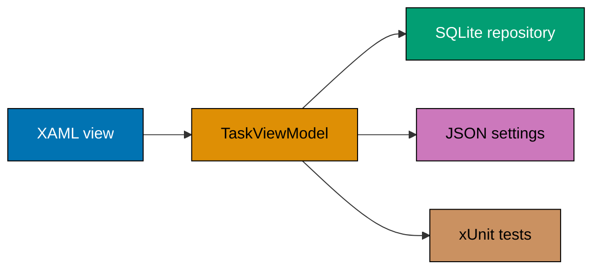

## The capstone: Windows Tasks

Windows Tasks is a small WPF application that keeps the visual layer deliberately thin. A
`TaskViewModel` exposes bound task data, busy state, progress, a recoverable error message, and
commands; SQLite owns structured task records, while a JSON settings store remembers the most recent
filter. The sample is a Windows-only WPF host, but its view-model tests run headlessly through
`dotnet test`.

**Goal**: build a Windows desktop task list that binds a XAML view to an MVVM view-model, loads local
SQLite data asynchronously, reports progress, permits cancellation, remembers a setting, and tests
that behavior without opening a window.

**Concepts exercised**: [x] XAML and data binding (co-05, co-08) [x] MVVM and observable collections
(co-10, co-12) [x] async plus dispatcher-compatible progress (co-14, co-15) [x] cancellation and
progress (co-16, co-17) [x] settings and SQLite persistence (co-19, co-20) [x] headless tests
(co-26).



## Step 1: restore, test, and run

On a Windows machine with the .NET SDK and Windows desktop workload, run these commands from
`learning/capstone/code/`:

```bash
dotnet restore WindowsTasks.sln
dotnet test WindowsTasks.sln
dotnet run --project WindowsTasks.csproj
```

The UI starts empty, then Load inserts a deterministic local seed when the database has no rows,
updates the progress bar while reading, and writes the final filter to JSON settings. Cancel stops
the in-flight read cooperatively; errors become the bound ErrorMessage rather than an unhandled
exception.

## Step 2: inspect the MVVM boundary

`MainWindow.xaml` only declares controls and bindings. `TaskViewModel.cs` owns state and commands;
`TaskRepository.cs` owns SQLite I/O; `SettingsStore.cs` owns the tiny JSON preference. This is the
boundary that makes `WindowsTasks.Tests` use a fake repository instead of opening a window or a
real database.

## Step 3: package deliberately

For a framework-dependent output, run `dotnet publish WindowsTasks.csproj -c Release`. For an
MSIX-distributed build, add the appropriate packaging project or Visual Studio packaging workflow
for your organization; inspect the resulting manifest identity before distribution. Packaging is
kept at this boundary because signing, identity, and deployment policy belong to the product, not a
view-model.

**Acceptance criteria**: on Windows, the app opens, binds the list and status, remains responsive
while loading, permits cancellation, survives a relaunch with its setting and SQLite data, and has
green headless tests.
