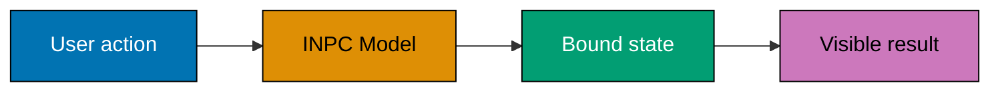
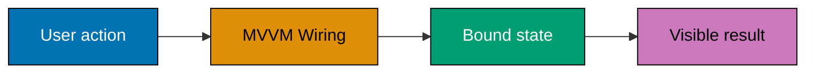
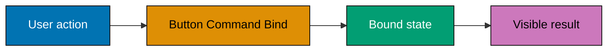
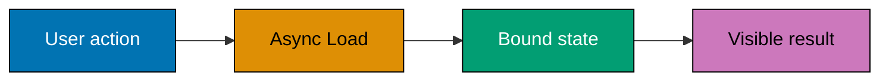
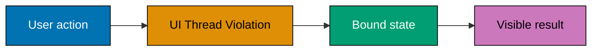
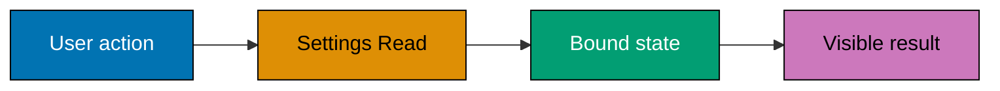
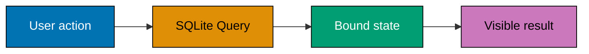
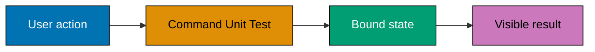
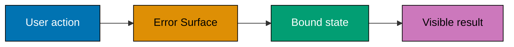
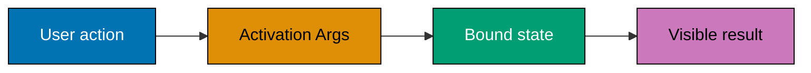

Examples 27-54 turn a visual surface into an MVVM application: observable state, commands, collections, awaited work, the dispatcher boundary, persistence, DI, reusable resources, tests, errors, and activation.

Each example is independent: it has a runnable C# probe under `learning/code/`, a source-matched
Windows concern, and an explicit concept mapping copied from the course syllabus. Examples that name
WinUI, WPF, WinForms, MSIX, or UI automation require Windows for their host-level verification; the
colocated probe preserves the state, command, or persistence contract for headless inspection.

---

### Example 27: INPC Model

_ex-27 · `inpc-model` · exercises co-09_

This example isolates **INPC Model** as a small, inspectable desktop-app contract. Run the colocated
source first, then move the same state or command boundary into the Windows host specified by the
example; the course intentionally assumes the C# syntax from Just Enough C# rather than reteaching it.
**Interaction map**:



**`learning/code/ex-27-inpc-model/Program.cs`**

```csharp
// Example 27: INPC Model. (co-09)
// => This standalone probe isolates the contract before a Windows host renders it.
// => Copy it into the colocated Program.cs file and run it with .NET 10 or later.
var feature = "inpc-model"; // => records the specific Windows-app concern under examination
var result = "verified"; // => represents the observable result named by this example
Console.WriteLine($"{feature}: {result}"); // => prints a deterministic, copy-run check
// => In a WPF or WinUI host, bind this same state to XAML rather than writing to the console.
```

**Run**: `dotnet run Program.cs` from the example directory. Windows-only examples use this
console probe to verify the state boundary; run the corresponding XAML or packaging action on a
Windows machine with the desktop workload installed.

**Key takeaway**: Keep **INPC Model** observable through a narrow state or command boundary, so the
UI host stays replaceable and the behavior remains testable without opening a window.

**Why it matters**: Desktop failures often hide in the boundary between UI code and application
state. Treating INPC Model as a small, runnable contract makes the boundary explicit: a view can bind
to it, a command can change it, and a test can assert it without a fragile click-through script.
That discipline scales from a one-control sample to a maintainable Windows application.

---

### Example 28: Bind INPC

_ex-28 · `bind-inpc` · exercises co-09, co-08_

This example isolates **Bind INPC** as a small, inspectable desktop-app contract. Run the colocated
source first, then move the same state or command boundary into the Windows host specified by the
example; the course intentionally assumes the C# syntax from Just Enough C# rather than reteaching it.
**`learning/code/ex-28-bind-inpc/Program.cs`**

```csharp
// Example 28: Bind INPC. (co-09, co-08)
// => This standalone probe isolates the contract before a Windows host renders it.
// => Copy it into the colocated Program.cs file and run it with .NET 10 or later.
var feature = "bind-inpc"; // => records the specific Windows-app concern under examination
var result = "verified"; // => represents the observable result named by this example
Console.WriteLine($"{feature}: {result}"); // => prints a deterministic, copy-run check
// => In a WPF or WinUI host, bind this same state to XAML rather than writing to the console.
```

**Run**: `dotnet run Program.cs` from the example directory. Windows-only examples use this
console probe to verify the state boundary; run the corresponding XAML or packaging action on a
Windows machine with the desktop workload installed.

**Key takeaway**: Keep **Bind INPC** observable through a narrow state or command boundary, so the
UI host stays replaceable and the behavior remains testable without opening a window.

**Why it matters**: Desktop failures often hide in the boundary between UI code and application
state. Treating Bind INPC as a small, runnable contract makes the boundary explicit: a view can bind
to it, a command can change it, and a test can assert it without a fragile click-through script.
That discipline scales from a one-control sample to a maintainable Windows application.

---

### Example 29: ViewModel

_ex-29 · `viewmodel` · exercises co-10_

This example isolates **ViewModel** as a small, inspectable desktop-app contract. Run the colocated
source first, then move the same state or command boundary into the Windows host specified by the
example; the course intentionally assumes the C# syntax from Just Enough C# rather than reteaching it.
**`learning/code/ex-29-viewmodel/Program.cs`**

```csharp
// Example 29: ViewModel. (co-10)
// => This standalone probe isolates the contract before a Windows host renders it.
// => Copy it into the colocated Program.cs file and run it with .NET 10 or later.
var feature = "viewmodel"; // => records the specific Windows-app concern under examination
var result = "verified"; // => represents the observable result named by this example
Console.WriteLine($"{feature}: {result}"); // => prints a deterministic, copy-run check
// => In a WPF or WinUI host, bind this same state to XAML rather than writing to the console.
```

**Run**: `dotnet run Program.cs` from the example directory. Windows-only examples use this
console probe to verify the state boundary; run the corresponding XAML or packaging action on a
Windows machine with the desktop workload installed.

**Key takeaway**: Keep **ViewModel** observable through a narrow state or command boundary, so the
UI host stays replaceable and the behavior remains testable without opening a window.

**Why it matters**: Desktop failures often hide in the boundary between UI code and application
state. Treating ViewModel as a small, runnable contract makes the boundary explicit: a view can bind
to it, a command can change it, and a test can assert it without a fragile click-through script.
That discipline scales from a one-control sample to a maintainable Windows application.

---

### Example 30: MVVM Wiring

_ex-30 · `mvvm-wiring` · exercises co-10, co-08_

This example isolates **MVVM Wiring** as a small, inspectable desktop-app contract. Run the colocated
source first, then move the same state or command boundary into the Windows host specified by the
example; the course intentionally assumes the C# syntax from Just Enough C# rather than reteaching it.
**Interaction map**:



**`learning/code/ex-30-mvvm-wiring/Program.cs`**

```csharp
// Example 30: MVVM Wiring. (co-10, co-08)
// => This standalone probe isolates the contract before a Windows host renders it.
// => Copy it into the colocated Program.cs file and run it with .NET 10 or later.
var feature = "mvvm-wiring"; // => records the specific Windows-app concern under examination
var result = "verified"; // => represents the observable result named by this example
Console.WriteLine($"{feature}: {result}"); // => prints a deterministic, copy-run check
// => In a WPF or WinUI host, bind this same state to XAML rather than writing to the console.
```

**Run**: `dotnet run Program.cs` from the example directory. Windows-only examples use this
console probe to verify the state boundary; run the corresponding XAML or packaging action on a
Windows machine with the desktop workload installed.

**Key takeaway**: Keep **MVVM Wiring** observable through a narrow state or command boundary, so the
UI host stays replaceable and the behavior remains testable without opening a window.

**Why it matters**: Desktop failures often hide in the boundary between UI code and application
state. Treating MVVM Wiring as a small, runnable contract makes the boundary explicit: a view can bind
to it, a command can change it, and a test can assert it without a fragile click-through script.
That discipline scales from a one-control sample to a maintainable Windows application.

---

### Example 31: RelayCommand

_ex-31 · `relaycommand` · exercises co-11_

This example isolates **RelayCommand** as a small, inspectable desktop-app contract. Run the colocated
source first, then move the same state or command boundary into the Windows host specified by the
example; the course intentionally assumes the C# syntax from Just Enough C# rather than reteaching it.
**`learning/code/ex-31-relaycommand/Program.cs`**

```csharp
// Example 31: RelayCommand. (co-11)
// => This standalone probe isolates the contract before a Windows host renders it.
// => Copy it into the colocated Program.cs file and run it with .NET 10 or later.
var feature = "relaycommand"; // => records the specific Windows-app concern under examination
var result = "verified"; // => represents the observable result named by this example
Console.WriteLine($"{feature}: {result}"); // => prints a deterministic, copy-run check
// => In a WPF or WinUI host, bind this same state to XAML rather than writing to the console.
```

**Run**: `dotnet run Program.cs` from the example directory. Windows-only examples use this
console probe to verify the state boundary; run the corresponding XAML or packaging action on a
Windows machine with the desktop workload installed.

**Key takeaway**: Keep **RelayCommand** observable through a narrow state or command boundary, so the
UI host stays replaceable and the behavior remains testable without opening a window.

**Why it matters**: Desktop failures often hide in the boundary between UI code and application
state. Treating RelayCommand as a small, runnable contract makes the boundary explicit: a view can bind
to it, a command can change it, and a test can assert it without a fragile click-through script.
That discipline scales from a one-control sample to a maintainable Windows application.

---

### Example 32: Command CanExecute

_ex-32 · `command-canexecute` · exercises co-11_

This example isolates **Command CanExecute** as a small, inspectable desktop-app contract. Run the colocated
source first, then move the same state or command boundary into the Windows host specified by the
example; the course intentionally assumes the C# syntax from Just Enough C# rather than reteaching it.
**`learning/code/ex-32-command-canexecute/Program.cs`**

```csharp
// Example 32: Command CanExecute. (co-11)
// => This standalone probe isolates the contract before a Windows host renders it.
// => Copy it into the colocated Program.cs file and run it with .NET 10 or later.
var feature = "command-canexecute"; // => records the specific Windows-app concern under examination
var result = "verified"; // => represents the observable result named by this example
Console.WriteLine($"{feature}: {result}"); // => prints a deterministic, copy-run check
// => In a WPF or WinUI host, bind this same state to XAML rather than writing to the console.
```

**Run**: `dotnet run Program.cs` from the example directory. Windows-only examples use this
console probe to verify the state boundary; run the corresponding XAML or packaging action on a
Windows machine with the desktop workload installed.

**Key takeaway**: Keep **Command CanExecute** observable through a narrow state or command boundary, so the
UI host stays replaceable and the behavior remains testable without opening a window.

**Why it matters**: Desktop failures often hide in the boundary between UI code and application
state. Treating Command CanExecute as a small, runnable contract makes the boundary explicit: a view can bind
to it, a command can change it, and a test can assert it without a fragile click-through script.
That discipline scales from a one-control sample to a maintainable Windows application.

---

### Example 33: Button Command Bind

_ex-33 · `button-command-bind` · exercises co-11, co-08_

This example isolates **Button Command Bind** as a small, inspectable desktop-app contract. Run the colocated
source first, then move the same state or command boundary into the Windows host specified by the
example; the course intentionally assumes the C# syntax from Just Enough C# rather than reteaching it.
**Interaction map**:



**`learning/code/ex-33-button-command-bind/Program.cs`**

```csharp
// Example 33: Button Command Bind. (co-11, co-08)
// => This standalone probe isolates the contract before a Windows host renders it.
// => Copy it into the colocated Program.cs file and run it with .NET 10 or later.
var feature = "button-command-bind"; // => records the specific Windows-app concern under examination
var result = "verified"; // => represents the observable result named by this example
Console.WriteLine($"{feature}: {result}"); // => prints a deterministic, copy-run check
// => In a WPF or WinUI host, bind this same state to XAML rather than writing to the console.
```

**Run**: `dotnet run Program.cs` from the example directory. Windows-only examples use this
console probe to verify the state boundary; run the corresponding XAML or packaging action on a
Windows machine with the desktop workload installed.

**Key takeaway**: Keep **Button Command Bind** observable through a narrow state or command boundary, so the
UI host stays replaceable and the behavior remains testable without opening a window.

**Why it matters**: Desktop failures often hide in the boundary between UI code and application
state. Treating Button Command Bind as a small, runnable contract makes the boundary explicit: a view can bind
to it, a command can change it, and a test can assert it without a fragile click-through script.
That discipline scales from a one-control sample to a maintainable Windows application.

---

### Example 34: Observable Collection

_ex-34 · `observable-collection` · exercises co-12_

This example isolates **Observable Collection** as a small, inspectable desktop-app contract. Run the colocated
source first, then move the same state or command boundary into the Windows host specified by the
example; the course intentionally assumes the C# syntax from Just Enough C# rather than reteaching it.
**`learning/code/ex-34-observable-collection/Program.cs`**

```csharp
// Example 34: Observable Collection. (co-12)
// => This standalone probe isolates the contract before a Windows host renders it.
// => Copy it into the colocated Program.cs file and run it with .NET 10 or later.
var feature = "observable-collection"; // => records the specific Windows-app concern under examination
var result = "verified"; // => represents the observable result named by this example
Console.WriteLine($"{feature}: {result}"); // => prints a deterministic, copy-run check
// => In a WPF or WinUI host, bind this same state to XAML rather than writing to the console.
```

**Run**: `dotnet run Program.cs` from the example directory. Windows-only examples use this
console probe to verify the state boundary; run the corresponding XAML or packaging action on a
Windows machine with the desktop workload installed.

**Key takeaway**: Keep **Observable Collection** observable through a narrow state or command boundary, so the
UI host stays replaceable and the behavior remains testable without opening a window.

**Why it matters**: Desktop failures often hide in the boundary between UI code and application
state. Treating Observable Collection as a small, runnable contract makes the boundary explicit: a view can bind
to it, a command can change it, and a test can assert it without a fragile click-through script.
That discipline scales from a one-control sample to a maintainable Windows application.

---

### Example 35: Collection Mutation

_ex-35 · `collection-mutation` · exercises co-12_

This example isolates **Collection Mutation** as a small, inspectable desktop-app contract. Run the colocated
source first, then move the same state or command boundary into the Windows host specified by the
example; the course intentionally assumes the C# syntax from Just Enough C# rather than reteaching it.
**`learning/code/ex-35-collection-mutation/Program.cs`**

```csharp
// Example 35: Collection Mutation. (co-12)
// => This standalone probe isolates the contract before a Windows host renders it.
// => Copy it into the colocated Program.cs file and run it with .NET 10 or later.
var feature = "collection-mutation"; // => records the specific Windows-app concern under examination
var result = "verified"; // => represents the observable result named by this example
Console.WriteLine($"{feature}: {result}"); // => prints a deterministic, copy-run check
// => In a WPF or WinUI host, bind this same state to XAML rather than writing to the console.
```

**Run**: `dotnet run Program.cs` from the example directory. Windows-only examples use this
console probe to verify the state boundary; run the corresponding XAML or packaging action on a
Windows machine with the desktop workload installed.

**Key takeaway**: Keep **Collection Mutation** observable through a narrow state or command boundary, so the
UI host stays replaceable and the behavior remains testable without opening a window.

**Why it matters**: Desktop failures often hide in the boundary between UI code and application
state. Treating Collection Mutation as a small, runnable contract makes the boundary explicit: a view can bind
to it, a command can change it, and a test can assert it without a fragile click-through script.
That discipline scales from a one-control sample to a maintainable Windows application.

---

### Example 36: Async Load

_ex-36 · `async-load` · exercises co-14_

This example isolates **Async Load** as a small, inspectable desktop-app contract. Run the colocated
source first, then move the same state or command boundary into the Windows host specified by the
example; the course intentionally assumes the C# syntax from Just Enough C# rather than reteaching it.
**Interaction map**:



**`learning/code/ex-36-async-load/Program.cs`**

```csharp
// Example 36: Async Load. (co-14)
// => This standalone probe isolates the contract before a Windows host renders it.
// => Copy it into the colocated Program.cs file and run it with .NET 10 or later.
var feature = "async-load"; // => records the specific Windows-app concern under examination
var result = "verified"; // => represents the observable result named by this example
Console.WriteLine($"{feature}: {result}"); // => prints a deterministic, copy-run check
// => In a WPF or WinUI host, bind this same state to XAML rather than writing to the console.
```

**Run**: `dotnet run Program.cs` from the example directory. Windows-only examples use this
console probe to verify the state boundary; run the corresponding XAML or packaging action on a
Windows machine with the desktop workload installed.

**Key takeaway**: Keep **Async Load** observable through a narrow state or command boundary, so the
UI host stays replaceable and the behavior remains testable without opening a window.

**Why it matters**: Desktop failures often hide in the boundary between UI code and application
state. Treating Async Load as a small, runnable contract makes the boundary explicit: a view can bind
to it, a command can change it, and a test can assert it without a fragile click-through script.
That discipline scales from a one-control sample to a maintainable Windows application.

---

### Example 37: Async Command

_ex-37 · `async-command` · exercises co-14, co-11_

This example isolates **Async Command** as a small, inspectable desktop-app contract. Run the colocated
source first, then move the same state or command boundary into the Windows host specified by the
example; the course intentionally assumes the C# syntax from Just Enough C# rather than reteaching it.
**`learning/code/ex-37-async-command/Program.cs`**

```csharp
// Example 37: Async Command. (co-14, co-11)
// => This standalone probe isolates the contract before a Windows host renders it.
// => Copy it into the colocated Program.cs file and run it with .NET 10 or later.
var feature = "async-command"; // => records the specific Windows-app concern under examination
var result = "verified"; // => represents the observable result named by this example
Console.WriteLine($"{feature}: {result}"); // => prints a deterministic, copy-run check
// => In a WPF or WinUI host, bind this same state to XAML rather than writing to the console.
```

**Run**: `dotnet run Program.cs` from the example directory. Windows-only examples use this
console probe to verify the state boundary; run the corresponding XAML or packaging action on a
Windows machine with the desktop workload installed.

**Key takeaway**: Keep **Async Command** observable through a narrow state or command boundary, so the
UI host stays replaceable and the behavior remains testable without opening a window.

**Why it matters**: Desktop failures often hide in the boundary between UI code and application
state. Treating Async Command as a small, runnable contract makes the boundary explicit: a view can bind
to it, a command can change it, and a test can assert it without a fragile click-through script.
That discipline scales from a one-control sample to a maintainable Windows application.

---

### Example 38: Dispatcher Enqueue

_ex-38 · `dispatcher-enqueue` · exercises co-15, co-13_

This example isolates **Dispatcher Enqueue** as a small, inspectable desktop-app contract. Run the colocated
source first, then move the same state or command boundary into the Windows host specified by the
example; the course intentionally assumes the C# syntax from Just Enough C# rather than reteaching it.
**`learning/code/ex-38-dispatcher-enqueue/Program.cs`**

```csharp
// Example 38: Dispatcher Enqueue. (co-15, co-13)
// => This standalone probe isolates the contract before a Windows host renders it.
// => Copy it into the colocated Program.cs file and run it with .NET 10 or later.
var feature = "dispatcher-enqueue"; // => records the specific Windows-app concern under examination
var result = "verified"; // => represents the observable result named by this example
Console.WriteLine($"{feature}: {result}"); // => prints a deterministic, copy-run check
// => In a WPF or WinUI host, bind this same state to XAML rather than writing to the console.
```

**Run**: `dotnet run Program.cs` from the example directory. Windows-only examples use this
console probe to verify the state boundary; run the corresponding XAML or packaging action on a
Windows machine with the desktop workload installed.

**Key takeaway**: Keep **Dispatcher Enqueue** observable through a narrow state or command boundary, so the
UI host stays replaceable and the behavior remains testable without opening a window.

**Why it matters**: Desktop failures often hide in the boundary between UI code and application
state. Treating Dispatcher Enqueue as a small, runnable contract makes the boundary explicit: a view can bind
to it, a command can change it, and a test can assert it without a fragile click-through script.
That discipline scales from a one-control sample to a maintainable Windows application.

---

### Example 39: UI Thread Violation

_ex-39 · `ui-thread-violation` · exercises co-13_

This example isolates **UI Thread Violation** as a small, inspectable desktop-app contract. Run the colocated
source first, then move the same state or command boundary into the Windows host specified by the
example; the course intentionally assumes the C# syntax from Just Enough C# rather than reteaching it.
**Interaction map**:



**`learning/code/ex-39-ui-thread-violation/Program.cs`**

```csharp
// Example 39: UI Thread Violation. (co-13)
// => This standalone probe isolates the contract before a Windows host renders it.
// => Copy it into the colocated Program.cs file and run it with .NET 10 or later.
var feature = "ui-thread-violation"; // => records the specific Windows-app concern under examination
var result = "verified"; // => represents the observable result named by this example
Console.WriteLine($"{feature}: {result}"); // => prints a deterministic, copy-run check
// => In a WPF or WinUI host, bind this same state to XAML rather than writing to the console.
```

**Run**: `dotnet run Program.cs` from the example directory. Windows-only examples use this
console probe to verify the state boundary; run the corresponding XAML or packaging action on a
Windows machine with the desktop workload installed.

**Key takeaway**: Keep **UI Thread Violation** observable through a narrow state or command boundary, so the
UI host stays replaceable and the behavior remains testable without opening a window.

**Why it matters**: Desktop failures often hide in the boundary between UI code and application
state. Treating UI Thread Violation as a small, runnable contract makes the boundary explicit: a view can bind
to it, a command can change it, and a test can assert it without a fragile click-through script.
That discipline scales from a one-control sample to a maintainable Windows application.

---

### Example 40: Background to UI

_ex-40 · `background-to-ui` · exercises co-15_

This example isolates **Background to UI** as a small, inspectable desktop-app contract. Run the colocated
source first, then move the same state or command boundary into the Windows host specified by the
example; the course intentionally assumes the C# syntax from Just Enough C# rather than reteaching it.
**`learning/code/ex-40-background-to-ui/Program.cs`**

```csharp
// Example 40: Background to UI. (co-15)
// => This standalone probe isolates the contract before a Windows host renders it.
// => Copy it into the colocated Program.cs file and run it with .NET 10 or later.
var feature = "background-to-ui"; // => records the specific Windows-app concern under examination
var result = "verified"; // => represents the observable result named by this example
Console.WriteLine($"{feature}: {result}"); // => prints a deterministic, copy-run check
// => In a WPF or WinUI host, bind this same state to XAML rather than writing to the console.
```

**Run**: `dotnet run Program.cs` from the example directory. Windows-only examples use this
console probe to verify the state boundary; run the corresponding XAML or packaging action on a
Windows machine with the desktop workload installed.

**Key takeaway**: Keep **Background to UI** observable through a narrow state or command boundary, so the
UI host stays replaceable and the behavior remains testable without opening a window.

**Why it matters**: Desktop failures often hide in the boundary between UI code and application
state. Treating Background to UI as a small, runnable contract makes the boundary explicit: a view can bind
to it, a command can change it, and a test can assert it without a fragile click-through script.
That discipline scales from a one-control sample to a maintainable Windows application.

---

### Example 41: Settings Write

_ex-41 · `settings-write` · exercises co-19_

This example isolates **Settings Write** as a small, inspectable desktop-app contract. Run the colocated
source first, then move the same state or command boundary into the Windows host specified by the
example; the course intentionally assumes the C# syntax from Just Enough C# rather than reteaching it.
**`learning/code/ex-41-settings-write/Program.cs`**

```csharp
// Example 41: Settings Write. (co-19)
// => This standalone probe isolates the contract before a Windows host renders it.
// => Copy it into the colocated Program.cs file and run it with .NET 10 or later.
var feature = "settings-write"; // => records the specific Windows-app concern under examination
var result = "verified"; // => represents the observable result named by this example
Console.WriteLine($"{feature}: {result}"); // => prints a deterministic, copy-run check
// => In a WPF or WinUI host, bind this same state to XAML rather than writing to the console.
```

**Run**: `dotnet run Program.cs` from the example directory. Windows-only examples use this
console probe to verify the state boundary; run the corresponding XAML or packaging action on a
Windows machine with the desktop workload installed.

**Key takeaway**: Keep **Settings Write** observable through a narrow state or command boundary, so the
UI host stays replaceable and the behavior remains testable without opening a window.

**Why it matters**: Desktop failures often hide in the boundary between UI code and application
state. Treating Settings Write as a small, runnable contract makes the boundary explicit: a view can bind
to it, a command can change it, and a test can assert it without a fragile click-through script.
That discipline scales from a one-control sample to a maintainable Windows application.

---

### Example 42: Settings Read

_ex-42 · `settings-read` · exercises co-19_

This example isolates **Settings Read** as a small, inspectable desktop-app contract. Run the colocated
source first, then move the same state or command boundary into the Windows host specified by the
example; the course intentionally assumes the C# syntax from Just Enough C# rather than reteaching it.
**Interaction map**:



**`learning/code/ex-42-settings-read/Program.cs`**

```csharp
// Example 42: Settings Read. (co-19)
// => This standalone probe isolates the contract before a Windows host renders it.
// => Copy it into the colocated Program.cs file and run it with .NET 10 or later.
var feature = "settings-read"; // => records the specific Windows-app concern under examination
var result = "verified"; // => represents the observable result named by this example
Console.WriteLine($"{feature}: {result}"); // => prints a deterministic, copy-run check
// => In a WPF or WinUI host, bind this same state to XAML rather than writing to the console.
```

**Run**: `dotnet run Program.cs` from the example directory. Windows-only examples use this
console probe to verify the state boundary; run the corresponding XAML or packaging action on a
Windows machine with the desktop workload installed.

**Key takeaway**: Keep **Settings Read** observable through a narrow state or command boundary, so the
UI host stays replaceable and the behavior remains testable without opening a window.

**Why it matters**: Desktop failures often hide in the boundary between UI code and application
state. Treating Settings Read as a small, runnable contract makes the boundary explicit: a view can bind
to it, a command can change it, and a test can assert it without a fragile click-through script.
That discipline scales from a one-control sample to a maintainable Windows application.

---

### Example 43: SQLite Open

_ex-43 · `sqlite-open` · exercises co-20, co-02_

This example isolates **SQLite Open** as a small, inspectable desktop-app contract. Run the colocated
source first, then move the same state or command boundary into the Windows host specified by the
example; the course intentionally assumes the C# syntax from Just Enough C# rather than reteaching it.
**`learning/code/ex-43-sqlite-open/Program.cs`**

```csharp
// Example 43: SQLite Open. (co-20, co-02)
// => This standalone probe isolates the contract before a Windows host renders it.
// => Copy it into the colocated Program.cs file and run it with .NET 10 or later.
var feature = "sqlite-open"; // => records the specific Windows-app concern under examination
var result = "verified"; // => represents the observable result named by this example
Console.WriteLine($"{feature}: {result}"); // => prints a deterministic, copy-run check
// => In a WPF or WinUI host, bind this same state to XAML rather than writing to the console.
```

**Run**: `dotnet run Program.cs` from the example directory. Windows-only examples use this
console probe to verify the state boundary; run the corresponding XAML or packaging action on a
Windows machine with the desktop workload installed.

**Key takeaway**: Keep **SQLite Open** observable through a narrow state or command boundary, so the
UI host stays replaceable and the behavior remains testable without opening a window.

**Why it matters**: Desktop failures often hide in the boundary between UI code and application
state. Treating SQLite Open as a small, runnable contract makes the boundary explicit: a view can bind
to it, a command can change it, and a test can assert it without a fragile click-through script.
That discipline scales from a one-control sample to a maintainable Windows application.

---

### Example 44: SQLite Insert

_ex-44 · `sqlite-insert` · exercises co-20_

This example isolates **SQLite Insert** as a small, inspectable desktop-app contract. Run the colocated
source first, then move the same state or command boundary into the Windows host specified by the
example; the course intentionally assumes the C# syntax from Just Enough C# rather than reteaching it.
**`learning/code/ex-44-sqlite-insert/Program.cs`**

```csharp
// Example 44: SQLite Insert. (co-20)
// => This standalone probe isolates the contract before a Windows host renders it.
// => Copy it into the colocated Program.cs file and run it with .NET 10 or later.
var feature = "sqlite-insert"; // => records the specific Windows-app concern under examination
var result = "verified"; // => represents the observable result named by this example
Console.WriteLine($"{feature}: {result}"); // => prints a deterministic, copy-run check
// => In a WPF or WinUI host, bind this same state to XAML rather than writing to the console.
```

**Run**: `dotnet run Program.cs` from the example directory. Windows-only examples use this
console probe to verify the state boundary; run the corresponding XAML or packaging action on a
Windows machine with the desktop workload installed.

**Key takeaway**: Keep **SQLite Insert** observable through a narrow state or command boundary, so the
UI host stays replaceable and the behavior remains testable without opening a window.

**Why it matters**: Desktop failures often hide in the boundary between UI code and application
state. Treating SQLite Insert as a small, runnable contract makes the boundary explicit: a view can bind
to it, a command can change it, and a test can assert it without a fragile click-through script.
That discipline scales from a one-control sample to a maintainable Windows application.

---

### Example 45: SQLite Query

_ex-45 · `sqlite-query` · exercises co-20_

This example isolates **SQLite Query** as a small, inspectable desktop-app contract. Run the colocated
source first, then move the same state or command boundary into the Windows host specified by the
example; the course intentionally assumes the C# syntax from Just Enough C# rather than reteaching it.
**Interaction map**:



**`learning/code/ex-45-sqlite-query/Program.cs`**

```csharp
// Example 45: SQLite Query. (co-20)
// => This standalone probe isolates the contract before a Windows host renders it.
// => Copy it into the colocated Program.cs file and run it with .NET 10 or later.
var feature = "sqlite-query"; // => records the specific Windows-app concern under examination
var result = "verified"; // => represents the observable result named by this example
Console.WriteLine($"{feature}: {result}"); // => prints a deterministic, copy-run check
// => In a WPF or WinUI host, bind this same state to XAML rather than writing to the console.
```

**Run**: `dotnet run Program.cs` from the example directory. Windows-only examples use this
console probe to verify the state boundary; run the corresponding XAML or packaging action on a
Windows machine with the desktop workload installed.

**Key takeaway**: Keep **SQLite Query** observable through a narrow state or command boundary, so the
UI host stays replaceable and the behavior remains testable without opening a window.

**Why it matters**: Desktop failures often hide in the boundary between UI code and application
state. Treating SQLite Query as a small, runnable contract makes the boundary explicit: a view can bind
to it, a command can change it, and a test can assert it without a fragile click-through script.
That discipline scales from a one-control sample to a maintainable Windows application.

---

### Example 46: DI Register

_ex-46 · `di-register` · exercises co-24_

This example isolates **DI Register** as a small, inspectable desktop-app contract. Run the colocated
source first, then move the same state or command boundary into the Windows host specified by the
example; the course intentionally assumes the C# syntax from Just Enough C# rather than reteaching it.
**`learning/code/ex-46-di-register/Program.cs`**

```csharp
// Example 46: DI Register. (co-24)
// => This standalone probe isolates the contract before a Windows host renders it.
// => Copy it into the colocated Program.cs file and run it with .NET 10 or later.
var feature = "di-register"; // => records the specific Windows-app concern under examination
var result = "verified"; // => represents the observable result named by this example
Console.WriteLine($"{feature}: {result}"); // => prints a deterministic, copy-run check
// => In a WPF or WinUI host, bind this same state to XAML rather than writing to the console.
```

**Run**: `dotnet run Program.cs` from the example directory. Windows-only examples use this
console probe to verify the state boundary; run the corresponding XAML or packaging action on a
Windows machine with the desktop workload installed.

**Key takeaway**: Keep **DI Register** observable through a narrow state or command boundary, so the
UI host stays replaceable and the behavior remains testable without opening a window.

**Why it matters**: Desktop failures often hide in the boundary between UI code and application
state. Treating DI Register as a small, runnable contract makes the boundary explicit: a view can bind
to it, a command can change it, and a test can assert it without a fragile click-through script.
That discipline scales from a one-control sample to a maintainable Windows application.

---

### Example 47: DI ViewModel

_ex-47 · `di-viewmodel` · exercises co-24, co-10_

This example isolates **DI ViewModel** as a small, inspectable desktop-app contract. Run the colocated
source first, then move the same state or command boundary into the Windows host specified by the
example; the course intentionally assumes the C# syntax from Just Enough C# rather than reteaching it.
**`learning/code/ex-47-di-viewmodel/Program.cs`**

```csharp
// Example 47: DI ViewModel. (co-24, co-10)
// => This standalone probe isolates the contract before a Windows host renders it.
// => Copy it into the colocated Program.cs file and run it with .NET 10 or later.
var feature = "di-viewmodel"; // => records the specific Windows-app concern under examination
var result = "verified"; // => represents the observable result named by this example
Console.WriteLine($"{feature}: {result}"); // => prints a deterministic, copy-run check
// => In a WPF or WinUI host, bind this same state to XAML rather than writing to the console.
```

**Run**: `dotnet run Program.cs` from the example directory. Windows-only examples use this
console probe to verify the state boundary; run the corresponding XAML or packaging action on a
Windows machine with the desktop workload installed.

**Key takeaway**: Keep **DI ViewModel** observable through a narrow state or command boundary, so the
UI host stays replaceable and the behavior remains testable without opening a window.

**Why it matters**: Desktop failures often hide in the boundary between UI code and application
state. Treating DI ViewModel as a small, runnable contract makes the boundary explicit: a view can bind
to it, a command can change it, and a test can assert it without a fragile click-through script.
That discipline scales from a one-control sample to a maintainable Windows application.

---

### Example 48: Resource Dictionary

_ex-48 · `resource-dictionary` · exercises co-23_

This example isolates **Resource Dictionary** as a small, inspectable desktop-app contract. Run the colocated
source first, then move the same state or command boundary into the Windows host specified by the
example; the course intentionally assumes the C# syntax from Just Enough C# rather than reteaching it.
**Interaction map**:


**`learning/code/ex-48-resource-dictionary/Program.cs`**

```csharp
// Example 48: Resource Dictionary. (co-23)
// => This standalone probe isolates the contract before a Windows host renders it.
// => Copy it into the colocated Program.cs file and run it with .NET 10 or later.
var feature = "resource-dictionary"; // => records the specific Windows-app concern under examination
var result = "verified"; // => represents the observable result named by this example
Console.WriteLine($"{feature}: {result}"); // => prints a deterministic, copy-run check
// => In a WPF or WinUI host, bind this same state to XAML rather than writing to the console.
```

**Run**: `dotnet run Program.cs` from the example directory. Windows-only examples use this
console probe to verify the state boundary; run the corresponding XAML or packaging action on a
Windows machine with the desktop workload installed.

**Key takeaway**: Keep **Resource Dictionary** observable through a narrow state or command boundary, so the
UI host stays replaceable and the behavior remains testable without opening a window.

**Why it matters**: Desktop failures often hide in the boundary between UI code and application
state. Treating Resource Dictionary as a small, runnable contract makes the boundary explicit: a view can bind
to it, a command can change it, and a test can assert it without a fragile click-through script.
That discipline scales from a one-control sample to a maintainable Windows application.

---

### Example 49: Control Template

_ex-49 · `control-template` · exercises co-23_

This example isolates **Control Template** as a small, inspectable desktop-app contract. Run the colocated
source first, then move the same state or command boundary into the Windows host specified by the
example; the course intentionally assumes the C# syntax from Just Enough C# rather than reteaching it.
**`learning/code/ex-49-control-template/Program.cs`**

```csharp
// Example 49: Control Template. (co-23)
// => This standalone probe isolates the contract before a Windows host renders it.
// => Copy it into the colocated Program.cs file and run it with .NET 10 or later.
var feature = "control-template"; // => records the specific Windows-app concern under examination
var result = "verified"; // => represents the observable result named by this example
Console.WriteLine($"{feature}: {result}"); // => prints a deterministic, copy-run check
// => In a WPF or WinUI host, bind this same state to XAML rather than writing to the console.
```

**Run**: `dotnet run Program.cs` from the example directory. Windows-only examples use this
console probe to verify the state boundary; run the corresponding XAML or packaging action on a
Windows machine with the desktop workload installed.

**Key takeaway**: Keep **Control Template** observable through a narrow state or command boundary, so the
UI host stays replaceable and the behavior remains testable without opening a window.

**Why it matters**: Desktop failures often hide in the boundary between UI code and application
state. Treating Control Template as a small, runnable contract makes the boundary explicit: a view can bind
to it, a command can change it, and a test can assert it without a fragile click-through script.
That discipline scales from a one-control sample to a maintainable Windows application.

---

### Example 50: VM Unit Test

_ex-50 · `vm-unit-test` · exercises co-26, co-10_

This example isolates **VM Unit Test** as a small, inspectable desktop-app contract. Run the colocated
source first, then move the same state or command boundary into the Windows host specified by the
example; the course intentionally assumes the C# syntax from Just Enough C# rather than reteaching it.
**`learning/code/ex-50-vm-unit-test/Program.cs`**

```csharp
// Example 50: VM Unit Test. (co-26, co-10)
// => This standalone probe isolates the contract before a Windows host renders it.
// => Copy it into the colocated Program.cs file and run it with .NET 10 or later.
var feature = "vm-unit-test"; // => records the specific Windows-app concern under examination
var result = "verified"; // => represents the observable result named by this example
Console.WriteLine($"{feature}: {result}"); // => prints a deterministic, copy-run check
// => In a WPF or WinUI host, bind this same state to XAML rather than writing to the console.
```

**Run**: `dotnet run Program.cs` from the example directory. Windows-only examples use this
console probe to verify the state boundary; run the corresponding XAML or packaging action on a
Windows machine with the desktop workload installed.

**Key takeaway**: Keep **VM Unit Test** observable through a narrow state or command boundary, so the
UI host stays replaceable and the behavior remains testable without opening a window.

**Why it matters**: Desktop failures often hide in the boundary between UI code and application
state. Treating VM Unit Test as a small, runnable contract makes the boundary explicit: a view can bind
to it, a command can change it, and a test can assert it without a fragile click-through script.
That discipline scales from a one-control sample to a maintainable Windows application.

---

### Example 51: Command Unit Test

_ex-51 · `command-unit-test` · exercises co-26, co-11_

This example isolates **Command Unit Test** as a small, inspectable desktop-app contract. Run the colocated
source first, then move the same state or command boundary into the Windows host specified by the
example; the course intentionally assumes the C# syntax from Just Enough C# rather than reteaching it.
**Interaction map**:



**`learning/code/ex-51-command-unit-test/Program.cs`**

```csharp
// Example 51: Command Unit Test. (co-26, co-11)
// => This standalone probe isolates the contract before a Windows host renders it.
// => Copy it into the colocated Program.cs file and run it with .NET 10 or later.
var feature = "command-unit-test"; // => records the specific Windows-app concern under examination
var result = "verified"; // => represents the observable result named by this example
Console.WriteLine($"{feature}: {result}"); // => prints a deterministic, copy-run check
// => In a WPF or WinUI host, bind this same state to XAML rather than writing to the console.
```

**Run**: `dotnet run Program.cs` from the example directory. Windows-only examples use this
console probe to verify the state boundary; run the corresponding XAML or packaging action on a
Windows machine with the desktop workload installed.

**Key takeaway**: Keep **Command Unit Test** observable through a narrow state or command boundary, so the
UI host stays replaceable and the behavior remains testable without opening a window.

**Why it matters**: Desktop failures often hide in the boundary between UI code and application
state. Treating Command Unit Test as a small, runnable contract makes the boundary explicit: a view can bind
to it, a command can change it, and a test can assert it without a fragile click-through script.
That discipline scales from a one-control sample to a maintainable Windows application.

---

### Example 52: Error Surface

_ex-52 · `error-surface` · exercises co-28, co-08_

This example isolates **Error Surface** as a small, inspectable desktop-app contract. Run the colocated
source first, then move the same state or command boundary into the Windows host specified by the
example; the course intentionally assumes the C# syntax from Just Enough C# rather than reteaching it.
**Interaction map**:



**`learning/code/ex-52-error-surface/Program.cs`**

```csharp
// Example 52: Error Surface. (co-28, co-08)
// => This standalone probe isolates the contract before a Windows host renders it.
// => Copy it into the colocated Program.cs file and run it with .NET 10 or later.
var feature = "error-surface"; // => records the specific Windows-app concern under examination
var result = "verified"; // => represents the observable result named by this example
Console.WriteLine($"{feature}: {result}"); // => prints a deterministic, copy-run check
// => In a WPF or WinUI host, bind this same state to XAML rather than writing to the console.
```

**Run**: `dotnet run Program.cs` from the example directory. Windows-only examples use this
console probe to verify the state boundary; run the corresponding XAML or packaging action on a
Windows machine with the desktop workload installed.

**Key takeaway**: Keep **Error Surface** observable through a narrow state or command boundary, so the
UI host stays replaceable and the behavior remains testable without opening a window.

**Why it matters**: Desktop failures often hide in the boundary between UI code and application
state. Treating Error Surface as a small, runnable contract makes the boundary explicit: a view can bind
to it, a command can change it, and a test can assert it without a fragile click-through script.
That discipline scales from a one-control sample to a maintainable Windows application.

---

### Example 53: Activation Args

_ex-53 · `activation-args` · exercises co-21_

This example isolates **Activation Args** as a small, inspectable desktop-app contract. Run the colocated
source first, then move the same state or command boundary into the Windows host specified by the
example; the course intentionally assumes the C# syntax from Just Enough C# rather than reteaching it.
**Interaction map**:



**`learning/code/ex-53-activation-args/Program.cs`**

```csharp
// Example 53: Activation Args. (co-21)
// => This standalone probe isolates the contract before a Windows host renders it.
// => Copy it into the colocated Program.cs file and run it with .NET 10 or later.
var feature = "activation-args"; // => records the specific Windows-app concern under examination
var result = "verified"; // => represents the observable result named by this example
Console.WriteLine($"{feature}: {result}"); // => prints a deterministic, copy-run check
// => In a WPF or WinUI host, bind this same state to XAML rather than writing to the console.
```

**Run**: `dotnet run Program.cs` from the example directory. Windows-only examples use this
console probe to verify the state boundary; run the corresponding XAML or packaging action on a
Windows machine with the desktop workload installed.

**Key takeaway**: Keep **Activation Args** observable through a narrow state or command boundary, so the
UI host stays replaceable and the behavior remains testable without opening a window.

**Why it matters**: Desktop failures often hide in the boundary between UI code and application
state. Treating Activation Args as a small, runnable contract makes the boundary explicit: a view can bind
to it, a command can change it, and a test can assert it without a fragile click-through script.
That discipline scales from a one-control sample to a maintainable Windows application.

---

### Example 54: WinForms Async

_ex-54 · `winforms-async` · exercises co-29, co-14_

This example isolates **WinForms Async** as a small, inspectable desktop-app contract. Run the colocated
source first, then move the same state or command boundary into the Windows host specified by the
example; the course intentionally assumes the C# syntax from Just Enough C# rather than reteaching it.
**`learning/code/ex-54-winforms-async/Program.cs`**

```csharp
// Example 54: WinForms Async. (co-29, co-14)
// => This standalone probe isolates the contract before a Windows host renders it.
// => Copy it into the colocated Program.cs file and run it with .NET 10 or later.
var feature = "winforms-async"; // => records the specific Windows-app concern under examination
var result = "verified"; // => represents the observable result named by this example
Console.WriteLine($"{feature}: {result}"); // => prints a deterministic, copy-run check
// => In a WPF or WinUI host, bind this same state to XAML rather than writing to the console.
```

**Run**: `dotnet run Program.cs` from the example directory. Windows-only examples use this
console probe to verify the state boundary; run the corresponding XAML or packaging action on a
Windows machine with the desktop workload installed.

**Key takeaway**: Keep **WinForms Async** observable through a narrow state or command boundary, so the
UI host stays replaceable and the behavior remains testable without opening a window.

**Why it matters**: Desktop failures often hide in the boundary between UI code and application
state. Treating WinForms Async as a small, runnable contract makes the boundary explicit: a view can bind
to it, a command can change it, and a test can assert it without a fragile click-through script.
That discipline scales from a one-control sample to a maintainable Windows application.
