All examples are Windows-only and independent. For C sources, use cl /W4 /TC example.c from the example directory. PowerShell sources require only the built-in Windows PowerShell commands. Every C source checks its created event HANDLE and closes it before exit; the capstone adds the complete process, thread, and I/O sequence.

### Example 55: Process and Two Threads

_Exercises co-22._ This small experiment isolates **Process and Two Threads** and leaves no dependency on a preceding example.

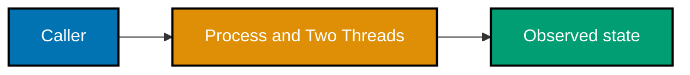

**Runnable source**: [example.c](./code/ex-55-process-and-two-threads/example.c)

**Key takeaway**: Treat the Windows return value, state observation, and owned handle as one operation.

**Why it matters**: A focused executable turns a platform rule into direct evidence. It teaches you to check the documented failure value, identify what resource your process owns, observe completion with the right Windows mechanism, and release the resource exactly once before expanding the pattern into a larger program.

### Example 56: Producer Consumer with Events

_Exercises co-22._ This small experiment isolates **Producer Consumer with Events** and leaves no dependency on a preceding example.

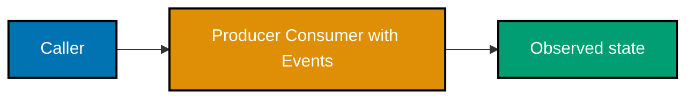

**Runnable source**: [example.c](./code/ex-56-producer-consumer-with-events/example.c)

**Key takeaway**: Treat the Windows return value, state observation, and owned handle as one operation.

**Why it matters**: A focused executable turns a platform rule into direct evidence. It teaches you to check the documented failure value, identify what resource your process owns, observe completion with the right Windows mechanism, and release the resource exactly once before expanding the pattern into a larger program.

### Example 57: Shared Memory Mapping

_Exercises co-22._ This small experiment isolates **Shared Memory Mapping** and leaves no dependency on a preceding example.

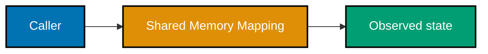

**Runnable source**: [example.c](./code/ex-57-shared-memory-mapping/example.c)

**Key takeaway**: Treat the Windows return value, state observation, and owned handle as one operation.

**Why it matters**: A focused executable turns a platform rule into direct evidence. It teaches you to check the documented failure value, identify what resource your process owns, observe completion with the right Windows mechanism, and release the resource exactly once before expanding the pattern into a larger program.

### Example 58: Overlapped Completion Event

_Exercises co-23._ This small experiment isolates **Overlapped Completion Event** and leaves no dependency on a preceding example.

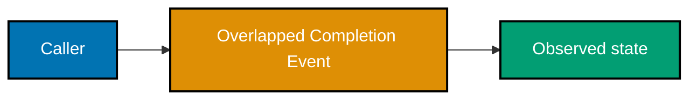

**Runnable source**: [example.c](./code/ex-58-overlapped-completion-event/example.c)

**Key takeaway**: Treat the Windows return value, state observation, and owned handle as one operation.

**Why it matters**: A focused executable turns a platform rule into direct evidence. It teaches you to check the documented failure value, identify what resource your process owns, observe completion with the right Windows mechanism, and release the resource exactly once before expanding the pattern into a larger program.

### Example 59: Find a Handle Leak

_Exercises co-23._ This small experiment isolates **Find a Handle Leak** and leaves no dependency on a preceding example.
**Runnable source**: [example.c](./code/ex-59-find-a-handle-leak/example.c)

**Key takeaway**: Treat the Windows return value, state observation, and owned handle as one operation.

**Why it matters**: A focused executable turns a platform rule into direct evidence. It teaches you to check the documented failure value, identify what resource your process owns, observe completion with the right Windows mechanism, and release the resource exactly once before expanding the pattern into a larger program.

### Example 60: Race Then Critical-Section Fix

_Exercises co-24._ This small experiment isolates **Race Then Critical-Section Fix** and leaves no dependency on a preceding example.

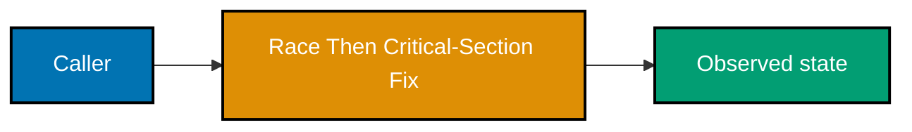

**Runnable source**: [example.c](./code/ex-60-race-then-critical-section-fix/example.c)

**Key takeaway**: Treat the Windows return value, state observation, and owned handle as one operation.

**Why it matters**: A focused executable turns a platform rule into direct evidence. It teaches you to check the documented failure value, identify what resource your process owns, observe completion with the right Windows mechanism, and release the resource exactly once before expanding the pattern into a larger program.

### Example 61: Named Synchronization Between Processes

_Exercises co-24._ This small experiment isolates **Named Synchronization Between Processes** and leaves no dependency on a preceding example.

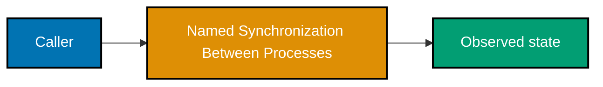

**Runnable source**: [example.c](./code/ex-61-named-synchronization-between-processes/example.c)

**Key takeaway**: Treat the Windows return value, state observation, and owned handle as one operation.

**Why it matters**: A focused executable turns a platform rule into direct evidence. It teaches you to check the documented failure value, identify what resource your process owns, observe completion with the right Windows mechanism, and release the resource exactly once before expanding the pattern into a larger program.

### Example 62: VirtualAlloc Guard Page

_Exercises co-24._ This small experiment isolates **VirtualAlloc Guard Page** and leaves no dependency on a preceding example.
**Runnable source**: [example.c](./code/ex-62-virtualalloc-guard-page/example.c)

**Key takeaway**: Treat the Windows return value, state observation, and owned handle as one operation.

**Why it matters**: A focused executable turns a platform rule into direct evidence. It teaches you to check the documented failure value, identify what resource your process owns, observe completion with the right Windows mechanism, and release the resource exactly once before expanding the pattern into a larger program.

### Example 63: Registry Round Trip

_Exercises co-25._ This small experiment isolates **Registry Round Trip** and leaves no dependency on a preceding example.
**Runnable source**: [example.c](./code/ex-63-registry-round-trip/example.c)

**Key takeaway**: Treat the Windows return value, state observation, and owned handle as one operation.

**Why it matters**: A focused executable turns a platform rule into direct evidence. It teaches you to check the documented failure value, identify what resource your process owns, observe completion with the right Windows mechanism, and release the resource exactly once before expanding the pattern into a larger program.

### Example 64: Handle File Round Trip

_Exercises co-25._ This small experiment isolates **Handle File Round Trip** and leaves no dependency on a preceding example.

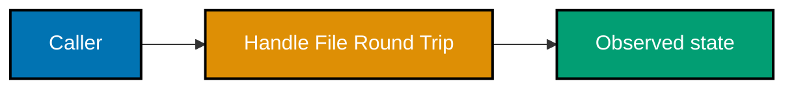

**Runnable source**: [example.c](./code/ex-64-handle-file-round-trip/example.c)

**Key takeaway**: Treat the Windows return value, state observation, and owned handle as one operation.

**Why it matters**: A focused executable turns a platform rule into direct evidence. It teaches you to check the documented failure value, identify what resource your process owns, observe completion with the right Windows mechanism, and release the resource exactly once before expanding the pattern into a larger program.

### Example 65: NTFS Stream Round Trip

_Exercises co-25._ This small experiment isolates **NTFS Stream Round Trip** and leaves no dependency on a preceding example.
**Runnable source**: [example.c](./code/ex-65-ntfs-stream-round-trip/example.c)

**Key takeaway**: Treat the Windows return value, state observation, and owned handle as one operation.

**Why it matters**: A focused executable turns a platform rule into direct evidence. It teaches you to check the documented failure value, identify what resource your process owns, observe completion with the right Windows mechanism, and release the resource exactly once before expanding the pattern into a larger program.

### Example 66: Process Explorer DLL View

_Exercises co-26._ This small experiment isolates **Process Explorer DLL View** and leaves no dependency on a preceding example.
**Runnable source**: [example.ps1](./code/ex-66-process-explorer-dll-view/example.ps1)

**Key takeaway**: Treat the Windows return value, state observation, and owned handle as one operation.

**Why it matters**: A focused executable turns a platform rule into direct evidence. It teaches you to check the documented failure value, identify what resource your process owns, observe completion with the right Windows mechanism, and release the resource exactly once before expanding the pattern into a larger program.

### Example 67: PowerShell CIM Process Query

_Exercises co-26._ This small experiment isolates **PowerShell CIM Process Query** and leaves no dependency on a preceding example.
**Runnable source**: [example.c](./code/ex-67-powershell-cim-process-query/example.c)

**Key takeaway**: Treat the Windows return value, state observation, and owned handle as one operation.

**Why it matters**: A focused executable turns a platform rule into direct evidence. It teaches you to check the documented failure value, identify what resource your process owns, observe completion with the right Windows mechanism, and release the resource exactly once before expanding the pattern into a larger program.

### Example 68: HANDLE and File Descriptor Contrast

_Exercises co-27._ This small experiment isolates **HANDLE and File Descriptor Contrast** and leaves no dependency on a preceding example.

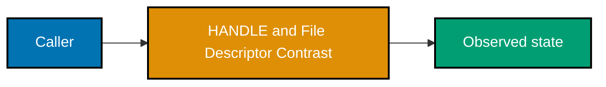

**Runnable source**: [example.c](./code/ex-68-handle-and-file-descriptor-contrast/example.c)

**Key takeaway**: Treat the Windows return value, state observation, and owned handle as one operation.

**Why it matters**: A focused executable turns a platform rule into direct evidence. It teaches you to check the documented failure value, identify what resource your process owns, observe completion with the right Windows mechanism, and release the resource exactly once before expanding the pattern into a larger program.

### Example 69: CreateProcess and fork/exec Contrast

_Exercises co-27._ This small experiment isolates **CreateProcess and fork/exec Contrast** and leaves no dependency on a preceding example.

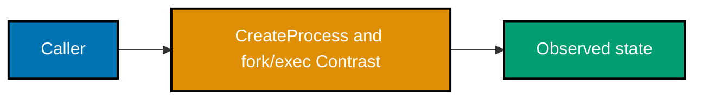

**Runnable source**: [example.c](./code/ex-69-createprocess-and-fork-exec-contrast/example.c)

**Key takeaway**: Treat the Windows return value, state observation, and owned handle as one operation.

**Why it matters**: A focused executable turns a platform rule into direct evidence. It teaches you to check the documented failure value, identify what resource your process owns, observe completion with the right Windows mechanism, and release the resource exactly once before expanding the pattern into a larger program.

### Example 70: Object Manager and VFS Contrast

_Exercises co-27._ This small experiment isolates **Object Manager and VFS Contrast** and leaves no dependency on a preceding example.
**Runnable source**: [example.c](./code/ex-70-object-manager-and-vfs-contrast/example.c)

**Key takeaway**: Treat the Windows return value, state observation, and owned handle as one operation.

**Why it matters**: A focused executable turns a platform rule into direct evidence. It teaches you to check the documented failure value, identify what resource your process owns, observe completion with the right Windows mechanism, and release the resource exactly once before expanding the pattern into a larger program.

### Example 71: Uniform Waitable Objects

_Exercises co-28._ This small experiment isolates **Uniform Waitable Objects** and leaves no dependency on a preceding example.

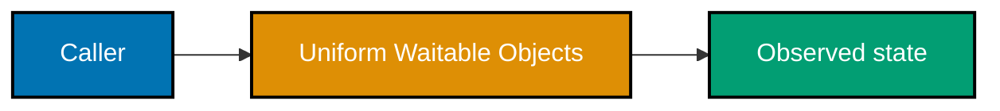

**Runnable source**: [example.c](./code/ex-71-uniform-waitable-objects/example.c)

**Key takeaway**: Treat the Windows return value, state observation, and owned handle as one operation.

**Why it matters**: A focused executable turns a platform rule into direct evidence. It teaches you to check the documented failure value, identify what resource your process owns, observe completion with the right Windows mechanism, and release the resource exactly once before expanding the pattern into a larger program.

### Example 72: Small Thread Pool

_Exercises co-28._ This small experiment isolates **Small Thread Pool** and leaves no dependency on a preceding example.
**Runnable source**: [example.c](./code/ex-72-small-thread-pool/example.c)

**Key takeaway**: Treat the Windows return value, state observation, and owned handle as one operation.

**Why it matters**: A focused executable turns a platform rule into direct evidence. It teaches you to check the documented failure value, identify what resource your process owns, observe completion with the right Windows mechanism, and release the resource exactly once before expanding the pattern into a larger program.

### Example 73: Concurrent Overlapped I/O

_Exercises co-29._ This small experiment isolates **Concurrent Overlapped I/O** and leaves no dependency on a preceding example.

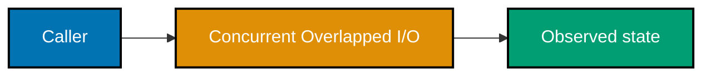

**Runnable source**: [example.c](./code/ex-73-concurrent-overlapped-i-o/example.c)

**Key takeaway**: Treat the Windows return value, state observation, and owned handle as one operation.

**Why it matters**: A focused executable turns a platform rule into direct evidence. It teaches you to check the documented failure value, identify what resource your process owns, observe completion with the right Windows mechanism, and release the resource exactly once before expanding the pattern into a larger program.

### Example 74: VirtualProtect

_Exercises co-29._ This small experiment isolates **VirtualProtect** and leaves no dependency on a preceding example.
**Runnable source**: [example.c](./code/ex-74-virtualprotect/example.c)

**Key takeaway**: Treat the Windows return value, state observation, and owned handle as one operation.

**Why it matters**: A focused executable turns a platform rule into direct evidence. It teaches you to check the documented failure value, identify what resource your process owns, observe completion with the right Windows mechanism, and release the resource exactly once before expanding the pattern into a larger program.

### Example 75: Inspection Matches Code

_Exercises co-29._ This small experiment isolates **Inspection Matches Code** and leaves no dependency on a preceding example.
**Runnable source**: [example.ps1](./code/ex-75-inspection-matches-code/example.ps1)

**Key takeaway**: Treat the Windows return value, state observation, and owned handle as one operation.

**Why it matters**: A focused executable turns a platform rule into direct evidence. It teaches you to check the documented failure value, identify what resource your process owns, observe completion with the right Windows mechanism, and release the resource exactly once before expanding the pattern into a larger program.

### Example 76: Full Win32 Slice

_Exercises co-30._ This small experiment isolates **Full Win32 Slice** and leaves no dependency on a preceding example.
**Runnable source**: [example.c](./code/ex-76-full-win32-slice/example.c)

**Key takeaway**: Treat the Windows return value, state observation, and owned handle as one operation.

**Why it matters**: A focused executable turns a platform rule into direct evidence. It teaches you to check the documented failure value, identify what resource your process owns, observe completion with the right Windows mechanism, and release the resource exactly once before expanding the pattern into a larger program.

### Example 77: Integration Contrast Slice

_Exercises co-30._ This small experiment isolates **Integration Contrast Slice** and leaves no dependency on a preceding example.
**Runnable source**: [example.c](./code/ex-77-integration-contrast-slice/example.c)

**Key takeaway**: Treat the Windows return value, state observation, and owned handle as one operation.

**Why it matters**: A focused executable turns a platform rule into direct evidence. It teaches you to check the documented failure value, identify what resource your process owns, observe completion with the right Windows mechanism, and release the resource exactly once before expanding the pattern into a larger program.

### Example 78: Windows OS Tour Capstone

_Exercises co-30._ This small experiment isolates **Windows OS Tour Capstone** and leaves no dependency on a preceding example.
**Runnable source**: [example.c](./code/ex-78-windows-os-tour-capstone/example.c)

**Key takeaway**: Treat the Windows return value, state observation, and owned handle as one operation.

**Why it matters**: A focused executable turns a platform rule into direct evidence. It teaches you to check the documented failure value, identify what resource your process owns, observe completion with the right Windows mechanism, and release the resource exactly once before expanding the pattern into a larger program.
