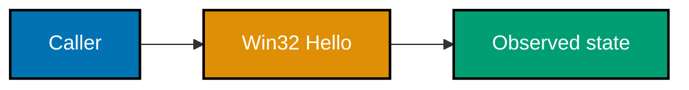
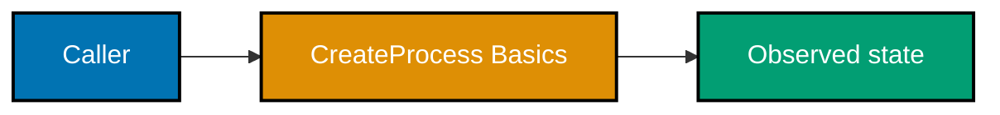
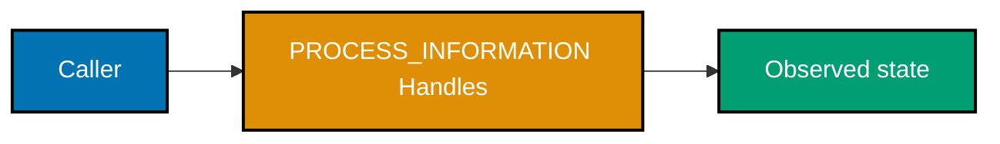
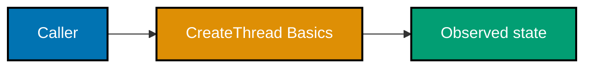
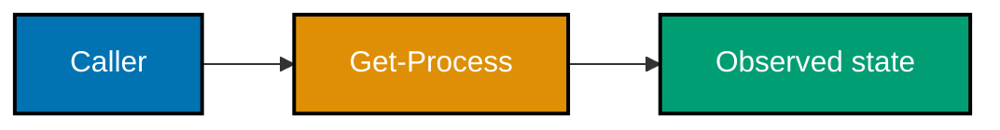
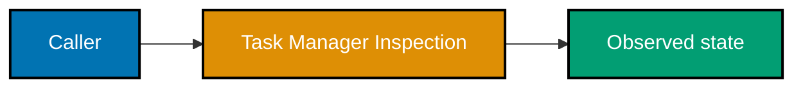
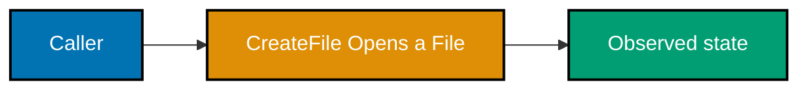
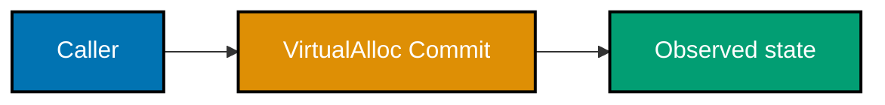

All examples are Windows-only and independent. For C sources, use cl /W4 /TC example.c from the example directory. PowerShell sources require only the built-in Windows PowerShell commands. Every C source checks its created event HANDLE and closes it before exit; the capstone adds the complete process, thread, and I/O sequence.

### Example 1: Win32 Hello

_Exercises co-01._ This small experiment isolates **Win32 Hello** and leaves no dependency on a preceding example.

**Runnable source**: [example.c](./code/ex-01-win32-hello/example.c)

**Key takeaway**: Treat the Windows return value, state observation, and owned handle as one operation.

**Why it matters**: A focused executable turns a platform rule into direct evidence. It teaches you to check the documented failure value, identify what resource your process owns, observe completion with the right Windows mechanism, and release the resource exactly once before expanding the pattern into a larger program.

### Example 2: Get Current Process ID

_Exercises co-01._ This small experiment isolates **Get Current Process ID** and leaves no dependency on a preceding example.
**Runnable source**: [example.c](./code/ex-02-get-current-process-id/example.c)

**Key takeaway**: Treat the Windows return value, state observation, and owned handle as one operation.

**Why it matters**: A focused executable turns a platform rule into direct evidence. It teaches you to check the documented failure value, identify what resource your process owns, observe completion with the right Windows mechanism, and release the resource exactly once before expanding the pattern into a larger program.

### Example 3: CreateProcess Basics

_Exercises co-02._ This small experiment isolates **CreateProcess Basics** and leaves no dependency on a preceding example.

**Runnable source**: [example.c](./code/ex-03-createprocess-basics/example.c)

**Key takeaway**: Treat the Windows return value, state observation, and owned handle as one operation.

**Why it matters**: A focused executable turns a platform rule into direct evidence. It teaches you to check the documented failure value, identify what resource your process owns, observe completion with the right Windows mechanism, and release the resource exactly once before expanding the pattern into a larger program.

### Example 4: Wait for a Child Process

_Exercises co-02._ This small experiment isolates **Wait for a Child Process** and leaves no dependency on a preceding example.
**Runnable source**: [example.c](./code/ex-04-wait-for-a-child-process/example.c)

**Key takeaway**: Treat the Windows return value, state observation, and owned handle as one operation.

**Why it matters**: A focused executable turns a platform rule into direct evidence. It teaches you to check the documented failure value, identify what resource your process owns, observe completion with the right Windows mechanism, and release the resource exactly once before expanding the pattern into a larger program.

### Example 5: Primary Thread Handle

_Exercises co-02._ This small experiment isolates **Primary Thread Handle** and leaves no dependency on a preceding example.
**Runnable source**: [example.c](./code/ex-05-primary-thread-handle/example.c)

**Key takeaway**: Treat the Windows return value, state observation, and owned handle as one operation.

**Why it matters**: A focused executable turns a platform rule into direct evidence. It teaches you to check the documented failure value, identify what resource your process owns, observe completion with the right Windows mechanism, and release the resource exactly once before expanding the pattern into a larger program.

### Example 6: PROCESS_INFORMATION Handles

_Exercises co-03._ This small experiment isolates **PROCESS_INFORMATION Handles** and leaves no dependency on a preceding example.

**Runnable source**: [example.c](./code/ex-06-process-information-handles/example.c)

**Key takeaway**: Treat the Windows return value, state observation, and owned handle as one operation.

**Why it matters**: A focused executable turns a platform rule into direct evidence. It teaches you to check the documented failure value, identify what resource your process owns, observe completion with the right Windows mechanism, and release the resource exactly once before expanding the pattern into a larger program.

### Example 7: CloseHandle Discipline

_Exercises co-03._ This small experiment isolates **CloseHandle Discipline** and leaves no dependency on a preceding example.
**Runnable source**: [example.c](./code/ex-07-closehandle-discipline/example.c)

**Key takeaway**: Treat the Windows return value, state observation, and owned handle as one operation.

**Why it matters**: A focused executable turns a platform rule into direct evidence. It teaches you to check the documented failure value, identify what resource your process owns, observe completion with the right Windows mechanism, and release the resource exactly once before expanding the pattern into a larger program.

### Example 8: Handle Count Observation

_Exercises co-04._ This small experiment isolates **Handle Count Observation** and leaves no dependency on a preceding example.
**Runnable source**: [example.c](./code/ex-08-handle-count-observation/example.c)

**Key takeaway**: Treat the Windows return value, state observation, and owned handle as one operation.

**Why it matters**: A focused executable turns a platform rule into direct evidence. It teaches you to check the documented failure value, identify what resource your process owns, observe completion with the right Windows mechanism, and release the resource exactly once before expanding the pattern into a larger program.

### Example 9: CreateThread Basics

_Exercises co-04._ This small experiment isolates **CreateThread Basics** and leaves no dependency on a preceding example.

**Runnable source**: [example.c](./code/ex-09-createthread-basics/example.c)

**Key takeaway**: Treat the Windows return value, state observation, and owned handle as one operation.

**Why it matters**: A focused executable turns a platform rule into direct evidence. It teaches you to check the documented failure value, identify what resource your process owns, observe completion with the right Windows mechanism, and release the resource exactly once before expanding the pattern into a larger program.

### Example 10: Wait for a Thread

_Exercises co-04._ This small experiment isolates **Wait for a Thread** and leaves no dependency on a preceding example.
**Runnable source**: [example.c](./code/ex-10-wait-for-a-thread/example.c)

**Key takeaway**: Treat the Windows return value, state observation, and owned handle as one operation.

**Why it matters**: A focused executable turns a platform rule into direct evidence. It teaches you to check the documented failure value, identify what resource your process owns, observe completion with the right Windows mechanism, and release the resource exactly once before expanding the pattern into a larger program.

### Example 11: Multiple Threads

_Exercises co-05._ This small experiment isolates **Multiple Threads** and leaves no dependency on a preceding example.
**Runnable source**: [example.c](./code/ex-11-multiple-threads/example.c)

**Key takeaway**: Treat the Windows return value, state observation, and owned handle as one operation.

**Why it matters**: A focused executable turns a platform rule into direct evidence. It teaches you to check the documented failure value, identify what resource your process owns, observe completion with the right Windows mechanism, and release the resource exactly once before expanding the pattern into a larger program.

### Example 12: Get-Process

_Exercises co-05._ This small experiment isolates **Get-Process** and leaves no dependency on a preceding example.

**Runnable source**: [example.ps1](./code/ex-12-get-process/example.ps1)

**Key takeaway**: Treat the Windows return value, state observation, and owned handle as one operation.

**Why it matters**: A focused executable turns a platform rule into direct evidence. It teaches you to check the documented failure value, identify what resource your process owns, observe completion with the right Windows mechanism, and release the resource exactly once before expanding the pattern into a larger program.

### Example 13: Filter Get-Process

_Exercises co-05._ This small experiment isolates **Filter Get-Process** and leaves no dependency on a preceding example.
**Runnable source**: [example.ps1](./code/ex-13-filter-get-process/example.ps1)

**Key takeaway**: Treat the Windows return value, state observation, and owned handle as one operation.

**Why it matters**: A focused executable turns a platform rule into direct evidence. It teaches you to check the documented failure value, identify what resource your process owns, observe completion with the right Windows mechanism, and release the resource exactly once before expanding the pattern into a larger program.

### Example 14: Get-Service

_Exercises co-06._ This small experiment isolates **Get-Service** and leaves no dependency on a preceding example.
**Runnable source**: [example.ps1](./code/ex-14-get-service/example.ps1)

**Key takeaway**: Treat the Windows return value, state observation, and owned handle as one operation.

**Why it matters**: A focused executable turns a platform rule into direct evidence. It teaches you to check the documented failure value, identify what resource your process owns, observe completion with the right Windows mechanism, and release the resource exactly once before expanding the pattern into a larger program.

### Example 15: Task Manager Inspection

_Exercises co-06._ This small experiment isolates **Task Manager Inspection** and leaves no dependency on a preceding example.

**Runnable source**: [example.ps1](./code/ex-15-task-manager-inspection/example.ps1)

**Key takeaway**: Treat the Windows return value, state observation, and owned handle as one operation.

**Why it matters**: A focused executable turns a platform rule into direct evidence. It teaches you to check the documented failure value, identify what resource your process owns, observe completion with the right Windows mechanism, and release the resource exactly once before expanding the pattern into a larger program.

### Example 16: Process Explorer Handles

_Exercises co-07._ This small experiment isolates **Process Explorer Handles** and leaves no dependency on a preceding example.
**Runnable source**: [example.ps1](./code/ex-16-process-explorer-handles/example.ps1)

**Key takeaway**: Treat the Windows return value, state observation, and owned handle as one operation.

**Why it matters**: A focused executable turns a platform rule into direct evidence. It teaches you to check the documented failure value, identify what resource your process owns, observe completion with the right Windows mechanism, and release the resource exactly once before expanding the pattern into a larger program.

### Example 17: CreateFile Opens a File

_Exercises co-07._ This small experiment isolates **CreateFile Opens a File** and leaves no dependency on a preceding example.

**Runnable source**: [example.c](./code/ex-17-createfile-opens-a-file/example.c)

**Key takeaway**: Treat the Windows return value, state observation, and owned handle as one operation.

**Why it matters**: A focused executable turns a platform rule into direct evidence. It teaches you to check the documented failure value, identify what resource your process owns, observe completion with the right Windows mechanism, and release the resource exactly once before expanding the pattern into a larger program.

### Example 18: CreateFile Failure

_Exercises co-07._ This small experiment isolates **CreateFile Failure** and leaves no dependency on a preceding example.
**Runnable source**: [example.c](./code/ex-18-createfile-failure/example.c)

**Key takeaway**: Treat the Windows return value, state observation, and owned handle as one operation.

**Why it matters**: A focused executable turns a platform rule into direct evidence. It teaches you to check the documented failure value, identify what resource your process owns, observe completion with the right Windows mechanism, and release the resource exactly once before expanding the pattern into a larger program.

### Example 19: ReadFile

_Exercises co-08._ This small experiment isolates **ReadFile** and leaves no dependency on a preceding example.
**Runnable source**: [example.c](./code/ex-19-readfile/example.c)

**Key takeaway**: Treat the Windows return value, state observation, and owned handle as one operation.

**Why it matters**: A focused executable turns a platform rule into direct evidence. It teaches you to check the documented failure value, identify what resource your process owns, observe completion with the right Windows mechanism, and release the resource exactly once before expanding the pattern into a larger program.

### Example 20: WriteFile

_Exercises co-08._ This small experiment isolates **WriteFile** and leaves no dependency on a preceding example.
**Runnable source**: [example.c](./code/ex-20-writefile/example.c)

**Key takeaway**: Treat the Windows return value, state observation, and owned handle as one operation.

**Why it matters**: A focused executable turns a platform rule into direct evidence. It teaches you to check the documented failure value, identify what resource your process owns, observe completion with the right Windows mechanism, and release the resource exactly once before expanding the pattern into a larger program.

### Example 21: VirtualAlloc Commit

_Exercises co-09._ This small experiment isolates **VirtualAlloc Commit** and leaves no dependency on a preceding example.

**Runnable source**: [example.c](./code/ex-21-virtualalloc-commit/example.c)

**Key takeaway**: Treat the Windows return value, state observation, and owned handle as one operation.

**Why it matters**: A focused executable turns a platform rule into direct evidence. It teaches you to check the documented failure value, identify what resource your process owns, observe completion with the right Windows mechanism, and release the resource exactly once before expanding the pattern into a larger program.

### Example 22: VirtualAlloc Read-Back

_Exercises co-09._ This small experiment isolates **VirtualAlloc Read-Back** and leaves no dependency on a preceding example.
**Runnable source**: [example.c](./code/ex-22-virtualalloc-read-back/example.c)

**Key takeaway**: Treat the Windows return value, state observation, and owned handle as one operation.

**Why it matters**: A focused executable turns a platform rule into direct evidence. It teaches you to check the documented failure value, identify what resource your process owns, observe completion with the right Windows mechanism, and release the resource exactly once before expanding the pattern into a larger program.

### Example 23: Open a Registry Key

_Exercises co-09._ This small experiment isolates **Open a Registry Key** and leaves no dependency on a preceding example.
**Runnable source**: [example.c](./code/ex-23-open-a-registry-key/example.c)

**Key takeaway**: Treat the Windows return value, state observation, and owned handle as one operation.

**Why it matters**: A focused executable turns a platform rule into direct evidence. It teaches you to check the documented failure value, identify what resource your process owns, observe completion with the right Windows mechanism, and release the resource exactly once before expanding the pattern into a larger program.

### Example 24: Query a Registry Value

_Exercises co-10._ This small experiment isolates **Query a Registry Value** and leaves no dependency on a preceding example.
**Runnable source**: [example.c](./code/ex-24-query-a-registry-value/example.c)

**Key takeaway**: Treat the Windows return value, state observation, and owned handle as one operation.

**Why it matters**: A focused executable turns a platform rule into direct evidence. It teaches you to check the documented failure value, identify what resource your process owns, observe completion with the right Windows mechanism, and release the resource exactly once before expanding the pattern into a larger program.

### Example 25: Registry Tree

_Exercises co-10._ This small experiment isolates **Registry Tree** and leaves no dependency on a preceding example.
**Runnable source**: [example.c](./code/ex-25-registry-tree/example.c)

**Key takeaway**: Treat the Windows return value, state observation, and owned handle as one operation.

**Why it matters**: A focused executable turns a platform rule into direct evidence. It teaches you to check the documented failure value, identify what resource your process owns, observe completion with the right Windows mechanism, and release the resource exactly once before expanding the pattern into a larger program.

### Example 26: PowerShell Registry Read

_Exercises co-10._ This small experiment isolates **PowerShell Registry Read** and leaves no dependency on a preceding example.
**Runnable source**: [example.ps1](./code/ex-26-powershell-registry-read/example.ps1)

**Key takeaway**: Treat the Windows return value, state observation, and owned handle as one operation.

**Why it matters**: A focused executable turns a platform rule into direct evidence. It teaches you to check the documented failure value, identify what resource your process owns, observe completion with the right Windows mechanism, and release the resource exactly once before expanding the pattern into a larger program.
