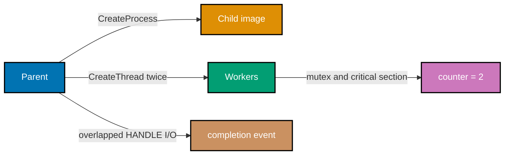

## Goal

Build a small Windows-only console program that creates a child with CreateProcess, runs two threads under both a mutex and a critical section, performs a handle-based overlapped write, and closes every acquired HANDLE.

## Run

```powershell
cl /W4 /TC windows_os_tour.c
.\windows_os_tour.exe
Get-Process windows_os_tour -ErrorAction SilentlyContinue
```

The child runs the same executable with --child. The parent waits on the child and worker handles, prints a counter of exactly two, waits for the overlapped completion event, obtains the final byte count, and removes its temporary file.

## Acceptance checks

- CreateProcess succeeds and the hProcess and hThread handles both close.
- Two workers increment the shared counter exactly twice using a mutex plus critical section.
- The temporary file uses FILE_FLAG_OVERLAPPED and its completion event and file handle close.
- contrast.md contrasts handles/objects with fd and /proc, plus CreateProcess with fork/exec.


