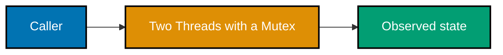
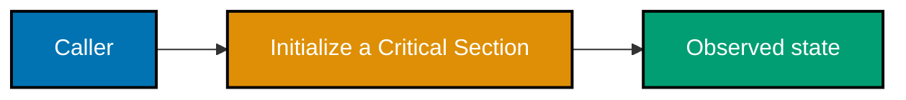
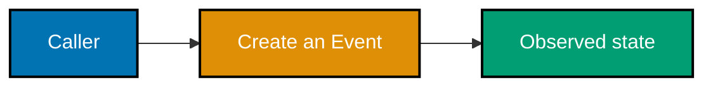
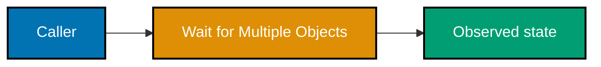
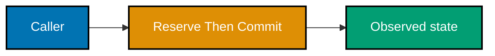
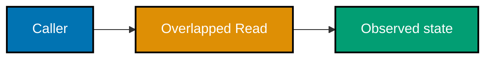
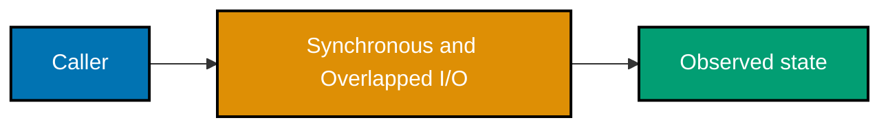
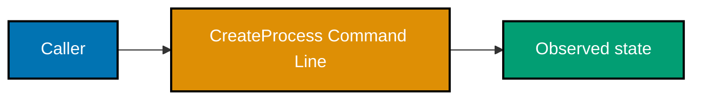
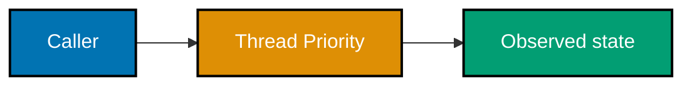

All examples are Windows-only and independent. For C sources, use cl /W4 /TC example.c from the example directory. PowerShell sources require only the built-in Windows PowerShell commands. Every C source checks its created event HANDLE and closes it before exit; the capstone adds the complete process, thread, and I/O sequence.

### Example 27: Create a Mutex

_Exercises co-11._ This small experiment isolates **Create a Mutex** and leaves no dependency on a preceding example.

**Runnable source**: [example.c](./code/ex-27-create-a-mutex/example.c)

**Key takeaway**: Treat the Windows return value, state observation, and owned handle as one operation.

**Why it matters**: A focused executable turns a platform rule into direct evidence. It teaches you to check the documented failure value, identify what resource your process owns, observe completion with the right Windows mechanism, and release the resource exactly once before expanding the pattern into a larger program.

### Example 28: Lock and Release a Mutex

_Exercises co-11._ This small experiment isolates **Lock and Release a Mutex** and leaves no dependency on a preceding example.
**Runnable source**: [example.c](./code/ex-28-lock-and-release-a-mutex/example.c)

**Key takeaway**: Treat the Windows return value, state observation, and owned handle as one operation.

**Why it matters**: A focused executable turns a platform rule into direct evidence. It teaches you to check the documented failure value, identify what resource your process owns, observe completion with the right Windows mechanism, and release the resource exactly once before expanding the pattern into a larger program.

### Example 29: Two Threads with a Mutex

_Exercises co-12._ This small experiment isolates **Two Threads with a Mutex** and leaves no dependency on a preceding example.

**Runnable source**: [example.c](./code/ex-29-two-threads-with-a-mutex/example.c)

**Key takeaway**: Treat the Windows return value, state observation, and owned handle as one operation.

**Why it matters**: A focused executable turns a platform rule into direct evidence. It teaches you to check the documented failure value, identify what resource your process owns, observe completion with the right Windows mechanism, and release the resource exactly once before expanding the pattern into a larger program.

### Example 30: Named Mutex Across Processes

_Exercises co-12._ This small experiment isolates **Named Mutex Across Processes** and leaves no dependency on a preceding example.
**Runnable source**: [example.c](./code/ex-30-named-mutex-across-processes/example.c)

**Key takeaway**: Treat the Windows return value, state observation, and owned handle as one operation.

**Why it matters**: A focused executable turns a platform rule into direct evidence. It teaches you to check the documented failure value, identify what resource your process owns, observe completion with the right Windows mechanism, and release the resource exactly once before expanding the pattern into a larger program.

### Example 31: Initialize a Critical Section

_Exercises co-12._ This small experiment isolates **Initialize a Critical Section** and leaves no dependency on a preceding example.

**Runnable source**: [example.c](./code/ex-31-initialize-a-critical-section/example.c)

**Key takeaway**: Treat the Windows return value, state observation, and owned handle as one operation.

**Why it matters**: A focused executable turns a platform rule into direct evidence. It teaches you to check the documented failure value, identify what resource your process owns, observe completion with the right Windows mechanism, and release the resource exactly once before expanding the pattern into a larger program.

### Example 32: Critical Section or Mutex

_Exercises co-13._ This small experiment isolates **Critical Section or Mutex** and leaves no dependency on a preceding example.
**Runnable source**: [example.c](./code/ex-32-critical-section-or-mutex/example.c)

**Key takeaway**: Treat the Windows return value, state observation, and owned handle as one operation.

**Why it matters**: A focused executable turns a platform rule into direct evidence. It teaches you to check the documented failure value, identify what resource your process owns, observe completion with the right Windows mechanism, and release the resource exactly once before expanding the pattern into a larger program.

### Example 33: Create an Event

_Exercises co-13._ This small experiment isolates **Create an Event** and leaves no dependency on a preceding example.

**Runnable source**: [example.c](./code/ex-33-create-an-event/example.c)

**Key takeaway**: Treat the Windows return value, state observation, and owned handle as one operation.

**Why it matters**: A focused executable turns a platform rule into direct evidence. It teaches you to check the documented failure value, identify what resource your process owns, observe completion with the right Windows mechanism, and release the resource exactly once before expanding the pattern into a larger program.

### Example 34: Signal an Event

_Exercises co-14._ This small experiment isolates **Signal an Event** and leaves no dependency on a preceding example.
**Runnable source**: [example.c](./code/ex-34-signal-an-event/example.c)

**Key takeaway**: Treat the Windows return value, state observation, and owned handle as one operation.

**Why it matters**: A focused executable turns a platform rule into direct evidence. It teaches you to check the documented failure value, identify what resource your process owns, observe completion with the right Windows mechanism, and release the resource exactly once before expanding the pattern into a larger program.

### Example 35: Manual-Reset Event

_Exercises co-14._ This small experiment isolates **Manual-Reset Event** and leaves no dependency on a preceding example.
**Runnable source**: [example.c](./code/ex-35-manual-reset-event/example.c)

**Key takeaway**: Treat the Windows return value, state observation, and owned handle as one operation.

**Why it matters**: A focused executable turns a platform rule into direct evidence. It teaches you to check the documented failure value, identify what resource your process owns, observe completion with the right Windows mechanism, and release the resource exactly once before expanding the pattern into a larger program.

### Example 36: Wait for Multiple Objects

_Exercises co-14._ This small experiment isolates **Wait for Multiple Objects** and leaves no dependency on a preceding example.

**Runnable source**: [example.c](./code/ex-36-wait-for-multiple-objects/example.c)

**Key takeaway**: Treat the Windows return value, state observation, and owned handle as one operation.

**Why it matters**: A focused executable turns a platform rule into direct evidence. It teaches you to check the documented failure value, identify what resource your process owns, observe completion with the right Windows mechanism, and release the resource exactly once before expanding the pattern into a larger program.

### Example 37: Reserve Then Commit

_Exercises co-15._ This small experiment isolates **Reserve Then Commit** and leaves no dependency on a preceding example.

**Runnable source**: [example.c](./code/ex-37-reserve-then-commit/example.c)

**Key takeaway**: Treat the Windows return value, state observation, and owned handle as one operation.

**Why it matters**: A focused executable turns a platform rule into direct evidence. It teaches you to check the documented failure value, identify what resource your process owns, observe completion with the right Windows mechanism, and release the resource exactly once before expanding the pattern into a larger program.

### Example 38: Create a Private Heap

_Exercises co-15._ This small experiment isolates **Create a Private Heap** and leaves no dependency on a preceding example.
**Runnable source**: [example.c](./code/ex-38-create-a-private-heap/example.c)

**Key takeaway**: Treat the Windows return value, state observation, and owned handle as one operation.

**Why it matters**: A focused executable turns a platform rule into direct evidence. It teaches you to check the documented failure value, identify what resource your process owns, observe completion with the right Windows mechanism, and release the resource exactly once before expanding the pattern into a larger program.

### Example 39: Heap Allocation and Virtual Memory

_Exercises co-15._ This small experiment isolates **Heap Allocation and Virtual Memory** and leaves no dependency on a preceding example.
**Runnable source**: [example.c](./code/ex-39-heap-allocation-and-virtual-memory/example.c)

**Key takeaway**: Treat the Windows return value, state observation, and owned handle as one operation.

**Why it matters**: A focused executable turns a platform rule into direct evidence. It teaches you to check the documented failure value, identify what resource your process owns, observe completion with the right Windows mechanism, and release the resource exactly once before expanding the pattern into a larger program.

### Example 40: Inspect a Working Set

_Exercises co-16._ This small experiment isolates **Inspect a Working Set** and leaves no dependency on a preceding example.
**Runnable source**: [example.ps1](./code/ex-40-inspect-a-working-set/example.ps1)

**Key takeaway**: Treat the Windows return value, state observation, and owned handle as one operation.

**Why it matters**: A focused executable turns a platform rule into direct evidence. It teaches you to check the documented failure value, identify what resource your process owns, observe completion with the right Windows mechanism, and release the resource exactly once before expanding the pattern into a larger program.

### Example 41: Overlapped Read

_Exercises co-16._ This small experiment isolates **Overlapped Read** and leaves no dependency on a preceding example.

**Runnable source**: [example.c](./code/ex-41-overlapped-read/example.c)

**Key takeaway**: Treat the Windows return value, state observation, and owned handle as one operation.

**Why it matters**: A focused executable turns a platform rule into direct evidence. It teaches you to check the documented failure value, identify what resource your process owns, observe completion with the right Windows mechanism, and release the resource exactly once before expanding the pattern into a larger program.

### Example 42: Synchronous and Overlapped I/O

_Exercises co-17._ This small experiment isolates **Synchronous and Overlapped I/O** and leaves no dependency on a preceding example.

**Runnable source**: [example.c](./code/ex-42-synchronous-and-overlapped-i-o/example.c)

**Key takeaway**: Treat the Windows return value, state observation, and owned handle as one operation.

**Why it matters**: A focused executable turns a platform rule into direct evidence. It teaches you to check the documented failure value, identify what resource your process owns, observe completion with the right Windows mechanism, and release the resource exactly once before expanding the pattern into a larger program.

### Example 43: NTFS Alternate Data Stream

_Exercises co-17._ This small experiment isolates **NTFS Alternate Data Stream** and leaves no dependency on a preceding example.
**Runnable source**: [example.c](./code/ex-43-ntfs-alternate-data-stream/example.c)

**Key takeaway**: Treat the Windows return value, state observation, and owned handle as one operation.

**Why it matters**: A focused executable turns a platform rule into direct evidence. It teaches you to check the documented failure value, identify what resource your process owns, observe completion with the right Windows mechanism, and release the resource exactly once before expanding the pattern into a larger program.

### Example 44: NTFS Attributes

_Exercises co-17._ This small experiment isolates **NTFS Attributes** and leaves no dependency on a preceding example.
**Runnable source**: [example.c](./code/ex-44-ntfs-attributes/example.c)

**Key takeaway**: Treat the Windows return value, state observation, and owned handle as one operation.

**Why it matters**: A focused executable turns a platform rule into direct evidence. It teaches you to check the documented failure value, identify what resource your process owns, observe completion with the right Windows mechanism, and release the resource exactly once before expanding the pattern into a larger program.

### Example 45: CreateProcess Command Line

_Exercises co-18._ This small experiment isolates **CreateProcess Command Line** and leaves no dependency on a preceding example.

**Runnable source**: [example.c](./code/ex-45-createprocess-command-line/example.c)

**Key takeaway**: Treat the Windows return value, state observation, and owned handle as one operation.

**Why it matters**: A focused executable turns a platform rule into direct evidence. It teaches you to check the documented failure value, identify what resource your process owns, observe completion with the right Windows mechanism, and release the resource exactly once before expanding the pattern into a larger program.

### Example 46: PowerShell Process Tree

_Exercises co-18._ This small experiment isolates **PowerShell Process Tree** and leaves no dependency on a preceding example.
**Runnable source**: [example.ps1](./code/ex-46-powershell-process-tree/example.ps1)

**Key takeaway**: Treat the Windows return value, state observation, and owned handle as one operation.

**Why it matters**: A focused executable turns a platform rule into direct evidence. It teaches you to check the documented failure value, identify what resource your process owns, observe completion with the right Windows mechanism, and release the resource exactly once before expanding the pattern into a larger program.

### Example 47: Inspect a File Handle

_Exercises co-19._ This small experiment isolates **Inspect a File Handle** and leaves no dependency on a preceding example.
**Runnable source**: [example.c](./code/ex-47-inspect-a-file-handle/example.c)

**Key takeaway**: Treat the Windows return value, state observation, and owned handle as one operation.

**Why it matters**: A focused executable turns a platform rule into direct evidence. It teaches you to check the documented failure value, identify what resource your process owns, observe completion with the right Windows mechanism, and release the resource exactly once before expanding the pattern into a larger program.

### Example 48: Thread Priority

_Exercises co-19._ This small experiment isolates **Thread Priority** and leaves no dependency on a preceding example.

**Runnable source**: [example.c](./code/ex-48-thread-priority/example.c)

**Key takeaway**: Treat the Windows return value, state observation, and owned handle as one operation.

**Why it matters**: A focused executable turns a platform rule into direct evidence. It teaches you to check the documented failure value, identify what resource your process owns, observe completion with the right Windows mechanism, and release the resource exactly once before expanding the pattern into a larger program.

### Example 49: PowerShell Memory Columns

_Exercises co-19._ This small experiment isolates **PowerShell Memory Columns** and leaves no dependency on a preceding example.
**Runnable source**: [example.ps1](./code/ex-49-powershell-memory-columns/example.ps1)

**Key takeaway**: Treat the Windows return value, state observation, and owned handle as one operation.

**Why it matters**: A focused executable turns a platform rule into direct evidence. It teaches you to check the documented failure value, identify what resource your process owns, observe completion with the right Windows mechanism, and release the resource exactly once before expanding the pattern into a larger program.

### Example 50: Write a Registry Value

_Exercises co-20._ This small experiment isolates **Write a Registry Value** and leaves no dependency on a preceding example.
**Runnable source**: [example.c](./code/ex-50-write-a-registry-value/example.c)

**Key takeaway**: Treat the Windows return value, state observation, and owned handle as one operation.

**Why it matters**: A focused executable turns a platform rule into direct evidence. It teaches you to check the documented failure value, identify what resource your process owns, observe completion with the right Windows mechanism, and release the resource exactly once before expanding the pattern into a larger program.

### Example 51: Query a Service

_Exercises co-20._ This small experiment isolates **Query a Service** and leaves no dependency on a preceding example.
**Runnable source**: [example.ps1](./code/ex-51-query-a-service/example.ps1)

**Key takeaway**: Treat the Windows return value, state observation, and owned handle as one operation.

**Why it matters**: A focused executable turns a platform rule into direct evidence. It teaches you to check the documented failure value, identify what resource your process owns, observe completion with the right Windows mechanism, and release the resource exactly once before expanding the pattern into a larger program.

### Example 52: DuplicateHandle

_Exercises co-20._ This small experiment isolates **DuplicateHandle** and leaves no dependency on a preceding example.

**Runnable source**: [example.c](./code/ex-52-duplicatehandle/example.c)

**Key takeaway**: Treat the Windows return value, state observation, and owned handle as one operation.

**Why it matters**: A focused executable turns a platform rule into direct evidence. It teaches you to check the documented failure value, identify what resource your process owns, observe completion with the right Windows mechanism, and release the resource exactly once before expanding the pattern into a larger program.

### Example 53: Wait Timeout

_Exercises co-21._ This small experiment isolates **Wait Timeout** and leaves no dependency on a preceding example.
**Runnable source**: [example.c](./code/ex-53-wait-timeout/example.c)

**Key takeaway**: Treat the Windows return value, state observation, and owned handle as one operation.

**Why it matters**: A focused executable turns a platform rule into direct evidence. It teaches you to check the documented failure value, identify what resource your process owns, observe completion with the right Windows mechanism, and release the resource exactly once before expanding the pattern into a larger program.

### Example 54: Close Every Handle

_Exercises co-21._ This small experiment isolates **Close Every Handle** and leaves no dependency on a preceding example.
**Runnable source**: [example.c](./code/ex-54-close-every-handle/example.c)

**Key takeaway**: Treat the Windows return value, state observation, and owned handle as one operation.

**Why it matters**: A focused executable turns a platform rule into direct evidence. It teaches you to check the documented failure value, identify what resource your process owns, observe completion with the right Windows mechanism, and release the resource exactly once before expanding the pattern into a larger program.
