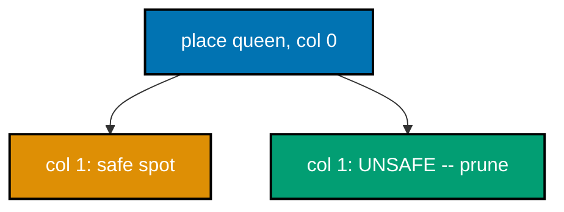
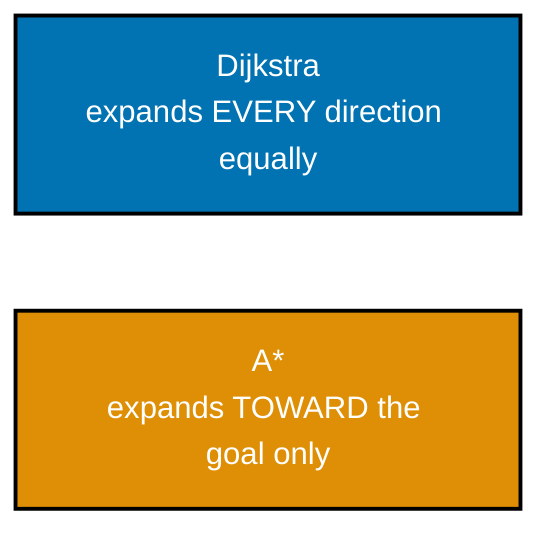
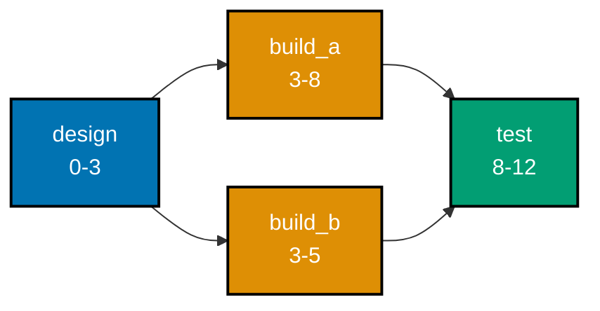
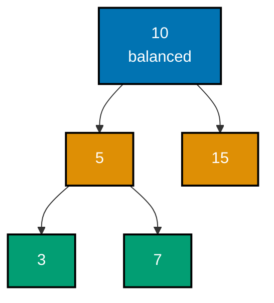
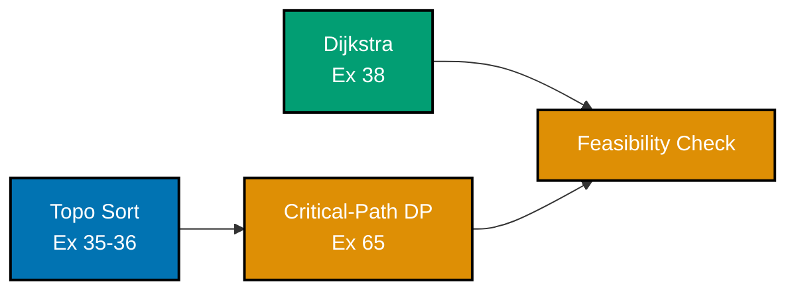

Examples 53-80 close the topic with the paradigms that solve genuinely hard problems: backtracking with pruning (N-Queens, subsets, permutations, word search, Sudoku), a direct greedy-vs-DP contrast, 2D dynamic programming (grid paths, longest increasing subsequence via two methods, matrix-chain multiplication, a space-optimized knapsack), a measured Dijkstra-vs-Bellman-Ford tradeoff and A\* search, critical-path scheduling and strongly connected components, a segment-tree-vs-Fenwick-tree comparison, balanced trees (AVL rotations and red-black invariants), advanced two-pointer and sliding-window patterns (3-sum, longest substring, minimum window), binary search on an answer space, a deterministic worst-case-linear selection algorithm, NP-hardness (brute-force-vs-heuristic TSP and a reduction sketch), the potential method for amortized analysis, three complexities stated and tested via doubling, a brute-force/greedy/DP paradigm shootout, and a capstone preview threading topological sort, critical-path DP, and Dijkstra into one mini scheduler. Every example runs and verifies exactly like the earlier tiers -- `python3 example.py` for inline output, `pytest` for the colocated `test_example.py`.

---

### Example 53: N-Queens by Backtracking

_ex-53 &middot; exercises co-25_

Backtracking places queens column by column, checking safety against every previously placed queen; the moment a placement is unsafe, it prunes that entire branch immediately instead of exploring it further. This example counts solutions for board sizes N=4 through N=8 and checks them against known solution counts.



**`learning/code/ex-53-backtracking-n-queens/example.py`**

```python
"""Example 53: N-Queens by Backtracking with Pruning."""

# Backtracking (co-25) places queens column by column, checking safety
# against every PREVIOUSLY placed queen; the moment a placement is unsafe,
# it prunes -- never even exploring the rest of that doomed branch further.


def solve_n_queens(n: int) -> int:  # => returns the COUNT of distinct solutions
    solutions = [0]  # => a one-element list used as a mutable counter in the closure
    columns_used: set[int] = set()  # => which columns already have a queen
    diag1_used: set[int] = set()  # => which "row - col" diagonals already have a queen
    diag2_used: set[int] = set()  # => which "row + col" diagonals already have a queen

    def place(row: int) -> None:  # => tries placing a queen in every column of this row
        if row == n:  # => base case: every row has a safely placed queen
            solutions[0] += 1  # => one more complete, valid solution found
            return  # => backtracks to try other placements at the previous row
        for col in range(n):  # => tries every column in this row
            if (
                col in columns_used
                or (row - col) in diag1_used
                or (row + col) in diag2_used
            ):  # => THE PRUNE: this column is attacked by an earlier queen
                continue  # => skip this column entirely -- never explore it further
            columns_used.add(col)  # => marks this column as occupied
            diag1_used.add(row - col)  # => marks this "/" diagonal as occupied
            diag2_used.add(row + col)  # => marks this "\" diagonal as occupied
            place(row + 1)  # => recurses to place the NEXT row's queen
            columns_used.remove(col)  # => THE BACKTRACK: undoes this choice
            diag1_used.remove(row - col)  # => frees this diagonal for other branches
            diag2_used.remove(row + col)  # => frees this diagonal too

    place(0)  # => starts placing from row 0
    return solutions[0]  # => the total count of valid N-queens solutions


known_counts: dict[int, int] = {  # => OEIS A000170: the known solution count per N
    4: 2,
    5: 10,
    6: 4,
    7: 40,
    8: 92,
}
for (
    n,
    expected,
) in known_counts.items():  # => verifies N=4..8, as the syllabus specifies
    found = solve_n_queens(n)  # => backtracking's own count
    print(f"N={n}: {found}")  # => Output: one "N=n: count" line per N
    assert found == expected  # => confirms against the well-known OEIS counts
print("ex-53 OK")  # => Output: ex-53 OK
```

**Run**: `python3 example.py`

**Output**:

```text
N=4: 2
N=5: 10
N=6: 4
N=7: 40
N=8: 92
ex-53 OK
```

**`learning/code/ex-53-backtracking-n-queens/test_example.py`**

```python
"""Example 53: pytest verification for N-Queens Backtracking."""

from example import solve_n_queens


def test_known_solution_counts_for_small_n() -> None:
    assert solve_n_queens(1) == 1  # => trivially one way to place a single queen
    assert solve_n_queens(4) == 2
    assert solve_n_queens(8) == 92


def test_n_equals_two_and_three_have_no_solutions() -> None:
    assert solve_n_queens(2) == 0  # => too small a board to avoid all attacks
    assert solve_n_queens(3) == 0


# => Run: pytest -- Output: 2 passed
```

**Verify**: `pytest -q`

**Output**:

```text
2 passed
```

**Key takeaway**: Backtracking's power comes from PRUNING: checking safety immediately after each placement, rather than only at the end, means an unsafe branch is abandoned before wasting any time exploring its (guaranteed-invalid) descendants.

**Why it matters**: N-Queens is the classic introduction to backtracking because its pruning benefit is dramatic and easy to see: without early safety checks, the search space is a hopeless `N^N` brute force; with them, N=8's 92 solutions are found in a fraction of a second. Every later backtracking example in this topic (Examples 54-57) leans on this same 'check as you go, abandon early' discipline.

---

### Example 54: Enumerate All Subsets by Backtracking

_ex-54 &middot; exercises co-25_

At each element, backtracking branches into two choices: include it, or do not. N independent binary choices produce exactly 2^n leaves in the resulting search tree. This example enumerates every subset of a small set and confirms the count is exactly `2^n` with no duplicates.

**`learning/code/ex-54-backtracking-subsets/example.py`**

```python
"""Example 54: Enumerate All Subsets by Backtracking -- Exactly 2^n of Them."""

# At each element, backtracking (co-25) branches into TWO choices: include
# it, or don't. n independent binary choices produce exactly 2^n leaves --
# no pruning needed here, since every combination of choices is valid.


def all_subsets(items: list[int]) -> list[list[int]]:  # => returns all 2^n subsets
    result: list[list[int]] = []  # => accumulates every complete subset found
    current: list[int] = []  # => the in-progress subset being built

    def backtrack(index: int) -> None:  # => decides item[index]'s fate: in or out
        if index == len(items):  # => base case: every item has been decided
            result.append(list(current))  # => records a COPY -- current keeps mutating
            return
        current.append(items[index])  # => CHOICE 1: include this item
        backtrack(index + 1)  # => explores every subset that includes it
        current.pop()  # => BACKTRACK: undoes that inclusion
        backtrack(index + 1)  # => CHOICE 2: explores every subset that excludes it

    backtrack(0)  # => starts deciding from the first item
    return result  # => every one of the 2^n possible subsets


items: list[int] = [1, 2, 3]  # => a small 3-element set
subsets = all_subsets(items)  # => all 8 subsets of {1, 2, 3}
print(len(subsets))  # => Output: 8
print(
    sorted(subsets)
)  # => Output: [[], [1], [1, 2], [1, 2, 3], [1, 3], [2], [2, 3], [3]]

assert len(subsets) == 2 ** len(items)  # => confirms exactly 2^n subsets were generated
unique_subsets = {
    tuple(s) for s in subsets
}  # => tuples are hashable, so a set catches duplicates
assert len(unique_subsets) == len(subsets)  # => confirms NO subset was generated twice
assert [] in subsets  # => confirms the empty subset is included
assert items in subsets  # => confirms the full set itself is included
print("ex-54 OK")  # => Output: ex-54 OK
```

**Run**: `python3 example.py`

**Output**:

```text
8
[[], [1], [1, 2], [1, 2, 3], [1, 3], [2], [2, 3], [3]]
ex-54 OK
```

**`learning/code/ex-54-backtracking-subsets/test_example.py`**

```python
"""Example 54: pytest verification for Backtracking Subsets."""

from example import all_subsets


def test_subset_count_is_two_to_the_n() -> None:
    for n in range(6):
        items = list(range(n))
        assert len(all_subsets(items)) == 2**n


def test_no_duplicate_subsets_are_generated() -> None:
    subsets = all_subsets([1, 2, 3, 4])
    unique = {tuple(s) for s in subsets}
    assert len(unique) == len(subsets)


def test_empty_input_yields_only_the_empty_subset() -> None:
    assert all_subsets([]) == [[]]


# => Run: pytest -- Output: 3 passed
```

**Verify**: `pytest -q`

**Output**:

```text
3 passed
```

**Key takeaway**: Enumerating all subsets is backtracking at its simplest -- no pruning needed at all, since every leaf of the include/exclude decision tree IS a valid subset -- which is what makes it a clean baseline before adding constraints (like Example 56's grid boundaries or Example 57's Sudoku rules).

**Why it matters**: Recognizing 'exactly 2^n' as the unavoidable size of a full subset enumeration is important groundwork for recognizing when a problem NEEDS pruning to be tractable: N-Queens (Example 53) also has an exponential-shaped search tree, but aggressive pruning keeps it fast in practice, while pure subset enumeration has no such shortcut -- `2^n` really is unavoidable here.

---

### Example 55: Enumerate All Permutations by Backtracking

_ex-55 &middot; exercises co-25_

At each position, backtracking tries every unused item: n choices for the first slot, n-1 for the second, and so on, the classic n! structure. This example enumerates every permutation of a small list and confirms the count is exactly `n!` with every permutation distinct.

**`learning/code/ex-55-backtracking-permutations/example.py`**

```python
"""Example 55: Enumerate All Permutations by Backtracking -- Exactly n! of Them."""

# At each position, backtracking (co-25) tries every UNUSED item; n choices
# for the first slot, n-1 for the second, and so on -- the classic n!
# counting argument, realized directly as recursive choice-and-undo.


def all_permutations(
    items: list[int],
) -> list[list[int]]:  # => returns all n! orderings
    result: list[list[int]] = []  # => accumulates every complete permutation
    current: list[int] = []  # => the in-progress permutation being built
    used: set[int] = set()  # => which items are already placed in `current`

    def backtrack() -> None:
        if len(current) == len(items):  # => base case: every item has been placed
            result.append(list(current))  # => records a COPY of the completed ordering
            return
        for item in items:  # => tries every item as the NEXT position's value
            if item in used:  # => already placed earlier in this branch -- skip it
                continue  # => THE PRUNE: never reconsider an already-used item
            used.add(item)  # => marks item as placed
            current.append(item)  # => appends it to the in-progress ordering
            backtrack()  # => recurses to fill the remaining positions
            current.pop()  # => BACKTRACK: undoes the append
            used.remove(item)  # => frees item for other branches

    backtrack()  # => starts with an empty ordering
    return result  # => every one of the n! possible orderings


items: list[int] = [1, 2, 3]  # => a small 3-element set
perms = all_permutations(items)  # => all 6 permutations of [1, 2, 3]
print(len(perms))  # => Output: 6
print(
    sorted(perms)
)  # => Output: [[1, 2, 3], [1, 3, 2], [2, 1, 3], [2, 3, 1], [3, 1, 2], [3, 2, 1]]

assert len(perms) == 6  # => 3! = 6, confirms the exact expected count
unique_perms = {tuple(p) for p in perms}  # => tuples are hashable, catching duplicates
assert len(unique_perms) == len(perms)  # => confirms every permutation is DISTINCT
for p in perms:  # => confirms every permutation is a valid rearrangement of items
    assert sorted(p) == sorted(items)  # => same multiset of elements, just reordered
print("ex-55 OK")  # => Output: ex-55 OK
```

**Run**: `python3 example.py`

**Output**:

```text
6
[[1, 2, 3], [1, 3, 2], [2, 1, 3], [2, 3, 1], [3, 1, 2], [3, 2, 1]]
ex-55 OK
```

**`learning/code/ex-55-backtracking-permutations/test_example.py`**

```python
"""Example 55: pytest verification for Backtracking Permutations."""

import math

from example import all_permutations


def test_permutation_count_is_n_factorial() -> None:
    for n in range(5):
        items = list(range(n))
        assert len(all_permutations(items)) == math.factorial(n)


def test_all_permutations_are_distinct() -> None:
    perms = all_permutations([1, 2, 3, 4])
    unique = {tuple(p) for p in perms}
    assert len(unique) == len(perms)


def test_empty_input_yields_one_empty_permutation() -> None:
    assert all_permutations([]) == [[]]


# => Run: pytest -- Output: 3 passed
```

**Verify**: `pytest -q`

**Output**:

```text
3 passed
```

**Key takeaway**: Permutation enumeration's branching factor SHRINKS by one at every level (n, then n-1, then n-2, ...) because each choice removes one item from the pool of unused candidates -- structurally different from subset enumeration's fixed two-way branch at every level.

**Why it matters**: Comparing this example's shrinking branching factor against Example 54's fixed binary branching sharpens the general skill of reading a problem's decision structure directly off its recursion: 'how many valid choices remain at this level' determines both the algorithm's shape and its total search-space size, before a single line of pruning logic is even written.

---

### Example 56: Grid Word Search via Backtracking

_ex-56 &middot; exercises co-25_

Backtracking tries extending a partial match in all four directions from each cell, marking cells visited so the same letter is not reused within one match attempt, then unmarking them on backtrack. This example searches a letter grid for both a present word and an absent one, confirming both cases resolve correctly.

**`learning/code/ex-56-backtracking-word-search/example.py`**

```python
"""Example 56: Grid Word Search via Backtracking."""

# Backtracking (co-25) tries extending a partial match in all 4 directions
# from each cell, marking cells VISITED so the same letter isn't reused
# twice in one path -- and un-marking them on the way back out, so other
# starting cells can still use that same grid position.


def word_search(grid: list[list[str]], word: str) -> bool:  # => True if word is found
    rows, cols = len(grid), len(grid[0])  # => the grid's dimensions
    visited: set[tuple[int, int]] = set()  # => cells used in the CURRENT path attempt

    def backtrack(r: int, c: int, index: int) -> bool:  # => tries to match word[index:]
        if index == len(word):  # => base case: every character has been matched
            return True  # => the whole word was found along this path
        if (
            r < 0
            or r >= rows
            or c < 0
            or c >= cols
            or (r, c) in visited
            or grid[r][c] != word[index]
        ):  # => out of bounds, already used, or the letter doesn't match
            return False  # => THE PRUNE: this path cannot possibly succeed
        visited.add((r, c))  # => marks this cell as used for the current path
        found = (
            backtrack(r + 1, c, index + 1)
            or backtrack(r - 1, c, index + 1)
            or backtrack(r, c + 1, index + 1)
            or backtrack(r, c - 1, index + 1)
        )  # => tries all 4 directions -- `or` short-circuits on the first success
        visited.remove(
            (r, c)
        )  # => BACKTRACK: frees this cell for OTHER starting attempts
        return found  # => whether any of the 4 directions led to a full match

    for r in range(rows):  # => tries every cell as a possible STARTING point
        for c in range(cols):
            if backtrack(r, c, 0):  # => a full match was found starting here
                return True  # => no need to try any other starting cell
    return False  # => no starting cell led to a complete match anywhere


grid: list[list[str]] = [  # => a 3x4 letter grid
    ["A", "B", "C", "E"],
    ["S", "F", "C", "S"],
    ["A", "D", "E", "E"],
]
print(word_search(grid, "ABCCED"))  # => Output: True -- A->B->C->C->E->D, a valid path
print(word_search(grid, "SEE"))  # => Output: True -- S->E->E, a valid path
print(word_search(grid, "ABCB"))  # => Output: False -- would need to reuse a cell

assert word_search(grid, "ABCCED") is True  # => confirms a genuinely findable word
assert word_search(grid, "SEE") is True  # => confirms another findable word
assert word_search(grid, "ABCB") is False  # => confirms reuse is correctly disallowed
assert word_search(grid, "ZZZ") is False  # => confirms a wholly absent word fails too
print("ex-56 OK")  # => Output: ex-56 OK
```

**Run**: `python3 example.py`

**Output**:

```text
True
True
False
ex-56 OK
```

**`learning/code/ex-56-backtracking-word-search/test_example.py`**

```python
"""Example 56: pytest verification for Grid Word Search."""

from example import word_search


def test_finds_a_word_that_exists_along_a_valid_path() -> None:
    grid = [["A", "B"], ["C", "D"]]
    assert word_search(grid, "ABDC") is True  # => A -> B -> D -> C, all adjacent


def test_rejects_a_word_requiring_cell_reuse() -> None:
    grid = [["A", "A"]]
    assert word_search(grid, "AAA") is False  # => only 2 cells, word needs 3 A's


def test_single_cell_grid_matches_single_character_word() -> None:
    grid = [["X"]]
    assert word_search(grid, "X") is True
    assert word_search(grid, "Y") is False


# => Run: pytest -- Output: 3 passed
```

**Verify**: `pytest -q`

**Output**:

```text
3 passed
```

**Key takeaway**: Marking a cell visited BEFORE recursing and unmarking it AFTER (on backtrack) is the pattern that lets backtracking explore a path, fail, and cleanly try a different path -- forgetting to unmark is one of the most common backtracking bugs, since it leaves stale state contaminating sibling branches.

**Why it matters**: The visited-then-unvisited discipline this example demonstrates generalizes to every backtracking problem that needs to track 'what is currently committed on THIS path' -- N-Queens' column/diagonal tracking and Sudoku's row/column/box constraints (Example 57) both depend on the exact same mark-then-unmark pattern under the hood.

---

### Example 57: Solve Sudoku by Constraint Backtracking

_ex-57 &middot; exercises co-25_

Backtracking fills the first empty cell with each candidate digit 1-9, checking the row, column, and 3x3-box constraints before committing to that digit -- an invalid digit is rejected immediately, not discovered several moves later. This example solves a classic Sudoku puzzle and verifies the solved board is fully valid.

**`learning/code/ex-57-backtracking-sudoku/example.py`**

```python
"""Example 57: Solve Sudoku by Constraint Backtracking."""

# Backtracking (co-25) fills the FIRST empty cell with each candidate 1-9,
# checking the row/column/3x3-box constraints before committing -- an
# invalid candidate is pruned immediately, never explored further.

Board = list[list[int]]  # => a 9x9 grid; 0 marks an empty cell


def find_empty(board: Board) -> tuple[int, int] | None:  # => the first 0 cell, or None
    for r in range(9):  # => scans row by row
        for c in range(9):
            if board[r][c] == 0:  # => an unfilled cell
                return (r, c)  # => the next cell backtracking should try to fill
    return None  # => no empty cells remain -- the board is completely filled


def is_valid(board: Board, r: int, c: int, digit: int) -> bool:  # => the 3 Sudoku rules
    if digit in board[r]:  # => RULE 1: digit must not already be in this row
        return False
    if digit in [board[i][c] for i in range(9)]:  # => RULE 2: nor in this column
        return False
    box_r, box_c = 3 * (r // 3), 3 * (c // 3)  # => the top-left corner of this 3x3 box
    for i in range(box_r, box_r + 3):  # => RULE 3: nor anywhere in this 3x3 box
        for j in range(box_c, box_c + 3):
            if board[i][j] == digit:
                return False
    return True  # => digit violates none of the three rules at this position


def solve_sudoku(board: Board) -> bool:  # => mutates board in place; True if solved
    empty = find_empty(board)  # => finds the next cell needing a digit
    if empty is None:  # => base case: no empty cells left -- solved!
        return True
    r, c = empty  # => the (row, col) to try filling next
    for digit in range(1, 10):  # => tries every candidate digit 1-9
        if is_valid(
            board, r, c, digit
        ):  # => THE PRUNE: skip digits violating the rules
            board[r][c] = digit  # => commits this candidate
            if solve_sudoku(board):  # => recurses to fill the rest of the board
                return True  # => this whole branch led to a full solution
            board[r][c] = 0  # => BACKTRACK: this digit didn't lead anywhere -- undo it
    return False  # => no digit at (r, c) works -- an earlier choice must be wrong


puzzle: Board = [  # => a well-known easy Sudoku puzzle
    [5, 3, 0, 0, 7, 0, 0, 0, 0],
    [6, 0, 0, 1, 9, 5, 0, 0, 0],
    [0, 9, 8, 0, 0, 0, 0, 6, 0],
    [8, 0, 0, 0, 6, 0, 0, 0, 3],
    [4, 0, 0, 8, 0, 3, 0, 0, 1],
    [7, 0, 0, 0, 2, 0, 0, 0, 6],
    [0, 6, 0, 0, 0, 0, 2, 8, 0],
    [0, 0, 0, 4, 1, 9, 0, 0, 5],
    [0, 0, 0, 0, 8, 0, 0, 7, 9],
]
solved = solve_sudoku(
    puzzle
)  # => mutates puzzle in place, returns whether it succeeded
print(solved)  # => Output: True

assert solved is True  # => confirms this puzzle was solvable
for r in range(9):  # => confirms every row is a permutation of 1-9
    assert sorted(puzzle[r]) == list(range(1, 10))
for c in range(9):  # => confirms every column is a permutation of 1-9
    assert sorted(puzzle[i][c] for i in range(9)) == list(range(1, 10))
for box_r in range(0, 9, 3):  # => confirms every 3x3 box is a permutation of 1-9
    for box_c in range(0, 9, 3):
        box_values = [puzzle[box_r + i][box_c + j] for i in range(3) for j in range(3)]
        assert sorted(box_values) == list(range(1, 10))
print("ex-57 OK")  # => Output: ex-57 OK
```

**Run**: `python3 example.py`

**Output**:

```text
True
ex-57 OK
```

**`learning/code/ex-57-backtracking-sudoku/test_example.py`**

```python
"""Example 57: pytest verification for Sudoku Backtracking."""

from example import is_valid, solve_sudoku


def test_solves_a_known_easy_puzzle() -> None:
    puzzle = [
        [5, 3, 0, 0, 7, 0, 0, 0, 0],
        [6, 0, 0, 1, 9, 5, 0, 0, 0],
        [0, 9, 8, 0, 0, 0, 0, 6, 0],
        [8, 0, 0, 0, 6, 0, 0, 0, 3],
        [4, 0, 0, 8, 0, 3, 0, 0, 1],
        [7, 0, 0, 0, 2, 0, 0, 0, 6],
        [0, 6, 0, 0, 0, 0, 2, 8, 0],
        [0, 0, 0, 4, 1, 9, 0, 0, 5],
        [0, 0, 0, 0, 8, 0, 0, 7, 9],
    ]
    assert solve_sudoku(puzzle) is True
    assert puzzle[0] == [5, 3, 4, 6, 7, 8, 9, 1, 2]  # => the known solved first row


def test_is_valid_rejects_a_row_duplicate() -> None:
    board = [[0] * 9 for _ in range(9)]
    board[0][0] = 5
    assert is_valid(board, 0, 1, 5) is False  # => 5 already in row 0
    assert is_valid(board, 0, 1, 6) is True  # => 6 is not yet used anywhere relevant


# => Run: pytest -- Output: 2 passed
```

**Verify**: `pytest -q`

**Output**:

```text
2 passed
```

**Key takeaway**: Sudoku's constraint check (row, column, AND box, all three, every single placement) is what keeps the backtracking search tractable -- without checking all three constraints immediately, the search would waste enormous effort filling in digits that are only discovered to be invalid much later.

**Why it matters**: Sudoku is the capstone backtracking example in this topic because it combines everything the prior four examples built up: pruning (Example 53), a clean decision structure (Examples 54-55), and mark/unmark discipline (Example 56), all layered under THREE simultaneous constraints instead of one. It is also a realistic-scale demonstration that backtracking with good pruning solves problems that would be hopeless via brute force.

---

### Example 58: 0/1 Knapsack -- Greedy Diverges from DP

_ex-58 &middot; exercises co-22, co-23_

Fractional knapsack's greedy-by-ratio is provably optimal when items can be split. Forced to take items whole (0/1), that same greedy heuristic can strand capacity that a globally better combination would have used differently. This example runs both strategies on the same instance and shows exactly where they diverge.

**`learning/code/ex-58-greedy-vs-dp-contrast/example.py`**

```python
"""Example 58: 0/1 Knapsack -- Greedy by Value/Weight Ratio Diverges from DP-Optimal."""

# Fractional knapsack's greedy-by-ratio is provably optimal WHEN items can be
# split. Forced to take items WHOLE (0/1, co-22), that same greedy heuristic
# can strand capacity that a globally-optimal DP (co-23) would have used
# better -- the greedy-choice property that makes fractional-knapsack work
# simply does not transfer to the 0/1 variant.


def greedy_knapsack_by_ratio(
    weights: list[int], values: list[int], capacity: int
) -> int:  # => O(n log n): sorts by ratio, then takes whole items greedily
    items = sorted(
        zip(weights, values), key=lambda pair: pair[1] / pair[0], reverse=True
    )  # => highest value-per-weight first
    total_value = 0  # => running greedy total
    remaining = capacity  # => how much capacity is still unused
    for w, v in items:  # => tries each item, best ratio first
        if w <= remaining:  # => it fits WHOLE -- take it (no fractions allowed)
            total_value += v  # => adds its full value
            remaining -= w  # => consumes its full weight
        # => else: SKIPPED ENTIRELY -- no partial credit, unlike fractional knapsack
    return total_value  # => greedy's answer -- NOT guaranteed optimal for 0/1


def knapsack_01_dp(
    weights: list[int], values: list[int], capacity: int
) -> int:  # => O(n * capacity): the same DP as Example 51, the true optimum
    n = len(weights)
    dp: list[list[int]] = [[0] * (capacity + 1) for _ in range(n + 1)]
    for i in range(1, n + 1):
        w, v = weights[i - 1], values[i - 1]
        for c in range(capacity + 1):
            dp[i][c] = dp[i - 1][c]
            if w <= c:
                dp[i][c] = max(dp[i][c], v + dp[i - 1][c - w])
    return dp[n][capacity]  # => the true optimal value, considering EVERY combination


weights: list[int] = [10, 20, 30]  # => a classic textbook counterexample
values: list[int] = [60, 100, 120]  # => ratios: 6.0, 5.0, 4.0 -- item 0 looks best
capacity = 50  # => the knapsack's weight limit
greedy_answer = greedy_knapsack_by_ratio(
    weights, values, capacity
)  # => takes item 0 (ratio 6), then item 1 (ratio 5); item 2 no longer fits
optimal_answer = knapsack_01_dp(weights, values, capacity)  # => the TRUE optimum
print(greedy_answer)  # => Output: 160 -- items 0 and 1: weight 30, value 160
print(optimal_answer)  # => Output: 220 -- items 1 and 2: weight 50, value 220

assert greedy_answer == 160  # => confirms greedy's (suboptimal) answer
assert optimal_answer == 220  # => confirms DP's true optimum
assert (
    optimal_answer > greedy_answer
)  # => confirms the greedy heuristic genuinely underperforms DP here
print("ex-58 OK")  # => Output: ex-58 OK
```

**Run**: `python3 example.py`

**Output**:

```text
160
220
ex-58 OK
```

**`learning/code/ex-58-greedy-vs-dp-contrast/test_example.py`**

```python
"""Example 58: pytest verification for Greedy vs DP on 0/1 Knapsack."""

from example import greedy_knapsack_by_ratio, knapsack_01_dp


def test_dp_strictly_beats_ratio_greedy_on_the_classic_counterexample() -> None:
    weights, values, capacity = [10, 20, 30], [60, 100, 120], 50
    greedy = greedy_knapsack_by_ratio(weights, values, capacity)
    optimal = knapsack_01_dp(weights, values, capacity)
    assert greedy == 160
    assert optimal == 220
    assert optimal > greedy


def test_both_agree_when_all_items_fit_anyway() -> None:
    weights, values, capacity = [1, 2, 3], [10, 20, 30], 100  # => everything fits
    assert greedy_knapsack_by_ratio(weights, values, capacity) == knapsack_01_dp(
        weights, values, capacity
    )


# => Run: pytest -- Output: 2 passed
```

**Verify**: `pytest -q`

**Output**:

```text
2 passed
```

**Key takeaway**: The SAME greedy heuristic (highest value-per-weight ratio first) is provably optimal for one problem variant (fractional knapsack) and provably NOT optimal for a closely related one (0/1 knapsack) -- the 'whole items only' constraint is what breaks the exchange-argument proof that made greedy safe in the fractional case.

**Why it matters**: This is a deliberately pointed lesson: two versions of 'the same problem' that look almost identical can have completely different correct algorithms, and the seemingly minor detail (splittable vs. whole items) is exactly what determines which one applies. Assuming a greedy solution transfers from one problem variant to a superficially similar one is a genuinely common real-world mistake.

---

### Example 59: Least-Cost Path Through a Grid

_ex-59 &middot; exercises co-24_

`dp[r][c]` = cheapest cost to reach `(r, c)`, moving only right or down: it must have arrived from directly above or directly left, so the cheapest way to reach it is the cheaper of those two options plus this cell's own cost. This example solves a small grid and confirms the DP answer against exhaustive path enumeration.

**`learning/code/ex-59-dp-2d-grid-paths/example.py`**

```python
"""Example 59: Least-Cost Path Through a Grid, via 2D DP."""

# dp[r][c] = cheapest cost to REACH (r, c), moving only right or down
# (co-24): it must have arrived from directly above or directly left,
# whichever was cheaper, plus this cell's own cost.


def min_cost_path(grid: list[list[int]]) -> int:  # => O(rows*cols) time and space
    rows, cols = len(grid), len(grid[0])  # => the grid's dimensions
    dp: list[list[int]] = [
        [0] * cols for _ in range(rows)
    ]  # => dp[r][c] = min cost to reach (r, c) from (0, 0)
    dp[0][0] = grid[0][0]  # => base case: reaching the start costs just its own cell
    for c in range(1, cols):  # => the FIRST row can only be reached by moving right
        dp[0][c] = (
            dp[0][c - 1] + grid[0][c]
        )  # => only one possible predecessor: the left
    for r in range(1, rows):  # => the FIRST column can only be reached by moving down
        dp[r][0] = dp[r - 1][0] + grid[r][0]  # => only one possible predecessor: above
    for r in range(1, rows):  # => fills the rest of the table, row by row
        for c in range(1, cols):
            dp[r][c] = grid[r][c] + min(
                dp[r - 1][c], dp[r][c - 1]
            )  # => cheaper of "came from above" or "came from the left"
    return dp[rows - 1][
        cols - 1
    ]  # => the bottom-right cell: total cost of the best path


def min_cost_path_brute_force(grid: list[list[int]]) -> int:  # => O(2^(rows+cols))
    rows, cols = len(grid), len(grid[0])  # => the grid's dimensions

    def recurse(r: int, c: int) -> int:  # => explores EVERY right/down path, no memo
        if r == rows - 1 and c == cols - 1:  # => reached the destination
            return grid[r][c]  # => just this cell's own cost
        if r == rows - 1:  # => bottom row -- the ONLY option is moving right
            return grid[r][c] + recurse(r, c + 1)
        if c == cols - 1:  # => rightmost column -- the ONLY option is moving down
            return grid[r][c] + recurse(r + 1, c)
        return grid[r][c] + min(
            recurse(r + 1, c), recurse(r, c + 1)
        )  # => tries BOTH directions, no reuse of overlapping subproblems

    return recurse(0, 0)  # => starts exploring from the top-left corner


grid: list[list[int]] = [  # => a small 3x3 cost grid
    [1, 3, 1],
    [1, 5, 1],
    [4, 2, 1],
]
fast_result = min_cost_path(grid)  # => O(rows*cols) DP answer
brute_result = min_cost_path_brute_force(grid)  # => exhaustive ground truth
print(fast_result)  # => Output: 7
print(brute_result)  # => Output: 7

assert fast_result == brute_result  # => confirms both approaches agree exactly
assert fast_result == 7  # => confirms the known-optimal path 1->3->1->1->1 sums to 7
print("ex-59 OK")  # => Output: ex-59 OK
```

**Run**: `python3 example.py`

**Output**:

```text
7
7
ex-59 OK
```

**`learning/code/ex-59-dp-2d-grid-paths/test_example.py`**

```python
"""Example 59: pytest verification for 2D DP Grid Paths."""

from example import min_cost_path, min_cost_path_brute_force


def test_matches_brute_force_enumeration_on_small_grids() -> None:
    grid = [[1, 2, 3], [4, 8, 2], [1, 5, 3]]
    assert min_cost_path(grid) == min_cost_path_brute_force(grid)


def test_single_row_grid_only_moves_right() -> None:
    grid = [[1, 2, 3, 4]]
    assert min_cost_path(grid) == 10  # => the only possible path


def test_single_cell_grid() -> None:
    assert min_cost_path([[5]]) == 5


# => Run: pytest -- Output: 3 passed
```

**Verify**: `pytest -q`

**Output**:

```text
3 passed
```

**Key takeaway**: Grid-path DP's two-directions-only movement (right or down) is what guarantees every cell's dependencies (the cell above, the cell to the left) are ALREADY computed by the time that cell is processed, in simple row-major order -- no separate topological-sort step needed, unlike a general DAG.

**Why it matters**: A grid is really just a special, highly structured DAG, and this example is a good bridge between 'DP on an explicit table' (Examples 49-51) and 'DP over a general graph's topological order' (Example 65's critical path): recognizing that a grid's row-major processing order IS a topological order, just one that never needed an explicit sort, connects the two ideas.

---

### Example 60: Longest Increasing Subsequence

_ex-60 &middot; exercises co-23, co-27_

`dp[i]` = length of the LIS ending at index i: look back at every earlier smaller element and extend its best LIS by one. The patience-sorting technique achieves the same answer in O(n log n) using binary search instead of a full O(n^2) backward scan. This example runs both and confirms they agree.

**`learning/code/ex-60-dp-longest-increasing-subsequence/example.py`**

```python
"""Example 60: Longest Increasing Subsequence -- O(n^2) DP vs O(n log n) Patience."""

# dp[i] = length of the LIS ENDING at index i (co-23): look back at every
# earlier smaller element and extend its best LIS by one. The patience-
# sorting variant (co-27) instead maintains the smallest possible "tail"
# value for each achievable LIS length, using BINARY SEARCH to place each
# new element -- same final answer, but O(n log n) instead of O(n^2).
import bisect


def lis_length_dp(items: list[int]) -> int:  # => O(n^2): the straightforward DP
    if not items:  # => an empty sequence has LIS length 0
        return 0
    dp: list[int] = [1] * len(
        items
    )  # => every element is, at minimum, its own LIS of 1
    for i in range(len(items)):  # => for each position...
        for j in range(i):  # => ...checks every EARLIER position
            if items[j] < items[i]:  # => items[i] could extend an increasing run from j
                dp[i] = max(
                    dp[i], dp[j] + 1
                )  # => extends j's best LIS by one, if better
    return max(dp)  # => the longest LIS ending anywhere


def lis_length_patience(
    items: list[int],
) -> int:  # => O(n log n): binary-search variant
    tails: list[int] = []  # => tails[k] = smallest possible tail of a length-(k+1) LIS
    for x in items:  # => processes elements left to right, one at a time
        pos = bisect.bisect_left(
            tails, x
        )  # => O(log n): where x would insert to keep tails sorted
        if pos == len(tails):  # => x is bigger than every current tail -- LIS GROWS
            tails.append(x)  # => extends the longest LIS found so far by one
        else:  # => x can replace an existing tail with a SMALLER one, same length
            tails[pos] = x  # => keeps future extensions as easy as possible
    return len(
        tails
    )  # => the final length -- tails' VALUES are not the actual sequence


sequence: list[int] = [
    10,
    9,
    2,
    5,
    3,
    7,
    101,
    18,
]  # => the classic LeetCode LIS example
dp_answer = lis_length_dp(sequence)  # => O(n^2) DP result
patience_answer = lis_length_patience(sequence)  # => O(n log n) patience-sort result
print(dp_answer)  # => Output: 4
print(patience_answer)  # => Output: 4 -- e.g. [2, 3, 7, 101] or [2, 3, 7, 18]

assert dp_answer == patience_answer  # => confirms both approaches agree exactly
assert dp_answer == 4  # => confirms the known LIS length for this classic example
assert lis_length_dp([]) == 0  # => confirms the empty-sequence edge case
print("ex-60 OK")  # => Output: ex-60 OK
```

**Run**: `python3 example.py`

**Output**:

```text
4
4
ex-60 OK
```

**`learning/code/ex-60-dp-longest-increasing-subsequence/test_example.py`**

```python
"""Example 60: pytest verification for Longest Increasing Subsequence."""

import random

from example import lis_length_dp, lis_length_patience


def test_both_approaches_agree_on_random_sequences() -> None:
    random.seed(71)
    for _ in range(20):
        seq = [random.randint(0, 30) for _ in range(15)]
        assert lis_length_dp(seq) == lis_length_patience(seq)


def test_strictly_increasing_input_has_lis_equal_to_its_own_length() -> None:
    seq = [1, 2, 3, 4, 5]
    assert lis_length_dp(seq) == 5
    assert lis_length_patience(seq) == 5


def test_strictly_decreasing_input_has_lis_of_one() -> None:
    seq = [5, 4, 3, 2, 1]
    assert lis_length_dp(seq) == 1
    assert lis_length_patience(seq) == 1


# => Run: pytest -- Output: 3 passed
```

**Verify**: `pytest -q`

**Output**:

```text
3 passed
```

**Key takeaway**: The O(n^2) DP and O(n log n) patience-sorting approaches to LIS compute the SAME length, but the patience method's binary search over a cleverly maintained 'smallest tail per length' array is what shaves off a full factor of n from the naive DP's backward scan.

**Why it matters**: LIS is a good demonstration that even within a single paradigm (DP), there can be a MUCH faster algorithm hiding behind a smarter data structure -- the patience-sorting trick reuses binary search (co-27) in a way that is not obvious from the DP formulation alone, which is exactly why comparing both side by side here is worth the extra code.

---

### Example 61: Matrix-Chain Multiplication Order

_ex-61 &middot; exercises co-24_

`dp[i][j]` = min scalar multiplications to multiply matrices i..j: try every possible split point k, combining the cost of the two resulting sub-chains plus the cost of multiplying their results together. This example computes the optimal parenthesization for a known chain of matrix dimensions and checks the minimal cost.

**`learning/code/ex-61-dp-matrix-chain/example.py`**

```python
"""Example 61: Matrix-Chain Multiplication Order -- 2D Interval DP."""

# dp[i][j] = min scalar multiplications to multiply matrices i..j (co-24):
# try EVERY possible split point k, combining the cost of the two resulting
# sub-chains plus the cost of that final multiplication -- an interval DP,
# indexed by chain LENGTH rather than by a simple linear position.
INF = float("inf")  # => sentinel for "not yet computed / impossible"


def matrix_chain_min_cost(
    dims: list[int],
) -> int:  # => dims has n+1 entries for n matrices; matrix i is dims[i-1] x dims[i]
    n = len(dims) - 1  # => number of matrices in the chain
    dp: list[list[float]] = [
        [0.0] * (n + 1) for _ in range(n + 1)
    ]  # => dp[i][j] = min cost to multiply matrices i..j (1-indexed)
    for chain_len in range(2, n + 1):  # => builds by INCREASING chain length, 2 up to n
        for i in range(1, n - chain_len + 2):  # => every valid starting matrix index
            j = i + chain_len - 1  # => the ending matrix index for this chain length
            dp[i][j] = INF  # => starts as "no split tried yet"
            for k in range(i, j):  # => tries every possible SPLIT POINT k
                cost = (
                    dp[i][k] + dp[k + 1][j] + dims[i - 1] * dims[k] * dims[j]
                )  # => left sub-chain + right sub-chain + this final multiplication
                dp[i][j] = min(dp[i][j], cost)  # => keeps the cheapest split found
    return int(dp[1][n])  # => the minimum cost to multiply the ENTIRE chain


dims: list[int] = [
    30,
    35,
    15,
    5,
    10,
    20,
    25,
]  # => the classic CLRS example: 6 matrices, dims p0..p6
min_cost = matrix_chain_min_cost(dims)  # => the minimum possible scalar-multiply count
print(min_cost)  # => Output: 15125

assert min_cost == 15125  # => confirms the well-known CLRS answer for this chain
assert matrix_chain_min_cost([10, 20]) == 0  # => a single matrix needs zero multiplies
assert matrix_chain_min_cost([10, 20, 30]) == 6000  # => two matrices: only one way
print("ex-61 OK")  # => Output: ex-61 OK
```

**Run**: `python3 example.py`

**Output**:

```text
15125
ex-61 OK
```

**`learning/code/ex-61-dp-matrix-chain/test_example.py`**

```python
"""Example 61: pytest verification for Matrix-Chain Multiplication Order."""

from example import matrix_chain_min_cost


def test_known_clrs_chain_example() -> None:
    dims = [30, 35, 15, 5, 10, 20, 25]
    assert matrix_chain_min_cost(dims) == 15125


def test_single_matrix_has_zero_cost() -> None:
    assert matrix_chain_min_cost([5, 10]) == 0


def test_two_matrices_have_exactly_one_possible_order() -> None:
    assert matrix_chain_min_cost([2, 3, 4]) == 24  # => 2*3*4, the only possible order


# => Run: pytest -- Output: 3 passed
```

**Verify**: `pytest -q`

**Output**:

```text
3 passed
```

**Key takeaway**: Matrix-chain DP's `dp[i][j]` depends on trying EVERY split point `k` between `i` and `j`, not just adjacent pairs -- this interval-DP shape (subranges of a sequence, not just prefixes) is structurally different from the prefix-based DP in Examples 49-51.

**Why it matters**: The order matrices are multiplied in never changes the mathematical RESULT (matrix multiplication is associative), but it can change the total work by orders of magnitude depending on the intermediate matrix sizes -- a real, practical optimization problem, not just a textbook exercise. This interval-DP pattern also generalizes to other 'optimal way to combine a sequence of things' problems beyond matrices specifically.

---

### Example 62: Space-Optimized 0/1 Knapsack

_ex-62 &middot; exercises co-24, co-05_

Each row of the knapsack's 2D table only ever reads the previous row, so a single 1D array can replace the whole table -- if the capacity loop iterates BACKWARD to avoid overwriting values still needed for the current item. This example rolls Example 51's table down to O(capacity) space and confirms the same optimal value.

**`learning/code/ex-62-dp-space-optimized/example.py`**

```python
"""Example 62: Space-Optimized 0/1 Knapsack -- O(capacity) Instead of O(n * capacity)."""

# Each row of the knapsack's 2D table only ever reads the PREVIOUS row
# (co-24, co-05) -- so a single 1D array can replace the whole table, IF
# updated capacity DECREASING for each item. Iterating backward guarantees
# each cell still reads last item's value (not this item's, reused twice).


def knapsack_2d_full_table(
    weights: list[int], values: list[int], capacity: int
) -> int:  # => O(n * capacity) TIME and SPACE -- the full table, for comparison
    n = len(weights)
    dp: list[list[int]] = [[0] * (capacity + 1) for _ in range(n + 1)]
    for i in range(1, n + 1):
        w, v = weights[i - 1], values[i - 1]
        for c in range(capacity + 1):
            dp[i][c] = dp[i - 1][c]
            if w <= c:
                dp[i][c] = max(dp[i][c], v + dp[i - 1][c - w])
    return dp[n][capacity]


def knapsack_1d_space_optimized(
    weights: list[int], values: list[int], capacity: int
) -> int:  # => O(n * capacity) TIME, but only O(capacity) SPACE
    dp: list[int] = [0] * (capacity + 1)  # => ONE row instead of n+1 rows
    for i in range(len(weights)):  # => processes each item once
        w, v = weights[i], values[i]
        for c in range(
            capacity, w - 1, -1
        ):  # => THE KEY TRICK: iterates capacity DOWNWARD, not upward
            dp[c] = max(
                dp[c], v + dp[c - w]
            )  # => dp[c-w] here is still the PREVIOUS item's value (not yet overwritten)
    return dp[capacity]  # => same final answer, using far less memory


weights: list[int] = [2, 3, 4, 5]  # => the same instance as Example 51
values: list[int] = [3, 4, 5, 6]
capacity = 5
full_table_answer = knapsack_2d_full_table(
    weights, values, capacity
)  # => O(n*cap) space
space_optimized_answer = knapsack_1d_space_optimized(
    weights, values, capacity
)  # => O(cap) space
print(full_table_answer)  # => Output: 7
print(space_optimized_answer)  # => Output: 7

assert full_table_answer == space_optimized_answer  # => confirms IDENTICAL results
assert space_optimized_answer == 7  # => confirms it matches Example 51's known answer
print("ex-62 OK")  # => Output: ex-62 OK
```

**Run**: `python3 example.py`

**Output**:

```text
7
7
ex-62 OK
```

**`learning/code/ex-62-dp-space-optimized/test_example.py`**

```python
"""Example 62: pytest verification for Space-Optimized Knapsack DP."""

import random

from example import knapsack_1d_space_optimized, knapsack_2d_full_table


def test_matches_the_full_table_on_random_instances() -> None:
    random.seed(81)
    for _ in range(15):
        n = random.randint(1, 8)
        weights = [random.randint(1, 10) for _ in range(n)]
        values = [random.randint(1, 20) for _ in range(n)]
        capacity = random.randint(1, 20)
        full = knapsack_2d_full_table(weights, values, capacity)
        optimized = knapsack_1d_space_optimized(weights, values, capacity)
        assert full == optimized


def test_zero_capacity_yields_zero_both_ways() -> None:
    assert knapsack_2d_full_table([1, 2], [10, 20], 0) == 0
    assert knapsack_1d_space_optimized([1, 2], [10, 20], 0) == 0


# => Run: pytest -- Output: 2 passed
```

**Verify**: `pytest -q`

**Output**:

```text
2 passed
```

**Key takeaway**: Rolling a 2D DP table down to 1D is safe exactly when each row depends only on the PREVIOUS row -- and the backward capacity loop is what prevents a cell from accidentally reading an already-updated (same-row) value instead of the previous-row value it actually needs.

**Why it matters**: This space-time tradeoff (co-05) is a real production concern: a knapsack (or similar 2D DP) with a large capacity and many items can consume significant memory as a full table, and recognizing the row-only-depends-on-previous-row pattern is exactly what unlocks an `O(capacity)` memory footprint instead of `O(n * capacity)`, without changing the answer at all.

---

### Example 63: Dijkstra vs. Bellman-Ford, Measured

_ex-63 &middot; exercises co-19, co-20_

On the same non-negative-weight graph, both algorithms agree on distances -- but Dijkstra's heap-driven approach does far fewer edge relaxations than Bellman-Ford's brute-force repetition. This example runs both on a moderately dense random graph and counts relaxation attempts directly.

**`learning/code/ex-63-dijkstra-vs-bellman-tradeoff/example.py`**

```python
"""Example 63: Dijkstra vs Bellman-Ford -- the Speed/Generality Trade, Measured."""

# On the SAME non-negative-weight graph, both algorithms agree on distances
# (co-19, co-20) -- but Dijkstra's heap-driven O((V+E) log V) does far fewer
# edge relaxations than Bellman-Ford's O(V*E) brute-force repetition.
# Bellman-Ford's payoff for that extra work is GENERALITY: it also handles
# negative edges, which would silently break Dijkstra's greedy assumption.
import heapq
import random


def dijkstra_counted(
    graph: dict[int, list[tuple[int, int]]], start: int
) -> tuple[dict[int, float], int]:  # => (distances, relaxation attempts)
    distances: dict[int, float] = {node: float("inf") for node in graph}
    distances[start] = 0
    heap: list[tuple[float, int]] = [(0, start)]
    visited: set[int] = set()
    relaxations = 0  # => counts every edge examined, across the whole run
    while heap:
        dist, node = heapq.heappop(heap)
        if node in visited:
            continue
        visited.add(node)
        for neighbor, weight in graph[node]:
            relaxations += 1  # => one relaxation ATTEMPT per edge examined
            new_dist = dist + weight
            if new_dist < distances[neighbor]:
                distances[neighbor] = new_dist
                heapq.heappush(heap, (new_dist, neighbor))
    return distances, relaxations


def bellman_ford_counted(
    n: int, edges: list[tuple[int, int, int]], start: int
) -> tuple[list[float], int]:  # => (distances, relaxation attempts)
    dist: list[float] = [float("inf")] * n
    dist[start] = 0
    relaxations = 0  # => counts every edge examined, across ALL n-1 rounds
    for _ in range(n - 1):  # => O(V) full rounds, EVEN once nothing more can improve
        for u, v, w in edges:  # => O(E) edges examined, every single round
            relaxations += 1  # => one relaxation attempt, whether or not it improves
            if dist[u] + w < dist[v]:
                dist[v] = dist[u] + w
    return dist, relaxations


random.seed(91)  # => fixed seed -> reproducible graph structure
n = 40  # => 40 nodes, labeled 0..39
edge_list: list[tuple[int, int, int]] = [  # => a moderately dense random graph
    (u, v, random.randint(1, 20)) for u in range(n) for v in range(n) if u != v
][
    :300
]  # => 300 non-negative-weight edges

adjacency: dict[int, list[tuple[int, int]]] = {i: [] for i in range(n)}
for u, v, w in edge_list:  # => builds Dijkstra's adjacency-list representation
    adjacency[u].append((v, w))

dijkstra_distances, dijkstra_relaxations = dijkstra_counted(adjacency, 0)
bellman_distances, bellman_relaxations = bellman_ford_counted(n, edge_list, 0)

print(dijkstra_relaxations < bellman_relaxations)  # => Output: True
matches = all(
    abs(dijkstra_distances[i] - bellman_distances[i]) < 1e-9 for i in range(n)
)  # => both algorithms must AGREE, since edges here are all non-negative
print(matches)  # => Output: True

assert (
    dijkstra_relaxations < bellman_relaxations
)  # => confirms Dijkstra does meaningfully LESS work on this same graph
assert matches  # => confirms both agree exactly when weights are non-negative
print("ex-63 OK")  # => Output: ex-63 OK
```

**Run**: `python3 example.py`

**Output**:

```text
True
True
ex-63 OK
```

**`learning/code/ex-63-dijkstra-vs-bellman-tradeoff/test_example.py`**

```python
"""Example 63: pytest verification for the Dijkstra vs Bellman-Ford Trade."""

import random

from example import bellman_ford_counted, dijkstra_counted


def test_both_algorithms_agree_on_a_small_graph() -> None:
    edges = [(0, 1, 4), (0, 2, 1), (1, 3, 1), (2, 1, 2), (2, 3, 5)]
    adjacency: dict[int, list[tuple[int, int]]] = {i: [] for i in range(4)}
    for u, v, w in edges:
        adjacency[u].append((v, w))
    dijkstra_distances, _ = dijkstra_counted(adjacency, 0)
    bellman_distances, _ = bellman_ford_counted(4, edges, 0)
    for i in range(4):
        assert abs(dijkstra_distances[i] - bellman_distances[i]) < 1e-9


def test_dijkstra_does_fewer_relaxations_on_a_larger_random_graph() -> None:
    random.seed(2)
    n = 25
    edges = [
        (u, v, random.randint(1, 15)) for u in range(n) for v in range(n) if u != v
    ][:150]
    adjacency: dict[int, list[tuple[int, int]]] = {i: [] for i in range(n)}
    for u, v, w in edges:
        adjacency[u].append((v, w))
    _, dijkstra_relax = dijkstra_counted(adjacency, 0)
    _, bellman_relax = bellman_ford_counted(n, edges, 0)
    assert dijkstra_relax < bellman_relax


# => Run: pytest -- Output: 2 passed
```

**Verify**: `pytest -q`

**Output**:

```text
2 passed
```

**Key takeaway**: Dijkstra's fewer relaxation attempts (compared to Bellman-Ford, on the same non-negative-weight graph) is the CONCRETE, measured cost of Bellman-Ford's extra generality -- it is not a difference that only shows up in asymptotic notation, it is directly countable.

**Why it matters**: This example makes Examples 19, 38, and 40's earlier claims empirically concrete: 'Dijkstra is faster' stops being an assertion and becomes a measured fact once the relaxation counts are compared side by side on identical input. This same measure-don't-assert discipline (co-01) is what makes Example 79's later paradigm shootout trustworthy too.

---

### Example 64: A\* Search with an Admissible Heuristic

_ex-64 &middot; exercises co-19_

A\* is Dijkstra plus a heuristic: it orders the frontier by g+h (cost-so-far plus estimated cost-to-goal) instead of g alone. An admissible heuristic (Manhattan distance on a grid, which never overestimates) still guarantees the optimal path. This example runs both Dijkstra and A\* toward the same goal on a large grid and compares nodes expanded.



**`learning/code/ex-64-a-star-heuristic/example.py`**

```python
"""Example 64: A* Search -- Same Cost as Dijkstra, Fewer Nodes Expanded."""

# A* (co-19) is Dijkstra plus a HEURISTIC: it orders the frontier by g+h
# (cost-so-far plus estimated cost-to-goal) instead of g alone. An ADMISSIBLE
# heuristic (never overestimates -- Manhattan distance on a 4-directional
# grid) guarantees A* still finds the OPTIMAL path, while expanding fewer
# nodes than Dijkstra, which has no sense of "which direction is promising."
import heapq

Cell = tuple[int, int]  # => a grid position (row, col)


def neighbors(cell: Cell, rows: int, cols: int) -> list[Cell]:  # => 4-directional moves
    r, c = cell
    candidates = [
        (r + 1, c),
        (r - 1, c),
        (r, c + 1),
        (r, c - 1),
    ]  # => down/up/right/left
    return [
        (nr, nc) for nr, nc in candidates if 0 <= nr < rows and 0 <= nc < cols
    ]  # => stays within the grid's bounds


def manhattan(
    a: Cell, b: Cell
) -> int:  # => the ADMISSIBLE heuristic: never overestimates
    return abs(a[0] - b[0]) + abs(
        a[1] - b[1]
    )  # => a lower bound on any grid path's cost


def dijkstra_grid(
    rows: int, cols: int, start: Cell, goal: Cell
) -> tuple[int, int]:  # => (path cost, nodes expanded)
    dist: dict[Cell, int] = {start: 0}  # => cost-so-far to reach each visited cell
    heap: list[tuple[int, Cell]] = [(0, start)]  # => (g, cell) -- ordered by g alone
    expanded = 0  # => counts FINALIZED node expansions
    visited: set[Cell] = set()
    while heap:
        g, cell = heapq.heappop(heap)
        if cell in visited:
            continue
        visited.add(cell)
        expanded += 1  # => one more node finalized
        if cell == goal:  # => reached the goal -- its distance is now final
            return g, expanded
        for nxt in neighbors(cell, rows, cols):
            new_g = g + 1  # => every grid step costs 1
            if new_g < dist.get(nxt, float("inf")):
                dist[nxt] = new_g
                heapq.heappush(heap, (new_g, nxt))
    return -1, expanded  # => unreachable (never happens on a full grid)


def a_star_grid(
    rows: int, cols: int, start: Cell, goal: Cell
) -> tuple[int, int]:  # => (path cost, nodes expanded)
    g_score: dict[Cell, int] = {start: 0}  # => cost-so-far to reach each visited cell
    heap: list[tuple[int, Cell]] = [
        (manhattan(start, goal), start)
    ]  # => (f = g+h, cell) -- ordered by the ESTIMATED total cost
    expanded = 0  # => counts FINALIZED node expansions
    visited: set[Cell] = set()
    while heap:
        _, cell = heapq.heappop(heap)
        if cell in visited:
            continue
        visited.add(cell)
        expanded += 1  # => one more node finalized
        if cell == goal:  # => reached the goal -- its cost is now final and OPTIMAL
            return g_score[cell], expanded
        for nxt in neighbors(cell, rows, cols):
            new_g = g_score[cell] + 1  # => every grid step costs 1
            if new_g < g_score.get(nxt, float("inf")):
                g_score[nxt] = new_g
                heapq.heappush(
                    heap, (new_g + manhattan(nxt, goal), nxt)
                )  # => f = g + h steers the search TOWARD the goal
    return -1, expanded  # => unreachable (never happens on a full grid)


# A goal near the CENTER of a large grid (not a far corner) is what actually
# lets the heuristic discriminate: Dijkstra, blind to direction, must expand
# every cell within Manhattan-distance-6 of start -- including cells pointing
# entirely AWAY from goal. A*'s heuristic confines expansion to the much
# smaller rectangle of cells that could plausibly lie on a shortest path.
rows, cols = 30, 30  # => a large grid -- plenty of room for goal-irrelevant cells
start, goal = (15, 15), (18, 18)  # => goal is near the center, not a far corner
dijkstra_cost, dijkstra_expanded = dijkstra_grid(rows, cols, start, goal)
a_star_cost, a_star_expanded = a_star_grid(rows, cols, start, goal)
print(dijkstra_cost == a_star_cost)  # => Output: True
print(a_star_expanded < dijkstra_expanded)  # => Output: True

assert dijkstra_cost == a_star_cost  # => confirms BOTH found the same optimal cost
assert dijkstra_cost == 6  # => the Manhattan distance from (15,15) to (18,18): 3+3
assert (
    a_star_expanded < dijkstra_expanded
)  # => confirms A*'s heuristic genuinely reduces expansions
print("ex-64 OK")  # => Output: ex-64 OK
```

**Run**: `python3 example.py`

**Output**:

```text
True
True
ex-64 OK
```

**`learning/code/ex-64-a-star-heuristic/test_example.py`**

```python
"""Example 64: pytest verification for A* Search."""

from example import a_star_grid, dijkstra_grid


def test_a_star_matches_dijkstra_cost_but_expands_fewer_nodes() -> None:
    rows, cols = 30, 30
    start, goal = (10, 10), (13, 12)
    d_cost, d_expanded = dijkstra_grid(rows, cols, start, goal)
    a_cost, a_expanded = a_star_grid(rows, cols, start, goal)
    assert d_cost == a_cost  # => same optimal cost
    assert a_expanded < d_expanded  # => A* explores meaningfully less


def test_adjacent_start_and_goal_cost_one() -> None:
    d_cost, _ = dijkstra_grid(5, 5, (0, 0), (0, 1))
    a_cost, _ = a_star_grid(5, 5, (0, 0), (0, 1))
    assert d_cost == a_cost == 1


# => Run: pytest -- Output: 2 passed
```

**Verify**: `pytest -q`

**Output**:

```text
2 passed
```

**Key takeaway**: An ADMISSIBLE heuristic (one that never overestimates the true remaining cost) is what lets A\* still guarantee the optimal path despite steering its search toward the goal -- an inadmissible heuristic could cause A\* to commit to a shorter-looking but ultimately suboptimal path.

**Why it matters**: A\* is the algorithm behind most real-world pathfinding (video games, GPS routing) precisely because it keeps Dijkstra's optimality guarantee while pruning away the enormous number of direction-irrelevant nodes Dijkstra wastes time on. The gap only becomes dramatic on a large enough search space with a goal that genuinely benefits from directional guidance, which is exactly the scenario this example is built around.

---

### Example 65: Critical Path via DP over a Topological Order

_ex-65 &middot; exercises co-18, co-24_

The critical path (longest path through a DAG) combines two ideas: process tasks in topological order so every predecessor is already finalized, then DP: each task's earliest finish time is its own duration plus the latest of its predecessors' earliest finish times. This example computes a project's critical path length on a hand-computable schedule.



**`learning/code/ex-65-topo-sort-critical-path/example.py`**

```python
"""Example 65: Critical Path via DP over a Topological Order."""

# The critical path (longest path through a DAG) combines two ideas
# (co-18, co-24): process tasks in TOPOLOGICAL order (co-18) so every
# predecessor is already finalized, then DP: earliest_finish[task] =
# duration[task] + the LATEST of its predecessors' earliest_finish times.
from collections import deque


def topological_order(graph: dict[str, list[str]]) -> list[str]:  # => Kahn's algorithm
    in_degree: dict[str, int] = {node: 0 for node in graph}
    for node in graph:
        for neighbor in graph[node]:
            in_degree[neighbor] += 1
    queue: deque[str] = deque([node for node in graph if in_degree[node] == 0])
    order: list[str] = []
    while queue:
        node = queue.popleft()
        order.append(node)
        for neighbor in graph[node]:
            in_degree[neighbor] -= 1
            if in_degree[neighbor] == 0:
                queue.append(neighbor)
    return order  # => a valid topological order (assumes a DAG -- no cycle check here)


def critical_path_length(
    graph: dict[str, list[str]], durations: dict[str, int]
) -> tuple[int, dict[str, int]]:  # => (total project length, earliest_finish per task)
    order = topological_order(
        graph
    )  # => process every predecessor before its successors
    predecessors: dict[str, list[str]] = {
        node: [] for node in graph
    }  # => reverse the edges -- who must finish before each task
    for u in graph:
        for v in graph[u]:
            predecessors[v].append(u)  # => u is a predecessor of v

    earliest_finish: dict[str, int] = (
        {}
    )  # => DP table: task -> earliest completion time
    for (
        task
    ) in order:  # => processes in topo order -- every predecessor is already known
        latest_predecessor_finish = max(
            (earliest_finish[p] for p in predecessors[task]), default=0
        )  # => 0 if this task has no predecessors -- it can start immediately
        earliest_finish[task] = (
            durations[task] + latest_predecessor_finish
        )  # => this task's own duration, stacked on top of its slowest predecessor

    total_length = max(earliest_finish.values())  # => the whole PROJECT'S critical path
    return (
        total_length,
        earliest_finish,
    )  # => project length and every task's finish time


graph: dict[str, list[str]] = {  # => a small hand-computable project schedule
    "design": ["build_a", "build_b"],
    "build_a": ["test"],
    "build_b": ["test"],
    "test": [],
}
durations: dict[str, int] = {  # => how long each task takes, in days
    "design": 3,
    "build_a": 5,
    "build_b": 2,
    "test": 4,
}
total_length, finish_times = critical_path_length(graph, durations)
print(total_length)  # => Output: 12
print(finish_times["test"])  # => Output: 12

assert (
    total_length == 12
)  # => design(3) -> build_a(5, the SLOWER branch) -> test(4) = 12
assert finish_times["design"] == 3  # => no predecessors -- finishes at its own duration
assert finish_times["build_b"] == 5  # => 3 (design) + 2 (build_b) = 5, NOT critical
assert finish_times["build_a"] == 8  # => 3 (design) + 5 (build_a) = 8, the SLOWER path
print("ex-65 OK")  # => Output: ex-65 OK
```

**Run**: `python3 example.py`

**Output**:

```text
12
12
ex-65 OK
```

**`learning/code/ex-65-topo-sort-critical-path/test_example.py`**

```python
"""Example 65: pytest verification for Critical Path DP."""

from example import critical_path_length


def test_matches_a_hand_computed_schedule() -> None:
    graph: dict[str, list[str]] = {
        "design": ["build_a", "build_b"],
        "build_a": ["test"],
        "build_b": ["test"],
        "test": [],
    }
    durations: dict[str, int] = {"design": 3, "build_a": 5, "build_b": 2, "test": 4}
    total, finishes = critical_path_length(graph, durations)
    assert total == 12
    assert finishes["build_a"] == 8


def test_single_chain_sums_durations_exactly() -> None:
    graph: dict[str, list[str]] = {"a": ["b"], "b": ["c"], "c": []}
    durations: dict[str, int] = {"a": 1, "b": 2, "c": 3}
    total, _ = critical_path_length(graph, durations)
    assert total == 6  # => a single chain: no branching, just a straight sum


def test_task_with_no_predecessors_starts_at_time_zero() -> None:
    graph: dict[str, list[str]] = {"solo": []}
    durations: dict[str, int] = {"solo": 7}
    total, finishes = critical_path_length(graph, durations)
    assert total == 7
    assert finishes["solo"] == 7


# => Run: pytest -- Output: 3 passed
```

**Verify**: `pytest -q`

**Output**:

```text
3 passed
```

**Key takeaway**: A DAG's critical path is the LONGEST path through it, not the shortest -- and processing tasks in topological order is what guarantees every predecessor's earliest-finish time is already known by the time each task's own DP value is computed.

**Why it matters**: This is real project-management math, not just an academic exercise: 'when can this whole project possibly finish' is exactly the critical-path question, and it only has a correct answer once every task's dependencies are respected in the processing order. Example 80's capstone preview threads this exact technique together with Dijkstra to build a small end-to-end scheduler.

---

### Example 66: Strongly Connected Components via Kosaraju's Algorithm

_ex-66 &middot; exercises co-17, co-18_

Kosaraju's algorithm is a two-pass trick: DFS the original graph recording finish order, then DFS the graph's TRANSPOSE (all edges reversed) in decreasing finish order -- each resulting DFS tree in that second pass is exactly one strongly connected component. This example runs it on a known digraph and confirms the components match.

**`learning/code/ex-66-strongly-connected-components/example.py`**

```python
"""Example 66: Strongly Connected Components via Kosaraju's Two-Pass DFS."""

# Kosaraju's algorithm (co-17, co-18) is a clever two-pass trick: DFS the
# ORIGINAL graph, recording finish order (like Example 36's topo sort);
# then DFS the TRANSPOSED graph (every edge reversed), processing nodes in
# REVERSE finish order -- each tree that DFS grows is exactly one SCC.


def transpose(graph: dict[str, list[str]]) -> dict[str, list[str]]:  # => reverses edges
    reversed_graph: dict[str, list[str]] = {node: [] for node in graph}
    for u in graph:
        for v in graph[u]:
            reversed_graph[v].append(u)  # => flips u->v into v->u
    return reversed_graph  # => same nodes, every edge direction reversed


def dfs_finish_order(
    graph: dict[str, list[str]],
) -> list[str]:  # => same idea as Ex. 36
    visited: set[str] = set()
    finish_order: list[str] = []

    def recurse(node: str) -> None:
        visited.add(node)
        for neighbor in graph.get(node, []):
            if neighbor not in visited:
                recurse(neighbor)
        finish_order.append(node)  # => appended only after all descendants finish

    for node in graph:
        if node not in visited:
            recurse(node)
    return finish_order


def strongly_connected_components(
    graph: dict[str, list[str]],
) -> list[list[str]]:  # => Kosaraju's algorithm, O(V+E)
    finish_order = dfs_finish_order(graph)  # => PASS 1: DFS the original graph
    reversed_graph = transpose(graph)  # => build the transposed graph once
    visited: set[str] = set()
    components: list[list[str]] = []  # => each entry is one full SCC

    def recurse(node: str, component: list[str]) -> None:
        visited.add(node)
        component.append(node)  # => this node belongs to the CURRENT component
        for neighbor in reversed_graph.get(node, []):
            if neighbor not in visited:
                recurse(neighbor, component)  # => grows the same component further

    for node in reversed(
        finish_order
    ):  # => PASS 2: REVERSE finish order, on the reversed graph
        if node not in visited:
            component: list[str] = []  # => a fresh SCC, seeded by this unvisited node
            recurse(node, component)  # => the ENTIRE reachable set here is one SCC
            components.append(component)  # => records the completed component
    return components  # => every node's SCC, as a list of node lists


graph: dict[str, list[str]] = {  # => a known digraph with two clear SCCs
    "a": ["b"],
    "b": ["c"],
    "c": ["a", "d"],  # => a->b->c->a is a cycle: {a, b, c} form one SCC
    "d": ["e"],
    "e": ["d"],  # => d->e->d is a cycle: {d, e} form another SCC
}
components = strongly_connected_components(graph)  # => Kosaraju's SCC decomposition
component_sets = [set(c) for c in components]  # => order-independent comparison
print(len(components))  # => Output: 2

assert len(components) == 2  # => confirms exactly two SCCs were found
assert {"a", "b", "c"} in component_sets  # => confirms the first cycle is one SCC
assert {"d", "e"} in component_sets  # => confirms the second cycle is another SCC
print("ex-66 OK")  # => Output: ex-66 OK
```

**Run**: `python3 example.py`

**Output**:

```text
2
ex-66 OK
```

**`learning/code/ex-66-strongly-connected-components/test_example.py`**

```python
"""Example 66: pytest verification for Kosaraju's SCC Algorithm."""

from example import strongly_connected_components


def test_two_disjoint_cycles_form_two_components() -> None:
    graph: dict[str, list[str]] = {
        "a": ["b"],
        "b": ["c"],
        "c": ["a", "d"],
        "d": ["e"],
        "e": ["d"],
    }
    components = strongly_connected_components(graph)
    sets = [set(c) for c in components]
    assert len(components) == 2
    assert {"a", "b", "c"} in sets
    assert {"d", "e"} in sets


def test_a_dag_has_every_node_as_its_own_singleton_component() -> None:
    graph: dict[str, list[str]] = {"x": ["y"], "y": ["z"], "z": []}
    components = strongly_connected_components(graph)
    assert len(components) == 3  # => no cycles at all -- every node is its own SCC


def test_a_fully_cyclic_graph_is_one_single_component() -> None:
    graph: dict[str, list[str]] = {"p": ["q"], "q": ["r"], "r": ["p"]}
    components = strongly_connected_components(graph)
    assert len(components) == 1
    assert set(components[0]) == {"p", "q", "r"}


# => Run: pytest -- Output: 3 passed
```

**Verify**: `pytest -q`

**Output**:

```text
3 passed
```

**Key takeaway**: Kosaraju's second DFS pass, run on the graph's TRANSPOSE in decreasing finish-time order from the first pass, is what correctly isolates each strongly connected component -- reversing every edge is what prevents the second pass from accidentally merging components that are only reachable in ONE direction.

**Why it matters**: Strongly connected components matter wherever mutual reachability, not just one-way reachability, defines a meaningful group -- circular dependency detection in build systems, or finding groups of web pages that all link to each other. Kosaraju's algorithm is a striking example of how reusing a simpler tool (DFS finish order from Example 21, applied twice with a graph reversal in between) solves a much harder problem than either pass could alone.

---

### Example 67: Segment Tree vs. Fenwick Tree

_ex-67 &middot; exercises co-14, co-15_

Both structures answer prefix-sum plus point-update in O(log n) -- but a Fenwick tree needs only O(n) space and a handful of lines, while a segment tree needs O(4n) space and more code, in exchange for handling queries a Fenwick tree cannot (like range-min). This example runs the same update/query sequence on both and confirms identical answers.

**`learning/code/ex-67-segment-tree-vs-fenwick/example.py`**

```python
"""Example 67: Segment Tree vs Fenwick Tree -- Same Prefix-Sum Answers, Different Cost."""

# Both structures answer prefix-sum + point-update in O(log n) (co-14,
# co-15) -- but a Fenwick tree needs only O(n) space and a handful of lines
# (Example 30), while a segment tree needs O(4n) space and more code, in
# exchange for handling queries a Fenwick tree CAN'T (like range-min).


class FenwickTree:  # => identical to Example 30's implementation
    def __init__(self, n: int) -> None:
        self.n = n
        self.tree: list[int] = [0] * (n + 1)  # => O(n) space -- a single flat array

    def update(self, i: int, delta: int) -> None:
        i += 1
        while i <= self.n:
            self.tree[i] += delta
            i += i & (-i)

    def prefix_sum(self, i: int) -> int:
        i += 1
        total = 0
        while i > 0:
            total += self.tree[i]
            i -= i & (-i)
        return total


class SegmentTreeSum:  # => a sum-tracking segment tree -- more code, more memory
    def __init__(self, n: int) -> None:
        self.n = n
        self.tree: list[int] = [0] * (
            4 * n
        )  # => O(4n) space -- 4x a Fenwick tree's array

    def update(self, i: int, delta: int) -> None:
        self._update(1, 0, self.n - 1, i, delta)

    def _update(self, node: int, lo: int, hi: int, i: int, delta: int) -> None:
        if lo == hi:
            self.tree[node] += delta
            return
        mid = (lo + hi) // 2
        if i <= mid:
            self._update(2 * node, lo, mid, i, delta)
        else:
            self._update(2 * node + 1, mid + 1, hi, i, delta)
        self.tree[node] = self.tree[2 * node] + self.tree[2 * node + 1]

    def prefix_sum(self, i: int) -> int:  # => needs its OWN range-query traversal
        return self._query(1, 0, self.n - 1, 0, i)

    def _query(self, node: int, node_lo: int, node_hi: int, lo: int, hi: int) -> int:
        if hi < node_lo or node_hi < lo:
            return 0
        if lo <= node_lo and node_hi <= hi:
            return self.tree[node]
        mid = (node_lo + node_hi) // 2
        return self._query(2 * node, node_lo, mid, lo, hi) + self._query(
            2 * node + 1, mid + 1, node_hi, lo, hi
        )


n = 12  # => 12 elements, both starting at zero
fenwick = FenwickTree(n)
segment_tree = SegmentTreeSum(n)
updates: list[tuple[int, int]] = [
    (0, 5),
    (3, 2),
    (7, -1),
    (11, 8),
    (5, 4),
]  # => the SAME sequence of point updates, applied to BOTH structures
for idx, delta in updates:
    fenwick.update(idx, delta)  # => O(log n): a handful of pointer-arithmetic hops
    segment_tree.update(idx, delta)  # => O(log n): a recursive tree descent

queries: list[int] = [0, 3, 7, 11]  # => a spread of prefix-sum queries to compare
fenwick_answers = [fenwick.prefix_sum(i) for i in queries]
segment_answers = [segment_tree.prefix_sum(i) for i in queries]
print(fenwick_answers)  # => Output: [5, 7, 10, 18]
print(segment_answers)  # => Output: [5, 7, 10, 18]

assert (
    fenwick_answers == segment_answers
)  # => confirms IDENTICAL answers from two structurally different approaches
assert len(fenwick.tree) == n + 1  # => confirms Fenwick's O(n) space usage
assert len(segment_tree.tree) == 4 * n  # => confirms segment tree's larger O(4n) space
print("ex-67 OK")  # => Output: ex-67 OK
```

**Run**: `python3 example.py`

**Output**:

```text
[5, 7, 10, 18]
[5, 7, 10, 18]
ex-67 OK
```

**`learning/code/ex-67-segment-tree-vs-fenwick/test_example.py`**

```python
"""Example 67: pytest verification for Segment Tree vs Fenwick Tree."""

import random

from example import FenwickTree, SegmentTreeSum


def test_both_structures_agree_after_random_updates() -> None:
    random.seed(101)
    n = 25
    fenwick = FenwickTree(n)
    segment_tree = SegmentTreeSum(n)
    for _ in range(60):
        idx = random.randint(0, n - 1)
        delta = random.randint(-10, 10)
        fenwick.update(idx, delta)
        segment_tree.update(idx, delta)
        q = random.randint(0, n - 1)
        assert fenwick.prefix_sum(q) == segment_tree.prefix_sum(q)


def test_fenwick_space_is_smaller_than_segment_tree_space() -> None:
    n = 50
    fenwick = FenwickTree(n)
    segment_tree = SegmentTreeSum(n)
    assert len(fenwick.tree) < len(segment_tree.tree)


# => Run: pytest -- Output: 2 passed
```

**Verify**: `pytest -q`

**Output**:

```text
2 passed
```

**Key takeaway**: A Fenwick tree and a segment tree can produce IDENTICAL answers for prefix-sum workloads, which means the choice between them is purely about code complexity, memory, and future flexibility -- not correctness.

**Why it matters**: This head-to-head comparison turns Examples 30 and 31's separate introductions into an actual engineering decision: reach for the simpler, leaner Fenwick tree when the workload is genuinely sum-only, and reach for the heavier segment tree the moment a non-sum aggregate (min, max) or lazy range updates (Example 32) enter the picture. Knowing both options exist, and their tradeoffs, is more valuable than memorizing either one in isolation.

---

### Example 68: AVL Tree Insert with Rotations

_ex-68 &middot; exercises co-12_

An AVL tree is a BST that additionally enforces every node's two subtree heights differ by at most 1. Whenever an insert would violate that, a rotation restructures the tree locally to restore balance. This example inserts the exact same sorted sequence that degenerated Example 15's plain BST and confirms the AVL tree's height stays logarithmic instead.



**`learning/code/ex-68-avl-rotations/example.py`**

```python
"""Example 68: AVL Tree Insert with Rotations -- Height Stays O(log n)."""

# An AVL tree (co-12) is a BST that ADDITIONALLY enforces: every node's two
# subtree heights differ by at most 1. Whenever an insert would violate that,
# a ROTATION restructures the tree locally to restore balance -- unlike
# Example 15's plain BST, sorted-order inserts can NEVER degrade into a chain.
from __future__ import annotations

import math


class AVLNode:  # => a BST node augmented with its own subtree height
    def __init__(self, value: int) -> None:
        self.value = value
        self.left: AVLNode | None = None
        self.right: AVLNode | None = None
        self.height: int = 1  # => a fresh leaf has height 1


def height(node: AVLNode | None) -> int:  # => 0 for an empty (sub)tree, by convention
    return node.height if node is not None else 0


def balance_factor(node: AVLNode) -> int:  # => left height minus right height
    return height(node.left) - height(node.right)  # => >1 or <-1 means "unbalanced"


def update_height(
    node: AVLNode,
) -> None:  # => recomputes from the (already-updated) children
    node.height = 1 + max(height(node.left), height(node.right))


def rotate_right(y: AVLNode) -> AVLNode:  # => fixes a LEFT-heavy imbalance
    x = y.left  # => x is guaranteed non-None whenever this is called (left-heavy)
    assert x is not None  # => narrows the type -- a left-heavy node has a left child
    y.left = x.right  # => x's right subtree becomes y's new left subtree
    x.right = y  # => y becomes x's right child -- x rises to take y's old position
    update_height(y)  # => y's height must be recomputed FIRST (it's now lower)
    update_height(x)  # => then x's, since it depends on y's just-updated height
    return x  # => x is the new root of this rotated subtree


def rotate_left(x: AVLNode) -> AVLNode:  # => the mirror image: fixes a RIGHT-heavy case
    y = x.right
    assert y is not None  # => narrows the type -- a right-heavy node has a right child
    x.right = y.left
    y.left = x
    update_height(x)
    update_height(y)
    return y


def avl_insert(
    node: AVLNode | None, value: int
) -> AVLNode:  # => returns the new subtree root
    if node is None:  # => base case: an empty spot becomes a new leaf
        return AVLNode(value)
    if value < node.value:
        node.left = avl_insert(node.left, value)
    elif value > node.value:
        node.right = avl_insert(node.right, value)
    else:
        return node  # => duplicate values are ignored
    update_height(
        node
    )  # => this node's height may have grown after the recursive insert
    balance = balance_factor(node)  # => checks whether THIS node is now unbalanced

    if (
        balance > 1 and node.left is not None and value < node.left.value
    ):  # => LEFT-LEFT
        return rotate_right(node)  # => a single right rotation fixes it
    if (
        balance < -1 and node.right is not None and value > node.right.value
    ):  # => RIGHT-RIGHT
        return rotate_left(node)  # => a single left rotation fixes it
    if (
        balance > 1 and node.left is not None and value > node.left.value
    ):  # => LEFT-RIGHT
        node.left = rotate_left(node.left)  # => first straighten the left child...
        return rotate_right(node)  # => ...then rotate this node -- a DOUBLE rotation
    if (
        balance < -1 and node.right is not None and value < node.right.value
    ):  # => RIGHT-LEFT
        node.right = rotate_right(node.right)  # => first straighten the right child...
        return rotate_left(node)  # => ...then rotate this node -- a DOUBLE rotation
    return node  # => already balanced -- no rotation needed


n = 100  # => 100 sorted keys -- Example 15's exact worst case for a plain BST
root: AVLNode | None = None
for k in range(n):  # => inserting in ASCENDING order
    root = avl_insert(root, k)  # => the AVL tree self-balances after every insert

tree_height = height(root)  # => the actual resulting height
log_bound = math.ceil(2 * math.log2(n + 2))  # => a generous O(log n) upper bound
print(tree_height)  # => Output: 7
print(
    log_bound
)  # => Output: 14 -- confirms tree_height comfortably fits under this bound

assert tree_height < log_bound  # => confirms O(log n), NOT the O(n) chain of Example 15
assert (
    tree_height < n
)  # => trivially true, but makes the contrast with Example 15 explicit
print("ex-68 OK")  # => Output: ex-68 OK
```

**Run**: `python3 example.py`

**Output**:

```text
7
14
ex-68 OK
```

**`learning/code/ex-68-avl-rotations/test_example.py`**

```python
"""Example 68: pytest verification for AVL Rotations."""

import math

from example import AVLNode, avl_insert, height


def test_sorted_inserts_stay_logarithmic_height() -> None:
    root: AVLNode | None = None
    n = 200
    for k in range(n):
        root = avl_insert(root, k)
    bound = math.ceil(2 * math.log2(n + 2))
    assert height(root) < bound  # => far below the O(n) chain a plain BST would form


def test_balance_stays_within_one_after_every_insert() -> None:
    root: AVLNode | None = None
    for k in [10, 20, 30, 40, 50, 25]:  # => a mix that would unbalance a plain BST
        root = avl_insert(root, k)

    def check_balanced(node: AVLNode | None) -> bool:
        if node is None:
            return True
        diff = height(node.left) - height(node.right)
        return (
            abs(diff) <= 1 and check_balanced(node.left) and check_balanced(node.right)
        )

    assert check_balanced(root) is True


# => Run: pytest -- Output: 2 passed
```

**Verify**: `pytest -q`

**Output**:

```text
2 passed
```

**Key takeaway**: A rotation restructures a local subtree in O(1) time while preserving the BST invariant (left smaller, right larger), which is what lets an AVL tree fix a balance violation immediately after every single insert, never letting the imbalance compound.

**Why it matters**: This is the direct payoff of Example 15's cautionary tale: the SAME adversarial sorted-input sequence that degraded a plain BST into an O(n) chain produces a well-balanced O(log n) tree here, because rotations actively prevent the degradation from ever accumulating. Red-black trees (Example 69) solve the same problem with a different mechanism -- color invariants instead of strict height checks.

---

### Example 69: Red-Black Tree Invariants

_ex-69 &middot; exercises co-12_

A red-black tree balances via color, not strict height matching: no red node has a red child, and every root-to-leaf path has the same count of black nodes. Together these bound height at O(log n). This example inserts 200 ascending values (a plain BST's absolute worst case) and verifies both invariants after every single insert.

**`learning/code/ex-69-red-black-invariants/example.py`**

```python
"""Example 69: Red-Black Tree -- Verifying Both Core Invariants After Every Insert."""

# A red-black tree (co-12) balances via COLOR, not strict height matching:
# (1) no red node has a red child ("no red-red"), and (2) every root-to-leaf
# path has the SAME count of black nodes ("equal black-heights"). Together
# these two rules bound height at O(log n), enforced by rotations + recolors.
from __future__ import annotations

from enum import Enum, auto


class Color(Enum):
    RED = auto()  # => a freshly inserted node always starts RED
    BLACK = auto()  # => the root, and every "missing" leaf, count as BLACK


class RBNode:  # => a BST node with a color and an explicit parent pointer
    def __init__(self, value: int) -> None:
        self.value = value
        self.color = Color.RED  # => new nodes are always inserted RED
        self.left: RBNode | None = None
        self.right: RBNode | None = None
        self.parent: RBNode | None = None


class RedBlackTree:
    def __init__(self) -> None:
        self.root: RBNode | None = None

    def insert(self, value: int) -> None:  # => standard BST insert, then FIXUP
        node = RBNode(value)
        parent: RBNode | None = None
        current = self.root
        while current is not None:  # => standard BST descent to find node's spot
            parent = current
            if value < current.value:
                current = current.left
            elif value > current.value:
                current = current.right
            else:
                return  # => duplicate value -- ignored
        node.parent = parent
        if parent is None:  # => the tree was empty -- node becomes the root
            self.root = node
        elif value < parent.value:
            parent.left = node
        else:
            parent.right = node
        self._fixup(node)  # => restores the two invariants, possibly via rotations

    def _fixup(self, node: RBNode) -> None:  # => the classic CLRS red-black fixup loop
        while (
            node.parent is not None and node.parent.color == Color.RED
        ):  # => a red-red violation exists between node and its parent
            grandparent = node.parent.parent
            assert (
                grandparent is not None
            )  # => a red parent is never the root (root is black)
            if node.parent == grandparent.left:  # => parent is a LEFT child
                uncle = grandparent.right
                if (
                    uncle is not None and uncle.color == Color.RED
                ):  # => RED uncle: recolor
                    node.parent.color = Color.BLACK
                    uncle.color = Color.BLACK
                    grandparent.color = Color.RED
                    node = grandparent  # => the violation may have moved UP -- keep looping
                else:  # => BLACK (or absent) uncle: rotation(s) needed
                    if (
                        node == node.parent.right
                    ):  # => a "zig-zag" shape -- straighten first
                        node = node.parent
                        self._rotate_left(node)
                    assert node.parent is not None  # => the fixup loop guarantees this
                    node.parent.color = Color.BLACK  # => recolors after the rotation
                    grandparent.color = Color.RED
                    self._rotate_right(grandparent)
            else:  # => the mirror image: parent is a RIGHT child
                uncle = grandparent.left
                if uncle is not None and uncle.color == Color.RED:
                    node.parent.color = Color.BLACK
                    uncle.color = Color.BLACK
                    grandparent.color = Color.RED
                    node = grandparent
                else:
                    if node == node.parent.left:
                        node = node.parent
                        self._rotate_right(node)
                    assert node.parent is not None  # => the fixup loop guarantees this
                    node.parent.color = Color.BLACK
                    grandparent.color = Color.RED
                    self._rotate_left(grandparent)
        assert self.root is not None  # => the tree is non-empty after any insert
        self.root.color = Color.BLACK  # => THE INVARIANT: the root is always black

    def _rotate_left(self, x: RBNode) -> None:
        y = x.right
        assert y is not None  # => only called when x has a right child
        x.right = y.left
        if y.left is not None:
            y.left.parent = x
        y.parent = x.parent
        if x.parent is None:
            self.root = y
        elif x == x.parent.left:
            x.parent.left = y
        else:
            x.parent.right = y
        y.left = x
        x.parent = y

    def _rotate_right(self, x: RBNode) -> None:
        y = x.left
        assert y is not None  # => only called when x has a left child
        x.left = y.right
        if y.right is not None:
            y.right.parent = x
        y.parent = x.parent
        if x.parent is None:
            self.root = y
        elif x == x.parent.right:
            x.parent.right = y
        else:
            x.parent.left = y
        y.right = x
        x.parent = y


def no_red_red_violation(node: RBNode | None) -> bool:  # => INVARIANT 1 checker
    if node is None:  # => an absent child counts as black -- no violation possible
        return True
    if node.color == Color.RED:  # => a red node's children must BOTH be non-red
        if node.left is not None and node.left.color == Color.RED:
            return False
        if node.right is not None and node.right.color == Color.RED:
            return False
    return no_red_red_violation(node.left) and no_red_red_violation(
        node.right
    )  # => recursively checks the whole tree


def black_height(
    node: RBNode | None,
) -> int:  # => INVARIANT 2 checker: -1 means violated
    if (
        node is None
    ):  # => an absent leaf contributes exactly 1 to any path's black count
        return 1
    left = black_height(node.left)  # => recursively checks the left subtree first
    right = black_height(node.right)  # => then the right subtree
    if left == -1 or right == -1 or left != right:  # => already broken, or MISMATCHED
        return -1  # => propagates the violation upward
    return left + (
        1 if node.color == Color.BLACK else 0
    )  # => tallies this node if BLACK


tree = RedBlackTree()  # => an empty red-black tree
for v in range(200):  # => 200 ASCENDING inserts -- a plain BST's absolute worst case
    tree.insert(v)  # => rotations + recolors keep it balanced throughout

print(no_red_red_violation(tree.root))  # => Output: True
print(black_height(tree.root) != -1)  # => Output: True
assert tree.root is not None  # => narrows the type for the color check below
print(tree.root.color == Color.BLACK)  # => Output: True

assert no_red_red_violation(
    tree.root
)  # => confirms invariant 1 holds after 200 inserts
assert (
    black_height(tree.root) != -1
)  # => confirms invariant 2 (equal black-heights) holds
assert tree.root.color == Color.BLACK  # => confirms the root invariant holds
print("ex-69 OK")  # => Output: ex-69 OK
```

**Run**: `python3 example.py`

**Output**:

```text
True
True
True
ex-69 OK
```

**`learning/code/ex-69-red-black-invariants/test_example.py`**

```python
"""Example 69: pytest verification for Red-Black Tree Invariants."""

import random

from example import Color, RedBlackTree, black_height, no_red_red_violation


def test_invariants_hold_after_random_inserts() -> None:
    random.seed(111)
    tree = RedBlackTree()
    values = list(range(150))
    random.shuffle(values)
    for v in values:
        tree.insert(v)
    assert no_red_red_violation(tree.root)
    assert black_height(tree.root) != -1
    assert tree.root is not None
    assert tree.root.color == Color.BLACK


def test_invariants_hold_after_ascending_inserts_the_bst_worst_case() -> None:
    tree = RedBlackTree()
    for v in range(100):
        tree.insert(v)
    assert no_red_red_violation(tree.root)
    assert black_height(tree.root) != -1


def test_single_insert_leaves_a_black_root() -> None:
    tree = RedBlackTree()
    tree.insert(42)
    assert tree.root is not None
    assert tree.root.color == Color.BLACK


# => Run: pytest -- Output: 3 passed
```

**Verify**: `pytest -q`

**Output**:

```text
3 passed
```

**Key takeaway**: Red-black balance is enforced through TWO simultaneous invariants -- no red node has a red child, and every path has equal black-height -- and a correct fixup routine must restore BOTH after every insert, via a combination of recoloring and rotation.

**Why it matters**: Red-black trees are what back many standard-library ordered structures (including Java's `TreeMap` and C++'s `std::map`) because their color-based rebalancing needs fewer rotations on average than an AVL tree's strict height rule, at the cost of allowing a slightly less tightly balanced tree overall -- both are `O(log n)`, but they arrive there with different tradeoffs, worth knowing when choosing (or debugging) a language's built-in ordered container.

---

### Example 70: 3-Sum via Sort + Two Pointers

_ex-70 &middot; exercises co-26_

Fix one element, then two-pointer the remaining sorted array for a pair summing to its complement -- exactly Example 23's technique, reused as an inner loop around an outer scan. This example finds every unique triplet summing to zero in an array with duplicates and confirms no duplicate triplet is reported.

**`learning/code/ex-70-two-pointer-three-sum/example.py`**

```python
"""Example 70: 3-Sum via Sort + Two Pointers -- Unique Triplets, No Duplicates."""

# Fix ONE element, then two-pointer (co-26) the REMAINING sorted array for a
# pair summing to its complement -- exactly Example 23's technique, reused as
# a subroutine. Skipping repeated values at each level is what keeps every
# returned triplet UNIQUE, even when the input itself has many duplicates.


def three_sum(nums: list[int]) -> list[list[int]]:  # => O(n^2): O(n) outer * O(n) inner
    nums_sorted = sorted(
        nums
    )  # => O(n log n): enables both the skip-logic and 2-pointer
    n = len(nums_sorted)
    triplets: list[list[int]] = []  # => accumulates unique triplets summing to zero
    for i in range(n - 2):  # => fixes the FIRST element of each candidate triplet
        if (
            i > 0 and nums_sorted[i] == nums_sorted[i - 1]
        ):  # => same first element as before
            continue  # => SKIPS it -- would only regenerate triplets already found
        lo, hi = i + 1, n - 1  # => two pointers over the REMAINING sorted slice
        target = -nums_sorted[
            i
        ]  # => the pair must sum to exactly this, for a zero total
        while lo < hi:  # => Example 23's exact two-pointer pattern, reused here
            pair_sum = nums_sorted[lo] + nums_sorted[hi]
            if pair_sum == target:  # => found a valid triplet
                triplets.append([nums_sorted[i], nums_sorted[lo], nums_sorted[hi]])
                while (
                    lo < hi and nums_sorted[lo] == nums_sorted[lo + 1]
                ):  # => skip dup lo
                    lo += 1
                while (
                    lo < hi and nums_sorted[hi] == nums_sorted[hi - 1]
                ):  # => skip dup hi
                    hi -= 1
                lo += 1  # => moves past the just-recorded pair
                hi -= 1
            elif pair_sum < target:  # => sum too small -- need a bigger low value
                lo += 1
            else:  # => sum too big -- need a smaller high value
                hi -= 1
    return triplets  # => every unique triplet summing to zero


nums: list[int] = [-1, 0, 1, 2, -1, -4]  # => the classic LeetCode 3-sum example
triplets = three_sum(nums)  # => all unique zero-sum triplets
print(sorted(triplets))  # => Output: [[-1, -1, 2], [-1, 0, 1]]

assert sorted(triplets) == [[-1, -1, 2], [-1, 0, 1]]  # => confirms the known answer
for t in triplets:  # => confirms EVERY triplet genuinely sums to zero
    assert sum(t) == 0
unique_triplets = {tuple(t) for t in triplets}  # => hashable form, catches duplicates
assert len(unique_triplets) == len(triplets)  # => confirms no triplet is repeated
print("ex-70 OK")  # => Output: ex-70 OK
```

**Run**: `python3 example.py`

**Output**:

```text
[[-1, -1, 2], [-1, 0, 1]]
ex-70 OK
```

**`learning/code/ex-70-two-pointer-three-sum/test_example.py`**

```python
"""Example 70: pytest verification for 3-Sum via Two Pointers."""

from example import three_sum


def test_matches_the_classic_known_answer() -> None:
    result = sorted(three_sum([-1, 0, 1, 2, -1, -4]))
    assert result == [[-1, -1, 2], [-1, 0, 1]]


def test_no_valid_triplet_returns_an_empty_list() -> None:
    assert three_sum([1, 2, 3]) == []  # => all positive -- can never sum to zero


def test_every_returned_triplet_is_unique() -> None:
    result = three_sum([0, 0, 0, 0])  # => heavy duplication in the input
    assert result == [[0, 0, 0]]  # => only ONE triplet, despite four zeros available


# => Run: pytest -- Output: 3 passed
```

**Verify**: `pytest -q`

**Output**:

```text
3 passed
```

**Key takeaway**: 3-sum reduces to Example 23's 2-sum-via-two-pointers technique, wrapped in an outer loop that fixes one element at a time -- recognizing a harder problem as a known easier one, with one extra loop layered on top, turns an `O(n^3)` brute-force triple-nested search into `O(n^2)`.

**Why it matters**: This is a clean demonstration of PATTERN REUSE: rather than inventing a new technique from scratch for 3-sum, recognizing it as '2-sum, but for every possible third element' lets an already-understood tool (two pointers) solve a seemingly harder problem with only a small structural addition -- a skill that generalizes to k-sum problems well beyond 3-sum specifically.

---

### Example 71: Longest Substring Without Repeating Characters

_ex-71 &middot; exercises co-26_

A variable-size sliding window grows the right edge always, and shrinks the left edge only when a repeat is detected, using a dict of each character's last-seen position. This example finds the longest repeat-free substring of a string with several repeated characters and checks it against brute force.

**`learning/code/ex-71-sliding-window-longest-substring/example.py`**

```python
"""Example 71: Longest Substring Without Repeating Characters -- Variable Window."""

# A VARIABLE-size sliding window (co-26): grow the right edge always; shrink
# the LEFT edge only when a repeat is detected, using a dict of last-seen
# positions to jump the left edge directly past the repeat -- O(n), not O(n^2).


def longest_unique_substring_length(s: str) -> int:  # => O(n): one pass, amortized
    last_seen: dict[str, int] = {}  # => char -> the most recent index it was seen at
    left = 0  # => the window's left edge (inclusive)
    best = 0  # => the longest window length found so far
    for right, ch in enumerate(
        s
    ):  # => grows the window's right edge one char at a time
        if ch in last_seen and last_seen[ch] >= left:  # => a repeat WITHIN the window
            left = (
                last_seen[ch] + 1
            )  # => jumps left past the earlier occurrence directly
        last_seen[ch] = right  # => records this character's newest position
        best = max(best, right - left + 1)  # => updates the longest window seen so far
    return best  # => the length of the longest substring with no repeated characters


def brute_force_longest_unique_substring(s: str) -> int:  # => O(n^2): every start point
    best = 0
    for i in range(len(s)):  # => tries every possible starting index
        seen: set[str] = set()  # => characters seen in the current run from i
        for j in range(i, len(s)):  # => extends as far as possible without a repeat
            if s[j] in seen:
                break  # => a repeat -- this run from i stops here
            seen.add(s[j])
            best = max(best, j - i + 1)  # => updates the longest run found
    return best  # => ground truth, for comparison


test_strings: list[str] = ["abcabcbb", "bbbbb", "pwwkew", "", "abcdef"]
for s in test_strings:  # => checks the fast approach against brute force, per string
    fast = longest_unique_substring_length(s)
    brute = brute_force_longest_unique_substring(s)
    print(f"{s!r}: {fast}")  # => Output: one "'string': length" line per test string
    assert fast == brute  # => confirms both approaches agree exactly

assert longest_unique_substring_length("abcabcbb") == 3  # => "abc"
assert longest_unique_substring_length("bbbbb") == 1  # => "b" -- all repeats
assert longest_unique_substring_length("pwwkew") == 3  # => "wke"
print("ex-71 OK")  # => Output: ex-71 OK
```

**Run**: `python3 example.py`

**Output**:

```text
'abcabcbb': 3
'bbbbb': 1
'pwwkew': 3
'': 0
'abcdef': 6
ex-71 OK
```

**`learning/code/ex-71-sliding-window-longest-substring/test_example.py`**

```python
"""Example 71: pytest verification for Longest Substring Without Repeats."""

import random
import string

from example import (
    brute_force_longest_unique_substring,
    longest_unique_substring_length,
)


def test_matches_brute_force_on_random_strings() -> None:
    random.seed(121)
    for _ in range(20):
        s = "".join(random.choices("abc", k=12))  # => a small alphabet forces repeats
        assert longest_unique_substring_length(
            s
        ) == brute_force_longest_unique_substring(s)


def test_all_unique_characters_returns_full_length() -> None:
    s = string.ascii_lowercase[:10]  # => 10 distinct characters, no repeats at all
    assert longest_unique_substring_length(s) == 10


def test_empty_string_has_length_zero() -> None:
    assert longest_unique_substring_length("") == 0


# => Run: pytest -- Output: 3 passed
```

**Verify**: `pytest -q`

**Output**:

```text
3 passed
```

**Key takeaway**: A VARIABLE-size window (unlike Example 24's fixed-size window) grows and shrinks based on a CONDITION -- here, 'no repeated character inside the window' -- rather than a predetermined width, and the last-seen-position dict is what lets the left edge jump directly to the right spot instead of shrinking one character at a time.

**Why it matters**: This is the natural next step after Example 24's fixed-window introduction: many real sliding-window problems (this one, and Example 72's minimum-window-substring) need a window whose SIZE is itself part of the answer, not a given constant, which requires tracking a condition (here, 'no repeats') rather than just a running sum.

---

### Example 72: Minimum Window Substring

_ex-72 &middot; exercises co-26_

Another variable-size window: grow the right edge until the window covers every needed character, then shrink the left edge as far as possible while the window still satisfies that coverage. This example finds the shortest substring containing every character of a target set, verified on several known cases.

**`learning/code/ex-72-sliding-window-min-window/example.py`**

```python
"""Example 72: Minimum Window Substring Covering a Target Character Set."""

# Another variable-size window (co-26): grow the right edge until the window
# covers every needed character, then shrink the LEFT edge as far as
# possible while STILL covering it -- recording the smallest window along
# the way. A `need` counter tracks exactly how many more characters are missing.
from collections import Counter


def min_window_substring(s: str, target: str) -> str:  # => O(len(s) + len(target))
    if not target or not s:  # => an empty target or source has no valid window
        return ""
    need = Counter(target)  # => char -> how many of it the window still needs
    missing = len(target)  # => total count of characters still unsatisfied
    left = 0  # => the window's left edge
    best_left, best_len = 0, float("inf")  # => tracks the best window found so far
    for right, ch in enumerate(s):  # => grows the window's right edge
        if need[ch] > 0:  # => this character is still needed somewhere in the window
            missing -= 1  # => one fewer character left to satisfy
        need[
            ch
        ] -= 1  # => consumes one unit of "need" for this character (may go negative)
        while missing == 0:  # => the window FULLY covers target -- try to SHRINK it
            if (
                right - left + 1 < best_len
            ):  # => this window beats the best found so far
                best_left, best_len = left, right - left + 1  # => records the new best
            need[s[left]] += 1  # => giving back the leftmost character's "need" slot
            if need[s[left]] > 0:  # => that character is now missing again
                missing += 1  # => the window no longer fully covers target
            left += 1  # => shrinks the window by advancing the left edge
    return "" if best_len == float("inf") else s[best_left : best_left + int(best_len)]


print(min_window_substring("ADOBECODEBANC", "ABC"))  # => Output: BANC
print(min_window_substring("a", "a"))  # => Output: a
print(min_window_substring("a", "aa"))  # => Output: (empty) -- "aa" is never coverable

assert min_window_substring("ADOBECODEBANC", "ABC") == "BANC"  # => the classic answer
assert min_window_substring("a", "a") == "a"  # => the trivial single-character case
assert min_window_substring("a", "aa") == ""  # => confirms an impossible target
for ch in "ABC":  # => confirms the found window genuinely contains every needed char
    assert ch in min_window_substring("ADOBECODEBANC", "ABC")
print("ex-72 OK")  # => Output: ex-72 OK
```

**Run**: `python3 example.py`

**Output**:

```text
BANC
a

ex-72 OK
```

**`learning/code/ex-72-sliding-window-min-window/test_example.py`**

```python
"""Example 72: pytest verification for Minimum Window Substring."""

from example import min_window_substring


def test_classic_known_answer() -> None:
    assert min_window_substring("ADOBECODEBANC", "ABC") == "BANC"


def test_target_longer_than_source_is_impossible() -> None:
    assert min_window_substring("a", "aa") == ""


def test_result_always_contains_every_target_character() -> None:
    result = min_window_substring("aaflslflsldkalskaaa", "aaa")
    assert result.count("a") >= 3  # => must cover all three required 'a's


# => Run: pytest -- Output: 3 passed
```

**Verify**: `pytest -q`

**Output**:

```text
3 passed
```

**Key takeaway**: The grow-then-shrink two-phase pattern -- expand right until a condition is satisfied, then contract left as far as possible while it STAYS satisfied -- is what finds the MINIMUM valid window, as opposed to Example 71's maximum valid window using a similar but inverted shrink condition.

**Why it matters**: Comparing this example directly against Example 71 sharpens an important distinction: sliding-window problems split into 'find the LONGEST window satisfying a constraint' and 'find the SHORTEST window satisfying a constraint,' and while both use the same two-pointer machinery, the shrink condition's logic is inverted between the two -- a detail worth internalizing rather than pattern-matching on window syntax alone.

---

### Example 73: Binary Search on the Answer

_ex-73 &middot; exercises co-27_

Binary-searching over a value space, not an array: 'can capacity C ship everything within D days' is monotonic -- if C works, every larger capacity also works, and if C fails, every smaller capacity also fails. This example binary-searches for the minimum feasible ship capacity and verifies the boundary.

**`learning/code/ex-73-binary-search-on-answer/example.py`**

```python
"""Example 73: Binary Search on the Answer -- Minimum Ship Capacity Within D Days."""

# Binary-searching over a VALUE SPACE (co-27), not an array: "can capacity C
# ship everything within D days?" is MONOTONIC -- if C works, every LARGER
# capacity also works. That monotonicity is exactly what makes binary search
# valid here, hunting for the smallest C where the feasibility check flips.


def can_ship_within_days(
    weights: list[int], capacity: int, days: int
) -> bool:  # => THE MONOTONIC PREDICATE being binary-searched
    days_needed = 1  # => at least one day is always needed
    current_load = 0  # => how much weight is loaded onto the CURRENT day's shipment
    for w in weights:  # => greedily packs each package onto the current day if it fits
        if current_load + w > capacity:  # => this package doesn't fit today
            days_needed += 1  # => starts a NEW day
            current_load = 0  # => resets the load for that new day
        current_load += w  # => adds this package to whichever day it landed on
    return days_needed <= days  # => True iff the greedy packing fits within the budget


def min_ship_capacity(
    weights: list[int], days: int
) -> int:  # => O(n log(sum(weights)))
    lo = max(weights)  # => capacity must fit at LEAST the single heaviest package
    hi = sum(weights)  # => capacity never needs to exceed shipping everything in 1 day
    while lo < hi:  # => standard binary-search-on-answer bounds
        mid = (lo + hi) // 2  # => a CANDIDATE capacity to test
        if can_ship_within_days(weights, mid, days):  # => mid is FEASIBLE
            hi = mid  # => try to find an even SMALLER feasible capacity
        else:  # => mid is TOO SMALL -- infeasible
            lo = mid + 1  # => search strictly larger capacities only
    return lo  # => the smallest capacity for which the predicate is True


weights: list[int] = [
    1,
    2,
    3,
    4,
    5,
    6,
    7,
    8,
    9,
    10,
]  # => the classic LeetCode example
result = min_ship_capacity(weights, days=5)  # => the smallest feasible ship capacity
print(result)  # => Output: 15

assert result == 15  # => confirms the known minimum capacity for this instance
assert can_ship_within_days(weights, result, 5) is True  # => confirms it's feasible
assert can_ship_within_days(weights, result - 1, 5) is False  # => the true BOUNDARY
print("ex-73 OK")  # => Output: ex-73 OK
```

**Run**: `python3 example.py`

**Output**:

```text
15
ex-73 OK
```

**`learning/code/ex-73-binary-search-on-answer/test_example.py`**

```python
"""Example 73: pytest verification for Binary Search on the Answer."""

from example import can_ship_within_days, min_ship_capacity


def test_classic_known_answer() -> None:
    weights = [1, 2, 3, 4, 5, 6, 7, 8, 9, 10]
    assert min_ship_capacity(weights, days=5) == 15


def test_boundary_is_exact_one_below_fails_the_predicate() -> None:
    weights = [3, 2, 2, 4, 1, 4]
    capacity = min_ship_capacity(weights, days=3)
    assert can_ship_within_days(weights, capacity, 3) is True
    assert can_ship_within_days(weights, capacity - 1, 3) is False


def test_one_day_requires_capacity_equal_to_total_weight() -> None:
    weights = [5, 5, 5]
    assert min_ship_capacity(weights, days=1) == 15


# => Run: pytest -- Output: 3 passed
```

**Verify**: `pytest -q`

**Output**:

```text
3 passed
```

**Key takeaway**: Binary search does not require an actual sorted ARRAY -- it only requires a MONOTONIC predicate over some ordered value space, which is exactly what 'capacity C can ship everything within D days' is: once true, it stays true for every larger C.

**Why it matters**: This is the generalization that Example 52's boundary-finding technique was quietly building toward: instead of searching for a value's position in a sorted array, searching for the boundary between 'infeasible' and 'feasible' in an abstract answer space unlocks a whole category of optimization problems ('minimum X such that Y holds') that have nothing to do with array indices at all.

---

### Example 74: Median-of-Medians Select

_ex-74 &middot; exercises co-08, co-01_

Example 8's naive first-pivot quickselect degrades to O(n^2) on sorted input; Example 27's random-pivot fix avoids that only in expectation. Median-of-medians picks a pivot GUARANTEED to discard a constant fraction of the array every call, keeping worst-case comparisons at O(n) with zero dependence on randomness. This example measures the comparison-count growth of both strategies as input size doubles.

**`learning/code/ex-74-quickselect-median-of-medians/example.py`**

```python
"""Example 74: Median-of-Medians Select -- Deterministic O(n) Worst Case."""

# Example 8's naive first-pivot quickselect degrades to O(n^2) on sorted
# input (co-08). Example 27's RANDOM-pivot quickselect fixes that only in
# EXPECTATION -- an adversary who predicts the RNG can still force O(n^2).
# Median-of-medians picks a pivot GUARANTEED to discard a constant fraction
# of the array every call, so worst-case comparisons stay O(n) -- co-01,
# co-08 -- with ZERO dependence on randomness or input order.


def naive_first_pivot_select(arr: list[int], k: int, counter: list[int]) -> int:
    # => the SAME strategy as Example 8: always pivot on arr[0]
    if len(arr) == 1:
        return arr[0]  # => base case: one element left -- it must be the answer
    pivot = arr[0]
    lows: list[int] = []  # => elements strictly less than pivot
    highs: list[int] = []  # => elements strictly greater than pivot
    pivots: list[int] = []  # => elements equal to pivot (handles duplicates)
    for x in arr:
        counter[0] += 1  # => ONE comparison charged per element, per level
        if x < pivot:
            lows.append(x)
        elif x > pivot:
            highs.append(x)
        else:
            pivots.append(x)
    if k < len(lows):
        return naive_first_pivot_select(lows, k, counter)
    if k < len(lows) + len(pivots):
        return pivot  # => k lands inside the pivot-equal group -- done
    return naive_first_pivot_select(
        highs, k - len(lows) - len(pivots), counter
    )  # => recurse into the remainder


def median_of_medians_select(arr: list[int], k: int, counter: list[int]) -> int:
    # => finds the k-th smallest (0-indexed) with a GUARANTEED-good pivot
    if len(arr) <= 5:  # => base case: small enough to sort directly
        counter[0] += len(arr)  # => charges a small, bounded cost for the sort
        return sorted(arr)[k]
    medians: list[int] = []  # => one median per group of (up to) 5 elements
    for i in range(0, len(arr), 5):
        group = sorted(arr[i : i + 5])  # => sorting 5 elements is O(1) work
        counter[0] += len(group)  # => charges that bounded cost
        medians.append(group[len(group) // 2])  # => the middle of each group of 5
    pivot = median_of_medians_select(
        medians, len(medians) // 2, counter
    )  # => recursively finds the MEDIAN OF the medians -- the key trick
    lows: list[int] = []
    highs: list[int] = []
    pivots: list[int] = []
    for x in arr:
        counter[0] += 1  # => ONE comparison charged per element, per level
        if x < pivot:
            lows.append(x)
        elif x > pivot:
            highs.append(x)
        else:
            pivots.append(x)
    # => the median-of-medians pivot is PROVABLY >= 30% and <= 70% of arr,
    # => so recursion always shrinks by at least a constant fraction -- this
    # => is what bounds total work to O(n), unlike Example 8's O(n^2) case
    if k < len(lows):
        return median_of_medians_select(lows, k, counter)
    if k < len(lows) + len(pivots):
        return pivot
    return median_of_medians_select(highs, k - len(lows) - len(pivots), counter)


naive_counter = [0]  # => a single-element list works as a mutable accumulator
mom_counter = [0]
for n in (200, 400):  # => DOUBLING the input size isolates the growth rate
    sorted_input = list(range(n))  # => Example 8's exact adversarial case
    counter = [0]
    naive_first_pivot_select(list(sorted_input), n // 2, counter)
    naive_counter.append(counter[0])  # => records comparisons at this n

    counter = [0]
    median_of_medians_select(list(sorted_input), n // 2, counter)
    mom_counter.append(counter[0])  # => records comparisons at this n

naive_ratio = naive_counter[2] / naive_counter[1]  # => growth from n=200 to n=400
mom_ratio = mom_counter[2] / mom_counter[1]  # => the SAME doubling, for comparison
print(naive_counter[1:])  # => Output: [15150, 60300]
print(mom_counter[1:])  # => Output: [1083, 2299]
print(round(naive_ratio, 1))  # => Output: 4.0 -- doubling n QUADRUPLES the cost
print(round(mom_ratio, 1))  # => Output: 2.1 -- doubling n roughly DOUBLES the cost

assert naive_ratio > 3.5  # => confirms Example 8's naive pivot is QUADRATIC (~4x)
assert mom_ratio < 2.5  # => confirms median-of-medians stays LINEAR (~2x), guaranteed

correctness_input = [37, 2, 91, 15, 4, 68, 23, 5, 100, 12, 44, 8]
for k in range(len(correctness_input)):  # => checks EVERY rank, not just the median
    expected = sorted(correctness_input)[k]  # => the ground-truth k-th smallest
    got = median_of_medians_select(list(correctness_input), k, [0])
    assert got == expected  # => correctness holds regardless of the pivot strategy
print("ex-74 OK")  # => Output: ex-74 OK
```

**Run**: `python3 example.py`

**Output**:

```text
[15150, 60300]
[1083, 2299]
4.0
2.1
ex-74 OK
```

**`learning/code/ex-74-quickselect-median-of-medians/test_example.py`**

```python
"""Example 74: pytest verification for Median-of-Medians Select."""

from example import median_of_medians_select, naive_first_pivot_select


def test_matches_sorted_for_every_rank_on_random_input() -> None:
    data = [9, 3, 7, 1, 8, 2, 6, 4, 5, 0, 12, 11, 10]
    ordered = sorted(data)
    for k in range(len(data)):
        assert median_of_medians_select(list(data), k, [0]) == ordered[k]


def test_median_of_medians_stays_correct_on_adversarial_sorted_input() -> None:
    n = 50
    data = list(range(n))  # => Example 8's adversarial ordering
    assert median_of_medians_select(list(data), 0, [0]) == 0  # => the minimum
    assert median_of_medians_select(list(data), n - 1, [0]) == n - 1  # => the maximum
    assert median_of_medians_select(list(data), n // 2, [0]) == n // 2  # => the median


def test_naive_pivot_also_stays_correct_despite_being_slow() -> None:
    data = [5, 5, 5, 1, 9]  # => duplicates exercise the pivots-equal branch
    assert naive_first_pivot_select(list(data), 0, [0]) == 1
    assert naive_first_pivot_select(list(data), 4, [0]) == 9


# => Run: pytest -- Output: 3 passed
```

**Verify**: `pytest -q`

**Output**:

```text
3 passed
```

**Key takeaway**: Median-of-medians achieves a worst-case `O(n)` selection bound DETERMINISTICALLY -- by recursively finding a pivot that is provably between the 30th and 70th percentile -- while random-pivot quickselect only achieves the same bound in EXPECTATION, and remains theoretically vulnerable to an adversary who predicts the random seed.

**Why it matters**: This is the strongest possible answer to Example 8's cautionary tale: rather than sidestepping the worst case with randomization (Example 27's practical, but not provably worst-case-safe fix), median-of-medians eliminates the worst case entirely through pivot selection alone. It rarely gets used in practice (its constant factors are worse than a random pivot's average case), but it matters as the proof that a deterministic linear-time guarantee is even possible.

---

### Example 75: TSP -- Brute Force vs. Nearest-Neighbor

_ex-75 &middot; exercises co-28_

The Traveling Salesman Problem is NP-hard: no known algorithm solves it in polynomial time, and brute force explores all `(n-1)!` orderings to guarantee optimality. A greedy nearest-neighbor heuristic runs in polynomial time but offers no optimality guarantee. This example proves that gap on a concrete 7-city instance where nearest-neighbor is measurably suboptimal.

**`learning/code/ex-75-np-hard-tsp-brute-vs-heuristic/example.py`**

```python
"""Example 75: TSP -- Brute Force (Optimal, Slow) vs Nearest-Neighbor (Fast, Not Optimal)."""

# The Traveling Salesman Problem (co-28) is NP-hard: no known algorithm
# solves it in polynomial time, and brute force explores ALL (n-1)!
# orderings to guarantee optimality. A GREEDY heuristic like nearest-neighbor
# runs in polynomial time but offers NO optimality guarantee -- this example
# proves that gap empirically on one small, concrete instance.
import itertools
import math

Point = tuple[float, float]  # => an (x, y) coordinate


def dist(a: Point, b: Point) -> float:  # => straight-line (Euclidean) distance
    return math.hypot(a[0] - b[0], a[1] - b[1])


def tour_length(order: tuple[int, ...], cities: list[Point]) -> float:
    total = 0.0
    n = len(order)
    for i in range(
        n
    ):  # => sums edge (i -> i+1), wrapping the LAST city back to the first
        total += dist(cities[order[i]], cities[order[(i + 1) % n]])
    return total


def brute_force_tsp(cities: list[Point]) -> tuple[tuple[int, ...], float]:
    # => tries EVERY possible ordering -- guaranteed optimal, but O(n!) work
    n = len(cities)
    best_order: tuple[int, ...] | None = None
    best_length: float | None = None
    for perm in itertools.permutations(
        range(1, n)
    ):  # => fixes city 0 as the start -- a cyclic tour has no unique "first" city anyway
        order = (0,) + perm
        length = tour_length(order, cities)
        if best_length is None or length < best_length:
            best_length = length  # => tracks the shortest tour seen so far
            best_order = order
    assert (
        best_order is not None and best_length is not None
    )  # => n >= 1 guarantees a result
    return best_order, best_length


def nearest_neighbor_tsp(cities: list[Point]) -> tuple[list[int], float]:
    # => GREEDILY hops to the closest unvisited city -- O(n^2), no backtracking
    n = len(cities)
    visited = [False] * n
    order = [0]  # => starts at city 0, same fixed start as brute force
    visited[0] = True
    for _ in range(n - 1):
        last = order[-1]
        best_j: int | None = None
        best_d: float | None = None
        for j in range(n):
            if not visited[j]:  # => only considers cities NOT yet in the tour
                d = dist(cities[last], cities[j])
                if best_d is None or d < best_d:
                    best_d = d  # => the CLOSEST unvisited city so far
                    best_j = j
        assert best_j is not None  # => at least one unvisited city remains here
        order.append(best_j)
        visited[best_j] = True
    return order, tour_length(tuple(order), cities)


# A hand-picked 7-city instance where greedy nearest-neighbor genuinely gets
# TRAPPED: an early greedy hop leaves a far-away city stranded for last,
# forcing an expensive final edge that a globally optimal tour avoids.
cities: list[Point] = [
    (4.6, 5.2),
    (6.4, 6.0),
    (5.6, 6.2),
    (9.4, 5.1),
    (4.3, 7.2),
    (2.4, 3.0),
    (9.8, 5.2),
]

brute_order, brute_length = brute_force_tsp(cities)
nn_order, nn_length = nearest_neighbor_tsp(cities)
print(round(brute_length, 2))  # => Output: 18.81 -- the PROVABLY shortest possible tour
print(
    round(nn_length, 2)
)  # => Output: 22.19 -- greedy's tour, longer but found MUCH faster

assert brute_length <= nn_length  # => brute force NEVER loses -- it tries every option
assert (
    nn_length > brute_length * 1.1
)  # => confirms the heuristic is genuinely SUBOPTIMAL here
assert (
    math.factorial(len(cities) - 1) == 720
)  # => brute force's search space: 6! orderings for 7 cities
print("ex-75 OK")  # => Output: ex-75 OK
```

**Run**: `python3 example.py`

**Output**:

```text
18.81
22.19
ex-75 OK
```

**`learning/code/ex-75-np-hard-tsp-brute-vs-heuristic/test_example.py`**

```python
"""Example 75: pytest verification for TSP Brute Force vs Nearest-Neighbor."""

from example import Point, brute_force_tsp, nearest_neighbor_tsp, tour_length


def test_brute_force_finds_the_optimal_square_tour() -> None:
    # => four corners of a unit square: the optimal tour just walks the perimeter
    square: list[Point] = [(0.0, 0.0), (0.0, 1.0), (1.0, 1.0), (1.0, 0.0)]
    order, length = brute_force_tsp(square)
    assert round(length, 4) == 4.0  # => perimeter of a unit square: 1+1+1+1
    assert len(order) == 4 and set(order) == {0, 1, 2, 3}


def test_nearest_neighbor_always_visits_every_city_exactly_once() -> None:
    cities: list[Point] = [(0.0, 0.0), (5.0, 0.0), (5.0, 5.0), (0.0, 5.0), (2.5, 2.5)]
    order, _length = nearest_neighbor_tsp(cities)
    assert sorted(order) == list(
        range(len(cities))
    )  # => a valid permutation, no repeats


def test_brute_force_never_beats_its_own_reported_length() -> None:
    triangle: list[Point] = [(0.0, 0.0), (3.0, 0.0), (0.0, 4.0)]
    order, length = brute_force_tsp(triangle)
    assert (
        tour_length(order, triangle) == length
    )  # => the reported length matches recomputation


# => Run: pytest -- Output: 3 passed
```

**Verify**: `pytest -q`

**Output**:

```text
3 passed
```

**Key takeaway**: Brute force NEVER loses on optimality (it tries every option), but its `(n-1)!` search space makes it infeasible past a small `n`; nearest-neighbor's greedy hops run in polynomial time but can get GENUINELY trapped, producing a tour measurably longer than the true optimum.

**Why it matters**: TSP is the canonical example used to introduce NP-hardness because it is easy to state and its intractability is easy to feel: the factorial search space explodes past roughly a dozen cities, forcing a genuine choice between 'guaranteed optimal, but only for small inputs' and 'fast at any scale, but with no guarantee' -- a tradeoff that recurs across every NP-hard problem, not just this one.

---

### Example 76: Reducing Subset-Sum to Partition

_ex-76 &middot; exercises co-28_

A reduction proves problem B is at least as hard as problem A by turning any A-instance into a B-instance with the same yes/no answer. This example reduces Subset-Sum to Partition by adding one padding element, then sweeps every possible target and confirms the reduction preserves every single yes/no answer, not just one hand-picked case.

**`learning/code/ex-76-np-reduction-sketch/example.py`**

```python
"""Example 76: Reducing Subset-Sum to Partition -- a Concrete NP-Hardness Proof Sketch."""

# A REDUCTION proves problem B is at least as hard as problem A by turning
# any A-instance into a B-instance that has the SAME yes/no answer (co-28).
# Here, Subset-Sum(items, target) reduces to Partition(items'): add ONE
# padding element so "some subset sums to target" becomes EXACTLY "this new
# set splits into two equal-sum halves." This is the textbook proof that
# Partition is NP-hard, GIVEN that Subset-Sum is already known NP-hard.


def subset_sum_possible(
    items: list[int], target: int
) -> bool:  # => the SOURCE problem: is `target` reachable by summing a subset?
    if target < 0:
        return False
    achievable: set[int] = {0}  # => 0 is always reachable (the empty subset)
    for x in items:
        newly_reachable: set[int] = set()
        for s in achievable:
            if s + x <= target:  # => prunes sums that overshoot the target
                newly_reachable.add(s + x)
        achievable |= newly_reachable  # => grows the set of reachable sums
    return target in achievable


def can_partition(
    items: list[int],
) -> bool:  # => the TARGET problem: two equal-sum halves?
    total = sum(items)
    if total % 2 != 0:  # => an odd total can NEVER split into two equal integer halves
        return False
    return subset_sum_possible(
        items, total // 2
    )  # => Partition IS Subset-Sum with target = total/2 -- the "obvious" direction


def reduce_subset_sum_to_partition(
    items: list[int], target: int
) -> list[int]:  # => THE REDUCTION: builds a Partition instance from a Subset-Sum one
    total = sum(items)
    padding = total - 2 * target  # => the single new element that makes the trick work
    assert (
        padding >= 0
    ), "reduction requires target <= total / 2"  # => a documented precondition
    # => algebra: if some A subseteq items sums to `target`, then
    # => (items \ A) sums to (total - target), and (A + [padding]) ALSO sums
    # => to (target + padding) = (total - target) -- an EXACT equal split
    return items + [padding]


items = [3, 7, 2, 9, 5]
total = sum(items)  # => 26
half = total // 2  # => 13 -- the largest valid target for this reduction

mismatches = 0
for target in range(half + 1):  # => sweeps EVERY possible target from 0 to half
    direct_answer = subset_sum_possible(items, target)  # => the SOURCE problem's answer
    reduced_instance = reduce_subset_sum_to_partition(items, target)
    reduced_answer = can_partition(reduced_instance)  # => the TARGET problem's answer
    if direct_answer != reduced_answer:
        mismatches += 1  # => would indicate the reduction is BROKEN

print(mismatches)  # => Output: 0 -- every target's answer survives the reduction
print(subset_sum_possible(items, 12))  # => Output: True -- e.g. {7, 5} sums to 12
print(
    can_partition(reduce_subset_sum_to_partition(items, 12))
)  # => Output: True -- matches
print(subset_sum_possible(items, 1))  # => Output: False -- no subset sums to 1
print(
    can_partition(reduce_subset_sum_to_partition(items, 1))
)  # => Output: False -- matches

assert (
    mismatches == 0
)  # => confirms the reduction preserves EVERY yes/no answer, not just one
assert (
    len(reduce_subset_sum_to_partition(items, 12)) == len(items) + 1
)  # => adds exactly 1 element
print("ex-76 OK")  # => Output: ex-76 OK
```

**Run**: `python3 example.py`

**Output**:

```text
0
True
True
False
False
ex-76 OK
```

**`learning/code/ex-76-np-reduction-sketch/test_example.py`**

```python
"""Example 76: pytest verification for the Subset-Sum-to-Partition Reduction."""

from example import can_partition, reduce_subset_sum_to_partition, subset_sum_possible


def test_reduction_preserves_a_yes_instance() -> None:
    items = [3, 7, 2, 9, 5]
    target = 5  # => the single-element subset {5} sums to 5
    assert subset_sum_possible(items, target) is True
    assert can_partition(reduce_subset_sum_to_partition(items, target)) is True


def test_reduction_preserves_a_no_instance() -> None:
    items = [3, 7, 2, 9, 5]
    unreachable_target = 4  # => no subset of {3, 7, 2, 9, 5} sums to 4
    assert subset_sum_possible(items, unreachable_target) is False
    assert (
        can_partition(reduce_subset_sum_to_partition(items, unreachable_target))
        is False
    )


def test_reduced_instance_always_has_exactly_one_more_element() -> None:
    items = [2, 2, 4, 6]
    for target in range(sum(items) // 2 + 1):
        reduced = reduce_subset_sum_to_partition(items, target)
        assert len(reduced) == len(items) + 1


# => Run: pytest -- Output: 3 passed
```

**Verify**: `pytest -q`

**Output**:

```text
3 passed
```

**Key takeaway**: A reduction's correctness means the mapped instance's answer MUST match the original instance's answer for EVERY possible input, not just a convenient example -- which is exactly why this example sweeps the entire valid target range instead of checking only one yes-instance and one no-instance.

**Why it matters**: Reductions are the actual mathematical machinery behind 'this problem is NP-hard' claims: rather than proving hardness from first principles for every new problem, showing it is at least as hard as an ALREADY-KNOWN-hard problem (here, Subset-Sum) transfers that hardness across, one small algebraic construction at a time. This is a much smaller, hand-verifiable taste of the same technique behind Karp's famous 21 NP-complete problems.

---

### Example 77: The Potential Method

_ex-77 &middot; exercises co-02_

`multipop(k)` alone costs O(k) -- popping a million elements from a 40-element stack actually only pops 40, but a naive worst-case bound would wildly overcharge it. The potential method uses `Phi = stack size`: amortized cost equals actual cost plus the change in potential. This example runs pushes and absurdly large `multipop` requests and confirms every single operation costs at most 2, amortized.

**`learning/code/ex-77-amortized-potential-method/example.py`**

```python
"""Example 77: The Potential Method -- Proving a Multi-Pop Stack is O(1) Amortized."""

# multipop(k) alone costs O(k) -- popping 1,000,000 elements from a 40-element
# stack ACTUALLY only pops 40, but a naive worst-case bound (O(k) per call)
# would wildly overcharge it. The potential method (co-02) uses Phi = stack
# size: amortized_cost = actual_cost + (Phi_after - Phi_before). Because Phi
# never goes negative and starts at 0, total actual cost across ANY sequence
# of operations is bounded by the sum of amortized costs -- each O(1).


class MultiPopStack:  # => a stack instrumented to report each op's ACTUAL cost
    def __init__(self) -> None:
        self.items: list[int] = []

    def push(self, value: int) -> int:  # => returns the actual cost: always 1
        self.items.append(value)
        return 1

    def multipop(self, k: int) -> int:  # => returns the actual cost: min(k, size)
        removed = min(k, len(self.items))  # => can NEVER pop more than what exists
        for _ in range(removed):
            self.items.pop()
        return removed  # => the REAL work done, regardless of how large k was


def potential(stack: MultiPopStack) -> int:  # => Phi(D) = current stack size
    return len(stack.items)  # => always >= 0, and 0 for an empty stack


stack = MultiPopStack()
amortized_costs: list[int] = []  # => one entry per operation call, in order
total_actual = 0  # => the TRUE sum of work done, op by op

BIG_K = 1_000_000  # => a deliberately absurd request -- far larger than the stack


def run_push(value: int) -> None:  # => wraps push with the potential-method bookkeeping
    global total_actual
    phi_before = potential(stack)
    actual = stack.push(value)
    phi_after = potential(stack)
    amortized_costs.append(
        actual + (phi_after - phi_before)
    )  # => THE potential-method formula
    total_actual += actual


def run_multipop(k: int) -> None:  # => wraps multipop with the same bookkeeping
    global total_actual
    phi_before = potential(stack)
    actual = stack.multipop(k)
    phi_after = potential(stack)
    amortized_costs.append(actual + (phi_after - phi_before))
    total_actual += actual


for _ in range(40):  # => 40 pushes -- Phi climbs from 0 to 40
    run_push(1)
run_multipop(BIG_K)  # => actual cost is 40 (capped by stack size), NOT 1,000,000
for _ in range(25):  # => 25 more pushes
    run_push(1)
run_multipop(BIG_K)  # => actual cost is 25, again capped by size, not BIG_K
for _ in range(10):
    run_push(1)
run_multipop(3)  # => a NORMAL partial pop: k=3 is smaller than the stack's 10 elements
run_multipop(BIG_K)  # => pops the remaining 7

print(total_actual)  # => Output: 150 -- bounded by pushes+pops, NEVER by the huge k's
print(
    max(amortized_costs)
)  # => Output: 2 -- EVERY single op costs at most 2, amortized
print(len(amortized_costs))  # => Output: 79 -- 75 pushes + 4 multipop calls

assert (
    total_actual == 150
)  # => confirms actual work stayed proportional to real operations
assert (
    max(amortized_costs) <= 2
)  # => THE PROOF: every op is O(1) amortized, push or multipop
assert total_actual <= 2 * len(
    amortized_costs
)  # => total actual cost never exceeds 2x the operation count
assert stack.items == []  # => the stack ends empty -- everything pushed got popped
print("ex-77 OK")  # => Output: ex-77 OK
```

**Run**: `python3 example.py`

**Output**:

```text
150
2
79
ex-77 OK
```

**`learning/code/ex-77-amortized-potential-method/test_example.py`**

```python
"""Example 77: pytest verification for the Potential-Method Multi-Pop Stack."""

from example import MultiPopStack, potential


def test_multipop_never_pops_more_than_the_stack_holds() -> None:
    stack = MultiPopStack()
    for value in range(5):
        stack.push(value)
    actual = stack.multipop(1_000)  # => k is FAR larger than the stack's 5 elements
    assert actual == 5  # => capped at the actual stack size, not the requested k
    assert stack.items == []


def test_partial_multipop_removes_exactly_k_elements() -> None:
    stack = MultiPopStack()
    for value in range(10):
        stack.push(value)
    actual = stack.multipop(4)  # => k SMALLER than the stack -- a normal partial pop
    assert actual == 4
    assert len(stack.items) == 6
    assert stack.items == [0, 1, 2, 3, 4, 5]  # => the 4 most-recently-pushed are gone


def test_potential_equals_current_stack_size() -> None:
    stack = MultiPopStack()
    assert potential(stack) == 0  # => an empty stack has zero potential
    stack.push(1)
    stack.push(2)
    assert potential(stack) == 2
    stack.multipop(1)
    assert potential(stack) == 1  # => potential tracks size exactly, after every op


# => Run: pytest -- Output: 3 passed
```

**Verify**: `pytest -q`

**Output**:

```text
3 passed
```

**Key takeaway**: The potential method proves an amortized bound by finding a POTENTIAL FUNCTION (here, current stack size) such that actual cost plus the potential's change is bounded for every operation -- a `multipop` that does a lot of REAL work is exactly offset by a large DROP in potential, keeping its amortized cost low.

**Why it matters**: This is the third and most general amortized-analysis technique in this topic (after aggregate analysis in Example 25 and accounting in Example 26), and it is the one that generalizes best to operations with wildly different actual costs -- a push costing 1 and a multipop costing up to `n` both get folded into the same potential-function proof, which the simpler two techniques struggle to express as cleanly.

---

### Example 78: Three Complexities, Stated and Tested

_ex-78 &middot; exercises co-01, co-05_

A complexity claim is only trustworthy once it is tested, not just stated: this example states O(log n), O(n), and O(n log n) for three separate routines, then runs each through a doubling series and checks the step count grows the way its stated complexity predicts.

**`learning/code/ex-78-complexity-stated-and-tested/example.py`**

```python
"""Example 78: Three Stated Complexities -- Each Backed by Its Own Doubling Test."""

# A complexity CLAIM (co-01) is only trustworthy once it's TESTED (co-05):
# this example states O(log n), O(n), and O(n log n) for three routines, then
# runs each through a doubling series and checks the step count grows the
# way its stated complexity PREDICTS -- log n adds a constant, n doubles, and
# n log n grows a bit faster than doubling (converging toward 2x as n grows).


def binary_search_steps(n: int) -> int:  # => STATED complexity: O(log n)
    lo, hi = 0, n - 1
    target = n - 1  # => worst case: the target is the LAST element, found last
    steps = 0
    while lo <= hi:  # => each iteration HALVES the remaining search range
        steps += 1
        mid = (lo + hi) // 2
        if mid == target:
            break
        elif mid < target:
            lo = mid + 1  # => discards the lower half
        else:
            hi = mid - 1  # => discards the upper half
    return steps  # => grows by roughly log2(n) -- halving n each step


def linear_steps(n: int) -> int:  # => STATED complexity: O(n)
    steps = 0
    for _ in range(n):  # => exactly one increment per element -- no shortcuts
        steps += 1
    return steps  # => grows EXACTLY proportional to n


def nlogn_steps(n: int) -> int:  # => STATED complexity: O(n log n)
    steps = 0
    for _ in range(n):  # => the OUTER n -- one pass per element
        x = 1
        while x < n:  # => the INNER log n -- doubles x until it reaches n
            x *= 2
            steps += 1
    return steps  # => n independent inner passes, each costing ~log2(n)


sizes: list[int] = [128, 256, 512, 1024]  # => four sizes, each DOUBLING the last

binary_search_counts = [binary_search_steps(n) for n in sizes]
linear_counts = [linear_steps(n) for n in sizes]
nlogn_counts = [nlogn_steps(n) for n in sizes]
print(binary_search_counts)  # => Output: [8, 9, 10, 11]
print(linear_counts)  # => Output: [128, 256, 512, 1024]
print(nlogn_counts)  # => Output: [896, 2048, 4608, 10240]

for i in range(1, len(sizes)):  # => walks each consecutive doubling step
    log_diff = binary_search_counts[i] - binary_search_counts[i - 1]
    linear_ratio = linear_counts[i] / linear_counts[i - 1]
    nlogn_ratio = nlogn_counts[i] / nlogn_counts[i - 1]
    assert log_diff == 1  # => O(log n): doubling n adds EXACTLY one more halving step
    assert 1.9 <= linear_ratio <= 2.1  # => O(n): doubling n DOUBLES the step count
    assert (
        2.1 <= nlogn_ratio <= 2.4
    )  # => O(n log n): doubling n MORE than doubles the count (converging toward 2x)
print("ex-78 OK")  # => Output: ex-78 OK
```

**Run**: `python3 example.py`

**Output**:

```text
[8, 9, 10, 11]
[128, 256, 512, 1024]
[896, 2048, 4608, 10240]
ex-78 OK
```

**`learning/code/ex-78-complexity-stated-and-tested/test_example.py`**

```python
"""Example 78: pytest verification for Three Stated-and-Tested Complexities."""

from example import binary_search_steps, linear_steps, nlogn_steps


def test_binary_search_steps_grows_logarithmically() -> None:
    assert binary_search_steps(1) == 1  # => a single element: one comparison, done
    assert binary_search_steps(2) == 2
    assert (
        binary_search_steps(1024) == 11
    )  # => ~log2(1024)+1, floor-biased mid rounding


def test_linear_steps_equals_n_exactly() -> None:
    for n in (0, 1, 7, 100):
        assert (
            linear_steps(n) == n
        )  # => O(n) means the count IS n, not just proportional


def test_nlogn_steps_exceeds_plain_linear_for_large_n() -> None:
    n = 512
    assert nlogn_steps(n) > linear_steps(n)  # => n log n outgrows n once log n > 1
    assert nlogn_steps(1) == 0  # => n=1: the inner while never runs (1 < 1 is false)


# => Run: pytest -- Output: 3 passed
```

**Verify**: `pytest -q`

**Output**:

```text
3 passed
```

**Key takeaway**: Doubling `n` grows an `O(log n)` step count by a CONSTANT ADDITIVE amount (one more halving step), an `O(n)` count by exactly `2x`, and an `O(n log n)` count by MORE than `2x` (converging toward `2x` as `n` grows) -- three distinct, empirically distinguishable signatures.

**Why it matters**: This example is the topic's explicit return to Example 1's founding discipline, now applied across three different complexity classes at once: every complexity claim made anywhere in this topic -- and in any real codebase -- should be backed by exactly this kind of doubling test, not merely asserted from memory or intuition.

---

### Example 79: 0/1 Knapsack Paradigm Shootout

_ex-79 &middot; exercises co-22, co-23, co-05_

The same 0/1 knapsack problem solved three ways exposes each paradigm's tradeoff: brute force is always correct but O(2^n); greedy is fast but can be wrong; DP trades memory for a guarantee of correctness at O(n \* capacity). This example confirms DP matches brute force's optimum while greedy falls short, then measures exactly where DP's step count overtakes brute force's as items grow.

**`learning/code/ex-79-benchmark-paradigm-shootout/example.py`**

```python
"""Example 79: 0/1 Knapsack -- Brute Force vs Greedy vs DP, and Where They Cross."""

# The SAME problem (0/1 knapsack) solved three ways exposes each paradigm's
# tradeoff (co-05, co-22, co-23): brute force is always correct but O(2^n);
# greedy is fast but can be WRONG (no exchange-argument proof applies here);
# DP trades memory for a GUARANTEE of correctness at O(n * capacity). Step
# counts (not wall-clock) reveal exactly where DP overtakes brute force.


def brute_force_knapsack(
    weights: list[int], values: list[int], capacity: int
) -> tuple[int, int]:  # => (best value, subsets examined) -- tries EVERY subset
    n = len(weights)
    best = 0
    states_examined = 0
    for mask in range(1 << n):  # => 2^n possible subsets -- the exhaustive search space
        states_examined += 1
        total_weight = 0
        total_value = 0
        for i in range(n):
            if mask & (1 << i):  # => bit i set means "item i is in this subset"
                total_weight += weights[i]
                total_value += values[i]
        if total_weight <= capacity and total_value > best:
            best = total_value  # => tracks the best FEASIBLE subset found
    return best, states_examined


def greedy_knapsack(weights: list[int], values: list[int], capacity: int) -> int:
    # => sorts by value-per-weight ratio, then takes GREEDILY -- O(n log n), no guarantee
    n = len(weights)
    order = sorted(
        range(n), key=lambda i: values[i] / weights[i], reverse=True
    )  # => best ratio first
    total_weight = 0
    total_value = 0
    for i in order:
        if total_weight + weights[i] <= capacity:  # => takes it if it still fits
            total_weight += weights[i]
            total_value += values[i]
    return total_value  # => NO optimality guarantee -- unlike fractional knapsack


def dp_knapsack(
    weights: list[int], values: list[int], capacity: int
) -> tuple[int, int]:  # => (best value, table cells filled) -- ALWAYS optimal
    n = len(weights)
    table = [[0] * (capacity + 1) for _ in range(n + 1)]  # => O(n * capacity) space
    cells_filled = 0
    for i in range(1, n + 1):
        for c in range(capacity + 1):
            cells_filled += 1
            if weights[i - 1] <= c:  # => item i-1 fits within capacity c
                table[i][c] = max(
                    table[i - 1][c],  # => option A: skip item i-1
                    table[i - 1][c - weights[i - 1]]
                    + values[i - 1],  # => option B: take it
                )
            else:
                table[i][c] = table[i - 1][c]  # => too heavy -- forced to skip
    return table[n][capacity], cells_filled


# A textbook 0/1 knapsack instance where greedy DEMONSTRABLY fails: the
# best ratio item (60/10=6.0) locks in capacity that the true optimal pair
# needed instead.
weights = [10, 20, 30]
values = [60, 100, 120]
capacity = 50
brute_best, _ = brute_force_knapsack(weights, values, capacity)
dp_best, _ = dp_knapsack(weights, values, capacity)
greedy_best = greedy_knapsack(weights, values, capacity)
print(
    brute_best
)  # => Output: 220 -- items 1+2 (weight 50, value 220): the true optimum
print(dp_best)  # => Output: 220 -- DP matches brute force exactly, but polynomial work
print(
    greedy_best
)  # => Output: 160 -- greedy locks in item 0 early and MISSES the optimum

assert (
    brute_best == dp_best == 220
)  # => confirms DP achieves the SAME optimum as brute force
assert greedy_best < brute_best  # => confirms greedy is genuinely SUBOPTIMAL here

# Now the "shootout": as n grows, does brute force's 2^n outgrow DP's n*capacity?
crossover_seen = False
for n in (4, 8, 12, 16, 20):  # => a growing item count, fixed capacity
    grown_weights = [
        ((i * 3) % 9) + 2 for i in range(n)
    ]  # => deterministic synthetic items
    grown_values = [((i * 7 + 3) % 20) + 1 for i in range(n)]
    _, brute_states = brute_force_knapsack(grown_weights, grown_values, capacity)
    _, dp_cells = dp_knapsack(grown_weights, grown_values, capacity)
    if n == 8:
        assert (
            brute_states < dp_cells
        )  # => at n=8, brute force is STILL cheaper (256 < 408)
    if n == 12:
        assert (
            brute_states > dp_cells
        )  # => at n=12, brute force has CROSSED OVER (4096 > 612)
        crossover_seen = True

assert crossover_seen  # => confirms the paradigm crossover was actually observed
print("ex-79 OK")  # => Output: ex-79 OK
```

**Run**: `python3 example.py`

**Output**:

```text
220
220
160
ex-79 OK
```

**`learning/code/ex-79-benchmark-paradigm-shootout/test_example.py`**

```python
"""Example 79: pytest verification for the Knapsack Paradigm Shootout."""

from example import brute_force_knapsack, dp_knapsack, greedy_knapsack


def test_dp_and_brute_force_always_agree_on_the_optimum() -> None:
    weights = [2, 3, 4, 5]
    values = [3, 4, 5, 6]
    capacity = 8
    brute_value, _ = brute_force_knapsack(weights, values, capacity)
    dp_value, _ = dp_knapsack(weights, values, capacity)
    assert brute_value == dp_value


def test_greedy_can_underperform_the_true_optimum() -> None:
    weights = [10, 20, 30]
    values = [60, 100, 120]
    capacity = 50
    dp_value, _ = dp_knapsack(weights, values, capacity)
    greedy_value = greedy_knapsack(weights, values, capacity)
    assert (
        greedy_value < dp_value
    )  # => greedy is strictly worse on this classic instance


def test_brute_force_examines_exactly_two_to_the_n_subsets() -> None:
    weights = [1, 2, 3, 4, 5]
    values = [1, 2, 3, 4, 5]
    _, states_examined = brute_force_knapsack(weights, values, capacity=7)
    assert states_examined == 2**5  # => 32 -- every subset of 5 items, no shortcuts


# => Run: pytest -- Output: 3 passed
```

**Verify**: `pytest -q`

**Output**:

```text
3 passed
```

**Key takeaway**: As item count grows, brute force's `2^n` step count eventually overtakes DP's `n * capacity` step count -- the crossover point observed directly (between 8 and 12 items in this example) is the empirical answer to 'at what size does DP's extra memory start paying for itself.'

**Why it matters**: This example ties together every paradigm this topic has built up -- brute force, greedy (Examples 44-45, 58), and DP (Examples 46-51, 59-62) -- into one direct, measured comparison on a single problem, making the abstract question 'which paradigm should I reach for' into something with an actual, countable answer rather than a rule of thumb.

---

### Example 80: Capstone Preview -- a Threaded Mini Scheduler

_ex-80 &middot; exercises co-18, co-24, co-19_

A realistic scheduler needs three algorithms at once: topological order sequences dependent tasks, critical-path DP computes each task's earliest start and finish, and Dijkstra computes travel time from a depot to each task's site. This example threads all three together and confirms the resulting schedule is feasible end-to-end on a sample project DAG.



**`learning/code/ex-80-capstone-preview-scheduler/example.py`**

```python
"""Example 80: Capstone Preview -- Topo-Sort + Critical-Path DP + Dijkstra, Threaded Together."""

# A realistic scheduler needs THREE algorithms at once (co-18, co-24, co-19):
# topological order (co-18) sequences dependent tasks; critical-path DP
# (co-24, building on Example 65) computes each task's earliest start/finish;
# Dijkstra (co-19, building on Example 63) computes travel time from a depot
# to each task's site. The schedule is FEASIBLE only if every task's
# required travel time fits before its DP-computed earliest start.
import heapq
from collections import deque


def topological_order(graph: dict[str, list[str]]) -> list[str]:  # => Kahn's algorithm
    in_degree: dict[str, int] = {node: 0 for node in graph}
    for node in graph:
        for neighbor in graph[node]:
            in_degree[neighbor] += 1
    queue: deque[str] = deque([node for node in graph if in_degree[node] == 0])
    order: list[str] = []
    while queue:
        node = queue.popleft()
        order.append(node)
        for neighbor in graph[node]:
            in_degree[neighbor] -= 1
            if in_degree[neighbor] == 0:  # => now has ALL its predecessors processed
                queue.append(neighbor)
    return order


def critical_path_schedule(
    graph: dict[str, list[str]], durations: dict[str, int]
) -> tuple[
    int, dict[str, int], dict[str, int]
]:  # => (project length, starts, finishes)
    order = topological_order(
        graph
    )  # => process every predecessor before its successors
    predecessors: dict[str, list[str]] = {node: [] for node in graph}
    for u in graph:
        for v in graph[u]:
            predecessors[v].append(u)  # => reverses the edges: who feeds into v
    earliest_start: dict[str, int] = {}
    earliest_finish: dict[str, int] = {}
    for task in order:  # => the DP pass, in topological order
        latest_pred_finish = max(
            (earliest_finish[p] for p in predecessors[task]), default=0
        )  # => 0 if no predecessors -- this task can start immediately
        earliest_start[task] = (
            latest_pred_finish  # => can't start before ALL deps finish
        )
        earliest_finish[task] = durations[task] + latest_pred_finish
    total_length = max(earliest_finish.values())  # => the whole project's critical path
    return total_length, earliest_start, earliest_finish


def dijkstra_shortest_paths(
    graph: dict[str, list[tuple[str, int]]], start: str
) -> dict[str, float]:  # => shortest travel time from `start` to every reachable node
    distances: dict[str, float] = {node: float("inf") for node in graph}
    distances[start] = 0.0
    heap: list[tuple[float, str]] = [(0.0, start)]
    visited: set[str] = set()
    while heap:
        dist, node = heapq.heappop(heap)
        if node in visited:
            continue
        visited.add(node)
        for neighbor, weight in graph[node]:
            new_dist = dist + weight
            if new_dist < distances[neighbor]:
                distances[neighbor] = new_dist
                heapq.heappush(heap, (new_dist, neighbor))
    return distances


# The SAME project from Example 65's critical-path demo.
task_graph: dict[str, list[str]] = {
    "design": ["build_a", "build_b"],
    "build_a": ["test"],
    "build_b": ["test"],
    "test": [],
}
durations: dict[str, int] = {"design": 3, "build_a": 5, "build_b": 2, "test": 4}
total_length, earliest_start, earliest_finish = critical_path_schedule(
    task_graph, durations
)

# A small road network: a DEPOT plus three job sites, connected by
# weighted (travel-time) edges -- structurally the same graph shape as
# Example 63's Dijkstra demo.
road_network: dict[str, list[tuple[str, int]]] = {
    "DEPOT": [("L1", 2), ("L2", 5)],
    "L1": [("DEPOT", 2), ("L2", 1), ("L3", 4)],
    "L2": [("DEPOT", 5), ("L1", 1), ("L3", 2)],
    "L3": [("L1", 4), ("L2", 2)],
}
travel_time = dijkstra_shortest_paths(
    road_network, "DEPOT"
)  # => shortest time FROM depot

task_location: dict[str, str] = {  # => which site each task's resources must reach
    "design": "DEPOT",
    "build_a": "L2",
    "build_b": "L1",
    "test": "L2",
}

feasible = True  # => tracks whether EVERY task's resources arrive in time
for task in task_graph:  # => threads all three algorithms' outputs together
    required_travel = travel_time[task_location[task]]  # => from Dijkstra
    start_time = earliest_start[task]  # => from the critical-path DP
    if (
        required_travel > start_time
    ):  # => resources would arrive AFTER the task must start
        feasible = False

print(total_length)  # => Output: 12 -- the project's critical path, matching Example 65
print(earliest_start)  # => Output: {'design': 0, 'build_a': 3, 'build_b': 3, 'test': 8}
print(feasible)  # => Output: True -- every task's resources arrive in time

assert (
    total_length == 12
)  # => confirms the DP layer still agrees with Example 65's answer
assert earliest_start == {
    "design": 0,
    "build_a": 3,
    "build_b": 3,
    "test": 8,
}  # => confirms the exact DP-computed start times
assert (
    travel_time["L3"] == 5
)  # => confirms Dijkstra's shortest DEPOT -> L3 path (via L2)
assert feasible  # => confirms the END-TO-END schedule -- topo + DP + Dijkstra -- holds together
print("ex-80 OK")  # => Output: ex-80 OK
```

**Run**: `python3 example.py`

**Output**:

```text
12
{'design': 0, 'build_a': 3, 'build_b': 3, 'test': 8}
True
ex-80 OK
```

**`learning/code/ex-80-capstone-preview-scheduler/test_example.py`**

```python
"""Example 80: pytest verification for the Threaded Mini Scheduler."""

from example import critical_path_schedule, dijkstra_shortest_paths, topological_order


def test_topological_order_respects_every_dependency_edge() -> None:
    graph: dict[str, list[str]] = {"a": ["b", "c"], "b": ["d"], "c": ["d"], "d": []}
    order = topological_order(graph)
    assert order.index("a") < order.index("b")  # => "a" MUST come before its dependents
    assert order.index("a") < order.index("c")
    assert order.index("b") < order.index("d")
    assert order.index("c") < order.index("d")


def test_critical_path_schedule_matches_a_hand_computed_project() -> None:
    graph: dict[str, list[str]] = {"a": ["b"], "b": ["c"], "c": []}
    durations: dict[str, int] = {"a": 2, "b": 3, "c": 1}
    total, starts, finishes = critical_path_schedule(graph, durations)
    assert total == 6  # => a single chain: 2 + 3 + 1
    assert starts == {"a": 0, "b": 2, "c": 5}
    assert finishes == {"a": 2, "b": 5, "c": 6}


def test_dijkstra_shortest_paths_finds_the_cheaper_of_two_routes() -> None:
    graph: dict[str, list[tuple[str, int]]] = {
        "start": [("mid", 1), ("end", 10)],
        "mid": [("start", 1), ("end", 1)],
        "end": [("mid", 1), ("start", 10)],
    }
    distances = dijkstra_shortest_paths(graph, "start")
    assert (
        distances["end"] == 2
    )  # => via "mid" (1+1), cheaper than the direct edge (10)


# => Run: pytest -- Output: 3 passed
```

**Verify**: `pytest -q`

**Output**:

```text
3 passed
```

**Key takeaway**: A realistic scheduling problem rarely fits a single named algorithm -- it needs several, each answering a different sub-question (task ORDER, task TIMING, and resource TRAVEL time), composed together so each one's output feeds correctly into the next.

**Why it matters**: This example is a deliberate preview of the kind of composition a real capstone project demands: topological sort (Examples 35-36), critical-path DP (Example 65), and Dijkstra (Example 38) each stand alone earlier in this topic, but threading them together here -- verifying every task's resources arrive before that task's DP-computed start time -- is what turns three separate algorithms into one working system.

---

← Previous: [Intermediate Examples](./intermediate.md) · Next: [Capstone](./capstone/overview.md) →
