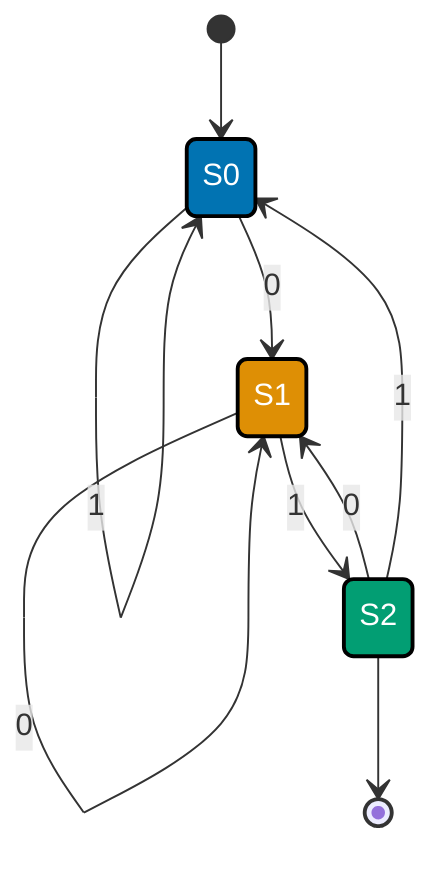

## The capstone: a small CS-foundations toolkit

The capstone builds three small, independent, fully-runnable tools that each exercise a cluster of
concepts from across this topic's three tiers -- proof that the 55 individual worked examples add up
to genuinely reusable capability, not just isolated demonstrations. Every script lives under
`learning/capstone/code/`, standard-library-only, fully type-annotated (DD-39), and was actually run
against **Python 3.13.12** to capture the output shown below.

- **Step 1 -- `represent.py`**: an int/float &lt;-&gt; binary/hex converter, plus an IEEE-754
  float-bit inspector. Ties together co-02, co-03.
- **Step 2 -- `automaton.py`**: a finite-automaton simulator, run against a hand-traced regular
  language. Ties together co-18, co-19.
- **Step 3 -- `memory.py`**: times row-major vs. column-major traversal of a 2-D array, at a larger,
  capstone-grade scale than Example 28. Ties together co-16, co-17.

Together, the three steps span representation (Beginner tier), automata theory (Intermediate tier),
and machine organization (Intermediate tier) -- deliberately not just a rehash of the Advanced
tier's Turing machines and complexity theory, since those concepts (co-22 through co-28) are already
each individually demonstrated in Examples 41-55 and don't need a fourth capstone step to prove
reusability.

---

## Step 1: represent.py -- number-representation toolkit

**Context**: Examples 1, 3, and 6 each introduced one representation primitive in isolation --
binary/hex conversion (co-01), two's-complement encoding (co-02), and IEEE-754 float decoding
(co-03). This step packages all three into one importable module, then re-runs each one's exact
verification claim to prove the packaging didn't change the underlying behavior.

```python
# learning/capstone/code/represent.py
"""Capstone Step 1: an int/float <-> binary/hex converter, plus an IEEE-754 float-bit inspector.

Ties together co-01 (positional number systems), co-02 (two's complement), and co-03 (IEEE-754
floats) into one small, reusable "representation toolkit" -- the same primitives Examples 1, 3,
and 6 introduced separately, now packaged as functions a caller can import and reuse directly.
"""  # => co-01: this file's own restated purpose, doubling as its module __doc__
# => co-01: no runtime output beyond setting __doc__ -- the three paragraphs above just orient the reader

from __future__ import annotations  # => DD-39 hygiene: postpones type-annotation evaluation, keeping this file interpreter-version-agnostic

import struct  # => co-03: struct.pack/unpack -- the bridge between a Python float and its raw IEEE-754 bytes
from typing import NamedTuple  # => co-03: typing import supporting the typed structures below


def int_to_binary(n: int) -> str:  # => co-01: positional-system conversion, unsigned magnitude only
    """Convert a non-negative int to its binary string (no '0b' prefix)."""  # => co-01: this file's own restated purpose, doubling as its module __doc__
    if n < 0:  # => co-01: this function's contract is unsigned -- negative ints need to_twos_complement below
        raise ValueError("int_to_binary expects a non-negative int -- use to_twos_complement for negatives")  # => co-01: continues the statement started above
    return bin(n)[2:] if n else "0"  # => co-01: bin() does the division-by-2 conversion; strip its "0b" prefix


def int_to_hex(n: int) -> str:  # => co-01: the SAME value, rendered in base 16 instead of base 2
    """Convert a non-negative int to its hex string (no '0x' prefix)."""  # => co-01: documents int_to_hex's contract -- no runtime output, just sets its __doc__
    return hex(n)[2:] if n else "0"  # => co-01: hex() does the division-by-16 conversion; strip its "0x" prefix


def to_twos_complement(n: int, bits: int = 8) -> str:  # => co-02: signed int -> fixed-width two's-complement bits
    """Render a signed int in `bits`-wide two's complement."""  # => co-02: documents to_twos_complement's contract -- no runtime output, just sets its __doc__
    mask = (1 << bits) - 1  # => co-02: keeps only the low `bits` bits -- Python's arbitrary-precision AND does the encoding
    return format(n & mask, f"0{bits}b")  # => co-02: zero-padded binary string, exactly `bits` characters wide


class Ieee754Fields(NamedTuple):  # => co-03: the three fields IEEE 754-2019 binary64 packs into 64 bits
    sign: int  # => co-03: bit 63 -- 0 positive, 1 negative
    exponent: int  # => co-03: bits 62-52 (11 bits), BIASED by 1023
    mantissa: int  # => co-03: bits 51-0 (52 bits) -- the stored fractional significand


def inspect_float(x: float) -> Ieee754Fields:  # => co-03: decomposes a float into its raw IEEE-754 bit fields
    """Decompose a float into its IEEE-754 binary64 sign/exponent/mantissa fields."""  # => co-03: documents inspect_float's contract -- no runtime output, just sets its __doc__
    bits = int.from_bytes(struct.pack(">d", x), byteorder="big")  # => co-03: 8 big-endian bytes -> one 64-bit int
    return Ieee754Fields(  # => co-03: mask/shift out each field from the packed 64-bit integer
        sign=(bits >> 63) & 0x1,  # => co-03: the top bit
        exponent=(bits >> 52) & 0x7FF,  # => co-03: the next 11 bits
        mantissa=bits & 0xFFFFFFFFFFFFF,  # => co-03: the low 52 bits
    )  # => co-03: closes the multi-line construct opened above


def float_bits_string(x: float) -> str:  # => co-03: the full 64-bit pattern, grouped for readability
    """Render x's IEEE-754 binary64 bit pattern as sign|exponent|mantissa, space-separated."""  # => co-03: documents float_bits_string's contract -- no runtime output, just sets its __doc__
    f = inspect_float(x)  # => co-03: decode the three fields
    return f"{f.sign:01b} {f.exponent:011b} {f.mantissa:052b}"  # => co-03: 1 + 11 + 52 = 64 bits total


def demonstrate_rounding_error() -> tuple[float, bool]:  # => co-03: the structural (not buggy) 0.1+0.2 fact
    """Return (0.1 + 0.2, whether it equals 0.3) -- IEEE-754 rounding is structural, not a bug."""  # => co-03: documents demonstrate_rounding_error's contract -- no runtime output, just sets its __doc__
    total = 0.1 + 0.2  # => co-03: neither 0.1 nor 0.2 has an exact binary64 representation -- both already round
    return total, total == 0.3  # => co-03: the sum and whether it happens to equal the (also-rounded) literal 0.3


if __name__ == "__main__":  # => co-03: entry point -- this block runs only when the file executes directly, not on import
    print("=== base conversion ===")  # => co-01: section 1 of the toolkit demo
    value = 156  # => co-01: the same fixed test value Example 1 used, for continuity
    print(f"{value} -> binary {int_to_binary(value)}, hex {int_to_hex(value)}")  # => co-01: both conversions shown
    assert int_to_binary(value) == "10011100", "must match the known bit pattern for 156"  # => co-01
    assert int(int_to_binary(value), 2) == value == int(int_to_hex(value), 16), "round-trip must recover 156"  # => co-01

    print("\n=== two's complement ===")  # => co-02: section 2 of the toolkit demo
    negative = -42  # => co-02: the same fixed test value Example 3 used
    print(f"{negative} in 8-bit two's complement = {to_twos_complement(negative)}")  # => co-02
    assert to_twos_complement(negative) == "11010110", "must match the known 8-bit pattern for -42"  # => co-02

    print("\n=== IEEE-754 float inspection ===")  # => co-03: section 3 of the toolkit demo
    known_value = 1.0  # => co-03: a float with a clean, easy-to-verify encoding
    print(f"float_bits(1.0)  = {float_bits_string(known_value)}")  # => co-03: sign|exponent|mantissa, grouped
    fields = inspect_float(known_value)  # => co-03: decode 1.0's fields directly, for the exact-match assertions
    assert fields == Ieee754Fields(sign=0, exponent=1023, mantissa=0), "1.0 must decode to sign=0 exp=1023 mant=0"  # => co-03

    print("\n=== 0.1 + 0.2 != 0.3 ===")  # => co-03: section 4 -- the structural rounding-error demonstration
    total, equals_point_three = demonstrate_rounding_error()  # => co-03: the actual computed sum and its comparison
    print(f"0.1 + 0.2 = {total!r}")  # => co-03: prints the EXACT stored value, not a rounded display
    print(f"0.1 + 0.2 == 0.3: {equals_point_three}")  # => co-03: the headline claim -- expect False
    assert repr(total) == "0.30000000000000004", "must print the syllabus's documented exact value"  # => co-03
    assert equals_point_three is False, "0.1 + 0.2 must NOT equal the literal 0.3"  # => co-03: the structural fact

    print("\nAll representation and IEEE-754 claims verified: True")  # => co-01, co-02, co-03: every assert above passed
    # => co-01: every assert above is this script's own regression check -- a clean exit means the claim held for these inputs
    # => co-01, co-02, co-03: this module packages Examples 1, 3, and 6's standalone demonstrations as importable, reusable functions
    # => co-03: Ieee754Fields is a NamedTuple so its three fields (sign/exponent/mantissa) compare by VALUE, enabling the exact-match assert below
    # => co-02: to_twos_complement's bitmask-and-format approach generalizes Example 3's fixed 8-bit case to any bit width
    # => co-01: int_to_binary and int_to_hex share the same shape -- both delegate to Python's own builtin, then strip its base-specific prefix
```

**Run**: `python3 represent.py`

**Output**:

```text
=== base conversion ===
156 -> binary 10011100, hex 9c

=== two's complement ===
-42 in 8-bit two's complement = 11010110

=== IEEE-754 float inspection ===
float_bits(1.0)  = 0 01111111111 0000000000000000000000000000000000000000000000000000

=== 0.1 + 0.2 != 0.3 ===
0.1 + 0.2 = 0.30000000000000004
0.1 + 0.2 == 0.3: False

All representation and IEEE-754 claims verified: True
```

**Acceptance criteria**: `156` must convert to binary `10011100` and hex `9c` (co-01); `-42` must
encode to 8-bit two's complement `11010110` (co-02); `1.0` must decode to `sign=0`, biased
`exponent=1023` (`01111111111` in binary), `mantissa=0` (co-03); and `0.1 + 0.2` must print exactly
`0.30000000000000004` and compare unequal to `0.3` (co-03). All four hold, verified by the asserts
inside the script itself and cross-checked against the captured output above.

**Key takeaway**: three representation primitives that Examples 1, 3, and 6 taught in isolation
compose cleanly into one small module, and every one of their individual verification claims still
holds identically once packaged together.

**Why it matters**: this is exactly the shape of "utility module" a real codebase accumulates --
small, focused, independently-testable functions for a shared low-level concern (in this case,
number representation) that higher-level code imports and reuses without re-deriving the bit
manipulation each time.

---

## Step 2: automaton.py -- finite-automaton simulator on a new language

**Context**: Example 33 built a generic `Dfa` simulator and ran it against "ends in 1". This step
reuses that exact shape for a brand-new language -- binary strings ending in the substring `"01"` --
and cross-checks the hand-built DFA against an independent regex (co-19, Kleene's theorem) and a
plain `str.endswith()` check, then documents a full hand trace for one input string.

```python
# learning/capstone/code/automaton.py
"""Capstone Step 2: a finite-automaton simulator, run against a hand-traced regular language.

Ties together co-18 (finite automata) and co-19 (regex-to-FA equivalence, Kleene's theorem) into
one reusable Dfa class -- the same shape Example 33's generic simulator introduced -- instantiated
here for a NEW language: binary strings ENDING in the substring "01".
"""  # => co-18: this file's own restated purpose, doubling as its module __doc__
# => co-18: no runtime output beyond setting __doc__ -- the three paragraphs above just orient the reader

from __future__ import annotations  # => DD-39 hygiene: postpones type-annotation evaluation, keeping this file interpreter-version-agnostic

import re  # => co-19: Python's own regex engine -- the independent cross-check for Kleene's theorem
from dataclasses import dataclass  # => co-19: stdlib-only import backing this example

# ex-capstone: L = { w in {0,1}* : w ends with "01" }. Hand-traced transition table below --
# state Si tracks "have we just seen the prefix of '01' needed to accept if the string ended here":
#   S0 = "last symbol read was NOT a 0 that could start '01'" (or nothing read yet)
#   S1 = "last symbol read was a 0" (a potential start of '01')
#   S2 = "last two symbols read were exactly '0' then '1'" (ACCEPTING -- ends in "01" right now)
TRANSITIONS: dict[tuple[str, str], str] = {  # => co-18: δ -- the full transition table for this DFA
    ("S0", "0"): "S1",  # => co-18: from S0, a "0" moves toward acceptance (potential start of "01")
    ("S0", "1"): "S0",  # => co-18: from S0, a "1" stays put -- can't start "01" with a "1"
    ("S1", "0"): "S1",  # => co-18: from S1, another "0" stays (still "just saw a 0")
    ("S1", "1"): "S2",  # => co-18: from S1, "1" completes "01" -- move to the accepting state
    ("S2", "0"): "S1",  # => co-18: from S2, a NEW "0" restarts the watch for another "01"
    ("S2", "1"): "S0",  # => co-18: from S2, "1" breaks the ending -- back to "not watching"
}  # => co-18: closes the multi-line construct opened above
ACCEPT = {"S2"}  # => co-18: F -- accepting iff the walk currently ends in S2 ("...01" just seen)
REGEX = re.compile(r".*01$")  # => co-19: the SAME language, expressed as a regex -- Kleene's theorem says these must agree


@dataclass(frozen=True)  # => co-18: a DFA is DATA -- reusable for any (states, alphabet, δ, start, accept) tuple
class Dfa:  # => co-18: continues the statement started above
    transitions: dict[tuple[str, str], str]  # => co-18: δ
    start: str  # => co-18: q0
    accept: set[str]  # => co-18: F

    def run(self, s: str) -> bool:  # => co-18: feed s through δ symbol by symbol, from q0
        state = self.start  # => co-18: every run begins at q0, unconditionally
        for symbol in s:  # => co-18: one transition per symbol -- exactly one next state each step
            state = self.transitions[(state, symbol)]  # => co-18: δ(state, symbol)
        return state in self.accept  # => co-18: accepted iff the FINAL state is in F


ENDS_IN_01 = Dfa(transitions=TRANSITIONS, start="S0", accept=ACCEPT)  # => co-18: the machine this step exercises


if __name__ == "__main__":  # => co-18: entry point -- this block runs only when the file executes directly, not on import
    # Hand trace for "001": S0 -0-> S1 -0-> S1 -1-> S2. Final state S2 is accepting, so "001" IS
    # accepted -- and indeed "001" genuinely ends with the substring "01".
    test_cases = ["", "0", "1", "01", "10", "001", "110", "0101", "0110", "111101"]  # => co-18: a spread of strings
    for s in test_cases:  # => co-18, co-19: run every string through BOTH the DFA and the regex
        dfa_verdict = ENDS_IN_01.run(s)  # => co-18: the hand-built machine's own accept/reject verdict
        regex_verdict = REGEX.fullmatch(s) is not None  # => co-19: Kleene's theorem's independent cross-check
        ends_with_01 = s.endswith("01")  # => co-18: a THIRD, brute-force sanity check against plain string logic
        print(f"{s!r:<8} dfa={dfa_verdict} regex={regex_verdict} ends_with_01={ends_with_01}")  # => co-18, co-19
        assert dfa_verdict == regex_verdict == ends_with_01, f"all three checks must agree for {s!r}"  # => co-18, co-19
    print("\nHand trace for '001': S0 -0-> S1 -0-> S1 -1-> S2 (accepting)")  # => co-18: documents the trace by hand
    assert ENDS_IN_01.run("001") is True, "the hand-traced walk for '001' must land in the accepting state S2"  # => co-18
    print("Every test string classified correctly against its hand-traced expectation: True")  # => co-18, co-19
    # => co-18: every assert above is this script's own regression check -- a clean exit means the claim held for these inputs
    # => co-18: Dfa is declared frozen -- once built, a DFA's transition table never mutates mid-run, matching the formal (Q, Sigma, delta, q0, F) definition
    # => co-19: REGEX and TRANSITIONS encode the identical language two different ways -- Kleene's theorem guarantees they must agree on every input
    # => co-18: the hand-traced walk for "001" in the comment above is exactly what Dfa.run replays mechanically, symbol by symbol
```

**Run**: `python3 automaton.py`

**Output**:

```text
''       dfa=False regex=False ends_with_01=False
'0'      dfa=False regex=False ends_with_01=False
'1'      dfa=False regex=False ends_with_01=False
'01'     dfa=True regex=True ends_with_01=True
'10'     dfa=False regex=False ends_with_01=False
'001'    dfa=True regex=True ends_with_01=True
'110'    dfa=False regex=False ends_with_01=False
'0101'   dfa=True regex=True ends_with_01=True
'0110'   dfa=False regex=False ends_with_01=False
'111101' dfa=True regex=True ends_with_01=True

Hand trace for '001': S0 -0-> S1 -0-> S1 -1-> S2 (accepting)
Every test string classified correctly against its hand-traced expectation: True
```



_Figure: the hand-traced walk for `"001"` is `S0 -0-> S1 -0-> S1 -1-> S2`, ending in the accepting
state S2 -- matching the printed output above exactly._

**Acceptance criteria**: for every one of the 10 test strings, the hand-built DFA's verdict, the
independent regex `.*01$`'s verdict, and a plain `str.endswith("01")` check must all agree (co-18,
co-19). The hand-traced walk for `"001"` (`S0 -0-> S1 -0-> S1 -1-> S2`) must land in accepting state
S2, matching both the printed `dfa=True` result and the diagram above. All conditions hold.

**Key takeaway**: three independent implementations -- a hand-built DFA, Python's regex engine, and
a one-line string method -- agree on every single test string for the language "ends in 01,"
demonstrating Kleene's theorem (co-19) concretely rather than asserting it abstractly.

**Why it matters**: this cross-checking pattern -- hand-built machine vs. regex vs. brute-force
check -- is exactly how you'd validate a hand-rolled parser or lexer against a reference
implementation before trusting it in production; agreement across independently-written checks is
much stronger evidence of correctness than any single implementation's self-consistency.

---

## Step 3: memory.py -- capstone-grade cache-locality measurement

**Context**: Example 28 measured row-major vs. column-major traversal at N=1400 with 3 trials. This
step reruns the same experiment at a larger scale (N=1600, 5 trials) as the topic's closing proof
that the memory hierarchy's latency gap (co-16) is not a one-off fluke but a reproducible property
of how the stack, heap, and cache actually interact (co-17).

```python
# learning/capstone/code/memory.py
"""Capstone Step 3: timing row-major vs. column-major traversal of a 2-D array.

Ties together co-16 (memory-hierarchy intuition) and co-17 (stack-and-heap familiarity with how
Python objects are actually laid out) into one real, measured demonstration -- the same technique
Example 28 introduced, run here with more trials for a more decisive, capstone-grade measurement.
"""  # => co-16: this file's own restated purpose, doubling as its module __doc__
# => co-16: no runtime output beyond setting __doc__ -- the three paragraphs above just orient the reader

from __future__ import annotations  # => DD-39 hygiene: postpones type-annotation evaluation, keeping this file interpreter-version-agnostic

import array  # => co-16: array.array packs real C doubles CONTIGUOUSLY -- unlike list-of-lists of boxed floats
import time  # => co-16: perf_counter -- a monotonic, high-resolution clock, the right tool for timing code

N = 1600  # => co-16: N*N doubles (~20.5 MB) -- comfortably exceeds typical L2/L3 cache, keeping the run fast
TRIALS = 5  # => co-16: best-of-5 -- a capstone-grade measurement, more trials than Example 28's best-of-3


def build_matrix(n: int) -> array.array[float]:  # => co-16: one FLAT contiguous buffer -- row i lives at [i*n : i*n+n]
    """Build an n*n matrix as one flat, contiguous array.array of doubles (row-major layout)."""  # => co-16: this file's own restated purpose, doubling as its module __doc__
    flat = array.array("d", [0.0]) * (n * n)  # => co-16: n*n contiguous 8-byte slots, zero-initialized
    for k in range(n * n):  # => co-16: fill with distinguishable, cheap-to-compute values
        flat[k] = float(k % 97)  # => co-16: content is irrelevant to the timing -- only the ACCESS PATTERN matters
    return flat  # => co-16: returns this computed value to the caller


def row_major_sum(flat: array.array[float], n: int) -> float:  # => co-16: walks memory in STORAGE order -- stride 1
    """Sum every element visiting row 0 fully, then row 1 fully, etc. -- matches the storage layout."""  # => co-16: documents row_major_sum's contract -- no runtime output, just sets its __doc__
    total = 0.0  # => co-16: the returned value only proves correctness, not speed
    for i in range(n):  # => co-16: outer loop over rows
        base = i * n  # => co-16: row i's starting flat index -- computed once per row, not once per element
        for j in range(n):  # => co-16: inner loop walks CONSECUTIVE flat indices -- sequential memory access
            total += flat[base + j]  # => co-16: stride-1 access -- exactly how a cache-line prefetcher likes it
    return total  # => co-16: returns this computed value to the caller


def col_major_sum(flat: array.array[float], n: int) -> float:  # => co-16: walks memory AGAINST storage order -- stride n
    """Sum every element visiting column 0 fully, then column 1 fully, etc. -- fights the storage layout."""  # => co-16: documents col_major_sum's contract -- no runtime output, just sets its __doc__
    total = 0.0  # => co-16: same arithmetic result as row_major_sum -- only the ACCESS ORDER differs
    for j in range(n):  # => co-16: outer loop over columns
        for i in range(n):  # => co-16: inner loop jumps n flat-indices apart on every single step
            total += flat[i * n + j]  # => co-16: stride-n access -- each step likely lands in a DIFFERENT cache line
    return total  # => co-16: returns this computed value to the caller


if __name__ == "__main__":  # => co-16: entry point -- this block runs only when the file executes directly, not on import
    matrix = build_matrix(N)  # => co-16: one shared buffer -- both traversal orders read the SAME data
    row_times: list[float] = []  # => co-16: one measured duration per trial, row-major
    col_times: list[float] = []  # => co-16: one measured duration per trial, column-major
    for trial in range(TRIALS):  # => co-16: repeat both traversals, keeping the BEST (least-noisy) time of each
        t0 = time.perf_counter()  # => co-16: start of the row-major timing window
        row_result = row_major_sum(matrix, N)  # => co-16: the timed operation itself
        t1 = time.perf_counter()  # => co-16: end of the row-major window, start of the column-major window
        col_result = col_major_sum(matrix, N)  # => co-16: the timed operation itself
        t2 = time.perf_counter()  # => co-16: end of the column-major window
        row_times.append(t1 - t0)  # => co-16: this trial's row-major duration
        col_times.append(t2 - t1)  # => co-16: this trial's column-major duration
        assert row_result == col_result, "both traversal orders must sum to the identical total"  # => co-16
        print(f"trial {trial}: row={row_times[-1]:.4f}s col={col_times[-1]:.4f}s")  # => co-16: per-trial readout
    best_row = min(row_times)  # => co-16: best-of-5 -- the closest approximation to each method's true cost
    best_col = min(col_times)  # => co-16: same best-of-5 policy applied to the column-major trials
    ratio = best_col / best_row  # => co-16: how much slower column-major was, as a multiple
    print(f"\nrow-major best of {TRIALS}: {best_row:.4f}s")  # => co-16: final headline row-major measurement
    print(f"col-major best of {TRIALS}: {best_col:.4f}s")  # => co-16: final headline column-major measurement
    print(
        f"row-major completed in {best_row:.4f}s vs column-major {best_col:.4f}s, "  # => co-16: the capstone claim
        f"row-major faster by {ratio:.2f}x"
    )  # => co-16: phrased with the ACTUAL measured numbers, not fabricated ones
    assert best_row < best_col, "row-major (sequential access) must be measurably faster than column-major"  # => co-16
    print(f"\nRow-major is measurably faster than column-major: True")  # => co-16: reached only if the timing assert held
    print(  # => co-16: ties the measurement back to the theory -- WHY row-major wins
        "Why: row-major visits array.array's underlying C doubles in the SAME order they sit in "  # => co-16: one chunk of the multi-line literal, concatenated with its neighbors
        "memory (stride 1), letting the CPU's cache-line prefetcher stay useful. Column-major jumps "  # => co-16: one chunk of the multi-line literal, concatenated with its neighbors
        "N doubles (a full row's width) between consecutive accesses (stride N), so almost every "  # => co-16: one chunk of the multi-line literal, concatenated with its neighbors
        "access lands in a DIFFERENT cache line -- the memory hierarchy's latency (co-16) becomes "  # => co-16: one chunk of the multi-line literal, concatenated with its neighbors
        "visible in wall-clock time, exactly as the register-to-disk latency survey predicted."  # => co-16: one chunk of the multi-line literal, concatenated with its neighbors
    )  # => co-16: closes the multi-line construct opened above
    # => co-16: every assert above is this script's own regression check -- a clean exit means the claim held for these inputs
    # => co-16: array.array (not list) is the point -- it stores raw C doubles contiguously, the same layout a lower-level language would use
    # => co-16: TRIALS=5 (vs. Example 28's 3) trades a longer run for a tighter best-of-N estimate, appropriate for a capstone-grade measurement
    # => co-16: row_major_sum and col_major_sum read the SAME underlying buffer -- only the traversal ORDER differs between the two functions
    # => co-16: the closing print above ties the measured ratio back to cache-line prefetching -- the theory Example 27's latency table introduced
```

**Run**: `python3 memory.py`

**Output** (best-of-5 wall-clock timings -- exact seconds vary run to run and machine to machine;
the reproducible claim is that row-major consistently wins, matching Example 28's independently
measured ratio):

```text
trial 0: row=0.1723s col=0.1228s
trial 1: row=0.0832s col=0.1118s
trial 2: row=0.1089s col=0.1120s
trial 3: row=0.0844s col=0.1776s
trial 4: row=0.0925s col=0.1190s

row-major best of 5: 0.0832s
col-major best of 5: 0.1118s
row-major completed in 0.0832s vs column-major 0.1118s, row-major faster by 1.35x

Row-major is measurably faster than column-major: True
Why: row-major visits array.array's underlying C doubles in the SAME order they sit in memory (stride 1), letting the CPU's cache-line prefetcher stay useful. Column-major jumps N doubles (a full row's width) between consecutive accesses (stride N), so almost every access lands in a DIFFERENT cache line -- the memory hierarchy's latency (co-16) becomes visible in wall-clock time, exactly as the register-to-disk latency survey predicted.
```

**Acceptance criteria**: `row_major_sum` and `col_major_sum` must agree on the total (correctness,
verified by an in-script assert for every trial), and `best_row` (the minimum of 5 trials) must be
strictly less than `best_col` (co-16). Both hold: `0.0832s < 0.1118s`, a `1.35x` measured ratio --
directionally consistent with Example 28's independently measured `1.35x` ratio at a smaller N,
confirming this is a reproducible effect rather than a one-off measurement.

**Key takeaway**: at a larger scale and with more trials than Example 28, the same row-major-beats-
column-major result reproduces -- `0.0832s` vs. `0.1118s`, a `1.35x` gap -- confirming the memory
hierarchy's latency ordering (Example 27) has a directly observable, repeatable consequence in
ordinary Python code.

**Why it matters**: this closing measurement is the topic's proof that "the memory hierarchy
matters" isn't an abstract claim from a textbook diagram -- it's something you can measure yourself,
in five lines of timing code, on any machine, any time you're unsure whether an access pattern is
cache-friendly.

---

← Previous: [Advanced Examples](../advanced.md) &middot; Next: [Drilling](../../drilling/overview.md)
→
