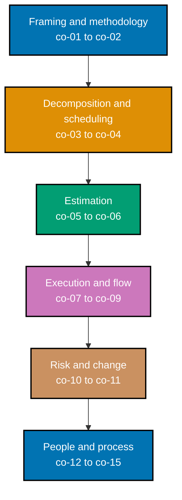

This topic is a **leadership no-code sub-mode** (`‡`) Annotated-concept topic: zero code, zero
runnable files. Every worked scenario produces a **decision artifact** -- a trade-off memo, a work
breakdown structure, a dependency graph, a risk register, a communication matrix -- the kind of
document a real delivery team could act on directly. The **Product & Delivery** track (`▲`) is a
parallel reading path: it is readable early (Pass 1), independent of the language- and
system-focused topics around it, because delivery discipline pays off from the very first sprint.

## Prerequisites

- **Prior topics**: no code prerequisites. Pairs naturally with topic 32, Software Product
  Engineering (not yet published in this journey) -- that topic covers _what_ to build, this one
  covers _how_ to deliver it -- and assumes you already have some hands-on building experience from
  Pass 1 so estimation and scope trade-offs feel concrete rather than abstract.
- **Tools & environment**: a macOS/Linux terminal and a Markdown editor (Neovim per DD-17) for
  writing the plans, tables, and Mermaid charts this topic produces. There is no runtime to
  install -- every deliverable in this topic is a planning artifact or a decision document, not a
  program.
- **Assumed knowledge**: a rough feel for what "a feature's worth of work" looks like; the ability
  to read a simple chart; the idea that one task can depend on another finishing first.

## Why this exists -- the big idea

Work that isn't planned, sequenced, and de-risked slips silently: the schedule is already late
before anyone notices, because nobody made the constraints and the dependencies _visible_. The one
idea worth keeping if you forget everything else: **scope, schedule, and cost are one triangle** --
you can fix any two, and pretending you can fix all three is exactly how projects fail. The failure
is never a single dramatic decision; it is the absence of one. Making the trade-off explicit and
chosen, instead of accidental, is this entire topic's throughline, from the smallest trade-off memo
(Worked Scenario 1) to the fully assembled delivery plan (Worked Scenario 25) and the capstone.

**Cross-cutting big ideas**: `correctness-vs-pragmatism` -- estimation and risk management are
**decisions made under uncertainty**, not exercises in precision. A story-point estimate or a
likelihood score is not a prediction to be graded against reality after the fact; it is the most
honest number a team can commit to right now, embracing the uncertainty rather than faking a
confidence nobody actually has (co-05, co-10). `coupling-vs-cohesion` -- task dependencies _are_
coupling, expressed as a project schedule instead of as code: a task that many other tasks depend on
is tightly coupled to the whole project's timeline, and the critical path (co-04) is nothing more
than the single tightest chain of that coupling running end to end.

## How verification works in this topic

Every earlier topic in this journey verified a claim by running something -- a script, an
interpreter, a test suite -- and reading its output. This topic has no interpreter to run: a risk
register, a dependency graph, and a communication matrix are not executable, so there is no command
that can confirm one is "correct" the way `pytest` confirms a function's return value. Verification
here instead means checking an **observable property of the written artifact itself** against a
stated rule -- something you can point at on the page, not a vague description of what a "good"
plan should feel like. A few concrete examples that recur throughout this topic:

- A **critical path** is verifiable: it is the longest cumulative-duration chain in the dependency
  graph, and every task on it has zero slack -- a claim you can check by summing durations along
  every path and comparing, not by intuition.
- A **risk register entry** is verifiable: does it have a computed likelihood-times-impact score, a
  mitigation specific enough to act on, and a named owner? Each of those three is either present on
  the page or it is not.
- A **trade-off memo** is verifiable: does it name exactly two constraints as fixed and state, in one
  sentence, what the third absorbs? Read the memo and check.

Every concept below and every worked scenario that follows states its own **Verify it** /
**Verify** rule in exactly this observable-property form -- read the artifact, check the stated
property, done.

_Diagram: the six concept clusters this topic teaches, in reading order -- from naming the
triangle-and-methodology framing, through decomposing and scheduling the work, estimating it,
running it day to day, managing what threatens it, and finally the people and process layer that
holds the other five together._

## Concepts

Every worked scenario in this topic's follow-up pages cites the `co-NN` concept it exercises --
this section is the 1:1 reference those citations point back to. Read it in order: each cluster
builds on the one before it, from "what triangle am I even balancing" through to "how much process
does a team of this size actually need."

### co-01 · Triple Constraint

Scope, schedule, and cost are the three legs of one triangle. Fixing all three simultaneously is not
a plan -- it is a wish. When reality departs from the original estimate, as it always eventually
does on any project long enough to matter, _something_ has to give, and if no one names that
something out loud, it gets decided by accident -- usually as a quality cut nobody notices until it
is too late to reverse cheaply. The professional move is to decide, at the start, which two
constraints are genuinely fixed (a regulator-mandated launch date and an already-approved budget,
say) and let the third become the dependent variable everyone tracks explicitly from day one.

**Why it matters**: pretending you control all three is exactly how projects fail without anyone
ever making a decision -- the failure is silent because no one ever said out loud "we are trading
quality for date." Naming the trade-off turns a silent failure into a chosen, visible one.

**Verify it**: a stated trade-off is well-formed if the artifact names exactly two constraints as
fixed and states, in one sentence, what the third constraint absorbs (for example: "date and scope
fixed; cost absorbs the overrun via two weeks of contractor hours").

### co-02 · Delivery Methodologies

Waterfall, agile (Scrum, Kanban), and hybrid blends are not competing religions -- each is the right
tool for a specific shape of work. Waterfall's linear phase gates fit domains where the cost of
changing course after the fact is enormous and requirements are genuinely stable up front (regulated
hardware, safety-critical firmware). Scrum's fixed-length iterations and built-in inspect-and-adapt
cadence fit evolving product work with an engaged customer who can reprioritize every sprint.
Kanban's continuous flow with work-in-progress limits fits ops and support queues, where work arrives
unpredictably and there is no natural iteration boundary to plan around. The methodology should
follow the shape of the work, not the other way around -- and not fashion.

**Why it matters**: applying Scrum's ceremony to fixed-scope regulated work adds cost without buying
back anything (co-15), and applying waterfall's lock-the-plan discipline to evolving product work
locks in decisions before the market has told you whether they are even right.

**Verify it**: a methodology recommendation is defensible if it names the specific property of the
context -- rate of requirement change, cost of course-correction, predictability of work arrival --
that drove the choice, not merely "we always use Scrum."

### co-03 · Work Breakdown Structure

A work breakdown structure (WBS) decomposes a deliverable into work packages small enough that a
single person or pair can estimate them with confidence and own them without heavy coordination.
Decomposition should be organized around the deliverable itself, not around org chart or job title,
and every leaf should pass one concrete test: is this small enough to reason about and assign right
now, without decomposing it any further first?

**Why it matters**: a leaf that cannot be independently estimated or assigned is a hidden risk in
disguise -- it means the team's mental model of that piece of work is still fuzzy at exactly the
moment they are being asked to commit to it.

**Verify it**: every leaf in the WBS is independently estimable (a team member could put a number on
it without decomposing it further) and independently assignable (one name, or one pair, can own it
end to end without splitting it across unrelated owners).

### co-04 · Dependency Graph and Critical Path

Task dependencies form a directed graph: task B cannot start until task A finishes (the common
finish-to-start relation), or some other precedence relation holds. Walking every path from the
project's start to its end and summing durations along each one identifies the **critical path** --
the single longest cumulative-duration chain. Every task on that chain has zero slack (float): delay
it by even one day and the whole project slips by the same day. Tasks off the critical path carry
slack -- they can slip a little without moving the finish date, which is exactly why "half the team
is a day behind schedule, but the project isn't late" is a real and useful state, while "one task on
the critical path is a day behind" is a genuine, unavoidable schedule risk no matter how far ahead
every other task is running.

**Why it matters**: which task to expedite, staff up, or de-risk first is not a guess -- it is
whichever task sits on the critical path, because time saved anywhere else never moves the finish
date. The Critical Path Method (CPM, DuPont and Remington Rand, late 1950s) and PERT (the US Navy's
Special Projects Office, 1958, developed for the Polaris program) trace to exactly this problem:
sequencing dependencies on enormous, physically real projects was the binding constraint that
produced the technique, and the technique has not changed since.

**Verify it**: the marked critical path is the longest cumulative-duration path from start to finish
in the graph, and every task on it has zero slack -- computed by summing durations along every path,
not eyeballed.

### co-05 · Estimation: Points and Velocity

Story points size a backlog item relative to a reference story, not in hours. A team calibrates once
against a known story ("this one is a 3"), then sizes everything else relative to that anchor.
Velocity -- points completed per sprint, averaged over several sprints -- turns those relative sizes
into a forecast: divide remaining backlog points by average velocity to estimate how many sprints
remain. This embraces uncertainty instead of faking a precision no team actually has at the start of
a task -- an "8-hour" estimate claims a confidence nobody genuinely holds before the work has even
started.

**Why it matters**: an hour-based estimate invites an argument over a number nobody can truly justify;
relative sizing only requires the team to agree "is this bigger or smaller than that one," a
comparison humans are demonstrably better at than absolute prediction. Steve McConnell's _Software
Estimation: Demystifying the Black Art_ (2006) remains the standard practical reference for exactly
this distinction.

**Verify it**: an estimate is well-formed if it is expressed relative to a concrete reference story
rather than an hour count, and a forecast is well-formed if it divides remaining points by an average
of at least three sprints' velocity, never a single sprint's number.

### co-06 · Planning-Poker Pitfalls

Relative estimation done as a group is vulnerable to two named biases: **anchoring** (the first
number spoken pulls every subsequent guess toward it) and **authority bias** (the senior engineer's
number gets treated as correct rather than as one opinion among several). Planning poker's
facilitation rules exist specifically to neutralize these: every participant reveals their estimate
simultaneously (a "blind reveal," so no one's number can anchor anyone else's before their own is
locked in), and when estimates diverge sharply, the highest and lowest estimators explain their
reasoning before the group re-votes -- surfacing hidden assumptions instead of quietly averaging them
away.

**Why it matters**: an estimate produced by groupthink is not actually the team's honest judgment --
it is whoever spoke first or loudest, wearing the team's name. The facilitation rules exist to
recover the team's real, disaggregated judgment.

**Verify it**: a facilitation ruleset is well-formed if each rule names, specifically, which bias
(anchoring or authority bias) it neutralizes and how.

### co-07 · Sprint and Backlog Planning

An ordered backlog turns into a sprint commitment by pulling top-priority items into the sprint until
the team's known capacity (usually approximated from recent velocity) is reached -- never further,
and never in an order that violates a task's own dependencies. You cannot start the item that depends
on an unfinished item, no matter how much room is left in the sprint.

**Why it matters**: a sprint that over-commits capacity sets the team up to either work unsustainable
hours or ship a broken promise; a sprint that ignores dependency order sets the team up to sit idle
waiting on a blocked task it should never have pulled in.

**Verify it**: a sprint plan is well-formed if the sum of its committed points never exceeds the
team's known velocity, and no task in the plan precedes a dependency that is not itself scheduled
earlier.

### co-08 · Execution Mechanics

Standups, work-in-progress (WIP) limits, and blocker/issue tracking are the day-to-day mechanisms
that keep in-flight work visible. A good standup surfaces blockers, not a status recitation of what
each person did yesterday; a WIP limit caps how many items one stage of the workflow can hold at
once, forcing attention onto _finishing_ work already started rather than starting more; blocker
tracking makes an obstruction visible the moment it appears rather than the day someone finally asks
why a task hasn't moved in a week.

**Why it matters**: a problem surfaced on day two of a two-week sprint is cheap to fix; the identical
problem surfaced on day thirteen forces a scramble. Execution mechanics exist to move the moment of
discovery as early as possible.

**Verify it**: a standup format is well-formed if it structurally surfaces blockers and WIP rather
than a chronological status report; a WIP limit is well-formed if it is a stated, enforced number per
workflow stage, not an aspiration.

### co-09 · Metrics

Burndown (remaining work over time, within one sprint), burnup (completed work _and_ total scope
over time, plotted as two separate lines), cycle time (elapsed time from a task's work-start to its
finish), lead time (elapsed time from a request's arrival to its completion), and throughput (items
completed per unit time) each answer a genuinely different question. A metric earns its place on a
dashboard by naming the decision it informs -- a burndown flatlining mid-sprint signals "investigate
a blocker today"; a growing cycle time on one workflow stage signals "that stage needs capacity, or
its WIP limit needs lowering."

**Why it matters**: a metric with no attached decision is decoration -- it consumes dashboard space
and reporting effort without ever changing what anyone does. co-14 names the sharper failure mode one
layer beyond decoration, where a metric used as a _target_ actively distorts behavior.

**Verify it**: a metric earns its place on the list only if a one-sentence "when this metric shows X,
we do Y" decision rule can be written for it; a metric with no such rule should be dropped.

### co-10 · Risk Management

A risk register is a _living_ document, not a one-time exercise. For each identified risk, it records
likelihood, impact, a computed likelihood-times-impact score, a concrete mitigation, and a named
owner accountable for that mitigation. "Living" means the register is revisited every sprint or
iteration: risks are retired once their mitigation lands or the risk window safely passes, and new
risks are added as the project's shape becomes clearer.

**Why it matters**: an unowned risk is a risk nobody is actually managing -- writing it down without
an owner produces the comfort of having "identified" it, with none of the benefit of actually
mitigating it.

**Verify it**: a risk register entry is well-formed if it has a computed likelihood-times-impact
score, a mitigation specific enough to act on (not "monitor closely"), and a named owner; the
register as a whole is well-formed if its top-ranked risks by score are the ones with mitigations
actually in flight.

### co-11 · Change Management

A mid-project scope change is not automatically bad -- but it must run through an explicit
accept/defer/trade decision against the triple constraint (co-01), not slip in silently as "just one
more thing." Accepting a change without naming what it costs -- a schedule slip, a dropped
lower-priority item, added budget -- silently overloads the same triangle co-01 already warned
against.

**Why it matters**: silent scope creep is exactly how a well-planned project quietly becomes a late
one -- not through one dramatic decision, but through many small, unrecorded ones, none of which
anyone consciously chose to trade against.

**Verify it**: a change-request decision is well-formed if it states explicitly what the triple
constraint absorbs -- what is dropped, delayed, or funded -- to accommodate the change, not merely
whether the change is "approved."

### co-12 · Retrospectives

A structured retrospective turns raw observations ("the deploy broke twice this sprint") into owned,
tracked improvement actions -- not a venting session and not a blame exercise. The output of a good
retrospective is a short list of specific actions, each with an owner and a way to tell, later,
whether it actually happened.

**Why it matters**: a team that names the same problem in three consecutive retrospectives with no
owned action attached hasn't been running retrospectives -- it has been complaining on a schedule.

**Verify it**: a retrospective's output is well-formed if every listed action has a named owner and a
measurable done-signal -- something checkable next sprint, not a vague intention.

### co-13 · Stakeholder Communication

Different audiences need different cadence, format, and depth: an executive sponsor needs a monthly
one-page status tied to budget and date risk; an engaged product stakeholder needs sprint-review
demos and mid-sprint blocker visibility; a downstream dependent team needs advance notice of
interface changes. Tailoring the update to the audience is not busywork for its own sake -- an update
that doesn't drive a decision (reprioritize, fund a mitigation, adjust a date) is status theater
regardless of who receives it.

**Why it matters**: an audience that gets the wrong cadence or the wrong depth of update either tunes
out (too frequent, too detailed) or gets blindsided (too infrequent, too shallow) -- both failure
modes erode trust in every future update from the same source.

**Verify it**: a communication plan is well-formed if every audience row states the specific decision
that update is meant to drive, not merely what information the update contains.

### co-14 · Goodhart's-Law Metric Abuse

co-09 named the strength of a metric with an attached decision; this concept names the specific way
that strength turns into a liability. Goodhart's Law: when a measure becomes a target, it stops being
a good measure. Velocity is the canonical example in delivery work -- the instant a team's velocity
number is used to judge or rank the team's productivity, the team gains a direct incentive to inflate
point estimates. Same actual work, a bigger declared number, no real productivity gained -- and the
number now lies to everyone who relies on it for forecasting (co-05).

**Why it matters**: this is not a hypothetical -- it is the predictable consequence of tying
compensation, ranking, or a performance narrative to a number the team itself estimates. The fix is
not "stop measuring"; it is measuring outcomes the team does not control the raw units of (cycle time
trending down, delivered features actually adopted) instead of a self-reported estimate.

**Verify it**: a velocity-based recommendation is well-formed if it is used only for forecasting
(co-05) and never cited as a productivity or performance signal; a proposed alternative metric is
well-formed if it is an outcome measure the team does not directly self-report.

### co-15 · Process-Weight Fit

Coordination cost scales with the number of communication paths on a team, and the number of pairwise
paths on a team of size `n` is `n(n-1)/2` -- quadratic in team size, not linear. A two-person team
has exactly one communication path; an eight-person team has twenty-eight. Ceremony (standups,
planning, retros, cross-team syncs) exists to manage coordination cost, so the right _amount_ of
ceremony should scale with that same curve: a fixed daily-standup-plus-planning-plus-retro package
that is barely-there overhead on an eight-person team can consume a much larger share of a
two-person team's working week.

**Why it matters**: process that costs more than the coordination it saves is waste, full stop -- and
because the cost curve is quadratic while a fixed ceremony package's cost is roughly flat per person,
the "right size" genuinely differs by team size, not merely by team preference.

**Verify it**: a ceremony recommendation is well-formed if it cites the team's actual
communication-path count (`n(n-1)/2`) as the basis for how much coordination overhead is
proportionate.

## Scenarios by Level

Twenty-five worked scenarios, grouped Beginner / Intermediate / Advanced, each producing a decision
artifact and citing the `co-NN` it exercises.

### Beginner (Scenarios 1-8)

- [Worked Scenario 1: Triple-Constraint Trade-off](/en/c/learn/fundamentally-strong/software-engineer/project-management/learning/beginner#worked-scenario-1-triple-constraint-trade-off)
- [Worked Scenario 2: Pick a Delivery Methodology](/en/c/learn/fundamentally-strong/software-engineer/project-management/learning/beginner#worked-scenario-2-pick-a-delivery-methodology)
- [Worked Scenario 3: Decompose a Feature into a WBS](/en/c/learn/fundamentally-strong/software-engineer/project-management/learning/beginner#worked-scenario-3-decompose-a-feature-into-a-wbs)
- [Worked Scenario 4: Draw the Dependency Graph](/en/c/learn/fundamentally-strong/software-engineer/project-management/learning/beginner#worked-scenario-4-draw-the-dependency-graph)
- [Worked Scenario 5: Identify the Critical Path](/en/c/learn/fundamentally-strong/software-engineer/project-management/learning/beginner#worked-scenario-5-identify-the-critical-path)
- [Worked Scenario 6: Story-Point Estimate Against a Reference](/en/c/learn/fundamentally-strong/software-engineer/project-management/learning/beginner#worked-scenario-6-story-point-estimate-against-a-reference)
- [Worked Scenario 7: Velocity-Based Completion Forecast](/en/c/learn/fundamentally-strong/software-engineer/project-management/learning/beginner#worked-scenario-7-velocity-based-completion-forecast)
- [Worked Scenario 8: Map Metrics to Decisions](/en/c/learn/fundamentally-strong/software-engineer/project-management/learning/beginner#worked-scenario-8-map-metrics-to-decisions)

### Intermediate (Scenarios 9-18)

- [Worked Scenario 9: Sprint and Backlog Plan](/en/c/learn/fundamentally-strong/software-engineer/project-management/learning/intermediate#worked-scenario-9-sprint-and-backlog-plan)
- [Worked Scenario 10: Planning-Poker Debiasing Rules](/en/c/learn/fundamentally-strong/software-engineer/project-management/learning/intermediate#worked-scenario-10-planning-poker-debiasing-rules)
- [Worked Scenario 11: Diagnose a Flatlined Burndown](/en/c/learn/fundamentally-strong/software-engineer/project-management/learning/intermediate#worked-scenario-11-diagnose-a-flatlined-burndown)
- [Worked Scenario 12: Burnup vs Burndown](/en/c/learn/fundamentally-strong/software-engineer/project-management/learning/intermediate#worked-scenario-12-burnup-vs-burndown)
- [Worked Scenario 13: Cycle-Time Bottleneck Diagnosis](/en/c/learn/fundamentally-strong/software-engineer/project-management/learning/intermediate#worked-scenario-13-cycle-time-bottleneck-diagnosis)
- [Worked Scenario 14: Build a Risk Register](/en/c/learn/fundamentally-strong/software-engineer/project-management/learning/intermediate#worked-scenario-14-build-a-risk-register)
- [Worked Scenario 15: Prioritize Risks by Likelihood and Impact](/en/c/learn/fundamentally-strong/software-engineer/project-management/learning/intermediate#worked-scenario-15-prioritize-risks-by-likelihood-and-impact)
- [Worked Scenario 16: Change-Request Decision](/en/c/learn/fundamentally-strong/software-engineer/project-management/learning/intermediate#worked-scenario-16-change-request-decision)
- [Worked Scenario 17: Redesign a Status-Theater Standup](/en/c/learn/fundamentally-strong/software-engineer/project-management/learning/intermediate#worked-scenario-17-redesign-a-status-theater-standup)
- [Worked Scenario 18: Stakeholder Communication Plan](/en/c/learn/fundamentally-strong/software-engineer/project-management/learning/intermediate#worked-scenario-18-stakeholder-communication-plan)

### Advanced (Scenarios 19-25)

- [Worked Scenario 19: The Velocity-as-Target Memo](/en/c/learn/fundamentally-strong/software-engineer/project-management/learning/advanced#worked-scenario-19-the-velocity-as-target-memo)
- [Worked Scenario 20: Right-Size Process by Team Size](/en/c/learn/fundamentally-strong/software-engineer/project-management/learning/advanced#worked-scenario-20-right-size-process-by-team-size)
- [Worked Scenario 21: Diagnose a Methodology Antipattern](/en/c/learn/fundamentally-strong/software-engineer/project-management/learning/advanced#worked-scenario-21-diagnose-a-methodology-antipattern)
- [Worked Scenario 22: Crashing vs Fast-Tracking](/en/c/learn/fundamentally-strong/software-engineer/project-management/learning/advanced#worked-scenario-22-crashing-vs-fast-tracking)
- [Worked Scenario 23: Retrospective to Tracked Actions](/en/c/learn/fundamentally-strong/software-engineer/project-management/learning/advanced#worked-scenario-23-retrospective-to-tracked-actions)
- [Worked Scenario 24: Risk Register Over Time](/en/c/learn/fundamentally-strong/software-engineer/project-management/learning/advanced#worked-scenario-24-risk-register-over-time)
- [Worked Scenario 25: Full Delivery Plan](/en/c/learn/fundamentally-strong/software-engineer/project-management/learning/advanced#worked-scenario-25-full-delivery-plan)

---

Next: [Beginner Scenarios](./beginner.md) →
