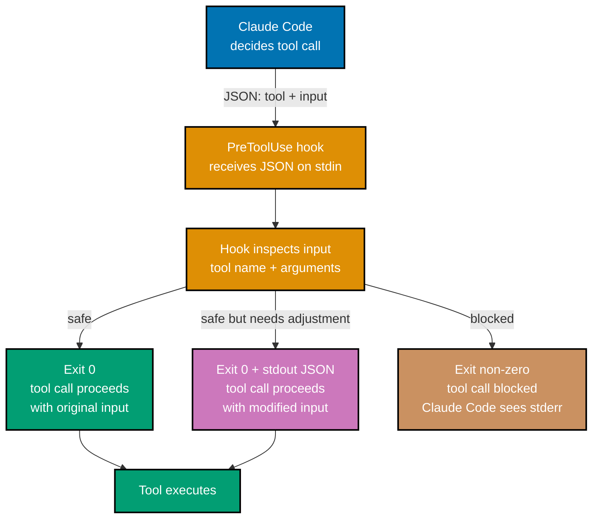
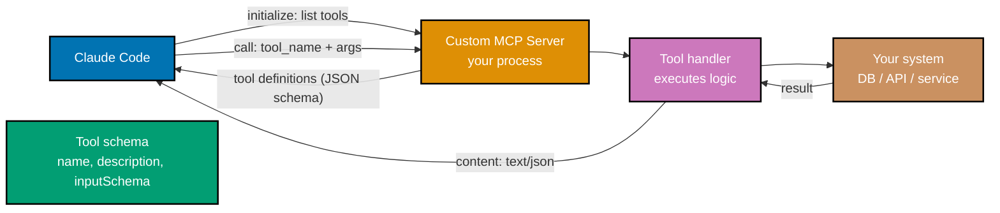
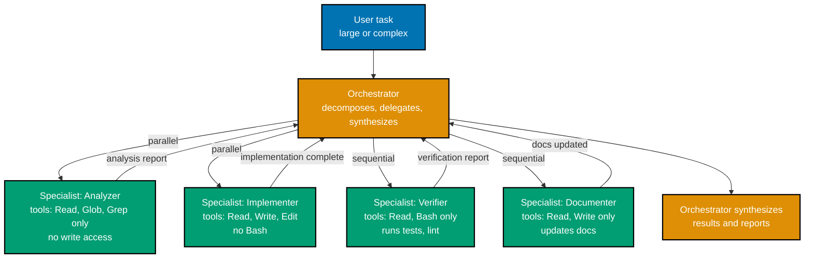
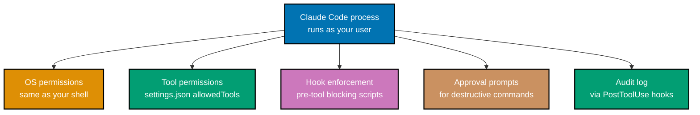
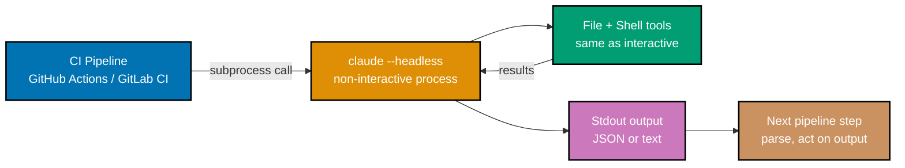

## 1. Advanced Hooks

The intermediate section introduced hooks as simple allow/block scripts. This section
covers hooks that conditionally modify tool inputs, integrate with external systems, and
form part of a team's CI pipeline — turning Claude Code's lifecycle events into
programmable automation endpoints.

A hook receives JSON on stdin, can inspect it, can write a modified version to stdout
(to change the tool input), and signals its decision via exit code. This three-channel
design enables hooks to act as filters, not just blockers.



**Input modification** — a hook that intercepts `Write` calls and redirects writes to
a staging directory instead of the actual project:

```bash
#!/bin/bash
# .claude/hooks/redirect-writes.sh
# In review mode: redirect all Write calls to a staging directory
# Allows Claude Code to "write" files without actually changing the project

INPUT=$(cat)
TOOL=$(echo "$INPUT" | jq -r '.tool')
# => Extract tool name from the JSON envelope

if [ "$TOOL" = "Write" ]; then
    ORIG_PATH=$(echo "$INPUT" | jq -r '.input.path')
    # => Original file path Claude Code wants to write

    STAGING_PATH="./staging-review${ORIG_PATH}"
    # => Redirect to staging/ prefix

    mkdir -p "$(dirname "$STAGING_PATH")"
    # => Ensure staging directory exists

    # Emit modified JSON to stdout — Claude Code uses this as the tool input
    echo "$INPUT" | jq --arg new_path "$STAGING_PATH" '.input.path = $new_path'
    # => Modified JSON: .input.path replaced with staging path
    # => Claude Code writes to staging/src/... instead of src/...

    exit 0
    # => Exit 0 allows the (modified) tool call to proceed
fi

# Not a Write call — pass through unchanged
echo "$INPUT"
exit 0
```

**CI integration hook** — a `PostToolUse` hook that pushes tool activity to a structured
audit log for compliance:

```bash
#!/bin/bash
# .claude/hooks/audit-log.sh
# PostToolUse: log every tool call to a structured JSONL audit file

INPUT=$(cat)
TIMESTAMP=$(date -u +"%Y-%m-%dT%H:%M:%SZ")
# => ISO 8601 timestamp for the log entry

SESSION_ID="${CLAUDE_SESSION_ID:-unknown}"
# => Claude Code sets CLAUDE_SESSION_ID env var during hooks execution
# => Use it to correlate events within a session

LOG_ENTRY=$(echo "$INPUT" | jq --arg ts "$TIMESTAMP" --arg sid "$SESSION_ID" '{
    timestamp: $ts,
    session_id: $sid,
    tool: .tool,
    input_summary: (if .tool == "Bash" then .input.command else .input.path end),
    output_tokens: (.output | length)
}')
# => Build a compact log entry from the hook JSON

echo "$LOG_ENTRY" >> ~/.claude/audit.jsonl
# => Append to JSONL audit log (one JSON object per line)

exit 0
# => PostToolUse hooks: exit code does not affect execution, only logging matters
```

**Complex conditional blocking** — a `PreToolUse` hook with multiple conditions:

```bash
#!/bin/bash
# .claude/hooks/safety-guard.sh
# Block: writes outside project, destructive git commands, network calls

INPUT=$(cat)
TOOL=$(echo "$INPUT" | jq -r '.tool')
PROJECT_ROOT=$(pwd)
# => Session's working directory is the project root

case "$TOOL" in
    "Write"|"Edit")
        FILE_PATH=$(echo "$INPUT" | jq -r '.input.path')
        # Resolve to absolute path for comparison
        ABS_PATH=$(realpath -m "$FILE_PATH" 2>/dev/null || echo "$FILE_PATH")
        if [[ "$ABS_PATH" != "$PROJECT_ROOT"* ]]; then
            echo "BLOCKED: Write/Edit outside project root: $ABS_PATH" >&2
            exit 1
            # => Blocks any write outside the project directory
        fi
        ;;
    "Bash")
        CMD=$(echo "$INPUT" | jq -r '.input.command')
        # Block destructive git operations
        if echo "$CMD" | grep -qE 'git (push|reset --hard|clean -f|branch -[Dd])'; then
            echo "BLOCKED: Destructive git operation requires manual execution: $CMD" >&2
            exit 1
        fi
        # Block outbound network calls (wget, curl to external hosts)
        if echo "$CMD" | grep -qE '(curl|wget) https?://' && \
           ! echo "$CMD" | grep -qE 'localhost|127\.0\.0\.1'; then
            echo "BLOCKED: External network call requires explicit approval: $CMD" >&2
            exit 1
        fi
        ;;
esac

exit 0
# => All other tool calls proceed normally
```

**Key Takeaway:** Advanced hooks act as programmable filters on Claude Code's tool
pipeline — they can block, modify inputs, integrate with external systems, and log
activity, all with access to the full JSON context of each tool call.

**Why It Matters:** In team environments, hooks are the enforcement layer for policies
that cannot be expressed as `settings.json` rules alone. Compliance requirements (audit
every file write), security policies (block writes outside the project), and workflow
integration (notify Slack when Claude Code finishes a task) all fit naturally into the
hook system. Unlike manual review processes that rely on developer discipline, hooks run
unconditionally on every tool call — they are the automated guardrails that keep Claude
Code usage policy-compliant across an entire team.

---

## 2. Building Custom MCP Servers

MCP (Model Context Protocol) is an open standard with a simple server contract: accept
tool call requests over stdio or SSE, execute the tool, return a result. Building a custom
MCP server means building a process that implements this contract and exposes domain-
specific tools to Claude Code.

Common reasons to build a custom MCP server: wrapping an internal API that Claude Code
should be able to call, exposing a proprietary data store as a queryable tool, building
a specialized analysis tool that runs faster as a local service than as a shell command.



A minimal MCP server in TypeScript using the official `@modelcontextprotocol/sdk`:

```typescript
// my-mcp-server/index.ts
import { McpServer } from "@modelcontextprotocol/sdk/server/mcp.js";
import { StdioServerTransport } from "@modelcontextprotocol/sdk/server/stdio.js";
import { z } from "zod";

const server = new McpServer({
  name: "my-internal-api", // => Name shown in Claude Code's tool list
  version: "1.0.0", // => Server version for diagnostics
});

// Register a tool: query internal feature flags
server.tool(
  "get_feature_flags",
  // => Tool name (snake_case by convention)
  "Get the current feature flag configuration for a given environment",
  // => Description: Claude Code uses this to decide when to call this tool
  {
    environment: z.enum(["development", "staging", "production"]),
    // => Input schema (Zod): validates tool call arguments
    // => Claude Code sends typed arguments; server validates them
  },
  async ({ environment }) => {
    // => Handler: receives validated arguments
    const flags = await fetchFeatureFlags(environment);
    // => fetchFeatureFlags is your internal API call
    // => Returns: { "dark-mode": true, "new-checkout": false, ... }

    return {
      content: [
        {
          type: "text",
          text: JSON.stringify(flags, null, 2),
          // => Return value: Claude Code receives this as the tool result
          // => Can return text, JSON, or structured data
        },
      ],
    };
  },
);

// Register a second tool: update a feature flag
server.tool(
  "set_feature_flag",
  "Enable or disable a feature flag for a given environment",
  {
    environment: z.enum(["development", "staging"]),
    // => Note: production excluded from enum — Claude Code cannot set prod flags
    flag_name: z.string(),
    enabled: z.boolean(),
  },
  async ({ environment, flag_name, enabled }) => {
    await updateFeatureFlag(environment, flag_name, enabled);
    return {
      content: [{ type: "text", text: `Set ${flag_name} = ${enabled} in ${environment}` }],
    };
  },
);

// Start server on stdio transport (Claude Code spawns this process)
const transport = new StdioServerTransport();
await server.connect(transport);
// => Server running, waiting for MCP protocol messages on stdin/stdout
```

Register the server in `settings.json`:

```json
// .claude/settings.json
{
  "mcpServers": {
    "internal-api": {
      "command": "npx",
      "args": ["ts-node", "./my-mcp-server/index.ts"],
      // => Claude Code spawns this command at session start
      // => Process communicates via stdin/stdout (stdio transport)
      "type": "stdio"
    }
  }
}
```

```bash
# Using the custom MCP server in a Claude Code session
> what feature flags are currently enabled in staging?
# => Claude Code calls get_feature_flags(environment: "staging")
# => MCP server calls your internal API
# => Returns flag configuration
# => "In staging: dark-mode is enabled, new-checkout is disabled, ..."

> enable the new-checkout flag in staging for this week's release
# => Claude Code calls set_feature_flag(environment: "staging", flag_name: "new-checkout", enabled: true)
# => MCP server updates the flag
# => "Set new-checkout = true in staging."
```

**Key Takeaway:** A custom MCP server is any process that implements the MCP protocol —
define tools with Zod schemas, handle calls, return content; Claude Code discovers and
calls them like built-in tools.

**Why It Matters:** Custom MCP servers are the extension mechanism that makes Claude Code
fit into existing tooling ecosystems rather than requiring tooling to fit Claude Code.
Internal APIs, proprietary databases, and specialized analysis tools become first-class
tools that Claude Code can use in the same agentic loop as file operations and shell
commands — without exposing those systems to general shell access or writing wrapper
scripts for every operation.

---

## 3. Advanced CLAUDE.md Patterns

Beyond basic commands and conventions, `CLAUDE.md` supports patterns that enable team
governance, role-specific behaviors, and conditionally loaded context. These patterns
matter when Claude Code is used across a team rather than by a single developer.

**Conditional `@` imports using subdirectory CLAUDE.md**: Different parts of a
monorepo need different context. A subdirectory `CLAUDE.md` activates only when Claude
Code is working in that directory.

```markdown
<!-- apps/payments/CLAUDE.md -->
<!-- Only active when Claude Code is in apps/payments/ -->

# Payments Service — Additional Context

This service handles PCI DSS-scoped payment processing.

## Security requirements (MANDATORY for this directory)

- Never log card numbers, CVVs, or full PANs — use masked versions only
- All payment-related functions must have explicit error handling (no silent fails)
- Stripe API calls must use idempotency keys for all write operations
- New endpoints must go through security review before merge

@docs/compliance/pci-dss-checklist.md
@docs/compliance/stripe-integration-guide.md
```

```markdown
<!-- apps/marketing/CLAUDE.md -->
<!-- Only active when Claude Code is in apps/marketing/ -->

# Marketing Site — Additional Context

This is a public-facing Next.js site. Performance and SEO are the primary concerns.

## Conventions specific to marketing

- Images must use Next.js Image component (not raw )
- All pages must export metadata for SEO
- Bundle size budget: no single page bundle over 150kb
- Animations: use CSS transitions (not JS-driven) for CLS score

@docs/design-system/component-catalog.md
```

**Role-specific instructions** via multiple CLAUDE.md files in a monorepo with an
`@`-based composition pattern:

```markdown
<!-- CLAUDE.md (root) — applies to all Claude Code sessions in this repo -->

# monorepo-name

@.claude/context/commands.md
@.claude/context/conventions.md
@.claude/context/architecture-overview.md
```

```markdown
<!-- .claude/context/commands.md -->

## Essential Commands

- Test all: `npm run test:all`
- Test single app: `nx run <app>:test:unit`
- Lint: `npm run lint`
- Build: `nx run <app>:build`
- Type check: `npm run typecheck`
```

```markdown
<!-- .claude/context/conventions.md -->

## Universal Conventions

- Functional core, imperative shell pattern
- All side effects isolated to repository and service layers
- No direct database access outside repository files
- AppError for all thrown exceptions (src/shared/errors/AppError.ts)
```

This split keeps the root `CLAUDE.md` short (just imports) while each imported file
is focused on a single concern. Updating the architecture overview does not require
touching the commands file, and vice versa.

**Governance `CLAUDE.md`** — instructions that enforce team policies Claude Code
must follow:

```markdown
<!-- CLAUDE.md additions for team governance -->

## Code Review Requirements (Claude Code must follow these)

Before suggesting any code change to production paths:

1. Check if the change affects any PII data flow — if yes, flag for privacy review
2. Verify no new external dependencies are introduced without checking the
   dependency policy in docs/engineering/dependency-policy.md
3. For database schema changes: confirm a migration file is included

## What Claude Code must NOT do without explicit instruction

- Do not create new npm scripts in package.json
- Do not change database schema files (schema.prisma, migrations/)
- Do not modify CI/CD pipeline configuration (.github/workflows/)
- Do not add new environment variables without updating .env.example

These restrictions exist because changes to these files require human review
of broader blast radius. Always note when a task would require such a change
and explain why.
```

The governance `CLAUDE.md` pattern converts team policies into session-start context
that Claude Code applies without requiring manual reminders every session.

**Key Takeaway:** Advanced `CLAUDE.md` patterns use `@`-composition for modularity,
subdirectory files for context scoping, and explicit governance sections to enforce
team policies that Claude Code applies automatically.

**Why It Matters:** As Claude Code adoption spreads across a team, the governance
challenge shifts from "will Claude Code do the right thing" to "how do we ensure every
engineer's session follows our standards." `CLAUDE.md` is the scalable answer — a single
maintained file that enforces policy for every session. The investment in a well-governed
`CLAUDE.md` pays dividends proportional to team size and session frequency.

---

## 4. Subagent Orchestration at Scale

At scale, subagent orchestration moves from an ad hoc technique to a deliberate
architectural pattern: an orchestrator agent that decomposes tasks, manages specialist
subagents, handles failures, and synthesizes results. This section covers the structural
patterns that make this reliable.

The **orchestrator + specialist pattern** separates coordination from execution. The
orchestrator reasons about task decomposition, spawns specialists, handles their outputs,
and makes decisions about next steps. Each specialist has a narrow, well-defined task
and a restricted tool set that matches that task.



**Worktree isolation for parallel implementers**: When multiple subagents write
code simultaneously, file collisions are the primary failure mode. Git worktrees
provide each subagent a separate working tree.

```bash
# Prompting orchestration with worktree isolation
> implement the three new API endpoints for the user preferences feature —
> POST /preferences, GET /preferences, DELETE /preferences — in parallel

# Orchestrator plans:
# Each endpoint is independent (different handler, different test file)
# Use worktrees to prevent collision

# Spawns subagents with isolation: "worktree"
# Subagent 1 (worktree: pref-post):
#   "Implement POST /preferences handler and tests"
#   isolation: "worktree"
#   => Gets its own git worktree: worktrees/pref-post/
#   => Branch: worktree-pref-post

# Subagent 2 (worktree: pref-get):
#   "Implement GET /preferences handler and tests"
#   isolation: "worktree"
#   => Branch: worktree-pref-get

# Subagent 3 (worktree: pref-delete):
#   "Implement DELETE /preferences handler and tests"
#   isolation: "worktree"
#   => Branch: worktree-pref-delete

# All three run simultaneously, each in their own branch
# Orchestrator merges all three branches when complete
```

**Failure handling**: Subagents can fail. The orchestrator needs a strategy for
partial failures.

```bash
# Orchestrator instructions that include failure handling
> analyze all 12 route files for security vulnerabilities

# Orchestrator:
# Spawn 12 subagents, one per file
# For each: "Analyze src/routes/<file>.ts for: SQL injection, auth bypass,
#            unvalidated input, exposed secrets. Return findings as JSON."
# If a subagent returns an error or empty output:
#   - Note which file failed
#   - Report "Could not analyze <file>" in the summary
#   - Do not retry automatically (ask user if retry is needed)

# Results:
# 10 subagents: returned findings (0-3 issues each)
# 1 subagent: returned empty (file had no routes — not an error)
# 1 subagent: failed (file had syntax error Claude Code couldn't parse)
# Orchestrator: aggregates 10 results, notes 1 empty, reports 1 parse failure
```

**Result schema design**: Subagents produce better results when told exactly what
format to return. Structured output enables reliable aggregation.

```bash
# Subagent task with explicit output schema
"Analyze src/routes/payments.ts for security issues.

Return your findings as a JSON array with this schema:
[{
  \"severity\": \"CRITICAL|HIGH|MEDIUM|LOW\",
  \"type\": \"injection|auth|validation|exposure|other\",
  \"line\": <number>,
  \"description\": \"<what the issue is>\",
  \"fix\": \"<recommended fix>\"
}]

Return [] if no issues found. Return only the JSON array, no prose."

# => Subagent returns parseable JSON
# => Orchestrator can aggregate with: jq -s '[.[]]' results/*.json
# => Sorted, deduplicated, ranked result
```

**Key Takeaway:** At scale, orchestration is an explicit architectural decision —
design orchestrator/specialist boundaries, specify output schemas, use worktrees for
parallel writes, and plan failure handling before spawning subagents.

**Why It Matters:** Ad hoc parallel subagents produce unpredictable results at scale.
Structured orchestration — defined boundaries, typed outputs, explicit failure modes —
makes parallel Claude Code sessions as reliable as parallel processes in a well-designed
software system. The investment in orchestration design pays off when the tasks being
automated are high-value enough to run regularly, such as weekly codebase audits or
automated PR analysis.

---

## 5. Security Model

Claude Code runs with your user's OS permissions and can read, write, and execute
anything you can. Understanding the security model precisely — what is enforced by
the tool versus what requires your discipline — is essential for using Claude Code
safely in environments with sensitive data or elevated access.



**OS-level permissions**: Claude Code inherits your user's permissions exactly.
If you run `claude` in a shell where `AWS_ACCESS_KEY_ID` is set, Claude Code can
call `aws` CLI commands with those credentials via the Bash tool. If your user
can `sudo`, Claude Code can attempt to `sudo`. There is no sandbox below the
`settings.json` tool restriction layer.

```bash
# Sensitive environment audit before starting Claude Code
env | grep -E 'AWS|GOOGLE|AZURE|DATABASE_URL|SECRET|API_KEY'
# => Review what credentials are loaded in your current shell
# => If production credentials are present, either:
#    a) Unset them before starting Claude Code
#    b) Configure settings.json to disallow Bash tool

# Example: safe Claude Code session in a production-credentialed shell
cat .claude/settings.json
# => { "disallowedTools": ["Bash"] }
# => Bash tool disabled: Claude Code can read/write files but cannot call AWS CLI
# => Tradeoff: Claude Code cannot run tests or build commands either
```

**Sensitive file handling**: Claude Code reads any file you can read. Files
containing secrets — `.env`, SSH private keys, credential JSON files — are
readable by default. A hook is the reliable mechanism for blocking specific
read patterns.

```bash
#!/bin/bash
# .claude/hooks/protect-secrets.sh
# PreToolUse: block Read/Edit/Write on known secret files

INPUT=$(cat)
TOOL=$(echo "$INPUT" | jq -r '.tool')
PATH_VAL=$(echo "$INPUT" | jq -r '.input.path // empty')

if [[ "$TOOL" =~ ^(Read|Edit|Write)$ ]]; then
    # Block access to .env files (may contain real secrets)
    if echo "$PATH_VAL" | grep -qE '\.env$|\.env\.(local|production|staging)$'; then
        echo "BLOCKED: Direct access to .env file blocked for safety." >&2
        echo "To add environment variables, update .env.example instead." >&2
        exit 1
    fi

    # Block access to SSH keys
    if echo "$PATH_VAL" | grep -qE '\.ssh/|id_rsa|id_ed25519'; then
        echo "BLOCKED: SSH key access blocked." >&2
        exit 1
    fi

    # Block access to cloud credential files
    if echo "$PATH_VAL" | grep -qE '\.aws/credentials|application_default_credentials\.json'; then
        echo "BLOCKED: Cloud credential file access blocked." >&2
        exit 1
    fi
fi

exit 0
```

**Allowlist enforcement**: For the most sensitive environments, replace the default
approval model with a strict allowlist.

```json
// .claude/settings.json — strict allowlist for production-adjacent work
{
  "allowedTools": ["Read", "Glob", "Grep"],
  // => Only read-only operations allowed
  // => Claude Code can analyze code but cannot modify or execute anything

  "autoApprovePatterns": [],
  // => Nothing auto-approved — strict manual review for any non-allowlisted action

  "additionalDirectories": []
  // => Empty: Claude Code restricted to current project directory only
}
```

**Audit logging for compliance**: A `PostToolUse` hook that writes every tool
call to an immutable audit log satisfies compliance requirements in regulated
environments.

```bash
#!/bin/bash
# .claude/hooks/compliance-audit.sh
# PostToolUse: write tamper-evident audit entries

INPUT=$(cat)
LOG_FILE="${CLAUDE_AUDIT_LOG:-~/.claude/compliance-audit.jsonl}"

{
    echo "$INPUT" | jq --arg ts "$(date -u +%Y-%m-%dT%H:%M:%SZ)" \
                       --arg user "$USER" \
                       --arg host "$HOSTNAME" \
                       --arg sid "${CLAUDE_SESSION_ID:-unknown}" \
    '{
        "@timestamp": $ts,
        "user": $user,
        "host": $host,
        "session_id": $sid,
        "tool": .tool,
        "path": (.input.path // null),
        "command": (.input.command // null),
        "output_length": (.output | length)
    }'
} >> "$LOG_FILE"
# => Append-only log — do not truncate or rotate this file for compliance
# => Each line is a self-contained JSON object

exit 0
```

**Key Takeaway:** Claude Code runs with your OS permissions — the security model
relies on `settings.json` tool restrictions and hook-based blocking, not OS-level
sandboxing; design permissions to match the sensitivity of the environment.

**Why It Matters:** The absence of a built-in sandbox is a deliberate design choice
— sandboxing would prevent legitimate uses like running tests, building code, and
calling CLIs. The tradeoff puts responsibility on the engineer to configure permissions
correctly for each environment. In practice, this means maintaining two `settings.json`
configurations: a permissive developer configuration and a restricted one for sensitive
environments — and using the correct one each time.

---

## 6. Headless Mode and CI/CD

Headless mode runs Claude Code without the interactive TUI — suitable for CI pipelines,
git hooks, scheduled automation, and any context where there is no human at a terminal.
Combined with structured output, headless mode makes Claude Code a composable component
in automated systems.



```bash
# Basic headless usage
claude --headless "summarize the changes in this PR"
# => Runs non-interactively
# => Produces text output to stdout
# => Exits when task is complete
# => No TUI, no user input required

# Headless with structured JSON output
claude --headless --output-format json \
    "list all TODO comments with their file and line number"
# => Output: {"todos": [{"file": "src/api.ts", "line": 42, "text": "handle 429"},...]}
# => JSON is machine-parseable by next pipeline step
# => Exit code: 0 on success, 1 on error

# Headless with model selection
claude --headless --model sonnet \
    "review the staged changes for obvious bugs"
# => Uses Sonnet (cheaper) for automated review tasks
# => Appropriate for high-frequency CI runs where cost matters
```

**GitHub Actions integration**:

```yaml
# .github/workflows/ai-review.yml
name: Claude Code PR Review

on:
  pull_request:
    types: [opened, synchronize]

jobs:
  ai-review:
    runs-on: ubuntu-latest
    steps:
      - uses: actions/checkout@v4
        with:
          fetch-depth: 0
          # => Full history needed for git diff

      - uses: actions/setup-node@v4
        with:
          node-version: "22"

      - name: Install Claude Code
        run: npm install -g @anthropic-ai/claude-code
        # => Install globally in CI runner

      - name: Run AI review
        env:
          ANTHROPIC_API_KEY: ${{ secrets.ANTHROPIC_API_KEY }}
          # => API key from repository secrets
        run: |
          DIFF=$(git diff origin/main...HEAD)
          # => Get the PR diff

          REVIEW=$(claude --headless --output-format json \
            "Review this diff for bugs, security issues, and convention violations.
             Diff: $DIFF
             Return JSON: {\"issues\": [{\"severity\": \"HIGH|MEDIUM|LOW\",
             \"file\": \"...\", \"line\": N, \"description\": \"...\"}]}")
          # => Run Claude Code review in headless mode
          # => Output is JSON

          echo "$REVIEW" > review-output.json
          # => Save for next step

      - name: Post review comment
        uses: actions/github-script@v7
        with:
          script: |
            const review = require('./review-output.json');
            const issues = review.issues;
            if (issues.length > 0) {
              const body = issues.map(i =>
                `**${i.severity}** — ${i.file}:${i.line}\n${i.description}`
              ).join('\n\n');
              await github.rest.issues.createComment({
                ...context.repo,
                issue_number: context.issue.number,
                body: `## Claude Code Review\n\n${body}`
              });
            }
```

**Pre-push hook using headless mode**:

```bash
#!/bin/bash
# .git/hooks/pre-push
# Run a quick Claude Code review before allowing push

STAGED_TS=$(git diff --cached --name-only --diff-filter=ACM | grep '\.ts$')

if [ -n "$STAGED_TS" ]; then
    echo "Running Claude Code review on staged TypeScript files..."

    RESULT=$(claude --headless --output-format json \
        "Review these TypeScript files for type safety issues and undefined behavior.
         Files: $STAGED_TS
         Return JSON: {\"blocking\": true|false, \"issues\": [...]}")
    # => Headless review of staged files

    BLOCKING=$(echo "$RESULT" | jq -r '.blocking')
    # => Extract whether the review found blocking issues

    if [ "$BLOCKING" = "true" ]; then
        echo "Claude Code found blocking issues:"
        echo "$RESULT" | jq -r '.issues[] | "  [\(.severity)] \(.file):\(.line) — \(.description)"'
        exit 1
        # => Non-zero exit blocks the push
    fi
fi

exit 0
# => Push proceeds if no blocking issues found
```

**Key Takeaway:** `claude --headless` runs Claude Code as a non-interactive subprocess
with `--output-format json` for machine-parseable output — the entry point for CI/CD
integration, automated reviews, and scheduled codebase analysis.

**Why It Matters:** Integrating Claude Code into CI pipelines scales its impact beyond
individual developer sessions to the entire team's workflow. A PR review that runs
automatically on every pull request catches issues before human review begins — filtering
out obvious problems so human reviewers can focus on architecture and intent. The cost
per CI run is small; the aggregate value across hundreds of PRs is substantial.

---

## 7. Performance Optimization

Performance optimization in Claude Code has two dimensions: reducing cost (token
consumption) and reducing latency (time to complete a task). Both are improved by the
same techniques: selective context loading, targeted tool use, and leveraging the prompt
cache.

Token consumption and task latency are correlated — fewer tokens in context means faster
model response and lower cost. The primary lever is controlling how much context Claude
Code accumulates during a session.

```bash
# Measure baseline cost for a session
claude
> [do some work]
/cost
# => Input tokens: 85,000  ($0.255)
# => The bulk is file contents read during the session

# Technique 1: Targeted reads over full-file reads
# BAD: let Claude Code read entire large files
> update the createUser function
# => Claude Code reads all 600 lines of UserService.ts (6,000 tokens)

# GOOD: direct Claude Code to specific regions
> in UserService.ts, read only the createUser function and its immediate dependencies
# => Claude Code uses Grep to find the function, reads ~50 lines (500 tokens)
# => 91% token reduction for this read

# Technique 2: Glob before Read to avoid reading wrong files
> update the authentication middleware
# BAD: Claude Code reads multiple files guessing which one to modify
# GOOD: use Glob first to identify exactly the right file
> list all files in src/middleware/ then identify which handles JWT authentication
# => Glob: src/middleware/*.ts  (lists 5 files with names)
# => Claude Code identifies auth.ts from the filename
# => Read: src/middleware/auth.ts only (not all 5)
```

**Prompt cache utilization**: Anthropic's prompt cache stores frequently-used context
segments. Content that appears at the start of the conversation (CLAUDE.md, memory) is
cached after the first request and served cheaply on subsequent requests.

```bash
# CLAUDE.md is cached after the first request in a session
# Subsequent turns: CLAUDE.md tokens are served from cache (10x cheaper)
/cost
# => Input tokens: 45,000
# =>   Cache reads:  18,000  (CLAUDE.md + memory + earlier file reads)
# =>   Fresh input:  27,000  (current message + new file reads)
# => Cache reads cost ~10x less than fresh input tokens

# Maximize cache utilization: keep stable content at the TOP of CLAUDE.md
# Frequently-changing content at the bottom (cache invalidates from the point of change)
```

**Session structure for cache efficiency**:

```bash
# Cache-efficient session pattern

# Turn 1: establish stable context (gets cached)
> read CLAUDE.md conventions and confirm you understand the project structure
# => CLAUDE.md content goes into cache

# Turn 2-N: each turn benefits from cached CLAUDE.md
> implement the notification service
# => CLAUDE.md served from cache (cheap)
# => Only new file reads cost full input token price

# Anti-pattern: re-reading the same large file repeatedly
> show me the UserService  # turn 5 — reads UserService.ts (6,000 tokens)
> update the createUser method  # turn 6 — reads UserService.ts AGAIN (6,000 tokens)
# => 12,000 tokens for two reads of the same file

# Better: do related operations in the same turn
> read UserService.ts and make these changes: [all changes listed at once]
# => Single read (6,000 tokens), all edits applied
```

**Model selection as performance lever**:

```bash
# Choose model based on task complexity
# Simple task: formatting, boilerplate, trivial transforms
/model haiku
> add JSDoc to all exported functions in src/utils/format.ts
# => Haiku: ~3x cheaper than Sonnet, sufficient for mechanical tasks

# Standard task: feature implementation, test writing, refactoring
/model sonnet  # (default)
> implement the user notification preferences API

# Complex reasoning: architecture design, security analysis, migration planning
/model opus
> design a migration strategy from our current auth system to OAuth 2.0
# => Opus: most capable, appropriate for high-stakes design decisions
```

**Context budget tracking as a habit**:

```bash
# Check cost at task boundaries — build the habit
> implement the payment webhook handler
# [Claude Code works...]
/cost
# => $0.087 for this task

> now add the retry logic
/cost
# => $0.132 total session — $0.045 for retry logic
# => If retry logic cost seems high, check why:
#    - Did Claude Code re-read files it already had in context?
#    - Were there multiple revision cycles that multiplied output tokens?
#    - Was the model Opus when Sonnet would have sufficed?
```

**Key Takeaway:** Performance optimization is primarily about reducing context
accumulation — targeted reads, cache-friendly session structure, and model selection
calibrated to task complexity compound into significant cost and latency reductions.

**Why It Matters:** At individual developer scale, optimization is a convenience.
At team scale — dozens of engineers running multiple sessions daily — it is a budget
concern. A 50% reduction in average token consumption per session reduces the team's
monthly Claude Code spend proportionally. The techniques are low-effort (write more
specific prompts, use `/compact` proactively, match model to task) but compound across
every session every day.

---

## 8. Agent SDK

The Claude Code Agent SDK allows you to build custom agents programmatically — Node.js
applications that use Claude Code's session management, tool infrastructure, and model
access as a library rather than as a CLI.

The SDK is the right choice when you need Claude Code behavior embedded in a larger
application: a web service that accepts natural language requests and executes coding
tasks, a scheduled job that runs nightly codebase analysis, or a custom CLI that wraps
Claude Code with domain-specific commands.

```typescript
// agent-sdk-example/nightly-audit.ts
// A scheduled script that uses the Claude Code SDK to run a nightly audit

import { ClaudeCodeAgent } from "@anthropic-ai/claude-code/sdk";
// => Import the SDK client (not the CLI entry point)

async function runNightlyAudit(projectPath: string): Promise<AuditReport> {
  const agent = new ClaudeCodeAgent({
    projectPath,
    // => Root directory for the agent — equivalent to the cwd when running `claude`
    model: "claude-sonnet-4-6",
    // => Model selection
    tools: ["Read", "Glob", "Grep"],
    // => Restrict to read-only tools for an audit agent
    claudeMdPath: `${projectPath}/.claude/CLAUDE.md`,
    // => Load the project's CLAUDE.md automatically
  });
  // => Agent instance created; no session started yet

  const session = await agent.startSession();
  // => Starts a new Claude Code session programmatically
  // => Equivalent to running `claude` in the terminal
  // => Returns a session handle for conversation management

  const analysisResult = await session.send(
    `Analyze this codebase for:
     1. Files over 500 lines that should be split
     2. TODO/FIXME comments older than 90 days (use git blame)
     3. Unused exported functions (Grep for each export, verify it is imported somewhere)
     4. Dependencies imported but never used

     Return structured JSON: {
       "large_files": [...],
       "old_todos": [...],
       "unused_exports": [...],
       "unused_imports": [...]
     }`,
  );
  // => Sends a message to the session
  // => Agent loop runs: calls Read, Glob, Grep tools
  // => Returns when task complete
  // => analysisResult contains the agent's response text

  const report = JSON.parse(analysisResult.text);
  // => Parse the structured JSON output

  await session.end();
  // => Cleanly close the session, persist to disk

  return report;
}

// Register custom tools on the SDK agent
const agent = new ClaudeCodeAgent({ projectPath: "." });

agent.registerTool("query_internal_db", {
  description: "Query the internal analytics database",
  inputSchema: {
    type: "object",
    properties: {
      sql: { type: "string", description: "SQL query to execute" },
    },
    required: ["sql"],
  },
  handler: async ({ sql }: { sql: string }) => {
    const result = await internalDbClient.query(sql);
    // => Your database client
    return { rows: result.rows, count: result.rowCount };
    // => Return value becomes the tool result Claude Code sees
  },
});
// => Custom tool available alongside built-in tools
// => Agent can call query_internal_db in the same agentic loop as Read/Grep
```

The SDK exposes the same session continuity mechanism as the CLI:

```typescript
// Resume a session by ID
const existingSession = await agent.resumeSession("sess_a3f9c12b");
// => Loads the persisted session from disk
// => Conversation history available
// => Same as running: claude --resume sess_a3f9c12b

await existingSession.send("continue the refactor from yesterday");
// => Claude Code has full context from the previous session

// List available sessions
const sessions = await agent.listSessions();
// => Returns: [{ id, startedAt, lastMessageAt, preview }]
// => Same data as: claude --list-sessions
```

**Key Takeaway:** The Agent SDK embeds Claude Code's session management and tool
infrastructure into Node.js applications — use it when you need programmatic control
over sessions, custom tool registration, or Claude Code behavior in non-interactive
contexts beyond what `--headless` alone provides.

**Why It Matters:** The CLI is appropriate when a developer is driving the session.
The SDK is appropriate when software is driving it — scheduled jobs, web services,
and pipelines that need Claude Code as a component rather than a tool. This
distinction matters for reliability: SDK usage can implement retry logic, error
handling, and structured output validation that the CLI's stdout/exit-code interface
does not support natively.

---

## 9. Claude Code as MCP Server

Claude Code can expose its own capabilities as an MCP server, making it available as
a tool to other MCP-compatible clients — other AI agents, custom applications, or
orchestration frameworks that speak the MCP protocol.

This inverts the typical relationship: instead of Claude Code calling MCP servers,
Claude Code becomes a server that other tools call. This enables integration patterns
where a higher-level orchestrator delegates coding tasks to Claude Code instances.

```mermaid
%% Color Palette: Blue #0173B2, Orange #DE8F05, Teal #029E73, Purple #CC78BC, Brown #CA9161
%% All colors are color-blind friendly and meet WCAG AA contrast standards

graph LR
    CLIENT["MCP Client<br/>orchestrator / custom app"]:::blue
    CC_SERVER["Claude Code<br/>running as MCP server"]:::orange
    TOOLS["Claude Code tools<br/>Read Write Edit Bash Glob Grep"]:::teal
    FS["Local filesystem<br/>and shell"]:::brown

    CLIENT -->|"MCP: execute_task"| CC_SERVER
    CC_SERVER --> TOOLS
    TOOLS --> FS
    FS -->|"results"| TOOLS
    TOOLS -->|"task result"| CC_SERVER
    CC_SERVER -->|"MCP response"| CLIENT

    classDef blue fill:#0173B2,stroke:#000000,color:#FFFFFF,stroke-width:2px
    classDef orange fill:#DE8F05,stroke:#000000,color:#FFFFFF,stroke-width:2px
    classDef teal fill:#029E73,stroke:#000000,color:#FFFFFF,stroke-width:2px
    classDef brown fill:#CA9161,stroke:#000000,color:#FFFFFF,stroke-width:2px
```



```bash
# Start Claude Code as an MCP server
claude --mcp-server
# => Claude Code starts in MCP server mode
# => Listens for MCP protocol messages on stdin/stdout
# => Exposes tools: execute_task, read_file, run_command, list_files, search_code
# => Does not start the TUI
# => Waits for a client to connect

# Alternatively: start on a specific port (SSE transport)
claude --mcp-server --port 7890
# => Starts SSE-based MCP server at http://localhost:7890/mcp
# => Allows persistent connections from multiple clients
```

Configure another tool (e.g., a second Claude Code instance acting as orchestrator)
to use this Claude Code as an MCP server:

```json
// orchestrator-project/.claude/settings.json
{
  "mcpServers": {
    "coding-agent": {
      "url": "http://localhost:7890/mcp",
      "type": "sse"
      // => Connect to Claude Code MCP server running on port 7890
      // => Orchestrator can call: execute_task, read_file, etc.
    }
  }
}
```

The exposed MCP tools that a Claude Code server provides:

```bash
# Tools exposed by Claude Code when running as MCP server:

# execute_task: runs a full Claude Code agentic session for a task
# Input: { "task": "...", "project_path": "...", "model": "sonnet" }
# Output: { "result": "...", "files_modified": [...], "commands_run": [...] }

# read_file: read a file from the project
# Input: { "path": "src/api.ts" }
# Output: { "content": "...", "lines": 245 }

# run_command: run a shell command
# Input: { "command": "npm test" }
# Output: { "stdout": "...", "stderr": "...", "exit_code": 0 }

# list_files: glob file listing
# Input: { "pattern": "src/**/*.ts" }
# Output: { "files": ["src/api.ts", ...] }

# search_code: grep search
# Input: { "pattern": "import.*auth", "recursive": true }
# Output: { "matches": [{ "file": "...", "line": 3, "content": "..." }] }
```

**Key Takeaway:** `claude --mcp-server` starts Claude Code as an MCP server exposing
its coding capabilities as callable tools — enabling other agents and applications to
delegate coding tasks to Claude Code via the standard MCP protocol.

**Why It Matters:** The MCP server mode is what makes Claude Code a composable component
in multi-agent architectures. A high-level orchestrator that understands business
requirements can delegate implementation work to Claude Code instances, testing to
a different tool, and deployment to a CI tool — each via MCP. This composability is
the foundation of agent ecosystems that combine specialized tools, and Claude Code's
ability to participate as either client or server gives it flexibility in any topology.

---

## 10. Troubleshooting

Specific failure patterns have specific causes and fixes. This section catalogs the
most common Claude Code failures with their diagnostic signatures and resolutions.

**Permission denied errors**:

```bash
# Symptom: Claude Code reports "permission denied" when running a command
> run the database migration
# => Bash: npx prisma migrate deploy
# => Error: EACCES: permission denied, open '/usr/local/lib/node_modules/...'

# Diagnosis: path permission issue in node_modules or binary
# Fix options:
#   1. Verify npm global directory has correct permissions
npm config get prefix
ls -la $(npm config get prefix)/lib/node_modules/
#   2. If using Volta: ensure binary is installed via Volta, not system npm
which npx     # => should be: ~/.volta/bin/npx, not /usr/local/bin/npx
#   3. Re-install the tool: npm install -g prisma
```

**Context overflow and truncation**:

```bash
# Symptom: Claude Code forgets what it read earlier in the session,
# or produces incomplete responses, or the TUI shows a warning about context

# Diagnosis: context window is full or near full
/cost
# => Input tokens: 195,000 / ~200,000  — 97% full

# Fix: compact before the window fills completely
/compact
# => Compresses to ~20,000 tokens
# => Key decisions and file change summaries preserved
# => Raw file contents discarded

# Post-compaction: re-establish critical context
> we were implementing the payment webhook handler using Stripe's
> event signature verification. The handler is in src/routes/webhooks.ts.
> Continue with the retry logic.
# => Confirm the task context explicitly after compaction
```

**Tool call failures**:

```bash
# Symptom: "Tool call failed" or "Edit failed: string not found"
> update the handlePayment function to add logging
# => Edit: src/services/PaymentService.ts
# => Error: old_string not found in file

# Diagnosis: Claude Code's old_string does not match the current file content
# Common causes:
#   1. File was modified externally between when Claude Code read it and when it tried to edit
#   2. Claude Code read the file early in a long session and it was reformatted since
#   3. Claude Code is targeting a string that exists in a slightly different form

# Fix:
> read the current content of PaymentService.ts and then apply the logging change
# => Force a fresh read before the edit
# => Claude Code's old_string will now match the current content

# Symptom: Bash command produces error Claude Code doesn't recognize
> run npm test
# => Bash: npm test
# => Error: sh: node: command not found

# Diagnosis: node is not in the PATH that Claude Code's subprocess sees
# Fix: check PATH in the Claude Code Bash environment
> run: echo $PATH
# => /usr/bin:/bin  (Volta not in PATH)
# => Start Claude Code from a shell where `which node` returns your Volta-managed node
```

**Authentication and session errors**:

```bash
# Symptom: "Authentication failed" or "API key invalid" mid-session
# Diagnosis: API key expired, rotated, or environment variable unset

# Fix for API key auth:
echo $ANTHROPIC_API_KEY   # => empty or shows old key
export ANTHROPIC_API_KEY="sk-ant-new-key-here"
# Restart the session (new session picks up the new key)

# Symptom: Session resumption fails
claude --resume sess_a3f9c12b
# => Error: session not found

# Diagnosis: session was on a different machine, or session files were deleted
ls ~/.claude/sessions/
# => If empty or missing the session: session cannot be restored
# => Start a fresh session and rebuild context manually

# Symptom: "Rate limit exceeded" during a long session
# Diagnosis: API rate limit hit (requests per minute or tokens per minute)
# Fix:
#   1. Wait 60 seconds and retry (rate limits typically reset per minute)
#   2. Use /compact to reduce context before continuing (fewer tokens per request)
#   3. Switch to a model tier with higher rate limits if available
```

**MCP server connectivity**:

```bash
# Symptom: "MCP server failed to start" or tools from MCP server not available

# Diagnosis step 1: test the MCP server command manually
npx @playwright/mcp@latest
# => If it hangs or errors, the package is missing or broken
# => Fix: npm install -g @playwright/mcp

# Diagnosis step 2: check settings.json syntax
cat .claude/settings.json | jq .
# => If jq errors: settings.json has a syntax error
# => Fix: validate JSON syntax

# Diagnosis step 3: check Claude Code log for MCP errors
# MCP errors appear in the TUI startup output
claude
# => Watch for: "Failed to start MCP server 'playwright': ..."
# => The error message contains the specific failure reason
```

**Key Takeaway:** Most Claude Code failures fall into four categories — permission issues,
context overflow, stale file content in Edit calls, and MCP/auth configuration — each
with a specific diagnostic approach and deterministic fix.

**Why It Matters:** Debugging Claude Code failures efficiently matters when it is part
of an automated pipeline or a team workflow. An undiagnosed failure that restarts a long
session wastes both time and context budget. Building a mental model of the failure
taxonomy — what each error pattern means and how to fix it — keeps disruptions short and
sessions productive.

---

## 11. Best Practices

This section synthesizes production-grade conventions for Claude Code across four
dimensions: `CLAUDE.md` governance, team conventions, cost optimization, and effective
task decomposition. These are the practices that separate teams that use Claude Code
effectively from those that use it sporadically.

**CLAUDE.md governance**:

```markdown
<!-- Signs of a healthy CLAUDE.md -->

1. It is checked into version control and reviewed like code
   — changes to CLAUDE.md go through the same PR process as code changes

2. It is updated when conventions change
   — if the team adopts a new error handling pattern, CLAUDE.md reflects it
   — outdated CLAUDE.md is worse than no CLAUDE.md (it actively misleads)

3. It has a clear structure: commands → conventions → do-nots → imports
   — predictable structure means everyone knows where to look

4. It fails gracefully when tested
   — start a fresh session and ask "how do I add a new API endpoint?"
   — if the answer matches your actual conventions: CLAUDE.md is working
   — if Claude Code invents patterns: CLAUDE.md needs more specificity
```

```bash
# CLAUDE.md maintenance workflow
# After a significant convention change:
> review CLAUDE.md against the current codebase conventions
# => Claude Code reads CLAUDE.md and a sample of recent files
# => Reports discrepancies: "CLAUDE.md says use AppError but recent files use HttpError"
# => Update CLAUDE.md accordingly
git add CLAUDE.md
git commit -m "chore(claude): update error handling convention to HttpError"
```

**Team conventions for Claude Code usage**:

```bash
# Establish team-level usage policies

# Policy 1: Always review git diff before staging
# BAD: git add -A && git commit -m "Claude Code changes"
# GOOD: git add -p  (interactive staging: review each hunk)

# Policy 2: Use descriptive session names for resumable work
# BAD: start a new session every day for a multi-day feature
# GOOD:
claude --resume sess_feature_payment_webhook
# => Resume the named session; context carries across days

# Policy 3: Separate Claude Code commits from manual commits
# Commit strategy: author AI-generated changes with a consistent convention
git commit -m "feat(payments): add webhook signature verification
Co-Authored-By: Claude Code (Anthropic)"
# => Traceability: know which commits were AI-assisted in the history

# Policy 4: Document recurring task patterns as custom slash commands
# If you run the same complex prompt more than 3 times → convert to a command
# /review, /preflight, /release-notes — defined in .claude/commands/
```

**Cost optimization summary**:

```bash
# The five cost optimization techniques in order of impact:

# 1. Use /compact proactively (biggest single lever)
# Run /compact every ~40 messages or when /cost shows >60% context used
/compact

# 2. Targeted reads instead of full-file reads
# "Read only the createUser function" vs letting Claude Code read the whole file

# 3. Match model to task complexity
# Haiku for formatting/boilerplate, Sonnet for standard tasks, Opus for architecture

# 4. Clear context between unrelated tasks
/clear
# Starting a new unrelated task: reset rather than accumulate

# 5. Batch related operations into single messages
# BAD: "add error handling" (turn 1) then "add types" (turn 2) = 2x file reads
# GOOD: "add error handling and types to handlePayment" = 1 file read
```

**Effective task decomposition**:

```bash
# The anatomy of a well-formed Claude Code task

# Elements of a good task:
# 1. Clear outcome (what done looks like)
# 2. Scope (which files or components)
# 3. Constraints (what not to change, what conventions to follow)
# 4. Verification criterion (how Claude Code knows it succeeded)

# WEAK task:
> fix the payment stuff
# => Ambiguous scope, no outcome, no constraints, no verification

# STRONG task:
> In src/services/PaymentService.ts, update the handleWebhook method to:
> 1. Validate the Stripe signature before processing (use the verifySignature
>    function already in src/lib/stripe.ts)
> 2. Return HTTP 400 with a descriptive message if signature is invalid
> 3. Return HTTP 200 immediately after signature validation (async processing)
> Do not change any other methods in the file.
> Verify by running: npm test PaymentService
# => Clear scope (one method), clear outcome (3 specific behaviors),
# => explicit constraint (don't change other methods), clear verification

# For multi-step tasks: use plan mode first
/plan
> refactor the entire authentication module to use JWT refresh tokens
# => Claude Code plans the steps before executing
# => You review and approve the approach
# => Execution follows the approved plan
```

**Knowing when not to use Claude Code**:

```bash
# Tasks where Claude Code adds overhead rather than value:
# - Single-line edits you can make faster yourself
# - Highly context-specific decisions requiring domain expertise Claude lacks
# - Tasks requiring knowledge of live production systems Claude cannot access
# - Exploratory research where the outcome is unknown (use web search instead)

# Tasks where Claude Code reliably adds value:
# - Boilerplate generation (CRUD endpoints, test files, config files)
# - Cross-file refactors where finding all call sites is tedious
# - Test writing for existing code (reads implementation, writes tests)
# - Code explanation and documentation generation
# - Dependency upgrades that require mechanical changes across many files
# - Security review passes on new code before human review
```

**Key Takeaway:** Sustained effectiveness with Claude Code comes from four habits:
maintaining `CLAUDE.md` as a living document, reviewing every diff before committing,
calibrating model and context to task complexity, and decomposing tasks with explicit
outcomes and verification criteria.

**Why It Matters:** The gap between teams that get marginal value from Claude Code and
teams that make it a force multiplier is almost entirely in these practices. The tool's
raw capability is the same for everyone; the practices determine how much of that
capability translates into shipped code, reduced defects, and faster onboarding. Teams
that treat Claude Code as infrastructure — governed, monitored, consistently applied —
consistently outperform teams that treat it as an ad hoc convenience.
