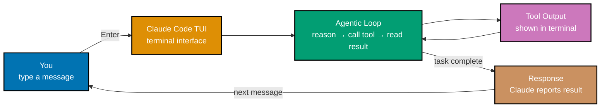
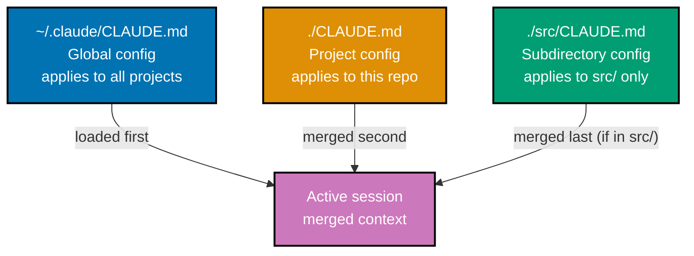
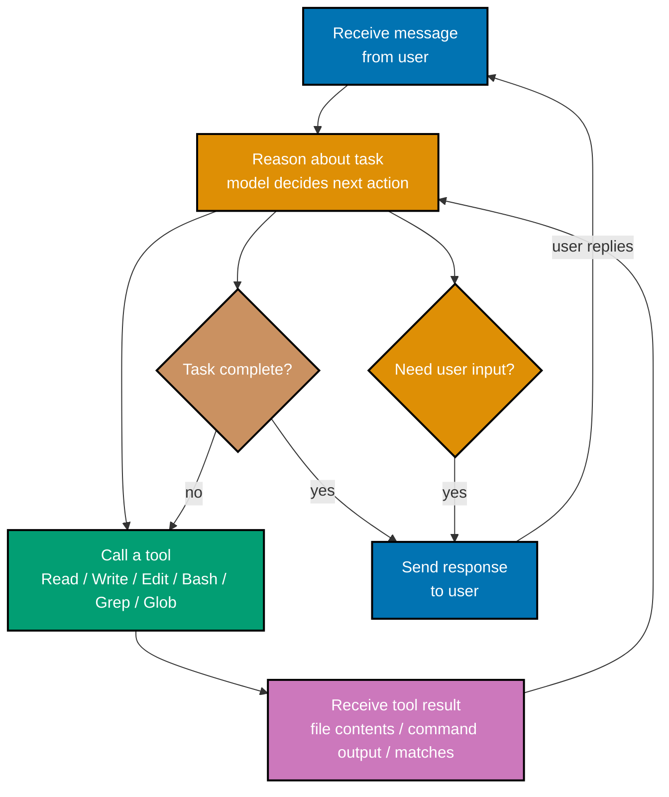

## 1. What is Claude Code?

Claude Code is Anthropic's official AI coding agent that runs entirely in your terminal.
Understanding the distinction between an agentic tool and a chat interface is the most
important mental model shift you need before anything else clicks.

A chat interface — GPT, Claude.ai, Gemini — receives your text, generates text back, and
stops. You copy the generated code into your editor. You run the commands yourself. The AI
is advisory. Claude Code operates differently: it holds a live connection to a Claude model
and has access to a set of **tools** that let it act directly on your local system. When
you ask Claude Code to "add error handling to the authentication module," it does not
produce a code snippet for you to paste. It reads the relevant files, figures out what
changes are needed, writes those changes, and tells you what it did. The AI acts; you
review.

The word "agent" in AI has a specific technical meaning: a system that perceives its
environment (your codebase, shell output, file contents), reasons about what actions to
take, executes those actions, and perceives the results — looping until the task is done
or it needs more information. Claude Code fits this definition precisely. It calls the
`Read` tool to perceive a file, reasons about what to change, calls the `Edit` tool to
apply the change, calls the `Bash` tool to run your test suite, reads the output, and
decides whether more changes are needed.

This architecture has a practical implication: you do not need to provide Claude Code with
code context by hand. You do not paste functions into a chat box. You say "fix the failing
test in auth.test.ts" and Claude Code finds the test, finds the implementation, understands
the failure, and fixes it — reading and acting on your actual files.

What Claude Code is **not**: it is not a cloud service that stores your code. It runs
locally as a Node.js process. It is not a VS Code plugin (though IDE plugins exist as
companions). Its core interface is the terminal.

```bash
# The fundamental difference in one example

# Chat workflow (copy-paste model):
#   You: paste 200 lines of code into browser
#   AI: suggests a fix in the chat window
#   You: manually copy fix back into editor
#   You: run your tests yourself
#   You: report results back to AI if anything failed

# Claude Code workflow (agentic model):
claude "fix the failing test in auth.test.ts"
# => Claude Code reads auth.test.ts via Read tool
# => reads auth.ts (the implementation) via Read tool
# => reasons about the mismatch
# => applies fix via Edit tool
# => runs: npm test auth.test.ts via Bash tool
# => reads test output — test passes
# => reports: "Fixed the null check on line 47. Test passes."
# => exits (one-shot mode) or waits for your next message
```

**Key Takeaway:** Claude Code is an agentic CLI that acts on your codebase through tools
— it does not wait for you to copy-paste; it reads, writes, and runs things itself.

**Why It Matters:** The copy-paste workflow has a hidden cost: every round-trip between
your editor, a browser chat window, and back consumes attention and breaks flow. Agentic
tools eliminate that loop for tasks that fit the pattern — refactoring, test writing,
boilerplate generation, dependency upgrades. Teams that adopt agentic workflows report
that the gains come not from faster typing but from maintaining focus on higher-level
decisions while Claude Code handles the mechanical steps.

---

## 2. Installation and Authentication

Claude Code installs as a global npm package and authenticates either through an Anthropic
API key or through your existing Claude.ai subscription. Getting this right on first run
saves confusion later.

Before installing, verify that Node.js 18 or later is present. Claude Code's CLI is a
Node.js process and will not run on older versions.

```bash
# Verify Node.js version before installing
node --version
# => v22.13.1  (must be 18 or later)
# => If older: upgrade via nvm, Volta, or your package manager

# Install Claude Code globally via npm
npm install -g @anthropic-ai/claude-code
# => Downloads and installs @anthropic-ai/claude-code package
# => Installs the `claude` binary into your PATH (e.g. /usr/local/bin/claude)
# => Installation takes ~10-30 seconds depending on network

# Verify the installation
claude --version
# => 1.x.x  (exact version number varies with releases)
```

Authentication has two paths. The API key path is for developers who have an Anthropic
account at console.anthropic.com — you create an API key there and set it as an
environment variable. The subscription path is for users with a Claude.ai Pro or Max
subscription — Claude Code can use your web session so you do not need a separate API key.

```bash
# Path A: API key authentication
export ANTHROPIC_API_KEY="sk-ant-..."   # => Set in shell; add to ~/.zshrc or ~/.bashrc
                                        # => to persist across sessions
# Start Claude Code — it reads ANTHROPIC_API_KEY automatically
claude
# => Reads ANTHROPIC_API_KEY from environment
# => Initializes session with Claude Sonnet (default model)
# => Displays: "Welcome to Claude Code. Type a message to begin."

# Path B: Claude.ai subscription (no API key needed)
claude
# => Detects no ANTHROPIC_API_KEY
# => Prompts: "No API key found. Log in with your Claude.ai account? [Y/n]"
# => Opens browser for OAuth flow
# => Stores session token in ~/.claude/auth.json
# => Returns to terminal: "Authenticated as user@example.com"
```

One practical consideration: API key authentication bills per token at Anthropic's API
pricing. Subscription authentication draws from your Claude.ai plan's included usage.
For heavy usage (long sessions, large codebases), compare the cost curves before
committing to a path.

**Key Takeaway:** Install with `npm install -g @anthropic-ai/claude-code`; authenticate
with either an API key in `ANTHROPIC_API_KEY` or your Claude.ai subscription via the
browser OAuth flow.

**Why It Matters:** Authentication choice affects cost structure in production. API keys
offer per-token billing and programmatic control — useful for CI pipelines and scripted
usage. Subscription auth is simpler for individual developers and pools usage with existing
Claude.ai costs. Getting authentication right at setup avoids mid-session errors that
interrupt long-running tasks.

---

## 3. Interactive Mode

Interactive mode is the primary way most developers use Claude Code: a persistent
terminal session where you give tasks in natural language, watch Claude Code act, and
guide it toward completion.



When you run `claude` without arguments, the terminal changes into a full-screen TUI
(text user interface). The lower portion shows your input prompt. The upper portion scrolls
with Claude Code's reasoning and tool activity — you see each tool call as it happens,
including the file paths being read, the shell commands being run, and the diff of any
edits applied. This live transparency is intentional: you always know what the agent is
doing and can interrupt at any point.

Keyboard navigation in interactive mode follows terminal conventions. The `Escape` key
interrupts Claude Code mid-turn if it is doing something you did not intend. `Ctrl-C`
exits the session. The up arrow cycles through your message history within the session.
`Ctrl-L` clears the visible terminal output without clearing the session's conversation
context — useful when the screen becomes cluttered after many tool calls.

The conversation in interactive mode is stateful: Claude Code remembers what it read, what
it changed, and what you discussed earlier in the same session. You do not need to re-explain
context from message to message. If you ask it to "refactor that function to use async/await"
three messages after it read the file, it knows which function you mean.

```bash
# Start interactive mode
claude
# => Terminal clears, TUI appears
# => Top area: tool output and Claude's reasoning stream
# => Bottom area: your input prompt ("> ")
# => Reads CLAUDE.md from current directory if present
# => Reads ~/.claude/CLAUDE.md (global config) first, then merges local

# Example session transcript
> add input validation to the signup form
# => Claude Code calls Read: src/components/SignupForm.tsx
# => Claude Code calls Read: src/lib/validation.ts  (noticed import)
# => Calls Edit: src/components/SignupForm.tsx  (applies validation logic)
# => Calls Bash: npm run typecheck  (verifies types pass)
# => "Added email format validation and password length check to SignupForm.
#     TypeScript reports no errors."

> also add tests for the new validation
# => Remembers SignupForm.tsx and the validation added above
# => Calls Read: src/components/SignupForm.test.tsx  (existing tests)
# => Calls Edit: src/components/SignupForm.test.tsx  (adds test cases)
# => Calls Bash: npm test SignupForm  (runs the new tests)
# => "Added 4 test cases covering valid email, invalid email, short password,
#     and valid password. All pass."

# Keyboard shortcuts
# Escape       => interrupt Claude mid-turn (stops current tool loop)
# Ctrl-C       => exit Claude Code entirely
# Up arrow     => cycle through your message history
# Ctrl-L       => clear screen (context preserved)
```

**Key Takeaway:** Interactive mode is a stateful terminal session where Claude Code acts
on your codebase in real time — each message builds on previous context so you can guide
multi-step work conversationally.

**Why It Matters:** Stateful context is the mechanism that makes iterative development with
Claude Code practical. Without it, you would need to re-explain the codebase structure
with every message. With it, you can decompose a large task — "implement the user profile
page" — into a series of short directed messages, reviewing and steering at each step.
The live tool output stream is equally important: it lets you catch unintended edits early
rather than after Claude Code has made sweeping changes across many files.

---

## 4. Core Tools: Read, Write, Edit

The three file operation tools — `Read`, `Write`, and `Edit` — are what give Claude Code
its ability to act on your codebase rather than merely describe changes. Understanding
what each does and when Claude Code chooses each prevents confusion about why certain
operations succeed or fail.

`Read` retrieves the contents of a file at a known path. Claude Code uses it when it
needs to understand existing code before making changes, when it needs to read
configuration, or when you ask it to explain something. `Read` is always safe — it does
not modify anything.

`Write` creates a new file or completely overwrites an existing file. Claude Code uses
`Write` when creating a file from scratch (new component, new test file, new config) or
when the changes are so extensive that a targeted replacement would be awkward. `Write`
replaces the entire file contents, so Claude Code typically reads the existing file first
to ensure it does not accidentally discard code it was not asked to change.

`Edit` applies a targeted string replacement to an existing file. It is the most common
tool for modifying code because it operates precisely: Claude Code specifies the exact
text to replace and the replacement text, and only that region changes. `Edit` is
preferable to `Write` for modifications because it is easier for you to audit in the tool
output — you see exactly what changed rather than needing to diff the entire file.

```bash
# Claude Code choosing Read vs Write vs Edit — a concrete example

> explain the database connection setup
# => Claude Code reasons: "need to understand the file, not change it"
# => Calls Read: src/db/connection.ts
# => Reads file contents, produces explanation
# => No file modified

> create a new Redis cache helper at src/lib/cache.ts
# => Claude Code reasons: "file does not exist, creating from scratch"
# => Calls Write: src/lib/cache.ts  (writes entire new file)
# => File created with full content
# => Does NOT call Read first (file does not exist yet)

> add a connection timeout option to the database config
# => Claude Code reasons: "modifying specific part of existing file"
# => Calls Read: src/db/connection.ts  (reads current content)
# => Identifies the config object to modify
# => Calls Edit: src/db/connection.ts
#    old_string: "const config = { host, port };"
#    new_string: "const config = { host, port, connectTimeout: 5000 };"
# => Only that line changes; rest of file untouched
# => Tool output shows the diff: one line replaced
```

One important nuance: Claude Code will use `Write` over `Edit` when it determines that
more than roughly half the file needs to change, because applying dozens of targeted edits
sequentially is slower and more error-prone than rewriting the file in full. When you see
`Write` on a file that already exists, it is worth reviewing the output to confirm the
rewrite is complete and correct.

```bash
# Read with offset and limit — for large files
> show me the authentication middleware
# => Claude Code may call Read with offset/limit parameters for a 2000-line file
# => Read: src/middleware/auth.ts  (lines 150-220)
# => Retrieves only the relevant region, not the entire file
# => Saves tokens and is faster for targeted questions
```

**Key Takeaway:** `Read` observes, `Write` creates or replaces entirely, `Edit` modifies
precisely — Claude Code chooses among them based on whether the file exists and how much
of it needs to change.

**Why It Matters:** The `Edit` tool's precision has a direct impact on review confidence.
When Claude Code uses `Edit`, the tool output shows you exactly which lines changed — the
same information a code review diff shows. This makes it practical to review each change
before accepting it, which is the correct workflow for production codebases. Treating
Claude Code as a tool that produces reviewable diffs (rather than an oracle that rewrites
files opaquely) keeps humans appropriately in the loop.

---

## 5. Bash Tool

The `Bash` tool lets Claude Code run shell commands on your machine: compilers, test
runners, linters, git operations, package managers, and anything else available in your
terminal. It is what transforms Claude Code from a file editor into a full development
loop participant.

Without the `Bash` tool, Claude Code could read and write files but could not verify that
those files work. With it, Claude Code can apply a change, run `npm test`, read the output,
see a failing test, reason about why it failed, apply another change, run the tests again,
and continue until they pass. The feedback loop that a human developer performs manually
is something Claude Code can execute autonomously.

By default, Claude Code will ask for your approval before running commands that it
determines to be potentially destructive or irreversible — commands involving `rm`,
`git push`, `DROP TABLE`, and similar operations. You will see a prompt in the TUI:
"Bash: `rm -rf dist/` — allow? [y/N]". Commands considered safe — `npm test`, `tsc`,
`git status`, reading files via `cat` — run without prompting. You can configure this
approval threshold in `settings.json` (covered in the Intermediate section).

```bash
> run the test suite and fix any failures
# => Calls Bash: npm test
# => Output: "3 tests failed: UserService.spec.ts"
# => Calls Read: src/services/UserService.spec.ts
# => Calls Read: src/services/UserService.ts
# => Calls Edit: src/services/UserService.ts  (applies fix)
# => Calls Bash: npm test src/services/UserService.spec.ts
# => Output: "All tests passed"
# => "Fixed 3 failing tests in UserService.ts. Root cause: null check missing
#     before calling .toLowerCase() on user.email."

# Bash with destructive command — approval prompt
> delete all compiled output
# => Calls Bash: rm -rf dist/
# => TUI shows: "Bash: rm -rf dist/ — this command is potentially irreversible.
#               Allow? [y/N]"
# => You type: y
# => dist/ directory removed
# => Claude Code reports: "Deleted dist/ directory"

# Bash for git operations
> commit these changes with a descriptive message
# => Calls Bash: git diff --staged
# => Reads what is staged
# => Calls Bash: git commit -m "Add null check for user.email in UserService"
# => Output: "[main a3f9c12] Add null check for user.email in UserService"
# => "Committed. SHA: a3f9c12"
```

The `Bash` tool executes with the working directory set to where you started `claude`.
Environment variables from your shell session carry into Claude Code's subprocess. This
means `npm`, `go`, `python`, `docker`, and any other tools in your PATH are available
to Claude Code exactly as they are to you.

One practical safety note: Claude Code runs Bash commands as you — with your user
permissions. It can read and write any file you can read and write. For sensitive
environments (production SSH access, cloud provider CLIs configured with production
credentials), be aware of this before starting a session.

```bash
# Bash inherits your environment
> check which version of Go is installed
# => Calls Bash: go version
# => go version go1.23.4 darwin/arm64
# => "Go 1.23.4 is installed."

> build the Go binary
# => Calls Bash: go build ./...
# => Output: (empty — success)
# => Calls Bash: ls -lh bin/
# => Output: "total 12M  -rwxr-xr-x  1 user staff  12M  myapp"
# => "Build succeeded. Binary at bin/myapp (12MB)."
```

**Key Takeaway:** The `Bash` tool closes the development feedback loop — Claude Code can
run tests, compilers, and other tools to verify its own changes, making it a participant
in the build cycle rather than just a file generator.

**Why It Matters:** The ability to run tests is what separates agentic coding tools from
sophisticated autocomplete. When Claude Code can verify its own changes against your test
suite, it catches its own mistakes before handing back to you. This shifts the human
review from "does this code look right?" to "do the tests and behavior match what I
wanted?" — a higher-level and less error-prone form of oversight.

---

## 6. Glob and Grep

`Glob` and `Grep` are Claude Code's codebase exploration tools. `Glob` finds files by
path pattern; `Grep` searches file contents with regular expressions. Together they let
Claude Code orient itself in a large, unfamiliar codebase without you needing to explain
the structure by hand.

When you start a session and ask Claude Code to work on a feature, it typically does not
know where the relevant files are. Rather than asking you, it uses `Glob` to list files
matching a pattern and `Grep` to find where specific symbols, imports, or strings appear.
This is analogous to the `find` and `grep` commands you run in your own terminal when
navigating an unfamiliar project.

```bash
> find all files that import the authentication module
# => Calls Grep: pattern="from.*auth", recursive=true
# => Matches:
#    src/routes/profile.ts:3:   import { requireAuth } from '../auth'
#    src/routes/admin.ts:2:     import { requireAuth, requireAdmin } from '../auth'
#    src/middleware/session.ts:5: import { verifyToken } from '../auth'
# => Claude Code now knows which files depend on the auth module

> list all TypeScript files in the services directory
# => Calls Glob: pattern="src/services/**/*.ts"
# => Matches:
#    src/services/UserService.ts
#    src/services/EmailService.ts
#    src/services/PaymentService.ts
#    src/services/UserService.spec.ts
# => Claude Code can now read relevant files selectively

> find where the MAX_RETRY_COUNT constant is defined
# => Calls Grep: pattern="MAX_RETRY_COUNT\s*=", recursive=true
# => Matches:
#    src/config/constants.ts:14:  export const MAX_RETRY_COUNT = 3;
# => Calls Read: src/config/constants.ts  (verifies context around the match)
# => "MAX_RETRY_COUNT is defined in src/config/constants.ts, exported as 3."
```

`Glob` patterns follow standard glob syntax: `*` matches any characters within a path
segment, `**` matches across path segments (recursive), and `?` matches a single
character. `Grep` takes a regular expression and, when the `recursive` flag is set,
searches all files under a path.

Claude Code combines these tools to answer architectural questions before writing code.
Before adding a new service, it might `Glob` all existing services to understand naming
conventions, then `Grep` for how those services are registered or imported elsewhere.
This pattern — explore first, then act — produces changes that fit the existing codebase
style rather than imposing a foreign pattern.

```bash
> add a new CacheService following the existing service patterns
# => Calls Glob: pattern="src/services/*.ts" (excluding spec files)
# => Reads 3 service files to understand the class structure pattern
# => Calls Grep: pattern="services\." recursive=true  (finds how services are used)
# => Now understands: constructor injection pattern, interface-first style
# => Calls Write: src/services/CacheService.ts  (new file matching pattern)
# => Calls Write: src/services/CacheService.spec.ts  (matching test file)
# => "Created CacheService and CacheService.spec.ts following the existing
#     constructor injection pattern used by UserService and EmailService."
```

**Key Takeaway:** `Glob` and `Grep` let Claude Code orient itself in any codebase without
manual guidance — it finds files and symbols the same way an experienced developer would,
using search rather than memorization.

**Why It Matters:** Codebase orientation is the largest hidden cost of bringing any
contributor — human or AI — up to speed on a project. When Claude Code can orient itself,
you do not spend the first fifteen minutes of every session explaining where things live.
This makes Claude Code effective from the first message on any unfamiliar project, which
is the typical production scenario: you use Claude Code across multiple repositories, each
with its own conventions.

---

## 7. Your First Coding Task

Giving Claude Code a real task and watching the agentic loop in action is the fastest way
to build the correct mental model for how to work with it. The first task should be small
enough to complete quickly but substantial enough to involve multiple tools.

A good first task: "add a health check endpoint to the API." This requires Claude Code to
find the router file, understand how existing routes are structured, add the new route,
and optionally run a quick test. It involves `Glob`, `Read`, `Edit`, and possibly `Bash`
— enough tools to make the agentic loop visible without being so complex that the session
becomes hard to follow.

```bash
# Starting Claude Code for the first time in a project
cd my-api-project
claude
# => Reads CLAUDE.md from current directory (if present)
# => "Welcome to Claude Code. How can I help?"

> add a health check endpoint at GET /health that returns {"status": "ok"}

# Step 1: Claude Code orients itself
# => Calls Glob: pattern="src/**/*.ts" or "app/**/*.js" (guesses from project root)
# => Finds: src/routes/index.ts, src/routes/users.ts, src/app.ts
# => Calls Read: src/app.ts  (understands Express/Fastify/Koa setup)
# => Calls Read: src/routes/index.ts  (understands route registration pattern)

# Step 2: Claude Code identifies where the change goes
# => Reasons: "Routes are registered in src/routes/index.ts; existing pattern
#              uses express Router; health check fits here"

# Step 3: Claude Code applies the change
# => Calls Edit: src/routes/index.ts
#    Adds:  router.get('/health', (req, res) => res.json({ status: 'ok' }));
#    After: existing route registrations, before module.exports

# Step 4: Claude Code verifies (if test runner is available)
# => Calls Bash: npm test  (or detects no test for this route)
# => "Added GET /health endpoint returning {\"status\":\"ok\"}.
#     Route registered in src/routes/index.ts line 23."

# Review the change
git diff
# => Shows exactly one line added in src/routes/index.ts
# => No other files modified
```

During this process, watch the tool call log in the TUI. You will see each tool call
appear as Claude Code makes it, with the file path or command shown. This is your primary
feedback mechanism — if Claude Code is reading the wrong file, or running a command you
did not expect, you can interrupt with `Escape` and redirect.

After the task completes, the correct habit is to review what changed before proceeding.
`git diff` shows you exactly what Claude Code wrote. This review step is not optional —
it is the human oversight that makes agentic tools safe to use in production codebases.

```bash
# Post-task review habit
git diff          # => See all unstaged changes Claude Code made
git diff --staged # => See staged changes if Claude Code ran git add
git status        # => See which files were created, modified, or deleted

# If satisfied, stage and commit
git add -p        # => Interactive staging: review each hunk before staging
git commit -m "Add GET /health endpoint"
# => Changes committed under your authorship
# => Claude Code's changes are part of your commit history
```

**Key Takeaway:** Your first task establishes the review habit: give Claude Code a task,
watch the tool call log, then always review with `git diff` before staging — Claude Code
acts autonomously but you stay in control of what gets committed.

**Why It Matters:** The review step after an agentic task is the equivalent of a code
review for AI-generated changes. Teams that skip this step eventually merge unintended
changes. Teams that build the habit of reviewing every diff before committing treat Claude
Code as a fast collaborator rather than an oracle, which is both safer and more effective.

---

## 8. CLAUDE.md: Project Context

`CLAUDE.md` is a markdown file that Claude Code reads at the start of every session to
understand your project's conventions, commands, and constraints. It is the mechanism
that transforms Claude Code from a generic assistant into one that knows how your
specific codebase works.

Without `CLAUDE.md`, Claude Code has to rediscover project conventions on every session:
which test command to run, which linter to use, what patterns to follow. With `CLAUDE.md`,
you write those conventions once and Claude Code applies them automatically. It is the
closest equivalent to the onboarding document you would give a new team member.



`CLAUDE.md` has a three-level scope hierarchy. The global file at `~/.claude/CLAUDE.md`
applies to all Claude Code sessions regardless of directory — useful for personal
conventions (preferred code style, common commands, personal tool preferences). The
project file at `./CLAUDE.md` (where you run `claude`) applies to that project — the most
important file for team conventions. Subdirectory files at `./src/CLAUDE.md` or
`./lib/CLAUDE.md` apply only when Claude Code is working within that subdirectory.

The `@filename` directive imports the contents of another file at that position in
`CLAUDE.md`. This lets you split large configurations into composable pieces or import a
shared conventions file that lives elsewhere in the repo.

```markdown
<!-- CLAUDE.md — a minimal but effective example -->

# Project: my-api

## Commands

Run tests: `npm test`
Run linter: `npm run lint`
Start dev server: `npm run dev`
Build for production: `npm run build`

## Conventions

- Use TypeScript strict mode; no `any` types
- All new routes must have corresponding unit tests
- Error handling: use the `AppError` class in src/errors/AppError.ts
- Database queries: use the repository pattern (see src/repositories/)

## Do Not

- Do not modify .env files directly; suggest changes only
- Do not run `npm install` without explicit instruction
- Do not commit node_modules

@docs/architecture.md
```

The `@docs/architecture.md` at the bottom imports that file's content into the session
context, giving Claude Code access to architecture documentation without you having to
paste it. Any markdown file in the repo can be imported this way.

What to put in `CLAUDE.md`: build commands, test commands, coding conventions, patterns
to follow, patterns to avoid, file structure notes, and anything Claude Code repeatedly
gets wrong without this context. What not to put in `CLAUDE.md`: information better kept
in your actual code documentation, secrets or API keys, lengthy reference material that
rarely affects Claude Code's decisions (import via `@` only what is actually needed).

```bash
# Claude Code reads CLAUDE.md on session start
claude
# => Loads ~/.claude/CLAUDE.md  (global)
# => Loads ./CLAUDE.md  (project)  — finds "Run tests: npm test"
# => Session context now includes all CLAUDE.md content

> add tests for the new payment endpoint
# => Uses "npm test" from CLAUDE.md (does not guess "jest" or "mocha")
# => Uses AppError class (knows it from CLAUDE.md conventions)
# => Creates test file matching existing test structure
# => Calls Bash: npm test  (exactly the command from CLAUDE.md)
```

**Key Takeaway:** `CLAUDE.md` is the project onboarding document for Claude Code — write
it once with your commands and conventions, and Claude Code applies them correctly in
every session without you repeating yourself.

**Why It Matters:** Without `CLAUDE.md`, every Claude Code session starts from zero
project knowledge. The agent rediscovers conventions by exploring files, sometimes
getting them wrong. With a well-written `CLAUDE.md`, the session starts already knowing
how the project works. For teams, `CLAUDE.md` checked into version control ensures every
team member's Claude Code sessions follow the same conventions — it is a governance
document as much as a convenience file.

---

## 9. The Agentic Loop

The agentic loop is the core execution pattern that Claude Code follows for every task.
Understanding it precisely helps you predict what Claude Code will do next, diagnose
unexpected behavior, and know when to intervene.



The loop has four stages. First, Claude Code receives your message and reasons about what
the first action should be. Second, it calls a tool and waits for the result. Third, it
incorporates the result into its context and reasons again — was that sufficient, or is
another tool call needed? Fourth, when it determines the task is complete (or it needs
your input), it sends a response.

Every tool call result becomes part of the conversation context. When Claude Code reads
a file, the file contents are added to the context window. When it runs a test, the
output is added. This cumulative context is how Claude Code maintains awareness across
a multi-step task — it is not running each step in isolation; it has the full history
of what it observed and what it did.

The loop terminates in two ways: the task is complete, or Claude Code determines it needs
information it cannot get from tools alone and asks you a clarifying question. Well-scoped
tasks tend to complete without clarifying questions; vague or ambiguous tasks tend to
prompt questions.

Understanding the loop helps you write better prompts. A prompt that provides all the
information Claude Code needs to complete the task without clarification — the right level
of specificity, the correct file paths or function names when relevant — will complete
faster and with fewer surprises than a vague instruction that forces the agent to make
assumptions.

```bash
> update the user profile API to support updating the profile picture URL

# Loop iteration 1: orient
# => REASON: "Need to find where the user profile API is defined"
# => TOOL:   Grep: "profile" in src/routes/
# => RESULT: src/routes/profile.ts line 12: router.put('/profile', ...)

# Loop iteration 2: understand existing code
# => REASON: "Need to read the current PUT /profile handler"
# => TOOL:   Read: src/routes/profile.ts
# => RESULT: File contents — handler updates name and bio, no picture URL

# Loop iteration 3: understand the data model
# => REASON: "Need to see the User model to add pictureUrl field"
# => TOOL:   Grep: "interface User" in src/
# => RESULT: src/models/User.ts line 3

# Loop iteration 4: understand the model
# => TOOL:   Read: src/models/User.ts
# => RESULT: User has { id, name, bio, email } — no pictureUrl yet

# Loop iteration 5: make changes
# => REASON: "Need to add pictureUrl to User model and update route handler"
# => TOOL:   Edit: src/models/User.ts  (adds pictureUrl?: string)
# => RESULT: Edit applied

# Loop iteration 6: update route
# => TOOL:   Edit: src/routes/profile.ts  (adds pictureUrl to update logic)
# => RESULT: Edit applied

# Loop iteration 7: verify
# => TOOL:   Bash: npm run typecheck
# => RESULT: No TypeScript errors

# Loop terminates: task complete
# => RESPOND: "Updated User model with optional pictureUrl field and updated
#              the PUT /profile handler to accept and store pictureUrl."
```

**Key Takeaway:** The agentic loop is a reasoning-tool-result cycle that repeats until the
task is done; each tool result becomes context for the next decision, building cumulative
understanding rather than making isolated guesses.

**Why It Matters:** The loop's cumulative context property is what makes Claude Code
effective for multi-file refactors and complex features. Each tool call refines Claude
Code's understanding of your codebase, compounding over the course of a task. Engineers
who understand this model write more effective prompts: they provide a clear outcome goal,
let Claude Code explore freely, and intervene only when the loop goes off track — which
is a fundamentally different (and more productive) collaboration style than step-by-step
instruction.

---

## 10. Slash Commands

Slash commands are built-in utilities you invoke by typing `/` followed by the command
name at the interactive mode prompt. They control session state, model selection, token
usage, and other meta-operations that are not part of the coding task itself.

```bash
# /help — show all available slash commands
/help
# => Lists all slash commands with brief descriptions
# => Includes: /clear, /compact, /cost, /model, /plan, /memory, /share, /fast

# /clear — reset the conversation context
/clear
# => Clears all conversation history from the current session
# => Claude Code no longer knows about files read or changes made earlier
# => Token count resets to zero
# => Useful when switching to a completely different task

# /compact — compress conversation to save tokens
/compact
# => Summarizes the conversation history into a shorter representation
# => Preserves key facts (files seen, changes made) but removes raw file contents
# => Token count drops significantly (often 60-80%)
# => Useful mid-session when context window is filling up

# /cost — show token usage and estimated cost for the current session
/cost
# => Input tokens:  12,450
# => Output tokens:  3,210
# => Cache read:    8,000
# => Estimated cost: $0.047  (varies by model and pricing tier)

# /model — switch models mid-session
/model
# => Shows current model: claude-sonnet-4-6
# => Lists available: sonnet, opus, haiku
/model opus
# => Switches to claude-opus-4-7 for the next message
# => "Model switched to claude-opus-4-7"
# => Sonnet: default execution-grade model, good balance of speed and capability
# => Opus:   planning-grade, highest capability, higher cost
# => Haiku:  fastest and cheapest, for simple/quick tasks

# /plan — enter plan mode before acting
/plan
# => Claude Code enters plan mode
# => For the next message, it will describe what it intends to do
# => before actually calling any tools
# => Useful for complex multi-file tasks where you want to approve the approach first

# /memory — view and manage persistent memory
/memory
# => Shows current memory entries
# => Allows adding, editing, or removing memory notes

# /share — share the current conversation
/share
# => Generates a shareable URL for the current conversation
# => Useful for getting help or documenting what Claude Code did
```

Knowing when to use each slash command is a workflow skill. `/compact` is most valuable
in long sessions that involve reading many large files — the raw file contents fill the
context window quickly, and compaction lets you continue working without starting over.
`/clear` is appropriate when you finish one task and are starting a completely different
one — the previous context is irrelevant and consuming tokens unnecessarily. `/cost` is
useful at the end of a session to understand how much you spent, which informs whether
your prompting style is efficient.

**Key Takeaway:** Slash commands are the meta-controls for session management — use
`/compact` to recover context budget mid-session, `/clear` between unrelated tasks, and
`/cost` to monitor spend.

**Why It Matters:** Context window management directly affects cost and capability. A
session that runs out of context budget either truncates earlier information (making Claude
Code forget what it read) or refuses to continue. Proactive use of `/compact` extends
sessions significantly without losing important state. On large refactoring tasks that
involve reading dozens of files, the difference between a session with good context
management and one without can be the difference between completing the task in one
session versus three.

---

## 11. One-Shot Mode

One-shot mode runs Claude Code non-interactively: you pass a task description as a
command-line argument, Claude Code executes it, prints the result, and exits. It is the
foundation for scripting Claude Code into build pipelines, git hooks, and automated
workflows.

```bash
# Basic one-shot usage
claude "what does the payment service do?"
# => Claude Code starts, reads relevant files, produces an explanation
# => Prints explanation to stdout
# => Exits with code 0

# One-shot for a coding task
claude "add JSDoc comments to all exported functions in src/utils/format.ts"
# => Reads src/utils/format.ts
# => Adds JSDoc to each exported function
# => Prints summary of what was added
# => Exits

# One-shot with --output-format for structured output (machine-readable)
claude --output-format json "list all TODO comments in the codebase"
# => Outputs: {"todos": [{"file": "src/api.ts", "line": 42, "text": "handle 429"}]}
# => JSON output is useful for piping to other tools

# One-shot with -p flag (print mode shorthand)
claude -p "explain the database schema"
# => Same as passing a quoted string; historical flag name
# => -p and positional argument are equivalent in current versions

# One-shot in a shell script
#!/bin/bash
EXPLANATION=$(claude "summarize the changes in the last commit")
echo "Changes: $EXPLANATION"

# One-shot in a Makefile
review:
    claude "review src/$(FILE) for security issues and print findings"
```

One-shot mode inherits all the configuration from `CLAUDE.md` and `settings.json`, just
like interactive mode. The difference is only the interaction model: no TUI, no back-and-
forth, just one task executed and exited.

The `--output-format json` flag is particularly useful when integrating Claude Code into
scripts that need to parse the output. Without it, Claude Code produces human-readable
markdown-ish text. With it, the output is a JSON structure that scripts can reliably parse.

```bash
# Practical: pre-commit hook using one-shot mode
# .git/hooks/pre-commit
#!/bin/bash
STAGED_FILES=$(git diff --cached --name-only --diff-filter=ACM | grep '\.ts$')
if [ -n "$STAGED_FILES" ]; then
    claude "review these staged TypeScript files for obvious errors: $STAGED_FILES"
    # => Claude Code reads each staged file
    # => Prints any issues found
    # => Exit code 0 if no blocking issues, 1 if critical issues found
fi
```

**Key Takeaway:** One-shot mode runs Claude Code as a non-interactive subprocess that
executes one task and exits — the entry point for scripting Claude Code into automated
workflows and pipelines.

**Why It Matters:** Non-interactive usage unlocks Claude Code as an infrastructure
component rather than just a developer tool. Pre-commit hooks that catch issues before
they land in version control, CI pipeline steps that generate documentation or validate
changes, Makefile targets that explain unfamiliar code — these uses multiply Claude Code's
value beyond the individual developer session and integrate it into team processes.

---

## 12. Model Selection

Claude Code supports three model tiers — Sonnet, Opus, and Haiku — each with different
capability and cost profiles. Choosing the right model for each task type is a cost-
effectiveness skill that becomes important once you start using Claude Code regularly.

Sonnet is the default and the right choice for the majority of coding tasks: implementing
features, writing tests, refactoring, explaining code. It balances capability and speed
well. Opus is Anthropic's most capable model — use it for tasks requiring deep reasoning,
complex architectural planning, or when Sonnet produces incorrect results repeatedly.
Haiku is the fastest and cheapest model — appropriate for simple, well-scoped tasks where
speed matters more than depth (generating boilerplate, formatting, trivial transforms).

```bash
# Check current model
/model
# => Current model: claude-sonnet-4-6
# => Available: sonnet, opus, haiku

# Switch to Opus for a complex architectural decision
/model opus
# => Switched to claude-opus-4-7
# => "Analyze the current authentication architecture and propose a migration
#     to JWT-based sessions with refresh token rotation"
# => Uses Opus's deeper reasoning capability for architectural analysis

# Switch to Haiku for a simple formatting task
/model haiku
# => Switched to claude-haiku-4-5
# => "add trailing commas to all function parameters in src/utils/strings.ts"
# => Haiku handles this mechanical task quickly and cheaply

# Switch model via command-line flag (one-shot mode)
claude --model opus "design a rate limiting strategy for the payments API"
# => Starts session with Opus model
# => Produces detailed analysis
# => Exits after response

# /fast toggle — Opus with faster output (less reasoning verbosity)
/fast
# => Toggles "fast mode" on
# => Uses Opus model but with reduced thinking verbosity
# => Faster output, similar capability for many tasks
/fast
# => Toggles fast mode off — back to standard Opus behavior
```

Model switching mid-session is fully supported: the conversation context carries over.
You can start a session with Sonnet for implementation, switch to Opus when you hit a
complex design question, then switch back to Sonnet to continue coding.

Cost awareness is a practical discipline. Opus tokens cost significantly more than Sonnet
tokens (approximately 5-15x depending on input/output ratio). A session that would cost
$0.05 with Sonnet might cost $0.50-$0.75 with Opus on the same codebase. For tasks where
Sonnet performs adequately, defaulting to Sonnet is the economical choice.

```bash
# Check cost after a session to calibrate model choice
/cost
# => Opus session (30 min, large codebase): $0.43
# => Sonnet equivalent session:             $0.06
# => If Sonnet's output quality was adequate, the cost difference is unjustified
```

**Key Takeaway:** Sonnet is the right default; switch to Opus for complex reasoning or
when Sonnet struggles with a task; use Haiku only for mechanical tasks where depth is
not needed.

**Why It Matters:** Model selection is the highest-leverage cost control available. Teams
that default all sessions to Opus without a clear reason pay 5-15x more than necessary.
A practical policy — Sonnet by default, Opus by explicit choice for complex tasks —
keeps costs manageable while ensuring the most capable model is available when it genuinely
matters. Over many sessions on a large project, this discipline has significant budget
impact.

---

## 13. Cost Tracking

The `/cost` command reveals the token usage and estimated cost for the current session,
broken down by input tokens, output tokens, and cache reads. Monitoring cost is part of
using Claude Code sustainably.

```bash
# View cost mid-session
/cost
# => Session token usage:
# =>   Input tokens:        18,250  ($0.055)
# =>   Output tokens:        4,100  ($0.061)
# =>   Cache read tokens:    9,500  ($0.004)
# =>   Cache write tokens:   8,000  ($0.020)
# =>   ─────────────────────────────────────
# =>   Session total:                $0.140
# => Model: claude-sonnet-4-6

# Cost breakdown explains what drives cost
# Input tokens:  everything Claude Code sends to the model
#                = your messages + file contents read + CLAUDE.md + conversation history
# Output tokens: everything the model generates
#                = reasoning + tool calls + final response
# Cache read:    tokens served from Anthropic's prompt cache
#                = cheaper than fresh input tokens (often 10x cheaper)
# Cache write:   tokens written to prompt cache for future reuse
```

The largest cost driver is usually input tokens, specifically file contents. When Claude
Code reads a 500-line TypeScript file, all 500 lines go into the context window as input
tokens. A session that reads 20 large files accumulates substantial input token cost even
if Claude Code's output is brief.

Cache tokens are the cost-reduction mechanism: when Claude Code reads the same file
multiple times within a session (or across sessions with prompt caching enabled), the
repeated reads hit the cache rather than counting as fresh input. `CLAUDE.md` is
typically cached after the first read, making it effectively free in subsequent turns.

```bash
# Strategies for reducing cost

# 1. Use /compact to reduce context before it grows too large
/compact
# => Conversation compressed from 18,250 → 4,100 input tokens
# => IMPORTANT: re-read files needed for next steps after compaction

# 2. Use targeted reads (ask Claude Code to read specific regions)
> read only the handlePayment function in src/services/PaymentService.ts
# => Read with offset/limit instead of entire 800-line file
# => Reads ~50 lines instead of 800 — 94% input token reduction for this read

# 3. Start fresh for unrelated tasks
/clear
# => Full context reset
# => Next task starts with zero accumulated context cost

# 4. Use Haiku for simple tasks
/model haiku
> add missing semicolons to src/utils/format.ts
# => Haiku costs ~10x less per token than Opus, ~3x less than Sonnet
# => For mechanical tasks where depth is irrelevant, Haiku is economical
```

**Key Takeaway:** `/cost` tells you where session budget is going — input tokens from
large file reads are typically the biggest driver, and `/compact` plus targeted reads are
the main controls.

**Why It Matters:** Unchecked token consumption on long sessions with large codebases
can produce surprisingly high costs. A single session that reads an entire large codebase
multiple times can cost more than a week of typical usage. Building a habit of checking
`/cost` at the end of each session and adjusting approach accordingly is how experienced
users keep Claude Code economical.

---

## 14. Session Continuity

Claude Code sessions persist to disk. When you close a session and return later, you can
resume where you left off rather than starting fresh. This matters for tasks that span
multiple working sessions or get interrupted.

```bash
# A session automatically saves to disk as you work
claude
# => Session ID: sess_a3f9c12b  (shown in the TUI header)
# => Work happens... files read, edits made, conversation accumulated

# Close the session (Ctrl-C or close terminal)
# Session state saved to ~/.claude/sessions/sess_a3f9c12b

# Next day: resume the last session
claude --continue
# => Finds most recent session: sess_a3f9c12b
# => Restores full conversation history
# => All file reads and context from previous session available
# => "Resumed session sess_a3f9c12b (started 2026-05-21, 47 messages)"

# Resume a specific session by ID
claude --resume sess_a3f9c12b
# => Resumes exactly that session
# => Useful when you have multiple open sessions for different tasks

# List available sessions
claude --list-sessions
# => sess_a3f9c12b  2026-05-21  "implement user profile page"  (last message)
# => sess_99d7f40a  2026-05-20  "fix authentication bug"
# => sess_c12e8b31  2026-05-19  "add payment service"
```

Session persistence stores the full conversation history: every message, every tool call,
every file read, every edit made. Resuming a session picks up this history exactly where
it left off. Claude Code knows what files it read, what changes it made, and what you
discussed.

The practical limit on session continuity is the context window. Very long sessions
eventually accumulate more history than the model's context window can hold. When this
happens, Claude Code automatically compacts the oldest content — preserving key facts but
discarding raw file contents that were read early. Using `/compact` proactively before the
session hits this limit gives you control over what gets compressed versus what gets
automatically trimmed.

```bash
# Session continuation flow for a multi-day task

# Day 1: Start implementing a feature
claude
# => Session: sess_feature_x
> implement the first half of the payment webhook handler

# Day 1 end: close terminal
# Session saved automatically

# Day 2: Resume and continue
claude --continue
# => "Resumed session sess_feature_x"
> continue from where we left off — implement the retry logic

# Claude Code remembers:
# => Which files it read on Day 1
# => What the webhook handler looks like after Day 1's edits
# => What "the first half" means in the context of the task
# => Any conventions discussed during Day 1
```

**Key Takeaway:** `--continue` resumes the most recent session; `--resume <id>` resumes
a specific one — Claude Code stores full conversation history on disk so multi-day tasks
do not need to restart from scratch.

**Why It Matters:** Large tasks — implementing a significant feature, migrating a
codebase to a new pattern, writing comprehensive tests — do not fit in a single working
session. Session continuity means you pay the context-building cost once (reading the
relevant files, establishing conventions) rather than at the start of every session. For
week-long tasks, this is a significant practical advantage over tools that do not persist
sessions.

---

## 15. Safety and Permissions

Claude Code runs on your machine with your user permissions. Understanding its safety
model — what it can do by default, what requires approval, and how to restrict it — is
essential before using it in sensitive environments.

By default, Claude Code applies a conservative permission policy. File reads are always
permitted (it needs to read files to understand the codebase). File writes and edits
require approval for files outside the project directory (it asks before writing to
`~/Desktop` or `/etc`). Shell commands are divided into two categories: low-risk commands
(read-only operations, test runners, compilers) run automatically; potentially destructive
or irreversible commands require explicit approval.

```bash
# Default behavior — read always allowed
> read the nginx configuration
# => Calls Read: /etc/nginx/nginx.conf  (reads system file)
# => No approval prompt for reads

# Edit within project — allowed without prompt (default)
> update the database connection string
# => Calls Edit: src/config/database.ts
# => Applies edit, no prompt

# Edit outside project directory — requires approval
> update my shell configuration
# => Calls Write: ~/.zshrc
# => TUI: "Write: ~/.zshrc — this file is outside the project directory.
#          Allow? [y/N]"

# Destructive shell command — requires approval
> remove the build artifacts
# => Calls Bash: rm -rf dist/ build/ .cache/
# => TUI: "Bash: rm -rf dist/ build/ .cache/ — potentially irreversible.
#          Allow? [y/N]"

# Safe shell command — runs without prompt
> run the test suite
# => Calls Bash: npm test
# => Runs immediately, no prompt
```

The approval prompt is the primary safety mechanism. When Claude Code asks for approval,
read the proposed command carefully before responding `y`. Pressing `Escape` instead of
`y` cancels the tool call and lets you redirect Claude Code.

For sensitive environments — machine with production cloud credentials, SSH access to
servers, database CLIs pointed at live data — the safe practice is to start Claude Code
in a context where those credentials are not loaded, or to use `settings.json` to
restrict which tools and file paths Claude Code can access.

```json
// settings.json — restrict Claude Code's access
{
  "allowedTools": ["Read", "Edit", "Glob", "Grep"],
  // => Only Read, Edit, Glob, Grep are permitted
  // => Write and Bash are blocked entirely
  // => Claude Code cannot run shell commands or create new files
  "disallowedTools": ["Bash"],
  // => Explicit block for Bash tool
  "env": {
    "ANTHROPIC_API_KEY": "sk-ant-..."
    // => API key scoped to this project's settings
  }
}
```

**Key Takeaway:** Claude Code asks for approval before running potentially destructive
commands; restrict further via `settings.json` `allowedTools` and `disallowedTools` for
sensitive environments.

**Why It Matters:** Running an agentic tool on a machine with production credentials is
a real risk if the tool can execute arbitrary shell commands. The approval mechanism is
the default guard, but it relies on you reading each prompt carefully — which is hard to
maintain across a fast-moving session. For production-adjacent work, configuring explicit
tool restrictions before starting the session is more reliable than per-prompt vigilance.

---

## 16. Plan Mode

Plan mode instructs Claude Code to describe its intended actions before executing any
of them. Instead of immediately calling tools, it produces a step-by-step plan for
your review. You approve or modify the plan, then execution begins.

Plan mode is most valuable for complex, multi-file tasks where the consequences of a
wrong approach are significant — a refactor that touches many files, a migration that
must follow a specific order, a change to core infrastructure that has cascading effects.
For simple, well-understood tasks, plan mode adds overhead without much benefit.

```bash
# Enter plan mode via slash command
/plan
# => "Plan mode enabled. I'll describe my intended actions before executing."

> migrate all usages of the deprecated DatabaseConnection class to the new DbClient class

# Claude Code in plan mode:
# => Does NOT call any tools yet
# => Reasons about the task
# => Produces plan:
#
# "I'll complete this migration in these steps:
#  1. Grep for all imports of DatabaseConnection across the codebase
#  2. Read each file that imports it to understand usage context
#  3. For each file: replace the import with DbClient, update instantiation
#     syntax (new DbClient(config) vs new DatabaseConnection(url, options))
#  4. Run the test suite to verify no regressions
#  5. Update any remaining documentation references
#
#  Files likely affected (from initial pattern):
#  - src/services/UserService.ts
#  - src/services/PaymentService.ts
#  - src/repositories/UserRepository.ts
#  - src/app.ts
#
#  Proceed with this plan? [y/n or type modifications]"

# You approve
y
# => Plan mode transitions to execution
# => Claude Code now calls tools to execute each step
# => You can still interrupt with Escape mid-execution if needed

# Alternatively: modify the plan before approving
"skip step 5 — documentation is in a separate task"
# => Claude Code acknowledges, updates plan, asks for approval again
# => "Updated plan (step 5 removed). Proceed? [y/n]"
```

Plan mode can also be entered programmatically via the `EnterPlanMode` tool (used
internally when Claude Code detects a complex task and decides to plan first). The `ExitPlanMode`
tool is called when the plan is approved and execution begins. In the TUI, you can also
activate plan mode by beginning a message with the word "plan:" — Claude Code will
recognize this signal and enter planning behavior.

```bash
# Plan mode activation by message prefix (alternative to /plan)
> plan: refactor the authentication module to support OAuth providers

# => Claude Code recognizes "plan:" prefix
# => Enters planning mode for this message
# => Produces plan without executing
# => Returns to normal mode after this task completes
```

**Key Takeaway:** Plan mode produces a step-by-step execution plan for your review before
any tool calls happen — use it for complex multi-file tasks where you want to approve the
approach before changes are made.

**Why It Matters:** For large, consequential tasks, reviewing a plan before execution is
the difference between a recoverable mistake and an expensive one. A refactor that touches
50 files following the wrong migration strategy is far more costly to undo than one that
was reviewed at the plan stage. Plan mode adds this checkpoint without requiring you to
manually decompose every task — Claude Code does the decomposition and presents it for
approval. This makes it the appropriate default for any task where "undo everything" would
be painful.
