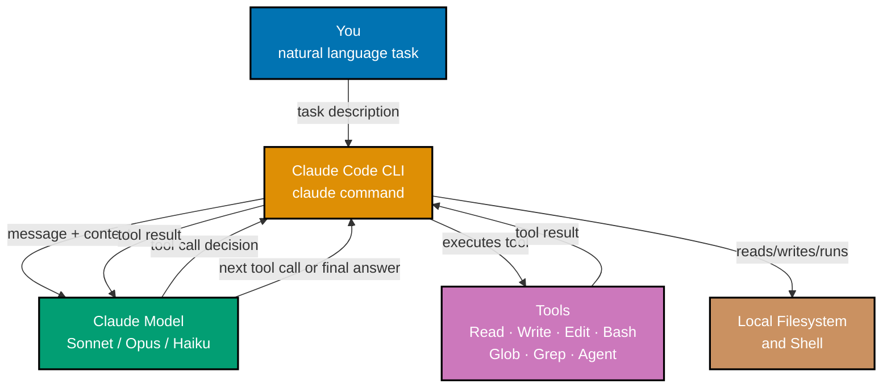
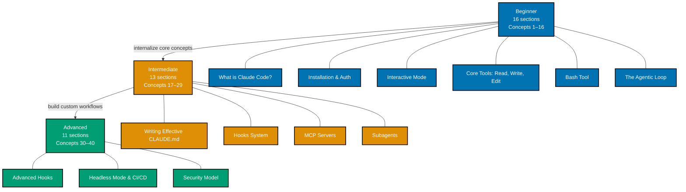

Claude Code by concept teaches Anthropic's official AI coding agent CLI through narrative
explanation paired with annotated configuration and shell examples, organized into three
progressive levels. Each level builds directly on the previous: Beginner establishes
vocabulary and mental models for agentic tool use, Intermediate extends those models into
custom workflows and integrations, and Advanced addresses production concerns, security,
and architectural extensibility.

## What Claude Code Is

Claude Code is not a chat interface you paste code into. It is a CLI process that runs on
your machine, holds a live session with a Claude model, and calls tools — `Read`, `Write`,
`Edit`, `Bash`, `Glob`, `Grep`, `Agent` — autonomously until a task is complete. That
distinction shapes everything about how you learn and use it effectively.

The diagram shows the core agentic loop: you give Claude Code a task, it reasons about
which tool to call, executes that tool against your local filesystem or shell, feeds the
result back to the model, and repeats until the task is finished or it needs more input
from you. There is no copy-paste involved — Claude Code acts directly on your project.

## Prerequisites

Before starting this track you need:

- **Node.js 18 or later** — Claude Code is distributed as an npm package
- **An Anthropic API key** (from console.anthropic.com) or an active Claude.ai Pro/Max subscription — Claude Code uses your account for model access
- Basic comfort with a terminal — you will run `claude` from the command line and read shell output

You do not need to know TypeScript, Python, or any specific language. Claude Code is
language-agnostic.

## Learning Path

## What Each Level Covers

| Level            | Coverage | Sections | Who It Is For                                                           |
| ---------------- | -------- | -------- | ----------------------------------------------------------------------- |
| **Beginner**     | 0–40%    | 16       | Anyone new to Claude Code or agentic CLI tools                          |
| **Intermediate** | 40–75%   | 13       | Engineers ready to customize workflows, hooks, MCP, and subagents       |
| **Advanced**     | 75–95%   | 11       | Engineers running Claude Code in CI/CD or extending it programmatically |

## Full Section Map

### Beginner — 16 Sections

1. [What is Claude Code?](/en/learn/artificial-intelligence/tools/claude-code/by-concept/beginner#1-what-is-claude-code)
   — Agentic CLI vs. AI chat, tool-calling vs. text generation, what "agent" means
2. [Installation and Authentication](/en/learn/artificial-intelligence/tools/claude-code/by-concept/beginner#2-installation-and-authentication)
   — `npm install -g @anthropic-ai/claude-code`, API key vs. subscription auth, first run
3. [Interactive Mode](/en/learn/artificial-intelligence/tools/claude-code/by-concept/beginner#3-interactive-mode)
   — TUI layout, prompt area, tool output, keyboard shortcuts
4. [Core Tools: Read, Write, Edit](/en/learn/artificial-intelligence/tools/claude-code/by-concept/beginner#4-core-tools-read-write-edit)
   — What each does, when Claude Code chooses each, file operation fundamentals
5. [Bash Tool](/en/learn/artificial-intelligence/tools/claude-code/by-concept/beginner#5-bash-tool)
   — Running shell commands, approval flow for dangerous commands, what it can execute
6. [Glob and Grep](/en/learn/artificial-intelligence/tools/claude-code/by-concept/beginner#6-glob-and-grep)
   — Codebase exploration, finding files by pattern, searching symbols in code
7. [Your First Coding Task](/en/learn/artificial-intelligence/tools/claude-code/by-concept/beginner#7-your-first-coding-task)
   — Giving Claude Code a real task, watching the agentic loop, reading tool output
8. [CLAUDE.md: Project Context](/en/learn/artificial-intelligence/tools/claude-code/by-concept/beginner#8-claudemd-project-context)
   — What it is, where it lives, what to put in it, scope hierarchy
9. [The Agentic Loop](/en/learn/artificial-intelligence/tools/claude-code/by-concept/beginner#9-the-agentic-loop)
   — How Claude Code decides which tools to call, when it stops, multi-step reasoning
10. [Slash Commands](/en/learn/artificial-intelligence/tools/claude-code/by-concept/beginner#10-slash-commands)
    — /help, /clear, /compact, /cost, /model — what each does and when to use
11. [One-Shot Mode](/en/learn/artificial-intelligence/tools/claude-code/by-concept/beginner#11-one-shot-mode)
    — `claude "task"`, non-interactive usage, scripting and CI pipelines
12. [Model Selection](/en/learn/artificial-intelligence/tools/claude-code/by-concept/beginner#12-model-selection)
    — sonnet vs. opus vs. haiku, when to use each, `/model` command, `/fast` toggle
13. [Cost Tracking](/en/learn/artificial-intelligence/tools/claude-code/by-concept/beginner#13-cost-tracking)
    — /cost command, token breakdown, managing spend on long sessions
14. [Session Continuity](/en/learn/artificial-intelligence/tools/claude-code/by-concept/beginner#14-session-continuity)
    — `--continue`, `--resume`, how sessions persist to disk
15. [Safety and Permissions](/en/learn/artificial-intelligence/tools/claude-code/by-concept/beginner#15-safety-and-permissions)
    — What Claude Code can/cannot do by default, approval prompts
16. [Plan Mode](/en/learn/artificial-intelligence/tools/claude-code/by-concept/beginner#16-plan-mode)
    — /plan or EnterPlanMode, structured thinking before acting, approving the plan

### Intermediate — 13 Sections

1. [Writing Effective CLAUDE.md](/en/learn/artificial-intelligence/tools/claude-code/by-concept/intermediate#1-writing-effective-claudemd)
   — What to include, @-file imports, anti-patterns, team governance
2. [settings.json: Permissions](/en/learn/artificial-intelligence/tools/claude-code/by-concept/intermediate#2-settingsjson-permissions)
   — allowedTools, disallowedTools, additionalDirectories, auto-approve patterns
3. [Hooks System](/en/learn/artificial-intelligence/tools/claude-code/by-concept/intermediate#3-hooks-system)
   — PreToolUse/PostToolUse/UserPromptSubmit/Stop, JSON stdin format, blocking tool calls
4. [MCP Servers](/en/learn/artificial-intelligence/tools/claude-code/by-concept/intermediate#4-mcp-servers)
   — What MCP is, connecting servers in settings.json, Playwright MCP, common use cases
5. [Subagents (Agent Tool)](/en/learn/artificial-intelligence/tools/claude-code/by-concept/intermediate#5-subagents-agent-tool)
   — Spawning subagents, parallel vs. sequential, context isolation
6. [Custom Slash Commands](/en/learn/artificial-intelligence/tools/claude-code/by-concept/intermediate#6-custom-slash-commands)
   — Creating .claude/commands/\*.md, $ARGUMENTS placeholder, team-shared commands
7. [Skills System](/en/learn/artificial-intelligence/tools/claude-code/by-concept/intermediate#7-skills-system)
   — .claude/skills/<name>/SKILL.md, inline vs. fork context modes
8. [Memory System](/en/learn/artificial-intelligence/tools/claude-code/by-concept/intermediate#8-memory-system)
   — /memory command, MEMORY.md, what to store vs. what to keep in CLAUDE.md
9. [IDE Integration](/en/learn/artificial-intelligence/tools/claude-code/by-concept/intermediate#9-ide-integration)
   — VS Code extension, JetBrains plugin, inline suggestions, command palette
10. [Context Management](/en/learn/artificial-intelligence/tools/claude-code/by-concept/intermediate#10-context-management)
    — /compact mechanics, token budget awareness, what gets compressed
11. [Worktrees](/en/learn/artificial-intelligence/tools/claude-code/by-concept/intermediate#11-worktrees)
    — `claude --worktree <name>`, parallel sessions, git worktree mechanics
12. [Glob and Grep in Depth](/en/learn/artificial-intelligence/tools/claude-code/by-concept/intermediate#12-glob-and-grep-in-depth)
    — Complex patterns, recursive search, combining tools for codebase archaeology
13. [Parallel Subagent Patterns](/en/learn/artificial-intelligence/tools/claude-code/by-concept/intermediate#13-parallel-subagent-patterns)
    — Spawning multiple agents simultaneously, aggregating results, fan-out tasks

### Advanced — 11 Sections

1. [Advanced Hooks](/en/learn/artificial-intelligence/tools/claude-code/by-concept/advanced#1-advanced-hooks)
   — Complex hook scripts, conditional blocking, modifying tool input, CI integration
2. [Building Custom MCP Servers](/en/learn/artificial-intelligence/tools/claude-code/by-concept/advanced#2-building-custom-mcp-servers)
   — MCP protocol, tool definitions, serving Claude Code new capabilities
3. [Advanced CLAUDE.md Patterns](/en/learn/artificial-intelligence/tools/claude-code/by-concept/advanced#3-advanced-claudemd-patterns)
   — Conditional imports, role-specific instructions, team governance via CLAUDE.md
4. [Subagent Orchestration at Scale](/en/learn/artificial-intelligence/tools/claude-code/by-concept/advanced#4-subagent-orchestration-at-scale)
   — Orchestrator + specialist pattern, isolation modes, worktree subagents
5. [Security Model](/en/learn/artificial-intelligence/tools/claude-code/by-concept/advanced#5-security-model)
   — Permissions architecture, sensitive file handling, audit logging via hooks
6. [Headless Mode and CI/CD](/en/learn/artificial-intelligence/tools/claude-code/by-concept/advanced#6-headless-mode-and-cicd)
   — `claude --headless`, GitHub Actions integration, structured output
7. [Performance Optimization](/en/learn/artificial-intelligence/tools/claude-code/by-concept/advanced#7-performance-optimization)
   — Selective context loading, targeted reads, reducing tool calls, prompt caching
8. [Agent SDK](/en/learn/artificial-intelligence/tools/claude-code/by-concept/advanced#8-agent-sdk)
   — Building custom agents on the Claude Code SDK, tool registration, session management
9. [Claude Code as MCP Server](/en/learn/artificial-intelligence/tools/claude-code/by-concept/advanced#9-claude-code-as-mcp-server)
   — Exposing Claude Code capabilities to other tools, integration patterns
10. [Troubleshooting](/en/learn/artificial-intelligence/tools/claude-code/by-concept/advanced#10-troubleshooting)
    — Common errors, permission denied, context overflow, tool failures, diagnostics
11. [Best Practices](/en/learn/artificial-intelligence/tools/claude-code/by-concept/advanced#11-best-practices)
    — CLAUDE.md governance, team conventions, cost optimization, task decomposition

## How This Track Relates to By Example

The [By Example](/en/learn/artificial-intelligence/tools/claude-code/by-example/) track
teaches Claude Code through short, densely annotated terminal sessions — you see exactly
what command to type and what output to expect. This By Concept track teaches the same
tool through narrative explanation and diagrams first, then annotated examples that
reinforce the concept. Both tracks cover the same capabilities at equivalent depth; they
differ only in pedagogical approach.

If you learn best by doing and then reading: start with By Example.
If you learn best by understanding a model first and then practicing: start here.

## How Each Section Is Structured

Every section in this track follows a consistent six-part format:

1. **Concept title and introduction** — what the concept is, why it matters, how it
   connects to what came before (2–3 sentences)
2. **Diagram** — a Mermaid flowchart or architecture diagram when the concept involves
   multiple components, data flows, or state transitions; omitted for trivial operations
3. **Narrative explanation** — how the concept works, when to use it, trade-offs, best
   practices, and pitfalls (3–10 paragraphs)
4. **Annotated examples** — shell sessions or configuration files with dense inline
   annotations using `# =>` notation to document state, output, and reasoning at each step
5. **Key Takeaway** — the single most important insight from the section (1–2 sentences)
6. **Why It Matters** — how the concept connects to a real production concern such as cost,
   reliability, security, or team adoption (50–100 words)
