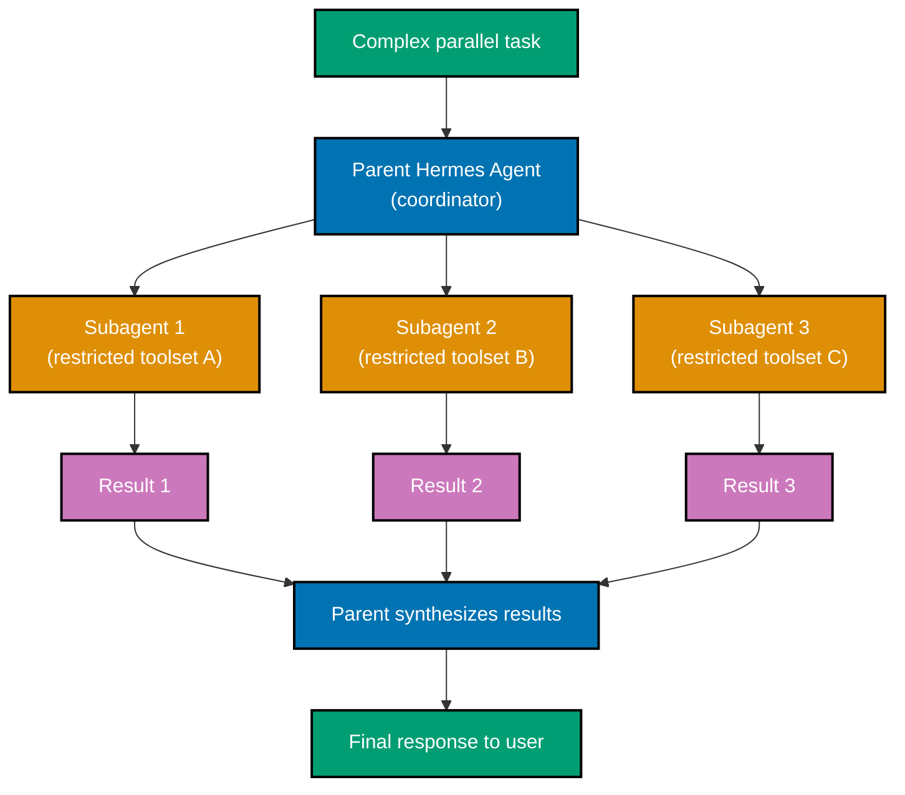
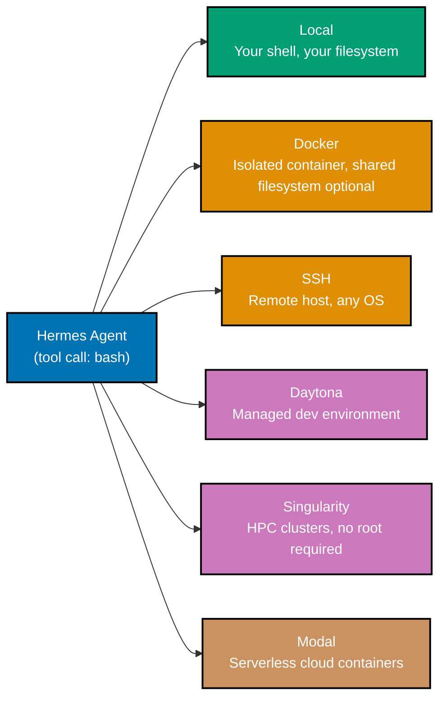

## Section 17: Skills System Deep Dive

The skills system is the mechanism that makes Hermes Agent's learning loop concrete and
inspectable. A skill is a YAML document that encodes a procedural pattern — what to do,
in what order, with what caveats — derived from observed experience. Understanding the
creation algorithm, the improvement loop, and the YAML schema gives you precise control
over how your agent accumulates and applies knowledge.

Skill creation begins with the trigger conditions described in Beginner Section 2. When a
trigger fires, Hermes does not immediately write a skill. Instead, it runs a drafting phase:
it reviews the session segment that triggered the condition, extracts the sequence of steps
that worked, identifies the decision points and failure paths, and produces a draft skill
YAML. The draft appears in the TUI for your review. You can approve it, edit it inline, or
reject it. Only approved drafts are saved.

The skill YAML schema has five required fields and several optional ones:

```yaml
# ~/.hermes/skills/deploy-ayokoding.yml
# Auto-generated skill — created 2026-05-22 after 7-tool deployment session

name: deploy-ayokoding # => Unique identifier; used in /skills listing
level:
  frequent # => Disclosure level: always | frequent | rarely
  # =>   always: injected in full every session
  # =>   frequent: injected when name appears in context
  # =>   rarely: one-line summary only; full detail on demand
summary:
  "Deploy ayokoding-web to Vercel via prod-ayokoding-web branch"
  # => One-sentence description for summary mode
created: 2026-05-10T14:23:00+07:00 # => ISO 8601 timestamp; set at creation, never changed
updated: 2026-05-22T09:11:00+07:00 # => Updated each time the skill is refined

# Optional: tags help with skill retrieval when name alone is ambiguous
tags:
  - deploy # => Tag used for grouping in /skills output
  - ayokoding-web # => Tag used in search and FTS5 queries
  - vercel # => Platform tag

steps:
  - action: run # => action type: run | verify | note | branch
    command: nx build ayokoding-web # => Exact command to execute
    note:
      "Must pass before pushing — TypeScript errors will fail Vercel build"
      # => Inline note captures hard-won context
    on_failure:
      stop # => Stop execution if this step fails (default: stop)
      # => Other options: retry(n) | skip | branch

  - action: run
    command: git push origin main:prod-ayokoding-web --force
    note: "Force push is safe — prod-ayokoding-web is a deployment-only branch"

  - action: verify
    description:
      "Vercel dashboard shows green build status"
      # => verify steps are not commands; they are reminders
      # => Hermes presents them as confirmation prompts
    wait_seconds: 120 # => Suggest waiting 2 minutes before checking

# Optional: conditions under which this skill should NOT be applied
preconditions:
  - "Must be on main branch" # => Hermes checks this before applying the skill
  - "Nx build must be clean"

# Optional: history of refinements (append-only log)
refinements:
  - date: 2026-05-15T10:00:00+07:00
    change: "Added nx build step after failed deployment due to TypeScript error"
  - date: 2026-05-22T09:11:00+07:00
    change: "Added 120s wait in verify step based on observed Vercel build duration"
```

The improvement loop works by appending refinements to the `refinements` array whenever
Hermes applies the skill and observes an outcome that differs from expectation. If a step
fails in a way the skill did not anticipate, a new note or `on_failure` branch is added.
If a step succeeds faster than expected, a redundant verification step may be removed.

The refinements array provides a complete audit trail. You can see exactly what changed and
when, which is valuable when debugging unexpected agent behavior.

**Key Takeaway:** Skills are versioned YAML documents with an append-only refinement log;
Hermes drafts them from session experience, presents them for your approval, and refines
them automatically as new evidence accumulates.

**Why It Matters:** In teams, a skill created by one engineer's deployment experience is a
permanent asset. The refinement log makes skills auditable — you can understand not just
what the skill does but why it evolved to do it that way.

---

## Section 18: Session Search (FTS5)

Hermes Agent stores every session in a SQLite database using FTS5 (Full-Text Search version
5), SQLite's built-in full-text search extension. FTS5 indexes the complete content of every
conversation — your messages, the agent's responses, and tool output — enabling fast keyword
search across your entire session history.

Session search is available through the `/search` slash command in the TUI and through the
`hermes search` CLI command outside the TUI.

```bash
# Search sessions from within the TUI
/search --query "TypeScript error deploy"
# => Finds all sessions containing those terms
# => Returns ranked list of sessions with matching excerpts

# Search from the command line (outside TUI)
hermes search --query "Vercel build failed"
# => Same FTS5 index, same results, printed to stdout

# FTS5 supports boolean operators and phrase queries
hermes search --query '"nx build" AND deploy'
#                       ^^^^^^^^^^^           => Phrase search: exact phrase "nx build"
#                                   ^^^ ^^^^^ => Boolean AND: both terms must appear
# => Returns sessions containing the exact phrase "nx build" and also the word "deploy"

hermes search --query 'error OR failure'     # => OR: sessions containing either term
hermes search --query 'deploy NOT staging'   # => NOT: deploy but not staging
hermes search --query 'deploy*'              # => Prefix: deploy, deployment, deploying, etc.

# Filter by date range
hermes search --query "deploy" --since 2026-05-01 --until 2026-05-22
# => Only sessions within this date range

# Filter by cost (useful for auditing expensive sessions)
hermes search --query "" --min-cost 0.50
# => Sessions with total cost > $0.50
```

The FTS5 index is updated after every session ends. Sessions are never deleted by default;
the database grows continuously. For long-running installations, periodic archival is
advisable.

```bash
# Retrieve a full session by its ID
hermes session --id ses_20260522_143012_a7b3
# => Prints the complete session transcript to stdout

# List recent sessions without searching
hermes session --list --limit 10
# => Shows 10 most recent sessions with ID, date, cost, and first message

# Export a session as a markdown file
hermes session --id ses_20260522_143012_a7b3 --export --format markdown
# => Writes session transcript to hermes-session-20260522.md
```

Within a running Hermes session, the agent itself can search past sessions to retrieve
relevant context. If you ask "how did I deploy ayokoding-web last time?", Hermes uses the
`sessions` toolset to search for "deploy ayokoding-web" and retrieves the relevant session
segment before responding.

**Key Takeaway:** FTS5 session search lets you retrieve any past conversation segment using
boolean keyword queries; Hermes also uses session search internally to answer questions
about your own history.

**Why It Matters:** Institutional knowledge stored in chat sessions is normally lost between
sessions. FTS5 search makes every past session a retrievable resource — the equivalent of
a searchable notebook that grows automatically.

---

## Section 19: Subagent Delegation

Subagent delegation lets Hermes Agent spawn isolated child agents to handle parallel
workstreams. Each subagent runs in its own Python process with its own restricted toolset,
its own context, and its own conversation thread. The parent agent coordinates results from
multiple subagents and synthesizes a final response.

Delegation is appropriate when a task decomposes naturally into independent parallel
workstreams — for example, auditing three microservices simultaneously, scraping multiple
websites in parallel, or running different experimental configurations of the same pipeline.



The `delegate` tool is available in the `delegation` toolset. The parent agent calls it
with a task description, a toolset restriction list, and an optional timeout.

```yaml
# Example delegate tool call (as Hermes would construct it internally)
# This is the tool schema — you do not write this; Hermes generates it

tool: delegate
parameters:
  task:
    "Audit the authentication module: list all endpoints, check for missing auth guards,
    report any SQL queries without parameterization"
    # => Natural language task for the subagent
  toolset:
    - terminal # => Subagent can read files and run safe commands
    # browser is NOT listed              # => Subagent cannot browse the web (restricted scope)
    # delegation is NOT listed           # => Subagents cannot spawn further subagents by default
  timeout_seconds: 300 # => Kill subagent if it has not finished in 5 minutes
  model:
    cheap_model # => Use cheap model for subagent to reduce cost
    # => Override with primary if the task requires reasoning
```

Up to three subagents run concurrently by default. This limit is configurable:

```yaml
# ~/.hermes/config.yml — delegation configuration

delegation:
  max_concurrent:
    3 # => Maximum subagents running simultaneously
    # => Increase with caution — each subagent uses API quota
  default_timeout_seconds: 300 # => Kill unresponsive subagents after 5 minutes
  allow_nested:
    false # => Prevent subagents from spawning their own subagents
    # => Set true only if you have a specific reason
  result_format:
    structured # => How subagent results are returned to parent
    # =>   structured: JSON with task, result, duration fields
    # =>   prose: plain text summary (cheaper to process)
```

**Key Takeaway:** Subagent delegation spawns isolated child agents with restricted toolsets
for parallel workstreams; the parent coordinates up to three concurrent subagents by default
and synthesizes their results.

**Why It Matters:** Parallelism is the primary way to reduce wall-clock time on
decomposable tasks. Three subagents auditing three services simultaneously takes the same
time as auditing one — the difference is significant for teams waiting on agent-assisted
code review or multi-service deployments.

---

## Section 20: Messaging Platform Integration

The messaging gateway supports 20+ platforms through a unified configuration schema. Each
platform has platform-specific required fields (token, webhook URL, channel ID) and shares
common optional fields (allowed users, pairing requirement, approval mode). This section
covers the four most commonly configured platforms: Telegram, Discord, Slack, and WhatsApp.

```yaml
# ~/.hermes/config.yml — messaging platform configuration

gateway:
  enabled: true

  platforms:
    # --- Telegram ---
    telegram:
      enabled: true
      token: ${TELEGRAM_BOT_TOKEN} # => Bot token from @BotFather (/newbot command)
      allowed_users:
        - 123456789 # => Your Telegram user ID (from @userinfobot)
      pairing_required: true # => Require /pair DM before accepting tasks
      command_approval: interactive # => Approval prompts sent back via Telegram message

    # --- Discord ---
    discord:
      enabled: false # => Set true to enable
      token: ${DISCORD_BOT_TOKEN} # => Bot token from Discord Developer Portal
      guild_id: "987654321012345678" # => Server (guild) ID where bot operates
      channel_ids: # => Restrict to specific channels by ID
        - "111222333444555666" # => Bot only responds in this channel
      command_approval: interactive # => Approval prompts sent as Discord DM to invoker

    # --- Slack ---
    slack:
      enabled: false
      app_token: ${SLACK_APP_TOKEN} # => App-level token (xapp-...) from Slack App config
      bot_token: ${SLACK_BOT_TOKEN} # => Bot token (xoxb-...) from Slack App config
      allowed_channels:
        - "C01ABCDEFGH" # => Channel IDs (not names) allowed to invoke Hermes
      signing_secret:
        ${SLACK_SIGNING_SECRET}
        # => Used to verify Slack request authenticity

    # --- WhatsApp (via Twilio) ---
    whatsapp:
      enabled: false
      provider: twilio # => WhatsApp integration requires a Twilio account
      account_sid: ${TWILIO_ACCOUNT_SID}
      auth_token: ${TWILIO_AUTH_TOKEN}
      from_number:
        "whatsapp:+14155238886"
        # => Twilio WhatsApp sandbox number (testing)
        # => Replace with approved number for production
      allowed_numbers:
        - "whatsapp:+62812345678" # => Only respond to this WhatsApp number
```

Each platform delivers messages to Hermes through a different mechanism. Telegram uses
long-polling by default; Discord and Slack use WebSocket connections; WhatsApp via Twilio
uses a webhook. The gateway handles these differences internally — from your perspective,
all platforms behave the same way.

Platform-specific limitations to know: Discord bots cannot initiate conversations (they
only respond). Telegram bots cannot read messages in groups unless explicitly added and
granted admin rights. Slack bots require workspace admin approval to install. WhatsApp
via Twilio requires a business account for production volumes beyond the sandbox limit.

**Key Takeaway:** Each platform requires a token or app credential from its developer
portal; Hermes maps the platform-specific delivery mechanism to a unified message handler,
so your skills and tools work identically regardless of which platform sent the task.

**Why It Matters:** Engineering teams communicate across Slack, Discord, and Telegram
simultaneously. An agent that integrates with all three without platform-specific code
allows you to deploy Hermes once and reach all team members where they already are.

---

## Section 21: Terminal Backends

The terminal backend controls where Hermes executes shell commands. Changing the backend
changes the execution environment without changing any other configuration. The six backends
span a range from local shell to fully managed cloud containers.



```yaml
# ~/.hermes/config.yml — terminal backend configuration

terminal:
  backend: local # => Options: local | docker | ssh | daytona | singularity | modal


  # --- local (default) ---
  # No additional configuration needed
  # => Commands run in a subprocess on the current machine
  # => Working directory defaults to the directory where hermes was started

  # --- docker ---
  # docker:
  #   image: python:3.12-slim            # => Container image to use for execution
  #   volumes:
  #     - "${HOME}/projects:/workspace"  # => Mount host directory into container
  #   network: none                      # => Disable network access in container (air-gap)
  #                                       # => Options: none | bridge | host
  #   remove_after_session: true         # => Delete container when session ends
  #   resource_limits:
  #     memory: 2g                       # => Maximum RAM the container may use
  #     cpus: 1.0                        # => Maximum CPU cores

  # --- ssh ---
  # ssh:
  #   host: my-server.example.com
  #   user: ubuntu
  #   key_path: ~/.ssh/id_ed25519        # => Private key for authentication
  #   port: 22                           # => Default SSH port

  # --- modal (serverless cloud) ---
  # modal:
  #   token_id: ${MODAL_TOKEN_ID}
  #   token_secret: ${MODAL_TOKEN_SECRET}
  #   image: modal/python:3.12           # => Modal-hosted image
  #   timeout_seconds: 600               # => Container idle timeout
```

Backend selection guidance:

- **local**: Default for exploratory work on your own machine. No isolation.
- **docker**: Use when you want isolation from your local environment — testing untrusted
  scripts, working with dependencies that conflict with your local setup.
- **ssh**: Use when the relevant filesystem and services are on a remote server — server
  administration, remote debugging, infrastructure work.
- **daytona**: Use when your team standardizes development environments via Daytona — all
  team members get identical environments with Hermes attached.
- **singularity**: Use on HPC clusters where Docker is not available and root access is
  prohibited.
- **modal**: Use for serverless burst workloads where you want the execution environment
  provisioned on demand and billed per second.

**Key Takeaway:** The terminal backend determines where commands execute — local, Docker
container, SSH remote host, or cloud container — and switching backends requires only a
one-line change in `config.yml`.

**Why It Matters:** The ability to run the same Hermes configuration against a remote server
or a sandboxed container without code changes is a significant operational advantage.
Infrastructure teams can develop locally and deploy against production infrastructure by
switching the backend.

---

## Section 22: Browser Automation Tools

The `browser` toolset gives Hermes Agent programmatic control over a web browser via
Playwright. This enables web scraping, UI testing, form filling, and interaction with
web applications that do not expose an API. Browser automation runs in a headed or headless
Chromium instance managed by Hermes.

```yaml
# ~/.hermes/config.yml — browser toolset configuration

tools:
  enabled:
    - browser # => Add to enable Playwright-based browser automation

browser:
  headless:
    true # => Run Chromium without visible UI (default: true)
    # => Set false to watch the browser interact visually
  viewport:
    width: 1280 # => Browser window width in pixels
    height: 720 # => Browser window height in pixels
  timeout_ms: 30000 # => Default timeout for element waits (30 seconds)
  screenshots_dir: ~/.hermes/screenshots # => Where screenshots are saved for vision review
```

The browser toolset exposes tools the LLM uses to control the browser. A typical web
scraping interaction:

```bash
# Example session: scrape a paginated table from a web application

# User input to Hermes:
# "Fetch all rows from the pricing table at example.com/pricing, save to pricing.csv"

# Hermes constructs and executes the following tool call sequence:

# Tool 1: Navigate to the target URL
# [Tool: browser.navigate]
# url: https://example.com/pricing
# => Page loaded, title: "Pricing — Example"

# Tool 2: Extract the table content
# [Tool: browser.extract]
# selector: table.pricing-table
# format: text
# => <table data with all visible rows>

# Tool 3: Check for pagination
# [Tool: browser.extract]
# selector: .pagination .next
# => Element found: "Next page >"

# Tool 4: Click next page and extract again (repeats until no next page)
# [Tool: browser.click]
# selector: .pagination .next
# wait_for: networkidle
# => Page 2 loaded

# Tool 5: Write aggregated data to CSV
# [Tool: terminal.write]
# path: pricing.csv
# content: <combined CSV rows from all pages>
# => File written: pricing.csv (47 rows)
```

Vision tools complement browser automation. After taking a screenshot, Hermes can use the
`vision` toolset to analyze the image — identifying UI elements, reading text in images,
or verifying visual state that is not accessible via DOM extraction.

```yaml
# Vision toolset — requires browser toolset to be enabled for screenshot capture
tools:
  enabled:
    - browser
    - vision # => Analyze screenshots with vision model
```

**Key Takeaway:** The browser toolset provides Playwright-based browser control; the vision
toolset analyzes screenshots — together they enable web scraping and UI verification for
applications that do not expose a programmatic API.

**Why It Matters:** Many internal tools, legacy applications, and third-party services lack
APIs. Browser automation is the only way to automate interaction with them. Teams that
previously handled these tasks with fragile Python Selenium scripts can delegate them to
Hermes with more reliable error handling and self-correcting behavior.

---

## Section 23: Code Execution Toolset

The `code` toolset lets Hermes Agent execute code directly — Python, JavaScript, and shell
scripts — in a sandboxed environment. Unlike the `terminal` toolset's `bash` tool, which
runs arbitrary shell commands, the `code` toolset is optimized for running self-contained
code snippets and capturing structured output.

```yaml
# ~/.hermes/config.yml — code execution toolset configuration

tools:
  enabled:
    - code # => Enable code execution toolset

code:
  sandbox:
    docker # => Isolation mode: none | docker | subprocess
    # =>   none: runs in current process (fastest, unsafe)
    # =>   subprocess: isolated subprocess (safer)
    # =>   docker: isolated container (safest, requires Docker)
  docker_image: python:3.12-slim # => Image for docker sandbox (ignored if sandbox != docker)
  timeout_seconds: 60 # => Kill code execution if it exceeds 60 seconds
  allowed_languages:
    - python # => Only Python execution enabled
    - javascript # => Node.js execution enabled
    # - shell                            # => Shell script execution (disabled; use terminal instead)
  network_access:
    false # => Prevent code from making network requests
    # => Important for untrusted code
```

A typical code execution interaction:

```bash
# User input:
# "Analyze the CSV file data.csv: compute mean, median, and standard deviation for column 'revenue'"

# Hermes generates and executes a Python snippet:
# [Tool: code.execute]
# language: python
# code: |
#   import csv, statistics
#   revenues = []
#   with open('/workspace/data.csv') as f:     # => /workspace maps to mounted local directory
#       reader = csv.DictReader(f)
#       for row in reader:
#           revenues.append(float(row['revenue']))
#   print(f"Count:  {len(revenues)}")
#   print(f"Mean:   {statistics.mean(revenues):.2f}")
#   print(f"Median: {statistics.median(revenues):.2f}")
#   print(f"StdDev: {statistics.stdev(revenues):.2f}")

# => Output:
# Count:  1,247
# Mean:   48,392.17
# Median: 31,500.00
# StdDev: 52,841.33

# Hermes returns the output formatted in the response:
# Revenue analysis (1,247 rows):
# - Mean: $48,392
# - Median: $31,500 (significantly lower than mean — right-skewed distribution)
# - Standard deviation: $52,841 (high variance; outliers likely present)
```

The docker sandbox mounts the current working directory at `/workspace` inside the
container, giving code access to local files without giving it access to the broader
filesystem. Network access is disabled by default in docker mode, preventing code from
exfiltrating data or calling external services.

**Key Takeaway:** The code toolset runs Python and JavaScript in a sandboxed environment
with file access via `/workspace` and network access disabled by default.

**Why It Matters:** Data analysis tasks — parsing CSVs, running statistical functions,
transforming formats — are a common engineering need that traditionally requires switching
to a Jupyter notebook or writing a throwaway script. Hermes can do these inline, returning
results directly in the conversation.

---

## Section 24: Cron Scheduling

Hermes Agent includes a built-in cron scheduler that lets you define recurring tasks
expressed in standard cron syntax. Scheduled tasks run whether or not you have an active
Hermes session — they execute against the gateway or a background Hermes process.

```yaml
# ~/.hermes/config.yml — cron scheduling configuration

cron:
  enabled: true # => Enable the cron scheduler
  timezone: Asia/Jakarta # => All cron expressions interpreted in this timezone
  jobs:
    - name: daily-cost-report # => Unique job identifier
      schedule:
        "0 9 * * *" # => Standard cron: minute hour day month weekday
        # => "0 9 * * *" = 9:00 AM every day
      task: >
        Generate a daily cost report: run `hermes --cost-report --days 1` and send
        the output to the #hermes-cost Slack channel
                                          # => Natural language task; Hermes interprets this
      toolsets:
        - terminal # => Only terminal toolset available for this job
        - messaging # => Messaging toolset to send the Slack message

    - name: weekly-skill-review
      schedule: "0 10 * * 1" # => 10:00 AM every Monday
      task: >
        Review skills created in the last 7 days: list new skills, check for duplicates
        or skills that could be merged, and prepare a summary
      toolsets:
        - skills
        - terminal

    - name: hourly-health-check
      schedule: "0 * * * *" # => Top of every hour
      task: "Check disk usage on the server, alert if any mount exceeds 85%"
      toolsets:
        - terminal
        - messaging
      on_failure:
        notify # => Send notification if the job fails
        # => Options: notify | retry(n) | skip
```

Cron jobs are managed through the `cron` toolset at runtime:

```bash
# List all configured cron jobs and their next run time
/tools cron.list
# => Output:
# JOB                  SCHEDULE        NEXT RUN                  LAST RUN
# daily-cost-report    0 9 * * *       2026-05-23 09:00:00 WIB   2026-05-22 09:00:04 WIB
# weekly-skill-review  0 10 * * 1      2026-05-25 10:00:00 WIB   2026-05-18 10:00:11 WIB
# hourly-health-check  0 * * * *       2026-05-22 15:00:00 WIB   2026-05-22 14:00:03 WIB

# Trigger a job immediately without waiting for the schedule
/tools cron.run --job daily-cost-report

# Disable a job without removing it from config
/tools cron.disable --job hourly-health-check

# View the log of recent job executions
/tools cron.log --job daily-cost-report --limit 5
```

**Key Takeaway:** Hermes's built-in cron scheduler runs recurring tasks expressed in
standard cron syntax, using natural language task descriptions that Hermes interprets at
execution time with restricted toolsets.

**Why It Matters:** Operational tasks — cost reports, health checks, log digests — have
predictable schedules. Moving these from custom cron scripts or GitHub Actions workflows
into Hermes reduces the number of systems to maintain and allows the tasks to benefit from
Hermes's skill and memory systems automatically.

---

## Section 25: Honcho Dialectic Integration

Honcho is an open-source user modeling service that Hermes integrates with to build a
deeper model of your preferences, communication style, and expertise over time. While
`USER.md` stores observations Hermes makes directly, Honcho enables a dialectic process:
a structured inquiry that actively explores and refines its model of you through targeted
questions rather than passive observation.

The dialectic process runs periodically in the background. Honcho identifies aspects of the
user model that have low confidence — areas where observed behavior is ambiguous or
contradictory — and generates targeted questions that Hermes asks you naturally within
conversation. Your answers update the Honcho model, which then influences how Hermes
calibrates response length, technical depth, formality, and tool selection.

```yaml
# ~/.hermes/config.yml — Honcho dialectic integration configuration

honcho:
  enabled: true # => Enable Honcho user modeling
  api_url: https://api.honcho.dev # => Honcho service endpoint
  api_key: ${HONCHO_API_KEY} # => API key from honcho.dev
  app_id: hermes-agent # => Application identifier in Honcho

  dialectic:
    enabled: true # => Enable active dialectic questioning
    frequency:
      low # => How often Honcho asks clarifying questions
      # =>   low: rarely, only for high-uncertainty areas
      # =>   medium: occasionally during natural pauses
      # =>   high: frequently (can feel intrusive)
    max_questions_per_session: 2 # => Never ask more than 2 dialectic questions per session

  sync_to_user_md:
    true # => Write Honcho insights back to USER.md
    # => Keeps USER.md authoritative even without Honcho
```

The `USER.md` file reflects both direct Hermes observations and Honcho-derived insights.
Honcho-sourced entries are tagged so you can distinguish them.

```bash
# Example USER.md with Honcho-sourced entries

## Communication (Honcho-derived, confidence: high)
Response length: concise (confirmed by dialectic question 2026-05-10)
Technical depth: expert for TypeScript; intermediate for DevOps
Formality: informal with contractions preferred

## Expertise (direct observation)
Corrected Hermes explanations about: React hooks (2x), npm workspaces (1x)
# => Hermes inferred advanced React knowledge from the corrections

## Workflow Preferences (Honcho-derived, confidence: medium)
Code review style: focus on logic errors before style issues
Test preference: unit tests before writing implementation (TDD)
```

To reset the Honcho user profile and start fresh — useful when your role or context changes
significantly:

```bash
hermes honcho reset
# => Clears the Honcho-side model for your user ID
# => Clears Honcho-sourced entries in USER.md (preserves direct-observation entries)
# => Honcho begins rebuilding the model from the next session
```

**Key Takeaway:** Honcho adds active dialectic questioning to Hermes's user modeling —
targeted questions that refine a probabilistic model of your preferences, calibrating
response style and tool selection more precisely than passive observation alone.

**Why It Matters:** An agent that adapts to individual communication styles and expertise
levels reduces correction overhead. A senior engineer and a junior engineer on the same team
using the same Hermes instance receive responses calibrated to their own context.

---

## Section 26: Mixture of Agents

Mixture of Agents (MoA) is a multi-model orchestration pattern where several "reference"
model instances process the same input in parallel and their outputs are passed to an
"aggregator" model that synthesizes a final response. Hermes implements MoA as a configurable
mode for tasks where a single model's perspective is insufficient.

MoA is appropriate for tasks requiring diverse reasoning perspectives — complex code reviews,
security threat analysis, architectural trade-off evaluation — where the quality gain from
multiple independent analyses outweighs the cost of running several model calls.

```yaml
# ~/.hermes/config.yml — Mixture of Agents configuration

llm:
  primary: claude-3-7-sonnet-20250219 # => Used as aggregator in MoA mode
  cheap_model: claude-haiku-4-5

  moa:
    enabled: false # => Disabled by default; enable explicitly per task
    reference_models: # => Models run in parallel on the same input
      - anthropic/claude-3-7-sonnet-20250219
        # => Claude as reference model 1
      - openai/gpt-4o # => GPT-4o as reference model 2 (via OpenRouter)
      - google/gemini-2.5-pro # => Gemini as reference model 3 (via OpenRouter)
    aggregator_model:
      claude-3-7-sonnet-20250219
      # => Aggregator receives all reference outputs and synthesizes
    reference_temperature: 0.7 # => Temperature for reference models (diversity in responses)
    aggregator_temperature: 0.3 # => Temperature for aggregator (conservative synthesis)
```

To invoke MoA for a specific task without enabling it globally:

```bash
# Activate MoA for the next message only
/moa on
# => Hermes uses MoA mode for the next response, then returns to normal routing

# Example task where MoA adds value:
# "Review this authentication module for security vulnerabilities"
# => Reference model 1 (Claude): finds JWT expiry not enforced
# => Reference model 2 (GPT-4o): finds missing rate limiting on /login
# => Reference model 3 (Gemini): finds SQL query without parameterization
# => Aggregator synthesizes: ranked list of all three findings with severity assessment

# The MoA approach surfaced three different vulnerability classes
# that a single model call might have missed or underweighted
```

The cost of MoA is proportional to the number of reference models. Three reference models
plus an aggregator means four model calls per response. Use MoA selectively for high-stakes
decisions where the quality gain justifies the cost multiplier.

**Key Takeaway:** Mixture of Agents runs multiple reference models in parallel on the same
input and synthesizes their outputs through an aggregator — use it selectively for
high-stakes tasks where diverse reasoning perspectives improve quality.

**Why It Matters:** Security reviews, architecture decisions, and complex debugging benefit
from multiple independent analyses. MoA makes ensemble reasoning accessible without writing
orchestration code — it is one configuration flag and one slash command.

---

## Section 27: MCP Client Integration

The Model Context Protocol (MCP) is an open standard for connecting AI agents to external
tools and data sources through a structured RPC interface. Hermes Agent acts as an MCP
client, connecting to external MCP servers and treating their tools as first-class Hermes
tools available to the LLM.

Connecting an MCP server exposes all of the server's tools to Hermes's LLM under the `mcp`
toolset namespace. This allows you to extend Hermes with community-built or proprietary
tool servers without modifying Hermes itself.

```yaml
# ~/.hermes/config.yml — MCP client configuration

tools:
  enabled:
    - mcp # => Enable the MCP toolset (client mode)

mcp:
  servers:
    - name: github # => Display name in /tools listing
      command: npx # => Command to start the MCP server process
      args:
        - "-y"
        - "@modelcontextprotocol/server-github"
          # => MCP server package; npx downloads if not cached
      env:
        GITHUB_PERSONAL_ACCESS_TOKEN:
          ${GITHUB_TOKEN}
          # => Environment variable passed to server process
      transport: stdio # => Communication via stdin/stdout (default for local servers)

    - name: postgres # => Database MCP server
      command: npx
      args:
        - "-y"
        - "@modelcontextprotocol/server-postgres"
        - postgresql://localhost:5432/mydb
      transport: stdio

    - name: remote-analytics # => Remote MCP server over HTTP+SSE
      url:
        https://analytics.example.com/mcp
        # => HTTP-based transport for remote servers
      transport: sse # => Server-Sent Events transport (for remote servers)
      api_key: ${ANALYTICS_MCP_API_KEY}
```

After configuring MCP servers, their tools appear in `/tools` output under the server name:

```bash
/tools
# => Standard Hermes tools:
#    terminal.bash, terminal.read, terminal.write ...
#    web.search, web.fetch ...
#
# => MCP server: github
#    github.list_repos, github.create_issue, github.get_pull_request ...
#
# => MCP server: postgres
#    postgres.query, postgres.list_tables, postgres.describe_table ...
```

When evaluating a community MCP server before connecting it, review its repository for:
the tool definitions it exposes, what network access it requires, whether it persists data,
and whether its supply chain (npm dependencies) is audited. An MCP server with broad
filesystem or network access can be a significant attack surface.

**Key Takeaway:** MCP client integration connects external tool servers to Hermes, exposing
their tools to the LLM under the `mcp` namespace — configure with `command`/`args` for
local servers or `url`/`transport: sse` for remote servers.

**Why It Matters:** The MCP ecosystem is growing rapidly. Connecting Hermes to community
MCP servers for databases, version control, monitoring, and infrastructure management
means you can extend the agent's capabilities without writing custom tools.

---

## Section 28: MCP Server Mode

In addition to acting as an MCP client, Hermes Agent can serve as an MCP server — exposing
its own tool capabilities through the MCP protocol so that other MCP-compatible clients
(Claude Code, other AI agents, custom applications) can invoke Hermes tools remotely.

MCP server mode runs alongside the CLI or as a standalone process. When enabled, Hermes
advertises its enabled toolsets as MCP tool definitions and accepts incoming tool calls
from authorized clients.

```yaml
# ~/.hermes/config.yml — MCP server mode configuration

mcp_server:
  enabled: false # => Set true to enable server mode
  transport:
    stdio # => stdio: connect via subprocess stdin/stdout
    # =>   (for single-client integrations like Claude Code)
    # => sse: HTTP+SSE for multi-client remote access
  port: 8765 # => Port for SSE transport (ignored for stdio)
  exposed_toolsets: # => Only expose these toolsets to MCP clients
    - terminal # => Expose terminal tools (bash, read, write)
    - web # => Expose web tools (search, fetch)
    # memory is NOT listed               # => Memory tools not exposed (protect sensitive data)
    # delegation is NOT listed           # => Delegation not exposed (prevent recursive loops)
  auth:
    required: true # => Require authentication for SSE transport
    tokens:
      - ${MCP_CLIENT_TOKEN_1} # => Valid client tokens (bearer tokens)
      - ${MCP_CLIENT_TOKEN_2}
```

To use Hermes as an MCP server from Claude Code:

```json
// ~/.claude/mcp_servers.json (Claude Code configuration)
{
  "hermes": {
    "command": "hermes",
    "args": ["--mcp-server"],
    "transport": "stdio"
  }
}
```

```bash
# Start Hermes in MCP server mode (stdio transport)
# => Claude Code launches this as a subprocess when you reference Hermes tools
hermes --mcp-server

# Start Hermes as a standalone MCP server (SSE transport)
# => Accepts connections from multiple clients over HTTP
hermes --mcp-server --transport sse --port 8765
```

MCP server mode is particularly useful in two scenarios: exposing Hermes's terminal and
web capabilities to Claude Code (which has fewer default tools), and building pipelines
where a separate orchestrating agent delegates specific tool calls to Hermes.

**Key Takeaway:** Hermes MCP server mode exposes a configurable subset of Hermes tools over
stdio or SSE transport, allowing other MCP-compatible AI agents to invoke Hermes capabilities
as remote tool calls.

**Why It Matters:** MCP server mode turns Hermes into infrastructure — a capability provider
that other agents can use. Teams building multi-agent pipelines can specialize Hermes
instances as tool servers and plug them into any MCP-compatible orchestrator.

---

## Section 29: Skills Hub

Skills Hub is a shared repository for Hermes skills that lets teams publish, discover,
import, and version-pin skills across members and projects. A skill published to Skills Hub
is available to any Hermes instance that connects to the hub, enabling institutional
knowledge to accumulate and propagate team-wide without manual file sharing.

Skills Hub operates on a pull model: your local Hermes does not automatically receive
new hub skills. You browse, select, and import explicitly. Imported skills are saved to
your local skills directory and managed like any other skill.

```yaml
# ~/.hermes/config.yml — Skills Hub configuration

skills_hub:
  enabled: true
  url:
    https://hub.hermes-agent.dev # => Official Nous Research Skills Hub
    # => Replace with your org's private hub URL
  api_key: ${SKILLS_HUB_API_KEY} # => Authentication for private hubs (not required for public)
  auto_update:
    false # => Never auto-update imported skills without consent
    # => Set true to receive hub updates automatically (risky)
```

```bash
# Browse available skills on the hub
hermes skills hub --list
# => Lists skills with name, author, version, downloads, and summary
# OUTPUT:
# NAME                    AUTHOR       VERSION  DOWNLOADS  SUMMARY
# deploy-vercel           nousresearch 1.2.0    4,821      Deploy Next.js to Vercel via env branches
# nx-affected-test        nousresearch 1.0.3    2,341      Run nx affected tests before committing
# docker-compose-dev      community    0.9.1    987        Start local dev services with health checks
# github-pr-review        community    1.1.0    1,203      Review PR: checklist, comments, approval

# Search for skills by keyword
hermes skills hub --search "deploy"
# => Returns skills matching "deploy" in name, summary, or tags

# Preview a skill before importing
hermes skills hub --preview deploy-vercel --version 1.2.0
# => Prints the full skill YAML without importing it

# Import a specific skill at a pinned version
hermes skills hub --import deploy-vercel --version 1.2.0
# => Downloads the skill YAML to ~/.hermes/skills/deploy-vercel.yml
# => Adds a hub_source field to the YAML recording origin and version

# Update an imported skill to a newer version
hermes skills hub --update deploy-vercel --version 1.3.0
# => Overwrites the local file with the hub version
# => Previous version is backed up to ~/.hermes/skills/backup/

# Publish a local skill to the hub
hermes skills hub --publish deploy-ayokoding --version 1.0.0
# => Uploads your skill to the hub
# => Requires hub API key with publish permission
# => Published skills are public unless your hub is configured as private
```

Version pinning is the recommended practice for imported hub skills used in production.
Auto-update is disabled by default because an unexpected skill change can alter Hermes
behavior in a production pipeline.

**Key Takeaway:** Skills Hub provides a pull-model shared repository for Hermes skills;
import skills at pinned versions, preview before importing, and publish your own skills
to benefit the community.

**Why It Matters:** Skills represent accumulated institutional knowledge. When one team
member's debugging expertise becomes a shared skill via Skills Hub, the rest of the team
stops re-deriving the same solutions. The network effect grows as more teams contribute.
