The by-concept track teaches Hermes Agent through a sequence of focused narrative sections.
Each section explains one concept completely — what it is, how it works, when to use it, and
what the trade-offs are — before showing annotated configuration or code. The three levels
build on each other, so concepts introduced early are assumed known in later sections.

## Learning Path

```mermaid
%% Color Palette: Blue #0173B2, Orange #DE8F05, Teal #029E73, Purple #CC78BC, Brown #CA9161
%% All colors are color-blind friendly and meet WCAG AA contrast standards

flowchart TD
    START(["Start here"]):::teal

    BEG["Beginner<br/>Sections 1–16"]:::blue
    INT["Intermediate<br/>Sections 17–29"]:::orange
    ADV["Advanced<br/>Sections 30–40"]:::purple

    B1["What is Hermes Agent?"]:::blue
    B2["The Learning Loop"]:::blue
    B3["Installation"]:::blue
    B4["CLI Basics"]:::blue
    B5["YAML Configuration"]:::blue
    B6["Your First Session"]:::blue
    B7["Tools Overview"]:::blue
    B8["Memory Basics"]:::blue
    B9["Skills Basics"]:::blue
    B10["LLM Provider Configuration"]:::blue
    B11["Smart Model Routing"]:::blue
    B12["Context Compression"]:::blue
    B13["Security Basics"]:::blue
    B14["Token and Cost Tracking"]:::blue
    B15["Messaging Gateway Basics"]:::blue
    B16["Hermes vs. OpenClaw"]:::blue

    I1["Skills System Deep Dive"]:::orange
    I2["Session Search FTS5"]:::orange
    I3["Subagent Delegation"]:::orange
    I4["Messaging Platform Integration"]:::orange
    I5["Terminal Backends"]:::orange
    I6["Browser Automation Tools"]:::orange
    I7["Code Execution Toolset"]:::orange
    I8["Cron Scheduling"]:::orange
    I9["Honcho Dialectic Integration"]:::orange
    I10["Mixture of Agents"]:::orange
    I11["MCP Client Integration"]:::orange
    I12["MCP Server Mode"]:::orange
    I13["Skills Hub"]:::orange

    A1["Security Deep Dive"]:::purple
    A2["Voice Mode"]:::purple
    A3["Docker Terminal Backend"]:::purple
    A4["Advanced Subagent Patterns"]:::purple
    A5["Custom Tool Development"]:::purple
    A6["Production Deployment"]:::purple
    A7["Reinforcement Learning Toolset"]:::purple
    A8["Advanced Memory Architecture"]:::purple
    A9["Custom LLM Provider"]:::purple
    A10["Migrating from OpenClaw Deep Dive"]:::purple
    A11["Contributing to Hermes Agent"]:::purple

    START --> BEG
    BEG --> B1 --> B2 --> B3 --> B4 --> B5
    B5 --> B6 --> B7 --> B8 --> B9 --> B10
    B10 --> B11 --> B12 --> B13 --> B14 --> B15 --> B16
    B16 --> INT
    INT --> I1 --> I2 --> I3 --> I4 --> I5 --> I6 --> I7
    I7 --> I8 --> I9 --> I10 --> I11 --> I12 --> I13
    I13 --> ADV
    ADV --> A1 --> A2 --> A3 --> A4 --> A5 --> A6
    A6 --> A7 --> A8 --> A9 --> A10 --> A11

    classDef teal fill:#029E73,stroke:#000000,color:#FFFFFF,stroke-width:2px
    classDef blue fill:#0173B2,stroke:#000000,color:#FFFFFF,stroke-width:2px
    classDef orange fill:#DE8F05,stroke:#000000,color:#FFFFFF,stroke-width:2px
    classDef purple fill:#CC78BC,stroke:#000000,color:#FFFFFF,stroke-width:2px
```

## Coverage Map

Each level builds on the previous. Concepts are not repeated once introduced.

| Level        | Coverage | Focus                                                                           |
| ------------ | -------- | ------------------------------------------------------------------------------- |
| Beginner     | 0–40%    | Hermes as a tool — install, configure, use built-in features, understand memory |
| Intermediate | 40–75%   | Hermes as a platform — skills, delegation, messaging, terminal backends         |
| Advanced     | 75–95%   | Hermes at scale — security, voice, Docker, production, contributing             |

## Full Section Table of Contents

### Beginner (Sections 1–16)

| #   | Section                    | What You Will Learn                                                                         |
| --- | -------------------------- | ------------------------------------------------------------------------------------------- |
| 1   | What is Hermes Agent?      | Self-improving agent vs. standard chatbot, the closed learning loop concept                 |
| 2   | The Learning Loop          | How Hermes creates skills from experience, improvement cycle, 5+ tool call trigger          |
| 3   | Installation               | One-line curl install, `hermes setup` wizard walkthrough, prerequisites (Git only)          |
| 4   | CLI Basics                 | `hermes` command, TUI layout, multiline input, streaming output, slash-command autocomplete |
| 5   | YAML Configuration         | `config.yml` structure, where it lives, basic LLM and tool configuration                    |
| 6   | Your First Session         | Starting hermes, giving a task, reading tool output, ending the session                     |
| 7   | Tools Overview             | 19 toolsets, enabling/disabling toolsets, how to list available tools                       |
| 8   | Memory Basics              | What `MEMORY.md` contains, what `USER.md` contains, when Hermes writes to them              |
| 9   | Skills Basics              | What a skill is, 3-level progressive disclosure, viewing skills list                        |
| 10  | LLM Provider Configuration | Claude, GPT, Gemini, DeepSeek, Llama setup; OpenRouter for 200+ models                      |
| 11  | Smart Model Routing        | Primary vs. cheap model, complexity detection algorithm, cost tradeoffs                     |
| 12  | Context Compression        | What happens at token limit, lossy summarization, what gets kept/dropped                    |
| 13  | Security Basics            | Command approval mode, secret redaction, why Hermes asks for confirmation                   |
| 14  | Token and Cost Tracking    | Reading cost display in streaming output, monitoring daily spend                            |
| 15  | Messaging Gateway Basics   | CLI vs. gateway mode, connecting Telegram for first time                                    |
| 16  | Hermes vs. OpenClaw        | Comparison table, migration overview (`hermes claw migrate`)                                |

### Intermediate (Sections 17–29)

| #   | Section                        | What You Will Learn                                                                  |
| --- | ------------------------------ | ------------------------------------------------------------------------------------ |
| 17  | Skills System Deep Dive        | Skill creation algorithm, improvement loop, 3-level disclosure format, YAML schema   |
| 18  | Session Search (FTS5)          | Querying past conversations, FTS5 full-text search syntax, SQLite backend            |
| 19  | Subagent Delegation            | Spawning child agents, restricted toolsets, parallel workstreams, `delegate` tool    |
| 20  | Messaging Platform Integration | Telegram, Discord, Slack, WhatsApp — platform-specific config and webhooks           |
| 21  | Terminal Backends              | local vs. Docker vs. SSH vs. Daytona vs. Singularity vs. Modal — when to use each    |
| 22  | Browser Automation Tools       | Web extract, browser automation, vision tools, practical web scraping workflow       |
| 23  | Code Execution Toolset         | Running code, container isolation, language support, security sandbox                |
| 24  | Cron Scheduling                | Automated tasks, cron syntax in Hermes config, recurring job patterns                |
| 25  | Honcho Dialectic Integration   | What Honcho is, how `USER.md` builds up, preference modeling, resetting profiles     |
| 26  | Mixture of Agents              | Multi-model parallel reference + aggregator pattern, configuration, cost vs. quality |
| 27  | MCP Client Integration         | Connecting external MCP servers, configuration, using community MCP servers          |
| 28  | MCP Server Mode                | Exposing Hermes tools to other clients, serving Hermes as MCP endpoint               |
| 29  | Skills Hub                     | Sharing skills across teams, importing community skills, version pinning             |

### Advanced (Sections 30–40)

| #   | Section                           | What You Will Learn                                                                    |
| --- | --------------------------------- | -------------------------------------------------------------------------------------- |
| 30  | Security Deep Dive                | OWASP LLM Top 10 threat model, prompt injection defense, MCP vetting, egress isolation |
| 31  | Voice Mode                        | 10 TTS providers + 5 STT providers, push-to-talk workflow, provider-specific config    |
| 32  | Docker Terminal Backend           | Container isolation, image selection, resource limits, persistent volumes              |
| 33  | Advanced Subagent Patterns        | Orchestrator + specialist pattern, result aggregation, failure handling                |
| 34  | Custom Tool Development           | Writing new tools/toolsets, YAML definition format, testing tools locally              |
| 35  | Production Deployment             | systemd/launchd service, health monitoring, cost budgets, alerting                     |
| 36  | Reinforcement Learning Toolset    | RL training integration, agent self-improvement via reward signals                     |
| 37  | Advanced Memory Architecture      | FTS5 internals, SQLite schema, memory pruning strategies, backup/restore               |
| 38  | Custom LLM Provider               | Adding providers beyond OpenRouter, custom endpoints, auth patterns                    |
| 39  | Migrating from OpenClaw Deep Dive | `hermes claw migrate` internals, directory mapping, configuration format conversion    |
| 40  | Contributing to Hermes Agent      | Codebase structure (Python), adding tools, skill contribution, PR workflow             |

## Choosing Your Entry Point

Read the beginner level if you cannot answer "what is the learning loop trigger condition?"
without looking it up. Read the intermediate level if you have installed Hermes and run a
session, but have not configured the messaging gateway or written a custom skill. Go directly
to advanced if you have Hermes running in production and want to understand Docker isolation,
security threat modeling, or RL-based self-improvement.

If you are evaluating Hermes against OpenClaw for your team, the comparison table in Beginner
Section 16 and the security deep dive in Advanced Section 30 are the two sections most
relevant to an adoption decision.
