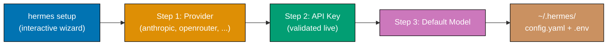
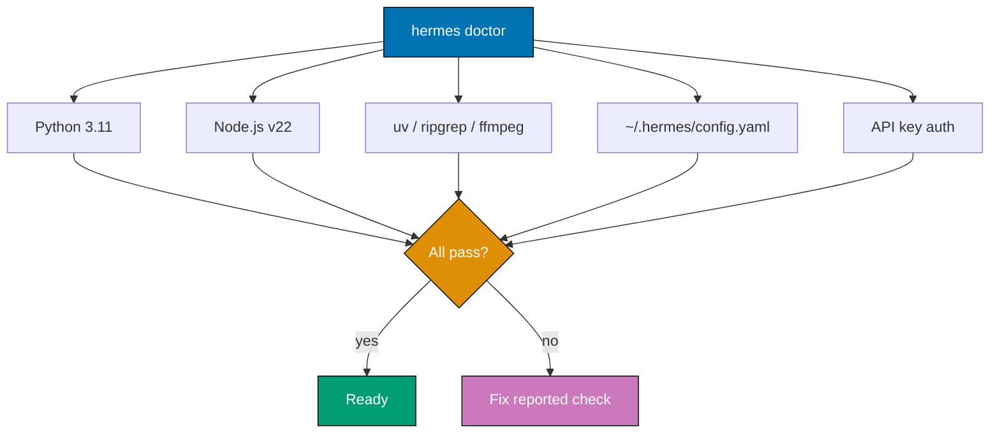
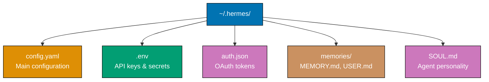
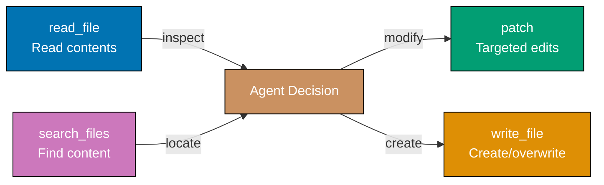
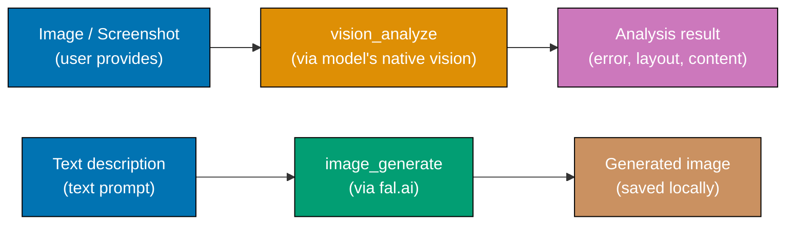
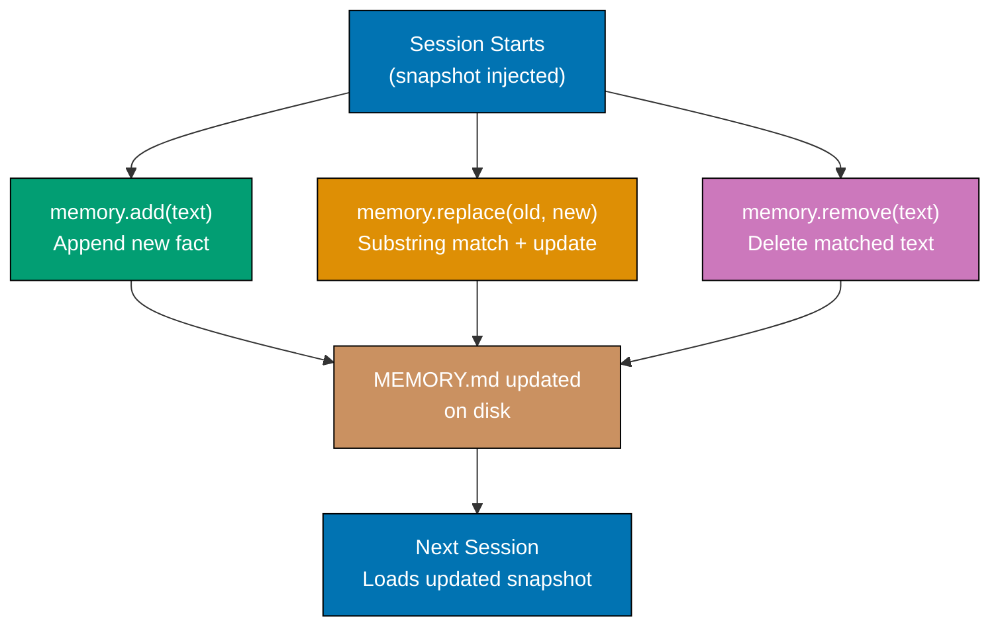
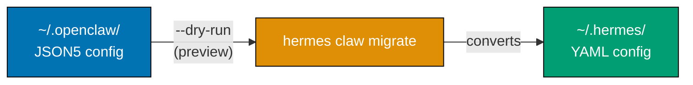

This tutorial provides 27 foundational examples covering the Hermes Agent AI platform. Learn installation and CLI basics (Examples 1-6), YAML configuration (Examples 7-13), built-in tools (Examples 14-20), and memory and context basics (Examples 21-27).

## Installation and CLI Basics (Examples 1-6)

### Example 1: Installing Hermes Agent

Hermes Agent installs via a single `curl` command that bootstraps the entire toolchain. The only prerequisite is Git — the installer auto-provisions Python 3.11, Node.js v22, uv, ripgrep, and ffmpeg.


**Commands**:

```bash
curl -fsSL https://raw.githubusercontent.com/NousResearch/hermes-agent/main/scripts/install.sh | bash
                                        # => Only prerequisite: Git pre-installed
                                        # => Auto-installs: Python 3.11, Node.js v22, uv, ripgrep, ffmpeg

source ~/.bashrc                        # => Makes `hermes` command available in PATH

hermes --version                        # => Output: hermes-agent v0.15.2
                                        # => Confirms successful installation

hermes doctor                           # => Runs post-install health check
                                        # => Validates all dependencies; shows pass/fail per component
```

**Key Takeaway**: Install Hermes Agent with `curl | bash`. The installer handles all dependencies — you only need Git pre-installed.

**Why It Matters**: Hermes Agent's zero-prerequisite installer removes the friction that kills adoption of developer tools. Traditional AI agent setups require manually installing Python, Node.js, and a half-dozen utilities before you even configure anything. The single `curl` command gets you from nothing to a working AI agent in under two minutes. This matters for teams onboarding new developers — instead of a page-long setup guide, it is one command followed by `hermes doctor` to verify everything works.

### Example 2: First-Time Setup Wizard

The `hermes setup` command launches an interactive wizard that configures your model provider, API keys, and creates the `~/.hermes/` directory structure. This is the recommended first step after installation.



```bash
hermes setup                            # => Launches interactive setup wizard
                                        # => Steps: provider → API key → default model
                                        # => Creates ~/.hermes/ with config.yaml + .env

ls ~/.hermes/                           # => config.yaml (settings), .env (secrets),
                                        # =>   memories/ (MEMORY.md, USER.md), SOUL.md

hermes model                            # => Shows current model selection
                                        # => Output: "Current model: anthropic/claude-sonnet-4-6"

hermes model anthropic/claude-opus-4    # => Switches to a different model immediately
                                        # => Takes effect for the current session
```

**Key Takeaway**: Run `hermes setup` immediately after installation. It creates `~/.hermes/` with config, API keys, and memory directories — use `hermes model` to change models later.

**Why It Matters**: The setup wizard prevents the most common failure mode: manually editing YAML config with a typo that silently breaks the agent. The wizard validates your API key against the provider before saving, catches permission issues with `~/.hermes/`, and ensures the directory structure matches what the agent expects. Teams rolling out Hermes across developer machines use `hermes setup` to guarantee consistent baseline configuration without writing deployment scripts or distributing config templates.

### Example 3: Starting an Interactive Session

Running `hermes` or `hermes chat` launches the terminal user interface (TUI) for interactive conversations. The TUI supports multiline editing, autocomplete, streaming output, and live token/cost tracking.

```bash
hermes                                  # => Launches interactive TUI session (= hermes chat)
                                        # => Multiline editing, tab autocomplete, streaming
                                        # => Press Ctrl+D to quit cleanly

hermes chat                             # => Identical to bare `hermes`
                                        # => Status bar: token count + session cost
                                        # => Ctrl+C interrupt, /new reset, Ctrl+D quit

# Inside the TUI — type prompts and press Enter:
> What is Rust?                         # => LLM streams response token-by-token in real-time
> Explain ownership in Rust             # => Status bar updates tokens + cost per turn
                                        # => Each turn adds to cumulative session cost
> /new                                  # => Resets context; reloads MEMORY.md and USER.md
> /usage                                # => Output: "Input: 1,204 tokens | Session cost: $0.012"
```

**Key Takeaway**: Run `hermes` to start an interactive session. Use `Ctrl+C` to interrupt, `/new` to reset context, `Ctrl+D` to exit, and the status bar tracks tokens and cost in real-time.

**Why It Matters**: The TUI is where most development work happens — exploring codebases, debugging issues, and iterating on solutions. Real-time token and cost tracking prevents budget surprises that are common with web-based AI interfaces where usage is invisible until the monthly bill arrives. The `/new` command is critical for context management: when a conversation drifts off-topic or the context window fills with irrelevant history, resetting gives the LLM a fresh start without restarting the entire application.

### Example 4: One-Shot Messages

The `-q` flag sends a single query and exits after the response, making Hermes Agent scriptable for automation pipelines, shell scripts, and CI/CD integrations. Unlike the interactive TUI, one-shot mode prints the response to stdout and returns to the shell, so it composes naturally with pipes and redirections.

```bash
hermes chat -q "What is Rust?"          # => Sends single query to configured LLM
                                        # => Exits automatically after response

hermes chat -q "Summarize this" < README.md
                                        # => Pipes file content as stdin context
                                        # => LLM receives file + prompt together

hermes chat --toolsets "web" -q "search for Rust async runtimes"
                                        # => Restricts available tools to web only
                                        # => Other toolsets: terminal, file, vision

echo "explain: $(cat error.log)" | hermes chat -q -
                                        # => Reads prompt from stdin via dash flag
                                        # => Combines shell interpolation with AI
```

**Key Takeaway**: Use `hermes chat -q "prompt"` for one-shot AI queries; combine with `--toolsets` to restrict tool access and stdin piping for shell integration.

**Why It Matters**: One-shot mode transforms Hermes Agent from an interactive tool into a composable UNIX utility. CI/CD pipelines use it for automated code review (`git diff | hermes chat -q "review this diff"`), shell aliases make AI queries instant (`alias ask='hermes chat -q'`), and cron jobs can generate daily reports. The `--toolsets` restriction is essential for scripted usage — you want the agent to answer questions but not accidentally run destructive terminal commands when processing untrusted input from logs or user data.

### Example 5: Reasoning Effort Levels

The `--reasoning-effort` flag controls how deeply the LLM reasons before responding. Six levels trade off latency and cost against answer depth and thoroughness.

```bash
hermes chat -q "What is 2+2?" --reasoning-effort none
                                        # => No chain-of-thought; fastest + cheapest
                                        # => Output: "4" — best for trivial lookups

hermes chat -q "Explain mutex vs semaphore" --reasoning-effort minimal
                                        # => Minimal reasoning; brief accurate answer

hermes chat -q "Debug this null pointer" --reasoning-effort low
                                        # => Light reasoning; catches obvious issues

hermes chat -q "Design a cache layer" --reasoning-effort medium
                                        # => Moderate depth; considers trade-offs
                                        # => Good default for general development tasks

hermes chat -q "Architect a payment system" --reasoning-effort high
                                        # => Extended reasoning; covers security + scaling

hermes chat -q "Find the race condition" --reasoning-effort xhigh
                                        # => Maximum depth; exhaustive code path analysis
                                        # => Highest token usage and latency
```

**Key Takeaway**: Match `--reasoning-effort` to task complexity: `none` for lookups, `medium` for general work, `high` for architecture, `xhigh` for debugging race conditions. Each level increases cost and latency.

**Why It Matters**: Reasoning effort directly controls your LLM bill. A simple "what time is it in Tokyo" at `xhigh` wastes tokens on unnecessary deliberation, while a distributed systems design at `none` produces a shallow answer missing critical failure modes. Production teams configure default effort levels per workflow — quick Q&A channels use `low`, architecture discussions use `high`. The six-level granularity lets you fine-tune the cost-quality trade-off rather than accepting a one-size-fits-all approach that either overspends on simple tasks or underthinks complex ones.

### Example 6: Doctor and Diagnostics

The `hermes doctor` command validates your entire installation — checking dependencies, config syntax, API key validity, and tool availability. The `hermes status` and `hermes update` commands round out the diagnostics toolkit.



```bash
hermes doctor                           # => Runs full diagnostic suite
                                        # => Checks Python, Node.js, uv, ripgrep, ffmpeg,
                                        # =>   config.yaml syntax, and API key auth
                                        # => Output: pass/fail for each check

hermes status                           # => Shows active provider, masked API keys,
                                        # =>   enabled toolsets, memory file sizes

hermes update                           # => Updates to latest version
                                        # => Preserves ~/.hermes/ config and memories

hermes --version                        # => Output: hermes-agent v0.15.2
hermes doctor --fix                     # => Auto-remediate fixable dependency issues
```

**Key Takeaway**: Run `hermes doctor` when anything breaks and `hermes status` to inspect current config. Use `hermes update` to get the latest version without losing your configuration.

**Why It Matters**: Hermes Agent depends on six external tools (Python, Node.js, uv, ripgrep, ffmpeg, Git) plus network connectivity to LLM providers. Any of these failing produces different symptoms — from silent response drops to cryptic Python errors. `doctor` eliminates guesswork by testing each dependency systematically. The `update` command preserves your `~/.hermes/` directory, so upgrading never wipes your memories, API keys, or custom personality. This separation of binary from config is a deliberate design choice enabling fearless updates.

## YAML Configuration (Examples 7-13)

### Example 7: Configuration File Structure

Hermes Agent uses `~/.hermes/config.yaml` as the main configuration file, `~/.hermes/.env` for secrets, and `~/.hermes/auth.json` for OAuth tokens. Understanding this hierarchy is essential for proper setup.



**Directory structure**:

```bash
ls -la ~/.hermes/                       # => config.yaml (settings), .env (secrets),
                                        # =>   auth.json (OAuth), SOUL.md (personality),
                                        # =>   memories/ (MEMORY.md + USER.md)

cat ~/.hermes/config.yaml               # => YAML format; all non-secret settings
                                        # => Changes take effect on next session start
                                        # => Do not store secrets here — use .env instead

cat ~/.hermes/.env                      # => API keys (one KEY=value per line)
                                        # => File permissions: chmod 600 ~/.hermes/.env
cat ~/.hermes/SOUL.md                   # => Agent personality definition file
```

**Key Takeaway**: All Hermes Agent configuration lives in `~/.hermes/`. Secrets go in `.env`, behavior in `config.yaml`, personality in `SOUL.md`, and learned context in `memories/`.

**Why It Matters**: Separating secrets (`.env`) from configuration (`config.yaml`) from personality (`SOUL.md`) follows the twelve-factor app methodology. You can share your `config.yaml` with teammates without exposing API keys, version-control your `SOUL.md` personality, and back up `memories/` independently. This separation also means `hermes update` safely replaces the binary without touching any of these files — your agent's learned knowledge and personality survive every upgrade.

### Example 8: Model Provider Configuration

The `model` section in `config.yaml` controls which LLM provider and model Hermes Agent uses. Supports Anthropic, OpenRouter, Nous, OpenAI, GitHub Copilot, and custom endpoints.

```yaml
# ~/.hermes/config.yaml
# => Model provider configuration
# => Controls which LLM processes your conversations

model:
  provider:
    anthropic # => LLM provider to use
    # => Options: anthropic, openrouter, nous,
    # =>          openai, copilot, custom
  model:
    claude-sonnet-4-6 # => Specific model within provider
    # => Anthropic: claude-opus-4, claude-sonnet-4-6
    # => OpenRouter: openai/gpt-4o, google/gemini-2.5-pro
  base_url:
    "" # => Custom API endpoint (leave empty for default)
    # => Used with provider: custom
    # => Example: http://localhost:11434/v1
  api_key:
    "${ANTHROPIC_API_KEY}" # => References key from .env file
    # => ${VAR} syntax for environment substitution

  # Fallback model configuration
  fallback:
    provider: openrouter # => Fallback provider if primary fails
    model:
      openai/gpt-4o # => Fallback model selection
      # => Activated on: rate limit, timeout, API error
      # => Hermes retries once on primary before switching
```

**Key Takeaway**: Set `model.provider` and `model.model` for your primary LLM, and configure `fallback` for automatic failover. Use `${VAR}` syntax to reference API keys from `.env`.

**Why It Matters**: Model fallback chains prevent outages — when Anthropic has an incident, Hermes Agent automatically routes to OpenRouter without human intervention. The `${VAR}` substitution keeps API keys in `.env` rather than hardcoded in YAML, so you can safely share config files and version-control them. The provider abstraction means switching from Anthropic to OpenAI is a one-line change, not a code migration — essential for teams evaluating different LLMs or needing to rotate providers for cost optimization.

### Example 9: API Key Management

The `~/.hermes/.env` file stores all API keys and sensitive credentials. Hermes Agent loads this file at session start and resolves `${VAR}` references in `config.yaml`.

```bash
# ~/.hermes/.env — one KEY=value per line; loaded at session start
# => chmod 600 ~/.hermes/.env to restrict read access to your user only
ANTHROPIC_API_KEY=sk-ant-api03-xxxxx    # => Anthropic Claude key (console.anthropic.com)
                                        # => Required when provider: anthropic in config.yaml
OPENROUTER_API_KEY=sk-or-v1-xxxxx       # => OpenRouter key — access 200+ models (openrouter.ai/keys)
OPENAI_API_KEY=sk-proj-xxxxx            # => OpenAI key (platform.openai.com)
NOUS_API_KEY=nk-xxxxx                   # => Nous Research key (inference.nous.ai)
```

```yaml
# ~/.hermes/config.yaml
# => Precedence: CLI args > config.yaml > .env vars > built-in defaults

model:
  api_key:
    "${ANTHROPIC_API_KEY}" # => ${VAR} resolved from .env at runtime
    # => Clear error message if variable is unset
    # => Supports any environment variable name you define
```

**Key Takeaway**: Store all API keys in `~/.hermes/.env` and reference them in `config.yaml` with `${VAR}` syntax. CLI arguments override config, which overrides `.env`, which overrides defaults.

**Why It Matters**: Keeping secrets in `.env` rather than `config.yaml` follows security best practices — you can share, version-control, or post your config file without exposing credentials. The four-level precedence chain (CLI > config > env > defaults) enables flexible overrides: set a default model in config, override it per-session with `--model`, or let CI pipelines inject keys via environment variables without touching config files. This pattern is familiar to anyone who has used Docker, Kubernetes, or twelve-factor apps.

### Example 10: Display and Output Settings

The `display` and `streaming` sections control how Hermes Agent renders responses — progress indicators, streaming behavior, reasoning visibility, cost display, and visual skin. Tuning these settings shapes the developer experience for both interactive sessions and scripted automation.

```yaml
# ~/.hermes/config.yaml

display:
  # => Controls all visual output settings in the TUI
  tool_progress:
    true # => Show tool execution progress bars
    # => Displays: "Running terminal..." with spinner
    # => false: hides progress; useful for scripted output
  streaming:
    true # => Stream tokens as LLM generates them
    # => false: wait for complete response before display
    # => Streaming requires SSE-compatible terminal
  show_reasoning:
    true # => Display chain-of-thought reasoning
    # => Shows the LLM's thinking process before final answer
    # => Disable to reduce output length in automated pipelines
  show_cost:
    true # => Display cost per message and session total
    # => Output: "$0.003 (session: $0.15)"
    # => Helps catch expensive prompts before they add up
  skin:
    default # => Visual theme for TUI
    # => Options: default, minimal, colorful
    # => minimal: no colors, good for terminal recording
  personality:
    default # => Display personality name in status bar
    # => Shows which SOUL.md persona is active
    # => Useful when switching personalities mid-session
  compact:
    false # => Compact mode reduces whitespace
    # => true: denser output, less scrolling
    # => Recommended for small terminal windows

streaming:
  enabled:
    true # => Master switch for streaming
    # => false: all responses arrive as complete blocks
    # => Set false when piping output to another tool
  transport:
    sse # => Streaming protocol
    # => Options: sse (Server-Sent Events), websocket
    # => sse is default; websocket available for some providers
  edit_interval:
    100 # => Milliseconds between display updates
    # => Lower = smoother but higher CPU usage
    # => 100ms is a good default for most terminals
  cursor:
    true # => Show blinking cursor during generation
    # => Visual indicator that LLM is still working
    # => false: no cursor; cleaner for non-interactive output
```

**Key Takeaway**: Control visual output with `display` settings. Enable `show_cost` to track spending, `show_reasoning` to see the LLM's thought process, and adjust `streaming` for response rendering.

**Why It Matters**: Display settings directly affect developer productivity. `show_cost: true` prevents budget surprises — you see per-message and session totals in real-time instead of discovering a large bill at month-end. `show_reasoning: true` is invaluable for debugging AI behavior: when the agent makes a wrong decision, the reasoning trace shows exactly where its logic diverged. `compact: true` saves screen real estate for developers on laptops. These are not cosmetic preferences — they are workflow tools.

### Example 11: Agent Behavior Configuration

The `agent` section controls core runtime behavior — maximum conversation turns, reasoning effort defaults, tool use enforcement, and context compression settings. Getting these right prevents runaway sessions, manages LLM costs, and ensures long conversations stay coherent.

```yaml
# ~/.hermes/config.yaml

agent:
  max_turns:
    90 # => Maximum conversation turns per session
    # => Prevents runaway agent loops
    # => Default: 90 (sufficient for most tasks)
    # => Set lower for cost control

  reasoning_effort:
    medium # => Default reasoning effort level
    # => Options: none, minimal, low, medium, high, xhigh
    # => Overridable per-message with --reasoning-effort
    # => medium: good balance of speed and depth

  tool_use_enforcement:
    auto # => How strictly agent must use tools
    # => auto: agent decides when tools are needed
    # => always: force tool use every turn
    # => never: disable all tool usage

compression:
  enabled:
    true # => Enable automatic context compression
    # => Reduces context when approaching token limit
  threshold:
    0.50 # => Compress when context exceeds 50% of window
    # => Range: 0.0 (compress immediately) to 1.0 (never)
  target_ratio:
    0.30 # => Target context size after compression
    # => 0.30 = compress to 30% of window
  protect_last_n:
    5 # => Protect last N messages from compression
    # => Keeps recent context intact
    # => Older messages get summarized
    # => Increase if recent context is often compressed away
```

**Key Takeaway**: Set `max_turns` to prevent runaway sessions, `reasoning_effort` for default depth, and `compression` to manage long conversations automatically.

**Why It Matters**: Without `max_turns`, a misbehaving agent can loop indefinitely — calling tools, getting errors, retrying — burning through your API budget. The compression system solves the context window problem: long debugging sessions accumulate thousands of tokens of history, eventually hitting the model's limit. Rather than crashing or truncating, compression intelligently summarizes older messages while protecting the recent conversation thread. `protect_last_n: 5` ensures the agent always remembers what you just discussed.

### Example 12: Human Delay Settings

The `human_delay` section adds configurable pauses between agent actions, making the agent appear more natural in messaging platforms where instant responses feel robotic. Three modes — `off`, `natural`, and `custom` — let you trade response speed for conversation realism.

```yaml
# ~/.hermes/config.yaml

human_delay:
  mode:
    "off" # => off: no delays (fastest); natural: randomized; custom: use min/max_ms
    # => Change mode without restarting — edit config.yaml and restart session
  min_ms:
    500 # => Minimum pause in milliseconds (custom mode only)
    # => Values below 200ms are too fast to feel human
  max_ms:
    2000 # => Maximum pause; random delay in [min_ms, max_ms] simulates typing speed
    # => 2000ms upper bound matches average human typing speed for short messages
```

```bash
# Switch delay mode without restarting (edit config.yaml, then restart session):
# => Edit config.yaml, save it, then kill and relaunch hermes
hermes chat                             # => mode: off — responds instantly (development)
                                        # => Best for CI/CD pipelines and scripted use
hermes chat                             # => mode: natural — pauses ~800ms read + ~1200ms compose
                                        # => Best for Slack/Telegram channels; feels human
hermes chat                             # => mode: custom — random delay in [min_ms, max_ms]
                                        # => Best when natural feels too slow or too fast
# Natural mode timeline: receive at t=0 → pause 800ms → type → pause 1200ms → send at t=2s
```

**Key Takeaway**: Use `mode: off` for development speed, `mode: natural` for messaging platforms where human-like pacing matters, and `mode: custom` for precise delay control.

**Why It Matters**: In Slack or Telegram channels where humans and AI agents coexist, an agent that responds in 50 milliseconds feels jarring and disrupts conversation flow. Natural delays make the agent a better team participant — colleagues perceive it as "thinking" rather than "instant-replying." For development and scripting use cases, `mode: off` eliminates unnecessary latency. Custom mode lets you tune delays for specific platforms — Discord communities may prefer faster responses than corporate Slack workspaces.

### Example 13: Quick Commands

The `quick_commands` section defines custom zero-token shell shortcuts that execute directly without consuming LLM context. Type `/command-name` in chat to run the associated shell command instantly.

```yaml
# ~/.hermes/config.yaml

quick_commands:
  status:
    "systemctl status hermes-agent"
    # => /status in chat runs this command
    # => Zero tokens consumed (no LLM involved)
    # => Output displayed directly in TUI

  disk:
    "df -h /" # => /disk shows filesystem usage
    # => Instant execution, no AI processing

  ports:
    "lsof -i -P -n | head -20" # => /ports lists open network ports
    # => Useful for debugging connectivity

  logs:
    "tail -50 /var/log/syslog" # => /logs shows recent system logs
    # => Quick access without typing full path

  gpu:
    "nvidia-smi" # => /gpu shows GPU utilization
    # => Useful when running local models
```

```bash
# Inside hermes TUI session:
/status                                 # => Executes: systemctl status hermes-agent
                                        # => Output: service status information
                                        # => Zero tokens consumed
                                        # => No LLM roundtrip — instant execution

/disk                                   # => Executes: df -h /
                                        # => Output: filesystem usage table
                                        # => Faster than asking "how much disk space"
```

**Key Takeaway**: Define `quick_commands` in `config.yaml` for frequently used shell commands. Type `/command-name` in chat for instant execution with zero token cost.

**Why It Matters**: Every message sent to the LLM costs tokens — asking "how much disk space do I have?" burns context and money for information a simple `df -h` provides. Quick commands bypass the LLM entirely, executing shell commands directly and displaying output in the TUI. Over a workday of frequent status checks, the token savings add up significantly. Teams standardize quick commands across developer machines so everyone has the same `/status`, `/logs`, `/health` shortcuts, creating a shared operational vocabulary.

## Built-in Tools (Examples 14-20)

### Example 14: Terminal Tool

The terminal tool lets Hermes Agent execute shell commands on your machine. When enabled, the agent autonomously runs commands to gather information, install packages, or perform system operations as part of its reasoning.

```yaml
# ~/.hermes/config.yaml
# => Terminal tool configuration

tools:
  terminal:
    backend:
      local # => Execution backend
      # => local: runs on host machine directly
      # => Options: local, docker, ssh
    timeout:
      180 # => Command timeout in seconds
      # => Kills command after 180s (3 minutes)
      # => Prevents: infinite loops, hung processes
    cwd:
      "~" # => Default working directory
      # => Agent starts commands here
      # => Can cd to other directories as needed
```

```bash
# In hermes TUI session:
> Check what Go version is installed

# => Agent decides to use terminal tool
# => Agent runs: go version
# => Output: go version go1.23.0 darwin/arm64
# => Agent reports: "You have Go 1.23.0 installed on macOS ARM64"

> Find all TODO comments in the src/ directory

# => Agent runs: rg "TODO" src/ --line-number
# => Output: list of files and lines with TODO comments
# => Agent summarizes: "Found 7 TODO comments across 4 files"
```

**Key Takeaway**: The terminal tool executes shell commands autonomously when the agent determines they are needed. Configure `timeout` to prevent runaway commands and `cwd` to set the default directory.

**Why It Matters**: Terminal access is what transforms an LLM from a text generator into an agent. Without it, the AI can only suggest commands — with it, the AI executes, observes results, and iterates. The `timeout` setting is critical safety infrastructure: without it, a command like `find / -name "*.log"` on a large filesystem runs indefinitely, blocking the agent and consuming system resources. The `backend` option enables sandboxed execution via Docker for teams that want AI terminal access without granting host-level permissions.

### Example 15: File Operations (read_file, write_file, patch)

Hermes Agent provides four file tools for reading, creating, editing, and searching files. These tools give the agent direct filesystem access for code modifications, config changes, and content creation.



**Tools**:

```bash
# In hermes TUI session:
> Read the contents of package.json     # => Agent: read_file("package.json")
                                        # => Returns full file contents to agent context

> Create a .gitignore for a Node.js project
                                        # => Agent: write_file(".gitignore", "node_modules/\ndist/\n...")
                                        # => Output: "Created .gitignore with 12 patterns"

> Change the port from 3000 to 8080 in server.ts
                                        # => Agent: patch("server.ts", old="port: 3000", new="port: 8080")
                                        # => Targeted edit — only the matched text changes

> Find all files importing the auth module
                                        # => Agent: search_files("from.*auth", "src/") via ripgrep
                                        # => Output: "Found 5 files importing auth module"
```

**Key Takeaway**: Use `read_file` to inspect, `write_file` to create, `patch` for targeted edits (old_string to new_string), and `search_files` to locate content across your project.

**Why It Matters**: The `patch` tool is particularly significant — it makes surgical edits rather than rewriting entire files. When the agent changes one line in a 500-line file, `patch` modifies only that line, preserving formatting, comments, and unrelated code. This is safer than `write_file` for modifications because it cannot accidentally delete content outside the edit region. The `search_files` tool uses ripgrep for speed, searching thousands of files in milliseconds — essential for the agent to understand large codebases before making changes.

### Example 16: Web Search and Extraction

The web tools let Hermes Agent search the internet and extract content from web pages. Configure the search backend in `config.yaml` to use Firecrawl, Tavily, Exa, or a parallel multi-engine search.

```yaml
# ~/.hermes/config.yaml

web:
  backend: firecrawl # => Options: firecrawl (extraction), tavily (search), exa, parallel
```

```bash
# In hermes TUI session:
> Search for the latest Rust release notes
                                        # => web_search("Rust programming language latest release")
                                        # => Returns top results; agent summarizes: "Rust 1.82 was released on..."

> Extract the content from https://doc.rust-lang.org/book/ch04-01.html
                                        # => web_extract(url) fetches page and strips navigation/ads
                                        # => Returns clean structured text for agent to analyze

> What does the Axum 0.8 changelog say about breaking changes?
                                        # => Agent searches + extracts relevant docs automatically
                                        # => Combines web_search and web_extract in one turn
```

**Key Takeaway**: `web_search` queries the internet for information, `web_extract` fetches and cleans web page content. Configure `web.backend` in `config.yaml` to choose the search engine.

**Why It Matters**: LLMs have knowledge cutoff dates — they do not know about events, releases, or documentation updates after their training data ends. Web tools bridge this gap: the agent can search for current information, read up-to-date documentation, and verify its knowledge against live sources. The backend choice matters for different workflows: `firecrawl` excels at extracting structured content from documentation pages, `tavily` provides better search relevance ranking, and `parallel` combines multiple engines for comprehensive coverage at the cost of higher latency.

### Example 17: Process Management

The process tool lets Hermes Agent start, monitor, and stop long-running processes. This is essential for development workflows where the agent needs to run servers, watchers, or build processes in the background.

```bash
# In hermes TUI session:
> Start a development server in the background
                                        # => process.start("npm run dev") — PID 12345 returned
                                        # => Agent continues conversation while server runs in background

> Also start the TypeScript watcher     # => process.start("tsc --watch") — PID 12389 returned

> Check the status of running processes
                                        # => process.status() output:
                                        # =>   PID 12345 | running | npm run dev  (2m 15s)
                                        # =>   PID 12389 | running | tsc --watch  (1m 30s)

> Stop the development server           # => process.kill(12345) — SIGTERM → graceful shutdown
                                        # => Output: "Stopped process 12345: npm run dev"
```

**Key Takeaway**: Use process management to run development servers, file watchers, and build tools in the background. The agent tracks PIDs and can check status or kill processes on demand.

**Why It Matters**: Real development work requires multiple concurrent processes — a dev server, a TypeScript watcher, a test runner. Without process management, the agent would block on the first `npm run dev` and never return to the conversation. Background process support enables workflows like "start the server, run the tests, show me the failures, fix them, re-run tests" — all in a single conversation without manual intervention. The PID tracking prevents orphaned processes that consume resources after the session ends.

### Example 18: Todo Management

The todo tool gives Hermes Agent an internal task tracker for managing multi-step work within a session. The agent creates, updates, and completes todos as it works through complex tasks.

**Trigger todo creation with a multi-step task**:

```bash
hermes chat -q "Refactor the auth module in src/ to use JWT tokens"
                                        # => Agent breaks task into 7 tracked steps automatically
                                        # =>   [ ] Read auth, [ ] Find dependents, [ ] Install jwt, [ ] Create utils, [ ] Update handler/middleware/tests
hermes chat -q "List your current todos"
                                        # => Agent prints todo list with status markers
                                        # => [x] = done, [ ] = pending, → = in progress
hermes chat -q "Mark the JWT utils step done and continue"
                                        # => Agent updates: [x] Create JWT utility functions
                                        # => Resumes from current step if context was reset
```

**Check and advance progress**:

```bash
hermes                                  # => Opens TUI; ask: "What are you working on?"
                                        # => Agent reports live todo status with step counts:
                                        # =>   [x] Read current auth implementation
                                        # =>   [x] Identify dependents (found 8 files)
                                        # =>   [x] Install jsonwebtoken
                                        # =>   [ ] Create JWT utility functions  ← current
                                        # =>   [ ] Update login handler, middleware, tests

hermes chat -q "Show only pending todos"
                                        # => Agent filters: [ ] Create JWT utils, [ ] Update handler
hermes chat -q "Skip the middleware step and go straight to tests"
                                        # => Agent removes skipped step and advances todo cursor
hermes chat -q "Mark all remaining todos done"
                                        # => Agent marks all [ ] as [x]; task complete
hermes chat -q "Summarize what was accomplished"
                                        # => Agent reads completed todos and writes a summary
```

**Key Takeaway**: The todo tool helps the agent break complex tasks into tracked steps. Todos are created, updated, and completed automatically as the agent works through multi-step operations.

**Why It Matters**: Complex tasks like "refactor the auth module" involve dozens of interconnected steps. Without internal task tracking, the agent loses its place after context compression or when recovering from an error. The todo list serves as the agent's working memory — a structured plan it follows and updates. This makes the agent's progress visible to you: instead of wondering "what is it doing?", you see a checklist showing completed and remaining work. It also enables the agent to prioritize and skip steps intelligently when earlier work reveals a simpler path.

### Example 19: Vision and Image Analysis

The vision tools let Hermes Agent analyze images and generate new ones. Vision analysis examines screenshots, diagrams, and photos. Image generation creates visuals via fal.ai integration.



```yaml
# ~/.hermes/config.yaml

auxiliary:
  vision:
    enabled:
      true # => Enable image analysis capabilities
      # => Agent can interpret screenshots, diagrams
    backend:
      default # => Vision processing backend
      # => Uses model's native vision when available
  image_generation:
    enabled:
      true # => Enable image creation
      # => Requires fal.ai API key in .env
    backend:
      fal # => Image generation provider
      # => fal: fal.ai (fast, high quality)
```

```bash
# In hermes TUI session:
> Analyze this screenshot of the error

# => Agent uses: vision_analyze("screenshot.png")
# => Processes image through vision model
# => Identifies: error message text, stack trace, UI context
# => Output: "The error shows a TypeError: cannot read property
# =>          'map' of undefined on line 42 of UserList.tsx"

> Generate an architecture diagram for a microservices system

# => Agent uses: image_generate("architecture diagram showing
# =>   API gateway connecting to auth, users, and orders
# =>   microservices with message queue between them")
# => Creates image via fal.ai
# => Saves to local file
# => Output: "Generated architecture diagram: arch-diagram.png"
```

**Key Takeaway**: Enable vision in `auxiliary.vision` for image analysis and `auxiliary.image_generation` for creating images via fal.ai. Vision analysis works with screenshots, diagrams, and photos.

**Why It Matters**: Vision analysis transforms how you report bugs to the AI agent. Instead of transcribing error messages from screenshots or describing UI layouts in words, you attach an image and the agent reads it directly. This is especially powerful for debugging frontend issues — the agent sees the broken UI, reads the error overlay, and correlates with source code. Image generation enables rapid prototyping of visual concepts — architecture diagrams, wireframes, and flowcharts — without switching to separate design tools.

### Example 20: Toolset Management

Hermes Agent groups tools into toolsets that can be enabled or disabled as a unit. The `hermes tools` command, `--toolsets` CLI flag, and `/tools` slash command provide three ways to manage tool access.

```bash
hermes tools                            # => Interactive toggle — shows all toolsets:
                                        # =>   [x] terminal, [x] file, [x] web, [x] todo, [x] memory
                                        # =>   [ ] process, [ ] vision (disabled by default)

hermes chat --toolsets "web,file"       # => Session-scoped: only web + file tools active
                                        # => Terminal and process tools disabled for safety

hermes chat --toolsets "terminal,file,todo"
                                        # => Full coding session: terminal + file + task tracking

hermes chat --toolsets ""               # => Disable all tools; LLM-only mode (no tool calls)

hermes chat -q "review this code" --toolsets "file"
                                        # => Code review with file access but no execution

# Inside TUI session:
/tools                                  # => Toggle individual tools without restarting session
                                        # => Changes apply immediately to current context
```

**Key Takeaway**: Manage tools with `hermes tools` (interactive), `--toolsets "list"` (per-session), or `/tools` (in-session toggle). Group tools by capability for easier access control.

**Why It Matters**: Not every task needs every tool. Code review sessions need file and search tools but not terminal execution. Research tasks need web tools but not filesystem access. Restricting toolsets follows the principle of least privilege — the agent can only use what is explicitly needed, reducing the attack surface for prompt injection and accidental destructive operations. Per-session toolset selection via `--toolsets` enables safe scripted usage where you want AI analysis but not AI execution.

## Memory and Context Basics (Examples 21-27)

### Example 21: MEMORY.md -- Agent's Persistent Notes

The `~/.hermes/memories/MEMORY.md` file is the agent's persistent notepad. Hermes Agent writes learned facts, environment details, and conventions here. The content is injected as a frozen snapshot at the start of every session.

```bash
cat ~/.hermes/memories/MEMORY.md        # => Agent's persistent memory file
                                        # => 2,200 character limit (~800 tokens)
                                        # => Injected at session start (read-only snapshot)
                                        # => Agent updates via memory tool (takes effect next session)

wc -c ~/.hermes/memories/MEMORY.md     # => Check character count against 2,200 limit
                                        # => Agent prioritizes most useful facts if near limit
```

```markdown
<!-- ~/.hermes/memories/MEMORY.md — example with agent-written content -->
<!-- => Written and maintained by the agent autonomously -->
<!-- => 2,200 character limit (~800 tokens): agent prunes low-value facts first -->

## Environment

<!-- => Discovered from shell, file paths, and package manager commands -->

- OS: macOS 14.5 (Apple Silicon M2) <!-- => Affects file paths, binary names, toolchain -->
- Shell: zsh with oh-my-zsh <!-- => Agent uses zsh-compatible shell syntax -->
- Default editor: neovim
- Package manager: Homebrew <!-- => Affects install commands (brew, not apt) -->

## Project Conventions

<!-- => Learned from CONTRIBUTING.md, code review feedback, CI config -->

- Uses conventional commits (feat/fix/docs/chore)
- Tests required before merge <!-- => Agent always runs tests before suggesting commit -->
- TypeScript strict mode enabled
- Prettier + ESLint for formatting

## Lessons Learned

<!-- => Agent writes here after user corrections or repeated patterns -->

- User prefers functional style over OOP <!-- => Agent avoids class hierarchies in suggestions -->
- Always check .env.example before suggesting env vars
- Project uses pnpm, not npm (lock file: pnpm-lock.yaml)
```

**Key Takeaway**: `MEMORY.md` stores up to 2,200 characters of persistent agent knowledge, updated autonomously by the agent and injected as a frozen snapshot at each session start.

**Why It Matters**: Without persistent memory, every session starts from zero — the agent rediscovers your OS, your coding style, your project conventions, and your preferences. `MEMORY.md` eliminates this repeated discovery cost. The 2,200 character limit forces prioritization: only the most useful facts survive, preventing memory bloat that would waste context tokens on rarely-relevant details. The frozen snapshot design means memory changes take effect next session, preventing mid-conversation confusion from memory mutations.

### Example 22: USER.md -- User Profile

The `~/.hermes/memories/USER.md` file stores information about you — your name, role, timezone, communication style, and preferences. The agent updates this file autonomously as it learns about you through conversation.

```bash
cat ~/.hermes/memories/USER.md          # => View current user profile
                                        # => 1,375 character limit (~500 tokens)
                                        # => Updated autonomously by agent
                                        # => Injected as frozen snapshot at session start
                                        # => Separate from MEMORY.md — stable identity data

wc -c ~/.hermes/memories/USER.md        # => Check character count against 1,375 limit
                                        # => If over limit, agent trims during next update
```

```markdown
<!-- ~/.hermes/memories/USER.md — example populated after a few sessions -->

## Identity

- Name: Alex Chen <!-- => Agent learned from "I'm Alex" in conversation -->
- Role: Senior Backend Engineer <!-- => Inferred from task types and codebase context -->
- Timezone: UTC+7 (Bangkok) <!-- => Learned when user mentioned scheduling -->

## Communication Style

- Prefers concise answers <!-- => Agent noticed user trimmed verbose responses -->
- Likes code examples over prose <!-- => User said "show me code, not explanation" -->

## Technical Preferences

- Languages: Rust (primary), Go, TypeScript <!-- => From actual files user works with -->
- Deployment: Kubernetes + ArgoCD <!-- => From deployment tasks the agent helped with -->
```

**Key Takeaway**: `USER.md` stores up to 1,375 characters about you. The agent learns your preferences through conversation and updates this file autonomously, creating a personalized experience across sessions.

**Why It Matters**: Personalization eliminates repetitive corrections. Without `USER.md`, you tell the agent "use Rust, not Python" every session, explain your commit message format every time, and remind it about your timezone for scheduling tasks. After a few conversations, the agent learns these preferences and applies them automatically. The separate file from `MEMORY.md` is intentional — user identity is stable (your name and role rarely change), while project knowledge evolves rapidly. Different retention limits reflect this: user profile gets fewer tokens because it changes less often.

### Example 23: Memory Operations

The memory tool provides three actions — `add`, `replace`, and `remove` — for modifying persistent memory. There is no `read` action because memory is automatically injected at session start. Changes persist to disk but take effect in the next session.



```bash
# In hermes TUI session:
> Remember that this project uses PostgreSQL 16
                                        # => memory.add("- Database: PostgreSQL 16")
                                        # => Appends to MEMORY.md; takes effect next session

> Update the database version from PostgreSQL 16 to 17
                                        # => memory.replace(old="PostgreSQL 16", new="PostgreSQL 17")
                                        # => Substring match finds and updates the line in-place

> Forget the note about PostgreSQL      # => memory.remove("- Database: PostgreSQL 17")
                                        # => Deletes matched text; frees character budget

> What is in your memory right now?     # => No memory.read tool exists — memory is already in context
                                        # => Agent reads the injected snapshot directly
```

**Key Takeaway**: Use `add` to store new facts, `replace` to update existing ones (substring matching), and `remove` to delete outdated information. No `read` action exists — memory is injected automatically.

**Why It Matters**: The three-action design (add/replace/remove with no read) is deliberately minimal. Reading memory would waste tokens re-processing information already in context. Replace uses substring matching rather than line numbers or keys, making it robust against memory reorganization — if the agent rewrites `MEMORY.md` structure, replace still works as long as the target text exists. The persist-to-disk-but-apply-next-session model prevents a dangerous edge case: mid-session memory mutations could contradict the context the agent has already been reasoning about, causing inconsistent behavior.

### Example 24: Context Files (.hermes.md)

A `.hermes.md` file in your project directory provides project-specific instructions to the agent. Hermes Agent reads this file automatically when you start a session in that directory, with a priority chain for compatibility with other AI tools.

```markdown
<!-- /path/to/project/.hermes.md — place in project root -->
<!-- => Max 20,000 characters; auto-loaded when session starts in this directory -->

# Project: MyAPI <!-- => Gives agent a project name to reference -->

## Tech Stack <!-- => Agent uses this to choose correct syntax and tools -->

- Language: Rust (edition 2024) <!-- => Agent writes Rust 2024, not 2021 -->
- Framework: Axum 0.8 <!-- => Agent uses Axum 0.8 API, not older versions -->
- Database: PostgreSQL 17 via sqlx <!-- => Agent prefers sqlx::query_as! over raw SQL -->
- Testing: cargo-nextest + proptest <!-- => Agent generates nextest and proptest code -->

## Conventions <!-- => Prevents agent from using wrong patterns -->

- All handlers must return Result<Json<T>, AppError>
- Database queries use sqlx::query_as! macro (compile-time checked)
- Error types defined in src/error.rs
- Tests go in tests/ (integration) and inline #[cfg(test)] (unit)

## Important Notes <!-- => High-priority rules agent always follows -->

- Never use unwrap() in production code — use ? operator
- All new endpoints need OpenAPI documentation in docs/api/
```

```bash
# Priority chain — first file found wins (no merging):
# => Only the highest-priority file is loaded — files are NOT merged
ls .hermes.md AGENTS.md CLAUDE.md .cursorrules 2>/dev/null
                                        # => Check which context file exists in current project
                                        # => .hermes.md (highest) → AGENTS.md → CLAUDE.md → .cursorrules

hermes chat                             # => Loads .hermes.md automatically from working directory
                                        # => Agent reads project context before first response
                                        # => No flag needed — detection is automatic by directory
```

**Key Takeaway**: Create `.hermes.md` in your project root for project-specific agent instructions (max 20,000 characters). Hermes Agent also reads `AGENTS.md`, `CLAUDE.md`, and `.cursorrules` as lower-priority fallbacks.

**Why It Matters**: Context files transform a general-purpose AI into a project-aware assistant. Without `.hermes.md`, the agent guesses your tech stack, coding conventions, and project structure — often incorrectly. With it, the agent knows to use `sqlx::query_as!` instead of raw SQL, to never use `unwrap()`, and to add OpenAPI docs for new endpoints. The cross-tool compatibility chain means you do not need separate instruction files for each AI tool — a single `AGENTS.md` works with Hermes, Claude Code, and Cursor, reducing maintenance burden for teams using multiple AI tools.

### Example 25: Agent Identity (SOUL.md)

The `~/.hermes/SOUL.md` file defines the agent's personality — its communication style, behavioral tendencies, and response patterns. This file loads independently from context files and applies across all projects.

```markdown
<!-- ~/.hermes/SOUL.md -->
<!-- => Agent personality definition -->
<!-- => Loaded independently from .hermes.md -->
<!-- => Applies across all sessions and projects -->

You are a senior systems programmer with deep expertise in
Rust, distributed systems, and performance optimization.

## Communication Style

- Be direct and technical — skip pleasantries
- Lead with the answer, then explain reasoning
- Use code examples over prose when possible
- Flag potential issues proactively

## Behavioral Rules

- Always consider error handling before happy path
- Suggest property-based tests for algorithmic code
- Prefer compile-time guarantees over runtime checks
- Recommend benchmarks before optimizing
```

```bash
# In hermes TUI session:
/personality                            # => Shows current personality
                                        # => Output: "Current: custom (SOUL.md)"
                                        # => 14 built-in personalities available

/personality scientist                  # => Switches to built-in "scientist" persona
                                        # => Session overlay — does not modify SOUL.md
                                        # => Resets on /new or session restart

/personality list                       # => Lists all available personalities
                                        # => Output: default, scientist, teacher,
                                        # =>   coder, writer, analyst, creative,
                                        # =>   mentor, reviewer, planner, ...
```

**Key Takeaway**: Define agent personality in `~/.hermes/SOUL.md`. Use `/personality` to switch between 14 built-in personas during a session without modifying the file.

**Why It Matters**: Personality shapes every response. A "teacher" persona explains concepts step-by-step with analogies, while a "reviewer" persona is terse and focuses on issues. The same question about mutex vs semaphore produces fundamentally different answers depending on personality. `SOUL.md` persists your preferred style across sessions, while `/personality` enables quick switches for different tasks — use "coder" for implementation, switch to "reviewer" for code review, then "writer" for documentation. This separation of persistent identity from session overlays gives you stable defaults with situational flexibility.

### Example 26: Slash Commands Reference

Hermes Agent includes built-in slash commands for session management, model switching, context control, and platform interaction. These commands execute instantly without consuming LLM tokens.

```bash
# Session Management
/new                                    # => Resets context; clears history; reloads MEMORY.md + USER.md
                                        # => Use when conversation has drifted or context is full
/reset                                  # => Alias for /new (same behavior)

# Model Control
/model anthropic:claude-sonnet-4-6      # => Switches LLM mid-session (format: provider:model)
                                        # => Model switch takes effect on the very next message
/model                                  # => Without args: shows current model

# Conversation Control
/retry                                  # => Regenerates last response (same prompt, new reasoning)
                                        # => Useful when the agent took a wrong approach
/undo                                   # => Removes last user-agent turn pair from context
                                        # => Prevents a bad turn from influencing future responses

# Context Management
/compress                               # => Summarizes older messages; frees token budget
                                        # => Keeps recent context while compressing older history
/usage                                  # => Shows input/output token count and session cost

# Personality and Skills
/personality scientist                  # => Switches to built-in persona (session only; resets on /new)
/skills                                 # => Lists installed skills with names and descriptions

# Platform Status
/platforms                              # => Shows connected platforms and channel health
```

**Key Takeaway**: Slash commands provide zero-token session control. Use `/new` to reset, `/model` to switch LLMs, `/compress` to manage context, and `/retry` to regenerate responses.

**Why It Matters**: Slash commands are the agent's control plane — they manage the session without consuming the tokens you pay for. `/compress` is particularly critical: in long debugging sessions, the context window fills with old attempts and error logs. Manual compression lets you reclaim that space for fresh context. `/retry` enables experimentation: when the agent's approach does not work, regenerate with potentially different reasoning rather than explaining why the first attempt failed. `/undo` prevents context pollution — removing a mistaken turn before it influences subsequent responses.

### Example 27: Migrating from OpenClaw

Hermes Agent provides a built-in migration tool for OpenClaw users. The `hermes claw migrate` command converts OpenClaw configuration (JSON5), memories, skills, and auth tokens to Hermes format (YAML).



**Commands**:

```bash
hermes claw migrate --dry-run           # => Preview-only: shows files to create/convert
                                        # => Displays JSON5 → YAML changes and directory mapping

hermes claw migrate --preset full       # => Migrates config, memories, skills, and auth tokens
                                        # => Output: "Migrated 12 files, 3 skills"

hermes claw migrate --preset user-data  # => Memories and preferences only; skips API keys
                                        # => Output: "Migrated 4 files (user-data only)"
```

```bash
# Verify migration result — check each migrated file:
# => Run these checks immediately after migration completes
ls ~/.hermes/                           # => config.yaml, .env, SOUL.md, memories/, skills/
                                        # => All files should be present; missing files = failed step
cat ~/.hermes/config.yaml               # => Confirm JSON5 → YAML conversion succeeded
                                        # => YAML syntax errors here mean migration partially failed
cat ~/.hermes/memories/MEMORY.md        # => Confirm memories preserved from ~/.openclaw/
cat ~/.hermes/memories/USER.md          # => Confirm user profile migrated intact
ls ~/.hermes/skills/                    # => Confirm SKILL.md files migrated from workspace/skills/
                                        # => Skills directory should match count from "Migrated N skills"
hermes doctor                           # => Validate full Hermes setup after migration
                                        # => All checks must pass before using Hermes in production
```

**Key Takeaway**: Use `hermes claw migrate --dry-run` to preview, `--preset full` for complete migration, or `--preset user-data` to migrate only memories and preferences without secrets.

**Why It Matters**: Migration tools reduce switching costs — the biggest barrier to adopting better tools. Without `claw migrate`, moving from OpenClaw to Hermes means manually recreating configuration, re-entering API keys, rewriting skills, and losing conversation memories. The `--dry-run` flag builds trust by showing exactly what will happen before writing any files. The `--preset user-data` option addresses a real security concern: when migrating on shared machines, you may not want to copy API keys from one tool's config to another. Hermes respects that by offering granular migration presets.
