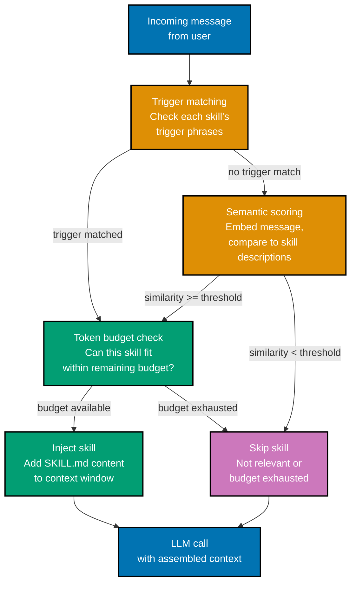
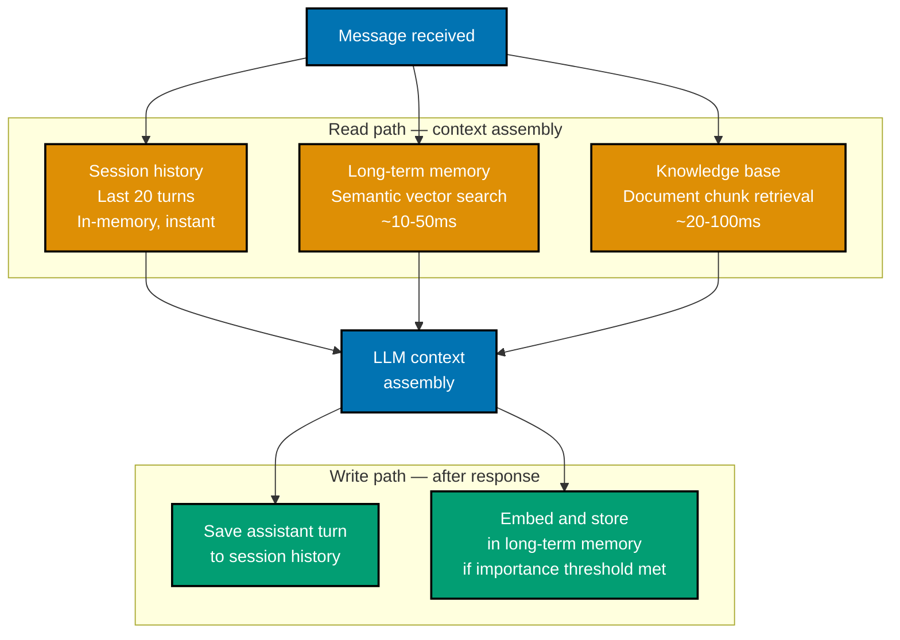
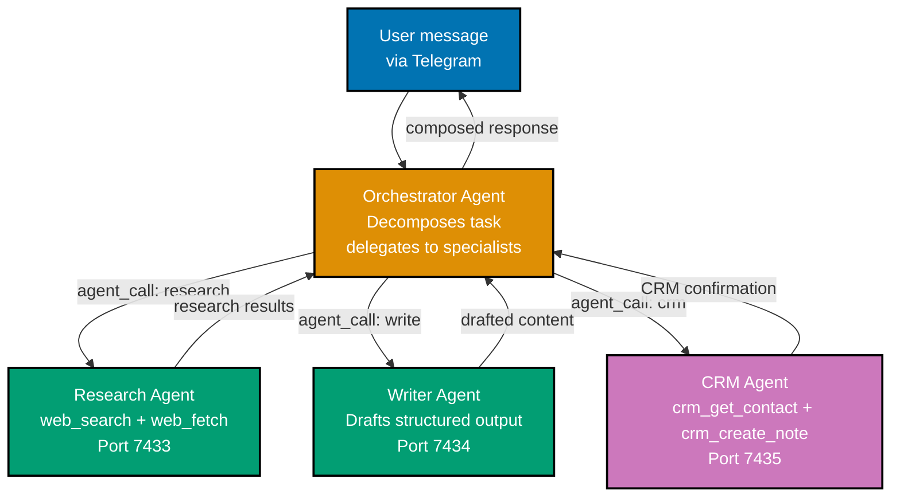

## 1. Writing Your First Skill

Writing a custom skill means authoring a SKILL.md file that teaches the agent a specific
domain capability that the built-in skills and ClawHub do not already cover. At the
intermediate level you move from consuming skills to creating them, which requires
understanding all three blocks of the SKILL.md format in depth: instructions, examples,
and tools.

The instructions block is natural language guidance for the LLM. It tells the model what
to do, how to format responses, what to avoid, and what tools to call in what order. Think
of it as a written protocol the model follows when the skill activates. The examples block
provides concrete demonstration of correct behavior — the LLM learns from examples more
reliably than from abstract rules alone. The tools block declares any additional tools
the skill needs beyond what TOOLS.md already provides globally.

```markdown
<!-- ~/.openclaw/workspace/skills/contract-review/SKILL.md -->

---

name: contract-review
description: "Review a contract document for standard clauses and flag potential issues."
triggers:

- "review contract"
- "check this agreement"
- "look at this contract"
- "contract review"
  version: 1.0.0
  author: your-name

---

## Instructions

When the user asks you to review a contract, follow this protocol exactly:

1. Ask for the contract file path if the user has not provided one.
   Call read_file with that path. If the file exceeds 50,000 bytes, read only the
   first 50,000 bytes and note this in your response.

2. Analyze the contract text for the following elements. For each, note whether it is
   present, absent, or ambiguous:
   - Governing law clause (which jurisdiction applies)
   - Termination clause (notice periods, for-cause vs. at-will)
   - Liability limitation (cap on damages)
   - Indemnification (who indemnifies whom and for what)
   - Intellectual property assignment (who owns work product)
   - Non-compete and non-solicitation provisions
   - Payment terms (amounts, schedules, late penalties)
   - Dispute resolution (arbitration vs. litigation, venue)

3. Flag any clause that is unusual, one-sided, or potentially problematic with a
   "[FLAG]" marker and a one-sentence explanation.

4. Format your output as:
   **Contract Review Summary**
   - Document: [filename]
   - Pages reviewed: [approximate based on character count]

   **Clause Checklist**
   [table with Clause | Status | Notes]

   **Flagged Issues**
   [numbered list of flagged items]

   **Recommendation**
   [1-2 sentence overall assessment]

Do not provide legal advice. Your output is a structural review only. Include a footer:
"This review is AI-assisted and does not constitute legal advice."

## Examples

User: "Can you review the contract at ~/Documents/vendor-agreement.pdf"
Agent: [calls read_file with path "~/Documents/vendor-agreement.pdf"]
[analyzes output for the 8 clause categories]
[produces formatted Contract Review Summary with checklist and flags]

User: "Check this agreement for red flags"
Agent: "I'll review the agreement for you. Could you share the file path or paste the
contract text?"
[if user provides path → calls read_file → produces summary]
[if user pastes text → analyzes inline text directly]

## Tools

tools:

- name: read_file
  description: "Read a file from the local filesystem and return its contents."
  parameters:
  type: object
  properties:
  path:
  type: string
  description: "Absolute or home-relative path to the file."
  maxBytes:
  type: integer
  default: 50000
  required: [path]
  permissions:
  - filesystem.read
```

When writing the instructions block, the most common mistake is being too abstract. "Review
the document thoroughly" is far less effective than "Check for these 8 specific clauses
and note whether each is present, absent, or ambiguous." LLMs follow specific protocols
more consistently than vague directives.

Test your skill by sending a trigger phrase to the agent with `openclaw trace` enabled
(covered in the Debugging section) to verify the skill is injected and the LLM follows
the protocol correctly on the first turn.

**Key Takeaway:** A well-written skill has a specific protocol in the instructions block,
two or more concrete examples, and minimal tool declarations — abstract instructions
produce inconsistent behavior, specific protocols produce consistent behavior.

**Why It Matters:** The investment in a high-quality SKILL.md pays dividends proportional
to how frequently the skill is triggered. A contract review skill that runs 20 times per
week with inconsistent output requires manual verification each time; one that consistently
follows the protocol can be trusted without review. The quality ceiling on skill output
is determined almost entirely by the quality of the instructions and examples.

---

## 2. Selective Skill Injection

Selective skill injection is the mechanism by which the Skills System decides which skills
to include in the LLM's context for a given turn. Not all installed skills are injected
every turn — doing so would rapidly exhaust the context window. The system evaluates each
skill's relevance based on trigger phrases, semantic similarity, and a configurable token
budget.

Understanding injection decisions matters because it explains why a skill sometimes does
not activate when you expect it to, and how to tune trigger phrases to improve activation
reliability without over-injecting unrelated skills.



```typescript
// Skills System injection logic — simplified from @openclaw/core/src/skills/injector.ts
interface SkillInjectionConfig {
  tokenBudget: number; // => Max tokens allocated to skill context (default: 4000)
  semanticThreshold: number; // => Min similarity score for semantic injection (default: 0.65)
  maxSkillsPerTurn: number; // => Hard cap on simultaneous injections (default: 5)
}

async function selectSkillsToInject(
  message: ChannelMessage,
  skills: SkillDefinition[],
  config: SkillInjectionConfig,
): Promise<SkillDefinition[]> {
  const selected: SkillDefinition[] = [];
  let usedTokens = 0;

  // Pass 1: Trigger phrase matching (exact substring match, case-insensitive)
  const triggerMatches = skills.filter((skill) =>
    skill.triggers.some(
      (
        trigger, // => "review contract" in message text
      ) => message.text.toLowerCase().includes(trigger.toLowerCase()),
    ),
  ); // => => triggerMatches: [contract-review]
  // => These are injected first, highest priority

  // Pass 2: Semantic scoring for skills without trigger matches
  const unmatched = skills.filter((s) => !triggerMatches.includes(s));
  const messageEmbedding = await embedder.embed(message.text);
  // => 768-dim vector representing message meaning
  const semanticCandidates = unmatched
    .map((skill) => ({
      skill,
      score: cosineSimilarity(messageEmbedding, skill.descriptionEmbedding),
      // => skill.descriptionEmbedding pre-computed at install time from skill.description
    }))
    .filter((c) => c.score >= config.semanticThreshold) // => Only above threshold
    .sort((a, b) => b.score - a.score); // => Highest similarity first

  // Combine: trigger matches + semantic matches, apply token budget
  const candidates = [...triggerMatches, ...semanticCandidates.map((c) => c.skill)];

  for (const skill of candidates) {
    const skillTokens = estimateTokens(skill.content); // => Rough estimate: chars / 4
    if (usedTokens + skillTokens > config.tokenBudget) {
      break; // => Budget exhausted — stop injecting
      // => Skills sorted by priority, so important
      // => skills are not dropped in favor of
      // => semantically similar but less relevant ones
    }
    if (selected.length >= config.maxSkillsPerTurn) break;
    selected.push(skill);
    usedTokens += skillTokens;
  }

  return selected;
  // => For "review this contract at ~/Documents/vendor.pdf":
  // => => trigger match: contract-review (1847 tokens)
  // => => semantic match: core-memory (similarity 0.31 — below threshold, skipped)
  // => => semantic match: lead-research (similarity 0.42 — below threshold, skipped)
  // => => selected: [contract-review]
  // => => tokens used: 1847 of 4000 budget
}
```

**Tuning trigger phrases** is the most direct way to control injection behavior. If a
skill is not activating when expected, the trigger phrases are too narrow. If it activates
on unrelated messages, the phrases are too broad. Good trigger phrases are 2–4 words,
specific to the skill's domain, and cover natural variations in how users phrase their
requests.

The `semanticThreshold` setting (default 0.65) controls how aggressively the system
injects skills based on meaning rather than exact phrases. Lowering it means more skills
activate on tangentially related messages (useful for broad skills); raising it means
skills only activate when the message is closely related to the skill description
(useful for narrow skills that should never activate on unrelated turns).

**Key Takeaway:** Skills activate via two paths — exact trigger phrase matching (high
priority) and semantic similarity scoring (fills remaining budget) — and tuning trigger
phrases is the primary lever for controlling when a skill activates.

**Why It Matters:** Token budget management directly affects both cost and quality. A 4000-
token skill injection budget costs roughly $0.012 per turn with Claude Sonnet and consumes
context window space that could hold additional conversation history. Overly broad trigger
phrases that inject skills on every turn multiply this cost across all turns. Precise
trigger phrases keep the effective cost per skill activation low and the context window
available for actual conversation content.

---

## 3. Multi-Channel Routing

Multi-channel routing lets you run a single OpenClaw installation that presents different
agent personas on different messaging platforms. A personal assistant on Telegram can have
a casual tone and access to your personal calendar, while a team DevOps bot on Slack has
a formal tone and access to infrastructure tools — both backed by the same local runtime
but configured independently via the Gateway's routing rules.

Routing is configured in `gateway.config.ts` by mapping channel identifiers to workspace
paths. Each workspace path contains its own `AGENTS.md`, `SOUL.md`, `TOOLS.md`, and
`skills/` directory. The Gateway selects the route based on the incoming message's
`channelId` field.

```typescript
// ~/.openclaw/workspace/gateway.config.ts — multi-channel routing

export const gatewayConfig = {
  routes: [
    {
      name: "personal-assistant",
      channels: ["telegram"], // => Messages from Telegram use this route
      workspace: "~/.openclaw/workspaces/personal/",
      // => ~personal/AGENTS.md: "You are a personal assistant for one person..."
      // => ~personal/SOUL.md: "Your name is Aria. Casual, direct tone."
      // => ~personal/TOOLS.md: calendar.read, email.read, filesystem.read
      // => ~personal/skills/: personal-scheduling, email-triage, note-taking
      rateLimiting: { messagesPerMinute: 20 }, // => Personal use: higher limit
    },
    {
      name: "team-devops-bot",
      channels: ["slack"], // => Slack messages use this route
      workspace: "~/.openclaw/workspaces/devops/",
      // => ~devops/AGENTS.md: "You are a DevOps assistant for the engineering team..."
      // => ~devops/SOUL.md: "Your name is Ops. Formal, information-dense."
      // => ~devops/TOOLS.md: run_shell (git, kubectl, docker), web_fetch
      // => ~devops/skills/: github-pr-review, kubernetes-status, incident-response
      rateLimiting: { messagesPerMinute: 60 }, // => Team use: higher throughput
      allowedUsers: ["U01AB2CD3EF", "U04GH5IJ6KL"], // => Slack user IDs — team members only
      // => Other Slack users get no response
    },
    {
      name: "customer-support",
      channels: ["discord"], // => Discord uses this route
      workspace: "~/.openclaw/workspaces/support/",
      // => ~support/AGENTS.md: "You are a customer support agent for Acme Corp..."
      // => ~support/skills/: faq-knowledge-base, ticket-creation, escalation
      rateLimiting: { messagesPerMinute: 10 },
    },
  ],
};

// Memory isolation is automatic: sessionId includes channelId
// => telegram:user123 and slack:user123 are different sessions, different memory stores
// => A user on both Telegram and Slack gets zero cross-channel memory bleed
// => (cross-channel memory sharing requires explicit shared memory pool config)
```

Each route's workspace maintains fully independent memory stores, session histories, and
skill sets. A user who interacts with the Telegram personal assistant and later interacts
with the Slack DevOps bot is treated as two completely separate identities — the agent
does not know or infer that they are the same person. This is intentional: channel
isolation is a privacy guarantee, not an oversight.

If you need cross-channel identity linking (for example, knowing that Telegram user
`@alice` and Slack user `U01AB2CD3EF` are the same person), you configure an explicit
identity map in `gateway.config.ts`. Without this map, identities remain isolated.

```typescript
// Optional cross-channel identity map — only configure if you have a legitimate need
export const identityConfig = {
  crossChannelIdentities: [
    {
      canonicalId: "user-alice", // => Your internal identifier
      identities: [
        { channel: "telegram", userId: "123456789" },
        { channel: "slack", userId: "U01AB2CD3EF" },
      ],
      sharedMemory: true, // => Allow cross-channel memory access
      // => => Aria on Telegram and Ops on Slack
      // => => can both retrieve Alice's memories
      // => Only enable with user's informed consent
    },
  ],
};
```

**Key Takeaway:** Multi-channel routing maps channels to independent workspace configurations,
enabling one runtime to present multiple agent personas with isolated capabilities,
instructions, and memory stores.

**Why It Matters:** The ability to run distinct agent personas on different channels from
one machine is what makes OpenClaw viable as a small-team platform rather than a purely
personal tool. A three-person startup can run a customer-facing Discord support bot, an
internal Slack DevOps assistant, and a personal Telegram productivity agent from a single
laptop — each with appropriate capability boundaries and zero cross-contamination between
the public-facing and internal agents.

---

## 4. Agent Isolation

Agent isolation is the guarantee that each channel/workspace combination maintains its
own context, memory, skills, and tool permissions — no information leaks between routes
even when they run on the same physical machine within the same OpenClaw process.

Isolation operates at four levels: workspace (separate AGENTS.md/SOUL.md/TOOLS.md/skills),
session (separate conversation history and short-term context), memory (separate vector
stores keyed by route name), and tool execution (separate permission grants per workspace).

```typescript
// Isolation architecture — how the runtime enforces separation

// Each route gets its own AgentContext at initialization
interface AgentContext {
  workspacePath: string; // => Path to the workspace directory for this route
  routeName: string; // => "personal-assistant" | "team-devops-bot" | etc.
  agentsMd: string; // => Loaded from workspacePath/AGENTS.md
  soulMd: string; // => Loaded from workspacePath/SOUL.md
  toolRegistry: ToolRegistry; // => Tools from workspacePath/TOOLS.md
  // => Tools from one route are not visible to another
  skillsDir: string; // => workspacePath/skills/ — separate per route
  memoryNamespace: string; // => Derived from routeName — used as vector DB prefix
  // => "personal-assistant:" prefix isolates from "devops:"
  permissionSet: PermissionGrant[]; // => Granted permissions for this workspace only
}

// Memory namespace enforcement — prevents cross-route retrieval
class MemoryStore {
  async retrieve(query: string, namespace: string): Promise<MemoryEntry[]> {
    // All DB queries are prefixed with the namespace
    return this.vectorDb.query({
      embedding: await embed(query),
      filter: { namespace }, // => "personal-assistant:" entries never returned for
      // => "team-devops-bot:" queries — namespace filter enforced
      // => at the database query level, not application level
      limit: 5,
    });
    // => If namespace = "team-devops-bot:" and query = "Aria's calendar preferences"
    // => => returns [] — Aria's memories are in namespace "personal-assistant:"
  }
}

// Tool registry isolation — Slack route cannot call tools from Telegram workspace
class ToolRegistry {
  constructor(
    private namespace: string,
    private permissionSet: PermissionGrant[],
  ) {}

  execute(toolName: string, params: unknown): Promise<ToolResult> {
    if (!this.tools.has(toolName)) {
      // => "run_shell" exists in devops workspace TOOLS.md but not in personal workspace
      // => If personal-assistant route somehow calls "run_shell", it fails here:
      throw new Error(`Tool ${toolName} not registered in workspace ${this.namespace}`);
      // => This is a hard failure, not a graceful fallback — by design
    }
    // ... execute the tool
  }
}
```

The practical consequence of isolation: misconfiguring one workspace cannot cause security
or behavioral problems in another. A prompt injection attack that succeeds on the
customer-facing Discord route gains access only to the support workspace's tools and
memory — it cannot reach the DevOps workspace's shell access or the personal workspace's
email credentials.

One isolation edge case to be aware of: the local filesystem is shared across all workspaces.
If the personal workspace has `filesystem.read` permission for `~/Documents`, and the
DevOps workspace's skills write a file to `~/Documents`, the personal workspace agent
can read that file. Permission scoping does not create filesystem-level isolation — that
would require OS-level sandboxing, which the Advanced section covers.

**Key Takeaway:** Agent isolation operates at the workspace, session, memory, and tool
registry levels — each route runs in its own context and cross-route information access
is prevented by namespace enforcement at the database query level.

**Why It Matters:** Isolation is the property that makes it safe to give the customer-facing
agent shell access to a deployment tool while the personal assistant has email access —
the risk surfaces do not overlap. Without isolation, a framework running multiple agents
becomes a single attack target where compromising any one agent compromises all of them.

---

## 5. Memory System Deep Dive

The Memory and Knowledge System provides three distinct storage mechanisms: session
history (recent conversation turns), long-term semantic memory (past interactions
retrievable by meaning), and the knowledge base (user-supplied documents indexed for
retrieval). Each mechanism serves a different retrieval pattern and has different
performance and storage characteristics.

Understanding all three matters because effective memory configuration is the difference
between an agent that feels forgetful and one that maintains continuity across weeks of
interaction.



```typescript
// Memory system configuration — ~/.openclaw/workspace/memory.config.ts
export const memoryConfig = {
  sessionHistory: {
    maxTurns: 20, // => How many recent turns to include in every context
    // => Higher values = more context but more tokens per call
    // => 20 turns ≈ 3000-8000 tokens depending on message length
    archiveOnTimeout: true, // => When session expires, archive history to long-term memory
  },

  longTermMemory: {
    embeddingModel: "text-embedding-3-small", // => OpenAI embedding model (768 dims, fast, cheap)
    // => Alternative: "text-embedding-3-large" (3072 dims)
    // => Local alternative: "nomic-embed-text" via Ollama
    storageBackend: "sqlite-vss", // => Local SQLite with vector search extension
    // => Alternative: "qdrant" (requires separate Qdrant process)
    autoStoreThreshold: 0.7, // => Store turns with importance score >= 0.7 automatically
    // => Importance score computed by LLM after each turn
    // => 0.7 stores notable turns; 0.0 stores everything (expensive)
    retentionDays: 365, // => Delete entries older than this many days
    maxEntries: 10000, // => Delete oldest entries when limit reached
  },

  knowledgeBase: {
    indexDir: "~/.openclaw/knowledge/", // => Directory to watch for documents to index
    supportedFormats: ["pdf", "md", "txt", "docx"],
    chunkSize: 512, // => Characters per chunk (indexed separately)
    // => Smaller chunks = more precise retrieval
    // => Larger chunks = more context per retrieved chunk
    chunkOverlap: 64, // => Characters of overlap between adjacent chunks
    // => Prevents concepts that span chunk boundaries from
    // => being split across two unrelated retrieval results
    retrievalLimit: 3, // => Max knowledge base chunks injected per turn
  },
};

// Retrieving from all three memory stores — what context assembly does
async function assembleMemoryContext(message: ChannelMessage, session: Session): Promise<MemoryContext> {
  const [sessionHistory, ltmResults, kbResults] = await Promise.all([
    Promise.resolve(session.recentHistory(20)), // => Instant — already in memory
    memory.retrieve(message.text, session.id, {
      // => Vector search ~10-50ms
      limit: 5,
      minSimilarity: 0.65,
    }),
    knowledgeBase.retrieve(message.text, {
      // => Chunk retrieval ~20-100ms
      limit: 3,
      namespace: session.routeName, // => Only docs indexed for this route
    }),
  ]);

  return {
    sessionHistory, // => => [{role:"user",content:"..."}, ...]
    longTermMemories: ltmResults, // => => [{content:"Acme deal closes June 15", similarity:0.94}]
    knowledgeChunks: kbResults, // => => [{source:"vendor-policy.pdf", chunk:"Section 3.2..."}]
  };
  // => All three results assembled into context before LLM call
  // => Total additional tokens: ~500-3000 depending on result counts and lengths
}
```

The `autoStoreThreshold` setting controls the rate at which conversation turns become
long-term memories. Setting it to 0.0 stores every turn — the agent never forgets anything,
but the memory store grows rapidly and retrieval quality degrades as the store fills with
low-value turns. Setting it high (0.9) means only exceptionally notable turns are stored
— the agent rarely remembers specific facts but retrieval is fast and precise.

A reasonable production default: 0.7, combined with explicit memory storage via the
`core-memory` skill when users say "remember this." The explicit path ensures critical
facts are always stored; the automatic path catches important context the user did not
explicitly flag.

**Key Takeaway:** The three memory mechanisms — session history, long-term semantic
storage, and knowledge base retrieval — serve different retrieval patterns and should be
configured to match the actual information access patterns of your use case.

**Why It Matters:** Memory configuration determines the agent's effective intelligence over
time. An agent with only session history "forgets" every interaction after the session
expires. An agent with well-configured long-term memory and a relevant knowledge base can
answer questions accurately weeks into use, recall preferences established months ago, and
cite specific document sections — the difference between a tool and a genuinely useful
assistant.

---

## 6. Knowledge Base Configuration

The knowledge base extends the memory system with indexed external documents. Where long-
term memory stores conversation-derived facts, the knowledge base indexes arbitrary
documents — PDFs, markdown files, plain text, Word documents — and makes their content
retrievable via the same semantic search that powers long-term memory retrieval.

Configuring the knowledge base is a two-step process: indexing documents into the vector
store, and tuning retrieval parameters so the right chunks surface for the right queries.

```bash
# Index documents from a directory (openclaw-cli command)
openclaw kb index ~/Documents/company-policies/   # => Watches directory recursively
# => Indexing: vendor-policy-2026.pdf (47 pages) ... chunked into 312 entries
# => Indexing: employee-handbook.pdf (89 pages) ... chunked into 587 entries
# => Indexing: sla-template.md ... chunked into 43 entries
# => Done. 942 entries indexed in ~/.openclaw/knowledge/
# => New documents added to this directory will be indexed automatically (file watcher active)

# Query the knowledge base directly (useful for testing retrieval quality)
openclaw kb query "termination notice period"
# => Top 3 results:
# => 1. vendor-policy-2026.pdf § 8.3 (similarity: 0.89)
# =>    "...either party may terminate with 30 days written notice..."
# => 2. employee-handbook.pdf § 12.1 (similarity: 0.81)
# =>    "...employment terminates immediately for cause, or with 2 weeks notice otherwise..."
# => 3. sla-template.md § Termination (similarity: 0.77)
# =>    "...Service may be terminated by either party upon 14 days written notice..."

# Check indexing status
openclaw kb status
# => Total documents: 3 files
# => Total chunks: 942
# => Index size: 14.2 MB
# => Last indexed: 2026-05-21 09:14:32
# => File watcher: active (watching ~/Documents/company-policies/)
```

```typescript
// Knowledge base retrieval integration in a skill — policy-lookup skill example

// ~/.openclaw/workspace/skills/policy-lookup/SKILL.md (tools section)
// tools:
//   - name: kb_retrieve
//     description: "Retrieve relevant chunks from the company knowledge base."

// How kb_retrieve works internally (the tool implementation, not the skill):
async function kb_retrieve(params: { query: string; limit?: number }) {
  const queryEmbedding = await embedder.embed(params.query);
  // => 768-dimensional vector representing the query's meaning

  const results = await vectorDb.query({
    embedding: queryEmbedding,
    namespace: "knowledge-base", // => Separate namespace from conversation memory
    limit: params.limit ?? 3, // => Default: return top 3 chunks
    minSimilarity: 0.6, // => Lower threshold than memory — KB is broader
  });
  // => results: [{source: "vendor-policy-2026.pdf", chunk: "...", similarity: 0.89}, ...]

  return results.map((r) => ({
    source: r.source, // => Filename for citation
    section: r.metadata?.section ?? "", // => Section heading if extracted during indexing
    content: r.chunk, // => The retrieved text chunk (~512 chars)
    similarity: r.similarity, // => For debugging — not shown to user by default
  }));
  // => Tool result injected back into LLM context:
  // => "Relevant policy sections found:
  // =>  [vendor-policy-2026.pdf § 8.3]: either party may terminate with 30 days notice..."
}
```

**Chunk size tuning** is the most impactful knowledge base configuration decision. Small
chunks (256 characters) retrieve precisely but may lack surrounding context that makes
the chunk meaningful. Large chunks (1024 characters) provide richer context but match
queries less precisely. The default (512 characters with 64-character overlap) works well
for most document types. For highly structured documents like legal contracts or technical
specifications, smaller chunks with more overlap tend to produce better retrieval results.

When retrieval quality is poor, the most effective diagnostic is `openclaw kb query` with
the exact phrases users are sending. If the right chunks are not appearing in the top 3
results, the chunk size is too large (split the concept across chunk boundaries) or the
document uses terminology that differs from how users phrase queries. The latter case can
be addressed by adding synonyms or alternative phrasings to the skill's examples section.

**Key Takeaway:** The knowledge base indexes arbitrary documents into the same semantic
vector store as long-term memory, making document content retrievable by meaning — chunk
size is the primary tuning lever for retrieval precision vs. context richness.

**Why It Matters:** Knowledge base integration transforms an OpenClaw agent from a
general-purpose assistant into a domain expert on your specific documents. A legal team
can index their contract templates and policies; a DevOps team can index their runbooks
and architecture documentation; a support team can index their product documentation.
The agent then answers questions grounded in these documents rather than in general LLM
training data, which is both more accurate and more auditable.

---

## 7. Custom Tool Definitions in TOOLS.md

Custom tool definitions extend the agent's capability surface beyond the built-in tools.
A custom tool is a TypeScript function registered in your OpenClaw workspace that the
runtime can call when the LLM requests it. The TOOLS.md declaration tells the LLM what
the tool does and what parameters it accepts; the actual implementation lives in a
corresponding TypeScript file.

TOOLS.md declarations use JSON Schema for parameter definitions, which the runtime uses
for both input validation and as the tool description passed to the LLM's tool-calling
interface.

```yaml
# ~/.openclaw/workspace/TOOLS.md — custom CRM tool declaration

tools:
  - name: crm_get_contact
    description: "Look up a contact in the CRM by name or email address."
    parameters:
      type: object
      properties:
        query:
          type: string
          description: "Name or email address to search for."
        fields:
          type: array
          items:
            type: string
          description: "Contact fields to return. Default: [name, email, company, lastContact]."
          default: ["name", "email", "company", "lastContact"]
      required: [query]
    permissions:
      - network.http # => Requires HTTP access (CRM API call)
    timeout: 10000 # => Tool execution timeout in ms (default: 30000)

  - name: crm_create_note
    description: "Add a note to a contact's CRM record."
    parameters:
      type: object
      properties:
        contactId:
          type: string
          description: "The CRM contact ID to attach the note to."
        note:
          type: string
          description: "The note content to add."
        tags:
          type: array
          items:
            type: string
          description: "Optional tags for the note (e.g. ['follow-up', 'demo'])."
          default: []
      required: [contactId, note]
    permissions:
      - network.http
    requireConfirmation: true # => User approves before CRM is written
```

```typescript
// ~/.openclaw/workspace/tools/crm-tools.ts — tool implementations

import { defineTool, ToolContext } from "@openclaw/tools";

export const crmGetContact = defineTool({
  name: "crm_get_contact", // => Must match TOOLS.md declaration name
  async execute(params: { query: string; fields: string[] }, ctx: ToolContext) {
    const apiKey = process.env.CRM_API_KEY; // => Never hardcode credentials
    if (!apiKey) {
      return { success: false, error: "CRM_API_KEY not configured" };
      // => => LLM sees this error and tells user the CRM is not configured
    }

    const response = await fetch(`https://api.yourcrm.com/contacts/search?q=${encodeURIComponent(params.query)}`, {
      headers: { Authorization: `Bearer ${apiKey}`, "Content-Type": "application/json" },
    });
    // => HTTP GET to CRM search endpoint
    // => Timeout enforced by runtime at 10000ms (from TOOLS.md timeout field)

    if (!response.ok) {
      return { success: false, error: `CRM API error: ${response.status}` };
    }

    const data = await response.json();
    // => data: { contacts: [{id: "c_123", name: "Alice Smith", email: "...", ...}] }

    const contact = data.contacts[0]; // => Return first match
    if (!contact) {
      return { success: true, result: "No contact found matching that query." };
    }

    // Return only requested fields — avoid leaking unnecessary data to LLM context
    const filtered = params.fields.reduce(
      (acc, field) => {
        if (field in contact) acc[field] = contact[field]; // => Only return asked-for fields
        return acc;
      },
      {} as Record<string, unknown>,
    );

    return { success: true, result: filtered };
    // => => { success: true, result: { name: "Alice Smith", email: "alice@acme.com",
    // =>                               company: "Acme Corp", lastContact: "2026-03-15" } }
    // => Runtime injects this result into LLM context for next turn
  },
});
```

Registering custom tools requires one additional step: linking the implementation file
in your workspace config so the runtime loads it at startup:

```typescript
// ~/.openclaw/workspace/openclaw.config.ts — register custom tool implementations
export default {
  // ... llm, gateway, channels config ...
  tools: {
    implementations: [
      "~/workspace/tools/crm-tools.ts", // => Runtime imports this at startup
      // => Finds and registers crmGetContact and crmCreateNote
      // => Validates that each implementation matches a TOOLS.md entry
    ],
  },
};
// => On start: Loaded 2 custom tools: crm_get_contact, crm_create_note
// => On start: Permission check: network.http — granted
// => On start: crm_create_note: requireConfirmation = true (user approval required)
```

**Key Takeaway:** Custom tools follow a two-file pattern — a JSON Schema declaration in
TOOLS.md (for the LLM and permission system) and a TypeScript implementation file (for
actual execution) — keeping the capability declaration auditable separately from the
implementation.

**Why It Matters:** Custom tool definitions are the primary mechanism for integrating
OpenClaw with proprietary systems (CRMs, internal APIs, databases, monitoring platforms).
The two-file pattern means security reviewers can audit the full capability surface by
reading only TOOLS.md, without needing to understand the TypeScript implementation details
— which matters for compliance review in regulated industries.

---

## 8. Multi-Agent Orchestration

Multi-agent orchestration runs multiple OpenClaw instances (or multiple routes within one
instance) as a coordinated system where a primary agent delegates subtasks to specialist
agents and aggregates their results. This pattern scales beyond what a single agent
context window can handle and enables specialization: one agent that understands your
domain coordinates specialists that are excellent at narrow tasks.

The simplest orchestration pattern is a primary agent that calls a secondary agent via an
HTTP tool call — the secondary agent processes its own agentic loop and returns a result.



```typescript
// Orchestrator's TOOLS.md declares agent_call as a tool
// The tool implementation calls a specialist agent's local HTTP API:

// ~/.openclaw/workspace/tools/agent-call.ts
export const agentCall = defineTool({
  name: "agent_call",
  async execute(params: { agentName: string; task: string; context?: string }) {
    const agentUrls: Record<string, string> = {
      research: "http://localhost:7433/api/v1/run", // => Research specialist agent
      writer: "http://localhost:7434/api/v1/run", // => Writer specialist agent
      crm: "http://localhost:7435/api/v1/run", // => CRM specialist agent
    };

    const url = agentUrls[params.agentName];
    if (!url) {
      return { success: false, error: `Unknown agent: ${params.agentName}` };
    }

    const response = await fetch(url, {
      method: "POST",
      headers: { "Content-Type": "application/json", Authorization: `Bearer ${process.env.LOCAL_AGENT_TOKEN}` },
      body: JSON.stringify({
        message: params.task, // => Task description for the specialist
        context: params.context ?? "", // => Optional context (e.g., user name, deal ID)
      }),
    });
    // => HTTP POST to specialist agent's local API
    // => Specialist agent runs its own full agentic loop
    // => May take 5-30 seconds for complex tasks

    const result = await response.json();
    return { success: true, result: result.response };
    // => => {success: true, result: "Research summary: Acme Corp (est. 2018), 450 employees..."}
    // => Orchestrator receives this and continues its own reasoning
  },
});

// Example orchestrator turn for: "Research Acme Corp and add a note to their CRM record"
// Orchestrator LLM reasoning (internal):
// => Step 1: Call research agent with "Research Acme Corp background for CRM entry"
// => Step 2: Call crm agent with "Look up Acme Corp in CRM, then add note: [research results]"
// => Step 3: Compose final response confirming both actions
```

The specialist agents each run as independent OpenClaw processes on different ports, with
their own workspaces, memory stores, and tool permissions scoped to their specialty. The
research agent only has `web_search` and `web_fetch` tools; the CRM agent only has CRM
tools; the writer agent has no external tools at all. This means a prompt injection that
compromises the research agent cannot gain CRM write access — the blast radius of any
single compromise is bounded by that agent's tool permissions.

Starting multiple OpenClaw instances requires separate config files:

```bash
# Start specialist agents on separate ports
openclaw start --config ~/.openclaw/workspaces/research/openclaw.config.ts --port 7433
openclaw start --config ~/.openclaw/workspaces/crm/openclaw.config.ts --port 7434

# Start orchestrator (default port 7432, connects to user-facing Telegram channel)
openclaw start --config ~/.openclaw/workspaces/orchestrator/openclaw.config.ts
# => Orchestrator ready. Specialist agents: research@7433, crm@7434
# => User sends: "Research Acme Corp and add a CRM note"
# => Orchestrator delegates → research result received → CRM note added → response sent
```

**Key Takeaway:** Multi-agent orchestration delegates subtasks to specialist agents via
HTTP tool calls, with each specialist running in its own process with scoped permissions
— the orchestrator coordinates without needing to hold all capabilities itself.

**Why It Matters:** Single-agent context windows are finite. A research task that requires
10 web fetches, a CRM lookup, and a long-form write operation may exceed the context of
a single agent loop. Multi-agent delegation solves this: each specialist works within its
own context window, and the orchestrator composes a final answer from their results. This
is the architectural pattern behind every production AI workflow that handles tasks more
complex than a few tool calls.

---

## 9. Voice Mode

Voice mode enables the agent to receive spoken input and respond with synthesized speech,
creating a voice assistant experience backed by the full OpenClaw runtime. Voice mode
is supported on macOS (via the menu bar companion app) and iOS (via the OpenClaw mobile
app). It is not available on the desktop CLI alone or on Android as of the current release.

Voice mode uses the platform's speech recognition for transcription (Apple's on-device
Speech framework on macOS and iOS) and a configurable text-to-speech engine for response
synthesis. All speech processing happens on device — no audio is sent to external servers
unless you configure a cloud TTS provider.

```typescript
// Voice mode configuration — ~/.openclaw/workspace/voice.config.ts
export const voiceConfig = {
  enabled: true, // => Enable voice mode for companion apps

  wakeWord: {
    phrase: "Hey Aria", // => Wake word to activate listening
    // => Processed entirely on-device (no cloud)
    // => Change to match your agent's name in SOUL.md
    sensitivity: 0.7, // => 0.0 = rarely triggers, 1.0 = very sensitive
    // => 0.7 is a good default for quiet environments
    platform: ["macos", "ios"], // => Which platforms enable wake word detection
  },

  speechToText: {
    provider: "apple-native", // => Apple Speech framework (on-device, free)
    // => Alternative: "openai-whisper" (cloud, higher quality)
    // => Alternative: "whisper-local" (Whisper model via Ollama)
    language: "en-US",
    silenceTimeout: 1500, // => ms of silence before recording stops
  },

  textToSpeech: {
    provider: "apple-native", // => Apple AVSpeechSynthesizer (on-device)
    // => Alternative: "elevenlabs" (cloud, much more natural)
    // => Alternative: "openai-tts" (cloud, good quality)
    voice: "Samantha", // => macOS system voice name
    rate: 0.52, // => 0.0 = slowest, 1.0 = fastest; 0.52 ≈ natural pace
    volume: 0.9,
  },

  responseFilter: {
    stripMarkdown: true, // => Remove **, ##, bullet markers before TTS
    // => LLMs often include markdown in responses;
    // => it sounds odd when read aloud
    maxResponseLength: 500, // => Truncate long responses for voice output
    // => Full text still shown in companion app log
  },
};
```

In practice, voice mode is most useful for hands-free command scenarios: driving, cooking,
or working in a physical environment where typing is inconvenient. For information-dense
responses (long research summaries, code explanations, multi-step analyses), the messaging
channel is more practical because text is scannable in a way that audio is not.

The wake word sensitivity setting deserves careful tuning. At 0.7, the wake word
occasionally triggers on similar sounds in ambient audio. At 0.5, it sometimes fails to
trigger on the first attempt. If you use voice mode in a quiet home environment, 0.7 is
appropriate. In an open office or noisy environment, consider raising to 0.85 or simply
using a push-to-talk trigger (available as an option in the companion app) instead of a
wake word.

**Key Takeaway:** Voice mode wraps the same agent runtime with on-device speech recognition
and TTS synthesis, available on macOS and iOS only — use it for hands-free scenarios where
the response can reasonably be summarized in under 500 words.

**Why It Matters:** Voice mode bridges OpenClaw from screen-based workflows to ambient
computing scenarios. For productivity workflows where you need to capture information while
moving — taking meeting notes verbally, adding CRM updates between calls, checking
calendar while commuting — voice mode extends the agent's usefulness into contexts where
typing is impractical. The on-device audio processing is a significant privacy advantage
over cloud voice assistants that stream audio to remote servers.

---

## 10. Live Canvas and A2UI

Live Canvas is an interactive visual workspace that the agent can generate and update
dynamically in response to user messages. Instead of returning text, the agent returns
structured A2UI (Agent-to-UI) protocol payloads that the OpenClaw companion app renders
as visual components: tables, charts, kanban boards, timelines, and form inputs.

A2UI (Agent-to-User Interface) is OpenClaw's protocol for agent-driven UI generation.
The agent produces JSON payloads describing UI components; the companion app renders them.
Users can interact with rendered components (clicking a button, editing a cell) which
sends structured events back to the agent runtime.

````typescript
// A2UI payload — returned by agent instead of plain text when canvas is active

// Example: Agent returns a kanban board for project tasks
const kanbanPayload: A2UIPayload = {
  type: "canvas", // => Renders in Live Canvas panel
  version: "1.0",
  components: [
    {
      type: "kanban",
      id: "project-tasks",
      columns: [
        {
          id: "todo",
          label: "To Do",
          cards: [
            { id: "t1", content: "Research Acme Corp", tags: ["research"] },
            { id: "t2", content: "Draft proposal", tags: ["writing"] },
          ],
        },
        {
          id: "in-progress",
          label: "In Progress",
          cards: [{ id: "t3", content: "Review vendor contract", tags: ["legal"] }],
        },
        {
          id: "done",
          label: "Done",
          cards: [],
        },
      ],
      interactions: {
        onCardMove: {
          action: "agent_event", // => When user drags a card to a new column:
          eventType: "card_moved", // => Sends {cardId, fromColumn, toColumn}
          // => back to the agent runtime as a new message
          // => Agent can then update CRM, Jira, or other systems based on the move
        },
        onCardClick: {
          action: "agent_event",
          eventType: "card_detail_requested",
        },
      },
    },
  ],
};

// How a skill instructs the agent to return A2UI instead of plain text:
// (In SKILL.md instructions section)
// "When the user asks to see tasks as a board, respond with an A2UI kanban payload.
//  Format: JSON wrapped in ```a2ui ... ``` code block.
//  The companion app will render it visually."
````

```typescript
// Handling a user interaction event from the canvas
// (When user drags "Review vendor contract" from "In Progress" to "Done")
const interactionEvent: CanvasEvent = {
  type: "card_moved",
  payload: {
    cardId: "t3",
    fromColumn: "in-progress",
    toColumn: "done",
    timestamp: "2026-05-21T09:45:00Z",
  },
};
// => Gateway receives this as a structured message (not free text)
// => Runtime processes it like any other turn: LLM decides what action to take
// => Agent might call crm_create_note("t3 task completed") or send Slack notification
```

Live Canvas is only rendered in the macOS and iOS companion apps. In messaging channels
(Telegram, Slack), the same skill falls back to plain text output: if the companion app
is not connected, the agent automatically detects this and omits the A2UI payload,
returning a text equivalent instead. This fallback is built into the runtime — skill
authors do not need to handle it explicitly.

A2UI components available in the current release include: kanban boards, data tables,
line/bar/pie charts, timelines, markdown documents, form inputs, and file preview panels.
The component library is extensible via the OpenClaw plugin system.

**Key Takeaway:** Live Canvas renders structured A2UI payloads as interactive visual
components in the companion apps, with automatic text fallback for messaging channels —
enabling agent-driven UI without writing frontend code.

**Why It Matters:** The gap between "text summary" and "interactive dashboard" has
historically required a separate frontend application. A2UI closes this gap for internal
tools: a sales agent that renders a live pipeline kanban, a DevOps agent that renders an
incident timeline, or a research agent that builds a comparative table — all built through
skill instructions and JSON payloads, not frontend development. For internal tooling with
small user bases, this eliminates an entire development layer.

---

## 11. Debugging Agent Behavior

Debugging an OpenClaw agent means understanding why the LLM made a specific decision —
which skills were injected, what the full context looked like, which tool was called and
why, and where the loop branched unexpectedly. OpenClaw's trace mode captures this
information as a structured log for every turn.

The most common debugging scenarios: a skill that is not activating when expected, a tool
that is called with incorrect parameters, an agent that loops more times than expected,
and a response that ignores instructions from AGENTS.md.

```bash
# Enable trace mode for a single turn (without restarting the agent)
openclaw trace send "Review the contract at ~/Documents/test.pdf"

# => === TURN TRACE ===
# => Message: "Review the contract at ~/Documents/test.pdf"
# => Session: telegram:123456789 (14 previous turns)
# =>
# => [SKILL INJECTION]
# => Evaluating 4 installed skills...
# => contract-review: trigger match "review" + "contract" → INJECT (1847 tokens)
# => lead-research: no trigger match, semantic score 0.31 < 0.65 → SKIP
# => core-memory: no trigger match, semantic score 0.58 < 0.65 → SKIP
# => core-datetime: no trigger match, semantic score 0.22 < 0.65 → SKIP
# => Injected: [contract-review]
# =>
# => [CONTEXT ASSEMBLY]
# => AGENTS.md: 287 tokens
# => SOUL.md: 143 tokens
# => Injected skills: 1847 tokens (contract-review)
# => Long-term memories retrieved: 2 entries (421 tokens)
# => Session history: 12 turns (3891 tokens)
# => Current message: 12 tokens
# => Total context: 6601 tokens
# =>
# => [LLM CALL 1/10]
# => Provider: claude claude-sonnet-4-6
# => Input tokens: 6601
# => Output: tool_call → read_file({"path": "~/Documents/test.pdf", "maxBytes": 50000})
# =>
# => [TOOL EXECUTION]
# => Tool: read_file
# => Params: {path: "~/Documents/test.pdf", maxBytes: 50000}
# => Permission check: filesystem.read → granted
# => Result: success (43821 bytes, 10956 tokens)
# =>
# => [LLM CALL 2/10]
# => Input tokens: 17557 (6601 + 10956)
# => Output: final response (no tool calls)
# =>
# => [RESPONSE]
# => Length: 847 tokens
# => Delivered via: telegram
# => === END TRACE ===
```

The trace output shows exactly where to look for each class of problem:

- **Skill not activating:** Check `[SKILL INJECTION]` — if the skill shows a semantic
  score below threshold, add a trigger phrase matching the user's actual phrasing. If
  the skill shows a trigger match but was not injected, check the token budget (it may
  have been crowded out by earlier skills).
- **Wrong tool called:** Check `[LLM CALL N]` output field — if the LLM called a different
  tool than expected, the AGENTS.md tool use guidelines are ambiguous. Add a more specific
  instruction about when to use each tool.
- **Too many iterations:** Count `[LLM CALL N]` blocks — if the loop iterates more than
  3–4 times for a simple task, the LLM is not finding the information it needs and keeps
  calling tools. Check whether the right skill is injected and whether the tool results
  are in a format the LLM can use.

```bash
# Enable persistent trace logging (writes all turns to a log file)
openclaw start --trace --trace-output ~/.openclaw/traces/
# => Trace mode: ON
# => Writing traces to: ~/.openclaw/traces/ (one file per turn)

# View the most recent trace
openclaw trace tail                    # => Streams most recent trace file in real time

# Filter traces for a specific session
openclaw trace list --session "telegram:123456789" --since "2026-05-21"
# => 14 traces found
# => 2026-05-21 09:14 — contract review (6 LLM calls, 2 tool calls)
# => 2026-05-21 10:02 — research request (3 LLM calls, 5 tool calls)
```

**Key Takeaway:** Trace mode captures the full context assembly, skill injection decisions,
LLM calls, and tool executions for every turn — the three most common debug targets are
skill injection decisions, tool call parameters, and loop iteration count.

**Why It Matters:** Without trace mode, debugging agent behavior requires guessing about
LLM decisions that are not directly observable. With trace mode, you can verify in one
command whether a skill was injected, what the LLM received, and why it chose a specific
tool. This observability reduces debugging from hours of speculation to minutes of log
reading — essential for maintaining and improving production agent workflows.

---

## 12. Skill Composition

Skill composition refers to how multiple simultaneously-injected skills interact: whether
their instructions complement or contradict each other, how the LLM resolves ambiguity
when two skills give different guidance for the same situation, and how to control the
order in which skills appear in the context window.

Because the Skills System can inject multiple skills in a single turn (up to the token
budget), you need to understand how to write skills that compose cleanly rather than
conflict.

```markdown
<!-- Skill composition example: two skills that must coexist on a research turn -->

<!-- ~/.openclaw/workspace/skills/lead-research/SKILL.md (excerpt) -->

## Instructions

When researching a company, always end your output with a "Research confidence: HIGH/MEDIUM/LOW"
indicator based on source quality. HIGH = multiple corroborating sources. MEDIUM = single
reliable source. LOW = limited public information available.

<!-- ~/.openclaw/workspace/skills/crm-formatter/SKILL.md (excerpt) -->

## Instructions

When producing output intended for CRM entry, format the final section as:
---CRM-ENTRY---
[structured data here]
---END-CRM-ENTRY---
This delimiter allows our CRM integration script to parse the response.
```

When both skills activate on a turn like "Research Acme Corp for a CRM entry", the LLM
receives both sets of instructions. A well-written LLM follows both: it produces the
research with a confidence indicator AND wraps the final section in the CRM delimiter.

Conflicts arise when skills give contradictory instructions for the same output element.
If `lead-research` says "format output as a bulleted list" and `crm-formatter` says
"format output as a structured table," the LLM will attempt to satisfy both — often
producing a hybrid that satisfies neither. The solution is explicit coordination:

```markdown
<!-- In crm-formatter/SKILL.md, handle the potential conflict explicitly -->

## Instructions

...
If the lead-research skill is also active (you will see a "Research confidence:" section in
your instructions), use the CRM delimiter to wrap the research output rather than replacing
the research format. The research format and CRM delimiter are compatible — produce the
research in its natural format, then wrap the entire output in the CRM delimiters.
```

```typescript
// Controlling skill injection order via priority configuration
// ~/.openclaw/workspace/skills.config.ts

export const skillsConfig = {
  injectionOrder: "priority-then-semantic", // => "priority-then-semantic" (default) or
  // => "semantic-only" (no explicit priority)
  priorities: {
    "crm-formatter": 100, // => Higher priority = injected first = appears earlier
    "lead-research": 80, // => in context window = LLM reads it first
    "contract-review": 90,
    // => Unspecified skills default to priority 50
    // => Injection order in context: crm-formatter → contract-review → lead-research → others
  },
};
// => When multiple skills inject on the same turn, higher-priority skills appear earlier
// => in the context window. LLMs attend more strongly to earlier context, so the
// => highest-priority skill's instructions tend to dominate in conflict situations.
```

The injection order matters because LLMs exhibit primacy bias: instructions that appear
earlier in the context tend to be followed more consistently than those that appear later.
If you have a formatting skill that must always govern the output structure, give it the
highest priority so its instructions precede domain-specific skill instructions.

**Key Takeaway:** Multiple simultaneously-injected skills can conflict or complement
depending on how their instructions are written — explicit coordination in skill
instructions and priority configuration are the two tools for managing composition.

**Why It Matters:** As an OpenClaw installation accumulates skills, the probability of
unintended skill co-activation on complex turns increases. An agent with 20 installed
skills may inject 3–4 simultaneously on certain messages. Without composition awareness,
these combined instructions produce inconsistent or degraded output. Skill composition
is the discipline that keeps a rich skill library from becoming a liability.

---

## 13. ClawHub: Discovering and Sharing Skills

ClawHub is the community skills registry that sits at the center of OpenClaw's ecosystem.
At the intermediate level, you move beyond installing skills to contributing your own:
packaging a skill with proper metadata, testing it for quality, and publishing it so
others can benefit from your domain expertise.

Publishing a skill to ClawHub involves three steps: packaging the skill directory with
required metadata, running the ClawHub quality check, and submitting via the CLI.

```bash
# Prepare a skill for ClawHub publishing
cd ~/.openclaw/workspace/skills/contract-review/

# Required: verify SKILL.md has all required ClawHub metadata fields
cat SKILL.md
# => ---
# => name: contract-review
# => description: "Review a contract document for standard clauses and flag issues."
# => version: 1.0.0
# => author: your-clawhub-username          # => ClawHub account required to publish
# => license: MIT                           # => Must be an OSI-approved license
# => triggers: [...]
# => minOpenClawVersion: "1.3.0"           # => Minimum version your skill requires
# => ---

# Run ClawHub quality check (validates metadata, tests trigger matching, checks size)
openclaw skill validate --clawhub
# => Checking SKILL.md metadata... OK
# => Checking trigger phrases (5 found)... OK
# => Checking tool declarations... WARNING: crm_get_contact is not a standard tool
# =>   Consider adding a note in description that users must define this tool themselves
# => Checking size: 4.2KB (limit: 50KB)... OK
# => Checking examples section (2 examples)... OK (minimum: 2)
# => Quality score: 87/100
# => Warnings: 1 (non-blocking)
# => Ready to publish

# Publish to ClawHub
openclaw skill publish
# => Authenticating with ClawHub...
# => Publishing contract-review v1.0.0...
# => Published: https://clawhub.dev/skills/your-username/contract-review
# => Your skill is live. It will appear in search results within 5 minutes.
```

```bash
# Version management — publishing updates to an existing skill
# After improving your skill's instructions or adding examples:

# Bump version in SKILL.md (follows semantic versioning)
# 1.0.0 → 1.1.0 for new functionality, 1.0.0 → 1.0.1 for bug fixes

openclaw skill publish --changelog "Added 3 more clause types: IP assignment, NDA, arbitration"
# => Publishing contract-review v1.1.0...
# => Changelog recorded: "Added 3 more clause types..."
# => Users who have this skill installed will see an update available via `openclaw skill update`

# Check your skill's download stats and ratings
openclaw skill stats contract-review
# => contract-review v1.1.0
# => Downloads: 234 (last 30 days)
# => Rating: 4.6/5.0 (18 ratings)
# => Issues reported: 1 open ("Does not handle PDFs larger than 100 pages")
# => Latest reviews:
# => "Works exactly as described for standard commercial agreements" ★★★★★
# => "Missed the arbitration clause in our tech services agreement" ★★★
```

Good ClawHub skills follow a quality pattern beyond the minimum requirements: at least
three examples covering different phrasings of the trigger scenario, explicit handling
of edge cases (what to do if the file is not found, what to do if the content is not a
contract), and a clear description of any tools the user must define themselves (since
ClawHub skills cannot assume the user has your custom CRM or internal API tools).

**Key Takeaway:** Publishing to ClawHub requires version metadata, a minimum of two
examples, and a ClawHub quality score of at least 70/100 — skills that handle edge cases
and avoid assuming custom tools tend to attract the most downloads and positive ratings.

**Why It Matters:** A skill you publish to ClawHub can save hundreds of other users the
hours you spent perfecting the instructions and examples. The OpenClaw ecosystem's value
is proportional to the quality of its skills library. Publishing high-quality domain
skills — contract review, medical record summarization, DevOps runbook interpretation,
financial report analysis — compounds into a shared capability base that raises the
quality ceiling for everyone building in the framework.
