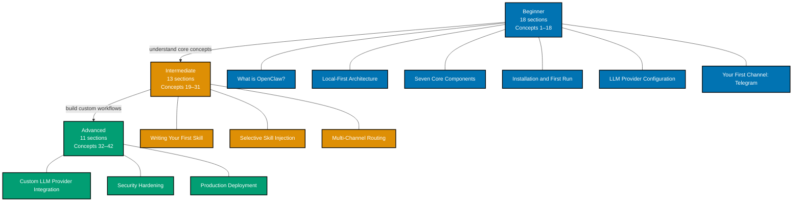

OpenClaw by concept teaches the framework through narrative explanation paired with
annotated code, organized into three progressive levels. Each level builds directly on
the previous: Beginner establishes vocabulary and mental models, Intermediate extends
those models into custom workflows, and Advanced addresses production concerns and
architectural extensibility.

## Learning Path

## What Each Level Covers

| Level            | Coverage | Sections | Who It Is For                                                         |
| ---------------- | -------- | -------- | --------------------------------------------------------------------- |
| **Beginner**     | 0–40%    | 18       | Anyone new to OpenClaw or autonomous agent frameworks                 |
| **Intermediate** | 40–75%   | 13       | Engineers ready to write custom skills and multi-agent workflows      |
| **Advanced**     | 75–95%   | 11       | Engineers deploying OpenClaw in production or extending the framework |

## Full Section Map

### Beginner — 18 Sections

1. [What is OpenClaw?](/en/learn/artificial-intelligence/tools/openclaw/by-concept/beginner#1-what-is-openclaw)
   — Agent framework vs. app, why messaging as UI, local-first meaning
2. [Local-First Architecture](/en/learn/artificial-intelligence/tools/openclaw/by-concept/beginner#2-local-first-architecture)
   — Why local, privacy implications, offline capability, latency advantages
3. [The Seven Core Components](/en/learn/artificial-intelligence/tools/openclaw/by-concept/beginner#3-the-seven-core-components)
   — Overview of Channel, Gateway, Skills, Runtime, Memory, LLM, Local Execution
4. [Installation and First Run](/en/learn/artificial-intelligence/tools/openclaw/by-concept/beginner#4-installation-and-first-run)
   — npm install or Homebrew, initial config wizard
5. [LLM Provider Configuration](/en/learn/artificial-intelligence/tools/openclaw/by-concept/beginner#5-llm-provider-configuration)
   — API key setup for Claude, GPT, DeepSeek; model selection; cost trade-offs
6. [Your First Channel: Telegram](/en/learn/artificial-intelligence/tools/openclaw/by-concept/beginner#6-your-first-channel-telegram)
   — BotFather, bot token, connecting OpenClaw to Telegram
7. [The Channel Abstraction](/en/learn/artificial-intelligence/tools/openclaw/by-concept/beginner#7-the-channel-abstraction)
   — What channels are, why 24+ platforms all look the same to the agent
8. [Gateway Fundamentals](/en/learn/artificial-intelligence/tools/openclaw/by-concept/beginner#8-gateway-fundamentals)
   — Local control plane, how it routes messages to the agent runtime
9. [Understanding AGENTS.md](/en/learn/artificial-intelligence/tools/openclaw/by-concept/beginner#9-understanding-agentsmd)
   — Purpose, format, what system instructions to put in it
10. [Understanding SOUL.md](/en/learn/artificial-intelligence/tools/openclaw/by-concept/beginner#10-understanding-soulmd)
    — Agent personality, name, tone, persona configuration
11. [Understanding TOOLS.md](/en/learn/artificial-intelligence/tools/openclaw/by-concept/beginner#11-understanding-toolsmd)
    — Tool capability declarations, what tools the agent can use
12. [What is a Skill?](/en/learn/artificial-intelligence/tools/openclaw/by-concept/beginner#12-what-is-a-skill)
    — SKILL.md format intro, natural-language instructions, examples section, tools section
13. [Installing Skills from ClawHub](/en/learn/artificial-intelligence/tools/openclaw/by-concept/beginner#13-installing-skills-from-clawhub)
    — Searching the registry, install command, verifying installation
14. [Using Built-in Skills](/en/learn/artificial-intelligence/tools/openclaw/by-concept/beginner#14-using-built-in-skills)
    — What ships by default, how to invoke skills in conversation
15. [The Agent Runtime Loop](/en/learn/artificial-intelligence/tools/openclaw/by-concept/beginner#15-the-agent-runtime-loop)
    — LLM → tool call → tool result → LLM cycle, how it terminates
16. [Memory Basics](/en/learn/artificial-intelligence/tools/openclaw/by-concept/beginner#16-memory-basics)
    — Conversation context, what gets remembered within a session
17. [Companion Apps](/en/learn/artificial-intelligence/tools/openclaw/by-concept/beginner#17-companion-apps)
    — macOS menu bar app, iOS/Android apps, sync across devices
18. [Security Foundations](/en/learn/artificial-intelligence/tools/openclaw/by-concept/beginner#18-security-foundations)
    — What permissions OpenClaw requests, prompt injection risk, minimal-permission principle

### Intermediate — 13 Sections

1. [Writing Your First Skill](/en/learn/artificial-intelligence/tools/openclaw/by-concept/intermediate#1-writing-your-first-skill)
   — SKILL.md anatomy in depth: instructions block, examples block, tools block
2. [Selective Skill Injection](/en/learn/artificial-intelligence/tools/openclaw/by-concept/intermediate#2-selective-skill-injection)
   — How OpenClaw decides relevance, token budget, injection algorithm
3. [Multi-Channel Routing](/en/learn/artificial-intelligence/tools/openclaw/by-concept/intermediate#3-multi-channel-routing)
   — Different channels mapped to different agent personas
4. [Agent Isolation](/en/learn/artificial-intelligence/tools/openclaw/by-concept/intermediate#4-agent-isolation)
   — Isolated workspace per channel/account, why this matters for privacy
5. [Memory System Deep Dive](/en/learn/artificial-intelligence/tools/openclaw/by-concept/intermediate#5-memory-system-deep-dive)
   — Semantic search over conversation history, embedding storage
6. [Knowledge Base Configuration](/en/learn/artificial-intelligence/tools/openclaw/by-concept/intermediate#6-knowledge-base-configuration)
   — Adding PDF and markdown documents, indexed retrieval
7. [Custom Tool Definitions in TOOLS.md](/en/learn/artificial-intelligence/tools/openclaw/by-concept/intermediate#7-custom-tool-definitions-in-toolsmd)
   — Declaring tools with JSON schema, permission scoping
8. [Multi-Agent Orchestration](/en/learn/artificial-intelligence/tools/openclaw/by-concept/intermediate#8-multi-agent-orchestration)
   — Running multiple OpenClaw instances, routing between agents
9. [Voice Mode](/en/learn/artificial-intelligence/tools/openclaw/by-concept/intermediate#9-voice-mode)
   — Wake word setup, voice input, TTS output, macOS/iOS only constraints
10. [Live Canvas and A2UI](/en/learn/artificial-intelligence/tools/openclaw/by-concept/intermediate#10-live-canvas-and-a2ui)
    — Agent-driven visual workspaces, what the A2UI protocol enables
11. [Debugging Agent Behavior](/en/learn/artificial-intelligence/tools/openclaw/by-concept/intermediate#11-debugging-agent-behavior)
    — Trace mode, logging, understanding why the LLM chose a tool
12. [Skill Composition](/en/learn/artificial-intelligence/tools/openclaw/by-concept/intermediate#12-skill-composition)
    — Combining multiple skills, resolving conflicts, ordering skills
13. [ClawHub: Discovering and Sharing Skills](/en/learn/artificial-intelligence/tools/openclaw/by-concept/intermediate#13-clawhub-discovering-and-sharing-skills)
    — Browsing the registry, packaging, publishing a skill

### Advanced — 11 Sections

1. [Custom LLM Provider Integration](/en/learn/artificial-intelligence/tools/openclaw/by-concept/advanced#1-custom-llm-provider-integration)
   — OpenAI-compatible APIs, local Ollama models, provider interface
2. [Gateway Customization](/en/learn/artificial-intelligence/tools/openclaw/by-concept/advanced#2-gateway-customization)
   — Custom routes, webhooks, event handling, extending the control plane
3. [Security Hardening](/en/learn/artificial-intelligence/tools/openclaw/by-concept/advanced#3-security-hardening)
   — Prompt injection defenses, sandboxing execution, scoped permissions, audit logging
4. [Building a Domain-Specific Agent](/en/learn/artificial-intelligence/tools/openclaw/by-concept/advanced#4-building-a-domain-specific-agent)
   — End-to-end: design, skills, channels, memory for a CRM agent
5. [Multi-Agent Patterns](/en/learn/artificial-intelligence/tools/openclaw/by-concept/advanced#5-multi-agent-patterns)
   — Specialist and orchestrator pattern, agent delegation, result aggregation
6. [Memory Persistence Architecture](/en/learn/artificial-intelligence/tools/openclaw/by-concept/advanced#6-memory-persistence-architecture)
   — Long-term episodic memory, knowledge graph integration
7. [ClawHub: Publishing Skills at Scale](/en/learn/artificial-intelligence/tools/openclaw/by-concept/advanced#7-clawhub-publishing-skills-at-scale)
   — Versioning, dependency management, testing skill packages
8. [OpenClaw and Pi Architecture](/en/learn/artificial-intelligence/tools/openclaw/by-concept/advanced#8-openclaw-and-pi-architecture)
   — How Pi (minimal agent harness) influenced OpenClaw's design
9. [Production Deployment](/en/learn/artificial-intelligence/tools/openclaw/by-concept/advanced#9-production-deployment)
   — Self-hosting considerations, reliability, monitoring, cost management
10. [Performance Optimization](/en/learn/artificial-intelligence/tools/openclaw/by-concept/advanced#10-performance-optimization)
    — Context window management, skill pruning, token cost reduction
11. [Contributing to OpenClaw](/en/learn/artificial-intelligence/tools/openclaw/by-concept/advanced#11-contributing-to-openclaw)
    — Codebase architecture (TypeScript core and Swift companion), PR workflow

## How Each Section Is Structured

Every section in this track follows a consistent six-part format:

1. **Concept title and introduction** — what the concept is, why it matters, how it connects
   to what came before (2–3 sentences)
2. **Diagram** — a Mermaid flowchart or architecture diagram when the concept involves
   multiple components, data flows, or state transitions; omitted for trivial operations
3. **Narrative explanation** — how the concept works, when to use it, trade-offs, best
   practices, and pitfalls (3–10 paragraphs)
4. **Annotated code examples** — 1–5 examples with dense inline annotations using `// =>`
   notation to document state, output, and reasoning at each step
5. **Key Takeaway** — the single most important insight from the section (1–2 sentences)
6. **Why It Matters** — how the concept connects to a real production concern such as cost,
   reliability, security, or scale (50–100 words)
