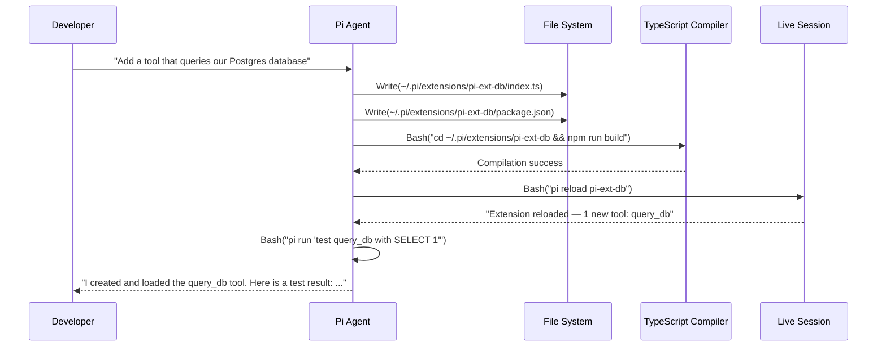
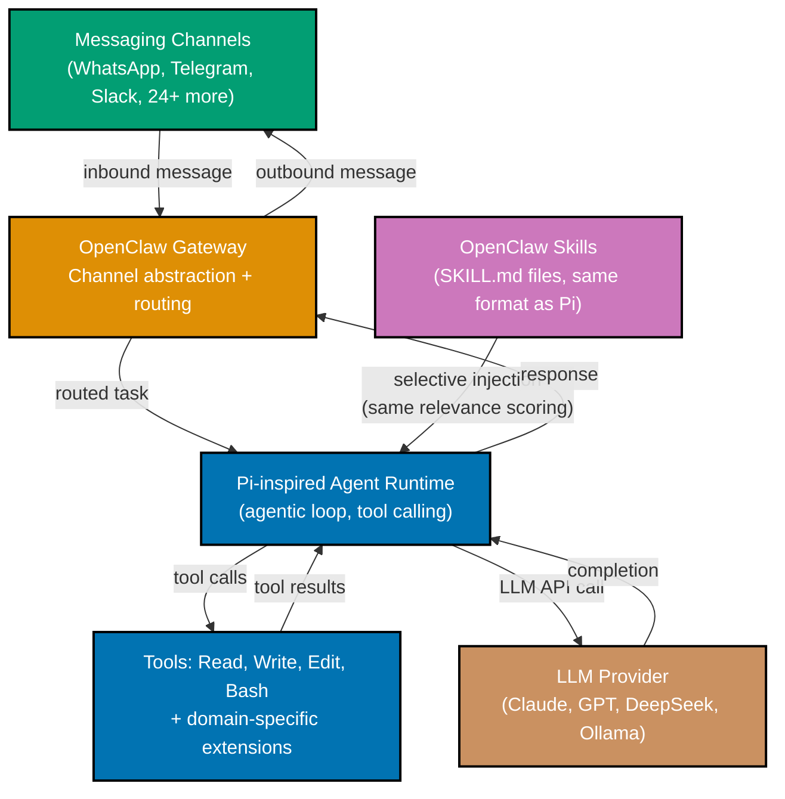
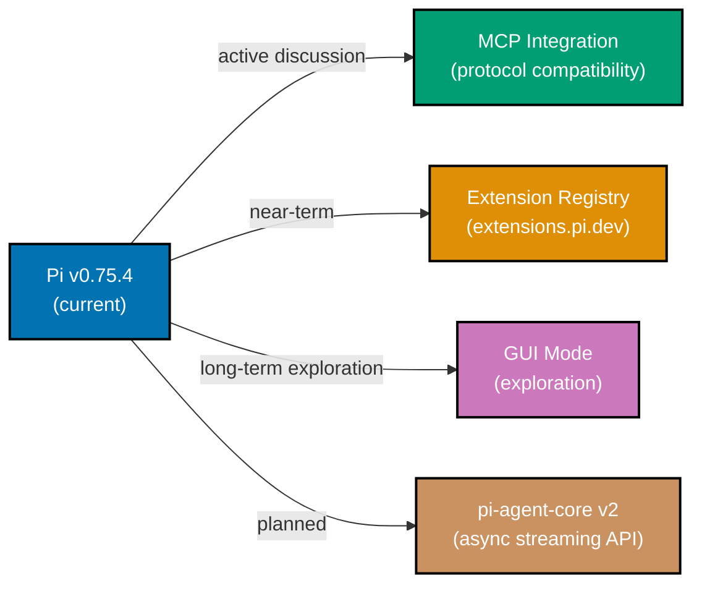

## Section 30: Self-Extensibility

Self-extensibility is Pi's most distinctive capability: the agent can write, compile, and
hot-reload its own TypeScript extension files during a session. You ask Pi to add a new tool,
Pi writes the extension code, compiles it with `tsc`, registers it via the reload API, and
the new tool is immediately available in the same session — no restart required.

This collapses the development loop for extensions from edit-rebuild-restart-test to a single
agent turn. The agent iterates on the extension by running its own tests, observing the
results, and making targeted edits — the same workflow a developer would use, but automated.



The self-extensibility workflow requires that Pi has write access to the extensions directory
and that a TypeScript compiler is available. The agent uses Pi's own Bash tool to compile and
the Pi reload API to register the new extension.

```typescript
// The conversation that triggers self-extensibility:
// You: "Add a tool that searches our PostgreSQL database for records by email"

// Pi writes this file autonomously:
// File: ~/.pi/extensions/pi-ext-db-search/index.ts

import { PiExtensionAPI, Tool } from "@earendil-works/pi-coding-agent";
import { Pool } from "pg"; // => pg is Node.js PostgreSQL client

// Pi reads DATABASE_URL from the environment — same pattern as project code
const pool = new Pool({
  connectionString: process.env.DATABASE_URL,
  // => Connection reused across tool calls (pooled)
});

const searchByEmailTool: Tool = {
  name: "search_by_email",
  description:
    "Search the database for user records matching an email address. " +
    "Returns the matching user record or 'not found'. Use this to look up " +
    "user data when debugging authentication or account issues.",
  parameters: {
    type: "object",
    properties: {
      email: {
        type: "string",
        description: "Email address to search for (exact match)",
      },
      table: {
        type: "string",
        description: "Table to search in (default: 'users')",
      },
    },
    required: ["email"],
  },
  execute: async ({ email, table = "users" }) => {
    // Parameterized query — never interpolate user input directly
    const result = await pool.query(
      `SELECT id, email, created_at, role FROM ${table} WHERE email = $1 LIMIT 1`,
      [email], // => $1 is bound to email — prevents SQL injection
    );
    // => pool.query uses prepared statement under the hood

    if (result.rows.length === 0) {
      return `No record found for email: ${email}`;
    }

    return JSON.stringify(result.rows[0], null, 2);
    // => Return as formatted JSON for LLM readability
  },
};

export default function setup(api: PiExtensionAPI): void {
  api.register(searchByEmailTool);
}
```

```bash
# Pi runs these commands autonomously during the self-extension workflow:

# 1. Write the extension files (Pi uses its Write tool)

# 2. Install dependencies
cd ~/.pi/extensions/pi-ext-db-search && npm install
# => added 8 packages in 2s

# 3. Compile TypeScript
npm run build
# => tsc -p tsconfig.json
# => (Output: dist/index.js)

# 4. Reload the extension into the live session
pi reload pi-ext-db-search
# => Extension reloaded: pi-ext-db-search
# => New tools available: search_by_email

# 5. Test the new tool
# (Pi sends a test message and observes the result in the same session)
```

Self-extensibility works best when you have a clear description of what the tool should do
and what data it needs access to. The agent performs best when the extension task is
concrete — "query the database", "call this specific API", "parse this log format" — rather
than abstract. Abstract extension requests produce working but generic code; concrete requests
produce tools tailored to your project.

**Key Takeaway:** Pi can write, compile, and hot-reload its own TypeScript extensions in a
live session — give it a concrete tool description and it will implement, test, and register
the tool without a session restart.

**Why It Matters:** Self-extensibility changes how you interact with Pi in a long session.
When you realize you need a capability that does not exist yet — a database query tool, an
API client — you do not have to pause the session, write the extension, rebuild, and restart.
The agent handles the extension creation as part of the session, and you continue without
losing context.

---

## Section 31: Building a Domain-Specific Agent

A domain-specific agent is a Pi-based application built with `pi-agent-core` that targets
one task category with a specialized system prompt, a curated tool set, and structured
output. Where a general Pi session can do anything, a domain-specific agent does one thing
well — and can be deployed, automated, and integrated into other systems.

The two most common patterns are: a code review agent that reads files and writes structured
findings, and a documentation agent that reads source code and writes or updates documentation.

```typescript
// Complete domain-specific agent: automated code review
// This is a standalone TypeScript application built on pi-agent-core

import { Agent, AnthropicProvider } from "@earendil-works/pi-agent-core";
import { readFile, writeFile } from "fs/promises";
import { execSync } from "child_process";
import * as path from "path";

// System prompt for the code review agent — narrow, specific, with output format
const REVIEW_SYSTEM_PROMPT = `
You are a code review agent specialized in TypeScript API code quality.

Your responsibilities:
1. Read the files specified in your task
2. Identify issues in these categories: security, correctness, performance, maintainability
3. Write all findings to review-report.md in the format specified below

Finding format (one per issue):
**[SEVERITY]** \`file.ts:line\` — concise description
Severity: CRITICAL | HIGH | MEDIUM | LOW | INFO

Rules:
- Do not modify source files — use Write only for review-report.md
- Do not run the application — use Bash only for grep, git, and static analysis
- Stop when you have reviewed all requested files and written the report
- If a file has no issues, note it explicitly: "file.ts — no issues found"
`.trim();

// Tools available to the review agent — intentionally restricted
function createReviewTools() {
  const readFileTool = {
    name: "Read",
    description: "Read a source file for review",
    parameters: {
      type: "object" as const,
      properties: {
        file_path: { type: "string" },
        offset: { type: "number" },
        limit: { type: "number" },
      },
      required: ["file_path"],
    },
    execute: async ({ file_path, offset, limit }: { file_path: string; offset?: number; limit?: number }) => {
      const content = await readFile(file_path, "utf-8");
      // => Read file contents — read-only, safe for untrusted repos
      const lines = content.split("\n");
      const start = offset ?? 0;
      const end = limit ? start + limit : lines.length;
      return lines.slice(start, end).join("\n");
    },
  };

  const writeTool = {
    name: "Write",
    description: "Write the review report to review-report.md only",
    parameters: {
      type: "object" as const,
      properties: {
        file_path: { type: "string" },
        content: { type: "string" },
      },
      required: ["file_path", "content"],
    },
    execute: async ({ file_path, content }: { file_path: string; content: string }) => {
      // Enforce the write restriction — only review-report.md is allowed
      if (!file_path.endsWith("review-report.md")) {
        return `Error: this agent may only write to review-report.md, not ${file_path}`;
        // => Return error string — agent sees it and adapts
      }
      await writeFile(file_path, content, "utf-8");
      return `Written: ${file_path}`;
    },
  };

  const bashTool = {
    name: "Bash",
    description: "Run grep, git log, or static analysis — no execution of application code",
    parameters: {
      type: "object" as const,
      properties: { command: { type: "string" } },
      required: ["command"],
    },
    execute: async ({ command }: { command: string }) => {
      // Allowlist: only safe, read-only commands
      const allowed = ["grep", "git log", "git diff", "git blame", "find", "wc", "cat"];
      const isAllowed = allowed.some((cmd) => command.trim().startsWith(cmd));
      // => Check command against allowlist

      if (!isAllowed) {
        return `Error: only read-only commands allowed (grep, git log, etc.)`;
        // => Reject disallowed commands explicitly
      }

      return execSync(command, { encoding: "utf-8" });
    },
  };

  return [readFileTool, writeTool, bashTool];
}

// The review agent application
async function runCodeReview(projectPath: string, filesToReview: string[]): Promise<string> {
  const agent = new Agent({
    provider: new AnthropicProvider({
      apiKey: process.env.ANTHROPIC_API_KEY!,
      model: "claude-opus-4-5", // => Strong model for nuanced review
    }),
    systemPrompt: REVIEW_SYSTEM_PROMPT,
    tools: createReviewTools(),
    maxTurns: 30, // => Safety limit for the agent loop
    cwd: projectPath, // => All file operations relative to project root
  });

  const fileList = filesToReview.map((f) => `- ${f}`).join("\n");
  const task = `Review these files and write findings to review-report.md:\n${fileList}`;

  const result = await agent.run(task); // => Runs the full agentic loop
  return result.response; // => Final text response (summary of what was done)
}

// Example usage
const findings = await runCodeReview("/path/to/project", [
  "src/auth/jwt.ts",
  "src/router/tasks.ts",
  "src/middleware/auth.ts",
]);

console.log(findings);
// => "I have reviewed 3 files and written findings to review-report.md.
// =>  Summary: 1 CRITICAL issue, 3 HIGH, 5 MEDIUM, 2 LOW, 3 INFO.
// =>  The CRITICAL issue is in src/auth/jwt.ts:47 — the JWT algorithm is not validated."
```

**Key Takeaway:** A domain-specific agent built on `pi-agent-core` uses a narrow system
prompt, a restricted tool set, and structured output format to do one thing reliably and
safely — ready for deployment in automation pipelines.

**Why It Matters:** Domain-specific agents are how you move from "Pi as a personal assistant"
to "Pi as a production component". A review agent that runs in CI on every PR, a docs agent
that runs nightly on changed files, a security scanner that blocks deployment on CRITICAL
findings — these are production uses that require the predictability and restriction that
a domain-specific agent provides.

---

## Section 32: Custom pi-tui Widgets

`pi-tui`'s differential rendering engine redraws only the cells that changed between two
frames. Understanding how this works internally helps you build complex widgets that remain
responsive even when the terminal is narrow or the data updates frequently.

Each component in `pi-tui` implements a `render()` method that returns a virtual DOM tree
of `Box`, `Text`, `Input`, and `Divider` nodes. The TUI engine diffs the current virtual
tree against the previous frame and generates the minimal set of terminal escape sequences
to update only the changed regions.

```typescript
import { TUIComponent, Box, Text, Divider, Color, TUIEngine } from "@earendil-works/pi-tui";

// A complex widget: live token usage meter with color-coded thresholds
class TokenUsageMeter implements TUIComponent {
  private current: number = 0;
  private limit: number = 200_000; // => Default: claude-sonnet-4-5 context limit

  constructor(private title: string) {}

  // Update data — TUI engine will call render() on the next frame
  update(current: number, limit: number): void {
    this.current = current;
    this.limit = limit;
    // => Calling update() marks this component as dirty
    // => TUI engine re-renders only this component on next frame
  }

  // Focus management — called when user tabs to this component
  onFocus(): void {
    // => This widget is display-only — no focus behavior
  }

  render(): Box {
    const pct = this.current / this.limit; // => 0.0 to 1.0
    const barWidth = 40; // => Total width of the progress bar in characters
    const filled = Math.round(pct * barWidth);
    // => Number of filled characters

    // Color coding: green below 60%, yellow 60–80%, red above 80%
    const barColor: Color =
      pct < 0.6
        ? "green" // => WCAG AA: green on dark terminal background
        : pct < 0.8
          ? "yellow" // => WCAG AA: yellow visible against dark background
          : "red"; // => WCAG AA: red signals critical threshold

    const bar = "█".repeat(filled) + "░".repeat(barWidth - filled);
    // => Unicode block characters for progress bar
    const percentage = `${Math.round(pct * 100)}%`;
    const counts = `${this.current.toLocaleString()} / ${this.limit.toLocaleString()} tokens`;

    return new Box({
      border: "single",
      title: this.title,
      width: 50, // => Fixed width — content clips if terminal narrower
      children: [
        new Text({
          content: bar,
          color: barColor, // => Color determined by threshold
        }),
        new Text({
          content: `${percentage}  ${counts}`,
          // => No color — white on dark terminal (default, highest contrast)
        }),
      ],
    });
    // => render() returns a pure virtual tree — no side effects
    // => The TUI engine diffs this against the previous frame
    // => Only changed cells are written to the terminal
  }
}

// Use the widget in a Pi extension
import { PiExtensionAPI } from "@earendil-works/pi-coding-agent";

export default function setup(api: PiExtensionAPI): void {
  const meter = new TokenUsageMeter("Context Window");

  api.registerComponent({
    id: "token-meter",
    position: "sidebar",
    component: meter,
  });

  // Update the meter on every turn
  api.onAfterTurn(async (turn, { session }) => {
    meter.update(session.contextTokens, session.modelContextLimit);
    // => Triggers re-render of only the meter widget
    // => Rest of the TUI is not redrawn
  });
}
```

Focus management is required for interactive widgets — widgets that accept keyboard input.
The TUI engine calls `onFocus()` and `onBlur()` when the user tabs to or away from your
widget. Interactive widgets also implement `onKeyPress(key: Key)` to handle keyboard events.

```typescript
import { TUIComponent, Box, Input, Key } from "@earendil-works/pi-tui";

// An interactive widget: a filter input for a log viewer
class FilterInput implements TUIComponent {
  private value: string = "";
  private focused: boolean = false;
  private onFilterChange: (filter: string) => void;

  constructor(onFilterChange: (filter: string) => void) {
    this.onFilterChange = onFilterChange;
  }

  onFocus(): void {
    this.focused = true; // => Mark as focused — render() shows active border
  }

  onBlur(): void {
    this.focused = false; // => Mark as unfocused — render() shows inactive border
  }

  onKeyPress(key: Key): boolean {
    if (key.name === "backspace") {
      this.value = this.value.slice(0, -1);
      // => Remove last character
    } else if (key.name === "escape") {
      this.value = ""; // => Clear filter on Escape
    } else if (key.char && !key.ctrl) {
      this.value += key.char; // => Append printable characters
    } else {
      return false; // => Key not handled — pass to parent
    }

    this.onFilterChange(this.value); // => Notify parent of filter change
    return true; // => Key handled — stop propagation
  }

  render(): Box {
    return new Box({
      border: this.focused ? "double" : "single",
      // => Double border when focused — visual feedback
      title: "Filter",
      children: [
        new Input({
          value: this.value,
          placeholder: "Type to filter...",
          focused: this.focused,
        }),
      ],
    });
  }
}
```

**Key Takeaway:** `pi-tui` components implement `render()` returning a virtual node tree;
the engine diffs frames and writes only changed terminal cells; interactive components
additionally implement `onFocus()`, `onBlur()`, and `onKeyPress()`.

**Why It Matters:** Differential rendering makes Pi's TUI feel responsive even on slow
terminal connections and during long streaming LLM responses. Understanding the rendering
model lets you build extensions whose custom widgets do not degrade this responsiveness —
expensive renders in a widget that rebuilds its entire subtree on every turn will cause
visible flicker.

---

## Section 33: Bedrock and Ollama for Air-Gapped Environments

Air-gapped or highly regulated environments cannot send code to external LLM APIs. Pi
supports two paths for local or on-premises LLM execution: AWS Bedrock (hosted Claude in
your AWS account, with data residency controls) and Ollama (fully local model execution,
no network required after model download).

Both paths use the same `pi-ai` provider interface — the only change is the provider
configuration. All Pi features (sessions, extensions, skills, RPC mode) work identically
regardless of which provider is active.

```bash
# --- Ollama setup (fully local, no external API calls) ---

# Install Ollama (macOS)
brew install ollama

# Start the Ollama server (runs locally on localhost:11434)
ollama serve
# => Ollama is running on http://localhost:11434

# Pull a code-capable model (done once; stored locally)
ollama pull codellama:13b
# => pulling manifest
# => pulling model weights: 7.4 GB
# => (This is the last network call — everything after is local)

# Pull a smaller model for faster iteration (less capable but faster)
ollama pull llama3.2:3b
# => pulling manifest
# => pulling model weights: 2.0 GB

# Start Pi with Ollama provider
pi --provider ollama --model codellama:13b
# => Pi v0.75.4
# => Provider: ollama (local) · Model: codellama:13b · Context: 0 tokens
# => (All LLM calls go to localhost:11434 — no external network traffic)

# Or configure in AGENTS.md for a project:
# pi-config:
#   provider: ollama
#   model: codellama:13b
#   api-base: http://localhost:11434  # Optional: change if Ollama runs on a different host
```

```bash
# --- AWS Bedrock setup (hosted Claude, in your AWS account) ---

# Configure AWS credentials (IAM role or access keys)
aws configure
# => AWS Access Key ID: AKIA...
# => AWS Secret Access Key: ...
# => Default region name: us-east-1
# => Default output format: json

# Ensure Claude models are enabled in Bedrock (AWS Console → Bedrock → Model access)
# Request access to: anthropic.claude-sonnet-4-5-v1  (or the version available in your region)

# Start Pi with Bedrock provider
pi --provider bedrock --model anthropic.claude-sonnet-4-5-v1
# => Pi v0.75.4
# => Provider: bedrock (us-east-1) · Model: anthropic.claude-sonnet-4-5-v1 · Context: 0 tokens
# => (LLM calls go to your AWS account's Bedrock endpoint — not to api.anthropic.com)

# Bedrock with a custom endpoint (for PrivateLink or VPC endpoint configurations)
pi --provider bedrock \
   --model anthropic.claude-sonnet-4-5-v1 \
   --api-base https://vpce-xxx.bedrock.us-east-1.vpce.amazonaws.com
# => (All traffic stays within your VPC — no public internet egress)
```

Latency differences between providers are significant and affect the usability of the
interactive TUI. Frontier API models (Anthropic, OpenAI) typically respond in 2–8 seconds
for a coding task turn. Bedrock hosted Claude is similar latency. Ollama with a 13B parameter
model on a modern MacBook Pro (M-series) is 8–20 seconds per turn. Ollama with a 3B model
is 3–8 seconds. For long-form generation (writing entire files), latency differences are
less noticeable; for rapid back-and-forth iteration, they are significant.

```typescript
// Configuring Bedrock with session-level token tracking for cost attribution

import { createProvider } from "@earendil-works/pi-ai";

const bedrockProvider = createProvider("bedrock", {
  region: "us-east-1",
  model: "anthropic.claude-sonnet-4-5-v1",
  // Optional: override the endpoint for PrivateLink
  endpoint: process.env.BEDROCK_ENDPOINT,
  // => Undefined uses default Bedrock endpoint
  // Optional: tag requests for AWS cost attribution
  requestTags: {
    "pi:project": process.env.PROJECT_NAME ?? "unknown",
    "pi:environment": process.env.ENVIRONMENT ?? "development",
  },
  // => Tags appear in AWS Cost Explorer under Bedrock usage
  // => Useful for attributing LLM costs to specific teams or projects
});
```

**Key Takeaway:** Use `--provider ollama` for fully local execution without network calls;
use `--provider bedrock` for hosted Claude in your AWS account with data residency controls
— both use the same Pi interface and feature set.

**Why It Matters:** Regulated industries (finance, healthcare, government) often cannot send
code to external LLM APIs due to data classification requirements. Bedrock hosted Claude
satisfies data residency requirements while providing Claude's capability. Ollama satisfies
air-gap requirements for environments with no external network access at all.

---

## Section 34: Session State Management Deep Dive

Pi sessions are stored as JSON files with a well-defined schema. Understanding the schema
lets you write extensions that add custom fields to session state, write migration scripts
when the schema changes, and build external tools that process session files.

The session file schema has three top-level keys: `metadata` (session identity and
provenance), `messages` (the full conversation history), and `state` (arbitrary key-value
store for extensions).

```typescript
// The Pi session file schema (TypeScript representation)

interface SessionFile {
  metadata: {
    id: string; // => UUID v4 — unique session identifier
    name: string; // => Human-readable name (from first message)
    createdAt: string; // => ISO 8601 timestamp
    updatedAt: string; // => ISO 8601 timestamp, updated on every turn
    parentId?: string; // => Present if this session is a branch
    branchPoint?: number; // => Turn index where this session branched
    provider: string; // => LLM provider name ("anthropic", "openai", etc.)
    model: string; // => Model name used in this session
    cwd: string; // => Working directory when session was created
    agentsMd?: string; // => Content of AGENTS.md at session start (snapshot)
    systemMd?: string; // => Content of SYSTEM.md if present (snapshot)
  };
  messages: Array<
    | { role: "user"; content: string }
    | { role: "assistant"; content: string | null; tool_calls?: ToolCall[] }
    | { role: "tool"; tool_call_id: string; content: string }
  >; // => Standard LLM message format with tool calls
  state: Record<string, unknown>; // => Extension-managed key-value store
}

interface ToolCall {
  id: string; // => Unique ID correlating tool call with tool result
  name: string; // => Tool name ("Read", "Write", "Edit", "Bash", or custom)
  arguments: Record<string, unknown>; // => Arguments the LLM passed to the tool
}
```

Extensions use the `state` object to persist data across turns within a session. Access
session state through the `api.session.state` API:

```typescript
import { PiExtensionAPI } from "@earendil-works/pi-coding-agent";

export default function setup(api: PiExtensionAPI): void {
  // Initialize extension state on first turn
  api.onSessionStart(async (session) => {
    if (!session.state["file-tracker"]) {
      session.state["file-tracker"] = {
        filesRead: [], // => Track which files the agent has read
        filesModified: [], // => Track which files the agent has modified
        startedAt: new Date().toISOString(),
      };
      await session.save(); // => Persist state to disk immediately
    }
  });

  // Update state when files are read or written
  api.onToolCall(async (toolCall, session) => {
    const tracker = session.state["file-tracker"] as {
      filesRead: string[];
      filesModified: string[];
      startedAt: string;
    };

    if (toolCall.name === "Read") {
      const path = toolCall.arguments.file_path as string;
      if (!tracker.filesRead.includes(path)) {
        tracker.filesRead.push(path); // => Track unique files read
        await session.save(); // => Persist after each update
      }
    }

    if (toolCall.name === "Write" || toolCall.name === "Edit") {
      const path = toolCall.arguments.file_path as string;
      if (!tracker.filesModified.includes(path)) {
        tracker.filesModified.push(path); // => Track unique files modified
        await session.save();
      }
    }
  });

  // Register a slash command to show the tracking summary
  api.registerCommand({
    name: "files",
    description: "Show files read and modified in this session",
    execute: async (_, { session }) => {
      const tracker = session.state["file-tracker"] as {
        filesRead: string[];
        filesModified: string[];
      };
      return [
        `Files read (${tracker.filesRead.length}):`,
        ...tracker.filesRead.map((f) => `  ${f}`),
        "",
        `Files modified (${tracker.filesModified.length}):`,
        ...tracker.filesModified.map((f) => `  ${f}`),
      ].join("\n");
    },
  });
}
```

Session migration handles schema changes when Pi releases new session file formats:

```typescript
// Migration script — run when upgrading Pi across major versions
import { readdir, readFile, writeFile } from "fs/promises";
import * as path from "path";

async function migrateSessions(sessionDir: string): Promise<void> {
  const files = await readdir(sessionDir);
  const sessionFiles = files.filter((f) => f.endsWith(".json"));

  for (const file of sessionFiles) {
    const filePath = path.join(sessionDir, file);
    const content = await readFile(filePath, "utf-8");
    const session = JSON.parse(content);

    // Example migration: v1 sessions had no 'state' field — add it
    if (!session.state) {
      session.state = {}; // => Initialize empty state for v1 sessions
      session.metadata.migratedAt = new Date().toISOString();
      // => Record migration timestamp
      await writeFile(filePath, JSON.stringify(session, null, 2), "utf-8");
      console.log(`Migrated: ${file}`);
    }
  }
}

await migrateSessions(path.join(process.env.HOME!, ".pi/sessions"));
```

**Key Takeaway:** Pi session files have a defined schema with `metadata`, `messages`, and
`state` fields; extensions use `session.state` for cross-turn persistence, and custom
migration scripts handle schema changes across Pi versions.

**Why It Matters:** Understanding the session schema lets you build external tools that
process Pi sessions — analytics dashboards, audit logs, session archives, search indexes.
The plain JSON format means any language and any tool can read and process Pi sessions
without Pi being installed.

---

## Section 35: Hot-Reloading Extensions

Hot-reloading allows extensions to be updated and reloaded into a running Pi session without
restarting. This is the mechanism behind self-extensibility (Section 30) and is also
invaluable during extension development: you edit a TypeScript file, compile it, and see
the change in the same session immediately.

The hot-reload API accepts an extension package name and reloads it from the extensions
directory. Pi unregisters the old extension's tools, commands, and hooks, then loads the
new version and registers its exports. The session's conversation history is preserved;
only the registered capabilities change.

```bash
# Start Pi with watch mode — auto-reloads extension on file change
pi --watch-extension pi-ext-my-tool
# => Pi v0.75.4
# => Extensions loaded: pi-ext-my-tool
# => Watching: ~/.pi/extensions/pi-ext-my-tool/src/ for changes

# Now edit your extension source file — Pi will recompile and reload automatically
# (In another terminal or editor:)
# vim ~/.pi/extensions/pi-ext-my-tool/src/index.ts
# (Make a change and save)

# Pi detects the change and reloads:
# => [hot-reload] Change detected: index.ts
# => [hot-reload] Compiling pi-ext-my-tool...
# => [hot-reload] Compilation success (0.8s)
# => [hot-reload] Unregistering old tools: my_tool
# => [hot-reload] Registering new tools: my_tool, my_tool_v2
# => [hot-reload] Extension reloaded in 1.2s
```

```typescript
// Triggering hot-reload programmatically from the Pi CLI API
// (This is what the self-extensibility workflow uses internally)

import { exec } from "child_process";
import { promisify } from "util";
const execAsync = promisify(exec);

async function buildAndReload(extensionName: string): Promise<string> {
  const extPath = `${process.env.HOME}/.pi/extensions/${extensionName}`;

  // Step 1: compile the TypeScript
  const { stdout: buildOutput } = await execAsync("npm run build", {
    cwd: extPath, // => Run tsc in the extension directory
  });
  // => buildOutput: "" on success, error text on failure

  // Step 2: reload via the Pi CLI API
  const { stdout: reloadOutput } = await execAsync(`pi reload ${extensionName}`);
  // => pi reload sends a reload signal to the running Pi session
  // => The session must be running in the same terminal (or RPC mode)

  return reloadOutput.trim();
  // => "Extension reloaded: my-extension\nNew tools: my_tool_v2"
}

// The Pi agent can call this function from a Bash tool call:
// Bash("node -e \"import('./build-reload.mjs').then(m => m.buildAndReload('pi-ext-my-tool'))\"")
```

Watch mode uses `fs.watch()` under the hood, which has known limitations on some Linux
filesystems (NFS, certain VMs). For remote development or containerized environments,
use explicit `pi reload <extension-name>` calls instead of watch mode.

```typescript
// Extension that enables explicit hot-reload via slash command
import { PiExtensionAPI } from "@earendil-works/pi-coding-agent";
import { exec } from "child_process";
import { promisify } from "util";
const execAsync = promisify(exec);

export default function setup(api: PiExtensionAPI): void {
  // /rebuild <extension-name> — compile and reload an extension on demand
  api.registerCommand({
    name: "rebuild",
    description: "Compile and reload an extension: /rebuild <extension-name>",
    execute: async (args, { session }) => {
      const extensionName = args.trim();
      if (!extensionName) {
        return "Usage: /rebuild <extension-name>";
      }

      const extPath = `${process.env.HOME}/.pi/extensions/${extensionName}`;

      try {
        // Compile
        await execAsync("npm run build", { cwd: extPath });
        // => Throws if compilation fails

        // Reload
        const { stdout } = await execAsync(`pi reload ${extensionName}`);

        return `Rebuilt and reloaded: ${extensionName}\n${stdout.trim()}`;
      } catch (error) {
        return `Build failed: ${(error as Error).message}`;
        // => Return error so agent can see and fix it
      }
    },
  });
}
```

**Key Takeaway:** `pi --watch-extension <name>` auto-reloads an extension on file change;
`pi reload <name>` triggers an explicit reload; both preserve session history and swap only
the registered tool and command definitions.

**Why It Matters:** Hot-reloading makes extension development feel like editing source code
in a running application rather than rebuilding and restarting a CLI tool. The development
loop for a Pi extension — edit, save, see the result in the same session — is fast enough
to iterate rapidly, which is why self-extensibility (Section 30) is practical.

---

## Section 36: OpenClaw + Pi: The Architectural Relationship

OpenClaw — the open-source autonomous agent framework that uses messaging platforms as its
UI — uses Pi internally as its agent runtime foundation. Understanding this relationship
clarifies both tools: Pi provides the low-level agentic loop and tool-calling primitives;
OpenClaw provides the channel abstraction, messaging integrations, and agent-to-agent
communication that Pi does not have built in.

The integration is not a dependency in the npm sense — OpenClaw does not `import` from
`@earendil-works/pi-agent-core` directly. It uses Pi's four-primitive philosophy and
architectural patterns as the model for its own agent runtime, and in some deployment
configurations uses Pi's RPC protocol to communicate between OpenClaw's channel layer
and the agent execution layer.



The shared design elements between Pi and OpenClaw are:

**SKILL.md format**: OpenClaw's Skills system uses the same `SKILL.md` file format as Pi.
A skill file written for Pi is compatible with OpenClaw and vice versa. Both systems use
relevance scoring to inject skills selectively per turn.

**Four primitives as the tool foundation**: OpenClaw's agent runtime starts with the same
four primitives — Read, Write, Edit, Bash — and extends them with messaging-specific tools
(send message, read inbox, create channel). The primitive-first design is explicitly borrowed
from Pi.

**Provider-agnostic LLM calls**: Both Pi and OpenClaw use a unified provider interface that
normalizes API calls across providers. The interface is functionally equivalent, though the
implementation is separate.

**Self-extensibility**: OpenClaw supports the same self-extensibility pattern — the agent
writes and registers its own skill files and tool extensions during a session.

```typescript
// A SKILL.md that works identically in both Pi and OpenClaw
// The format is the same — copy this file to either system's skills directory

/*
# Git Workflow Skill

## When to use this skill
Apply this skill when the user asks about git operations, branch management,
committing changes, or reviewing git history.

## Conventions
- Always check `git status` before making any git operations
- Use conventional commit format: type(scope): description
- Never force-push to main or master
- Create a branch before making changes if on main

## Common operations
- Check status: `git status`
- Stage specific files: `git add path/to/file` (never `git add .`)
- Commit: `git commit -m "type(scope): description"`
- Push: `git push origin branch-name`
*/
```

Where Pi and OpenClaw diverge is in their primary use case. Pi is optimized for interactive
terminal sessions driven by a developer. OpenClaw is optimized for asynchronous automation
driven by messages from any of 24+ channels. A Pi session has a human at the keyboard;
an OpenClaw agent runs unattended and communicates through messaging platforms.

**Key Takeaway:** OpenClaw uses Pi's four-primitive philosophy, SKILL.md format, and
provider-agnostic LLM design as its architectural foundation — skills and tools written
for Pi transfer directly to OpenClaw deployments.

**Why It Matters:** If your team uses Pi for interactive development and wants to automate
the same workflows through Slack or Telegram, OpenClaw is the natural path — the skills,
tool patterns, and provider configurations you have built in Pi transfer without rewriting.
Understanding the architectural relationship prevents duplicate work.

---

## Section 37: CI/CD Integration with RPC Mode

Pi's RPC mode makes it usable in CI/CD pipelines as a structured code reviewer, security
scanner, or documentation checker. A CI step starts Pi in RPC mode, sends it a task, reads
the JSON response, and uses the response to pass or fail the build. No human interaction
required; no TUI needed.

The most common CI use case is an automated code review step that runs on every pull request.
Pi reads the changed files (from `git diff`), analyzes them against the project's conventions,
and writes structured findings. The CI step fails if CRITICAL or HIGH findings are present.

```yaml
# GitHub Actions workflow: pi-code-review.yml
name: Pi Code Review

on:
  pull_request:
    types: [opened, synchronize]

jobs:
  review:
    runs-on: ubuntu-latest
    steps:
      - uses: actions/checkout@v4
        with:
          fetch-depth: 0 # => Fetch full history for git diff

      - uses: actions/setup-node@v4
        with:
          node-version: "20"

      - name: Install Pi
        run: npm install -g @earendil-works/pi-coding-agent

      - name: Run Pi code review
        id: review
        env:
          ANTHROPIC_API_KEY: ${{ secrets.ANTHROPIC_API_KEY }}
        run: |
          # Get list of changed TypeScript files
          CHANGED_FILES=$(git diff --name-only origin/${{ github.base_ref }}...HEAD \
            | grep '\.ts$' | head -20)
          # => Limit to 20 files — prevents runaway context usage on large PRs

          if [ -z "$CHANGED_FILES" ]; then
            echo "No TypeScript files changed — skipping review"
            exit 0
          fi

          FILE_LIST=$(echo "$CHANGED_FILES" | tr '\n' ' ')

          # Run Pi in JSON mode with a review task
          REVIEW_OUTPUT=$(pi --json --system-prompt-file .ci/review-system.md \
            "Review these changed files for CRITICAL and HIGH severity issues: $FILE_LIST")
          # => --json wraps the response in a JSON envelope
          # => --system-prompt-file loads the review system prompt from the repo

          # Save the full review output
          echo "$REVIEW_OUTPUT" > /tmp/pi-review.json

          # Extract the text response
          RESPONSE=$(echo "$REVIEW_OUTPUT" | jq -r '.result.response')
          echo "Review findings:"
          echo "$RESPONSE"

          # Fail if CRITICAL or HIGH issues are found
          if echo "$RESPONSE" | grep -qE '\*\*(CRITICAL|HIGH)\*\*'; then
            echo "::error::Pi review found CRITICAL or HIGH severity issues"
            exit 1
          fi
```

```markdown
<!-- .ci/review-system.md — Pi system prompt for CI review -->
<!-- Loaded with --system-prompt-file in the CI step above -->

You are an automated code review agent running in CI.

Your task: review the specified TypeScript files for issues.

Output format — for each issue found, write exactly:
**[SEVERITY]** `file.ts:line` — concise description

Severity levels:

- CRITICAL: security vulnerability, data loss risk, will cause production incident
- HIGH: likely bug, significant performance issue, violates security best practice
- MEDIUM: maintainability concern, unclear logic, missing error handling
- LOW: style concern, minor inefficiency, could be improved

After listing issues, write one line:
SUMMARY: N_CRITICAL critical, N_HIGH high, N_MEDIUM medium, N_LOW low

Rules:

- Do not modify files — Read and Bash only
- If a file has no issues above MEDIUM severity, write: `file.ts` — no critical issues
- Stop after reviewing all requested files
```

```bash
# Test the CI workflow locally before pushing
# (Set ANTHROPIC_API_KEY in your environment first)

CHANGED_FILES="src/auth/jwt.ts src/router/tasks.ts"
pi --json --system-prompt-file .ci/review-system.md \
  "Review these files: $CHANGED_FILES" | jq -r '.result.response'
# => **[HIGH]** `src/auth/jwt.ts:47` — JWT algorithm not validated against allowlist
# => **[MEDIUM]** `src/router/tasks.ts:23` — Missing input validation on 'limit' parameter
# => SUMMARY: 0 critical, 1 high, 1 medium, 0 low
```

**Key Takeaway:** Use `pi --json` in CI pipelines with a review-focused system prompt to
produce structured findings; parse the JSON response with `jq` and fail the build on
CRITICAL or HIGH findings.

**Why It Matters:** Automated Pi review in CI provides a consistent, tireless reviewer
that applies the same checks to every PR — without requiring a human reviewer to look at
every change. It catches the mechanical issues (missing validation, unsafe patterns) so
human reviewers can focus on design and architecture.

---

## Section 38: Production Hardening

Running Pi against unfamiliar or untrusted repositories — third-party code, user-submitted
projects, automated pipelines — requires hardening beyond the default configuration. The
default Pi setup trusts the repository it runs in: it will read, write, and execute whatever
it finds. In a production environment where the input is not fully trusted, that trust must
be scoped down.

Production hardening covers four areas: execution isolation, input sanitization, rate
limiting, and audit logging.

```bash
# --- Execution isolation using Docker ---

# Run Pi in a Docker container with restricted capabilities
docker run \
  --rm \                                 # => Remove container after session ends
  --network none \                      # => No network access (for fully isolated review)
  --read-only \                         # => Root filesystem is read-only
  --tmpfs /tmp:rw,noexec,size=100m \   # => Writable /tmp, no exec, 100MB limit
  --tmpfs /workspace:rw,size=500m \    # => Writable workspace, 500MB limit
  -v "$(pwd):/workspace:ro" \          # => Mount project as read-only
  -e ANTHROPIC_API_KEY \               # => Pass API key from environment
  earendil/pi:0.75.4 \                 # => Pinned version — not :latest
  pi --cwd /workspace --json "Review /workspace/src/ for security issues"
# => (Pi runs inside the container — no write access to host filesystem)
# => (No network means the agent cannot call external APIs via Bash)
```

```typescript
// Input sanitization for Bash tool in an extension that processes untrusted input

import { Tool } from "@earendil-works/pi-coding-agent";
import { execSync } from "child_process";

// Sanitized Bash tool — replaces the default Bash for untrusted repo sessions
const sanitizedBashTool: Tool = {
  name: "Bash",
  description:
    "Execute read-only shell commands. Only grep, find, cat, head, tail, wc, " +
    "git log, git diff, and git blame are permitted.",
  parameters: {
    type: "object",
    properties: {
      command: { type: "string" },
    },
    required: ["command"],
  },
  execute: async ({ command }) => {
    // Allowlist: only safe, read-only commands
    const ALLOWED_PREFIXES = [
      "grep ",
      "find ",
      "cat ",
      "head ",
      "tail ",
      "wc ",
      "git log",
      "git diff",
      "git blame",
      "ls ",
      "stat ",
    ];

    const trimmed = command.trim();
    const isAllowed = ALLOWED_PREFIXES.some((prefix) => trimmed.startsWith(prefix));

    if (!isAllowed) {
      return `Command not permitted in sandboxed mode: ${trimmed.split(" ")[0]}`;
      // => Return error string — agent adapts behavior
    }

    // Additional check: no semicolons or pipes that could chain unsafe commands
    if (trimmed.includes(";") || trimmed.includes("|") || trimmed.includes("&&")) {
      return "Command chaining is not permitted in sandboxed mode";
    }

    try {
      return execSync(trimmed, {
        encoding: "utf-8",
        timeout: 10_000, // => 10-second timeout prevents hung commands
        maxBuffer: 1_000_000, // => 1MB output limit prevents context flooding
      });
    } catch (error) {
      return `Command failed: ${(error as Error).message}`;
    }
  },
};
```

```typescript
// Rate limiting: prevent runaway sessions from exhausting API quota

import { PiExtensionAPI } from "@earendil-works/pi-coding-agent";

export default function setup(api: PiExtensionAPI): void {
  let turnCount = 0;
  let tokenCount = 0;
  const MAX_TURNS = 50; // => Stop after 50 turns (prevents infinite loops)
  const MAX_TOKENS = 500_000; // => Stop after 500K tokens (cost guard)

  api.onBeforeTurn(async (turn, { session, abort }) => {
    turnCount++;
    tokenCount = session.contextTokens;

    if (turnCount > MAX_TURNS) {
      abort(`Session limit reached: ${MAX_TURNS} turns. Start a new session.`);
      // => abort() stops the turn and sends message to user
    }

    if (tokenCount > MAX_TOKENS) {
      abort(`Token limit reached: ${tokenCount.toLocaleString()} tokens. Compact or branch.`);
    }
  });

  // Audit log: write every tool call to a structured log file
  api.onToolCall(async (toolCall, session) => {
    const logEntry = {
      timestamp: new Date().toISOString(),
      sessionId: session.metadata.id,
      tool: toolCall.name,
      arguments: toolCall.arguments, // => Full arguments — review for sensitive data
    };

    const logLine = JSON.stringify(logEntry) + "\n";
    await import("fs/promises").then((fs) => fs.appendFile("/var/log/pi-audit.log", logLine, "utf-8"));
    // => One JSON line per tool call — parseable with jq for auditing
  });
}
```

**Key Takeaway:** Production hardening for Pi combines Docker container isolation with a
restricted Bash tool allowlist, turn/token rate limits, and structured audit logging of
every tool call.

**Why It Matters:** Running Pi against untrusted code without hardening creates a path for
the LLM to be manipulated by prompt injection in source files — malicious code could
contain instructions that cause the agent to exfiltrate data or execute harmful commands.
Allowlisting Bash commands and running in an isolated container eliminate these attack vectors.

---

## Section 39: Contributing to Pi

Pi is open source at [github.com/earendil-works/pi](https://github.com/earendil-works/pi).
Contributing requires understanding the monorepo structure, building the packages from
source, running the test suite, and following the PR conventions. The codebase is
93.4% TypeScript.

```bash
# Clone the Pi monorepo
git clone https://github.com/earendil-works/pi.git
cd pi

# Install dependencies for all packages (Turborepo manages the workspace)
npm install
# => (Installs dependencies for all packages in packages/)

# Explore the monorepo structure
ls packages/
# => pi-ai/           — Unified LLM API (@earendil-works/pi-ai)
# => pi-agent-core/   — Agent runtime (@earendil-works/pi-agent-core)
# => pi-coding-agent/ — CLI + TUI (@earendil-works/pi-coding-agent)
# => pi-tui/          — Terminal UI library (@earendil-works/pi-tui)

# Build all packages in dependency order (Turborepo handles ordering)
npm run build
# => turbo run build
# => pi-ai: tsc completed in 1.2s
# => pi-tui: tsc completed in 0.9s
# => pi-agent-core: tsc completed in 1.8s
# => pi-coding-agent: tsc completed in 2.1s

# Run the full test suite
npm run test
# => turbo run test
# => pi-ai: 47 tests passed
# => pi-tui: 23 tests passed
# => pi-agent-core: 89 tests passed
# => pi-coding-agent: 134 tests passed
# => All packages: 293 tests passed

# Run tests for a specific package
cd packages/pi-agent-core
npm run test
# => 89 tests passed in 4.2s

# Build and link locally for development testing
npm run build
npm link                                 # => Makes @earendil-works/pi-agent-core available locally
# => In another project: npm link @earendil-works/pi-agent-core
```

The test suite uses Vitest for all packages. Unit tests live next to source files
(`src/foo.ts` → `src/foo.test.ts`). Integration tests that require a real LLM API call
are in `tests/integration/` and are skipped unless `PI_RUN_INTEGRATION_TESTS=1` is set.

```bash
# Run integration tests (requires ANTHROPIC_API_KEY or OPENAI_API_KEY)
PI_RUN_INTEGRATION_TESTS=1 npm run test
# => (Runs live LLM calls — takes longer and costs real API tokens)

# Check TypeScript types without building
npm run typecheck
# => turbo run typecheck

# Lint all packages
npm run lint
# => turbo run lint

# Format code
npm run format
# => prettier --write "packages/**/src/**/*.ts"
```

PR conventions for Pi follow conventional commits and require passing CI for all four
packages. The most important contribution areas open as of v0.75.4 are: additional LLM
providers in `pi-ai`, differential rendering performance improvements in `pi-tui`, and
community extension documentation.

**Key Takeaway:** Pi's monorepo uses Turborepo with `npm run build` for all packages and
`npm run test` for all 293 tests; integration tests behind `PI_RUN_INTEGRATION_TESTS=1`
require a real LLM API key.

**Why It Matters:** Understanding the monorepo build and test setup is the prerequisite for
contributing. The four-package structure means changes to `pi-ai` (the LLM abstraction)
propagate to `pi-agent-core`, `pi-coding-agent`, and potentially `pi-tui` — Turborepo's
build ordering ensures the packages are always built in the right sequence.

---

## Section 40: Future of Pi

Pi's community roadmap as of v0.75.4 reflects the priorities of the Earendil Inc team and
community contributors. Three directions are actively discussed: MCP (Model Context Protocol)
integration, GUI mode exploration, and ecosystem growth through the community extension
registry.

**MCP Integration** is the most-requested feature on Pi's GitHub. The Model Context Protocol,
developed by Anthropic, is a standard protocol for connecting LLMs to external data sources
and tools. Pi's current extension system and MCP overlap significantly — both define tools
via a schema and execute them in response to LLM requests. The open question is whether Pi
should natively speak MCP (making any MCP server usable as a Pi tool source) or continue
with its own extension format. The community discussion is at
[github.com/earendil-works/pi/discussions/412](https://github.com/earendil-works/pi/discussions/412).

**GUI mode** is an area of exploration, not a committed roadmap item. Several contributors
have proposed a lightweight Electron or Tauri wrapper around the Pi TUI that would provide
a window-based interface for users who prefer a GUI. The technical challenge is that Pi's
TUI rendering is tightly coupled to terminal escape codes — a GUI renderer would require
either `pi-tui`'s rendering model to be abstracted (significant work) or a separate
rendering backend. No timeline exists for this.

**Community extension registry** is the ecosystem growth initiative most likely to ship
soon. The current state is `npm search pi-ext-` as the discovery mechanism, which is
fragile and hard to curate. A planned registry at
[extensions.pi.dev](https://extensions.pi.dev) would provide browsable, rated, and
vetted extensions with install-in-one-click support from the Pi TUI (`/ext install <name>`).



The `pi-agent-core` v2 API is a planned internal change that replaces the current
synchronous `agent.run()` method with a streaming async iterator. This lets callers
process tool calls and LLM responses as they arrive rather than waiting for the full
turn to complete — important for embedding Pi in applications where streaming feedback
is expected.

```typescript
// Future pi-agent-core v2 streaming API (planned, not yet released)

// Current (v0.x):
const result = await agent.run("Review src/auth.ts");
// => Waits for entire turn to complete before returning
// => result.response = "I found 2 issues..."

// Planned (v2):
for await (const event of agent.stream("Review src/auth.ts")) {
  if (event.type === "tool_call") {
    console.log(`Tool: ${event.name}(${JSON.stringify(event.arguments)})`);
    // => Printed immediately when the LLM decides to call a tool
  } else if (event.type === "tool_result") {
    console.log(`Result: ${event.result.slice(0, 100)}...`);
    // => Printed immediately after the tool executes
  } else if (event.type === "text_delta") {
    process.stdout.write(event.delta); // => Stream text token by token as it arrives
  } else if (event.type === "done") {
    console.log("\nTurn complete"); // => Turn is fully complete
  }
}
// => Callers see tool calls and responses progressively — no waiting for completion
```

Participating in Pi's direction is straightforward. The GitHub Discussions tab at
[github.com/earendil-works/pi](https://github.com/earendil-works/pi) is the primary
forum for roadmap input. The `#pi-dev` channel on the Earendil Discord is where
contributors discuss implementation details. First-time contributors should start with
issues labeled `good-first-issue` — these are scoped, well-described, and include
pointers to the relevant code.

**Key Takeaway:** Pi's near-term roadmap focuses on MCP integration compatibility and a
community extension registry; GUI mode is a long-term exploration; the `pi-agent-core`
v2 streaming API is a planned internal change with broad impact on embedders.

**Why It Matters:** Understanding where Pi is heading helps you make architectural decisions
about extensions and integrations that will stay compatible. Extensions that use the
current `api.register()` interface will continue working when MCP is added — MCP support
will be additive, not a replacement. The streaming API change in `pi-agent-core` v2 will
require updates to custom embedder code, so keeping embedder code thin and isolated from
the response-handling layer makes the migration easier.
