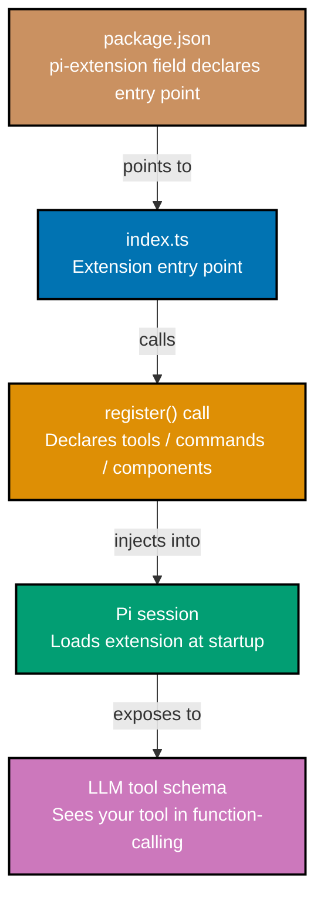
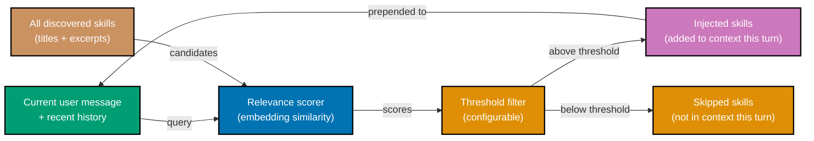
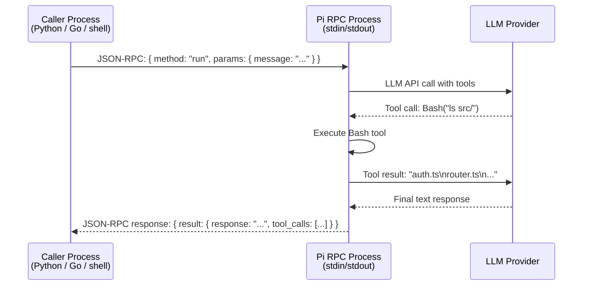

## Section 17: Writing a Custom TypeScript Extension

A Pi extension is a TypeScript module that registers additional tools, slash commands, or TUI
components into the current session. Writing one requires understanding three things: the
extension anatomy (how files are laid out), the `register()` call (how capabilities are
declared to Pi), and the `package.json` shape (what tells Pi this package is an extension).

Extensions are the mechanism Pi uses to grow beyond its four primitives without changing the
core. Every capability beyond Read, Write, Edit, and Bash comes from an extension — whether
installed from the community or written by you. The extension API is intentionally simple:
a single `register()` function call that takes an object describing your tool, command, or
component.



The minimal extension has three files: `package.json`, `index.ts`, and optionally a
`SKILL.md` that gives the LLM natural-language guidance on when to use the extension's tools.

```json
// package.json — the pi-extension field is what Pi looks for when scanning
// the extensions directory. Without it, Pi ignores the package.
{
  "name": "pi-ext-grep-symbols",
  "version": "1.0.0",
  "description": "Search for symbols across a codebase",
  "main": "dist/index.js", // => Compiled output — Pi loads this file
  "pi-extension": {
    "entry": "dist/index.js", // => Pi reads this field to find the entry point
    "version": "1" // => Extension API version (currently "1")
  },
  "scripts": {
    "build": "tsc", // => Compile TypeScript to dist/
    "watch": "tsc --watch" // => Watch mode for hot-reload during development
  },
  "dependencies": {},
  "devDependencies": {
    "typescript": "^5.4.0",
    "@earendil-works/pi-coding-agent": "^0.75.0" // => Types for Tool, register(), etc.
  }
}
```

```typescript
// index.ts — the extension entry point
// Pi imports this module and calls the default export with the Pi API object

import { PiExtensionAPI, Tool } from "@earendil-works/pi-coding-agent";
// => Import types from the Pi package

// Define the tool your extension provides
const grepSymbolsTool: Tool = {
  name: "grep_symbols", // => Name the LLM uses in function-calling
  description:
    "Search for a TypeScript or JavaScript symbol across all source files. " +
    "Use this to find where a function, class, or variable is defined or used.",
  // => LLM reads this description to decide when to call
  parameters: {
    type: "object",
    properties: {
      symbol: {
        type: "string", // => The symbol name to search for
        description: "Symbol name to search (function, class, variable, type)",
      },
      path: {
        type: "string", // => Directory to search in
        description: "Directory to search in (default: current directory)",
      },
    },
    required: ["symbol"], // => path is optional; symbol is required
  },
  execute: async ({ symbol, path = "." }, { bash }) => {
    // => execute receives tool arguments and Pi's built-in tool helpers
    // => bash() is Pi's Bash tool, available to extensions for shell execution

    const result = await bash(`grep -r --include='*.ts' --include='*.js' -n "${symbol}" ${path}`); // => grep with TypeScript/JS file filter, line numbers

    if (!result.stdout.trim()) {
      return `No occurrences of '${symbol}' found in ${path}`;
      // => Return a string — Pi sends this as tool_result
    }

    return result.stdout; // => Return grep output; LLM analyzes the matches
  },
};

// Extension entry point — Pi calls this function when loading the extension
export default function setup(api: PiExtensionAPI): void {
  api.register(grepSymbolsTool); // => Register the tool with Pi's session
  // => Tool is now available to the LLM immediately
}
```

Build and install the extension:

```bash
# Compile the TypeScript extension
npm run build
# => tsc -p tsconfig.json
# => (Output written to dist/index.js)

# Install the extension into Pi's extensions directory
npm install --prefix ~/.pi/extensions .
# => (Links or copies the built package into ~/.pi/extensions/node_modules/pi-ext-grep-symbols/)

# Start Pi — extension loads automatically
pi
# => Pi v0.75.4
# => Extensions loaded: pi-ext-grep-symbols
# => Provider: anthropic · Model: claude-sonnet-4-5 · Context: 0 tokens
```

**Key Takeaway:** A Pi extension is a TypeScript module with a `pi-extension` field in
`package.json` and a default export that calls `api.register()` with your tool definition.

**Why It Matters:** Writing your own extensions means the agent gains exactly the capability
your project needs — a tool that knows your database schema, your test framework's output
format, or your CI system's API — without those capabilities being part of Pi's core or
anyone else's session.

---

## Section 18: Registering Custom Tools

Registering a tool is the act of adding a capability to Pi's active session. Once registered,
the tool appears in the LLM's function-calling schema, which means the LLM can choose to
call it on any subsequent turn. The Tool interface defines what the LLM knows about the
tool and what Pi does when the LLM calls it.

The three fields that matter most are `name`, `description`, and `parameters`. The LLM uses
these fields — not your TypeScript implementation — to decide when and how to call the tool.
A poorly written description means the LLM will either overuse the tool (calling it when it
is not appropriate) or underuse it (not calling it when it would help). A poorly written
parameter schema means the LLM will pass the wrong arguments and your `execute` function will
receive unexpected input.

```typescript
import { Tool, PiExtensionAPI } from "@earendil-works/pi-coding-agent";

// A tool that runs the project's test suite and returns structured results
const runTestsTool: Tool = {
  name: "run_tests",

  // Good description: specific about what it does, when to use it, what it returns
  description:
    "Run the project's Vitest test suite and return a structured summary of " +
    "results including pass/fail counts and failure details. Use this after " +
    "making code changes to verify the change does not break existing tests.",
  // => LLM uses this paragraph to decide: "should I call run_tests now?"
  // => The "Use this after making code changes" phrase guides the LLM's timing

  parameters: {
    type: "object",
    properties: {
      filter: {
        type: "string",
        description:
          "Optional test name filter — only run tests matching this string. " +
          "Example: 'auth' runs only tests with 'auth' in their name.",
        // => Description guides LLM on when to set this field
      },
      bail: {
        type: "boolean",
        description:
          "If true, stop after the first test failure. Useful for fast feedback " +
          "when debugging a specific failure. Default: false.",
      },
    },
    required: [], // => All parameters are optional — LLM can call with {}
  },

  execute: async ({ filter, bail = false }, { bash }) => {
    // Build the vitest command from parameters
    const filterFlag = filter ? `--reporter=verbose -t "${filter}"` : "";
    // => -t is Vitest's test name filter flag

    const bailFlag = bail ? "--bail" : ""; // => --bail stops after first failure

    const result = await bash(`npx vitest run ${filterFlag} ${bailFlag} --reporter=json 2>&1`); // => --reporter=json gives structured output
    // => 2>&1 captures stderr too (Vitest logs there)

    // Parse Vitest JSON output into a readable summary
    try {
      const report = JSON.parse(result.stdout);
      // => Vitest JSON output has numPassedTests, numFailedTests, etc.
      const passed = report.numPassedTests; // => Count of passing tests
      const failed = report.numFailedTests; // => Count of failing tests
      const failures = report.testResults // => Array of test file results
        .flatMap((f: any) => f.testResults) // => Flatten to individual test results
        .filter((t: any) => t.status === "failed")
        .map((t: any) => `  FAIL: ${t.fullName}\n    ${t.failureMessages[0]}`)
        .join("\n"); // => Format failures for LLM readability

      return [`Tests: ${passed} passed, ${failed} failed`, failures ? `\nFailures:\n${failures}` : ""].join("");
      // => Returns: "Tests: 47 passed, 2 failed\nFailures:\n  FAIL: auth > validates JWT..."
    } catch {
      return result.stdout; // => Fallback: return raw output if JSON parse fails
    }
  },
};

export default function setup(api: PiExtensionAPI): void {
  api.register(runTestsTool); // => Adds run_tests to the LLM's tool schema
  // => From this point forward, the LLM can call run_tests on any turn
}
```

Error handling in the `execute` function matters. When `execute` throws an exception, Pi
catches it and returns the error message to the LLM as a `tool_result` with an error flag.
The LLM can then decide whether to retry, ask you for help, or take a different approach.
Return a descriptive error string from `execute` rather than throwing when the error is
recoverable — this gives the LLM more context for its decision.

```typescript
// Error handling pattern for tool execute functions
execute: async ({ symbol, path = "." }, { bash }) => {
  try {
    const result = await bash(`grep -r "${symbol}" ${path}`);

    if (result.exitCode !== 0 && !result.stdout) {
      // => exitCode non-zero with no output means grep found nothing
      return `No matches for '${symbol}' in ${path}`;
                                          // => Descriptive return — LLM understands and adapts
    }

    return result.stdout;
  } catch (error) {
    // => Catch unexpected errors (permission denied, path not found, etc.)
    return `grep_symbols failed: ${(error as Error).message}`;
                                          // => Return error as string — LLM sees this as tool_result
                                          // => LLM can then decide to try a different path or approach
  }
},
```

**Key Takeaway:** The `description` and `parameters` fields in a Tool definition are what
the LLM reads to decide when and how to call your tool — write them from the LLM's
perspective, not the implementor's.

**Why It Matters:** A well-designed tool description is the difference between a tool that
gets used at the right moments and a tool that gets called constantly on every turn or
ignored entirely. The quality of your tool's description directly determines the quality of
the agent's behavior.

---

## Section 19: Skills System

A skill in Pi is a `SKILL.md` markdown file that provides the LLM with natural-language
instructions, examples, and guidance for a specific domain or task. Skills differ from tools
in a fundamental way: tools give the LLM a new capability it can execute; skills give the
LLM knowledge about how to use existing capabilities more effectively.

A skill file can describe: best practices for working with a specific framework, the
conventions of a specific codebase, the expected format for a specific output, or guidance
for navigating a complex domain. The LLM reads the skill content and incorporates it into
its reasoning, without you having to repeat the guidance in every message.

````markdown
<!-- Example skill file: .pi/skills/vitest-conventions/SKILL.md -->
<!-- This skill teaches the agent how the project uses Vitest -->

# Vitest Test Conventions for This Project

## Test File Location

Tests live next to the source files they test, with a `.test.ts` suffix:

- `src/auth/jwt.ts` → `src/auth/jwt.test.ts`
- `src/router/tasks.ts` → `src/router/tasks.test.ts`

Never place tests in a separate `tests/` or `__tests__/` directory.

## Test Structure

Each test file follows this structure:

```typescript
import { describe, it, expect, beforeEach, vi } from "vitest";

describe("ModuleName", () => {
  beforeEach(() => {
    vi.clearAllMocks(); // Always clear mocks between tests
  });

  describe("functionName", () => {
    it("does the expected behavior when given valid input", () => {
      // Arrange
      // Act
      // Assert with expect()
    });

    it("throws when given invalid input", () => {
      expect(() => functionName(badInput)).toThrow("Expected error message");
    });
  });
});
```
````

## Mocking Rules

- Use `vi.mock()` at the top of the file for module mocks
- Use `vi.spyOn()` for function-level mocks within tests
- Never mock `src/lib/logger.ts` — let tests exercise real logging behavior
- Database calls must always be mocked — never hit a real DB in unit tests

## Running Tests

- Single file: `npx vitest run src/auth/jwt.test.ts`
- Watch mode: `npx vitest src/auth/jwt.test.ts`
- Coverage: `npx vitest run --coverage`

````

Skills are stored in a `skills/` directory under `.pi/` in your home directory or your
project directory. Pi scans both locations. You can also specify a skills directory in
`AGENTS.md`. Skill selection per turn is covered in Section 20.

```bash
# Create a skills directory for your project
mkdir -p .pi/skills/vitest-conventions

# Create the skill file
# (Write the SKILL.md content as shown above)
vim .pi/skills/vitest-conventions/SKILL.md

# Verify Pi discovers the skill at startup
pi
# => Pi v0.75.4
# => Skills discovered: vitest-conventions (local)
# => Provider: anthropic · Model: claude-sonnet-4-5 · Context: 0 tokens

# The LLM now has access to vitest conventions when relevant turns come up
# You do not need to tell Pi to use the skill — selection is automatic (Section 20)
````

Skills and tools compose well. An extension that registers a `run_tests` tool (Section 18)
pairs naturally with a `vitest-conventions` skill that tells the LLM when to run tests,
how to interpret the results, and which test file to look at when a test fails. The tool
provides the execution capability; the skill provides the reasoning guidance.

**Key Takeaway:** A skill is a `SKILL.md` file that gives the LLM natural-language guidance
for a domain — not a new execution capability, but knowledge that improves how the LLM uses
existing capabilities.

**Why It Matters:** Skills allow you to encode team conventions, framework expertise, and
project-specific knowledge in a form the LLM can actually use. Instead of repeating "our
tests live next to source files" in every session, you write it once in a skill file and
the LLM applies it consistently.

---

## Section 20: Dynamic Skill Injection

Pi does not inject every discovered skill into every turn's context. Instead, it uses a
relevance scoring algorithm to select which skills are relevant to the current turn and
injects only those. This keeps the context window from growing linearly with the number of
skills in your system.

Relevance scoring uses the content of the current user message and the recent conversation
history as a query. Each skill's title, description, and first 200 characters of content
are compared against the query. Skills above the relevance threshold are injected into the
context for that turn; skills below the threshold are not. The threshold is configurable.



The scoring mechanism is embedding-based similarity by default. Pi computes an embedding
vector for the query (user message + recent history) and compares it against pre-computed
embeddings for each skill's summary. Skills are re-embedded when their `SKILL.md` file
changes. Embeddings are cached in `.pi/skill-embeddings.json`.

You can configure injection behavior in `AGENTS.md`:

```markdown
# AGENTS.md excerpt — skill injection configuration

## Pi Skills Configuration

skills:
threshold: 0.72 # Relevance cutoff (0.0–1.0; default: 0.70)
max-injected: 3 # Maximum skills injected per turn (default: 5)
always-inject: # Skills always injected regardless of score - project-conventions
never-inject: # Skills never injected (useful for debugging) - legacy-api-reference
```

```typescript
// You can also control skill injection programmatically in an extension

import { PiExtensionAPI, Skill } from "@earendil-works/pi-coding-agent";

const databaseSkill: Skill = {
  name: "database-conventions",
  content: `
# Database Access Conventions

Always use Prisma client for database access. Never write raw SQL.
Connection string is in DATABASE_URL environment variable.
Migrations live in prisma/migrations/ — never edit them directly.
  `,
  // => Inline skill defined in TypeScript — useful for extension-specific guidance
  alwaysInject: false, // => Let relevance scoring decide injection
  priority: 1.0, // => Higher priority = preferred over same-score skills
};

export default function setup(api: PiExtensionAPI): void {
  api.registerSkill(databaseSkill); // => Register inline skill alongside SKILL.md files
  // => Both types participate in relevance scoring
}
```

Debugging skill injection is straightforward. When `pi --verbose` is set, Pi logs which
skills were scored, which were above threshold, and which were injected on each turn. This
lets you tune the threshold and the skill content until injection happens at the right times.

```bash
# Run Pi in verbose mode to see skill injection decisions
pi --verbose
# => [skills] Scoring 4 skills for turn 1
# => [skills] vitest-conventions: 0.84 (INJECT — above threshold 0.70)
# => [skills] database-conventions: 0.31 (skip — below threshold)
# => [skills] git-workflow: 0.22 (skip — below threshold)
# => [skills] project-conventions: always-inject (INJECT)
# => [skills] Injecting 2 skills (total: 847 tokens)
```

**Key Takeaway:** Pi injects skills selectively per turn using embedding-based relevance
scoring — only skills above the configured threshold appear in context, keeping token
usage proportional to relevance.

**Why It Matters:** Selective injection is what makes a large skill library practical. If
all skills were injected on every turn, the context would fill with irrelevant guidance.
Relevance scoring ensures the LLM gets the right knowledge at the right time, at a token
cost proportional to what it actually needs.

---

## Section 21: Context Window Management

The context window is the LLM's working memory for a session. Every token in the context
window is sent to the LLM on every turn, which means the context window directly determines
both the cost and the quality of each LLM call. Pi provides three mechanisms for managing
the context window: auto-compaction, manual compaction, and branching.

Auto-compaction triggers when the context reaches approximately 80% of the model's context
limit. Pi sends a compaction prompt to the LLM asking it to summarize the older parts of
the conversation, then replaces those turns in the history with the summary. The most recent
turns (configurable, default: last 8) are always kept verbatim to preserve immediate context.

```bash
# Monitor context growth during a session
/stats
# => Session: 2026-05-21T10-15-00__implement-search
# => Turns: 42
# => Context tokens: 156,832 / 200,000 (78.4%)
# => Auto-compaction will trigger at ~160,000 tokens
# => Estimated cost so far: $0.31

# Trigger manual compaction before the limit
/compact
# => Compacting 34 older turns...
# => Summary generated (1,247 tokens)
# => Before: 156,832 tokens (42 turns)
# => After: 24,391 tokens (8 turns verbatim + summary)
# => Saved: 132,441 tokens
```

The compaction summary is generated by the LLM itself. Pi sends the older portion of the
conversation and asks the LLM to produce a dense summary of: what was accomplished, what
decisions were made, what files were changed, and what the current state is. This summary
replaces the raw turns in the context. The quality of auto-compaction depends on the model
— stronger models produce more accurate and useful summaries.

Branching (Section 9) is an alternative to compaction when you are switching to a genuinely
different task. Compaction keeps you in the same session with a summary of what happened.
Branching creates a new session that inherits only the context up to the branch point.
Use compaction when you want to continue the same task with a lighter context; use branching
when you want to pivot to a different task.

```typescript
// Configure compaction behavior in an extension or AGENTS.md

// In AGENTS.md:
// pi-config:
//   context:
//     compaction-threshold: 0.75    # Trigger at 75% of model limit (default: 0.80)
//     verbatim-tail: 12             # Keep last 12 turns verbatim (default: 8)
//     compaction-model: claude-haiku-4-5  # Use a cheaper model for compaction itself

// In an extension — programmatically control compaction:
import { PiExtensionAPI } from "@earendil-works/pi-coding-agent";

export default function setup(api: PiExtensionAPI): void {
  // Register a slash command that triggers compaction + reports savings
  api.registerCommand({
    name: "compact-report", // => /compact-report in the TUI
    description: "Compact context and show token savings report",
    execute: async (_, { session, compact }) => {
      const before = session.contextTokens; // => Token count before compaction
      await compact(); // => Trigger compaction
      const after = session.contextTokens; // => Token count after
      const saved = before - after; // => Tokens saved

      return [
        `Compaction complete`,
        `Before: ${before.toLocaleString()} tokens`,
        `After:  ${after.toLocaleString()} tokens`,
        `Saved:  ${saved.toLocaleString()} tokens (${Math.round((saved / before) * 100)}%)`,
      ].join("\n");
    },
  });
}
```

Understanding what the compaction algorithm preserves is important for working with it
effectively. Verbatim preservation at the tail means the LLM always has precise context
for the most recent actions. The summary covers older material, but summaries lose detail —
specific variable names, exact error messages, and precise file contents from early in the
session may be paraphrased. If accuracy for older material is critical, use `/branch` to
start a fresh session and explicitly re-read the relevant files.

**Key Takeaway:** Pi auto-compacts the context when it reaches 80% of the model's limit by
summarizing older turns; use `/compact` to trigger this manually, and prefer `/branch` when
switching to a genuinely different task.

**Why It Matters:** Context management is the operational skill that separates developers who
can run Pi sessions for hours on large codebases from those who hit context limits and have
to restart. Understanding when to compact, when to branch, and what the compaction algorithm
preserves gives you control over session quality across long work sessions.

---

## Section 22: Branching Sessions for Code Review

Branching for code review is a concrete workflow pattern that demonstrates why tree-structured
sessions matter. When you branch a session at the point where a feature is complete, the
review branch inherits the full context of the feature development — the files changed, the
decisions made, the tests written — without the review messages mixing into the development
session's history.

The review branch can explore the code independently: read files, run analysis tools,
compare against conventions, check for security issues. When the review is complete, the
findings live in the review branch. The development session remains clean. You merge the
useful findings back manually — Pi does not auto-merge branches.

```bash
# Development session: you've just completed implementing a JWT auth module
# Session: 2026-05-21T09-00-00__implement-jwt-auth (22 turns, 34,000 tokens)

# Branch from the current point for review
/branch review-jwt-security
# => Branched from: implement-jwt-auth (turn 22)
# => New session: 2026-05-21T11-30-00__review-jwt-security
# => Context: 34,000 tokens (22 turns — identical to branch point)
# => (You are now in the review branch)

# In the review branch, ask for a security-focused review
# "Review the JWT authentication implementation for security issues.
#  Check token expiry validation, algorithm validation, and secret key handling."

# The agent reads the relevant files and produces findings:
# => Tool call: Read("src/auth/jwt.ts")
# => Tool call: Read("src/auth/middleware.ts")
# => Tool call: Bash("grep -n 'secret\\|key\\|algorithm' src/auth/jwt.ts")
# => Response: "I found 3 issues: [1] The algorithm is not validated... [2] ..."

# Share the review session for the PR
/share --title "JWT auth security review"
# => Session shared: https://gist.github.com/yourusername/abc123...

# Return to the development session (it is unchanged)
/load implement-jwt-auth
# => Resuming session: implement-jwt-auth (22 turns, 34,000 tokens)
# => (Development session is exactly as you left it)
```

Code review branches work best when they start from a clean branch point — after a feature
is complete, not in the middle of development. A branch point mid-development inherits
incomplete code, which makes the review findings harder to act on.

Multiple review branches from the same point are also valid. Branch once for security review,
once for performance review, once for API contract review. Each branch has focused findings
without cross-contaminating the others.

**Key Takeaway:** Branch from a completed feature session to create a clean review context
that inherits all the development context without mixing review messages into the
development history.

**Why It Matters:** Code review sessions generate their own conversation context — the agent
reads files, asks clarifying questions, proposes fixes. Keeping this separate from the
development session means the development session stays coherent as a record of what was
built and why, while the review session stays coherent as an independent audit.

---

## Section 23: RPC Protocol Mode

Pi's RPC protocol mode exposes the agent over JSON-RPC, allowing another process or
application to drive Pi programmatically. In RPC mode, Pi reads JSON-RPC 2.0 requests from
stdin and writes JSON-RPC 2.0 responses to stdout. A caller sends a `run` request with a
message, Pi processes the turn (LLM call + tool execution), and sends back the response.

RPC mode is how you embed Pi inside another tool without using the agent-core SDK directly.
It lets you keep Pi's session management, extension loading, and context engineering features
while driving it from a different language (Python, Go, Rust) or a different process.



```bash
# Start Pi in RPC mode — reads from stdin, writes to stdout
pi --rpc
# => (Pi is now listening for JSON-RPC messages on stdin)
# => (No TUI rendered — pure stdin/stdout protocol)

# Send a run request (in a separate terminal or from a caller process)
echo '{"jsonrpc":"2.0","id":1,"method":"run","params":{"message":"List TypeScript files in src/"}}' | pi --rpc
# => {"jsonrpc":"2.0","id":1,"result":{
# =>   "response":"Here are the TypeScript files in src/:\n- auth.ts\n- router.ts\n- index.ts",
# =>   "tool_calls":[
# =>     {"name":"Bash","input":{"command":"find src/ -name '*.ts'"},"result":"src/auth.ts\nsrc/router.ts\nsrc/index.ts\n"}
# =>   ],
# =>   "tokens":{"input":342,"output":67}
# => }}
```

```python
# Calling Pi's RPC mode from Python
import subprocess
import json

class PiRPCClient:
    def __init__(self, cwd: str, model: str = None):
        # Start Pi in RPC mode as a subprocess
        cmd = ["pi", "--rpc", "--cwd", cwd]
        if model:
            cmd.extend(["--model", model])      # => Optional model override

        self.process = subprocess.Popen(
            cmd,
            stdin=subprocess.PIPE,              # => We write JSON-RPC to stdin
            stdout=subprocess.PIPE,             # => We read JSON-RPC from stdout
            text=True,
        )
        self._request_id = 0

    def run(self, message: str) -> dict:
        self._request_id += 1
        request = {
            "jsonrpc": "2.0",
            "id": self._request_id,             # => Unique ID per request for correlation
            "method": "run",
            "params": {"message": message},
        }

        # Send request to Pi's stdin
        self.process.stdin.write(json.dumps(request) + "\n")
        self.process.stdin.flush()              # => Flush required — Pi reads line by line

        # Read response from Pi's stdout
        line = self.process.stdout.readline()  # => Blocks until Pi finishes the turn
        return json.loads(line)                # => Parse JSON-RPC response

    def close(self):
        self.process.terminate()

# Usage
client = PiRPCClient(cwd="/path/to/project")

result = client.run("What is the main entry point of this application?")
# => result["result"]["response"] = "The main entry point is src/index.ts..."
# => result["result"]["tool_calls"] = [{"name": "Bash", "input": {...}, "result": "..."}]

client.close()
```

RPC mode supports session management through additional JSON-RPC methods: `branch` to create
a branch, `load` to load an existing session, `stats` to query token usage. The full RPC
schema is documented at [pi.dev/docs/rpc](https://pi.dev/docs/rpc).

**Key Takeaway:** `pi --rpc` exposes the agent over JSON-RPC on stdin/stdout, letting any
language or process drive Pi programmatically while keeping Pi's session and extension
features intact.

**Why It Matters:** RPC mode makes Pi composable at the process level. You can integrate
Pi's reasoning into scripts, automate multi-step workflows, and embed Pi in existing tools
that were not written in TypeScript — without rewriting the agent logic yourself.

---

## Section 24: SDK Embedding: pi-agent-core

`@earendil-works/pi-agent-core` is the agent runtime package underneath the Pi CLI. Using
it as a library gives you the complete agentic loop — LLM call, tool execution, result
feeding, loop termination — as a TypeScript API you instantiate and control. This is the
right approach when you want to build your own CLI, web server, or application that embeds
an agent with Pi's behavior.

The SDK gives you more control than RPC mode (you write TypeScript, not JSON-RPC), but
requires more setup — you instantiate the agent, configure the provider, register tools,
and run the loop yourself.

```typescript
import { Agent, AnthropicProvider, Tool } from "@earendil-works/pi-agent-core";

// Define the tools your embedded agent will use
const readTool: Tool = {
  name: "read_file",
  description: "Read the contents of a file",
  parameters: {
    type: "object",
    properties: {
      path: { type: "string", description: "File path to read" },
    },
    required: ["path"],
  },
  execute: async ({ path }) => {
    const { readFile } = await import("fs/promises");
    return readFile(path, "utf-8"); // => Reads file, returns content as string
  },
};

const bashTool: Tool = {
  name: "bash",
  description: "Execute a shell command",
  parameters: {
    type: "object",
    properties: {
      command: { type: "string" },
    },
    required: ["command"],
  },
  execute: async ({ command }) => {
    const { exec } = await import("child_process");
    const { promisify } = await import("util");
    const execAsync = promisify(exec);

    const { stdout, stderr } = await execAsync(command);
    // => Executes command, captures stdout + stderr
    return stdout || stderr; // => Return whichever has content
  },
};

// Create and configure the agent
const agent = new Agent({
  provider: new AnthropicProvider({
    apiKey: process.env.ANTHROPIC_API_KEY!, // => API key from environment
    model: "claude-sonnet-4-5", // => Model to use for this agent
  }),
  systemPrompt: `You are a code review agent. Read source files and identify
issues. Write findings to review.md. Do not modify source files.`,
  // => Custom system prompt — replaces Pi's default
  tools: [readTool, bashTool], // => Register tools for this agent instance
  maxTurns: 20, // => Safety limit — stop after 20 tool call turns
});

// Run the agent on a task and get the result
async function reviewFile(filePath: string): Promise<string> {
  const result = await agent.run(`Review ${filePath} for code quality issues and security vulnerabilities.`);
  // => agent.run() executes the full agentic loop:
  // => 1. Send system prompt + user message to LLM
  // => 2. If LLM calls a tool, execute it, feed result back
  // => 3. Repeat until LLM produces a final text response
  // => 4. Return the final text response

  return result.response; // => Final LLM text response (the review)
}

// Call the agent
const review = await reviewFile("src/auth/jwt.ts");
console.log(review);
// => "I found 2 issues in src/auth/jwt.ts:
// => 1. [HIGH] The JWT algorithm is not validated against an allowlist...
// => 2. [MEDIUM] The token expiry is set to 7 days — consider shorter-lived tokens..."
```

The `Agent` class manages conversation state internally. Successive calls to `agent.run()`
in the same instance continue the same conversation — history is preserved between calls.
Create a new `Agent` instance for each independent conversation or task.

```typescript
// Using Agent for a multi-turn conversation from code
const agent = new Agent({ provider, systemPrompt, tools });

// First turn
await agent.run("Read package.json and tell me the project name");
// => "This project is named 'my-api' (version 1.2.3)."

// Second turn — agent has context from the first turn
await agent.run("What scripts are defined in package.json?");
// => "The package.json defines: start, build, test, and lint scripts."
// => (Agent already has package.json contents in context from first turn)

// Access conversation history
console.log(agent.messages.length);
// => 6 (2 user turns + 2 assistant turns + 2 tool turns for the Read calls)
```

**Key Takeaway:** `@earendil-works/pi-agent-core` provides the `Agent` class — instantiate
it with a provider, system prompt, and tools, then call `agent.run()` to execute the full
agentic loop from TypeScript code.

**Why It Matters:** SDK embedding is how you build production systems that use an agent as
a component. A code review service, a documentation generator, an automated refactoring
pipeline — all of these can be built on `pi-agent-core` without building the agentic loop
yourself.

---

## Section 25: pi-tui: Terminal UI Components

`@earendil-works/pi-tui` is Pi's terminal UI library, which powers the TUI you see when you
run `pi` interactively. The library provides a component model for terminal UIs with
differential rendering — only changed regions of the screen are redrawn, which keeps the
display responsive even when output is streaming.

You can use `pi-tui` independently to build other terminal applications, or use it within a
Pi extension to add custom display components to the Pi TUI itself.

```typescript
import { TUI, Box, Text, Input, ScrollPane } from "@earendil-works/pi-tui";

// Create a simple TUI application
const app = new TUI({
  fullscreen: true, // => Take over the entire terminal
  title: "My Pi Extension Dashboard",
});

// Define a layout with a scrollable output pane and an input field
const layout = app.createLayout({
  direction: "column", // => Stack children vertically
  children: [
    new ScrollPane({
      id: "output", // => Reference this pane by id to update content
      flex: 1, // => Take all available vertical space
      content: [], // => Start empty — we'll push content here
    }),
    new Box({
      height: 3, // => Fixed height for the input area
      border: "single", // => Draw a single-line border around the input
      children: [
        new Input({
          id: "input",
          placeholder: "Type a command...",
          onSubmit: (value) => handleInput(value),
          // => Called when user presses Enter
        }),
      ],
    }),
  ],
});

app.render(layout); // => Draw the initial layout to the terminal

// Update the output pane with new content (differential rendering)
function appendOutput(text: string): void {
  const outputPane = app.getComponent<ScrollPane>("output");
  outputPane.push(new Text({ content: text }));
  // => Only the new Text node is redrawn
  // => Existing content is not redrawn (differential)
  outputPane.scrollToBottom(); // => Auto-scroll to show newest content
  app.render(); // => Apply the diff to the terminal
}
```

Building a custom pane in a Pi extension works through `api.registerComponent()`. Your
component renders into a dedicated area in the Pi TUI:

```typescript
import { PiExtensionAPI, TUIComponent, Box, Text } from "@earendil-works/pi-coding-agent";

// A custom TUI component that shows live test status
class TestStatusPane implements TUIComponent {
  private status: "idle" | "running" | "passing" | "failing" = "idle";
  private summary: string = "";

  // Pi calls render() when the component needs to draw itself
  render(): Box {
    const statusColor = {
      idle: "gray",
      running: "yellow",
      passing: "green",
      failing: "red",
    }[this.status];
    // => Map status to a terminal color

    return new Box({
      border: "single",
      title: "Test Status",
      children: [
        new Text({
          content: this.status.toUpperCase(),
          color: statusColor, // => pi-tui handles terminal color codes
        }),
        new Text({ content: this.summary }),
      ],
    });
  }

  // Update the component's state (triggers re-render)
  update(status: typeof this.status, summary: string): void {
    this.status = status;
    this.summary = summary;
    // => Pi will call render() on the next frame
  }
}

export default function setup(api: PiExtensionAPI): void {
  const testPane = new TestStatusPane();

  // Register the component — Pi adds it to the TUI layout
  api.registerComponent({
    id: "test-status",
    position: "sidebar", // => Display in Pi's sidebar area
    component: testPane,
  });

  // Update the component from a tool's execute function
  api.register({
    name: "run_tests",
    description: "Run tests and update the test status pane",
    parameters: { type: "object", properties: {}, required: [] },
    execute: async (_, { bash }) => {
      testPane.update("running", "Running...");
      // => Update pane immediately when tests start

      const result = await bash("npx vitest run --reporter=json 2>&1");

      try {
        const report = JSON.parse(result.stdout);
        const passed = report.numPassedTests;
        const failed = report.numFailedTests;

        testPane.update(failed > 0 ? "failing" : "passing", `${passed} passed, ${failed} failed`);
        // => Update pane with results
        return `Tests: ${passed} passed, ${failed} failed`;
      } catch {
        testPane.update("failing", "Parse error");
        return result.stdout;
      }
    },
  });
}
```

**Key Takeaway:** `pi-tui` provides a component model with differential rendering; use
`api.registerComponent()` in an extension to add custom display areas to the Pi TUI.

**Why It Matters:** Custom TUI components let you surface information that the agent is
tracking — test status, token usage, file change count — in a persistent display that
updates in real time without scrolling through conversation history to find the latest state.

---

## Section 26: Supply-Chain Hardening

Pi ships with supply-chain hardening for the CLI package: pinned exact dependency versions
and an `npm-shrinkwrap.json` that locks the full dependency tree including transitive
dependencies. For a CLI tool that executes arbitrary shell commands on behalf of an LLM,
supply-chain integrity is not optional — a compromised transitive dependency could execute
malicious commands in any session.

Understanding Pi's hardening approach helps you apply the same practices to extensions you
write and distribute.

```bash
# Inspect Pi's shrinkwrap file — this locks every transitive dependency
cat "$(npm root -g)/@earendil-works/pi-coding-agent/npm-shrinkwrap.json" | jq '.lockfileVersion'
# => 3   ← npm lockfile version 3 (npm 7+)

# Verify package integrity against the shrinkwrap
npm audit --prefix "$(npm root -g)/@earendil-works/pi-coding-agent"
# => found 0 vulnerabilities
# => (Pi's shrinkwrap pins versions that are CVE-clean as of the release date)

# Check an individual package's integrity hash
cat "$(npm root -g)/@earendil-works/pi-coding-agent/npm-shrinkwrap.json" | \
  jq '.packages["node_modules/some-dep"].integrity'
# => "sha512-AbCdEf..." ← SHA-512 hash of the published package tarball
# => npm verifies this hash on install — tampered packages will not install
```

Apply the same hardening to your own extensions:

```bash
# In your extension's package.json, pin ALL dependencies to exact versions
# (No ^ or ~ prefixes — exact pins only)
# package.json:
# {
#   "dependencies": {
#     "some-package": "1.2.3"    ← exact, not "^1.2.3" or "~1.2.3"
#   }
# }

# Generate a shrinkwrap file for your extension before publishing
cd your-extension/
npm shrinkwrap
# => wrote npm-shrinkwrap.json with 47 packages

# Audit your extension's dependencies
npm audit
# => found 0 vulnerabilities
# => (Fix any findings before publishing — do not ship extensions with known CVEs)

# Pin your TypeScript and Node.js versions for reproducibility
# .nvmrc or .node-version in your extension root:
echo "20.19.0" > .node-version
# => Users running your extension on Node.js 20.19.0 have the same behavior as you
```

```typescript
// Supply-chain-hardened extension: explicit imports, no dynamic require()

// GOOD — static import, resolved at build time
import { execSync } from "child_process";
// => Static import — bundler can verify this

// BAD — dynamic require with variable input is a supply-chain risk
// const mod = require(userProvidedModuleName);
// => Never do this in an extension — dynamic require with external input
// => can load arbitrary code if the input is not strictly validated

// GOOD — if you must load modules dynamically, validate the name against an allowlist
const ALLOWED_FORMATTERS = ["prettier", "eslint", "tsc"] as const;
type Formatter = (typeof ALLOWED_FORMATTERS)[number];

async function runFormatter(name: Formatter, file: string): Promise<string> {
  // => TypeScript type ensures 'name' is one of the three allowed strings
  // => The union type is the allowlist — nothing outside it can pass type checking
  const { execAsync } = await import("./utils");
  return execAsync(`npx ${name} ${file}`);
}
```

**Key Takeaway:** Pi pins all dependencies with exact versions and `npm-shrinkwrap.json`
to lock the full transitive tree; apply the same pattern to extensions you distribute.

**Why It Matters:** A coding agent runs code on your machine with your shell permissions.
A compromised dependency in the agent's package tree could inject malicious tool calls,
exfiltrate files, or escalate privileges. Supply-chain hardening is not security theater —
it is the concrete mechanism that prevents these attacks.

---

## Section 27: Multi-Agent Patterns

Pi's RPC mode enables multi-agent patterns: multiple Pi instances, each specialized for a
task, coordinated by an orchestrator. The orchestrator sends tasks to each agent and
aggregates their results. This lets you parallelize work across agents, specialize each
agent's tools and system prompt for its task, and isolate risks (an agent reviewing untrusted
code does not share state with an agent that has write access).

The most common multi-agent patterns with Pi are: parallel investigation (multiple agents
read different parts of the codebase simultaneously), pipeline (agent A produces output that
agent B processes), and review (agent A writes code, agent B reviews it).

```typescript
import { PiRPCClient } from "./pi-rpc-client"; // The Python client pattern from Section 23, in TS

// Orchestrator: run two specialized agents in parallel
async function parallelCodeAnalysis(sourcePath: string): Promise<void> {
  // Agent 1: security review — specialized system prompt, read-only tools
  const securityAgent = new PiRPCClient({
    cwd: sourcePath,
    systemPromptFile: ".pi/security-review-system.md",
    // => Loads a system prompt focused on security
    model: "claude-opus-4-5", // => Use stronger model for security analysis
  });

  // Agent 2: performance review — different specialization, parallel execution
  const perfAgent = new PiRPCClient({
    cwd: sourcePath,
    systemPromptFile: ".pi/perf-review-system.md",
    model: "claude-sonnet-4-5", // => Lighter model for performance review
  });

  // Start both agents in parallel — they run simultaneously, sharing no state
  const [securityResult, perfResult] = await Promise.all([
    securityAgent.run(`Review ${sourcePath}/src/auth/ for security issues`),
    perfAgent.run(`Review ${sourcePath}/src/db/ for performance issues`),
  ]);
  // => Both RPC calls run concurrently
  // => Each agent has its own Pi session, its own context, its own tool calls
  // => No shared state between agents — fully isolated

  // Aggregate results
  console.log("Security findings:", securityResult.response);
  console.log("Performance findings:", perfResult.response);

  // Clean up
  securityAgent.close();
  perfAgent.close();
}

// Pipeline pattern: agent A generates, agent B reviews
async function generateAndReview(spec: string): Promise<void> {
  const generatorAgent = new PiRPCClient({
    cwd: "/project",
    systemPrompt: "You are a TypeScript developer. Write clean, typed code.",
  });

  // Step 1: generate
  const generated = await generatorAgent.run(`Implement the following spec and write it to src/: ${spec}`);
  // => Generator agent writes files to src/

  // Step 2: review what was generated (new agent, starts fresh)
  const reviewerAgent = new PiRPCClient({
    cwd: "/project",
    systemPrompt: "You are a code reviewer. Identify bugs and improvements.",
  });

  const review = await reviewerAgent.run(`Review the files recently added to src/ and report issues.`);
  // => Reviewer agent reads the files the generator wrote and produces findings
  // => Reviewer has no context of the generator's session — independent assessment

  console.log("Generated:", generated.response);
  console.log("Review:", review.response);
}
```

**Key Takeaway:** Run multiple Pi instances via RPC with different system prompts and tool
sets to parallelize work, create pipelines, or isolate agent capabilities from each other.

**Why It Matters:** Multi-agent patterns are how you scale beyond what a single agent
session can do safely and efficiently. Isolation between agents means a mistake in one
agent's session does not corrupt another's context, and parallel execution means independent
tasks complete faster than sequential single-agent work.

---

## Section 28: Prompt Templates and Dynamic Injection

Prompt templates in Pi are `AGENTS.md` files (or inline strings) that contain template
variables filled at session start. Dynamic injection goes further: certain content is
injected into specific turns rather than at session start, based on what the agent is
currently doing.

Template variables allow you to parameterize your context files without hardcoding values
that change across environments or runs. Dynamic injection lets you provide large reference
documents (API specs, database schemas) only when the agent is working on a turn that
requires them, rather than paying their token cost in every turn.

```markdown
<!-- AGENTS.md with template variables -->

## Project: {{PROJECT_NAME}}

Environment: {{ENVIRONMENT}}
Database: {{DATABASE_URL}}
API base: {{API_BASE_URL}}

## Current Task Context

Branch: {{GIT_BRANCH}}
Last commit: {{GIT_COMMIT_SHORT}}
Files changed: {{GIT_CHANGED_FILES}}

<!-- Pi fills {{...}} variables from environment variables or a .pi-vars file -->
<!-- Variables not found are left as-is and logged as a warning -->
```

```bash
# Variables filled from environment variables
export PROJECT_NAME="TaskManager API"
export ENVIRONMENT="development"
export DATABASE_URL="postgresql://localhost:5432/taskmanager_dev"
export API_BASE_URL="http://localhost:3000"

# Or from a .pi-vars file (not committed — add to .gitignore)
cat .pi-vars
# => PROJECT_NAME=TaskManager API
# => ENVIRONMENT=development
# => DATABASE_URL=postgresql://localhost:5432/taskmanager_dev

pi
# => Pi v0.75.4
# => Template variables resolved: PROJECT_NAME, ENVIRONMENT, DATABASE_URL, API_BASE_URL, ...
# => Git variables injected: GIT_BRANCH=main, GIT_COMMIT_SHORT=a1b2c3d, GIT_CHANGED_FILES=3
# => Loaded AGENTS.md (487 tokens — after variable substitution)
```

```typescript
// Dynamic injection via an extension — inject API schema only when relevant
import { PiExtensionAPI } from "@earendil-works/pi-coding-agent";
import { readFile } from "fs/promises";

export default function setup(api: PiExtensionAPI): void {
  // Register a turn hook — called before each LLM turn
  api.onBeforeTurn(async (turn, { inject }) => {
    const message = turn.userMessage.toLowerCase();

    // Only inject the OpenAPI schema when the user is asking about the API
    if (message.includes("api") || message.includes("endpoint") || message.includes("route")) {
      const schema = await readFile("openapi.yaml", "utf-8");
      // => Read the schema file on demand

      inject({
        content: `# API Schema\n\`\`\`yaml\n${schema}\n\`\`\``,
        position: "before-message", // => Inject before the user's message in context
        label: "openapi-schema", // => Shown in verbose logs for debugging
      });
      // => Schema is in context for this turn only
      // => Not injected on turns where the user is not asking about the API
    }
  });
}
```

Dynamic injection is the mechanism behind Pi's skill system (Section 20). Skills are
a structured form of dynamic injection with automatic relevance scoring. The raw injection
API in the turn hook is for cases where you need full control: inject a file, a database
schema query result, or a web page — only when the current turn specifically needs it.

**Key Takeaway:** Template variables in `AGENTS.md` fill from environment variables at
session start; turn hooks let extensions inject content into specific turns on demand,
keeping large reference documents out of the context when they are not needed.

**Why It Matters:** Dynamic injection is the mechanism that makes Pi efficient on large
codebases. A 50,000-token database schema injected on every turn would consume most of
a model's context budget. Injected only on turns where the agent is reasoning about
schema, it costs nothing when irrelevant and provides full detail when needed.

---

## Section 29: pi-ai: Unified LLM API

`@earendil-works/pi-ai` is the LLM abstraction layer that Pi's agent runtime sits on top of.
It provides a single TypeScript interface for calling any supported LLM provider, handling
authentication, request formatting, response parsing, streaming, and retry logic. You can
use `pi-ai` standalone — without the rest of the Pi stack — as a provider-agnostic LLM
client in any TypeScript project.

The core value of `pi-ai` is that it normalizes different providers' APIs into a single
interface. OpenAI, Anthropic, Google, and Bedrock all have different request schemas,
authentication mechanisms, and response formats. `pi-ai` handles all of that internally.

```typescript
import { createProvider, Message, ToolDefinition } from "@earendil-works/pi-ai";

// Create a provider — swap one line to change providers
const provider = createProvider("anthropic", {
  apiKey: process.env.ANTHROPIC_API_KEY!,
  model: "claude-sonnet-4-5",
});
// => Identical interface for: createProvider("openai", {...})
// =>                          createProvider("google", {...})
// =>                          createProvider("ollama", {...})

// Define tools in pi-ai's unified format
const tools: ToolDefinition[] = [
  {
    name: "get_weather",
    description: "Get current weather for a city",
    parameters: {
      type: "object",
      properties: {
        city: { type: "string" },
      },
      required: ["city"],
    },
  },
];

// Make a single LLM call with tools
const messages: Message[] = [{ role: "user", content: "What is the weather in Jakarta?" }];

const response = await provider.call({
  messages,
  tools, // => Tools are normalized to provider's function-calling format
  systemPrompt: "You are a helpful assistant.",
});
// => response.type is "text" or "tool_calls"

if (response.type === "tool_calls") {
  for (const call of response.toolCalls) {
    console.log(call.name); // => "get_weather"
    console.log(call.arguments); // => { city: "Jakarta" }
    // => Execute the tool and feed result back...
  }
}
```

Failover configuration routes requests to a backup provider when the primary fails. This
is useful when a provider has an outage or rate limit:

```typescript
import { createProvider, withFailover } from "@earendil-works/pi-ai";

const primary = createProvider("anthropic", {
  apiKey: process.env.ANTHROPIC_API_KEY!,
  model: "claude-sonnet-4-5",
});

const backup = createProvider("openai", {
  apiKey: process.env.OPENAI_API_KEY!,
  model: "gpt-4o",
});

// Wrap the primary provider with automatic failover
const provider = withFailover(primary, {
  fallback: backup, // => Use backup when primary fails
  retries: 2, // => Retry primary 2 times before switching
  onFailover: (error) => {
    console.warn(`Failover triggered: ${error.message}`);
    // => Log when failover occurs
  },
});
// => provider.call() now automatically retries primary twice, then uses backup
// => Your code doesn't change — same interface whether primary or backup responds
```

Adding a custom provider for an API not in pi-ai's built-in list requires implementing the
`Provider` interface — a single `call()` method that accepts the normalized request format
and returns the normalized response:

```typescript
import { Provider, ProviderRequest, ProviderResponse } from "@earendil-works/pi-ai";

// Custom provider for a hypothetical company-internal LLM API
class InternalLLMProvider implements Provider {
  constructor(
    private apiEndpoint: string,
    private authToken: string,
  ) {}

  async call(request: ProviderRequest): Promise<ProviderResponse> {
    // Translate from pi-ai's normalized format to your API's format
    const internalRequest = {
      prompt: request.systemPrompt + "\n" + request.messages.map((m) => m.content).join("\n"),
      functions: request.tools?.map((t) => ({ name: t.name, schema: t.parameters })),
      max_tokens: 4096,
    };

    const res = await fetch(this.apiEndpoint, {
      method: "POST",
      headers: { Authorization: `Bearer ${this.authToken}` },
      body: JSON.stringify(internalRequest),
    });

    const data = await res.json();

    // Translate response back to pi-ai's normalized format
    if (data.function_call) {
      return {
        type: "tool_calls",
        toolCalls: [{ name: data.function_call.name, arguments: data.function_call.args }],
      };
    }
    return { type: "text", content: data.generated_text };
  }
}
```

**Key Takeaway:** `@earendil-works/pi-ai` provides a single `provider.call()` interface for
15+ LLM providers; implement the `Provider` interface to add any provider not in the built-in
list.

**Why It Matters:** Building on `pi-ai` means your code is not coupled to a specific LLM
provider's API. When you switch from OpenAI to Anthropic (or vice versa), you change one
`createProvider()` call — no request-shaping code, no response-parsing code, no
authentication handling changes anywhere else.
