The by-concept track teaches Pi through a sequence of focused narrative sections. Each section
explains one concept completely — what it is, how it works, when to use it, and what the
trade-offs are — before showing annotated code. The three levels build on each other, so
concepts introduced early are assumed known in later sections.

## Learning Path

```mermaid
%% Color Palette: Blue #0173B2, Orange #DE8F05, Teal #029E73, Purple #CC78BC, Brown #CA9161
%% All colors are color-blind friendly and meet WCAG AA contrast standards

flowchart TD
    START(["Start here"]):::teal

    BEG["Beginner<br/>Sections 1–16"]:::blue
    INT["Intermediate<br/>Sections 17–29"]:::orange
    ADV["Advanced<br/>Sections 30–40"]:::purple

    B1["What is Pi?"]:::blue
    B2["Four Primitive Tools"]:::blue
    B3["Installation"]:::blue
    B4["Interactive TUI Mode"]:::blue
    B5["Your First Session"]:::blue
    B6["AGENTS.md: Context"]:::blue
    B7["SYSTEM.md: Override"]:::blue
    B8["Session Persistence"]:::blue
    B9["Tree-Structured Sessions"]:::blue
    B10["Multi-Provider LLM"]:::blue
    B11["Pi vs. Other Agents"]:::blue
    B12["Slash Commands"]:::blue
    B13["Session Sharing"]:::blue
    B14["Print/JSON Mode"]:::blue
    B15["Community Extensions"]:::blue
    B16["Basic Context Engineering"]:::blue

    I1["Custom TypeScript Extension"]:::orange
    I2["Registering Custom Tools"]:::orange
    I3["Skills System"]:::orange
    I4["Dynamic Skill Injection"]:::orange
    I5["Context Window Management"]:::orange
    I6["Branching for Code Review"]:::orange
    I7["RPC Protocol Mode"]:::orange
    I8["SDK: pi-agent-core"]:::orange
    I9["pi-tui Components"]:::orange
    I10["Supply-Chain Hardening"]:::orange
    I11["Multi-Agent Patterns"]:::orange
    I12["Prompt Templates"]:::orange
    I13["pi-ai: Unified LLM API"]:::orange

    A1["Self-Extensibility"]:::purple
    A2["Domain-Specific Agent"]:::purple
    A3["Custom pi-tui Widgets"]:::purple
    A4["Bedrock + Ollama Offline"]:::purple
    A5["Session State Deep Dive"]:::purple
    A6["Hot-Reloading Extensions"]:::purple
    A7["OpenClaw + Pi"]:::purple
    A8["CI/CD Integration"]:::purple
    A9["Production Hardening"]:::purple
    A10["Contributing to Pi"]:::purple
    A11["Future of Pi"]:::purple

    START --> BEG
    BEG --> B1 --> B2 --> B3 --> B4 --> B5
    B5 --> B6 --> B7 --> B8 --> B9 --> B10
    B10 --> B11 --> B12 --> B13 --> B14 --> B15 --> B16
    B16 --> INT
    INT --> I1 --> I2 --> I3 --> I4 --> I5 --> I6 --> I7
    I7 --> I8 --> I9 --> I10 --> I11 --> I12 --> I13
    I13 --> ADV
    ADV --> A1 --> A2 --> A3 --> A4 --> A5 --> A6
    A6 --> A7 --> A8 --> A9 --> A10 --> A11

    classDef teal fill:#029E73,stroke:#000000,color:#FFFFFF,stroke-width:2px
    classDef blue fill:#0173B2,stroke:#000000,color:#FFFFFF,stroke-width:2px
    classDef orange fill:#DE8F05,stroke:#000000,color:#FFFFFF,stroke-width:2px
    classDef purple fill:#CC78BC,stroke:#000000,color:#FFFFFF,stroke-width:2px
```

## Coverage Map

Each level builds on the previous. Concepts are not repeated once introduced.

| Level        | Coverage | Focus                                                              |
| ------------ | -------- | ------------------------------------------------------------------ |
| Beginner     | 0–40%    | Pi as a CLI tool — install, run, configure, use built-in features  |
| Intermediate | 40–75%   | Pi as a platform — write extensions, embed the SDK, wire providers |
| Advanced     | 75–95%   | Pi at scale — self-modification, CI/CD, production, contributing   |

## Full Section Table of Contents

### Beginner (Sections 1–16)

| #   | Section                    | What You Will Learn                                                               |
| --- | -------------------------- | --------------------------------------------------------------------------------- |
| 1   | What is Pi?                | Minimal harness design philosophy, target audience, creator history               |
| 2   | The Four Primitive Tools   | Read, Write, Edit, Bash — why only four, minimal surface area, composability      |
| 3   | Installation               | `npm install -g @earendil-works/pi-coding-agent`, version check, first run        |
| 4   | Interactive TUI Mode       | Terminal UI layout, panes, keyboard shortcuts, input area                         |
| 5   | Your First Session         | Starting Pi, giving a task, watching the agentic loop execute                     |
| 6   | AGENTS.md: Context         | Project-specific context injection at session start, what to put in it            |
| 7   | SYSTEM.md: System Override | Replacing Pi's 25-line system prompt per project, when and why                    |
| 8   | Session Persistence        | Where sessions are stored, history format, resuming a session                     |
| 9   | Tree-Structured Sessions   | Forking a session at any message point, parallel exploration                      |
| 10  | Multi-Provider LLM         | 15+ providers, configuration syntax, switching providers, cost comparison         |
| 11  | Pi vs. Other Agents        | Side-by-side: Claude Code, Cursor, GitHub Copilot, Aider — design philosophy      |
| 12  | Slash Commands             | Built-in commands (`/share`, `/branch`, `/clear`), discovering available commands |
| 13  | Session Sharing            | `/share` → GitHub gist, format, sharing with teammates                            |
| 14  | Print/JSON Output Mode     | `pi --json` flag, scripting Pi, parsing output programmatically                   |
| 15  | Community Extensions       | Finding extensions, installing via npm, loading in a session                      |
| 16  | Basic Context Engineering  | What belongs in context, token budget awareness, context as Pi's primary lever    |

### Intermediate (Sections 17–29)

| #   | Section                     | What You Will Learn                                                                |
| --- | --------------------------- | ---------------------------------------------------------------------------------- |
| 17  | Custom TypeScript Extension | Extension anatomy: `register()` call, Tool definition, package.json shape          |
| 18  | Registering Custom Tools    | Tool interface, JSON Schema parameters, `execute()` handler, error handling        |
| 19  | Skills System               | SKILL.md format in Pi, natural language instructions, how skills differ from tools |
| 20  | Dynamic Skill Injection     | Relevance scoring, per-turn skill selection, token budget interaction              |
| 21  | Context Window Management   | Auto-compaction algorithm, kept vs. dropped content, manual control                |
| 22  | Branching for Code Review   | Fork at a decision point, parallel investigation, merging findings                 |
| 23  | RPC Protocol Mode           | JSON-RPC interface, protocol schema, embedding Pi in another tool                  |
| 24  | SDK: pi-agent-core          | Using `@earendil-works/pi-agent-core` as library, building a custom agent          |
| 25  | pi-tui Components           | Differential rendering, building custom panes, component lifecycle                 |
| 26  | Supply-Chain Hardening      | npm-shrinkwrap for CLI packages, pinned deps, auditing Pi's own supply chain       |
| 27  | Multi-Agent Patterns        | Orchestrating multiple Pi instances via RPC, task delegation, result aggregation   |
| 28  | Prompt Templates            | Template variables, per-file context injection, advanced AGENTS.md patterns        |
| 29  | pi-ai: Unified LLM API      | Provider-agnostic code, adding providers, failover configuration                   |

### Advanced (Sections 30–40)

| #   | Section                  | What You Will Learn                                                               |
| --- | ------------------------ | --------------------------------------------------------------------------------- |
| 30  | Self-Extensibility       | Agent writes its own TypeScript extensions, hot-reload workflow, iteration        |
| 31  | Domain-Specific Agent    | End-to-end: code review or docs agent using pi-agent-core SDK                     |
| 32  | Custom pi-tui Widgets    | Differential rendering internals, complex TUI widgets, focus management           |
| 33  | Bedrock + Ollama Offline | Air-gapped Pi deployment, provider config, latency trade-offs                     |
| 34  | Session State Deep Dive  | State schema on disk, custom state fields via extensions, migration               |
| 35  | Hot-Reloading Extensions | TypeScript compilation pipeline, watch mode, reload API, development DX           |
| 36  | OpenClaw + Pi            | How Pi primitives informed OpenClaw's agent runtime design, architectural overlap |
| 37  | CI/CD Integration        | Pi as automated reviewer in GitHub Actions, structured output, failure handling   |
| 38  | Production Hardening     | Isolated execution, input sanitization, rate limiting, untrusted repos            |
| 39  | Contributing to Pi       | Monorepo navigation, local build, test suite, PR workflow                         |
| 40  | Future of Pi             | Community roadmap: MCP integration, GUI mode exploration, ecosystem direction     |

## Choosing Your Entry Point

Read the beginner level if you cannot answer "what does `pi.register()` do?" without looking
it up. Read the intermediate level if you can install Pi and run a session, but have not
written a custom tool. Go directly to advanced if you have written at least one extension and
understand how the agent loop interacts with the tool schema.

If you are evaluating Pi against another coding agent for your team, the comparison table in
Beginner Section 11 and the production hardening material in Advanced Section 38 are the two
sections most relevant to an adoption decision.
