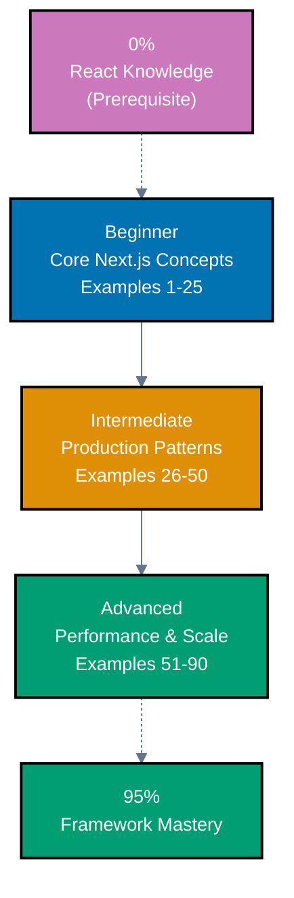
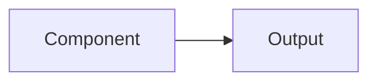

**Want to learn Next.js through code?** This by-example tutorial provides 75-90 heavily annotated examples covering 95% of Next.js + TypeScript. Master Next.js patterns, Server Components, Server Actions, and best practices through working code rather than lengthy explanations.

**Critical prerequisite**: Next.js is built on React. This guide assumes you understand [React fundamentals](/en/learn/software-engineering/platforms/web/tools/fe-react). If you're new to React, complete the [React by-example tutorial](/en/learn/software-engineering/platforms/web/tools/fe-react/by-example) first.

## What Is By-Example Learning?

By-example learning is a **code-first approach** where you learn concepts through annotated, working examples rather than narrative explanations. Each example shows:

1. **Brief explanation** - What the Next.js concept is and when to use it
2. **Mermaid diagram** (when appropriate) - Visual representation of complex flows
3. **Heavily annotated code** - Working TypeScript code with 1-2.25 comment lines per code line
4. **Key Takeaway** - 1-2 sentence distillation of the pattern
5. **Why It Matters** - 50-100 words connecting the pattern to production relevance

This approach works best when you already understand React fundamentals and basic web development concepts. You learn Next.js's App Router, Server Components, Server Actions, and TypeScript integration by studying real code rather than theoretical descriptions.

## What Is Next.js?

Next.js is a **React framework for building production applications** that adds server-side rendering, static generation, and full-stack capabilities. Key distinctions:

- **Framework, not library**: Next.js provides complete application structure including routing, rendering, and data fetching
- **React-based**: All React concepts apply; Next.js extends React with production features
- **Server-first**: Server Components by default, Client Components opt-in
- **Full-stack**: Server Actions enable backend logic without API routes
- **TypeScript integration**: End-to-end type safety from frontend to backend
- **Modern architecture**: App Router with Server Components, streaming, and progressive enhancement

## Learning Path



**Color Legend**: Blue (beginner), Orange (intermediate), Green (advanced/mastery), Purple (prerequisite)

## Coverage Philosophy: 95% Through 75-90 Examples

The **95% coverage** means you'll understand Next.js deeply enough to build production applications with confidence. It doesn't mean you'll know every edge case or advanced optimization—those come with experience.

The 75-90 examples are organized progressively:

- **Beginner (Examples 1-25)**: Foundation concepts (Server Components, Client Components, Server Actions, routing, layouts, data fetching, basic optimization)
- **Intermediate (Examples 26-50)**: Production patterns (authentication, database integration, forms, image optimization, metadata, error handling, loading states, API routes)
- **Advanced (Examples 51-90)**: Scale and optimization (advanced patterns, caching strategies, streaming, parallel routes, intercepting routes, middleware, deployment patterns, performance optimization)

Together, these examples cover **95% of what you'll use** in production Next.js applications.

## Annotation Density: 1-2.25 Comments Per Code Line

**CRITICAL**: All examples maintain **1-2.25 comment lines per code line PER EXAMPLE** to ensure deep understanding.

**What this means**:

- Simple lines get 1 annotation explaining purpose or result
- Complex lines get 2+ annotations explaining behavior, state changes, and side effects
- Use `// =>` notation to show expected values, outputs, or state changes

**Example**:

```typescript
// app/posts/page.tsx
async function PostsPage() {
  // => Server Component (default, no 'use client')
  // => Runs on server, has access to database
  const posts = await db.posts.findMany({
    // => Fetch all posts from database
    orderBy: { createdAt: 'desc' },
    // => Order by newest first
  });
  // => posts is Post[] array

  return (
    <ul>
      {/* => Map posts to list items */}
      {posts.map((post) => (
        // => post.id is unique identifier
        // => Used as React key for list rendering
        <li key={post.id}>
          {/* => Display post title */}
          {post.title}
          {/* => Renders: "My First Post" */}
        </li>
      ))}
    </ul>
  );
}
```

This density ensures each example is self-contained and fully comprehensible without external documentation.

## Structure of Each Example

All examples follow a consistent five-part format:

````markdown
### Example N: Descriptive Title

2-3 sentence explanation of the Next.js concept.



(Optional: included when concept relationships benefit from visual representation)

```typescript
// Heavily annotated code example
// showing the Next.js pattern in action
// => annotations show values, outputs, state changes
```

**Key Takeaway**: 1-2 sentence summary.

**Why It Matters**: 50-100 words connecting the pattern to production applications.
````

````markdown
**Code annotations**:

- `// =>` shows expected output, state changes, or results
- Inline comments explain what each line does
- Variable names are self-documenting
- Type annotations make data flow explicit

## What's Covered

### Core Next.js Concepts

- **App Router**: File-based routing, route groups, dynamic routes, catch-all routes
- **Server Components**: Default rendering, data fetching, database access
- **Client Components**: 'use client' directive, React hooks, event handlers
- **Server Actions**: Backend logic, form handling, mutations, progressive enhancement
- **Layouts**: Root layout, nested layouts, template vs layout

### Data Fetching & Rendering

- **Static Rendering (SSG)**: Build-time rendering, generateStaticParams, static export
- **Dynamic Rendering (SSR)**: Request-time rendering, dynamic data, cookies/headers
- **Incremental Static Regeneration (ISR)**: Time-based revalidation, on-demand revalidation
- **Streaming**: Loading UI, Suspense, progressive rendering
- **Caching**: Fetch caching, data cache, request memoization

### Routing Patterns

- **Pages & Layouts**: page.tsx, layout.tsx, template.tsx
- **Dynamic Routes**: [id], [...slug], [[...slug]] patterns
- **Route Handlers**: API routes in app/api/
- **Parallel Routes**: @folder convention, multiple routes same level
- **Intercepting Routes**: (.)folder, (..)folder, modal patterns

### Forms & Mutations

- **Server Actions**: Form actions, useFormStatus, useFormState
- **Validation**: Server-side validation, zod integration
- **Progressive Enhancement**: Works without JavaScript
- **Optimistic Updates**: Client-side optimism, error recovery

### TypeScript Integration

- **Type Safety**: Component props, Server Action types, API routes
- **Generic Components**: Generic Server/Client Components
- **Type Guards**: Runtime type checking, validation
- **Utility Types**: Next.js specific types (PageProps, LayoutProps, Metadata)

### Optimization

- **Image Optimization**: next/image, responsive images, lazy loading
- **Font Optimization**: next/font, Google Fonts, local fonts
- **Script Optimization**: next/script, loading strategies
- **Metadata**: SEO, OpenGraph, Twitter Cards, dynamic metadata

### Production Patterns

- **Authentication**: Auth.js/NextAuth, Clerk integration, protected routes
- **Database**: Prisma, Drizzle, direct SQL queries
- **Error Handling**: error.tsx, global-error.tsx, not-found.tsx
- **Loading States**: loading.tsx, Suspense boundaries, skeleton UI
- **Middleware**: Authentication, redirects, rewrites, A/B testing
- **Deployment**: Vercel, Docker, self-hosting, environment variables

## What's NOT Covered

We exclude topics that belong in specialized tutorials:

- **React Fundamentals**: JSX, components, props, state, hooks (see [React tutorial](/en/learn/software-engineering/platforms/web/tools/fe-react))
- **Advanced TypeScript**: Deep TypeScript features unrelated to Next.js
- **State Management Libraries**: Redux, Zustand (use React Context or Server State)
- **Testing Deep Dives**: Advanced testing strategies (separate testing tutorial)
- **Pages Router**: Legacy routing system (App Router only)
- **Webpack Configuration**: Build tool details (Next.js abstracts this)
- **React Native**: Mobile development (separate tutorial)

For these topics, see dedicated tutorials and framework documentation.

## Prerequisites

### Required

- **React fundamentals**: Components, props, state, hooks, JSX ([React tutorial](/en/learn/software-engineering/platforms/web/tools/fe-react))
- **JavaScript fundamentals**: ES6+ syntax, async/await, destructuring
- **TypeScript basics**: Basic types, interfaces, generics
- **HTML/CSS**: Basic web fundamentals, DOM concepts
- **Programming experience**: You've built applications before

### Recommended

- **Web APIs**: Fetch API, localStorage, FormData
- **Asynchronous JavaScript**: Promises, async/await patterns
- **Modern tooling**: npm/yarn, command-line basics
- **HTTP basics**: Request methods, status codes, headers

### Not Required

- **Next.js experience**: This guide assumes you're new to Next.js
- **Server-side development**: We teach server concepts as needed
- **Database knowledge**: Examples show patterns, not database administration
- **DevOps expertise**: Deployment patterns are simplified

## Getting Started

Before starting the examples, ensure you have basic environment setup:

1. **Master React**: [React by Example](/en/learn/software-engineering/platforms/web/tools/fe-react/by-example) - Learn React fundamentals first (critical prerequisite)
2. **Review Initial Setup**: [Initial Setup](/en/learn/software-engineering/platforms/web/tools/fe-nextjs/initial-setup) - Install Node.js, create Next.js project
3. **Try Quick Start**: [Quick Start](/en/learn/software-engineering/platforms/web/tools/fe-nextjs/quick-start) - Build Zakat Calculator to understand Server Components and Server Actions

These tutorials provide hands-on foundation before diving into by-example learning.

## How to Use This Guide

### 1. Choose Your Starting Point

- **New to Next.js?** Start with Beginner (Example 1)
- **React experience** but new to Next.js? Start with Beginner (Example 1) - Server Components are different from plain React
- **Building specific feature?** Search for relevant example topic

**Important**: Even experienced React developers should start with Beginner examples. Next.js Server Components represent a paradigm shift from traditional React.

### 2. Read the Example

Each example has five parts:

- **Explanation** (2-3 sentences): What Next.js concept, why it exists, when to use it
- **Diagram** (optional): Mermaid diagram for complex flows and relationships
- **Code** (heavily commented): Working TypeScript code with 1-2.25 annotations per code line
- **Key Takeaway** (1-2 sentences): Distilled essence of the pattern
- **Why It Matters** (50-100 words): Production relevance and when to apply the pattern

### 3. Run the Code

Create a test project and run each example:

```bash
npx create-next-app@latest nextjs-examples
cd nextjs-examples
# Choose: TypeScript, ESLint, Tailwind CSS, App Router
# Paste example code into app/page.tsx or create new route
npm run dev
```
````

### 4. Modify and Experiment

Change props, add Server Actions, break things on purpose. Experimentation builds intuition faster than reading.

### 5. Reference as Needed

Use this guide as a reference when building features. Search for relevant examples and adapt patterns to your code.

## Ready to Start?

Choose your learning path:

- [Beginner](/en/learn/software-engineering/platforms/web/tools/fe-nextjs/by-example/beginner) - Start here if new to Next.js. Build foundation understanding through core examples covering Server Components, Client Components, Server Actions, routing, and data fetching.
- [Intermediate](/en/learn/software-engineering/platforms/web/tools/fe-nextjs/by-example/intermediate) - Master production patterns through examples covering authentication, database integration, forms, error handling, and optimization.
- [Advanced](/en/learn/software-engineering/platforms/web/tools/fe-nextjs/by-example/advanced) - Expert mastery through examples covering caching strategies, streaming, advanced routing, performance optimization, and deployment patterns.

Or jump to specific topics by searching for relevant example keywords (server components, server actions, authentication, database, forms, caching, streaming, etc.).

## Examples by Level

### Beginner (Examples 1–27)

- [Example 1: Basic Server Component](/en/learn/software-engineering/platforms/web/tools/fe-nextjs/by-example/beginner#example-1-basic-server-component)
- [Example 2: Server Component with Data Fetching](/en/learn/software-engineering/platforms/web/tools/fe-nextjs/by-example/beginner#example-2-server-component-with-data-fetching)
- [Example 3: Adding Client Component with 'use client'](/en/learn/software-engineering/platforms/web/tools/fe-nextjs/by-example/beginner#example-3-adding-client-component-with-use-client)
- [Example 4: Creating Pages (page.tsx)](/en/learn/software-engineering/platforms/web/tools/fe-nextjs/by-example/beginner#example-4-creating-pages-pagetsx)
- [Example 5: Creating Layouts (layout.tsx)](/en/learn/software-engineering/platforms/web/tools/fe-nextjs/by-example/beginner#example-5-creating-layouts-layouttsx)
- [Example 6: Navigation with Link Component](/en/learn/software-engineering/platforms/web/tools/fe-nextjs/by-example/beginner#example-6-navigation-with-link-component)
- [Example 7: Dynamic Routes with [param]](/en/learn/software-engineering/platforms/web/tools/fe-nextjs/by-example/beginner#example-7-dynamic-routes-with-param)
- [Example 8: Basic Server Action for Form Handling](/en/learn/software-engineering/platforms/web/tools/fe-nextjs/by-example/beginner#example-8-basic-server-action-for-form-handling)
- [Example 9: Server Action with Validation](/en/learn/software-engineering/platforms/web/tools/fe-nextjs/by-example/beginner#example-9-server-action-with-validation)
- [Example 10: Server Action with Revalidation](/en/learn/software-engineering/platforms/web/tools/fe-nextjs/by-example/beginner#example-10-server-action-with-revalidation)
- [Example 11: Parallel Data Fetching](/en/learn/software-engineering/platforms/web/tools/fe-nextjs/by-example/beginner#example-11-parallel-data-fetching)
- [Example 12: Request Memoization (Automatic Deduplication)](/en/learn/software-engineering/platforms/web/tools/fe-nextjs/by-example/beginner#example-12-request-memoization-automatic-deduplication)
- [Example 13: Loading UI with loading.tsx](/en/learn/software-engineering/platforms/web/tools/fe-nextjs/by-example/beginner#example-13-loading-ui-with-loadingtsx)
- [Example 14: Manual Suspense Boundaries for Granular Loading](/en/learn/software-engineering/platforms/web/tools/fe-nextjs/by-example/beginner#example-14-manual-suspense-boundaries-for-granular-loading)
- [Example 15: Error Boundaries with error.tsx](/en/learn/software-engineering/platforms/web/tools/fe-nextjs/by-example/beginner#example-15-error-boundaries-with-errortsx)
- [Example 16: Not Found Pages with not-found.tsx](/en/learn/software-engineering/platforms/web/tools/fe-nextjs/by-example/beginner#example-16-not-found-pages-with-not-foundtsx)
- [Example 17: Static Metadata](/en/learn/software-engineering/platforms/web/tools/fe-nextjs/by-example/beginner#example-17-static-metadata)
- [Example 18: Dynamic Metadata with generateMetadata](/en/learn/software-engineering/platforms/web/tools/fe-nextjs/by-example/beginner#example-18-dynamic-metadata-with-generatemetadata)
- [Example 19: Image Component for Optimization](/en/learn/software-engineering/platforms/web/tools/fe-nextjs/by-example/beginner#example-19-image-component-for-optimization)
- [Example 20: Responsive Images with fill Property](/en/learn/software-engineering/platforms/web/tools/fe-nextjs/by-example/beginner#example-20-responsive-images-with-fill-property)
- [Example 21: GET Route Handler](/en/learn/software-engineering/platforms/web/tools/fe-nextjs/by-example/beginner#example-21-get-route-handler)
- [Example 22: POST Route Handler with Request Body](/en/learn/software-engineering/platforms/web/tools/fe-nextjs/by-example/beginner#example-22-post-route-handler-with-request-body)
- [Example 23: Basic Middleware for Logging](/en/learn/software-engineering/platforms/web/tools/fe-nextjs/by-example/beginner#example-23-basic-middleware-for-logging)
- [Example 24: Middleware for Authentication Redirect](/en/learn/software-engineering/platforms/web/tools/fe-nextjs/by-example/beginner#example-24-middleware-for-authentication-redirect)
- [Example 25: Middleware with Request Rewriting](/en/learn/software-engineering/platforms/web/tools/fe-nextjs/by-example/beginner#example-25-middleware-with-request-rewriting)
- [Example 26: template.tsx vs layout.tsx Behavior](/en/learn/software-engineering/platforms/web/tools/fe-nextjs/by-example/beginner#example-26-templatetsx-vs-layouttsx-behavior)
- [Example 27: useRouter for Programmatic Navigation](/en/learn/software-engineering/platforms/web/tools/fe-nextjs/by-example/beginner#example-27-userouter-for-programmatic-navigation)

### Intermediate (Examples 26–50)

- [Example 26: Server Action with useFormState Hook](/en/learn/software-engineering/platforms/web/tools/fe-nextjs/by-example/intermediate#example-26-server-action-with-useformstate-hook)
- [Example 27: Server Action with useFormStatus Hook](/en/learn/software-engineering/platforms/web/tools/fe-nextjs/by-example/intermediate#example-27-server-action-with-useformstatus-hook)
- [Example 28: Progressive Enhancement with Server Actions](/en/learn/software-engineering/platforms/web/tools/fe-nextjs/by-example/intermediate#example-28-progressive-enhancement-with-server-actions)
- [Example 29: Time-Based Revalidation (ISR)](/en/learn/software-engineering/platforms/web/tools/fe-nextjs/by-example/intermediate#example-29-time-based-revalidation-isr)
- [Example 30: On-Demand Revalidation with revalidatePath](/en/learn/software-engineering/platforms/web/tools/fe-nextjs/by-example/intermediate#example-30-on-demand-revalidation-with-revalidatepath)
- [Example 31: Tag-Based Revalidation with revalidateTag](/en/learn/software-engineering/platforms/web/tools/fe-nextjs/by-example/intermediate#example-31-tag-based-revalidation-with-revalidatetag)
- [Example 32: Route Groups for Organization](/en/learn/software-engineering/platforms/web/tools/fe-nextjs/by-example/intermediate#example-32-route-groups-for-organization)
- [Example 33: Parallel Routes with @folder Convention](/en/learn/software-engineering/platforms/web/tools/fe-nextjs/by-example/intermediate#example-33-parallel-routes-with-folder-convention)
- [Example 34: Intercepting Routes for Modals](/en/learn/software-engineering/platforms/web/tools/fe-nextjs/by-example/intermediate#example-34-intercepting-routes-for-modals)
- [Example 35: Form Validation with Zod Schema](/en/learn/software-engineering/platforms/web/tools/fe-nextjs/by-example/intermediate#example-35-form-validation-with-zod-schema)
- [Example 36: Optimistic Updates with useOptimistic](/en/learn/software-engineering/platforms/web/tools/fe-nextjs/by-example/intermediate#example-36-optimistic-updates-with-useoptimistic)
- [Example 37: Cookies-Based Authentication](/en/learn/software-engineering/platforms/web/tools/fe-nextjs/by-example/intermediate#example-37-cookies-based-authentication)
- [Example 38: Middleware-Based Authentication](/en/learn/software-engineering/platforms/web/tools/fe-nextjs/by-example/intermediate#example-38-middleware-based-authentication)
- [Example 39: Prisma Integration with Server Components](/en/learn/software-engineering/platforms/web/tools/fe-nextjs/by-example/intermediate#example-39-prisma-integration-with-server-components)
- [Example 40: Error Handling for Database Queries](/en/learn/software-engineering/platforms/web/tools/fe-nextjs/by-example/intermediate#example-40-error-handling-for-database-queries)
- [Example 41: Client-Side Data Fetching with SWR](/en/learn/software-engineering/platforms/web/tools/fe-nextjs/by-example/intermediate#example-41-client-side-data-fetching-with-swr)
- [Example 42: Client-Side Data Fetching with TanStack Query](/en/learn/software-engineering/platforms/web/tools/fe-nextjs/by-example/intermediate#example-42-client-side-data-fetching-with-tanstack-query)
- [Example 43: Form Handling with React Hook Form](/en/learn/software-engineering/platforms/web/tools/fe-nextjs/by-example/intermediate#example-43-form-handling-with-react-hook-form)
- [Example 44: Advanced Zod Validation with Transform](/en/learn/software-engineering/platforms/web/tools/fe-nextjs/by-example/intermediate#example-44-advanced-zod-validation-with-transform)
- [Example 45: File Upload Handling with Server Actions](/en/learn/software-engineering/platforms/web/tools/fe-nextjs/by-example/intermediate#example-45-file-upload-handling-with-server-actions)
- [Example 46: Pagination with Server Components](/en/learn/software-engineering/platforms/web/tools/fe-nextjs/by-example/intermediate#example-46-pagination-with-server-components)
- [Example 47: Infinite Scroll with Intersection Observer](/en/learn/software-engineering/platforms/web/tools/fe-nextjs/by-example/intermediate#example-47-infinite-scroll-with-intersection-observer)
- [Example 48: Search with Debouncing](/en/learn/software-engineering/platforms/web/tools/fe-nextjs/by-example/intermediate#example-48-search-with-debouncing)
- [Example 49: Real-Time Updates with Server Actions](/en/learn/software-engineering/platforms/web/tools/fe-nextjs/by-example/intermediate#example-49-real-time-updates-with-server-actions)
- [Example 50: Advanced Middleware with Custom Headers](/en/learn/software-engineering/platforms/web/tools/fe-nextjs/by-example/intermediate#example-50-advanced-middleware-with-custom-headers)

### Advanced (Examples 51–75)

- [Example 51: Static Site Generation with generateStaticParams](/en/learn/software-engineering/platforms/web/tools/fe-nextjs/by-example/advanced#example-51-static-site-generation-with-generatestaticparams)
- [Example 52: Incremental Static Regeneration (ISR)](/en/learn/software-engineering/platforms/web/tools/fe-nextjs/by-example/advanced#example-52-incremental-static-regeneration-isr)
- [Example 53: Static Export for CDN Hosting](/en/learn/software-engineering/platforms/web/tools/fe-nextjs/by-example/advanced#example-53-static-export-for-cdn-hosting)
- [Example 54: Streaming with Suspense Boundaries](/en/learn/software-engineering/platforms/web/tools/fe-nextjs/by-example/advanced#example-54-streaming-with-suspense-boundaries)
- [Example 55: Nested Suspense for Progressive Loading](/en/learn/software-engineering/platforms/web/tools/fe-nextjs/by-example/advanced#example-55-nested-suspense-for-progressive-loading)
- [Example 56: Suspense with Skeleton UI](/en/learn/software-engineering/platforms/web/tools/fe-nextjs/by-example/advanced#example-56-suspense-with-skeleton-ui)
- [Example 57: Custom Cache with unstable_cache](/en/learn/software-engineering/platforms/web/tools/fe-nextjs/by-example/advanced#example-57-custom-cache-with-unstable_cache)
- [Example 58: Request Memoization with React cache()](/en/learn/software-engineering/platforms/web/tools/fe-nextjs/by-example/advanced#example-58-request-memoization-with-react-cache)
- [Example 59: Force Dynamic Rendering](/en/learn/software-engineering/platforms/web/tools/fe-nextjs/by-example/advanced#example-59-force-dynamic-rendering)
- [Example 60: Image Optimization with Blur Placeholder](/en/learn/software-engineering/platforms/web/tools/fe-nextjs/by-example/advanced#example-60-image-optimization-with-blur-placeholder)
- [Example 61: Font Optimization with next/font](/en/learn/software-engineering/platforms/web/tools/fe-nextjs/by-example/advanced#example-61-font-optimization-with-nextfont)
- [Example 62: Script Optimization with next/script](/en/learn/software-engineering/platforms/web/tools/fe-nextjs/by-example/advanced#example-62-script-optimization-with-nextscript)
- [Example 63: Dynamic OpenGraph Images](/en/learn/software-engineering/platforms/web/tools/fe-nextjs/by-example/advanced#example-63-dynamic-opengraph-images)
- [Example 64: JSON-LD Structured Data for SEO](/en/learn/software-engineering/platforms/web/tools/fe-nextjs/by-example/advanced#example-64-json-ld-structured-data-for-seo)
- [Example 65: Environment Variables with Type Safety](/en/learn/software-engineering/platforms/web/tools/fe-nextjs/by-example/advanced#example-65-environment-variables-with-type-safety)
- [Example 66: Monitoring with OpenTelemetry](/en/learn/software-engineering/platforms/web/tools/fe-nextjs/by-example/advanced#example-66-monitoring-with-opentelemetry)
- [Example 67: Rate Limiting with Upstash](/en/learn/software-engineering/platforms/web/tools/fe-nextjs/by-example/advanced#example-67-rate-limiting-with-upstash)
- [Example 68: Server-Only Code Protection](/en/learn/software-engineering/platforms/web/tools/fe-nextjs/by-example/advanced#example-68-server-only-code-protection)
- [Example 69: Partial Prerendering (PPR) Pattern](/en/learn/software-engineering/platforms/web/tools/fe-nextjs/by-example/advanced#example-69-partial-prerendering-ppr-pattern)
- [Example 70: Middleware Chaining Pattern](/en/learn/software-engineering/platforms/web/tools/fe-nextjs/by-example/advanced#example-70-middleware-chaining-pattern)
- [Example 71: Multi-Step Form with Server Actions](/en/learn/software-engineering/platforms/web/tools/fe-nextjs/by-example/advanced#example-71-multi-step-form-with-server-actions)
- [Example 72: Background Jobs with Server Actions](/en/learn/software-engineering/platforms/web/tools/fe-nextjs/by-example/advanced#example-72-background-jobs-with-server-actions)
- [Example 73: Role-Based Access Control (RBAC)](/en/learn/software-engineering/platforms/web/tools/fe-nextjs/by-example/advanced#example-73-role-based-access-control-rbac)
- [Example 74: Advanced API Rate Limiting Patterns](/en/learn/software-engineering/platforms/web/tools/fe-nextjs/by-example/advanced#example-74-advanced-api-rate-limiting-patterns)
- [Example 75: Database Transactions with Prisma](/en/learn/software-engineering/platforms/web/tools/fe-nextjs/by-example/advanced#example-75-database-transactions-with-prisma)
