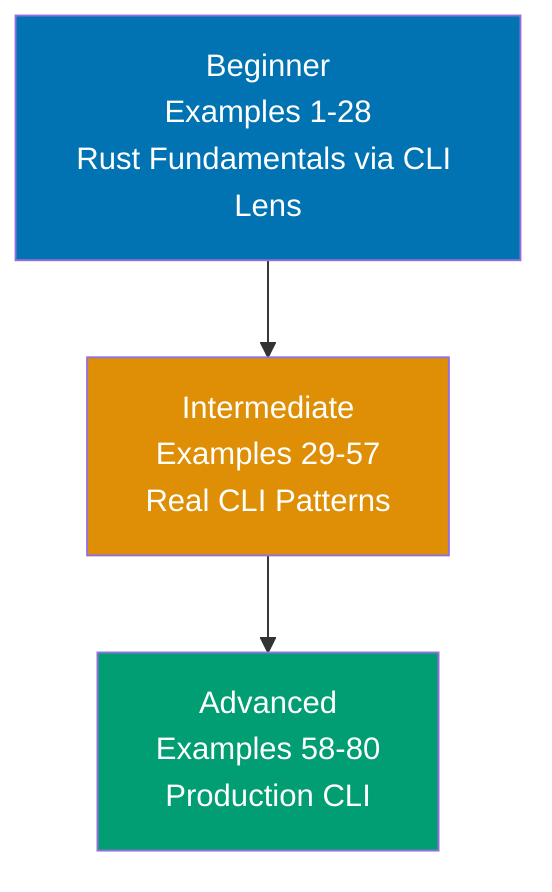

## What This Tutorial Teaches

This tutorial teaches Rust CLI development through 80 heavily annotated, self-contained code examples. The target audience is engineers who already know Java, Python, Go, or JavaScript/TypeScript well and want to read and write real Rust CLI codebases without getting stuck on Rust's unique concepts.

After completing all 80 examples, you can read any production Rust CLI tool—including real projects like `ripgrep`, `fd`, `cargo`, and `bat`—and understand every line. You can write your own CLIs that handle files, directories, serialization, error propagation, and testable output.

This tutorial focuses exclusively on **synchronous Rust**. Async/await is a separate, steep learning curve that belongs in a dedicated tutorial. All 80 examples compile and run with stable Rust.

## Why This Tutorial Exists

The three biggest struggles for GC-language engineers learning Rust are:

1. **Ownership and borrowing** — 8 full examples use CLI-domain scenarios (processing command names, reading config paths, accumulating validation results) rather than toy memory examples that feel disconnected from real work.

2. **Lifetimes** — This tutorial deliberately avoids teaching lifetime annotations. Every example uses owned types (`String`, `Vec<T>`, `HashMap`) so the borrow checker never demands annotations. You build intuition for ownership without the additional complexity of annotation syntax.

3. **Type system and trait thinking** — Each trait example explicitly contrasts Rust traits with Java interfaces (nominal subtyping) and Go interfaces (structural duck-typing). Rust uses structural dispatch like Go but with explicit `impl` declarations like Java.

## Edition and Toolchain

All examples target **Rust 2024 edition** (stable since Rust 1.85). Important Edition 2024 changes reflected throughout:

- `gen` is a reserved keyword — no example uses it as an identifier
- `static mut` requires `unsafe` — examples use `LazyLock` and `OnceLock` instead
- `std::env::set_var` is `unsafe` — examples avoid it or wrap properly
- Match ergonomics improved — examples follow current idioms

## Key Crates

Every crate used in this tutorial is stable, widely adopted, and production-standard:

| Crate        | Version | Purpose                              |
| ------------ | ------- | ------------------------------------ |
| `clap`       | 4.6.x   | CLI argument parsing with derive API |
| `anyhow`     | 1.x     | Error handling for CLI applications  |
| `serde`      | 1.x     | Serialization framework              |
| `serde_json` | 1.x     | JSON serialization                   |
| `serde_yml`  | 0.0.x   | YAML serialization                   |
| `walkdir`    | 2.x     | Simple directory traversal           |
| `ignore`     | 0.4.x   | Gitignore-aware directory walking    |
| `regex`      | 1.x     | Regular expressions                  |
| `assert_cmd` | 2.x     | CLI integration testing              |
| `tempfile`   | 3.x     | Temporary files in tests             |

## Learning Path



### Beginner (Examples 1-28): Rust Fundamentals via CLI Lens

**Focus**: Learn Rust fundamentals using CLI-domain examples throughout.

Every ownership example involves a command name, config path, or results accumulator—not abstract toy data. By example 28 you understand ownership, borrowing, traits, enums with data, pattern matching, `Option<T>`, `Result<T, E>`, the `?` operator, `Vec<T>`, `HashMap<K, V>`, iterators, closures, and a first working CLI with clap.

**Key topics**: `fn main()`, variables, shadowing, types, `String` vs `&str`, functions, ownership, borrowing, mutable borrowing, slices, structs, `impl` blocks, `#[derive]`, enums, enums with data, pattern matching, `if let`, `Option`, `Result`, `?`, `Vec`, `HashMap`, iterators, closures, traits, first clap CLI, module system, unit tests.

### Intermediate (Examples 29-57): Real CLI Patterns

**Focus**: The patterns that appear in every production Rust CLI.

Subcommands, global flags, file I/O, directory walking, regex, lazy globals, `anyhow` error handling, serde serialization, `BTreeMap` for deterministic output, testable output via `dyn Write`, environment variables, exit codes, output format enums, advanced iterators, and integration testing with `assert_cmd` and `tempfile`.

**Key topics**: Clap subcommands, nested subcommands, global flags, string manipulation, `PathBuf`/`Path`, file reading/writing, walkdir, ignore crate, regex, `LazyLock`, `OnceLock`, anyhow, error chains, serde JSON/YAML, `BTreeMap`, struct constructors, result accumulation, `impl Into<String>`, `dyn Write`, env vars, exit codes, output formats, iterator chaining, vec operations, integration testing.

### Advanced (Examples 58-80): Production CLI

**Focus**: The patterns that distinguish amateur from professional Rust CLI codebases.

Module organization, type aliases, Clippy configuration, restriction lints, replacing `.unwrap()`, custom Display/FromStr, markdown/XML parsing, glob patterns, SHA-2 hashing, compiled regex caches, validation orchestration, release profiles, dual crate layout, match guards, recursive validation, chrono dates, avoiding common pitfalls, complex test fixtures, and a final capstone example synthesizing all concepts.

**Key topics**: Module organization, type aliases, Clippy, restriction lints, replacing unwrap, Display/FromStr, pulldown-cmark, quick-xml, glob, sha2, OnceLock regex cache, validation orchestration, integration testing assertions, testing stderr, release profiles, dual crate, match guards, recursive validation, chrono, common pitfalls, complex fixtures, capstone CLI.

## How to Use This Tutorial

### Create a Cargo Project

Most beginner examples are single-file. Create one project for all examples:

```bash
cargo new rust-cli-examples && cd rust-cli-examples
```

For examples that use external crates, add to `Cargo.toml`:

```toml
[dependencies]
clap = { version = "4.6.1", features = ["derive"] }
anyhow = "1.0"
serde = { version = "1.0", features = ["derive"] }
serde_json = "1.0"
serde_yml = "0.0.12"
walkdir = "2.5"
ignore = "0.4"
regex = "1.11"

[dev-dependencies]
assert_cmd = "2.0"
tempfile = "3.14"
predicates = "3.1"
```

### Read the Annotations

Every code block uses `// =>` comments to show values, outputs, ownership transfers, and error conditions:

```rust
let name = String::from("my-tool"); // => name owns heap string "my-tool"
let borrowed: &str = &name;         // => borrowed is a view into name's data
                                    // => name still owns the string
println!("{}", borrowed);           // => Output: my-tool
```

### Follow the Progression

Start with Beginner even if you know other systems languages. Rust's ownership model is unique and requires building intuition from real CLI scenarios. Skipping ahead leaves gaps that cause confusion when the borrow checker rejects code that looks correct.

## Five-Part Example Format

Every example uses this structure:

1. **Brief explanation** (2-4 sentences): what the concept is and why it matters for CLI tools
2. **Mermaid diagram** (when the concept benefits from visualization): ownership flows, module structure, error chains
3. **Heavily annotated code**: every significant line has `// =>` comments showing state, values, and outputs
4. **Key Takeaway**: the core insight in 1-2 sentences
5. **Why It Matters**: production relevance and connection to real CLI codebases

## Prerequisites

**Required**: Experience with at least one of Java, Python, Go, or JavaScript/TypeScript. Ability to run `cargo new` and `cargo run`.

**Not required**: Prior Rust experience, systems programming background, understanding of memory management.

## Examples by Level

### Beginner (Examples 1-28)

- [Example 1: Hello World CLI](/en/learn/software-engineering/programming-languages/rust/cli-with-rust/by-example/beginner#example-1-hello-world-cli)
- [Example 2: Variables and Mutability](/en/learn/software-engineering/programming-languages/rust/cli-with-rust/by-example/beginner#example-2-variables-and-mutability)
- [Example 3: Variable Shadowing](/en/learn/software-engineering/programming-languages/rust/cli-with-rust/by-example/beginner#example-3-variable-shadowing)
- [Example 4: Basic Types](/en/learn/software-engineering/programming-languages/rust/cli-with-rust/by-example/beginner#example-4-basic-types)
- [Example 5: String Types](/en/learn/software-engineering/programming-languages/rust/cli-with-rust/by-example/beginner#example-5-string-types)
- [Example 6: Functions](/en/learn/software-engineering/programming-languages/rust/cli-with-rust/by-example/beginner#example-6-functions)
- [Example 7: Ownership Basics](/en/learn/software-engineering/programming-languages/rust/cli-with-rust/by-example/beginner#example-7-ownership-basics)
- [Example 8: Borrowing](/en/learn/software-engineering/programming-languages/rust/cli-with-rust/by-example/beginner#example-8-borrowing)
- [Example 9: Mutable Borrowing](/en/learn/software-engineering/programming-languages/rust/cli-with-rust/by-example/beginner#example-9-mutable-borrowing)
- [Example 10: Slices](/en/learn/software-engineering/programming-languages/rust/cli-with-rust/by-example/beginner#example-10-slices)
- [Example 11: Structs](/en/learn/software-engineering/programming-languages/rust/cli-with-rust/by-example/beginner#example-11-structs)
- [Example 12: Struct impl Blocks](/en/learn/software-engineering/programming-languages/rust/cli-with-rust/by-example/beginner#example-12-struct-impl-blocks)
- [Example 13: Derive Macros](/en/learn/software-engineering/programming-languages/rust/cli-with-rust/by-example/beginner#example-13-derive-macros)
- [Example 14: Enums](/en/learn/software-engineering/programming-languages/rust/cli-with-rust/by-example/beginner#example-14-enums)
- [Example 15: Enums with Data](/en/learn/software-engineering/programming-languages/rust/cli-with-rust/by-example/beginner#example-15-enums-with-data)
- [Example 16: Pattern Matching](/en/learn/software-engineering/programming-languages/rust/cli-with-rust/by-example/beginner#example-16-pattern-matching)
- [Example 17: if let and while let](/en/learn/software-engineering/programming-languages/rust/cli-with-rust/by-example/beginner#example-17-if-let-and-while-let)
- [Example 18: Option](/en/learn/software-engineering/programming-languages/rust/cli-with-rust/by-example/beginner#example-18-option)
- [Example 19: Result](/en/learn/software-engineering/programming-languages/rust/cli-with-rust/by-example/beginner#example-19-result)
- [Example 20: The Question Mark Operator](/en/learn/software-engineering/programming-languages/rust/cli-with-rust/by-example/beginner#example-20-the-question-mark-operator)
- [Example 21: Vec](/en/learn/software-engineering/programming-languages/rust/cli-with-rust/by-example/beginner#example-21-vec)
- [Example 22: HashMap](/en/learn/software-engineering/programming-languages/rust/cli-with-rust/by-example/beginner#example-22-hashmap)
- [Example 23: Iterators](/en/learn/software-engineering/programming-languages/rust/cli-with-rust/by-example/beginner#example-23-iterators)
- [Example 24: Closures](/en/learn/software-engineering/programming-languages/rust/cli-with-rust/by-example/beginner#example-24-closures)
- [Example 25: Traits](/en/learn/software-engineering/programming-languages/rust/cli-with-rust/by-example/beginner#example-25-traits)
- [Example 26: First CLI with clap](/en/learn/software-engineering/programming-languages/rust/cli-with-rust/by-example/beginner#example-26-first-cli-with-clap)
- [Example 27: Module System](/en/learn/software-engineering/programming-languages/rust/cli-with-rust/by-example/beginner#example-27-module-system)
- [Example 28: Unit Tests](/en/learn/software-engineering/programming-languages/rust/cli-with-rust/by-example/beginner#example-28-unit-tests)

### Intermediate (Examples 29-57)

- [Example 29: Clap Subcommands](/en/learn/software-engineering/programming-languages/rust/cli-with-rust/by-example/intermediate#example-29-clap-subcommands)
- [Example 30: Nested Subcommands](/en/learn/software-engineering/programming-languages/rust/cli-with-rust/by-example/intermediate#example-30-nested-subcommands)
- [Example 31: Global Flags with clap](/en/learn/software-engineering/programming-languages/rust/cli-with-rust/by-example/intermediate#example-31-global-flags-with-clap)
- [Example 32: String Manipulation](/en/learn/software-engineering/programming-languages/rust/cli-with-rust/by-example/intermediate#example-32-string-manipulation)
- [Example 33: String Formatting](/en/learn/software-engineering/programming-languages/rust/cli-with-rust/by-example/intermediate#example-33-string-formatting)
- [Example 34: PathBuf and Path](/en/learn/software-engineering/programming-languages/rust/cli-with-rust/by-example/intermediate#example-34-pathbuf-and-path)
- [Example 35: Reading Files](/en/learn/software-engineering/programming-languages/rust/cli-with-rust/by-example/intermediate#example-35-reading-files)
- [Example 36: Writing Files](/en/learn/software-engineering/programming-languages/rust/cli-with-rust/by-example/intermediate#example-36-writing-files)
- [Example 37: Walking Directories](/en/learn/software-engineering/programming-languages/rust/cli-with-rust/by-example/intermediate#example-37-walking-directories)
- [Example 38: Gitignore-Aware Walking](/en/learn/software-engineering/programming-languages/rust/cli-with-rust/by-example/intermediate#example-38-gitignore-aware-walking)
- [Example 39: Regex Basics](/en/learn/software-engineering/programming-languages/rust/cli-with-rust/by-example/intermediate#example-39-regex-basics)
- [Example 40: std::sync::LazyLock](/en/learn/software-engineering/programming-languages/rust/cli-with-rust/by-example/intermediate#example-40-stdsynclazylock)
- [Example 41: std::sync::OnceLock](/en/learn/software-engineering/programming-languages/rust/cli-with-rust/by-example/intermediate#example-41-stdsynconelock)
- [Example 42: Error Handling with anyhow](/en/learn/software-engineering/programming-languages/rust/cli-with-rust/by-example/intermediate#example-42-error-handling-with-anyhow)
- [Example 43: Error Propagation Chain](/en/learn/software-engineering/programming-languages/rust/cli-with-rust/by-example/intermediate#example-43-error-propagation-chain)
- [Example 44: Serde and JSON](/en/learn/software-engineering/programming-languages/rust/cli-with-rust/by-example/intermediate#example-44-serde-and-json)
- [Example 45: Serde and YAML](/en/learn/software-engineering/programming-languages/rust/cli-with-rust/by-example/intermediate#example-45-serde-and-yaml)
- [Example 46: BTreeMap](/en/learn/software-engineering/programming-languages/rust/cli-with-rust/by-example/intermediate#example-46-btreemap)
- [Example 47: Struct Constructors Pattern](/en/learn/software-engineering/programming-languages/rust/cli-with-rust/by-example/intermediate#example-47-struct-constructors-pattern)
- [Example 48: Collecting Results](/en/learn/software-engineering/programming-languages/rust/cli-with-rust/by-example/intermediate#example-48-collecting-results)
- [Example 49: impl Into String](/en/learn/software-engineering/programming-languages/rust/cli-with-rust/by-example/intermediate#example-49-impl-into-string)
- [Example 50: dyn Write for Testable Output](/en/learn/software-engineering/programming-languages/rust/cli-with-rust/by-example/intermediate#example-50-dyn-write-for-testable-output)
- [Example 51: Environment Variables](/en/learn/software-engineering/programming-languages/rust/cli-with-rust/by-example/intermediate#example-51-environment-variables)
- [Example 52: Process Exit Codes](/en/learn/software-engineering/programming-languages/rust/cli-with-rust/by-example/intermediate#example-52-process-exit-codes)
- [Example 53: Output Format Enum](/en/learn/software-engineering/programming-languages/rust/cli-with-rust/by-example/intermediate#example-53-output-format-enum)
- [Example 54: Iterator Advanced](/en/learn/software-engineering/programming-languages/rust/cli-with-rust/by-example/intermediate#example-54-iterator-advanced)
- [Example 55: Vec Operations](/en/learn/software-engineering/programming-languages/rust/cli-with-rust/by-example/intermediate#example-55-vec-operations)
- [Example 56: Testing with assert_cmd](/en/learn/software-engineering/programming-languages/rust/cli-with-rust/by-example/intermediate#example-56-testing-with-assert_cmd)
- [Example 57: Testing with tempfile](/en/learn/software-engineering/programming-languages/rust/cli-with-rust/by-example/intermediate#example-57-testing-with-tempfile)

### Advanced (Examples 58-80)

- [Example 58: Module Organization](/en/learn/software-engineering/programming-languages/rust/cli-with-rust/by-example/advanced#example-58-module-organization)
- [Example 59: Type Aliases](/en/learn/software-engineering/programming-languages/rust/cli-with-rust/by-example/advanced#example-59-type-aliases)
- [Example 60: Clippy Basics](/en/learn/software-engineering/programming-languages/rust/cli-with-rust/by-example/advanced#example-60-clippy-basics)
- [Example 61: Clippy Configuration in Cargo.toml](/en/learn/software-engineering/programming-languages/rust/cli-with-rust/by-example/advanced#example-61-clippy-configuration-in-cargotoml)
- [Example 62: Restriction Lints](/en/learn/software-engineering/programming-languages/rust/cli-with-rust/by-example/advanced#example-62-restriction-lints)
- [Example 63: Replacing unwrap](/en/learn/software-engineering/programming-languages/rust/cli-with-rust/by-example/advanced#example-63-replacing-unwrap)
- [Example 64: Custom Display for Enums](/en/learn/software-engineering/programming-languages/rust/cli-with-rust/by-example/advanced#example-64-custom-display-for-enums)
- [Example 65: Markdown Parsing](/en/learn/software-engineering/programming-languages/rust/cli-with-rust/by-example/advanced#example-65-markdown-parsing)
- [Example 66: XML Parsing](/en/learn/software-engineering/programming-languages/rust/cli-with-rust/by-example/advanced#example-66-xml-parsing)
- [Example 67: Glob Patterns](/en/learn/software-engineering/programming-languages/rust/cli-with-rust/by-example/advanced#example-67-glob-patterns)
- [Example 68: SHA-2 Hashing](/en/learn/software-engineering/programming-languages/rust/cli-with-rust/by-example/advanced#example-68-sha-2-hashing)
- [Example 69: OnceLock and Regex Cache](/en/learn/software-engineering/programming-languages/rust/cli-with-rust/by-example/advanced#example-69-onelock-and-regex-cache)
- [Example 70: Validation Orchestration](/en/learn/software-engineering/programming-languages/rust/cli-with-rust/by-example/advanced#example-70-validation-orchestration)
- [Example 71: Integration Testing with assert_cmd and predicates](/en/learn/software-engineering/programming-languages/rust/cli-with-rust/by-example/advanced#example-71-integration-testing-with-assert_cmd-and-predicates)
- [Example 72: Testing stderr](/en/learn/software-engineering/programming-languages/rust/cli-with-rust/by-example/advanced#example-72-testing-stderr)
- [Example 73: Release Profile](/en/learn/software-engineering/programming-languages/rust/cli-with-rust/by-example/advanced#example-73-release-profile)
- [Example 74: Dual Crate Layout](/en/learn/software-engineering/programming-languages/rust/cli-with-rust/by-example/advanced#example-74-dual-crate-layout)
- [Example 75: Complex Match Guards](/en/learn/software-engineering/programming-languages/rust/cli-with-rust/by-example/advanced#example-75-complex-match-guards)
- [Example 76: Recursive Directory Validation](/en/learn/software-engineering/programming-languages/rust/cli-with-rust/by-example/advanced#example-76-recursive-directory-validation)
- [Example 77: chrono for Dates](/en/learn/software-engineering/programming-languages/rust/cli-with-rust/by-example/advanced#example-77-chrono-for-dates)
- [Example 78: Avoiding Common Rust Pitfalls](/en/learn/software-engineering/programming-languages/rust/cli-with-rust/by-example/advanced#example-78-avoiding-common-rust-pitfalls)
- [Example 79: Testing with Complex Fixtures](/en/learn/software-engineering/programming-languages/rust/cli-with-rust/by-example/advanced#example-79-testing-with-complex-fixtures)
- [Example 80: Putting It All Together](/en/learn/software-engineering/programming-languages/rust/cli-with-rust/by-example/advanced#example-80-putting-it-all-together)
