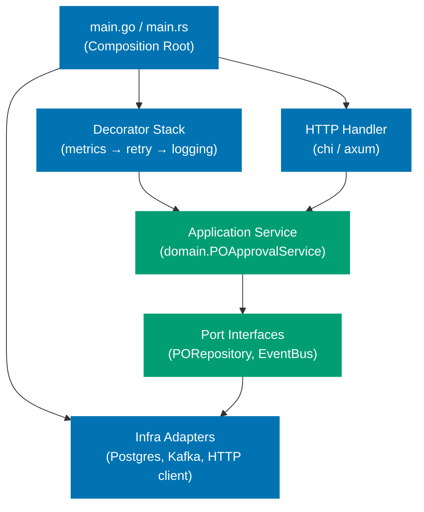
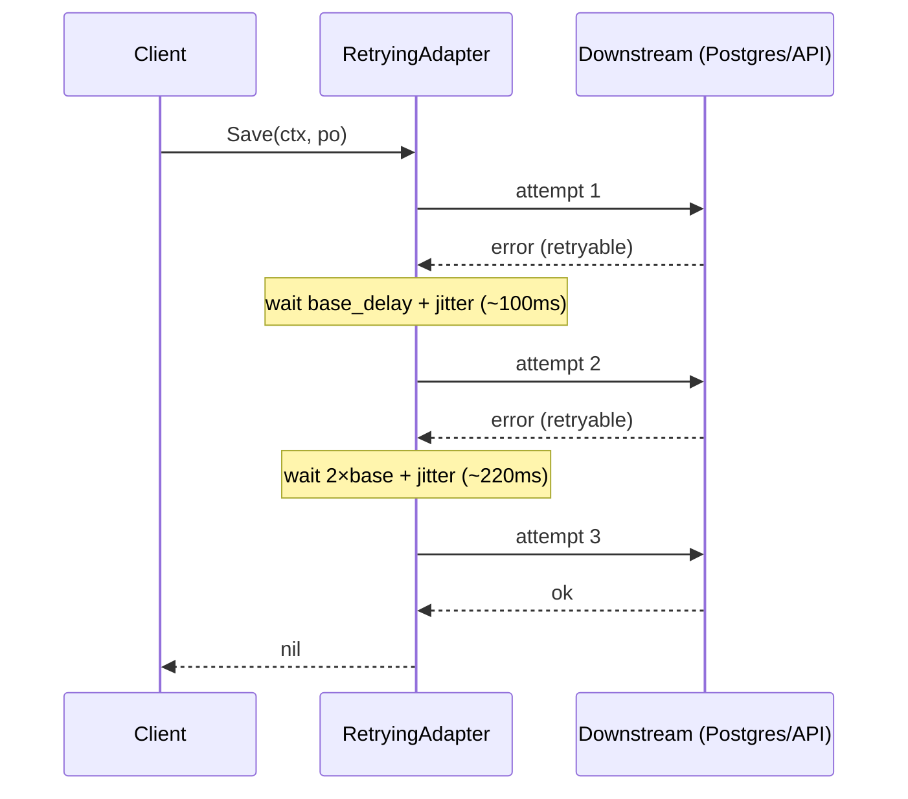
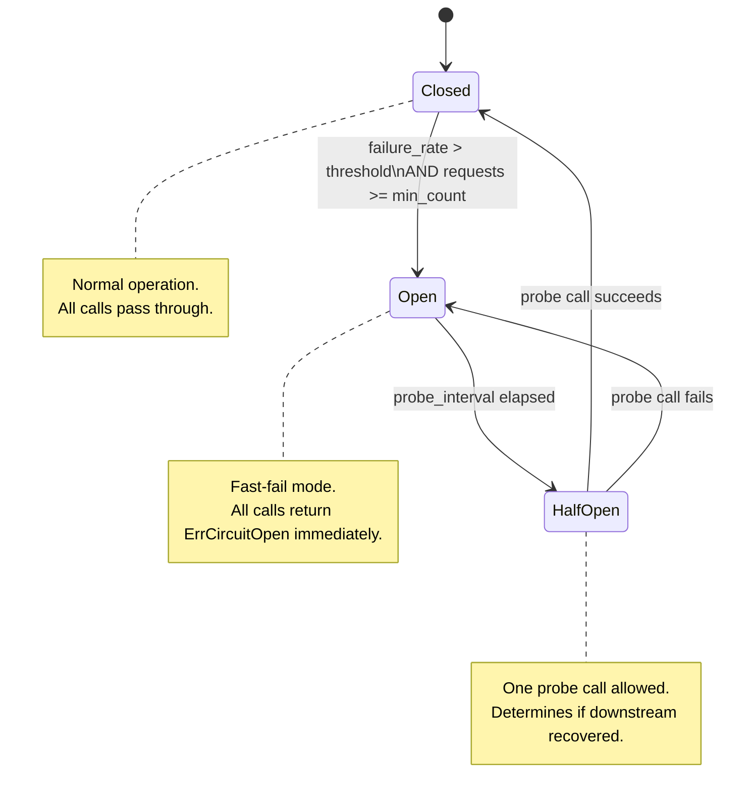
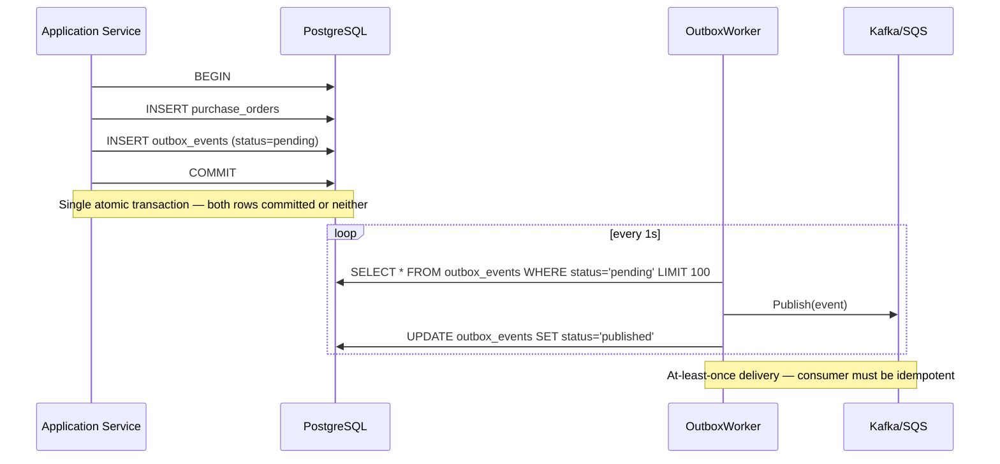
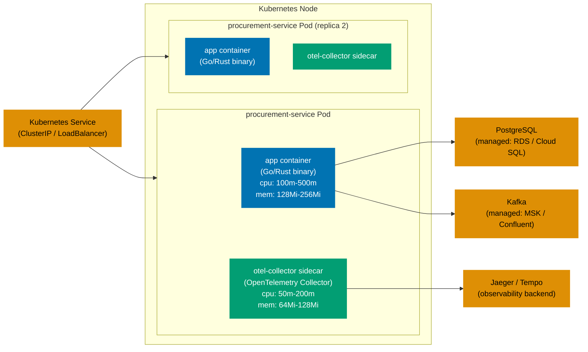

The beginner tier established one hexagon per bounded context with plain structs and explicit interfaces. The intermediate tier wired real infrastructure — Postgres adapters, in-memory test doubles, outbox pattern foundations, cross-context ACLs, and a test harness. This advanced tier completes the production picture: composition root wiring, graceful shutdown, environment configuration, retry and circuit breaker policies, outbox at scale, distributed tracing, metrics dashboards, structured logging, health probes, connection pool tuning, input validation with rate limiting, and Kubernetes deployment topology.

Every guide follows the same procurement platform domain: `PurchaseOrder`, `Supplier`, `Invoice`, `Money`, `LineItem`, `Quantity`, `GoodReceiptNote`, `ApprovalLevel`, and `POStatus`. Go is the canonical left tab; Rust is the right tab. Both tabs appear on every guide.

## Guide 15 — Composition Root: Wiring All Adapters

### Why It Matters

The composition root is the single location where every infrastructure choice is made explicit and every dependency is constructed. Without a disciplined composition root, wiring logic scatters across packages — a service locator here, a `sync.Once` init there — making production configuration errors invisible until the process crashes in staging. A clean `main.go` or `main.rs` is step-debuggable, grep-able, and the canonical audit point for security reviewers.






```go
package main

import (
    "log"
    "net/http"
    "os"

    "github.com/go-chi/chi/v5"
    "procurement-platform-be/purchasing/adapter/in/httpapi"
    "procurement-platform-be/purchasing/adapter/out/metrics"
    "procurement-platform-be/purchasing/adapter/out/postgres"
    "procurement-platform-be/purchasing/adapter/out/retry"
    "procurement-platform-be/purchasing/adapter/out/logging"
    "procurement-platform-be/purchasing/app"
    "procurement-platform-be/shared/config"
    "procurement-platform-be/shared/clock"
    "procurement-platform-be/shared/eventbus"
)

func main() {
    // => Load config from environment — fail fast before accepting any traffic
    // => All required vars validated here so the error surface is a single startup log line
    cfg, err := config.FromEnv()
    if err != nil {
        // => os.Exit(1) preferred over log.Fatal inside production code
        // => log.Fatalf calls os.Exit(1) after printing — acceptable at composition root
        log.Fatalf("invalid config: %v", err)
    }

    // => Open PostgreSQL pool — pgxpool or database/sql depending on driver choice
    // => Verify connectivity before binding the HTTP port; no point serving traffic with no DB
    db, err := postgres.Connect(cfg.DatabaseURL, cfg.DBMaxConns)
    if err != nil {
        log.Fatalf("db connect: %v", err)
    }
    defer db.Close()
    // => Deferred Close runs when main returns — ensures pool drains on graceful shutdown

    // => Construct raw infrastructure adapter — pure Postgres, no decoration yet
    // => The adapter implements app.PORepository (the port interface)
    var poRepo app.PORepository = postgres.NewPORepository(db)

    // => Decorator stack — each layer wraps the interface and adds exactly one concern
    // => Order: outermost call first → metrics → retry → logging → real adapter
    // => Metrics must be outermost so it records the full end-to-end duration including retries
    poRepo = metrics.NewInstrumentedPORepository(poRepo, cfg.MetricsNamespace)
    poRepo = retry.NewRetryingPORepository(poRepo, cfg.RetryPolicy)
    // => Logging innermost (before real adapter) so it sees the actual attempt, not the retry loop
    poRepo = logging.NewLoggingPORepository(poRepo, cfg.Logger)

    // => Construct event bus adapter — publishes domain events after successful commits
    eventBus := eventbus.NewKafkaEventBus(cfg.KafkaBrokers, cfg.Logger)

    // => Real clock — swap with a fake clock in tests to control time-sensitive domain logic
    realClock := clock.Real{}

    // => Application service receives only port interfaces — no awareness of Postgres or Kafka
    // => This boundary is the key invariant of hexagonal architecture
    poService := app.NewPOApprovalService(poRepo, eventBus, realClock)

    // => HTTP handler receives only the application service interface
    // => Handler never touches the database directly — all domain logic flows through the service
    poHandler := httpapi.NewPOHandler(poService, cfg.Logger)

    // => Chi router wires URL paths to handler methods
    r := chi.NewRouter()
    r.Post("/purchase-orders", poHandler.Create)
    r.Post("/purchase-orders/{id}/approve", poHandler.Approve)
    r.Get("/purchase-orders/{id}", poHandler.Get)

    // => Bind HTTP server — all wiring complete and verified before this line
    log.Printf("listening on %s", cfg.ListenAddr)
    if err := http.ListenAndServe(cfg.ListenAddr, r); err != nil {
        log.Fatalf("server error: %v", err)
    }
}
```




```rust
use std::sync::Arc;
use axum::{Router, routing::post, routing::get};
use tokio::net::TcpListener;

use procurement_platform_be::{
    purchasing::{
        adapter::{
            in_::httpapi::POHandler,
            out::{
                postgres::PORepository as PGRepo,
                metrics::InstrumentedPORepository,
                retry::RetryingPORepository,
                logging::LoggingPORepository,
                kafka::KafkaEventBus,
            },
        },
        app::POApprovalService,
    },
    shared::{config::Config, clock::RealClock},
};

#[tokio::main]
async fn main() -> anyhow::Result<()> {
    // => Load config from environment — all vars validated before any connection attempt
    // => anyhow::Result propagates descriptive errors to the process exit message
    let cfg = Config::from_env()?;

    // => Initialize tracing subscriber early — captures all startup logs
    tracing_subscriber::fmt()
        .json()
        .with_max_level(cfg.log_level)
        .init();

    // => Connect to PostgreSQL via sqlx pool — verify connectivity at startup
    // => PgPoolOptions controls max_connections, acquire_timeout, idle_timeout
    let pool = sqlx::postgres::PgPoolOptions::new()
        .max_connections(cfg.db_max_conns)
        .connect(&cfg.database_url)
        .await?;

    // => Construct raw repository adapter — implements the PORepository trait (port)
    let raw_repo = Arc::new(PGRepo::new(pool.clone()));

    // => Decorator stack — Arc<dyn Trait + Send + Sync> required for tokio async runtime
    // => Each decorator wraps the previous layer; metrics is outermost for full-duration recording
    let with_metrics = Arc::new(InstrumentedPORepository::new(raw_repo, &cfg.metrics_namespace));
    let with_retry = Arc::new(RetryingPORepository::new(with_metrics, cfg.retry_policy.clone()));
    // => Logging adapter innermost before the real adapter — records actual attempt timings
    let po_repo: Arc<dyn app::PORepository + Send + Sync> =
        Arc::new(LoggingPORepository::new(with_retry));

    // => Kafka event bus — publishes domain events after transaction commits
    let event_bus = Arc::new(KafkaEventBus::new(&cfg.kafka_brokers));

    // => Real clock for production; inject a mock clock in integration tests
    let clock = Arc::new(RealClock);

    // => Application service — only sees trait objects, no concrete infrastructure types
    // => Arc enables sharing across async tasks without copying
    let po_service = Arc::new(POApprovalService::new(po_repo, event_bus, clock));

    // => Build axum router — handler closures capture the Arc-wrapped service
    let po_handler = POHandler::new(po_service);
    let app = Router::new()
        .route("/purchase-orders", post({
            let h = po_handler.clone();
            // => Clone is cheap — Arc increments a reference count, no data copy
            move |body| h.create(body)
        }))
        .route("/purchase-orders/:id/approve", post({
            let h = po_handler.clone();
            move |path| h.approve(path)
        }))
        .route("/purchase-orders/:id", get({
            let h = po_handler.clone();
            move |path| h.get(path)
        }));

    // => Bind TCP listener — all wiring verified before accepting connections
    let listener = TcpListener::bind(&cfg.listen_addr).await?;
    tracing::info!("listening on {}", cfg.listen_addr);
    axum::serve(listener, app).await?;
    Ok(())
}
```




## Guide 16 — Graceful Shutdown with Context Propagation

### Why It Matters

Kubernetes sends `SIGTERM` before killing a pod. Without graceful shutdown, every in-flight HTTP request is cut off mid-execution: uncommitted transactions roll back, half-written outbox rows corrupt event delivery, and clients receive TCP RST instead of a proper HTTP response. A 30-second drain window is the industry standard — long enough to complete most requests, short enough to stay within Kubernetes `terminationGracePeriodSeconds`.




```go
package main

import (
    "context"
    "log"
    "net/http"
    "os/signal"
    "syscall"
    "time"

    "github.com/go-chi/chi/v5"
)

func runServer(handler http.Handler, addr string) error {
    // => signal.NotifyContext creates a context that cancels on SIGTERM or SIGINT
    // => SIGTERM is what Kubernetes sends; SIGINT is Ctrl-C in local development
    ctx, stop := signal.NotifyContext(context.Background(), syscall.SIGTERM, syscall.SIGINT)
    defer stop()
    // => defer stop() releases OS resources — best practice even when ctx cancels

    srv := &http.Server{
        Addr:    addr,
        Handler: handler,
        // => ReadHeaderTimeout prevents slow-loris header attacks
        ReadHeaderTimeout: 10 * time.Second,
    }

    // => Run server in a goroutine — ListenAndServe blocks until Shutdown is called
    errCh := make(chan error, 1)
    go func() {
        log.Printf("server ready on %s", addr)
        if err := srv.ListenAndServe(); err != http.ErrServerClosed {
            // => ErrServerClosed is the expected error after Shutdown() — not a real error
            errCh <- err
        }
        close(errCh)
    }()

    // => Block until signal received or server error
    select {
    case err := <-errCh:
        return err
    case <-ctx.Done():
        // => ctx.Done() fires on SIGTERM — begin graceful drain
        log.Println("shutdown signal received, draining requests")
    }

    // => 30-second drain window — matches Kubernetes terminationGracePeriodSeconds default
    // => In-flight handlers continue; new requests get connection refused
    shutdownCtx, cancel := context.WithTimeout(context.Background(), 30*time.Second)
    defer cancel()

    if err := srv.Shutdown(shutdownCtx); err != nil {
        return fmt.Errorf("shutdown error: %w", err)
    }
    log.Println("server stopped cleanly")
    return nil
}

// retryingRepository.Save — shows ctx.Done() check between retry attempts
func (r *RetryingPORepository) Save(ctx context.Context, po *domain.PurchaseOrder) error {
    for attempt := 0; attempt < r.policy.MaxAttempts; attempt++ {
        err := r.inner.Save(ctx, po)
        if err == nil {
            return nil
        }
        if !isRetryable(err) {
            // => Non-retryable errors (validation, not-found) propagate immediately
            return err
        }

        delay := r.policy.NextDelay(attempt)
        select {
        case <-time.After(delay):
            // => Sleep between retry attempts — exponential backoff applied
        case <-ctx.Done():
            // => ctx cancelled (shutdown or request timeout) — abort retry loop cleanly
            // => Returning ctx.Err() lets the caller distinguish cancellation from DB error
            return fmt.Errorf("retry aborted: %w", ctx.Err())
        }
    }
    return fmt.Errorf("save failed after %d attempts", r.policy.MaxAttempts)
}
```




```rust
use std::sync::Arc;
use axum::Router;
use tokio::net::TcpListener;
use tokio::signal;

pub async fn run_server(app: Router, addr: &str) -> anyhow::Result<()> {
    let listener = TcpListener::bind(addr).await?;
    tracing::info!("server ready on {}", addr);

    // => axum::serve with graceful_shutdown accepts a future that resolves on shutdown signal
    // => The runtime drains in-flight requests before dropping the server
    axum::serve(listener, app)
        .with_graceful_shutdown(shutdown_signal())
        .await?;

    tracing::info!("server stopped cleanly");
    Ok(())
}

async fn shutdown_signal() {
    // => Wait for either SIGTERM (Kubernetes) or Ctrl-C (local dev)
    // => tokio::signal handles platform differences — SIGTERM is Unix-only
    let ctrl_c = async {
        signal::ctrl_c()
            .await
            .expect("failed to install Ctrl+C handler");
    };

    #[cfg(unix)]
    let terminate = async {
        signal::unix::signal(signal::unix::SignalKind::terminate())
            // => SIGTERM is the Kubernetes graceful stop signal
            .expect("failed to install SIGTERM handler")
            .recv()
            .await;
    };

    #[cfg(not(unix))]
    // => Windows does not have SIGTERM — Ctrl-C is the only graceful stop
    let terminate = std::future::pending::<()>();

    // => select! resolves on whichever signal arrives first
    tokio::select! {
        _ = ctrl_c => { tracing::info!("received Ctrl-C, shutting down") }
        _ = terminate => { tracing::info!("received SIGTERM, shutting down") }
    }
}

// RetryingPORepository::save — cancellation-aware retry loop
impl RetryingPORepository {
    pub async fn save(
        &self,
        ctx: &tokio_util::sync::CancellationToken,
        po: &PurchaseOrder,
    ) -> Result<(), RepositoryError> {
        for attempt in 0..self.policy.max_attempts {
            match self.inner.save(po).await {
                Ok(()) => return Ok(()),
                Err(e) if !e.is_retryable() => return Err(e),
                // => Non-retryable errors (e.g., constraint violation) propagate immediately
                Err(_) => {}
            }

            let delay = self.policy.next_delay(attempt);
            // => tokio::select! races the backoff timer against the cancellation token
            // => If the token is cancelled (shutdown or request timeout), abort cleanly
            tokio::select! {
                _ = tokio::time::sleep(delay) => {}
                _ = ctx.cancelled() => {
                    return Err(RepositoryError::Cancelled);
                    // => Cancelled variant lets callers distinguish abort from DB error
                }
            }
        }
        Err(RepositoryError::ExhaustedRetries(self.policy.max_attempts))
    }
}
```




## Guide 17 — Environment-Specific Configuration

### Why It Matters

Hard-coded configuration causes environment bleed: a developer accidentally ships a staging database URL in the production binary, or a test suite sends real emails because `SMTP_HOST` defaults to the production server. Twelve-factor apps configure entirely via environment variables, making the same binary deployable across dev, staging, and production without recompilation.




```go
package config

import (
    "fmt"
    "os"
    "strconv"
    "time"
)

// Config holds all runtime configuration for the procurement service.
// Every field is loaded from an environment variable — no defaults in source code.
type Config struct {
    // => DATABASE_URL — full DSN including credentials; never hardcode in source
    DatabaseURL string

    // => LOG_LEVEL — trace|debug|info|warn|error; controls log verbosity per environment
    LogLevel string

    // => METRICS_NAMESPACE — prefix for all Prometheus metrics; e.g. "procurement_prod"
    MetricsNamespace string

    // => LISTEN_ADDR — e.g. ":8080"; separate from the domain so Kubernetes can remap ports
    ListenAddr string

    // => KAFKA_BROKERS — comma-separated list; e.g. "broker1:9092,broker2:9092"
    KafkaBrokers string

    // => DB_MAX_CONNS — tuned per environment; prod > staging > dev
    DBMaxConns int

    // => RETRY_MAX_ATTEMPTS — separate from domain logic; ops team tunes per SLA
    RetryPolicy RetryPolicyConfig

    // => APP_ENV — test|development|staging|production; controls adapter selection
    AppEnv string
}

type RetryPolicyConfig struct {
    MaxAttempts int
    // => BaseDelay and MaxDelay parsed from strings: "100ms", "2s"
    BaseDelay time.Duration
    MaxDelay  time.Duration
    // => JitterFraction in range [0.0, 1.0] — fraction of delay to randomise
    JitterFraction float64
}

// FromEnv loads config from environment variables, returning a descriptive error
// for the first missing or invalid variable found.
func FromEnv() (*Config, error) {
    cfg := &Config{}

    // => requireEnv returns an error rather than panicking — caller decides to log.Fatal
    var err error
    if cfg.DatabaseURL, err = requireEnv("DATABASE_URL"); err != nil {
        return nil, err
    }
    if cfg.LogLevel, err = requireEnv("LOG_LEVEL"); err != nil {
        return nil, err
    }
    if cfg.MetricsNamespace, err = requireEnv("METRICS_NAMESPACE"); err != nil {
        return nil, err
    }
    if cfg.ListenAddr, err = requireEnv("LISTEN_ADDR"); err != nil {
        return nil, err
    }
    if cfg.KafkaBrokers, err = requireEnv("KAFKA_BROKERS"); err != nil {
        return nil, err
    }
    if cfg.AppEnv, err = requireEnv("APP_ENV"); err != nil {
        return nil, err
    }

    // => parseInt wraps strconv.Atoi with a field-specific error message
    if cfg.DBMaxConns, err = parseInt("DB_MAX_CONNS"); err != nil {
        return nil, err
    }

    // => Retry policy parsed separately — groups related config under one struct
    if cfg.RetryPolicy, err = parseRetryPolicy(); err != nil {
        return nil, err
    }

    return cfg, nil
}

// AdapterFactory returns the correct repository implementation based on APP_ENV.
// In-memory adapter is used for tests; Postgres for all other environments.
func AdapterFactory(cfg *Config, db *sql.DB) app.PORepository {
    if cfg.AppEnv == "test" {
        // => In-memory adapter — no network I/O, deterministic, fast
        // => Same interface as the Postgres adapter — tests exercise the same application code
        return inmemory.NewPORepository()
    }
    // => Postgres adapter for development, staging, and production
    return postgres.NewPORepository(db)
}

func requireEnv(key string) (string, error) {
    v := os.Getenv(key)
    if v == "" {
        // => Empty string is treated as missing — operators cannot accidentally set blank values
        return "", fmt.Errorf("required environment variable %s is not set", key)
    }
    return v, nil
}

func parseInt(key string) (int, error) {
    s, err := requireEnv(key)
    if err != nil {
        return 0, err
    }
    n, err := strconv.Atoi(s)
    if err != nil {
        return 0, fmt.Errorf("env %s must be an integer, got %q", key, s)
    }
    return n, nil
}
```




```rust
use std::time::Duration;
use serde::Deserialize;

// => Config derives Deserialize so envy can populate it from env vars automatically
// => Each field name maps to its uppercase env var: database_url → DATABASE_URL
#[derive(Debug, Deserialize)]
pub struct Config {
    // => DATABASE_URL — full connection string including credentials
    pub database_url: String,

    // => LOG_LEVEL — trace|debug|info|warn|error
    pub log_level: String,

    // => METRICS_NAMESPACE — Prometheus metric prefix
    pub metrics_namespace: String,

    // => LISTEN_ADDR — socket address for HTTP server, e.g. "0.0.0.0:8080"
    pub listen_addr: String,

    // => KAFKA_BROKERS — comma-separated broker list
    pub kafka_brokers: String,

    // => DB_MAX_CONNS — parsed directly to u32 by envy
    pub db_max_conns: u32,

    // => APP_ENV — controls adapter selection: "test" | "development" | "staging" | "production"
    pub app_env: String,

    // => Retry settings as flat env vars; envy uses prefix stripping for nested structs
    pub retry_max_attempts: u32,
    // => retry_base_delay_ms parsed from milliseconds integer for simplicity
    pub retry_base_delay_ms: u64,
    pub retry_max_delay_ms: u64,
    pub retry_jitter_fraction: f64,
}

impl Config {
    // => from_env uses the envy crate for type-safe env var parsing with descriptive errors
    pub fn from_env() -> Result<Self, envy::Error> {
        envy::from_env::<Config>()
        // => envy::Error names the missing field: "missing field DATABASE_URL"
    }

    pub fn retry_base_delay(&self) -> Duration {
        // => Convert milliseconds integer to Duration — keeps env vars human-readable
        Duration::from_millis(self.retry_base_delay_ms)
    }

    pub fn retry_max_delay(&self) -> Duration {
        Duration::from_millis(self.retry_max_delay_ms)
    }
}

// adapter_factory selects the repository implementation based on APP_ENV
pub fn adapter_factory(
    cfg: &Config,
    pool: sqlx::PgPool,
) -> Arc<dyn PORepository + Send + Sync> {
    if cfg.app_env == "test" {
        // => InMemoryPORepository — no I/O, deterministic test doubles
        // => Same trait object as the Postgres variant — tests exercise real application code
        Arc::new(InMemoryPORepository::new())
    } else {
        // => Postgres adapter for all non-test environments
        Arc::new(PostgresPORepository::new(pool))
    }
}
```




## Guide 18 — Retry Policy with Exponential Backoff and Jitter

### Why It Matters

Fixed-interval retries cause thundering herd: when a downstream database has a brief overload spike, every failing client retries at the same moment, amplifying the load and extending the outage. Exponential backoff with jitter staggers retry attempts across a random window, spreading load and giving the database time to recover.






```go
package retry

import (
    "context"
    "math"
    "math/rand"
    "time"
)

// RetryPolicy holds the parameters for exponential backoff with jitter.
// All fields are loaded from environment variables in the composition root.
type RetryPolicy struct {
    // => MaxAttempts caps the total number of tries including the first attempt
    MaxAttempts int

    // => BaseDelay is the delay after the first failure — typically 50-200ms
    BaseDelay time.Duration

    // => MaxDelay caps the computed delay — prevents multi-minute waits on large attempt counts
    MaxDelay time.Duration

    // => JitterFraction in [0.0, 1.0] — fraction of computed delay to randomise
    // => 0.25 means up to 25% of the delay is random — sufficient to break synchrony
    JitterFraction float64
}

// NextDelay returns the delay to wait before the given attempt number (0-indexed).
// Formula: min(BaseDelay * 2^attempt, MaxDelay) + random(0, delay*JitterFraction)
func (p RetryPolicy) NextDelay(attempt int) time.Duration {
    // => math.Pow(2, attempt) gives: 1, 2, 4, 8, 16 ... for attempts 0,1,2,3,4
    exp := math.Pow(2, float64(attempt))
    delay := time.Duration(float64(p.BaseDelay) * exp)

    // => Cap at MaxDelay — prevents unbounded growth for high attempt counts
    if delay > p.MaxDelay {
        delay = p.MaxDelay
    }

    // => Add random jitter in [0, delay * JitterFraction)
    // => rand.Float64() returns [0.0, 1.0) — deterministic seed in tests
    jitter := time.Duration(float64(delay) * p.JitterFraction * rand.Float64())
    return delay + jitter
}

// IsRetryable classifies an error as transient (worth retrying) or permanent.
// Permanent errors propagate immediately without consuming retry budget.
func IsRetryable(err error) bool {
    // => Network timeouts and temporary unavailability are transient
    // => Validation errors, not-found, and permission errors are permanent
    var netErr *net.OpError
    if errors.As(err, &netErr) && netErr.Temporary() {
        return true
    }
    // => PostgreSQL error code 53300 = too_many_connections — transient
    var pgErr *pgconn.PgError
    if errors.As(err, &pgErr) && pgErr.Code == "53300" {
        return true
    }
    // => domain.ErrNotFound, domain.ErrInvalidInput are permanent — no point retrying
    return false
}

// RetryingPORepository wraps a PORepository with retry logic.
type RetryingPORepository struct {
    // => inner is the actual adapter — Postgres or any other implementation
    inner  app.PORepository
    // => policy holds backoff parameters — injected at construction, not hardcoded
    policy RetryPolicy
}

func NewRetryingPORepository(inner app.PORepository, policy RetryPolicy) *RetryingPORepository {
    return &RetryingPORepository{inner: inner, policy: policy}
}

func (r *RetryingPORepository) Save(ctx context.Context, po *domain.PurchaseOrder) error {
    for attempt := 0; attempt < r.policy.MaxAttempts; attempt++ {
        err := r.inner.Save(ctx, po)
        if err == nil {
            // => Success on this attempt — return immediately, no logging overhead
            return nil
        }
        if !IsRetryable(err) {
            // => Permanent error — surface immediately to caller
            return err
        }

        delay := r.policy.NextDelay(attempt)
        select {
        case <-time.After(delay):
            // => Backoff sleep complete — proceed to next attempt
        case <-ctx.Done():
            // => Request cancelled or server shutting down — abort retry loop
            return fmt.Errorf("retry aborted after %d attempts: %w", attempt+1, ctx.Err())
        }
    }
    // => Exhausted all attempts — wrap with attempt count for observability
    return fmt.Errorf("save failed after %d attempts", r.policy.MaxAttempts)
}
```




```rust
use std::time::Duration;
use rand::Rng;
use tokio_util::sync::CancellationToken;

// => RetryPolicy holds backoff parameters — all injected from Config, never hardcoded
#[derive(Clone, Debug)]
pub struct RetryPolicy {
    // => max_attempts caps total tries including the first
    pub max_attempts: u32,
    // => base_delay is the initial wait duration, typically 50–200ms
    pub base_delay: Duration,
    // => max_delay caps exponential growth — prevents multi-minute waits
    pub max_delay: Duration,
    // => jitter_fraction in [0.0, 1.0]; 0.25 is sufficient to break retry synchrony
    pub jitter_fraction: f64,
}

impl RetryPolicy {
    // => next_delay computes min(base * 2^attempt, max) + random jitter
    pub fn next_delay(&self, attempt: u32) -> Duration {
        let exp = 2u64.saturating_pow(attempt);
        // => saturating_pow prevents overflow on high attempt counts
        let base_ns = self.base_delay.as_nanos() as u64;
        let delay_ns = base_ns.saturating_mul(exp);
        let capped_ns = delay_ns.min(self.max_delay.as_nanos() as u64);

        let jitter_ns = (capped_ns as f64 * self.jitter_fraction * rand::thread_rng().gen::<f64>()) as u64;
        // => rand::thread_rng() is seeded from OS entropy — unpredictable in production
        Duration::from_nanos(capped_ns + jitter_ns)
    }
}

// is_retryable classifies errors as transient or permanent
fn is_retryable(err: &RepositoryError) -> bool {
    match err {
        // => DB connection errors and pool exhaustion are transient
        RepositoryError::ConnectionFailed(_) => true,
        RepositoryError::PoolExhausted => true,
        // => Domain validation and not-found are permanent — retrying wastes time
        RepositoryError::NotFound(_) => false,
        RepositoryError::InvalidInput(_) => false,
        // => Unknown errors: assume not retryable — fail fast rather than retry blindly
        _ => false,
    }
}

// RetryingPORepository wraps any PORepository implementation with retry logic
pub struct RetryingPORepository {
    inner: Arc<dyn PORepository + Send + Sync>,
    policy: RetryPolicy,
}

impl RetryingPORepository {
    pub async fn save(
        &self,
        token: &CancellationToken,
        po: &PurchaseOrder,
    ) -> Result<(), RepositoryError> {
        for attempt in 0..self.policy.max_attempts {
            match self.inner.save(po).await {
                Ok(()) => return Ok(()),
                // => Permanent errors propagate without consuming remaining retry budget
                Err(e) if !is_retryable(&e) => return Err(e),
                Err(_) => {}
            }

            let delay = self.policy.next_delay(attempt);
            tokio::select! {
                // => Sleep between attempts — jittered exponential delay
                _ = tokio::time::sleep(delay) => {}
                // => Cancellation token fires on shutdown or request timeout — abort cleanly
                _ = token.cancelled() => {
                    return Err(RepositoryError::Cancelled);
                }
            }
        }
        Err(RepositoryError::ExhaustedRetries(self.policy.max_attempts))
    }
}
```




## Guide 19 — Circuit Breaker Wiring in Production

### Why It Matters

Retry policies assume failures are transient. Circuit breakers protect against sustained downstream degradation: when a supplier API is down for minutes, retrying every call exhausts goroutine/thread pools and cascades failure to every request in the system. A circuit breaker short-circuits calls immediately when failure rate exceeds a threshold, giving the downstream time to recover without amplifying load.






```go
package circuitbreaker

import (
    "errors"
    "sync"
    "time"
)

// ErrCircuitOpen is returned immediately when the circuit is open.
// Callers can check for this error to fast-fail without waiting for a timeout.
var ErrCircuitOpen = errors.New("circuit breaker open")

// State represents the circuit breaker state machine.
type State int

const (
    // => Closed — normal operation; calls pass through to the downstream
    StateClosed State = iota
    // => Open — fast-fail mode; calls return ErrCircuitOpen immediately
    StateOpen
    // => HalfOpen — one probe call allowed to test downstream recovery
    StateHalfOpen
)

// CircuitBreaker wraps an external client with a state machine.
type CircuitBreaker struct {
    mu sync.Mutex
    // => state is the current FSM state — all transitions guarded by mu
    state State

    // => Closed → Open when failureCount/totalCount > FailureThreshold
    failureCount int
    totalCount   int

    // => FailureThreshold as a ratio: 0.5 means 50% failures triggers Open
    FailureThreshold float64
    // => MinRequests prevents tripping the breaker on a single failed request at startup
    MinRequests int

    // => openSince tracks when the circuit opened — used to compute probe window
    openSince time.Time
    // => ProbeInterval is how long to wait in Open before allowing a probe
    ProbeInterval time.Duration
}

func (cb *CircuitBreaker) Allow() error {
    cb.mu.Lock()
    defer cb.mu.Unlock()

    switch cb.state {
    case StateClosed:
        // => Allow call — circuit is healthy
        return nil
    case StateOpen:
        if time.Since(cb.openSince) > cb.ProbeInterval {
            // => Probe interval elapsed — transition to HalfOpen for one test call
            cb.state = StateHalfOpen
            return nil
        }
        // => Still in open window — fast fail without touching the downstream
        return ErrCircuitOpen
    case StateHalfOpen:
        // => One probe call already in flight — fast-fail subsequent calls
        return ErrCircuitOpen
    }
    return nil
}

func (cb *CircuitBreaker) RecordSuccess() {
    cb.mu.Lock()
    defer cb.mu.Unlock()
    // => Successful probe — downstream recovered; reset to Closed
    cb.state = StateClosed
    cb.failureCount = 0
    cb.totalCount = 0
}

func (cb *CircuitBreaker) RecordFailure() {
    cb.mu.Lock()
    defer cb.mu.Unlock()

    cb.totalCount++
    cb.failureCount++

    if cb.state == StateHalfOpen {
        // => Probe failed — downstream still down; return to Open
        cb.state = StateOpen
        cb.openSince = time.Now()
        return
    }

    // => Check threshold only after MinRequests to avoid hair-trigger on startup
    if cb.totalCount >= cb.MinRequests {
        rate := float64(cb.failureCount) / float64(cb.totalCount)
        if rate > cb.FailureThreshold {
            cb.state = StateOpen
            // => Record when circuit opened — used to compute ProbeInterval
            cb.openSince = time.Now()
        }
    }
}

// CircuitBreakerSupplierAdapter wraps the supplier HTTP client with a circuit breaker.
type CircuitBreakerSupplierAdapter struct {
    // => inner is the actual HTTP client adapter
    inner app.ExternalSupplierPort
    cb    *CircuitBreaker
}

func (a *CircuitBreakerSupplierAdapter) FetchSupplierInfo(
    ctx context.Context, id domain.SupplierID,
) (*domain.SupplierInfo, error) {
    if err := a.cb.Allow(); err != nil {
        // => Circuit open — return immediately, no network call made
        return nil, fmt.Errorf("supplier fetch blocked: %w", err)
    }

    info, err := a.inner.FetchSupplierInfo(ctx, id)
    if err != nil {
        // => Record failure — may trip the circuit on next RecordFailure call
        a.cb.RecordFailure()
        return nil, err
    }

    // => Record success — resets counter in Closed, heals circuit in HalfOpen
    a.cb.RecordSuccess()
    return info, nil
}
```




```rust
use std::sync::Mutex;
use std::time::{Duration, Instant};
use thiserror::Error;

#[derive(Error, Debug)]
pub enum CircuitError {
    // => Returned immediately when circuit is Open — no downstream call made
    #[error("circuit breaker open")]
    Open,
}

// => State enum represents the three states of the circuit FSM
#[derive(Debug, PartialEq)]
enum CircuitState {
    // => Closed — normal operation
    Closed,
    // => Open — fast-fail; downstream degraded
    Open { since: Instant },
    // => HalfOpen — one probe call in flight
    HalfOpen,
}

// => Shared mutable state guarded by Mutex — safe across tokio tasks via Arc
struct CircuitBreakerState {
    state: CircuitState,
    failure_count: u32,
    total_count: u32,
}

pub struct CircuitBreaker {
    inner: Mutex<CircuitBreakerState>,
    // => failure_threshold as a ratio — 0.5 means 50% failures trips the circuit
    failure_threshold: f64,
    // => min_requests prevents false positives during low-traffic startup
    min_requests: u32,
    // => probe_interval — time to wait in Open before allowing a probe call
    probe_interval: Duration,
}

impl CircuitBreaker {
    pub fn allow(&self) -> Result<(), CircuitError> {
        let mut s = self.inner.lock().unwrap();
        match &s.state {
            CircuitState::Closed => Ok(()),
            CircuitState::Open { since } => {
                if since.elapsed() > self.probe_interval {
                    // => Probe window elapsed — transition to HalfOpen for one test call
                    s.state = CircuitState::HalfOpen;
                    Ok(())
                } else {
                    // => Still in open window — fast fail
                    Err(CircuitError::Open)
                }
            }
            // => HalfOpen — one probe already in flight; block all other calls
            CircuitState::HalfOpen => Err(CircuitError::Open),
        }
    }

    pub fn record_success(&self) {
        let mut s = self.inner.lock().unwrap();
        // => Success in HalfOpen — downstream recovered; reset to Closed
        s.state = CircuitState::Closed;
        s.failure_count = 0;
        s.total_count = 0;
    }

    pub fn record_failure(&self) {
        let mut s = self.inner.lock().unwrap();
        s.total_count += 1;
        s.failure_count += 1;

        if s.state == CircuitState::HalfOpen {
            // => Probe failed — downstream still degraded; reopen circuit
            s.state = CircuitState::Open { since: Instant::now() };
            return;
        }

        if s.total_count >= self.min_requests {
            let rate = s.failure_count as f64 / s.total_count as f64;
            if rate > self.failure_threshold {
                s.state = CircuitState::Open { since: Instant::now() };
                // => Trip the circuit — subsequent calls fast-fail until probe_interval elapses
            }
        }
    }
}

// CircuitBreakerSupplierAdapter wraps the real supplier HTTP client
pub struct CircuitBreakerSupplierAdapter {
    inner: Arc<dyn ExternalSupplierPort + Send + Sync>,
    cb: Arc<CircuitBreaker>,
}

impl CircuitBreakerSupplierAdapter {
    pub async fn fetch_supplier_info(
        &self,
        id: SupplierId,
    ) -> Result<SupplierInfo, SupplierError> {
        // => Check circuit state before making any network call
        self.cb.allow().map_err(|_| SupplierError::CircuitOpen)?;

        match self.inner.fetch_supplier_info(id).await {
            Ok(info) => {
                self.cb.record_success();
                // => Record success — may heal circuit in HalfOpen
                Ok(info)
            }
            Err(e) => {
                self.cb.record_failure();
                // => Record failure — may trip circuit in Closed
                Err(e)
            }
        }
    }
}
```




## Guide 20 — Outbox Pattern at Production Scale

### Why It Matters

Writing a domain aggregate and publishing a domain event are two separate I/O operations. If the process crashes between them, the event is lost permanently — the database has the new state but the downstream context never receives notification. The transactional outbox pattern eliminates this gap by writing the event to the same database transaction as the aggregate, then publishing asynchronously from a background worker.






```go
package outbox

import (
    "context"
    "database/sql"
    "encoding/json"
    "time"
)

// OutboxEvent represents a row in the outbox_events table.
type OutboxEvent struct {
    // => ID is a UUID generated by the application — correlates event across retries
    ID        string
    // => AggregateID identifies which aggregate produced the event (e.g. PurchaseOrder ID)
    AggregateID string
    // => EventType maps to the domain event type name — used by consumers for routing
    EventType string
    // => Payload is the serialised domain event — JSON for portability
    Payload   []byte
    // => Status: pending → published; failed after MaxAttempts exceeded
    Status    string
    // => Attempts tracks how many publish tries have occurred
    Attempts  int
    // => CreatedAt for ordering and debugging — not used for deduplication
    CreatedAt time.Time
}

// OutboxRepository is the output port for outbox persistence.
// Implemented by the Postgres adapter; replaced by in-memory adapter in tests.
type OutboxRepository interface {
    // => InsertWithTx writes the event in the same transaction as the aggregate
    InsertWithTx(ctx context.Context, tx *sql.Tx, event OutboxEvent) error
    // => PendingEvents fetches up to limit unprocessed events ordered by CreatedAt
    PendingEvents(ctx context.Context, limit int) ([]OutboxEvent, error)
    // => MarkPublished updates status to published — called after broker ack
    MarkPublished(ctx context.Context, id string) error
    // => MarkFailed increments attempts and sets status to failed after MaxAttempts
    MarkFailed(ctx context.Context, id string) error
}

// OutboxWorker runs in a background goroutine, polling for pending events.
type OutboxWorker struct {
    repo      OutboxRepository
    publisher EventPublisher
    // => PollInterval controls how frequently the worker queries for pending events
    // => 1s is typical — lower latency costs more DB load
    PollInterval time.Duration
    // => MaxAttempts before an event is dead-lettered to the failed status
    MaxAttempts int
}

func (w *OutboxWorker) Run(ctx context.Context) {
    ticker := time.NewTicker(w.PollInterval)
    defer ticker.Stop()

    for {
        select {
        case <-ticker.C:
            // => Process a batch on each tick — bounded by limit to prevent memory spikes
            if err := w.processBatch(ctx, 100); err != nil {
                // => Log and continue — worker must not crash on a single bad batch
                slog.Error("outbox batch failed", "error", err)
            }
        case <-ctx.Done():
            // => Graceful shutdown — drain any final tick then exit
            return
        }
    }
}

func (w *OutboxWorker) processBatch(ctx context.Context, limit int) error {
    events, err := w.repo.PendingEvents(ctx, limit)
    if err != nil {
        return fmt.Errorf("fetch pending: %w", err)
    }

    for _, event := range events {
        if err := w.publisher.Publish(ctx, event); err != nil {
            if event.Attempts+1 >= w.MaxAttempts {
                // => Dead-letter after MaxAttempts — alert needed; event requires manual replay
                if markErr := w.repo.MarkFailed(ctx, event.ID); markErr != nil {
                    slog.Error("mark failed error", "event_id", event.ID, "error", markErr)
                }
            }
            // => Continue processing other events — one bad event must not block the batch
            continue
        }
        // => Mark published only after broker acknowledges receipt
        if err := w.repo.MarkPublished(ctx, event.ID); err != nil {
            slog.Error("mark published error", "event_id", event.ID, "error", err)
        }
    }
    return nil
}

// IdempotentConsumer demonstrates how a downstream handler deduplicates events.
// It checks event_id before processing to make publish retries safe.
func (h *POApprovalHandler) HandlePOIssued(ctx context.Context, event OutboxEvent) error {
    // => Check processed_event_ids table before any domain action
    seen, err := h.processedEvents.Contains(ctx, event.ID)
    if err != nil {
        return err
    }
    if seen {
        // => Duplicate delivery — skip silently; idempotency achieved
        return nil
    }

    // => Process the domain event — only reached on first delivery
    if err := h.service.HandlePOIssued(ctx, event); err != nil {
        return err
    }

    // => Record event ID after successful processing — prevents double-processing on next delivery
    return h.processedEvents.Insert(ctx, event.ID)
}
```




```rust
use sqlx::{PgPool, Transaction, Postgres};
use tokio::time::{interval, Duration};
use uuid::Uuid;
use chrono::Utc;

// => OutboxEvent maps to the outbox_events table — serde handles JSON serialisation
#[derive(Debug, sqlx::FromRow)]
pub struct OutboxEvent {
    // => id is a UUID — application-generated for idempotency tracking
    pub id: Uuid,
    pub aggregate_id: String,
    // => event_type routes the event to the correct consumer handler
    pub event_type: String,
    // => payload is JSONB in Postgres — flexible schema for evolving event structures
    pub payload: serde_json::Value,
    // => status: "pending" | "published" | "failed"
    pub status: String,
    pub attempts: i32,
    pub created_at: chrono::DateTime<Utc>,
}

// => OutboxRepository trait is the output port — Postgres adapter implements it
#[async_trait::async_trait]
pub trait OutboxRepository: Send + Sync {
    // => insert_with_tx writes the event in the same Postgres transaction as the aggregate
    async fn insert_with_tx(
        &self,
        tx: &mut Transaction<'_, Postgres>,
        event: &OutboxEvent,
    ) -> Result<(), OutboxError>;

    async fn pending_events(&self, limit: i64) -> Result<Vec<OutboxEvent>, OutboxError>;
    async fn mark_published(&self, id: Uuid) -> Result<(), OutboxError>;
    async fn mark_failed(&self, id: Uuid) -> Result<(), OutboxError>;
}

// OutboxWorker is a tokio background task that polls and publishes pending events
pub struct OutboxWorker {
    repo: Arc<dyn OutboxRepository>,
    publisher: Arc<dyn EventPublisher + Send + Sync>,
    poll_interval: Duration,
    max_attempts: i32,
}

impl OutboxWorker {
    pub async fn run(&self, token: tokio_util::sync::CancellationToken) {
        let mut ticker = interval(self.poll_interval);
        // => interval fires immediately then every poll_interval — use tick() to block until next
        loop {
            tokio::select! {
                _ = ticker.tick() => {
                    if let Err(e) = self.process_batch(100).await {
                        // => Log and continue — one bad batch must not crash the worker
                        tracing::error!(error = %e, "outbox batch error");
                    }
                }
                _ = token.cancelled() => {
                    // => Cancellation token fires on shutdown — exit cleanly
                    tracing::info!("outbox worker shutting down");
                    return;
                }
            }
        }
    }

    async fn process_batch(&self, limit: i64) -> Result<(), OutboxError> {
        let events = self.repo.pending_events(limit).await?;

        for event in events {
            match self.publisher.publish(&event).await {
                Ok(()) => {
                    // => Mark published only after broker acknowledges the message
                    if let Err(e) = self.repo.mark_published(event.id).await {
                        tracing::error!(event_id = %event.id, error = %e, "mark published failed");
                    }
                }
                Err(e) => {
                    if event.attempts + 1 >= self.max_attempts {
                        // => Dead-letter threshold reached — operator alert required
                        tracing::error!(
                            event_id = %event.id,
                            attempts = event.attempts + 1,
                            error = %e,
                            "outbox event dead-lettered"
                        );
                        let _ = self.repo.mark_failed(event.id).await;
                    }
                    // => Continue processing other events — one failure does not block the batch
                }
            }
        }
        Ok(())
    }
}
```




## Guide 21 — Distributed Tracing Integration

### Why It Matters

When a PO approval request fans out across the purchasing, supplier, and invoicing contexts — each making database calls and publishing events — logs from each service exist in isolation. Without distributed tracing, correlating a 2-second latency spike to a specific Postgres query in a specific service requires manually cross-referencing timestamps across five log streams. OpenTelemetry traces stitch all spans into a single timeline with microsecond precision.




```go
package tracing

import (
    "context"

    "go.opentelemetry.io/otel"
    "go.opentelemetry.io/otel/attribute"
    "go.opentelemetry.io/otel/codes"
    "go.opentelemetry.io/otel/exporters/otlp/otlptrace/otlptracegrpc"
    sdktrace "go.opentelemetry.io/otel/sdk/trace"
)

// Tracer is the port interface abstracting otel.Tracer.
// The domain and application layers import only this interface — never the OTel SDK directly.
type Tracer interface {
    // => Start creates a child span under the parent span in ctx
    Start(ctx context.Context, spanName string) (context.Context, Span)
}

// Span is a minimal abstraction over otel.Span — prevents OTel types bleeding into domain.
type Span interface {
    // => End closes the span and flushes timing data to the exporter
    End()
    // => RecordError marks the span as errored with the given error message
    RecordError(err error)
    // => SetAttribute attaches a key-value label visible in Jaeger/Tempo
    SetAttribute(key, value string)
}

// InitOTel configures the global OTel tracer provider pointing at the OTLP collector.
// Called once in main() before any other tracing calls.
func InitOTel(ctx context.Context, serviceName, collectorEndpoint string) (func(), error) {
    // => OTLP gRPC exporter sends traces to the OpenTelemetry Collector sidecar
    // => The collector forwards to Jaeger, Tempo, or any compatible backend
    exporter, err := otlptracegrpc.New(ctx,
        otlptracegrpc.WithEndpoint(collectorEndpoint),
        otlptracegrpc.WithInsecure(),
        // => InsecureSkipVerify acceptable for in-cluster collector traffic; use TLS for cross-zone
    )
    if err != nil {
        return nil, fmt.Errorf("otlp exporter: %w", err)
    }

    provider := sdktrace.NewTracerProvider(
        sdktrace.WithBatcher(exporter),
        // => WithBatcher buffers spans and flushes in batches — lower overhead than sync export
        sdktrace.WithResource(resource.NewWithAttributes(
            semconv.SchemaURL,
            semconv.ServiceNameKey.String(serviceName),
            // => ServiceName appears in Jaeger service dropdown — match Kubernetes deployment name
        )),
        sdktrace.WithSampler(sdktrace.TraceIDRatioBased(0.1)),
        // => 10% sampling in production — adjust based on traffic volume and storage cost
    )
    otel.SetTracerProvider(provider)

    shutdown := func() {
        // => Flush buffered spans before process exits — avoids data loss on graceful shutdown
        if err := provider.Shutdown(ctx); err != nil {
            slog.Error("tracer shutdown error", "error", err)
        }
    }
    return shutdown, nil
}

// InstrumentedPORepository wraps a PORepository with OTel span creation on every call.
type InstrumentedPORepository struct {
    inner  app.PORepository
    tracer Tracer
}

func (r *InstrumentedPORepository) Save(ctx context.Context, po *domain.PurchaseOrder) error {
    // => Create child span — parent span comes from the HTTP request context (W3C traceparent)
    ctx, span := r.tracer.Start(ctx, "po_repository.save")
    defer span.End()
    // => defer End() ensures span closes even if Save panics or returns early

    // => Attach domain identifiers as span attributes — appear as searchable labels in Jaeger
    span.SetAttribute("po.id", string(po.ID))
    span.SetAttribute("db.operation", "save")

    if err := r.inner.Save(ctx, po); err != nil {
        // => RecordError marks span as errored — surfaces in Jaeger error rate graphs
        span.RecordError(err)
        return err
    }
    return nil
}

// HTTP middleware that extracts W3C traceparent from incoming request headers.
// Must be applied before any handler that creates child spans.
func TraceMiddleware(tracer Tracer) func(http.Handler) http.Handler {
    return func(next http.Handler) http.Handler {
        return otelhttp.NewHandler(next, "http_request",
            // => otelhttp extracts W3C traceparent header from incoming requests
            // => Child spans created inside the handler are automatically linked
            otelhttp.WithTracerProvider(otel.GetTracerProvider()),
        )
    }
}
```




```rust
use opentelemetry::trace::{Tracer, TracerProvider, SpanKind};
use opentelemetry_otlp::WithExportConfig;
use opentelemetry_sdk::{trace as sdktrace, Resource};
use tracing_opentelemetry::OpenTelemetryLayer;
use tracing_subscriber::{layer::SubscriberExt, util::SubscriberInitExt};

// => TracerPort is the Rust port interface — domain code depends on this trait, not on OTel SDK
pub trait TracerPort: Send + Sync {
    // => span creates a new span under the current tracing context
    fn span(&self, name: &'static str) -> opentelemetry::trace::Span;
}

// init_otel configures the global OTel tracer + tracing_subscriber JSON+OTel bridge.
// Called once at the start of main() before spawning any tasks.
pub fn init_otel(service_name: &str, collector_endpoint: &str) -> anyhow::Result<impl Fn()> {
    // => OTLP gRPC exporter — sends spans to the OTel Collector sidecar
    let tracer = opentelemetry_otlp::new_pipeline()
        .tracing()
        .with_exporter(
            opentelemetry_otlp::new_exporter()
                .tonic()
                .with_endpoint(collector_endpoint),
                // => tonic() uses gRPC — lower overhead than HTTP/JSON for high-volume tracing
        )
        .with_trace_config(
            sdktrace::config()
                .with_resource(Resource::new(vec![
                    opentelemetry::KeyValue::new("service.name", service_name.to_string()),
                    // => service.name appears in Jaeger dropdown — match Kubernetes deployment name
                ]))
                .with_sampler(sdktrace::Sampler::TraceIdRatioBased(0.1)),
                // => 10% sampling — balance between observability and storage cost
        )
        .install_batch(opentelemetry_sdk::runtime::Tokio)?;
        // => install_batch uses tokio runtime for async span export — matches app runtime

    // => tracing-opentelemetry bridges the tracing crate's spans to OTel spans
    // => All #[tracing::instrument] spans automatically appear in Jaeger
    tracing_subscriber::registry()
        .with(tracing_subscriber::EnvFilter::from_env("LOG_LEVEL"))
        .with(tracing_subscriber::fmt::layer().json())
        .with(OpenTelemetryLayer::new(tracer))
        .init();

    let shutdown = || {
        // => Flush all pending spans before process exits
        opentelemetry::global::shutdown_tracer_provider();
    };
    Ok(shutdown)
}

// Instrumented repository using #[tracing::instrument] for automatic span creation
impl PostgresPORepository {
    #[tracing::instrument(
        name = "po_repository.save",
        skip(self, po),
        fields(po.id = %po.id, db.operation = "save")
        // => fields() attaches domain identifiers as span attributes — searchable in Jaeger
    )]
    pub async fn save(&self, po: &PurchaseOrder) -> Result<(), RepositoryError> {
        // => #[tracing::instrument] automatically creates a span on entry and ends it on return
        // => The W3C traceparent from the HTTP request propagates via tracing context
        sqlx::query!(
            "INSERT INTO purchase_orders (id, status, created_at) VALUES ($1, $2, $3)
             ON CONFLICT (id) DO UPDATE SET status = $2",
            po.id as _,
            po.status.as_str(),
            po.created_at,
        )
        .execute(&self.pool)
        .await
        .map_err(RepositoryError::from)?;
        Ok(())
    }
}
```




## Guide 22 — Metrics Dashboard Setup (Prometheus and Grafana)

### Why It Matters

When a production incident fires at 2 AM, log-grepping under pressure is slow and error-prone. A pre-built Grafana dashboard surfacing the four golden signals — latency, traffic, errors, and saturation — cuts mean time to diagnosis from minutes to seconds. Defining metric names before the incident means no scrambling to figure out which counter to query.




```go
package metrics

import (
    "net/http"
    "time"

    "github.com/prometheus/client_golang/prometheus"
    "github.com/prometheus/client_golang/prometheus/promauto"
    "github.com/prometheus/client_golang/prometheus/promhttp"
)

// Metrics holds all Prometheus instruments for the procurement service.
// Constructed once in main() and passed to each adapter that needs it.
type Metrics struct {
    // => po_approvals_total counts PO approval outcomes by status label
    // => Labels: status="approved"|"rejected"|"error" — enables per-outcome rate queries
    POApprovalsTotal *prometheus.CounterVec

    // => http_request_duration_seconds measures HTTP handler latency
    // => Histogram buckets capture p50, p95, p99 latency across all routes
    HTTPRequestDuration *prometheus.HistogramVec

    // => repo_call_duration_seconds measures repository adapter latency
    // => Labels: repo="po_repository", op="save"|"find_by_id", status="ok"|"error"
    RepoCallDuration *prometheus.HistogramVec

    // => repo_calls_total counts repository calls by outcome
    // => Pair with RepoCallDuration for error rate and latency correlation
    RepoCallsTotal *prometheus.CounterVec
}

// NewMetrics registers all instruments with the provided registry.
// Using a custom registry (not prometheus.DefaultRegisterer) enables parallel test isolation.
func NewMetrics(namespace string, reg prometheus.Registerer) *Metrics {
    factory := promauto.With(reg)
    // => promauto.With panics on duplicate registration — safe at startup, not in hot path

    return &Metrics{
        POApprovalsTotal: factory.NewCounterVec(
            prometheus.CounterOpts{
                Namespace: namespace,
                Name:      "po_approvals_total",
                Help:      "Total PO approval attempts by outcome status.",
                // => Help string appears in Grafana metric explorer — make it precise
            },
            []string{"status"},
        ),
        HTTPRequestDuration: factory.NewHistogramVec(
            prometheus.HistogramOpts{
                Namespace: namespace,
                Name:      "http_request_duration_seconds",
                Help:      "HTTP handler latency in seconds.",
                // => Default buckets: 5ms to 10s — sufficient for typical API response times
                Buckets:   prometheus.DefBuckets,
            },
            []string{"route", "method", "status_code"},
        ),
        RepoCallDuration: factory.NewHistogramVec(
            prometheus.HistogramOpts{
                Namespace: namespace,
                Name:      "repo_call_duration_seconds",
                Help:      "Repository adapter call latency in seconds.",
                // => Finer buckets for DB calls — 1ms to 1s range
                Buckets:   []float64{.001, .005, .01, .025, .05, .1, .25, .5, 1.0},
            },
            []string{"repo", "op", "status"},
        ),
        RepoCallsTotal: factory.NewCounterVec(
            prometheus.CounterOpts{
                Namespace: namespace,
                Name:      "repo_calls_total",
                Help:      "Total repository adapter calls by outcome.",
            },
            []string{"repo", "op", "status"},
        ),
    }
}

// InstrumentedPORepository wraps a PORepository and records metrics on every call.
type InstrumentedPORepository struct {
    inner   app.PORepository
    metrics *Metrics
    // => repoName is the label value for the "repo" dimension — e.g. "po_repository"
    repoName string
}

func (r *InstrumentedPORepository) Save(ctx context.Context, po *domain.PurchaseOrder) error {
    start := time.Now()
    err := r.inner.Save(ctx, po)
    // => Compute duration after the call returns — captures full latency including retries
    duration := time.Since(start).Seconds()

    status := "ok"
    if err != nil {
        status = "error"
    }

    // => Observe records the latency sample in the histogram bucket
    r.metrics.RepoCallDuration.WithLabelValues(r.repoName, "save", status).Observe(duration)
    // => Inc increments the counter — drives error rate panel in Grafana
    r.metrics.RepoCallsTotal.WithLabelValues(r.repoName, "save", status).Inc()
    return err
}

// MetricsHandler exposes the /metrics endpoint for Prometheus scraping.
func MetricsHandler(reg prometheus.Gatherer) http.Handler {
    // => promhttp.HandlerFor serves the current metric state as text/plain exposition format
    // => Prometheus scrapes this endpoint on its configured interval (typically 15s)
    return promhttp.HandlerFor(reg, promhttp.HandlerOpts{
        EnableOpenMetrics: true,
        // => OpenMetrics format is backward-compatible and enables exemplar support
    })
}
```




```rust
use prometheus::{Registry, CounterVec, HistogramVec, Opts, HistogramOpts};
use std::sync::Arc;

// Metrics holds all Prometheus instruments for the procurement service
pub struct Metrics {
    // => po_approvals_total — counter with status label: "approved" | "rejected" | "error"
    pub po_approvals_total: CounterVec,

    // => http_request_duration_seconds — histogram with route, method, status_code labels
    pub http_request_duration: HistogramVec,

    // => repo_call_duration_seconds — histogram with repo, op, status labels
    pub repo_call_duration: HistogramVec,

    // => repo_calls_total — counter with repo, op, status labels
    pub repo_calls_total: CounterVec,
}

impl Metrics {
    // => new registers all instruments with the provided Registry
    // => Custom Registry enables test isolation — no global state between tests
    pub fn new(namespace: &str, registry: &Registry) -> anyhow::Result<Self> {
        let po_approvals_total = CounterVec::new(
            Opts::new("po_approvals_total", "Total PO approval attempts by outcome status.")
                .namespace(namespace),
            &["status"],
            // => Labels slice must match the values passed to with_label_values() at call sites
        )?;

        let http_request_duration = HistogramVec::new(
            HistogramOpts::new(
                "http_request_duration_seconds",
                "HTTP handler latency in seconds.",
            )
            .namespace(namespace)
            .buckets(prometheus::DEFAULT_BUCKETS.to_vec()),
            &["route", "method", "status_code"],
        )?;

        let repo_call_duration = HistogramVec::new(
            HistogramOpts::new(
                "repo_call_duration_seconds",
                "Repository adapter call latency in seconds.",
            )
            .namespace(namespace)
            // => Fine-grained buckets for DB calls — 1ms to 1s range
            .buckets(vec![0.001, 0.005, 0.01, 0.025, 0.05, 0.1, 0.25, 0.5, 1.0]),
            &["repo", "op", "status"],
        )?;

        let repo_calls_total = CounterVec::new(
            Opts::new("repo_calls_total", "Total repository adapter calls by outcome.")
                .namespace(namespace),
            &["repo", "op", "status"],
        )?;

        // => register() returns an error if a metric with the same name is already registered
        registry.register(Box::new(po_approvals_total.clone()))?;
        registry.register(Box::new(http_request_duration.clone()))?;
        registry.register(Box::new(repo_call_duration.clone()))?;
        registry.register(Box::new(repo_calls_total.clone()))?;

        Ok(Self {
            po_approvals_total,
            http_request_duration,
            repo_call_duration,
            repo_calls_total,
        })
    }
}

// metrics_handler returns an axum handler that serves the Prometheus exposition format
pub async fn metrics_handler(
    axum::extract::State(registry): axum::extract::State<Arc<Registry>>,
) -> impl axum::response::IntoResponse {
    use prometheus::Encoder;
    let encoder = prometheus::TextEncoder::new();
    let mut buffer = vec![];
    // => gather() collects the current state of all registered metrics
    encoder.encode(&registry.gather(), &mut buffer).unwrap();
    // => Response is text/plain; version=0.0.4 — standard Prometheus scrape format
    (
        [(axum::http::header::CONTENT_TYPE, "text/plain; version=0.0.4")],
        buffer,
    )
}
```




## Guide 23 — Structured Logging Pipeline

### Why It Matters

`fmt.Printf` logs cannot be searched, filtered, or aggregated in Elasticsearch, CloudWatch Logs Insights, or Loki. A structured JSON log with consistent field names — `ts`, `level`, `msg`, `service`, `trace_id`, `po_id` — enables query-driven debugging: find all errors for a specific PO in milliseconds rather than grepping free-form text across five log files.




```go
package logging

import (
    "context"
    "log/slog"
    "os"
    "time"
)

// contextKey is an unexported type for context value keys — prevents collisions.
type contextKey int

const (
    // => traceIDKey stores the W3C trace ID extracted from the incoming request
    traceIDKey contextKey = iota
    // => poIDKey stores the purchase order ID for log correlation within a request
    poIDKey
)

// NewJSONLogger creates a slog.Logger with JSON output and required base attributes.
// Pass service name and version at startup — they appear on every log line.
func NewJSONLogger(serviceName, version string, level slog.Level) *slog.Logger {
    handler := slog.NewJSONHandler(os.Stdout, &slog.HandlerOptions{
        Level: level,
        // => JSON output is machine-parseable by Loki, CloudWatch, and Elasticsearch
        // => os.Stdout lets the container runtime capture logs without file rotation
    })
    return slog.New(handler).With(
        // => With() attaches attributes to every log line from this logger
        slog.String("service", serviceName),
        slog.String("version", version),
        // => service and version appear on every log line — critical for multi-service filtering
    )
}

// WithTraceID stores the trace ID in the context for downstream log calls.
// Called in the HTTP middleware after extracting W3C traceparent from the request.
func WithTraceID(ctx context.Context, traceID string) context.Context {
    return context.WithValue(ctx, traceIDKey, traceID)
}

// WithPOID stores the purchase order ID in the context for log correlation.
// Called in the application service after the PO ID is known.
func WithPOID(ctx context.Context, poID string) context.Context {
    return context.WithValue(ctx, poIDKey, poID)
}

// LoggerFromCtx extracts structured fields from context and returns an augmented logger.
// Use this in every function that logs — never construct ad-hoc log lines with Printf.
func LoggerFromCtx(ctx context.Context, base *slog.Logger) *slog.Logger {
    l := base
    if traceID, ok := ctx.Value(traceIDKey).(string); ok && traceID != "" {
        // => trace_id correlates all log lines for a request across all services
        l = l.With(slog.String("trace_id", traceID))
    }
    if poID, ok := ctx.Value(poIDKey).(string); ok && poID != "" {
        // => po_id enables "show me all logs for PO-42" queries in Loki
        l = l.With(slog.String("po_id", poID))
    }
    return l
}

// LoggingPORepository wraps a PORepository and emits a structured log on every call.
type LoggingPORepository struct {
    inner  app.PORepository
    logger *slog.Logger
}

func (r *LoggingPORepository) Save(ctx context.Context, po *domain.PurchaseOrder) error {
    log := LoggerFromCtx(ctx, r.logger)
    start := time.Now()

    err := r.inner.Save(ctx, po)

    // => Compute duration after the call so the log line includes actual latency
    duration := time.Since(start).Milliseconds()
    status := "ok"
    if err != nil {
        status = "error"
    }

    log.Info("po_repository.save",
        slog.String("op", "save"),
        slog.String("status", status),
        slog.Int64("duration_ms", duration),
        // => structured fields enable: filter op=save AND status=error AND duration_ms>100
    )

    if err != nil {
        log.Error("po_repository.save failed",
            slog.String("error", err.Error()),
            // => error field separate from status — allows regex search on error messages
        )
    }
    return err
}

// RequestLoggingMiddleware injects trace_id into ctx and logs each HTTP request.
func RequestLoggingMiddleware(logger *slog.Logger) func(http.Handler) http.Handler {
    return func(next http.Handler) http.Handler {
        return http.HandlerFunc(func(w http.ResponseWriter, r *http.Request) {
            // => Extract W3C traceparent header — format: 00-<trace_id>-<span_id>-<flags>
            traceID := extractTraceID(r.Header.Get("traceparent"))
            ctx := WithTraceID(r.Context(), traceID)

            // => ResponseWriter wrapper captures status code for the access log
            rw := &statusRecorder{ResponseWriter: w}
            start := time.Now()

            next.ServeHTTP(rw, r.WithContext(ctx))

            LoggerFromCtx(ctx, logger).Info("http_request",
                slog.String("method", r.Method),
                slog.String("path", r.URL.Path),
                slog.Int("status_code", rw.status),
                slog.Int64("duration_ms", time.Since(start).Milliseconds()),
            )
        })
    }
}
```




```rust
use tracing::{info, error, instrument};
use tracing_subscriber::{layer::SubscriberExt, util::SubscriberInitExt, EnvFilter};
use axum::{middleware::Next, extract::Request, http::HeaderMap};
use std::time::Instant;

// init_structured_logging configures the tracing subscriber with JSON output.
// Must be called once at startup before any tracing calls.
pub fn init_structured_logging(service_name: &str, version: &str) {
    tracing_subscriber::registry()
        // => EnvFilter reads LOG_LEVEL env var — "info", "debug", "trace", etc.
        .with(EnvFilter::from_env("LOG_LEVEL"))
        .with(
            tracing_subscriber::fmt::layer()
                .json()
                // => JSON output enables Loki/CloudWatch log aggregation
                // => stdout lets the container runtime capture logs without rotation
                .with_current_span(true)
                // => with_current_span includes the span name in every log line
                .with_span_events(tracing_subscriber::fmt::format::FmtSpan::CLOSE),
                // => CLOSE events emit latency when a span ends — automatic duration logging
        )
        .init();

    // => Log service metadata at startup — confirms correct config in production logs
    info!(service = service_name, version = version, "service starting");
}

// LoggingPORepository wraps any PORepository and emits structured logs on every call
pub struct LoggingPORepository {
    inner: Arc<dyn PORepository + Send + Sync>,
}

impl LoggingPORepository {
    // => #[instrument] creates a tracing span for every invocation
    // => skip(self, po) prevents the full struct from being logged
    // => fields() attaches domain identifiers as structured span attributes
    #[instrument(
        name = "po_repository.save",
        skip(self, po),
        fields(po.id = %po.id, op = "save")
    )]
    pub async fn save(&self, po: &PurchaseOrder) -> Result<(), RepositoryError> {
        let start = Instant::now();
        let result = self.inner.save(po).await;
        let duration_ms = start.elapsed().as_millis();

        match &result {
            Ok(()) => {
                info!(status = "ok", duration_ms = duration_ms, "po_repository.save");
                // => structured fields: op + status + duration_ms enable Loki metric queries
            }
            Err(e) => {
                error!(
                    status = "error",
                    duration_ms = duration_ms,
                    error = %e,
                    "po_repository.save failed"
                );
                // => %e uses Display format — produces a human-readable error string
            }
        }
        result
    }
}

// request_logging_middleware injects trace_id from W3C traceparent header
pub async fn request_logging_middleware(
    headers: HeaderMap,
    request: Request,
    next: Next,
) -> axum::response::Response {
    // => Extract trace_id from W3C traceparent — format: 00-<trace_id>-<span_id>-<flags>
    let trace_id = headers
        .get("traceparent")
        .and_then(|v| v.to_str().ok())
        .and_then(|v| v.split('-').nth(1))
        .unwrap_or("unknown")
        .to_string();

    let method = request.method().clone();
    let path = request.uri().path().to_string();
    let start = Instant::now();

    let span = tracing::info_span!("http_request",
        trace_id = %trace_id,
        method = %method,
        path = %path,
    );

    let response = next.run(request).instrument(span).await;
    // => .instrument(span) attaches all downstream spans as children of http_request span

    let status = response.status().as_u16();
    let duration_ms = start.elapsed().as_millis();
    info!(
        trace_id = %trace_id,
        method = %method,
        path = %path,
        status_code = status,
        duration_ms = duration_ms,
        "http_request"
    );
    response
}
```




## Guide 24 — Health Check and Readiness Probe

### Why It Matters

Kubernetes distinguishes two probe types with different failure behaviors. A failed liveness probe causes an immediate pod restart — appropriate for deadlock or OOM. A failed readiness probe removes the pod from the Service load balancer without restarting it — appropriate for temporary unavailability during startup or upstream degradation. Conflating the two causes unnecessary pod churn during rolling deploys.




```go
package health

import (
    "context"
    "encoding/json"
    "net/http"
    "time"
)

// Checker is the interface every health component implements.
// Composable: DBChecker, OutboxChecker, KafkaChecker all implement Checker.
type Checker interface {
    // => Check returns nil if the component is healthy, an error describing the failure otherwise
    Check(ctx context.Context) error
    // => Name identifies the component in the health response JSON
    Name() string
}

// CompositeHealthChecker aggregates multiple Checkers into a single readiness response.
type CompositeHealthChecker struct {
    // => checkers are evaluated in order — first failure stops evaluation
    checkers []Checker
}

func NewCompositeHealthChecker(checkers ...Checker) *CompositeHealthChecker {
    return &CompositeHealthChecker{checkers: checkers}
}

// HealthStatus is the JSON response body for /readyz.
type HealthStatus struct {
    Status     string            `json:"status"`
    // => Components map shows which specific dependency is unhealthy
    Components map[string]string `json:"components"`
}

// ReadyzHandler returns 200 if all checkers pass, 503 otherwise.
// Kubernetes readiness probe must receive 200 before routing traffic to the pod.
func (c *CompositeHealthChecker) ReadyzHandler(w http.ResponseWriter, r *http.Request) {
    // => 2-second timeout prevents a slow DB check from blocking Kubernetes probe polling
    ctx, cancel := context.WithTimeout(r.Context(), 2*time.Second)
    defer cancel()

    status := HealthStatus{
        Status:     "ok",
        Components: make(map[string]string),
    }
    httpStatus := http.StatusOK

    for _, checker := range c.checkers {
        if err := checker.Check(ctx); err != nil {
            status.Components[checker.Name()] = err.Error()
            // => Record which component failed — visible in kubectl logs during deploy
            status.Status = "degraded"
            httpStatus = http.StatusServiceUnavailable
            // => 503 tells Kubernetes to stop routing traffic to this pod immediately
        } else {
            status.Components[checker.Name()] = "ok"
        }
    }

    w.Header().Set("Content-Type", "application/json")
    w.WriteHeader(httpStatus)
    json.NewEncoder(w).Encode(status)
}

// LivezHandler always returns 200 — liveness only checks if the process is alive.
// Do NOT include DB checks here — a slow DB should not cause a pod restart.
func LivezHandler(w http.ResponseWriter, r *http.Request) {
    w.WriteHeader(http.StatusOK)
    w.Write([]byte(`{"status":"ok"}`))
    // => Simple 200 response — liveness probe has no business logic
}

// DBChecker implements Checker for the PostgreSQL connection pool.
type DBChecker struct {
    db *sql.DB
}

func (c *DBChecker) Name() string { return "postgres" }

func (c *DBChecker) Check(ctx context.Context) error {
    // => PingContext verifies the DB connection pool has a live connection
    // => Does NOT run a query — minimises load from Kubernetes probe polling (every 10s)
    return c.db.PingContext(ctx)
}

// Kubernetes Deployment probe configuration (YAML reference):
//
//   livenessProbe:
//     httpGet:
//       path: /healthz
//       port: 8080
//     initialDelaySeconds: 5
//     periodSeconds: 10
//   readinessProbe:
//     httpGet:
//       path: /readyz
//       port: 8080
//     initialDelaySeconds: 10    # Allow DB migrations to complete
//     periodSeconds: 10
//     failureThreshold: 3        # Remove from load balancer after 3 consecutive failures
```




```rust
use axum::{Json, http::StatusCode};
use serde::Serialize;
use std::collections::HashMap;
use tokio::time::timeout;
use std::time::Duration;

// => HealthStatus is the JSON response body serialised to the probe caller
#[derive(Serialize)]
pub struct HealthStatus {
    pub status: String,
    // => components shows which dependency is healthy or degraded
    pub components: HashMap<String, String>,
}

// Checker trait — every dependency implements this for readiness checking
#[async_trait::async_trait]
pub trait Checker: Send + Sync {
    async fn check(&self) -> Result<(), String>;
    fn name(&self) -> &'static str;
}

// CompositeHealthChecker aggregates all dependency checkers
pub struct CompositeHealthChecker {
    checkers: Vec<Arc<dyn Checker>>,
}

// readyz_handler is the axum handler for /readyz — Kubernetes readiness probe
pub async fn readyz_handler(
    axum::extract::State(checker): axum::extract::State<Arc<CompositeHealthChecker>>,
) -> (StatusCode, Json<HealthStatus>) {
    let mut components = HashMap::new();
    let mut all_ok = true;

    for c in &checker.checkers {
        // => 2-second timeout per checker — prevents slow dependency from blocking probe
        let result = timeout(Duration::from_secs(2), c.check()).await;
        match result {
            Ok(Ok(())) => {
                components.insert(c.name().to_string(), "ok".to_string());
            }
            Ok(Err(e)) => {
                components.insert(c.name().to_string(), e);
                // => Record the failure reason — visible in kubectl describe pod
                all_ok = false;
            }
            Err(_elapsed) => {
                components.insert(c.name().to_string(), "timeout".to_string());
                // => Timeout means the dependency is too slow — treat as degraded
                all_ok = false;
            }
        }
    }

    let status = if all_ok {
        StatusCode::OK
        // => 200 — Kubernetes routes traffic to this pod
    } else {
        StatusCode::SERVICE_UNAVAILABLE
        // => 503 — Kubernetes stops routing traffic to this pod until probes pass again
    };

    (status, Json(HealthStatus {
        status: if all_ok { "ok".to_string() } else { "degraded".to_string() },
        components,
    }))
}

// livez_handler is the axum handler for /healthz — Kubernetes liveness probe
// Never includes DB checks — a slow DB must not trigger a pod restart
pub async fn livez_handler() -> (StatusCode, Json<serde_json::Value>) {
    (StatusCode::OK, Json(serde_json::json!({"status": "ok"})))
    // => Simple 200 — liveness only confirms the process event loop is running
}

// PostgresChecker implements Checker for the sqlx connection pool
pub struct PostgresChecker {
    pool: sqlx::PgPool,
}

#[async_trait::async_trait]
impl Checker for PostgresChecker {
    fn name(&self) -> &'static str { "postgres" }

    async fn check(&self) -> Result<(), String> {
        // => acquire() checks out a connection from the pool — verifies pool is live
        // => Does not run a SELECT — minimises probe overhead (called every 10s by Kubernetes)
        self.pool.acquire().await
            .map(|_| ())
            .map_err(|e| e.to_string())
    }
}
```




## Guide 25 — Database Connection Pool Tuning

### Why It Matters

PostgreSQL struggles when hundreds of idle connections hold backend processes open. The default `MaxOpenConns` in Go's `database/sql` is unlimited — a load spike can open thousands of connections and crash the database. Setting pool limits too low creates a different failure: requests queue waiting for a connection, and latency spikes even when the database itself is healthy.




```go
package postgres

import (
    "database/sql"
    "time"
)

// PoolConfig holds tuning parameters for the database connection pool.
// All values come from environment variables — sized per deployment environment.
type PoolConfig struct {
    // => MaxOpenConns caps total connections (idle + in-use)
    // => Formula: available_DB_connections / replica_count * 0.8
    // => Leave 20% headroom for migrations, admin queries, and monitoring
    MaxOpenConns int

    // => MaxIdleConns should equal MaxOpenConns — prevents thrashing open/close on bursts
    // => Setting MaxIdleConns < MaxOpenConns wastes connection establishment latency
    MaxIdleConns int

    // => MaxConnLifetime recycles connections — prevents stale auth tokens and DNS changes
    // => 30m is typical; set lower in environments with frequent credential rotation
    MaxConnLifetime time.Duration

    // => MaxConnIdleTime closes connections unused for this duration — reclaims DB resources
    // => 5m prevents idle connections piling up between traffic waves
    MaxConnIdleTime time.Duration
}

// DefaultPoolConfig returns conservative defaults appropriate for most deployments.
// Override in production via environment variables using the formula above.
func DefaultPoolConfig() PoolConfig {
    return PoolConfig{
        MaxOpenConns:    10,
        // => 10 connections is safe for a single-replica Postgres instance with 100 max_connections
        MaxIdleConns:    10,
        MaxConnLifetime: 30 * time.Minute,
        MaxConnIdleTime: 5 * time.Minute,
    }
}

// Connect opens a database/sql pool with the given configuration.
// Returns an error immediately if connectivity verification fails.
func Connect(dsn string, cfg PoolConfig) (*sql.DB, error) {
    db, err := sql.Open("pgx", dsn)
    // => sql.Open does not connect — it only validates the DSN format
    if err != nil {
        return nil, fmt.Errorf("open db: %w", err)
    }

    db.SetMaxOpenConns(cfg.MaxOpenConns)
    db.SetMaxIdleConns(cfg.MaxIdleConns)
    db.SetConnMaxLifetime(cfg.MaxConnLifetime)
    db.SetConnMaxIdleTime(cfg.MaxConnIdleTime)
    // => All four settings applied before any query — enforced for the pool lifetime

    // => Ping verifies at least one connection can be established — fail fast at startup
    if err := db.Ping(); err != nil {
        db.Close()
        return nil, fmt.Errorf("db ping: %w", err)
    }
    return db, nil
}

// RegisterPoolMetrics exposes pool statistics as Prometheus gauges.
// Scrape every 15s to observe pool saturation trends.
func RegisterPoolMetrics(db *sql.DB, namespace string, reg prometheus.Registerer) {
    openConns := prometheus.NewGaugeFunc(prometheus.GaugeOpts{
        Namespace: namespace, Name: "db_open_connections",
        Help: "Current number of open DB connections (idle + in-use).",
    }, func() float64 { return float64(db.Stats().OpenConnections) })

    idleConns := prometheus.NewGaugeFunc(prometheus.GaugeOpts{
        Namespace: namespace, Name: "db_idle_connections",
        Help: "Current number of idle DB connections.",
    }, func() float64 { return float64(db.Stats().Idle) })

    waitCount := prometheus.NewGaugeFunc(prometheus.GaugeOpts{
        Namespace: namespace, Name: "db_wait_count_total",
        Help: "Cumulative number of requests that waited for a DB connection.",
        // => Rising wait_count is the first signal that MaxOpenConns is too low
    }, func() float64 { return float64(db.Stats().WaitCount) })

    reg.MustRegister(openConns, idleConns, waitCount)
}
```




```rust
use sqlx::postgres::PgPoolOptions;
use std::time::Duration;

// PoolConfig holds sqlx pool tuning parameters
pub struct PoolConfig {
    // => max_connections caps total connections to the Postgres instance
    // => Formula: floor(available_postgres_connections / replica_count * 0.8)
    pub max_connections: u32,

    // => min_connections kept warm — reduces cold-start latency on burst traffic
    // => Set to 1-2 for low-traffic services; match max_connections for high-traffic
    pub min_connections: u32,

    // => acquire_timeout — how long to wait for a connection from the pool
    // => Fail fast: 2s is typical; prevents requests queuing indefinitely
    pub acquire_timeout: Duration,

    // => idle_timeout — close connections idle for this duration
    // => Reclaims Postgres backend processes between traffic waves
    pub idle_timeout: Duration,

    // => max_lifetime — recycle connections after this duration
    // => 30m prevents stale connections after Postgres restarts or credential rotation
    pub max_lifetime: Duration,
}

impl Default for PoolConfig {
    fn default() -> Self {
        Self {
            max_connections: 10,
            // => Conservative default — safe for most single-replica Postgres instances
            min_connections: 1,
            acquire_timeout: Duration::from_secs(2),
            idle_timeout: Duration::from_secs(300),
            max_lifetime: Duration::from_secs(1800),
        }
    }
}

// connect creates a sqlx PgPool with the given tuning config
pub async fn connect(dsn: &str, cfg: PoolConfig) -> anyhow::Result<sqlx::PgPool> {
    let pool = PgPoolOptions::new()
        .max_connections(cfg.max_connections)
        .min_connections(cfg.min_connections)
        .acquire_timeout(cfg.acquire_timeout)
        // => acquire_timeout surfaces as PoolTimedOut error — distinguishable from query errors
        .idle_timeout(cfg.idle_timeout)
        .max_lifetime(cfg.max_lifetime)
        .connect(dsn)
        .await?;
    // => connect() establishes min_connections immediately — verifies connectivity at startup

    tracing::info!(
        max_connections = cfg.max_connections,
        min_connections = cfg.min_connections,
        "postgres pool connected"
        // => Log pool config at startup — confirms correct tuning in production logs
    );
    Ok(pool)
}

// register_pool_metrics registers pool statistics as Prometheus gauges
pub fn register_pool_metrics(
    pool: sqlx::PgPool,
    namespace: &str,
    registry: &prometheus::Registry,
) -> anyhow::Result<()> {
    // => Clone pool handle — Arc under the hood, no allocation
    let pool_c1 = pool.clone();
    let pool_c2 = pool.clone();

    registry.register(Box::new(prometheus::GaugeFunc::new(
        prometheus::Opts::new(
            format!("{namespace}_db_pool_size"),
            "Current total pool size.",
        ),
        move || pool_c1.size() as f64,
    )?))?;
    registry.register(Box::new(prometheus::GaugeFunc::new(
        prometheus::Opts::new(
            format!("{namespace}_db_idle_connections"),
            "Current idle connections.",
            // => Rising idle/size ratio means traffic is low — consider reducing min_connections
        ),
        move || pool_c2.num_idle() as f64,
    )?))?;
    Ok(())
}
```




## Guide 26 — API Security: Input Validation and Rate Limiting

### Why It Matters

Accepting unvalidated input at the HTTP boundary is the root cause of SQL injection, domain state corruption, and unexpected panics deep in the call stack. Rate limiting prevents API abuse — a runaway client or attacker hitting `/purchase-orders` at 10,000 RPS degrades service for all legitimate users. Both defenses belong at the HTTP layer, before any domain logic executes.




```go
package httpapi

import (
    "encoding/json"
    "fmt"
    "net/http"
    "strings"
    "sync"

    "golang.org/x/time/rate"
)

// CreatePORequest is the HTTP request body for POST /purchase-orders.
// Validated at the HTTP boundary — domain types constructed only after validation passes.
type CreatePORequest struct {
    // => SupplierID must be a non-empty UUID string — validated before domain construction
    SupplierID string `json:"supplier_id"`

    // => LineItems must contain at least one item — empty orders are a domain invariant violation
    LineItems []LineItemRequest `json:"line_items"`

    // => RequestedBy identifies the approver chain — must be non-empty
    RequestedBy string `json:"requested_by"`
}

type LineItemRequest struct {
    // => SKU is the product identifier — must be non-empty, max 64 chars
    SKU string `json:"sku"`
    // => Quantity must be positive — zero or negative quantities are invalid
    Quantity int `json:"quantity"`
    // => UnitPriceCents must be positive — zero-price items indicate a data error
    UnitPriceCents int64 `json:"unit_price_cents"`
    // => Currency must be a 3-letter ISO code — prevents "USD1" or empty strings
    Currency string `json:"currency"`
}

// ValidationError carries all field-level validation failures in one response.
// Return all errors at once — clients should not need to fix one error per round trip.
type ValidationError struct {
    // => Fields maps field path to error message: "line_items[0].quantity" → "must be positive"
    Fields map[string]string `json:"fields"`
}

func (e ValidationError) Error() string {
    return fmt.Sprintf("validation failed: %v", e.Fields)
}

// validateCreatePORequest checks all fields before any domain logic runs.
func validateCreatePORequest(req CreatePORequest) error {
    errs := make(map[string]string)

    if strings.TrimSpace(req.SupplierID) == "" {
        errs["supplier_id"] = "required"
        // => Empty supplier ID would create a PO with no responsible party — reject immediately
    }
    if strings.TrimSpace(req.RequestedBy) == "" {
        errs["requested_by"] = "required"
    }
    if len(req.LineItems) == 0 {
        errs["line_items"] = "must contain at least one item"
    }

    for i, item := range req.LineItems {
        prefix := fmt.Sprintf("line_items[%d]", i)
        if strings.TrimSpace(item.SKU) == "" {
            errs[prefix+".sku"] = "required"
        }
        if len(item.SKU) > 64 {
            errs[prefix+".sku"] = "must be 64 characters or fewer"
        }
        if item.Quantity <= 0 {
            errs[prefix+".quantity"] = "must be greater than zero"
            // => Negative or zero quantities corrupt domain state — reject before domain sees them
        }
        if item.UnitPriceCents <= 0 {
            errs[prefix+".unit_price_cents"] = "must be greater than zero"
        }
        if len(item.Currency) != 3 {
            errs[prefix+".currency"] = "must be a 3-letter ISO currency code"
        }
    }

    if len(errs) > 0 {
        return ValidationError{Fields: errs}
    }
    return nil
}

// PerClientRateLimiter applies a token bucket rate limit per client IP.
type PerClientRateLimiter struct {
    limiters map[string]*rate.Limiter
    mu       sync.Mutex
    // => r tokens per second — e.g. rate.Limit(10) allows 10 req/s per IP
    r rate.Limit
    // => b is the burst size — allows short bursts above the steady-state rate
    b int
}

func NewPerClientRateLimiter(rps float64, burst int) *PerClientRateLimiter {
    return &PerClientRateLimiter{
        limiters: make(map[string]*rate.Limiter),
        r:        rate.Limit(rps),
        b:        burst,
    }
}

func (l *PerClientRateLimiter) Middleware(next http.Handler) http.Handler {
    return http.HandlerFunc(func(w http.ResponseWriter, r *http.Request) {
        ip := r.RemoteAddr
        limiter := l.getLimiter(ip)

        if !limiter.Allow() {
            // => 429 with Retry-After tells clients when to retry — avoids retry storms
            w.Header().Set("Retry-After", "1")
            http.Error(w, `{"error":"rate limit exceeded"}`, http.StatusTooManyRequests)
            return
        }
        next.ServeHTTP(w, r)
    })
}

func (l *PerClientRateLimiter) getLimiter(ip string) *rate.Limiter {
    l.mu.Lock()
    defer l.mu.Unlock()
    if lim, ok := l.limiters[ip]; ok {
        return lim
    }
    lim := rate.NewLimiter(l.r, l.b)
    // => NewLimiter starts full — new clients get their full burst budget immediately
    l.limiters[ip] = lim
    return lim
}
```




```rust
use axum::{
    extract::Json,
    http::StatusCode,
    response::IntoResponse,
};
use serde::Deserialize;
use validator::{Validate, ValidationErrors};
use tower_http::limit::RateLimitLayer;
use std::time::Duration;

// => CreatePORequest derives both Deserialize (JSON parsing) and Validate (field rules)
// => validator attribute macros define rules declaratively — no manual if-chains
#[derive(Debug, Deserialize, Validate)]
pub struct CreatePORequest {
    // => #[validate(length(min = 1))] rejects empty strings before domain layer sees them
    #[validate(length(min = 1, message = "required"))]
    pub supplier_id: String,

    // => #[validate(length(min = 1))] on a Vec rejects empty collections
    #[validate(length(min = 1, message = "must contain at least one item"))]
    #[validate(nested)]
    pub line_items: Vec<LineItemRequest>,

    #[validate(length(min = 1, message = "required"))]
    pub requested_by: String,
}

#[derive(Debug, Deserialize, Validate)]
pub struct LineItemRequest {
    #[validate(length(min = 1, max = 64, message = "required, max 64 chars"))]
    pub sku: String,

    // => #[validate(range(min = 1))] rejects zero and negative quantities
    #[validate(range(min = 1, message = "must be greater than zero"))]
    pub quantity: i32,

    // => unit_price_cents must be positive — zero price indicates a data error
    #[validate(range(min = 1, message = "must be greater than zero"))]
    pub unit_price_cents: i64,

    // => length(equal = 3) enforces ISO 4217 currency code format
    #[validate(length(equal = 3, message = "must be a 3-letter ISO currency code"))]
    pub currency: String,
}

// create_po_handler validates the request body before passing to the application service
pub async fn create_po_handler(
    axum::extract::State(service): axum::extract::State<Arc<dyn POApprovalService + Send + Sync>>,
    Json(req): Json<CreatePORequest>,
) -> impl IntoResponse {
    // => validate() runs all #[validate(...)] rules — returns ValidationErrors if any fail
    if let Err(validation_errors) = req.validate() {
        return (
            StatusCode::UNPROCESSABLE_ENTITY,
            // => Return all validation errors at once — client fixes all fields in one round trip
            Json(format_validation_errors(validation_errors)),
        ).into_response();
    }

    match service.create_po(req.into()).await {
        Ok(po_id) => (StatusCode::CREATED, Json(serde_json::json!({"id": po_id}))).into_response(),
        Err(e) => (StatusCode::INTERNAL_SERVER_ERROR, Json(serde_json::json!({"error": e.to_string()}))).into_response(),
    }
}

fn format_validation_errors(errors: ValidationErrors) -> serde_json::Value {
    let fields: std::collections::HashMap<String, String> = errors
        .field_errors()
        .iter()
        .map(|(field, errs)| {
            let msg = errs.first()
                .and_then(|e| e.message.as_ref())
                .map(|m| m.to_string())
                .unwrap_or_else(|| "invalid".to_string());
            (field.to_string(), msg)
        })
        .collect();
    serde_json::json!({"fields": fields})
}

// rate_limit_layer applies a global rate limit across all routes via tower middleware
pub fn rate_limit_layer(requests_per_second: u64) -> RateLimitLayer {
    RateLimitLayer::new(requests_per_second, Duration::from_secs(1))
    // => RateLimitLayer uses a token bucket: requests_per_second tokens refilled per second
    // => Returns 429 Too Many Requests automatically when the bucket is empty
}
```




## Guide 27 — Deployment Topology and Container Configuration

### Why It Matters

A production container with no resource limits can consume all memory on a node and trigger OOM kills for every other pod. Under-sizing limits causes OOM kills for the service itself. The container image size and the Kubernetes resource envelope are production requirements that must be decided before the first deployment — retrofitting them after a production incident is painful and risky.






```dockerfile
# syntax=docker/dockerfile:1

# Build Stage
FROM golang:1.23-alpine AS builder
# => golang:1.23-alpine — matches the Volta-pinned Go version in the workspace
# => alpine base keeps the builder image small; scratch final image needs no libc

WORKDIR /app

# => Copy go.mod and go.sum first — Docker layer cache skips go mod download on code changes
COPY go.mod go.sum ./
RUN go mod download
# => go mod download caches modules — subsequent builds only re-download on go.sum changes

COPY . .

RUN CGO_ENABLED=0 GOOS=linux GOARCH=amd64 go build \
    -ldflags="-w -s" \
    -o procurement-service \
    ./cmd/procurement-service/
# => CGO_ENABLED=0 produces a statically linked binary — compatible with distroless/scratch
# => -ldflags="-w -s" strips debug info and symbol table — reduces binary size by ~30%
# => GOARCH=amd64 explicit — avoids accidental ARM builds on Apple Silicon CI runners

# Final Stage
FROM gcr.io/distroless/static-debian12 AS final
# => distroless/static — no shell, no package manager, no OS utilities
# => Minimal attack surface: only the binary and its TLS certificates are present
# => static-debian12 includes CA certificates — required for HTTPS to external services

COPY --from=builder /app/procurement-service /procurement-service

# => Run as non-root user — distroless provides user 65532 (nonroot) by default
USER 65532:65532

EXPOSE 8080
ENTRYPOINT ["/procurement-service"]
# => ENTRYPOINT not CMD — prevents accidental argument injection from docker run
```

```yaml
# kubernetes/deployment.yaml
apiVersion: apps/v1
kind: Deployment
metadata:
  name: procurement-service
  labels:
    app: procurement-service
spec:
  replicas: 2
  # => 2 replicas minimum for zero-downtime rolling deploys
  selector:
    matchLabels:
      app: procurement-service
  template:
    metadata:
      labels:
        app: procurement-service
    spec:
      # => terminationGracePeriodSeconds must be >= HTTP server drain window (30s in Guide 16)
      terminationGracePeriodSeconds: 45
      containers:
        - name: app
          image: registry.example.com/procurement-service:v1.2.3
          # => Pinned image tag — never use :latest in production
          ports:
            - containerPort: 8080
          env:
            - name: DATABASE_URL
              valueFrom:
                secretKeyRef:
                  name: procurement-db-secret
                  key: url
                  # => secretKeyRef pulls credentials from a Kubernetes Secret
                  # => Never hardcode DATABASE_URL in YAML — it ends up in git history
            - name: LOG_LEVEL
              value: "info"
            - name: APP_ENV
              value: "production"
          resources:
            requests:
              cpu: "100m"
              memory: "128Mi"
              # => requests: guaranteed allocation — scheduler uses these for placement
            limits:
              cpu: "500m"
              memory: "256Mi"
              # => limits.memory should be 2x requests.memory — leaves headroom for spikes
          livenessProbe:
            httpGet:
              path: /healthz
              port: 8080
            initialDelaySeconds: 5
            periodSeconds: 10
          readinessProbe:
            httpGet:
              path: /readyz
              port: 8080
            initialDelaySeconds: 10
            # => initialDelaySeconds: allow DB migrations to complete before probe fires
            periodSeconds: 10
            failureThreshold: 3

        - name: otel-collector
          image: otel/opentelemetry-collector-contrib:0.100.0
          # => OTel Collector sidecar receives spans from the app container via loopback
          # => Forwards to Jaeger / Tempo / DataDog without coupling app to backend choice
          resources:
            requests:
              cpu: "50m"
              memory: "64Mi"
            limits:
              cpu: "200m"
              memory: "128Mi"
          volumeMounts:
            - name: otel-config
              mountPath: /etc/otel
      volumes:
        - name: otel-config
          configMap:
            name: otel-collector-config
            # => OTel Collector config in a ConfigMap — change exporter target without rebuild
```




```dockerfile
# syntax=docker/dockerfile:1

# Build Stage
FROM rust:1.78-slim AS builder
# => rust:1.78-slim — pinned minor version; slim reduces build image size vs full
# => Matches the rust-toolchain.toml version in the workspace

WORKDIR /app

COPY Cargo.toml Cargo.lock ./
# => Cargo.lock must be committed for reproducible builds — never .gitignore it for binaries

# => Build a dummy main to pre-compile dependencies — cache them in their own layer
RUN mkdir src && echo "fn main() {}" > src/main.rs
RUN cargo build --release
RUN rm src/main.rs
# => This pattern means source changes only recompile the application, not all dependencies

COPY src ./src
RUN touch src/main.rs && cargo build --release
# => --release enables LLVM optimisations: smaller binary, better throughput

# Final Stage
FROM gcr.io/distroless/cc-debian12 AS final
# => distroless/cc includes glibc and libgcc — required for Rust binaries linked to glibc
# => Use distroless/static only if compiled with musl target (cross-compile required)

COPY --from=builder /app/target/release/procurement-service /procurement-service

# => Non-root user — distroless user 65532 (nonroot)
USER 65532:65532

EXPOSE 8080
ENTRYPOINT ["/procurement-service"]
```

```yaml
# kubernetes/deployment.yaml (Rust variant)
apiVersion: apps/v1
kind: Deployment
metadata:
  name: procurement-service-rs
spec:
  replicas: 2
  selector:
    matchLabels:
      app: procurement-service-rs
  template:
    metadata:
      labels:
        app: procurement-service-rs
    spec:
      terminationGracePeriodSeconds: 45
      # => 45s: 30s drain window (Guide 16) + 15s buffer for in-flight DB transactions
      containers:
        - name: app
          image: registry.example.com/procurement-service-rs:v1.2.3
          ports:
            - containerPort: 8080
          env:
            - name: DATABASE_URL
              valueFrom:
                secretKeyRef:
                  name: procurement-db-secret
                  key: url
            - name: LOG_LEVEL
              value: "info"
            - name: RUST_LOG
              value: "info"
              # => RUST_LOG controls tracing_subscriber — set alongside LOG_LEVEL for compatibility
            - name: APP_ENV
              value: "production"
          resources:
            requests:
              cpu: "100m"
              memory: "64Mi"
              # => Rust binaries typically use less memory than Go — smaller request is justified
              # => Measure with kubectl top pod before finalising; never guess resource limits
            limits:
              cpu: "500m"
              memory: "128Mi"
          livenessProbe:
            httpGet:
              path: /healthz
              port: 8080
            initialDelaySeconds: 3
            # => Rust startup is faster than Go — shorter initialDelaySeconds acceptable
            periodSeconds: 10
          readinessProbe:
            httpGet:
              path: /readyz
              port: 8080
            initialDelaySeconds: 5
            periodSeconds: 10
            failureThreshold: 3

        - name: otel-collector
          image: otel/opentelemetry-collector-contrib:0.100.0
          resources:
            requests:
              cpu: "50m"
              memory: "64Mi"
            limits:
              cpu: "200m"
              memory: "128Mi"
```



