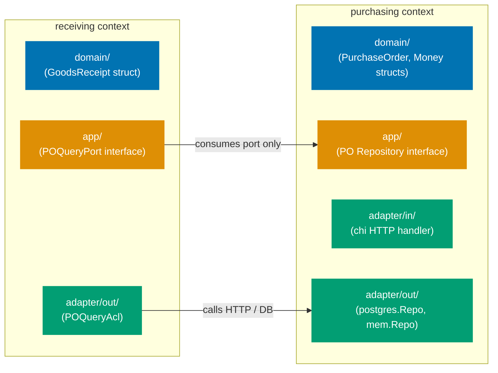
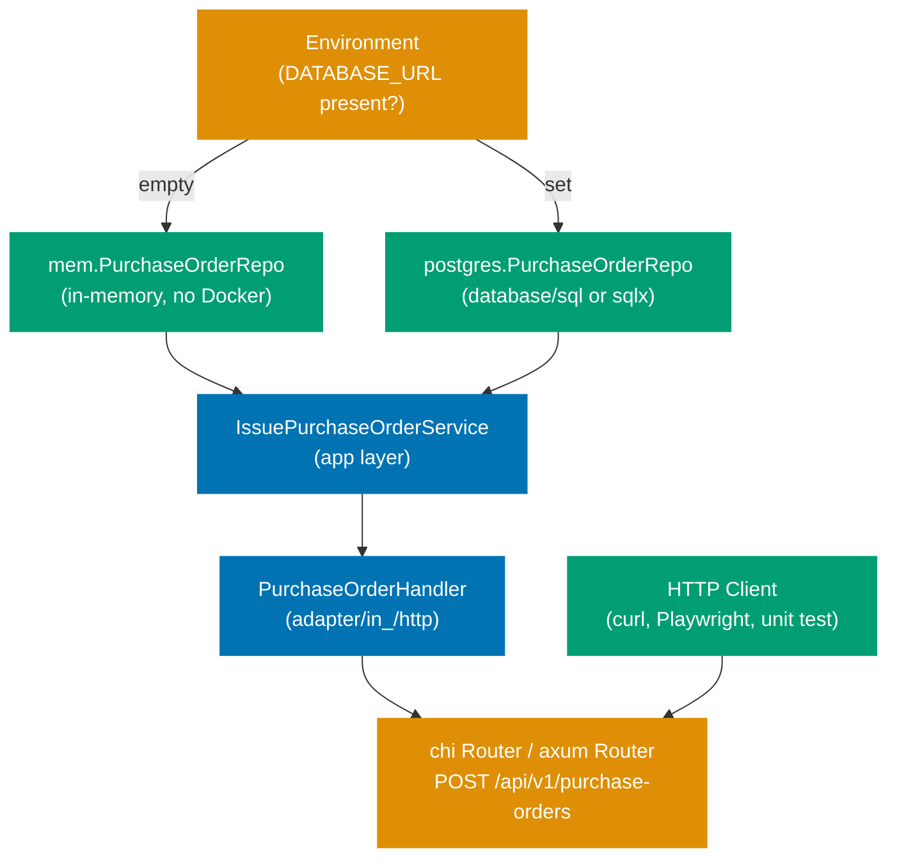

## Guide 1 — One Context, One Hexagon

### Why It Matters

A bounded context is not just a package name — it is an isolation unit. Every time two contexts share a repository directly or call each other's domain objects without an explicit port, a change in one cascades invisibly into the other. In the `procurement-platform-be` service, each bounded context owns its own `domain`, `app`, `adapter/in`, and `adapter/out` packages. Nothing crosses the context boundary except through an interface (Go) or trait (Rust) declared inside the context's own `app` package. Getting this isolation invariant right from the first commit is the single most valuable structural decision in a DDD + hexagonal codebase.

Go's structural typing makes the isolation especially clean: any struct that satisfies the interface satisfies the port — no `implements` keyword, no annotation, no inheritance. Rust's trait system enforces the same isolation at compile time through `dyn Trait` and `Arc<dyn Trait + Send + Sync>`, making it impossible for an adapter struct to slip past a port declaration.

### Standard Library First

Go's package system and Rust's module system group related code. Neither enforces architectural boundaries. The toolchain does not stop a `receiving` package from importing `PurchaseOrderRepository` directly from `purchasing/adapter/out/postgres` — the concrete infrastructure type.





```go
// Standard library approach: packages group code but enforce no boundary.
// File: internal/receiving/service.go
// Demonstrates the stdlib import pattern that hexagonal context layout supersedes.

package receiving

// Direct import from another context's infrastructure adapter — no barrier here.
import "github.com/procurement/platform/internal/purchasing/adapter/out/postgres"

// => Go allows cross-package imports unconditionally
// => The compiler sees no violation even though receiving is
//    reading purchasing infrastructure internals directly
// => Any refactor of postgres.PurchaseOrderRepo silently breaks receiving logic

// GoodsReceiptService depends on a concrete postgres adapter type.
type GoodsReceiptService struct {
 poRepo *postgres.PurchaseOrderRepo
 // => Field typed to the concrete adapter — not a domain interface
 // => Unit testing GoodsReceiptService now requires a real DB or
 //    a mock of postgres.PurchaseOrderRepo (a 3rd-party adapter type)
 // => The boundary exists only in the developer's head — nothing in the
 //    toolchain enforces it
}
```





```rust
// Standard library approach: modules group code but enforce no boundary.
// File: src/receiving/service.rs
// Demonstrates the stdlib import pattern that hexagonal context layout supersedes.

// Direct import from another context's infrastructure adapter — no barrier here.
use crate::purchasing::adapter::out_::postgres::PurchaseOrderRepo;
// => Rust allows cross-module use statements unconditionally
// => The compiler sees no violation even though receiving is
//    reading purchasing infrastructure internals directly
// => Any refactor of PurchaseOrderRepo silently breaks receiving logic

/// GoodsReceiptService depends on a concrete postgres adapter type.
pub struct GoodsReceiptService {
    po_repo: PurchaseOrderRepo,
    // => Field typed to the concrete adapter — not a domain trait object
    // => Unit testing GoodsReceiptService now requires a real DB or
    //    a replacement of PurchaseOrderRepo
    // => The boundary exists only in the developer's head — nothing in the
    //    compiler enforces it unless a trait is used
}
```





**Limitation for production**: packages and modules permit cross-context imports with no enforcement. As the codebase grows, accidental coupling accumulates silently. Go has no built-in ArchUnit equivalent; Rust has no module visibility flag that automatically prohibits same-crate cross-module coupling unless carefully crafted with `pub(crate)` rules.

### Production Framework

The hexagonal pattern enforces the boundary by making each context own its `domain`, `app`, `adapter/in`, and `adapter/out` packages (Go) or modules (Rust), and only exposing types through interfaces / traits declared in the `app` package / module. No type in `receiving/domain` imports anything from `purchasing/adapter/out`.



The `procurement-platform-be` service places each bounded context under `internal/<context>`:





```go
// Purchasing context domain layer — PurchaseOrder aggregate identity.
// File: internal/purchasing/domain/purchase_order.go
package domain

// => Package path mirrors the hexagonal layer: purchasing context, domain layer.
// => No chi, no database/sql, no net/http imports anywhere in this file.
// => Pure Go standard library types only.

import (
 "fmt"
 // => fmt: standard formatting — used in String() and error messages only
 "github.com/google/uuid"
 // => uuid: widely-used Go UUID library — not a framework, no router coupling
)

// PurchaseOrderID is a strongly-typed wrapper around uuid.UUID.
type PurchaseOrderID struct {
 value uuid.UUID
 // => Unexported field: callers must use the factory function
 // => Prevents passing a raw uuid.UUID where a PurchaseOrderID is expected
}

// NewPurchaseOrderID constructs a validated PurchaseOrderID.
func NewPurchaseOrderID(v uuid.UUID) (PurchaseOrderID, error) {
 // => Factory function — the single valid entry point for creating an identity
 if v == uuid.Nil {
  // => uuid.Nil is the zero-value UUID (all zeros) — not a valid identity
  return PurchaseOrderID{}, fmt.Errorf("PurchaseOrderID must not be nil UUID")
  // => Sentinel error returned — caller decides whether to log or propagate
 }
 return PurchaseOrderID{value: v}, nil
 // => Successful construction — value is valid and immutable after this point
}

// String returns the UUID formatted as a string.
func (id PurchaseOrderID) String() string {
 // => Value receiver: PurchaseOrderID is immutable — pointer receiver not needed
 return id.value.String()
 // => Delegates to uuid.UUID's String() — no additional formatting
}
```





```rust
// Purchasing context domain layer — PurchaseOrder aggregate identity.
// File: src/purchasing/domain/purchase_order.rs

use uuid::Uuid;
// => uuid crate: widely-used Rust UUID library — not a framework, no axum coupling

/// A strongly-typed wrapper around Uuid for purchase order identity.
#[derive(Debug, Clone, Copy, PartialEq, Eq, Hash)]
// => derive macro: generates Debug, Clone, Copy, PartialEq, Eq, Hash automatically
// => No sqlx::FromRow, no serde::Serialize — those live in the adapter layer only
pub struct PurchaseOrderId(Uuid);
// => Tuple struct: single-field wrapper — prevents mixing up with SupplierId

impl PurchaseOrderId {
    /// Constructs a validated PurchaseOrderId.
    pub fn new(v: Uuid) -> Result<Self, String> {
        // => Factory function — the single valid entry point for creating an identity
        if v.is_nil() {
            // => Uuid::nil() is the zero-value UUID — not a valid identity
            return Err("PurchaseOrderId must not be nil UUID".to_string());
            // => Propagates as Result::Err — caller decides how to handle
        }
        Ok(Self(v))
        // => Successful construction — inner value is immutable (no pub field)
    }

    /// Returns the inner Uuid.
    pub fn value(&self) -> Uuid {
        // => &self: shared reference — PurchaseOrderId is Copy, but explicit is clearer here
        self.0
        // => Tuple struct field access: index 0 returns the inner Uuid
    }
}
```





**Trade-offs**: the per-context package layout requires discipline in code review — neither Go's compiler nor Rust's module system automatically prevents a developer from adding a cross-context import inside the same binary. The payoff is that each context can evolve its domain model independently, and a unit test for one context never requires infrastructure setup from another context.

---

## Guide 2 — Reading the Per-Context Package Layout

### Why It Matters

The production layout for `procurement-platform-be` places every bounded context under `internal/<context>` (Go) or `src/<context>` (Rust). Each context owns four sub-packages: `domain`, `app`, `adapter/in`, and `adapter/out`. Before writing any feature code you need to read this layout fluently — otherwise you misplace files or misread which types belong to the domain boundary versus the infrastructure boundary. The `cmd/server/main.go` (Go) or `main.rs` (Rust) file is the only place where all contexts are wired together.

### Standard Library First

A flat layout is the natural result of starting with a minimal web server scaffold. The framework's entry point registers or discovers all handlers at one level. A flat layout means all domain-adjacent structs sit near the root of the module tree, sharing the same package with HTTP handlers and database queries.





```go
// Flat layout bootstrap: cmd/server/main.go — minimal chi entry point.
// Demonstrates the flat approach that the per-context layout supersedes.
package main

import (
 "net/http"
 // => net/http: Go standard HTTP server — no chi yet

 "github.com/go-chi/chi/v5"
 // => chi: lightweight Go HTTP router — thin wrapper around net/http
 // => chi is not a DI container: no annotation scanning, no reflection-driven wiring
)

func main() {
 // => main is the single entry point for a Go binary
 // => All wiring happens here — no framework discovers beans automatically

 r := chi.NewRouter()
 // => chi.NewRouter: creates a router multiplexer — routes are registered manually
 // => No component scan: every handler must be registered explicitly

 // Flat layout: handlers defined in the same package as main.
 r.Post("/api/v1/purchase-orders", handleIssuePO)
 // => Post: registers a POST route — handler function passed directly
 // => handleIssuePO is defined in a sibling file in the same flat package
 // => No bounded context isolation: purchasing and receiving handlers share the
 //    same package namespace

 http.ListenAndServe(":8080", r)
 // => ListenAndServe: blocks and serves requests on port 8080
 // => Error ignored here — production code should log and os.Exit(1)
}
```





```rust
// Flat layout bootstrap: src/main.rs — minimal axum entry point.
// Demonstrates the flat approach that the per-context layout supersedes.

use axum::{Router, routing::post};
// => axum: ergonomic Rust HTTP framework built on hyper + tokio
// => Router: builds the route table; routing::post registers POST handlers
use tokio::net::TcpListener;
// => TcpListener: async TCP socket — axum.serve requires one

#[tokio::main]
// => #[tokio::main]: expands to a tokio runtime that drives the async main fn
// => No DI container: all wiring is explicit code in main
async fn main() {
    // Flat layout: handler functions defined in sibling modules at the crate root.
    let app = Router::new()
        .route("/api/v1/purchase-orders", post(handle_issue_po));
    // => Router::new: builds an empty route table
    // => .route: registers one route — handler function passed by value
    // => handle_issue_po is a sibling fn — no bounded context isolation

    let listener = TcpListener::bind("0.0.0.0:8080").await.unwrap();
    // => bind: creates an async TCP listener on port 8080
    // => .await: suspends until the OS returns the socket — requires tokio runtime
    // => unwrap: panics on bind error — production code should propagate the error

    axum::serve(listener, app).await.unwrap();
    // => axum::serve: drives the HTTP server until the process exits
}
```





**Limitation for production**: a flat layout collapses domain logic, HTTP handlers, and database queries into a single package. As the codebase grows, any file can import any other file — there is no layout signal that a handler should not call the database directly.

### Production Framework

The hexagonal layout makes the four layers visible in the directory tree itself. The entry point (`cmd/server/main.go` or `main.rs`) is the only place that imports from all layers; every other file imports only from layers below it in the dependency direction.





```go
// Per-context package structure: purchasing context.
// Demonstrates the directory layout — no runnable code, layout only.

// procurement-platform-be/
// ├── cmd/
// │   └── server/
// │       └── main.go              ← composition root: wires all contexts
// └── internal/
//     ├── purchasing/
//     │   ├── domain/
//     │   │   ├── purchase_order.go        ← PurchaseOrder, PurchaseOrderID, Money
//     │   │   └── purchase_order_status.go ← PurchaseOrderStatus enum + transitions
//     │   ├── app/
//     │   │   ├── purchase_order_repository.go ← PurchaseOrderRepository interface (port)
//     │   │   ├── issue_purchase_order.go       ← IssuePurchaseOrderService
//     │   │   └── commands.go                   ← IssuePORequest command struct
//     │   └── adapter/
//     │       ├── in_/
//     │       │   └── http/
//     │       │       └── purchase_order_handler.go ← chi POST handler
//     │       └── out_/
//     │           ├── postgres/
//     │           │   └── purchase_order_repo.go ← database/sql Postgres adapter
//     │           └── mem/
//     │               └── purchase_order_repo.go ← in-memory test adapter
//     ├── supplier/
//     │   ├── domain/
//     │   ├── app/
//     │   └── adapter/
//     ├── receiving/
//     │   ├── domain/
//     │   ├── app/
//     │   └── adapter/
//     └── shared/
//         ├── money/    ← Money value object shared across contexts (if needed)
//         └── event/    ← DomainEvent interface
//
// => domain/: pure Go structs, no database/sql, no net/http imports
// => app/: interfaces (ports) + service implementations
// => adapter/in_/: primary adapters (HTTP, gRPC, CLI) — drives the hexagon
// => adapter/out_/: secondary adapters (Postgres, in-memory) — driven by the hexagon
// => Go uses in_ and out_ suffixes because "in" and "out" are valid identifiers
//    but the underscore suffix disambiguates from directory collisions on case-insensitive filesystems

package purchasing // placeholder declaration — real files declare their own packages
```





```rust
// Per-context module structure: purchasing context.
// Demonstrates the module layout — no runnable code, layout only.

// procurement-platform-be/
// ├── src/
// │   ├── main.rs                         ← composition root: wires all contexts
// │   ├── purchasing/
// │   │   ├── mod.rs                      ← pub mod declarations for sub-modules
// │   │   ├── domain/
// │   │   │   ├── mod.rs
// │   │   │   ├── purchase_order.rs       ← PurchaseOrder, PurchaseOrderId, Money
// │   │   │   └── purchase_order_status.rs← PurchaseOrderStatus enum + transitions
// │   │   ├── app/
// │   │   │   ├── mod.rs
// │   │   │   ├── purchase_order_repository.rs ← PurchaseOrderRepository trait (port)
// │   │   │   ├── issue_purchase_order.rs       ← IssuePurchaseOrderService
// │   │   │   └── commands.rs                   ← IssuePORequest command struct
// │   │   └── adapter/
// │   │       ├── mod.rs
// │   │       ├── in_/
// │   │       │   └── http/
// │   │       │       └── purchase_order_handler.rs ← axum POST handler
// │   │       └── out_/
// │   │           ├── postgres/
// │   │           │   └── purchase_order_repo.rs ← sqlx Postgres adapter
// │   │           └── mem/
// │   │               └── purchase_order_repo.rs ← in-memory test adapter (HashMap)
// │   ├── receiving/
// │   │   ├── mod.rs
// │   │   ├── domain/
// │   │   ├── app/
// │   │   └── adapter/
// │   └── shared/
// │       ├── money.rs   ← Money value object shared across contexts (if needed)
// │       └── event.rs   ← DomainEvent trait
//
// => domain/: pure Rust structs — no sqlx::FromRow, no serde, no axum derives
// => app/: traits (ports) + service implementations
// => adapter/in_/: primary adapters (HTTP, gRPC) — drive the hexagon inward
// => adapter/out_/: secondary adapters (Postgres, in-memory) — driven by the hexagon outward
// => Rust module visibility (pub, pub(crate), pub(super)) enforces layer access

// Placeholder mod declaration — real files declare their own modules.
pub mod purchasing {}
```





The full directory tree mirrors the bounded context isolation invariant from Guide 1:

```
internal/purchasing/
├── domain/          ← PurchaseOrder, Money, PurchaseOrderStatus (no framework imports)
├── app/             ← PurchaseOrderRepository interface, IssuePurchaseOrderService
└── adapter/
    ├── in_/http/    ← chi handler (imports app/ only — never domain/ directly)
    └── out_/
        ├── postgres/ ← database/sql Postgres adapter (implements PurchaseOrderRepository)
        └── mem/      ← in-memory adapter (used in unit tests and local dev)
```

**Trade-offs**: every new file requires a decision about which layer it belongs to. This upfront cost pays off when the team needs to swap the Postgres adapter for a different database — only `adapter/out_/postgres/` changes; `domain/` and `app/` are untouched.

---

## Guide 3 — Domain Types Stay Free of Framework Dependencies

### Why It Matters

The single most common way a hexagonal architecture collapses into a layered monolith is when domain types import framework packages. The moment a domain struct carries `database/sql` scanning tags or an axum extractor trait bound, the domain layer acquires a persistence or serialisation framework dependency. Switching frameworks — or testing the domain in isolation — now requires framework setup. In `procurement-platform-be`, keeping domain structs free of any framework import is the invariant that makes everything else testable and replaceable.

Rob Pike's Go at Google keynote (2012 SPLASH) emphasises that Go's structural typing is designed to keep types free of inheritance hierarchies and annotation coupling — the same principle applies to framework coupling: domain types should be pure data shapes with validation logic, nothing more.

### Standard Library First

Go's struct types and Rust's struct definitions provide framework-free value objects with validation in constructor functions — no ORM tags, no serialisation derives.





```go
// Standard library: pure Go struct, zero framework imports.
// File: internal/purchasing/domain/money.go
package domain

// => Package domain: no database/sql, no net/http, no chi imports allowed here
// => All types are pure Go standard library constructs

import (
 "fmt"
 // => fmt: standard formatting — used for validation error messages only
)

// Money is a value object representing a monetary amount with ISO 4217 currency.
type Money struct {
 amount   int64
 // => amount stored as integer cents/fils to avoid floating-point rounding errors
 // => unexported: callers must use the Amount() accessor or factory function
 currency string
 // => currency: 3-letter ISO 4217 code — "USD", "EUR", "IDR"
 // => unexported: immutable after construction via factory function
}

// NewMoney constructs a validated Money value object.
func NewMoney(amount int64, currency string) (Money, error) {
 // => Factory function: the single valid entry point for creating a Money value
 if amount < 0 {
  // => Domain invariant: monetary amounts are non-negative
  return Money{}, fmt.Errorf("Money amount must not be negative: %d", amount)
  // => Return zero-value Money and a descriptive error — caller logs or wraps
 }
 if len(currency) != 3 {
  // => Domain invariant: ISO 4217 codes are exactly 3 characters
  return Money{}, fmt.Errorf("currency must be a 3-letter ISO 4217 code: %q", currency)
 }
 return Money{amount: amount, currency: currency}, nil
 // => Successful construction — both fields are valid at this point
}

// Amount returns the amount in smallest currency units (cents, fils, sen).
func (m Money) Amount() int64 { return m.amount }
// => Value receiver: Money is small enough to copy — pointer receiver not needed

// Currency returns the ISO 4217 currency code.
func (m Money) Currency() string { return m.currency }
// => Value receiver: returns a copy of the 3-character string
```





```rust
// Standard library: pure Rust struct, zero framework derives.
// File: src/purchasing/domain/money.rs

/// A value object representing a monetary amount with ISO 4217 currency.
///
/// Amount is stored as integer cents/fils to avoid floating-point rounding errors.
#[derive(Debug, Clone, Copy, PartialEq, Eq)]
// => Debug: enables {:?} formatting in tests and logs
// => Clone, Copy: Money is small enough to be freely copied — no heap allocation
// => PartialEq, Eq: enables == comparison in tests and domain logic
// => No serde::Serialize, no sqlx::Type — those lives in adapter/out_ only
pub struct Money {
    amount: i64,
    // => amount in smallest currency units (cents, fils, sen) — avoids f64 rounding
    // => private field: callers must use the factory function
    currency: [u8; 3],
    // => fixed-size 3-byte array for ISO 4217 code — avoids heap allocation
    // => private field: immutable after construction
}

impl Money {
    /// Constructs a validated Money value object.
    pub fn new(amount: i64, currency: &str) -> Result<Self, String> {
        // => Factory function: the single valid entry point for creating Money
        if amount < 0 {
            // => Domain invariant: monetary amounts are non-negative
            return Err(format!("Money amount must not be negative: {}", amount));
            // => Returns Err(String) — caller decides how to log or propagate
        }
        let bytes = currency.as_bytes();
        // => as_bytes(): converts &str to &[u8] — zero cost, no allocation
        if bytes.len() != 3 {
            // => Domain invariant: ISO 4217 codes are exactly 3 characters
            return Err(format!("currency must be a 3-letter ISO 4217 code: {:?}", currency));
        }
        Ok(Self {
            amount,
            currency: [bytes[0], bytes[1], bytes[2]],
            // => Copy 3 bytes into fixed-size array — safe because len check passed above
        })
    }

    /// Returns the amount in smallest currency units.
    pub fn amount(&self) -> i64 { self.amount }
    // => &self: shared reference — no mutation, no ownership transfer

    /// Returns the ISO 4217 currency code as a &str.
    pub fn currency(&self) -> &str {
        // => Returns a &str view into the fixed-size array — zero cost
        std::str::from_utf8(&self.currency)
            .expect("currency bytes are always valid ASCII — validated at construction")
        // => expect: panics with message on invalid UTF-8 — impossible here by construction
    }
}
```





Now the full `PurchaseOrder` aggregate with no framework imports:





```go
// File: internal/purchasing/domain/purchase_order.go
package domain

// => Package domain: no database/sql, no net/http, no chi — pure Go
import (
 "fmt"
 "time"
 // => time: standard library — used for CreatedAt timestamp on the aggregate

 "github.com/google/uuid"
 // => uuid: standard Go UUID library — not a web or persistence framework
)

// PurchaseOrderStatus represents the lifecycle state of a PurchaseOrder.
type PurchaseOrderStatus string

// => string-based enum: idiomatic Go for domain enumerations
// => Typed alias prevents passing a raw string where a PurchaseOrderStatus is expected
const (
 StatusDraft            PurchaseOrderStatus = "Draft"
 // => Initial state: PO created but not yet submitted for approval
 StatusAwaitingApproval PurchaseOrderStatus = "AwaitingApproval"
 // => Submitted state: waiting for L1/L2/L3 approver action
 StatusApproved         PurchaseOrderStatus = "Approved"
 // => Approved: ready to be sent to the supplier as an issued order
 StatusIssued           PurchaseOrderStatus = "Issued"
 // => Issued: purchase order transmitted to supplier
 StatusClosed           PurchaseOrderStatus = "Closed"
 // => Terminal state: all goods received and invoiced — no further transitions
)

// ApprovalLevel represents the required authorisation tier based on total amount.
type ApprovalLevel string

const (
 ApprovalL1 ApprovalLevel = "L1" // => L1: total ≤ $1,000 — manager approval
 ApprovalL2 ApprovalLevel = "L2" // => L2: total ≤ $10,000 — director approval
 ApprovalL3 ApprovalLevel = "L3" // => L3: total > $10,000 — VP approval
)

// PurchaseOrder is the aggregate root for the purchasing bounded context.
type PurchaseOrder struct {
 id            PurchaseOrderID
 // => Strongly-typed identity — prevents passing a SupplierID where a PurchaseOrderID is expected
 supplierID    uuid.UUID
 // => Cross-context reference via typed ID — no Supplier aggregate imported here
 totalAmount   Money
 // => Value object: amount + ISO 4217 currency code (no database/sql.NullInt64)
 approvalLevel ApprovalLevel
 // => Derived from totalAmount at construction: L1/L2/L3
 status        PurchaseOrderStatus
 // => Current lifecycle state — transitions enforced by domain methods
 createdAt     time.Time
 // => Standard library time.Time — no ORM timestamp annotation
}

// NewPurchaseOrder constructs a validated PurchaseOrder in Draft status.
func NewPurchaseOrder(id PurchaseOrderID, supplierID uuid.UUID, amount Money) (PurchaseOrder, error) {
 // => Factory function: the single valid entry point for creating a PurchaseOrder
 if supplierID == uuid.Nil {
  // => Domain invariant: every PO must reference a valid supplier
  return PurchaseOrder{}, fmt.Errorf("supplierID must not be nil UUID")
 }
 level := deriveApprovalLevel(amount)
 // => Derived value: approval level computed from amount at construction
 return PurchaseOrder{
  id:            id,
  supplierID:    supplierID,
  totalAmount:   amount,
  approvalLevel: level,
  status:        StatusDraft,
  // => Initial state: all new POs start as Draft
  createdAt:     time.Now().UTC(),
  // => time.Now().UTC(): standard library — no framework clock injection
 }, nil
}

func deriveApprovalLevel(m Money) ApprovalLevel {
 // => Helper: unexported — not part of the domain API surface
 switch {
 case m.Amount() <= 100_000: // => cents: $1,000.00 = 100,000 cents
  return ApprovalL1
 case m.Amount() <= 1_000_000: // => cents: $10,000.00 = 1,000,000 cents
  return ApprovalL2
 default:
  return ApprovalL3
 }
}

// Accessors expose fields for the application service and adapter layers.
func (po PurchaseOrder) ID() PurchaseOrderID          { return po.id }
func (po PurchaseOrder) SupplierID() uuid.UUID         { return po.supplierID }
func (po PurchaseOrder) TotalAmount() Money             { return po.totalAmount }
func (po PurchaseOrder) ApprovalLevel() ApprovalLevel  { return po.approvalLevel }
func (po PurchaseOrder) Status() PurchaseOrderStatus   { return po.status }
func (po PurchaseOrder) CreatedAt() time.Time          { return po.createdAt }
// => Value receivers: PurchaseOrder is returned by value — no pointer semantics needed
// => No framework getter annotations — pure Go method declarations
```





```rust
// File: src/purchasing/domain/purchase_order.rs
// => No axum, no sqlx, no serde — pure Rust standard library only

use uuid::Uuid;
// => uuid crate: not a web or persistence framework — safe domain import
use chrono::{DateTime, Utc};
// => chrono: not a web or persistence framework — standard datetime handling

/// Lifecycle states of a PurchaseOrder.
#[derive(Debug, Clone, Copy, PartialEq, Eq)]
// => No sqlx::Type, no serde::Serialize — those belong in adapter/out_ only
pub enum PurchaseOrderStatus {
    Draft,
    // => Initial state: PO created but not yet submitted for approval
    AwaitingApproval,
    // => Submitted state: waiting for L1/L2/L3 approver action
    Approved,
    // => Approved: ready to be transmitted to the supplier
    Issued,
    // => Issued: purchase order transmitted to the supplier
    Closed,
    // => Terminal state: all goods received and invoiced
}

/// Required authorisation tier based on total amount.
#[derive(Debug, Clone, Copy, PartialEq, Eq)]
pub enum ApprovalLevel {
    L1, // => total ≤ $1,000 — manager approval
    L2, // => total ≤ $10,000 — director approval
    L3, // => total > $10,000 — VP approval
}

/// The aggregate root for the purchasing bounded context.
#[derive(Debug, Clone)]
// => Debug: enables {:?} in tests; Clone: needed to store in Arc-wrapped state
// => No serde::Serialize/Deserialize — serialisation belongs in adapter/in_ only
// => No sqlx::FromRow — mapping from DB rows belongs in adapter/out_/postgres only
pub struct PurchaseOrder {
    id: PurchaseOrderId,
    // => Strongly-typed identity — prevents passing a SupplierId where PurchaseOrderId is expected
    supplier_id: Uuid,
    // => Cross-context reference via typed ID — no Supplier struct imported here
    total_amount: Money,
    // => Value object: amount + ISO 4217 currency code (no sqlx column annotation)
    approval_level: ApprovalLevel,
    // => Derived from total_amount at construction
    status: PurchaseOrderStatus,
    // => Current lifecycle state — transitions enforced by domain methods
    created_at: DateTime<Utc>,
    // => chrono::DateTime<Utc>: standard datetime type — no ORM timestamp annotation
}

impl PurchaseOrder {
    /// Constructs a validated PurchaseOrder in Draft status.
    pub fn new(
        id: PurchaseOrderId,
        supplier_id: Uuid,
        total_amount: Money,
    ) -> Result<Self, String> {
        // => Factory function: the single valid entry point for creating a PurchaseOrder
        if supplier_id.is_nil() {
            // => Domain invariant: every PO must reference a valid supplier
            return Err("supplier_id must not be nil UUID".to_string());
        }
        let approval_level = Self::derive_approval_level(&total_amount);
        // => Derived value: approval level computed from total_amount at construction
        Ok(Self {
            id,
            supplier_id,
            total_amount,
            approval_level,
            status: PurchaseOrderStatus::Draft,
            // => Initial state: all new POs start as Draft
            created_at: Utc::now(),
            // => chrono::Utc::now(): no framework clock — pure library call
        })
    }

    fn derive_approval_level(m: &Money) -> ApprovalLevel {
        // => Private helper: not part of the domain API surface
        match m.amount() {
            a if a <= 100_000 => ApprovalLevel::L1, // => cents: $1,000.00
            a if a <= 1_000_000 => ApprovalLevel::L2, // => cents: $10,000.00
            _ => ApprovalLevel::L3,
        }
    }

    // Accessors expose fields for application service and adapter layers.
    pub fn id(&self) -> &PurchaseOrderId { &self.id }
    pub fn supplier_id(&self) -> Uuid { self.supplier_id }
    pub fn total_amount(&self) -> &Money { &self.total_amount }
    pub fn approval_level(&self) -> ApprovalLevel { self.approval_level }
    pub fn status(&self) -> PurchaseOrderStatus { self.status }
    pub fn created_at(&self) -> DateTime<Utc> { self.created_at }
    // => &self accessors: no mutation — PurchaseOrder is read-only after construction
    // => No framework getter annotations — pure Rust method declarations
}
```





**Trade-offs**: keeping domain types free of framework imports means the adapter layer must perform explicit mapping — converting `PurchaseOrder` to a database row struct (Go) or a sqlx-annotated struct (Rust). This mapping code is boilerplate, but it is the correct place for it: the adapter owns the persistence contract, not the domain.

---

## Guide 4 — Application Service Takes and Returns Domain Types

### Why It Matters

The application service sits between the primary adapter (HTTP handler) and the domain. It takes a command struct — not an HTTP request body struct — and returns a domain aggregate or an error. This design means the service is completely unaware of whether it was called by an HTTP handler, a CLI command, or a test. The Three Dots Labs reference architecture (DDD + CQRS + Clean Architecture in Go) demonstrates this pattern: the command struct carries only the data the domain needs, and the domain aggregate carries only the data the command required.

Keeping DTOs exclusively at the adapter boundary means the application service can be unit-tested without spinning up a router or parsing JSON. It is the most important testability invariant in the hexagonal architecture.

### Standard Library First

Without a port interface, the application service instantiates its own repository or calls a global variable — both patterns bind the service to the infrastructure implementation.





```go
// Standard library approach: service creates its own dependency — no port interface.
// File: internal/purchasing/app/issue_purchase_order_naive.go
package app

import (
 "context"
 // => context: standard library for cancellation and deadline propagation
 "database/sql"
 // => database/sql: standard SQL driver interface — imported directly into the app layer
 // => This import is the violation: the app layer now depends on a specific infrastructure concern

 "github.com/procurement/platform/internal/purchasing/domain"
)

// NaiveIssuePurchaseOrderService creates its own DB connection — no port abstraction.
type NaiveIssuePurchaseOrderService struct {
 db *sql.DB
 // => *sql.DB: concrete database handle — not an interface
 // => Unit testing NaiveIssuePurchaseOrderService requires a real database
 // => Swapping to a different store (e.g., in-memory for tests) requires changing this struct
}

// Issue issues a purchase order by writing directly to the database.
func (s *NaiveIssuePurchaseOrderService) Issue(ctx context.Context, supplierID string, amountCents int64, currency string) error {
 // => Parameters are primitive types from the HTTP layer — no command struct
 // => This signature couples the service to the HTTP handler's parsing decisions
 _, err := s.db.ExecContext(ctx, `INSERT INTO purchase_orders ...`, supplierID, amountCents, currency)
 // => db.ExecContext: direct SQL in the application service — infrastructure leak
 // => The application service now knows about SQL schema details (table names, columns)
 return err
 // => Returning raw sql errors — callers receive driver-specific error types
}
```





```rust
// Standard library approach: service embeds its own DB pool — no port abstraction.
// File: src/purchasing/app/issue_purchase_order_naive.rs
use sqlx::PgPool;
// => PgPool imported directly into the app layer — infrastructure leak
// => Unit testing now requires a real Postgres instance

use crate::purchasing::domain::{PurchaseOrder, PurchaseOrderId};

/// NaiveIssuePurchaseOrderService embeds a DB pool — no trait abstraction.
pub struct NaiveIssuePurchaseOrderService {
    pool: PgPool,
    // => Concrete sqlx pool — not a trait object
    // => Cannot swap for an in-memory store without changing this struct
}

impl NaiveIssuePurchaseOrderService {
    /// Issues a purchase order by writing directly to the database.
    pub async fn issue(
        &self,
        supplier_id: &str,   // => primitive string from HTTP layer — no command struct
        amount: i64,         // => raw amount from HTTP layer — no value object
        currency: &str,
    ) -> Result<(), sqlx::Error> {
        // => Returns sqlx::Error — a framework type — leaking into the app layer return signature
        sqlx::query("INSERT INTO purchase_orders ...")
            .bind(supplier_id)
            .bind(amount)
            .bind(currency)
            .execute(&self.pool)
            // => Direct SQL in the application service — infrastructure concern
            .await?;
        Ok(())
    }
}
```





**Limitation for production**: the application service directly imports the infrastructure package. Unit tests require a running database. The service return type exposes driver-specific error types to the HTTP handler.

### Production Framework

The production application service depends on a port interface — not on the infrastructure adapter. It takes a command struct and returns a domain aggregate.





```go
// File: internal/purchasing/app/commands.go
package app

import "github.com/google/uuid"

// IssuePORequest is the command struct for issuing a purchase order.
// It carries only the data the domain needs — no HTTP-specific fields.
type IssuePORequest struct {
 SupplierID  uuid.UUID
 // => Strongly-typed UUID — not a raw string from the request body
 // => The HTTP adapter parses the raw string and constructs this command struct
 AmountCents int64
 // => Amount in smallest currency units — HTTP adapter converts from decimal
 Currency    string
 // => ISO 4217 currency code — validated by the domain Money value object
}
```

```go
// File: internal/purchasing/app/issue_purchase_order.go
package app

import (
 "context"
 // => context: standard library for cancellation propagation
 "fmt"
 // => fmt: standard formatting for error wrapping

 "github.com/google/uuid"
 "github.com/procurement/platform/internal/purchasing/domain"
 // => domain: depends only on the domain layer — no adapter/out imports
)

// IssuePurchaseOrderService orchestrates PO issuance via a port interface.
type IssuePurchaseOrderService struct {
 repo PurchaseOrderRepository
 // => Port interface — not a concrete adapter type
 // => Any type satisfying PurchaseOrderRepository can be injected here
 // => In tests: use mem.PurchaseOrderRepo; in production: use postgres.PurchaseOrderRepo
}

// NewIssuePurchaseOrderService constructs the service with its required port.
func NewIssuePurchaseOrderService(repo PurchaseOrderRepository) *IssuePurchaseOrderService {
 // => Constructor injection: explicit dependency — no global state, no reflection
 return &IssuePurchaseOrderService{repo: repo}
}

// Issue validates the command, creates the aggregate, and persists via the port.
func (s *IssuePurchaseOrderService) Issue(ctx context.Context, req IssuePORequest) (domain.PurchaseOrder, error) {
 // => Input: command struct — not raw HTTP parameters
 // => Output: domain aggregate — not a persistence struct or HTTP response
 id, err := domain.NewPurchaseOrderID(uuid.New())
 // => Generate identity before persisting — the domain owns the identity strategy
 if err != nil {
  return domain.PurchaseOrder{}, fmt.Errorf("generating PO ID: %w", err)
  // => %w: wraps the error for use with errors.Is / errors.As in the caller
 }

 amount, err := domain.NewMoney(req.AmountCents, req.Currency)
 // => Convert command fields to value objects — domain invariants enforced here
 if err != nil {
  return domain.PurchaseOrder{}, fmt.Errorf("validating amount: %w", err)
 }

 po, err := domain.NewPurchaseOrder(id, req.SupplierID, amount)
 // => Factory function: validates aggregate invariants (non-nil supplierID, etc.)
 if err != nil {
  return domain.PurchaseOrder{}, fmt.Errorf("creating purchase order: %w", err)
 }

 if err := s.repo.Save(ctx, po); err != nil {
  // => Save via port interface — the adapter handles SQL, JSON, or in-memory storage
  return domain.PurchaseOrder{}, fmt.Errorf("saving purchase order: %w", err)
 }
 return po, nil
 // => Return the domain aggregate — the HTTP handler converts this to a JSON response DTO
}
```





```rust
// File: src/purchasing/app/commands.rs
use uuid::Uuid;

/// Command struct for issuing a purchase order.
/// Carries only the data the domain needs — no axum or HTTP-specific fields.
#[derive(Debug)]
pub struct IssuePORequest {
    pub supplier_id: Uuid,
    // => Strongly-typed UUID — not a raw string from the request body
    // => The HTTP adapter parses the raw string and constructs this command struct
    pub amount_cents: i64,
    // => Amount in smallest currency units — HTTP adapter converts from decimal
    pub currency: String,
    // => ISO 4217 currency code — validated by the domain Money value object
}
```

```rust
// File: src/purchasing/app/issue_purchase_order.rs
use std::sync::Arc;
// => Arc: atomic reference-counted pointer — required for sharing across tokio tasks
use uuid::Uuid;
use crate::purchasing::{
    app::{commands::IssuePORequest, purchase_order_repository::PurchaseOrderRepository},
    // => port interface — not a concrete adapter type
    domain::purchase_order::{PurchaseOrder, PurchaseOrderId},
    domain::money::Money,
};

/// Orchestrates PO issuance via a trait object port.
pub struct IssuePurchaseOrderService {
    repo: Arc<dyn PurchaseOrderRepository + Send + Sync>,
    // => Arc<dyn Trait + Send + Sync>: shared ownership of the port across async tasks
    // => In tests: inject mem::PurchaseOrderRepo; in production: inject postgres::PurchaseOrderRepo
}

impl IssuePurchaseOrderService {
    /// Constructs the service with its required port.
    pub fn new(repo: Arc<dyn PurchaseOrderRepository + Send + Sync>) -> Self {
        // => Constructor injection: explicit dependency — no global state, no reflection
        Self { repo }
    }

    /// Validates the command, creates the aggregate, and persists via the port.
    pub async fn issue(&self, req: IssuePORequest) -> Result<PurchaseOrder, String> {
        // => Input: command struct — not raw axum parameters
        // => Output: domain aggregate — not a persistence struct or HTTP response
        let id = PurchaseOrderId::new(Uuid::new_v4())
            .map_err(|e| format!("generating PO ID: {}", e))?;
        // => Generate identity before persisting — the domain owns the identity strategy
        // => map_err: converts domain error to String for uniform error type

        let amount = Money::new(req.amount_cents, &req.currency)
            .map_err(|e| format!("validating amount: {}", e))?;
        // => Convert command fields to value objects — domain invariants enforced here

        let po = PurchaseOrder::new(id, req.supplier_id, amount)
            .map_err(|e| format!("creating purchase order: {}", e))?;
        // => Factory function: validates aggregate invariants (non-nil supplier_id, etc.)

        self.repo.save(&po).await
            .map_err(|e| format!("saving purchase order: {}", e))?;
        // => save via port trait — the adapter handles SQL, JSON, or in-memory storage

        Ok(po)
        // => Return the domain aggregate — the HTTP handler converts this to a JSON response DTO
    }
}
```





**Trade-offs**: the command struct is an extra type that must be populated by the HTTP adapter. This is intentional — the adapter owns the translation from HTTP representation to domain command, keeping that concern out of the application service. Testing the application service then requires only constructing a command struct and injecting a mock or in-memory repository — no HTTP stack needed.

---

## Guide 5 — Output Port as Go Interface / Rust Trait

### Why It Matters

The output port is the formal contract between the application service and the infrastructure world. In Go, this is a one-file interface declared in the `app/` package — not in the adapter package. In Rust, it is a `trait` declared in the `app/` module. The key principle from Cockburn's Hexagonal Architecture (2005) is that the port belongs to the application, not to the adapter: the application declares what it needs, and adapters implement that contract independently.

Placing the interface in `app/` (not in `adapter/out_/`) means the application service can compile and be tested without any adapter being present. Go's structural typing makes this especially natural: the in-memory adapter in `adapter/out_/mem/` satisfies the port interface automatically, without an `implements` keyword.

### Standard Library First

Without an interface, the application service references the concrete adapter type directly. Go does not prevent this — a `*postgres.PurchaseOrderRepo` assigned to a field satisfies any interface it implements, but if the field is typed to the concrete struct, the compiler locks the dependency.





```go
// Without a port interface, the app layer references the concrete adapter.
// File: internal/purchasing/app/issue_purchase_order_concrete.go

import "github.com/procurement/platform/internal/purchasing/adapter/out_/postgres"
// => Direct import of the adapter package from the app layer — the violation
// => Changing the postgres adapter's method signature breaks the app layer directly

type ConcreteService struct {
 repo *postgres.PurchaseOrderRepo
 // => Concrete type: cannot be swapped for mem.PurchaseOrderRepo in tests
 // => Unit tests require a live Postgres instance — or this struct is untestable in isolation
}
```





```rust
// Without a trait, the app layer embeds the concrete adapter.
use crate::purchasing::adapter::out_::postgres::PurchaseOrderRepo;
// => Direct import of the adapter from the app module — the violation
// => Changing PurchaseOrderRepo's signature breaks the app module directly

pub struct ConcreteService {
    repo: PurchaseOrderRepo,
    // => Concrete type: cannot be replaced with a mem adapter in tests
    // => Unit tests require a live Postgres pool or a manual stub struct
}
```





**Limitation for production**: the concrete type import creates a compile-time dependency between the application layer and the infrastructure layer. Unit testing the application service requires either a real database or a manual stub that mirrors the concrete struct's method set.

### Production Framework

The output port interface lives in `app/` and is the only thing the application service depends on from the storage world.





```go
// File: internal/purchasing/app/purchase_order_repository.go
package app

// => Package app: declares the port interface — owned by the application, not the adapter
// => No database/sql import: the interface specifies behaviour, not implementation

import (
 "context"
 // => context.Context: standard library — cancellation and deadline propagation
 "github.com/procurement/platform/internal/purchasing/domain"
 // => domain: the port contracts work with domain types — not persistence structs
)

// PurchaseOrderRepository is the output port for PO persistence.
// Any type with these three methods satisfies this interface in Go.
type PurchaseOrderRepository interface {
 // Save persists a new PurchaseOrder or updates an existing one.
 Save(ctx context.Context, po domain.PurchaseOrder) error
 // => context.Context: propagates request cancellation to the adapter
 // => domain.PurchaseOrder: takes a domain aggregate — not a DB row struct
 // => error: idiomatic Go error return — the adapter wraps driver errors

 // FindByID retrieves a PurchaseOrder by its identity.
 FindByID(ctx context.Context, id domain.PurchaseOrderID) (domain.PurchaseOrder, error)
 // => Returns (aggregate, nil) on success or (zero-value, error) on failure
 // => Callers check error == nil; ErrNotFound is a sentinel in the domain package

 // FindAll retrieves all PurchaseOrders (paginated in intermediate guides).
 FindAll(ctx context.Context) ([]domain.PurchaseOrder, error)
 // => Returns a slice — empty slice (not nil) when no records exist
}
```

```go
// File: internal/purchasing/adapter/out_/mem/purchase_order_repo.go
package mem

// => Package mem: in-memory adapter — satisfies app.PurchaseOrderRepository structurally
// => Used in unit tests and local dev (no DATABASE_URL required)

import (
 "context"
 "fmt"
 // => fmt: standard library — used for ErrNotFound construction
 "sync"
 // => sync.RWMutex: standard library — protects concurrent map access

 "github.com/procurement/platform/internal/purchasing/app"
 // => app: imported only to reference app.PurchaseOrderRepository for documentation
 //    — Go structural typing means the import is optional; methods must just match
 "github.com/procurement/platform/internal/purchasing/domain"
)

// PurchaseOrderRepo is an in-memory implementation of app.PurchaseOrderRepository.
type PurchaseOrderRepo struct {
 mu    sync.RWMutex
 // => RWMutex: allows concurrent reads, exclusive writes — safe for goroutines
 store map[string]domain.PurchaseOrder
 // => map keyed by PurchaseOrderID.String() — simple O(1) lookup for tests
}

// NewPurchaseOrderRepo constructs an empty in-memory repository.
func NewPurchaseOrderRepo() *PurchaseOrderRepo {
 return &PurchaseOrderRepo{store: make(map[string]domain.PurchaseOrder)}
 // => make(map): initialises the map — Go maps must be initialised before use
}

// Save stores the PurchaseOrder, overwriting any existing entry with the same ID.
func (r *PurchaseOrderRepo) Save(_ context.Context, po domain.PurchaseOrder) error {
 // => Satisfies app.PurchaseOrderRepository.Save — Go structural typing
 r.mu.Lock()
 defer r.mu.Unlock()
 // => Lock/defer Unlock: ensures the write is atomic — no data race in concurrent tests
 r.store[po.ID().String()] = po
 // => Store by string key — no SQL, no serialisation, no framework call
 return nil
 // => In-memory save never fails — tests can assert on returned domain aggregate directly
}

// FindByID retrieves a PurchaseOrder by its identity.
func (r *PurchaseOrderRepo) FindByID(_ context.Context, id domain.PurchaseOrderID) (domain.PurchaseOrder, error) {
 // => Satisfies app.PurchaseOrderRepository.FindByID
 r.mu.RLock()
 defer r.mu.RUnlock()
 // => RLock: shared lock — multiple goroutines can read concurrently
 po, ok := r.store[id.String()]
 if !ok {
  // => Not found: return zero-value and a sentinel error
  return domain.PurchaseOrder{}, fmt.Errorf("purchase order not found: %s", id.String())
 }
 return po, nil
}

// FindAll retrieves all stored PurchaseOrders.
func (r *PurchaseOrderRepo) FindAll(_ context.Context) ([]domain.PurchaseOrder, error) {
 // => Satisfies app.PurchaseOrderRepository.FindAll
 r.mu.RLock()
 defer r.mu.RUnlock()
 pos := make([]domain.PurchaseOrder, 0, len(r.store))
 // => Pre-allocate with capacity — avoids repeated slice resizes in tight test loops
 for _, po := range r.store {
  pos = append(pos, po)
  // => Order is non-deterministic — map iteration in Go is randomised by design
 }
 return pos, nil
 // => Return empty slice (not nil) — callers use len(pos) == 0 to detect empty
}

// Compile-time assertion: ensure *PurchaseOrderRepo satisfies the port interface.
var _ app.PurchaseOrderRepository = (*PurchaseOrderRepo)(nil)
// => This line causes a compile error if any method is missing or mistyped
// => Zero-cost check — no runtime overhead
```





```rust
// File: src/purchasing/app/purchase_order_repository.rs
// => Module app: declares the port trait — owned by the application, not the adapter

use std::error::Error;
use async_trait::async_trait;
// => async_trait: allows async fn in trait definitions — required until Rust stabilises async traits

use crate::purchasing::domain::purchase_order::{PurchaseOrder, PurchaseOrderId};

/// Output port for PO persistence.
/// Any type implementing these three methods satisfies this trait.
#[async_trait]
pub trait PurchaseOrderRepository {
    /// Persists a new PurchaseOrder or updates an existing one.
    async fn save(&self, po: &PurchaseOrder) -> Result<(), Box<dyn Error + Send + Sync>>;
    // => &self: shared reference — implementations may use Arc<Mutex<...>> internally
    // => &PurchaseOrder: borrowed — no ownership transfer needed for a save call
    // => Box<dyn Error + Send + Sync>: flexible error type — the adapter wraps its own errors

    /// Retrieves a PurchaseOrder by its identity.
    async fn find_by_id(&self, id: &PurchaseOrderId) -> Result<Option<PurchaseOrder>, Box<dyn Error + Send + Sync>>;
    // => Option<PurchaseOrder>: None when not found — no sentinel error for missing records

    /// Retrieves all PurchaseOrders.
    async fn find_all(&self) -> Result<Vec<PurchaseOrder>, Box<dyn Error + Send + Sync>>;
    // => Vec: owned collection — empty Vec (not empty Option) when no records exist
}
```

```rust
// File: src/purchasing/adapter/out_/mem/purchase_order_repo.rs
// => In-memory adapter — satisfies app::PurchaseOrderRepository
// => Used in unit tests and local dev (no DATABASE_URL required)

use std::collections::HashMap;
use std::error::Error;
use std::sync::{Arc, Mutex};
// => Arc<Mutex<...>>: shared mutable state across async tasks — standard Rust pattern
use async_trait::async_trait;
use crate::purchasing::{
    app::purchase_order_repository::PurchaseOrderRepository,
    domain::purchase_order::{PurchaseOrder, PurchaseOrderId},
};

/// In-memory implementation of PurchaseOrderRepository.
pub struct MemPurchaseOrderRepo {
    store: Arc<Mutex<HashMap<String, PurchaseOrder>>>,
    // => Arc<Mutex<HashMap>>: shared ownership + mutual exclusion for concurrent access
    // => HashMap keyed by PurchaseOrderId.value().to_string() — O(1) lookup in tests
}

impl MemPurchaseOrderRepo {
    /// Constructs an empty in-memory repository.
    pub fn new() -> Self {
        Self { store: Arc::new(Mutex::new(HashMap::new())) }
        // => Arc::new(Mutex::new(...)): wraps the HashMap in shared mutable ownership
    }
}

#[async_trait]
impl PurchaseOrderRepository for MemPurchaseOrderRepo {
    // => #[async_trait]: required to make async fn work in trait impl until Rust stabilises it

    async fn save(&self, po: &PurchaseOrder) -> Result<(), Box<dyn Error + Send + Sync>> {
        // => Satisfies PurchaseOrderRepository::save
        let mut store = self.store.lock()
            .map_err(|e| format!("mutex poisoned: {}", e))?;
        // => .lock(): acquires the mutex — returns MutexGuard or PoisonError
        // => map_err: converts PoisonError to our Box<dyn Error>
        store.insert(po.id().value().to_string(), po.clone());
        // => insert: stores a clone — in-memory adapter owns its own copy
        Ok(())
        // => In-memory save never fails — tests can assert on returned aggregate directly
    }

    async fn find_by_id(&self, id: &PurchaseOrderId) -> Result<Option<PurchaseOrder>, Box<dyn Error + Send + Sync>> {
        // => Satisfies PurchaseOrderRepository::find_by_id
        let store = self.store.lock()
            .map_err(|e| format!("mutex poisoned: {}", e))?;
        Ok(store.get(&id.value().to_string()).cloned())
        // => .get(&key).cloned(): returns Option<PurchaseOrder> — None if not found
        // => Wrapped in Ok: the operation itself cannot fail for in-memory storage
    }

    async fn find_all(&self) -> Result<Vec<PurchaseOrder>, Box<dyn Error + Send + Sync>> {
        // => Satisfies PurchaseOrderRepository::find_all
        let store = self.store.lock()
            .map_err(|e| format!("mutex poisoned: {}", e))?;
        Ok(store.values().cloned().collect())
        // => .values(): iterator over all stored aggregates
        // => .cloned().collect(): materialises into Vec<PurchaseOrder>
    }
}
```





**Trade-offs**: the port interface adds one extra file per bounded context's output dependency. In exchange, the application service can be unit-tested without any infrastructure — inject `mem.NewPurchaseOrderRepo()` (Go) or `MemPurchaseOrderRepo::new()` (Rust) and exercise the full service logic with no database required.

---

## Guide 6 — HTTP Adapter and Composition Root

### Why It Matters

The HTTP adapter is the primary adapter — it drives the hexagon. Its job is narrow: parse the HTTP request into a command struct, call the application service, and translate the returned domain aggregate into an HTTP response DTO. It must not contain business logic, domain validation, or persistence calls. The composition root (`main.go` / `main.rs`) is the only place in the entire codebase that imports from all layers simultaneously — it wires the application service to a concrete repository adapter and registers the HTTP handler on the router.

Environment-based adapter selection is the idiomatic way to switch between the in-memory adapter (local dev, unit tests) and the Postgres adapter (staging, production) without changing any application or domain code.

### Standard Library First

Go's `net/http` and Rust's `hyper` can serve an HTTP endpoint without chi or axum. The handler signature and routing are more verbose, but the principle is identical — the standard library approach shows what chi and axum are abstracting.





```go
// Standard library approach: net/http handler without chi.
// Demonstrates what chi's router abstracts.
package main

import (
 "encoding/json"
 // => encoding/json: standard library JSON encoding — no third-party library
 "net/http"
 // => net/http: standard library HTTP server — chi wraps this
)

func handleIssuePOStdlib(w http.ResponseWriter, r *http.Request) {
 // => http.HandlerFunc signature: ResponseWriter + *Request — chi uses the same signature
 if r.Method != http.MethodPost {
  // => Method check: in net/http, every handler receives all methods by default
  // => chi's router.Post() routes only POST — this check is unnecessary with chi
  http.Error(w, "method not allowed", http.StatusMethodNotAllowed)
  return
 }
 // => Routing parameters (e.g., /api/v1/purchase-orders/{id}) require manual URL parsing
 // => chi provides chi.URLParam(r, "id") — net/http has no built-in parameter extraction
 var body struct {
  SupplierID string `json:"supplier_id"`
  Amount     int64  `json:"amount_cents"`
  Currency   string `json:"currency"`
 }
 if err := json.NewDecoder(r.Body).Decode(&body); err != nil {
  // => json.NewDecoder: standard library JSON decoding — same as chi handlers use
  http.Error(w, "invalid request body", http.StatusBadRequest)
  return
 }
 // => No middleware pipeline: auth, logging, tracing must be added manually per handler
 // => chi provides middleware chaining via router.Use() — much cleaner for cross-cutting concerns
 w.WriteHeader(http.StatusCreated)
 // => Standard net/http response writing — chi handlers use the same pattern
}
```





```rust
// Standard library approach: hyper handler without axum.
// Demonstrates what axum's Router and extractors abstract.

use hyper::{Body, Request, Response, StatusCode};
// => hyper: low-level async HTTP library — axum builds on top of hyper

async fn handle_issue_po_hyper(req: Request<Body>) -> Result<Response<Body>, hyper::Error> {
    // => hyper handler signature: takes a Request, returns Result<Response, Error>
    // => axum abstracts this into typed extractors (Json<T>, Path<T>, State<T>)
    if req.method() != hyper::Method::POST {
        // => Method check: hyper routes all methods to all handlers by default
        // => axum's Router::route + routing::post() handles this automatically
        return Ok(Response::builder()
            .status(StatusCode::METHOD_NOT_ALLOWED)
            .body(Body::empty())
            .unwrap());
    }
    // => URL parameter extraction from /api/v1/purchase-orders/{id} requires
    //    manual URI parsing in hyper — axum provides Path<(Uuid,)> extractor
    let body_bytes = hyper::body::to_bytes(req.into_body()).await?;
    // => hyper::body::to_bytes: collects the streaming body into Bytes — low-level
    // => axum's Json<T> extractor does this and deserialises in one step
    let _body: serde_json::Value = serde_json::from_slice(&body_bytes)
        .unwrap_or_default();
    // => Manual JSON parsing without axum's Json<T> — more verbose and error-prone
    Ok(Response::builder()
        .status(StatusCode::CREATED)
        .body(Body::empty())
        .unwrap())
}
```





**Limitation for production**: raw `net/http` requires manual method routing, URL parameter extraction, and middleware composition per handler. `hyper` requires manual body collection and JSON parsing. chi and axum solve these cross-cutting concerns uniformly across all handlers.

### Production Framework

The production HTTP adapter uses chi (Go) or axum (Rust) to keep handler code focused on the command translation and response serialisation:





```go
// File: internal/purchasing/adapter/in_/http/purchase_order_handler.go
package http

import (
 "encoding/json"
 // => encoding/json: standard library — JSON decode/encode
 "net/http"
 // => net/http: chi handlers implement http.HandlerFunc signature

 "github.com/go-chi/chi/v5"
 // => chi: URL parameter extraction via chi.URLParam

 "github.com/procurement/platform/internal/purchasing/app"
 // => app: imports only the application layer — no domain or adapter/out imports
)

// PurchaseOrderHandler is the primary adapter for the purchasing context.
type PurchaseOrderHandler struct {
 service *app.IssuePurchaseOrderService
 // => Field typed to the application service — not to the port interface
 // => The handler depends on the concrete service; the service depends on the port interface
}

// NewPurchaseOrderHandler constructs the handler with its required service.
func NewPurchaseOrderHandler(svc *app.IssuePurchaseOrderService) *PurchaseOrderHandler {
 return &PurchaseOrderHandler{service: svc}
 // => Constructor injection: explicit dependency wired in main.go
}

// issuePORequest is the HTTP request body struct — lives at the adapter boundary only.
type issuePORequest struct {
 SupplierID string `json:"supplier_id"`
 // => json tag: maps JSON key "supplier_id" to this field
 AmountCents int64  `json:"amount_cents"`
 // => int64 matches the domain Money.amount representation (cents)
 Currency    string `json:"currency"`
 // => ISO 4217 code — validated downstream by domain.NewMoney
}

// issuePOResponse is the HTTP response body struct — lives at the adapter boundary only.
type issuePOResponse struct {
 ID          string `json:"id"`
 // => String representation of PurchaseOrderID — formatted as UUID string
 SupplierID  string `json:"supplier_id"`
 AmountCents int64  `json:"amount_cents"`
 Currency    string `json:"currency"`
 Status      string `json:"status"`
 // => String representation of PurchaseOrderStatus enum
}

// HandleIssuePO handles POST /api/v1/purchase-orders.
func (h *PurchaseOrderHandler) HandleIssuePO(w http.ResponseWriter, r *http.Request) {
 // => chi handler signature: same as net/http.HandlerFunc — chi adds no lock-in
 var req issuePORequest
 if err := json.NewDecoder(r.Body).Decode(&req); err != nil {
  // => json.NewDecoder: decodes the request body into the adapter DTO
  http.Error(w, "invalid request body: "+err.Error(), http.StatusBadRequest)
  // => 400 Bad Request: malformed JSON or type mismatch
  return
 }
 defer r.Body.Close()
 // => Close the request body after reading — prevents resource leak

 supplierUUID, err := uuid.Parse(req.SupplierID)
 // => Parse string to typed UUID — adapter responsibility, not domain responsibility
 if err != nil {
  http.Error(w, "invalid supplier_id: must be a valid UUID", http.StatusBadRequest)
  return
 }

 cmd := app.IssuePORequest{
  SupplierID:  supplierUUID,
  AmountCents: req.AmountCents,
  Currency:    req.Currency,
  // => Adapter constructs the command struct — domain validation runs in the service
 }

 po, err := h.service.Issue(r.Context(), cmd)
 // => r.Context(): propagates request cancellation to the service and repository
 if err != nil {
  http.Error(w, "failed to issue purchase order: "+err.Error(), http.StatusInternalServerError)
  // => 500 Internal Server Error: domain or persistence failure
  // => Production: distinguish domain errors from infrastructure errors for 422 vs 500
  return
 }

 resp := issuePOResponse{
  ID:          po.ID().String(),
  SupplierID:  po.SupplierID().String(),
  AmountCents: po.TotalAmount().Amount(),
  Currency:    po.TotalAmount().Currency(),
  Status:      string(po.Status()),
  // => Adapter converts domain aggregate to HTTP response DTO
  // => No domain type leaks into the JSON response
 }

 w.Header().Set("Content-Type", "application/json")
 w.WriteHeader(http.StatusCreated)
 // => 201 Created: resource successfully created
 json.NewEncoder(w).Encode(resp)
 // => json.NewEncoder: writes JSON to the ResponseWriter — standard library
}
```

```go
// File: cmd/server/main.go — composition root.
package main

import (
 "log"
 // => log: standard library logger — production code would use slog or zerolog
 "net/http"
 // => net/http: standard HTTP server
 "os"
 // => os.Getenv: reads DATABASE_URL for adapter selection

 "github.com/go-chi/chi/v5"
 // => chi: router — all routes registered here in the composition root
 "github.com/go-chi/chi/v5/middleware"
 // => middleware: chi's built-in request logging and recovery middleware

 // Application layer — imported by composition root only.
 "github.com/procurement/platform/internal/purchasing/app"
 // => app.IssuePurchaseOrderService, app.PurchaseOrderRepository

 // Adapter layer — both adapters imported here.
 httpadapter "github.com/procurement/platform/internal/purchasing/adapter/in_/http"
 // => aliased import: disambiguates from the standard net/http package
 "github.com/procurement/platform/internal/purchasing/adapter/out_/mem"
 "github.com/procurement/platform/internal/purchasing/adapter/out_/postgres"
)

func main() {
 // => main is the composition root — the only place that imports all layers

 repo := selectRepository()
 // => Environment-based adapter selection: no code change required to switch stores
 svc := app.NewIssuePurchaseOrderService(repo)
 // => Inject the selected repository into the application service
 handler := httpadapter.NewPurchaseOrderHandler(svc)
 // => Inject the application service into the HTTP handler

 r := chi.NewRouter()
 // => chi.NewRouter: creates the route multiplexer
 r.Use(middleware.Logger)
 // => middleware.Logger: logs each request — chi built-in, no extra library
 r.Use(middleware.Recoverer)
 // => middleware.Recoverer: catches panics and returns 500 — prevents crash on handler panic

 r.Post("/api/v1/purchase-orders", handler.HandleIssuePO)
 // => Register POST route: only this path calls the purchasing handler
 // => chi mounts per-context handlers here — no global handler scan

 log.Println("procurement-platform-be listening on :8080")
 if err := http.ListenAndServe(":8080", r); err != nil {
  // => ListenAndServe blocks until the server exits
  log.Fatalf("server error: %v", err)
  // => log.Fatalf: logs and calls os.Exit(1) — appropriate for fatal startup failures
 }
}

// selectRepository returns the configured PurchaseOrderRepository adapter.
func selectRepository() app.PurchaseOrderRepository {
 // => Returns the port interface type — main.go is the only caller
 dbURL := os.Getenv("DATABASE_URL")
 // => DATABASE_URL: standard 12-factor app convention for database configuration
 if dbURL == "" {
  // => No DATABASE_URL: use the in-memory adapter for local dev
  log.Println("DATABASE_URL not set — using in-memory purchase order repository")
  return mem.NewPurchaseOrderRepo()
  // => mem.NewPurchaseOrderRepo: no network, no Docker required for local dev
 }
 repo, err := postgres.NewPurchaseOrderRepo(dbURL)
 // => postgres.NewPurchaseOrderRepo: opens a *sql.DB connection pool
 if err != nil {
  log.Fatalf("failed to connect to database: %v", err)
  // => Fatal on startup: cannot serve requests without a configured database
 }
 log.Println("using Postgres purchase order repository")
 return repo
 // => Postgres adapter returned — satisfies app.PurchaseOrderRepository structurally
}
```





```rust
// File: src/purchasing/adapter/in_/http/purchase_order_handler.rs
use axum::{
    extract::State,
    // => State: axum extractor for shared application state injected at startup
    http::StatusCode,
    // => StatusCode: typed HTTP status codes — no magic numbers
    response::Json,
    // => Json<T>: axum extractor that deserialises the request body and serialises the response
};
use serde::{Deserialize, Serialize};
// => serde: serialisation framework — lives at the adapter boundary only, not in domain
use std::sync::Arc;
use uuid::Uuid;

use crate::purchasing::app::{
    commands::IssuePORequest,
    issue_purchase_order::IssuePurchaseOrderService,
};

/// HTTP request body DTO — lives at the adapter boundary only.
#[derive(Deserialize)]
// => Deserialize: serde derive — enables Json<IssuePOHttpRequest> extractor
pub struct IssuePOHttpRequest {
    pub supplier_id: Uuid,
    // => axum + serde parse the UUID string from JSON automatically
    pub amount_cents: i64,
    // => Amount in smallest currency units — matches domain Money::amount representation
    pub currency: String,
    // => ISO 4217 code — validated downstream by domain Money::new
}

/// HTTP response body DTO — lives at the adapter boundary only.
#[derive(Serialize)]
// => Serialize: serde derive — enables Json<IssuePOHttpResponse> response
pub struct IssuePOHttpResponse {
    pub id: String,
    // => String representation of PurchaseOrderId
    pub supplier_id: String,
    pub amount_cents: i64,
    pub currency: String,
    pub status: String,
    // => String representation of PurchaseOrderStatus enum
}

/// Shared application state injected into axum handlers via State<T>.
#[derive(Clone)]
// => Clone required: axum clones AppState for each request handler
pub struct AppState {
    pub issue_svc: Arc<IssuePurchaseOrderService>,
    // => Arc: shared ownership across concurrent request handlers
}

/// POST /api/v1/purchase-orders — primary adapter handler.
pub async fn issue_handler(
    State(state): State<AppState>,
    // => State extractor: axum injects AppState from the router's .with_state() call
    Json(body): Json<IssuePOHttpRequest>,
    // => Json extractor: deserialises the request body — returns 422 on parse failure
) -> Result<(StatusCode, Json<IssuePOHttpResponse>), (StatusCode, String)> {
    // => Result return: Ok tuple is the success response, Err tuple is the error response

    let cmd = IssuePORequest {
        supplier_id: body.supplier_id,
        amount_cents: body.amount_cents,
        currency: body.currency,
        // => Adapter constructs the command struct — domain validation runs in the service
    };

    let po = state.issue_svc.issue(cmd).await
        .map_err(|e| (StatusCode::INTERNAL_SERVER_ERROR, e))?;
    // => map_err: converts String error to (StatusCode, String) for the Err variant
    // => Production: distinguish domain errors from infrastructure errors for 422 vs 500

    let resp = IssuePOHttpResponse {
        id: po.id().value().to_string(),
        supplier_id: po.supplier_id().to_string(),
        amount_cents: po.total_amount().amount(),
        currency: po.total_amount().currency().to_string(),
        status: format!("{:?}", po.status()),
        // => {:?}: Debug formatting for PurchaseOrderStatus enum
        // => Production: implement Display for PurchaseOrderStatus for cleaner JSON output
    };

    Ok((StatusCode::CREATED, Json(resp)))
    // => 201 Created: resource successfully created — wrapped in axum's Json serialiser
}
```

```rust
// File: src/main.rs — composition root.

use axum::{Router, routing::post};
// => axum Router: builds the route table
use std::sync::Arc;
use tokio::net::TcpListener;
// => TcpListener: async TCP socket — axum::serve requires one

// Application layer — imported by composition root only.
use crate::purchasing::app::issue_purchase_order::IssuePurchaseOrderService;

// Adapter layer — both adapters imported here.
use crate::purchasing::adapter::{
    in_::http::purchase_order_handler::{issue_handler, AppState},
    out_::mem::purchase_order_repo::MemPurchaseOrderRepo,
    out_::postgres::purchase_order_repo::PostgresPurchaseOrderRepo,
};

#[tokio::main]
// => #[tokio::main]: expands to the tokio runtime driving the async main
async fn main() {
    // => main is the composition root — the only place that imports all layers

    let repo = select_repository().await;
    // => Environment-based adapter selection: no code change required to switch stores
    let issue_svc = Arc::new(IssuePurchaseOrderService::new(repo));
    // => Inject the selected repository into the application service
    // => Arc: shared across concurrent request handlers

    let state = AppState { issue_svc };
    // => AppState bundles services for axum's State<T> extractor

    let app = Router::new()
        .route("/api/v1/purchase-orders", post(issue_handler))
        // => post(issue_handler): registers the POST route — only this path calls the purchasing handler
        .with_state(state);
        // => with_state: makes AppState available to all handlers via State<AppState> extractor

    let listener = TcpListener::bind("0.0.0.0:8080").await
        .expect("failed to bind to port 8080");
    // => TcpListener::bind: creates the async TCP socket — panics on bind failure at startup

    println!("procurement-platform-be listening on :8080");
    axum::serve(listener, app).await
        .expect("server error");
    // => axum::serve: drives the HTTP server until the process exits
}

/// Returns the configured PurchaseOrderRepository adapter based on DATABASE_URL.
async fn select_repository() -> Arc<dyn crate::purchasing::app::purchase_order_repository::PurchaseOrderRepository + Send + Sync> {
    // => Returns Arc<dyn Trait + Send + Sync>: the port trait object for injection
    let db_url = std::env::var("DATABASE_URL").unwrap_or_default();
    // => DATABASE_URL: standard 12-factor app convention for database configuration
    if db_url.is_empty() {
        // => No DATABASE_URL: use the in-memory adapter for local dev
        println!("DATABASE_URL not set — using in-memory purchase order repository");
        return Arc::new(MemPurchaseOrderRepo::new());
        // => MemPurchaseOrderRepo: no network, no Docker required for local dev
    }
    let repo = PostgresPurchaseOrderRepo::new(&db_url).await
        .expect("failed to connect to database");
    // => PostgresPurchaseOrderRepo::new: opens a sqlx PgPool connection — panics on failure
    println!("using Postgres purchase order repository");
    Arc::new(repo)
    // => Arc::new: wraps in shared ownership — returned as trait object
}
```





The full composition flow:



**Trade-offs**: the composition root is the most import-heavy file in the codebase because it must know about all layers. This is intentional — every other file maintains strict layer discipline because main.go / main.rs accepts the cross-layer import burden on their behalf. In larger services, the composition root is split into per-context wire functions called from main.

---

## Citations

- Alistair Cockburn — [Hexagonal Architecture](https://alistair.cockburn.us/hexagonal-architecture) (2005) — the original port/adapter formulation; explicitly language-agnostic; Go's structural typing satisfies the definition more cleanly than nominal `implements`.
- Rob Pike — [Go at Google: Language Design in the Service of Software Engineering](https://go.dev/talks/2012/splash.article) (2012 SPLASH) — canonical statement of Go's rejection of inheritance hierarchies in favour of composition and structural typing.
- Three Dots Labs — [DDD + CQRS + Clean Architecture in Go](https://threedots.tech/post/ddd-cqrs-clean-architecture-combined/) — the most-cited open-source Go production reference combining DDD, CQRS, clean architecture, and hexagonal in a real codebase.
- Blandy, Orendorff & Tindall — [_Programming Rust_, 3rd ed.](https://www.oreilly.com/library/view/programming-rust-3rd/9781098176228/) (O'Reilly, 2024) — authoritative reference for trait objects, `Arc<dyn Trait + Send + Sync>`, and async Rust patterns used throughout these guides.
