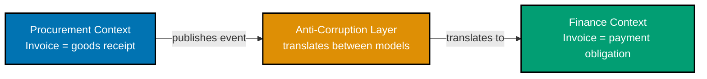
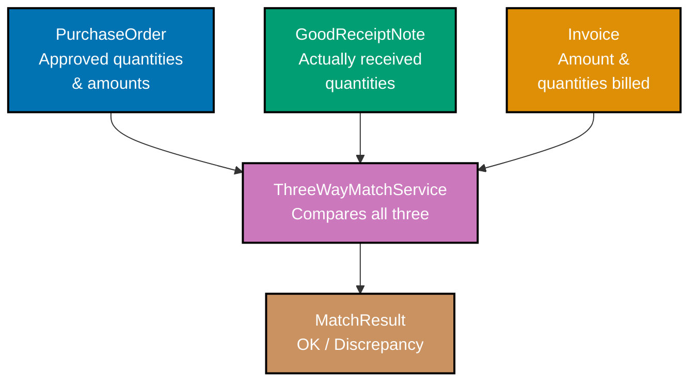
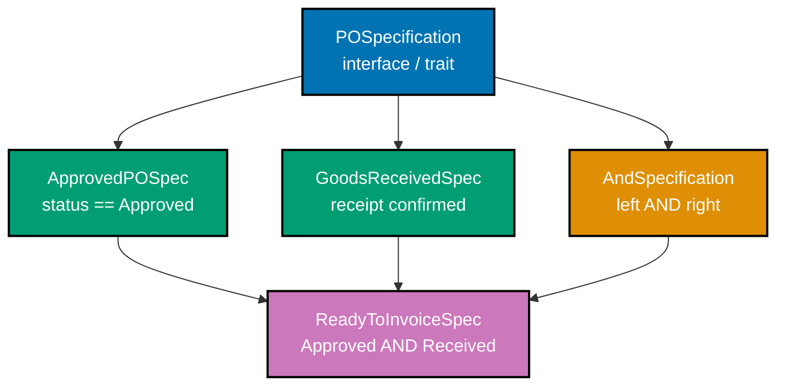
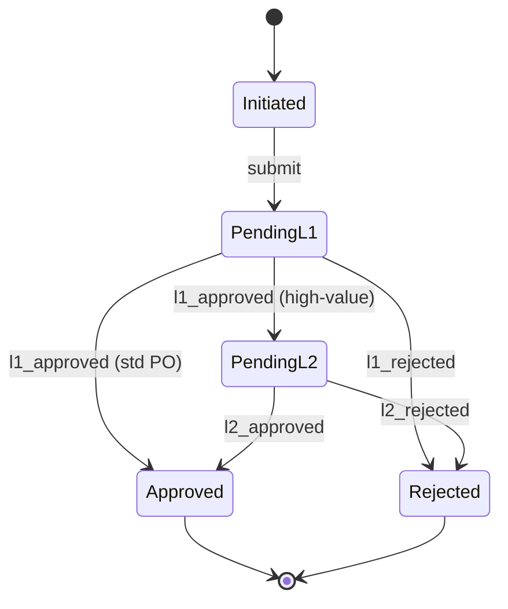

Examples 52–76 cover strategic DDD patterns and advanced tactical constructs that span aggregate boundaries. The examples build on the intermediate tier's single-context PurchaseOrder aggregate and extend into multi-context coordination: bounded context mapping with anti-corruption layers, domain services for cross-aggregate operations, the specification pattern for composable business rules, saga orchestration for long-running approval workflows, and finally a Sharia-compliant Murabaha finance extension introducing `MurabahaPurchaseContract`, `ProfitMargin`, `PaymentSchedule`, and `ShariaAuditTrail`.

## Bounded Context Mapping

### Example 52: Defining Bounded Context Boundaries

A bounded context is an explicit boundary within which a domain model is internally consistent. The same term used in two different bounded contexts — such as `Invoice` — can carry entirely different meaning and structure; treating them as the same type leaks one context's concerns into another.






```go
// procurement/invoice.go
// => Package boundary is the bounded-context boundary in Go.
// => Everything in this package uses procurement's definition of Invoice.
package procurement

import "time"

// => ProcurementInvoice tracks goods delivery, not payment obligations.
// => It exists to reconcile what was ordered (PO) against what arrived (receipt).
type Invoice struct {
    // => ID uniquely identifies this procurement invoice within its context.
    ID InvoiceID
    // => POID links the invoice back to the originating purchase order.
    POID PurchaseOrderID
    // => LineItems records exactly which goods arrived — may differ from PO.
    LineItems []LineItem
    // => ReceivedAt is a procurement concern: when goods entered the warehouse.
    ReceivedAt time.Time
}

// finance/invoice.go
// => Separate package = separate bounded context with its own Invoice definition.
// => Finance does not know or care about goods receipt — it tracks money owed.
package finance

import "time"

// => FinanceInvoice represents a payment obligation to a supplier.
// => It has no LineItems — finance only cares about the monetary total and due date.
type Invoice struct {
    // => ID is the finance context's own identifier, independent of procurement's.
    ID InvoiceID
    // => SupplierID links to the creditor — a finance concern, not a procurement one.
    SupplierID SupplierID
    // => AmountDue is the primary field: how much the organisation owes.
    AmountDue Money
    // => DueDate drives payment runs in accounts payable — purely a finance concept.
    DueDate time.Time
    // => PaymentStatus tracks whether the obligation has been discharged.
    PaymentStatus PaymentStatus
}
```




```rust
// src/procurement/invoice.rs
// => Rust module = bounded-context boundary; `pub` surface is the published API.
// => Items not marked `pub` cannot be accessed from other modules.

use chrono::DateTime;
use chrono::Utc;

// => ProcurementInvoice: receipt-of-goods concern only.
// => Deriving Debug and Clone enables logging and testing without extra boilerplate.
#[derive(Debug, Clone)]
pub struct Invoice {
    // => pub fields visible to callers; private fields would enforce invariants.
    pub id: InvoiceId,
    pub po_id: PurchaseOrderId,
    // => line_items: what actually arrived — vector owned by this struct.
    pub line_items: Vec<LineItem>,
    // => received_at: warehouse timestamp, not a finance concept.
    pub received_at: DateTime<Utc>,
}

// src/finance/invoice.rs
// => Separate module declares finance's own Invoice — no shared type with procurement.
// => This is intentional: sharing the type would couple two contexts' evolution.

#[derive(Debug, Clone)]
pub struct Invoice {
    pub id: InvoiceId,
    pub supplier_id: SupplierId,
    // => amount_due: the only monetary field — finance doesn't care about line detail.
    pub amount_due: Money,
    pub due_date: DateTime<Utc>,
    // => payment_status: accounts-payable lifecycle; absent from procurement Invoice.
    pub payment_status: PaymentStatus,
}
```




**Key takeaway**: Two bounded contexts can both have an `Invoice` type; keeping them in separate packages or modules prevents coupling and allows each to evolve at its own pace.

---

### Example 53: Context Map — Published Language

A Published Language (PL) is a shared, versioned schema that two bounded contexts agree to communicate through. Neither context exposes its internal domain model across the boundary; both translate to and from the PL independently. This decouples their internal evolution while enabling reliable integration.




```go
// contracts/events.go
// => The contracts package is the Published Language: a stable schema both contexts import.
// => Neither procurement nor finance imports the other's domain package.
package contracts

import "time"

// => POCreatedEvent is the canonical event schema for cross-context communication.
// => Version field allows the schema to evolve without breaking consumers.
type POCreatedEvent struct {
    // => EventID: globally unique identifier for idempotent event processing.
    EventID string `json:"event_id"`
    // => Version: schema version — consumers check this before deserialising.
    Version int `json:"version"`
    // => POID: only the ID crosses the boundary, not the full PO aggregate.
    POID string `json:"po_id"`
    // => SupplierID: likewise, only a reference — finance fetches its own supplier record.
    SupplierID string `json:"supplier_id"`
    // => TotalAmount: primitive float in the PL — avoids the Money value object crossing boundaries.
    TotalAmount float64 `json:"total_amount"`
    // => Currency: ISO 4217 code; finance context reconstructs its Money value object from these two fields.
    Currency string `json:"currency"`
    // => OccurredAt: event timestamp used for ordering and audit; always UTC.
    OccurredAt time.Time `json:"occurred_at"`
}

// procurement/publisher.go
// => Procurement translates its internal POCreated domain event into the Published Language.
// => This translation is the procurement side of the context map.
func ToContractEvent(e POCreatedDomainEvent) contracts.POCreatedEvent {
    // => Map internal types to PL primitives — Money becomes float64 + string.
    return contracts.POCreatedEvent{
        EventID:     e.EventID.String(),
        Version:     1,
        POID:        e.POID.String(),
        SupplierID:  e.SupplierID.String(),
        TotalAmount: e.Total.Amount,
        Currency:    e.Total.Currency,
        OccurredAt:  e.OccurredAt,
    }
}
```




```rust
// contracts/src/events.rs
// => The contracts crate is the Published Language boundary — imported by both contexts.
// => serde derives enable JSON serialisation without coupling to any framework.
use serde::{Deserialize, Serialize};
use chrono::{DateTime, Utc};

// => POCreatedEvent: the PL schema agreed upon by procurement and finance teams.
// => Adding a field here is a backward-compatible change; removing one is breaking.
#[derive(Debug, Clone, Serialize, Deserialize)]
pub struct POCreatedEvent {
    // => event_id: String not Uuid — keeps the PL free of domain-specific dependencies.
    pub event_id: String,
    pub version: u32,
    pub po_id: String,
    pub supplier_id: String,
    // => total_amount + currency: primitives instead of Money value object.
    // => Finance reconstructs Money<Finance> from these; procurement uses Money<Procurement>.
    pub total_amount: f64,
    pub currency: String,
    pub occurred_at: DateTime<Utc>,
}

// procurement/src/publisher.rs
// => Translation from internal domain event to PL event stays in the procurement crate.
// => Finance never sees procurement's internal POCreatedDomainEvent type.
pub fn to_contract_event(e: &POCreatedDomainEvent) -> contracts::POCreatedEvent {
    contracts::POCreatedEvent {
        event_id: e.event_id.to_string(),
        // => version 1: explicit schema version for future migrations.
        version: 1,
        po_id: e.po_id.to_string(),
        supplier_id: e.supplier_id.to_string(),
        total_amount: e.total.amount,
        currency: e.total.currency.clone(),
        occurred_at: e.occurred_at,
    }
}
```




**Key takeaway**: The Published Language is a stable integration contract — internal domain models can change freely as long as the translation layer to the PL remains correct.

---

### Example 54: Anti-Corruption Layer (ACL)

An Anti-Corruption Layer sits on the downstream side of a context boundary. It translates the upstream context's Published Language into the downstream context's own domain types. Without an ACL, upstream concepts and naming conventions leak into the downstream model, corrupting its integrity.




```go
// finance/acl/procurement_acl.go
// => The ACL lives inside the finance package — it is finance's responsibility to translate.
// => Procurement does not know how finance interprets its events.
package acl

import (
    "finance/domain"
    "contracts"
    "time"
)

// => FinanceACL translates procurement Published Language events into finance domain types.
// => It is the only place in the finance context that imports the contracts package.
type FinanceACL struct{}

// => TranslatePOCreated converts a procurement event into a finance Invoice draft.
// => Finance's Invoice has different fields — the ACL handles that impedance mismatch.
func (a FinanceACL) TranslatePOCreated(e contracts.POCreatedEvent) (domain.Invoice, error) {
    // => Reconstruct Money as a finance domain value object from PL primitives.
    amount, err := domain.NewMoney(e.TotalAmount, e.Currency)
    if err != nil {
        // => Invalid currency in the PL event: return a translation error, not a domain error.
        return domain.Invoice{}, fmt.Errorf("acl: invalid currency %q: %w", e.Currency, err)
    }
    // => Build a finance Invoice draft — DueDate defaults to 30 days net.
    // => This default is a finance policy, not a procurement concern.
    return domain.Invoice{
        ID:            domain.NewInvoiceID(),
        SupplierID:    domain.SupplierID(e.SupplierID),
        AmountDue:     amount,
        DueDate:       e.OccurredAt.Add(30 * 24 * time.Hour),
        PaymentStatus: domain.PaymentPending,
    }, nil
}
```




```rust
// finance/src/acl/procurement_acl.rs
// => FinanceAcl: finance crate's translator; the only module that imports `contracts`.
// => All other finance modules work exclusively with finance domain types.
use crate::domain::{Invoice, InvoiceId, SupplierId, Money, PaymentStatus};
use contracts::POCreatedEvent;
use chrono::Duration;

pub struct FinanceAcl;

impl FinanceAcl {
    // => translate takes the PL event and produces a finance domain Invoice.
    // => Result<Invoice, AclError> keeps ACL errors distinct from domain errors.
    pub fn translate_po_created(
        &self,
        event: &POCreatedEvent,
    ) -> Result<Invoice, AclError> {
        // => Parse currency and amount into finance's Money value object.
        let amount = Money::new(event.total_amount, &event.currency)
            .map_err(|e| AclError::InvalidCurrency(e))?;
        // => Finance applies its own 30-day net payment policy — not encoded in the PL.
        let due_date = event.occurred_at + Duration::days(30);
        Ok(Invoice {
            id: InvoiceId::new(),
            supplier_id: SupplierId::from_str(&event.supplier_id)?,
            amount_due: amount,
            due_date,
            // => New invoice always starts as Pending — finance lifecycle concern.
            payment_status: PaymentStatus::Pending,
        })
    }
}
```




**Key takeaway**: The ACL is the downstream context's shield — upstream schema changes require updating only the ACL, leaving the finance domain model untouched.

---

### Example 55: Conformist Pattern

The Conformist pattern applies when the downstream context deliberately adopts the upstream context's model without translation. This is appropriate when the upstream model is stable, authoritative, and the downstream has no conflicting concepts — but it creates tight coupling: upstream changes ripple directly into the downstream.




```go
// reporting/report.go
// => The reporting package is a conformist downstream: it directly uses procurement types.
// => No ACL, no translation — reporting conforms to procurement's model.
package reporting

import "procurement"

// => POSummaryReport directly embeds procurement.PurchaseOrder — conformist coupling.
// => If procurement.PurchaseOrder adds a field, this report gains it automatically.
type POSummaryReport struct {
    // => PO is the upstream type used verbatim — no translation layer.
    PO procurement.PurchaseOrder
    // => GeneratedAt is the only reporting-specific field.
    GeneratedAt time.Time
}

// => GenerateReport conforms to procurement's model: takes PO as-is.
// => Appropriate because reporting has no conflicting definition of PurchaseOrder.
func GenerateReport(po procurement.PurchaseOrder) POSummaryReport {
    return POSummaryReport{
        PO:          po,
        GeneratedAt: time.Now().UTC(),
    }
}

// => Conformist tradeoff: faster to build, but changes in procurement.PurchaseOrder
// => break this package without notice. Only use when upstream is truly stable.
```




```rust
// reporting/src/report.rs
// => Conformist: reporting crate imports and uses procurement types directly.
// => No wrapper, no translation — deliberate coupling to the upstream model.
use procurement::PurchaseOrder;
use chrono::{DateTime, Utc};

// => POSummaryReport embeds PurchaseOrder directly — zero translation overhead.
// => This works because reporting adds value through aggregation, not reinterpretation.
#[derive(Debug)]
pub struct POSummaryReport {
    // => po: owned copy of the upstream aggregate; Clone derived on PurchaseOrder.
    pub po: PurchaseOrder,
    pub generated_at: DateTime<Utc>,
}

pub fn generate_report(po: PurchaseOrder) -> POSummaryReport {
    POSummaryReport {
        po,
        // => generated_at stamps when the report was produced — a reporting concern only.
        generated_at: Utc::now(),
    }
}

// => When to use Conformist:
// => - Upstream model is stable and authoritative (like procurement's PO definition).
// => - You control both contexts and can coordinate changes.
// => When NOT to use: upstream changes frequently, or you have conflicting semantics.
```




**Key takeaway**: The Conformist pattern eliminates translation cost at the price of coupling — suitable for read-only, reporting, or tooling contexts that add no conflicting domain meaning.

---

### Example 56: Customer-Supplier Relationship

In the Customer-Supplier relationship, the downstream (customer) specifies what it needs from the upstream (supplier) via an interface. The upstream must implement that interface. This inverts the dependency: the upstream depends on the downstream's contract, not the other way around.




```go
// finance/domain/po_provider.go
// => Finance defines the interface it needs — it is the customer specifying requirements.
// => Procurement (the supplier) must satisfy this interface without finance importing procurement.
package domain

// => POProvider is finance's view of what it needs from the upstream procurement context.
// => Finance does not know or care that procurement implements this — only that it satisfies it.
type POProvider interface {
    // => GetApprovedPO: finance only needs approved POs — it specifies exactly what matters.
    GetApprovedPO(id PurchaseOrderID) (*ApprovedPOView, error)
}

// => ApprovedPOView is finance's own projection — only the fields finance cares about.
// => This is NOT procurement's PurchaseOrder: it's a purpose-built read model for finance.
type ApprovedPOView struct {
    ID         PurchaseOrderID
    SupplierID SupplierID
    // => ApprovedAmount: only the approved total, not line item detail.
    ApprovedAmount Money
    ApprovedAt time.Time
}

// procurement/adapters/finance_adapter.go
// => Procurement implements finance's POProvider interface — the supplier fulfils the customer's contract.
// => This file lives in procurement but imports the finance interface definition.
package adapters

// => ProcurementPOProvider is procurement's adapter satisfying finance's POProvider.
// => It translates procurement's internal PurchaseOrder into finance's ApprovedPOView.
type ProcurementPOProvider struct {
    repo PORepository
}

func (p *ProcurementPOProvider) GetApprovedPO(id finance.PurchaseOrderID) (*finance.ApprovedPOView, error) {
    po, err := p.repo.FindByID(PurchaseOrderID(id))
    if err != nil {
        return nil, err
    }
    // => Only approved POs cross the boundary — this is the supplier's compliance with the contract.
    if po.Status != POStatusApproved {
        return nil, ErrNotApproved
    }
    return &finance.ApprovedPOView{
        ID:             finance.PurchaseOrderID(po.ID),
        SupplierID:     finance.SupplierID(po.SupplierID),
        ApprovedAmount: finance.Money{Amount: po.Total.Amount, Currency: po.Total.Currency},
        ApprovedAt:     po.ApprovedAt,
    }, nil
}
```




```rust
// finance/src/domain/po_provider.rs
// => Finance defines the trait it requires — the customer's specification.
// => Trait lives in the finance crate; procurement implements it in its own crate.

use async_trait::async_trait;

// => POProvider: finance's dependency inversion — finance imports no procurement types.
#[async_trait]
pub trait POProvider: Send + Sync {
    // => get_approved_po: async because it may cross a service boundary.
    async fn get_approved_po(
        &self,
        id: &PurchaseOrderId,
    ) -> Result<ApprovedPoView, ProviderError>;
}

// => ApprovedPoView: finance's projection of a purchase order — only what finance needs.
#[derive(Debug, Clone)]
pub struct ApprovedPoView {
    pub id: PurchaseOrderId,
    pub supplier_id: SupplierId,
    pub approved_amount: Money,
    pub approved_at: chrono::DateTime<chrono::Utc>,
}

// procurement/src/adapters/finance_adapter.rs
// => Procurement implements finance's trait — satisfying the customer's contract.
// => The impl block is in the procurement crate; finance never imports this file.

use finance::domain::po_provider::{POProvider, ApprovedPoView};

pub struct ProcurementPoProvider {
    repo: Arc<dyn PoRepository>,
}

#[async_trait]
impl POProvider for ProcurementPoProvider {
    async fn get_approved_po(
        &self,
        id: &finance::PurchaseOrderId,
    ) -> Result<ApprovedPoView, finance::ProviderError> {
        // => Load from procurement's own repository — internal detail hidden from finance.
        let po = self.repo.find_by_id(&PoId::from(id))
            .await
            .map_err(|_| finance::ProviderError::NotFound)?;
        // => Guard: only approved POs cross — supplier enforces the contract's precondition.
        if po.status != PoStatus::Approved {
            return Err(finance::ProviderError::NotApproved);
        }
        Ok(ApprovedPoView {
            id: finance::PurchaseOrderId::from(&po.id),
            supplier_id: finance::SupplierId::from(&po.supplier_id),
            approved_amount: finance::Money::new(po.total.amount, &po.total.currency)?,
            approved_at: po.approved_at,
        })
    }
}
```




**Key takeaway**: Customer-Supplier inverts context dependencies — the downstream defines what it needs, and the upstream is accountable for satisfying that contract, preventing the upstream from dictating terms to the downstream.

---

### Example 57: Partnership Pattern with Domain Events

The Partnership pattern applies when two bounded contexts must succeed or fail together — their business processes are tightly coupled by mutual commitment. They coordinate via domain events published on a shared bus. The outbox pattern ensures that publishing an event is atomic with the domain state change that caused it.




```go
// procurement/events.go
// => POApprovedEvent is published when procurement approves a PO.
// => Finance must process this event to create a payment obligation — they succeed together.
type POApprovedEvent struct {
    EventID    string
    POID       PurchaseOrderID
    SupplierID SupplierID
    Total      Money
    ApprovedAt time.Time
}

// procurement/outbox.go
// => OutboxEntry stores events in the same transaction as the domain state change.
// => Without the outbox, a crash between "save PO" and "publish event" loses the event.
type OutboxEntry struct {
    ID        string
    EventType string
    Payload   []byte
    // => CreatedAt: used by the outbox relay to order and deduplicate events.
    CreatedAt time.Time
    // => Published: relay marks true after successful delivery to the event bus.
    Published bool
}

// procurement/service.go
// => ApprovePO saves the updated PO and the outbox entry in a single DB transaction.
// => If the transaction rolls back, both the domain change and the event are rolled back.
func (s *POService) ApprovePO(ctx context.Context, id PurchaseOrderID, level ApprovalLevel) error {
    return s.db.Transaction(func(tx *gorm.DB) error {
        po, err := s.repo.FindByIDTx(tx, id)
        if err != nil {
            return err
        }
        // => Domain transition: PO moves to approved state.
        if err := po.Approve(level); err != nil {
            return err
        }
        // => Save updated aggregate — first half of the atomic pair.
        if err := s.repo.SaveTx(tx, po); err != nil {
            return err
        }
        // => Serialise the domain event and write to outbox — second half of the atomic pair.
        payload, _ := json.Marshal(POApprovedEvent{
            EventID:    uuid.New().String(),
            POID:       po.ID,
            SupplierID: po.SupplierID,
            Total:      po.Total,
            ApprovedAt: time.Now().UTC(),
        })
        return tx.Create(&OutboxEntry{
            ID:        uuid.New().String(),
            EventType: "POApproved",
            Payload:   payload,
            CreatedAt: time.Now().UTC(),
        }).Error
    })
}
```




```rust
// procurement/src/events.rs
// => POApprovedEvent: the partnership event finance listens to.
// => Both contexts commit to processing this event — partnership means shared fate.
use serde::{Serialize, Deserialize};

#[derive(Debug, Clone, Serialize, Deserialize)]
pub struct POApprovedEvent {
    pub event_id: String,
    pub po_id: PurchaseOrderId,
    pub supplier_id: SupplierId,
    pub total: Money,
    pub approved_at: chrono::DateTime<chrono::Utc>,
}

// procurement/src/outbox.rs
// => OutboxEntry: atomic pairing of domain state change with event publication.
#[derive(Debug)]
pub struct OutboxEntry {
    pub id: String,
    pub event_type: String,
    pub payload: Vec<u8>,
    pub created_at: chrono::DateTime<chrono::Utc>,
    // => published: relay sets this true after confirmed delivery.
    pub published: bool,
}

// procurement/src/service.rs
// => approve_po writes domain change + outbox entry in a single transaction.
pub async fn approve_po(
    &self,
    id: &PurchaseOrderId,
    level: ApprovalLevel,
) -> Result<(), ServiceError> {
    // => Begin transaction — both saves succeed or both roll back.
    let mut tx = self.db.begin().await?;
    let mut po = self.repo.find_by_id_tx(&mut tx, id).await?;
    // => Transition aggregate state — may return domain error if invariant violated.
    po.approve(level)?;
    // => Save updated aggregate within the transaction.
    self.repo.save_tx(&mut tx, &po).await?;
    // => Serialise event and write to outbox — atomic with the domain save above.
    let payload = serde_json::to_vec(&POApprovedEvent {
        event_id: Uuid::new_v4().to_string(),
        po_id: po.id.clone(),
        supplier_id: po.supplier_id.clone(),
        total: po.total.clone(),
        approved_at: Utc::now(),
    })?;
    self.outbox.save_tx(&mut tx, "POApproved", payload).await?;
    // => Commit — both the domain change and the outbox entry are now durable.
    tx.commit().await?;
    Ok(())
}
```




**Key takeaway**: The outbox pattern makes event publication atomic with domain state changes — the partnership's shared-fate guarantee is enforced at the database transaction level, not by hoping two separate writes both succeed.

---

## Domain Services

### Example 58: Identifying Domain Service Candidates

A domain service encapsulates a domain operation that does not belong naturally to any single entity or value object. The operation involves domain logic — it enforces business rules and invariants — but requires input from multiple aggregates or external domain data that no single entity owns.




```go
// procurement/services/approval_validation.go
// => ApprovalValidationService is a domain service: stateless, named after a business concept.
// => It cannot live on PurchaseOrder (needs policy data) or ApprovalLevel (needs PO data).
package services

// => ApprovalValidationService encapsulates the "is this PO eligible for this approval level" rule.
// => Stateless: no fields — inputs are passed as arguments, output is deterministic.
type ApprovalValidationService struct{}

// => ValidateApprovalEligibility enforces cross-aggregate approval policy.
// => PurchaseOrder and ApprovalLevel are two separate domain concepts; neither owns this rule.
func (s *ApprovalValidationService) ValidateApprovalEligibility(
    po PurchaseOrder,
    level ApprovalLevel,
) error {
    // => Rule 1: only draft or pending POs can receive approvals.
    if po.Status != POStatusDraft && po.Status != POStatusPending {
        return ErrPONotAwaitingApproval
    }
    // => Rule 2: approval level must match the PO's value tier.
    // => Low-value POs do not require CFO sign-off — this is a domain policy.
    if level == ApprovalLevelCFO && po.Total.Amount < CFOApprovalThreshold {
        return ErrApprovalLevelMismatch
    }
    // => Rule 3: the PO must not already have been approved at this level.
    if po.HasApprovalAt(level) {
        return ErrAlreadyApprovedAtLevel
    }
    // => All rules pass: this PO is eligible for the requested approval level.
    return nil
}
```




```rust
// procurement/src/services/approval_validation.rs
// => POValidationService: stateless struct — domain service idiom in Rust.
// => Unit struct (no fields) signals "this is a stateless service, not a repository or handler".
pub struct POValidationService;

impl POValidationService {
    // => validate_approval_eligibility: domain logic that crosses PO and ApprovalLevel concepts.
    // => Returns a domain-specific error, not a generic anyhow::Error.
    pub fn validate_approval_eligibility(
        &self,
        po: &PurchaseOrder,
        level: ApprovalLevel,
    ) -> Result<(), ApprovalValidationError> {
        // => Rule 1: PO must be in an approvable state.
        match po.status {
            PoStatus::Draft | PoStatus::Pending => {}
            _ => return Err(ApprovalValidationError::NotAwaitingApproval),
        }
        // => Rule 2: value-tier check — CFO approval only for high-value POs.
        if level == ApprovalLevel::Cfo
            && po.total.amount < CFO_APPROVAL_THRESHOLD
        {
            return Err(ApprovalValidationError::LevelMismatch);
        }
        // => Rule 3: idempotency guard — cannot approve at the same level twice.
        if po.has_approval_at(level) {
            return Err(ApprovalValidationError::AlreadyApprovedAtLevel);
        }
        Ok(())
    }
}
```




**Key takeaway**: A domain service is the right home for business rules that span multiple aggregates — it preserves domain logic inside the domain layer rather than leaking it into application services or repositories.

---

### Example 59: Three-Way Match Domain Service

Three-way match is a core procurement control: it verifies that a supplier invoice matches both the approved purchase order and the goods receipt note before authorising payment. The check spans three separate aggregates — no single aggregate can own it.






```go
// procurement/services/three_way_match.go
package services

// => ThreeWayMatchService encapsulates the cross-aggregate three-way match logic.
// => Three aggregates as inputs make this the canonical domain service candidate.
type ThreeWayMatchService struct{}

// => MatchResult communicates outcome with enough detail to drive AP workflow decisions.
type MatchResult struct {
    // => OK: true when all three sources agree within tolerance.
    OK bool
    // => Reason: human-readable discrepancy description; empty when OK is true.
    Reason string
    // => Discrepancy: structured discrepancy data for automated exception routing.
    Discrepancy *MatchDiscrepancy
}

// => Match performs the three-way verification.
// => All three aggregates are passed by value — the service does not mutate them.
func (s *ThreeWayMatchService) Match(
    po PurchaseOrder,
    receipt GoodReceiptNote,
    invoice Invoice,
) MatchResult {
    // => Check 1: invoice total must not exceed the PO-approved amount.
    // => Over-invoicing is the most common fraudulent billing scenario.
    if invoice.TotalAmount.GreaterThan(po.TotalApproved()) {
        return MatchResult{
            OK:     false,
            Reason: "invoice amount exceeds approved PO amount",
            Discrepancy: &MatchDiscrepancy{Type: DiscrepancyAmountMismatch},
        }
    }
    // => Check 2: each invoiced line must not exceed received quantity.
    // => Paying for goods not yet received violates cash flow controls.
    for _, line := range invoice.LineItems {
        received := receipt.ReceivedQuantityFor(line.SKU)
        if line.Quantity.GreaterThan(received) {
            return MatchResult{
                OK:     false,
                Reason: fmt.Sprintf("SKU %s: invoiced qty exceeds received qty", line.SKU),
                Discrepancy: &MatchDiscrepancy{
                    Type: DiscrepancyQuantityMismatch,
                    SKU:  line.SKU,
                },
            }
        }
    }
    // => All checks pass: proceed to payment authorisation.
    return MatchResult{OK: true}
}
```




```rust
// procurement/src/services/three_way_match.rs
pub struct ThreeWayMatchService;

// => MatchResult is a value object: immutable, equality-based, carries full context.
#[derive(Debug, Clone, PartialEq)]
pub enum MatchResult {
    // => Ok variant: three-way match passed, payment authorised.
    Ok,
    // => Discrepancy variant: contains structured failure context for AP exception handling.
    Discrepancy(MatchDiscrepancy),
}

#[derive(Debug, Clone, PartialEq)]
pub struct MatchDiscrepancy {
    pub discrepancy_type: DiscrepancyType,
    pub reason: String,
}

impl ThreeWayMatchService {
    // => match_three performs the domain verification across all three aggregates.
    // => References only — the service does not take ownership or mutate any aggregate.
    pub fn match_three(
        &self,
        po: &PurchaseOrder,
        receipt: &GoodReceiptNote,
        invoice: &Invoice,
    ) -> MatchResult {
        // => Amount check: supplier cannot bill more than the approved PO total.
        if invoice.total_amount.is_greater_than(&po.total_approved()) {
            return MatchResult::Discrepancy(MatchDiscrepancy {
                discrepancy_type: DiscrepancyType::AmountMismatch,
                reason: "invoice amount exceeds approved PO amount".into(),
            });
        }
        // => Quantity check per line item: cannot pay for unreceived goods.
        for line in &invoice.line_items {
            let received = receipt.received_quantity_for(&line.sku);
            if line.quantity.is_greater_than(&received) {
                return MatchResult::Discrepancy(MatchDiscrepancy {
                    discrepancy_type: DiscrepancyType::QuantityMismatch,
                    reason: format!(
                        "SKU {}: invoiced quantity {} exceeds received {}",
                        line.sku, line.quantity, received
                    ),
                });
            }
        }
        // => Three-way match passed — AP workflow can proceed to payment.
        MatchResult::Ok
    }
}
```




**Key takeaway**: The three-way match domain service keeps a critical procurement control inside the domain layer where it belongs — business rules about money and quantities should not live in controllers, use-case handlers, or database queries.

---

### Example 60: Domain Service vs Application Service

Domain services contain domain logic: invariants, business rules, cross-aggregate constraints. Application services orchestrate use cases: they load aggregates from repositories, call domain services, publish events, and commit transactions. This separation keeps domain logic testable without infrastructure.




```go
// procurement/services/approval_domain_service.go
// => DOMAIN SERVICE: pure domain logic, no infrastructure imports, no transactions.
package services

// => POApprovalDomainService enforces approval business rules only.
// => It does not load from a repository or publish events — those are application concerns.
type POApprovalDomainService struct {
    // => ApprovalPolicy: a domain value object holding policy configuration.
    // => Injected at construction time — the service does not read from config files.
    ApprovalPolicy ApprovalPolicy
}

// => CanApprove: domain predicate — returns the approval decision and reason.
// => Takes domain objects, returns domain result — zero infrastructure dependencies.
func (s *POApprovalDomainService) CanApprove(po PurchaseOrder, approverRole Role) (bool, string) {
    // => Policy check: does this role have authority to approve at this PO's value?
    if !s.ApprovalPolicy.RoleCanApprove(approverRole, po.Total) {
        return false, "role lacks authority for this PO value"
    }
    // => Status check: can only approve POs in pending state.
    if po.Status != POStatusPending {
        return false, "PO is not pending approval"
    }
    return true, ""
}

// procurement/usecases/approve_order.go
// => APPLICATION SERVICE: orchestrates the use case, owns infrastructure concerns.
package usecases

// => ApproveOrderUseCase coordinates loading, domain logic, persistence, and events.
// => It depends on interfaces — not concrete implementations — for testability.
type ApproveOrderUseCase struct {
    // => repo: load and save aggregates — infrastructure concern owned by application layer.
    repo            PORepository
    // => domainSvc: injected domain service — business rules stay in the domain layer.
    domainSvc       *services.POApprovalDomainService
    // => events: publish domain events after successful commit.
    events          EventPublisher
}

func (uc *ApproveOrderUseCase) Execute(ctx context.Context, cmd ApproveOrderCommand) error {
    // => Load aggregate from repository — infrastructure concern.
    po, err := uc.repo.FindByID(ctx, cmd.POID)
    if err != nil {
        return err
    }
    // => Delegate to domain service for business rule enforcement.
    if ok, reason := uc.domainSvc.CanApprove(*po, cmd.ApproverRole); !ok {
        return fmt.Errorf("approval denied: %s", reason)
    }
    // => Mutate aggregate state — domain transition.
    po.Approve(cmd.ApproverRole)
    // => Persist updated aggregate — infrastructure concern.
    if err := uc.repo.Save(ctx, po); err != nil {
        return err
    }
    // => Publish domain event — application-layer concern (after commit).
    return uc.events.Publish(POApprovedEvent{POID: po.ID, ApprovedAt: time.Now().UTC()})
}
```




```rust
// procurement/src/domain/approval_service.rs
// => DOMAIN SERVICE: no async, no repositories, no I/O — pure business logic.
pub struct POApprovalDomainService {
    // => approval_policy: domain value carrying the rules — not a config file reader.
    approval_policy: ApprovalPolicy,
}

impl POApprovalDomainService {
    // => can_approve: synchronous, pure — takes domain objects, returns domain decision.
    // => Easy to unit-test without mocking any infrastructure.
    pub fn can_approve(&self, po: &PurchaseOrder, approver_role: &Role) -> Result<(), ApprovalError> {
        if !self.approval_policy.role_can_approve(approver_role, &po.total) {
            return Err(ApprovalError::InsufficientAuthority);
        }
        if po.status != PoStatus::Pending {
            return Err(ApprovalError::NotPending);
        }
        Ok(())
    }
}

// procurement/src/application/approve_order.rs
// => APPLICATION SERVICE: async, owns I/O, orchestrates the use case end-to-end.
pub struct ApproveOrderUseCase {
    // => repo: trait object — infrastructure swappable (e.g., Postgres vs in-memory).
    repo: Arc<dyn PORepository>,
    // => domain_svc: injected — application layer calls domain layer, never the reverse.
    domain_svc: Arc<POApprovalDomainService>,
    events: Arc<dyn EventPublisher>,
}

impl ApproveOrderUseCase {
    pub async fn execute(&self, cmd: ApproveOrderCommand) -> Result<(), UseCaseError> {
        // => Load from repository — async I/O stays in the application layer.
        let mut po = self.repo.find_by_id(&cmd.po_id).await?;
        // => Delegate business rule check to domain service.
        self.domain_svc.can_approve(&po, &cmd.approver_role)?;
        // => Apply domain transition to the loaded aggregate.
        po.approve(cmd.approver_role)?;
        // => Persist — infrastructure concern stays outside the domain service.
        self.repo.save(&po).await?;
        // => Publish event — application concern, runs after successful persist.
        self.events.publish(POApprovedEvent::from(&po)).await?;
        Ok(())
    }
}
```




**Key takeaway**: Domain services enforce business rules with no infrastructure imports; application services orchestrate those rules within transaction and event-publication boundaries — keep the two layers strictly separate so domain logic remains independently testable.

---

### Example 61: Currency Conversion Domain Service

Currency conversion in a multi-currency procurement platform is a domain operation, not an infrastructure concern. The exchange rate is a domain value object; the conversion formula is a business rule. The service does not call external APIs — it applies a rate that was fetched and validated elsewhere.




```go
// procurement/services/currency_conversion.go
package services

// => ExchangeRate is a domain value object: a rate agreed at a specific moment in time.
// => It is not fetched here — the application layer fetches it and passes it in.
type ExchangeRate struct {
    // => From: the source currency being converted away from.
    From Currency
    // => To: the target currency being converted into.
    To Currency
    // => Rate: the multiplicative conversion factor, e.g. 0.0653 for IDR→USD.
    Rate decimal.Decimal
    // => AsOf: the timestamp when this rate was valid — rate ages must be validated upstream.
    AsOf time.Time
}

// => CurrencyConversionService: domain service for monetary conversion.
// => Stateless — all data comes in as arguments, no external I/O.
type CurrencyConversionService struct{}

// => Convert applies the exchange rate to a Money value object.
// => Returns a new Money in the target currency — original is unchanged (immutable pattern).
func (s *CurrencyConversionService) Convert(
    amount Money,
    rate ExchangeRate,
) (Money, error) {
    // => Validate that the rate matches the money's currency.
    if amount.Currency != rate.From {
        return Money{}, fmt.Errorf("rate from-currency %s does not match amount currency %s",
            rate.From, amount.Currency)
    }
    // => Apply conversion: multiply amount by rate using high-precision decimal arithmetic.
    // => Floating-point arithmetic is prohibited for monetary calculations.
    converted := decimal.NewFromFloat(amount.Amount).Mul(rate.Rate)
    return Money{
        Amount:   converted.InexactFloat64(),
        Currency: rate.To,
    }, nil
}
```




```rust
// procurement/src/domain/currency_conversion.rs
use rust_decimal::Decimal;

// => ExchangeRate: domain value object capturing a point-in-time conversion factor.
#[derive(Debug, Clone, PartialEq)]
pub struct ExchangeRate {
    pub from: Currency,
    pub to: Currency,
    // => rate: Decimal not f64 — monetary calculations require exact arithmetic.
    pub rate: Decimal,
    pub as_of: chrono::DateTime<chrono::Utc>,
}

pub struct CurrencyConversionService;

impl CurrencyConversionService {
    // => convert: pure function — given money and a rate, produce converted money.
    // => No side effects, no I/O: the application layer is responsible for sourcing the rate.
    pub fn convert(
        &self,
        amount: &Money,
        rate: &ExchangeRate,
    ) -> Result<Money, ConversionError> {
        // => Currency mismatch guard: ensures we're applying the right rate.
        if amount.currency != rate.from {
            return Err(ConversionError::CurrencyMismatch {
                expected: rate.from.clone(),
                actual: amount.currency.clone(),
            });
        }
        // => Decimal multiplication: amount * rate = converted amount.
        // => rust_decimal guarantees no floating-point rounding errors.
        let converted = Decimal::from(amount.amount) * rate.rate;
        Ok(Money {
            // => Round to 2 decimal places per standard monetary rounding rules.
            amount: converted.round_dp(2).to_f64().unwrap_or(0.0),
            currency: rate.to.clone(),
        })
    }
}
```




**Key takeaway**: Currency conversion is domain logic — it enforces monetary precision rules and validates currency compatibility — so it belongs in the domain layer as a service, not in a utility or infrastructure layer.

---

### Example 62: Supplier Credit Assessment Domain Service

Supplier credit assessment evaluates a supplier's reliability for large purchase orders by analysing their historical performance across multiple POs. The assessment spans the `Supplier` aggregate and a collection of historical `PurchaseOrder` aggregates — no single aggregate can own this rule.




```go
// procurement/services/supplier_credit.go
package services

// => CreditScore is a domain value object: an immutable assessment result with tier.
type CreditScore struct {
    // => Score: numeric rating 0–100 computed from on-time delivery and PO fulfilment rate.
    Score int
    // => Tier: categorical classification derived from Score — drives PO value limits.
    Tier CreditTier
    // => AssessedAt: the timestamp when this score was computed — scores expire after 90 days.
    AssessedAt time.Time
}

// => CreditTier drives downstream procurement policy (e.g., maximum PO value per tier).
type CreditTier string

const (
    // => Platinum: consistently on-time, high fulfilment — unlimited PO value.
    CreditTierPlatinum CreditTier = "platinum"
    // => Gold: mostly reliable — PO value capped at organisation's gold tier limit.
    CreditTierGold     CreditTier = "gold"
    // => Standard: average performance — standard PO value cap applies.
    CreditTierStandard CreditTier = "standard"
    // => Restricted: poor history — requires manual CFO override for any PO.
    CreditTierRestricted CreditTier = "restricted"
)

type SupplierCreditService struct{}

// => Assess computes a credit score from the supplier's profile and PO history.
// => Both arguments are domain objects — no database calls, no HTTP calls.
func (s *SupplierCreditService) Assess(supplier Supplier, history []PurchaseOrder) CreditScore {
    // => onTimeRate: ratio of POs fulfilled by the agreed delivery date.
    onTimeRate := calculateOnTimeRate(history)
    // => fulfilmentRate: ratio of ordered quantity actually delivered.
    fulfilmentRate := calculateFulfilmentRate(history)
    // => Composite score: weighted average of the two rates, scaled to 0–100.
    score := int((onTimeRate*0.6 + fulfilmentRate*0.4) * 100)
    return CreditScore{
        Score:      score,
        Tier:       tierFromScore(score),
        AssessedAt: time.Now().UTC(),
    }
}

// => tierFromScore encapsulates the scoring thresholds as a domain policy.
func tierFromScore(score int) CreditTier {
    switch {
    case score >= 90:
        return CreditTierPlatinum
    case score >= 75:
        return CreditTierGold
    case score >= 50:
        return CreditTierStandard
    default:
        return CreditTierRestricted
    }
}
```




```rust
// procurement/src/domain/supplier_credit.rs

// => CreditScore: immutable value object representing an assessment result.
#[derive(Debug, Clone, PartialEq)]
pub struct CreditScore {
    pub score: u8,
    pub tier: CreditTier,
    pub assessed_at: chrono::DateTime<chrono::Utc>,
}

// => CreditTier: domain enumeration driving downstream procurement policy limits.
#[derive(Debug, Clone, PartialEq)]
pub enum CreditTier {
    // => Platinum: score >= 90 — unlimited PO value.
    Platinum,
    // => Gold: score 75–89 — standard high-value threshold applies.
    Gold,
    // => Standard: score 50–74 — normal procurement limits.
    Standard,
    // => Restricted: score < 50 — manual CFO override required.
    Restricted,
}

pub struct SupplierCreditService;

impl SupplierCreditService {
    // => assess: pure computation — supplier and history slice are inputs, score is output.
    // => Infallible: returns a score even for empty history (defaults to Restricted tier).
    pub fn assess(&self, supplier: &Supplier, history: &[PurchaseOrder]) -> CreditScore {
        // => on_time_rate: proportion of POs delivered on or before agreed date.
        let on_time_rate = calculate_on_time_rate(history);
        // => fulfilment_rate: proportion of ordered quantities actually delivered.
        let fulfilment_rate = calculate_fulfilment_rate(history);
        // => Weighted composite: 60% weight on delivery time, 40% on fulfilment completeness.
        let score = ((on_time_rate * 0.6 + fulfilment_rate * 0.4) * 100.0) as u8;
        CreditScore {
            score,
            tier: CreditTier::from_score(score),
            assessed_at: chrono::Utc::now(),
        }
    }
}

impl CreditTier {
    // => from_score: encodes scoring thresholds as domain policy — not a database lookup.
    fn from_score(score: u8) -> Self {
        match score {
            90..=100 => CreditTier::Platinum,
            75..=89  => CreditTier::Gold,
            50..=74  => CreditTier::Standard,
            _        => CreditTier::Restricted,
        }
    }
}
```




**Key takeaway**: Credit assessment logic belongs in a domain service because it combines data from multiple aggregates using domain-specific scoring policy — isolating it here makes the business rule testable, auditable, and independent of infrastructure.

---

## Specification Pattern

### Example 63: Specification Interface

The Specification pattern encapsulates a business rule as a first-class object. Each specification answers one question: "does this purchase order satisfy this rule?" Specifications are composable — complex predicates are built from simple ones without scattering `if` statements across the codebase.






```go
// procurement/specifications/specification.go
package specifications

// => POSpecification is the specification interface: one method, one concern.
// => Any struct with IsSatisfiedBy is a specification — Go structural typing at work.
type POSpecification interface {
    // => IsSatisfiedBy returns true when the PO satisfies the encapsulated rule.
    IsSatisfiedBy(po PurchaseOrder) bool
}

// => ApprovedPOSpec: encapsulates the "PO is approved" business rule as an object.
// => Empty struct: no state needed — the rule is pure and stateless.
type ApprovedPOSpec struct{}

func (s ApprovedPOSpec) IsSatisfiedBy(po PurchaseOrder) bool {
    // => Single condition: PO status equals Approved.
    // => Named as a spec instead of inline if — gives the rule a business name.
    return po.Status == POStatusApproved
}

// => GoodsReceivedSpec: encapsulates "goods have been received for this PO".
type GoodsReceivedSpec struct{}

func (s GoodsReceivedSpec) IsSatisfiedBy(po PurchaseOrder) bool {
    // => GoodReceiptNoteID being set signals that a GRN was issued for this PO.
    return po.GoodReceiptNoteID != nil
}

// => Usage: check a PO against a specification.
// => approved := ApprovedPOSpec{}
// => if approved.IsSatisfiedBy(po) { ... }
```




```rust
// procurement/src/specifications/mod.rs

// => Specification<T>: generic trait makes specs reusable across domain types.
// => Using PurchaseOrder as the concrete type parameter in all PO specifications.
pub trait Specification<T> {
    // => is_satisfied_by: the single predicate every specification must implement.
    fn is_satisfied_by(&self, entity: &T) -> bool;
}

// => ApprovedPoSpec: unit struct — stateless specification for approved POs.
pub struct ApprovedPoSpec;

impl Specification<PurchaseOrder> for ApprovedPoSpec {
    fn is_satisfied_by(&self, po: &PurchaseOrder) -> bool {
        // => Check approval status — encapsulates this rule under a domain-readable name.
        po.status == PoStatus::Approved
    }
}

// => GoodsReceivedSpec: checks whether goods have been received.
pub struct GoodsReceivedSpec;

impl Specification<PurchaseOrder> for GoodsReceivedSpec {
    fn is_satisfied_by(&self, po: &PurchaseOrder) -> bool {
        // => Option::is_some() signals a GRN was issued for this PO.
        po.good_receipt_note_id.is_some()
    }
}
```




**Key takeaway**: The Specification interface gives business rules first-class status in the domain model — instead of scattered `if` conditions, each rule has a name, a location, and a contract that enables composition and testing.

---

### Example 64: AND Composition of Specifications

`AndSpecification` combines two specifications requiring both to be satisfied. It enables building complex predicates from simple, tested specifications without duplicating logic. `ReadyToInvoiceSpec` — "approved AND goods received" — is a natural composition of two existing specs.




```go
// procurement/specifications/and_spec.go
package specifications

// => AndSpec composes two specifications with logical AND.
// => Both left and right must be satisfied for IsSatisfiedBy to return true.
type AndSpec struct {
    // => left: the first specification — evaluated first for short-circuit potential.
    left  POSpecification
    // => right: the second specification — only evaluated if left passes.
    right POSpecification
}

// => NewAndSpec constructs an AND composition — nil specs are a programming error.
func NewAndSpec(left, right POSpecification) *AndSpec {
    if left == nil || right == nil {
        panic("specifications: nil specification in AndSpec")
    }
    return &AndSpec{left: left, right: right}
}

func (s *AndSpec) IsSatisfiedBy(po PurchaseOrder) bool {
    // => Short-circuit: if left fails, right is not evaluated — mirrors &&  semantics.
    return s.left.IsSatisfiedBy(po) && s.right.IsSatisfiedBy(po)
}

// => ReadyToInvoiceSpec: named composite specification for the "ready to invoice" rule.
// => Composed from two existing specs — no new domain logic, just composition.
func ReadyToInvoiceSpec() POSpecification {
    return NewAndSpec(ApprovedPOSpec{}, GoodsReceivedSpec{})
}

// => Usage:
// => spec := ReadyToInvoiceSpec()
// => readyPOs := filter(allPOs, spec.IsSatisfiedBy)
```




```rust
// procurement/src/specifications/and_spec.rs
use super::Specification;

// => AndSpec<T>: generic AND combinator — composes any two Specification<T> implementations.
pub struct AndSpec<T> {
    // => Box<dyn Specification<T>>: trait objects allow composing different concrete spec types.
    left: Box<dyn Specification<T>>,
    right: Box<dyn Specification<T>>,
}

impl<T> AndSpec<T> {
    // => new: constructor takes boxed specs — caller decides allocation strategy.
    pub fn new(
        left: Box<dyn Specification<T>>,
        right: Box<dyn Specification<T>>,
    ) -> Self {
        AndSpec { left, right }
    }
}

impl<T> Specification<T> for AndSpec<T> {
    fn is_satisfied_by(&self, entity: &T) -> bool {
        // => Short-circuit AND: Rust's && does not evaluate right if left is false.
        self.left.is_satisfied_by(entity) && self.right.is_satisfied_by(entity)
    }
}

// => ready_to_invoice_spec: factory function returns the composed specification.
// => Callers use the business name, not the composition internals.
pub fn ready_to_invoice_spec() -> impl Specification<PurchaseOrder> {
    AndSpec::new(
        Box::new(ApprovedPoSpec),
        Box::new(GoodsReceivedSpec),
    )
}
```




**Key takeaway**: AND composition lets you build complex domain predicates from individually tested atomic specifications — `ReadyToInvoiceSpec` expresses a business concept while reusing `ApprovedPOSpec` and `GoodsReceivedSpec` without duplication.

---

### Example 65: OR and NOT Composition

The complete specification algebra requires OR (at least one of two rules satisfied) and NOT (negation of a rule). With AND, OR, and NOT, any boolean domain predicate can be expressed as a composition of atomic specifications without writing new domain logic.




```go
// procurement/specifications/or_not_spec.go
package specifications

// => OrSpec: satisfied when either left or right specification passes.
// => Use for alternatives — e.g. "Approved OR PartiallyFulfilled".
type OrSpec struct {
    left  POSpecification
    right POSpecification
}

func (s *OrSpec) IsSatisfiedBy(po PurchaseOrder) bool {
    // => Short-circuit OR: right is not evaluated if left is already true.
    return s.left.IsSatisfiedBy(po) || s.right.IsSatisfiedBy(po)
}

// => NotSpec: satisfied when the wrapped specification is NOT satisfied.
// => Use for exclusion — e.g. "NOT Cancelled".
type NotSpec struct {
    // => inner: the specification whose result is negated.
    inner POSpecification
}

func (s *NotSpec) IsSatisfiedBy(po PurchaseOrder) bool {
    // => Invert the inner specification's result — clean boolean negation.
    return !s.inner.IsSatisfiedBy(po)
}

// => CancelledSpec: atomic specification for the cancelled status.
type CancelledSpec struct{}

func (s CancelledSpec) IsSatisfiedBy(po PurchaseOrder) bool {
    return po.Status == POStatusCancelled
}

// => PartiallyFulfilledSpec: PO has some but not all line items received.
type PartiallyFulfilledSpec struct{}

func (s PartiallyFulfilledSpec) IsSatisfiedBy(po PurchaseOrder) bool {
    return po.Status == POStatusPartiallyFulfilled
}

// => EligibleForPaymentSpec: complex composite — "(Approved OR Partially Fulfilled) AND NOT Cancelled".
// => Built entirely from atomic specs and combinators — zero new domain logic.
func EligibleForPaymentSpec() POSpecification {
    approvedOrPartial := &OrSpec{
        left:  ApprovedPOSpec{},
        right: PartiallyFulfilledSpec{},
    }
    return &AndSpec{
        left:  approvedOrPartial,
        right: &NotSpec{inner: CancelledSpec{}},
    }
}
```




```rust
// procurement/src/specifications/or_not_spec.rs
use super::Specification;

// => OrSpec<T>: satisfied when at least one of the two specifications passes.
pub struct OrSpec<T> {
    left: Box<dyn Specification<T>>,
    right: Box<dyn Specification<T>>,
}

impl<T> Specification<T> for OrSpec<T> {
    fn is_satisfied_by(&self, entity: &T) -> bool {
        // => Short-circuit: right not evaluated if left is already true.
        self.left.is_satisfied_by(entity) || self.right.is_satisfied_by(entity)
    }
}

// => NotSpec<T>: inverts the result of the wrapped specification.
pub struct NotSpec<T> {
    inner: Box<dyn Specification<T>>,
}

impl<T> Specification<T> for NotSpec<T> {
    fn is_satisfied_by(&self, entity: &T) -> bool {
        // => Logical NOT: true when inner is false, false when inner is true.
        !self.inner.is_satisfied_by(entity)
    }
}

// => CancelledPoSpec: atomic specification — status must be Cancelled.
pub struct CancelledPoSpec;

impl Specification<PurchaseOrder> for CancelledPoSpec {
    fn is_satisfied_by(&self, po: &PurchaseOrder) -> bool {
        po.status == PoStatus::Cancelled
    }
}

// => eligible_for_payment_spec: composite "(Approved OR PartialFulfilled) AND NOT Cancelled".
// => Demonstrates the full specification algebra without any new domain logic.
pub fn eligible_for_payment_spec() -> impl Specification<PurchaseOrder> {
    AndSpec::new(
        Box::new(OrSpec {
            left:  Box::new(ApprovedPoSpec),
            right: Box::new(PartiallyFulfilledSpec),
        }),
        Box::new(NotSpec {
            inner: Box::new(CancelledPoSpec),
        }),
    )
}
```




**Key takeaway**: With AND, OR, and NOT combinators, the full boolean specification algebra is available — any domain predicate can be composed from atomic rules without adding new logic, keeping individual specs simple and testable.

---

### Example 66: Specification with Repository Query Translation

A specification can be translated to a SQL predicate for efficient database filtering. This dual role — domain predicate for in-memory filtering and SQL generator for persistence queries — keeps the business rule in one place while enabling both uses.




```go
// procurement/specifications/sql_spec.go
package specifications

// => POSQLSpec extends the domain specification interface with a SQL translation method.
// => Not all specs need SQL — only those used in repository queries implement this.
type POSQLSpec interface {
    POSpecification
    // => ToSQL returns a WHERE clause fragment and its bound parameter values.
    ToSQL() (string, []interface{})
}

// => ApprovedPOSQLSpec: the Approved spec with SQL translation capability.
// => Satisfies both POSpecification (domain use) and POSQLSpec (persistence use).
type ApprovedPOSQLSpec struct{}

func (s ApprovedPOSQLSpec) IsSatisfiedBy(po PurchaseOrder) bool {
    // => Domain predicate: same logic as the pure ApprovedPOSpec.
    return po.Status == POStatusApproved
}

func (s ApprovedPOSQLSpec) ToSQL() (string, []interface{}) {
    // => SQL translation: the WHERE clause fragment for this spec.
    // => Parameterised query prevents SQL injection.
    return "status = ?", []interface{}{string(POStatusApproved)}
}

// => HighValuePOSQLSpec: filters POs above a given monetary threshold.
type HighValuePOSQLSpec struct {
    // => Threshold: the minimum amount — injected at construction, not hardcoded.
    Threshold float64
}

func (s HighValuePOSQLSpec) IsSatisfiedBy(po PurchaseOrder) bool {
    return po.Total.Amount >= s.Threshold
}

func (s HighValuePOSQLSpec) ToSQL() (string, []interface{}) {
    // => SQL amount comparison — maps directly to the total_amount column.
    return "total_amount >= ?", []interface{}{s.Threshold}
}

// => PORepository usage:
// => spec := ApprovedPOSQLSpec{}
// => clause, args := spec.ToSQL()
// => db.Where(clause, args...).Find(&pos)
```




```rust
// procurement/src/specifications/sql_spec.rs

// => SqlSpecification<T>: extends Specification with a SQL translation method.
// => Only repository-facing specs implement this trait.
pub trait SqlSpecification<T>: Specification<T> {
    // => to_sql: returns (WHERE clause fragment, bound parameters).
    fn to_sql(&self) -> (String, Vec<Box<dyn sqlx::Encode<'_, sqlx::Postgres> + Send>>);
}

// => ApprovedPoSqlSpec: dual-role — domain predicate and SQL generator.
pub struct ApprovedPoSqlSpec;

impl Specification<PurchaseOrder> for ApprovedPoSqlSpec {
    fn is_satisfied_by(&self, po: &PurchaseOrder) -> bool {
        // => Domain check — same rule as the pure ApprovedPoSpec.
        po.status == PoStatus::Approved
    }
}

impl SqlSpecification<PurchaseOrder> for ApprovedPoSqlSpec {
    fn to_sql(&self) -> (String, Vec<SqlParam>) {
        // => "status = $1" with bound parameter — parameterised to prevent injection.
        ("status = $1".to_string(), vec![box_param("approved")])
    }
}

// => HighValuePoSqlSpec: amount threshold as both domain and SQL spec.
pub struct HighValuePoSqlSpec {
    pub threshold: f64,
}

impl Specification<PurchaseOrder> for HighValuePoSqlSpec {
    fn is_satisfied_by(&self, po: &PurchaseOrder) -> bool {
        po.total.amount >= self.threshold
    }
}

impl SqlSpecification<PurchaseOrder> for HighValuePoSqlSpec {
    fn to_sql(&self) -> (String, Vec<SqlParam>) {
        // => Maps to total_amount column with parameterised threshold value.
        ("total_amount >= $1".to_string(), vec![box_param(self.threshold)])
    }
}
```




**Key takeaway**: SQL-translatable specifications centralise business rules that appear in both domain logic and persistence queries — the rule is defined once and applied consistently whether filtering in-memory or in the database.

---

### Example 67: Specification Factory

A Specification Factory provides named, business-vocabulary factory methods that construct composed specifications. Callers use domain language (`ReadyForPayment()`, `Overdue()`) without knowing which atomic specs are composed underneath.




```go
// procurement/specifications/factory.go
package specifications

// => POSpecFactory: factory producing named, business-vocabulary specifications.
// => Encapsulates composition logic so callers use domain names, not combinator details.
type POSpecFactory struct {
    // => overdueThresholdDays: policy-controlled threshold — injected, not hardcoded.
    overdueThresholdDays int
}

func NewPOSpecFactory(overdueThresholdDays int) *POSpecFactory {
    return &POSpecFactory{overdueThresholdDays: overdueThresholdDays}
}

// => ReadyForPayment returns the spec for POs eligible to be paid.
// => Composition hidden from callers — they use a business concept, not a combinator tree.
func (f *POSpecFactory) ReadyForPayment() POSpecification {
    return NewAndSpec(
        ApprovedPOSQLSpec{},
        GoodsReceivedSpec{},
    )
}

// => Overdue returns the spec for POs past their expected delivery date.
// => OverdueSpec wraps time comparison — the factory provides the current time context.
func (f *POSpecFactory) Overdue() POSpecification {
    return &OverdueSpec{
        // => AsOf: caller injects "now" — makes the spec deterministic in tests.
        AsOf:           time.Now().UTC(),
        ThresholdDays:  f.overdueThresholdDays,
    }
}

// => NeedsThreeWayMatch returns the spec for POs requiring three-way match.
// => High-value POs always need three-way match; approved POs with a receipt do too.
func (f *POSpecFactory) NeedsThreeWayMatch() POSpecification {
    return NewAndSpec(
        ApprovedPOSQLSpec{},
        GoodsReceivedSpec{},
    )
}
```




```rust
// procurement/src/specifications/factory.rs
use super::{
    ApprovedPoSqlSpec, GoodsReceivedSpec, OverdueSpec,
    AndSpec, Specification,
};

// => POSpecFactory: provides domain-named constructors for composed specifications.
pub struct POSpecFactory {
    // => overdue_threshold_days: configurable policy — injected for testability.
    overdue_threshold_days: u32,
}

impl POSpecFactory {
    pub fn new(overdue_threshold_days: u32) -> Self {
        POSpecFactory { overdue_threshold_days }
    }

    // => ready_for_payment: domain concept expressed as a factory method.
    // => The caller gets a spec without knowing it is an AND of two atomic specs.
    pub fn ready_for_payment(&self) -> impl Specification<PurchaseOrder> {
        AndSpec::new(
            Box::new(ApprovedPoSqlSpec),
            Box::new(GoodsReceivedSpec),
        )
    }

    // => overdue: wraps time-dependent logic — now() injected by the factory.
    // => Tests can substitute a fixed timestamp by creating OverdueSpec directly.
    pub fn overdue(&self) -> impl Specification<PurchaseOrder> {
        OverdueSpec {
            as_of: chrono::Utc::now(),
            threshold_days: self.overdue_threshold_days,
        }
    }

    // => needs_three_way_match: readable factory method hides composition from callers.
    pub fn needs_three_way_match(&self) -> impl Specification<PurchaseOrder> {
        AndSpec::new(
            Box::new(ApprovedPoSqlSpec),
            Box::new(GoodsReceivedSpec),
        )
    }
}
```




**Key takeaway**: The Specification Factory bridges domain vocabulary and specification composition — application code reads as business language while the construction details stay encapsulated and changeable without rippling through callers.

---

## Saga and Process Manager

### Example 68: Saga State Machine for PO Approval Workflow

A Saga orchestrates a long-running business process that spans multiple aggregates or services. Each step has a compensating transaction for rollback. The saga's state machine tracks progress and enables resumption after failures.






```go
// procurement/sagas/po_approval_saga.go
package sagas

// => SagaState enumerates every valid state in the PO approval saga.
// => String type allows the state to be persisted and reconstructed from DB.
type SagaState string

const (
    // => SagaInitiated: PO submitted to the approval workflow — saga created.
    SagaInitiated    SagaState = "initiated"
    // => PendingL1: awaiting first-level (manager) approval.
    PendingL1        SagaState = "pending_l1"
    // => PendingL2: L1 approved, awaiting CFO approval (high-value POs only).
    PendingL2        SagaState = "pending_l2"
    // => SagaApproved: all required levels approved — saga complete.
    SagaApproved     SagaState = "approved"
    // => SagaRejected: one level rejected the PO — saga terminates.
    SagaRejected     SagaState = "rejected"
    // => SagaCompensating: a failure triggered rollback of completed steps.
    SagaCompensating SagaState = "compensating"
)

// => POApprovalSaga is the saga aggregate: it owns the workflow state.
// => It does not contain business logic — only state transitions and step tracking.
type POApprovalSaga struct {
    ID    SagaID
    POID  PurchaseOrderID
    State SagaState
    // => CompletedSteps: ordered list of steps that succeeded — used for compensation ordering.
    CompletedSteps []SagaStep
    // => RequiresL2: policy flag set at creation based on PO value.
    RequiresL2 bool
    UpdatedAt  time.Time
}

// => NewPOApprovalSaga creates a saga in the Initiated state.
// => requiresL2 is computed from the PO at creation time — the saga owns this decision.
func NewPOApprovalSaga(id SagaID, poid PurchaseOrderID, requiresL2 bool) *POApprovalSaga {
    return &POApprovalSaga{
        ID:         id,
        POID:       poid,
        State:      SagaInitiated,
        RequiresL2: requiresL2,
        UpdatedAt:  time.Now().UTC(),
    }
}
```




```rust
// procurement/src/sagas/po_approval_saga.rs

// => SagaState: exhaustive enum — every valid workflow state is a variant.
// => Deriving PartialEq enables state comparisons in transition guards.
#[derive(Debug, Clone, PartialEq, serde::Serialize, serde::Deserialize)]
pub enum SagaState {
    // => Initiated: saga created, waiting for L1 approval request to be sent.
    Initiated,
    // => PendingL1: L1 approval request sent, awaiting response.
    PendingL1,
    // => PendingL2: L1 approved, awaiting CFO approval (high-value only).
    PendingL2,
    // => Approved: all levels approved — saga is terminal success state.
    Approved,
    // => Rejected: at least one level rejected — saga is terminal failure state.
    Rejected,
    // => Compensating: rollback in progress — a step failed after partial success.
    Compensating,
}

// => POApprovalSaga: saga aggregate tracking the PO approval workflow.
#[derive(Debug, Clone)]
pub struct POApprovalSaga {
    pub id: SagaId,
    pub po_id: PurchaseOrderId,
    pub state: SagaState,
    // => completed_steps: recorded in execution order for reverse-order compensation.
    pub completed_steps: Vec<SagaStep>,
    pub requires_l2: bool,
    pub updated_at: chrono::DateTime<chrono::Utc>,
}

impl POApprovalSaga {
    // => new: creates saga in Initiated state with policy flag for L2 requirement.
    pub fn new(id: SagaId, po_id: PurchaseOrderId, requires_l2: bool) -> Self {
        POApprovalSaga {
            id,
            po_id,
            state: SagaState::Initiated,
            completed_steps: vec![],
            requires_l2,
            updated_at: chrono::Utc::now(),
        }
    }
}
```




**Key takeaway**: The saga state machine is the backbone of long-running workflow coordination — its explicit state enum makes every possible workflow position visible, debuggable, and persistable.

---

### Example 69: Saga Step and Compensating Transactions

Each saga step records the action it performed and its compensating transaction. When a later step fails, the saga executes compensations in reverse order to restore consistency across all affected aggregates.




```go
// procurement/sagas/saga_step.go
package sagas

// => SagaStep records one completed unit of work and how to undo it.
// => The compensation function is stored alongside the action — they are defined together.
type SagaStep struct {
    // => Name: human-readable identifier for logging and debugging.
    Name string
    // => CompensationPayload: serialised data needed to perform the compensation.
    // => Stored separately from the compensation function (functions can't be persisted).
    CompensationPayload []byte
    // => CompensationType: identifies which compensation handler to call on recovery.
    CompensationType string
    ExecutedAt time.Time
}

// => RecordStep appends a completed step to the saga's history.
// => Call this after each step succeeds — before moving to the next step.
func (s *POApprovalSaga) RecordStep(name string, compensationType string, payload []byte) {
    s.CompletedSteps = append(s.CompletedSteps, SagaStep{
        Name:                name,
        CompensationType:    compensationType,
        CompensationPayload: payload,
        ExecutedAt:          time.Now().UTC(),
    })
    // => Update timestamp so the saga repository knows this saga changed.
    s.UpdatedAt = time.Now().UTC()
}

// => Compensate transitions the saga to Compensating and returns steps to undo.
// => Caller is responsible for executing each compensation in the returned order.
func (s *POApprovalSaga) Compensate() ([]SagaStep, error) {
    if s.State == SagaCompensating {
        return nil, ErrAlreadyCompensating
    }
    s.State = SagaCompensating
    s.UpdatedAt = time.Now().UTC()
    // => Return completed steps in reverse — compensation must undo in reverse order.
    reversed := make([]SagaStep, len(s.CompletedSteps))
    for i, step := range s.CompletedSteps {
        reversed[len(s.CompletedSteps)-1-i] = step
    }
    return reversed, nil
}
```




```rust
// procurement/src/sagas/saga_step.rs

// => SagaStep: immutable record of one completed action and its undo information.
#[derive(Debug, Clone, serde::Serialize, serde::Deserialize)]
pub struct SagaStep {
    pub name: String,
    // => compensation_type: identifies the handler — functions not serialisable.
    pub compensation_type: String,
    // => compensation_payload: serialised context for the compensation handler.
    pub compensation_payload: Vec<u8>,
    pub executed_at: chrono::DateTime<chrono::Utc>,
}

impl POApprovalSaga {
    // => record_step: appends a step after it successfully completes.
    // => Must be called within the same transaction as the step's domain operation.
    pub fn record_step(
        &mut self,
        name: &str,
        compensation_type: &str,
        payload: Vec<u8>,
    ) {
        self.completed_steps.push(SagaStep {
            name: name.to_string(),
            compensation_type: compensation_type.to_string(),
            compensation_payload: payload,
            executed_at: chrono::Utc::now(),
        });
        self.updated_at = chrono::Utc::now();
    }

    // => compensate: transitions saga to Compensating and returns steps in reverse order.
    // => Reverse order guarantees that dependencies are undone before their dependents.
    pub fn compensate(&mut self) -> Result<Vec<SagaStep>, SagaError> {
        if self.state == SagaState::Compensating {
            return Err(SagaError::AlreadyCompensating);
        }
        self.state = SagaState::Compensating;
        self.updated_at = chrono::Utc::now();
        // => Reverse iteration: last step completed must be first step compensated.
        let reversed: Vec<SagaStep> = self.completed_steps.iter().rev().cloned().collect();
        Ok(reversed)
    }
}
```




**Key takeaway**: Recording each step with its compensation payload before advancing to the next step is the fundamental invariant of saga reliability — without this record, a failure mid-workflow leaves no path back to a consistent state.

---

### Example 70: Saga Orchestrator

The saga orchestrator listens to domain events and drives the saga forward by issuing commands to the appropriate aggregate. It is the event handler that translates "something happened" into "do the next thing."




```go
// procurement/sagas/orchestrator.go
package sagas

// => POApprovalOrchestrator listens to approval events and advances the saga.
// => It owns no domain logic — only state transitions and command dispatch.
type POApprovalOrchestrator struct {
    sagaRepo  SagaRepository
    poRepo    PORepository
    notifier  ApprovalNotifier
}

// => HandleL1Approved: triggered when the L1 approver approves the PO.
// => Decides whether to request L2 approval or mark the saga complete.
func (o *POApprovalOrchestrator) HandleL1Approved(ctx context.Context, event L1ApprovedEvent) error {
    saga, err := o.sagaRepo.FindByPOID(ctx, event.POID)
    if err != nil {
        return err
    }
    // => Guard: only act if the saga is in the expected state.
    if saga.State != PendingL1 {
        return ErrUnexpectedSagaState
    }
    // => Record the L1 approval step before transitioning.
    saga.RecordStep("l1_approved", "reverse_l1_approval", mustMarshal(event))
    if saga.RequiresL2 {
        // => High-value PO: transition to PendingL2 and request CFO approval.
        saga.State = PendingL2
        if err := o.notifier.RequestL2Approval(ctx, saga.POID); err != nil {
            return err
        }
    } else {
        // => Standard PO: L1 is sufficient — mark saga approved.
        saga.State = SagaApproved
    }
    saga.UpdatedAt = time.Now().UTC()
    return o.sagaRepo.Save(ctx, saga)
}

// => HandleL1Rejected: triggered when L1 approver rejects the PO.
func (o *POApprovalOrchestrator) HandleL1Rejected(ctx context.Context, event L1RejectedEvent) error {
    saga, err := o.sagaRepo.FindByPOID(ctx, event.POID)
    if err != nil {
        return err
    }
    // => Terminal state: rejection ends the saga immediately, no compensation needed.
    saga.State = SagaRejected
    saga.UpdatedAt = time.Now().UTC()
    return o.sagaRepo.Save(ctx, saga)
}
```




```rust
// procurement/src/sagas/orchestrator.rs

pub struct POApprovalOrchestrator {
    saga_repo: Arc<dyn SagaRepository>,
    notifier:  Arc<dyn ApprovalNotifier>,
}

impl POApprovalOrchestrator {
    // => handle_l1_approved: reacts to L1 approval event, advances or completes the saga.
    pub async fn handle_l1_approved(
        &self,
        event: L1ApprovedEvent,
    ) -> Result<(), OrchestratorError> {
        let mut saga = self.saga_repo.find_by_po_id(&event.po_id).await?;
        // => State guard: event must arrive in the expected saga state.
        if saga.state != SagaState::PendingL1 {
            return Err(OrchestratorError::UnexpectedState(saga.state.clone()));
        }
        // => Record the completed step before deciding next action.
        let payload = serde_json::to_vec(&event)?;
        saga.record_step("l1_approved", "reverse_l1_approval", payload);
        if saga.requires_l2 {
            // => High-value path: escalate to L2, update saga state.
            saga.state = SagaState::PendingL2;
            self.notifier.request_l2_approval(&saga.po_id).await?;
        } else {
            // => Standard path: L1 sufficient, saga complete.
            saga.state = SagaState::Approved;
        }
        saga.updated_at = chrono::Utc::now();
        self.saga_repo.save(&saga).await?;
        Ok(())
    }

    // => handle_l1_rejected: terminal transition — saga ends, no compensation required.
    pub async fn handle_l1_rejected(
        &self,
        event: L1RejectedEvent,
    ) -> Result<(), OrchestratorError> {
        let mut saga = self.saga_repo.find_by_po_id(&event.po_id).await?;
        saga.state = SagaState::Rejected;
        saga.updated_at = chrono::Utc::now();
        self.saga_repo.save(&saga).await?;
        Ok(())
    }
}
```




**Key takeaway**: The orchestrator is a pure event-to-command bridge — it reads the saga's current state, decides what comes next, and delegates to domain aggregates and notification services, keeping routing logic in one place.

---

### Example 71: Saga Compensation (Rollback)

When a saga step fails after earlier steps succeeded, the orchestrator invokes compensation in reverse order. Each compensation undoes exactly one completed step. The saga reaches a terminal `Compensated` state when all completed steps have been rolled back.




```go
// procurement/sagas/compensation.go
package sagas

// => CompensationHandler executes the undo action for one saga step.
// => Each compensation type maps to a handler registered in the CompensationRegistry.
type CompensationHandler func(ctx context.Context, payload []byte) error

// => CompensationRegistry maps compensation type names to their handler functions.
type CompensationRegistry map[string]CompensationHandler

// => ExecuteCompensation drives the saga through all pending rollback steps.
// => It processes steps from Compensate() — already reversed.
func ExecuteCompensation(
    ctx context.Context,
    saga *POApprovalSaga,
    registry CompensationRegistry,
) error {
    // => Get steps to compensate — Compensate() validates state and reverses the slice.
    steps, err := saga.Compensate()
    if err != nil {
        return fmt.Errorf("compensation: %w", err)
    }
    // => Execute each compensation in the (already reversed) order.
    for _, step := range steps {
        handler, ok := registry[step.CompensationType]
        if !ok {
            // => Missing handler is a programming error — fail fast.
            return fmt.Errorf("compensation: no handler for type %q", step.CompensationType)
        }
        // => Execute the undo action — if this fails, the saga may need manual intervention.
        if err := handler(ctx, step.CompensationPayload); err != nil {
            return fmt.Errorf("compensation step %q failed: %w", step.Name, err)
        }
    }
    // => All steps compensated — mark saga as terminated after rollback.
    saga.State = SagaRejected
    saga.UpdatedAt = time.Now().UTC()
    return nil
}
```




```rust
// procurement/src/sagas/compensation.rs
use std::collections::HashMap;

// => CompensationFn: async closure type for undo handlers.
type CompensationFn = Box<
    dyn Fn(Vec<u8>) -> std::pin::Pin<Box<dyn std::future::Future<Output = Result<(), CompensationError>> + Send>>
        + Send + Sync,
>;

// => CompensationRegistry: maps step type names to their async undo handlers.
pub struct CompensationRegistry {
    handlers: HashMap<String, CompensationFn>,
}

impl CompensationRegistry {
    // => register: adds a compensation handler for a named step type.
    pub fn register(&mut self, step_type: &str, handler: CompensationFn) {
        self.handlers.insert(step_type.to_string(), handler);
    }

    // => execute: compensates a saga by running all undo handlers in reverse order.
    pub async fn execute(
        &self,
        saga: &mut POApprovalSaga,
    ) -> Result<(), CompensationError> {
        // => compensate() transitions state and returns steps reversed.
        let steps = saga.compensate()?;
        for step in steps {
            let handler = self.handlers.get(&step.compensation_type)
                .ok_or_else(|| CompensationError::NoHandler(step.compensation_type.clone()))?;
            // => Execute the undo — failure here needs alerting and manual intervention.
            handler(step.compensation_payload).await?;
        }
        // => All compensations complete — saga is in a terminal rolled-back state.
        saga.state = SagaState::Rejected;
        saga.updated_at = chrono::Utc::now();
        Ok(())
    }
}
```




**Key takeaway**: Compensation in reverse order is the saga's rollback contract — each step's undo handler must leave the system in the state it would have been in had that step never executed, enabling full workflow rollback without distributed transactions.

---

### Example 72: Process Manager vs Saga

A Process Manager is more powerful than a simple saga: it can react to events from multiple unrelated sources, maintain complex routing state, and correlate events across different bounded contexts. Where a saga follows a linear workflow, a process manager handles branching, waiting, and multi-source coordination.




```go
// procurement/process/procurement_process_manager.go
package process

// => ProcurementProcessManager coordinates the full Procure-to-Pay process.
// => It listens to events from multiple contexts: procurement, receiving, finance.
type ProcurementProcessManager struct {
    // => State: the full process state — richer than a saga's linear progression.
    State ProcessState
    POID  PurchaseOrderID
    // => AwaitingEvents: the set of events this process is currently waiting for.
    // => Process can wait for multiple events before advancing.
    AwaitingEvents map[string]bool
}

// => Handle routes any domain event to the appropriate handler method.
// => The type switch is the process manager's routing table.
func (pm *ProcurementProcessManager) Handle(ctx context.Context, event interface{}) error {
    switch e := event.(type) {
    case POApprovedEvent:
        // => PO approved: now waiting for goods receipt before we can match.
        return pm.handlePOApproved(ctx, e)
    case GoodsReceivedEvent:
        // => Goods received: check if we also have an invoice — then match.
        return pm.handleGoodsReceived(ctx, e)
    case InvoiceReceivedEvent:
        // => Invoice received: check if goods arrived — then match.
        return pm.handleInvoiceReceived(ctx, e)
    case ThreeWayMatchPassedEvent:
        // => All three matched: authorize payment.
        return pm.handleMatchPassed(ctx, e)
    default:
        // => Unknown event: log and ignore — process manager is tolerant of unknown events.
        return nil
    }
}

// => handleGoodsReceived: marks goods as received and checks if invoice is also present.
func (pm *ProcurementProcessManager) handleGoodsReceived(ctx context.Context, e GoodsReceivedEvent) error {
    delete(pm.AwaitingEvents, "goods_receipt")
    // => If both goods and invoice are in, trigger three-way match.
    if _, waiting := pm.AwaitingEvents["invoice"]; !waiting {
        return pm.triggerThreeWayMatch(ctx)
    }
    // => Still waiting for invoice — process stays in current state.
    return nil
}
```




```rust
// procurement/src/process/procurement_process_manager.rs
use std::collections::HashSet;

// => ProcurementProcessManager: multi-event coordinator for Procure-to-Pay.
// => Richer than a saga — tracks which of multiple events are still outstanding.
pub struct ProcurementProcessManager {
    pub state: ProcessState,
    pub po_id: PurchaseOrderId,
    // => awaiting_events: set of event types still expected before advancing.
    pub awaiting_events: HashSet<String>,
}

impl ProcurementProcessManager {
    // => handle: routes events to specific handlers based on type.
    // => Pattern-matching replaces the type-switch idiom from Go.
    pub async fn handle(
        &mut self,
        event: ProcurementEvent,
    ) -> Result<Option<ProcessCommand>, ProcessError> {
        match event {
            ProcurementEvent::POApproved(e) => self.handle_po_approved(e).await,
            ProcurementEvent::GoodsReceived(e) => self.handle_goods_received(e).await,
            ProcurementEvent::InvoiceReceived(e) => self.handle_invoice_received(e).await,
            ProcurementEvent::ThreeWayMatchPassed(e) => self.handle_match_passed(e).await,
            // => Unknown variants: exhaustive match requires adding cases as events evolve.
        }
    }

    // => handle_goods_received: removes goods from awaited set; triggers match if complete.
    async fn handle_goods_received(
        &mut self,
        _event: GoodsReceivedEvent,
    ) -> Result<Option<ProcessCommand>, ProcessError> {
        self.awaiting_events.remove("goods_receipt");
        // => Both goods and invoice present: issue the three-way match command.
        if !self.awaiting_events.contains("invoice") {
            return Ok(Some(ProcessCommand::TriggerThreeWayMatch { po_id: self.po_id.clone() }));
        }
        // => Still waiting for invoice — no command to issue yet.
        Ok(None)
    }
}
```




**Key takeaway**: A Process Manager handles convergent multi-event workflows where a saga would require explicit branching — the `AwaitingEvents` set elegantly models "wait for all of these before proceeding" without a linear step sequence.

---

## Murabaha Finance Extension

### Example 73: Murabaha Contract as DDD Aggregate

Murabaha is a Sharia-compliant trade finance structure: the financier purchases goods at cost and resells them to the buyer at cost plus a disclosed profit margin. The selling price is fixed at contract inception — no renegotiation is permitted. This maps naturally to a DDD aggregate with immutable financial terms.




```go
// murabaha/contract.go
// => MurabahaPurchaseContract is a Sharia-compliant financing aggregate.
// => In Murabaha, the financier buys goods at cost price and sells at disclosed markup.
package murabaha

// => MurabahaPurchaseContract: the core Murabaha aggregate.
// => Immutable financial terms: CostPrice, ProfitMargin, and SellingPrice are set at inception.
type MurabahaPurchaseContract struct {
    ID           ContractID
    POID         PurchaseOrderID
    // => CostPrice: the actual price paid by the financier — must be disclosed to the buyer.
    CostPrice    Money
    // => ProfitMargin: the agreed markup percentage — Sharia requires full transparency upfront.
    ProfitMargin ProfitMargin
    // => SellingPrice: computed from CostPrice + markup — what the buyer repays.
    SellingPrice Money
    // => PaymentSchedule: installment plan fixed at inception — cannot change after execution.
    PaymentSchedule PaymentSchedule
    Status       ContractStatus
}

// => NewMurabahaPurchaseContract validates Sharia compliance requirements on creation.
// => Returns an error if any invariant is violated — the contract never enters an invalid state.
func NewMurabahaPurchaseContract(
    id ContractID,
    poid PurchaseOrderID,
    cost Money,
    margin ProfitMargin,
) (*MurabahaPurchaseContract, error) {
    // => Validate profit margin — zero or negative margin is not Murabaha, it is a loan.
    if margin.Rate <= 0 {
        return nil, ErrInvalidProfitMargin
    }
    // => Compute selling price deterministically: cost + (cost * rate).
    // => Uses decimal arithmetic — financial calculations must not use floating point.
    selling, err := cost.AddPercent(margin.Rate)
    if err != nil {
        return nil, fmt.Errorf("murabaha: computing selling price: %w", err)
    }
    return &MurabahaPurchaseContract{
        ID:           id,
        POID:         poid,
        CostPrice:    cost,
        ProfitMargin: margin,
        SellingPrice: selling,
        // => Draft status: contract is not yet executed — buyer must confirm terms.
        Status:       ContractDraft,
    }, nil
}
```




```rust
// murabaha/src/contract.rs
// => MurabahaPurchaseContract: Sharia-compliant financing aggregate in Rust.
// => Ownership model reinforces immutability of financial terms after creation.

// => ContractStatus: lifecycle states for a Murabaha contract.
#[derive(Debug, Clone, PartialEq)]
pub enum ContractStatus {
    // => Draft: terms agreed but not yet executed — buyer may still withdraw.
    Draft,
    // => Executed: contract live, payment schedule active.
    Executed,
    // => Completed: all installments paid — contract discharged.
    Completed,
}

#[derive(Debug, Clone)]
pub struct MurabahaPurchaseContract {
    pub id: ContractId,
    pub po_id: PurchaseOrderId,
    // => cost_price: the financier's actual purchase cost — disclosed to buyer.
    pub cost_price: Money,
    // => profit_margin: the agreed markup — immutable after creation.
    pub profit_margin: ProfitMargin,
    // => selling_price: pre-computed at creation, never recalculated — Sharia prohibition.
    pub selling_price: Money,
    pub payment_schedule: PaymentSchedule,
    pub status: ContractStatus,
}

impl MurabahaPurchaseContract {
    // => new: validates Sharia rules and computes SellingPrice at construction.
    // => Returns Err if any invariant is violated — invalid contracts cannot be created.
    pub fn new(
        id: ContractId,
        po_id: PurchaseOrderId,
        cost: Money,
        margin: ProfitMargin,
    ) -> Result<Self, ContractError> {
        // => Zero or negative margin violates Murabaha definition — it would be a loan.
        if margin.rate <= rust_decimal::Decimal::ZERO {
            return Err(ContractError::InvalidProfitMargin);
        }
        // => Compute selling price once — it is locked in at this moment.
        let selling = cost.add_percent(margin.rate)?;
        Ok(MurabahaPurchaseContract {
            id,
            po_id,
            cost_price: cost,
            profit_margin: margin,
            selling_price: selling,
            // => Empty schedule: caller must set payment schedule before execution.
            payment_schedule: PaymentSchedule::empty(),
            status: ContractStatus::Draft,
        })
    }
}
```




**Key takeaway**: The Murabaha aggregate enforces Sharia compliance at the type system level — invalid contracts cannot be constructed, and the selling price is computed once and immutably fixed, preventing any post-creation renegotiation.

---

### Example 74: ProfitMargin Value Object

`ProfitMargin` is a value object encapsulating the Murabaha markup rate with Sharia-compliance validation. A valid rate is positive and within the organisation's maximum permitted markup — transparency and agreement upfront are Sharia requirements.




```go
// murabaha/profit_margin.go
package murabaha

import "github.com/shopspring/decimal"

// => ProfitMargin: value object wrapping the Murabaha markup rate.
// => Immutable: once created via constructor, the rate cannot change.
type ProfitMargin struct {
    // => Rate: unexported — callers use Rate() accessor, preventing direct mutation.
    rate decimal.Decimal
}

// => MaxProfitMarginRate: maximum allowable markup — organisation's Sharia policy.
// => 30% is a common upper bound in Murabaha financing guidelines.
var MaxProfitMarginRate = decimal.NewFromFloat(0.30)

// => NewProfitMargin constructs a validated ProfitMargin value object.
// => Returns error if the rate violates Sharia or organisational policy.
func NewProfitMargin(rate decimal.Decimal) (ProfitMargin, error) {
    // => Rate must be positive: zero margin is not Murabaha, it is a gift.
    if rate.LessThanOrEqual(decimal.Zero) {
        return ProfitMargin{}, ErrProfitMarginNotPositive
    }
    // => Rate must not exceed the policy maximum — prevents exploitative markups.
    if rate.GreaterThan(MaxProfitMarginRate) {
        return ProfitMargin{}, fmt.Errorf("profit margin %.2f exceeds maximum %.2f",
            rate.InexactFloat64(), MaxProfitMarginRate.InexactFloat64())
    }
    return ProfitMargin{rate: rate}, nil
}

// => Rate: accessor method — callers read but cannot set the rate after construction.
func (m ProfitMargin) Rate() decimal.Decimal { return m.rate }

// => Equals: value object equality — two margins are equal if their rates are equal.
func (m ProfitMargin) Equals(other ProfitMargin) bool {
    return m.rate.Equal(other.rate)
}

// => String: human-readable representation for logging and disclosure documents.
func (m ProfitMargin) String() string {
    // => Format as percentage: "12.50%" is more readable than "0.125".
    return m.rate.Mul(decimal.NewFromInt(100)).StringFixed(2) + "%"
}
```




```rust
// murabaha/src/profit_margin.rs
use rust_decimal::Decimal;
use std::fmt;

// => MAX_PROFIT_MARGIN_RATE: 30% cap aligned with common Sharia financing guidelines.
const MAX_PROFIT_MARGIN_RATE: f64 = 0.30;

// => ProfitMargin: value object with private field — rate accessible only via accessor.
#[derive(Debug, Clone, PartialEq)]
pub struct ProfitMargin {
    // => rate: private — enforces that the rate can only be set through new().
    rate: Decimal,
}

impl ProfitMargin {
    // => new: smart constructor with Sharia compliance validation.
    // => Returns Err for any violation — invalid margin cannot exist as a value.
    pub fn new(rate: Decimal) -> Result<Self, ProfitMarginError> {
        // => Positive rate required: zero margin is not permitted in Murabaha.
        if rate <= Decimal::ZERO {
            return Err(ProfitMarginError::NotPositive);
        }
        // => Maximum cap: prevents exceeding organisation's Sharia board limit.
        let max = Decimal::try_from(MAX_PROFIT_MARGIN_RATE).unwrap();
        if rate > max {
            return Err(ProfitMarginError::ExceedsMaximum { rate, max });
        }
        Ok(ProfitMargin { rate })
    }

    // => rate: public accessor — exposes the value without allowing mutation.
    pub fn rate(&self) -> Decimal { self.rate }
}

// => Display: percentage format for Sharia disclosure documents.
impl fmt::Display for ProfitMargin {
    fn fmt(&self, f: &mut fmt::Formatter<'_>) -> fmt::Result {
        // => Multiply by 100 and format to 2dp: "12.50%" not "0.125".
        write!(f, "{}%", (self.rate * Decimal::from(100)).round_dp(2))
    }
}
```




**Key takeaway**: `ProfitMargin` as a value object enforces Sharia compliance at the type level — invalid rates are rejected at construction, and the immutable accessor pattern prevents post-creation mutation of an agreed financial term.

---

### Example 75: PaymentSchedule Value Object

In Murabaha, the payment schedule is fixed at contract inception and cannot be renegotiated — Sharia prohibits the riba that would arise from changing agreed terms for additional compensation. The `PaymentSchedule` value object models this immutability while providing computed properties for payment tracking.




```go
// murabaha/payment_schedule.go
package murabaha

// => Installment: one payment in the Murabaha repayment schedule.
// => Fixed at inception: DueDate and Amount never change after schedule creation.
type Installment struct {
    // => DueDate: agreed payment date — cannot be extended without violating Sharia.
    DueDate time.Time
    // => Amount: the installment amount agreed upfront — fixed, not variable rate.
    Amount  Money
    // => Paid: mutable flag — the only field that changes over the schedule's lifecycle.
    Paid    bool
    // => PaidAt: timestamp when payment was received — nil until paid.
    PaidAt  *time.Time
}

// => PaymentSchedule: the complete fixed repayment plan for a Murabaha contract.
// => Immutable terms: installments slice is set once and never modified.
type PaymentSchedule struct {
    installments []Installment
}

// => NewPaymentSchedule constructs the schedule from a fixed list of installments.
func NewPaymentSchedule(installments []Installment) (PaymentSchedule, error) {
    if len(installments) == 0 {
        return PaymentSchedule{}, ErrEmptyPaymentSchedule
    }
    // => Defensive copy: caller cannot mutate the schedule after creation.
    copied := make([]Installment, len(installments))
    copy(copied, installments)
    return PaymentSchedule{installments: copied}, nil
}

// => TotalDue: sum of all installment amounts — the full obligation the buyer will repay.
func (ps PaymentSchedule) TotalDue() Money {
    total := ZeroMoney(ps.installments[0].Amount.Currency)
    for _, inst := range ps.installments {
        // => Accumulate each installment into the running total.
        total = total.Add(inst.Amount)
    }
    return total
}

// => AmountPaid: sum of installments already marked as paid.
// => Derived property: computed on demand, not stored — no risk of inconsistency.
func (ps PaymentSchedule) AmountPaid() Money {
    paid := ZeroMoney(ps.installments[0].Amount.Currency)
    for _, inst := range ps.installments {
        if inst.Paid {
            // => Only count installments that have been confirmed as paid.
            paid = paid.Add(inst.Amount)
        }
    }
    return paid
}

// => OutstandingBalance: what remains to be paid — TotalDue minus AmountPaid.
func (ps PaymentSchedule) OutstandingBalance() Money {
    return ps.TotalDue().Subtract(ps.AmountPaid())
}
```




```rust
// murabaha/src/payment_schedule.rs

// => Installment: a single payment in the fixed Murabaha schedule.
#[derive(Debug, Clone)]
pub struct Installment {
    pub due_date: chrono::NaiveDate,
    // => amount: fixed at schedule creation — Sharia prohibition on changing agreed terms.
    pub amount: Money,
    // => paid: the only mutable aspect of an installment.
    pub paid: bool,
    pub paid_at: Option<chrono::DateTime<chrono::Utc>>,
}

// => PaymentSchedule: immutable value object holding the complete repayment plan.
#[derive(Debug, Clone)]
pub struct PaymentSchedule {
    // => installments: private — prevents callers from modifying the schedule.
    installments: Vec<Installment>,
}

impl PaymentSchedule {
    // => new: validates and creates the schedule — empty schedule is an invariant violation.
    pub fn new(installments: Vec<Installment>) -> Result<Self, ScheduleError> {
        if installments.is_empty() {
            return Err(ScheduleError::EmptySchedule);
        }
        Ok(PaymentSchedule { installments })
    }

    // => empty: creates a placeholder schedule for the Draft contract state.
    pub fn empty() -> Self {
        PaymentSchedule { installments: vec![] }
    }

    // => total_due: sum of all installment amounts — the buyer's full obligation.
    pub fn total_due(&self) -> Money {
        self.installments.iter().fold(Money::zero(), |acc, inst| acc.add(&inst.amount))
    }

    // => amount_paid: sum of paid installments — tracks repayment progress.
    pub fn amount_paid(&self) -> Money {
        self.installments.iter()
            .filter(|inst| inst.paid)
            .fold(Money::zero(), |acc, inst| acc.add(&inst.amount))
    }

    // => outstanding_balance: remaining obligation — derived, not stored.
    // => Computed from total_due and amount_paid — consistent by construction.
    pub fn outstanding_balance(&self) -> Money {
        self.total_due().subtract(&self.amount_paid())
    }
}
```




**Key takeaway**: `PaymentSchedule` enforces the Sharia prohibition on term renegotiation through immutability — the installment amounts and due dates are fixed at creation, while `paid` flags record fulfillment without modifying the agreed terms.

---

### Example 76: Sharia Audit Trail Domain Event

Murabaha contracts require an immutable Sharia audit trail: every cost disclosure, profit declaration, and contract execution must be permanently recorded. Domain events are a natural fit — they are immutable, timestamped, and expressed in domain language.




```go
// murabaha/audit_events.go
package murabaha

// => CostDisclosedEvent: fired when the financier discloses the cost price to the buyer.
// => Sharia requires cost disclosure before the buyer agrees to the profit margin.
type CostDisclosedEvent struct {
    ContractID ContractID
    CostPrice  Money
    // => DisclosedTo: the buyer's identity — audit trail must record who received disclosure.
    DisclosedTo PartyID
    OccurredAt time.Time
}

// => ProfitDeclaredEvent: fired when the profit margin is formally declared and agreed.
// => Profit must be declared before the contract is executed — Sharia sequence requirement.
type ProfitDeclaredEvent struct {
    ContractID   ContractID
    ProfitMargin ProfitMargin
    SellingPrice Money
    // => AgreedByBuyer: confirms the buyer acknowledged the profit — required for validity.
    AgreedByBuyer bool
    OccurredAt   time.Time
}

// => ContractExecutedEvent: fired when the Murabaha contract is formally executed.
// => This event triggers the payment schedule activation and title transfer.
type ContractExecutedEvent struct {
    ContractID      ContractID
    POID            PurchaseOrderID
    CostPrice       Money
    SellingPrice    Money
    ProfitMargin    ProfitMargin
    ScheduleSummary string
    OccurredAt      time.Time
}

// => ShariaAuditTrail: value object collecting the compliance event sequence.
// => Immutable slice — events are appended via constructors, never deleted.
type ShariaAuditTrail struct {
    events []interface{}
}

// => Record appends a compliance event to the audit trail.
// => Returns a new ShariaAuditTrail — the original is unchanged (immutable pattern).
func (t ShariaAuditTrail) Record(event interface{}) ShariaAuditTrail {
    // => Copy the existing events into a new slice before appending.
    newEvents := make([]interface{}, len(t.events)+1)
    copy(newEvents, t.events)
    newEvents[len(t.events)] = event
    return ShariaAuditTrail{events: newEvents}
}

// => MurabahaPurchaseContract.Execute: applies compliance events and executes the contract.
func (c *MurabahaPurchaseContract) Execute(buyerID PartyID, schedule PaymentSchedule) error {
    if c.Status != ContractDraft {
        return ErrContractAlreadyExecuted
    }
    // => Record cost disclosure event — part of the Sharia compliance sequence.
    c.AuditTrail = c.AuditTrail.Record(CostDisclosedEvent{
        ContractID:  c.ID,
        CostPrice:   c.CostPrice,
        DisclosedTo: buyerID,
        OccurredAt:  time.Now().UTC(),
    })
    // => Record profit declaration event — buyer's agreement is captured here.
    c.AuditTrail = c.AuditTrail.Record(ProfitDeclaredEvent{
        ContractID:    c.ID,
        ProfitMargin:  c.ProfitMargin,
        SellingPrice:  c.SellingPrice,
        AgreedByBuyer: true,
        OccurredAt:    time.Now().UTC(),
    })
    c.PaymentSchedule = schedule
    c.Status = ContractExecuted
    // => Record contract execution event — the terminal compliance event.
    c.AuditTrail = c.AuditTrail.Record(ContractExecutedEvent{
        ContractID:   c.ID,
        POID:         c.POID,
        CostPrice:    c.CostPrice,
        SellingPrice: c.SellingPrice,
        ProfitMargin: c.ProfitMargin,
        OccurredAt:   time.Now().UTC(),
    })
    return nil
}
```




```rust
// murabaha/src/audit_events.rs
use serde::{Serialize, Deserialize};

// => CostDisclosedEvent: immutable record of cost price disclosure to the buyer.
#[derive(Debug, Clone, Serialize, Deserialize)]
pub struct CostDisclosedEvent {
    pub contract_id: ContractId,
    pub cost_price: Money,
    // => disclosed_to: buyer identity — audit trail must capture who received disclosure.
    pub disclosed_to: PartyId,
    pub occurred_at: chrono::DateTime<chrono::Utc>,
}

// => ProfitDeclaredEvent: records that the buyer acknowledged the profit margin.
#[derive(Debug, Clone, Serialize, Deserialize)]
pub struct ProfitDeclaredEvent {
    pub contract_id: ContractId,
    pub profit_margin: ProfitMargin,
    pub selling_price: Money,
    // => agreed_by_buyer: Sharia requires explicit buyer confirmation.
    pub agreed_by_buyer: bool,
    pub occurred_at: chrono::DateTime<chrono::Utc>,
}

// => ContractExecutedEvent: terminal compliance event — contract is now live.
#[derive(Debug, Clone, Serialize, Deserialize)]
pub struct ContractExecutedEvent {
    pub contract_id: ContractId,
    pub po_id: PurchaseOrderId,
    pub cost_price: Money,
    pub selling_price: Money,
    pub occurred_at: chrono::DateTime<chrono::Utc>,
}

// => ShariaAuditTrailEvent: sum type wrapping all audit events for a single collection.
#[derive(Debug, Clone, Serialize, Deserialize)]
pub enum ShariaAuditTrailEvent {
    CostDisclosed(CostDisclosedEvent),
    ProfitDeclared(ProfitDeclaredEvent),
    ContractExecuted(ContractExecutedEvent),
}

// => ShariaAuditTrail: immutable value object holding the compliance event log.
#[derive(Debug, Clone, Default)]
pub struct ShariaAuditTrail {
    // => events: append-only — no deletion, no mutation of existing events.
    events: Vec<ShariaAuditTrailEvent>,
}

impl ShariaAuditTrail {
    // => record: returns a new audit trail with the event appended — immutable update.
    pub fn record(mut self, event: ShariaAuditTrailEvent) -> Self {
        self.events.push(event);
        self
    }

    // => events: read-only slice of the audit trail — callers cannot mutate it.
    pub fn events(&self) -> &[ShariaAuditTrailEvent] { &self.events }
}

impl MurabahaPurchaseContract {
    // => execute: applies the Sharia compliance sequence and activates the contract.
    pub fn execute(
        &mut self,
        buyer_id: PartyId,
        schedule: PaymentSchedule,
    ) -> Result<(), ContractError> {
        if self.status != ContractStatus::Draft {
            return Err(ContractError::AlreadyExecuted);
        }
        // => Step 1: record cost disclosure — must precede profit declaration.
        self.audit_trail = self.audit_trail.clone().record(
            ShariaAuditTrailEvent::CostDisclosed(CostDisclosedEvent {
                contract_id: self.id.clone(),
                cost_price: self.cost_price.clone(),
                disclosed_to: buyer_id.clone(),
                occurred_at: chrono::Utc::now(),
            })
        );
        // => Step 2: record profit declaration with buyer agreement confirmation.
        self.audit_trail = self.audit_trail.clone().record(
            ShariaAuditTrailEvent::ProfitDeclared(ProfitDeclaredEvent {
                contract_id: self.id.clone(),
                profit_margin: self.profit_margin.clone(),
                selling_price: self.selling_price.clone(),
                agreed_by_buyer: true,
                occurred_at: chrono::Utc::now(),
            })
        );
        self.payment_schedule = schedule;
        self.status = ContractStatus::Executed;
        // => Step 3: record contract execution — terminal compliance event.
        self.audit_trail = self.audit_trail.clone().record(
            ShariaAuditTrailEvent::ContractExecuted(ContractExecutedEvent {
                contract_id: self.id.clone(),
                po_id: self.po_id.clone(),
                cost_price: self.cost_price.clone(),
                selling_price: self.selling_price.clone(),
                occurred_at: chrono::Utc::now(),
            })
        );
        Ok(())
    }
}
```




**Key takeaway**: Domain events are naturally suited for Sharia compliance audit trails — they are immutable, timestamped, expressed in ubiquitous language, and form an append-only sequence that regulators and Sharia boards can inspect without risk of retroactive alteration.
