This tutorial teaches DDD tactical patterns — ubiquitous language, value objects, entities, aggregate roots, and domain events — through the `procurement-platform-be` domain. Go is the canonical language, following Matthew Boyle's _Domain-Driven Design with Golang_ (Packt, 2022). Rust shows how ownership reshapes aggregate modelling: `&mut self` methods enable in-place mutation, while consuming `self` transitions enforce that the old state is unreachable after a state change.

**Canonical sources**: Matthew Boyle — [_Domain-Driven Design with Golang_](https://www.oreilly.com/library/view/domain-driven-design-with/9781804613450/) (Packt, 2022); Three Dots Labs — [DDD + CQRS + Clean Architecture in Go](https://threedots.tech/post/ddd-cqrs-clean-architecture-combined/); Jim Blandy, Jason Orendorff, Leonora F. S. Tindall — [_Programming Rust_, 3rd ed.](https://www.oreilly.com/library/view/programming-rust-3rd/9781098176228/) (O'Reilly, 2024).

## Ubiquitous Language (Examples 1–5)

### Example 1: Money as a Domain Primitive

Using a raw `int64` for monetary amounts causes currency-mismatch bugs that only surface at runtime. Wrapping the primitive in a `Money` struct makes invalid operations — like adding USD to THB — a caught error rather than a silent data corruption. In the procurement domain, every purchase order line item, invoice, and payment approval references Money, so correctness here propagates everywhere.

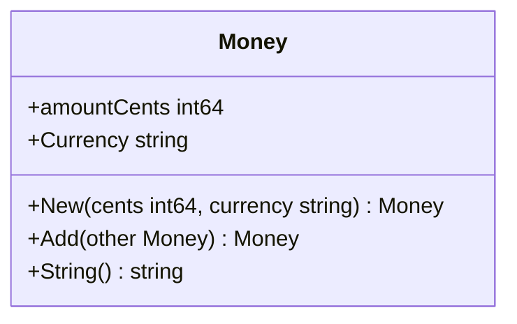
```mermaid
classDiagram
  class Money {
    +amountCents int64
    +Currency string
    +New(cents int64, currency string) Money
    +Add(other Money) Money
    +String() string
  }

  classDef blue fill:#0173B2,stroke:#000000,color:#FFFFFF,stroke-width:2px
  class Money:::blue
```




```go
// => Money wraps the primitive to prevent misuse at compile and runtime.
// => Exporting only the type, not the fields, forces callers through New().
type Money struct {
  // => amountCents stores value in smallest currency unit — avoids float rounding.
  // => int64 handles amounts up to ~92 quadrillion cents without overflow.
  amountCents int64
  // => Currency holds ISO 4217 three-letter code ("USD", "THB").
  Currency string
}

// => NewMoney is the sole construction path — validation happens once here.
// => Returning (Money, error) follows Go's explicit error idiom.
func NewMoney(cents int64, currency string) (Money, error) {
  // => Three-character check enforces ISO 4217 format at the boundary.
  // => Invalid currency never enters the domain after this point.
  if len(currency) != 3 {
    return Money{}, fmt.Errorf("currency must be 3 chars, got %q", currency)
  }
  // => Negative amounts are rejected — procurement deals in positive values.
  if cents < 0 {
    return Money{}, fmt.Errorf("amount must be non-negative, got %d", cents)
  }
  return Money{amountCents: cents, Currency: currency}, nil
}

// => Add returns a NEW Money — value receiver enforces immutability convention.
// => Error if currencies differ: adding USD to THB is always a domain error.
func (m Money) Add(other Money) (Money, error) {
  // => Currency check at add time prevents silent cross-currency totals.
  if m.Currency != other.Currency {
    return Money{}, fmt.Errorf("currency mismatch: %s + %s", m.Currency, other.Currency)
  }
  // => amountCents addition is exact — no floating-point drift.
  return Money{amountCents: m.amountCents + other.amountCents, Currency: m.Currency}, nil
}

// => String() formats for human display: "USD 10.50" (cents ÷ 100).
func (m Money) String() string {
  // => Divide by 100 for display only — internal representation stays in cents.
  return fmt.Sprintf("%s %.2f", m.Currency, float64(m.amountCents)/100)
}
```




```rust
// => Copy derive allows pass-by-value without explicit clone — money is cheap to copy.
// => PartialEq + Eq enables == operator for budget cap comparisons.
#[derive(Debug, Clone, Copy, PartialEq, Eq)]
pub struct Money {
  // => i64 matches Go's int64 — full range for procurement amounts.
  amount_cents: i64,
  // => &'static str ties currency to compile-time string literals ("USD", "THB").
  // => Static lifetime avoids heap allocation for a field that never changes at runtime.
  currency: &'static str,
}

// => MoneyError is an exhaustive enum — callers must handle every error variant.
#[derive(Debug)]
pub enum MoneyError {
  // => InvalidCurrency covers malformed ISO 4217 codes.
  InvalidCurrency,
  // => CurrencyMismatch covers addition of incompatible currencies.
  CurrencyMismatch,
  // => NegativeAmount covers construction with negative cents.
  NegativeAmount,
}

impl Money {
  // => Result<Self, MoneyError> is Rust's explicit error path — no panics.
  pub fn new(cents: i64, currency: &'static str) -> Result<Self, MoneyError> {
    // => Length check mirrors Go's validation — ISO 4217 requires exactly 3 chars.
    if currency.len() != 3 {
      return Err(MoneyError::InvalidCurrency);
    }
    if cents < 0 {
      return Err(MoneyError::NegativeAmount);
    }
    Ok(Self { amount_cents: cents, currency })
  }

  // => add consumes self by value — Copy trait means original is still usable.
  // => Result signals currency mismatch without panicking.
  pub fn add(self, other: Self) -> Result<Self, MoneyError> {
    // => String comparison safe for &'static str — pointer or byte equality both work.
    if self.currency != other.currency {
      return Err(MoneyError::CurrencyMismatch);
    }
    Ok(Self { amount_cents: self.amount_cents + other.amount_cents, currency: self.currency })
  }
}

// => Display trait provides .to_string() and format!("{}", money) support.
impl std::fmt::Display for Money {
  fn fmt(&self, f: &mut std::fmt::Formatter<'_>) -> std::fmt::Result {
    // => Same cents-to-display conversion as Go — divide by 100 at output time only.
    write!(f, "{} {:.2}", self.currency, self.amount_cents as f64 / 100.0)
  }
}
```




> **Key takeaway**: Wrap monetary primitives in a domain type with a validating constructor. Currency mismatches become caught errors, not silent data corruption.

---

### Example 2: PurchaseOrderId Newtype

Passing the wrong ID type to a function is a category of bug that raw strings enable and newtypes prevent. A function expecting `PurchaseOrderId` will reject a `SupplierId` at compile time if both are distinct named types, even though both wrap a UUID string underneath. In the procurement domain, IDs cross service and repository boundaries constantly — type safety here eliminates a whole class of routing errors.

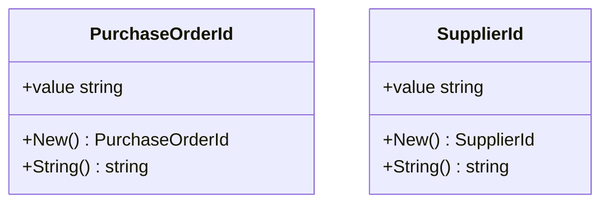
```mermaid
classDiagram
  class PurchaseOrderId {
    +value string
    +New() PurchaseOrderId
    +String() string
  }
  class SupplierId {
    +value string
    +New() SupplierId
    +String() string
  }

  classDef blue fill:#0173B2,stroke:#000000,color:#FFFFFF,stroke-width:2px
  classDef teal fill:#029E73,stroke:#000000,color:#FFFFFF,stroke-width:2px
  class PurchaseOrderId:::blue
  class SupplierId:::teal
```




```go
// => Named type over string — distinct type, not just an alias.
// => Go type aliases (type X = string) share the same type; named types do not.
type PurchaseOrderId string

// => NewPurchaseOrderId generates a new RFC-4122 v4 UUID.
// => Factory function is the only construction point — no raw string casts outside domain.
func NewPurchaseOrderId() PurchaseOrderId {
  // => uuid.New() from github.com/google/uuid — cryptographically random v4.
  // => .String() returns lowercase hyphenated form: "550e8400-e29b-41d4-a716-446655440000".
  return PurchaseOrderId(uuid.New().String())
}

// => String() satisfies fmt.Stringer — safe extraction for serialisation.
// => Callers must call .String() explicitly — no implicit unwrapping.
func (id PurchaseOrderId) String() string {
  return string(id)
}

// => SupplierId is a parallel newtype — same implementation, incompatible type.
// => func f(id PurchaseOrderId) won't accept SupplierId — compile error.
type SupplierId string

func NewSupplierId() SupplierId {
  // => Same uuid source — different type prevents ID swapping between aggregates.
  return SupplierId(uuid.New().String())
}

func (id SupplierId) String() string {
  return string(id)
}
```




```rust
// => Tuple struct wraps String — no field name, accessed as self.0.
// => Hash derive required for using PurchaseOrderId as map key.
#[derive(Debug, Clone, PartialEq, Eq, Hash)]
pub struct PurchaseOrderId(pub String);

impl PurchaseOrderId {
  // => new() hides uuid dependency — callers don't need to know the ID format.
  pub fn new() -> Self {
    // => uuid::Uuid::new_v4() generates a random v4 UUID.
    // => to_string() produces the standard hyphenated representation.
    Self(uuid::Uuid::new_v4().to_string())
  }
}

// => Display trait makes format!("{}", id) work cleanly in log messages.
impl std::fmt::Display for PurchaseOrderId {
  fn fmt(&self, f: &mut std::fmt::Formatter<'_>) -> std::fmt::Result {
    // => self.0 accesses the inner String of the tuple struct.
    write!(f, "{}", self.0)
  }
}

// => SupplierId is a separate newtype — incompatible with PurchaseOrderId.
// => The Rust compiler rejects passing SupplierId where PurchaseOrderId is expected.
#[derive(Debug, Clone, PartialEq, Eq, Hash)]
pub struct SupplierId(pub String);

impl SupplierId {
  pub fn new() -> Self {
    // => Identical implementation, different type — type safety without runtime cost.
    Self(uuid::Uuid::new_v4().to_string())
  }
}

impl std::fmt::Display for SupplierId {
  fn fmt(&self, f: &mut std::fmt::Formatter<'_>) -> std::fmt::Result {
    write!(f, "{}", self.0)
  }
}
```




> **Key takeaway**: Newtype wrappers around ID strings give the compiler enough information to reject ID swaps between aggregates — a zero-runtime-cost correctness guarantee.

---

### Example 3: POStatus Enumeration

All legal states of a purchase order should be explicit and exhaustive — no magic strings like `"approved"` that silently pass a typo through. Enumerating states as named constants (Go) or enum variants (Rust) forces every state-handling code path to be deliberate. In the procurement lifecycle, a PO moves from Draft through Submitted, ApprovalPending, Issued, Received, Paid, and optionally Cancelled or Disputed — each transition has preconditions enforced later by the aggregate root.

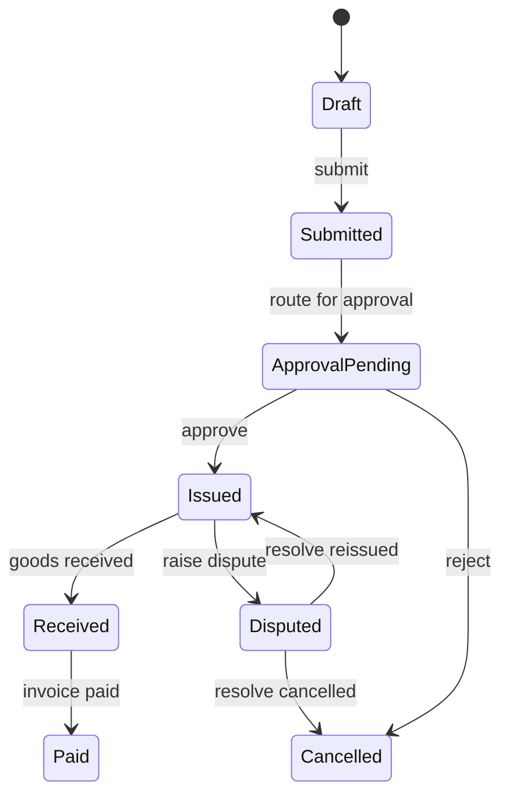
```mermaid
stateDiagram-v2
  [*] --> Draft
  Draft --> Submitted : submit
  Submitted --> ApprovalPending : route for approval
  ApprovalPending --> Issued : approve
  ApprovalPending --> Cancelled : reject
  Issued --> Received : goods received
  Received --> Paid : invoice paid
  Issued --> Disputed : raise dispute
  Disputed --> Cancelled : resolve cancelled
  Disputed --> Issued : resolve reissued
```




```go
// => Underlying int type gives compact in-memory representation.
// => Unexported iota values are zero-indexed — Draft == 0.
type POStatus int

const (
  // => iota auto-increments — Draft=0, Submitted=1, etc.
  // => Explicit first value documents that zero-value is Draft (safe default).
  Draft          POStatus = iota // 0
  Submitted                      // 1
  ApprovalPending                // 2
  Issued                         // 3
  Received                       // 4
  Paid                           // 5
  Cancelled                      // 6
  Disputed                       // 7
)

// => String() prevents "0" appearing in logs — human-readable status names.
// => Go lacks exhaustive match; a linter (exhaustive) should check switch completeness.
func (s POStatus) String() string {
  switch s {
  case Draft:
    return "Draft"
  case Submitted:
    return "Submitted"
  case ApprovalPending:
    return "ApprovalPending"
  case Issued:
    return "Issued"
  case Received:
    return "Received"
  case Paid:
    return "Paid"
  case Cancelled:
    return "Cancelled"
  case Disputed:
    return "Disputed"
  default:
    // => Default branch catches unknown values that could appear after deserialization.
    return fmt.Sprintf("POStatus(%d)", int(s))
  }
}
```




```rust
// => Rust enum is algebraic — match is exhaustive by default.
// => The compiler rejects a match expression missing any variant.
#[derive(Debug, Clone, Copy, PartialEq, Eq)]
pub enum POStatus {
  Draft,
  Submitted,
  ApprovalPending,
  Issued,
  Received,
  Paid,
  Cancelled,
  Disputed,
}

// => Display provides .to_string() and format!("{}", status) without extra crates.
impl std::fmt::Display for POStatus {
  fn fmt(&self, f: &mut std::fmt::Formatter<'_>) -> std::fmt::Result {
    // => match here is exhaustive — adding a new variant without updating this
    // => causes a compile error, unlike Go's switch with default fallthrough.
    let s = match self {
      POStatus::Draft          => "Draft",
      POStatus::Submitted      => "Submitted",
      POStatus::ApprovalPending => "ApprovalPending",
      POStatus::Issued         => "Issued",
      POStatus::Received       => "Received",
      POStatus::Paid           => "Paid",
      POStatus::Cancelled      => "Cancelled",
      POStatus::Disputed       => "Disputed",
    };
    write!(f, "{}", s)
  }
}
```




> **Key takeaway**: Enumerate domain states explicitly. Rust enforces exhaustive handling at compile time; Go requires a linter. Either way, magic strings are eliminated.

---

### Example 4: ApprovalLevel Value Object

Business rules that determine who must approve a purchase order — how many approvers, up to what budget — belong inside a value object constructor, not scattered across approval workflow code. An `ApprovalLevel` with an invalid tier or a zero budget cap should be impossible to construct. In the procurement domain, approval levels feed directly into the PO aggregate root's `Approve` method, which checks the budget cap before issuing the PO.

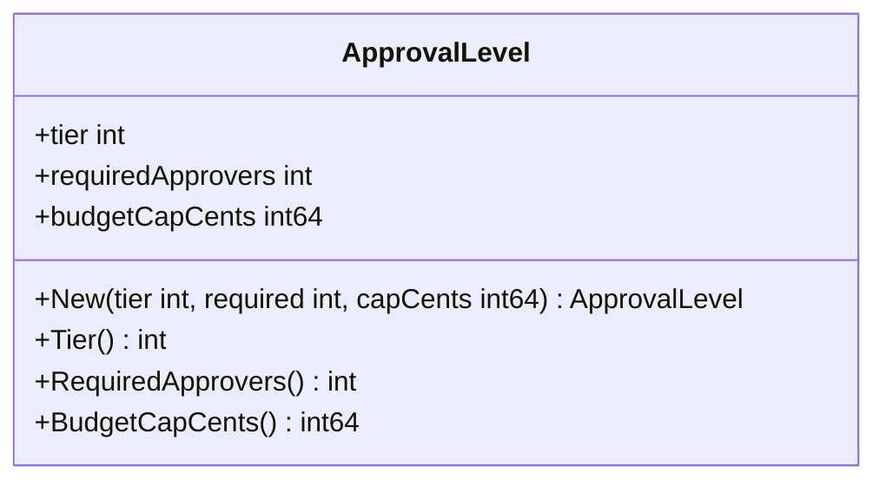
```mermaid
classDiagram
  class ApprovalLevel {
    +tier int
    +requiredApprovers int
    +budgetCapCents int64
    +New(tier int, required int, capCents int64) ApprovalLevel
    +Tier() int
    +RequiredApprovers() int
    +BudgetCapCents() int64
  }

  classDef orange fill:#DE8F05,stroke:#000000,color:#FFFFFF,stroke-width:2px
  class ApprovalLevel:::orange
```




```go
// => All fields unexported — callers cannot bypass validation by direct field assignment.
// => Accessors expose read-only view without allowing mutation.
type ApprovalLevel struct {
  tier              int
  requiredApprovers int
  // => budgetCapCents mirrors Money.amountCents — same unit, same precision.
  budgetCapCents    int64
}

// => NewApprovalLevel is the only valid construction path.
// => Validation at construction = impossible to have an invalid level inside the domain.
func NewApprovalLevel(tier, required int, capCents int64) (ApprovalLevel, error) {
  // => Tier 1-3 maps to department → VP → C-suite escalation path.
  if tier < 1 || tier > 3 {
    return ApprovalLevel{}, fmt.Errorf("tier must be 1-3, got %d", tier)
  }
  // => At least one approver required — zero would allow self-approval bypass.
  if required < 1 {
    return ApprovalLevel{}, fmt.Errorf("requiredApprovers must be >= 1, got %d", required)
  }
  // => Zero or negative cap is nonsensical for a budget ceiling.
  if capCents <= 0 {
    return ApprovalLevel{}, fmt.Errorf("budgetCapCents must be > 0, got %d", capCents)
  }
  return ApprovalLevel{tier: tier, requiredApprovers: required, budgetCapCents: capCents}, nil
}

// => Accessors provide read-only access — value object cannot mutate after construction.
func (a ApprovalLevel) Tier() int              { return a.tier }
func (a ApprovalLevel) RequiredApprovers() int { return a.requiredApprovers }
func (a ApprovalLevel) BudgetCapCents() int64  { return a.budgetCapCents }
```




```rust
// => All fields private — only new() can produce a valid ApprovalLevel.
pub struct ApprovalLevel {
  // => u8 prevents negative tier without an explicit negativity check.
  tier: u8,
  // => u8 for required_approvers — max 255 approvers is sufficient for any org.
  required_approvers: u8,
  // => i64 for budget_cap_cents — consistent with Money.amount_cents.
  budget_cap_cents: i64,
}

// => ApprovalLevelError enumerates all rejection reasons — exhaustive at call site.
#[derive(Debug)]
pub enum ApprovalLevelError {
  InvalidTier,
  InvalidRequiredApprovers,
  InvalidBudgetCap,
}

impl ApprovalLevel {
  pub fn new(tier: u8, required: u8, cap_cents: i64) -> Result<Self, ApprovalLevelError> {
    // => u8 already prevents negative — only upper bound needed.
    if tier < 1 || tier > 3 {
      return Err(ApprovalLevelError::InvalidTier);
    }
    // => u8 prevents negative; zero check still needed.
    if required < 1 {
      return Err(ApprovalLevelError::InvalidRequiredApprovers);
    }
    if cap_cents <= 0 {
      return Err(ApprovalLevelError::InvalidBudgetCap);
    }
    Ok(Self { tier, required_approvers: required, budget_cap_cents: cap_cents })
  }

  // => Accessor methods expose read-only view of private fields.
  pub fn tier(&self) -> u8              { self.tier }
  pub fn required_approvers(&self) -> u8 { self.required_approvers }
  pub fn budget_cap_cents(&self) -> i64  { self.budget_cap_cents }
}
```




> **Key takeaway**: Encode business rules inside value object constructors. An invalid `ApprovalLevel` becomes unrepresentable — the invariant is guaranteed by the type system, not by scattered runtime checks.

---

### Example 5: SupplierCode Validated Identifier

Domain identifiers often carry format rules — a `SupplierCode` in the procurement system uses a two-letter country prefix followed by a six-digit sequence (`TH-001234`). Parsing at the domain boundary ensures malformed codes never flow inward past the constructor. Once parsed, no re-validation is needed — the type itself is the proof of validity.

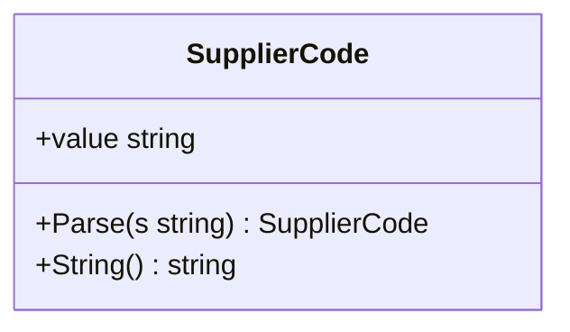
```mermaid
classDiagram
  class SupplierCode {
    +value string
    +Parse(s string) SupplierCode
    +String() string
  }

  classDef teal fill:#029E73,stroke:#000000,color:#FFFFFF,stroke-width:2px
  class SupplierCode:::teal
```




```go
// => Named string type — distinct from SupplierId and other string-based types.
type SupplierCode string

// => supplierCodePattern is compiled once at init time — not per call.
// => ^[A-Z]{2}-\d{6}$ means: two uppercase letters, hyphen, six digits, end.
var supplierCodePattern = regexp.MustCompile(`^[A-Z]{2}-\d{6}$`)

// => ParseSupplierCode validates at the boundary — rejects bad input here.
// => Returns (SupplierCode, error) following Go's explicit error convention.
func ParseSupplierCode(s string) (SupplierCode, error) {
  // => MatchString runs the pre-compiled regex — cheap after first call.
  if !supplierCodePattern.MatchString(s) {
    return "", fmt.Errorf("invalid supplier code format: %q (expected XX-######)", s)
  }
  // => Conversion is safe after validation — no further checks needed downstream.
  return SupplierCode(s), nil
}

// => String() enables fmt.Sprintf and logging without explicit casting.
func (c SupplierCode) String() string {
  return string(c)
}
```




```rust
// => Tuple struct — inner String is private; only parse() produces a valid SupplierCode.
pub struct SupplierCode(String);

#[derive(Debug)]
pub enum SupplierCodeError {
  // => InvalidFormat carries the rejected input for diagnostic messages.
  InvalidFormat(String),
}

impl SupplierCode {
  // => parse() is the validation gate — no other construction path exposed.
  pub fn parse(s: &str) -> Result<Self, SupplierCodeError> {
    // => Regex crate handles the pattern — once! macro compiles it once.
    // => once_cell or lazy_static are alternatives for avoiding re-compilation.
    let re = regex::Regex::new(r"^[A-Z]{2}-\d{6}$").unwrap();
    if !re.is_match(s) {
      return Err(SupplierCodeError::InvalidFormat(s.to_string()));
    }
    // => to_string() allocates — acceptable here since construction is infrequent.
    Ok(Self(s.to_string()))
  }
}

// => Display enables format!("{}", code) for log output.
impl std::fmt::Display for SupplierCode {
  fn fmt(&self, f: &mut std::fmt::Formatter<'_>) -> std::fmt::Result {
    // => self.0 accesses the inner String.
    write!(f, "{}", self.0)
  }
}
```




> **Key takeaway**: Parse domain identifiers at the boundary, not on every use. A successfully constructed `SupplierCode` is proof of validity — no downstream re-validation required.

---

## Value Objects (Examples 6–12)

### Example 6: Quantity with Unit of Measure

A number without a unit is a ticking ambiguity. Adding 10 kilograms to 10 pieces produces a nonsensical result that only manifests in a warehouse discrepancy or an incorrect invoice. Wrapping quantity and unit together, and rejecting mixed-unit arithmetic, encodes this domain rule at the type level.

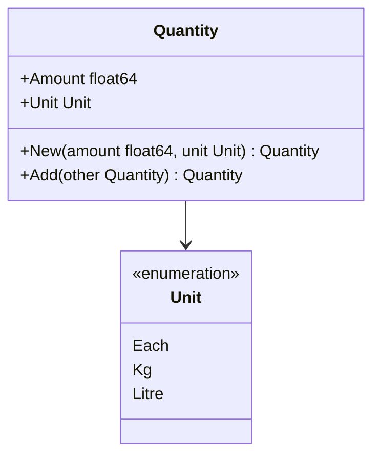
```mermaid
classDiagram
  class Quantity {
    +Amount float64
    +Unit Unit
    +New(amount float64, unit Unit) Quantity
    +Add(other Quantity) Quantity
  }
  class Unit {
    <<enumeration>>
    Each
    Kg
    Litre
  }
  Quantity --> Unit

  classDef blue fill:#0173B2,stroke:#000000,color:#FFFFFF,stroke-width:2px
  classDef orange fill:#DE8F05,stroke:#000000,color:#FFFFFF,stroke-width:2px
  class Quantity:::blue
  class Unit:::orange
```




```go
// => Unit is a named string type — readable in logs and serialization.
// => String-based enum avoids magic numbers while keeping interoperability.
type Unit string

const (
  // => UnitEach for countable discrete items (pens, chairs, servers).
  UnitEach  Unit = "each"
  // => UnitKg for bulk materials sold by weight.
  UnitKg    Unit = "kg"
  // => UnitLitre for liquids sold by volume.
  UnitLitre Unit = "litre"
)

// => Quantity bundles amount and unit — inseparable in the domain.
type Quantity struct {
  // => float64 acceptable for quantity — unlike money, small rounding is tolerable.
  Amount float64
  Unit   Unit
}

// => NewQuantity validates amount > 0 — negative or zero quantities are nonsensical.
func NewQuantity(amount float64, unit Unit) (Quantity, error) {
  if amount <= 0 {
    return Quantity{}, fmt.Errorf("quantity amount must be > 0, got %f", amount)
  }
  return Quantity{Amount: amount, Unit: unit}, nil
}

// => Add rejects mixed units — adding kg to each is a domain error, not a programmer error.
func (q Quantity) Add(other Quantity) (Quantity, error) {
  // => Unit comparison catches semantic mismatches before arithmetic.
  if q.Unit != other.Unit {
    return Quantity{}, fmt.Errorf("unit mismatch: %s + %s", q.Unit, other.Unit)
  }
  return Quantity{Amount: q.Amount + other.Amount, Unit: q.Unit}, nil
}
```




```rust
// => Rust enum is a natural fit for a closed set of units.
// => Exhaustive match means adding a new unit forces all switch sites to update.
#[derive(Debug, Clone, Copy, PartialEq, Eq)]
pub enum Unit { Each, Kg, Litre }

// => Decimal from rust_decimal avoids float drift for warehouse counts.
// => f64 accumulates error over many additions; Decimal does not.
#[derive(Debug, Clone, Copy)]
pub struct Quantity {
  amount: rust_decimal::Decimal,
  unit: Unit,
}

#[derive(Debug)]
pub enum QuantityError {
  // => NonPositiveAmount covers zero and negative amounts.
  NonPositiveAmount,
  // => UnitMismatch carries both units for diagnostic messages.
  UnitMismatch(Unit, Unit),
}

impl Quantity {
  pub fn new(amount: rust_decimal::Decimal, unit: Unit) -> Result<Self, QuantityError> {
    // => rust_decimal::Decimal supports comparison with literals via From trait.
    if amount <= rust_decimal::Decimal::ZERO {
      return Err(QuantityError::NonPositiveAmount);
    }
    Ok(Self { amount, unit })
  }

  // => add consumes self by value — Copy means original remains accessible.
  pub fn add(self, other: Self) -> Result<Self, QuantityError> {
    if self.unit != other.unit {
      // => Carry both units in the error — useful in diagnostic messages.
      return Err(QuantityError::UnitMismatch(self.unit, other.unit));
    }
    Ok(Self { amount: self.amount + other.amount, unit: self.unit })
  }
}
```




> **Key takeaway**: Bundle quantity and its unit of measure in a single value object. Unit-mismatch arithmetic becomes a caught domain error, not a silent numerical corruption.

---

### Example 7: LineItem Value Object

A line item aggregates the product description, quantity ordered, and unit price into a single coherent concept. Its total price — quantity times unit price — drives the purchase order value. Validating at construction (non-empty description, positive quantity) ensures no garbage line items enter the system.

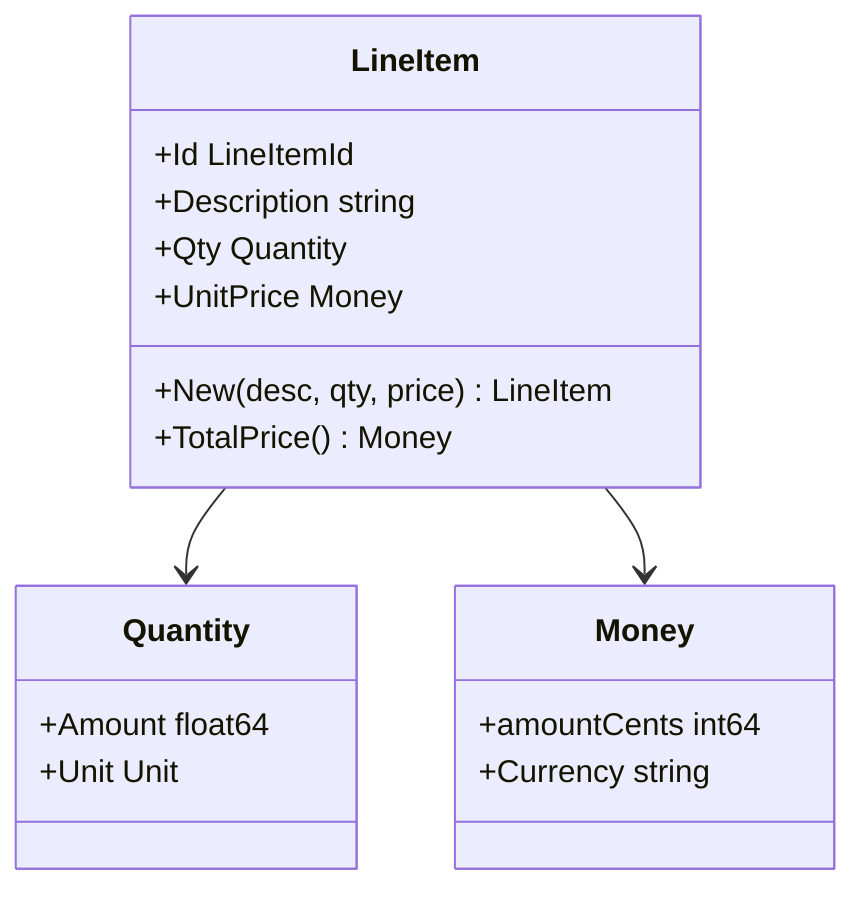
```mermaid
classDiagram
  class LineItem {
    +Id LineItemId
    +Description string
    +Qty Quantity
    +UnitPrice Money
    +New(desc, qty, price) LineItem
    +TotalPrice() Money
  }
  class Quantity {
    +Amount float64
    +Unit Unit
  }
  class Money {
    +amountCents int64
    +Currency string
  }
  LineItem --> Quantity
  LineItem --> Money

  classDef blue fill:#0173B2,stroke:#000000,color:#FFFFFF,stroke-width:2px
  classDef teal fill:#029E73,stroke:#000000,color:#FFFFFF,stroke-width:2px
  class LineItem:::blue
  class Quantity:::teal
  class Money:::teal
```




```go
// => LineItemId scopes the ID to line items — prevents swapping with other ID types.
type LineItemId string

// => LineItem is a value object: identity is by position in the PO, not by an entity ID.
// => The LineItemId field scopes uniqueness within the PO — not a global entity identity.
type LineItem struct {
  Id          LineItemId
  Description string
  Qty         Quantity
  UnitPrice   Money
}

// => NewLineItem validates inputs before construction — no invalid line items in domain.
func NewLineItem(desc string, qty Quantity, price Money) (LineItem, error) {
  // => Empty description is rejected — PO audits require identifiable line items.
  if strings.TrimSpace(desc) == "" {
    return LineItem{}, fmt.Errorf("line item description must not be empty")
  }
  // => Price currency must be set — zero money with empty currency is invalid.
  if price.Currency == "" {
    return LineItem{}, fmt.Errorf("line item unit price must have a currency")
  }
  return LineItem{
    // => uuid.New() generates a unique ID scoped to this line item.
    Id:          LineItemId(uuid.New().String()),
    Description: desc,
    Qty:         qty,
    UnitPrice:   price,
  }, nil
}

// => TotalPrice multiplies quantity by unit price — the key financial aggregate.
// => Returns (Money, error) because Multiply may return an error.
func (li LineItem) TotalPrice() (Money, error) {
  // => Multiply scales the unit price by the quantity amount.
  return li.UnitPrice.Multiply(li.Qty.Amount)
}
```




```rust
// => Tuple struct wraps String — same newtype pattern as other ID types.
#[derive(Debug, Clone, PartialEq, Eq)]
pub struct LineItemId(pub String);

// => LineItem owns all its fields — no references, no lifetime parameters needed.
#[derive(Debug, Clone)]
pub struct LineItem {
  pub id: LineItemId,
  pub description: String,
  pub qty: Quantity,
  pub unit_price: Money,
}

#[derive(Debug)]
pub enum LineItemError {
  EmptyDescription,
  MissingCurrency,
}

impl LineItem {
  pub fn new(desc: &str, qty: Quantity, unit_price: Money) -> Result<Self, LineItemError> {
    // => trim() removes leading/trailing whitespace before the emptiness check.
    if desc.trim().is_empty() {
      return Err(LineItemError::EmptyDescription);
    }
    Ok(Self {
      // => new_v4().to_string() scoped to line item — unique within the aggregate.
      id: LineItemId(uuid::Uuid::new_v4().to_string()),
      description: desc.to_string(),
      qty,
      unit_price,
    })
  }

  // => total_price borrows self — no ownership transfer needed for a calculation.
  pub fn total_price(&self) -> Result<Money, MoneyError> {
    // => multiply scales amount_cents by the quantity amount.
    self.unit_price.multiply(self.qty.amount())
  }
}
```




> **Key takeaway**: A `LineItem` is a value object that bundles the data needed to compute the PO's total value. Validation at construction eliminates invalid line items before they reach the aggregate.

---

### Example 8: Address Value Object

A delivery address is a value object — two addresses are equal if all their fields match, and there is no concept of "the same address updating its postal code." If the delivery address changes, a new `Address` value is created. Validating the ISO 3166-1 alpha-2 country code at construction prevents unmappable addresses from reaching the logistics subsystem.

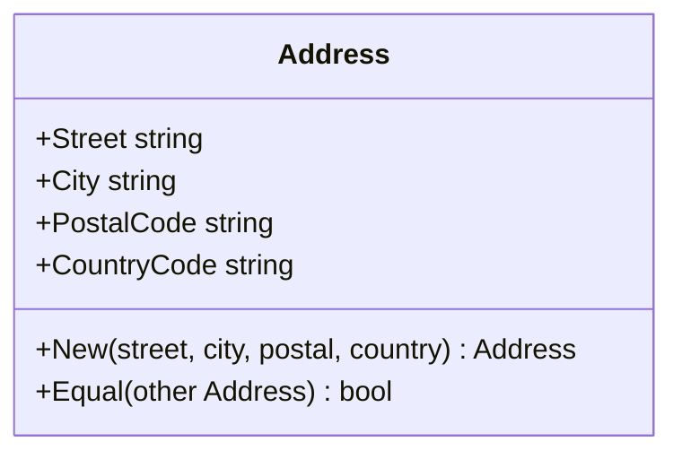
```mermaid
classDiagram
  class Address {
    +Street string
    +City string
    +PostalCode string
    +CountryCode string
    +New(street, city, postal, country) Address
    +Equal(other Address) bool
  }

  classDef purple fill:#CC78BC,stroke:#000000,color:#FFFFFF,stroke-width:2px
  class Address:::purple
```




```go
// => All fields exported — Address is a pure data container with no invariant methods.
// => CountryCode is the only validated field — other fields vary too much to validate generically.
type Address struct {
  Street      string
  City        string
  PostalCode  string
  // => CountryCode must be ISO 3166-1 alpha-2: "TH", "US", "GB", etc.
  CountryCode string
}

// => validCountryCodes is a sample set — in production, use a full ISO 3166 dataset.
var validCountryCodes = map[string]bool{
  "TH": true, "US": true, "GB": true, "SG": true, "MY": true,
}

// => NewAddress validates the country code — other fields trusted from the UI layer.
func NewAddress(street, city, postal, country string) (Address, error) {
  // => Two-character uppercase check is the first guard — before map lookup.
  if len(country) != 2 {
    return Address{}, fmt.Errorf("country code must be 2 chars, got %q", country)
  }
  // => Map lookup confirms the code is a known country.
  if !validCountryCodes[strings.ToUpper(country)] {
    return Address{}, fmt.Errorf("unknown country code: %q", country)
  }
  // => Street and city must not be empty — delivery cannot route to a blank address.
  if strings.TrimSpace(street) == "" || strings.TrimSpace(city) == "" {
    return Address{}, fmt.Errorf("street and city must not be empty")
  }
  return Address{Street: street, City: city, PostalCode: postal, CountryCode: strings.ToUpper(country)}, nil
}

// => Equal compares all fields — value object equality by structural comparison.
// => Go struct == works here because all fields are comparable strings.
func (a Address) Equal(other Address) bool {
  return a == other
}
```




```rust
// => PartialEq and Eq are derived — structural equality compares every field.
// => No need for a manual Equal method — == operator works via derive.
#[derive(Debug, Clone, PartialEq, Eq)]
pub struct Address {
  pub street: String,
  pub city: String,
  pub postal_code: String,
  // => country_code is always uppercase after construction — normalised at boundary.
  pub country_code: String,
}

#[derive(Debug)]
pub enum AddressError {
  InvalidCountryCode,
  EmptyStreetOrCity,
}

impl Address {
  pub fn new(street: &str, city: &str, postal: &str, country: &str) -> Result<Self, AddressError> {
    // => to_uppercase normalises before validation — "th" accepted as "TH".
    let cc = country.to_uppercase();
    if cc.len() != 2 {
      return Err(AddressError::InvalidCountryCode);
    }
    // => Sample set mirrors Go — production replaces with full ISO 3166-1 alpha-2 set.
    let valid = ["TH", "US", "GB", "SG", "MY"];
    if !valid.contains(&cc.as_str()) {
      return Err(AddressError::InvalidCountryCode);
    }
    if street.trim().is_empty() || city.trim().is_empty() {
      return Err(AddressError::EmptyStreetOrCity);
    }
    Ok(Self {
      street: street.to_string(),
      city: city.to_string(),
      postal_code: postal.to_string(),
      country_code: cc,
    })
  }
}
```




> **Key takeaway**: Address is a value object — structural equality across all fields. Country code validation at construction prevents unmappable delivery addresses from entering the domain.

---

### Example 9: DateRange Value Object

Procurement validity windows — PO expiry dates, delivery windows, contract periods — are naturally modelled as date ranges. A range where `start >= end` is nonsensical and should be rejected at construction. The `Contains` and `Overlaps` methods express business queries (is today within the delivery window? do two POs overlap?) as domain-layer operations rather than scattered date comparisons.

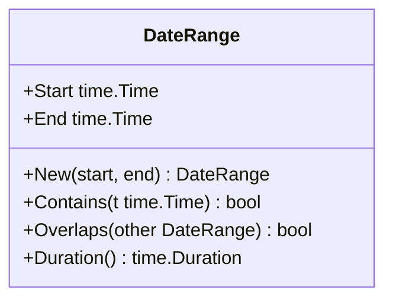
```mermaid
classDiagram
  class DateRange {
    +Start time.Time
    +End time.Time
    +New(start, end) DateRange
    +Contains(t time.Time) bool
    +Overlaps(other DateRange) bool
    +Duration() time.Duration
  }

  classDef brown fill:#CA9161,stroke:#000000,color:#FFFFFF,stroke-width:2px
  class DateRange:::brown
```




```go
// => time.Time fields — timezone-aware, suitable for cross-regional procurement.
type DateRange struct {
  Start time.Time
  End   time.Time
}

// => NewDateRange enforces start < end — an open or reversed range is invalid.
func NewDateRange(start, end time.Time) (DateRange, error) {
  // => After() not AfterOrEqual() — start and end cannot be the same instant.
  if !start.Before(end) {
    return DateRange{}, fmt.Errorf("start must be before end: %v >= %v", start, end)
  }
  return DateRange{Start: start, End: end}, nil
}

// => Contains checks whether a point in time falls within the range.
// => Used for: is today within the PO delivery window?
func (dr DateRange) Contains(t time.Time) bool {
  // => !t.Before(dr.Start) means t >= Start; t.Before(dr.End) means t < End.
  return !t.Before(dr.Start) && t.Before(dr.End)
}

// => Overlaps detects whether two ranges share any time — duplicate PO detection.
func (dr DateRange) Overlaps(other DateRange) bool {
  // => Two ranges overlap if neither ends before the other starts.
  return dr.Start.Before(other.End) && other.Start.Before(dr.End)
}

// => Duration returns the length of the range for SLA and reporting calculations.
func (dr DateRange) Duration() time.Duration {
  return dr.End.Sub(dr.Start)
}
```




```rust
// => chrono::NaiveDate used — no timezone for date-only ranges.
// => Use chrono::DateTime<Utc> if timestamp precision is needed.
use chrono::NaiveDate;

#[derive(Debug, Clone, Copy, PartialEq, Eq)]
pub struct DateRange {
  start: NaiveDate,
  end: NaiveDate,
}

#[derive(Debug)]
pub enum DateRangeError {
  // => StartNotBeforeEnd carries both dates for diagnostic messages.
  StartNotBeforeEnd { start: NaiveDate, end: NaiveDate },
}

impl DateRange {
  pub fn new(start: NaiveDate, end: NaiveDate) -> Result<Self, DateRangeError> {
    // => start < end enforced — equal dates mean zero-length range, also invalid.
    if start >= end {
      return Err(DateRangeError::StartNotBeforeEnd { start, end });
    }
    Ok(Self { start, end })
  }

  // => contains checks whether a date falls within [start, end).
  pub fn contains(&self, d: NaiveDate) -> bool {
    // => Half-open interval [start, end) — same semantics as Go's Contains.
    d >= self.start && d < self.end
  }

  // => overlaps detects shared interval — used for duplicate PO detection.
  pub fn overlaps(&self, other: &Self) -> bool {
    self.start < other.end && other.start < self.end
  }
}
```




> **Key takeaway**: Encode date range logic — contains, overlaps — inside the value object. Business queries on dates become domain-layer operations, not ad-hoc comparisons scattered across services.

---

### Example 10: Money Arithmetic Operations

A rich value object exposes domain-meaningful operations rather than forcing callers to perform arithmetic on the underlying representation. `Multiply` scales a unit price by a quantity. `GreaterThan` drives budget cap checks. `IsZero` validates that an invoice is not submitted for a zero amount. Centralising these in `Money` eliminates duplicated arithmetic across services and repositories.

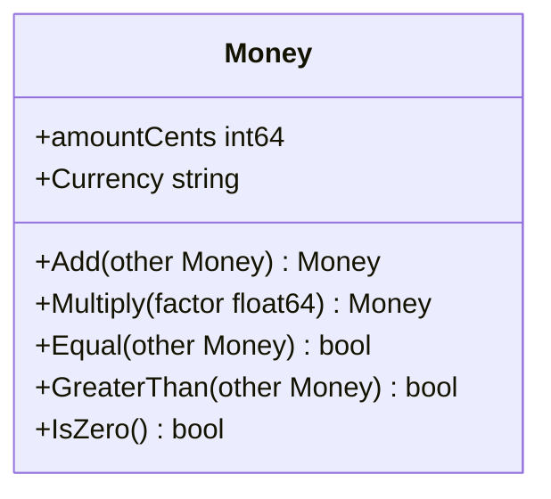
```mermaid
classDiagram
  class Money {
    +amountCents int64
    +Currency string
    +Add(other Money) Money
    +Multiply(factor float64) Money
    +Equal(other Money) bool
    +GreaterThan(other Money) bool
    +IsZero() bool
  }

  classDef blue fill:#0173B2,stroke:#000000,color:#FFFFFF,stroke-width:2px
  class Money:::blue
```




```go
// => Multiply scales money by a float factor — quantity × unit price.
// => Returns (Money, error) because negative factor is invalid.
func (m Money) Multiply(factor float64) (Money, error) {
  // => Negative factor would produce negative money — rejected.
  if factor < 0 {
    return Money{}, fmt.Errorf("multiply factor must be >= 0, got %f", factor)
  }
  // => Round to nearest cent after multiplication — prevents fractional cents.
  // => math.Round avoids truncation bias in accumulation scenarios.
  newCents := int64(math.Round(float64(m.amountCents) * factor))
  return Money{amountCents: newCents, Currency: m.Currency}, nil
}

// => Equal compares both amount and currency — two Money values are equal only if both match.
func (m Money) Equal(other Money) bool {
  return m.amountCents == other.amountCents && m.Currency == other.Currency
}

// => GreaterThan drives budget cap checks in the Approve transition.
// => Returns (bool, error) — comparing different currencies is an error.
func (m Money) GreaterThan(other Money) (bool, error) {
  if m.Currency != other.Currency {
    return false, fmt.Errorf("cannot compare %s and %s", m.Currency, other.Currency)
  }
  return m.amountCents > other.amountCents, nil
}

// => IsZero checks for a zero-value money amount — used in invoice validation.
func (m Money) IsZero() bool {
  return m.amountCents == 0
}
```




```rust
// => Rust operator overloading via std::ops::Add reduces noise in expressions.
// => Output type is Result<Self, MoneyError> — currency mismatch is an error.
impl std::ops::Add for Money {
  type Output = Result<Self, MoneyError>;
  fn add(self, other: Self) -> Self::Output {
    // => Delegate to the existing add method — no duplication.
    Money::add(self, other)
  }
}

impl Money {
  // => multiply scales amount_cents by a Decimal factor — no float drift.
  pub fn multiply(self, factor: rust_decimal::Decimal) -> Result<Self, MoneyError> {
    if factor < rust_decimal::Decimal::ZERO {
      return Err(MoneyError::NegativeAmount);
    }
    // => to_i64() converts Decimal back to integer cents after multiplication.
    // => unwrap_or(0) is safe because we validated factor >= 0.
    let new_cents = (rust_decimal::Decimal::from(self.amount_cents) * factor)
      .round()
      .to_i64()
      .unwrap_or(0);
    Ok(Self { amount_cents: new_cents, currency: self.currency })
  }

  // => PartialOrd derived would require PartialOrd on currency (&'static str).
  // => Explicit method avoids surprising ordering across currencies.
  pub fn greater_than(&self, other: &Self) -> Result<bool, MoneyError> {
    if self.currency != other.currency {
      return Err(MoneyError::CurrencyMismatch);
    }
    Ok(self.amount_cents > other.amount_cents)
  }

  // => is_zero used in invoice and PO validation — zero-value submissions are rejected.
  pub fn is_zero(&self) -> bool {
    self.amount_cents == 0
  }
}
```




> **Key takeaway**: Rich value objects centralise domain arithmetic. `GreaterThan` and `Multiply` on `Money` prevent ad-hoc arithmetic scattered across services, ensuring consistent currency handling everywhere.

---

### Example 11: Value Object Equality — No Identity

The key difference between a value object and an entity is equality semantics. Two `Money` values are equal when their amounts and currencies match — there is no "which Money object" concept. Two `Supplier` entities are the same only if their IDs match, regardless of other fields. Getting this wrong causes subtle bugs: comparing two entities by value may yield false positives when state diverges temporarily.

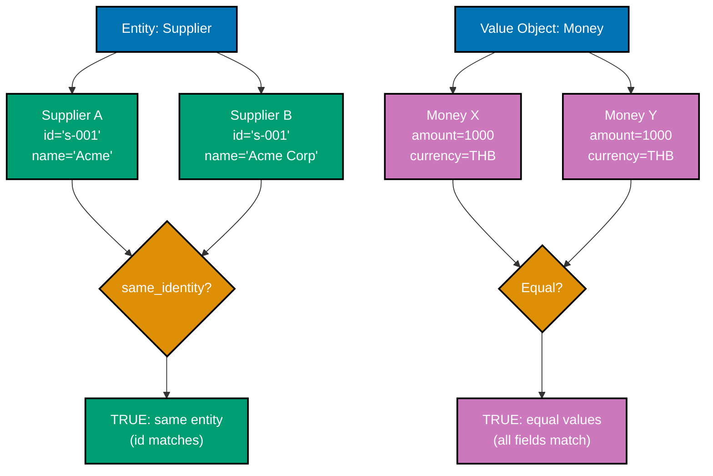
```mermaid
graph TD
  A["Entity: Supplier"]:::blue
  B["Supplier A\nid='s-001'\nname='Acme'"]:::teal
  C["Supplier B\nid='s-001'\nname='Acme Corp'"]:::teal
  D{"same_identity?"}:::orange
  E["TRUE: same entity\n#40;id matches#41;"]:::teal

  F["Value Object: Money"]:::blue
  G["Money X\namount=1000\ncurrency=THB"]:::purple
  H["Money Y\namount=1000\ncurrency=THB"]:::purple
  I{"Equal?"}:::orange
  J["TRUE: equal values\n#40;all fields match#41;"]:::purple

  A --> B
  A --> C
  B --> D
  C --> D
  D --> E

  F --> G
  F --> H
  G --> I
  H --> I
  I --> J

  classDef blue fill:#0173B2,stroke:#000000,color:#FFFFFF,stroke-width:2px
  classDef teal fill:#029E73,stroke:#000000,color:#FFFFFF,stroke-width:2px
  classDef orange fill:#DE8F05,stroke:#000000,color:#FFFFFF,stroke-width:2px
  classDef purple fill:#CC78BC,stroke:#000000,color:#FFFFFF,stroke-width:2px
```




```go
// => Money is a value object — Go's == works because all fields are comparable.
// => Two Money values with equal amountCents and Currency are identical.
m1, _ := NewMoney(1000, "THB")
m2, _ := NewMoney(1000, "THB")
// => m1 == m2 is true — no "object identity" in Go for structs passed by value.
fmt.Println(m1 == m2) // => Output: true

// => For value objects with slice fields, == does NOT work — use reflect.DeepEqual.
// => Prefer explicit Equal() methods for consistency across all value objects.
fmt.Println(m1.Equal(m2)) // => Output: true (via explicit method)

// => Supplier is an entity — equality is by ID, not by all fields.
// => Two Supplier values with same id but different Name are the SAME entity.
s1 := Supplier{id: "s-001", Name: "Acme"}
s2 := Supplier{id: "s-001", Name: "Acme Corp"}
// => s1 == s2 is FALSE in Go (Name differs) — do not use == for entities.
fmt.Println(s1 == s2) // => Output: false (wrong for entities!)
// => Use SameIdentity for entities — compares id only.
fmt.Println(s1.SameIdentity(&s2)) // => Output: true (correct entity comparison)
```




```rust
// => Money derives PartialEq — == compares all fields structurally.
// => This is correct because Money is a value object.
let m1 = Money::new(1000, "THB").unwrap();
let m2 = Money::new(1000, "THB").unwrap();
// => m1 == m2 is true — PartialEq derives field-by-field comparison.
assert!(m1 == m2); // => passes

// => Supplier does NOT derive PartialEq — entity comparison via same_identity only.
// => Not deriving PartialEq prevents accidentally treating two Suppliers
// => as equal just because their current state fields happen to match.
let s1 = Supplier::new(SupplierId("s-001".into()), "Acme".into(), /* ... */);
let s2 = Supplier::new(SupplierId("s-001".into()), "Acme Corp".into(), /* ... */);
// => s1 == s2 would not compile — Supplier does not implement PartialEq.
// => Use same_identity() — compares only the id field.
assert!(s1.same_identity(&s2)); // => passes: same id, different name
```




> **Key takeaway**: Value objects compare by all fields; entities compare by identity. In Rust, omitting `PartialEq` from entities makes incorrect comparisons a compile error. In Go, explicit `SameIdentity` methods enforce the convention.

---

### Example 12: Immutability by Convention (Go) and Enforcement (Rust)

Value objects must not mutate — returning a new value preserves the original and prevents aliasing bugs. Go enforces this by convention: value receivers copy the struct, so no method on a value receiver can mutate the caller's copy. Rust can enforce it structurally by consuming `self`, making the old binding unavailable after the call.

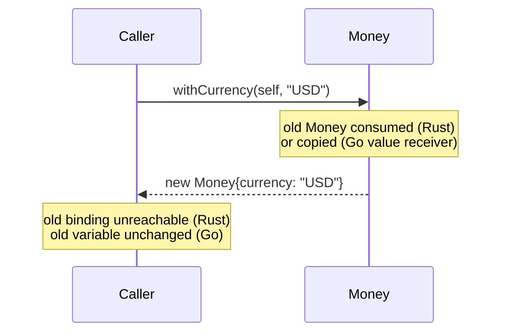
```mermaid
sequenceDiagram
  participant Caller
  participant Money

  Caller->>Money: withCurrency(self, "USD")
  Note over Money: old Money consumed (Rust)<br/>or copied (Go value receiver)
  Money-->>Caller: new Money{currency: "USD"}
  Note over Caller: old binding unreachable (Rust)<br/>old variable unchanged (Go)
```




```go
// => WithCurrency uses a VALUE receiver — Go copies the struct on call.
// => The original m is unchanged; a new Money is returned.
func (m Money) WithCurrency(c string) (Money, error) {
  // => Validate the new currency before constructing the new value.
  if len(c) != 3 {
    return Money{}, fmt.Errorf("currency must be 3 chars, got %q", c)
  }
  // => m is the copy — modifying it does not affect the caller's original.
  // => Return the modified copy as a new Money value.
  m.Currency = c
  return m, nil
}

// => Demonstration: original is unchanged after WithCurrency.
original, _ := NewMoney(500, "THB")
converted, _ := original.WithCurrency("USD")
// => original.Currency is still "THB" — value receiver copied it.
fmt.Println(original.Currency)  // => Output: THB
fmt.Println(converted.Currency) // => Output: USD
```




```rust
impl Money {
  // => with_currency consumes self — the old Money is moved into the function.
  // => Caller cannot use the old binding after this call (compile error if attempted).
  pub fn with_currency(self, c: &'static str) -> Result<Self, MoneyError> {
    if c.len() != 3 {
      return Err(MoneyError::InvalidCurrency);
    }
    // => self is moved here — original binding is gone after this expression.
    Ok(Self { currency: c, ..self })
  }
}

// => Demonstration: compiler enforces that old is not used after with_currency.
let old = Money::new(500, "THB").unwrap();
let new_money = old.with_currency("USD").unwrap();
// => println!("{}", old) would not compile — old was moved into with_currency.
// => This is stronger than Go's convention: Rust makes misuse a compile error.
println!("{}", new_money); // => Output: USD 5.00
```




> **Key takeaway**: Go value receivers copy the struct, enforcing immutability by convention. Rust consuming `self` makes it a compile error to use the old value after a transformation — a stronger guarantee with no runtime cost.

---

## Entities (Examples 13–17)

### Example 13: Supplier Entity

Entities have identity — two `Supplier` records are the same supplier as long as their IDs match, even if the name changes over time. This is the fundamental difference from value objects. Pointer receivers in Go signal that the struct is mutable (entities have lifecycle); value receivers signal immutable value objects. In the procurement domain, a supplier can be deactivated, renamed, or have its contact updated — all while remaining the same entity.

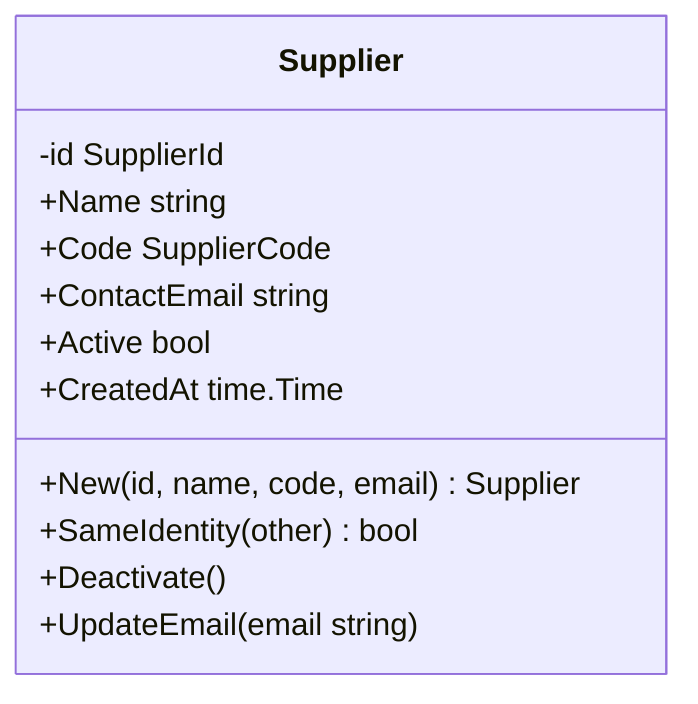
```mermaid
classDiagram
  class Supplier {
    -id SupplierId
    +Name string
    +Code SupplierCode
    +ContactEmail string
    +Active bool
    +CreatedAt time.Time
    +New(id, name, code, email) Supplier
    +SameIdentity(other) bool
    +Deactivate()
    +UpdateEmail(email string)
  }

  classDef teal fill:#029E73,stroke:#000000,color:#FFFFFF,stroke-width:2px
  class Supplier:::teal
```




```go
// => Unexported id field — identity is set at construction and never changed externally.
// => Exported Name, ContactEmail — mutable entity state that changes over lifecycle.
type Supplier struct {
  id           SupplierId
  Name         string
  Code         SupplierCode
  ContactEmail string
  Active       bool
  CreatedAt    time.Time
}

// => NewSupplier creates a new Supplier with a validated initial state.
// => Returns *Supplier (pointer) — entity mutations require pointer receiver methods.
func NewSupplier(id SupplierId, name string, code SupplierCode, email string) (*Supplier, error) {
  // => Name must be non-empty — a nameless supplier cannot be identified on documents.
  if strings.TrimSpace(name) == "" {
    return nil, fmt.Errorf("supplier name must not be empty")
  }
  return &Supplier{
    id:           id,
    Name:         name,
    Code:         code,
    ContactEmail: email,
    // => Active defaults to true — new suppliers are active unless explicitly deactivated.
    Active:    true,
    CreatedAt: time.Now(),
  }, nil
}

// => SameIdentity compares IDs only — not current Name or state.
// => Two Supplier pointers with the same id ARE the same entity.
func (s *Supplier) SameIdentity(other *Supplier) bool {
  return s.id == other.id
}

// => Deactivate uses a POINTER receiver — mutates the entity state in place.
// => Value receiver would mutate only the copy, leaving the original unchanged.
func (s *Supplier) Deactivate() {
  // => Active = false marks the supplier unavailable for new POs.
  s.Active = false
}

// => UpdateEmail is a domain operation — encapsulates the state change.
// => Pointer receiver ensures the change persists on the caller's instance.
func (s *Supplier) UpdateEmail(email string) error {
  if strings.TrimSpace(email) == "" {
    return fmt.Errorf("contact email must not be empty")
  }
  s.ContactEmail = email
  return nil
}

// => Id() exposes the private id for repository lookups — read-only accessor.
func (s *Supplier) Id() SupplierId {
  return s.id
}
```




```rust
use chrono::{DateTime, Utc};

// => Supplier does NOT derive PartialEq — entity comparison is by id only.
// => Deriving it would compare all fields, making state-changed suppliers unequal.
#[derive(Debug)]
pub struct Supplier {
  // => id is private — set at construction, never changed.
  id: SupplierId,
  // => Public fields allow mutation via &mut self methods.
  pub name: String,
  pub code: SupplierCode,
  pub contact_email: String,
  pub active: bool,
  pub created_at: DateTime<Utc>,
}

impl Supplier {
  pub fn new(
    id: SupplierId,
    name: String,
    code: SupplierCode,
    email: String,
  ) -> Result<Self, SupplierError> {
    if name.trim().is_empty() {
      return Err(SupplierError::EmptyName);
    }
    Ok(Self {
      id,
      name,
      code,
      contact_email: email,
      // => Active defaults to true — new suppliers are available immediately.
      active: true,
      created_at: Utc::now(),
    })
  }

  // => same_identity borrows both — no ownership transfer needed for ID comparison.
  pub fn same_identity(&self, other: &Self) -> bool {
    // => ID comparison only — name change does not affect identity.
    self.id == other.id
  }

  // => deactivate takes &mut self — in-place mutation of the active flag.
  // => Caller must hold a mutable reference to the Supplier.
  pub fn deactivate(&mut self) {
    self.active = false;
  }

  // => update_email validates before mutating — domain rule enforced in entity method.
  pub fn update_email(&mut self, email: String) -> Result<(), SupplierError> {
    if email.trim().is_empty() {
      return Err(SupplierError::EmptyEmail);
    }
    self.contact_email = email;
    Ok(())
  }

  // => id() accessor exposes the private field for repository lookups.
  pub fn id(&self) -> &SupplierId {
    &self.id
  }
}
```




> **Key takeaway**: Entities have a stable identity that persists through state changes. Pointer receivers in Go and `&mut self` in Rust signal mutable entity lifecycle; `SameIdentity` / `same_identity` enforce correct equality semantics.

---

### Example 14: Entity vs Value Object Distinction

The entity/value-object distinction drives every downstream design decision in DDD. Entities have lifecycle and mutable state; value objects are immutable snapshots interchangeable with any equal value. Getting the distinction wrong — treating a `Supplier` as a value object and comparing it by all fields — causes subtle identity bugs when state diverges between two references to the same entity.

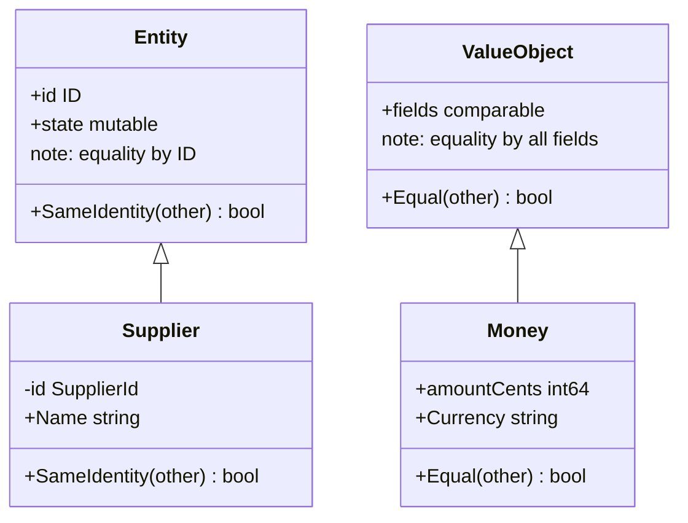
```mermaid
classDiagram
  class Entity {
    +id ID
    +state mutable
    +SameIdentity(other) bool
    note: equality by ID
  }
  class ValueObject {
    +fields comparable
    +Equal(other) bool
    note: equality by all fields
  }
  class Supplier {
    -id SupplierId
    +Name string
    +SameIdentity(other) bool
  }
  class Money {
    +amountCents int64
    +Currency string
    +Equal(other) bool
  }
  Entity <|-- Supplier
  ValueObject <|-- Money

  classDef blue fill:#0173B2,stroke:#000000,color:#FFFFFF,stroke-width:2px
  classDef teal fill:#029E73,stroke:#000000,color:#FFFFFF,stroke-width:2px
  classDef orange fill:#DE8F05,stroke:#000000,color:#FFFFFF,stroke-width:2px
  class Entity:::blue
  class ValueObject:::orange
  class Supplier:::teal
  class Money:::teal
```




```go
// => Entity: Supplier has an id field — identity comparison by id only.
// => Pointer receivers throughout signal mutable lifecycle.
s1 := &Supplier{id: "s-001", Name: "Acme"}
s2 := &Supplier{id: "s-001", Name: "Acme Corp"}
// => SameIdentity returns true — same supplier, different name at different points in time.
fmt.Println(s1.SameIdentity(s2)) // => Output: true

// => Value object: Money has no id — equality by amountCents + Currency.
// => Value receivers throughout signal immutable snapshot semantics.
m1, _ := NewMoney(500, "THB")
m2, _ := NewMoney(500, "THB")
// => Go struct == works for comparable structs — no explicit Equal needed.
fmt.Println(m1 == m2) // => Output: true

// => Convention in Go: pointer receiver = entity, value receiver = value object.
// => This is a code-reading signal, not enforced by the compiler.
// => Pointer receiver enables mutation; value receiver guarantees copy semantics.
```




```rust
// => Entity: Supplier does NOT derive PartialEq — identity comparison only.
// => If PartialEq were derived, two Suppliers with same id but different name
// => would compare as NOT equal — wrong semantics for an entity.
let s1 = Supplier { id: SupplierId("s-001".into()), name: "Acme".into(), /* ... */ };
let s2 = Supplier { id: SupplierId("s-001".into()), name: "Acme Corp".into(), /* ... */ };
// => s1 == s2 would NOT compile — Supplier has no PartialEq impl.
// => same_identity() is the only correct comparison path for entities.
assert!(s1.same_identity(&s2)); // => passes: id matches

// => Value object: Money derives PartialEq — == compares all fields.
// => Deriving PartialEq is correct and safe for value objects.
let m1 = Money::new(500, "THB").unwrap();
let m2 = Money::new(500, "THB").unwrap();
// => m1 == m2 compiles and returns true — structural equality.
assert!(m1 == m2); // => passes

// => Summary: derive PartialEq for value objects; omit it for entities.
// => This is a Rust-idiomatic encoding of the DDD entity/value-object boundary.
```




> **Key takeaway**: Entities compare by identity; value objects compare by all fields. In Rust, omitting `PartialEq` from entity structs makes incorrect structural comparisons a compile error.

---

### Example 15: PurchaseOrder Entity (Basic Structure)

A `PurchaseOrder` is an entity with a rich lifecycle — it progresses through states, accumulates line items, and references a supplier by ID. Storing a `SupplierId` (not a `*Supplier` pointer) enforces the DDD rule that cross-aggregate references must be by identity only. No external code should interact with `LineItems` directly — all mutations route through the aggregate root's methods.

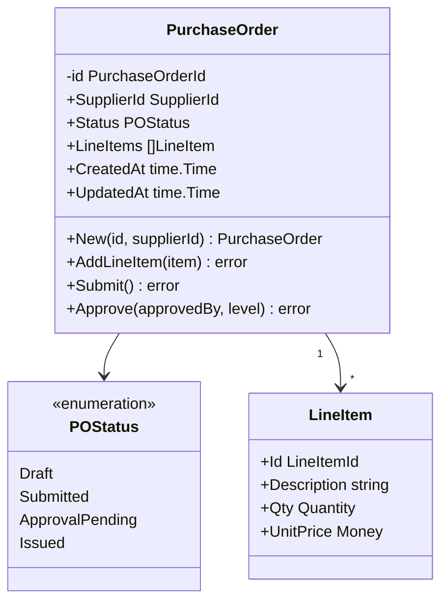
```mermaid
classDiagram
  class PurchaseOrder {
    -id PurchaseOrderId
    +SupplierId SupplierId
    +Status POStatus
    +LineItems []LineItem
    +CreatedAt time.Time
    +UpdatedAt time.Time
    +New(id, supplierId) PurchaseOrder
    +AddLineItem(item) error
    +Submit() error
    +Approve(approvedBy, level) error
  }
  class POStatus {
    <<enumeration>>
    Draft
    Submitted
    ApprovalPending
    Issued
  }
  class LineItem {
    +Id LineItemId
    +Description string
    +Qty Quantity
    +UnitPrice Money
  }
  PurchaseOrder --> POStatus
  PurchaseOrder "1" --> "*" LineItem

  classDef blue fill:#0173B2,stroke:#000000,color:#FFFFFF,stroke-width:2px
  classDef orange fill:#DE8F05,stroke:#000000,color:#FFFFFF,stroke-width:2px
  classDef teal fill:#029E73,stroke:#000000,color:#FFFFFF,stroke-width:2px
  class PurchaseOrder:::blue
  class POStatus:::orange
  class LineItem:::teal
```




```go
// => PurchaseOrder is the aggregate root — all mutations route through its methods.
// => id is unexported — set at construction, immutable thereafter.
type PurchaseOrder struct {
  id         PurchaseOrderId
  // => SupplierId is exported for read access — cross-aggregate reference by ID only.
  // => No *Supplier field — DDD prohibits cross-aggregate object references.
  SupplierId SupplierId
  // => Status starts as Draft — only valid initial state.
  Status     POStatus
  // => LineItems owned by PO — no external code mutates this slice directly.
  LineItems  []LineItem
  CreatedAt  time.Time
  // => UpdatedAt tracks the last mutation — set on every state-changing method.
  UpdatedAt  time.Time
}

// => NewPurchaseOrder creates a Draft PO — the only valid initial state.
// => No line items at construction — they are added via AddLineItem.
func NewPurchaseOrder(id PurchaseOrderId, supplierID SupplierId) *PurchaseOrder {
  now := time.Now()
  return &PurchaseOrder{
    id:         id,
    SupplierId: supplierID,
    // => Draft is the only valid starting status — no other entry point.
    Status:     Draft,
    LineItems:  []LineItem{},
    CreatedAt:  now,
    UpdatedAt:  now,
  }
}

// => Id() exposes the private id — needed by repositories and event publishers.
func (po *PurchaseOrder) Id() PurchaseOrderId {
  return po.id
}
```




```rust
use chrono::{DateTime, Utc};

pub struct PurchaseOrder {
  // => id is private — immutable after construction.
  id: PurchaseOrderId,
  // => supplier_id is a reference by value — no pointer to the Supplier aggregate.
  pub supplier_id: SupplierId,
  // => status tracks the PO lifecycle — transitions enforced by methods.
  pub status: POStatus,
  // => line_items is owned by PurchaseOrder — no external &mut references.
  pub line_items: Vec<LineItem>,
  pub created_at: DateTime<Utc>,
  // => updated_at is set on every mutating method — audit trail.
  pub updated_at: DateTime<Utc>,
}

impl PurchaseOrder {
  // => new() returns Self (owned value) — caller decides whether to box or store inline.
  pub fn new(id: PurchaseOrderId, supplier_id: SupplierId) -> Self {
    let now = Utc::now();
    Self {
      id,
      supplier_id,
      // => Draft is the only valid initial status.
      status: POStatus::Draft,
      // => Empty Vec — line items are added via add_line_item.
      line_items: Vec::new(),
      created_at: now,
      updated_at: now,
    }
  }

  // => id() borrows self — returns a reference to avoid cloning the inner String.
  pub fn id(&self) -> &PurchaseOrderId {
    &self.id
  }
}
```




> **Key takeaway**: The `PurchaseOrder` aggregate root owns its `LineItems` and holds only a `SupplierId` reference across the aggregate boundary. All mutations route through its exported methods — no direct field manipulation from outside.

---

### Example 16: GoodReceiptNote Entity

A Good Receipt Note records the physical arrival of goods — it is a separate entity from the purchase order that triggered the delivery. The GRN references the PO by `PurchaseOrderId` only, following the DDD rule against cross-aggregate object references. The three-way match (PO line items vs GRN received items vs invoice amounts) is the core financial control in the procurement domain.

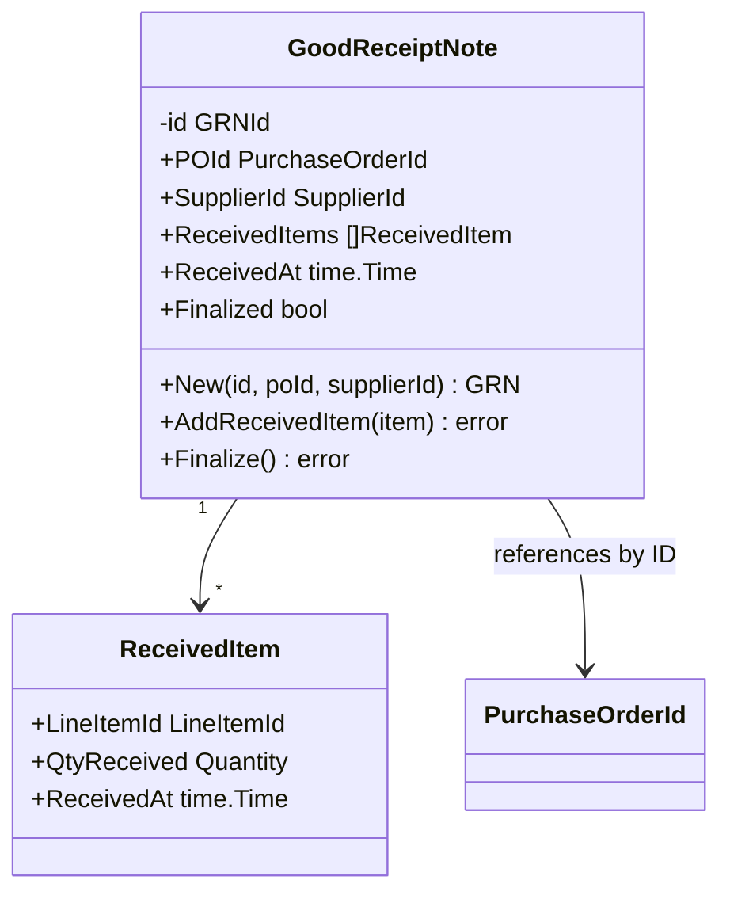
```mermaid
classDiagram
  class GoodReceiptNote {
    -id GRNId
    +POId PurchaseOrderId
    +SupplierId SupplierId
    +ReceivedItems []ReceivedItem
    +ReceivedAt time.Time
    +Finalized bool
    +New(id, poId, supplierId) GRN
    +AddReceivedItem(item) error
    +Finalize() error
  }
  class ReceivedItem {
    +LineItemId LineItemId
    +QtyReceived Quantity
    +ReceivedAt time.Time
  }
  GoodReceiptNote "1" --> "*" ReceivedItem
  GoodReceiptNote --> PurchaseOrderId : references by ID

  classDef blue fill:#0173B2,stroke:#000000,color:#FFFFFF,stroke-width:2px
  classDef teal fill:#029E73,stroke:#000000,color:#FFFFFF,stroke-width:2px
  class GoodReceiptNote:::blue
  class ReceivedItem:::teal
```




```go
// => GRNId scopes the identity to good receipt notes.
type GRNId string

// => ReceivedItem records what actually arrived for a given line item.
// => QtyReceived may differ from PO quantity — partial deliveries are common.
type ReceivedItem struct {
  // => LineItemId links back to the PO line item for three-way match.
  LineItemId  LineItemId
  QtyReceived Quantity
  ReceivedAt  time.Time
}

// => GoodReceiptNote references PO and Supplier by ID — no cross-aggregate pointers.
type GoodReceiptNote struct {
  id           GRNId
  // => POId links to the originating PO without importing the PO aggregate.
  POId         PurchaseOrderId
  SupplierId   SupplierId
  ReceivedItems []ReceivedItem
  ReceivedAt   time.Time
  // => Finalized = true means no more items can be added — receipt is closed.
  Finalized    bool
}

func NewGoodReceiptNote(id GRNId, poID PurchaseOrderId, supplierID SupplierId) *GoodReceiptNote {
  return &GoodReceiptNote{
    id:           id,
    POId:         poID,
    SupplierId:   supplierID,
    ReceivedItems: []ReceivedItem{},
    ReceivedAt:   time.Now(),
    Finalized:    false,
  }
}

// => AddReceivedItem rejects additions to a finalized GRN.
func (g *GoodReceiptNote) AddReceivedItem(item ReceivedItem) error {
  if g.Finalized {
    // => Finalized GRN is immutable — prevents post-close modifications.
    return fmt.Errorf("cannot add items to a finalized GRN")
  }
  g.ReceivedItems = append(g.ReceivedItems, item)
  return nil
}

// => Finalize closes the GRN — triggers three-way match in the application layer.
func (g *GoodReceiptNote) Finalize() error {
  if len(g.ReceivedItems) == 0 {
    return fmt.Errorf("cannot finalize a GRN with no received items")
  }
  g.Finalized = true
  return nil
}
```




```rust
#[derive(Debug, Clone, PartialEq, Eq)]
pub struct GrnId(pub String);

// => ReceivedItem records actual delivery — may differ from ordered quantity.
#[derive(Debug, Clone)]
pub struct ReceivedItem {
  // => line_item_id links back to PO for three-way match reconciliation.
  pub line_item_id: LineItemId,
  pub qty_received: Quantity,
  pub received_at: DateTime<Utc>,
}

// => GoodReceiptNote does not derive PartialEq — entity, compared by id.
#[derive(Debug)]
pub struct GoodReceiptNote {
  id: GrnId,
  // => po_id is a value — no reference to the PurchaseOrder aggregate.
  pub po_id: PurchaseOrderId,
  pub supplier_id: SupplierId,
  pub received_items: Vec<ReceivedItem>,
  pub received_at: DateTime<Utc>,
  pub finalized: bool,
}

#[derive(Debug)]
pub enum GrnError {
  AlreadyFinalized,
  NoItemsToFinalize,
}

impl GoodReceiptNote {
  pub fn new(id: GrnId, po_id: PurchaseOrderId, supplier_id: SupplierId) -> Self {
    Self {
      id,
      po_id,
      supplier_id,
      received_items: Vec::new(),
      received_at: Utc::now(),
      finalized: false,
    }
  }

  pub fn add_received_item(&mut self, item: ReceivedItem) -> Result<(), GrnError> {
    // => Mutable method guard — finalized GRN cannot accept new items.
    if self.finalized {
      return Err(GrnError::AlreadyFinalized);
    }
    self.received_items.push(item);
    Ok(())
  }

  pub fn finalize(&mut self) -> Result<(), GrnError> {
    if self.received_items.is_empty() {
      return Err(GrnError::NoItemsToFinalize);
    }
    // => finalized = true prevents further mutations.
    self.finalized = true;
    Ok(())
  }
}
```




> **Key takeaway**: The GRN is a separate entity from the PO, linked by `PurchaseOrderId` only. `Finalized` is an invariant enforced by the entity's mutation methods — no external code can bypass it.

---

### Example 17: Invoice Entity

An invoice represents the supplier's payment claim and has its own lifecycle independent from the PO that authorised the spend. The invoice references the PO by ID (cross-aggregate boundary), carries the claimed amount, and tracks its own status from Draft through Approved to Paid or Rejected. The `SubmittedAt` optional timestamp records when the invoice entered the approval queue.

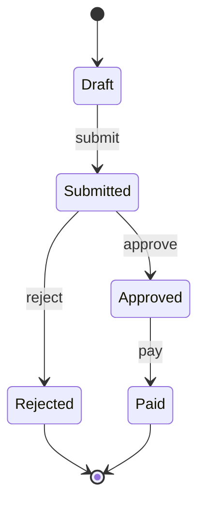
```mermaid
stateDiagram-v2
  [*] --> Draft
  Draft --> Submitted : submit
  Submitted --> Approved : approve
  Submitted --> Rejected : reject
  Approved --> Paid : pay
  Rejected --> [*]
  Paid --> [*]
```




```go
// => InvoiceId scopes identity to invoices — separate from PO and GRN IDs.
type InvoiceId string

// => InvoiceStatus tracks payment lifecycle — separate from POStatus.
type InvoiceStatus int

const (
  InvoiceDraft     InvoiceStatus = iota // 0
  InvoiceSubmitted                      // 1
  InvoiceApproved                       // 2
  InvoicePaid                           // 3
  InvoiceRejected                       // 4
)

// => Invoice references PO by ID — no cross-aggregate object reference.
type Invoice struct {
  id          InvoiceId
  // => POId links invoice to originating PO for three-way match.
  POId        PurchaseOrderId
  SupplierId  SupplierId
  // => Amount is the total invoice value — subject to three-way match check.
  Amount      Money
  DueDate     time.Time
  Status      InvoiceStatus
  // => SubmittedAt is nil until Submit() is called — pointer for optional time.
  SubmittedAt *time.Time
}

func NewInvoice(id InvoiceId, poID PurchaseOrderId, supplierID SupplierId, amount Money, dueDate time.Time) (*Invoice, error) {
  // => Zero-amount invoice is rejected — nothing to pay.
  if amount.IsZero() {
    return nil, fmt.Errorf("invoice amount must not be zero")
  }
  return &Invoice{
    id:         id,
    POId:       poID,
    SupplierId: supplierID,
    Amount:     amount,
    DueDate:    dueDate,
    // => InvoiceDraft is the only valid initial status.
    Status:     InvoiceDraft,
  }, nil
}

// => Submit transitions the invoice from Draft to Submitted.
// => Records SubmittedAt timestamp for SLA tracking.
func (inv *Invoice) Submit() error {
  if inv.Status != InvoiceDraft {
    return fmt.Errorf("can only submit a Draft invoice, current status: %d", inv.Status)
  }
  now := time.Now()
  inv.SubmittedAt = &now
  inv.Status = InvoiceSubmitted
  return nil
}
```




```rust
#[derive(Debug, Clone, PartialEq, Eq)]
pub struct InvoiceId(pub String);

// => InvoiceStatus is a separate enum from POStatus — independent lifecycle.
#[derive(Debug, Clone, Copy, PartialEq, Eq)]
pub enum InvoiceStatus { Draft, Submitted, Approved, Paid, Rejected }

// => Invoice does not derive PartialEq — entity, compared by id only.
#[derive(Debug)]
pub struct Invoice {
  id: InvoiceId,
  // => po_id is a value — not a reference to the PurchaseOrder aggregate.
  pub po_id: PurchaseOrderId,
  pub supplier_id: SupplierId,
  pub amount: Money,
  pub due_date: chrono::NaiveDate,
  pub status: InvoiceStatus,
  // => Option<DateTime<Utc>> = None until Submit() is called.
  pub submitted_at: Option<DateTime<Utc>>,
}

#[derive(Debug)]
pub enum InvoiceError {
  ZeroAmount,
  InvalidStatusTransition { current: InvoiceStatus },
}

impl Invoice {
  pub fn new(
    id: InvoiceId,
    po_id: PurchaseOrderId,
    supplier_id: SupplierId,
    amount: Money,
    due_date: chrono::NaiveDate,
  ) -> Result<Self, InvoiceError> {
    if amount.is_zero() {
      return Err(InvoiceError::ZeroAmount);
    }
    Ok(Self {
      id, po_id, supplier_id, amount, due_date,
      status: InvoiceStatus::Draft,
      // => None until submit() is called — type system documents optionality.
      submitted_at: None,
    })
  }

  pub fn submit(&mut self) -> Result<(), InvoiceError> {
    if self.status != InvoiceStatus::Draft {
      return Err(InvoiceError::InvalidStatusTransition { current: self.status });
    }
    // => Some(Utc::now()) records the submission timestamp.
    self.submitted_at = Some(Utc::now());
    self.status = InvoiceStatus::Submitted;
    Ok(())
  }
}
```




> **Key takeaway**: `Invoice` has its own lifecycle independent from the PO. `Option<DateTime<Utc>>` / `*time.Time` for `SubmittedAt` documents optionality in the type system — not in comments.

---

## Aggregate Root (Examples 18–22)

### Example 18: PurchaseOrder as Aggregate Root — Protecting Invariants

The aggregate root is the gatekeeper: all mutations to the aggregate must pass through its methods, which enforce invariants before making any state changes. External code cannot access `LineItems` directly and add duplicates or invalid items. In the procurement domain, the PO aggregate root ensures that only Draft POs accept new line items, and that no duplicate line item IDs exist within a PO.

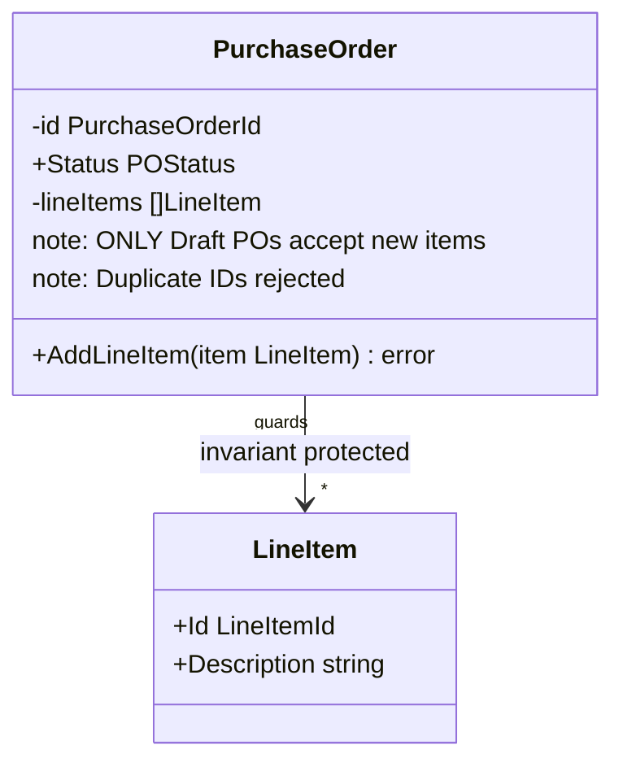
```mermaid
classDiagram
  class PurchaseOrder {
    -id PurchaseOrderId
    +Status POStatus
    -lineItems []LineItem
    +AddLineItem(item LineItem) error
    note: ONLY Draft POs accept new items
    note: Duplicate IDs rejected
  }
  class LineItem {
    +Id LineItemId
    +Description string
  }
  PurchaseOrder "guards" --> "*" LineItem : invariant protected

  classDef blue fill:#0173B2,stroke:#000000,color:#FFFFFF,stroke-width:2px
  classDef teal fill:#029E73,stroke:#000000,color:#FFFFFF,stroke-width:2px
  class PurchaseOrder:::blue
  class LineItem:::teal
```




```go
// => AddLineItem enforces two invariants before mutation:
// => 1. Only Draft POs accept new line items.
// => 2. No duplicate line item IDs within a PO.
func (po *PurchaseOrder) AddLineItem(item LineItem) error {
  // => Status guard: Submitted, Issued, etc. cannot accept new items.
  if po.Status != Draft {
    return fmt.Errorf("can only add items to a Draft PO, current status: %s", po.Status)
  }
  // => Duplicate check: iterate existing items to find ID collision.
  for _, existing := range po.LineItems {
    if existing.Id == item.Id {
      // => Duplicate ID is a domain error — two line items cannot share an ID.
      return fmt.Errorf("line item with ID %s already exists in PO %s", item.Id, po.id)
    }
  }
  // => Both invariants satisfied — safe to append.
  po.LineItems = append(po.LineItems, item)
  // => UpdatedAt records the time of this mutation for audit trail.
  po.UpdatedAt = time.Now()
  return nil
}

// => RemoveLineItem also guarded — only Draft POs allow item removal.
func (po *PurchaseOrder) RemoveLineItem(id LineItemId) error {
  if po.Status != Draft {
    return fmt.Errorf("can only remove items from a Draft PO")
  }
  for i, item := range po.LineItems {
    if item.Id == id {
      // => Slice removal preserves order — item at index i is removed.
      po.LineItems = append(po.LineItems[:i], po.LineItems[i+1:]...)
      po.UpdatedAt = time.Now()
      return nil
    }
  }
  return fmt.Errorf("line item with ID %s not found in PO %s", id, po.id)
}
```




```rust
impl PurchaseOrder {
  // => add_line_item takes &mut self — mutable reference required for state change.
  pub fn add_line_item(&mut self, item: LineItem) -> Result<(), POError> {
    // => Status guard mirrors Go: only Draft accepts new items.
    if self.status != POStatus::Draft {
      return Err(POError::InvalidStatus { expected: POStatus::Draft, actual: self.status });
    }
    // => any() checks for ID collision without needing an index.
    if self.line_items.iter().any(|existing| existing.id == item.id) {
      return Err(POError::DuplicateLineItemId(item.id));
    }
    // => Both invariants satisfied — safe to push.
    self.line_items.push(item);
    // => updated_at records mutation time.
    self.updated_at = Utc::now();
    Ok(())
  }

  // => remove_line_item also enforces Draft status.
  pub fn remove_line_item(&mut self, id: &LineItemId) -> Result<(), POError> {
    if self.status != POStatus::Draft {
      return Err(POError::InvalidStatus { expected: POStatus::Draft, actual: self.status });
    }
    let pos = self.line_items.iter().position(|item| &item.id == id)
      .ok_or_else(|| POError::LineItemNotFound(id.clone()))?;
    // => swap_remove is O(1) but changes order; remove is O(n) and preserves order.
    self.line_items.remove(pos);
    self.updated_at = Utc::now();
    Ok(())
  }
}
```




> **Key takeaway**: The aggregate root enforces invariants on every mutation. No external code bypasses `AddLineItem` to append directly to `LineItems` — the slice is unexported in Go, owned exclusively in Rust.

---

### Example 19: Submit for Approval

The `Submit` transition moves a Draft PO into the approval queue. Two preconditions must hold: the PO must be in Draft status (not already submitted), and it must contain at least one line item (an empty PO has no business value). Both checks happen inside the aggregate root — the application service does not need to re-check them.

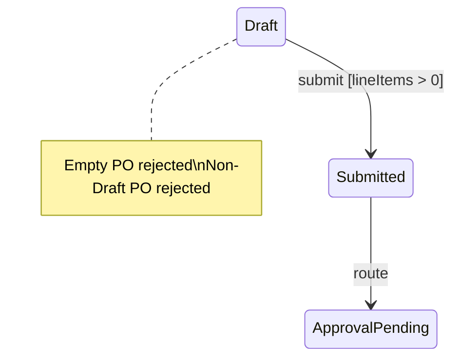
```mermaid
stateDiagram-v2
  Draft --> Submitted : submit [lineItems > 0]
  Submitted --> ApprovalPending : route
  note right of Draft : Empty PO rejected\nNon-Draft PO rejected
```




```go
// => Submit enforces two preconditions before transitioning status.
// => Application service calls Submit() — no direct status assignment.
func (po *PurchaseOrder) Submit() error {
  // => Only Draft POs can be submitted — prevents double-submission.
  if po.Status != Draft {
    return fmt.Errorf("can only submit a Draft PO, current status: %s", po.Status)
  }
  // => Empty PO has no business value — reject before queueing for approval.
  if len(po.LineItems) == 0 {
    return fmt.Errorf("cannot submit a PO with no line items")
  }
  // => Both preconditions satisfied — transition to Submitted.
  po.Status = Submitted
  // => UpdatedAt records transition time for SLA tracking.
  po.UpdatedAt = time.Now()
  return nil
}
```




```rust
impl PurchaseOrder {
  // => submit takes &mut self — status is mutated in place.
  pub fn submit(&mut self) -> Result<(), POError> {
    // => Draft check prevents re-submission of an already-submitted PO.
    if self.status != POStatus::Draft {
      return Err(POError::InvalidStatus {
        expected: POStatus::Draft,
        actual: self.status,
      });
    }
    // => is_empty() guard rejects empty POs before they enter the approval queue.
    if self.line_items.is_empty() {
      return Err(POError::NoLineItems);
    }
    // => Transition to Submitted — no other field changes needed.
    self.status = POStatus::Submitted;
    self.updated_at = Utc::now();
    Ok(())
  }
}
```




> **Key takeaway**: State transition methods encode preconditions as domain errors. The application service receives a clear error when a transition is invalid — no conditional logic needed outside the aggregate.

---

### Example 20: Approve — Multi-Level Authorization Check

Approval enforces the budget cap associated with the approver's level. Before setting the status to `Issued`, the aggregate root computes the PO's total value and verifies it does not exceed the `ApprovalLevel`'s budget cap. If it does, the approval is rejected — the PO must be escalated to a higher tier. The `approvedBy` field is stored for audit trail purposes.

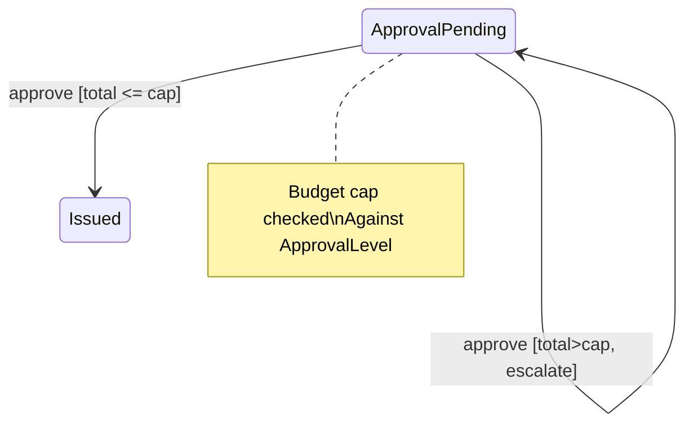
```mermaid
stateDiagram-v2
  ApprovalPending --> Issued : approve [total <= cap]
  ApprovalPending --> ApprovalPending : approve [total>cap, escalate]
  note right of ApprovalPending : Budget cap checked\nAgainst ApprovalLevel
```




```go
// => ApprovedBy is stored on the PO for audit trail — who approved, when.
// => Add approvedBy field to PurchaseOrder struct if not already present.
func (po *PurchaseOrder) Approve(approvedBy string, level ApprovalLevel) error {
  // => Only ApprovalPending POs can be approved.
  if po.Status != ApprovalPending {
    return fmt.Errorf("can only approve an ApprovalPending PO, current: %s", po.Status)
  }
  // => Compute total value — this is a domain operation on the aggregate.
  total, err := po.TotalValue()
  if err != nil {
    return fmt.Errorf("computing total value: %w", err)
  }
  // => Check total value against the approval level's budget cap.
  capMoney, err := NewMoney(level.BudgetCapCents(), total.Currency)
  if err != nil {
    return fmt.Errorf("constructing cap money: %w", err)
  }
  exceedsCAP, err := total.GreaterThan(capMoney)
  if err != nil {
    return fmt.Errorf("comparing values: %w", err)
  }
  if exceedsCAP {
    // => Total exceeds level cap — requires escalation to higher tier.
    return fmt.Errorf("PO total %s exceeds approval level cap %s", total, capMoney)
  }
  // => Budget cap satisfied — transition to Issued.
  po.Status = Issued
  po.UpdatedAt = time.Now()
  return nil
}
```




```rust
impl PurchaseOrder {
  pub fn approve(&mut self, approved_by: String, level: &ApprovalLevel) -> Result<(), POError> {
    // => Status guard — only ApprovalPending POs can be approved.
    if self.status != POStatus::ApprovalPending {
      return Err(POError::InvalidStatus {
        expected: POStatus::ApprovalPending,
        actual: self.status,
      });
    }
    // => Compute total — delegates to total_value() defined on the aggregate.
    let total = self.total_value().map_err(POError::MoneyError)?;
    // => Construct cap Money in same currency as total for comparison.
    let cap = Money::new(level.budget_cap_cents(), total.currency())
      .map_err(POError::MoneyError)?;
    // => greater_than returns Err if currencies differ — should not happen here.
    if total.greater_than(&cap).map_err(POError::MoneyError)? {
      return Err(POError::BudgetCapExceeded { total, cap });
    }
    // => Store approved_by for audit — not modelling a full approver entity here.
    // => In production, approved_by would reference an ApproverId newtype.
    self.status = POStatus::Issued;
    self.updated_at = Utc::now();
    Ok(())
  }
}
```




> **Key takeaway**: Budget cap enforcement lives inside the aggregate root's `Approve` method — the only place where all required information (line items, approval level) is available simultaneously.

---

### Example 21: Reject with Reason

Rejection terminates the current approval attempt with an auditable reason. A blank rejection reason is rejected itself — auditors must be able to understand why a PO was denied. After rejection, the PO is marked Cancelled; a new PO must be created if the requester wants to resubmit with corrections.

```mermaid
stateDiagram-v2
  ApprovalPending --> Cancelled : reject [reason non-empty]
  note right of ApprovalPending : Blank reason rejected\nReason stored for audit
```




```go
// => RejectionNote stores the reason and who rejected — audit requirements.
// => Add RejectionNote field to PurchaseOrder struct.
type RejectionNote struct {
  Reason     string
  RejectedBy string
  RejectedAt time.Time
}

// => Reject transitions ApprovalPending → Cancelled with a mandatory reason.
func (po *PurchaseOrder) Reject(reason, rejectedBy string) error {
  // => Only ApprovalPending POs can be rejected.
  if po.Status != ApprovalPending {
    return fmt.Errorf("can only reject an ApprovalPending PO, current: %s", po.Status)
  }
  // => Blank reason is itself invalid — audit trail requires meaningful rejection notes.
  if strings.TrimSpace(reason) == "" {
    return fmt.Errorf("rejection reason must not be empty")
  }
  // => Store rejection details before changing status — defensive ordering.
  po.RejectionNote = &RejectionNote{
    Reason:     reason,
    RejectedBy: rejectedBy,
    RejectedAt: time.Now(),
  }
  // => Cancelled is the terminal state for rejected POs.
  po.Status = Cancelled
  po.UpdatedAt = time.Now()
  return nil
}
```




```rust
// => RejectionNote is a value object — immutable snapshot of rejection details.
#[derive(Debug, Clone)]
pub struct RejectionNote {
  pub reason: String,
  pub rejected_by: String,
  pub rejected_at: DateTime<Utc>,
}

// => Add rejection_note: Option<RejectionNote> to PurchaseOrder struct.
impl PurchaseOrder {
  pub fn reject(&mut self, reason: String, rejected_by: String) -> Result<(), POError> {
    // => Only ApprovalPending POs can be rejected.
    if self.status != POStatus::ApprovalPending {
      return Err(POError::InvalidStatus {
        expected: POStatus::ApprovalPending,
        actual: self.status,
      });
    }
    // => Empty reason is a domain error — blank audit notes are not acceptable.
    if reason.trim().is_empty() {
      return Err(POError::EmptyRejectionReason);
    }
    // => Construct the rejection note before changing status — defensive ordering.
    self.rejection_note = Some(RejectionNote {
      reason,
      rejected_by,
      rejected_at: Utc::now(),
    });
    // => Cancelled is the terminal state — no further transitions allowed.
    self.status = POStatus::Cancelled;
    self.updated_at = Utc::now();
    Ok(())
  }
}
```




> **Key takeaway**: Rejection requires a non-empty reason stored as an auditable `RejectionNote`. Blank reasons are rejected by the aggregate root — the audit trail is an aggregate invariant.

---

### Example 22: Budget Invariant — TotalValue

The `TotalValue` method is the aggregate root's internal computation that sums all line item totals. It is called by `Approve` to enforce the budget cap invariant. Centralising this calculation inside the aggregate ensures all code paths use the same total — there is no risk of an application service computing a different total and reaching a different conclusion than the approval guard.

```mermaid
classDiagram
  class PurchaseOrder {
    -lineItems []LineItem
    +TotalValue() Money
    note: called by Approve
  }
  class LineItem {
    +TotalPrice() Money
  }
  PurchaseOrder "1" --> "*" LineItem : sums TotalPrice

  classDef blue fill:#0173B2,stroke:#000000,color:#FFFFFF,stroke-width:2px
  classDef teal fill:#029E73,stroke:#000000,color:#FFFFFF,stroke-width:2px
  class PurchaseOrder:::blue
  class LineItem:::teal
```




```go
// => TotalValue sums all line item totals — the aggregate's financial representation.
// => Returns (Money, error) because TotalPrice can fail on currency inconsistency.
func (po *PurchaseOrder) TotalValue() (Money, error) {
  // => Empty PO has zero total — valid for read but not for submission.
  if len(po.LineItems) == 0 {
    // => Zero money in an empty currency — caller must handle this edge case.
    return Money{amountCents: 0, Currency: ""}, nil
  }
  // => Start accumulation with the first item's total.
  total, err := po.LineItems[0].TotalPrice()
  if err != nil {
    return Money{}, fmt.Errorf("computing line item 0 total: %w", err)
  }
  // => Iterate remaining items — Add will error if currencies differ.
  for i, item := range po.LineItems[1:] {
    itemTotal, err := item.TotalPrice()
    if err != nil {
      return Money{}, fmt.Errorf("computing line item %d total: %w", i+1, err)
    }
    total, err = total.Add(itemTotal)
    if err != nil {
      // => Currency mismatch across line items is an aggregate data error.
      return Money{}, fmt.Errorf("summing line items: %w", err)
    }
  }
  return total, nil
}
```




```rust
impl PurchaseOrder {
  // => total_value borrows self — no mutation, pure computation.
  pub fn total_value(&self) -> Result<Money, MoneyError> {
    // => fold over line_items, accumulating the sum.
    // => Start with None — we'll initialise from the first item's total.
    let mut total: Option<Money> = None;
    for item in &self.line_items {
      let item_total = item.total_price()?;
      total = match total {
        // => First item initialises the accumulator.
        None => Some(item_total),
        // => Subsequent items are added — Add returns Err on currency mismatch.
        Some(acc) => Some(acc.add(item_total)?),
      };
    }
    // => unwrap_or returns zero THB for empty PO — caller handles edge case.
    Ok(total.unwrap_or_else(|| Money::new(0, "THB").unwrap()))
  }
}
```




> **Key takeaway**: `TotalValue` is the canonical financial computation for the PO aggregate. By centralising it in the root, all callers — including `Approve` — use the same authoritative total.

---

## Domain Events (Examples 23–25)

### Example 23: DomainEvent Interface and POCreated

Domain events record facts that occurred in the domain — they are past-tense, immutable, and carry enough context for downstream consumers to act without querying back into the originating aggregate. `POCreated` records that a purchase order was created, who the supplier is, and when it happened. Multiple downstream systems (notification, audit log, analytics) can react to the same event without coupling to each other.

```mermaid
classDiagram
  class DomainEvent {
    <<interface>>
    +EventType() string
    +OccurredAt() time.Time
  }
  class POCreated {
    +POId PurchaseOrderId
    +SupplierId SupplierId
    +OccurredAtTime time.Time
    +EventType() string
    +OccurredAt() time.Time
  }
  class POApproved {
    +POId PurchaseOrderId
    +ApprovedBy string
    +TotalValue Money
    +EventType() string
    +OccurredAt() time.Time
  }
  class POCancelled {
    +POId PurchaseOrderId
    +Reason string
    +EventType() string
    +OccurredAt() time.Time
  }
  DomainEvent <|.. POCreated
  DomainEvent <|.. POApproved
  DomainEvent <|.. POCancelled

  classDef blue fill:#0173B2,stroke:#000000,color:#FFFFFF,stroke-width:2px
  classDef teal fill:#029E73,stroke:#000000,color:#FFFFFF,stroke-width:2px
  class DomainEvent:::blue
  class POCreated:::teal
  class POApproved:::teal
  class POCancelled:::teal
```




```go
// => DomainEvent interface — minimal contract for all domain events.
// => EventType() returns a string tag used for routing in the event bus.
type DomainEvent interface {
  EventType() string
  // => OccurredAt() is immutable — events are facts, not mutable state.
  OccurredAt() time.Time
}

// => POCreated records the fact that a PO was created — past tense naming.
// => Past tense (Created, not Create) signals this is a fact, not a command.
type POCreated struct {
  POId           PurchaseOrderId
  SupplierId     SupplierId
  // => OccurredAtTime stored as a field — not recomputed on each call.
  OccurredAtTime time.Time
}

// => EventType returns a stable string tag for event routing.
// => String constant prevents typos in bus routing logic.
func (e POCreated) EventType() string { return "po.created" }

// => OccurredAt satisfies the DomainEvent interface — returns the stored time.
func (e POCreated) OccurredAt() time.Time { return e.OccurredAtTime }

// => POApproved carries the approved total for downstream finance systems.
type POApproved struct {
  POId           PurchaseOrderId
  ApprovedBy     string
  TotalValue     Money
  OccurredAtTime time.Time
}

func (e POApproved) EventType() string  { return "po.approved" }
func (e POApproved) OccurredAt() time.Time { return e.OccurredAtTime }
```




```rust
use chrono::{DateTime, Utc};

// => DomainEvent trait — object-safe: no generics, no Self in return position.
// => Debug bound allows logging event contents without knowing the concrete type.
pub trait DomainEvent: std::fmt::Debug {
  // => event_type returns &'static str — compile-time string, no allocation.
  fn event_type(&self) -> &'static str;
  // => occurred_at returns an owned DateTime — value type, cheap to copy.
  fn occurred_at(&self) -> DateTime<Utc>;
}

// => POCreated is a plain struct — no methods beyond the trait impl.
#[derive(Debug)]
pub struct POCreated {
  pub po_id: PurchaseOrderId,
  pub supplier_id: SupplierId,
  pub occurred_at: DateTime<Utc>,
}

impl DomainEvent for POCreated {
  // => "po.created" is a stable routing key — changing it breaks consumers.
  fn event_type(&self) -> &'static str { "po.created" }
  fn occurred_at(&self) -> DateTime<Utc> { self.occurred_at }
}

// => POApproved carries financial context for downstream systems.
#[derive(Debug)]
pub struct POApproved {
  pub po_id: PurchaseOrderId,
  pub approved_by: String,
  pub total_value: Money,
  pub occurred_at: DateTime<Utc>,
}

impl DomainEvent for POApproved {
  fn event_type(&self) -> &'static str { "po.approved" }
  fn occurred_at(&self) -> DateTime<Utc> { self.occurred_at }
}
```




> **Key takeaway**: Domain events are past-tense, immutable facts. The `DomainEvent` interface/trait requires only an event type tag and a timestamp — enough for routing and ordering without coupling consumers to aggregate internals.

---

### Example 24: Raising Events in the Aggregate

Aggregates collect domain events internally during state transitions and expose them for the application service to drain and publish after the aggregate is persisted. This ordering is critical: events must not be published until the aggregate is safely saved — publishing before persistence creates ghost events that reference entities that do not exist in the database.

```mermaid
sequenceDiagram
  participant AppService
  participant PurchaseOrder
  participant Repository
  participant EventBus

  AppService->>PurchaseOrder: NewPurchaseOrder(id, supplierId)
  PurchaseOrder->>PurchaseOrder: emit POCreated (internal)
  AppService->>Repository: Save(po)
  Repository-->>AppService: saved
  AppService->>PurchaseOrder: DomainEvents()
  PurchaseOrder-->>AppService: [POCreated]
  AppService->>EventBus: Publish(POCreated)
  AppService->>PurchaseOrder: ClearEvents()
```




```go
// => uncommittedEvents collects events raised during the current transaction.
// => They are NOT published until the application service drains them after save.
// => Add this field to the PurchaseOrder struct definition.
//    uncommittedEvents []DomainEvent

// => Emit appends an event to the internal buffer.
// => Private method — only aggregate methods call Emit.
func (po *PurchaseOrder) emit(event DomainEvent) {
  po.uncommittedEvents = append(po.uncommittedEvents, event)
}

// => DomainEvents exposes the uncommitted events for the application service.
// => Returns a copy — caller cannot mutate the internal slice.
func (po *PurchaseOrder) DomainEvents() []DomainEvent {
  result := make([]DomainEvent, len(po.uncommittedEvents))
  copy(result, po.uncommittedEvents)
  return result
}

// => ClearEvents is called by the application service after successful publish.
// => If publish fails, events are NOT cleared — they will be retried.
func (po *PurchaseOrder) ClearEvents() {
  po.uncommittedEvents = nil
}

// => NewPurchaseOrder updated to emit POCreated on construction.
func NewPurchaseOrder(id PurchaseOrderId, supplierID SupplierId) *PurchaseOrder {
  now := time.Now()
  po := &PurchaseOrder{
    id:         id,
    SupplierId: supplierID,
    Status:     Draft,
    LineItems:  []LineItem{},
    CreatedAt:  now,
    UpdatedAt:  now,
  }
  // => Emit the creation event immediately — before returning to the caller.
  po.emit(POCreated{
    POId:           id,
    SupplierId:     supplierID,
    OccurredAtTime: now,
  })
  return po
}
```




```rust
impl PurchaseOrder {
  // => uncommitted_events: Vec<Box<dyn DomainEvent>> added to PurchaseOrder struct.
  // => Box<dyn DomainEvent> allows heterogeneous event types in the same Vec.

  // => emit is private — only aggregate methods call it.
  fn emit(&mut self, event: Box<dyn DomainEvent>) {
    self.uncommitted_events.push(event);
  }

  // => domain_events returns a slice reference — no ownership transfer.
  pub fn domain_events(&self) -> &[Box<dyn DomainEvent>] {
    &self.uncommitted_events
  }

  // => clear_events drains the buffer — called after successful publish.
  pub fn clear_events(&mut self) {
    self.uncommitted_events.clear();
  }

  // => new() updated to emit POCreated — event raised at construction.
  pub fn new(id: PurchaseOrderId, supplier_id: SupplierId) -> Self {
    let now = Utc::now();
    let mut po = Self {
      id: id.clone(),
      supplier_id: supplier_id.clone(),
      status: POStatus::Draft,
      line_items: Vec::new(),
      created_at: now,
      updated_at: now,
      uncommitted_events: Vec::new(),
      rejection_note: None,
    };
    // => emit after all fields are initialised — safe to borrow po.id here.
    po.emit(Box::new(POCreated { po_id: id, supplier_id, occurred_at: now }));
    po
  }
}
```




> **Key takeaway**: Aggregate events are buffered internally and published by the application service only after persistence succeeds. `ClearEvents` is called post-publish — if publish fails, events survive for retry.

---

### Example 25: Event Handler Pattern

Event handlers subscribe to specific event types and react with side effects — email notification, audit log entries, downstream system updates. Handlers depend on interfaces (ports), not concrete types, so they can be tested with fakes. Multiple handlers can register for the same event, enabling decoupled cross-cutting concerns like notifications and analytics.

```mermaid
sequenceDiagram
  participant EventBus
  participant POCreatedNotifier
  participant SupplierRepository
  participant Notifier

  EventBus->>POCreatedNotifier: Handle(POCreated)
  POCreatedNotifier->>SupplierRepository: FindById(supplierId)
  SupplierRepository-->>POCreatedNotifier: Supplier
  POCreatedNotifier->>Notifier: Send(supplierEmail, message)
  Notifier-->>POCreatedNotifier: sent
  POCreatedNotifier-->>EventBus: nil (success)
```




```go
// => EventHandler is a small interface — one method, one responsibility.
// => context.Context enables cancellation and deadline propagation.
type EventHandler interface {
  Handle(ctx context.Context, event DomainEvent) error
}

// => Notifier is a port — application code depends on this interface, not SMTP.
type Notifier interface {
  Send(ctx context.Context, to, subject, body string) error
}

// => SupplierRepository is a port — application code depends on this interface.
type SupplierRepository interface {
  FindById(ctx context.Context, id SupplierId) (*Supplier, error)
}

// => POCreatedNotifier handles the po.created event — sends supplier notification.
// => Dependencies are interfaces — testable with fakes, no concrete coupling.
type POCreatedNotifier struct {
  notifier     Notifier
  supplierRepo SupplierRepository
}

func NewPOCreatedNotifier(n Notifier, sr SupplierRepository) *POCreatedNotifier {
  return &POCreatedNotifier{notifier: n, supplierRepo: sr}
}

func (h *POCreatedNotifier) Handle(ctx context.Context, event DomainEvent) error {
  // => Type assert to concrete event — handler only processes its event type.
  created, ok := event.(POCreated)
  if !ok {
    // => Ignore events that are not POCreated — idempotent no-op.
    return nil
  }
  // => Look up the supplier to get their contact email.
  supplier, err := h.supplierRepo.FindById(ctx, created.SupplierId)
  if err != nil {
    return fmt.Errorf("finding supplier for notification: %w", err)
  }
  // => Send the notification via the Notifier port.
  return h.notifier.Send(ctx, supplier.ContactEmail,
    "New Purchase Order Created",
    fmt.Sprintf("PO %s has been created and awaits your confirmation.", created.POId))
}
```




```rust
use async_trait::async_trait;
use std::sync::Arc;

// => EventHandler trait is async — real handlers make network calls.
// => async_trait crate enables async methods in Rust traits (limitation of stable Rust).
#[async_trait]
pub trait EventHandler: Send + Sync {
  async fn handle(&self, event: &dyn DomainEvent) -> Result<(), HandlerError>;
  // => can_handle allows the event bus to route events without dynamic dispatch overhead.
  fn can_handle(&self, event_type: &str) -> bool;
}

// => Notifier port — handler depends on this trait, not a concrete mailer.
#[async_trait]
pub trait Notifier: Send + Sync {
  async fn send(&self, to: &str, subject: &str, body: &str) -> Result<(), NotifierError>;
}

// => SupplierRepository port — handler depends on this trait, not a concrete DB.
#[async_trait]
pub trait SupplierRepository: Send + Sync {
  async fn find_by_id(&self, id: &SupplierId) -> Result<Option<Supplier>, RepoError>;
}

// => POCreatedNotifier holds Arc-wrapped ports — shared ownership across async tasks.
pub struct POCreatedNotifier {
  notifier: Arc<dyn Notifier>,
  supplier_repo: Arc<dyn SupplierRepository>,
}

#[async_trait]
impl EventHandler for POCreatedNotifier {
  // => can_handle routes only po.created events to this handler.
  fn can_handle(&self, event_type: &str) -> bool {
    event_type == "po.created"
  }

  async fn handle(&self, event: &dyn DomainEvent) -> Result<(), HandlerError> {
    // => downcast_ref attempts to cast the trait object to POCreated.
    // => Returns None if the event is a different concrete type.
    let created = (event as &dyn std::any::Any)
      .downcast_ref::<POCreated>()
      .ok_or(HandlerError::WrongEventType)?;
    let supplier = self.supplier_repo
      .find_by_id(&created.supplier_id).await?
      .ok_or(HandlerError::SupplierNotFound)?;
    // => Send via the Notifier port — concrete email adapter injected at startup.
    self.notifier.send(
      &supplier.contact_email,
      "New Purchase Order Created",
      &format!("PO {} has been created and awaits your confirmation.", created.po_id),
    ).await?;
    Ok(())
  }
}
```




> **Key takeaway**: Event handlers depend on ports (interfaces/traits), not concrete infrastructure. `can_handle` enables the event bus to route efficiently; `async_trait` enables real-world async side effects in Rust handlers.
