This intermediate tutorial extends the beginner tactical patterns to integration concerns — the full PurchaseOrder aggregate with its complete lifecycle, domain events with the outbox pattern, Anti-Corruption Layers for cross-context coordination, the repository pattern as a port, and CQRS read models. Go is canonical throughout; Rust shows how ownership reshapes each pattern, particularly where consuming `self` or `Option<T>` fields replace nil-checks and mutability guards.

**Canonical sources**: Matthew Boyle — [_Domain-Driven Design with Golang_](https://www.oreilly.com/library/view/domain-driven-design-with/9781804613450/) (Packt, 2022); Three Dots Labs — [DDD + CQRS + Clean Architecture in Go](https://threedots.tech/post/ddd-cqrs-clean-architecture-combined/); Jim Blandy, Jason Orendorff, Leonora F. S. Tindall — [_Programming Rust_, 3rd ed.](https://www.oreilly.com/library/view/programming-rust-3rd/9781098176228/) (O'Reilly, 2024).

## Full PurchaseOrder Aggregate (Examples 26–31)

### Example 26: Full PurchaseOrder Aggregate with Complete Lifecycle

The full aggregate exposes every lifecycle transition as a method on the root struct. Each method checks preconditions and updates status atomically — no external code ever sets `po.status` directly. The `uncommittedEvents` slice accumulates events that the application service drains and publishes after a successful save.

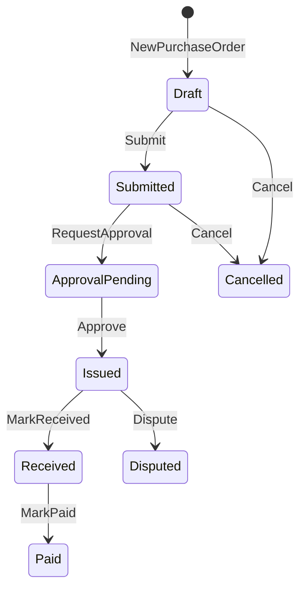
```mermaid
stateDiagram-v2
    [*] --> Draft: NewPurchaseOrder
    Draft --> Submitted: Submit
    Submitted --> ApprovalPending: RequestApproval
    ApprovalPending --> Issued: Approve
    Issued --> Received: MarkReceived
    Received --> Paid: MarkPaid
    Draft --> Cancelled: Cancel
    Submitted --> Cancelled: Cancel
    Issued --> Disputed: Dispute
```




```go
// => PurchaseOrder is the aggregate root for the procurement domain
type PurchaseOrder struct {
    // => id is an opaque value object, never a raw string
    id         PurchaseOrderId
    // => supplierID is a reference by ID — no cross-aggregate pointer
    supplierID SupplierId
    // => status drives all method precondition checks
    status     POStatus
    // => lineItems are owned by this aggregate; enforced as value slice
    lineItems  []LineItem
    // => approvalChain is nil until RequestApproval is called
    approvalChain *ApprovalChain
    // => grnId stores the GRN reference after MarkReceived; nil until then
    grnId      *GRNId
    // => rejectionReason is set only when status == Rejected
    rejectionReason string
    // => uncommittedEvents accumulates events for drain-after-save
    uncommittedEvents []DomainEvent
    // => audit timestamps maintained by the aggregate itself
    createdAt  time.Time
    updatedAt  time.Time
}

// => NewPurchaseOrder is the only constructor — enforces required fields
func NewPurchaseOrder(
    id PurchaseOrderId,
    supplierID SupplierId,
) *PurchaseOrder {
    // => all new POs start in Draft — no other initial status is valid
    po := &PurchaseOrder{
        id:         id,
        supplierID: supplierID,
        status:     POStatusDraft,
        // => createdAt set once at construction and never mutated
        createdAt:  time.Now().UTC(),
        updatedAt:  time.Now().UTC(),
    }
    // => record creation event immediately so listeners can react
    po.uncommittedEvents = append(
        po.uncommittedEvents,
        POCreated{ID: id, SupplierID: supplierID},
    )
    return po
}

// => DrainEvents returns accumulated events and resets the slice
// => called by the application service after a successful repository save
func (po *PurchaseOrder) DrainEvents() []DomainEvent {
    // => snapshot current events before clearing
    events := po.uncommittedEvents
    // => reset to empty slice — not nil — to avoid nil-append confusion
    po.uncommittedEvents = []DomainEvent{}
    return events
}
```




```rust
// => PurchaseOrder owns all its child data — no Rc/RefCell needed
pub struct PurchaseOrder {
    // => newtype wrappers prevent ID mix-ups at compile time
    id: PurchaseOrderId,
    supplier_id: SupplierId,
    // => enum makes illegal status transitions visible to the compiler
    status: POStatus,
    // => Vec<LineItem> — aggregate owns the collection
    line_items: Vec<LineItem>,
    // => Option<ApprovalChain> — absent until RequestApproval called
    approval_chain: Option<ApprovalChain>,
    // => Option<GrnId> — absent until MarkReceived called
    grn_id: Option<GrnId>,
    // => Option<String> avoids empty-string ambiguity for rejection reason
    rejection_reason: Option<String>,
    // => boxed trait objects allow mixed event types in one Vec
    uncommitted_events: Vec<Box<dyn DomainEvent>>,
    created_at: DateTime<Utc>,
    updated_at: DateTime<Utc>,
}

impl PurchaseOrder {
    // => pub constructor — only public entry point into the aggregate
    pub fn new(id: PurchaseOrderId, supplier_id: SupplierId) -> Self {
        // => Rust immutable-by-default: we mark `po` mut only inside here
        let mut po = PurchaseOrder {
            id: id.clone(),
            supplier_id: supplier_id.clone(),
            status: POStatus::Draft,
            line_items: Vec::new(),
            approval_chain: None,
            grn_id: None,
            rejection_reason: None,
            uncommitted_events: Vec::new(),
            created_at: Utc::now(),
            updated_at: Utc::now(),
        };
        // => record creation event before returning ownership to caller
        po.uncommitted_events
            .push(Box::new(POCreated { id, supplier_id }));
        po
    }

    // => drain_events takes self by &mut — caller retains ownership of po
    pub fn drain_events(&mut self) -> Vec<Box<dyn DomainEvent>> {
        // => std::mem::take replaces field with empty Vec and returns old
        std::mem::take(&mut self.uncommitted_events)
    }
}
```




> **Key takeaway**: The aggregate root struct owns all its data and controls every transition through exported methods; no external code sets fields directly.

---

### Example 27: RequestApproval and Approve with Budget Check

Two-step approval: `RequestApproval` captures which approval chain handles this PO and moves it to `ApprovalPending`; `Approve` verifies the PO's total value does not exceed the current level's budget cap before moving to `Issued`. Encoding both steps on the aggregate means budget checks are enforced in the domain, not the application layer.

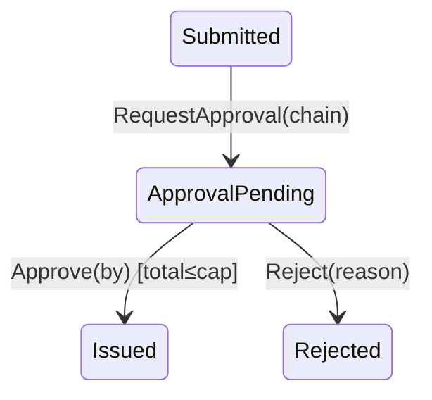
```mermaid
stateDiagram-v2
    Submitted --> ApprovalPending: RequestApproval#40;chain#41;
    ApprovalPending --> Issued: Approve#40;by#41; [total≤cap]
    ApprovalPending --> Rejected: Reject#40;reason#41;
```




```go
// => RequestApproval transitions Submitted → ApprovalPending
func (po *PurchaseOrder) RequestApproval(chain ApprovalChain) error {
    // => precondition: only Submitted POs can enter the approval queue
    if po.status != POStatusSubmitted {
        return fmt.Errorf(
            "cannot request approval: status is %s", po.status,
        )
    }
    // => store chain so Approve() can check the budget cap later
    po.approvalChain = &chain
    // => advance status
    po.status = POStatusApprovalPending
    po.updatedAt = time.Now().UTC()
    // => emit event so listeners can trigger notifications
    po.uncommittedEvents = append(
        po.uncommittedEvents,
        POApprovalRequested{
            POID:  po.id,
            Level: chain.CurrentLevel(),
        },
    )
    return nil
}

// => Approve transitions ApprovalPending → Issued, checking budget cap
func (po *PurchaseOrder) Approve(approvedBy string) error {
    // => precondition: approval chain must have been set
    if po.approvalChain == nil {
        return fmt.Errorf("approval chain not set")
    }
    // => precondition: status must be ApprovalPending
    if po.status != POStatusApprovalPending {
        return fmt.Errorf("cannot approve: status is %s", po.status)
    }
    // => enforce budget cap — domain rule, not application rule
    cap := po.approvalChain.CurrentLevelCap()
    if po.TotalValueCents() > cap {
        return fmt.Errorf(
            "total %d exceeds approval level cap %d", po.TotalValueCents(), cap,
        )
    }
    // => record approval inside the chain value object (immutable update)
    updated := po.approvalChain.RecordApproval(approvedBy)
    po.approvalChain = &updated
    // => advance status now that budget check passed
    po.status = POStatusIssued
    po.updatedAt = time.Now().UTC()
    po.uncommittedEvents = append(
        po.uncommittedEvents,
        POApproved{POID: po.id, ApprovedBy: approvedBy},
    )
    return nil
}
```




```rust
impl PurchaseOrder {
    // => &mut self — caller keeps ownership, we mutate in place
    pub fn request_approval(&mut self, chain: ApprovalChain) -> Result<(), POError> {
        // => pattern match on status — exhaustive, compiler-checked
        if self.status != POStatus::Submitted {
            return Err(POError::InvalidTransition {
                from: self.status.clone(),
                to: POStatus::ApprovalPending,
            });
        }
        // => Some(chain) — Option encodes "chain is now present"
        self.approval_chain = Some(chain.clone());
        self.status = POStatus::ApprovalPending;
        self.updated_at = Utc::now();
        self.uncommitted_events
            .push(Box::new(POApprovalRequested {
                po_id: self.id.clone(),
                level: chain.current_level(),
            }));
        Ok(())
    }

    // => approve checks budget cap before issuing
    pub fn approve(&mut self, approved_by: String) -> Result<(), POError> {
        // => as_ref() borrows Option without consuming it
        let chain = self.approval_chain.as_ref()
            .ok_or(POError::ApprovalChainNotSet)?;
        if self.status != POStatus::ApprovalPending {
            return Err(POError::InvalidTransition {
                from: self.status.clone(),
                to: POStatus::Issued,
            });
        }
        // => domain-enforced budget check — compare total vs cap
        let cap = chain.current_level_cap();
        let total = self.total_value_cents();
        if total > cap {
            return Err(POError::BudgetCapExceeded { total, cap });
        }
        // => record_approval returns a NEW ApprovalChain (value object)
        let updated = chain.record_approval(approved_by.clone());
        self.approval_chain = Some(updated);
        self.status = POStatus::Issued;
        self.updated_at = Utc::now();
        self.uncommitted_events
            .push(Box::new(POApproved {
                po_id: self.id.clone(),
                approved_by,
            }));
        Ok(())
    }
}
```




> **Key takeaway**: Budget cap enforcement inside the aggregate ensures the rule can never be bypassed regardless of which application service calls `Approve`.

---

### Example 28: MarkReceived and MarkPaid

`MarkReceived` stores the GRN ID for three-way matching and advances to `Received`; `MarkPaid` verifies the GRN reference is present before advancing to `Paid`. Both methods emit events so downstream services (finance, audit) can react.

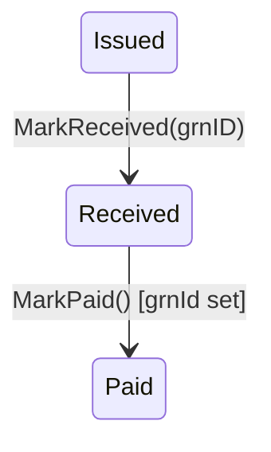
```mermaid
stateDiagram-v2
    Issued --> Received: MarkReceived#40;grnID#41;
    Received --> Paid: MarkPaid#40;#41; [grnId set]
```




```go
// => MarkReceived transitions Issued → Received
func (po *PurchaseOrder) MarkReceived(grnID GRNId) error {
    // => only Issued POs can be marked received
    if po.status != POStatusIssued {
        return fmt.Errorf(
            "cannot mark received: status is %s", po.status,
        )
    }
    // => store GRN ID reference — aggregate boundary: ID only, no pointer
    po.grnId = &grnID
    po.status = POStatusReceived
    po.updatedAt = time.Now().UTC()
    // => GRNLinked event carries both IDs for downstream reconciliation
    po.uncommittedEvents = append(
        po.uncommittedEvents,
        POGRNLinked{POID: po.id, GRNId: grnID},
    )
    return nil
}

// => MarkPaid transitions Received → Paid
func (po *PurchaseOrder) MarkPaid() error {
    // => cannot pay without a linked GRN — three-way match requires it
    if po.grnId == nil {
        return fmt.Errorf("cannot mark paid: no GRN linked")
    }
    // => precondition: must be Received before Paid
    if po.status != POStatusReceived {
        return fmt.Errorf(
            "cannot mark paid: status is %s", po.status,
        )
    }
    po.status = POStatusPaid
    po.updatedAt = time.Now().UTC()
    po.uncommittedEvents = append(
        po.uncommittedEvents,
        POPaid{POID: po.id, GRNId: *po.grnId},
    )
    return nil
}
```




```rust
impl PurchaseOrder {
    // => mark_received stores the GRN reference and advances status
    pub fn mark_received(&mut self, grn_id: GrnId) -> Result<(), POError> {
        // => enum comparison is exhaustive — no missed cases
        if self.status != POStatus::Issued {
            return Err(POError::InvalidTransition {
                from: self.status.clone(),
                to: POStatus::Received,
            });
        }
        // => Some(grn_id) — Rust Option makes "no GRN" explicit at type level
        self.grn_id = Some(grn_id.clone());
        self.status = POStatus::Received;
        self.updated_at = Utc::now();
        self.uncommitted_events
            .push(Box::new(POGrnLinked {
                po_id: self.id.clone(),
                grn_id,
            }));
        Ok(())
    }

    // => mark_paid enforces GRN presence before advancing to Paid
    pub fn mark_paid(&mut self) -> Result<(), POError> {
        // => ok_or converts None → Err — readable domain error
        let grn_id = self.grn_id.as_ref()
            .ok_or(POError::GrnNotLinked)?
            .clone();
        if self.status != POStatus::Received {
            return Err(POError::InvalidTransition {
                from: self.status.clone(),
                to: POStatus::Paid,
            });
        }
        self.status = POStatus::Paid;
        self.updated_at = Utc::now();
        self.uncommitted_events
            .push(Box::new(POPaid {
                po_id: self.id.clone(),
                grn_id,
            }));
        Ok(())
    }
}
```




> **Key takeaway**: Storing the GRN ID on the PO (not a full GRN object) maintains the aggregate boundary while still enabling the three-way match invariant check in `MarkPaid`.

---

### Example 29: GoodReceiptNote Aggregate

GRN is its own aggregate with its own lifecycle — it references the PO by ID, not by pointer. Finalization emits a `GRNFinalized` event that the application layer uses to trigger three-way match coordination without creating a direct dependency between the two aggregates.

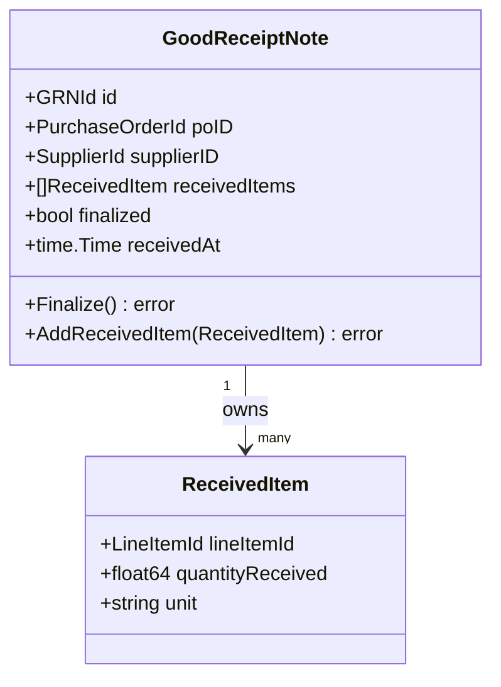
```mermaid
classDiagram
    class GoodReceiptNote {
        +GRNId id
        +PurchaseOrderId poID
        +SupplierId supplierID
        +[]ReceivedItem receivedItems
        +bool finalized
        +time.Time receivedAt
        +Finalize() error
        +AddReceivedItem(ReceivedItem) error
    }
    class ReceivedItem {
        +LineItemId lineItemId
        +float64 quantityReceived
        +string unit
    }
    GoodReceiptNote "1" --> "many" ReceivedItem : owns
```




```go
// => GoodReceiptNote is an aggregate root — not a child of PurchaseOrder
type GoodReceiptNote struct {
    id            GRNId
    // => references PO by ID only — never holds a *PurchaseOrder pointer
    poID          PurchaseOrderId
    supplierID    SupplierId
    receivedItems []ReceivedItem
    // => finalized is the terminal state — no mutations allowed after
    finalized     bool
    receivedAt    time.Time
    uncommittedEvents []DomainEvent
}

// => NewGRN creates a GRN in the Draft (unfinalized) state
func NewGRN(
    id GRNId,
    poID PurchaseOrderId,
    supplierID SupplierId,
) *GoodReceiptNote {
    return &GoodReceiptNote{
        id:         id,
        poID:       poID,
        supplierID: supplierID,
        receivedAt: time.Now().UTC(),
    }
}

// => AddReceivedItem appends a received line — blocked after finalization
func (grn *GoodReceiptNote) AddReceivedItem(item ReceivedItem) error {
    // => invariant: cannot modify a finalized GRN
    if grn.finalized {
        return fmt.Errorf("GRN %s is already finalized", grn.id)
    }
    grn.receivedItems = append(grn.receivedItems, item)
    return nil
}

// => Finalize seals the GRN and emits GRNFinalized event
func (grn *GoodReceiptNote) Finalize() error {
    // => idempotency guard — re-finalizing is a caller error
    if grn.finalized {
        return fmt.Errorf("GRN %s is already finalized", grn.id)
    }
    if len(grn.receivedItems) == 0 {
        // => domain invariant: a GRN without items has no business meaning
        return fmt.Errorf("cannot finalize GRN with no received items")
    }
    grn.finalized = true
    // => event carries both IDs — the coordinator needs both for matching
    grn.uncommittedEvents = append(
        grn.uncommittedEvents,
        GRNFinalized{GRNId: grn.id, POId: grn.poID},
    )
    return nil
}
```




```rust
// => GoodReceiptNote owns its item collection — no shared references
pub struct GoodReceiptNote {
    id: GrnId,
    // => ID reference, not a borrow — no lifetime parameter needed
    po_id: PurchaseOrderId,
    supplier_id: SupplierId,
    received_items: Vec<ReceivedItem>,
    // => bool finalized — simple flag, Rust makes it non-nullable
    finalized: bool,
    received_at: DateTime<Utc>,
    uncommitted_events: Vec<Box<dyn DomainEvent>>,
}

impl GoodReceiptNote {
    pub fn new(
        id: GrnId,
        po_id: PurchaseOrderId,
        supplier_id: SupplierId,
    ) -> Self {
        GoodReceiptNote {
            id,
            po_id,
            supplier_id,
            received_items: Vec::new(),
            finalized: false,
            received_at: Utc::now(),
            uncommitted_events: Vec::new(),
        }
    }

    // => &mut self — borrows mutably without consuming
    pub fn add_received_item(
        &mut self, item: ReceivedItem,
    ) -> Result<(), GrnError> {
        // => early return pattern: check invariant before mutating
        if self.finalized {
            return Err(GrnError::AlreadyFinalized);
        }
        self.received_items.push(item);
        Ok(())
    }

    pub fn finalize(&mut self) -> Result<(), GrnError> {
        if self.finalized {
            return Err(GrnError::AlreadyFinalized);
        }
        if self.received_items.is_empty() {
            // => domain invariant as a typed error, not a panic
            return Err(GrnError::NoItemsToFinalize);
        }
        self.finalized = true;
        // => clone IDs for event — GRN still owns originals
        self.uncommitted_events.push(Box::new(GrnFinalized {
            grn_id: self.id.clone(),
            po_id: self.po_id.clone(),
        }));
        Ok(())
    }
}
```




> **Key takeaway**: Keeping GRN as its own aggregate (referencing PO by ID) lets both aggregates evolve independently and be saved in separate transactions.

---

### Example 30: ApprovalChain Value Object

Approval chains define multi-level escalation — each level has a budget cap; lower levels handle smaller amounts and escalate when the PO total exceeds their cap. The chain is a value object: `RecordApproval` returns a new chain rather than mutating in place.

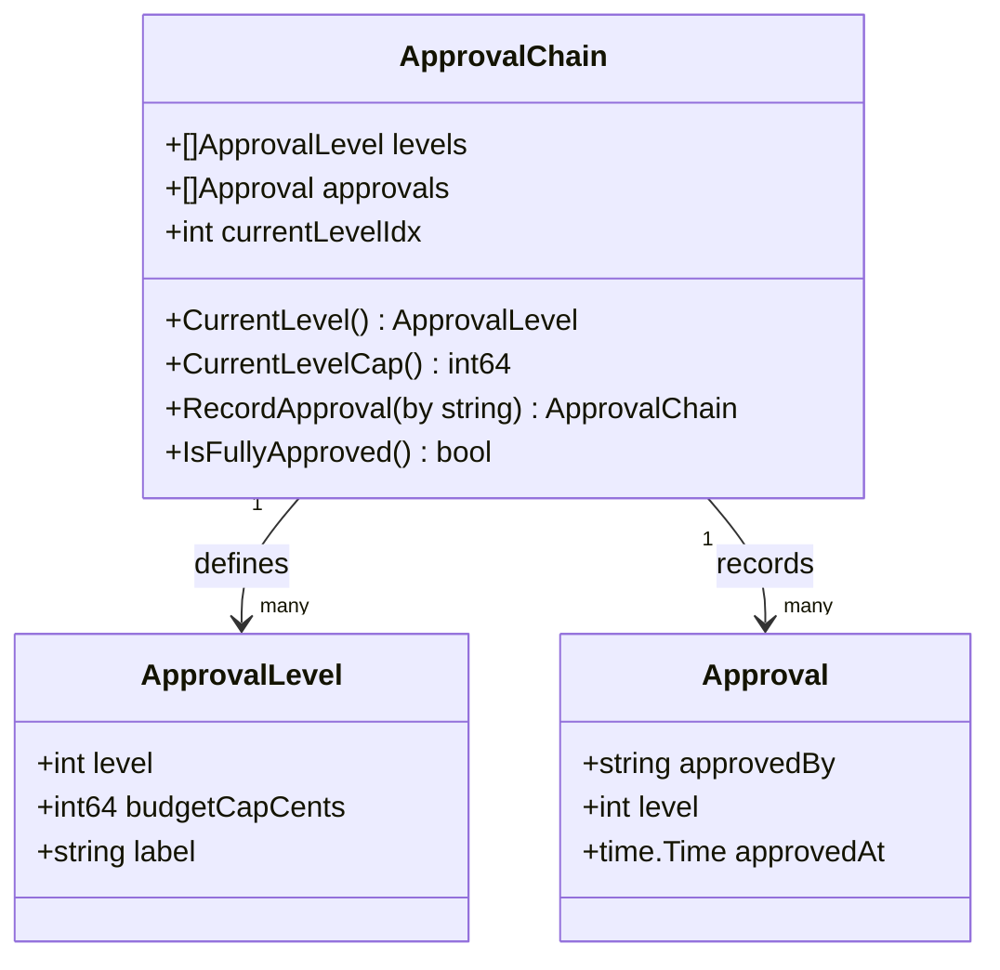
```mermaid
classDiagram
    class ApprovalChain {
        +[]ApprovalLevel levels
        +[]Approval approvals
        +int currentLevelIdx
        +CurrentLevel() ApprovalLevel
        +CurrentLevelCap() int64
        +RecordApproval(by string) ApprovalChain
        +IsFullyApproved() bool
    }
    class ApprovalLevel {
        +int level
        +int64 budgetCapCents
        +string label
    }
    class Approval {
        +string approvedBy
        +int level
        +time.Time approvedAt
    }
    ApprovalChain "1" --> "many" ApprovalLevel : defines
    ApprovalChain "1" --> "many" Approval : records
```




```go
// => ApprovalLevel defines one rung of the escalation ladder
type ApprovalLevel struct {
    // => level 1 = first approver (lowest cap), level N = CFO/board
    Level         int
    BudgetCapCents int64
    Label         string
}

// => Approval records a single approver's action for audit trail
type Approval struct {
    ApprovedBy string
    Level      int
    // => ApprovedAt enables time-based SLA tracking
    ApprovedAt time.Time
}

// => ApprovalChain is a value object — immutable after construction
type ApprovalChain struct {
    levels          []ApprovalLevel
    approvals       []Approval
    currentLevelIdx int
}

// => CurrentLevel returns the active level definition
func (ac ApprovalChain) CurrentLevel() ApprovalLevel {
    // => safe index access: construction guarantees idx < len(levels)
    return ac.levels[ac.currentLevelIdx]
}

// => CurrentLevelCap returns the budget cap for the current level
func (ac ApprovalChain) CurrentLevelCap() int64 {
    return ac.CurrentLevel().BudgetCapCents
}

// => RecordApproval returns a NEW chain with approval appended
// => value object pattern: never mutate, always copy-on-modify
func (ac ApprovalChain) RecordApproval(by string) ApprovalChain {
    // => copy existing approvals into new slice
    newApprovals := make([]Approval, len(ac.approvals)+1)
    copy(newApprovals, ac.approvals)
    newApprovals[len(ac.approvals)] = Approval{
        ApprovedBy: by,
        Level:      ac.CurrentLevel().Level,
        ApprovedAt: time.Now().UTC(),
    }
    // => advance index if more levels remain
    newIdx := ac.currentLevelIdx
    if newIdx < len(ac.levels)-1 {
        newIdx++
    }
    return ApprovalChain{
        levels:          ac.levels,
        approvals:       newApprovals,
        currentLevelIdx: newIdx,
    }
}

// => IsFullyApproved checks if every level has recorded an approval
func (ac ApprovalChain) IsFullyApproved() bool {
    return len(ac.approvals) >= len(ac.levels)
}
```




```rust
// => derive Clone enables copy-on-modify value object semantics
#[derive(Debug, Clone)]
pub struct ApprovalLevel {
    pub level: u32,
    pub budget_cap_cents: i64,
    pub label: String,
}

#[derive(Debug, Clone)]
pub struct Approval {
    pub approved_by: String,
    pub level: u32,
    pub approved_at: DateTime<Utc>,
}

// => ApprovalChain derives Clone — methods return Self, not &mut Self
#[derive(Debug, Clone)]
pub struct ApprovalChain {
    levels: Vec<ApprovalLevel>,
    approvals: Vec<Approval>,
    current_level_idx: usize,
}

impl ApprovalChain {
    pub fn new(levels: Vec<ApprovalLevel>) -> Self {
        // => validated constructor: at least one level required
        assert!(!levels.is_empty(), "ApprovalChain requires at least one level");
        ApprovalChain {
            levels,
            approvals: Vec::new(),
            current_level_idx: 0,
        }
    }

    // => &self — read-only borrow, no mutation
    pub fn current_level(&self) -> &ApprovalLevel {
        &self.levels[self.current_level_idx]
    }

    pub fn current_level_cap(&self) -> i64 {
        self.current_level().budget_cap_cents
    }

    // => consumes self by value — returns new chain (value object pattern)
    pub fn record_approval(mut self, by: String) -> Self {
        // => push into the owned Vec on the cloned self
        self.approvals.push(Approval {
            approved_by: by,
            level: self.current_level().level,
            approved_at: Utc::now(),
        });
        // => advance index if not at last level
        if self.current_level_idx < self.levels.len() - 1 {
            self.current_level_idx += 1;
        }
        self
    }

    // => fully approved when every level has a matching approval
    pub fn is_fully_approved(&self) -> bool {
        self.approvals.len() >= self.levels.len()
    }
}
```




> **Key takeaway**: Returning a new `ApprovalChain` from `RecordApproval` makes the value object immutable by design; in Rust, consuming `self` enforces this at compile time.

---

### Example 31: Aggregate Invariant — Line Items Immutable After Issued

Once a PO is issued, the supplier has received the commitment. Adding or removing line items retroactively would invalidate the three-way match. The aggregate enforces this by checking status in `AddLineItem` and `RemoveLineItem`.

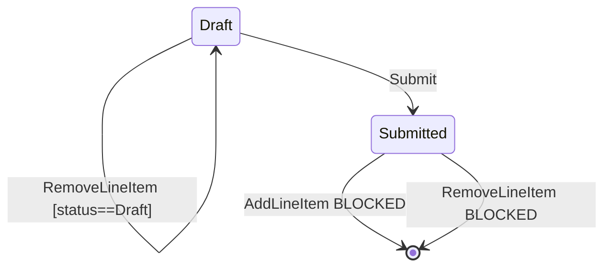
```mermaid
stateDiagram-v2
    Draft --> Draft: AddLineItem [status==Draft]
    Draft --> Draft: RemoveLineItem [status==Draft]
    Draft --> Submitted: Submit
    Submitted --> [*]: AddLineItem BLOCKED
    Submitted --> [*]: RemoveLineItem BLOCKED
```




```go
// => AddLineItem appends a line — only allowed while in Draft
func (po *PurchaseOrder) AddLineItem(item LineItem) error {
    // => invariant: line items are frozen after submission
    if po.status != POStatusDraft {
        return fmt.Errorf(
            "cannot add line item: PO status is %s (must be Draft)",
            po.status,
        )
    }
    // => item is a value — appending copies it into the slice
    po.lineItems = append(po.lineItems, item)
    po.updatedAt = time.Now().UTC()
    return nil
}

// => RemoveLineItem finds and removes by ID — draft-only guard matches Add
func (po *PurchaseOrder) RemoveLineItem(id LineItemId) error {
    // => same invariant as AddLineItem — consistent rule surface
    if po.status != POStatusDraft {
        return fmt.Errorf(
            "cannot remove line item: PO status is %s (must be Draft)",
            po.status,
        )
    }
    // => linear search is acceptable: typical PO has < 100 line items
    for i, item := range po.lineItems {
        if item.ID == id {
            // => remove by swapping with last element — O(1) but unordered
            po.lineItems[i] = po.lineItems[len(po.lineItems)-1]
            po.lineItems = po.lineItems[:len(po.lineItems)-1]
            po.updatedAt = time.Now().UTC()
            return nil
        }
    }
    return fmt.Errorf("line item %s not found", id)
}
```




```rust
impl PurchaseOrder {
    // => add_line_item enforces Draft-only invariant before pushing
    pub fn add_line_item(&mut self, item: LineItem) -> Result<(), POError> {
        // => pattern guard on non-Draft status returns typed error
        if self.status != POStatus::Draft {
            return Err(POError::LineItemsLocked {
                status: self.status.clone(),
            });
        }
        self.line_items.push(item);
        self.updated_at = Utc::now();
        Ok(())
    }

    // => remove_line_item mirrors the same Draft-only invariant
    pub fn remove_line_item(
        &mut self, id: &LineItemId,
    ) -> Result<(), POError> {
        if self.status != POStatus::Draft {
            return Err(POError::LineItemsLocked {
                status: self.status.clone(),
            });
        }
        // => position() returns Option<usize> — None if not found
        let pos = self.line_items.iter()
            .position(|item| &item.id == id)
            .ok_or_else(|| POError::LineItemNotFound { id: id.clone() })?;
        // => swap_remove is O(1) — acceptable for small line-item slices
        self.line_items.swap_remove(pos);
        self.updated_at = Utc::now();
        Ok(())
    }
}
```




> **Key takeaway**: Guarding mutation methods with a status check in the aggregate makes the "frozen after issued" invariant impossible to violate from any caller.

---

## Domain Events Pattern (Examples 32–37)

### Example 32: Outbox Pattern for Reliable Event Publishing

Storing events in the same database transaction as the aggregate prevents ghost events (published but aggregate not saved) and missed events (aggregate saved but event not published). The outbox table is polled by a background publisher that marks each entry published after successful dispatch.

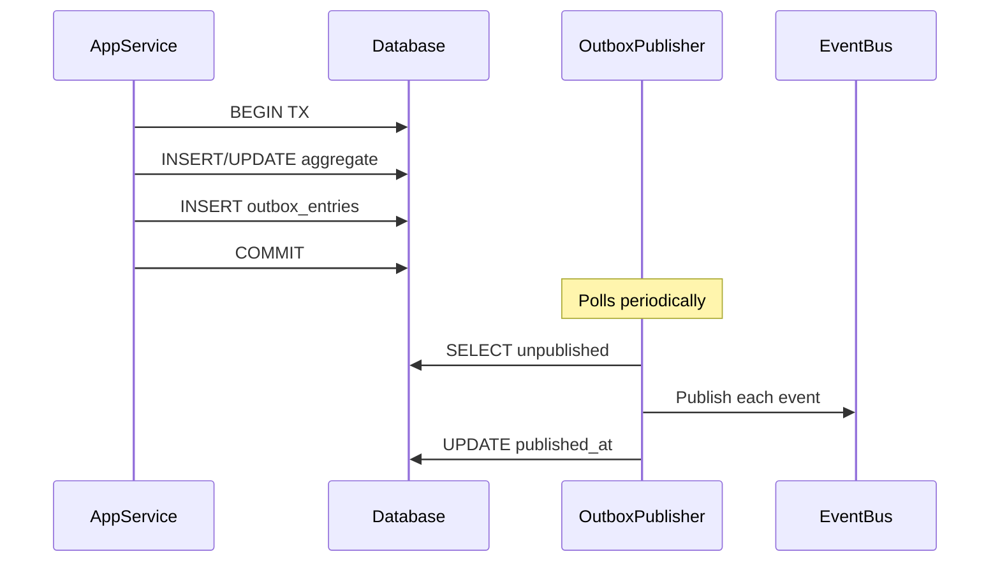
```mermaid
sequenceDiagram
    participant AS as AppService
    participant DB as Database
    participant PUB as OutboxPublisher
    participant BUS as EventBus

    AS->>DB: BEGIN TX
    AS->>DB: INSERT/UPDATE aggregate
    AS->>DB: INSERT outbox_entries
    AS->>DB: COMMIT
    Note over PUB: Polls periodically
    PUB->>DB: SELECT unpublished
    PUB->>BUS: Publish each event
    PUB->>DB: UPDATE published_at
```




```go
// => OutboxEntry persists an event alongside the aggregate in the same TX
type OutboxEntry struct {
    // => UUID string — no domain-type dependency, stable for serialization
    ID          string
    AggregateId string
    // => EventType string key used by the publisher for routing
    EventType   string
    // => Payload is serialized event — JSON or Protobuf
    Payload     []byte
    // => PublishedAt nil means "not yet published" — polled by publisher
    PublishedAt *time.Time
    // => RetryCount for dead-letter detection after N failures
    RetryCount  int
    CreatedAt   time.Time
}

// => OutboxRepository defines the persistence port for outbox entries
type OutboxRepository interface {
    // => Save takes pgx.Tx — MUST be called within the same DB transaction
    Save(ctx context.Context, tx pgx.Tx, entry OutboxEntry) error
    // => FindUnpublished called by background publisher
    FindUnpublished(ctx context.Context) ([]OutboxEntry, error)
    // => MarkPublished called after successful event dispatch
    MarkPublished(ctx context.Context, id string) error
}

// => saveWithOutbox is a helper used by application services
func saveWithOutbox(
    ctx context.Context,
    tx pgx.Tx,
    po *PurchaseOrder,
    poRepo txPORepository,
    outboxRepo OutboxRepository,
) error {
    // => step 1: save aggregate — within transaction
    if err := poRepo.SaveTx(ctx, tx, po); err != nil {
        return err
    }
    // => step 2: drain events from aggregate — resets the slice to empty
    events := po.DrainEvents()
    for _, event := range events {
        payload, err := json.Marshal(event)
        if err != nil {
            return err
        }
        // => step 3: insert each event as outbox entry — same TX
        entry := OutboxEntry{
            ID:          uuid.NewString(),
            AggregateId: string(po.id),
            EventType:   event.EventType(),
            Payload:     payload,
            CreatedAt:   time.Now().UTC(),
        }
        if err := outboxRepo.Save(ctx, tx, entry); err != nil {
            return err
        }
    }
    // => both aggregate and outbox entries committed atomically
    return nil
}
```




```rust
// => serde derives enable JSON serialization of the entry
#[derive(Debug, Clone, Serialize, Deserialize)]
pub struct OutboxEntry {
    pub id: Uuid,
    pub aggregate_id: String,
    // => String event type — no domain-type import in outbox crate
    pub event_type: String,
    // => serde_json::Value avoids schema coupling in the outbox layer
    pub payload: serde_json::Value,
    // => Option<DateTime> — None until published
    pub published_at: Option<DateTime<Utc>>,
    pub retry_count: i32,
    pub created_at: DateTime<Utc>,
}

// => async trait requires the async-trait crate in stable Rust
#[async_trait]
pub trait OutboxRepository: Send + Sync {
    // => Transaction type is a generic parameter for DB portability
    async fn save(
        &self,
        tx: &mut sqlx::Transaction<'_, sqlx::Postgres>,
        entry: OutboxEntry,
    ) -> Result<(), RepoError>;

    async fn find_unpublished(
        &self,
    ) -> Result<Vec<OutboxEntry>, RepoError>;

    async fn mark_published(
        &self, id: Uuid,
    ) -> Result<(), RepoError>;
}
```




> **Key takeaway**: The outbox pattern trades eventual consistency in event delivery for strong consistency in the aggregate + event write — the critical guarantee for reliable event-driven systems.

---

### Example 33: DomainEventBus Interface (Port)

The event bus is a port in hexagonal architecture — the domain package defines the interface, infrastructure provides the adapter. The in-memory bus is sufficient for tests and simple deployments; swap for Kafka or NATS in production by providing a different adapter.

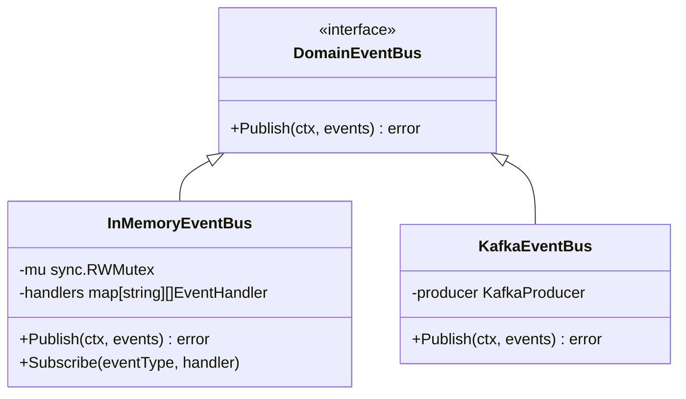
```mermaid
classDiagram
    class DomainEventBus {
        <<interface>>
        +Publish(ctx, events) error
    }
    class InMemoryEventBus {
        -mu sync.RWMutex
        -handlers map[string][]EventHandler
        +Publish(ctx, events) error
        +Subscribe(eventType, handler)
    }
    class KafkaEventBus {
        -producer KafkaProducer
        +Publish(ctx, events) error
    }
    DomainEventBus <|-- InMemoryEventBus
    DomainEventBus <|-- KafkaEventBus
```




```go
// => DomainEventBus interface defined in the domain package
// => infrastructure adapters implement it implicitly (structural typing)
type DomainEventBus interface {
    // => variadic signature: publish one or many events per call
    Publish(ctx context.Context, events ...DomainEvent) error
}

// => InMemoryEventBus for tests and single-process deployments
type InMemoryEventBus struct {
    // => RWMutex: many concurrent readers, exclusive writer
    mu       sync.RWMutex
    // => handlers keyed by EventType() string return value
    handlers map[string][]EventHandler
}

// => Subscribe registers a handler for a specific event type
func (b *InMemoryEventBus) Subscribe(
    eventType string, h EventHandler,
) {
    b.mu.Lock()
    defer b.mu.Unlock()
    b.handlers[eventType] = append(b.handlers[eventType], h)
}

// => Publish dispatches each event to all registered handlers
func (b *InMemoryEventBus) Publish(
    ctx context.Context, events ...DomainEvent,
) error {
    // => read lock: multiple goroutines can publish concurrently
    b.mu.RLock()
    defer b.mu.RUnlock()
    for _, event := range events {
        // => look up handlers by event type string
        handlers, ok := b.handlers[event.EventType()]
        if !ok {
            // => no handlers registered is not an error
            continue
        }
        for _, h := range handlers {
            // => handler errors propagate — caller decides abort or continue
            if err := h.Handle(ctx, event); err != nil {
                return fmt.Errorf(
                    "handler for %s failed: %w", event.EventType(), err,
                )
            }
        }
    }
    return nil
}
```




```rust
// => Send + Sync bounds required for Arc<dyn DomainEventBus>
#[async_trait]
pub trait DomainEventBus: Send + Sync {
    async fn publish(
        &self,
        events: Vec<Box<dyn DomainEvent>>,
    ) -> Result<(), BusError>;
}

// => RwLock allows concurrent reads from multiple async tasks
pub struct InMemoryEventBus {
    handlers: RwLock<
        HashMap<String, Vec<Box<dyn EventHandler + Send + Sync>>>
    >,
}

#[async_trait]
impl DomainEventBus for InMemoryEventBus {
    async fn publish(
        &self,
        events: Vec<Box<dyn DomainEvent>>,
    ) -> Result<(), BusError> {
        // => read() returns a guard — held only for the duration of dispatch
        let handlers = self.handlers.read().await;
        for event in &events {
            let event_type = event.event_type();
            if let Some(hs) = handlers.get(event_type) {
                for h in hs {
                    // => await each handler — sequential dispatch per type
                    h.handle(event.as_ref()).await
                        .map_err(|e| BusError::HandlerFailed {
                            event_type: event_type.to_string(),
                            source: e,
                        })?;
                }
            }
        }
        Ok(())
    }
}
```




> **Key takeaway**: Defining the event bus as a domain interface means the domain layer never imports infrastructure packages — the dependency arrow points inward.

---

### Example 34: EventHandler Pattern

Event handlers consume domain events and perform side effects — sending email, writing audit logs, triggering downstream aggregate updates. The `CanHandle` method routes events to the correct handler without reflection.

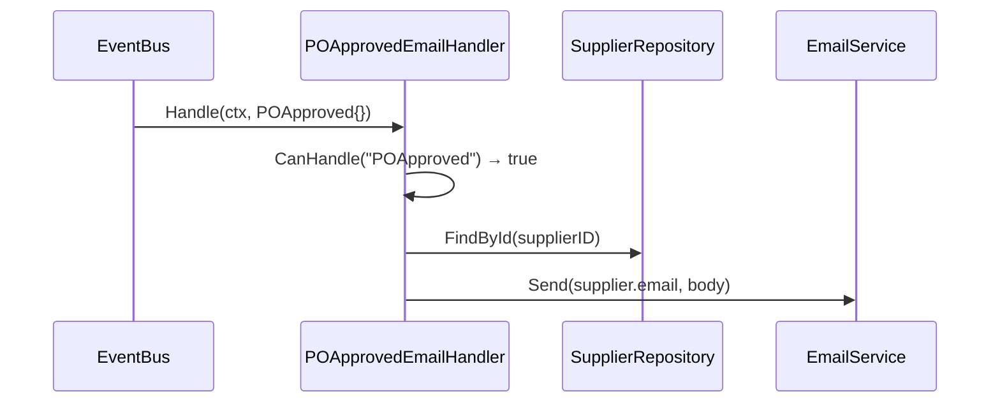
```mermaid
sequenceDiagram
    participant BUS as EventBus
    participant H as POApprovedEmailHandler
    participant SUP as SupplierRepository
    participant EMAIL as EmailService

    BUS->>H: Handle(ctx, POApproved{})
    H->>H: CanHandle("POApproved") → true
    H->>SUP: FindById(supplierID)
    H->>EMAIL: Send(supplier.email, body)
```




```go
// => EventHandler interface: two-method contract for routing + handling
type EventHandler interface {
    Handle(ctx context.Context, event DomainEvent) error
    // => CanHandle enables the bus to skip non-matching handlers cheaply
    CanHandle(eventType string) bool
}

// => POApprovedEmailHandler sends a confirmation email on PO approval
type POApprovedEmailHandler struct {
    emailSvc     EmailService
    supplierRepo SupplierRepository
}

func (h *POApprovedEmailHandler) CanHandle(eventType string) bool {
    // => string match: low coupling, easy to test
    return eventType == "POApproved"
}

func (h *POApprovedEmailHandler) Handle(
    ctx context.Context, event DomainEvent,
) error {
    // => type assertion extracts the concrete event — fail-fast on mismatch
    approved, ok := event.(POApproved)
    if !ok {
        return fmt.Errorf("unexpected event type: %T", event)
    }
    // => fetch supplier to get email address — handler can read from repo
    supplier, err := h.supplierRepo.FindById(ctx, approved.SupplierID)
    if err != nil {
        return fmt.Errorf("supplier lookup failed: %w", err)
    }
    // => delegate email construction to the email service
    return h.emailSvc.Send(
        ctx,
        supplier.Email(),
        fmt.Sprintf("Purchase Order %s approved", approved.POID),
    )
}
```




```rust
// => async_trait required because Handle is async
#[async_trait]
pub trait EventHandler: Send + Sync {
    async fn handle(
        &self, event: &dyn DomainEvent,
    ) -> Result<(), HandlerError>;
    // => can_handle allows O(1) routing without dynamic dispatch overhead
    fn can_handle(&self, event_type: &str) -> bool;
}

pub struct POApprovedEmailHandler {
    email_svc: Arc<dyn EmailService>,
    supplier_repo: Arc<dyn SupplierRepository>,
}

#[async_trait]
impl EventHandler for POApprovedEmailHandler {
    fn can_handle(&self, event_type: &str) -> bool {
        event_type == "POApproved"
    }

    async fn handle(
        &self, event: &dyn DomainEvent,
    ) -> Result<(), HandlerError> {
        // => downcast trait object to concrete type
        let approved = event
            .as_any()
            .downcast_ref::<POApproved>()
            .ok_or(HandlerError::WrongEventType)?;
        let supplier = self.supplier_repo
            .find_by_id(&approved.supplier_id)
            .await
            .map_err(HandlerError::RepoError)?
            .ok_or(HandlerError::SupplierNotFound)?;
        self.email_svc
            .send(
                supplier.email(),
                &format!("Purchase Order {} approved", approved.po_id),
            )
            .await
            .map_err(HandlerError::EmailError)
    }
}
```




> **Key takeaway**: Event handlers should be idempotent — the outbox publisher may deliver the same event more than once, and a duplicate email is far less harmful than a missed one.

---

### Example 35: Three-Way Match Saga

A saga coordinates multiple aggregates across a business transaction that spans aggregate boundaries. The three-way match saga fetches PO, GRN, and Invoice, runs the match guard, and approves or records failure — all without shared transactions between aggregates.

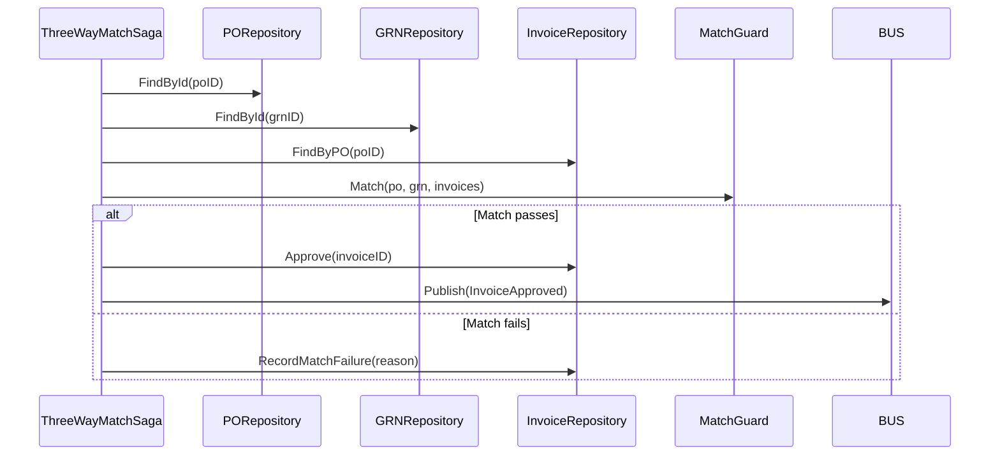
```mermaid
sequenceDiagram
    participant S as ThreeWayMatchSaga
    participant PO as PORepository
    participant GRN as GRNRepository
    participant INV as InvoiceRepository
    participant MG as MatchGuard

    S->>PO: FindById(poID)
    S->>GRN: FindById(grnID)
    S->>INV: FindByPO(poID)
    S->>MG: Match(po, grn, invoices)
    alt Match passes
        S->>INV: Approve(invoiceID)
        S->>BUS: Publish(InvoiceApproved)
    else Match fails
        S->>INV: RecordMatchFailure(reason)
    end
```




```go
// => ThreeWayMatchSaga orchestrates cross-aggregate coordination
type ThreeWayMatchSaga struct {
    // => all dependencies are interfaces — saga is testable in isolation
    poRepo      PORepository
    grnRepo     GRNRepository
    invoiceRepo InvoiceRepository
    matchGuard  MatchGuard
    bus         DomainEventBus
}

// => Execute runs the three-way match for a specific PO + GRN pair
func (s *ThreeWayMatchSaga) Execute(
    ctx context.Context,
    poID PurchaseOrderId,
    grnID GRNId,
) error {
    // => fetch each aggregate independently — no distributed TX needed
    po, err := s.poRepo.FindById(ctx, poID)
    if err != nil {
        return fmt.Errorf("saga: PO lookup failed: %w", err)
    }
    grn, err := s.grnRepo.FindById(ctx, grnID)
    if err != nil {
        return fmt.Errorf("saga: GRN lookup failed: %w", err)
    }
    // => fetch all invoices for this PO — typically one
    invoices, err := s.invoiceRepo.FindByPO(ctx, poID)
    if err != nil {
        return fmt.Errorf("saga: invoice lookup failed: %w", err)
    }
    // => delegate match logic to a domain service (not in the saga itself)
    result := s.matchGuard.Match(po, grn, invoices)
    if result.Passed {
        // => approve the invoice through the aggregate's own method
        for _, inv := range invoices {
            if err := inv.Approve(); err != nil {
                return err
            }
            if err := s.invoiceRepo.Save(ctx, inv); err != nil {
                return err
            }
        }
        // => publish integration event after all saves succeed
        return s.bus.Publish(ctx, InvoiceApproved{POID: poID})
    }
    // => compensation: record failure without rolling back other aggregates
    for _, inv := range invoices {
        inv.RecordMatchFailure(result.FailureReason)
        _ = s.invoiceRepo.Save(ctx, inv)
    }
    return nil
}
```




```rust
pub struct ThreeWayMatchSaga {
    po_repo:      Arc<dyn PORepository>,
    grn_repo:     Arc<dyn GRNRepository>,
    invoice_repo: Arc<dyn InvoiceRepository>,
    match_guard:  Arc<dyn MatchGuard>,
    bus:          Arc<dyn DomainEventBus>,
}

impl ThreeWayMatchSaga {
    pub async fn execute(
        &self,
        po_id: PurchaseOrderId,
        grn_id: GrnId,
    ) -> Result<(), SagaError> {
        // => fetch aggregates independently — no shared transaction
        let po = self.po_repo.find_by_id(&po_id).await?
            .ok_or(SagaError::PONotFound)?;
        let grn = self.grn_repo.find_by_id(&grn_id).await?
            .ok_or(SagaError::GrnNotFound)?;
        let mut invoices = self.invoice_repo.find_by_po(&po_id).await?;
        // => domain service runs the match — returns a typed result
        let result = self.match_guard.match_po_grn_invoice(
            &po, &grn, &invoices,
        );
        if result.passed {
            for inv in invoices.iter_mut() {
                inv.approve().map_err(SagaError::InvoiceError)?;
                self.invoice_repo.save(inv).await?;
            }
            self.bus.publish(vec![
                Box::new(InvoiceApproved { po_id: po_id.clone() })
            ]).await?;
        } else {
            // => compensation: record failure on each invoice
            for inv in invoices.iter_mut() {
                inv.record_match_failure(result.failure_reason.clone());
                let _ = self.invoice_repo.save(inv).await;
            }
        }
        Ok(())
    }
}
```




> **Key takeaway**: Sagas hold no domain state themselves — they are pure orchestration; the aggregates they coordinate own and enforce all invariants.

---

### Example 36: ProcessManager (Stateful Coordinator)

Process managers track their own state across events, unlike stateless sagas. The `MatchProcessManager` persists in the database and advances through states as domain events arrive, surviving service restarts.

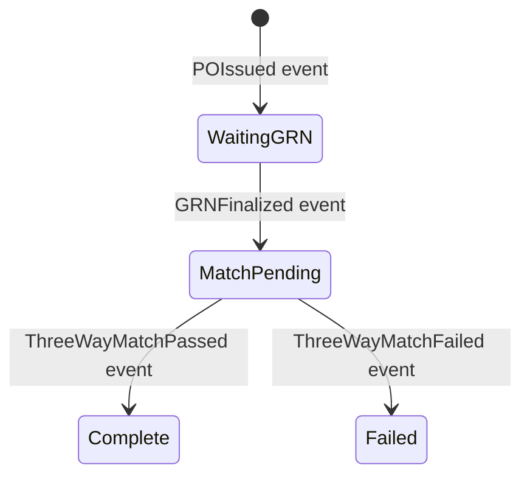
```mermaid
stateDiagram-v2
    [*] --> WaitingGRN: POIssued event
    WaitingGRN --> MatchPending: GRNFinalized event
    MatchPending --> Complete: ThreeWayMatchPassed event
    MatchPending --> Failed: ThreeWayMatchFailed event
```




```go
// => MatchPMState tracks the process manager's own lifecycle
type MatchPMState string

const (
    // => initial state: waiting for GRN to be finalized
    PMWaitingGRN  MatchPMState = "waiting_grn"
    // => GRN arrived: match can now run
    PMMatchPending MatchPMState = "match_pending"
    // => terminal success state
    PMComplete    MatchPMState = "complete"
    // => terminal failure state
    PMFailed      MatchPMState = "match_failed"
)

// => MatchProcessManager is persisted like an aggregate — has its own ID
type MatchProcessManager struct {
    id    string
    poID  PurchaseOrderId
    // => grnID is nil until GRNFinalized event arrives
    grnID *GRNId
    state MatchPMState
    createdAt time.Time
    uncommittedEvents []DomainEvent
}

// => OnGRNFinalized advances the PM when a GRN is finalized
func (pm *MatchProcessManager) OnGRNFinalized(
    event GRNFinalized,
) error {
    // => PM only reacts to GRNs that match its own PO ID
    if event.POId != pm.poID {
        return nil
    }
    if pm.state != PMWaitingGRN {
        // => idempotent: already processed this GRN event
        return nil
    }
    pm.grnID = &event.GRNId
    pm.state = PMMatchPending
    // => emit command-event so the match saga knows to run
    pm.uncommittedEvents = append(
        pm.uncommittedEvents,
        RunThreeWayMatch{POID: pm.poID, GRNID: event.GRNId},
    )
    return nil
}
```




```rust
// => enum state with associated data — richer than string constants
#[derive(Debug, Clone, PartialEq)]
pub enum MatchPMState {
    WaitingGrn,
    // => MatchPending carries the GRN ID so we don't need a separate field
    MatchPending { grn_id: GrnId },
    Complete,
    Failed { reason: String },
}

pub struct MatchProcessManager {
    id: String,
    po_id: PurchaseOrderId,
    // => state encodes presence of grn_id — no separate Option<GrnId>
    state: MatchPMState,
    created_at: DateTime<Utc>,
    uncommitted_events: Vec<Box<dyn DomainEvent>>,
}

impl MatchProcessManager {
    pub fn on_grn_finalized(
        &mut self, event: &GrnFinalized,
    ) -> Result<(), PMError> {
        // => only react to GRNs linked to our PO
        if event.po_id != self.po_id {
            return Ok(());
        }
        // => pattern match on current state — exhaustive check
        match &self.state {
            MatchPMState::WaitingGrn => {
                // => transition carries grn_id into the new state variant
                self.state = MatchPMState::MatchPending {
                    grn_id: event.grn_id.clone(),
                };
                self.uncommitted_events.push(Box::new(RunThreeWayMatch {
                    po_id: self.po_id.clone(),
                    grn_id: event.grn_id.clone(),
                }));
                Ok(())
            }
            // => already advanced — idempotent no-op
            _ => Ok(()),
        }
    }
}
```




> **Key takeaway**: Process managers are aggregates for coordination state — they are persisted, have their own identity, and must survive service restarts to guarantee event-driven workflows complete.

---

### Example 37: Read Model from Event Stream

Read models are projections built by applying events to a flat data structure optimized for queries. The `POListProjection` maintains a summary per PO, updated on each relevant event — no aggregate reconstruction needed to answer list queries.

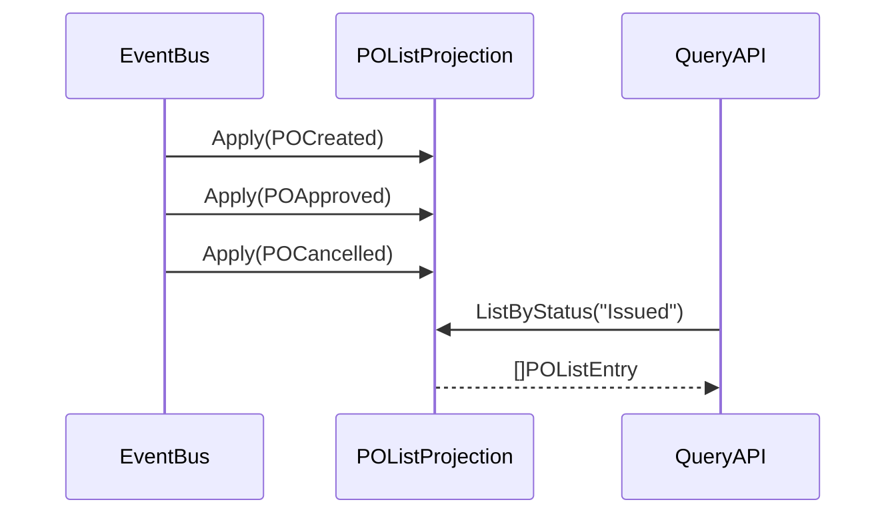
```mermaid
sequenceDiagram
    participant BUS as EventBus
    participant PROJ as POListProjection
    participant API as QueryAPI

    BUS->>PROJ: Apply(POCreated)
    BUS->>PROJ: Apply(POApproved)
    BUS->>PROJ: Apply(POCancelled)
    API->>PROJ: ListByStatus("Issued")
    PROJ-->>API: []POListEntry
```




```go
// => POListEntry is a flat DTO optimized for list rendering
type POListEntry struct {
    ID              PurchaseOrderId
    SupplierCode    string
    Status          string
    TotalValueCents int64
    LineItemCount   int
    // => CreatedAt exposed for sort order — no full aggregate needed
    CreatedAt       time.Time
}

// => POListProjection is an in-memory read model
type POListProjection struct {
    mu      sync.RWMutex
    entries map[PurchaseOrderId]POListEntry
}

// => Apply updates the projection for any incoming event
func (p *POListProjection) Apply(event DomainEvent) {
    p.mu.Lock()
    defer p.mu.Unlock()
    // => type switch routes to the correct update logic
    switch e := event.(type) {
    case POCreated:
        // => create initial entry on POCreated
        p.entries[e.ID] = POListEntry{
            ID:           e.ID,
            SupplierCode: string(e.SupplierID),
            Status:       "Draft",
            CreatedAt:    e.OccurredAt,
        }
    case POApproved:
        // => update status in place — only changed field
        if entry, ok := p.entries[e.POID]; ok {
            entry.Status = "Issued"
            p.entries[e.POID] = entry
        }
    case POCancelled:
        if entry, ok := p.entries[e.POID]; ok {
            entry.Status = "Cancelled"
            p.entries[e.POID] = entry
        }
    }
    // => unknown events are silently ignored — projection is selective
}

// => ListByStatus returns entries matching a status — O(n) scan
func (p *POListProjection) ListByStatus(
    status string,
) []POListEntry {
    p.mu.RLock()
    defer p.mu.RUnlock()
    var result []POListEntry
    for _, entry := range p.entries {
        if entry.Status == status {
            result = append(result, entry)
        }
    }
    return result
}
```




```rust
#[derive(Debug, Clone)]
pub struct POListEntry {
    pub id: PurchaseOrderId,
    pub supplier_code: String,
    pub status: String,
    pub total_value_cents: i64,
    pub line_item_count: usize,
    pub created_at: DateTime<Utc>,
}

// => RwLock<HashMap> — many concurrent readers, exclusive writer
pub struct POListProjection {
    entries: RwLock<HashMap<PurchaseOrderId, POListEntry>>,
}

impl POListProjection {
    pub async fn apply(&self, event: &dyn DomainEvent) {
        // => acquire write lock only when mutating
        let mut entries = self.entries.write().await;
        match event.event_type() {
            "POCreated" => {
                if let Some(e) = event.as_any()
                    .downcast_ref::<POCreated>()
                {
                    entries.insert(e.id.clone(), POListEntry {
                        id: e.id.clone(),
                        supplier_code: e.supplier_id.to_string(),
                        status: "Draft".to_string(),
                        total_value_cents: 0,
                        line_item_count: 0,
                        created_at: e.occurred_at,
                    });
                }
            }
            "POApproved" => {
                if let Some(e) = event.as_any()
                    .downcast_ref::<POApproved>()
                {
                    if let Some(entry) = entries.get_mut(&e.po_id) {
                        // => mutate only the changed field
                        entry.status = "Issued".to_string();
                    }
                }
            }
            // => unknown events are no-ops — projection is additive
            _ => {}
        }
    }

    pub async fn list_by_status(
        &self, status: &str,
    ) -> Vec<POListEntry> {
        // => read lock — non-exclusive, multiple concurrent queries OK
        let entries = self.entries.read().await;
        entries.values()
            .filter(|e| e.status == status)
            .cloned()
            .collect()
    }
}
```




> **Key takeaway**: Read models decouple query performance from aggregate complexity — rebuild the projection by replaying all events from the outbox if it falls out of sync.

---

## Cross-Context Coordination (Examples 38–43)

### Example 38: Anti-Corruption Layer (ACL)

The ACL translates external supplier data from the ERP system into internal domain types, preventing ERP concepts from polluting the procurement domain. External vendor codes become internal supplier codes; payment terms become a domain value object; IBAN strings become a validated `BankAccount`.

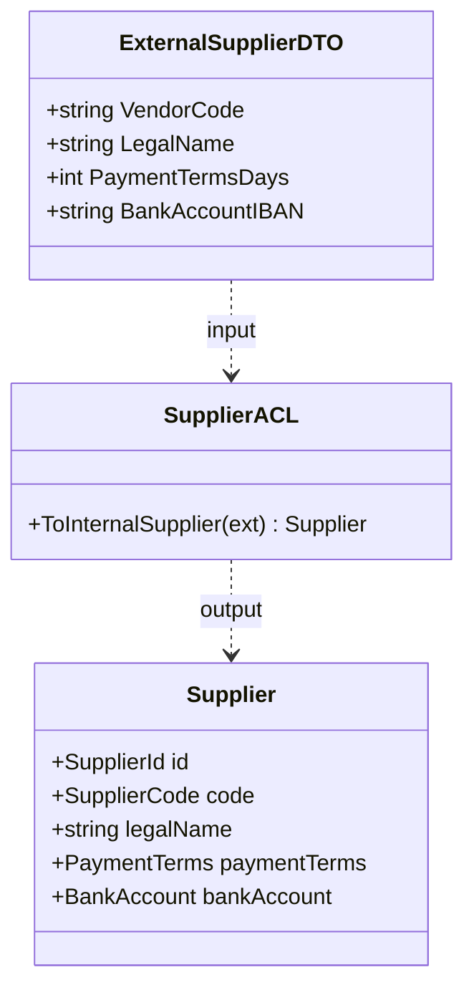
```mermaid
classDiagram
    class ExternalSupplierDTO {
        +string VendorCode
        +string LegalName
        +int PaymentTermsDays
        +string BankAccountIBAN
    }
    class SupplierACL {
        +ToInternalSupplier(ext) Supplier
    }
    class Supplier {
        +SupplierId id
        +SupplierCode code
        +string legalName
        +PaymentTerms paymentTerms
        +BankAccount bankAccount
    }
    ExternalSupplierDTO ..> SupplierACL : input
    SupplierACL ..> Supplier : output
```




```go
// => ExternalSupplierDTO represents the ERP system's data shape
// => lives in the adapter/infra package — domain never imports this
type ExternalSupplierDTO struct {
    // => VendorCode is the ERP's identifier — different naming convention
    VendorCode       string
    LegalName        string
    // => PaymentTermsDays is an integer in ERP, but a value object internally
    PaymentTermsDays int
    // => BankAccountIBAN is unvalidated in the ERP export
    BankAccountIBAN  string
}

// => SupplierACL is the anti-corruption adapter
type SupplierACL struct {
    // => external client hides HTTP/gRPC transport details
    externalClient ExternalSupplierClient
}

// => ToInternalSupplier translates ERP DTO to domain Supplier
func (acl *SupplierACL) ToInternalSupplier(
    ext ExternalSupplierDTO,
) (*Supplier, error) {
    // => validate VendorCode format before creating domain ID
    if !isValidVendorCode(ext.VendorCode) {
        return nil, fmt.Errorf(
            "invalid vendor code format: %q", ext.VendorCode,
        )
    }
    // => ACL owns the mapping rule: VendorCode → SupplierCode
    code, err := NewSupplierCode(ext.VendorCode)
    if err != nil {
        return nil, err
    }
    // => PaymentTermsDays integer → PaymentTerms value object
    terms, err := NewPaymentTerms(ext.PaymentTermsDays)
    if err != nil {
        return nil, fmt.Errorf(
            "invalid payment terms %d days: %w",
            ext.PaymentTermsDays, err,
        )
    }
    // => IBAN string → validated BankAccount value object
    bank, err := NewBankAccount(ext.BankAccountIBAN)
    if err != nil {
        return nil, fmt.Errorf(
            "invalid IBAN %q: %w", ext.BankAccountIBAN, err,
        )
    }
    // => construct domain Supplier — domain never sees ExternalSupplierDTO
    return &Supplier{
        id:           NewSupplierId(),
        code:         code,
        legalName:    ext.LegalName,
        paymentTerms: terms,
        bankAccount:  bank,
    }, nil
}
```




```rust
// => ExternalSupplierDto — infra/adapter module only; domain never imports
#[derive(Debug, Deserialize)]
pub struct ExternalSupplierDto {
    pub vendor_code: String,
    pub legal_name: String,
    pub payment_terms_days: u32,
    pub bank_account_iban: String,
}

// => SupplierAcl wraps the external HTTP/gRPC client
pub struct SupplierAcl {
    external_client: Arc<dyn ExternalSupplierClient>,
}

impl SupplierAcl {
    // => Result return: translation can fail on invalid ERP data
    pub fn to_internal_supplier(
        &self,
        ext: ExternalSupplierDto,
    ) -> Result<Supplier, AclError> {
        // => smart constructor validates format and maps naming convention
        let code = SupplierCode::new(ext.vendor_code)
            .map_err(AclError::InvalidVendorCode)?;
        // => domain value object constructor enforces payment term rules
        let terms = PaymentTerms::new(ext.payment_terms_days)
            .map_err(AclError::InvalidPaymentTerms)?;
        // => IBAN validation happens inside BankAccount::new
        let bank = BankAccount::new(ext.bank_account_iban)
            .map_err(AclError::InvalidIban)?;
        // => domain Supplier constructed — all fields validated
        Ok(Supplier::new(SupplierId::generate(), code, ext.legal_name, terms, bank))
    }
}
```




> **Key takeaway**: The ACL is the seam between bounded contexts — it owns the translation logic so neither side needs to know about the other's internal model.

---

### Example 39: Context Map — Purchasing and Finance Contexts

Purchasing and Finance have overlapping real-world concepts — a Supplier in Purchasing is a Vendor in Finance — but their models differ in purpose. The context map makes the relationship explicit through a dedicated translator package so each team can evolve their model independently.

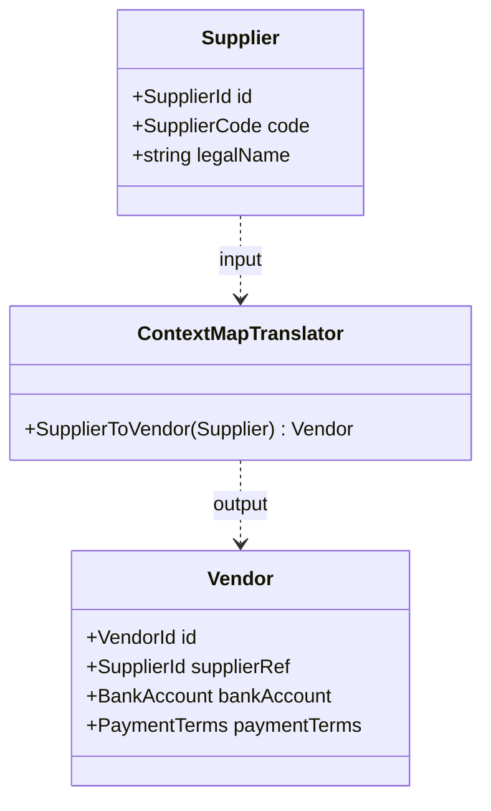
```mermaid
classDiagram
    class Supplier {
        +SupplierId id
        +SupplierCode code
        +string legalName
    }
    class Vendor {
        +VendorId id
        +SupplierId supplierRef
        +BankAccount bankAccount
        +PaymentTerms paymentTerms
    }
    class ContextMapTranslator {
        +SupplierToVendor(Supplier) Vendor
    }
    Supplier ..> ContextMapTranslator : input
    ContextMapTranslator ..> Vendor : output
```




```go
// => purchasing package owns the Supplier model
package purchasing

// => Supplier is the procurement-domain concept for a trading partner
type Supplier struct {
    id       SupplierId
    code     SupplierCode
    legalName string
}

// ─────────────────────────────────────────────────────────────────
// => finance package owns the Vendor model — different shape, same entity
package finance

// => Vendor tracks payment obligations; not concerned with purchasing detail
type Vendor struct {
    id          VendorId
    // => supplierRef links to Purchasing context by ID — no import of Supplier
    supplierRef purchasing.SupplierId
    bankAccount BankAccount
    paymentTerms PaymentTerms
}

// ─────────────────────────────────────────────────────────────────
// => contextmap package owns the translation — neither domain imports the other
package contextmap

// => SupplierToVendor translates Purchasing Supplier → Finance Vendor
// => called by Finance ACL when a new supplier needs onboarding
func SupplierToVendor(
    s purchasing.Supplier,
    bank finance.BankAccount,
    terms finance.PaymentTerms,
) finance.Vendor {
    // => cross-context ID mapping: SupplierId stored as supplierRef
    return finance.Vendor{
        ID:          finance.NewVendorId(),
        SupplierRef: s.ID(),
        BankAccount: bank,
        PaymentTerms: terms,
    }
}
```




```rust
// => purchasing module defines Supplier
mod purchasing {
    pub struct Supplier {
        pub id: SupplierId,
        pub code: SupplierCode,
        pub legal_name: String,
    }
}

// => finance module defines Vendor — separate module, no Supplier import
mod finance {
    // => supplier_ref stores the cross-context link by ID value
    pub struct Vendor {
        pub id: VendorId,
        pub supplier_ref: super::purchasing::SupplierId,
        pub bank_account: BankAccount,
        pub payment_terms: PaymentTerms,
    }
}

// => context_map module owns the translation function
mod context_map {
    use super::{finance, purchasing};

    // => translation takes both domain objects as value parameters
    pub fn translate_supplier_to_vendor(
        supplier: &purchasing::Supplier,
        bank: finance::BankAccount,
        terms: finance::PaymentTerms,
    ) -> finance::Vendor {
        // => Finance generates its own ID — independent identity
        finance::Vendor {
            id: finance::VendorId::generate(),
            // => clone the SupplierId for the cross-context reference
            supplier_ref: supplier.id.clone(),
            bank_account: bank,
            payment_terms: terms,
        }
    }
}
```




> **Key takeaway**: A context map translator lives in a dedicated package so that neither bounded context imports the other's domain types — changes to one model require only updating the translator.

---

### Example 40: Shared Kernel — Money Type

The shared kernel contains only concepts that both bounded contexts need to remain identical. `Money` is a canonical example — financial calculations must be consistent across Purchasing and Finance. The kernel is kept minimal to limit coupling; any addition requires both teams to agree.

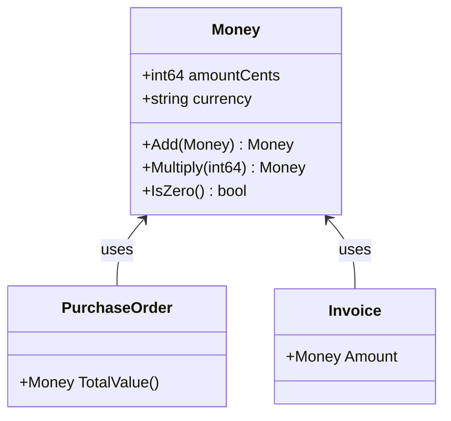
```mermaid
classDiagram
    class Money {
        +int64 amountCents
        +string currency
        +Add(Money) Money
        +Multiply(int64) Money
        +IsZero() bool
    }
    class PurchaseOrder {
        +Money TotalValue()
    }
    class Invoice {
        +Money Amount
    }
    Money <-- PurchaseOrder : uses
    Money <-- Invoice : uses
```




```go
// => sharedkernel package — imported by both purchasing and finance
package sharedkernel

// => Money is a value object in the shared kernel
// => storing cents avoids floating-point rounding errors
type Money struct {
    // => amountCents is unexported — use Add/Multiply for arithmetic
    amountCents int64
    // => currency is a string here; could be an enum for more strictness
    currency    string
}

// => NewMoney is the single constructor — validates currency format
func NewMoney(amountCents int64, currency string) (Money, error) {
    if len(currency) != 3 {
        return Money{}, fmt.Errorf("currency must be ISO 4217 (3 chars)")
    }
    return Money{amountCents: amountCents, currency: currency}, nil
}

// => Add returns a new Money — shared kernel types are immutable
func (m Money) Add(other Money) (Money, error) {
    // => currency mismatch is a domain error, not a runtime panic
    if m.currency != other.currency {
        return Money{}, fmt.Errorf(
            "currency mismatch: %s vs %s", m.currency, other.currency,
        )
    }
    return Money{
        amountCents: m.amountCents + other.amountCents,
        currency:    m.currency,
    }, nil
}

// => Multiply scales money by an integer factor (e.g. quantity)
func (m Money) Multiply(factor int64) Money {
    return Money{amountCents: m.amountCents * factor, currency: m.currency}
}

// => IsZero is a convenience predicate used in validation checks
func (m Money) IsZero() bool { return m.amountCents == 0 }
```




```rust
// => shared_kernel crate — both purchasing and finance depend on it
pub mod shared_kernel {
    // => Copy + Clone: Money is small enough to pass by value
    #[derive(Debug, Clone, Copy, PartialEq, Eq)]
    pub struct Money {
        // => i64 cents — no f64; avoids IEEE 754 rounding errors
        amount_cents: i64,
        // => &'static str for well-known currencies; String for dynamic
        currency: &'static str,
    }

    impl Money {
        // => Result constructor — rejects invalid currency at construction
        pub fn new(amount_cents: i64, currency: &'static str)
            -> Result<Self, MoneyError>
        {
            if currency.len() != 3 {
                return Err(MoneyError::InvalidCurrency);
            }
            Ok(Money { amount_cents, currency })
        }

        // => add returns Result — mismatched currencies are a domain error
        pub fn add(self, other: Money) -> Result<Money, MoneyError> {
            if self.currency != other.currency {
                return Err(MoneyError::CurrencyMismatch);
            }
            Ok(Money {
                amount_cents: self.amount_cents + other.amount_cents,
                currency: self.currency,
            })
        }

        // => multiply is infallible — only scales the amount
        pub fn multiply(self, factor: i64) -> Money {
            Money {
                amount_cents: self.amount_cents * factor,
                currency: self.currency,
            }
        }

        pub fn is_zero(self) -> bool { self.amount_cents == 0 }
    }
}
```




> **Key takeaway**: The shared kernel is intentionally small — every type added to it increases the cost of change because all teams must agree before modifying it.

---

### Example 41: Integration Event (Published Language)

Integration events cross context boundaries and use only primitive types — no domain types from either context. This prevents serialization coupling: if Purchasing renames `PurchaseOrderId`, Finance's consumer does not need to recompile.

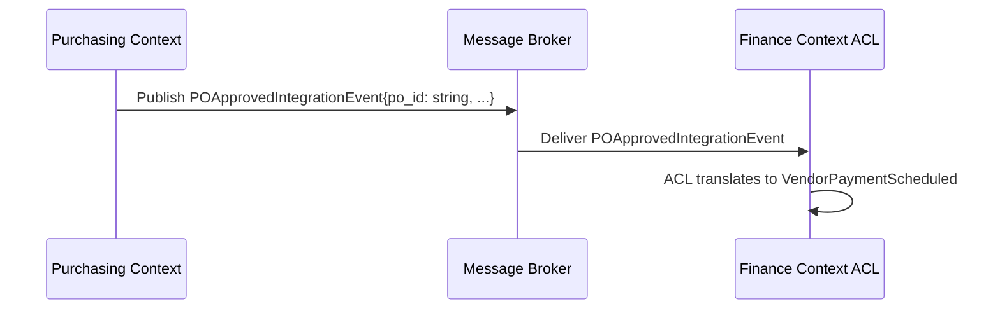
```mermaid
sequenceDiagram
    participant PUR as Purchasing Context
    participant MSG as Message Broker
    participant FIN as Finance Context ACL

    PUR->>MSG: Publish POApprovedIntegrationEvent{po_id: string, ...}
    MSG->>FIN: Deliver POApprovedIntegrationEvent
    FIN->>FIN: ACL translates to VendorPaymentScheduled
```




```go
// => Integration events live in a shared contracts package
// => NOT in the domain package — no domain-type imports
package contracts

// => POApprovedIntegrationEvent uses primitive types only
type POApprovedIntegrationEvent struct {
    // => string, not PurchaseOrderId — consumers need no domain dependency
    POId         string
    // => SupplierCode string, not SupplierId — same reasoning
    SupplierCode string
    // => primitive int64 cents, not Money value object
    TotalAmountCents int64
    Currency     string
    LineItemCount int
    // => time.Time is standard library — safe to share across contexts
    ApprovedAt   time.Time
}

// => serialize the event for the message broker
func (e POApprovedIntegrationEvent) Marshal() ([]byte, error) {
    // => JSON is the canonical wire format for integration events
    return json.Marshal(e)
}

// => Unmarshal is the consumer-side deserializer
func UnmarshalPOApproved(data []byte) (POApprovedIntegrationEvent, error) {
    var event POApprovedIntegrationEvent
    err := json.Unmarshal(data, &event)
    // => error here means a schema mismatch — consumer needs updating
    return event, err
}
```




```rust
// => serde derives are the only dependency — no domain types
#[derive(Debug, Clone, Serialize, Deserialize)]
pub struct POApprovedIntegrationEvent {
    // => String, not PurchaseOrderId — stable across domain refactors
    pub po_id: String,
    pub supplier_code: String,
    // => i64 cents — primitive, not Money struct
    pub total_amount_cents: i64,
    pub currency: String,
    pub line_item_count: u32,
    // => DateTime<Utc> from chrono — widely supported serialization
    pub approved_at: DateTime<Utc>,
}

impl POApprovedIntegrationEvent {
    // => serialize for the message broker
    pub fn to_json(&self) -> Result<String, serde_json::Error> {
        serde_json::to_string(self)
    }

    // => deserialize on the consumer side — schema mismatch returns Err
    pub fn from_json(s: &str)
        -> Result<Self, serde_json::Error>
    {
        serde_json::from_str(s)
    }
}
```




> **Key takeaway**: Integration events are the public API between bounded contexts — keep them backward-compatible by only adding optional fields, never removing or renaming existing ones.

---

### Example 42: ACL Translating Integration Events

Finance context's ACL receives the `POApprovedIntegrationEvent` integration event and produces Finance's own `VendorPaymentScheduled` domain event. Finance never sees Purchasing's domain types; the ACL absorbs the translation.

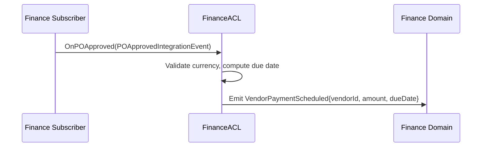
```mermaid
sequenceDiagram
    participant SUB as Finance Subscriber
    participant ACL as FinanceACL
    participant FIN as Finance Domain

    SUB->>ACL: OnPOApproved(POApprovedIntegrationEvent)
    ACL->>ACL: Validate currency, compute due date
    ACL->>FIN: Emit VendorPaymentScheduled{vendorId, amount, dueDate}
```




```go
// => FinanceACL translates integration events into Finance domain events
type FinanceACL struct {
    // => vendorRepo needed to look up the Finance Vendor by supplier code
    vendorRepo VendorRepository
}

// => OnPOApproved is called by the Finance message subscriber
func (acl *FinanceACL) OnPOApproved(
    ctx context.Context,
    event contracts.POApprovedIntegrationEvent,
) (*VendorPaymentScheduled, error) {
    // => look up the Finance Vendor using the supplier code from the event
    vendor, err := acl.vendorRepo.FindBySupplierCode(
        ctx, event.SupplierCode,
    )
    if err != nil {
        return nil, fmt.Errorf("ACL: vendor lookup failed: %w", err)
    }
    // => validate currency on the Finance side — Finance has its own rules
    money, err := sharedkernel.NewMoney(
        event.TotalAmountCents, event.Currency,
    )
    if err != nil {
        return nil, fmt.Errorf("ACL: invalid money: %w", err)
    }
    // => compute due date using Finance's own payment terms logic
    dueDate := vendor.PaymentTerms().DueDateFrom(event.ApprovedAt)
    // => produce Finance domain event — no Purchasing types used
    return &VendorPaymentScheduled{
        VendorId:  vendor.ID(),
        Amount:    money,
        DueDate:   dueDate,
        SourcePOId: event.POId,
    }, nil
}
```




```rust
pub struct FinanceAcl {
    vendor_repo: Arc<dyn VendorRepository>,
}

impl FinanceAcl {
    // => Result: translation can fail on missing vendor or invalid money
    pub async fn on_po_approved(
        &self,
        event: POApprovedIntegrationEvent,
    ) -> Result<VendorPaymentScheduled, AclError> {
        // => look up Finance Vendor by supplier code string
        let vendor = self.vendor_repo
            .find_by_supplier_code(&event.supplier_code)
            .await
            .map_err(AclError::RepoError)?
            .ok_or(AclError::VendorNotFound)?;
        // => validate money on the Finance side using shared kernel
        let amount = Money::new(
            event.total_amount_cents, &event.currency,
        ).map_err(AclError::InvalidMoney)?;
        // => Finance's own payment terms computes the due date
        let due_date = vendor
            .payment_terms()
            .due_date_from(event.approved_at);
        // => produce Finance domain event — Purchasing types absent
        Ok(VendorPaymentScheduled {
            vendor_id: vendor.id().clone(),
            amount,
            due_date,
            source_po_id: event.po_id,
        })
    }
}
```




> **Key takeaway**: The Finance ACL absorbs the impedance between integration events and Finance domain events — Finance's domain model stays pure and uncontaminated by Purchasing's concepts.

---

### Example 43: Shared Kernel Version Evolution

When the shared kernel must change, both teams coordinate. Versioned types prevent silent breakage: existing consumers continue compiling against `MoneyV1` while migrating to `MoneyV2`, after which `MoneyV1` is removed.

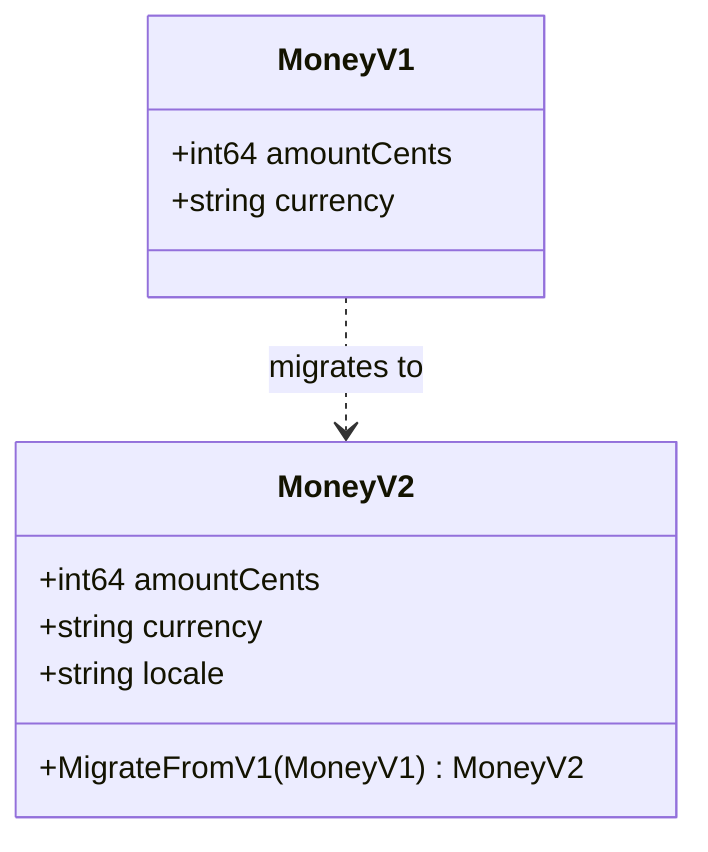
```mermaid
classDiagram
    class MoneyV1 {
        +int64 amountCents
        +string currency
    }
    class MoneyV2 {
        +int64 amountCents
        +string currency
        +string locale
        +MigrateFromV1(MoneyV1) MoneyV2
    }
    MoneyV1 ..> MoneyV2 : migrates to
```




```go
// => MoneyV1 — the current shared kernel type used by all consumers
type MoneyV1 struct {
    AmountCents int64
    Currency    string
}

// => MoneyV2 adds locale for formatting — breaking change requires migration
type MoneyV2 struct {
    AmountCents int64
    Currency    string
    // => locale is the new field — not present in V1
    Locale      string
}

// => MigrateFromV1 provides an explicit conversion path
// => both teams agreed: missing locale defaults to "en-US"
func MigrateFromV1(v1 MoneyV1) MoneyV2 {
    return MoneyV2{
        AmountCents: v1.AmountCents,
        Currency:    v1.Currency,
        // => default locale applied during migration — documented contract
        Locale:      "en-US",
    }
}

// => example: Purchasing migrates its Money usage before V1 is removed
func (po *PurchaseOrder) TotalValueV2() MoneyV2 {
    // => call migration helper — one-line upgrade path
    return MigrateFromV1(po.TotalValueV1())
}
```




```rust
// => MoneyV1 — current shared kernel type
#[derive(Debug, Clone, Copy)]
pub struct MoneyV1 {
    pub amount_cents: i64,
    pub currency: &'static str,
}

// => MoneyV2 adds locale — version suffix prevents accidental V1 usage
#[derive(Debug, Clone)]
pub struct MoneyV2 {
    pub amount_cents: i64,
    pub currency: &'static str,
    // => locale is required in V2 — cannot accidentally be None
    pub locale: String,
}

impl MoneyV2 {
    // => From<MoneyV1> provides idiomatic Rust conversion
    pub fn migrate_from_v1(v1: MoneyV1) -> Self {
        MoneyV2 {
            amount_cents: v1.amount_cents,
            currency: v1.currency,
            // => default locale agreed by both teams at migration time
            locale: "en-US".to_string(),
        }
    }
}

// => impl From enables `MoneyV2::from(v1)` and `.into()` syntax
impl From<MoneyV1> for MoneyV2 {
    fn from(v1: MoneyV1) -> Self {
        MoneyV2::migrate_from_v1(v1)
    }
}
```




> **Key takeaway**: Version suffixes on shared kernel types make migrations explicit and gradual — both teams update independently before the old version is deleted.

---

## Repository Pattern (Examples 44–48)

### Example 44: Repository Interface (Port)

The repository interface is a port in hexagonal architecture — the domain package defines what it needs, infrastructure provides how it delivers it. The interface lives in the domain package; concrete adapters live in the infrastructure package.

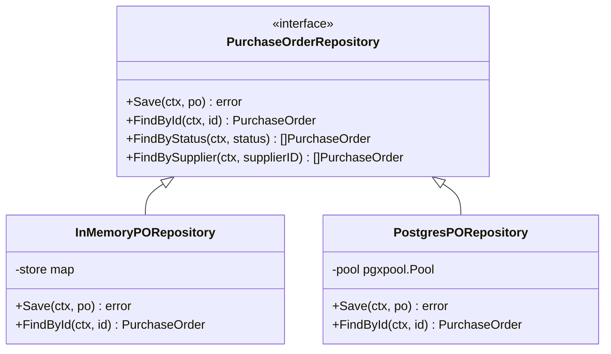
```mermaid
classDiagram
    class PurchaseOrderRepository {
        <<interface>>
        +Save(ctx, po) error
        +FindById(ctx, id) PurchaseOrder
        +FindByStatus(ctx, status) []PurchaseOrder
        +FindBySupplier(ctx, supplierID) []PurchaseOrder
    }
    class InMemoryPORepository {
        -store map
        +Save(ctx, po) error
        +FindById(ctx, id) PurchaseOrder
    }
    class PostgresPORepository {
        -pool pgxpool.Pool
        +Save(ctx, po) error
        +FindById(ctx, id) PurchaseOrder
    }
    PurchaseOrderRepository <|-- InMemoryPORepository
    PurchaseOrderRepository <|-- PostgresPORepository
```




```go
// => Repository interface defined in the domain package
// => no import of pgx, sql, or any infrastructure package here
type PurchaseOrderRepository interface {
    // => Save upserts: create if new, update if exists
    Save(ctx context.Context, po *PurchaseOrder) error
    // => FindById returns nil if not found — error is for infrastructure failures
    FindById(
        ctx context.Context, id PurchaseOrderId,
    ) (*PurchaseOrder, error)
    // => FindByStatus supports common dashboard query — list all Drafts, etc.
    FindByStatus(
        ctx context.Context, status POStatus,
    ) ([]*PurchaseOrder, error)
    // => FindBySupplier supports supplier-centric views
    FindBySupplier(
        ctx context.Context, supplierID SupplierId,
    ) ([]*PurchaseOrder, error)
}
```




```rust
// => async_trait required: async methods not yet stable in traits
// => Send + Sync: required for Arc<dyn PurchaseOrderRepository>
#[async_trait]
pub trait PurchaseOrderRepository: Send + Sync {
    // => Result<(), RepoError>: explicit error type, not Box<dyn Error>
    async fn save(&self, po: &PurchaseOrder) -> Result<(), RepoError>;

    // => Option<PurchaseOrder>: None means not found, Err means infra failure
    async fn find_by_id(
        &self, id: &PurchaseOrderId,
    ) -> Result<Option<PurchaseOrder>, RepoError>;

    async fn find_by_status(
        &self, status: POStatus,
    ) -> Result<Vec<PurchaseOrder>, RepoError>;

    async fn find_by_supplier(
        &self, supplier_id: &SupplierId,
    ) -> Result<Vec<PurchaseOrder>, RepoError>;
}
```




> **Key takeaway**: A small repository interface (four methods) is easier to implement, mock, and evolve than a large one — resist adding query methods that only one use case needs.

---

### Example 45: In-Memory Repository (Test Double)

The in-memory implementation allows full unit tests of application services without a database. Clone-on-save snapshot semantics prevent tests from accidentally sharing mutable state between the repository and the application code.

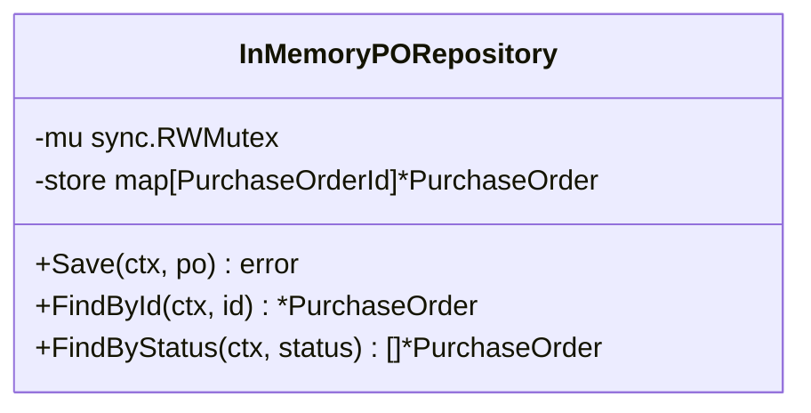
```mermaid
classDiagram
    class InMemoryPORepository {
        -mu sync.RWMutex
        -store map[PurchaseOrderId]*PurchaseOrder
        +Save(ctx, po) error
        +FindById(ctx, id) *PurchaseOrder
        +FindByStatus(ctx, status) []*PurchaseOrder
    }
```




```go
// => InMemoryPORepository satisfies PurchaseOrderRepository interface
type InMemoryPORepository struct {
    // => RWMutex: safe for concurrent test goroutines
    mu    sync.RWMutex
    store map[PurchaseOrderId]*PurchaseOrder
}

func NewInMemoryPORepository() *InMemoryPORepository {
    return &InMemoryPORepository{
        store: make(map[PurchaseOrderId]*PurchaseOrder),
    }
}

func (r *InMemoryPORepository) Save(
    ctx context.Context, po *PurchaseOrder,
) error {
    r.mu.Lock()
    defer r.mu.Unlock()
    // => deep copy on save: caller's mutations after Save don't affect store
    clone := *po
    r.store[po.id] = &clone
    return nil
}

func (r *InMemoryPORepository) FindById(
    ctx context.Context, id PurchaseOrderId,
) (*PurchaseOrder, error) {
    r.mu.RLock()
    defer r.mu.RUnlock()
    po, ok := r.store[id]
    if !ok {
        // => nil, nil convention: "not found" is not an error
        return nil, nil
    }
    // => deep copy on read: caller mutations don't corrupt the store
    clone := *po
    return &clone, nil
}

func (r *InMemoryPORepository) FindByStatus(
    ctx context.Context, status POStatus,
) ([]*PurchaseOrder, error) {
    r.mu.RLock()
    defer r.mu.RUnlock()
    var result []*PurchaseOrder
    for _, po := range r.store {
        if po.status == status {
            clone := *po
            result = append(result, &clone)
        }
    }
    return result, nil
}
```




```rust
// => Arc<Mutex<...>>: shared ownership across async tasks in tests
pub struct InMemoryPORepository {
    store: Arc<Mutex<HashMap<PurchaseOrderId, PurchaseOrder>>>,
}

impl InMemoryPORepository {
    pub fn new() -> Self {
        InMemoryPORepository {
            store: Arc::new(Mutex::new(HashMap::new())),
        }
    }
}

#[async_trait]
impl PurchaseOrderRepository for InMemoryPORepository {
    async fn save(&self, po: &PurchaseOrder) -> Result<(), RepoError> {
        let mut store = self.store.lock().await;
        // => clone() on insert: store owns an independent copy
        store.insert(po.id.clone(), po.clone());
        Ok(())
    }

    async fn find_by_id(
        &self, id: &PurchaseOrderId,
    ) -> Result<Option<PurchaseOrder>, RepoError> {
        let store = self.store.lock().await;
        // => cloned() returns Option<PurchaseOrder> — caller owns the copy
        Ok(store.get(id).cloned())
    }

    async fn find_by_status(
        &self, status: POStatus,
    ) -> Result<Vec<PurchaseOrder>, RepoError> {
        let store = self.store.lock().await;
        // => filter + cloned: return owned Vec, not references into store
        Ok(store.values()
            .filter(|po| po.status == status)
            .cloned()
            .collect())
    }

    async fn find_by_supplier(
        &self, supplier_id: &SupplierId,
    ) -> Result<Vec<PurchaseOrder>, RepoError> {
        let store = self.store.lock().await;
        Ok(store.values()
            .filter(|po| &po.supplier_id == supplier_id)
            .cloned()
            .collect())
    }
}
```




> **Key takeaway**: Clone-on-save and clone-on-read give the in-memory repository the same isolation guarantees as a real database — tests cannot accidentally corrupt stored state through aliased pointers.

---

### Example 46: PostgreSQL Repository

The PostgreSQL adapter maps between domain aggregates and relational rows. Line items are stored as a JSONB column to avoid a join table, keeping the repository implementation simple without sacrificing query flexibility.

```mermaid
sequenceDiagram
    participant SVC as AppService
    participant REPO as PostgresPORepository
    participant DB as PostgreSQL

    SVC->>REPO: Save(ctx, po)
    REPO->>DB: INSERT ... ON CONFLICT DO UPDATE
    SVC->>REPO: FindById(ctx, id)
    DB-->>REPO: row: id, status, line_items JSONB
    REPO-->>SVC: *PurchaseOrder
```




```go
// => PostgresPORepository adapts PurchaseOrderRepository to pgx/PostgreSQL
type PostgresPORepository struct {
    // => pgxpool manages connection pooling automatically
    pool *pgxpool.Pool
}

// => Save upserts the aggregate as a single row + JSONB line items
func (r *PostgresPORepository) Save(
    ctx context.Context, po *PurchaseOrder,
) error {
    // => marshal line items to JSON for JSONB column
    lineItemsJSON, err := json.Marshal(po.lineItems)
    if err != nil {
        return fmt.Errorf("marshal line items: %w", err)
    }
    // => ON CONFLICT DO UPDATE = upsert: one query handles create + update
    _, err = r.pool.Exec(ctx, `
        INSERT INTO purchase_orders
            (id, supplier_id, status, line_items, created_at, updated_at)
        VALUES ($1, $2, $3, $4, $5, $6)
        ON CONFLICT (id) DO UPDATE SET
            status = EXCLUDED.status,
            line_items = EXCLUDED.line_items,
            updated_at = EXCLUDED.updated_at
    `, po.id, po.supplierID, po.status, lineItemsJSON,
        po.createdAt, po.updatedAt,
    )
    return err
}

// => FindById reconstructs the aggregate from a single row scan
func (r *PostgresPORepository) FindById(
    ctx context.Context, id PurchaseOrderId,
) (*PurchaseOrder, error) {
    var po PurchaseOrder
    var lineItemsJSON []byte
    err := r.pool.QueryRow(ctx, `
        SELECT id, supplier_id, status, line_items, created_at, updated_at
        FROM purchase_orders WHERE id = $1
    `, id).Scan(
        &po.id, &po.supplierID, &po.status,
        &lineItemsJSON, &po.createdAt, &po.updatedAt,
    )
    if err == pgx.ErrNoRows {
        return nil, nil
    }
    if err != nil {
        return nil, err
    }
    // => unmarshal JSONB back into the typed slice
    if err := json.Unmarshal(lineItemsJSON, &po.lineItems); err != nil {
        return nil, fmt.Errorf("unmarshal line items: %w", err)
    }
    return &po, nil
}
```




```rust
pub struct PostgresPORepository {
    // => PgPool handles connection pooling and async access
    pool: sqlx::PgPool,
}

#[async_trait]
impl PurchaseOrderRepository for PostgresPORepository {
    async fn save(&self, po: &PurchaseOrder) -> Result<(), RepoError> {
        // => serialize line items as JSON for the JSONB column
        let line_items_json = serde_json::to_value(&po.line_items)
            .map_err(RepoError::SerializationError)?;
        // => sqlx::query! verifies SQL at compile time against a live DB
        sqlx::query!(
            r#"
            INSERT INTO purchase_orders
                (id, supplier_id, status, line_items, created_at, updated_at)
            VALUES ($1, $2, $3, $4, $5, $6)
            ON CONFLICT (id) DO UPDATE SET
                status = EXCLUDED.status,
                line_items = EXCLUDED.line_items,
                updated_at = EXCLUDED.updated_at
            "#,
            po.id.as_str(),
            po.supplier_id.as_str(),
            po.status.as_str(),
            line_items_json,
            po.created_at,
            po.updated_at,
        )
        .execute(&self.pool)
        .await
        .map_err(RepoError::DatabaseError)?;
        Ok(())
    }

    async fn find_by_id(
        &self, id: &PurchaseOrderId,
    ) -> Result<Option<PurchaseOrder>, RepoError> {
        // => fetch! returns a strongly-typed row struct
        let row = sqlx::query!(
            "SELECT id, supplier_id, status, line_items, created_at, updated_at
             FROM purchase_orders WHERE id = $1",
            id.as_str()
        )
        .fetch_optional(&self.pool)
        .await
        .map_err(RepoError::DatabaseError)?;
        match row {
            None => Ok(None),
            Some(r) => {
                // => deserialize JSONB back to typed Vec<LineItem>
                let line_items: Vec<LineItem> =
                    serde_json::from_value(r.line_items)
                        .map_err(RepoError::SerializationError)?;
                Ok(Some(PurchaseOrder::from_row(
                    r.id, r.supplier_id, r.status,
                    line_items, r.created_at, r.updated_at,
                )))
            }
        }
    }
}
```




> **Key takeaway**: Storing complex child collections as JSONB eliminates join complexity while keeping the aggregate boundary clean — use a join table only when you need to query by child field.

---

### Example 47: Unit of Work Pattern

Unit of Work wraps multiple repository operations in a single atomic transaction. The application service uses the UoW instead of individual repositories when saving multiple aggregates together — such as linking a GRN to a PO.

```mermaid
sequenceDiagram
    participant SVC as AppService
    participant UOW as UnitOfWork
    participant PO as txPORepository
    participant GRN as txGRNRepository
    participant DB as PostgreSQL

    SVC->>UOW: Begin(ctx)
    SVC->>PO: Save(ctx, po) via UoW
    SVC->>GRN: Save(ctx, grn) via UoW
    SVC->>UOW: Commit(ctx)
    UOW->>DB: COMMIT — both saves atomic
    Note over SVC: On error: UoW.Rollback(ctx)
```




```go
// => UnitOfWork interface: groups repos + transaction lifecycle
type UnitOfWork interface {
    // => accessor returns a transaction-bound repository
    PORepository() PurchaseOrderRepository
    GRNRepository() GRNRepository
    // => Commit flushes the transaction to the database
    Commit(ctx context.Context) error
    // => Rollback undoes all changes in the transaction
    Rollback(ctx context.Context) error
}

// => pgxUnitOfWork wraps a pgx.Tx and transaction-bound adapters
type pgxUnitOfWork struct {
    tx      pgx.Tx
    poRepo  *txPORepository
    grnRepo *txGRNRepository
}

func (u *pgxUnitOfWork) PORepository()  PurchaseOrderRepository { return u.poRepo }
func (u *pgxUnitOfWork) GRNRepository() GRNRepository           { return u.grnRepo }

func (u *pgxUnitOfWork) Commit(ctx context.Context) error {
    // => Commit releases the transaction connection back to the pool
    return u.tx.Commit(ctx)
}

func (u *pgxUnitOfWork) Rollback(ctx context.Context) error {
    // => Rollback is safe to call even if Commit already succeeded
    return u.tx.Rollback(ctx)
}

// => NewUnitOfWork begins a transaction and wires tx-bound repositories
func NewUnitOfWork(
    ctx context.Context, pool *pgxpool.Pool,
) (UnitOfWork, error) {
    tx, err := pool.Begin(ctx)
    if err != nil {
        return nil, err
    }
    return &pgxUnitOfWork{
        tx:      tx,
        poRepo:  &txPORepository{tx: tx},
        grnRepo: &txGRNRepository{tx: tx},
    }, nil
}
```




```rust
// => UnitOfWork trait: consuming self on commit enforces no reuse after commit
#[async_trait]
pub trait UnitOfWork: Sized {
    fn po_repository(&self) -> &dyn PurchaseOrderRepository;
    fn grn_repository(&self) -> &dyn GRNRepository;
    // => consumes self — cannot accidentally use UoW after commit
    async fn commit(self) -> Result<(), UoWError>;
    async fn rollback(self) -> Result<(), UoWError>;
}

// => PgUnitOfWork wraps sqlx Transaction
pub struct PgUnitOfWork {
    tx: sqlx::Transaction<'static, sqlx::Postgres>,
    po_repo: TxPORepository,
    grn_repo: TxGRNRepository,
}

#[async_trait]
impl UnitOfWork for PgUnitOfWork {
    fn po_repository(&self) -> &dyn PurchaseOrderRepository {
        &self.po_repo
    }
    fn grn_repository(&self) -> &dyn GRNRepository {
        &self.grn_repo
    }
    // => self consumed: no further method calls possible after commit
    async fn commit(self) -> Result<(), UoWError> {
        self.tx.commit().await.map_err(UoWError::DatabaseError)
    }
    async fn rollback(self) -> Result<(), UoWError> {
        self.tx.rollback().await.map_err(UoWError::DatabaseError)
    }
}
```




> **Key takeaway**: Consuming `self` on commit in Rust makes use-after-commit a compile error — Go achieves the same intent through convention, but Rust enforces it structurally.

---

### Example 48: Query Specification Pattern

Specifications encapsulate complex filter criteria as composable objects. The `AndSpec` combinator lets callers build complex queries from simple predicates — the same spec object works for in-memory filtering and SQL generation.

```mermaid
classDiagram
    class POSpecification {
        <<interface>>
        +IsSatisfiedBy(po) bool
        +ToSQL() #40;string, []interface{}#41;
    }
    class POByStatusSpec {
        +status POStatus
    }
    class POBySupplierSpec {
        +supplierID SupplierId
    }
    class AndSpec {
        +left POSpecification
        +right POSpecification
    }
    POSpecification <|-- POByStatusSpec
    POSpecification <|-- POBySupplierSpec
    POSpecification <|-- AndSpec
    AndSpec --> POSpecification : left
    AndSpec --> POSpecification : right
```




```go
// => POSpecification is the specification interface
type POSpecification interface {
    // => IsSatisfiedBy used by in-memory repo for filtering
    IsSatisfiedBy(po *PurchaseOrder) bool
    // => ToSQL generates a WHERE clause fragment for the PostgreSQL adapter
    ToSQL() (string, []interface{})
}

// => POByStatusSpec filters by a single status value
type POByStatusSpec struct {
    status POStatus
}

func (s POByStatusSpec) IsSatisfiedBy(po *PurchaseOrder) bool {
    return po.status == s.status
}

func (s POByStatusSpec) ToSQL() (string, []interface{}) {
    // => parameterized query: never interpolate user data into SQL strings
    return "status = $1", []interface{}{s.status}
}

// => POBySupplierSpec filters by supplier ID
type POBySupplierSpec struct {
    supplierID SupplierId
}

func (s POBySupplierSpec) IsSatisfiedBy(po *PurchaseOrder) bool {
    return po.supplierID == s.supplierID
}

func (s POBySupplierSpec) ToSQL() (string, []interface{}) {
    return "supplier_id = $1", []interface{}{s.supplierID}
}

// => AndSpec combines two specifications — both must be satisfied
type AndSpec struct {
    left, right POSpecification
}

func (s AndSpec) IsSatisfiedBy(po *PurchaseOrder) bool {
    // => short-circuit: right not evaluated if left is false
    return s.left.IsSatisfiedBy(po) && s.right.IsSatisfiedBy(po)
}

func (s AndSpec) ToSQL() (string, []interface{}) {
    leftSQL, leftArgs := s.left.ToSQL()
    rightSQL, rightArgs := s.right.ToSQL()
    // => combine args and shift right-side parameter indices
    args := append(leftArgs, rightArgs...)
    return fmt.Sprintf("(%s) AND (%s)", leftSQL, rightSQL), args
}
```




```rust
// => generic over T so the trait works for any domain type
pub trait Specification<T> {
    fn is_satisfied_by(&self, candidate: &T) -> bool;
    fn to_sql(&self) -> (String, Vec<serde_json::Value>);
}

pub struct POByStatusSpec {
    status: POStatus,
}

impl Specification<PurchaseOrder> for POByStatusSpec {
    fn is_satisfied_by(&self, po: &PurchaseOrder) -> bool {
        po.status == self.status
    }
    fn to_sql(&self) -> (String, Vec<serde_json::Value>) {
        ("status = $1".to_string(),
         vec![serde_json::to_value(self.status.as_str()).unwrap()])
    }
}

// => AndSpec boxes both sides — avoids recursive generic parameter
pub struct AndSpec {
    left:  Box<dyn Specification<PurchaseOrder>>,
    right: Box<dyn Specification<PurchaseOrder>>,
}

impl Specification<PurchaseOrder> for AndSpec {
    fn is_satisfied_by(&self, po: &PurchaseOrder) -> bool {
        // => short-circuit evaluation — right evaluated only if left passes
        self.left.is_satisfied_by(po) && self.right.is_satisfied_by(po)
    }
    fn to_sql(&self) -> (String, Vec<serde_json::Value>) {
        let (left_sql, left_args) = self.left.to_sql();
        let (right_sql, right_args) = self.right.to_sql();
        let mut args = left_args;
        args.extend(right_args);
        (format!("({left_sql}) AND ({right_sql})"), args)
    }
}
```




> **Key takeaway**: Specifications make filter logic reusable and testable in isolation — test `IsSatisfiedBy` with in-memory objects, then trust `ToSQL` produces the equivalent query for the database adapter.

---

## CQRS (Examples 49–51)

### Example 49: CreatePurchaseOrderCommand and Handler

Command handlers are application services — they orchestrate the use case: construct the aggregate, call domain methods, persist via repository, drain and publish events. Commands are value objects: no identity, immutable, contain only primitive types.

```mermaid
sequenceDiagram
    participant CMD as CreatePOCommand
    participant H as CreatePOHandler
    participant PO as PurchaseOrder
    participant REPO as PORepository
    participant BUS as EventBus

    CMD->>H: Handle(ctx, cmd)
    H->>PO: NewPurchaseOrder(id, supplierID)
    loop for each line item
        H->>PO: AddLineItem(item)
    end
    H->>REPO: Save(ctx, po)
    H->>PO: DrainEvents()
    H->>BUS: Publish(events...)
    H-->>CMD: PurchaseOrderId
```




```go
// => CreateLineItemDTO carries line item data from the caller — no domain types
type CreateLineItemDTO struct {
    Description    string
    Qty            float64
    Unit           string
    // => int64 cents: no floating-point money in DTOs
    UnitPriceCents int64
    Currency       string
}

// => CreatePOCommand is a value object — no ID, all primitives
type CreatePOCommand struct {
    SupplierID SupplierId
    LineItems  []CreateLineItemDTO
}

// => CreatePOHandler is an application service
type CreatePOHandler struct {
    repo PurchaseOrderRepository
    bus  DomainEventBus
    // => idGen abstracts UUID generation for testability
    idGen IdGenerator
}

// => Handle orchestrates the use case
func (h *CreatePOHandler) Handle(
    ctx context.Context, cmd CreatePOCommand,
) (PurchaseOrderId, error) {
    // => generate new aggregate ID via injectable generator
    id := h.idGen.NewPurchaseOrderId()
    // => create aggregate through constructor — no direct struct literal
    po := NewPurchaseOrder(id, cmd.SupplierID)
    // => call domain methods for each DTO — domain enforces invariants
    for _, dto := range cmd.LineItems {
        item, err := NewLineItem(dto.Description, dto.Qty, dto.Unit,
            dto.UnitPriceCents, dto.Currency)
        if err != nil {
            return "", fmt.Errorf("invalid line item: %w", err)
        }
        if err := po.AddLineItem(item); err != nil {
            return "", err
        }
    }
    // => persist via repository interface — adapter chosen at wire-up time
    if err := h.repo.Save(ctx, po); err != nil {
        return "", fmt.Errorf("save PO: %w", err)
    }
    // => drain events after successful save — never before
    events := po.DrainEvents()
    if err := h.bus.Publish(ctx, events...); err != nil {
        // => non-fatal: outbox publisher will retry missed events
        log.Printf("warn: event publish failed: %v", err)
    }
    return id, nil
}
```




```rust
#[derive(Debug)]
pub struct CreateLineItemDto {
    pub description: String,
    pub qty: f64,
    pub unit: String,
    pub unit_price_cents: i64,
    pub currency: String,
}

// => CreatePOCommand: no ID — the handler generates it
#[derive(Debug)]
pub struct CreatePOCommand {
    pub supplier_id: SupplierId,
    pub line_items: Vec<CreateLineItemDto>,
}

pub struct CreatePOHandler {
    repo:   Arc<dyn PurchaseOrderRepository>,
    bus:    Arc<dyn DomainEventBus>,
    id_gen: Arc<dyn IdGenerator>,
}

impl CreatePOHandler {
    // => async: repo.save and bus.publish are I/O-bound
    pub async fn handle(
        &self, cmd: CreatePOCommand,
    ) -> Result<PurchaseOrderId, HandleError> {
        let id = self.id_gen.new_purchase_order_id();
        // => mut: we call methods that mutate the aggregate
        let mut po = PurchaseOrder::new(id.clone(), cmd.supplier_id);
        for dto in cmd.line_items {
            let item = LineItem::new(
                dto.description, dto.qty, dto.unit,
                dto.unit_price_cents, &dto.currency,
            ).map_err(HandleError::DomainError)?;
            po.add_line_item(item)
              .map_err(HandleError::DomainError)?;
        }
        self.repo.save(&po).await
            .map_err(HandleError::RepoError)?;
        // => drain events after save — order matters
        let events = po.drain_events();
        if let Err(e) = self.bus.publish(events).await {
            // => log and continue: outbox ensures eventual delivery
            tracing::warn!("event publish failed: {e}");
        }
        Ok(id)
    }
}
```




> **Key takeaway**: Command handlers are thin orchestrators — they delegate all domain logic to aggregate methods and all persistence to the repository, keeping themselves easy to test.

---

### Example 50: GetPurchaseOrderQuery and Handler

Query handlers are read-only — they fetch and shape data, potentially from a read model instead of the domain aggregate. No events are emitted, no invariants are enforced, and the return type is a DTO, not a domain object.

```mermaid
sequenceDiagram
    participant Q as GetPOQuery
    participant H as GetPOQueryHandler
    participant REPO as PORepository

    Q->>H: Handle(ctx, query)
    H->>REPO: FindById(ctx, id)
    REPO-->>H: *PurchaseOrder
    H->>H: mapToPODetailResult(po)
    H-->>Q: *PODetailResult
```




```go
// => GetPOQuery carries only the identifier needed for the lookup
type GetPOQuery struct {
    Id PurchaseOrderId
}

// => PODetailResult is a flat DTO shaped for the API response
type PODetailResult struct {
    Id              PurchaseOrderId
    Status          string
    SupplierCode    string
    TotalValueCents int64
    Currency        string
    LineItemCount   int
    CreatedAt       time.Time
}

// => GetPOQueryHandler is read-only — no bus, no UoW needed
type GetPOQueryHandler struct {
    repo PurchaseOrderRepository
}

func (h *GetPOQueryHandler) Handle(
    ctx context.Context, q GetPOQuery,
) (*PODetailResult, error) {
    // => fetch aggregate — could switch to a read model for performance
    po, err := h.repo.FindById(ctx, q.Id)
    if err != nil {
        return nil, err
    }
    if po == nil {
        // => nil return means "not found" — caller decides 404 vs error
        return nil, nil
    }
    // => map aggregate to DTO — no domain logic, only field projection
    return &PODetailResult{
        Id:              po.id,
        Status:          string(po.status),
        SupplierCode:    string(po.supplierID),
        TotalValueCents: po.TotalValueCents(),
        Currency:        po.Currency(),
        LineItemCount:   len(po.lineItems),
        CreatedAt:       po.createdAt,
    }, nil
}
```




```rust
#[derive(Debug)]
pub struct GetPOQuery {
    pub id: PurchaseOrderId,
}

// => PODetailResult: owned strings for serialization; no domain types
#[derive(Debug, Serialize)]
pub struct PODetailResult {
    pub id: String,
    pub status: String,
    pub supplier_code: String,
    pub total_value_cents: i64,
    pub currency: String,
    pub line_item_count: usize,
    pub created_at: DateTime<Utc>,
}

pub struct GetPOQueryHandler {
    // => read-only: only a repository needed, no bus or UoW
    repo: Arc<dyn PurchaseOrderRepository>,
}

impl GetPOQueryHandler {
    pub async fn handle(
        &self, q: GetPOQuery,
    ) -> Result<Option<PODetailResult>, QueryError> {
        let po = self.repo
            .find_by_id(&q.id)
            .await
            .map_err(QueryError::RepoError)?;
        // => Option map: None if not found, Some if found
        Ok(po.map(|po| PODetailResult {
            id:               po.id.to_string(),
            status:           po.status.to_string(),
            supplier_code:    po.supplier_id.to_string(),
            total_value_cents: po.total_value_cents(),
            currency:         po.currency().to_string(),
            line_item_count:  po.line_items.len(),
            created_at:       po.created_at,
        }))
    }
}
```




> **Key takeaway**: Query handlers never emit events and never call aggregate mutation methods — keeping them read-only enables safe caching and horizontal read scaling.

---

### Example 51: POList Read Model Projection

The read model is a pre-computed view optimized for the query side — updated by applying domain events as they occur. Listing by status requires scanning only the read model, not reconstructing each full aggregate.

```mermaid
sequenceDiagram
    participant BUS as EventBus
    participant RM as POListReadModel
    participant API as QueryAPI

    BUS->>RM: On(POCreated)
    BUS->>RM: On(POApproved)
    BUS->>RM: On(POCancelled)
    API->>RM: ListByStatus("Issued")
    RM-->>API: []POSummary
    Note over RM: Rebuild by replaying all events if out of sync
```




```go
// => POSummary is a flat read model entry — no methods, pure data
type POSummary struct {
    Id              PurchaseOrderId
    SupplierCode    string
    Status          string
    TotalValueCents int64
    LineItemCount   int
    CreatedAt       time.Time
    UpdatedAt       time.Time
}

// => POListReadModel maintains an in-memory map updated by events
type POListReadModel struct {
    mu      sync.RWMutex
    entries map[PurchaseOrderId]POSummary
}

// => On applies a single domain event to the read model
func (rm *POListReadModel) On(event DomainEvent) {
    rm.mu.Lock()
    defer rm.mu.Unlock()
    switch e := event.(type) {
    case POCreated:
        // => create initial summary entry — all queries will find it
        rm.entries[e.ID] = POSummary{
            Id:           e.ID,
            SupplierCode: string(e.SupplierID),
            Status:       "Draft",
            CreatedAt:    e.OccurredAt,
            UpdatedAt:    e.OccurredAt,
        }
    case POApproved:
        // => update only the changed fields — leave others as-is
        if entry, ok := rm.entries[e.POID]; ok {
            entry.Status = "Issued"
            entry.UpdatedAt = e.OccurredAt
            rm.entries[e.POID] = entry
        }
    case POLineItemAdded:
        // => increment count without re-fetching the full aggregate
        if entry, ok := rm.entries[e.POID]; ok {
            entry.LineItemCount++
            entry.TotalValueCents += e.ItemValueCents
            entry.UpdatedAt = e.OccurredAt
            rm.entries[e.POID] = entry
        }
    case POCancelled:
        if entry, ok := rm.entries[e.POID]; ok {
            entry.Status = "Cancelled"
            entry.UpdatedAt = e.OccurredAt
            rm.entries[e.POID] = entry
        }
    // => unknown events are silently ignored — projection is selective
    }
}

// => ListByStatus returns all summaries with the given status — O(n) scan
func (rm *POListReadModel) ListByStatus(status string) []POSummary {
    rm.mu.RLock()
    defer rm.mu.RUnlock()
    var result []POSummary
    for _, entry := range rm.entries {
        if entry.Status == status {
            result = append(result, entry)
        }
    }
    // => for production: use a secondary index map[status][]PurchaseOrderId
    return result
}
```




```rust
// => Clone: ListByStatus returns owned copies — no lifetimes on caller side
#[derive(Debug, Clone)]
pub struct POSummary {
    pub id: PurchaseOrderId,
    pub supplier_code: String,
    pub status: String,
    pub total_value_cents: i64,
    pub line_item_count: usize,
    pub created_at: DateTime<Utc>,
    pub updated_at: DateTime<Utc>,
}

pub struct POListReadModel {
    // => RwLock: many concurrent queries, exclusive event application
    entries: RwLock<HashMap<PurchaseOrderId, POSummary>>,
}

impl POListReadModel {
    // => async on() for compatibility with async event bus
    pub async fn on(&self, event: &dyn DomainEvent) {
        let mut entries = self.entries.write().await;
        match event.event_type() {
            "POCreated" => {
                if let Some(e) = event.as_any().downcast_ref::<POCreated>() {
                    entries.insert(e.id.clone(), POSummary {
                        id: e.id.clone(),
                        supplier_code: e.supplier_id.to_string(),
                        status: "Draft".to_string(),
                        total_value_cents: 0,
                        line_item_count: 0,
                        created_at: e.occurred_at,
                        updated_at: e.occurred_at,
                    });
                }
            }
            "POApproved" => {
                if let Some(e) = event.as_any().downcast_ref::<POApproved>() {
                    if let Some(entry) = entries.get_mut(&e.po_id) {
                        // => mutate only status and timestamp
                        entry.status = "Issued".to_string();
                        entry.updated_at = e.occurred_at;
                    }
                }
            }
            "POCancelled" => {
                if let Some(e) = event.as_any().downcast_ref::<POCancelled>() {
                    if let Some(entry) = entries.get_mut(&e.po_id) {
                        entry.status = "Cancelled".to_string();
                        entry.updated_at = e.occurred_at;
                    }
                }
            }
            // => projection is additive: unknown events are no-ops
            _ => {}
        }
    }

    // => async read: acquires read lock, returns owned Vec
    pub async fn list_by_status(&self, status: &str) -> Vec<POSummary> {
        let entries = self.entries.read().await;
        // => O(n) scan is acceptable for small data sets; use BTreeMap for sorted access
        entries.values()
            .filter(|e| e.status == status)
            .cloned()
            .collect()
    }
}
```




> **Key takeaway**: Read models decouple query performance from aggregate complexity — rebuild from scratch by replaying all stored events from the outbox if the projection falls out of sync.
