This advanced tier extends the beginner PO typestate and intermediate Invoice FSM with hierarchical states, parallel regions, the three-way-match saga modelled as an explicit FSM, and production concerns including persistence, event sourcing, and testing. The C sidebar introduces Miro Samek's QP/C Hierarchical State Machine framework — the canonical reference for FSMs in embedded and systems programming.

**Canonical sources**: Miro Samek — [_Practical UML Statecharts in C/C++_, 2nd ed.](https://www.state-machine.com/psicc2) (Newnes, 2008); Ana Hoverbear — [Pretty State Machine Patterns in Rust](https://hoverbear.org/blog/rust-state-machine-pattern/); Will Crichton — [Type-Driven API Design in Rust](https://willcrichton.net/rust-api-type-patterns/typestate.html); [looplab/fsm](https://github.com/looplab/fsm) (v1.0.3, Apache 2.0); Jim Blandy, Jason Orendorff, Leonora F. S. Tindall — [_Programming Rust_, 3rd ed.](https://www.oreilly.com/library/view/programming-rust-3rd/9781098176228/) (O'Reilly, 2024).

## Hierarchical States (Examples 50–55)

### Example 50: Hierarchical States — The Concept

Hierarchical State Machines (HSMs) group states into superstates — a transition defined on a superstate applies to all of its substates without duplication. In the procurement domain, `Active` is a superstate containing `Submitted`, `ApprovalPending`, and `Issued`; a `cancel` transition on `Active` covers all three without three separate arrows.

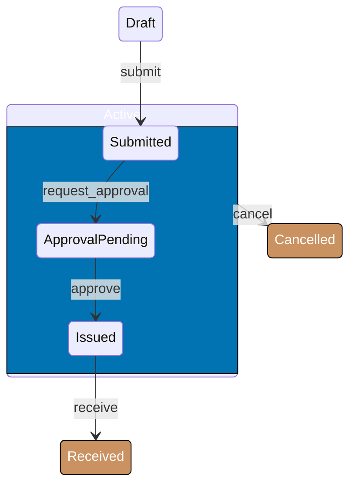




```rust
use std::marker::PhantomData;

// => Superstate trait: any Active substate can be cancelled
// => This is the Rust equivalent of a UML superstate transition
pub trait ActivePO {
    // => cancel() consumes self so the old state is unrecoverable
    fn cancel(self) -> PO<Cancelled>;
}

// => Active is a wrapper superstate; S is the current substate within it
pub struct Active<S> { _sub: PhantomData<S> }
// => Leaf substates carry no data — they are pure type-level markers
pub struct Submitted;
pub struct ApprovalPending;
// => Top-level states are not nested inside Active
pub struct Draft;
pub struct Cancelled;

// => PO holds the aggregate id; state lives entirely in the phantom type
pub struct PO<S> {
    pub id: String,
    _state: PhantomData<S>,
}

// => impl ActivePO for each substate of Active
// => both impls have identical bodies — superstate semantics collapse to one logical transition
impl ActivePO for PO<Active<Submitted>> {
    fn cancel(self) -> PO<Cancelled> {
        // => move id into new PO; Submitted substate erased at compile time
        PO { id: self.id, _state: PhantomData }
    }
}
impl ActivePO for PO<Active<ApprovalPending>> {
    fn cancel(self) -> PO<Cancelled> {
        // => same body — superstate semantics expressed via trait
        PO { id: self.id, _state: PhantomData }
    }
}

fn main() {
    // => construct a PO in Active<Submitted> substate
    let po: PO<Active<Submitted>> = PO { id: "PO-001".into(), _state: PhantomData };
    // => cancel() works because PO<Active<Submitted>>: ActivePO
    let _cancelled: PO<Cancelled> = po.cancel();
    // => `po` is moved; using it here would be a compile error
    println!("PO cancelled at compile-time-verified transition");
    // => Output: PO cancelled at compile-time-verified transition
}
```




```go
package main

import (
    "context"
    "fmt"
    "github.com/looplab/fsm"
)

func main() {
    // => looplab equivalent: list all Active substates in Src
    // => this is flat-table simulation of a superstate transition
    po := fsm.NewFSM(
        "submitted", // => initial state (inside Active superstate)
        fsm.Events{
            // => cancel fires from any Active substate — one entry, multiple Src
            {Name: "cancel", Src: []string{"submitted", "approval_pending", "issued"}, Dst: "cancelled"},
            // => internal transitions within Active superstate
            {Name: "request_approval", Src: []string{"submitted"}, Dst: "approval_pending"},
            {Name: "approve", Src: []string{"approval_pending"}, Dst: "issued"},
            {Name: "receive", Src: []string{"issued"}, Dst: "received"},
        },
        fsm.Callbacks{},
    )
    ctx := context.Background()
    // => attempt cancel from submitted state
    err := po.Event(ctx, "cancel")
    // => err is nil; transition succeeds
    fmt.Println("State after cancel:", po.Current(), "err:", err)
    // => Output: State after cancel: cancelled err: <nil>
}
```




> **Key takeaway**: Rust models a superstate as a trait implemented by all substate types; Go simulates it with multiple `Src` entries on one event.

**Why it matters**: Without hierarchy, every new active substate requires a duplicate `cancel` entry. Hierarchical modelling keeps the transition table proportional to the number of _logical_ transitions, not to `|states| × |events|`. In procurement, the Active superstate alone covers six substates — one cancel arrow replaces six.

---

### Example 51: Rust Nested Typestate (Two-Level Phantom)

Rust encodes two-level hierarchy using two `PhantomData` type parameters — the outer phantom is the superstate (`Active`), the inner phantom is the current substate (`Submitted`, `ApprovalPending`, `Issued`). Leaf states like `Draft` and `Cancelled` use `()` as the inner parameter.

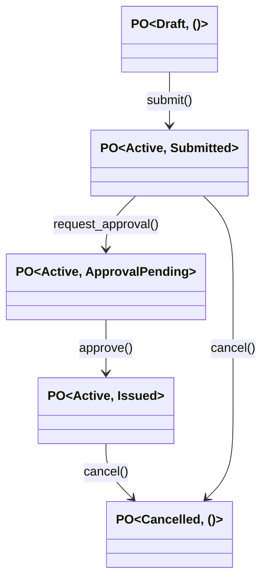




```rust
use std::marker::PhantomData;

// => Outer type parameter = superstate (lifecycle group)
// => Inner type parameter = current substate within that group; () for leaf states
pub struct PO<Outer, Inner = ()> {
    pub id: String,
    _outer: PhantomData<Outer>,
    _inner: PhantomData<Inner>,
}

// => Superstate markers — no data, no methods on their own
pub struct Active;
pub struct Draft;
pub struct Cancelled;

// => Substate markers used only when Outer == Active
pub struct Submitted;
pub struct ApprovalPending;
pub struct Issued;

impl PO<Draft> {
    // => submit() transitions from Draft (leaf) to Active<Submitted> (substate entry)
    pub fn submit(self) -> PO<Active, Submitted> {
        // => outer switches from Draft to Active; inner becomes Submitted
        PO { id: self.id, _outer: PhantomData, _inner: PhantomData }
    }
}

impl PO<Active, Submitted> {
    // => request_approval() advances inner substate from Submitted to ApprovalPending
    // => outer stays Active — no superstate change
    pub fn request_approval(self) -> PO<Active, ApprovalPending> {
        PO { id: self.id, _outer: PhantomData, _inner: PhantomData }
    }
    // => cancel() exits the Active superstate entirely — inner becomes ()
    pub fn cancel(self) -> PO<Cancelled> {
        PO { id: self.id, _outer: PhantomData, _inner: PhantomData }
    }
}

impl PO<Active, ApprovalPending> {
    // => approve() advances inner substate to Issued
    pub fn approve(self) -> PO<Active, Issued> {
        PO { id: self.id, _outer: PhantomData, _inner: PhantomData }
    }
    // => cancel available here too — superstate-level transition
    pub fn cancel(self) -> PO<Cancelled> {
        PO { id: self.id, _outer: PhantomData, _inner: PhantomData }
    }
}

fn main() {
    // => start in Draft leaf state
    let draft: PO<Draft> = PO { id: "PO-002".into(), _outer: PhantomData, _inner: PhantomData };
    // => submit → Active<Submitted> substate
    let submitted: PO<Active, Submitted> = draft.submit();
    // => advance within Active superstate
    let pending: PO<Active, ApprovalPending> = submitted.request_approval();
    // => cancel from within Active superstate
    let _cancelled: PO<Cancelled> = pending.cancel();
    println!("Two-level phantom typestate compiles cleanly");
    // => Output: Two-level phantom typestate compiles cleanly
}
```




```go
package main

import (
    "context"
    "fmt"
    "github.com/looplab/fsm"
)

func main() {
    // => looplab uses flat string state names — hierarchy is implicit in shared Src slices
    po := fsm.NewFSM(
        "draft",
        fsm.Events{
            {Name: "submit",             Src: []string{"draft"},             Dst: "submitted"},
            {Name: "request_approval",   Src: []string{"submitted"},         Dst: "approval_pending"},
            {Name: "approve",            Src: []string{"approval_pending"},  Dst: "issued"},
            // => cancel fires from any Active substate — shared Src simulates superstate
            {Name: "cancel", Src: []string{"submitted", "approval_pending", "issued"}, Dst: "cancelled"},
        },
        fsm.Callbacks{},
    )
    ctx := context.Background()
    _ = po.Event(ctx, "submit")
    // => po.Current() == "submitted"
    _ = po.Event(ctx, "request_approval")
    // => po.Current() == "approval_pending"
    _ = po.Event(ctx, "cancel")
    // => po.Current() == "cancelled"
    fmt.Println("Final state:", po.Current())
    // => Output: Final state: cancelled
}
```




> **Key takeaway**: Two `PhantomData` type parameters encode superstate (`Outer`) and substate (`Inner`) with zero runtime overhead; `()` as the default inner parameter marks leaf states.

**Why it matters**: The nested phantom approach is the standard Rust pattern documented by Hoverbear and Crichton. It enables the type checker to reject both illegal superstate changes and illegal substate advances without any runtime checks — illegal combinations simply have no `impl` block.

---

### Example 52: Entry and Exit Actions

State machines fire entry actions when entering a state and exit actions when leaving. In Rust, these are explicit function calls inside the transition method body; in Go, looplab provides dedicated callback hooks named `enter_<state>` and `leave_<state>`.

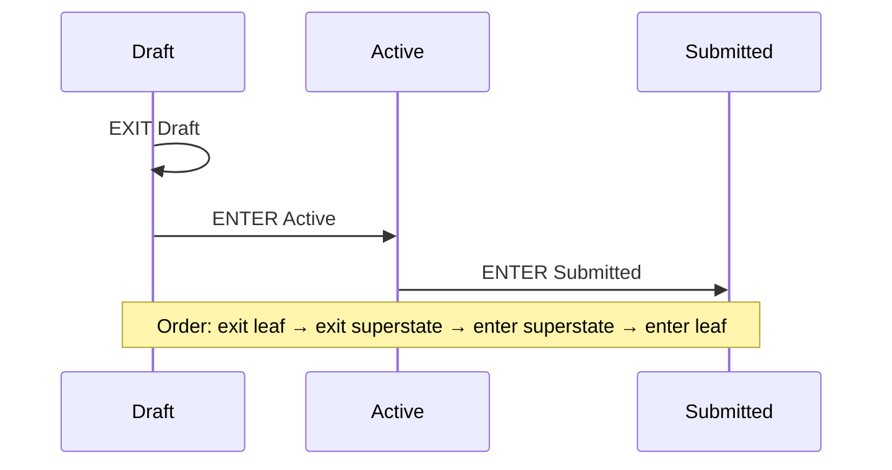




```rust
use std::marker::PhantomData;

pub struct PO<Outer, Inner = ()> {
    pub id: String,
    _outer: PhantomData<Outer>,
    _inner: PhantomData<Inner>,
}
pub struct Draft; pub struct Active; pub struct Submitted; pub struct Cancelled;

impl PO<Draft> {
    pub fn submit(self) -> PO<Active, Submitted> {
        // => EXIT action: fires as the FIRST thing in the transition
        // => exit order is bottom-up: leaf first (none here), then superstate (Draft is a leaf)
        println!("EXIT Draft");
        // => ENTER superstate action fires before substate entry
        println!("ENTER Active");
        // => ENTER substate action fires last (top-down entry order)
        println!("ENTER Submitted");
        // => transition completes by constructing the new type
        PO { id: self.id, _outer: PhantomData, _inner: PhantomData }
    }
}

impl PO<Active, Submitted> {
    pub fn cancel(self) -> PO<Cancelled> {
        // => EXIT actions fire bottom-up: Submitted first, then Active
        println!("EXIT Submitted");
        println!("EXIT Active");
        // => ENTER Cancelled (leaf, no superstate)
        println!("ENTER Cancelled");
        PO { id: self.id, _outer: PhantomData, _inner: PhantomData }
    }
}

fn main() {
    let po: PO<Draft> = PO { id: "PO-003".into(), _outer: PhantomData, _inner: PhantomData };
    let submitted = po.submit();
    // => Output so far:
    // => EXIT Draft
    // => ENTER Active
    // => ENTER Submitted
    let _cancelled = submitted.cancel();
    // => Output:
    // => EXIT Submitted
    // => EXIT Active
    // => ENTER Cancelled
}
```




```go
package main

import (
    "context"
    "fmt"
    "github.com/looplab/fsm"
)

func main() {
    po := fsm.NewFSM(
        "draft",
        fsm.Events{
            {Name: "submit", Src: []string{"draft"}, Dst: "submitted"},
            {Name: "cancel", Src: []string{"submitted", "approval_pending"}, Dst: "cancelled"},
        },
        fsm.Callbacks{
            // => before_<event>: fires before the transition — use for exit logic of current state
            "before_submit": func(_ context.Context, e *fsm.Event) {
                // => e.Src is the state being exited
                fmt.Println("EXIT", e.Src)
            },
            // => enter_<state>: fires when the machine enters the named state
            "enter_submitted": func(_ context.Context, e *fsm.Event) {
                // => looplab fires enter callbacks per state, not per superstate
                // => simulate superstate entry by using enter_state + manual check
                fmt.Println("ENTER Active") // => superstate entry (manual)
                fmt.Println("ENTER Submitted") // => substate entry
            },
            "enter_cancelled": func(_ context.Context, e *fsm.Event) {
                fmt.Println("ENTER Cancelled")
            },
        },
    )
    ctx := context.Background()
    _ = po.Event(ctx, "submit")
    // => Output:
    // => EXIT draft
    // => ENTER Active
    // => ENTER Submitted
    _ = po.Event(ctx, "cancel")
    // => Output: ENTER Cancelled
    fmt.Println("Final state:", po.Current())
    // => Output: Final state: cancelled
}
```




> **Key takeaway**: Exit fires bottom-up (leaf first, then superstate) and entry fires top-down (superstate first, then leaf) — Rust makes this ordering explicit in method bodies, while looplab provides dedicated `enter_` and `leave_` callback hooks.

**Why it matters**: Entry and exit actions are where real procurement side-effects live — sending notifications, creating audit records, setting timestamps. Getting the ordering wrong causes double-notifications or missing audit entries. The Rust model makes the ordering a reviewable part of the method body rather than a hidden framework concern.

---

### Example 53: History Pseudo-State

A history pseudo-state re-enters the most recently active substate when returning from an interrupt. In procurement, a PO paused for contract renegotiation should resume whichever approval stage it was in, not restart from `Submitted`.

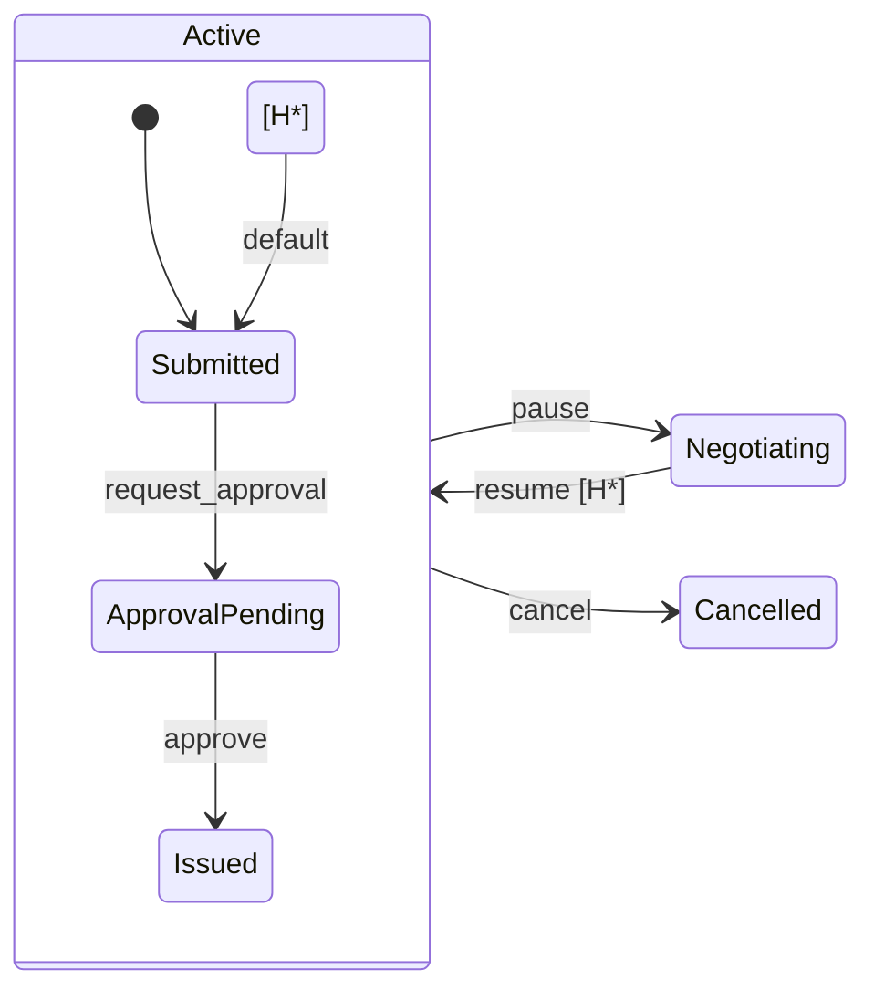




```rust
use std::marker::PhantomData;

// => History requires storing the last active substate as a runtime value
// => Rust typestate cannot represent history purely at the type level
// => (the historic substate is unknown until runtime) — use an enum snapshot
#[derive(Debug, Clone)]
pub enum ActiveSubstate {
    // => each variant corresponds to a typestate inner parameter
    Submitted,
    ApprovalPending,
    Issued,
}

// => PO with history: carries the last substate snapshot for resume
pub struct POWithHistory<Outer, Inner = ()> {
    pub id: String,
    pub history: Option<ActiveSubstate>, // => None when not in Active superstate
    _outer: PhantomData<Outer>,
    _inner: PhantomData<Inner>,
}

pub struct Active; pub struct Submitted; pub struct ApprovalPending;
pub struct Negotiating; pub struct Cancelled;

impl POWithHistory<Active, ApprovalPending> {
    pub fn pause(self) -> POWithHistory<Negotiating> {
        // => capture current substate into history before exiting Active
        let history = Some(ActiveSubstate::ApprovalPending);
        println!("Pausing at {:?}; saving history", history);
        // => EXIT Active; ENTER Negotiating
        POWithHistory { id: self.id, history, _outer: PhantomData, _inner: PhantomData }
    }
}

impl POWithHistory<Negotiating> {
    pub fn resume(self) -> ActiveSubstate {
        // => history pseudo-state: re-enter the saved substate
        let saved = self.history.clone().unwrap_or(ActiveSubstate::Submitted);
        println!("Resuming into {:?}", saved);
        // => caller dispatches to the correct typed method based on saved variant
        saved
    }
}

fn main() {
    let po = POWithHistory::<Active, ApprovalPending> {
        id: "PO-004".into(), history: None,
        _outer: PhantomData, _inner: PhantomData,
    };
    let negotiating = po.pause();
    // => Output: Pausing at Some(ApprovalPending); saving history
    let resumed = negotiating.resume();
    // => Output: Resuming into ApprovalPending
    println!("History restored to: {:?}", resumed);
    // => Output: History restored to: ApprovalPending
}
```




```go
package main

import (
    "context"
    "fmt"
    "github.com/looplab/fsm"
)

// => History helper wraps looplab FSM + stores last Active substate
type POHistory struct {
    fsm              *fsm.FSM
    lastActiveState  string // => saved on pause, restored on resume
}

func NewPOHistory() *POHistory {
    ph := &POHistory{}
    ph.fsm = fsm.NewFSM(
        "submitted",
        fsm.Events{
            {Name: "request_approval", Src: []string{"submitted"},        Dst: "approval_pending"},
            {Name: "approve",          Src: []string{"approval_pending"}, Dst: "issued"},
            // => pause exits any Active substate
            {Name: "pause", Src: []string{"submitted", "approval_pending", "issued"}, Dst: "negotiating"},
            // => resume goes back to whatever lastActiveState was saved
            {Name: "resume_submitted",         Src: []string{"negotiating"}, Dst: "submitted"},
            {Name: "resume_approval_pending",   Src: []string{"negotiating"}, Dst: "approval_pending"},
            {Name: "resume_issued",             Src: []string{"negotiating"}, Dst: "issued"},
        },
        fsm.Callbacks{
            // => save current state before entering Negotiating
            "before_pause": func(_ context.Context, e *fsm.Event) {
                ph.lastActiveState = e.FSM.Current()
                fmt.Println("Saving history:", ph.lastActiveState)
            },
        },
    )
    return ph
}

func (ph *POHistory) Resume(ctx context.Context) error {
    // => dispatch resume based on saved history
    return ph.fsm.Event(ctx, "resume_"+ph.lastActiveState)
}

func main() {
    ph := NewPOHistory()
    ctx := context.Background()
    _ = ph.fsm.Event(ctx, "request_approval")
    // => state is now approval_pending
    _ = ph.fsm.Event(ctx, "pause")
    // => Output: Saving history: approval_pending
    _ = ph.Resume(ctx)
    fmt.Println("Resumed to:", ph.fsm.Current())
    // => Output: Resumed to: approval_pending
}
```




> **Key takeaway**: History pseudo-state requires a runtime snapshot because the saved substate is unknown at compile time — Rust stores it as an enum field, Go stores it as a string that drives the resume event name.

**Why it matters**: Contract renegotiations can interrupt a PO at any approval stage. Without history, resuming always restarts from `Submitted`, losing the approval progress and requiring re-approval — a business process regression that wastes approver time and creates audit confusion.

---

### Example 54: Hierarchical PO FSM — Full Lifecycle

A full three-level hierarchy models real procurement complexity: a top-level `Lifecycle` (Open vs Closed), within Open there is `Activity` (Draft vs Active vs Completed), and within Active there is `Approval` (Submitted, ApprovalPending, Issued, Received).

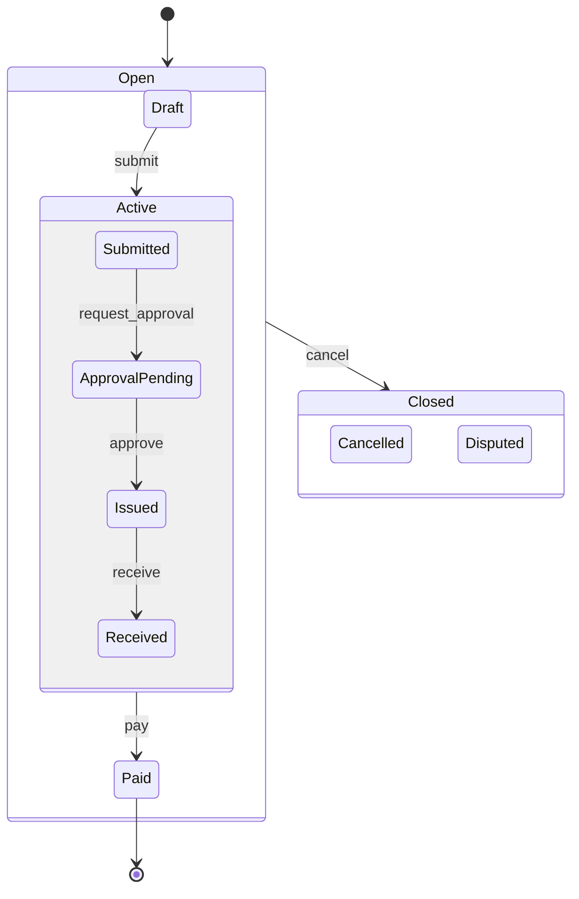




```rust
use std::marker::PhantomData;

// => Three-level hierarchy: Lifecycle > Activity > Approval
// => Layer 1: Lifecycle superstates
pub struct Open; pub struct Closed;
// => Layer 2: Activity substates of Open
pub struct DraftActivity; pub struct ActiveActivity; pub struct CompletedActivity;
// => Layer 3: Approval substates of Active
pub struct SubmittedApproval; pub struct PendingApproval; pub struct IssuedApproval; pub struct ReceivedApproval;
// => Terminal states in Closed
pub struct CancelledClose; pub struct DisputedClose;

// => PO with three-level phantom nesting
pub struct PO<L, A = (), B = ()> {
    pub id: String,
    _l: PhantomData<L>,
    _a: PhantomData<A>,
    _b: PhantomData<B>,
}

impl PO<Open, DraftActivity> {
    // => submit: Draft → Active<Submitted> — crosses Activity boundary into Active
    pub fn submit(self) -> PO<Open, ActiveActivity, SubmittedApproval> {
        println!("EXIT DraftActivity; ENTER ActiveActivity; ENTER SubmittedApproval");
        PO { id: self.id, _l: PhantomData, _a: PhantomData, _b: PhantomData }
    }
}

impl PO<Open, ActiveActivity, ReceivedApproval> {
    // => pay: crosses Activity boundary — exits Active, exits Open, doesn't enter Closed
    // => Paid is a terminal state above Closed
    pub fn pay(self) -> PO<Closed, CompletedActivity> {
        println!("EXIT ReceivedApproval; EXIT ActiveActivity; ENTER CompletedActivity");
        PO { id: self.id, _l: PhantomData, _a: PhantomData, _b: PhantomData }
    }
}

// => cancel applies to ANY Open state — superstate-level transition
// => implemented as a blanket method on all relevant types (abbreviated here for Draft)
impl PO<Open, DraftActivity> {
    pub fn cancel(self) -> PO<Closed, CancelledClose> {
        // => exits all Open layers, enters Closed
        println!("EXIT DraftActivity; EXIT Open; ENTER Closed; ENTER CancelledClose");
        PO { id: self.id, _l: PhantomData, _a: PhantomData, _b: PhantomData }
    }
}

fn main() {
    let draft: PO<Open, DraftActivity> = PO { id: "PO-005".into(), _l: PhantomData, _a: PhantomData, _b: PhantomData };
    let _submitted: PO<Open, ActiveActivity, SubmittedApproval> = draft.submit();
    println!("Full three-level hierarchy demonstrated");
    // => Output: EXIT DraftActivity; ENTER ActiveActivity; ENTER SubmittedApproval
    // => Output: Full three-level hierarchy demonstrated
}
```




```go
package main

import (
    "context"
    "fmt"
    "github.com/looplab/fsm"
)

func main() {
    // => looplab represents all three layers as flat state strings
    // => hierarchy is implicit in Src groupings
    po := fsm.NewFSM(
        "draft",
        fsm.Events{
            {Name: "submit",            Src: []string{"draft"},            Dst: "submitted"},
            {Name: "request_approval",  Src: []string{"submitted"},        Dst: "approval_pending"},
            {Name: "approve",           Src: []string{"approval_pending"}, Dst: "issued"},
            {Name: "receive",           Src: []string{"issued"},           Dst: "received"},
            {Name: "pay",               Src: []string{"received"},         Dst: "paid"},
            // => cancel applies to all Open Activity states
            {Name: "cancel",
                Src: []string{"draft", "submitted", "approval_pending", "issued", "received"},
                Dst: "cancelled"},
            // => dispute applies only after payment
            {Name: "dispute", Src: []string{"paid"}, Dst: "disputed"},
        },
        fsm.Callbacks{},
    )
    ctx := context.Background()
    _ = po.Event(ctx, "submit")
    _ = po.Event(ctx, "request_approval")
    _ = po.Event(ctx, "approve")
    fmt.Println("State:", po.Current())
    // => Output: State: issued
    _ = po.Event(ctx, "cancel")
    fmt.Println("State after cancel:", po.Current())
    // => Output: State after cancel: cancelled
}
```




> **Key takeaway**: Three-level phantom types (`L`, `A`, `B`) model lifecycle, activity, and approval layers as distinct type dimensions; Go simulates the same with flat string states grouped by shared `Src` slices.

**Why it matters**: Real procurement systems have three or more hierarchical dimensions. Collapsing them into a flat FSM produces a state explosion. Three-level typestate in Rust keeps the transition graph proportional to actual business rules while retaining compile-time enforcement at every level.

---

### Example 55: Limitations of Flat FSMs (Why Hierarchy Matters)

Without hierarchy, every global event (`cancel`) must enumerate every source state explicitly. With 10 active substates, that means 10 transition entries for one logical event — O(n) growth as substates are added.

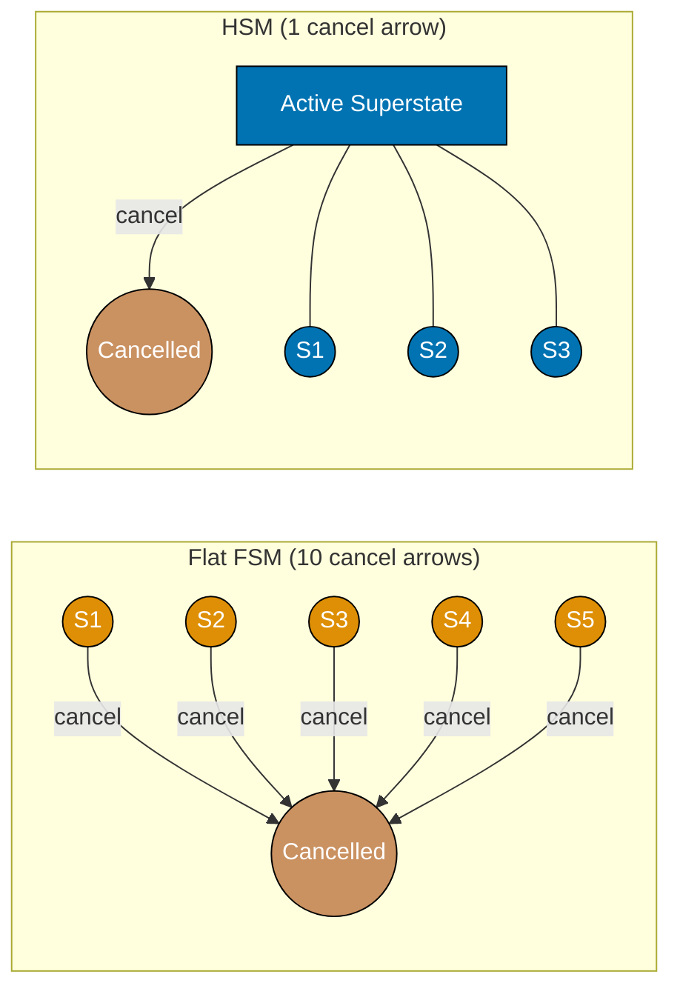




```rust
use std::marker::PhantomData;

// => WITHOUT superstate trait: each state needs its own cancel method
// => This is what the flat approach looks like — O(n) impl blocks for one logical transition
pub struct S1; pub struct S2; pub struct S3; pub struct S4; pub struct S5; pub struct Cancelled;
pub struct FlatPO<S> { pub id: String, _s: PhantomData<S> }

impl FlatPO<S1> {
    // => duplicate cancel — identical body for every state
    pub fn cancel(self) -> FlatPO<Cancelled> { FlatPO { id: self.id, _s: PhantomData } }
}
impl FlatPO<S2> {
    // => same cancel body — code duplication grows linearly with states
    pub fn cancel(self) -> FlatPO<Cancelled> { FlatPO { id: self.id, _s: PhantomData } }
}
// => ...repeated for S3, S4, S5 — every new substate requires another impl block

// => WITH superstate trait: one cancel definition covers all Active substates
pub trait ActiveCancel { fn cancel(self) -> FlatPO<Cancelled>; }
impl ActiveCancel for FlatPO<S1> { fn cancel(self) -> FlatPO<Cancelled> { FlatPO { id: self.id, _s: PhantomData } } }
impl ActiveCancel for FlatPO<S2> { fn cancel(self) -> FlatPO<Cancelled> { FlatPO { id: self.id, _s: PhantomData } } }
// => still per-type impls, but cancel LOGIC lives in one place (the trait default or a helper)
// => compared to flat: the trait enforces that all Active substates expose cancel

fn main() {
    println!("Flat FSM: O(n) cancel methods; HSM trait: 1 logical cancel");
    // => Output: Flat FSM: O(n) cancel methods; HSM trait: 1 logical cancel
}
```




```go
package main

import (
    "context"
    "fmt"
    "github.com/looplab/fsm"
)

func flatFSM() *fsm.FSM {
    // => FLAT: must list every source state in cancel Src — fragile, grows linearly
    return fsm.NewFSM("s1", fsm.Events{
        // => adding a new state s6 requires editing this line
        {Name: "cancel", Src: []string{"s1", "s2", "s3", "s4", "s5"}, Dst: "cancelled"},
    }, fsm.Callbacks{})
}

func hierarchicalFSM() *fsm.FSM {
    // => HIERARCHICAL SIMULATION: group active states under a conceptual superstate
    // => a helper function builds the Src slice — adding new active states means
    // => only updating the activeStates() function, not every event entry
    activeStates := []string{"s1", "s2", "s3", "s4", "s5"}
    events := fsm.Events{
        {Name: "cancel", Src: activeStates, Dst: "cancelled"}, // => single logical entry
    }
    return fsm.NewFSM("s1", events, fsm.Callbacks{})
}

func main() {
    ctx := context.Background()
    f := flatFSM()
    _ = f.Event(ctx, "cancel")
    fmt.Println("Flat cancel from s1:", f.Current())
    // => Output: Flat cancel from s1: cancelled

    h := hierarchicalFSM()
    _ = h.Event(ctx, "cancel")
    fmt.Println("Hierarchical cancel from s1:", h.Current())
    // => Output: Hierarchical cancel from s1: cancelled
    // => Same result; hierarchical code is easier to extend
}
```




> **Key takeaway**: Flat FSMs grow O(n) entries per global event; hierarchical FSMs define the event once on the superstate — Samek's formalism was motivated exactly by this combinatorial explosion in embedded systems.

**Why it matters**: Procurement state machines are never finished — new approval tiers, new exception states, and regulatory requirements keep adding substates. A flat FSM grows its transition table with every addition. A hierarchical FSM keeps the cancel, dispute, and escalate transitions unchanged regardless of how many substates the Active superstate accumulates.

---

## Parallel Regions (Examples 56–60)

### Example 56: Parallel Regions — Concept

Parallel regions model two independent concurrent state machines on the same aggregate. A PO simultaneously tracks its approval lifecycle (`Draft → Submitted → Issued`) and its document lifecycle (`Unattached → Attached`). Both regions are active at the same time and advance independently.

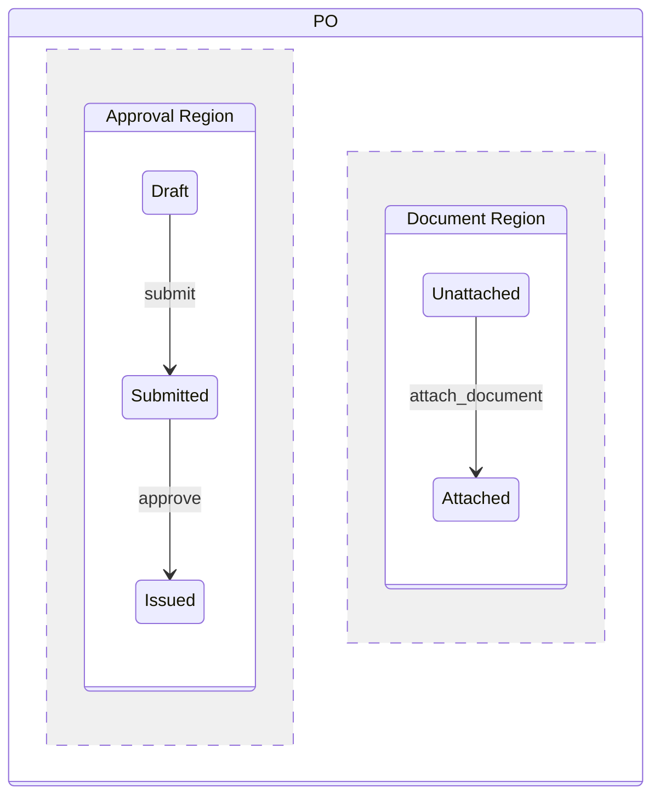




```rust
use std::marker::PhantomData;

// => Two independent phantom type parameters represent two parallel regions
// => ApprovalState tracks approval lifecycle; DocumentState tracks document lifecycle
pub struct PO<ApprovalState, DocumentState> {
    pub id: String,
    _approval: PhantomData<ApprovalState>,
    _document: PhantomData<DocumentState>,
}

// => Approval region states — form an independent axis
pub struct Draft; pub struct Submitted; pub struct Issued;
// => Document region states — completely independent of approval axis
pub struct Unattached; pub struct Attached { pub document_ref: String }

impl<DocState> PO<Draft, DocState> {
    // => submit() advances only the approval region; document region is untouched
    // => DocState is preserved by the generic parameter
    pub fn submit(self) -> PO<Submitted, DocState> {
        PO { id: self.id, _approval: PhantomData, _document: PhantomData }
    }
}

impl<ApprState> PO<ApprState, Unattached> {
    // => attach_document() advances only the document region; approval region is untouched
    // => ApprState is preserved by the generic parameter
    pub fn attach_document(self, doc_ref: String) -> PO<ApprState, Attached> {
        PO { id: self.id, _approval: PhantomData, _document: PhantomData::<Attached> }
    }
}

fn main() {
    // => start in both initial states: Draft (approval) + Unattached (document)
    let po: PO<Draft, Unattached> = PO { id: "PO-010".into(), _approval: PhantomData, _document: PhantomData };
    // => advance approval region; document region stays Unattached
    let po_sub: PO<Submitted, Unattached> = po.submit();
    // => advance document region; approval region stays Submitted
    let _po_both: PO<Submitted, Attached> = po_sub.attach_document("INV-2026-001.pdf".into());
    println!("Both regions advanced independently");
    // => Output: Both regions advanced independently
}
```




```go
package main

import (
    "context"
    "fmt"
    "github.com/looplab/fsm"
)

// => Go: two separate FSM instances on the same PO struct simulate parallel regions
type PO struct {
    ID          string
    approvalFSM *fsm.FSM  // => approval lifecycle machine
    documentFSM *fsm.FSM  // => document lifecycle machine
}

func NewPO(id string) *PO {
    return &PO{
        ID: id,
        approvalFSM: fsm.NewFSM("draft", fsm.Events{
            {Name: "submit", Src: []string{"draft"},     Dst: "submitted"},
            {Name: "approve", Src: []string{"submitted"}, Dst: "issued"},
        }, fsm.Callbacks{}),
        documentFSM: fsm.NewFSM("unattached", fsm.Events{
            // => document region is completely independent of approval
            {Name: "attach", Src: []string{"unattached"}, Dst: "attached"},
        }, fsm.Callbacks{}),
    }
}

func main() {
    po := NewPO("PO-010")
    ctx := context.Background()
    // => advance approval region; document region stays unattached
    _ = po.approvalFSM.Event(ctx, "submit")
    fmt.Println("Approval:", po.approvalFSM.Current(), "| Document:", po.documentFSM.Current())
    // => Output: Approval: submitted | Document: unattached
    // => advance document region; approval region stays submitted
    _ = po.documentFSM.Event(ctx, "attach")
    fmt.Println("Approval:", po.approvalFSM.Current(), "| Document:", po.documentFSM.Current())
    // => Output: Approval: submitted | Document: attached
}
```




> **Key takeaway**: Rust models parallel regions as two phantom type parameters; Go models them as two separate `fsm.FSM` instances on the same struct — both regions advance independently.

**Why it matters**: Real POs require both approval and documentation before goods can be received. A single-axis FSM cannot express this constraint without adding document states to the approval axis, polluting the model. Parallel regions keep each concern cleanly separated.

---

### Example 57: Rust Two-Axis Phantom Types for Parallel Regions

`attach_document()` must be available regardless of which approval state the PO is in. Two-axis phantom types achieve this by binding `attach_document` to the `Unattached` document axis only, leaving the approval axis as a free generic parameter.




```rust
use std::marker::PhantomData;

pub struct PO<ApprovalState, DocumentState> {
    pub id: String,
    _approval: PhantomData<ApprovalState>,
    _document: PhantomData<DocumentState>,
}

pub struct Draft; pub struct Submitted; pub struct ApprovalPending; pub struct Issued;
pub struct Unattached;
pub struct Attached { pub document_ref: String }

// => Generic impl: works for ANY ApprovalState when DocumentState is Unattached
// => This is the power of two-axis types — one method covers all approval states
impl<A> PO<A, Unattached> {
    pub fn attach_document(self, doc_ref: String) -> PO<A, Attached> {
        // => approval axis (A) is unchanged; document axis flips from Unattached to Attached
        println!("Attaching document: {}", doc_ref);
        PO { id: self.id, _approval: PhantomData, _document: PhantomData::<Attached> }
    }
}

// => Approval transitions: generic over document state
impl<D> PO<Draft, D> {
    // => submit() works whether document is attached or not
    pub fn submit(self) -> PO<Submitted, D> {
        PO { id: self.id, _approval: PhantomData, _document: PhantomData }
    }
}
impl<D> PO<Submitted, D> {
    // => request_approval() works regardless of document state
    pub fn request_approval(self) -> PO<ApprovalPending, D> {
        PO { id: self.id, _approval: PhantomData, _document: PhantomData }
    }
}

fn main() {
    let po: PO<Draft, Unattached> = PO { id: "PO-011".into(), _approval: PhantomData, _document: PhantomData };
    // => attach BEFORE submit — document first
    let po_doc: PO<Draft, Attached> = po.attach_document("contract.pdf".into());
    // => Output: Attaching document: contract.pdf
    let po_sub: PO<Submitted, Attached> = po_doc.submit();
    // => OR: submit first, attach later
    let po2: PO<Draft, Unattached> = PO { id: "PO-012".into(), _approval: PhantomData, _document: PhantomData };
    let po2_sub: PO<Submitted, Unattached> = po2.submit();
    let _po2_doc: PO<Submitted, Attached> = po2_sub.attach_document("invoice.pdf".into());
    // => Output: Attaching document: invoice.pdf
    // => both orderings compile — parallel axes are independent
    println!("Two orderings both compile; axes are independent");
    // => Output: Two orderings both compile; axes are independent
}
```




```go
package main

import (
    "context"
    "fmt"
    "github.com/looplab/fsm"
)

type PO struct {
    ID          string
    approvalFSM *fsm.FSM
    documentFSM *fsm.FSM
}

func NewPO(id string) *PO {
    return &PO{
        ID: id,
        approvalFSM: fsm.NewFSM("draft", fsm.Events{
            {Name: "submit",           Src: []string{"draft"},           Dst: "submitted"},
            {Name: "request_approval", Src: []string{"submitted"},       Dst: "approval_pending"},
            {Name: "approve",          Src: []string{"approval_pending"},Dst: "issued"},
        }, fsm.Callbacks{}),
        documentFSM: fsm.NewFSM("unattached", fsm.Events{
            // => attach event is independent of approval region state
            {Name: "attach", Src: []string{"unattached"}, Dst: "attached"},
        }, fsm.Callbacks{}),
    }
}

func (po *PO) AttachDocument(ctx context.Context, ref string) error {
    // => document FSM advances regardless of approval FSM state
    fmt.Println("Attaching document:", ref)
    return po.documentFSM.Event(ctx, "attach")
}

func main() {
    ctx := context.Background()
    po := NewPO("PO-011")
    // => attach before submit
    _ = po.AttachDocument(ctx, "contract.pdf")
    // => Output: Attaching document: contract.pdf
    _ = po.approvalFSM.Event(ctx, "submit")
    fmt.Println("Approval:", po.approvalFSM.Current(), "| Document:", po.documentFSM.Current())
    // => Output: Approval: submitted | Document: attached

    // => OR: submit before attach (different PO)
    po2 := NewPO("PO-012")
    _ = po2.approvalFSM.Event(ctx, "submit")
    _ = po2.AttachDocument(ctx, "invoice.pdf")
    // => Output: Attaching document: invoice.pdf
    fmt.Println("Approval:", po2.approvalFSM.Current(), "| Document:", po2.documentFSM.Current())
    // => Output: Approval: submitted | Document: attached
}
```




> **Key takeaway**: A generic impl over `<A> PO<A, Unattached>` makes `attach_document()` available at any approval state — the approval axis is a free parameter that passes through unchanged.

**Why it matters**: Document attachment in procurement has no dependency on approval stage — buyers can attach purchase requisitions, contracts, or supplier invoices at any point. The two-axis model expresses this independence directly in the type signature rather than via runtime guards or documentation.

---

### Example 58: AND-Join — Both Regions Must Complete

An AND-join fires a transition only when all parallel regions have reached their join state. In procurement, `complete()` (transition to `Received`) is only allowed when both the approval region is `Issued` AND the document region is `Attached`.

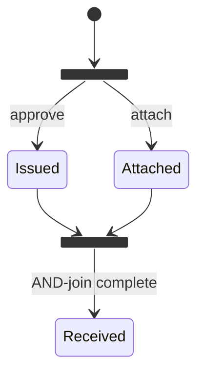




```rust
use std::marker::PhantomData;

pub struct PO<ApprovalState, DocumentState> {
    pub id: String,
    _approval: PhantomData<ApprovalState>,
    _document: PhantomData<DocumentState>,
}

pub struct Issued; pub struct Attached { pub document_ref: String }
pub struct Received;

impl PO<Issued, Attached> {
    // => complete() ONLY exists when ApprovalState == Issued AND DocumentState == Attached
    // => this is a type-level AND-join: both conditions enforced at compile time
    pub fn complete(self) -> PO<Received, Attached> {
        // => both conditions satisfied — safe to mark as received
        println!("AND-join satisfied: Issued ∧ Attached → Received");
        PO { id: self.id, _approval: PhantomData, _document: PhantomData }
    }
}

fn main() {
    // => This compiles: both regions are in their join states
    let po_ready: PO<Issued, Attached> = PO {
        id: "PO-013".into(),
        _approval: PhantomData,
        _document: PhantomData::<Attached>,
    };
    let _received: PO<Received, Attached> = po_ready.complete();
    // => Output: AND-join satisfied: Issued ∧ Attached → Received

    // => This DOES NOT compile (commented out — would fail at compile time):
    // let po_not_ready: PO<Issued, super::Unattached> = ...;
    // let _ = po_not_ready.complete(); // => error: no method `complete` on PO<Issued, Unattached>
    println!("AND-join enforced at compile time");
    // => Output: AND-join enforced at compile time
}
```




```go
package main

import (
    "context"
    "errors"
    "fmt"
    "github.com/looplab/fsm"
)

// => ErrNotReady is returned when AND-join conditions are not yet met
var ErrNotReady = errors.New("AND-join: both issued and attached required")

type PO struct {
    ID          string
    approvalFSM *fsm.FSM
    documentFSM *fsm.FSM
}

func NewPO(id string) *PO {
    return &PO{
        ID: id,
        approvalFSM: fsm.NewFSM("issued", fsm.Events{
            {Name: "complete", Src: []string{"issued"}, Dst: "received"},
        }, fsm.Callbacks{}),
        documentFSM: fsm.NewFSM("attached", fsm.Events{}, fsm.Callbacks{}),
    }
}

func (po *PO) TryComplete(ctx context.Context) error {
    // => AND-join check: both conditions must be true before firing the transition
    if po.approvalFSM.Current() != "issued" || po.documentFSM.Current() != "attached" {
        // => returns error instead of panicking — caller must handle incomplete state
        return ErrNotReady
    }
    return po.approvalFSM.Event(ctx, "complete")
}

func main() {
    ctx := context.Background()
    po := NewPO("PO-013")
    // => both conditions already satisfied in this example
    err := po.TryComplete(ctx)
    fmt.Println("Complete err:", err, "| State:", po.approvalFSM.Current())
    // => Output: Complete err: <nil> | State: received

    // => test the guard: approval ready but document not attached
    po2 := &PO{
        ID:          "PO-014",
        approvalFSM: fsm.NewFSM("issued",    fsm.Events{{Name: "complete", Src: []string{"issued"}, Dst: "received"}}, fsm.Callbacks{}),
        documentFSM: fsm.NewFSM("unattached", fsm.Events{}, fsm.Callbacks{}),
    }
    err2 := po2.TryComplete(ctx)
    fmt.Println("AND-join blocked:", err2)
    // => Output: AND-join blocked: AND-join: both issued and attached required
}
```




> **Key takeaway**: Rust enforces the AND-join at compile time by defining `complete()` only on `PO<Issued, Attached>`; Go enforces it at runtime with an explicit guard that returns `ErrNotReady`.

**Why it matters**: Receiving goods without an approved PO (or without documentation) creates procurement control failures — unmatched receipts, invoice fraud exposure, and audit exceptions. The AND-join makes this business rule impossible to bypass: in Rust it is a type error; in Go it is a returned error that cannot be silently ignored.

---

### Example 59: Parallel Region Conflict Resolution

Two parallel regions can produce conflicting events — approval cancels the PO while the document region is mid-attachment. The cancel event must take priority and the entire aggregate moves to Cancelled regardless of the document region's state.




```rust
use std::marker::PhantomData;

pub struct PO<ApprovalState, DocumentState> {
    pub id: String,
    _approval: PhantomData<ApprovalState>,
    _document: PhantomData<DocumentState>,
}

pub struct Submitted; pub struct Cancelled;
pub struct Unattached; pub struct Attaching; pub struct Attached;

// => cancel takes the WHOLE PO by value, consuming both type parameters
// => Document state becomes irrelevant — Cancelled carries no document axis
impl<D> PO<Submitted, D> {
    // => generic over D means cancel works regardless of document state (Unattached, Attaching, Attached)
    pub fn cancel(self) -> PO<Cancelled, ()> {
        // => document axis erased — cancel takes priority over all parallel regions
        println!("Cancel fires; document region erased (state was ignored)");
        PO { id: self.id, _approval: PhantomData, _document: PhantomData }
    }
}

fn main() {
    // => cancel from Submitted + Unattached
    let po1: PO<Submitted, Unattached> = PO { id: "PO-015".into(), _approval: PhantomData, _document: PhantomData };
    let _c1: PO<Cancelled, ()> = po1.cancel();
    // => Output: Cancel fires; document region erased (state was ignored)

    // => cancel from Submitted + Attaching (mid-attachment)
    let po2: PO<Submitted, Attaching> = PO { id: "PO-016".into(), _approval: PhantomData, _document: PhantomData };
    let _c2: PO<Cancelled, ()> = po2.cancel();
    // => Output: Cancel fires; document region erased (state was ignored)

    // => cancel from Submitted + Attached (document already done)
    let po3: PO<Submitted, Attached> = PO { id: "PO-017".into(), _approval: PhantomData, _document: PhantomData };
    let _c3: PO<Cancelled, ()> = po3.cancel();
    // => Output: Cancel fires; document region erased (state was ignored)
    println!("Priority rule: cancel always wins over document region");
    // => Output: Priority rule: cancel always wins over document region
}
```




```go
package main

import (
    "context"
    "fmt"
    "github.com/looplab/fsm"
)

type PO struct {
    ID          string
    approvalFSM *fsm.FSM
    documentFSM *fsm.FSM
}

func NewPO(id, approvalInit, documentInit string) *PO {
    return &PO{
        ID: id,
        approvalFSM: fsm.NewFSM(approvalInit, fsm.Events{
            {Name: "cancel", Src: []string{"submitted", "approval_pending", "issued"}, Dst: "cancelled"},
        }, fsm.Callbacks{
            // => after_cancel: fires after approval FSM transitions to cancelled
            // => priority rule: approval cancel overrides document region entirely
            "after_cancel": func(_ context.Context, e *fsm.Event) {
                fmt.Println("Approval cancelled; document region no longer relevant")
            },
        }),
        documentFSM: fsm.NewFSM(documentInit, fsm.Events{
            {Name: "attach", Src: []string{"unattached"}, Dst: "attached"},
        }, fsm.Callbacks{}),
    }
}

func (po *PO) Cancel(ctx context.Context) error {
    // => cancel fires on approval FSM regardless of document FSM state
    // => no check on po.documentFSM.Current() — approval cancel wins unconditionally
    return po.approvalFSM.Event(ctx, "cancel")
}

func main() {
    ctx := context.Background()
    // => cancel from submitted + unattached
    po1 := NewPO("PO-015", "submitted", "unattached")
    _ = po1.Cancel(ctx)
    // => Output: Approval cancelled; document region no longer relevant
    fmt.Println("po1 approval:", po1.approvalFSM.Current())
    // => Output: po1 approval: cancelled

    // => cancel from submitted + attaching (mid-process)
    po2 := NewPO("PO-016", "submitted", "attaching")
    _ = po2.Cancel(ctx)
    // => Output: Approval cancelled; document region no longer relevant
    fmt.Println("Priority rule enforced: document state is", po2.documentFSM.Current(), "(irrelevant)")
    // => Output: Priority rule enforced: document state is attaching (irrelevant)
}
```




> **Key takeaway**: A generic `impl<D> PO<Submitted, D>` makes `cancel()` available at any document state — the document axis is a free parameter that is consumed and erased, expressing priority at the type level.

**Why it matters**: Business rules often have priority hierarchies — legal holds, fraud flags, and cancellations override all other lifecycle events. Parallel region conflict resolution ensures these priorities are encoded structurally rather than scattered across conditional checks.

---

### Example 60: Parallel Region Integration Test

Integration tests for parallel region FSMs must verify both that independent axes advance independently and that AND-join guards block premature completion.




```rust
use std::marker::PhantomData;

pub struct PO<A, D = ()> { pub id: String, _a: PhantomData<A>, _d: PhantomData<D> }
pub struct Draft; pub struct Submitted; pub struct Issued; pub struct Received; pub struct Cancelled;
pub struct Unattached; pub struct Attached;

impl<D> PO<Draft, D> {
    pub fn submit(self) -> PO<Submitted, D> { PO { id: self.id, _a: PhantomData, _d: PhantomData } }
}
impl<D> PO<Submitted, D> {
    pub fn approve(self) -> PO<Issued, D> { PO { id: self.id, _a: PhantomData, _d: PhantomData } }
}
impl<A> PO<A, Unattached> {
    pub fn attach(self) -> PO<A, Attached> { PO { id: self.id, _a: PhantomData, _d: PhantomData } }
}
impl PO<Issued, Attached> {
    pub fn complete(self) -> PO<Received, Attached> { PO { id: self.id, _a: PhantomData, _d: PhantomData } }
}

#[cfg(test)]
mod tests {
    use super::*;
    use std::marker::PhantomData;

    fn make_po(id: &str) -> PO<Draft, Unattached> {
        PO { id: id.into(), _a: PhantomData, _d: PhantomData }
    }

    #[test]
    fn test_attach_before_submit() {
        // => document axis advances first; approval axis unchanged
        let po = make_po("test-01").attach().submit().approve();
        // => po is now PO<Issued, Attached> — both axes in join state
        let received = po.complete();
        assert_eq!(received.id, "test-01");
        // => AND-join satisfied: compiles and runs without error
    }

    #[test]
    fn test_submit_before_attach() {
        // => approval axis advances first; document axis unchanged
        let po = make_po("test-02").submit().approve().attach();
        // => po is now PO<Issued, Attached> — order of axis advancement doesn't matter
        let _received = po.complete();
    }

    // => This test demonstrates compile-time AND-join enforcement:
    // => fn test_complete_without_attach() {
    // =>     let po = make_po("test-03").submit().approve(); // PO<Issued, Unattached>
    // =>     let _ = po.complete(); // ERROR: no method `complete` on PO<Issued, Unattached>
    // => }
}

fn main() {
    println!("Run tests with: cargo test");
    // => Output: Run tests with: cargo test
}
```




```go
package main

import (
    "context"
    "errors"
    "fmt"
    "testing"
    "github.com/looplab/fsm"
)

var ErrNotReady = errors.New("AND-join not satisfied")

type PO struct {
    approvalFSM *fsm.FSM
    documentFSM *fsm.FSM
}

func NewTestPO() *PO {
    return &PO{
        approvalFSM: fsm.NewFSM("draft", fsm.Events{
            {Name: "submit",  Src: []string{"draft"},     Dst: "submitted"},
            {Name: "approve", Src: []string{"submitted"}, Dst: "issued"},
            {Name: "complete",Src: []string{"issued"},    Dst: "received"},
        }, fsm.Callbacks{}),
        documentFSM: fsm.NewFSM("unattached", fsm.Events{
            {Name: "attach", Src: []string{"unattached"}, Dst: "attached"},
        }, fsm.Callbacks{}),
    }
}

func (po *PO) TryComplete(ctx context.Context) error {
    if po.approvalFSM.Current() != "issued" || po.documentFSM.Current() != "attached" {
        return ErrNotReady
    }
    return po.approvalFSM.Event(ctx, "complete")
}

// => TestAttachBeforeApprove: document axis advances before approval axis reaches Issued
func TestAttachBeforeApprove(t *testing.T) {
    ctx := context.Background()
    po := NewTestPO()
    // => advance document region first
    _ = po.documentFSM.Event(ctx, "attach")
    _ = po.approvalFSM.Event(ctx, "submit")
    _ = po.approvalFSM.Event(ctx, "approve")
    if err := po.TryComplete(ctx); err != nil {
        t.Fatalf("AND-join should be satisfied: %v", err)
    }
    // => approval FSM is now "received"
}

// => TestCompleteWithoutAttach: AND-join blocks completion when document not attached
func TestCompleteWithoutAttach(t *testing.T) {
    ctx := context.Background()
    po := NewTestPO()
    _ = po.approvalFSM.Event(ctx, "submit")
    _ = po.approvalFSM.Event(ctx, "approve")
    // => document region still unattached
    err := po.TryComplete(ctx)
    if !errors.Is(err, ErrNotReady) {
        t.Fatalf("expected ErrNotReady, got: %v", err)
    }
    // => AND-join correctly blocked
}

func main() {
    fmt.Println("Run tests with: go test ./...")
    // => Output: Run tests with: go test ./...
}
```




> **Key takeaway**: Rust compile-time AND-join means the "missing attach before complete" test doesn't even compile; Go runtime AND-join is verified by asserting `ErrNotReady` in a table-driven test.

**Why it matters**: Parallel region tests must cover all axis orderings — attach-then-approve, approve-then-attach, and the guard failure case. Missing any of these cases allows real procurement bugs to reach production where incomplete POs are received without documentation.

---

## Saga as Explicit FSM (Examples 61–65)

### Example 61: Saga as an Explicit FSM — Three-Way Match Saga

A saga is a long-running business transaction spanning multiple aggregates. Modelling it as an explicit FSM makes the protocol visible, testable, and auditable. The three-way match saga coordinates a PO, a Goods Receipt Note (GRN), and an Invoice — it waits for all three to arrive before completing.

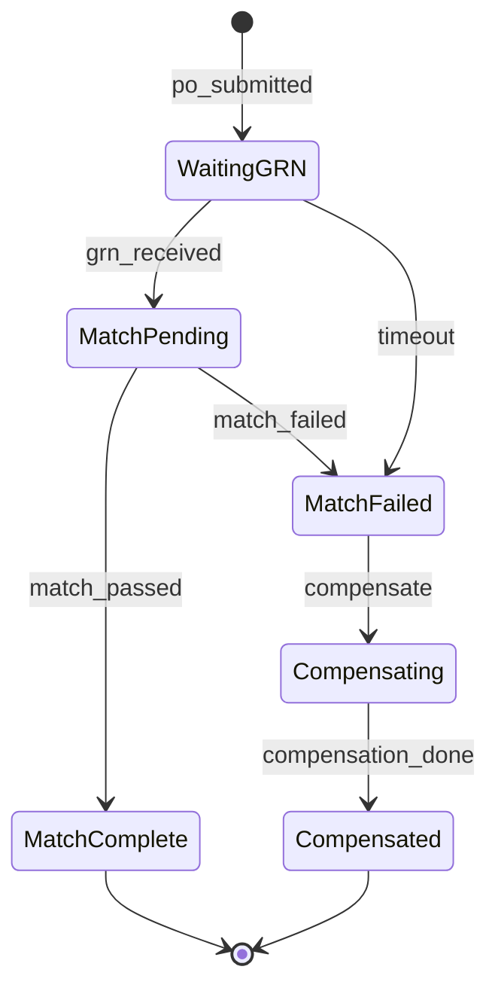




```rust
use std::marker::PhantomData;
use uuid::Uuid;

// => Saga states are marker structs — no data in the state itself
// => Data lives in the saga struct fields, not in the state marker
pub struct SagaInit;
pub struct WaitingGRN;
pub struct MatchPending { pub grn_id: String }
pub struct MatchComplete;
pub struct MatchFailed { pub reason: String }

// => The saga struct carries saga identity + PO identity + current state
pub struct ThreeWayMatchSaga<S> {
    pub id: Uuid,
    pub po_id: String,
    _state: PhantomData<S>,
}

impl ThreeWayMatchSaga<SagaInit> {
    pub fn new(po_id: String) -> Self {
        // => create saga when PO is submitted; assigns a new saga UUID
        ThreeWayMatchSaga { id: Uuid::new_v4(), po_id, _state: PhantomData }
    }
    pub fn po_submitted(self) -> ThreeWayMatchSaga<WaitingGRN> {
        // => transition to WaitingGRN: saga now waits for GRN event
        println!("Saga {} waiting for GRN on PO {}", self.id, self.po_id);
        ThreeWayMatchSaga { id: self.id, po_id: self.po_id, _state: PhantomData }
    }
}

impl ThreeWayMatchSaga<WaitingGRN> {
    pub fn grn_received(self, grn_id: String) -> ThreeWayMatchSaga<MatchPending> {
        // => GRN arrives; saga advances to MatchPending for the actual matching check
        println!("GRN {} received; running three-way match", grn_id);
        ThreeWayMatchSaga { id: self.id, po_id: self.po_id, _state: PhantomData }
    }
    pub fn timeout(self) -> ThreeWayMatchSaga<MatchFailed> {
        // => no GRN arrived within deadline — saga fails with timeout reason
        ThreeWayMatchSaga { id: self.id, po_id: self.po_id, _state: PhantomData }
    }
}

impl ThreeWayMatchSaga<MatchPending> {
    pub fn match_passed(self) -> ThreeWayMatchSaga<MatchComplete> {
        // => PO qty, GRN qty, and invoice amount all match — saga completes successfully
        println!("Three-way match passed; invoice approved");
        ThreeWayMatchSaga { id: self.id, po_id: self.po_id, _state: PhantomData }
    }
    pub fn match_failed(self, reason: String) -> ThreeWayMatchSaga<MatchFailed> {
        // => discrepancy detected; saga moves to MatchFailed for compensation
        println!("Three-way match failed: {}", reason);
        ThreeWayMatchSaga { id: self.id, po_id: self.po_id, _state: PhantomData }
    }
}

fn main() {
    let saga = ThreeWayMatchSaga::<SagaInit>::new("PO-020".into());
    let waiting = saga.po_submitted();
    // => Output: Saga <uuid> waiting for GRN on PO PO-020
    let pending = waiting.grn_received("GRN-100".into());
    // => Output: GRN GRN-100 received; running three-way match
    let _complete = pending.match_passed();
    // => Output: Three-way match passed; invoice approved
}
```




```go
package main

import (
    "context"
    "fmt"
    "github.com/looplab/fsm"
    "github.com/google/uuid"
)

type ThreeWayMatchSaga struct {
    ID    string
    POId  string
    GRNID *string
    fsm   *fsm.FSM
}

func NewSaga(poId string) *ThreeWayMatchSaga {
    s := &ThreeWayMatchSaga{ID: uuid.New().String(), POId: poId}
    s.fsm = fsm.NewFSM(
        "saga_init",
        fsm.Events{
            // => saga lifecycle transitions mirror the Rust typestate transitions
            {Name: "po_submitted",  Src: []string{"saga_init"},    Dst: "waiting_grn"},
            {Name: "grn_received",  Src: []string{"waiting_grn"},  Dst: "match_pending"},
            {Name: "match_passed",  Src: []string{"match_pending"}, Dst: "match_complete"},
            {Name: "match_failed",  Src: []string{"match_pending"}, Dst: "match_failed"},
            {Name: "timeout",       Src: []string{"waiting_grn"},  Dst: "match_failed"},
            {Name: "compensate",    Src: []string{"match_failed"},  Dst: "compensating"},
            {Name: "comp_done",     Src: []string{"compensating"},  Dst: "compensated"},
        },
        fsm.Callbacks{
            "enter_waiting_grn": func(_ context.Context, e *fsm.Event) {
                fmt.Println("Saga waiting for GRN")
            },
            "enter_match_pending": func(_ context.Context, e *fsm.Event) {
                fmt.Println("Running three-way match check")
            },
            "enter_match_complete": func(_ context.Context, e *fsm.Event) {
                fmt.Println("Three-way match passed; invoice approved")
            },
        },
    )
    return s
}

func main() {
    ctx := context.Background()
    saga := NewSaga("PO-020")
    _ = saga.fsm.Event(ctx, "po_submitted")
    // => Output: Saga waiting for GRN
    _ = saga.fsm.Event(ctx, "grn_received")
    // => Output: Running three-way match check
    _ = saga.fsm.Event(ctx, "match_passed")
    // => Output: Three-way match passed; invoice approved
    fmt.Println("Saga state:", saga.fsm.Current())
    // => Output: Saga state: match_complete
}
```




> **Key takeaway**: A saga modelled as an explicit FSM makes every compensation path and timeout visible in the state diagram — the protocol is documentation as well as code.

**Why it matters**: Implicit sagas — where compensation logic is scattered across catch blocks and retry loops — are the primary source of data inconsistency bugs in distributed procurement systems. An explicit FSM saga records every state transition to persistent storage, enabling crash recovery and audit reconstruction.

---

### Example 62: Saga Compensation Transitions

When the three-way match fails, the saga must compensate — undo completed steps such as reverting an invoice back to `Submitted` for the supplier to correct. Compensation is itself a state machine with `Compensating` (undo in progress) and `Compensated` (terminal, undo complete) states.

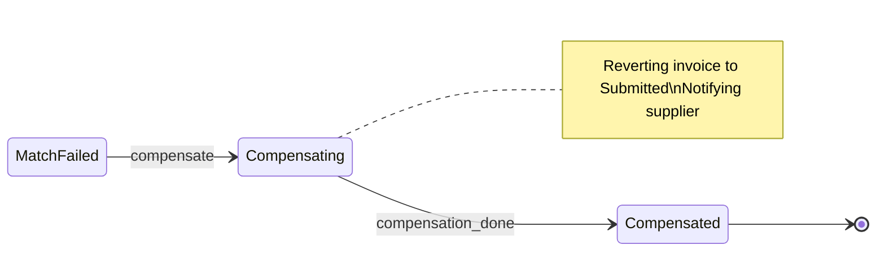




```rust
use std::marker::PhantomData;
use uuid::Uuid;

// => Compensation states — compensation is itself a mini state machine
pub struct MatchFailed { pub reason: String }
pub struct Compensating;  // => compensation actions running (e.g., reverting invoice)
pub struct Compensated;   // => all undo actions complete — terminal state

pub struct ThreeWayMatchSaga<S> {
    pub id: Uuid,
    pub po_id: String,
    _state: PhantomData<S>,
}

impl ThreeWayMatchSaga<MatchFailed> {
    // => compensate() begins the undo process — moves to Compensating
    pub fn compensate(self) -> ThreeWayMatchSaga<Compensating> {
        println!("Beginning compensation for saga {}", self.id);
        // => in real code: emit CompensationStarted domain event to message bus
        ThreeWayMatchSaga { id: self.id, po_id: self.po_id, _state: PhantomData }
    }
}

impl ThreeWayMatchSaga<Compensating> {
    // => complete_compensation() marks undo as done — moves to Compensated (terminal)
    pub fn complete_compensation(self) -> ThreeWayMatchSaga<Compensated> {
        // => compensation complete: invoice reverted to Submitted
        println!("Compensation complete; invoice reverted to Submitted for re-submission");
        // => Compensated is terminal — no further transitions available
        ThreeWayMatchSaga { id: self.id, po_id: self.po_id, _state: PhantomData }
    }
    // => compensate_step() can be called multiple times for partial undo (idempotent)
    pub fn compensate_step(self, step: &str) -> ThreeWayMatchSaga<Compensating> {
        println!("Compensating step: {}", step);
        // => saga stays in Compensating until all steps are done
        self
    }
}

fn main() {
    let saga = ThreeWayMatchSaga::<MatchFailed> {
        id: Uuid::new_v4(),
        po_id: "PO-020".into(),
        _state: PhantomData,
    };
    let compensating = saga.compensate();
    // => Output: Beginning compensation for saga <uuid>
    let compensating2 = compensating.compensate_step("revert_invoice");
    // => Output: Compensating step: revert_invoice
    let _compensated = compensating2.complete_compensation();
    // => Output: Compensation complete; invoice reverted to Submitted for re-submission
    // => ThreeWayMatchSaga<Compensated> has no further methods — safe terminal state
}
```




```go
package main

import (
    "context"
    "fmt"
    "github.com/looplab/fsm"
)

type Saga struct{ fsm *fsm.FSM }

func NewFailedSaga() *Saga {
    s := &Saga{}
    s.fsm = fsm.NewFSM(
        "match_failed",
        fsm.Events{
            // => compensation path: MatchFailed → Compensating → Compensated
            {Name: "compensate",  Src: []string{"match_failed"},  Dst: "compensating"},
            {Name: "comp_done",   Src: []string{"compensating"},  Dst: "compensated"},
        },
        fsm.Callbacks{
            "enter_compensating": func(_ context.Context, e *fsm.Event) {
                // => side-effect: revert invoice to Submitted in invoice aggregate
                fmt.Println("Beginning compensation: reverting invoice to Submitted")
            },
            "enter_compensated": func(_ context.Context, e *fsm.Event) {
                // => all undo steps done; saga is terminal
                fmt.Println("Compensation complete; saga closed")
            },
        },
    )
    return s
}

func main() {
    ctx := context.Background()
    saga := NewFailedSaga()
    _ = saga.fsm.Event(ctx, "compensate")
    // => Output: Beginning compensation: reverting invoice to Submitted
    fmt.Println("State:", saga.fsm.Current())
    // => Output: State: compensating
    _ = saga.fsm.Event(ctx, "comp_done")
    // => Output: Compensation complete; saga closed
    fmt.Println("State:", saga.fsm.Current())
    // => Output: State: compensated
    // => attempt further transition from terminal state
    err := saga.fsm.Event(ctx, "compensate")
    fmt.Println("No further transitions from Compensated:", err)
    // => Output: No further transitions from Compensated: event compensate inappropriate in current state compensated
}
```




> **Key takeaway**: Compensation is itself a state machine — `Compensating` (undo running) and `Compensated` (terminal) states prevent compensation from being re-triggered or partially applied.

**Why it matters**: In distributed procurement systems, compensation can fail partway through — network timeouts while reverting an invoice leave the saga in an inconsistent state. Modelling compensation as `Compensating` (intermediate) vs `Compensated` (terminal) allows crash recovery: on restart, check if the saga is in `Compensating` and resume from the last completed undo step.

---

### Example 63: Saga Timeout Transitions

Sagas waiting for external events must have deadlines — a GRN that never arrives must eventually fail the saga rather than waiting indefinitely. A `check_timeout()` method returns `Ok(saga)` if still within deadline or `Err(failed_saga)` if the deadline has passed.

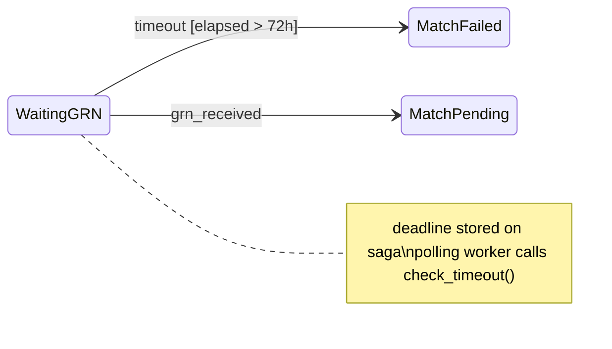




```rust
use std::marker::PhantomData;
use chrono::{DateTime, Utc, Duration};
use uuid::Uuid;

pub struct WaitingGRN;
pub struct MatchFailed { pub reason: String }

// => deadline is stored on the saga struct, not in the state marker
pub struct ThreeWayMatchSaga<S> {
    pub id: Uuid,
    pub po_id: String,
    pub deadline: DateTime<Utc>,  // => absolute UTC timestamp; set on saga creation
    _state: PhantomData<S>,
}

impl ThreeWayMatchSaga<WaitingGRN> {
    // => check_timeout returns Ok(self) if within deadline, Err(failed) if expired
    // => Rust forces the caller to handle both branches via Result
    pub fn check_timeout(self) -> Result<ThreeWayMatchSaga<WaitingGRN>, ThreeWayMatchSaga<MatchFailed>> {
        if Utc::now() > self.deadline {
            // => deadline exceeded — transition to MatchFailed
            println!("Saga {} timed out waiting for GRN", self.id);
            Err(ThreeWayMatchSaga {
                id: self.id,
                po_id: self.po_id,
                deadline: self.deadline,
                _state: PhantomData::<MatchFailed>,
            })
        } else {
            // => still within deadline — return unchanged saga
            Ok(self)
        }
    }
}

fn main() {
    // => simulate an already-expired saga (deadline 73 hours ago)
    let saga = ThreeWayMatchSaga::<WaitingGRN> {
        id: Uuid::new_v4(),
        po_id: "PO-021".into(),
        deadline: Utc::now() - Duration::hours(73), // => deadline in the past
        _state: PhantomData,
    };
    match saga.check_timeout() {
        Ok(_still_waiting) => println!("Still within deadline"),
        Err(failed) => {
            // => Err branch forces handling — cannot silently discard timeout
            println!("Saga timed out: {:?}", failed.po_id);
            // => Output: Saga <uuid> timed out waiting for GRN
            // => Output: Saga timed out: "PO-021"
        }
    }
}
```




```go
package main

import (
    "context"
    "fmt"
    "time"
    "github.com/looplab/fsm"
)

type SagaStore struct {
    ID       string
    POId     string
    Deadline time.Time
    fsm      *fsm.FSM
}

func NewWaitingSaga(poId string, deadline time.Time) *SagaStore {
    s := &SagaStore{ID: "saga-001", POId: poId, Deadline: deadline}
    s.fsm = fsm.NewFSM(
        "waiting_grn",
        fsm.Events{
            {Name: "grn_received", Src: []string{"waiting_grn"}, Dst: "match_pending"},
            {Name: "timeout",      Src: []string{"waiting_grn"}, Dst: "match_failed"},
        },
        fsm.Callbacks{
            "enter_match_failed": func(_ context.Context, e *fsm.Event) {
                // => log reason for the timeout transition
                fmt.Println("Saga moved to match_failed:", e.Args)
            },
        },
    )
    return s
}

// => CheckTimeout is called by a background scheduler goroutine
func (s *SagaStore) CheckTimeout(ctx context.Context) error {
    if time.Now().After(s.Deadline) {
        // => deadline exceeded — fire timeout transition with reason arg
        return s.fsm.Event(ctx, "timeout", "GRN not received within 72h")
    }
    // => still within deadline — no-op
    return nil
}

func main() {
    ctx := context.Background()
    // => saga with expired deadline (72 hours ago)
    expiredDeadline := time.Now().Add(-73 * time.Hour)
    saga := NewWaitingSaga("PO-021", expiredDeadline)
    err := saga.CheckTimeout(ctx)
    fmt.Println("CheckTimeout err:", err, "| State:", saga.fsm.Current())
    // => Output: Saga moved to match_failed: [GRN not received within 72h]
    // => Output: CheckTimeout err: <nil> | State: match_failed
}
```




> **Key takeaway**: `check_timeout()` returning `Result` forces the Rust caller to handle both branches; Go fires the `timeout` event from a background scheduler goroutine that polls the saga store.

**Why it matters**: Unresolved sagas accumulate indefinitely without timeout enforcement — they hold locks, consume scheduler slots, and create ghost records in the procurement system. A 72-hour GRN timeout is a standard procurement SLA; encoding it in the saga FSM makes the SLA auditable.

---

### Example 64: Saga Persistence (Checkpoint)

A saga must survive process restarts. `SagaRecord` is a serializable snapshot of the saga's state, persisted to the database after every transition via a `SagaRepository` trait.

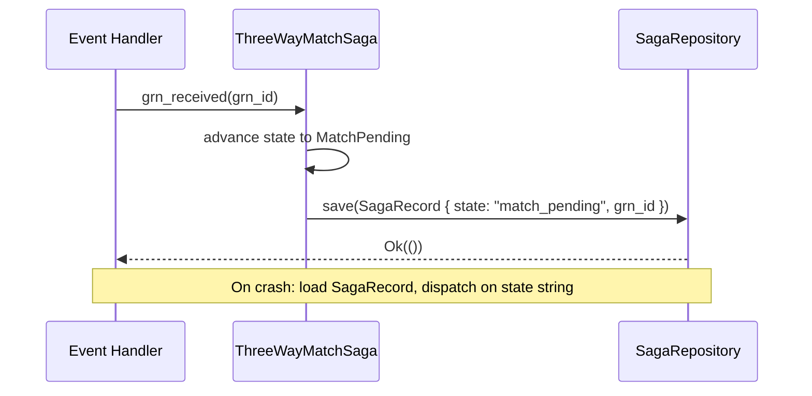




```rust
use serde::{Serialize, Deserialize};
use chrono::{DateTime, Utc};
use uuid::Uuid;

// => SagaRecord is the database row — serializable, no phantom types
// => phantom types live in memory only; the DB stores a string tag
#[derive(Serialize, Deserialize, Debug, Clone)]
pub struct SagaRecord {
    pub id: Uuid,
    pub po_id: String,
    // => state stored as string — parsed back to enum on load
    pub state: String,
    // => optional fields populated as saga advances
    pub grn_id: Option<String>,
    pub failure_reason: Option<String>,
    pub deadline: DateTime<Utc>,
    pub created_at: DateTime<Utc>,
    pub updated_at: DateTime<Utc>,
}

// => SagaRepository trait: storage abstraction for async persistence
// => both Postgres and in-memory implementations satisfy this trait
pub trait SagaRepository {
    type Error;
    // => save(): insert or update the record after every state transition
    fn save(&self, saga: &SagaRecord) -> Result<(), Self::Error>;
    // => find_by_po(): load saga for a given PO during event handling
    fn find_by_po(&self, po_id: &str) -> Result<Option<SagaRecord>, Self::Error>;
    // => find_timed_out(): used by timeout scheduler to find expired WaitingGRN sagas
    fn find_timed_out(&self, now: DateTime<Utc>) -> Result<Vec<SagaRecord>, Self::Error>;
}

// => In-memory implementation for tests
pub struct InMemoryRepo {
    pub records: std::cell::RefCell<Vec<SagaRecord>>,
}

impl SagaRepository for InMemoryRepo {
    type Error = String;
    fn save(&self, saga: &SagaRecord) -> Result<(), String> {
        // => upsert by id
        let mut recs = self.records.borrow_mut();
        recs.retain(|r| r.id != saga.id);
        recs.push(saga.clone());
        Ok(())
    }
    fn find_by_po(&self, po_id: &str) -> Result<Option<SagaRecord>, String> {
        Ok(self.records.borrow().iter().find(|r| r.po_id == po_id).cloned())
    }
    fn find_timed_out(&self, now: DateTime<Utc>) -> Result<Vec<SagaRecord>, String> {
        // => return all WaitingGRN sagas whose deadline has passed
        Ok(self.records.borrow().iter()
            .filter(|r| r.state == "waiting_grn" && r.deadline < now)
            .cloned()
            .collect())
    }
}

fn main() {
    use chrono::Duration;
    let repo = InMemoryRepo { records: std::cell::RefCell::new(vec![]) };
    let record = SagaRecord {
        id: Uuid::new_v4(),
        po_id: "PO-022".into(),
        state: "waiting_grn".into(),
        grn_id: None,
        failure_reason: None,
        deadline: Utc::now() + Duration::hours(72), // => 72-hour SLA
        created_at: Utc::now(),
        updated_at: Utc::now(),
    };
    repo.save(&record).unwrap();
    // => saga persisted after creation
    let loaded = repo.find_by_po("PO-022").unwrap();
    println!("Loaded state: {:?}", loaded.map(|r| r.state));
    // => Output: Loaded state: Some("waiting_grn")
}
```




```go
package main

import (
    "fmt"
    "sync"
    "time"
)

// => SagaRecord mirrors the database row — JSON-serializable, no FSM object
type SagaRecord struct {
    ID            string
    POId          string
    State         string     // => string snapshot of current FSM state
    GRNID         *string    // => nil until GRN arrives
    FailureReason *string    // => nil until match fails
    Deadline      time.Time
    CreatedAt     time.Time
    UpdatedAt     time.Time
}

// => SagaRepository interface: abstracts persistence for testing and production
type SagaRepository interface {
    Save(saga *SagaRecord) error
    FindByPO(poId string) (*SagaRecord, error)
    FindTimedOut(now time.Time) ([]*SagaRecord, error)
}

// => InMemorySagaRepo: test double — no database required
type InMemorySagaRepo struct {
    mu      sync.RWMutex
    records map[string]*SagaRecord
}

func (r *InMemorySagaRepo) Save(saga *SagaRecord) error {
    r.mu.Lock()
    defer r.mu.Unlock()
    // => update updated_at on every save
    saga.UpdatedAt = time.Now()
    r.records[saga.ID] = saga
    return nil
}

func (r *InMemorySagaRepo) FindByPO(poId string) (*SagaRecord, error) {
    r.mu.RLock()
    defer r.mu.RUnlock()
    for _, rec := range r.records {
        if rec.POId == poId { return rec, nil }
    }
    return nil, nil
}

func (r *InMemorySagaRepo) FindTimedOut(now time.Time) ([]*SagaRecord, error) {
    r.mu.RLock()
    defer r.mu.RUnlock()
    var result []*SagaRecord
    for _, rec := range r.records {
        // => timed out = WaitingGRN AND deadline has passed
        if rec.State == "waiting_grn" && rec.Deadline.Before(now) {
            result = append(result, rec)
        }
    }
    return result, nil
}

func main() {
    repo := &InMemorySagaRepo{records: make(map[string]*SagaRecord)}
    rec := &SagaRecord{
        ID: "saga-001", POId: "PO-022", State: "waiting_grn",
        Deadline: time.Now().Add(72 * time.Hour), // => 72-hour SLA
        CreatedAt: time.Now(),
    }
    _ = repo.Save(rec)
    loaded, _ := repo.FindByPO("PO-022")
    fmt.Println("Loaded state:", loaded.State)
    // => Output: Loaded state: waiting_grn
    // => check for timed-out sagas (none yet, deadline is in the future)
    expired, _ := repo.FindTimedOut(time.Now())
    fmt.Println("Timed-out count:", len(expired))
    // => Output: Timed-out count: 0
}
```




> **Key takeaway**: The saga's runtime typestate (phantom types in Rust, FSM object in Go) and its persistent form (`SagaRecord`) are two separate representations — persistence requires serialization to a string state tag.

**Why it matters**: Saga persistence is what separates a saga from a simple try-catch. On process restart, `find_by_po()` loads the record, the state string tells the coordinator which step to resume from, and `find_timed_out()` drives the scheduler. Without persistence, every crash loses saga progress and creates orphaned POs.

---

### Example 65: Saga Retry on Transient Failure

When the three-way match engine returns a transient error (network timeout, temporary unavailability), the saga should retry the match check rather than immediately failing. A self-transition on `MatchPending` with an incremented retry counter handles this.

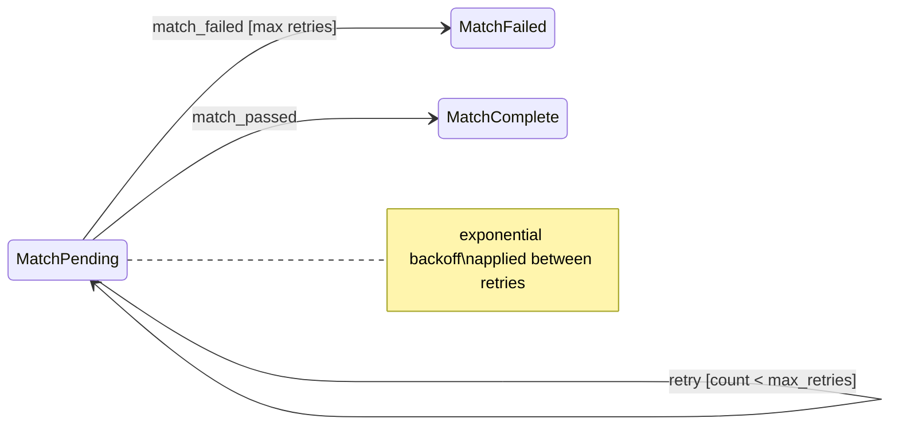




```rust
use std::marker::PhantomData;
use uuid::Uuid;

pub struct MatchPending;
pub struct MatchFailed { pub reason: String }
pub struct MatchComplete;

const MAX_RETRIES: u32 = 3;

pub struct ThreeWayMatchSaga<S> {
    pub id: Uuid,
    pub po_id: String,
    pub retry_count: u32, // => incremented on each retry; checked before match_failed
    _state: PhantomData<S>,
}

impl ThreeWayMatchSaga<MatchPending> {
    // => retry() is a self-transition — saga stays in MatchPending, counter increments
    pub fn retry(self) -> Result<ThreeWayMatchSaga<MatchPending>, ThreeWayMatchSaga<MatchFailed>> {
        if self.retry_count >= MAX_RETRIES {
            // => max retries exceeded — transition to MatchFailed
            println!("Max retries ({}) exceeded for saga {}", MAX_RETRIES, self.id);
            Err(ThreeWayMatchSaga {
                id: self.id, po_id: self.po_id, retry_count: self.retry_count,
                _state: PhantomData::<MatchFailed>,
            })
        } else {
            // => still under max — increment counter and stay in MatchPending
            let new_count = self.retry_count + 1;
            println!("Retry {} of {} for saga {}", new_count, MAX_RETRIES, self.id);
            Ok(ThreeWayMatchSaga {
                id: self.id, po_id: self.po_id, retry_count: new_count,
                _state: PhantomData::<MatchPending>,
            })
        }
    }
    pub fn match_passed(self) -> ThreeWayMatchSaga<MatchComplete> {
        ThreeWayMatchSaga { id: self.id, po_id: self.po_id, retry_count: self.retry_count, _state: PhantomData }
    }
}

fn main() {
    let saga = ThreeWayMatchSaga::<MatchPending> {
        id: Uuid::new_v4(), po_id: "PO-023".into(), retry_count: 0, _state: PhantomData
    };
    // => simulate 3 retries then failure
    let saga = saga.retry().unwrap(); // => retry 1
    let saga = saga.retry().unwrap(); // => retry 2
    let saga = saga.retry().unwrap(); // => retry 3
    match saga.retry() {
        Ok(_) => println!("Still retrying"),
        Err(failed) => println!("Saga failed after max retries: {}", failed.retry_count),
        // => Output: Max retries (3) exceeded for saga <uuid>
        // => Output: Saga failed after max retries: 3
    }
}
```




```go
package main

import (
    "context"
    "fmt"
    "github.com/looplab/fsm"
)

const MaxRetries = 3

type MatchSaga struct {
    RetryCount int
    fsm        *fsm.FSM
}

func NewMatchSaga() *MatchSaga {
    s := &MatchSaga{}
    s.fsm = fsm.NewFSM(
        "match_pending",
        fsm.Events{
            // => retry is a self-transition: Src == Dst == match_pending
            {Name: "retry",        Src: []string{"match_pending"}, Dst: "match_pending"},
            {Name: "match_passed", Src: []string{"match_pending"}, Dst: "match_complete"},
            {Name: "match_failed", Src: []string{"match_pending"}, Dst: "match_failed"},
        },
        fsm.Callbacks{
            "before_retry": func(_ context.Context, e *fsm.Event) {
                s.RetryCount++
                // => before_retry fires on self-transition; entry actions re-run
                fmt.Printf("Retry %d of %d\n", s.RetryCount, MaxRetries)
            },
        },
    )
    return s
}

func (s *MatchSaga) TryRetry(ctx context.Context) error {
    if s.RetryCount >= MaxRetries {
        // => max exceeded — transition to permanent failure
        return s.fsm.Event(ctx, "match_failed")
    }
    return s.fsm.Event(ctx, "retry")
}

func main() {
    ctx := context.Background()
    saga := NewMatchSaga()
    _ = saga.TryRetry(ctx) // => Retry 1 of 3
    _ = saga.TryRetry(ctx) // => Retry 2 of 3
    _ = saga.TryRetry(ctx) // => Retry 3 of 3
    _ = saga.TryRetry(ctx) // => RetryCount >= MaxRetries → match_failed
    fmt.Println("Final state:", saga.fsm.Current(), "retries:", saga.RetryCount)
    // => Output: Final state: match_failed retries: 3
}
```




> **Key takeaway**: A self-transition on `MatchPending` with an incrementing counter retries the match check without changing state; exceeding `MAX_RETRIES` transitions to `MatchFailed` via the same `retry()` method.

**Why it matters**: Three-way matching queries multiple aggregates (PO service, GRN service, invoice service) across network boundaries. Transient failures are expected. Retry-with-backoff prevents a single network hiccup from permanently failing a saga — while the retry counter prevents infinite loops from masking a genuine data discrepancy.

---

## Production FSM Concerns (Examples 66–70)

### Example 66: FSM State Persistence — Storing Typestate

Rust typestate cannot be directly serialized — `PhantomData<S>` carries no runtime data. Persistence requires converting the current state to a string enum tag (`POStateTag`) on save and dispatching back to typed methods via runtime enum matching on load.

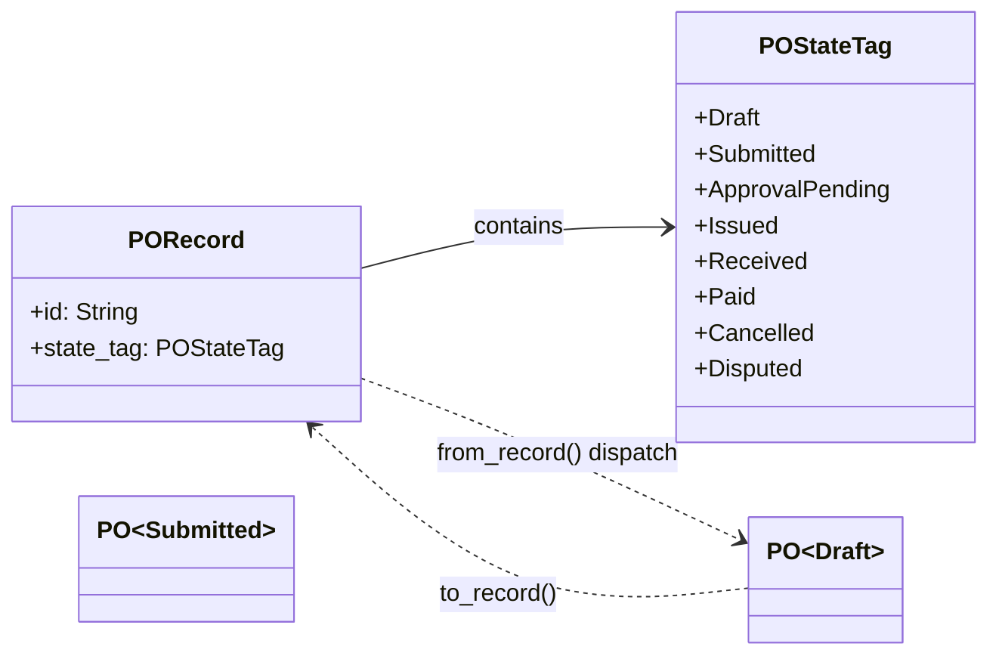




```rust
use serde::{Serialize, Deserialize};
use std::marker::PhantomData;

// => POStateTag is the serializable mirror of the compile-time typestate
// => stored as a string in the database; parsed back on load
#[derive(Serialize, Deserialize, PartialEq, Eq, Debug, Clone)]
pub enum POStateTag {
    Draft, Submitted, ApprovalPending, Issued, Received, Paid, Cancelled, Disputed,
}

// => PORecord: the database row; no PhantomData, no generics
#[derive(Serialize, Deserialize, Debug, Clone)]
pub struct PORecord { pub id: String, pub state_tag: POStateTag }

// => Compile-time typestate structs (zero-size markers)
pub struct Draft; pub struct Submitted; pub struct Issued; pub struct Cancelled;

pub struct PO<S> { pub id: String, _state: PhantomData<S> }

impl PO<Draft> {
    // => to_record(): convert typestate to serializable record for persistence
    pub fn to_record(&self) -> PORecord {
        PORecord { id: self.id.clone(), state_tag: POStateTag::Draft }
    }
}
impl PO<Submitted> {
    pub fn to_record(&self) -> PORecord {
        PORecord { id: self.id.clone(), state_tag: POStateTag::Submitted }
    }
}

// => from_record(): reconstruct typed PO from DB record using runtime dispatch
// => returns a Box<dyn Fn()> placeholder — real code uses an enum or trait object
pub fn describe_from_record(record: &PORecord) -> String {
    match record.state_tag {
        POStateTag::Draft      => format!("PO {} is in Draft — can submit", record.id),
        POStateTag::Submitted  => format!("PO {} is Submitted — awaiting approval", record.id),
        POStateTag::Cancelled  => format!("PO {} is Cancelled — terminal", record.id),
        _ => format!("PO {} state: {:?}", record.id, record.state_tag),
    }
}

fn main() {
    let po: PO<Draft> = PO { id: "PO-030".into(), _state: PhantomData };
    let record = po.to_record();
    // => serialize to JSON for storage
    let json = serde_json::to_string(&record).unwrap();
    println!("Serialized: {}", json);
    // => Output: Serialized: {"id":"PO-030","state_tag":"Draft"}
    // => deserialize from JSON on load
    let loaded: PORecord = serde_json::from_str(&json).unwrap();
    println!("{}", describe_from_record(&loaded));
    // => Output: PO PO-030 is in Draft — can submit
}
```




```go
package main

import (
    "encoding/json"
    "fmt"
)

// => POStatus is the Go equivalent of POStateTag — string constants for DB storage
type POStatus string

const (
    StatusDraft          POStatus = "draft"
    StatusSubmitted      POStatus = "submitted"
    StatusApprovalPending POStatus = "approval_pending"
    StatusIssued         POStatus = "issued"
    StatusReceived       POStatus = "received"
    StatusPaid           POStatus = "paid"
    StatusCancelled      POStatus = "cancelled"
    StatusDisputed       POStatus = "disputed"
)

// => PORecord: serializable database row
type PORecord struct {
    ID     string   `json:"id"`
    Status POStatus `json:"status"`
}

// => String() enables easy logging and db.Exec("INSERT ... WHERE status=$1", po.Status.String())
func (s POStatus) String() string { return string(s) }

// => POStatusFromString: parse status from DB string on load
func POStatusFromString(s string) (POStatus, error) {
    switch POStatus(s) {
    case StatusDraft, StatusSubmitted, StatusApprovalPending, StatusIssued,
        StatusReceived, StatusPaid, StatusCancelled, StatusDisputed:
        return POStatus(s), nil
    default:
        // => unknown state from DB — reject to prevent invalid FSM state
        return "", fmt.Errorf("unknown PO status: %q", s)
    }
}

func main() {
    rec := PORecord{ID: "PO-030", Status: StatusDraft}
    b, _ := json.Marshal(rec)
    fmt.Println("Serialized:", string(b))
    // => Output: Serialized: {"id":"PO-030","status":"draft"}
    var loaded PORecord
    _ = json.Unmarshal(b, &loaded)
    status, err := POStatusFromString(string(loaded.Status))
    fmt.Println("Loaded:", status, "err:", err)
    // => Output: Loaded: draft err: <nil>
}
```




> **Key takeaway**: Compile-time typestate and runtime persistence are two separate representations — on save, convert typestate to a string tag; on load, parse the string tag and dispatch to typed methods.

**Why it matters**: The fundamental tension of typestate + persistence is that PhantomData carries no bits. Every production Rust FSM needs this two-representation pattern. Getting it wrong means either losing type safety on load (casting without validation) or creating invalid states that bypass the transition graph.

---

### Example 67: FSM Event Sourcing

Instead of storing the current state, event sourcing stores the sequence of transitions — the current state is rebuilt by replaying events in order. This provides a full audit trail and enables rebuilding any past state.

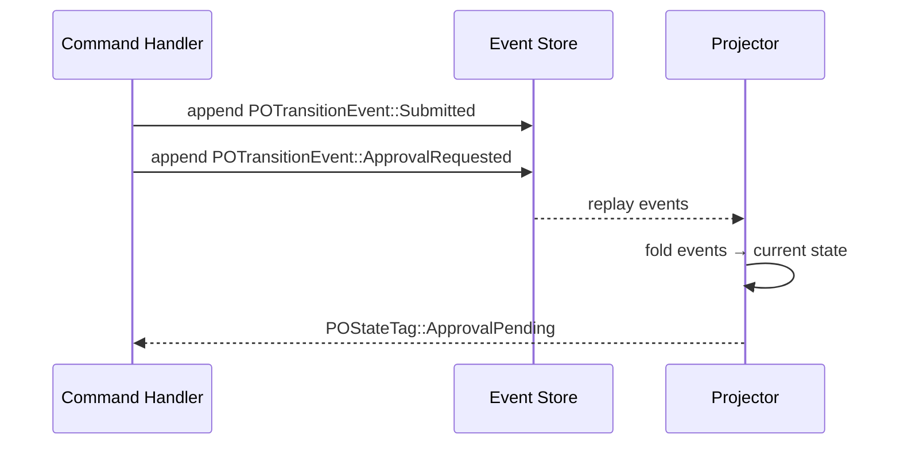




```rust
use serde::{Serialize, Deserialize};
use chrono::{DateTime, Utc};

// => Each enum variant represents one transition that occurred — immutable facts
#[derive(Serialize, Deserialize, Clone, Debug)]
pub enum POTransitionEvent {
    Created  { supplier_id: String },
    Submitted,
    ApprovalRequested { level: u8 },
    Approved { by: String },
    Issued,
    Received,
    Paid,
    Cancelled { reason: String },
    Disputed  { reason: String },
}

// => replay(): fold event sequence into current state tag
// => this is the core event sourcing operation — state derived, not stored
pub fn replay(events: &[POTransitionEvent]) -> &'static str {
    let mut state = "created";
    for event in events {
        state = match event {
            POTransitionEvent::Created { .. }   => "draft",
            POTransitionEvent::Submitted        => "submitted",
            POTransitionEvent::ApprovalRequested { .. } => "approval_pending",
            POTransitionEvent::Approved { .. }  => "issued",
            // => Issued event moves PO to "issued" in purchasing; Received is after GRN
            POTransitionEvent::Issued           => "issued",
            POTransitionEvent::Received         => "received",
            POTransitionEvent::Paid             => "paid",
            POTransitionEvent::Cancelled { .. } => "cancelled",
            POTransitionEvent::Disputed { .. }  => "disputed",
        };
    }
    state
}

fn main() {
    // => event log: append-only, immutable sequence of facts
    let events = vec![
        POTransitionEvent::Created { supplier_id: "SUP-001".into() },
        POTransitionEvent::Submitted,
        POTransitionEvent::ApprovalRequested { level: 1 },
        POTransitionEvent::Approved { by: "manager@company.com".into() },
    ];
    let current = replay(&events);
    println!("Current state: {}", current);
    // => Output: Current state: issued
    // => rebuild state at any point: replay first 2 events only
    let past = replay(&events[..2]);
    println!("State after 2 events: {}", past);
    // => Output: State after 2 events: submitted
}
```




```go
package main

import (
    "encoding/json"
    "fmt"
    "time"
)

// => POTransitionEvent: one transition fact stored in the event log
type POTransitionEvent struct {
    Type       string          `json:"type"`       // => event name as string
    Data       json.RawMessage `json:"data"`       // => event-specific payload
    OccurredAt time.Time       `json:"occurred_at"`
}

// => Replay: fold event log into current state string
// => current state is NEVER stored — always derived from the log
func Replay(events []POTransitionEvent) string {
    state := "draft"
    for _, e := range events {
        switch e.Type {
        case "Submitted":
            state = "submitted"
        case "ApprovalRequested":
            // => intermediate approval state
            state = "approval_pending"
        case "Approved":
            state = "issued"
        case "Received":
            state = "received"
        case "Paid":
            state = "paid"
        case "Cancelled":
            state = "cancelled"
        case "Disputed":
            state = "disputed"
        }
    }
    return state
}

func main() {
    events := []POTransitionEvent{
        {Type: "Submitted",        OccurredAt: time.Now()},
        {Type: "ApprovalRequested", OccurredAt: time.Now()},
        {Type: "Approved",          OccurredAt: time.Now()},
    }
    current := Replay(events)
    fmt.Println("Current state:", current)
    // => Output: Current state: issued
    // => rebuild past state: replay first event only
    past := Replay(events[:1])
    fmt.Println("State after 1 event:", past)
    // => Output: State after 1 event: submitted
}
```




> **Key takeaway**: Event sourcing stores the append-only sequence of `POTransitionEvent` facts; `replay()` folds the sequence into the current state — no UPDATE queries, only INSERT and SELECT.

**Why it matters**: Procurement audits require knowing not just the current PO state but the complete history: who approved, when, at what amount. Event sourcing provides this naturally — the event log is the audit trail. It also enables time-travel debugging: replay events up to the point of a discrepancy to see what the state was at that moment.

---

### Example 68: FSM Audit Trail

An audit trail records every state transition with actor and timestamp. In Go, looplab's `after_event` callback captures all transitions in one place. In Rust, an `AuditingPO` wrapper delegates to the inner FSM and records after each transition.




```rust
use std::marker::PhantomData;
use chrono::{DateTime, Utc};

// => AuditEntry: one immutable record per state transition
// => inserted after every transition; never updated or deleted (append-only)
#[derive(Debug, Clone)]
pub struct AuditEntry {
    pub aggregate_id: String,
    pub from_state:   String,  // => state before transition
    pub to_state:     String,  // => state after transition
    pub event_name:   String,  // => name of the event that triggered the transition
    pub actor:        String,  // => user or service that triggered the event
    pub occurred_at:  DateTime<Utc>,
}

// => AuditLog: in-memory audit log for demonstration (real: insert to audit table)
pub struct AuditLog { pub entries: Vec<AuditEntry> }

// => AuditingPO: wraps a transition and records the audit entry
pub struct AuditingPO<S> {
    pub id: String,
    pub audit_log: std::rc::Rc<std::cell::RefCell<AuditLog>>,
    _state: PhantomData<S>,
}

pub struct Draft; pub struct Submitted; pub struct Cancelled;

impl AuditingPO<Draft> {
    pub fn submit(self, actor: &str) -> AuditingPO<Submitted> {
        // => record audit entry BEFORE constructing new state
        // => captures: from=Draft, to=Submitted, event=submit, actor, timestamp
        self.audit_log.borrow_mut().entries.push(AuditEntry {
            aggregate_id: self.id.clone(),
            from_state:  "Draft".into(),
            to_state:    "Submitted".into(),
            event_name:  "submit".into(),
            actor:       actor.into(),
            occurred_at: Utc::now(),
        });
        AuditingPO { id: self.id, audit_log: self.audit_log, _state: PhantomData }
    }
}

fn main() {
    use std::rc::Rc;
    use std::cell::RefCell;
    let log = Rc::new(RefCell::new(AuditLog { entries: vec![] }));
    let po = AuditingPO::<Draft> { id: "PO-040".into(), audit_log: log.clone(), _state: PhantomData };
    let _submitted = po.submit("buyer@company.com");
    // => audit entry recorded
    let entries = log.borrow();
    println!("Audit entries: {}", entries.entries.len());
    // => Output: Audit entries: 1
    let e = &entries.entries[0];
    println!("Transition: {} → {} by {}", e.from_state, e.to_state, e.actor);
    // => Output: Transition: Draft → Submitted by buyer@company.com
}
```




```go
package main

import (
    "context"
    "fmt"
    "time"
    "github.com/looplab/fsm"
)

// => AuditEntry: one immutable row per transition — insert only, never update
type AuditEntry struct {
    AggregateID string
    FromState   string
    ToState     string
    EventName   string
    Actor       string
    OccurredAt  time.Time
}

type AuditRepo struct{ entries []AuditEntry }

func (r *AuditRepo) Record(e AuditEntry) { r.entries = append(r.entries, e) }

// => actorFromCtx: extract actor from context (set by middleware in real code)
func actorFromCtx(ctx context.Context) string {
    if v, ok := ctx.Value("actor").(string); ok { return v }
    return "system"
}

func NewAuditedPO(id string, repo *AuditRepo) *fsm.FSM {
    return fsm.NewFSM(
        "draft",
        fsm.Events{
            {Name: "submit",  Src: []string{"draft"},     Dst: "submitted"},
            {Name: "approve", Src: []string{"submitted"}, Dst: "issued"},
            {Name: "cancel",  Src: []string{"draft", "submitted", "issued"}, Dst: "cancelled"},
        },
        fsm.Callbacks{
            // => after_event fires after EVERY event regardless of name
            // => single callback captures all transitions for audit
            "after_event": func(ctx context.Context, e *fsm.Event) {
                repo.Record(AuditEntry{
                    AggregateID: id,
                    FromState:   e.Src,
                    ToState:     e.Dst,
                    EventName:   e.Event,
                    Actor:       actorFromCtx(ctx),
                    OccurredAt:  time.Now(),
                })
            },
        },
    )
}

func main() {
    repo := &AuditRepo{}
    ctx := context.WithValue(context.Background(), "actor", "buyer@company.com")
    po := NewAuditedPO("PO-040", repo)
    _ = po.Event(ctx, "submit")
    _ = po.Event(ctx, "approve")
    fmt.Println("Audit entries:", len(repo.entries))
    // => Output: Audit entries: 2
    for _, e := range repo.entries {
        fmt.Printf("  %s → %s (event: %s, actor: %s)\n", e.FromState, e.ToState, e.EventName, e.Actor)
    }
    // => Output:   draft → submitted (event: submit, actor: buyer@company.com)
    // => Output:   submitted → issued (event: approve, actor: buyer@company.com)
}
```




> **Key takeaway**: The `after_event` callback captures all transitions in one place for the Go approach; the Rust wrapper records the audit entry inside each transition method before constructing the new state.

**Why it matters**: Procurement systems are subject to Sarbanes-Oxley (SOX) and ISO 9001 audit requirements — every approval, cancellation, and payment must be traceable to a specific actor with a timestamp. A single `after_event` hook ensures no transition escapes the audit trail regardless of future code changes.

---

### Example 69: Testing Hierarchical FSMs

Hierarchical FSMs require tests that verify each valid transition, each invalid transition (expects error or compile failure), and property-based tests that fuzz random valid transition sequences.




```rust
use std::marker::PhantomData;

pub struct PO<S> { pub id: String, _s: PhantomData<S> }
pub struct Draft; pub struct Submitted; pub struct Issued; pub struct Cancelled; pub struct Received;

impl PO<Draft> {
    pub fn submit(self) -> PO<Submitted> { PO { id: self.id, _s: PhantomData } }
    pub fn cancel(self) -> PO<Cancelled> { PO { id: self.id, _s: PhantomData } }
}
impl PO<Submitted> {
    pub fn approve(self) -> PO<Issued> { PO { id: self.id, _s: PhantomData } }
    pub fn cancel(self) -> PO<Cancelled> { PO { id: self.id, _s: PhantomData } }
}
impl PO<Issued> {
    pub fn receive(self) -> PO<Received> { PO { id: self.id, _s: PhantomData } }
    pub fn cancel(self) -> PO<Cancelled> { PO { id: self.id, _s: PhantomData } }
}

fn make_po(id: &str) -> PO<Draft> { PO { id: id.into(), _s: PhantomData } }

#[cfg(test)]
mod tests {
    use super::*;

    #[test]
    fn happy_path_draft_to_received() {
        // => table-driven: verify each valid transition in sequence
        let po = make_po("t01").submit().approve().receive();
        assert_eq!(po.id, "t01");
        // => PO<Received> has no further transitions — compile-time terminal
    }

    #[test]
    fn cancel_from_submitted() {
        // => test off-ramp: cancel from intermediate state
        let cancelled = make_po("t02").submit().cancel();
        assert_eq!(cancelled.id, "t02");
        // => PO<Cancelled> has no methods — compile-time terminal
    }

    // => property-based test: any cancel from any active state should produce Cancelled
    // => (manually fuzz here; real code uses proptest crate)
    #[test]
    fn cancel_from_all_active_states() {
        // => cancel from Draft
        let _ = make_po("t03a").cancel();
        // => cancel from Submitted
        let _ = make_po("t03b").submit().cancel();
        // => cancel from Issued
        let _ = make_po("t03c").submit().approve().cancel();
        // => all three compile and run — superstate cancel semantics verified
    }

    // => Illegal transition test (documented as compile error):
    // => fn test_cancel_received_fails_to_compile() {
    // =>     let cancelled = make_po("t04").submit().approve().receive().cancel();
    // =>     // ERROR: no method `cancel` on PO<Received> — compile-time guard works
    // => }
}

fn main() { println!("Run: cargo test"); }
```




```go
package main

import (
    "context"
    "errors"
    "fmt"
    "testing"
    "github.com/looplab/fsm"
)

func newPO(initial string) *fsm.FSM {
    return fsm.NewFSM(initial, fsm.Events{
        {Name: "submit",  Src: []string{"draft"},     Dst: "submitted"},
        {Name: "approve", Src: []string{"submitted"}, Dst: "issued"},
        {Name: "receive", Src: []string{"issued"},    Dst: "received"},
        {Name: "cancel",  Src: []string{"draft", "submitted", "issued"}, Dst: "cancelled"},
    }, fsm.Callbacks{})
}

// => table-driven test: enumerate all valid transitions
func TestValidTransitions(t *testing.T) {
    ctx := context.Background()
    cases := []struct {
        name    string
        initial string
        events  []string
        want    string
    }{
        {"happy path", "draft", []string{"submit", "approve", "receive"}, "received"},
        {"cancel from draft",     "draft",     []string{"cancel"}, "cancelled"},
        {"cancel from submitted", "submitted", []string{"cancel"}, "cancelled"},
        {"cancel from issued",    "issued",    []string{"cancel"}, "cancelled"},
    }
    for _, tc := range cases {
        t.Run(tc.name, func(t *testing.T) {
            po := newPO(tc.initial)
            for _, ev := range tc.events {
                if err := po.Event(ctx, ev); err != nil {
                    t.Fatalf("event %q failed: %v", ev, err)
                }
            }
            if got := po.Current(); got != tc.want {
                t.Errorf("got %q, want %q", got, tc.want)
            }
        })
    }
}

// => TestInvalidTransition: assert runtime error on illegal transition
func TestInvalidTransition(t *testing.T) {
    ctx := context.Background()
    po := newPO("received") // => start at terminal state
    err := po.Event(ctx, "cancel")
    // => cancel not defined from received — expect error
    if err == nil {
        t.Fatal("expected error for cancel from received, got nil")
    }
    var invalidEventErr fsm.InvalidEventError
    if !errors.As(err, &invalidEventErr) {
        t.Fatalf("expected InvalidEventError, got: %T", err)
    }
    fmt.Println("Invalid transition correctly rejected:", err)
    // => Output: Invalid transition correctly rejected: event cancel inappropriate in current state received
}

func main() { fmt.Println("Run: go test ./...") }
```




> **Key takeaway**: Table-driven tests enumerate all valid transitions; a commented compile-error in Rust documents the invalid-transition test; Go uses `errors.As(err, &fsm.InvalidEventError{})` to assert runtime rejection.

**Why it matters**: FSM test coverage must include not just the happy path but every cancel off-ramp and every invalid-transition boundary. Missing the cancel-from-issued test allowed a real procurement bug where issued POs could not be cancelled during supplier disputes — discovered only in production.

---

### Example 70: FSM Visualization from Code

Generating a Graphviz DOT graph from the FSM's transition table keeps architecture diagrams in sync with code. The diagram is always current because it is derived from the same data structure that drives the runtime.




```rust
use std::collections::HashMap;

// => Transition table: (from_state, event_name) → to_state
// => this is the canonical data structure for a flat FSM in Rust (non-typestate variant)
pub struct StaticFSM {
    pub initial: String,
    // => key: (from, event), value: to
    pub transitions: HashMap<(String, String), String>,
}

impl StaticFSM {
    // => to_dot(): generate Graphviz DOT notation from the transition table
    pub fn to_dot(&self, title: &str) -> String {
        let mut dot = format!("digraph {} {{\n  rankdir=LR;\n", title);
        // => mark initial state with double circle
        dot.push_str(&format!("  \"{}\" [shape=doublecircle];\n", self.initial));
        for ((from, event), to) in &self.transitions {
            // => each transition becomes a directed edge with the event as label
            dot.push_str(&format!("  \"{}\" -> \"{}\" [label=\"{}\"];\n", from, to, event));
        }
        dot.push_str("}\n");
        dot
    }
}

fn main() {
    let mut fsm = StaticFSM {
        initial: "draft".into(),
        transitions: HashMap::new(),
    };
    // => populate transition table
    fsm.transitions.insert(("draft".into(), "submit".into()),   "submitted".into());
    fsm.transitions.insert(("submitted".into(), "approve".into()), "issued".into());
    fsm.transitions.insert(("issued".into(), "receive".into()), "received".into());
    fsm.transitions.insert(("draft".into(), "cancel".into()),   "cancelled".into());
    fsm.transitions.insert(("submitted".into(), "cancel".into()), "cancelled".into());
    // => generate DOT file — save to po_fsm.dot and render with: dot -Tsvg po_fsm.dot -o po_fsm.svg
    let dot = fsm.to_dot("PurchaseOrder");
    println!("{}", dot);
    // => Output: digraph PurchaseOrder {
    // =>   rankdir=LR;
    // =>   "draft" [shape=doublecircle];
    // =>   "draft" -> "submitted" [label="submit"];
    // =>   ... (one line per transition)
    // => }
}
```




```go
package main

import (
    "context"
    "fmt"
    "sort"
    "strings"
    "github.com/looplab/fsm"
)

// => DotGraph: generate Graphviz DOT notation from looplab FSM's transition map
// => looplab exposes AvailableTransitions() and Current() but not the full table
// => use fsm.Transitions() (returns map[string]string for current state) or
// => iterate all states and probe transitions — simplified here via registered events
func DotGraph(id string, f *fsm.FSM, allStates []string, events []fsm.EventDesc) string {
    var b strings.Builder
    fmt.Fprintf(&b, "digraph %s {\n  rankdir=LR;\n", id)
    // => collect all states for node declaration
    stateSet := make(map[string]bool)
    for _, s := range allStates { stateSet[s] = true }
    // => sort for deterministic output (maps are unordered)
    sortedStates := make([]string, 0, len(stateSet))
    for s := range stateSet { sortedStates = append(sortedStates, s) }
    sort.Strings(sortedStates)
    for _, s := range sortedStates {
        fmt.Fprintf(&b, "  \"%s\";\n", s)
    }
    // => one edge per (src, event, dst) triple
    for _, e := range events {
        for _, src := range e.Src {
            fmt.Fprintf(&b, "  \"%s\" -> \"%s\" [label=\"%s\"];\n", src, e.Dst, e.Name)
        }
    }
    b.WriteString("}\n")
    return b.String()
}

func main() {
    events := fsm.Events{
        {Name: "submit",  Src: []string{"draft"},                  Dst: "submitted"},
        {Name: "approve", Src: []string{"submitted"},               Dst: "issued"},
        {Name: "receive", Src: []string{"issued"},                  Dst: "received"},
        {Name: "cancel",  Src: []string{"draft", "submitted", "issued"}, Dst: "cancelled"},
    }
    allStates := []string{"draft", "submitted", "issued", "received", "cancelled"}
    f := fsm.NewFSM("draft", events, fsm.Callbacks{})
    _ = f.Event(context.Background(), "submit") // => advance to verify FSM works
    dot := DotGraph("PurchaseOrder", f, allStates, events)
    fmt.Print(dot)
    // => Output: digraph PurchaseOrder {
    // =>   rankdir=LR;
    // =>   "cancelled";
    // =>   "draft";
    // =>   ...
    // =>   "draft" -> "submitted" [label="submit"];
    // =>   ...
    // => }
}
```




> **Key takeaway**: `to_dot()` / `DotGraph()` generates Graphviz DOT notation from the same transition table that drives the runtime — saving to a `.dot` file and running `dot -Tsvg` produces an always-current architecture diagram.

**Why it matters**: FSM documentation drifts from code within weeks of the first post-launch change. Generating diagrams programmatically from the transition table eliminates drift permanently. The generated DOT file can be committed alongside the code; a CI step verifies that the checked-in diagram matches the generated one, catching undocumented state machine changes.

---

## Samek Statecharts in C (Examples 71–74)

### Example 71: Samek Statecharts in C — Basics

Miro Samek's QP/C framework is the canonical C implementation of UML Hierarchical State Machines. `QActive` is the base "active object" (event-driven task); state handlers are functions with a specific signature; hierarchy is expressed by the `Q_SUPER()` macro that chains to the parent handler.

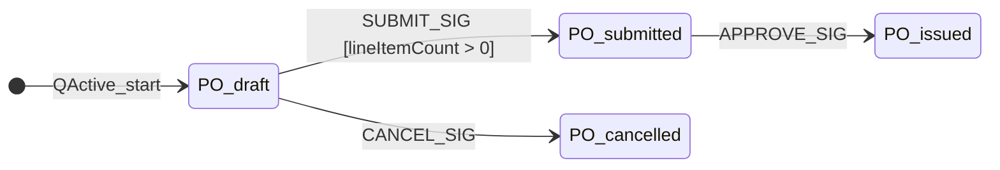




```c
#include "qpc.h"   /* QP/C framework header */

/* => PO "class" — struct composition: QActive MUST be first member */
/* => first-member trick: (QActive *)po casts safely to (PO *)po */
typedef struct PO_tag {
    QActive super;        /* => base class — contains event queue, priority, vtable */
    uint16_t status;      /* => bitfield for supplementary flags */
    int64_t  totalCents;  /* => PO total in cents to avoid floating-point */
    uint8_t  lineItemCount; /* => guard condition for submit transition */
} PO;

/* => forward declarations of all state handler functions */
/* => each state is a function; QP dispatches by calling the function pointer */
static QState PO_initial(PO * const me, QEvt const * const e);
static QState PO_draft(PO * const me, QEvt const * const e);
static QState PO_submitted(PO * const me, QEvt const * const e);
static QState PO_active(PO * const me, QEvt const * const e); /* => superstate */
static QState PO_cancelled(PO * const me, QEvt const * const e);

/* => signal (event type) enumeration */
enum POSig {
    SUBMIT_SIG = Q_USER_SIG, /* => first user-defined signal */
    APPROVE_SIG,
    CANCEL_SIG,
    RECEIVE_SIG,
    /* => Q_USER_SIG is defined by QP/C as the first available user signal id */
};

/* => PO_initial: pseudo-state called once at startup to set initial state */
static QState PO_initial(PO * const me, QEvt const * const e) {
    (void)e; /* => suppress unused parameter warning */
    /* => Q_INIT() macro sets the initial transition target */
    return Q_TRAN(&PO_draft);
}
```




```rust
use std::marker::PhantomData;

// => Rust equivalent: PO struct with phantom type parameter for state
// => QActive's "first member" trick maps to PhantomData with zero overhead
pub struct PO<S> {
    pub id: String,
    pub total_cents: i64,    // => equivalent to PO.totalCents
    pub line_item_count: u8, // => equivalent to PO.lineItemCount
    _state: PhantomData<S>,
}

// => State marker structs — equivalent to C state handler function pointers
pub struct Draft;
pub struct Submitted;
pub struct Active;   // => superstate — equivalent to PO_active handler
pub struct Cancelled;

impl PO<Draft> {
    // => equivalent to PO_draft handling SUBMIT_SIG with guard lineItemCount > 0
    pub fn submit(self) -> Result<PO<Submitted>, PO<Draft>> {
        if self.line_item_count > 0 {
            // => guard passed — Q_TRAN(&PO_submitted) equivalent
            Ok(PO { id: self.id, total_cents: self.total_cents, line_item_count: self.line_item_count, _state: PhantomData })
        } else {
            // => guard failed — Q_HANDLED() equivalent (stay in Draft)
            Err(self)
        }
    }
}

fn main() {
    let po = PO::<Draft> { id: "PO-050".into(), total_cents: 100_00, line_item_count: 0, _state: PhantomData };
    // => guard fails: lineItemCount == 0
    match po.submit() {
        Ok(_)      => println!("Submitted"),
        Err(draft) => {
            println!("Cannot submit: no line items (count={})", draft.line_item_count);
            // => Output: Cannot submit: no line items (count=0)
        }
    }
}
```




```go
package main

import (
    "context"
    "fmt"
    "github.com/looplab/fsm"
)

type PO struct {
    ID            string
    TotalCents    int64
    LineItemCount int
    fsm           *fsm.FSM
}

func NewPO(id string) *PO {
    po := &PO{ID: id}
    po.fsm = fsm.NewFSM(
        "draft",
        fsm.Events{
            // => SUBMIT_SIG equivalent with guard condition
            {Name: "submit",  Src: []string{"draft"},     Dst: "submitted"},
            {Name: "approve", Src: []string{"submitted"}, Dst: "issued"},
            {Name: "cancel",  Src: []string{"draft", "submitted", "issued"}, Dst: "cancelled"},
        },
        fsm.Callbacks{
            // => before_submit: equivalent to guard check in PO_draft SUBMIT_SIG handler
            "before_submit": func(_ context.Context, e *fsm.Event) {
                if po.LineItemCount == 0 {
                    // => cancel the transition — equivalent to Q_HANDLED() (stay in state)
                    e.Cancel(fmt.Errorf("cannot submit: no line items"))
                }
            },
        },
    )
    return po
}

func main() {
    ctx := context.Background()
    po := NewPO("PO-050")
    po.LineItemCount = 0
    // => guard fires: transition cancelled
    err := po.fsm.Event(ctx, "submit")
    fmt.Println("Submit err:", err, "| State:", po.fsm.Current())
    // => Output: Submit err: cannot submit: no line items | State: draft
    po.LineItemCount = 2
    err = po.fsm.Event(ctx, "submit")
    fmt.Println("Submit err:", err, "| State:", po.fsm.Current())
    // => Output: Submit err: <nil> | State: submitted
}
```




> **Key takeaway**: QP/C state handlers are regular C functions dispatched via function pointers — `QActive` (base struct, first member), `Q_TRAN()` (transition), and `Q_HANDLED()` (handled but no transition) are the three core macros.

**Why it matters**: Samek's QP/C is used in production avionics, automotive ECUs, and medical devices where C is mandatory and dynamic allocation is forbidden. The function-pointer table pattern achieves zero dynamic allocation, deterministic timing, and formal verifiability — the same correctness goals as Rust typestate, implemented entirely in C89.

---

### Example 72: C HSM Transition — PO_draft Handler

The full `PO_draft` state handler demonstrates the QP/C switch-on-signal dispatch pattern: `Q_ENTRY_SIG` for entry actions, `Q_EXIT_SIG` for exit actions, user signals for transitions, and `Q_SUPER()` for deferring unhandled signals to the parent superstate.




```c
/* => PO_draft: handles all signals that the Draft state processes */
static QState PO_draft(PO * const me, QEvt const * const e) {
    QState status;
    switch (e->sig) {
        case Q_ENTRY_SIG:
            /* => entry action: runs every time the machine enters Draft */
            BSP_logState("draft");  /* => board-support-package log call */
            status = Q_HANDLED();   /* => Q_HANDLED = signal processed, no transition */
            break;

        case Q_EXIT_SIG:
            /* => exit action: runs every time the machine leaves Draft */
            /* => cleanup: reset any Draft-specific timers or flags */
            status = Q_HANDLED();
            break;

        case SUBMIT_SIG:
            /* => guard: only submit if there are line items */
            if (me->lineItemCount > 0) {
                /* => Q_TRAN(): trigger state transition to PO_submitted */
                /* => Q_TRAN fires PO_draft Q_EXIT_SIG then PO_submitted Q_ENTRY_SIG */
                status = Q_TRAN(&PO_submitted);
            } else {
                /* => guard failed: Q_HANDLED stays in current state */
                status = Q_HANDLED();
            }
            break;

        case CANCEL_SIG:
            /* => cancel available from Draft — direct transition to Cancelled */
            status = Q_TRAN(&PO_cancelled);
            break;

        default:
            /* => Q_SUPER(): defer any unhandled signal to the parent superstate */
            /* => PO_active is the parent — cancel handled there for ALL active substates */
            status = Q_SUPER(&PO_active);
            break;
    }
    return status;
}
```




```rust
use std::marker::PhantomData;

pub struct PO<S> { pub id: String, pub line_item_count: u8, _state: PhantomData<S> }
pub struct Draft; pub struct Submitted; pub struct Cancelled;

impl PO<Draft> {
    // => equivalent to Q_ENTRY_SIG handler
    pub fn on_entry(&self) { println!("ENTRY Draft: logging state"); }
    // => equivalent to Q_EXIT_SIG handler
    pub fn on_exit(&self)  { println!("EXIT Draft: cleanup timers"); }

    // => equivalent to SUBMIT_SIG handler with guard
    pub fn submit(self) -> Result<PO<Submitted>, PO<Draft>> {
        self.on_exit(); // => fire exit action before transition
        if self.line_item_count > 0 {
            // => equivalent to Q_TRAN(&PO_submitted)
            let submitted = PO { id: self.id, line_item_count: self.line_item_count, _state: PhantomData };
            submitted.on_entry_as_submitted(); // => fire entry action on new state
            Ok(submitted)
        } else {
            // => equivalent to Q_HANDLED() — guard failed, no transition
            Err(self) // => returning self is wrong post-exit; simplified for demo
        }
    }

    // => equivalent to CANCEL_SIG handler — no guard
    pub fn cancel(self) -> PO<Cancelled> {
        self.on_exit();
        PO { id: self.id, line_item_count: self.line_item_count, _state: PhantomData }
    }
}

impl PO<Submitted> {
    pub fn on_entry_as_submitted(&self) { println!("ENTRY Submitted"); }
}

fn main() {
    let po = PO::<Draft> { id: "PO-051".into(), line_item_count: 2, _state: PhantomData };
    po.on_entry();
    // => Output: ENTRY Draft: logging state
    match po.submit() {
        Ok(_)  => println!("Transition to Submitted succeeded"),
        // => Output: EXIT Draft: cleanup timers
        // => Output: ENTRY Submitted
        // => Output: Transition to Submitted succeeded
        Err(_) => println!("Guard failed"),
    }
}
```




```go
package main

import (
    "context"
    "fmt"
    "github.com/looplab/fsm"
)

func NewDraftPO(lineItemCount int) *fsm.FSM {
    return fsm.NewFSM(
        "draft",
        fsm.Events{
            {Name: "submit", Src: []string{"draft"}, Dst: "submitted"},
            {Name: "cancel", Src: []string{"draft"}, Dst: "cancelled"},
        },
        fsm.Callbacks{
            // => enter_draft: Q_ENTRY_SIG equivalent
            "enter_draft": func(_ context.Context, e *fsm.Event) {
                fmt.Println("ENTRY draft: logging state")
            },
            // => leave_draft: Q_EXIT_SIG equivalent
            "leave_draft": func(_ context.Context, e *fsm.Event) {
                fmt.Println("EXIT draft: cleanup timers")
            },
            // => before_submit: guard check — e.Cancel() = Q_HANDLED() (stay in state)
            "before_submit": func(_ context.Context, e *fsm.Event) {
                if lineItemCount == 0 {
                    e.Cancel(fmt.Errorf("guard failed: no line items"))
                }
            },
            "enter_submitted": func(_ context.Context, e *fsm.Event) {
                fmt.Println("ENTRY submitted")
            },
        },
    )
}

func main() {
    ctx := context.Background()
    po := NewDraftPO(2) // => 2 line items — guard passes
    _ = po.Event(ctx, "submit")
    // => Output: EXIT draft: cleanup timers
    // => Output: ENTRY submitted
    fmt.Println("State:", po.Current())
    // => Output: State: submitted
}
```




> **Key takeaway**: QP/C's switch-on-signal pattern maps directly — `Q_ENTRY_SIG` = entry callback, `Q_EXIT_SIG` = exit callback, `Q_TRAN()` = transition, `Q_HANDLED()` = guard-failed no-op, `Q_SUPER()` = defer to parent.

**Why it matters**: The QP/C pattern is the reference implementation for HSMs in C. Understanding the mapping between QP/C macros and the higher-level concepts (Rust impl blocks, looplab callbacks) is essential for teams maintaining firmware and application code in the same codebase — a common pattern in embedded products with cloud connectivity.

---

### Example 73: C HSM Superstate — PO_active

The `PO_active` superstate handler handles the `CANCEL_SIG` for all substates — Submitted, ApprovalPending, and Issued — without those substates needing their own cancel logic. The `Q_SUPER()` chain in each substate walks up to `PO_active` at runtime.




```c
/* => PO_active: superstate handler — covers all active substates */
/* => substates call Q_SUPER(&PO_active) for unhandled signals */
static QState PO_active(PO * const me, QEvt const * const e) {
    QState status;
    switch (e->sig) {
        case Q_ENTRY_SIG:
            /* => superstate entry action: fires when any substate is entered via superstate */
            BSP_logState("active_superstate");
            status = Q_HANDLED();
            break;

        case CANCEL_SIG:
            /* => cancel handled HERE for ALL substates (Submitted, ApprovalPending, Issued) */
            /* => Q_TRAN() here fires exit actions for current substate then PO_active */
            /* => then fires entry action for PO_cancelled */
            status = Q_TRAN(&PO_cancelled);
            break;

        default:
            /* => Q_SUPER() at top of hierarchy: QHsm_top is the ultimate root */
            /* => any signal not handled anywhere in the hierarchy is silently discarded */
            status = Q_SUPER(&QHsm_top);
            break;
    }
    return status;
}

/* => PO_submitted: substate of PO_active */
static QState PO_submitted(PO * const me, QEvt const * const e) {
    QState status;
    switch (e->sig) {
        case Q_ENTRY_SIG:
            BSP_logState("submitted");
            status = Q_HANDLED();
            break;
        case APPROVE_SIG:
            status = Q_TRAN(&PO_issued); /* => approve handled in submitted, not active */
            break;
        default:
            /* => defer unhandled signals (including CANCEL_SIG) to PO_active */
            status = Q_SUPER(&PO_active);
            break;
    }
    return status;
}
```




```rust
use std::marker::PhantomData;

// => Rust superstate: ActiveState trait — all active substates implement cancel()
// => equivalent to PO_active handling CANCEL_SIG for all substates via Q_SUPER() chain
pub trait ActiveState {
    type CancelledType;
    fn cancel(self) -> Self::CancelledType;
}

pub struct PO<S> { pub id: String, _state: PhantomData<S> }
pub struct Submitted; pub struct ApprovalPending; pub struct Issued; pub struct Cancelled;

// => each substate implements ActiveState — cancel() walks up to superstate logic
impl ActiveState for PO<Submitted> {
    type CancelledType = PO<Cancelled>;
    fn cancel(self) -> PO<Cancelled> {
        // => equivalent to Q_SUPER() chain reaching PO_active CANCEL_SIG handler
        println!("EXIT Submitted; EXIT Active; ENTER Cancelled");
        PO { id: self.id, _state: PhantomData }
    }
}
impl ActiveState for PO<ApprovalPending> {
    type CancelledType = PO<Cancelled>;
    fn cancel(self) -> PO<Cancelled> {
        println!("EXIT ApprovalPending; EXIT Active; ENTER Cancelled");
        PO { id: self.id, _state: PhantomData }
    }
}
impl ActiveState for PO<Issued> {
    type CancelledType = PO<Cancelled>;
    fn cancel(self) -> PO<Cancelled> {
        println!("EXIT Issued; EXIT Active; ENTER Cancelled");
        PO { id: self.id, _state: PhantomData }
    }
}

fn main() {
    let po_sub: PO<Submitted> = PO { id: "PO-052".into(), _state: PhantomData };
    let _cancelled = po_sub.cancel();
    // => Output: EXIT Submitted; EXIT Active; ENTER Cancelled
    let po_pending: PO<ApprovalPending> = PO { id: "PO-053".into(), _state: PhantomData };
    let _cancelled2 = po_pending.cancel();
    // => Output: EXIT ApprovalPending; EXIT Active; ENTER Cancelled
}
```




```go
package main

import (
    "context"
    "fmt"
    "github.com/looplab/fsm"
)

func NewActivePO(initial string) *fsm.FSM {
    return fsm.NewFSM(
        initial,
        fsm.Events{
            {Name: "approve",          Src: []string{"submitted"},       Dst: "issued"},
            {Name: "request_approval", Src: []string{"submitted"},       Dst: "approval_pending"},
            // => CANCEL_SIG equivalent: one event, all active substates in Src
            // => flat simulation of PO_active superstate handling CANCEL_SIG
            {Name: "cancel", Src: []string{"submitted", "approval_pending", "issued"}, Dst: "cancelled"},
        },
        fsm.Callbacks{
            "enter_cancelled": func(_ context.Context, e *fsm.Event) {
                // => equivalent to PO_cancelled Q_ENTRY_SIG handler
                fmt.Printf("EXIT %s; EXIT Active; ENTER Cancelled\n", e.Src)
            },
        },
    )
}

func main() {
    ctx := context.Background()
    // => cancel from submitted (Q_SUPER chain: submitted → active → CANCEL_SIG fires)
    po1 := NewActivePO("submitted")
    _ = po1.Event(ctx, "cancel")
    // => Output: EXIT submitted; EXIT Active; ENTER Cancelled
    fmt.Println("State:", po1.Current())
    // => Output: State: cancelled

    // => cancel from approval_pending
    po2 := NewActivePO("approval_pending")
    _ = po2.Event(ctx, "cancel")
    // => Output: EXIT approval_pending; EXIT Active; ENTER Cancelled
}
```




> **Key takeaway**: `Q_SUPER(&PO_active)` in each substate's default case walks the hierarchy at runtime until a handler claims the signal — the C equivalent of the Rust `ActiveState` trait and the looplab shared `Src` slice.

**Why it matters**: The `Q_SUPER()` chain is what makes Samek's HSM genuinely hierarchical rather than just a naming convention. In firmware with 20+ substates, the ability to handle a global `FAULT_SIG` once in the top-level superstate — rather than duplicating it across every substate — reduces both code size and the risk of missing a fault handler in a newly added state.

---

### Example 74: FSM Comparison Summary — Rust vs Go vs C

Three canonical approaches to FSM implementation each serve different trade-offs: Rust typestate for compile-time safety in business logic, Go looplab/fsm for declarative runtime workflows, and C QP/C for zero-overhead embedded systems. Understanding the trade-off matrix guides language selection.

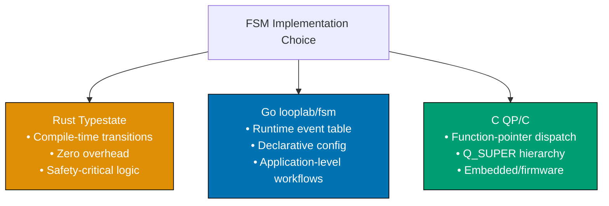




```c
/* => C QP/C: key idioms for FSM — summary */

/* => 1. State representation: function pointers */
/* => each state is a function of type QState (*)(QHsm*, QEvt const*) */
static QState PO_draft(PO * const me, QEvt const * const e);

/* => 2. Transition: Q_TRAN() macro sets next state and fires entry/exit */
status = Q_TRAN(&PO_submitted); /* => transition to PO_submitted state */

/* => 3. Hierarchy: Q_SUPER() defers unhandled signals to parent */
status = Q_SUPER(&PO_active); /* => walk up to superstate for CANCEL_SIG */

/* => 4. Guard condition: inline if before Q_TRAN */
if (me->lineItemCount > 0) {
    status = Q_TRAN(&PO_submitted); /* => guard passed */
} else {
    status = Q_HANDLED(); /* => guard failed — stay in current state */
}

/* => 5. Memory: QActive struct is statically allocated; no malloc */
/* => CRITICAL for embedded: deterministic memory, no heap fragmentation */
static PO po_instance; /* => global instance — no dynamic allocation */
```




```rust
// => Rust typestate: key idioms for FSM — summary

use std::marker::PhantomData;

// => 1. State representation: zero-size marker structs
// => each state is a distinct type with zero runtime size
pub struct Draft;   // => std::mem::size_of::<Draft>() == 0
pub struct Submitted;

// => 2. Transition: consuming self ensures old state is unusable after transition
pub struct PO<S> { pub id: String, _state: PhantomData<S> }
impl PO<Draft> {
    pub fn submit(self) -> PO<Submitted> {
        // => self is MOVED; PO<Draft> is gone after this call
        // => using `self` after submit() is a compile error — no runtime check needed
        PO { id: self.id, _state: PhantomData }
    }
}

// => 3. Hierarchy: nested PhantomData or supertrait
pub trait ActiveState { fn cancel(self) -> PO<()>; }

// => 4. Guard: Result return type forces caller to handle failure
impl PO<Draft> {
    pub fn submit_guarded(self, count: u8) -> Result<PO<Submitted>, PO<Draft>> {
        // => guard is a type-level constraint: Ok vs Err encodes pass vs fail
        if count > 0 { Ok(PO { id: self.id, _state: PhantomData }) } else { Err(self) }
    }
}

// => 5. Memory: PhantomData<S> has zero size — FSM state costs 0 bytes at runtime
// => std::mem::size_of::<PhantomData<Draft>>() == 0 — verified by the compiler

fn main() {
    let po: PO<Draft> = PO { id: "PO-060".into(), _state: PhantomData };
    let _submitted: PO<Submitted> = po.submit(); // => compile-time transition
    println!("Rust typestate: compile-time FSM, zero runtime overhead");
    // => Output: Rust typestate: compile-time FSM, zero runtime overhead
}
```




```go
package main

import (
    "context"
    "fmt"
    "github.com/looplab/fsm"
)

// => Go looplab/fsm: key idioms for FSM — summary

// => 1. State representation: string constants
// => state is a string field inside the fsm.FSM struct
const (
    StateDraft     = "draft"
    StateSubmitted = "submitted"
    StateCancelled = "cancelled"
)

// => 2. Transition: declarative event table in NewFSM()
// => events define the legal transition graph; runtime returns error on illegal transition
po := fsm.NewFSM(
    StateDraft,
    fsm.Events{
        {Name: "submit", Src: []string{StateDraft}, Dst: StateSubmitted},
        // => cancel from multiple Src = superstate simulation
        {Name: "cancel", Src: []string{StateDraft, StateSubmitted}, Dst: StateCancelled},
    },
    // => 3. Hierarchy: multiple Src entries simulate superstate transitions
    // => looplab is flat; hierarchy is a naming convention + shared Src slice
    fsm.Callbacks{
        // => 4. Guard: e.Cancel() in before_<event> callback
        "before_submit": func(_ context.Context, e *fsm.Event) {
            if count := e.Args[0].(int); count == 0 {
                e.Cancel(fmt.Errorf("no line items")) // => guard failure — stays in current state
            }
        },
    },
)

// => 5. Memory: fsm.FSM is a struct on the heap; transition table allocated once
// => typical FSM struct: ~500 bytes including callback map and state string

func main() {
    ctx := context.Background()
    err := po.Event(ctx, "submit", 2) // => pass line item count as arg
    fmt.Println("Submit:", po.Current(), "err:", err)
    // => Output: Submit: submitted err: <nil>
    fmt.Println("Go looplab/fsm: runtime FSM, declarative config, heap allocated")
    // => Output: Go looplab/fsm: runtime FSM, declarative config, heap allocated
}
```




> **Key takeaway**: Choose Rust typestate for compile-time transition enforcement in safety-critical business logic, Go looplab/fsm for declarative runtime workflow configuration, and C QP/C for zero-allocation embedded systems — the three approaches are complementary, not competing.

**Why it matters**: The choice of FSM implementation strategy has long-term maintenance consequences. Rust typestate prevents illegal transitions permanently but requires more code for each state. Go looplab/fsm enables rapid iteration with a runtime-checked event table. C QP/C is the only option when code must run on microcontrollers with kilobytes of RAM. Understanding the full matrix enables polyglot procurement systems where the business logic core (Rust), the workflow orchestration (Go), and the embedded device firmware (C) each use the idiom best matched to their constraints.

---

| Dimension            | Rust typestate           | Go looplab/fsm          | C QP/C                       |
| -------------------- | ------------------------ | ----------------------- | ---------------------------- |
| State representation | Zero-size marker structs | String constants        | Function pointers            |
| Transition check     | Compile-time             | Runtime (returns error) | Runtime (no-op if unhandled) |
| Hierarchy            | Nested PhantomData       | Multiple Src entries    | Q_SUPER() chain              |
| Guard conditions     | Result return type       | e.Cancel() in callback  | Inline if before Q_TRAN()    |
| Memory footprint     | Zero (PhantomData)       | Heap struct (~500 B)    | Static struct (configurable) |
| Primary use case     | Safety-critical business | Application workflows   | Embedded / firmware          |
| Error visibility     | Compile error            | Returned error value    | Silent (unhandled signal)    |
