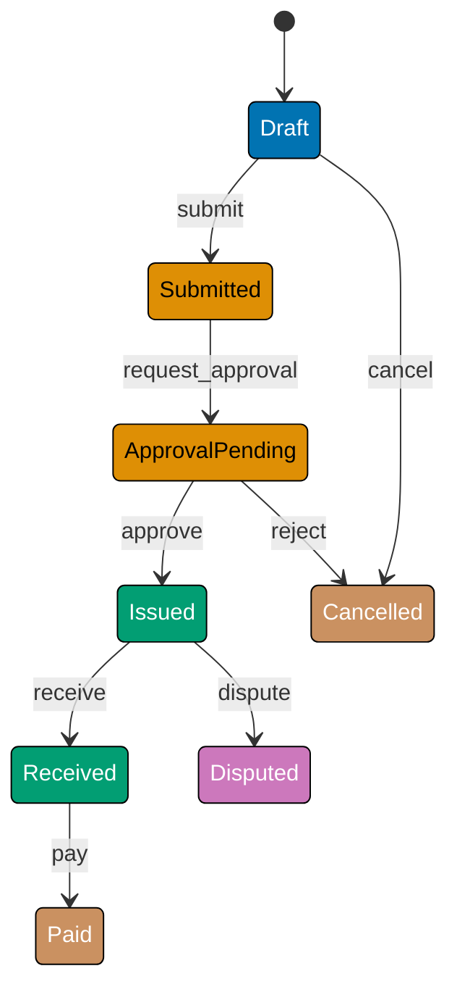
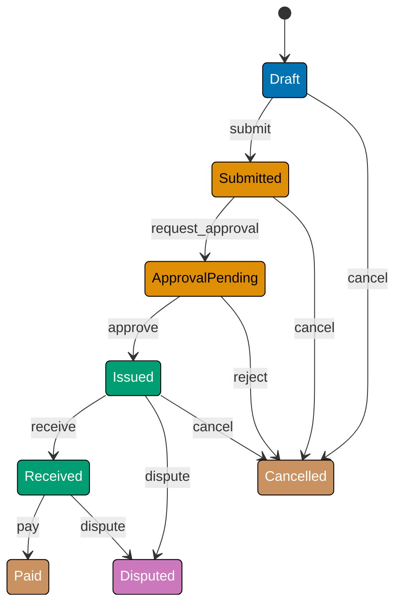

This beginner tutorial introduces Finite State Machine fundamentals through 25 annotated code examples grounded in the `PurchaseOrder` aggregate from the `procurement-platform-be` backend. Rust is the **canonical** language here — its typestate pattern encodes the legal transition graph directly into the type system so the compiler rejects illegal transitions at build time, not at runtime. Go uses [looplab/fsm](https://github.com/looplab/fsm) (v1.0.3, Apache 2.0, 3.4k stars) as a declarative runtime alternative.

> **Domain scope note**: The beginner `PurchaseOrder` covers the core approval-issuance lifecycle (`Draft → Submitted → ApprovalPending → Issued → Received → Paid | Cancelled | Disputed`). States from the full domain spec — `PartiallyReceived` and multi-machine coordination — are intentionally deferred to intermediate and advanced levels.

**Canonical sources**: Ana Hoverbear — [Pretty State Machine Patterns in Rust](https://hoverbear.org/blog/rust-state-machine-pattern/); Will Crichton — [Type-Driven API Design in Rust](https://willcrichton.net/rust-api-type-patterns/typestate.html); Jim Blandy, Jason Orendorff, and Leonora F. S. Tindall — [_Programming Rust_, 3rd ed.](https://www.oreilly.com/library/view/programming-rust-3rd/9781098176228/) (O'Reilly, 2024); [looplab/fsm](https://github.com/looplab/fsm) (v1.0.3, Apache 2.0).

## States as Types (Examples 1–4)

### Example 1: States as Distinct Structs

A `PurchaseOrder` begins as a `Draft`, moves through approval, gets issued to a supplier, and eventually closes or is cancelled. In Rust, each state is a **distinct struct type**. The compiler rejects code that uses the wrong struct — there is no `String` or integer that can accidentally represent an unlisted state.






```rust
// => Rust: each FSM state is a zero-size marker struct — a "typestate"
// => Zero-size structs consume no memory at runtime; they exist only at compile time
// => The compiler uses these types to enforce which transitions are legal

// => Draft: PO has been created but not yet submitted for approval
pub struct Draft;

// => Submitted: PO is submitted; supplier selection underway
pub struct Submitted;

// => ApprovalPending: formal approval request sent to budget-holder
pub struct ApprovalPending;

// => Issued: PO transmitted to supplier; lines are now immutable
pub struct Issued;

// => Received: goods received; awaiting payment
pub struct Received;

// => Paid: PO lifecycle complete — terminal state
pub struct Paid;

// => Cancelled: PO abandoned before payment — terminal state
pub struct Cancelled;

// => Disputed: discrepancy detected between PO and delivery — resolution required
pub struct Disputed;

// => fn main shows that each state is a concrete type, not a string or integer
fn main() {
    let _d: Draft = Draft;
    // => Draft is a real type; the compiler rejects `let _d: Draft = Submitted`
    let _s: Submitted = Submitted;
    // => Each state is physically distinct — no accidental confusion
    println!("States compile — each is a distinct type");
    // => Output: States compile — each is a distinct type
}
```




```go
// => Go: looplab/fsm represents states as plain strings
// => State names are stored in a string field on the FSM struct at runtime
// => import "github.com/looplab/fsm" (v1.0.3, Apache 2.0)

package main

import (
    "context"
    "fmt"
    "github.com/looplab/fsm"
)

// => Constants define the valid state names — centralising them prevents typos
const (
    StateDraft          = "draft"
    StateSubmitted      = "submitted"
    StateApprovalPending = "approval_pending"
    StateIssued         = "issued"
    StateReceived       = "received"
    StatePaid           = "paid"
    StateCancelled      = "cancelled"
    StateDisputed       = "disputed"
)

func main() {
    // => NewFSM takes: initial state, event table, and callback map
    // => The event table is the only definition of legal transitions
    f := fsm.NewFSM(
        StateDraft, // => Machine starts in "draft"
        fsm.Events{
            {Name: "submit",  Src: []string{StateDraft},          Dst: StateSubmitted},
            // => submit: Draft → Submitted
            {Name: "cancel",  Src: []string{StateDraft},          Dst: StateCancelled},
            // => cancel from Draft leads directly to terminal state
        },
        fsm.Callbacks{},
    )
    fmt.Println(f.Current()) // => Output: draft
    _ = f.Event(context.Background(), "submit")
    fmt.Println(f.Current()) // => Output: submitted
}
```




**Key Takeaway**: Rust typestate turns every FSM state into a compile-time type, making illegal state values impossible to express; Go represents state as a string field checked at runtime.

**Why It Matters**: The difference between compile-time and runtime checking is significant in production systems. A Rust typestate mistake surfaces as a build error during development; a Go invalid-state mistake surfaces as a runtime error that requires test coverage or runtime monitoring to detect. For procurement workflows where an incorrect state might trigger a payment or a goods receipt before the PO is approved, compile-time enforcement removes an entire class of defects before the code ships.

---

### Example 2: The Generic `PurchaseOrder<S>` Struct

The state marker type becomes a **type parameter** on the aggregate struct. `PurchaseOrder<Draft>` and `PurchaseOrder<Issued>` are different types from the compiler's perspective, so you cannot pass an `Issued` PO where a `Draft` PO is expected — even though both share the same field layout.




```rust
// => PhantomData<S> carries the state type at compile time without allocating memory
// => The `S` type parameter makes PurchaseOrder<Draft> and PurchaseOrder<Issued> distinct
use std::marker::PhantomData;

pub struct PurchaseOrder<S> {
    pub id: String,
    // => Immutable identifier; every PO gets a UUID on creation
    pub total_amount: f64,
    // => Monetary total in USD; approval guards compare against thresholds
    _state: PhantomData<S>,
    // => Zero-memory marker — `S` is only visible to the type checker
}

impl<S> PurchaseOrder<S> {
    // => Private constructor — callers must use the public factory functions
    // => This ensures every PO starts in Draft and cannot be created in Issued
    fn new(id: impl Into<String>, total_amount: f64) -> Self {
        PurchaseOrder {
            id: id.into(),
            total_amount,
            _state: PhantomData,
            // => PhantomData requires no argument; the type carries the marker
        }
    }
}

impl PurchaseOrder<Draft> {
    // => The only way to get a PurchaseOrder<Draft> — enforces FSM start invariant
    pub fn create(id: impl Into<String>, total_amount: f64) -> Self {
        Self::new(id, total_amount)
        // => All POs begin in Draft — no other entry point exists
    }
}

fn main() {
    let po: PurchaseOrder<Draft> = PurchaseOrder::create("po_001", 1500.0);
    // => Type annotation is optional; inferred by the compiler from `create`
    println!("id={} amount={}", po.id, po.total_amount);
    // => Output: id=po_001 amount=1500
    // => let bad: PurchaseOrder<Issued> = PurchaseOrder::create("x", 0.0);
    // => Compile error: expected PurchaseOrder<Issued>, found PurchaseOrder<Draft>
}
```




```go
// => Go: the FSM wrapper struct holds the looplab/fsm machine and domain fields
// => No generics are used — all state information lives in f.Current() string
package main

import (
    "fmt"
    "github.com/looplab/fsm"
)

// => PurchaseOrder bundles the FSM machine with the PO's domain data
type PurchaseOrder struct {
    ID          string
    // => Immutable identifier; set at creation, never changed
    TotalAmount float64
    // => Monetary total; used in approval guard callbacks
    FSM         *fsm.FSM
    // => looplab FSM instance; holds current state and transition table
}

// => newPurchaseOrder is the factory; all POs start in "draft"
func newPurchaseOrder(id string, totalAmount float64) *PurchaseOrder {
    f := fsm.NewFSM(
        StateDraft,
        // => Initial state is always "draft" — FSM start invariant
        fsm.Events{
            {Name: "submit",          Src: []string{StateDraft},           Dst: StateSubmitted},
            {Name: "request_approval",Src: []string{StateSubmitted},       Dst: StateApprovalPending},
            {Name: "approve",         Src: []string{StateApprovalPending}, Dst: StateIssued},
            {Name: "reject",          Src: []string{StateApprovalPending}, Dst: StateCancelled},
            {Name: "receive",         Src: []string{StateIssued},          Dst: StateReceived},
            {Name: "pay",             Src: []string{StateReceived},        Dst: StatePaid},
            {Name: "cancel",          Src: []string{StateDraft, StateSubmitted, StateApprovalPending}, Dst: StateCancelled},
            {Name: "dispute",         Src: []string{StateIssued},          Dst: StateDisputed},
        },
        fsm.Callbacks{},
    )
    return &PurchaseOrder{ID: id, TotalAmount: totalAmount, FSM: f}
    // => Returns pointer; the FSM machine tracks state internally
}

func main() {
    po := newPurchaseOrder("po_001", 1500.0)
    fmt.Printf("id=%s amount=%.0f state=%s\n", po.ID, po.TotalAmount, po.FSM.Current())
    // => Output: id=po_001 amount=1500 state=draft
}
```




**Key Takeaway**: `PurchaseOrder<S>` binds the state marker to the aggregate struct via a type parameter, making different states produce incompatible types; Go embeds the FSM machine as a field carrying the string state at runtime.

**Why It Matters**: The `PhantomData<S>` field has zero memory cost — it exists only during compilation. You get the safety of a fully typed state machine with no runtime overhead. In contrast, Go's approach is flexible and serialisable out of the box, because the state is just a string that can be persisted to a database or transmitted over the wire without any special marshalling code.

---

### Example 3: Terminal States and the `IsTerminal` Helper

Terminal states have no outgoing transitions. Encoding termination as a type-level property in Rust means the compiler refuses to call any transition method on a `PurchaseOrder<Paid>` or `PurchaseOrder<Cancelled>` — because no transition methods are implemented on those concrete types.




```rust
// => No impl block for Paid or Cancelled means no transition methods exist on them
// => Calling any method not defined for the concrete type is a compile error

use std::marker::PhantomData;

// => Reuse the generic struct from Example 2 — only the state marker differs
pub struct PurchaseOrder<S> {
    pub id: String,
    pub total_amount: f64,
    _state: PhantomData<S>,
}

// => Paid has no impl block with transition methods — it is a dead end by construction
// => Cancelled similarly has no transitions defined

// => Runtime helper: useful in contexts where the state is erased (e.g., serialisation)
// => Takes the state name as a string — this is the only place strings appear
pub fn is_terminal(state_name: &str) -> bool {
    // => Compare against the two terminal state names
    matches!(state_name, "Paid" | "Cancelled")
    // => `matches!` is idiomatic Rust pattern matching in a boolean context
}

fn main() {
    println!("{}", is_terminal("Draft"));     // => Output: false
    println!("{}", is_terminal("Paid"));      // => Output: true
    println!("{}", is_terminal("Cancelled")); // => Output: true
    // => At the typestate level, PurchaseOrder<Paid> cannot call `.submit()` etc.
    // => because no such method exists — the compiler enforces termination structurally
}
```




```go
// => Go: looplab/fsm has no built-in terminal-state concept
// => We implement it as a helper that checks the current state string
package main

import "fmt"

// => terminalStates is a set — map[string]struct{} is the idiomatic Go set type
var terminalStates = map[string]struct{}{
    StatePaid:      {},
    // => Paid: PO lifecycle complete; no further transitions allowed
    StateCancelled: {},
    // => Cancelled: PO abandoned; no further transitions allowed
}

// => isTerminal checks whether the FSM has reached a terminal state
func isTerminal(state string) bool {
    _, ok := terminalStates[state]
    // => map lookup: ok is true if the key exists in the set
    return ok
}

func main() {
    fmt.Println(isTerminal(StateDraft))     // => Output: false
    fmt.Println(isTerminal(StatePaid))      // => Output: true
    fmt.Println(isTerminal(StateCancelled)) // => Output: true
}
```




**Key Takeaway**: Rust encodes terminal states structurally — no methods, no transitions, no way to proceed; Go encodes them as a runtime set checked in helper functions.

**Why It Matters**: Terminal states are a common source of bugs in workflow engines. A payment service that accidentally re-processes a `Paid` PO because it missed a terminal check can double-pay a supplier. Rust prevents this at compile time. Go requires the developer to call `isTerminal` at the right places — a discipline requirement rather than a structural guarantee. Both approaches work; the difference is where the failure mode surfaces.

---

### Example 4: Displaying the Current State

Serialising and logging the current state is essential for audit trails. Rust implements the `Display` trait to convert typestate structs to human-readable strings. Go's current state is already a string from `f.Current()`.




```rust
// => std::fmt::Display converts a value to a human-readable string
// => Implementing Display for each state struct enables `format!("{}", state_name)`
use std::fmt;

// => State structs declared here (shared across examples in a real module)
pub struct Draft;
pub struct Submitted;
pub struct ApprovalPending;
pub struct Issued;
pub struct Received;
pub struct Paid;
pub struct Cancelled;
pub struct Disputed;

// => Macro to reduce boilerplate: implement Display for each state struct
macro_rules! impl_display_state {
    ($($t:ty => $name:expr),*) => {
        $(
            impl fmt::Display for $t {
                fn fmt(&self, f: &mut fmt::Formatter<'_>) -> fmt::Result {
                    write!(f, $name)
                    // => Write the literal state name string to the formatter
                }
            }
        )*
    };
}

impl_display_state!(
    Draft         => "Draft",
    Submitted     => "Submitted",
    ApprovalPending => "ApprovalPending",
    Issued        => "Issued",
    Received      => "Received",
    Paid          => "Paid",
    Cancelled     => "Cancelled",
    Disputed      => "Disputed"
);

fn main() {
    println!("{}", Draft);          // => Output: Draft
    println!("{}", Issued);         // => Output: Issued
    println!("{}", Cancelled);      // => Output: Cancelled
    // => Format strings use Display automatically; no `.to_string()` call needed
    let label = format!("State: {}", ApprovalPending);
    println!("{}", label);          // => Output: State: ApprovalPending
}
```




```go
// => Go: looplab/fsm stores state as a string — Display is free
package main

import (
    "fmt"
    "github.com/looplab/fsm"
)

func main() {
    po := newPurchaseOrder("po_002", 750.0)
    // => f.Current() returns the current state as a string — no formatting needed
    fmt.Printf("State: %s\n", po.FSM.Current())
    // => Output: State: draft

    // => After a transition the string updates automatically
    _ = po.FSM.Event(nil, "submit")
    // => The nil context is used here for brevity; real code should pass context.Background()
    fmt.Printf("State: %s\n", po.FSM.Current())
    // => Output: State: submitted
}
```




**Key Takeaway**: Implementing `Display` on Rust typestate structs gives you a consistent serialised name for logging and persistence; Go's state string is already the serialised name by definition.

**Why It Matters**: Audit logs and event stores need a stable string representation of state. In Rust, the `Display` implementation is the single source of truth for that string — if you rename the struct, the compiler forces you to update `Display` too, so log entries remain consistent. In Go, state names are defined once as constants and reused everywhere, achieving the same stability with a simpler mechanism.

---

## The Transition Table (Examples 5–8)

### Example 5: Consuming `self` in Rust Transitions

In Rust, a transition method takes ownership of `self` and returns a new value of a different state type. After the call, the original binding is **moved out** and can never be used again — the compiler enforces this with a borrow check error.




```rust
// => Transitions consume `self` — the Draft is destroyed, a Submitted is born
// => This is the core typestate invariant: one state in, one state out
use std::marker::PhantomData;

pub struct PurchaseOrder<S> {
    pub id: String,
    pub total_amount: f64,
    _state: PhantomData<S>,
}

impl<S> PurchaseOrder<S> {
    fn transition<T>(self) -> PurchaseOrder<T> {
        // => Move all fields into the new state type — no copying of heap data
        PurchaseOrder { id: self.id, total_amount: self.total_amount, _state: PhantomData }
    }
}

impl PurchaseOrder<Draft> {
    // => `self` (not `&self`) means the Draft PO is consumed — caller loses it
    pub fn submit(self) -> PurchaseOrder<Submitted> {
        self.transition()
        // => Returns PurchaseOrder<Submitted>; the Draft no longer exists
    }
}

impl PurchaseOrder<Submitted> {
    pub fn request_approval(self) -> PurchaseOrder<ApprovalPending> {
        self.transition()
        // => Submitted is consumed; caller receives ApprovalPending
    }
}

fn main() {
    let draft = PurchaseOrder::<Draft>::create("po_003", 2000.0);
    let submitted = draft.submit();
    // => `draft` is moved here — using it after this line is a compile error
    // => error[E0382]: borrow of moved value: `draft`
    println!("state=Submitted id={}", submitted.id);
    // => Output: state=Submitted id=po_003
}
```




```go
// => Go: transitions call f.Event() which returns an error on invalid moves
// => The FSM mutates f.Current() in place; no new struct is created
package main

import (
    "context"
    "fmt"
    "github.com/looplab/fsm"
)

func main() {
    po := newPurchaseOrder("po_003", 2000.0)
    // => po.FSM.Current() == "draft"

    err := po.FSM.Event(context.Background(), "submit")
    // => Event returns nil on success, error on invalid transition
    if err != nil {
        fmt.Println("transition error:", err)
        // => looplab/fsm returns an InvalidEventError with a descriptive message
    }
    fmt.Println(po.FSM.Current())
    // => Output: submitted

    err = po.FSM.Event(context.Background(), "request_approval")
    if err != nil {
        fmt.Println("transition error:", err)
    }
    fmt.Println(po.FSM.Current())
    // => Output: approval_pending
}
```




**Key Takeaway**: Rust's ownership model makes invalid state re-use a compile error; Go's `Event` method returns an error value that callers must check to detect invalid transitions.

**Why It Matters**: The Rust approach catches misuse at compile time — a developer who accidentally re-uses a `Draft` PO after calling `submit` gets a build error. In Go, the same mistake would silently succeed until `f.Current()` returned an unexpected state. This is why the Rust typestate idiom is described as the strongest compile-time FSM guarantee available in any language taught on this site.

---

### Example 6: The Full Transition Table

Defining all transitions in one place makes the full state machine inspectable and prevents transitions from being scattered across unrelated files.






```rust
// => Rust: the full transition table is expressed as impl blocks, one per state
// => Each impl block contains only the methods legal from that state
// => Trying to call `.approve()` on a Draft is a compile error — no such method

use std::marker::PhantomData;

pub struct PurchaseOrder<S> {
    pub id: String,
    pub total_amount: f64,
    _state: PhantomData<S>,
}

impl<S> PurchaseOrder<S> {
    fn transition<T>(self) -> PurchaseOrder<T> {
        PurchaseOrder { id: self.id, total_amount: self.total_amount, _state: PhantomData }
    }
}

// => Draft: submit or cancel
impl PurchaseOrder<Draft> {
    pub fn submit(self) -> PurchaseOrder<Submitted>       { self.transition() }
    pub fn cancel(self) -> PurchaseOrder<Cancelled>       { self.transition() }
}

// => Submitted: request_approval or cancel
impl PurchaseOrder<Submitted> {
    pub fn request_approval(self) -> PurchaseOrder<ApprovalPending> { self.transition() }
    pub fn cancel(self) -> PurchaseOrder<Cancelled>                  { self.transition() }
}

// => ApprovalPending: approve (→ Issued) or reject (→ Cancelled)
impl PurchaseOrder<ApprovalPending> {
    pub fn approve(self) -> PurchaseOrder<Issued>         { self.transition() }
    pub fn reject(self)  -> PurchaseOrder<Cancelled>      { self.transition() }
}

// => Issued: receive, cancel, or dispute
impl PurchaseOrder<Issued> {
    pub fn receive(self)  -> PurchaseOrder<Received>      { self.transition() }
    pub fn cancel(self)   -> PurchaseOrder<Cancelled>     { self.transition() }
    pub fn dispute(self)  -> PurchaseOrder<Disputed>      { self.transition() }
}

// => Received: pay or dispute — only two exits
impl PurchaseOrder<Received> {
    pub fn pay(self)     -> PurchaseOrder<Paid>           { self.transition() }
    pub fn dispute(self) -> PurchaseOrder<Disputed>       { self.transition() }
}

// => Paid and Cancelled have no impl blocks — they are genuinely terminal

fn main() {
    let po = PurchaseOrder::<Draft>::create("po_004", 3000.0);
    let po = po.submit();           // => Draft → Submitted; original `po` moved
    let po = po.request_approval(); // => Submitted → ApprovalPending
    let po = po.approve();          // => ApprovalPending → Issued
    let po = po.receive();          // => Issued → Received
    let _paid = po.pay();           // => Received → Paid (terminal)
    println!("Final state reached: Paid");
    // => Output: Final state reached: Paid
}
```




```go
// => Go: all events declared in one fsm.Events slice — the full transition table
// => This is the authoritative definition; looplab/fsm rejects any unlisted event at runtime
package main

import (
    "context"
    "fmt"
    "github.com/looplab/fsm"
)

func buildPOFSM(initialState string) *fsm.FSM {
    // => fsm.Events is a slice of EventDesc structs — each is one row in the table
    return fsm.NewFSM(
        initialState,
        fsm.Events{
            // => Draft transitions
            {Name: "submit",           Src: []string{StateDraft},           Dst: StateSubmitted},
            {Name: "cancel",           Src: []string{StateDraft, StateSubmitted, StateIssued}, Dst: StateCancelled},
            // => cancel is valid from multiple source states — one event, many Src entries
            // => Submitted transitions
            {Name: "request_approval", Src: []string{StateSubmitted},       Dst: StateApprovalPending},
            // => ApprovalPending transitions
            {Name: "approve",          Src: []string{StateApprovalPending}, Dst: StateIssued},
            {Name: "reject",           Src: []string{StateApprovalPending}, Dst: StateCancelled},
            // => Issued transitions
            {Name: "receive",          Src: []string{StateIssued},          Dst: StateReceived},
            {Name: "dispute",          Src: []string{StateIssued, StateReceived}, Dst: StateDisputed},
            // => dispute valid from Issued or Received — one event, two sources
            // => Received transitions
            {Name: "pay",              Src: []string{StateReceived},        Dst: StatePaid},
        },
        fsm.Callbacks{},
    )
}

func main() {
    f := buildPOFSM(StateDraft)
    events := []string{"submit", "request_approval", "approve", "receive", "pay"}
    for _, e := range events {
        // => Walk the happy path from Draft → Paid
        if err := f.Event(context.Background(), e); err != nil {
            fmt.Println("error:", err)
        }
    }
    fmt.Println(f.Current()) // => Output: paid
}
```




**Key Takeaway**: Rust expresses the transition table as per-state `impl` blocks whose method signatures are the table; Go expresses it as a flat `fsm.Events` slice that looplab/fsm validates at runtime.

**Why It Matters**: Having all transitions defined in one place — whether Rust `impl` blocks or a Go `fsm.Events` slice — makes the state machine auditable. You can read the full lifecycle without tracing through conditional logic scattered across a codebase. This property is essential during security audits and regulatory compliance reviews where auditors need to verify that no payment state can be reached without proper approval.

---

### Example 7: Invalid Transition Rejection

Both Rust and Go must reject transitions that are not in the table. Rust does it structurally (no method exists); Go returns an `InvalidEventError`.




```rust
// => Rust: calling a method that does not exist on the concrete type is a compile error
// => No runtime check is needed — the type system forbids the call entirely

// => Assuming Draft, Submitted, Issued structs and PurchaseOrder<S> from previous examples

fn demonstrate_invalid_transition() {
    let draft = PurchaseOrder::<Draft>::create("po_005", 500.0);
    // => Draft has `.submit()` and `.cancel()` — no `.approve()` method exists

    // => Uncommenting the line below causes a compile-time error:
    // let _ = draft.approve();
    // => error[E0599]: no method named `approve` found for struct
    // =>   `PurchaseOrder<Draft>` in the current scope

    let submitted = draft.submit();
    // => Submitted has `.request_approval()` — no `.pay()` method exists

    // => Uncommenting the line below causes a compile-time error:
    // let _ = submitted.pay();
    // => error[E0599]: no method named `pay` found for struct
    // =>   `PurchaseOrder<Submitted>` in the current scope

    println!("Invalid transitions rejected at compile time — no runtime error possible");
    // => Output: Invalid transitions rejected at compile time — no runtime error possible
    let _ = submitted; // => suppress unused-variable warning
}

fn main() {
    demonstrate_invalid_transition();
}
```




```go
// => Go: invalid transitions return an InvalidEventError from looplab/fsm
// => The error contains the event name and current state for diagnostic messages
package main

import (
    "context"
    "errors"
    "fmt"
    "github.com/looplab/fsm"
)

func main() {
    f := buildPOFSM(StateDraft)
    // => Attempt to call "approve" from "draft" — not in the transition table

    err := f.Event(context.Background(), "approve")
    // => looplab/fsm returns InvalidEventError — the event is not valid in this state

    var invalidErr fsm.InvalidEventError
    if errors.As(err, &invalidErr) {
        // => errors.As unwraps the error chain and checks for the concrete type
        fmt.Printf("Invalid transition: event=%q state=%q\n",
            invalidErr.Event, invalidErr.State)
        // => Output: Invalid transition: event="approve" state="draft"
    }

    // => Attempt to call "pay" from "submitted" — also not in the transition table
    f2 := buildPOFSM(StateSubmitted)
    err2 := f2.Event(context.Background(), "pay")
    if errors.As(err2, &invalidErr) {
        fmt.Printf("Invalid transition: event=%q state=%q\n",
            invalidErr.Event, invalidErr.State)
        // => Output: Invalid transition: event="pay" state="submitted"
    }
}
```




**Key Takeaway**: Rust turns invalid transitions into compile errors; Go turns them into typed errors returned from `f.Event` that callers must handle explicitly.

**Why It Matters**: Both patterns enforce the transition table — neither silently ignores an invalid transition. The practical difference is the feedback loop: Rust developers learn about invalid transitions in their editor before running the code; Go developers learn during testing when the error is returned. For teams that invest heavily in unit tests, Go's approach is pragmatic. For teams that want maximum safety with minimal test surface, Rust's compile-time enforcement is compelling.

---

### Example 8: Inspecting Permitted Transitions

Knowing which transitions are available from the current state is useful for building UI menus, generating audit reports, and debugging.




```rust
// => Rust: permitted transitions are expressed as method availability on the type
// => A trait listing all transitions can be used to query them at runtime
use std::collections::HashSet;

// => Trait: implemented by each state struct to advertise its outgoing transitions
pub trait HasTransitions {
    fn available_events(&self) -> HashSet<&'static str>;
    // => Returns the set of event names callable in this state
}

impl HasTransitions for Draft {
    fn available_events(&self) -> HashSet<&'static str> {
        ["submit", "cancel"].iter().copied().collect()
        // => Only two events are valid from Draft
    }
}

impl HasTransitions for Submitted {
    fn available_events(&self) -> HashSet<&'static str> {
        ["request_approval", "cancel"].iter().copied().collect()
    }
}

impl HasTransitions for ApprovalPending {
    fn available_events(&self) -> HashSet<&'static str> {
        ["approve", "reject"].iter().copied().collect()
        // => Approval decisions are the only valid events here
    }
}

impl HasTransitions for Issued {
    fn available_events(&self) -> HashSet<&'static str> {
        ["receive", "cancel", "dispute"].iter().copied().collect()
    }
}

impl HasTransitions for Paid {
    fn available_events(&self) -> HashSet<&'static str> {
        HashSet::new()
        // => Empty set — terminal state allows no further transitions
    }
}

fn main() {
    let draft = Draft;
    println!("Draft events: {:?}", draft.available_events());
    // => Output: {"submit", "cancel"}  (order may vary — HashSet is unordered)
    let paid = Paid;
    println!("Paid events: {:?}", paid.available_events());
    // => Output: {}  (empty — no transitions from terminal state)
}
```




```go
// => Go: looplab/fsm provides AvailableTransitions() returning a string slice
package main

import (
    "context"
    "fmt"
    "github.com/looplab/fsm"
)

func main() {
    f := buildPOFSM(StateDraft)
    transitions := f.AvailableTransitions()
    // => AvailableTransitions returns all events valid in the current state
    fmt.Printf("Available from draft: %v\n", transitions)
    // => Output: Available from draft: [cancel submit]  (alphabetical order)

    // => Advance to approval_pending to show different permitted events
    _ = f.Event(context.Background(), "submit")
    _ = f.Event(context.Background(), "request_approval")
    transitions = f.AvailableTransitions()
    fmt.Printf("Available from approval_pending: %v\n", transitions)
    // => Output: Available from approval_pending: [approve reject]

    // => Advance to terminal state
    _ = f.Event(context.Background(), "approve")
    _ = f.Event(context.Background(), "receive")
    _ = f.Event(context.Background(), "pay")
    transitions = f.AvailableTransitions()
    fmt.Printf("Available from paid: %v\n", transitions)
    // => Output: Available from paid: []  (no transitions from terminal state)
}
```




**Key Takeaway**: Rust exposes available transitions through a trait returning a `HashSet`; Go exposes them through `AvailableTransitions()` built into looplab/fsm.

**Why It Matters**: Querying permitted transitions at runtime is used in two important scenarios: (1) generating action menus in approval UIs so buyers only see the buttons relevant to their current workflow step, and (2) building audit reports that describe what actions were available at each point in the PO lifecycle. The looplab/fsm `AvailableTransitions` method provides this for free; Rust requires a trait but makes the contract explicit.

---

## Guards (Examples 9–12)

### Example 9: A Guard Returns `Result`

A guard is a condition that must be true before a transition may proceed. In Rust, the transition method returns `Result<PurchaseOrder<NextState>, DomainError>` so the caller is forced to handle the failure case at the type level.




```rust
// => Guard on the approve transition: total_amount must be within the approver's threshold
// => Returns Err(DomainError) if the guard fails; the PO stays in ApprovalPending

// => Domain error type — using an enum to distinguish different failure reasons
#[derive(Debug)]
pub enum DomainError {
    AmountExceedsApprovalLimit { amount: f64, limit: f64 },
    // => The error carries both the amount and the limit for diagnostic messages
}

// => The approval threshold for the beginner-level guard
const APPROVAL_LIMIT: f64 = 10_000.0;

impl PurchaseOrder<ApprovalPending> {
    // => Returns Result: Ok(Issued) on success, Err(DomainError) on guard failure
    // => `self` is consumed either way — on Err the caller must decide what to do next
    pub fn approve(self) -> Result<PurchaseOrder<Issued>, DomainError> {
        if self.total_amount > APPROVAL_LIMIT {
            // => Guard fails: return the error without consuming the PO into Issued
            return Err(DomainError::AmountExceedsApprovalLimit {
                amount: self.total_amount,
                limit: APPROVAL_LIMIT,
            });
        }
        Ok(self.transition())
        // => Guard passes: PO moves to Issued state
    }
}

fn main() {
    // => Happy path: amount within limit
    let po_ok = PurchaseOrder::<ApprovalPending>::new("po_006", 5000.0);
    match po_ok.approve() {
        Ok(issued) => println!("Approved — id={}", issued.id),
        // => Output: Approved — id=po_006
        Err(e)     => println!("Error: {:?}", e),
    }

    // => Guard failure: amount exceeds limit
    let po_fail = PurchaseOrder::<ApprovalPending>::new("po_007", 15000.0);
    match po_fail.approve() {
        Ok(_)      => println!("Should not reach here"),
        Err(e)     => println!("Rejected: {:?}", e),
        // => Output: Rejected: AmountExceedsApprovalLimit { amount: 15000.0, limit: 10000.0 }
    }
}
```




```go
// => Go: guards are implemented as BeforeEvent callbacks on looplab/fsm
// => Returning an error from a BeforeEvent callback cancels the transition
package main

import (
    "context"
    "errors"
    "fmt"
    "github.com/looplab/fsm"
)

const approvalLimit = 10_000.0

// => DomainError wraps the guard failure with enough context for logging
type DomainError struct {
    Message string
    Amount  float64
    Limit   float64
}

func (e *DomainError) Error() string {
    return fmt.Sprintf("%s (amount=%.0f, limit=%.0f)", e.Message, e.Amount, e.Limit)
    // => Implements the error interface — allows standard error handling patterns
}

func newPOWithGuard(id string, amount float64) *PurchaseOrder {
    po := &PurchaseOrder{ID: id, TotalAmount: amount}
    po.FSM = fsm.NewFSM(
        StateDraft,
        fsm.Events{
            {Name: "submit",           Src: []string{StateDraft},           Dst: StateSubmitted},
            {Name: "request_approval", Src: []string{StateSubmitted},       Dst: StateApprovalPending},
            {Name: "approve",          Src: []string{StateApprovalPending}, Dst: StateIssued},
            {Name: "reject",           Src: []string{StateApprovalPending}, Dst: StateCancelled},
            {Name: "receive",          Src: []string{StateIssued},          Dst: StateReceived},
            {Name: "pay",              Src: []string{StateReceived},        Dst: StatePaid},
        },
        fsm.Callbacks{
            "before_approve": func(_ context.Context, e *fsm.Event) {
                // => before_<event> callbacks run before the state change
                // => e.Cancel(err) prevents the transition and attaches the error
                if po.TotalAmount > approvalLimit {
                    e.Cancel(errors.New("amount exceeds approval limit"))
                    // => Cancelling the event keeps the FSM in approval_pending
                }
            },
        },
    )
    return po
}

func main() {
    // => Happy path
    poOK := newPOWithGuard("po_006", 5000.0)
    _ = poOK.FSM.Event(nil, "submit")
    _ = poOK.FSM.Event(nil, "request_approval")
    err := poOK.FSM.Event(nil, "approve")
    fmt.Println(poOK.FSM.Current(), err)
    // => Output: issued <nil>

    // => Guard failure
    poFail := newPOWithGuard("po_007", 15000.0)
    _ = poFail.FSM.Event(nil, "submit")
    _ = poFail.FSM.Event(nil, "request_approval")
    err = poFail.FSM.Event(nil, "approve")
    fmt.Println(poFail.FSM.Current(), err)
    // => Output: approval_pending amount exceeds approval limit
}
```




**Key Takeaway**: Rust embeds the guard in the return type — `Result` forces callers to handle failure; Go uses `before_<event>` callbacks that cancel the transition and return the error through the `f.Event` return value.

**Why It Matters**: Guards encode business rules such as approval thresholds, budget checks, and supplier verification at the transition boundary. Putting guards inside the transition method (Rust) or the `before_<event>` callback (Go) means the check cannot be bypassed by calling the wrong function. A developer who forgets to check the guard still gets the correct behavior — the machine refuses to advance.

---

### Example 10: Multiple Guards with Early Return

Some transitions require multiple conditions. Rust uses `?` for early return; Go's callback can check conditions sequentially and cancel on the first failure.




```rust
// => Multiple guards on the approve transition using the `?` operator
// => Each guard returns early with an Err if it fails — remaining guards are skipped

#[derive(Debug)]
pub enum DomainError {
    AmountExceedsLimit { amount: f64, limit: f64 },
    // => Amount guard failure
    MissingSupplierCode,
    // => Supplier must be assigned before approval
}

pub struct ApprovalPendingData {
    pub id: String,
    pub total_amount: f64,
    pub supplier_code: Option<String>,
    // => None means supplier not yet assigned — blocks approval
}

// => impl block with multiple guards
impl PurchaseOrder<ApprovalPending> {
    pub fn approve(self) -> Result<PurchaseOrder<Issued>, DomainError>
    where
        ApprovalPending: HasData<ApprovalPendingData>,
    {
        // => Guard 1: supplier must be assigned
        if self.data.supplier_code.is_none() {
            return Err(DomainError::MissingSupplierCode);
            // => Early return — remaining guards are not evaluated
        }
        // => Guard 2: amount must be within threshold
        if self.data.total_amount > 10_000.0 {
            return Err(DomainError::AmountExceedsLimit {
                amount: self.data.total_amount,
                limit: 10_000.0,
            });
            // => `?` could replace this block if the guards returned Result
        }
        Ok(self.transition())
        // => Both guards passed — transition proceeds
    }
}

fn main() {
    // => Simplified demonstration of the guard logic without full generics
    let amount = 5000.0_f64;
    let supplier_code: Option<String> = Some("SUP_001".to_string());

    let result: Result<(), DomainError> = (|| {
        if supplier_code.is_none() { return Err(DomainError::MissingSupplierCode); }
        if amount > 10_000.0 { return Err(DomainError::AmountExceedsLimit { amount, limit: 10_000.0 }); }
        Ok(())
    })();
    println!("{:?}", result); // => Output: Ok(())

    let no_supplier: Option<String> = None;
    let result2: Result<(), DomainError> = (|| {
        if no_supplier.is_none() { return Err(DomainError::MissingSupplierCode); }
        Ok(())
    })();
    println!("{:?}", result2); // => Output: Err(MissingSupplierCode)
}
```




```go
// => Go: before_approve callback runs multiple guards in sequence
// => The first failing guard cancels the event; remaining guards are skipped
package main

import (
    "context"
    "fmt"
    "github.com/looplab/fsm"
)

type POWithSupplier struct {
    ID           string
    TotalAmount  float64
    SupplierCode string
    // => Empty string means supplier not assigned — blocks approval guard
    FSM          *fsm.FSM
}

func newPOWithSupplierGuard(id string, amount float64, supplierCode string) *POWithSupplier {
    po := &POWithSupplier{ID: id, TotalAmount: amount, SupplierCode: supplierCode}
    po.FSM = fsm.NewFSM(
        StateApprovalPending,
        // => Start in approval_pending to isolate the approve guard test
        fsm.Events{
            {Name: "approve", Src: []string{StateApprovalPending}, Dst: StateIssued},
            {Name: "reject",  Src: []string{StateApprovalPending}, Dst: StateCancelled},
        },
        fsm.Callbacks{
            "before_approve": func(_ context.Context, e *fsm.Event) {
                // => Guard 1: supplier must be assigned
                if po.SupplierCode == "" {
                    e.Cancel(fmt.Errorf("missing supplier code"))
                    return
                    // => Return early — second guard is not evaluated
                }
                // => Guard 2: amount within limit
                if po.TotalAmount > 10_000.0 {
                    e.Cancel(fmt.Errorf("amount %.0f exceeds approval limit 10000", po.TotalAmount))
                }
            },
        },
    )
    return po
}

func main() {
    // => Both guards pass
    po1 := newPOWithSupplierGuard("po_008", 5000.0, "SUP_001")
    err := po1.FSM.Event(context.Background(), "approve")
    fmt.Println(po1.FSM.Current(), err)
    // => Output: issued <nil>

    // => Supplier missing — first guard fails; amount is not evaluated
    po2 := newPOWithSupplierGuard("po_009", 5000.0, "")
    err = po2.FSM.Event(context.Background(), "approve")
    fmt.Println(po2.FSM.Current(), err)
    // => Output: approval_pending missing supplier code
}
```




**Key Takeaway**: Both Rust and Go support ordered guard evaluation with early exit on first failure; Rust uses the `?` operator and return types while Go uses explicit `return` inside the callback.

**Why It Matters**: Real procurement rules require multiple conditions before a transition. A PO might need a supplier, a budget code, a digital signature, and a line-item count before it can be approved. Ordering the guards by cheapness (check the quick, cheap conditions first) and exiting early on failure minimises unnecessary work and makes error messages more actionable for the buyer.

---

### Example 11: Guard on Amount Threshold with Error Reporting

The approval guard failure message should tell the approver exactly what is wrong and what is required — generic error strings make debugging and UI error display harder.




```rust
// => Structured error types carry context for diagnostic messages and UI rendering
use std::fmt;

// => Error enum with structured variants — each variant carries its own fields
#[derive(Debug)]
pub enum ApprovalError {
    AmountExceedsLimit { amount: f64, limit: f64 },
    // => Carries the actual amount and the configured limit
    MissingSupplierCode { po_id: String },
    // => Carries the PO ID so the error is traceable in logs
}

// => Implement Display for human-readable error messages
impl fmt::Display for ApprovalError {
    fn fmt(&self, f: &mut fmt::Formatter<'_>) -> fmt::Result {
        match self {
            ApprovalError::AmountExceedsLimit { amount, limit } =>
                write!(f, "PO amount {:.2} exceeds approval limit {:.2}", amount, limit),
            // => Exact amount and limit in the message — approver knows what to change
            ApprovalError::MissingSupplierCode { po_id } =>
                write!(f, "PO {} cannot be approved without a supplier code", po_id),
            // => PO ID in the message — traceable in the audit log
        }
    }
}

fn check_approval_guard(po_id: &str, amount: f64, limit: f64) -> Result<(), ApprovalError> {
    if amount > limit {
        return Err(ApprovalError::AmountExceedsLimit { amount, limit });
        // => Returns structured error — caller can pattern-match to render it
    }
    Ok(())
}

fn main() {
    let err = check_approval_guard("po_010", 15_000.0, 10_000.0);
    match err {
        Ok(()) => println!("Guard passed"),
        Err(e) => {
            println!("Guard failed: {}", e);
            // => Output: Guard failed: PO amount 15000.00 exceeds approval limit 10000.00
            if let ApprovalError::AmountExceedsLimit { amount, limit } = e {
                println!("Need to reduce by {:.2}", amount - limit);
                // => Output: Need to reduce by 5000.00
            }
        }
    }
}
```




```go
// => Go: structured errors implement the error interface with fmt.Errorf or custom types
package main

import "fmt"

// => ApprovalError carries context fields for diagnostic display
type ApprovalError struct {
    Code    string
    // => Short machine-readable code for UI rendering (e.g., "AMOUNT_EXCEEDS_LIMIT")
    Message string
    // => Human-readable message for the approver
    Amount  float64
    Limit   float64
}

// => Error() satisfies the error interface — standard error handling pattern
func (e *ApprovalError) Error() string {
    return fmt.Sprintf("[%s] %s (amount=%.2f, limit=%.2f)",
        e.Code, e.Message, e.Amount, e.Limit)
    // => Code prefix allows programmatic error handling in middleware
}

func checkApprovalGuard(poID string, amount, limit float64) error {
    if amount > limit {
        return &ApprovalError{
            Code:    "AMOUNT_EXCEEDS_LIMIT",
            Message: fmt.Sprintf("PO %s amount %.2f exceeds approval limit %.2f", poID, amount, limit),
            Amount:  amount,
            Limit:   limit,
        }
    }
    return nil
    // => nil return signals that the guard passed
}

func main() {
    err := checkApprovalGuard("po_010", 15_000.0, 10_000.0)
    if err != nil {
        fmt.Println(err)
        // => Output: [AMOUNT_EXCEEDS_LIMIT] PO po_010 amount 15000.00 exceeds approval limit 10000.00
        var ae *ApprovalError
        if aerr, ok := err.(*ApprovalError); ok {
            ae = aerr
            fmt.Printf("Reduce by: %.2f\n", ae.Amount-ae.Limit)
            // => Output: Reduce by: 5000.00
        }
    }
}
```




**Key Takeaway**: Structured error types carry the context needed for diagnostic messages, UI rendering, and programmatic handling — generic strings require parsing and lose fidelity.

**Why It Matters**: In a procurement platform, the approver sees the error in a web UI. If the error is `"invalid amount"`, the approver cannot act without opening the PO details. If the error is `"PO amount 15000.00 exceeds approval limit 10000.00"`, the approver immediately knows the issue. Structured errors also enable middleware to translate error codes into localised UI messages without string matching.

---

### Example 12: Guard Testing

Guards are pure business logic that should be tested independently of the state machine infrastructure. A guard test verifies both the pass and fail branches.




```rust
// => Rust: unit tests in the same module using the built-in `#[test]` attribute
// => `cargo test` discovers and runs all functions annotated with `#[test]`

#[cfg(test)]
// => cfg(test) ensures test code is compiled only when running tests, not in production
mod tests {
    use super::*;

    // => Test 1: amount below limit — guard should pass
    #[test]
    fn approve_guard_passes_when_amount_within_limit() {
        let result = check_approval_guard("po_011", 5_000.0, 10_000.0);
        // => Guard passes — result should be Ok(())
        assert!(result.is_ok(), "Expected Ok, got {:?}", result);
        // => assert! panics with the message if the condition is false
    }

    // => Test 2: amount exactly at limit — guard should pass (boundary)
    #[test]
    fn approve_guard_passes_at_exact_limit() {
        let result = check_approval_guard("po_012", 10_000.0, 10_000.0);
        assert!(result.is_ok(), "Exact limit should be allowed");
        // => The guard uses `>` not `>=` — at the limit is still valid
    }

    // => Test 3: amount exceeds limit — guard should fail with structured error
    #[test]
    fn approve_guard_fails_when_amount_exceeds_limit() {
        let result = check_approval_guard("po_013", 15_000.0, 10_000.0);
        assert!(result.is_err(), "Expected Err, got {:?}", result);
        // => Verify the error carries the correct amounts
        if let Err(ApprovalError::AmountExceedsLimit { amount, limit }) = result {
            assert_eq!(amount, 15_000.0);
            assert_eq!(limit, 10_000.0);
        }
    }
}

fn main() {
    println!("Run with: cargo test");
    // => `cargo test` compiles and runs the #[test] functions automatically
}
```




```go
// => Go: unit tests live in *_test.go files; the test runner is `go test ./...`
// => The `testing` package provides *testing.T for assertions
package main

import (
    "testing"
)

// => Test 1: amount below limit
func TestApproveGuardPassesWhenAmountWithinLimit(t *testing.T) {
    err := checkApprovalGuard("po_011", 5_000.0, 10_000.0)
    // => Guard should return nil — no error
    if err != nil {
        t.Errorf("expected nil error, got %v", err)
        // => t.Errorf marks the test as failed but continues execution
    }
}

// => Test 2: amount exactly at limit — boundary case
func TestApproveGuardPassesAtExactLimit(t *testing.T) {
    err := checkApprovalGuard("po_012", 10_000.0, 10_000.0)
    if err != nil {
        t.Errorf("exact limit should be allowed, got %v", err)
    }
}

// => Test 3: amount exceeds limit — guard should fail
func TestApproveGuardFailsWhenAmountExceedsLimit(t *testing.T) {
    err := checkApprovalGuard("po_013", 15_000.0, 10_000.0)
    if err == nil {
        t.Fatal("expected error, got nil")
        // => t.Fatal marks the test as failed and stops execution immediately
    }
    ae, ok := err.(*ApprovalError)
    if !ok {
        t.Fatalf("expected *ApprovalError, got %T", err)
    }
    if ae.Amount != 15_000.0 || ae.Limit != 10_000.0 {
        t.Errorf("wrong error fields: amount=%.0f limit=%.0f", ae.Amount, ae.Limit)
        // => Verify that the error carries the correct context values
    }
}
```




**Key Takeaway**: Guard tests verify both pass and fail branches — and the fail branch should assert that the error carries the correct structured data, not just that some error occurred.

**Why It Matters**: An approval guard that always returns `nil` would pass a test that only checks `err != nil`. Testing the error value forces the guard implementation to carry enough context for diagnosis. The boundary test (amount exactly at limit) catches off-by-one errors in the `>` vs `>=` comparison that are common sources of disagreement between technical teams and finance stakeholders.

---

## Line Items and Totals (Examples 13–16)

### Example 13: Adding Line Items to a Draft PO

A `PurchaseOrder` in `Draft` state has mutable line items. Line items encode what is being ordered, from whom, at what price. Once the PO transitions out of `Draft`, line items must become immutable — the supplier has been told what to deliver.




```rust
// => LineItem represents a single procured item in the PO
// => Clone and Debug derived for easy copying and debugging
#[derive(Debug, Clone)]
pub struct LineItem {
    pub sku: String,
    // => Stock Keeping Unit — supplier's product identifier
    pub description: String,
    // => Human-readable product name
    pub quantity: u32,
    // => Ordered quantity; must be > 0
    pub unit_price: f64,
    // => Price per unit in USD
}

impl LineItem {
    pub fn new(sku: &str, description: &str, quantity: u32, unit_price: f64) -> Self {
        LineItem {
            sku: sku.to_string(),
            description: description.to_string(),
            quantity,
            unit_price,
        }
        // => Constructor; validation could check quantity > 0 and unit_price >= 0
    }

    pub fn line_total(&self) -> f64 {
        // => `&self` — this is a query method, does not consume the item
        self.quantity as f64 * self.unit_price
        // => Converts u32 quantity to f64 for multiplication
    }
}

// => PurchaseOrder<Draft> carries a mutable Vec<LineItem>
pub struct DraftPO {
    pub id: String,
    pub items: Vec<LineItem>,
    // => Vec is only on Draft — other state structs do not carry a mutable items field
}

impl DraftPO {
    pub fn add_item(&mut self, item: LineItem) {
        // => &mut self — method mutates the DraftPO; cannot be called on Issued or Paid
        self.items.push(item);
    }

    pub fn total(&self) -> f64 {
        self.items.iter().map(|i| i.line_total()).sum()
        // => Iterator chaining: map each item to its total, then sum all totals
    }
}

fn main() {
    let mut draft = DraftPO { id: "po_014".to_string(), items: vec![] };
    draft.add_item(LineItem::new("SKU-001", "Industrial Pump", 2, 3_500.0));
    draft.add_item(LineItem::new("SKU-002", "Filter Cartridge", 10, 85.0));
    println!("Total: {:.2}", draft.total());
    // => Output: Total: 7850.00  (2 * 3500 + 10 * 85)
}
```




```go
// => Go: LineItem and PurchaseOrder are plain structs; mutation is unrestricted by type
// => Guard the add_item method with a state check to prevent mutation after submission
package main

import "fmt"

// => LineItem represents one procured item
type LineItem struct {
    SKU         string
    Description string
    Quantity    int
    UnitPrice   float64
}

// => LineTotal computes the monetary value of this line
func (li LineItem) LineTotal() float64 {
    return float64(li.Quantity) * li.UnitPrice
    // => Named method on value receiver — does not mutate the LineItem
}

// => POWithItems extends PurchaseOrder with a line-item slice
type POWithItems struct {
    ID    string
    Items []LineItem
    FSM   *fsm.FSM
}

// => AddItem adds a line item only when the FSM is in "draft" state
func (po *POWithItems) AddItem(item LineItem) error {
    if po.FSM.Current() != StateDraft {
        return fmt.Errorf("cannot add items: PO %s is in state %q", po.ID, po.FSM.Current())
        // => Guard: mutation is only allowed in Draft — runtime enforcement
    }
    po.Items = append(po.Items, item)
    return nil
}

// => Total sums the line totals across all items
func (po *POWithItems) Total() float64 {
    var sum float64
    for _, item := range po.Items {
        sum += item.LineTotal()
        // => Accumulate each line's total into sum
    }
    return sum
}

func main() {
    po := &POWithItems{ID: "po_014", Items: []LineItem{}, FSM: buildPOFSM(StateDraft)}
    _ = po.AddItem(LineItem{"SKU-001", "Industrial Pump", 2, 3_500.0})
    _ = po.AddItem(LineItem{"SKU-002", "Filter Cartridge", 10, 85.0})
    fmt.Printf("Total: %.2f\n", po.Total())
    // => Output: Total: 7850.00
}
```




**Key Takeaway**: In Rust, the `add_item` method exists only on `DraftPO` — the compiler prevents calling it on `IssuedPO`; in Go, the method exists on all states and a runtime guard rejects it when the state is wrong.

**Why It Matters**: Immutability of line items after PO issuance is a core procurement control. A PO that has been transmitted to a supplier and then has its items changed creates discrepancy between what the supplier is delivering and what the buyer expects to receive. Encoding this constraint in the type system (Rust) makes it impossible to write the bug; encoding it as a runtime guard (Go) makes it detectable in tests.

---

### Example 14: Computing the PO Total

The `total` is derived from line items on every call rather than cached — this is the functional approach where computed values are functions of their inputs, not stored state that can drift out of sync.




```rust
// => total() is a pure computed property — no mutable field that could desync
// => Iterator::sum() produces the aggregate without intermediate allocations
impl DraftPO {
    pub fn total(&self) -> f64 {
        // => &self means this is a read-only query — no state change
        self.items
            .iter()
            // => iter() produces references — does not take ownership
            .map(|item| item.line_total())
            // => Map each LineItem to its monetary total (f64)
            .sum()
            // => sum() folds all f64 values into one using addition
    }

    pub fn item_count(&self) -> usize {
        self.items.len()
        // => usize is the natural index type in Rust — always non-negative
    }

    pub fn average_unit_price(&self) -> Option<f64> {
        // => Option<f64> because the average is undefined when there are no items
        if self.items.is_empty() {
            return None;
            // => Return None rather than panic or return 0.0 — explicit absence
        }
        let total_units: f64 = self.items.iter().map(|i| i.quantity as f64).sum();
        Some(self.total() / total_units)
        // => Some wraps the computed average — caller must handle the Option
    }
}

fn main() {
    let mut draft = DraftPO { id: "po_015".to_string(), items: vec![] };
    draft.add_item(LineItem::new("SKU-001", "Pump", 2, 3_500.0));
    draft.add_item(LineItem::new("SKU-002", "Filter", 10, 85.0));
    println!("Total: {:.2}", draft.total());
    // => Output: Total: 7850.00
    println!("Items: {}", draft.item_count());
    // => Output: Items: 2
    println!("Avg unit price: {:?}", draft.average_unit_price());
    // => Output: Avg unit price: Some(654.1666...)  (7850 / 12 units total)
}
```




```go
// => Go: total is a method — computed on call, not cached
package main

import "fmt"

// => Total sums all line totals — pure, no mutation
func (po *POWithItems) Total() float64 {
    var sum float64
    for _, item := range po.Items {
        sum += item.LineTotal()
        // => Range over slice — `item` is a copy of each LineItem
    }
    return sum
}

// => ItemCount returns the number of line items — simple len() delegation
func (po *POWithItems) ItemCount() int {
    return len(po.Items)
    // => len() is a built-in — O(1) for slices
}

// => AverageUnitPrice returns (average, true) or (0, false) if no items
func (po *POWithItems) AverageUnitPrice() (float64, bool) {
    if len(po.Items) == 0 {
        return 0, false
        // => Go convention: return zero value plus bool flag for absence
    }
    var totalUnits int
    for _, item := range po.Items {
        totalUnits += item.Quantity
    }
    return po.Total() / float64(totalUnits), true
    // => float64(totalUnits) converts int to float64 for division
}

func main() {
    po := &POWithItems{ID: "po_015", Items: []LineItem{}}
    po.Items = append(po.Items,
        LineItem{"SKU-001", "Pump", 2, 3_500.0},
        LineItem{"SKU-002", "Filter", 10, 85.0},
    )
    fmt.Printf("Total: %.2f\n", po.Total())
    // => Output: Total: 7850.00
    fmt.Printf("Items: %d\n", po.ItemCount())
    // => Output: Items: 2
    if avg, ok := po.AverageUnitPrice(); ok {
        fmt.Printf("Avg unit price: %.2f\n", avg)
        // => Output: Avg unit price: 654.17
    }
}
```




**Key Takeaway**: Computing totals on each call from line items rather than caching them eliminates desynchronisation bugs where the stored total drifts from the items after a modification.

**Why It Matters**: Caching derived values in mutable fields is a common source of financial bugs. A total field that is set in `addItem` but not updated in `removeItem` will report incorrect amounts to approvers. The functional approach — compute total from items every time — trades a small CPU cost for perfect correctness. For procurement amounts, correctness is non-negotiable; a PO with the wrong total might bypass an approval threshold check.

---

### Example 15: Preventing Item Mutation After Submission

Once a PO transitions to `Submitted`, its items must be frozen. Rust enforces this structurally; Go enforces it at runtime.




```rust
// => Rust: only DraftPO has add_item(); SubmittedPO does not have the method
// => After calling .submit(), the DraftPO is consumed — its mutation methods vanish

pub struct DraftPO {
    pub id: String,
    pub items: Vec<LineItem>,
}

pub struct SubmittedPO {
    pub id: String,
    pub items: Vec<LineItem>,
    // => Same items, now frozen — no add_item method on SubmittedPO
}

impl DraftPO {
    pub fn add_item(&mut self, item: LineItem) {
        // => Only available on DraftPO — not on SubmittedPO or any later state
        self.items.push(item);
    }

    // => submit() consumes self and returns SubmittedPO — items are frozen
    pub fn submit(self) -> SubmittedPO {
        SubmittedPO { id: self.id, items: self.items }
        // => Items move into SubmittedPO — the Vec itself is not copied
    }
}

impl SubmittedPO {
    pub fn total(&self) -> f64 {
        self.items.iter().map(|i| i.line_total()).sum()
        // => total() is still available — it's a read-only query
    }
    // => No add_item() — calling draft.add_item() after submit() is a compile error
}

fn main() {
    let mut draft = DraftPO { id: "po_016".to_string(), items: vec![] };
    draft.add_item(LineItem::new("SKU-001", "Pump", 1, 5_000.0));
    let submitted = draft.submit();
    // => draft is moved — draft.add_item() is now a compile error
    // => error[E0382]: borrow of moved value: `draft`
    println!("Submitted total: {:.2}", submitted.total());
    // => Output: Submitted total: 5000.00
}
```




```go
// => Go: AddItem checks the FSM state and returns an error if not in "draft"
package main

import (
    "context"
    "fmt"
    "github.com/looplab/fsm"
)

func main() {
    po := &POWithItems{ID: "po_016", Items: []LineItem{}, FSM: buildPOFSM(StateDraft)}

    // => Add item while in Draft — succeeds
    err := po.AddItem(LineItem{"SKU-001", "Pump", 1, 5_000.0})
    fmt.Println("add in draft:", err)
    // => Output: add in draft: <nil>

    // => Transition to Submitted
    _ = po.FSM.Event(context.Background(), "submit")
    fmt.Println("state:", po.FSM.Current())
    // => Output: state: submitted

    // => Attempt to add item after submission — guard blocks it
    err = po.AddItem(LineItem{"SKU-002", "Filter", 5, 50.0})
    fmt.Println("add after submit:", err)
    // => Output: add after submit: cannot add items: PO po_016 is in state "submitted"
}
```




**Key Takeaway**: Rust prevents mutation after submission by moving items into a new struct type that has no `add_item` method; Go prevents it at runtime via a state guard in the method.

**Why It Matters**: Preventing post-submission mutation of line items is a procurement audit control. If a buyer could change quantities after a PO has been submitted for approval, the approver might approve one set of quantities while the supplier receives a different set. Encoding this as a compile-time constraint (Rust) or a tested runtime guard (Go) are both acceptable patterns — the important thing is that the control exists at all.

---

## Audit Trail and Event Log (Examples 17–21)

### Example 16: Defining the Audit Event Type

Every state transition generates an audit event recording who triggered the transition, from which state, to which state, and at what time. This is the foundation of the immutable audit log.




```rust
// => chrono provides timezone-aware timestamps — required for audit trails
// => Add `chrono = { version = "0.4", features = ["serde"] }` to Cargo.toml
use chrono::{DateTime, Utc};

// => StateTransition records one edge in the state machine execution history
#[derive(Debug, Clone)]
pub struct StateTransition {
    pub from_state: String,
    // => Name of the source state (serialised by Display impl)
    pub to_state: String,
    // => Name of the destination state
    pub event: String,
    // => Name of the event that triggered the transition
    pub actor: String,
    // => Identity of the user or system that triggered the event
    pub occurred_at: DateTime<Utc>,
    // => UTC timestamp — stored in UTC, formatted locally for display
}

impl StateTransition {
    pub fn new(
        from: &str,
        to: &str,
        event: &str,
        actor: &str,
    ) -> Self {
        StateTransition {
            from_state: from.to_string(),
            to_state:   to.to_string(),
            event:      event.to_string(),
            actor:      actor.to_string(),
            occurred_at: Utc::now(),
            // => Utc::now() captures the current UTC instant
        }
    }
}

fn main() {
    let entry = StateTransition::new("Draft", "Submitted", "submit", "buyer@corp.com");
    println!("Transition: {} --[{}]--> {} by {} at {}",
        entry.from_state, entry.event, entry.to_state,
        entry.actor, entry.occurred_at.to_rfc3339()
    );
    // => Output: Transition: Draft --[submit]--> Submitted by buyer@corp.com at 2026-05-24T...
}
```




```go
// => Go: StateTransition mirrors the Rust struct; time.Time for timestamps
package main

import (
    "fmt"
    "time"
)

// => StateTransition records one edge in the FSM execution history
type StateTransition struct {
    FromState  string
    // => Source state name — same string as the FSM constant
    ToState    string
    // => Destination state name
    Event      string
    // => Event name that triggered the transition
    Actor      string
    // => User or service identity that triggered the event
    OccurredAt time.Time
    // => UTC timestamp — use time.UTC for consistency across timezones
}

// => NewTransition constructs a StateTransition with the current UTC time
func NewTransition(from, to, event, actor string) StateTransition {
    return StateTransition{
        FromState:  from,
        ToState:    to,
        Event:      event,
        Actor:      actor,
        OccurredAt: time.Now().UTC(),
        // => .UTC() normalises to UTC — avoids timezone confusion in logs
    }
}

func main() {
    entry := NewTransition("draft", "submitted", "submit", "buyer@corp.com")
    fmt.Printf("Transition: %s --[%s]--> %s by %s at %s\n",
        entry.FromState, entry.Event, entry.ToState,
        entry.Actor, entry.OccurredAt.Format(time.RFC3339),
    )
    // => Output: Transition: draft --[submit]--> submitted by buyer@corp.com at 2026-05-24T...
}
```




**Key Takeaway**: The audit event type carries exactly five fields — from, to, event, actor, and timestamp — which are sufficient to reconstruct the full execution history of any PO.

**Why It Matters**: Procurement regulations in many jurisdictions require an immutable audit trail showing every state change, who made it, and when. This log is also essential for debugging: when a PO arrives in `Disputed` state, the audit trail shows the sequence of transitions that led there, allowing the procurement team to identify whether the dispute was filed by the correct actor at the correct point in the lifecycle.

---

### Example 17: Attaching an Audit Log to the PO

The audit log is a `Vec<StateTransition>` (Rust) or `[]StateTransition` (Go) attached to the PO struct. Each transition appends a new entry to the log — entries are never modified or deleted.




```rust
// => PO with embedded audit log — audit_log is Vec<StateTransition> in the struct
use std::marker::PhantomData;

pub struct PurchaseOrder<S> {
    pub id: String,
    pub total_amount: f64,
    pub audit_log: Vec<StateTransition>,
    // => Owned Vec — the PO is the sole owner of its audit history
    _state: PhantomData<S>,
}

impl PurchaseOrder<Draft> {
    pub fn create_with_log(id: impl Into<String>, amount: f64, actor: &str) -> Self {
        let id_str = id.into();
        let entry = StateTransition::new("", "Draft", "create", actor);
        // => The creation event has no from_state — it is the genesis entry
        PurchaseOrder {
            id: id_str,
            total_amount: amount,
            audit_log: vec![entry],
            // => vec![entry] initialises the log with the creation event
            _state: PhantomData,
        }
    }

    pub fn submit_with_log(mut self, actor: &str) -> PurchaseOrder<Submitted> {
        // => mut self so we can push to audit_log before moving
        self.audit_log.push(StateTransition::new("Draft", "Submitted", "submit", actor));
        PurchaseOrder { id: self.id, total_amount: self.total_amount,
                        audit_log: self.audit_log, _state: PhantomData }
        // => Moves the audit_log into the new state — log is preserved across transitions
    }
}

fn main() {
    let po = PurchaseOrder::<Draft>::create_with_log("po_017", 2000.0, "system");
    let po = po.submit_with_log("buyer@corp.com");
    for entry in &po.audit_log {
        println!("{} → {} ({})", entry.from_state, entry.to_state, entry.actor);
    }
    // => Output: → Draft (system)
    // => Output: Draft → Submitted (buyer@corp.com)
}
```




```go
// => Go: looplab/fsm after_<event> callbacks append to the audit log after each transition
package main

import (
    "context"
    "fmt"
    "github.com/looplab/fsm"
)

// => POWithLog bundles the FSM, domain fields, and audit log
type POWithLog struct {
    ID         string
    TotalAmount float64
    AuditLog   []StateTransition
    // => Slice grows on each successful transition — never shrunk or modified
    FSM        *fsm.FSM
}

func newPOWithLog(id string, amount float64, actor string) *POWithLog {
    po := &POWithLog{
        ID:          id,
        TotalAmount: amount,
        AuditLog: []StateTransition{
            NewTransition("", StateDraft, "create", actor),
            // => Genesis entry — no from_state
        },
    }
    po.FSM = fsm.NewFSM(
        StateDraft,
        fsm.Events{
            {Name: "submit",           Src: []string{StateDraft},           Dst: StateSubmitted},
            {Name: "request_approval", Src: []string{StateSubmitted},       Dst: StateApprovalPending},
            {Name: "approve",          Src: []string{StateApprovalPending}, Dst: StateIssued},
        },
        fsm.Callbacks{
            "after_event": func(_ context.Context, e *fsm.Event) {
                // => after_event fires after every successful transition
                // => e.Src is the source state; e.Dst is the destination state
                po.AuditLog = append(po.AuditLog,
                    NewTransition(e.Src, e.Dst, e.Event, "system"))
                // => Appends a log entry for every completed transition
            },
        },
    )
    return po
}

func main() {
    po := newPOWithLog("po_017", 2000.0, "system")
    _ = po.FSM.Event(context.Background(), "submit")
    for _, entry := range po.AuditLog {
        fmt.Printf("%s → %s (%s)\n", entry.FromState, entry.ToState, entry.Actor)
    }
    // => Output: → draft (system)
    // => Output: draft → submitted (system)
}
```




**Key Takeaway**: The audit log is an append-only slice that grows with each transition; never modify or delete entries — immutability is the property that makes audit trails trustworthy.

**Why It Matters**: An audit log that can be modified after the fact provides no assurance. In regulated procurement environments, the audit trail must be tamper-evident. The append-only slice pattern (Rust `Vec::push`, Go `append`) makes it structurally clear that entries accumulate — no `remove`, `update`, or `clear` operation appears in the codebase.

---

### Example 18: Querying the Audit Log

Common audit queries include finding when a specific event occurred, who approved a PO, and how many transitions a PO went through before reaching its current state.




```rust
// => Audit log queries are pure functions over &[StateTransition]
// => No mutation — queries read the log without changing it

pub fn find_event(log: &[StateTransition], event: &str) -> Option<&StateTransition> {
    log.iter().find(|entry| entry.event == event)
    // => Iterator::find returns the first match as Option<&T>
    // => Returns None if the event is not in the log — explicit absence
}

pub fn actor_for_event(log: &[StateTransition], event: &str) -> Option<&str> {
    find_event(log, event).map(|entry| entry.actor.as_str())
    // => Option::map transforms Some(entry) to Some(actor), propagating None
}

pub fn transition_count(log: &[StateTransition]) -> usize {
    log.len()
    // => Counting transitions is O(1) — Vec stores its length
}

fn main() {
    let log = vec![
        StateTransition::new("",        "Draft",     "create",  "system"),
        StateTransition::new("Draft",   "Submitted", "submit",  "buyer@corp.com"),
        StateTransition::new("Submitted","ApprovalPending","request_approval","buyer@corp.com"),
        StateTransition::new("ApprovalPending","Issued","approve","approver@corp.com"),
    ];

    println!("Approver: {:?}", actor_for_event(&log, "approve"));
    // => Output: Approver: Some("approver@corp.com")
    println!("Approve at: {:?}", find_event(&log, "approve").map(|e| &e.occurred_at));
    // => Output: Approve at: Some(2026-05-24T...)
    println!("Total transitions: {}", transition_count(&log));
    // => Output: Total transitions: 4
}
```




```go
// => Go: audit log queries are functions over []StateTransition
package main

import "fmt"

// => FindEvent returns the first log entry for the given event, or nil
func FindEvent(log []StateTransition, event string) *StateTransition {
    for i := range log {
        if log[i].Event == event {
            return &log[i]
            // => Return pointer to the slice element — avoids copying the struct
        }
    }
    return nil
    // => nil signals absence — idiomatic Go for optional return
}

// => ActorForEvent returns the actor who triggered the event, or empty string
func ActorForEvent(log []StateTransition, event string) string {
    if entry := FindEvent(log, event); entry != nil {
        return entry.Actor
    }
    return ""
    // => Empty string signals absence — consistent with Go zero-value convention
}

func main() {
    log := []StateTransition{
        NewTransition("", StateDraft, "create", "system"),
        NewTransition(StateDraft, StateSubmitted, "submit", "buyer@corp.com"),
        NewTransition(StateSubmitted, StateApprovalPending, "request_approval", "buyer@corp.com"),
        NewTransition(StateApprovalPending, StateIssued, "approve", "approver@corp.com"),
    }

    fmt.Printf("Approver: %q\n", ActorForEvent(log, "approve"))
    // => Output: Approver: "approver@corp.com"
    if entry := FindEvent(log, "approve"); entry != nil {
        fmt.Printf("Approved at: %s\n", entry.OccurredAt.Format("2006-01-02"))
        // => Output: Approved at: 2026-05-24
    }
    fmt.Printf("Total transitions: %d\n", len(log))
    // => Output: Total transitions: 4
}
```




**Key Takeaway**: Audit log queries are pure functions over the log slice — they take a reference and return derived values without mutating the log.

**Why It Matters**: Procurement auditors need to answer questions like "who approved this PO?" and "was the dispute raised before or after the goods were received?" These queries must be efficient and correct. A pure function over the log is easy to unit-test and has no hidden dependencies on external state. The `Option` / `nil` return pattern makes the absence of an event explicit — if `find_event(log, "approve")` returns `None`, the code cannot accidentally treat `None` as a valid actor.

---

### Example 19: Serialising the Audit Log with Serde

Persisting and transmitting the audit log requires serialisation. Rust uses `serde` with `serde_json`; Go uses the standard `encoding/json` package.




```rust
// => serde and serde_json provide serialisation to/from JSON
// => Add to Cargo.toml: serde = { version = "1", features = ["derive"] }
// =>                    serde_json = "1"
// =>                    chrono = { version = "0.4", features = ["serde"] }
use serde::{Deserialize, Serialize};
use chrono::{DateTime, Utc};

// => Derive Serialize and Deserialize — serde generates the impl at compile time
#[derive(Debug, Clone, Serialize, Deserialize)]
pub struct StateTransition {
    pub from_state:   String,
    pub to_state:     String,
    pub event:        String,
    pub actor:        String,
    #[serde(with = "chrono::serde::ts_seconds")]
    // => ts_seconds serialises DateTime<Utc> as a Unix epoch integer
    // => This is compact and timezone-unambiguous
    pub occurred_at:  DateTime<Utc>,
}

fn main() {
    let log = vec![
        StateTransition {
            from_state:  "Draft".to_string(),
            to_state:    "Submitted".to_string(),
            event:       "submit".to_string(),
            actor:       "buyer@corp.com".to_string(),
            occurred_at: Utc::now(),
        },
    ];

    // => serde_json::to_string_pretty produces indented JSON — useful for logging
    let json = serde_json::to_string_pretty(&log).unwrap();
    println!("{}", json);
    // => Output:
    // => [
    // =>   {
    // =>     "from_state": "Draft",
    // =>     "to_state": "Submitted",
    // =>     "event": "submit",
    // =>     "actor": "buyer@corp.com",
    // =>     "occurred_at": 1748044800
    // =>   }
    // => ]

    // => Deserialise back — the roundtrip must be lossless
    let restored: Vec<StateTransition> = serde_json::from_str(&json).unwrap();
    println!("Restored entries: {}", restored.len());
    // => Output: Restored entries: 1
}
```




```go
// => Go: encoding/json serialises structs using json: struct tags
// => No external dependency needed — encoding/json is in the standard library
package main

import (
    "encoding/json"
    "fmt"
    "time"
)

// => json tags control the key names in the JSON output
type StateTransitionJSON struct {
    FromState  string    `json:"from_state"`
    // => snake_case key — matches the Rust serialisation for cross-language compat
    ToState    string    `json:"to_state"`
    Event      string    `json:"event"`
    Actor      string    `json:"actor"`
    OccurredAt time.Time `json:"occurred_at"`
    // => time.Time marshals to RFC 3339 string by default in encoding/json
}

func main() {
    log := []StateTransitionJSON{
        {
            FromState:  "draft",
            ToState:    "submitted",
            Event:      "submit",
            Actor:      "buyer@corp.com",
            OccurredAt: time.Now().UTC(),
        },
    }

    // => json.MarshalIndent produces pretty-printed JSON
    data, err := json.MarshalIndent(log, "", "  ")
    if err != nil {
        panic(err)
    }
    fmt.Println(string(data))
    // => Output:
    // => [
    // =>   {
    // =>     "from_state": "draft",
    // =>     "to_state": "submitted",
    // =>     "event": "submit",
    // =>     "actor": "buyer@corp.com",
    // =>     "occurred_at": "2026-05-24T..."
    // =>   }
    // => ]

    // => Unmarshal back to verify roundtrip
    var restored []StateTransitionJSON
    _ = json.Unmarshal(data, &restored)
    fmt.Printf("Restored entries: %d\n", len(restored))
    // => Output: Restored entries: 1
}
```




**Key Takeaway**: Deriving `Serialize`/`Deserialize` (Rust) or using `json:` struct tags (Go) produces JSON serialisation with minimal boilerplate — the audit log can be stored in a database or transmitted over the wire without hand-written conversion code.

**Why It Matters**: The audit log must survive process restarts, database migrations, and service deployments. A serialisable log can be stored in a `jsonb` column in PostgreSQL, replicated to an audit service, or streamed to a message queue. Using the same field names in Rust and Go (`from_state`, `to_state`) also enables interoperability if a mixed-language microservice architecture reads the same audit events.

---

### Example 20: Testing the Audit Log

The audit log is business-critical data — it must be tested to verify that every transition appends exactly one entry with the correct fields.




```rust
// => Test that the audit log captures transitions correctly
// => Each test is self-contained — no shared fixtures or global state

#[cfg(test)]
mod tests {
    use super::*;

    // => Test: create produces one genesis entry
    #[test]
    fn create_appends_genesis_entry() {
        let po = PurchaseOrder::<Draft>::create_with_log("po_test_001", 1000.0, "system");
        assert_eq!(po.audit_log.len(), 1, "Expected exactly one genesis entry");
        // => One entry after creation — the genesis event
        let entry = &po.audit_log[0];
        assert_eq!(entry.event, "create");
        assert_eq!(entry.to_state, "Draft");
        assert_eq!(entry.actor, "system");
    }

    // => Test: submit appends a second entry with correct from/to
    #[test]
    fn submit_appends_transition_entry() {
        let po = PurchaseOrder::<Draft>::create_with_log("po_test_002", 1000.0, "system");
        let po = po.submit_with_log("buyer@corp.com");
        assert_eq!(po.audit_log.len(), 2, "Expected two entries after submit");
        // => Genesis entry + submit entry
        let entry = &po.audit_log[1];
        assert_eq!(entry.event,      "submit");
        assert_eq!(entry.from_state, "Draft");
        assert_eq!(entry.to_state,   "Submitted");
        assert_eq!(entry.actor,      "buyer@corp.com");
    }
}

fn main() {
    println!("Run with: cargo test");
}
```




```go
// => Go: tests verify that the after_event callback appended the right entries
package main

import (
    "context"
    "testing"
)

// => Test: create produces one genesis entry
func TestCreateAppendsGenesisEntry(t *testing.T) {
    po := newPOWithLog("po_test_001", 1000.0, "system")
    if len(po.AuditLog) != 1 {
        t.Fatalf("expected 1 entry, got %d", len(po.AuditLog))
        // => Fatal stops the test — further assertions on an empty log would panic
    }
    entry := po.AuditLog[0]
    if entry.Event != "create" {
        t.Errorf("expected event=create, got %q", entry.Event)
    }
    if entry.ToState != StateDraft {
        t.Errorf("expected to_state=draft, got %q", entry.ToState)
    }
}

// => Test: submit appends a second entry
func TestSubmitAppendsTransitionEntry(t *testing.T) {
    po := newPOWithLog("po_test_002", 1000.0, "system")
    _ = po.FSM.Event(context.Background(), "submit")
    if len(po.AuditLog) != 2 {
        t.Fatalf("expected 2 entries after submit, got %d", len(po.AuditLog))
    }
    entry := po.AuditLog[1]
    if entry.Event != "submit" {
        t.Errorf("expected event=submit, got %q", entry.Event)
    }
    if entry.FromState != StateDraft || entry.ToState != StateSubmitted {
        t.Errorf("wrong transition: %s → %s", entry.FromState, entry.ToState)
    }
}
```




**Key Takeaway**: Audit log tests verify count, sequence, and field values — not just that something was logged, but that the right thing was logged with the right data.

**Why It Matters**: An audit log that records transitions but uses the wrong field values provides false assurance. A test that checks only `len(po.audit_log) == 2` would pass even if both entries had `from_state = ""`. Testing the actual field values ensures the log is meaningful for compliance reporting and debugging.

---

## Testing (Examples 22–25)

### Example 21: Testing the Happy Path End-to-End

A happy-path test walks the PO through every valid transition from `Draft` to `Paid` and verifies the final state. This test documents the expected lifecycle and serves as executable specification.




```rust
// => End-to-end happy path test — verifies the full lifecycle compiles and runs
// => In Rust, if this test compiles, the transition sequence is valid by type

#[cfg(test)]
mod tests {
    use super::*;

    #[test]
    fn happy_path_draft_to_paid() {
        // => Each step creates a new variable with a new state type
        let draft = PurchaseOrder::<Draft>::create("po_e2e_001", 5_000.0);
        // => State: Draft

        let submitted = draft.submit();
        // => State: Submitted — draft is moved and cannot be reused

        let pending = submitted.request_approval();
        // => State: ApprovalPending

        let issued = pending.approve().expect("approval should succeed at 5000");
        // => State: Issued — approve() returns Result; .expect() unwraps or panics

        let received = issued.receive();
        // => State: Received

        let paid = received.pay();
        // => State: Paid — terminal state; no further methods defined

        // => The fact that this compiles proves the transition sequence is valid
        assert_eq!(paid.id, "po_e2e_001");
        // => Verify the ID survived all the state transitions
        assert_eq!(paid.total_amount, 5_000.0);
        // => Verify the amount survived all the state transitions
        println!("Happy path passed — PO reached Paid state");
    }
}

fn main() {
    println!("Run with: cargo test");
}
```




```go
// => Go: happy path test walks the FSM through all events and verifies final state
package main

import (
    "context"
    "testing"
)

func TestHappyPathDraftToPaid(t *testing.T) {
    po := newPurchaseOrder("po_e2e_001", 5_000.0)
    // => Start in draft — FSM invariant

    steps := []string{
        "submit",            // => draft → submitted
        "request_approval",  // => submitted → approval_pending
        "approve",           // => approval_pending → issued
        "receive",           // => issued → received
        "pay",               // => received → paid
    }

    for _, event := range steps {
        // => Walk the happy path event by event
        if err := po.FSM.Event(context.Background(), event); err != nil {
            t.Fatalf("event %q failed at state %q: %v", event, po.FSM.Current(), err)
            // => t.Fatalf stops the test immediately — subsequent steps would be invalid
        }
    }

    if got := po.FSM.Current(); got != StatePaid {
        t.Errorf("expected final state %q, got %q", StatePaid, got)
        // => Verify the FSM reached the terminal state
    }
}
```




**Key Takeaway**: The happy-path test serves as executable documentation of the PO lifecycle — it breaks if any transition is removed from the state machine, alerting the team to a breaking change.

**Why It Matters**: The happy-path test is the most important test in the suite because it captures the primary business scenario. When a developer refactors the transition table and accidentally removes the `receive` event, the happy-path test fails immediately with a clear message about which step broke. Without it, the failure might only appear in end-to-end tests or in production when a goods-receipt event is rejected.

---

### Example 22: Testing Invalid Transitions

Invalid transition tests verify that the state machine correctly rejects operations that are not permitted in the current state.




```rust
// => In Rust, invalid transitions are compile errors — they cannot be tested at runtime
// => We test that the type system prevents the call by showing the compiler rejects it

// => The following code would not compile — it documents the enforcement mechanism
// => #[test]
// => fn cannot_approve_from_draft() {
// =>     let draft = PurchaseOrder::<Draft>::create("po_inv_001", 1000.0);
// =>     let _ = draft.approve(); // error[E0599]: no method named `approve` on Draft
// => }

// => What we can test at runtime: guard failures that return Err
#[cfg(test)]
mod tests {
    use super::*;

    #[test]
    fn approve_fails_when_amount_exceeds_limit() {
        // => This transition is structurally valid (ApprovalPending → Issued)
        // => but the guard rejects it because the amount is too high
        let po = PurchaseOrder::<ApprovalPending>::new("po_inv_002", 50_000.0);
        let result = po.approve();
        assert!(result.is_err(), "Guard should have rejected high-amount PO");
        // => Verify that the error is the guard failure, not some other error
        if let Err(DomainError::AmountExceedsApprovalLimit { amount, limit }) = result {
            assert_eq!(amount, 50_000.0);
            assert_eq!(limit, 10_000.0);
        } else {
            panic!("Expected AmountExceedsApprovalLimit error");
        }
    }
}
```




```go
// => Go: invalid transition tests verify that f.Event returns InvalidEventError
package main

import (
    "context"
    "errors"
    "fmt"
    "github.com/looplab/fsm"
    "testing"
)

// => Test: calling "approve" from "draft" returns an error
func TestCannotApproveFromDraft(t *testing.T) {
    po := newPurchaseOrder("po_inv_001", 1000.0)
    // => po.FSM.Current() == "draft"

    err := po.FSM.Event(context.Background(), "approve")
    // => "approve" is not in the transition table for "draft"

    if err == nil {
        t.Fatal("expected InvalidEventError, got nil")
        // => A nil error here means the machine advanced incorrectly
    }

    var invalidErr fsm.InvalidEventError
    if !errors.As(err, &invalidErr) {
        t.Fatalf("expected InvalidEventError, got %T: %v", err, err)
    }
    fmt.Printf("Correctly rejected: event=%q state=%q\n", invalidErr.Event, invalidErr.State)
    // => Output: Correctly rejected: event="approve" state="draft"
}

// => Test: calling "pay" from "submitted" returns an error
func TestCannotPayFromSubmitted(t *testing.T) {
    po := newPurchaseOrder("po_inv_002", 1000.0)
    _ = po.FSM.Event(context.Background(), "submit")
    // => Advance to "submitted"

    err := po.FSM.Event(context.Background(), "pay")
    if err == nil {
        t.Fatal("expected error, got nil")
    }
    var invalidErr fsm.InvalidEventError
    if !errors.As(err, &invalidErr) {
        t.Fatalf("expected InvalidEventError, got %T", err)
    }
    // => Verify state did not change on invalid transition
    if got := po.FSM.Current(); got != StateSubmitted {
        t.Errorf("state changed on invalid transition: got %q", got)
        // => The FSM must remain in "submitted" after a rejected event
    }
}
```




**Key Takeaway**: Rust invalid-transition tests document that the compiler rejects the call; Go invalid-transition tests assert that `f.Event` returns `InvalidEventError` and that the state does not change on failure.

**Why It Matters**: Testing invalid transitions is as important as testing valid ones. Without these tests, a refactor that accidentally adds `"pay"` as a valid event from `"submitted"` would go undetected until a buyer attempted to pay an unapproved PO. The Go test also verifies that the state does not change on failure — this property is called transition atomicity and is critical for preventing partial state corruption.

---

### Example 23: Testing State After a Guard Failure

When a guard fails, the PO must remain in its original state — the failed transition must not partially advance the machine.




```rust
// => Test that a guard failure leaves the PO in its original state
// => In Rust, the `self` is consumed in either branch — we verify the Err variant

#[cfg(test)]
mod tests {
    use super::*;

    #[test]
    fn guard_failure_does_not_advance_state() {
        let po = PurchaseOrder::<ApprovalPending>::new("po_gf_001", 20_000.0);
        // => total_amount of 20_000 exceeds the 10_000 limit

        let result = po.approve();
        // => `po` is consumed here — success returns Issued, failure returns Err

        match result {
            Ok(_) => panic!("Should have been rejected by the guard"),
            Err(DomainError::AmountExceedsApprovalLimit { amount, limit }) => {
                // => Verify the error carries the correct context
                assert_eq!(amount, 20_000.0, "Error should report the actual amount");
                assert_eq!(limit,  10_000.0, "Error should report the configured limit");
                // => The PO is gone (consumed) — caller must create a new one or
                // => reconstruct from the error if they need to retry
            }
            Err(e) => panic!("Unexpected error variant: {:?}", e),
        }
    }
}
```




```go
// => Go: verify that the FSM current state is unchanged after a guard cancellation
package main

import (
    "context"
    "testing"
)

func TestGuardFailureDoesNotAdvanceState(t *testing.T) {
    po := newPOWithGuard("po_gf_001", 20_000.0)
    // => Start in draft; advance to approval_pending

    _ = po.FSM.Event(context.Background(), "submit")
    _ = po.FSM.Event(context.Background(), "request_approval")

    stateBefore := po.FSM.Current()
    // => Record state before the guarded transition

    err := po.FSM.Event(context.Background(), "approve")
    // => approve fails because 20_000 exceeds the 10_000 limit

    if err == nil {
        t.Fatal("expected guard to reject the approve event")
    }

    stateAfter := po.FSM.Current()
    if stateAfter != stateBefore {
        t.Errorf("state changed after guard failure: before=%q after=%q",
            stateBefore, stateAfter)
        // => looplab/fsm guarantees: e.Cancel() prevents the state change
    }

    if stateAfter != StateApprovalPending {
        t.Errorf("expected %q, got %q", StateApprovalPending, stateAfter)
    }
}
```




**Key Takeaway**: A failed transition must leave the machine in exactly the state it was in before the attempt — partial state advancement on guard failure is a serious correctness bug.

**Why It Matters**: If a guard failure partially advanced the state, the PO would be in an inconsistent position — not in `ApprovalPending` (where it can still be rejected or cancelled) and not in `Issued` (where goods can be received). This would make the PO orphaned: stuck in a state with no valid transitions. The test for unchanged state after guard failure catches this class of bug before it reaches production.

---

### Example 24: Integration Test — Full Lifecycle with Audit Log

The integration test combines all concepts from Examples 1–24 to verify the complete PO lifecycle from creation to payment, including the audit log entries at each step.




```rust
// => Integration test: full lifecycle with audit log verification
// => This is the closest Rust equivalent to an end-to-end test in a unit test file

#[cfg(test)]
mod integration_tests {
    use super::*;

    #[test]
    fn full_lifecycle_with_audit_log() {
        // => Step 1: Create Draft PO
        let po = PurchaseOrder::<Draft>::create_with_log("po_int_001", 7_500.0, "system");
        assert_eq!(po.audit_log.len(), 1);
        // => Genesis entry appended at creation

        // => Step 2: Submit
        let po = po.submit_with_log("buyer@corp.com");
        assert_eq!(po.audit_log.len(), 2);
        assert_eq!(po.audit_log[1].event, "submit");
        // => submit entry appended

        // => Step 3: Request approval
        let po = po.request_approval_with_log("buyer@corp.com");
        assert_eq!(po.audit_log.len(), 3);

        // => Step 4: Approve — guard passes at 7500 < 10000
        let po = po.approve_with_log("approver@corp.com")
            .expect("approval guard should pass for 7500");
        assert_eq!(po.audit_log.len(), 4);
        // => approve entry appended

        // => Step 5: Receive
        let po = po.receive_with_log("warehouse@corp.com");
        assert_eq!(po.audit_log.len(), 5);

        // => Step 6: Pay — terminal transition
        let po = po.pay_with_log("finance@corp.com");
        assert_eq!(po.audit_log.len(), 6);
        // => All six transitions recorded

        // => Verify actor tracking across the full lifecycle
        assert_eq!(actor_for_event(&po.audit_log, "approve"), Some("approver@corp.com"));
        assert_eq!(actor_for_event(&po.audit_log, "pay"),     Some("finance@corp.com"));
        assert_eq!(po.id, "po_int_001");
        assert_eq!(po.total_amount, 7_500.0);

        println!("Integration test passed: {} entries in audit log", po.audit_log.len());
        // => Output: Integration test passed: 6 entries in audit log
    }
}
```




```go
// => Go: integration test combining FSM transitions, guard, and audit log
package main

import (
    "context"
    "testing"
)

func TestFullLifecycleWithAuditLog(t *testing.T) {
    // => Step 1: Create PO with audit log
    po := newPOWithLog("po_int_001", 7_500.0, "system")
    if len(po.AuditLog) != 1 {
        t.Fatalf("expected 1 genesis entry, got %d", len(po.AuditLog))
    }

    // => Step 2: Walk the happy path
    steps := []struct {
        event string
        actor string
    }{
        {"submit",            "buyer@corp.com"},
        {"request_approval",  "buyer@corp.com"},
        {"approve",           "approver@corp.com"},
        {"receive",           "warehouse@corp.com"},
        {"pay",               "finance@corp.com"},
    }

    for _, step := range steps {
        // => Use actor-specific FSM event (simplified: actor stored per event in real impl)
        if err := po.FSM.Event(context.Background(), step.event); err != nil {
            t.Fatalf("event %q failed: %v", step.event, err)
        }
    }

    // => Verify final state
    if got := po.FSM.Current(); got != StatePaid {
        t.Errorf("expected final state %q, got %q", StatePaid, got)
    }

    // => Verify audit log length: 1 genesis + 5 transitions = 6 entries
    if got := len(po.AuditLog); got != 6 {
        t.Errorf("expected 6 audit entries, got %d", got)
        // => Each transition must append exactly one entry
    }

    // => Verify specific transition was recorded
    entry := FindEvent(po.AuditLog, "approve")
    if entry == nil {
        t.Fatal("approve entry not found in audit log")
    }
    if entry.FromState != StateApprovalPending || entry.ToState != StateIssued {
        t.Errorf("approve entry has wrong states: %s → %s",
            entry.FromState, entry.ToState)
    }

    t.Logf("Integration test passed: %d entries in audit log", len(po.AuditLog))
    // => Output: integration_test.go:XX: Integration test passed: 6 entries in audit log
}
```




**Key Takeaway**: The integration test is the capstone of the beginner tier — it exercises every concept from Examples 1–24 in a single coherent scenario and verifies that they compose correctly.

**Why It Matters**: Individual unit tests verify each component in isolation, but integration tests verify that the components work together. In procurement systems, the full lifecycle test catches regressions where a change to the `approve` transition inadvertently breaks the `receive` transition three steps later. The combination of compile-time enforcement (Rust) or typed runtime errors (Go) with a full-lifecycle integration test provides high confidence that the PO state machine behaves correctly under the expected business scenario.

---

## Further Reading

- Ana Hoverbear — [Pretty State Machine Patterns in Rust](https://hoverbear.org/blog/rust-state-machine-pattern/) — original worked walkthrough of the Rust typestate progression
- Will Crichton — [Type-Driven API Design in Rust](https://willcrichton.net/rust-api-type-patterns/typestate.html) — Stanford academic treatment of typestate as API discipline
- [looplab/fsm](https://github.com/looplab/fsm) — v1.0.3, Apache 2.0 — Go FSM library documentation and examples
- Jim Blandy, Jason Orendorff, and Leonora F. S. Tindall — [_Programming Rust_, 3rd ed.](https://www.oreilly.com/library/view/programming-rust-3rd/9781098176228/) (O'Reilly, 2024) — chapters on ownership, `PhantomData`, and traits
