This intermediate tutorial extends the beginner PurchaseOrder typestate pattern to the Invoice lifecycle, introduces phantom types as a second dimension (verification state), and shows three-way match guard composition. The `procurement-platform-be` domain requires that invoices pass a quantity+price match against the PO and GRN before payment is approved.

**Canonical sources**: Ana Hoverbear — [Pretty State Machine Patterns in Rust](https://hoverbear.org/blog/rust-state-machine-pattern/); Will Crichton — [Type-Driven API Design in Rust](https://willcrichton.net/rust-api-type-patterns/typestate.html); [looplab/fsm](https://github.com/looplab/fsm) (v1.0.3, Apache 2.0); Jim Blandy, Jason Orendorff, Leonora F. S. Tindall — [_Programming Rust_, 3rd ed.](https://www.oreilly.com/library/view/programming-rust-3rd/9781098176228/) (O'Reilly, 2024).

## Invoice FSM (Examples 25–30)

### Example 25: Invoice State Types

The Invoice lifecycle is parallel to but independent from the PurchaseOrder — it moves from Draft through Submitted and Approved to Paid, with a terminal Rejected state reachable from both Draft and Submitted. Rust models each lifecycle position as a distinct zero-size struct type, while Go uses string constants paired with looplab/fsm's runtime event table.

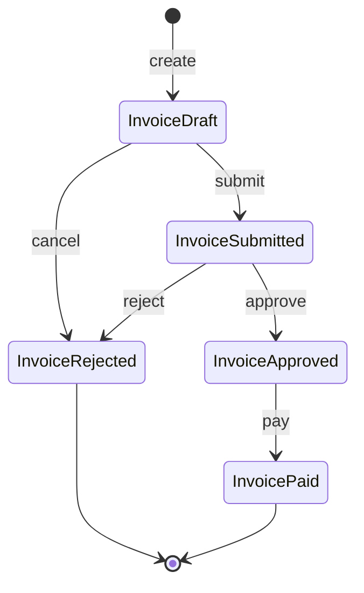




```rust
// => Invoice state types mirror the PurchaseOrder typestate idiom from beginner examples
// => Each state is a distinct zero-size struct — no data, no runtime overhead

pub struct InvoiceDraft;
// => Zero-size type: PhantomData<InvoiceDraft> occupies 0 bytes
pub struct InvoiceSubmitted;
// => Submitted means the supplier has sent the invoice for review
pub struct InvoiceApproved;
// => Approved by an authorised finance reviewer
pub struct InvoicePaid;
// => Payment has been issued; terminal state
pub struct InvoiceRejected;
// => Rejected or cancelled; terminal state — no further transitions allowed

use chrono::{DateTime, Utc};
use rust_decimal::Decimal;
use std::marker::PhantomData;

// => PhantomData<S> carries the state type at compile time without occupying memory
// => The type parameter S is the ONLY runtime-free enforcement mechanism
#[derive(Debug, Clone)]
pub struct Invoice<S> {
    // => Each field is real data; S is purely compile-time
    pub id: String,
    // => po_id links this invoice to the originating PurchaseOrder aggregate
    pub po_id: String,
    pub supplier_id: String,
    // => amount is the total invoice value in the supplier's currency
    pub amount: Decimal,
    pub created_at: DateTime<Utc>,
    // => _state: PhantomData<S> makes the compiler track which state struct is active
    // => Without this field the type parameter would be unconstrained (compile error)
    _state: PhantomData<S>,
}
// => Invoice lifecycle is independent from PurchaseOrder lifecycle
// => A PO can be in Received state while its Invoice is still in Draft
```




```go
// => Go models state as a string constant; no compile-time enforcement
// => looplab/fsm v1.0.3 enforces transitions at runtime via event table
package invoice

import (
    "context"
    "time"

    "github.com/looplab/fsm"
)

// => String constants define the valid Invoice states
// => Using typed constants prevents raw string bugs at call sites
type InvoiceStatus string

const (
    // => InvoiceDraft is the initial state after creation
    InvoiceDraft     InvoiceStatus = "draft"
    InvoiceSubmitted InvoiceStatus = "submitted"
    // => InvoiceApproved requires passing the three-way match guard
    InvoiceApproved  InvoiceStatus = "approved"
    InvoicePaid      InvoiceStatus = "paid"
    // => InvoiceRejected is reachable from both Draft (cancel) and Submitted (reject)
    InvoiceRejected  InvoiceStatus = "rejected"
)

// => Invoice holds domain data plus the FSM instance that enforces transitions
type Invoice struct {
    ID         string
    POID       string
    SupplierID string
    Amount     float64
    CreatedAt  time.Time
    // => FSM is the looplab state machine — carries current state and event table
    FSM        *fsm.FSM
}
```




> **Key takeaway**: Rust encodes the Invoice lifecycle entirely in the type system; Go encodes it in a runtime event table — both correctly prevent illegal transitions.

---

### Example 26: Creating a Draft Invoice

The factory function establishes the entry point for the Invoice lifecycle. In Rust the return type `Invoice<InvoiceDraft>` is part of the function signature — it is impossible to construct an `Invoice<InvoiceApproved>` directly. In Go the looplab FSM is wired with all transitions at construction time, so the runtime guard is in place before any event fires.

```mermaid
stateDiagram-v2
    [*] --> InvoiceDraft: Invoice::create/CreateInvoice
```




```rust
// => impl Invoice<InvoiceDraft> scopes methods to the Draft state only
impl Invoice<InvoiceDraft> {
    // => Factory function: only way to produce an Invoice value
    // => Return type Invoice<InvoiceDraft> is a compile-time guarantee
    pub fn create(
        id: String,
        po_id: String,
        supplier_id: String,
        amount: Decimal,
    ) -> Invoice<InvoiceDraft> {
        // => Construct the struct; _state is PhantomData — zero memory
        Invoice {
            id,
            po_id,
            supplier_id,
            amount,
            // => created_at captured at construction for audit trail
            created_at: Utc::now(),
            // => PhantomData::<InvoiceDraft> is the only way to set S = InvoiceDraft
            _state: PhantomData,
        }
    }
    // => No other constructor exists — callers cannot skip the Draft entry state
}
```




```go
// => NewInvoice builds the Invoice struct and wires the looplab FSM
func NewInvoice(id, poID, supplierID string, amount float64) *Invoice {
    inv := &Invoice{
        ID:         id,
        POID:       poID,
        SupplierID: supplierID,
        Amount:     amount,
        // => CreatedAt recorded at construction for audit trail
        CreatedAt:  time.Now(),
    }

    // => fsm.NewFSM takes (initialState, events, callbacks)
    // => All valid transitions declared here; any undeclared event returns error
    inv.FSM = fsm.NewFSM(
        string(InvoiceDraft),
        fsm.Events{
            // => submit: Draft → Submitted (supplier sends invoice for review)
            {Name: "submit",  Src: []string{"draft"},      Dst: "submitted"},
            // => approve: Submitted → Approved (guard must pass first)
            {Name: "approve", Src: []string{"submitted"},  Dst: "approved"},
            // => pay: Approved → Paid
            {Name: "pay",     Src: []string{"approved"},   Dst: "paid"},
            // => reject: Submitted → Rejected
            {Name: "reject",  Src: []string{"submitted"},  Dst: "rejected"},
            // => cancel: Draft → Rejected (supplier withdraws before submission)
            {Name: "cancel",  Src: []string{"draft"},      Dst: "rejected"},
        },
        fsm.Callbacks{},
    )
    // => FSM starts in "draft"; no events fired yet
    return inv
}
```




> **Key takeaway**: Both approaches make it impossible to produce a valid invoice in any state other than Draft — Rust via the type system, Go via FSM initialisation.

---

### Example 27: Draft → Submitted

The submit transition represents the supplier formally presenting the invoice for approval. In Rust, `submit(self)` consumes the Draft invoice — the caller cannot hold a reference to the old Draft after calling submit. In Go, `FSM.Event(ctx, "submit")` returns an error if the current state is not "draft".

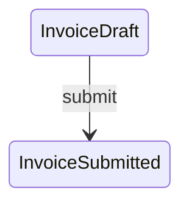




```rust
// => Methods on Invoice<InvoiceDraft> are only callable when S = InvoiceDraft
impl Invoice<InvoiceDraft> {
    // => submit(self) CONSUMES the Draft invoice — moved, not borrowed
    // => After this call, the variable that held the Draft value is gone
    pub fn submit(self) -> Invoice<InvoiceSubmitted> {
        Invoice {
            // => Move each field into the new struct; no clone required
            id:          self.id,
            po_id:       self.po_id,
            supplier_id: self.supplier_id,
            amount:      self.amount,
            created_at:  self.created_at,
            // => _state: PhantomData now encodes S = InvoiceSubmitted
            // => The compiler verifies this type change at the call site
            _state:      PhantomData,
        }
    }
}
// => Calling draft.submit() twice is a compile error: value used after move
```




```go
// => Submit fires the "submit" event on the invoice FSM
func (inv *Invoice) Submit(ctx context.Context) error {
    // => FSM.Event checks current state against allowed source states
    // => Returns fsm.InvalidEventError if current state is not "draft"
    err := inv.FSM.Event(ctx, "submit")
    if err != nil {
        // => Wrap error for context — caller sees which invoice failed
        return fmt.Errorf("invoice %s submit failed: %w", inv.ID, err)
    }
    // => FSM.Current() is now "submitted"; the struct's state is updated in place
    return nil
}
// => Unlike Rust, the same *Invoice pointer is used before and after the transition
// => Go relies on runtime FSM guard; Rust relies on compile-time type change
```




> **Key takeaway**: Rust's move semantics eliminate the "stale reference" class of bug; Go's runtime FSM guard catches invalid transitions at the point of the Event call.

---

### Example 28: Submitted → Approved (with approver)

Approval records who authorised the invoice — a mandatory audit requirement in Procure-to-Pay. In Rust, the approver identity can be stored by enriching the struct or via a separate audit log; here the transition captures the name in a log callback. In Go, looplab's `AfterEvent` callback fires after the state change and can persist audit data.

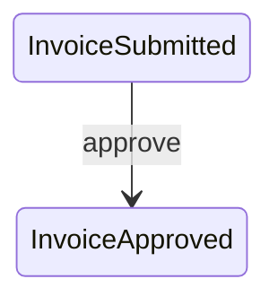




```rust
// => InvoiceApproved carries extra audit data compared to InvoiceSubmitted
// => approved_by is baked into the type — you cannot have an ApprovedInvoice without it
#[derive(Debug, Clone)]
pub struct Invoice<S> {
    pub id:          String,
    pub po_id:       String,
    pub supplier_id: String,
    pub amount:      Decimal,
    pub created_at:  DateTime<Utc>,
    // => approved_by is Some after approval, None before
    // => Optional avoids a separate ApprovedInvoice struct for this single field
    pub approved_by: Option<String>,
    _state:          PhantomData<S>,
}

impl Invoice<InvoiceSubmitted> {
    // => approve(self, approved_by) CONSUMES the Submitted invoice
    // => Returns Invoice<InvoiceApproved>; caller cannot reuse the Submitted value
    pub fn approve(self, approved_by: String) -> Invoice<InvoiceApproved> {
        Invoice {
            id:          self.id,
            po_id:       self.po_id,
            supplier_id: self.supplier_id,
            amount:      self.amount,
            created_at:  self.created_at,
            // => Audit field populated here — mandatory for compliance
            approved_by: Some(approved_by),
            _state:      PhantomData,
        }
    }
}
```




```go
// => Add ApprovedBy field to Invoice for audit trail
type Invoice struct {
    ID         string
    POID       string
    SupplierID string
    Amount     float64
    CreatedAt  time.Time
    // => ApprovedBy populated when "approve" event fires
    ApprovedBy string
    FSM        *fsm.FSM
}

// => Approve fires "approve" event and records approver identity
func (inv *Invoice) Approve(ctx context.Context, approvedBy string) error {
    // => looplab FSM checks current state == "submitted" before transitioning
    err := inv.FSM.Event(ctx, "approve")
    if err != nil {
        return fmt.Errorf("invoice %s approve failed: %w", inv.ID, err)
    }
    // => Record approver after successful transition
    // => In production this would also write an audit log entry
    inv.ApprovedBy = approvedBy
    return nil
}
// => Alternatively, use fsm.Callbacks{"after_approve": ...} in NewFSM
// => Callback approach keeps approve logic centralised in the constructor
```




> **Key takeaway**: Approval is both a state transition and an audit event — the approver identity must travel with the transition, not be set separately.

---

### Example 29: Approved → Paid

Payment closes the invoice lifecycle with a bank transfer reference required for reconciliation. The `PaymentReference` newtype in Rust prevents accidentally passing any string where a payment reference is expected — a newtype wrapper costs nothing at runtime.

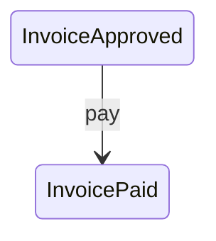




```rust
// => PaymentReference is a newtype over String
// => Newtypes prevent accidental mix-up of domain strings (invoice ID vs payment ref)
#[derive(Debug, Clone)]
pub struct PaymentReference(pub String);
// => The inner String is accessible as payment_ref.0 or via pub field

impl Invoice<InvoiceApproved> {
    // => pay(self, payment_ref) CONSUMES the Approved invoice
    // => Only Invoice<InvoiceApproved> has this method — Submitted or Draft cannot pay
    pub fn pay(self, payment_ref: PaymentReference) -> Invoice<InvoicePaid> {
        // => In a richer struct we would store payment_ref for reconciliation
        // => Here PhantomData transition is the key demonstration
        Invoice {
            id:          self.id,
            po_id:       self.po_id,
            supplier_id: self.supplier_id,
            amount:      self.amount,
            created_at:  self.created_at,
            approved_by: self.approved_by,
            // => _state now encodes InvoicePaid — terminal, no further methods
            _state:      PhantomData,
        }
    }
}
// => Invoice<InvoicePaid> has no transition methods defined — it is terminal
// => Attempting approved_invoice.pay(...).pay(...) is a compile error
```




```go
// => PaymentRef is a simple string alias in Go — newtypes require type definitions
type PaymentRef string

// => Pay fires the "pay" event and records the bank transfer reference
func (inv *Invoice) Pay(ctx context.Context, ref PaymentRef) error {
    // => FSM checks current state == "approved" before allowing "pay"
    // => Attempting to pay a "submitted" invoice returns InvalidEventError
    err := inv.FSM.Event(ctx, "pay")
    if err != nil {
        return fmt.Errorf("invoice %s pay failed: %w", inv.ID, err)
    }
    // => PaymentRef stored for bank reconciliation
    inv.PaymentRef = string(ref)
    return nil
}
// => Go type alias `type PaymentRef string` is weaker than Rust's newtype
// => In Go you can still pass a raw string with a cast; Rust requires PaymentReference(...)
```




> **Key takeaway**: Newtypes like `PaymentReference` encode domain intent at the type level — the compiler rejects passing an invoice ID where a payment reference is required.

---

### Example 30: Rejection from Submitted (and Cancellation from Draft)

Two separate source states lead to the same `InvoiceRejected` terminal state — the reason string differs by context. In Rust, separate `impl` blocks for `Invoice<InvoiceDraft>` and `Invoice<InvoiceSubmitted>` each define the relevant terminal transition. In Go both paths are declared in the FSM event table.

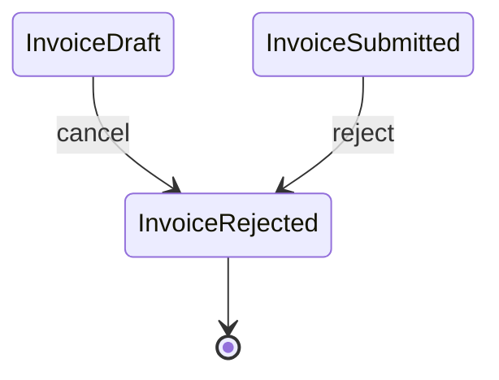




```rust
// => Two distinct impl blocks enforce that only the correct source state can reject
// => The compiler rejects calling cancel() on an InvoiceSubmitted value

impl Invoice<InvoiceDraft> {
    // => cancel() on Draft: supplier withdraws before submission
    // => Reason string required for audit — "supplier error", "duplicate", etc.
    pub fn cancel(self, reason: String) -> Invoice<InvoiceRejected> {
        Invoice {
            id:          self.id,
            po_id:       self.po_id,
            supplier_id: self.supplier_id,
            amount:      self.amount,
            created_at:  self.created_at,
            approved_by: None,
            // => _state encodes InvoiceRejected — no further transitions possible
            _state:      PhantomData,
        }
    }
}

impl Invoice<InvoiceSubmitted> {
    // => reject() on Submitted: finance reviewer rejects after review
    // => Same return type InvoiceRejected — both paths converge here
    pub fn reject(self, reason: String) -> Invoice<InvoiceRejected> {
        Invoice {
            id:          self.id,
            po_id:       self.po_id,
            supplier_id: self.supplier_id,
            amount:      self.amount,
            created_at:  self.created_at,
            approved_by: None,
            _state:      PhantomData,
        }
    }
}
// => Invoice<InvoiceRejected> has no methods — terminal state enforced by absence of impl
```




```go
// => Both paths (cancel and reject) are declared in the FSM event table at construction
// => looplab prevents calling "cancel" from "submitted" or "reject" from "draft"

// => Reject fires from "submitted" state
func (inv *Invoice) Reject(ctx context.Context, reason string) error {
    // => FSM checks Src: []string{"submitted"} — returns error if state != "submitted"
    err := inv.FSM.Event(ctx, "reject")
    if err != nil {
        return fmt.Errorf("invoice %s reject failed: %w", inv.ID, err)
    }
    inv.RejectionReason = reason
    return nil
}

// => Cancel fires from "draft" state — supplier withdraws early
func (inv *Invoice) Cancel(ctx context.Context, reason string) error {
    // => FSM checks Src: []string{"draft"} — returns error if state != "draft"
    err := inv.FSM.Event(ctx, "cancel")
    if err != nil {
        return fmt.Errorf("invoice %s cancel failed: %w", inv.ID, err)
    }
    inv.RejectionReason = reason
    return nil
}
// => Both methods leave inv.FSM.Current() == "rejected" after success
```




> **Key takeaway**: Converging two source states to one terminal state is natural in both the typestate model (separate impl blocks, same return type) and the event-table model (two events, same Dst).

---

## Three-Way Match Guards (Examples 31–36)

### Example 31: MatchGuard Trait / Interface

Three-way match guards are pluggable strategies that each validate one dimension of the PO / GRN / Invoice alignment before allowing the approve transition. Defining a common interface means new guard types can be added without modifying existing guards or the approval method.

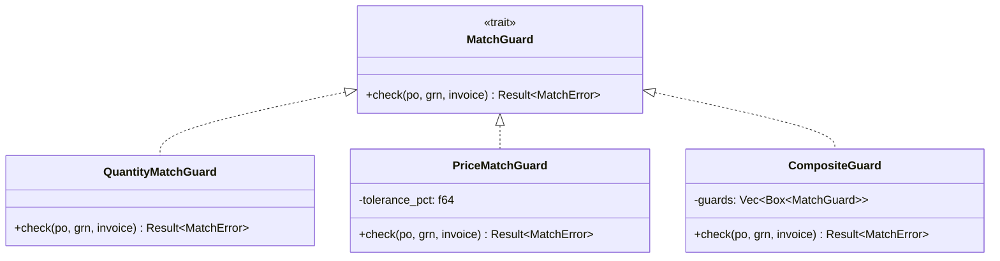




```rust
// => MatchGuard is a trait — defines the contract for all guard implementations
// => Any struct implementing check() can be used wherever MatchGuard is required
pub trait MatchGuard {
    // => &self: guard holds configuration (tolerance_pct) but no mutable state
    // => po, grn, invoice are borrowed — guard does not take ownership
    fn check(
        &self,
        po:      &PurchaseOrder,
        grn:     &GoodsReceiptNote,
        // => Invoice<InvoiceSubmitted> at the type level: only submitted invoices need matching
        // => Passing an Invoice<InvoiceDraft> here is a compile error
        invoice: &Invoice<InvoiceSubmitted>,
    ) -> Result<(), MatchError>;
}
// => Pure function contract: no mutation, returns structured error on mismatch
// => Open/Closed principle: add new guard types without changing existing code
```




```go
// => MatchGuard is a Go interface — any type implementing Check satisfies it
// => Go interfaces are satisfied implicitly — no "implements" keyword required
type MatchGuard interface {
    // => Check returns nil on success, error on any mismatch
    // => Error carries structured context (which line, expected vs actual)
    Check(
        po      *PurchaseOrder,
        grn     *GoodsReceiptNote,
        invoice *Invoice,
    ) error
}
// => In Go, Invoice is not statically typed to InvoiceSubmitted
// => Guard implementations should verify FSM.Current() == "submitted" defensively
// => This is the runtime-vs-compile-time difference in a single interface definition
```




> **Key takeaway**: A guard trait/interface decouples matching strategy from the transition logic — the approve method knows nothing about quantity tolerances or price rules.

---

### Example 32: QuantityMatchGuard

The quantity guard iterates every PO line item, finds the matching GRN receipt, and checks that the received quantity is within a configurable tolerance percentage. A tolerance is necessary because physical goods may be received with minor discrepancies due to measurement or packing rounding.

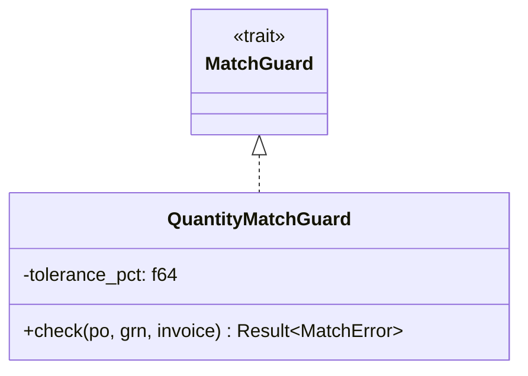




```rust
// => QuantityMatchGuard holds the acceptable tolerance as a fraction (0.05 = 5%)
pub struct QuantityMatchGuard {
    pub tolerance_pct: f64,
}

impl MatchGuard for QuantityMatchGuard {
    fn check(
        &self,
        po:      &PurchaseOrder,
        grn:     &GoodsReceiptNote,
        invoice: &Invoice<InvoiceSubmitted>,
    ) -> Result<(), MatchError> {
        // => Iterate every line item on the PO — each must be checked independently
        for line in &po.line_items {
            // => Find the corresponding GRN receipt line by line_item_id
            let received = grn
                .received_items
                .iter()
                .find(|r| r.line_item_id == line.id);

            // => If GRN has no entry for this line, treat received qty as zero
            let received_qty = received
                .map(|r| r.qty_received)
                .unwrap_or(0.0);

            let expected_qty = line.qty;
            // => Compute absolute deviation as fraction of expected quantity
            let deviation = (received_qty - expected_qty).abs() / expected_qty;

            // => If deviation exceeds tolerance, return structured mismatch error
            if deviation > self.tolerance_pct {
                return Err(MatchError::QuantityMismatch {
                    po_line_id: line.id.clone(),
                    expected:   expected_qty,
                    actual:     received_qty,
                });
            }
        }
        // => All lines passed — return unit Ok
        Ok(())
    }
}
// => Early return on first mismatch — caller sees the first failing line, not all failures
```




```go
// => QuantityMatchGuard holds tolerance as a percentage (0.05 = 5%)
type QuantityMatchGuard struct {
    TolerancePct float64
}

// => Check implements MatchGuard — iterates PO lines, compares against GRN receipts
func (g *QuantityMatchGuard) Check(
    po      *PurchaseOrder,
    grn     *GoodsReceiptNote,
    invoice *Invoice,
) error {
    // => Build a lookup map from GRN for O(1) access by line item ID
    received := make(map[string]float64)
    for _, item := range grn.ReceivedItems {
        received[item.LineItemID] = item.QtyReceived
    }

    for _, line := range po.LineItems {
        // => Default received quantity is zero if GRN has no matching entry
        receivedQty := received[line.ID]
        expectedQty := line.Qty

        // => Compute deviation as fraction of expected
        deviation := math.Abs(receivedQty-expectedQty) / expectedQty
        if deviation > g.TolerancePct {
            // => Return error on first failing line — structured for UI display
            return &MatchError{
                Kind:      QuantityMismatch,
                POLineID:  line.ID,
                Expected:  fmt.Sprintf("%.2f", expectedQty),
                Actual:    fmt.Sprintf("%.2f", receivedQty),
            }
        }
    }
    return nil
}
```




> **Key takeaway**: A configurable tolerance percentage makes the guard realistic for physical procurement where minor quantity deviations are expected and acceptable.

---

### Example 33: PriceMatchGuard

The price guard compares PO unit prices against the invoice's line-level amounts. Price mismatches often indicate renegotiated terms that require fresh approval, so the guard is kept separate from the quantity guard — they can be applied independently.

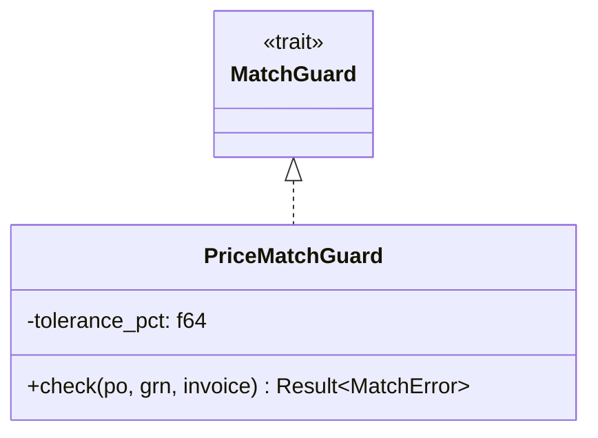




```rust
// => PriceMatchGuard is structurally identical to QuantityMatchGuard but checks price
// => Keeping them separate allows applying only price matching in some workflows
pub struct PriceMatchGuard {
    pub tolerance_pct: f64,
}

impl MatchGuard for PriceMatchGuard {
    fn check(
        &self,
        po:      &PurchaseOrder,
        grn:     &GoodsReceiptNote,
        invoice: &Invoice<InvoiceSubmitted>,
    ) -> Result<(), MatchError> {
        // => grn is passed for interface compatibility but price guard ignores it
        // => Price is compared between PO line unit price and invoice line amount
        for line in &po.line_items {
            // => Find the matching invoice line by PO line ID
            let inv_line = invoice
                .line_items
                .iter()
                .find(|l| l.po_line_id == line.id);

            let inv_price = inv_line
                .map(|l| l.unit_price)
                .unwrap_or(0.0);

            let po_price = line.unit_price;
            // => Price deviation computed as fraction of PO price
            let deviation = (inv_price - po_price).abs() / po_price;

            if deviation > self.tolerance_pct {
                return Err(MatchError::PriceMismatch {
                    po_line_id: line.id.clone(),
                    po_price,
                    invoice_price: inv_price,
                });
            }
        }
        Ok(())
    }
}
// => Price tolerance is configurable per organisation policy (e.g. 2% for FMCG, 0% for finance)
```




```go
// => PriceMatchGuard checks invoice line prices against PO unit prices
type PriceMatchGuard struct {
    TolerancePct float64
}

// => Check implements MatchGuard — compares PO price vs invoice line price
func (g *PriceMatchGuard) Check(
    po      *PurchaseOrder,
    grn     *GoodsReceiptNote,
    invoice *Invoice,
) error {
    // => Build invoice line lookup by PO line ID
    invLines := make(map[string]float64)
    for _, l := range invoice.LineItems {
        invLines[l.POLineID] = l.UnitPrice
    }

    for _, line := range po.LineItems {
        invPrice := invLines[line.ID]
        poPrice  := line.UnitPrice

        // => Guard against division by zero on free items
        if poPrice == 0 {
            continue
        }
        deviation := math.Abs(invPrice-poPrice) / poPrice
        if deviation > g.TolerancePct {
            return &MatchError{
                Kind:     PriceMismatch,
                POLineID: line.ID,
                Expected: fmt.Sprintf("%.4f", poPrice),
                Actual:   fmt.Sprintf("%.4f", invPrice),
            }
        }
    }
    return nil
}
// => Separated from QuantityMatchGuard — some systems only enforce price matching, not qty
```




> **Key takeaway**: Separating price and quantity guards enables configuring match rules per procurement category — consumables may accept 5% quantity variance but zero price variance.

---

### Example 34: CompositeGuard — All Guards Must Pass

The composite guard aggregates a list of guards and runs them in sequence. It is itself a `MatchGuard`, enabling recursive composition — a composite of composites is valid. The fail-fast variant returns on the first error; a collect-all variant returns all failures for display to the user.

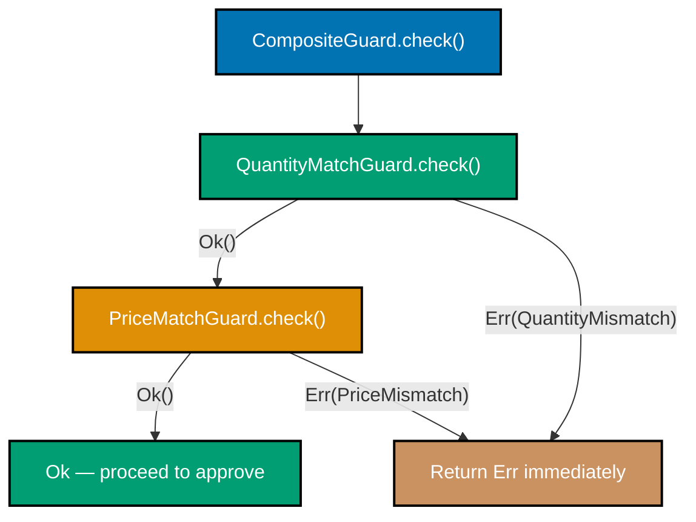




```rust
// => CompositeGuard holds an owned Vec of boxed trait objects
// => Box<dyn MatchGuard> enables heterogeneous guard types in the same Vec
pub struct CompositeGuard {
    guards: Vec<Box<dyn MatchGuard>>,
}

impl CompositeGuard {
    pub fn new() -> Self {
        CompositeGuard { guards: Vec::new() }
    }

    // => add() takes self by value and returns self — builder/fluent pattern
    // => allows CompositeGuard::new().add(qty_guard).add(price_guard)
    pub fn add(mut self, guard: impl MatchGuard + 'static) -> Self {
        // => Box::new allocates on the heap; dyn dispatch at runtime
        self.guards.push(Box::new(guard));
        self
    }
}

impl MatchGuard for CompositeGuard {
    fn check(
        &self,
        po:      &PurchaseOrder,
        grn:     &GoodsReceiptNote,
        invoice: &Invoice<InvoiceSubmitted>,
    ) -> Result<(), MatchError> {
        for g in &self.guards {
            // => ? operator: if g.check() returns Err, propagate immediately
            // => Fail-fast: first failure stops further guard evaluation
            g.check(po, grn, invoice)?;
        }
        // => All guards passed
        Ok(())
    }
}
// => CompositeGuard itself implements MatchGuard — composites can nest
```




```go
// => CompositeGuard holds a slice of MatchGuard implementations
type CompositeGuard struct {
    guards []MatchGuard
}

// => NewCompositeGuard accepts variadic guards for convenient construction
func NewCompositeGuard(guards ...MatchGuard) *CompositeGuard {
    return &CompositeGuard{guards: guards}
}

// => Check runs all guards; this variant collects ALL errors for UI display
func (c *CompositeGuard) Check(
    po      *PurchaseOrder,
    grn     *GoodsReceiptNote,
    invoice *Invoice,
) error {
    var errs []error
    for _, g := range c.guards {
        // => Run every guard regardless of earlier failures
        if err := g.Check(po, grn, invoice); err != nil {
            errs = append(errs, err)
        }
    }
    if len(errs) > 0 {
        // => errors.Join (Go 1.20+) combines multiple errors into one
        return errors.Join(errs...)
    }
    return nil
}
// => Collect-all variant shows all mismatches at once — better UX for batch correction
```




> **Key takeaway**: The composite pattern makes guard chains open for extension — add a new tolerance rule by writing a new guard and inserting it into the composite, with no changes to existing code.

---

### Example 35: MatchError Types

Structured error types carry the context needed to display actionable messages to the supplier. Generic error strings force the UI layer to parse strings; typed variants allow the UI to render a table of mismatches with line-level detail.

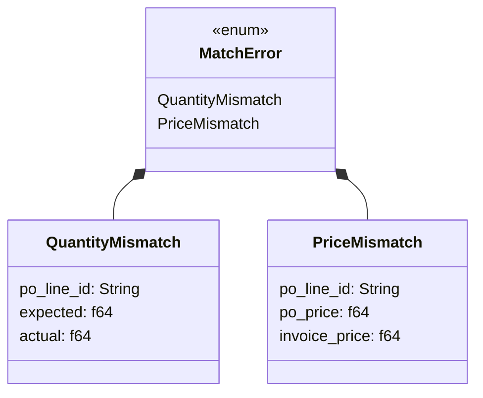




```rust
// => thiserror::Error derives Display and std::error::Error automatically
// => #[error("...")] attribute defines the Display format per variant
#[derive(Debug, thiserror::Error)]
pub enum MatchError {
    // => QuantityMismatch carries exactly the data the supplier needs to correct the invoice
    #[error(
        "quantity mismatch on line {po_line_id}: \
         expected {expected:.2}, received {actual:.2}"
    )]
    QuantityMismatch {
        po_line_id: String,
        expected:   f64,
        // => actual is what the GRN recorded — independent of what the invoice says
        actual:     f64,
    },

    // => PriceMismatch distinguishes PO price from what the supplier charged
    #[error(
        "price mismatch on line {po_line_id}: \
         PO price {po_price:.4}, invoice price {invoice_price:.4}"
    )]
    PriceMismatch {
        po_line_id:    String,
        po_price:      f64,
        // => invoice_price is what the supplier charged — subject to renegotiation
        invoice_price: f64,
    },
}
// => Structured error variants enable pattern matching in tests and error handling
```




```go
// => MatchErrorKind is an int enum distinguishing error categories
type MatchErrorKind int

const (
    // => iota assigns sequential ints — QuantityMismatch = 0, PriceMismatch = 1
    QuantityMismatch MatchErrorKind = iota
    PriceMismatch
)

// => MatchError carries all context needed for UI display and logging
type MatchError struct {
    Kind     MatchErrorKind
    POLineID string
    // => Expected and Actual are pre-formatted strings for display
    Expected string
    Actual   string
}

// => Error() implements the error interface
func (e *MatchError) Error() string {
    kind := "quantity"
    if e.Kind == PriceMismatch {
        kind = "price"
    }
    // => Structured message: kind + line ID + expected vs actual
    return fmt.Sprintf(
        "%s mismatch on line %s: expected %s, got %s",
        kind, e.POLineID, e.Expected, e.Actual,
    )
}
// => Go lacks enum discriminants — use Kind field for switch-based pattern matching
```




> **Key takeaway**: Typed error variants let both the supplier portal and the finance dashboard display precise, actionable mismatch details without parsing error strings.

---

### Example 36: Guard Execution Before State Transition

The approve transition is gated behind the guard: the guard runs first, and only if it passes does the state change occur. This atomic check-and-transition means there is no window in which an invoice can appear approved but unverified.

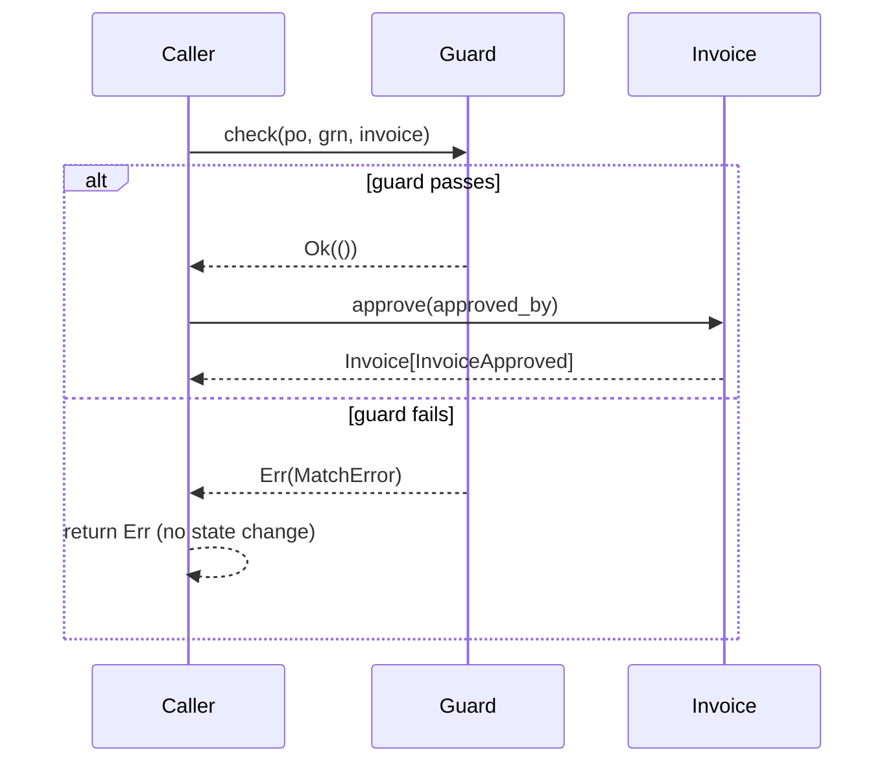




```rust
// => approve_after_match combines guard check and state transition atomically
// => Returns Result: Ok carries the new InvoiceApproved, Err carries MatchError
impl Invoice<InvoiceSubmitted> {
    pub fn approve_after_match(
        self,
        guard:       &impl MatchGuard,
        po:          &PurchaseOrder,
        grn:         &GoodsReceiptNote,
        approved_by: String,
    ) -> Result<Invoice<InvoiceApproved>, MatchError> {
        // => guard.check() returns Err(MatchError) if any dimension mismatches
        // => ? propagates the error — self is NOT consumed if guard fails
        guard.check(po, grn, &self)?;

        // => Guard passed — consume self and return the new approved type
        Ok(Invoice {
            id:          self.id,
            po_id:       self.po_id,
            supplier_id: self.supplier_id,
            amount:      self.amount,
            created_at:  self.created_at,
            approved_by: Some(approved_by),
            _state:      PhantomData,
        })
    }
}
// => If guard.check() fails, self is still valid — caller can log and retry or reject
// => Rust ownership: ? does not consume self when it short-circuits
```




```go
// => ApproveAfterMatch gates the "approve" FSM event behind the guard check
func (svc *InvoiceService) ApproveAfterMatch(
    ctx        context.Context,
    inv        *Invoice,
    po         *PurchaseOrder,
    grn        *GoodsReceiptNote,
    guard      MatchGuard,
    approvedBy string,
) error {
    // => Run guard first — if it fails, FSM state is NOT changed
    if err := guard.Check(po, grn, inv); err != nil {
        return fmt.Errorf("three-way match failed: %w", err)
    }

    // => Guard passed — fire the approve event
    if err := inv.FSM.Event(ctx, "approve"); err != nil {
        return fmt.Errorf("approve transition failed: %w", err)
    }

    // => Record approver after successful state change
    inv.ApprovedBy = approvedBy
    return nil
}
// => Atomicity note: guard + FSM event are two separate operations
// => In production, wrap in a DB transaction to prevent partial commits
```




> **Key takeaway**: Running the guard inside the approve method — not before calling it — guarantees no approved invoice exists without passing all match checks.

---

## Cross-Machine Coordination (Examples 37–42)

### Example 37: POInvoiceCoordinator

The coordinator is an application service that holds references to the PO, Invoice, and GRN repositories and orchestrates cross-aggregate workflows. It contains no domain state of its own — its job is to fetch aggregates, run guards, and persist results. Dependencies are injected as interfaces/traits, enabling substitution for testing.

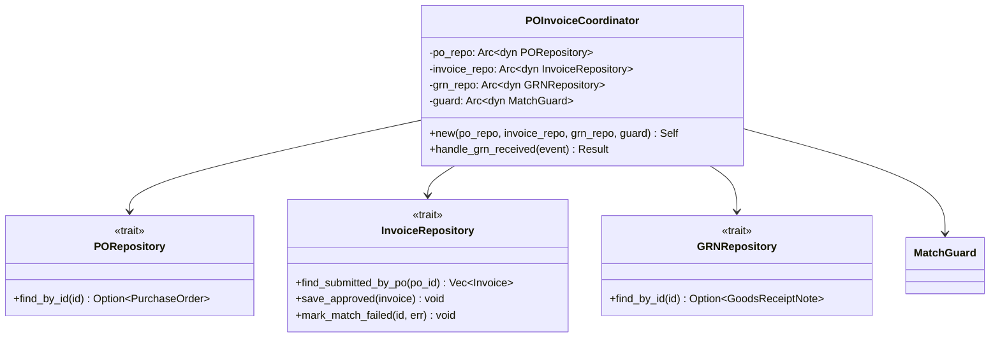




```rust
use std::sync::Arc;

// => Arc<dyn Trait + Send + Sync> is the idiomatic shared reference for async Rust
// => Arc = atomic reference count; Send + Sync required for multi-threaded runtimes (Tokio)
pub struct POInvoiceCoordinator {
    // => po_repo behind Arc<dyn> — injectable, testable, shareable across tasks
    po_repo:      Arc<dyn PORepository + Send + Sync>,
    invoice_repo: Arc<dyn InvoiceRepository + Send + Sync>,
    grn_repo:     Arc<dyn GRNRepository + Send + Sync>,
    // => guard is shared — same guard instance for all invocations, no state
    guard:        Arc<dyn MatchGuard + Send + Sync>,
}

impl POInvoiceCoordinator {
    // => Constructor accepts owned Arc values — caller controls lifetime
    pub fn new(
        po_repo:      Arc<dyn PORepository + Send + Sync>,
        invoice_repo: Arc<dyn InvoiceRepository + Send + Sync>,
        grn_repo:     Arc<dyn GRNRepository + Send + Sync>,
        guard:        Arc<dyn MatchGuard + Send + Sync>,
    ) -> Self {
        POInvoiceCoordinator { po_repo, invoice_repo, grn_repo, guard }
    }
}
// => Coordinator is application service — no domain logic, only orchestration
// => Depends on abstractions (traits), not concrete repositories
```




```go
// => POInvoiceCoordinator depends on interfaces — substitutable for testing
type POInvoiceCoordinator struct {
    poRepo      PORepository
    invoiceRepo InvoiceRepository
    grnRepo     GRNRepository
    guard       MatchGuard
}

// => NewPOInvoiceCoordinator injects all dependencies at construction
func NewPOInvoiceCoordinator(
    poRepo      PORepository,
    invoiceRepo InvoiceRepository,
    grnRepo     GRNRepository,
    guard       MatchGuard,
) *POInvoiceCoordinator {
    return &POInvoiceCoordinator{
        poRepo:      poRepo,
        invoiceRepo: invoiceRepo,
        grnRepo:     grnRepo,
        guard:       guard,
    }
}
// => Go interfaces are satisfied implicitly — any type with the right methods qualifies
// => InMemoryPORepository (test) and PostgresPORepository (production) both satisfy PORepository
```




> **Key takeaway**: The coordinator pattern separates orchestration from domain logic — each repository and guard is independently testable and replaceable.

---

### Example 38: GRN Received Event Triggers Invoice Check

When a Goods Receipt Note arrives, the coordinator fetches all submitted invoices for that PO and attempts to approve each one. Invoices that pass the guard transition to Approved; invoices that fail are explicitly marked as having failed the match — they are not silently ignored.

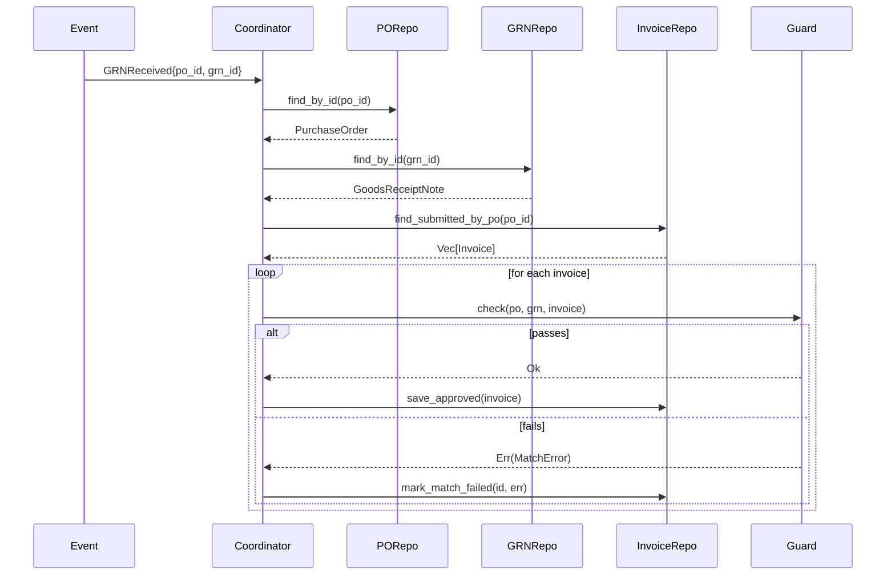




```rust
// => GRNReceived is a domain event published when a shipment is confirmed received
#[derive(Debug)]
pub struct GRNReceived {
    pub po_id:  String,
    pub grn_id: String,
}

impl POInvoiceCoordinator {
    // => async fn — repository calls are I/O and must not block the executor
    pub async fn handle_grn_received(
        &self,
        event: &GRNReceived,
    ) -> Result<(), CoordinatorError> {
        // => Fetch PO — required to run the guard
        let po = self.po_repo
            .find_by_id(&event.po_id).await?
            .ok_or(CoordinatorError::PONotFound)?;

        // => Fetch GRN — the receipt record that triggered this event
        let grn = self.grn_repo
            .find_by_id(&event.grn_id).await?
            .ok_or(CoordinatorError::GRNNotFound)?;

        // => Find all invoices in Submitted state for this PO
        // => Multiple invoices from the same supplier can exist for one PO
        let invoices = self.invoice_repo
            .find_submitted_by_po(&event.po_id).await?;

        for inv in invoices {
            match inv.approve_after_match(self.guard.as_ref(), &po, &grn, "system".into()) {
                Ok(approved) => {
                    // => Persist the new InvoiceApproved value
                    self.invoice_repo.save_approved(approved).await?;
                }
                Err(e) => {
                    // => Mark the invoice as failed — supplier must correct and resubmit
                    // => inv is still in InvoiceSubmitted state; it was not consumed
                    self.invoice_repo.mark_match_failed(inv.id.clone(), e).await?;
                }
            }
        }
        Ok(())
    }
}
// => Event-driven coordination avoids polling — triggered by domain event, not scheduler
```




```go
// => GRNReceived is the domain event payload
type GRNReceived struct {
    POID  string
    GRNID string
}

// => HandleGRNReceived is the event handler method on the coordinator
func (c *POInvoiceCoordinator) HandleGRNReceived(
    ctx   context.Context,
    event GRNReceived,
) error {
    // => Fetch PO — guard requires it for line-level comparison
    po, err := c.poRepo.FindByID(ctx, event.POID)
    if err != nil {
        return fmt.Errorf("po not found: %w", err)
    }

    // => Fetch GRN associated with this receipt event
    grn, err := c.grnRepo.FindByID(ctx, event.GRNID)
    if err != nil {
        return fmt.Errorf("grn not found: %w", err)
    }

    // => Retrieve all invoices in "submitted" state for this PO
    invoices, err := c.invoiceRepo.FindSubmittedByPO(ctx, event.POID)
    if err != nil {
        return fmt.Errorf("invoices fetch failed: %w", err)
    }

    for _, inv := range invoices {
        // => ApproveAfterMatch gates the FSM transition on guard success
        if err := c.ApproveAfterMatch(ctx, inv, po, grn, c.guard, "system"); err != nil {
            // => Mark failed — do not return early; process remaining invoices
            if markErr := c.invoiceRepo.MarkMatchFailed(ctx, inv.ID, err); markErr != nil {
                return markErr
            }
            continue
        }
        // => Persist approved invoice state
        if err := c.invoiceRepo.SaveApproved(ctx, inv); err != nil {
            return err
        }
    }
    return nil
}
// => Each invoice is processed independently — one failure does not block others
```




> **Key takeaway**: Processing every submitted invoice independently on each GRN event makes the coordinator resilient — one invoice's match failure does not prevent others from being approved.

---

### Example 39: Dual-FSM Coordination State

The coordinator tracks its own state separate from both the PO and Invoice aggregates. This coordination state captures whether a GRN has been received and whether matching has completed, enabling crash recovery and human review of stuck records.

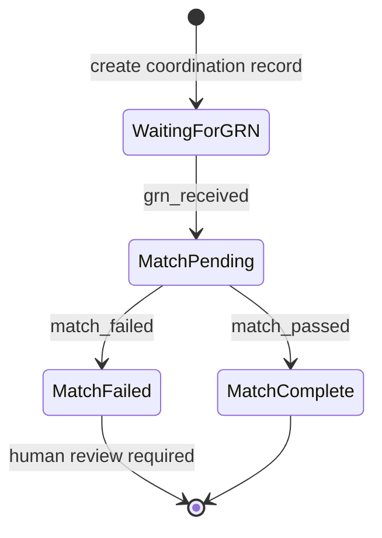




```rust
// => CoordinationState is independent of both PO and Invoice state machines
// => It models the lifecycle of the matching process itself
#[derive(Debug, Clone)]
pub enum CoordinationState {
    // => WaitingForGRN: PO received, invoice submitted, GRN not yet confirmed
    WaitingForGRN,
    // => MatchPending: GRN received, matching in progress or queued
    MatchPending { grn_id: String },
    // => MatchComplete: all submitted invoices approved successfully
    MatchComplete { approved_invoice_ids: Vec<String> },
    // => MatchFailed: one or more invoices failed the guard — human review needed
    MatchFailed { errors: Vec<String> },
}

// => MatchCoordinationRecord persists coordination state to the database
#[derive(Debug, Clone)]
pub struct MatchCoordinationRecord {
    pub po_id:      String,
    // => state enum stored as JSON or individual columns in DB
    pub state:      CoordinationState,
    pub created_at: DateTime<Utc>,
    pub updated_at: DateTime<Utc>,
}
// => Separate persistence record for coordination — not mutating PO or Invoice tables
// => Enables querying "which POs are stuck in MatchFailed?" without joining aggregates
```




```go
// => CoordinationState string enum for the matching lifecycle
type CoordinationState string

const (
    // => WaitingForGRN: invoice submitted, no GRN yet
    WaitingForGRN CoordinationState = "waiting_grn"
    // => MatchPending: GRN received, matching in progress
    MatchPending  CoordinationState = "match_pending"
    // => MatchComplete: all invoices approved
    MatchComplete CoordinationState = "match_complete"
    // => MatchFailed: guard rejection — requires supplier correction
    MatchFailed   CoordinationState = "match_failed"
)

// => MatchCoordinationRecord is a separate DB entity — its own table, own lifecycle
type MatchCoordinationRecord struct {
    POID      string
    State     CoordinationState
    // => GRNId populated when GRN received event fires
    GRNId     string
    Errors    []string
    CreatedAt time.Time
    UpdatedAt time.Time
}
// => Querying MatchFailed records surfaces work items for the AP team
// => Coordination record is append-only if using event sourcing
```




> **Key takeaway**: A dedicated coordination record decouples the matching process state from both the PO and Invoice lifecycles — it is the source of truth for the matching workflow.

---

### Example 40: Channel-Based Event Dispatch (Go)

Go channels provide a lightweight in-process event bus. A coordinator registers event handlers, and a background goroutine drains the channel and routes events to the correct handler. This pattern keeps the sender synchronous while processing asynchronous.

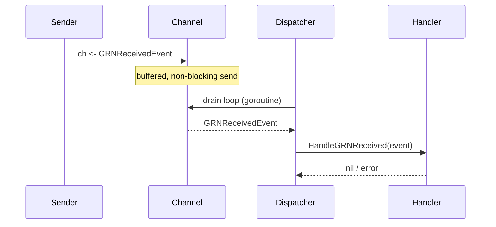




```rust
// => Rust equivalent uses Tokio's mpsc channel for async event dispatch
use tokio::sync::mpsc;

// => DomainEvent is a sum type for all publishable events
#[derive(Debug)]
pub enum DomainEvent {
    GRNReceived(GRNReceived),
    // => Additional variants added as domain grows
}

pub struct EventBus {
    // => tx is the sender half — cloned per producer
    tx: mpsc::Sender<DomainEvent>,
}

impl EventBus {
    // => Spawn a background task that drains the receiver and dispatches events
    pub fn new(coordinator: Arc<POInvoiceCoordinator>) -> Self {
        let (tx, mut rx) = mpsc::channel::<DomainEvent>(100);
        tokio::spawn(async move {
            while let Some(event) = rx.recv().await {
                match event {
                    DomainEvent::GRNReceived(e) => {
                        // => Each event processed independently; errors logged, not propagated
                        if let Err(err) = coordinator.handle_grn_received(&e).await {
                            eprintln!("coordinator error: {err}");
                        }
                    }
                }
            }
        });
        EventBus { tx }
    }

    // => publish is non-blocking if channel buffer is not full
    pub async fn publish(&self, event: DomainEvent) {
        let _ = self.tx.send(event).await;
    }
}
// => mpsc::channel(100) — 100-element buffer; back-pressure if producer outpaces consumer
```




```go
// => DomainEvent is an interface satisfied by all event types
type DomainEvent interface {
    EventType() string
}

// => EventHandler processes a single event type
type EventHandler func(ctx context.Context, event DomainEvent) error

// => EventDispatcher routes events from a buffered channel to registered handlers
type EventDispatcher struct {
    // => handlers maps event type string to a slice of handlers
    handlers map[string][]EventHandler
    // => ch is buffered — sender does not block unless buffer is full
    ch       chan DomainEvent
}

// => NewEventDispatcher creates dispatcher and starts background drain goroutine
func NewEventDispatcher(bufSize int) *EventDispatcher {
    d := &EventDispatcher{
        handlers: make(map[string][]EventHandler),
        ch:       make(chan DomainEvent, bufSize),
    }
    // => Background goroutine drains channel and dispatches to handlers
    go func() {
        for event := range d.ch {
            for _, h := range d.handlers[event.EventType()] {
                // => Each handler called synchronously within the goroutine
                if err := h(context.Background(), event); err != nil {
                    log.Printf("handler error: %v", err)
                }
            }
        }
    }()
    return d
}

// => Dispatch sends event to channel — non-blocking if buffer has space
func (d *EventDispatcher) Dispatch(event DomainEvent) {
    d.ch <- event
}
// => Buffer size should be tuned to expected event rate — 256 is a safe starting point
```




> **Key takeaway**: A buffered channel decouples event producers from consumers — the sender returns immediately and the goroutine processes events at its own pace.

---

### Example 41: Rollback on Match Failure

When a guard check fails, the invoice must remain in its current state — not silently discarded, not moved to a different state. The coordinator explicitly marks the invoice as having failed the match, preserving the audit trail and enabling the supplier to correct and resubmit.

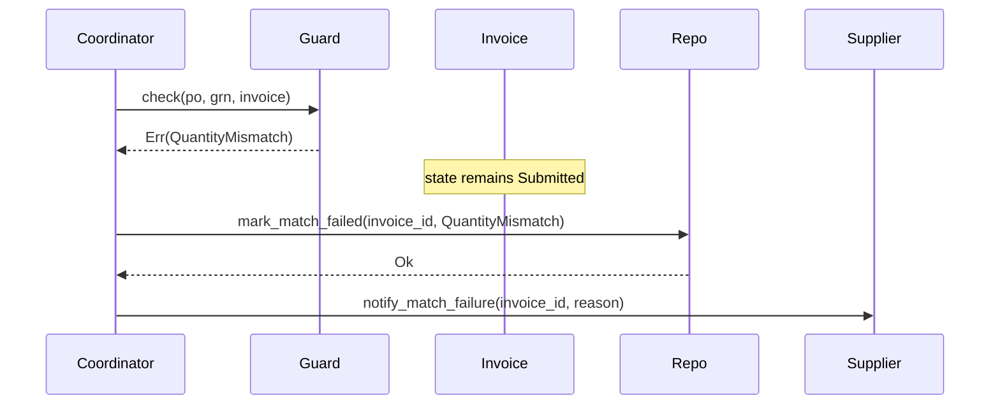




```rust
// => When approve_after_match returns Err, the invoice is still in InvoiceSubmitted
// => Rust ownership: ? inside approve_after_match returns before consuming self on error
// => The Err branch receives: inv (still Invoice<InvoiceSubmitted>), e (MatchError)

impl POInvoiceCoordinator {
    pub async fn process_single_invoice(
        &self,
        inv: Invoice<InvoiceSubmitted>,
        po:  &PurchaseOrder,
        grn: &GoodsReceiptNote,
    ) -> Result<(), CoordinatorError> {
        match inv.approve_after_match(self.guard.as_ref(), po, grn, "system".into()) {
            Ok(approved) => {
                // => Invoice consumed, new Approved value persisted
                self.invoice_repo.save_approved(approved).await?;
            }
            Err(match_err) => {
                // => inv was NOT consumed — guard returned Err before consuming self
                // => Record failure with full MatchError detail for supplier notification
                let reason = match_err.to_string();
                self.invoice_repo
                    .mark_match_failed(inv.id.clone(), match_err).await?;
                // => Notify supplier so they can correct the invoice
                // => PO stays in its current state — match failure does not cancel the PO
                self.notify_supplier_match_failed(&inv.supplier_id, &inv.id, reason).await?;
            }
        }
        Ok(())
    }
}
// => Failed invoice remains in Submitted state — supplier corrects and resubmits
// => At-least-once processing: idempotent mark_match_failed handles duplicate events
```




```go
// => ProcessSingleInvoice attempts approval and handles failure explicitly
func (c *POInvoiceCoordinator) ProcessSingleInvoice(
    ctx context.Context,
    inv *Invoice,
    po  *PurchaseOrder,
    grn *GoodsReceiptNote,
) error {
    // => ApproveAfterMatch: guard check + FSM event (atomically ordered)
    err := c.ApproveAfterMatch(ctx, inv, po, grn, c.guard, "system")
    if err != nil {
        // => inv.FSM.Current() is still "submitted" — ApproveAfterMatch failed before event
        // => Record failure with reason for supplier portal display
        if markErr := c.invoiceRepo.MarkMatchFailed(ctx, inv.ID, err); markErr != nil {
            return fmt.Errorf("mark failed error: %w", markErr)
        }
        // => Notify supplier — they must correct line items and resubmit
        if notifyErr := c.notifySupplierMatchFailed(ctx, inv.SupplierID, inv.ID, err); notifyErr != nil {
            // => Notification failure is non-fatal — log and continue
            log.Printf("notify failed: %v", notifyErr)
        }
        // => Return nil — match failure is expected, not a system error
        return nil
    }
    // => Approval succeeded — persist new state
    return c.invoiceRepo.SaveApproved(ctx, inv)
}
// => Distinguishing domain errors (match failure) from system errors (DB down) is critical
// => Match failure returns nil; DB error returns the wrapped error
```




> **Key takeaway**: Explicit failure marking preserves the audit trail and gives suppliers actionable feedback — silent discard would leave the invoice in an unknown state.

---

### Example 42: Coordinator as a State Machine

The coordinator's own lifecycle — waiting for GRN, matching, complete, or failed — is itself a state machine. Using looplab/fsm for the coordination record makes the transitions observable and auditable.

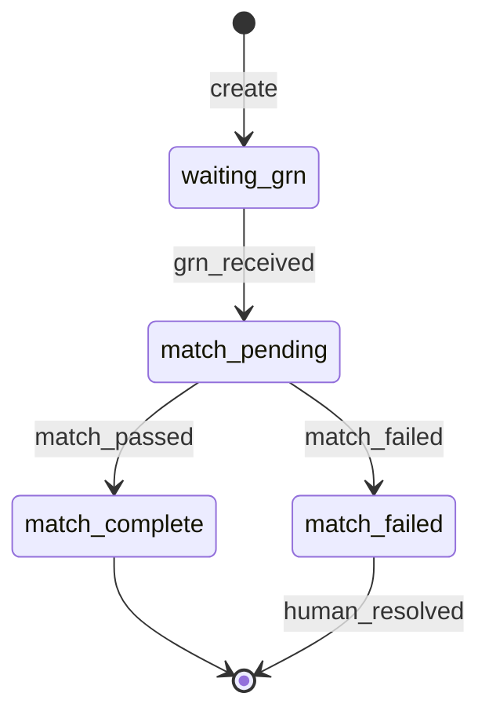




```rust
// => Rust: manual state machine for the coordination record using match
// => petgraph or a state-machine crate could be used; manual match is clear for 4 states
impl MatchCoordinationRecord {
    // => Transition WaitingForGRN → MatchPending on GRN receipt
    pub fn grn_received(self, grn_id: String) -> Result<Self, String> {
        match self.state {
            CoordinationState::WaitingForGRN => Ok(Self {
                state:      CoordinationState::MatchPending { grn_id },
                updated_at: Utc::now(),
                ..self
            }),
            // => Any other state is an invalid transition — return descriptive error
            other => Err(format!("cannot apply grn_received in state {:?}", other)),
        }
    }

    // => Transition MatchPending → MatchComplete when all invoices approved
    pub fn match_passed(self, approved_ids: Vec<String>) -> Result<Self, String> {
        match self.state {
            CoordinationState::MatchPending { .. } => Ok(Self {
                state:      CoordinationState::MatchComplete { approved_invoice_ids: approved_ids },
                updated_at: Utc::now(),
                ..self
            }),
            other => Err(format!("cannot apply match_passed in state {:?}", other)),
        }
    }
}
// => Struct update syntax `..self` copies remaining fields without naming each one
```




```go
// => Go: use looplab/fsm for the coordination record — consistent with Invoice FSM approach
func newCoordinationFSM(initial string) *fsm.FSM {
    return fsm.NewFSM(
        initial,
        fsm.Events{
            // => grn_received moves coordination from waiting to pending
            {Name: "grn_received",  Src: []string{"waiting_grn"},   Dst: "match_pending"},
            // => match_passed when all invoices approve successfully
            {Name: "match_passed",  Src: []string{"match_pending"}, Dst: "match_complete"},
            // => match_failed when any invoice fails the guard
            {Name: "match_failed",  Src: []string{"match_pending"}, Dst: "match_failed"},
            // => human_resolved closes out a failed coordination after manual review
            {Name: "human_resolved", Src: []string{"match_failed"}, Dst: "match_complete"},
        },
        fsm.Callbacks{
            // => Log every transition for observability
            "after_event": func(_ context.Context, e *fsm.Event) {
                log.Printf("coordination FSM: %s -> %s via %s", e.Src, e.Dst, e.Event)
            },
        },
    )
}
// => after_event callback fires after every successful transition — single logging point
// => Coordination FSM state persisted to DB alongside MatchCoordinationRecord
```




> **Key takeaway**: Treating the coordinator's lifecycle as an explicit state machine makes stuck records observable — a "match_failed" coordination record is a work item for the AP team.

---

## Phantom Types for Verification State (Examples 43–49)

### Example 43: Two-Dimensional Phantom Types — State + Verification

A second phantom type parameter encodes whether an invoice has passed the three-way match, independently of its lifecycle state. This two-dimensional approach lets the type system enforce that only verified invoices can be approved — without any runtime boolean check in the approve method.

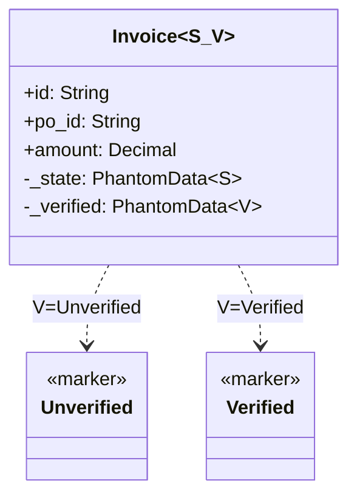




```rust
// => Two marker types encode verification status at compile time
pub struct Unverified;
// => Verified: the invoice has passed all three-way match guards
pub struct Verified;

// => Invoice now has TWO phantom type parameters: S for state, V for verification
// => Both are zero-size — no runtime memory cost
#[derive(Debug, Clone)]
pub struct Invoice<S, V> {
    pub id:          String,
    pub po_id:       String,
    pub supplier_id: String,
    pub amount:      Decimal,
    pub created_at:  DateTime<Utc>,
    pub approved_by: Option<String>,
    // => _state tracks lifecycle (Draft, Submitted, Approved, ...)
    _state:          PhantomData<S>,
    // => _verified tracks match status (Unverified, Verified) independently
    // => These two dimensions are orthogonal — state can change without changing verification
    _verified:       PhantomData<V>,
}
// => All newly created invoices start as Invoice<InvoiceDraft, Unverified>
// => The compiler enforces that V = Verified before approve() can be called
```




```go
// => Go: add Verified bool field — no compile-time enforcement possible
// => This is the honest representation of Go's type system limitations
type Invoice struct {
    ID         string
    POID       string
    SupplierID string
    Amount     float64
    CreatedAt  time.Time
    ApprovedBy string
    // => Verified is the runtime equivalent of the Rust Verified phantom type
    // => Must be checked manually in every method that requires verification
    Verified   bool
    FSM        *fsm.FSM
}
// => In Go, the discipline of "check Verified before approve" is enforced by code review
// => In Rust, it is enforced by the compiler — no code review needed for this property
// => Both approaches are correct; Rust gives earlier, more reliable feedback
```




> **Key takeaway**: Two phantom type parameters create a two-dimensional type-safe grid — the compiler tracks both lifecycle position and verification status simultaneously.

---

### Example 44: Unverified → Verified Transition

The verify_match method runs the guard and, if it passes, returns an invoice with the Verified phantom type. Only the second type parameter changes — the state remains InvoiceSubmitted. This is a pure type-level transition with no data mutation.

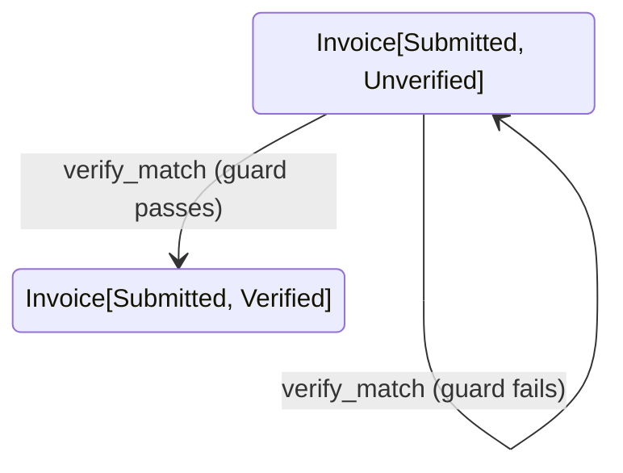




```rust
// => verify_match is defined on Invoice<InvoiceSubmitted, Unverified> specifically
// => It cannot be called on Draft or Approved invoices — wrong S parameter
impl Invoice<InvoiceSubmitted, Unverified> {
    // => verify_match consumes self and returns either Verified or MatchError
    // => The state parameter S remains InvoiceSubmitted; only V changes
    pub fn verify_match(
        self,
        guard: &impl MatchGuard,
        po:    &PurchaseOrder,
        grn:   &GoodsReceiptNote,
    ) -> Result<Invoice<InvoiceSubmitted, Verified>, MatchError> {
        // => Run the guard — if it fails, self is NOT consumed (? returns before move)
        guard.check(po, grn, &self)?;

        // => Guard passed: reconstruct with V = Verified
        Ok(Invoice {
            id:          self.id,
            po_id:       self.po_id,
            supplier_id: self.supplier_id,
            amount:      self.amount,
            created_at:  self.created_at,
            approved_by: self.approved_by,
            _state:      PhantomData,   // S = InvoiceSubmitted, unchanged
            // => PhantomData::<Verified> — this is the only field that semantically changes
            _verified:   PhantomData,   // V = Verified, upgraded from Unverified
        })
    }
}
// => After verify_match, the caller holds Invoice<InvoiceSubmitted, Verified>
// => The Unverified invoice is gone — compile error if caller tries to use it again
```




```go
// => VerifyMatch runs the guard and sets Verified = true on success
func (svc *InvoiceService) VerifyMatch(
    inv   *Invoice,
    po    *PurchaseOrder,
    grn   *GoodsReceiptNote,
    guard MatchGuard,
) error {
    // => Runtime guard check — equivalent to Rust's guard.check(po, grn, &self)
    if err := guard.Check(po, grn, inv); err != nil {
        // => Guard failed: Verified stays false, invoice state unchanged
        return fmt.Errorf("verify match failed: %w", err)
    }
    // => Guard passed: mark the invoice as verified
    inv.Verified = true
    return nil
}
// => Unlike Rust, Go does NOT prevent calling VerifyMatch on a draft invoice
// => A defensive check (inv.FSM.Current() == "submitted") should be added
// => This illustrates the gap: Go relies on developer discipline, Rust on the compiler
```




> **Key takeaway**: Separating verification from approval into two distinct type-level transitions makes the sequence `verify_match → approve` explicit and compiler-enforced in Rust.

---

### Example 45: Only Verified Invoices Can Be Approved

The `approve` method exists only on `Invoice<InvoiceSubmitted, Verified>`. There is no `approve` on `Invoice<InvoiceSubmitted, Unverified>`. In Rust, attempting to call `approve` on an unverified invoice is a compile error — not a runtime panic or a returned error, but a failure to build.

```mermaid
classDiagram
    class `Invoice[Submitted, Verified]` {
        +approve(approved_by) Invoice[Approved, Verified]
    }
    class `Invoice[Submitted, Unverified]` {
        +verify_match(guard, po, grn) Result
        %% no approve method
    }
```




```rust
// => approve is defined ONLY on Invoice<InvoiceSubmitted, Verified>
// => Invoice<InvoiceSubmitted, Unverified> has NO approve method — it simply does not exist
impl Invoice<InvoiceSubmitted, Verified> {
    // => approve(self, approved_by): consumes Verified Submitted, returns Verified Approved
    // => V = Verified is preserved through the transition — the approval carries verification
    pub fn approve(self, approved_by: String) -> Invoice<InvoiceApproved, Verified> {
        Invoice {
            id:          self.id,
            po_id:       self.po_id,
            supplier_id: self.supplier_id,
            amount:      self.amount,
            created_at:  self.created_at,
            // => approved_by recorded — S changes from Submitted to Approved
            approved_by: Some(approved_by),
            _state:      PhantomData,   // S = InvoiceApproved
            _verified:   PhantomData,   // V = Verified, unchanged
        }
    }
}

// => This function WILL NOT COMPILE — unverified.approve() does not exist
// fn bad_example(unverified: Invoice<InvoiceSubmitted, Unverified>) {
//     let _ = unverified.approve("mgr".into()); // => compile error: no method named `approve`
// }
// => The compile error is the guarantee — no runtime check needed in approve()
```




```go
// => Approve checks Verified bool — runtime equivalent of Rust's compile-time check
func (svc *InvoiceService) Approve(ctx context.Context, inv *Invoice, approvedBy string) error {
    // => Runtime guard: must be verified before approving
    // => Rust would reject this at compile time; Go rejects it at runtime
    if !inv.Verified {
        return ErrNotVerified
    }
    // => FSM checks current state == "submitted"
    if err := inv.FSM.Event(ctx, "approve"); err != nil {
        return fmt.Errorf("approve failed: %w", err)
    }
    inv.ApprovedBy = approvedBy
    return nil
}

// => ErrNotVerified is a sentinel error for unverified approval attempts
var ErrNotVerified = errors.New("invoice must pass three-way match before approval")
// => Callers switch on this error to show a specific message in the supplier portal
```




> **Key takeaway**: The absence of a method is a stronger guarantee than a method that returns an error — the compiler rejects the call before the program exists, let alone runs.

---

### Example 46: Only Approved+Verified Invoices Can Be Paid

Payment requires both the Approved lifecycle state and the Verified match status. In Rust these two requirements are expressed in the single type `Invoice<InvoiceApproved, Verified>` — no AND condition in code, just the type signature.

```mermaid
stateDiagram-v2
    state "Invoice[Draft, Unverified]" as DU
    state "Invoice[Submitted, Unverified]" as SU
    state "Invoice[Submitted, Verified]" as SV
    state "Invoice[Approved, Verified]" as AV
    state "Invoice[Paid, Verified]" as PV

    DU --> SU: submit
    SU --> SV: verify_match
    SV --> AV: approve
    AV --> PV: pay
```




```rust
// => pay is defined ONLY on Invoice<InvoiceApproved, Verified>
// => Neither Invoice<InvoiceApproved, Unverified> nor Invoice<InvoiceSubmitted, Verified> can pay
impl Invoice<InvoiceApproved, Verified> {
    pub fn pay(self, payment_ref: PaymentReference) -> Invoice<InvoicePaid, Verified> {
        // => Both S = Approved AND V = Verified are required — expressed as a single type
        // => No if-statement needed; the compiler already enforces the conjunction
        Invoice {
            id:          self.id,
            po_id:       self.po_id,
            supplier_id: self.supplier_id,
            amount:      self.amount,
            created_at:  self.created_at,
            approved_by: self.approved_by,
            // => InvoicePaid is the terminal lifecycle state
            _state:      PhantomData,   // S = InvoicePaid
            // => Verified status preserved — payment record carries verification evidence
            _verified:   PhantomData,   // V = Verified
        }
    }
}
// => The full happy path type chain: Invoice<Draft,U> → <Submitted,U> → <Submitted,V> → <Approved,V> → <Paid,V>
// => Each arrow is a consuming method call; each step is a compile-time verified transition
```




```go
// => Pay checks both Verified and that the current FSM state is "approved"
func (svc *InvoiceService) Pay(ctx context.Context, inv *Invoice, ref string) error {
    // => First check: invoice must have passed three-way match
    if !inv.Verified {
        return ErrNotVerified
    }
    // => Second check (implicit in FSM): current state must be "approved"
    // => FSM.Event returns InvalidEventError if state != "approved"
    if err := inv.FSM.Event(ctx, "pay"); err != nil {
        return fmt.Errorf("pay failed: %w", err)
    }
    inv.PaymentRef = ref
    return nil
}
// => In Rust both checks are collapsed into the type signature — zero runtime cost
// => In Go both checks are runtime — clear, but adds a conditional to every payment path
```




> **Key takeaway**: Two-dimensional phantom types express conjunctive preconditions as a single type — the compiler checks both dimensions simultaneously with no runtime overhead.

---

### Example 47: Guard Chain as Composed Trait Objects

A builder API for constructing guard chains makes the composition readable and discoverable. The fluent `add()` method returns `self`, enabling chained construction. The resulting `GuardChain` is itself a `MatchGuard`, so it can be stored behind `Arc<dyn MatchGuard>` and injected into the coordinator.

```mermaid
graph TD
    A["GuardChain::new()"]:::blue
    A -->|".add(QuantityMatchGuard)"| B["GuardChain [qty]"]:::teal
    B -->|".add(PriceMatchGuard)"| C["GuardChain [qty, price]"]:::orange
    C -->|"dyn MatchGuard"| D["POInvoiceCoordinator.guard"]:::purple

    classDef blue fill:#0173B2,stroke:#000000,color:#FFFFFF,stroke-width:2px
    classDef teal fill:#029E73,stroke:#000000,color:#FFFFFF,stroke-width:2px
    classDef orange fill:#DE8F05,stroke:#000000,color:#FFFFFF,stroke-width:2px
    classDef purple fill:#CC78BC,stroke:#000000,color:#FFFFFF,stroke-width:2px
```




```rust
// => GuardChain is the builder version of CompositeGuard with a fluent API
pub struct GuardChain {
    guards: Vec<Box<dyn MatchGuard + Send + Sync>>,
}

impl GuardChain {
    pub fn new() -> Self {
        GuardChain { guards: Vec::new() }
    }

    // => add() takes self by value — consuming builder pattern
    // => Returns Self so calls can be chained: GuardChain::new().add(a).add(b)
    pub fn add(mut self, guard: impl MatchGuard + Send + Sync + 'static) -> Self {
        // => Box::new + dyn enables heterogeneous guards in the same Vec
        // => 'static lifetime bound required for Arc<dyn ...> storage
        self.guards.push(Box::new(guard));
        self
    }
}

// => GuardChain implements MatchGuard — it can be used wherever MatchGuard is expected
impl MatchGuard for GuardChain {
    fn check(
        &self,
        po:      &PurchaseOrder,
        grn:     &GoodsReceiptNote,
        invoice: &Invoice<InvoiceSubmitted, Unverified>,
    ) -> Result<(), MatchError> {
        for g in &self.guards {
            // => ? short-circuits on first failure — fail-fast semantics
            g.check(po, grn, invoice)?;
        }
        Ok(())
    }
}
// => Usage: Arc::new(GuardChain::new().add(QuantityMatchGuard{tolerance_pct: 0.05}).add(PriceMatchGuard{tolerance_pct: 0.02}))
```




```go
// => NewGuardChain accepts variadic guards — equivalent to Rust's fluent builder
// => Usage: NewGuardChain(&QuantityMatchGuard{0.05}, &PriceMatchGuard{0.02})
func NewGuardChain(guards ...MatchGuard) MatchGuard {
    // => Return CompositeGuard — the same type used in Example 34
    // => No separate GuardChain type needed in Go; variadic constructor suffices
    return &CompositeGuard{guards: guards}
}

// => Alternative fluent builder if more guards need to be added post-construction
type GuardChainBuilder struct {
    guards []MatchGuard
}

func NewGuardChainBuilder() *GuardChainBuilder {
    return &GuardChainBuilder{}
}

// => Add appends a guard — returns the builder for method chaining
func (b *GuardChainBuilder) Add(g MatchGuard) *GuardChainBuilder {
    b.guards = append(b.guards, g)
    return b
}

// => Build produces the final CompositeGuard
func (b *GuardChainBuilder) Build() MatchGuard {
    return NewGuardChain(b.guards...)
}
// => Usage: NewGuardChainBuilder().Add(&QuantityMatchGuard{0.05}).Add(&PriceMatchGuard{0.02}).Build()
```




> **Key takeaway**: A fluent builder for guard chains makes the composition visible at the construction site — readers can see exactly which guards are active without reading the coordinator implementation.

---

### Example 48: Testing FSM Transitions

Tests for the two-dimensional phantom type approach have a unique property: attempting to approve an unverified invoice is a compile error, so the test for that case is a `// => compile error` comment rather than an assertion. Rust tests validate types at build time; Go tests validate behaviour at runtime.

```mermaid
graph TD
    A["Test: draft_can_submit"]:::blue --> B["Invoice::create → .submit()"]:::teal
    C["Test: submit_verify_approve"]:::blue --> D["create→submit→verify→approve"]:::teal
    E["Test: unverified_no_approve"]:::blue --> F["Rust err / Go ErrNotVerified"]:::orange

    classDef blue fill:#0173B2,stroke:#000000,color:#FFFFFF,stroke-width:2px
    classDef teal fill:#029E73,stroke:#000000,color:#FFFFFF,stroke-width:2px
    classDef orange fill:#DE8F05,stroke:#000000,color:#FFFFFF,stroke-width:2px
```




```rust
#[cfg(test)]
mod tests {
    use super::*;

    // => Test 1: draft invoice can be submitted
    #[test]
    fn draft_invoice_can_submit() {
        // => Invoice::create returns Invoice<InvoiceDraft, Unverified>
        let inv = Invoice::<InvoiceDraft, Unverified>::create(
            "inv-001".into(), "po-001".into(), "sup-001".into(), Decimal::from(1000),
        );
        // => .submit() returns Invoice<InvoiceSubmitted, Unverified> — compile-time verified
        let submitted = inv.submit();
        assert_eq!(submitted.id, "inv-001");
        // => submitted.amount should equal the original creation amount
        assert_eq!(submitted.amount, Decimal::from(1000));
    }

    // => Test 2: submitted invoice verified by always-pass guard can be approved
    #[test]
    fn verified_invoice_can_be_approved() {
        struct AlwaysPassGuard;
        impl MatchGuard for AlwaysPassGuard {
            fn check(&self, _po: &PurchaseOrder, _grn: &GoodsReceiptNote, _inv: &Invoice<InvoiceSubmitted, Unverified>) -> Result<(), MatchError> {
                // => Always returns Ok — test double for guard
                Ok(())
            }
        }
        let inv = Invoice::<InvoiceDraft, Unverified>::create("inv-002".into(), "po-001".into(), "sup-001".into(), Decimal::from(500));
        let submitted = inv.submit();
        // => verify_match transitions V from Unverified to Verified
        let verified = submitted.verify_match(&AlwaysPassGuard, &mock_po(), &mock_grn()).unwrap();
        // => approve transitions S from Submitted to Approved; V stays Verified
        let approved = verified.approve("finance-mgr".into());
        assert_eq!(approved.approved_by, Some("finance-mgr".into()));
    }

    // => Test 3: this code does NOT compile — demonstrating the compile-time guarantee
    // fn unverified_cannot_approve() {
    //     let inv = Invoice::<InvoiceDraft, Unverified>::create(...);
    //     let submitted = inv.submit();
    //     // => compile error: no method named `approve` found for Invoice<InvoiceSubmitted, Unverified>
    //     let _ = submitted.approve("mgr".into());
    // }
}
```




```go
// => Go tests assert runtime behaviour — no compile-time checks available
func TestInvoice_Submit(t *testing.T) {
    // => Create invoice and submit — happy path
    inv := NewInvoice("inv-001", "po-001", "sup-001", 1000.0)
    err := inv.Submit(context.Background())
    // => Submit should succeed from "draft" state
    if err != nil {
        t.Fatalf("expected nil, got %v", err)
    }
    // => FSM current state should be "submitted"
    if inv.FSM.Current() != "submitted" {
        t.Errorf("expected submitted, got %s", inv.FSM.Current())
    }
}

// => Test that unverified invoice cannot be approved — runtime ErrNotVerified
func TestApprove_UnverifiedReturnsError(t *testing.T) {
    inv := NewInvoice("inv-002", "po-001", "sup-001", 500.0)
    _ = inv.Submit(context.Background())

    svc := &InvoiceService{}
    // => inv.Verified == false; Approve should return ErrNotVerified
    err := svc.Approve(context.Background(), inv, "finance-mgr")
    if !errors.Is(err, ErrNotVerified) {
        t.Errorf("expected ErrNotVerified, got %v", err)
    }
    // => FSM state should still be "submitted" — no transition occurred
    if inv.FSM.Current() != "submitted" {
        t.Errorf("expected submitted, got %s", inv.FSM.Current())
    }
}
// => Rust: the unverified.approve() test is a build failure — CI catches it with rustc
// => Go: the unverified.approve() test is a runtime assertion — CI catches it with go test
```




> **Key takeaway**: The compile-error test comment in Rust is not documentation — it is a statement that the code will be rejected by the type checker, which is itself a form of test.

---

### Example 49: Integration — Full Invoice Lifecycle

The full happy path exercises every transition: create → submit → verify_match → approve → pay. An integration test uses in-memory repositories and an always-pass guard to validate the full orchestration path through the coordinator.

```mermaid
sequenceDiagram
    participant Test
    participant Factory
    participant Invoice
    participant Guard
    participant Coordinator
    participant InvoiceRepo

    Test->>Factory: create(id, po_id, supplier_id, amount)
    Factory-->>Invoice: Invoice[Draft, Unverified]
    Test->>Invoice: .submit()
    Invoice-->>Invoice: Invoice[Submitted, Unverified]
    Test->>Guard: AlwaysPassGuard
    Test->>Invoice: .verify_match(guard, po, grn)
    Invoice-->>Invoice: Invoice[Submitted, Verified]
    Test->>Invoice: .approve("finance-mgr")
    Invoice-->>Invoice: Invoice[Approved, Verified]
    Test->>Invoice: .pay(payment_ref)
    Invoice-->>Invoice: Invoice[Paid, Verified]
    Test->>InvoiceRepo: assert saved as Paid
```




```rust
#[cfg(test)]
mod integration {
    use super::*;

    // => Full happy-path integration test: every state transition in sequence
    #[test]
    fn full_invoice_lifecycle_happy_path() {
        // => Step 1: Create — Invoice<InvoiceDraft, Unverified>
        let draft = Invoice::<InvoiceDraft, Unverified>::create(
            "inv-100".into(),
            "po-001".into(),
            "sup-001".into(),
            Decimal::from(5000),
        );
        assert_eq!(draft.id, "inv-100");

        // => Step 2: Submit — Invoice<InvoiceSubmitted, Unverified>
        let submitted = draft.submit();
        // => draft is consumed; using `draft` here would be a compile error

        // => Step 3: Verify — Invoice<InvoiceSubmitted, Verified>
        // => AlwaysPassGuard: test double that unconditionally returns Ok
        let verified = submitted
            .verify_match(&AlwaysPassGuard, &mock_po(), &mock_grn())
            .expect("guard should pass for mock data");

        // => Step 4: Approve — Invoice<InvoiceApproved, Verified>
        let approved = verified.approve("finance-director".into());
        assert_eq!(approved.approved_by, Some("finance-director".into()));

        // => Step 5: Pay — Invoice<InvoicePaid, Verified> — terminal state
        let paid = approved.pay(PaymentReference("TXN-20260524-001".into()));
        assert_eq!(paid.id, "inv-100");
        assert_eq!(paid.amount, Decimal::from(5000));
        // => No further methods on Invoice<InvoicePaid, Verified> — terminal enforced by absence
    }
}
// => Property-based testing (proptest crate) could fuzz guard inputs across this path
// => Each state variable (draft, submitted, verified, approved, paid) is a distinct type
```




```go
// => Integration test using InMemory repos and looplab FSM InvoiceService
func TestFullInvoiceLifecycle_HappyPath(t *testing.T) {
    ctx := context.Background()

    // => Step 1: Create invoice in "draft" state
    inv := NewInvoice("inv-100", "po-001", "sup-001", 5000.0)
    if inv.FSM.Current() != "draft" {
        t.Fatalf("expected draft, got %s", inv.FSM.Current())
    }

    // => Step 2: Submit — FSM transitions to "submitted"
    if err := inv.Submit(ctx); err != nil {
        t.Fatalf("submit: %v", err)
    }

    // => Step 3: Verify match using AlwaysPassGuard
    svc := &InvoiceService{}
    guard := &alwaysPassGuard{}
    if err := svc.VerifyMatch(inv, &mockPO(), &mockGRN(), guard); err != nil {
        t.Fatalf("verify: %v", err)
    }
    // => inv.Verified should be true after successful match
    if !inv.Verified {
        t.Error("expected Verified == true after VerifyMatch")
    }

    // => Step 4: Approve — requires Verified == true
    if err := svc.Approve(ctx, inv, "finance-director"); err != nil {
        t.Fatalf("approve: %v", err)
    }
    if inv.FSM.Current() != "approved" {
        t.Errorf("expected approved, got %s", inv.FSM.Current())
    }

    // => Step 5: Pay — terminal state
    if err := inv.Pay(ctx, "TXN-20260524-001"); err != nil {
        t.Fatalf("pay: %v", err)
    }
    // => Final state should be "paid" — no further transitions possible
    if inv.FSM.Current() != "paid" {
        t.Errorf("expected paid, got %s", inv.FSM.Current())
    }
}
// => In-memory repo variant: use InMemoryInvoiceRepository for full coordinator integration test
// => Property-based test could fuzz guard tolerance values to find edge cases
```




> **Key takeaway**: The full lifecycle integration test is the executable specification of the Invoice FSM — it verifies every transition and the coordinator's orchestration in a single readable sequence.
