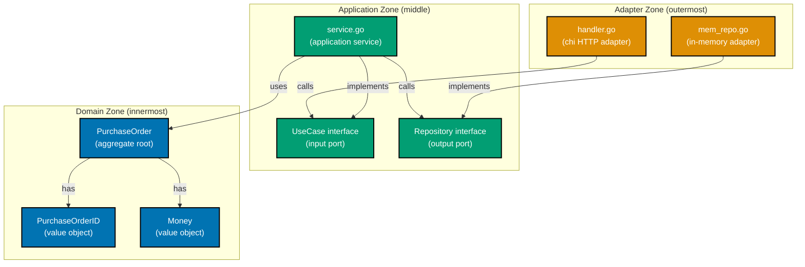

Examples 1–20 introduce hexagonal architecture (ports and adapters) using a procurement platform domain (`purchasing` context). Go is the canonical language throughout; Rust appears as a parallel formulation where ownership reshapes port design. Every code block is self-contained and targets annotation density of 1.0–2.25 comment lines per code line per example.

## The Three Zones (Examples 1–4)

### Example 1: The hexagon metaphor — three zones as Go packages

Hexagonal architecture divides every application into three concentric zones: the domain (pure business logic), the application (use-case orchestration + port interfaces), and the adapters (technology connectors). In Go, each zone is a distinct directory under the bounded context root, which becomes its own package. Domain imports nothing; application imports only domain; adapters import application plus any framework or driver.






```go
// Zone 1: Domain — zero framework imports allowed
// => directory: purchasing/domain/
// => only stdlib (fmt, errors) and sibling domain types permitted
package domain

// PurchaseOrder: pure Go struct — no db tags, no json tags, no framework deps
// => compiles and runs without any external library on the module graph
type PurchaseOrder struct {
    ID         PurchaseOrderID // => strongly-typed identity (format: po_<uuid>)
    SupplierID SupplierID      // => distinct type; cannot swap with PurchaseOrderID accidentally
    Total      Money           // => Money carries both amount and ISO 4217 currency
    Status     POStatus        // => domain string-type enum; no framework dependency
}

// Zone 2: Application — imports domain only
// => directory: purchasing/app/
// => may import purchasing/domain; must not import purchasing/adapter or any framework
package app

// Zone 3: Adapter — imports application and framework
// => directory: purchasing/adapter/in/http/ or purchasing/adapter/out/mem/
// => may import purchasing/app, github.com/go-chi/chi, etc.
package http
```




```rust
// Zone 1: Domain — zero framework imports allowed
// => module: purchasing::domain
// => only std and sibling domain types permitted
// mod purchasing::domain — no use of axum, sqlx, tokio runtime types here

/// PurchaseOrder: pure Rust struct — no derive macros from external crates (except std)
/// => compiles without sqlx, axum, or any async runtime on the dependency tree
#[derive(Debug, Clone, PartialEq)]
pub struct PurchaseOrder {
    pub id: PurchaseOrderId,         // => strongly-typed identity (format: po_<uuid>)
    pub supplier_id: SupplierId,     // => distinct type; type system prevents accidental swaps
    pub total: Money,                // => Money holds Decimal amount + 3-letter currency code
    pub status: PoStatus,            // => domain enum; no framework dependency
}

// Zone 2: Application — imports domain only
// => module: purchasing::app
// => may use purchasing::domain; must NOT use purchasing::adapter or axum/sqlx

// Zone 3: Adapter — imports application and framework
// => module: purchasing::adapter::in_http or purchasing::adapter::out_mem
// => may use purchasing::app, axum, sqlx, tokio
```




**Key Takeaway**: Domain imports nothing; application imports domain; adapters import application and frameworks. The dependency arrow always points inward.

**Why It Matters**: When the domain package has zero external imports, every domain test runs with `go test ./purchasing/domain/...` in under a millisecond — no server, no database, no module download. Swapping chi for echo, or a Postgres adapter for an in-memory one, becomes a one-directory change confined to the adapter layer. Rob Pike's [Go at Google](https://go.dev/talks/2012/splash.article) (2012 SPLASH) notes that large-scale Go programmes stay maintainable through strict package boundaries — hexagonal architecture operationalises exactly that discipline.

---

### Example 2: Domain entity — pure Go struct, no framework tags

A domain entity holds only business state and behaviour. Framework tags (`json:"..."`, `db:"..."`, `bson:"..."`) are infrastructure concerns that belong in adapter-layer DTOs and repository mapping structs. Placing them in the domain couples the domain to a specific serialisation or persistence framework and forces recompilation whenever that framework changes.

**Anti-pattern — framework tags in the domain**:




```go
// WRONG: json and db tags leak infrastructure into the domain
// => domain struct now carries serialisation and ORM coupling at the type level
type PurchaseOrder struct {
    ID         string `json:"id" db:"id"`               // => json/db tags: adapter concerns
    SupplierID string `json:"supplier_id" db:"supplier_id"` // => raw string: typed safety lost
    Total      float64 `json:"total_amount" db:"total_amount"` // => loses currency information
    Status     string `json:"status" db:"status"`        // => stringly-typed: compiler cannot validate
}
// Problem: tests must import encoding/json or database/sql to exercise the struct
// => coupling cost: every domain test pulls in serialisation/persistence libraries
```




```rust
// WRONG: serde and sqlx derive macros leak infrastructure into the domain
// => domain struct now requires serde and sqlx crates on its compile path
use serde::{Serialize, Deserialize};  // => serialisation framework in domain crate
use sqlx::FromRow;                    // => database framework in domain crate

#[derive(Debug, Clone, Serialize, Deserialize, FromRow)]  // => infra derives: adapter concern
pub struct PurchaseOrder {
    pub id: String,            // => raw String: typed safety lost; po_ prefix not enforced
    pub supplier_id: String,   // => raw String: cannot distinguish from PurchaseOrderId
    pub total_amount: f64,     // => f64 loses currency; floating-point money is an anti-pattern
    pub status: String,        // => stringly-typed: rustc cannot exhaustively match variants
}
// Problem: domain unit tests must compile serde and sqlx; slow compile; framework coupling
```




**Correct — clean domain struct**:




```go
// PurchaseOrder: zero framework imports; compiles with only the standard library
// => no json tags, no db tags, no bson tags, no ORM annotations
package domain

// PurchaseOrder: aggregate root for the purchasing bounded context
// => struct fields use domain types — not raw primitives
// => all fields exported (uppercase): idiomatic Go; domain is a shared package
type PurchaseOrder struct {
    ID         PurchaseOrderID // => domain value object; not raw string
    SupplierID SupplierID      // => distinct type; prevents id-kind confusion at compile time
    Total      Money           // => Money{Amount, Currency}; richer than float64 alone
    Status     POStatus        // => string-type enum; only valid constants exist
}

// Submit: domain behaviour — pure function, no I/O, no framework calls
// => returns a new PurchaseOrder with status transitioned to AwaitingApproval
// => Go pattern: return (value, error) for operations that can fail with a domain rule
func (po PurchaseOrder) Submit() (PurchaseOrder, error) {
    if po.Status != POStatusDraft { // => guard: only DRAFT can be submitted
        return PurchaseOrder{}, ErrInvalidTransition // => domain error; no HTTP status here
        // => caller (application service) maps this to an appropriate response
    }
    po.Status = POStatusAwaitingApproval // => state copy: Go structs are value types by default
    return po, nil                       // => new state returned; original po is unchanged
    // => state transition: DRAFT → AWAITING_APPROVAL
}
// Test: domain.PurchaseOrder{...} — no framework needed; sub-millisecond
```




```rust
// PurchaseOrder: zero external crate imports; compiles with only std
// => no serde, no sqlx, no axum derives on the domain struct
// => Blandy, Orendorff & Tindall (Programming Rust, 3rd ed.) §10: structs as value types
use std::fmt;

/// PurchaseOrder: aggregate root for the purchasing bounded context.
/// All fields use domain types — not raw primitives or framework types.
#[derive(Debug, Clone, PartialEq)]
pub struct PurchaseOrder {
    pub id: PurchaseOrderId,         // => domain value object; not raw String
    pub supplier_id: SupplierId,     // => distinct type; rustc prevents accidental argument swaps
    pub total: Money,                // => Money { amount: Decimal, currency: String }
    pub status: PoStatus,            // => domain enum; exhaustive match enforced by compiler
}

impl PurchaseOrder {
    /// submit: domain behaviour — pure function, no I/O, no framework calls.
    /// Returns a new PurchaseOrder with status set to AwaitingApproval.
    pub fn submit(self) -> Result<PurchaseOrder, DomainError> {
        // => consume-on-call: self is moved in; caller cannot reuse a submitted PO
        if self.status != PoStatus::Draft {
            return Err(DomainError::InvalidTransition); // => domain error; no HTTP concern here
            // => Result: Rust's idiomatic way to signal failure without panic
        }
        Ok(PurchaseOrder {
            status: PoStatus::AwaitingApproval, // => only status changes; other fields preserved
            ..self                               // => struct update syntax copies remaining fields
        })
        // => state transition: Draft → AwaitingApproval
    }
}
// Test: PurchaseOrder { id: ..., status: PoStatus::Draft, ... } — no crate needed; sub-ms
```




**Key Takeaway**: Domain structs carry only business state and rules. Zero framework tags means zero framework test dependencies.

**Why It Matters**: A Go struct with no framework tags instantiates in any test without importing `encoding/json` or a database driver. Switching from `pgx` to `sqlx`, or from JSON to MessagePack serialisation, touches only adapter files — thousands of lines of domain logic remain unchanged. Alistair Cockburn's [Hexagonal Architecture](https://alistair.cockburn.us/hexagonal-architecture) (2005) identifies this isolation of the application core as the central purpose of the pattern.

---

### Example 3: Value objects — PurchaseOrderID and Money in Go

Value objects encapsulate a primitive value plus its invariants. They make illegal states unrepresentable at the type level and prevent the billion-dollar mistake of mixing up raw strings or bare numerics across a codebase.




```go
// Domain value objects: PurchaseOrderID, SupplierID, and Money
// => package purchasing/domain
package domain

import (
    "errors"   // => stdlib: ErrInvalidPurchaseOrderID construction
    "fmt"      // => stdlib: error message formatting
    "strings"  // => stdlib: prefix validation
)

// PurchaseOrderID: wraps a string but enforces the "po_<uuid>" format invariant
// => named type (not typedef): distinct from string and from SupplierID at compile time
// => Go does not have constructors; NewPurchaseOrderID is the factory function convention
type PurchaseOrderID string

// NewPurchaseOrderID: factory function — validates invariants before returning a value
// => returns (PurchaseOrderID, error): caller must handle the error; no panic on bad input
func NewPurchaseOrderID(value string) (PurchaseOrderID, error) {
    if !strings.HasPrefix(value, "po_") || len(value) < 39 {
        // => format invariant: "po_" prefix + 36-char UUID = minimum 39 chars total
        return "", fmt.Errorf("invalid PurchaseOrderID %q: must start with po_ and be ≥39 chars", value)
        // => zero-value returned on error; caller uses the error, not the returned ID
    }
    return PurchaseOrderID(value), nil // => valid: wrap raw string in the named type
    // => return type is PurchaseOrderID, not string; cannot be accidentally passed where SupplierID expected
}
// => NewPurchaseOrderID("po_550e8400-e29b-41d4-a716-446655440000") → PurchaseOrderID, nil
// => NewPurchaseOrderID("abc") → "", error "must start with po_ ..."
// => NewPurchaseOrderID("") → "", error "must start with po_ ..."

// Money: immutable value object combining amount + ISO 4217 currency code
// => struct: two related fields; richer than a bare float64 alone
// => prevents silently mixing USD and EUR — they are the same type, but amount comparison
//    without matching currencies is a domain error caught in domain logic
type Money struct {
    Amount   int64  // => store as minor units (cents); avoids floating-point precision bugs
    Currency string // => ISO 4217 code; e.g. "USD", "IDR", "EUR" — exactly 3 chars
}

// NewMoney: validates both fields before returning a Money value
// => returns error on invalid input; no Money with negative amount or wrong currency code
func NewMoney(amount int64, currency string) (Money, error) {
    if amount < 0 {
        // => invariant: negative money has no meaning in a P2P procurement domain
        return Money{}, errors.New("money amount must be >= 0")
        // => caller sees the clear message; construction cannot produce negative Money
    }
    if len(currency) != 3 {
        // => ISO 4217: all currency codes are exactly 3 uppercase letters (USD, EUR, IDR)
        return Money{}, fmt.Errorf("currency %q must be a 3-letter ISO 4217 code", currency)
        // => "US" (2 chars) and "USDD" (4 chars) both fail this guard
    }
    return Money{Amount: amount, Currency: currency}, nil // => valid: both fields pass invariants
    // => Money{Amount: 150000, Currency: "USD"} represents $1500.00 in minor units
}
// => NewMoney(150000, "USD") → Money{150000,"USD"}, nil
// => NewMoney(-1, "USD")    → Money{}, error "must be >= 0"
// => NewMoney(500, "US")    → Money{}, error "must be 3-letter ISO 4217"
```




```rust
// Domain value objects: PurchaseOrderId, SupplierId, and Money
// => mod purchasing::domain — no external crate imports
use std::fmt;

/// PurchaseOrderId: newtype wrapping String; enforces "po_<uuid>" format invariant.
/// Rust's newtype pattern gives compile-time type safety at zero runtime cost.
#[derive(Debug, Clone, PartialEq, Eq, Hash)]
pub struct PurchaseOrderId(String); // => tuple struct: single private field

impl PurchaseOrderId {
    /// new: factory function — validates invariants; returns Result on failure.
    pub fn new(value: impl Into<String>) -> Result<Self, DomainError> {
        let value = value.into(); // => Into<String>: accepts &str or String without extra alloc
        if !value.starts_with("po_") || value.len() < 39 {
            // => format invariant: "po_" prefix + 36-char UUID = minimum 39 chars
            return Err(DomainError::InvalidId(format!(
                "invalid PurchaseOrderId {:?}: must start with po_ and be ≥39 chars", value
            )));
            // => caller handles Err; no PurchaseOrderId with bad format can exist
        }
        Ok(PurchaseOrderId(value)) // => wrap String in newtype; distinct from SupplierId
    }

    /// as_str: borrow the inner value without cloning.
    pub fn as_str(&self) -> &str { &self.0 }
    // => &self.0: borrow the single tuple field; no allocation
}
// => PurchaseOrderId::new("po_550e8400-e29b-41d4-a716-446655440000") → Ok(id)
// => PurchaseOrderId::new("abc") → Err(InvalidId("must start with po_..."))

/// Money: immutable value object combining amount + ISO 4217 currency code.
/// Stores amount as i64 minor units (cents) to avoid f64 floating-point errors.
#[derive(Debug, Clone, PartialEq, Eq)]
pub struct Money {
    pub amount: i64,    // => minor units (cents); 150000 = $1500.00
    pub currency: String, // => ISO 4217 code; exactly 3 uppercase chars
}

impl Money {
    /// new: validates both fields before construction.
    pub fn new(amount: i64, currency: impl Into<String>) -> Result<Self, DomainError> {
        let currency = currency.into();
        if amount < 0 {
            return Err(DomainError::InvalidMoney("amount must be >= 0".into()));
            // => negative Money cannot exist; Err returned to caller
        }
        if currency.len() != 3 {
            // => ISO 4217: exactly 3 letters; "US" (2) and "USDD" (4) both fail
            return Err(DomainError::InvalidMoney(
                format!("currency {:?} must be 3-letter ISO 4217 code", currency)
            ));
        }
        Ok(Money { amount, currency }) // => valid: both invariants satisfied
    }
}
// => Money::new(150000, "USD") → Ok(Money{amount:150000, currency:"USD"})
// => Money::new(-1, "USD")    → Err(InvalidMoney("amount must be >= 0"))
// => Money::new(500, "US")    → Err(InvalidMoney("must be 3-letter ISO 4217 code"))
```




**Key Takeaway**: Value objects enforce invariants at construction, making invalid states impossible to represent downstream.

**Why It Matters**: When `PurchaseOrderID` and `SupplierID` are distinct named types in Go, the compiler rejects `repository.FindByID(supplierID)` — the wrong type is caught before any test runs. Encoding the `po_` prefix in the factory function means no HTTP handler, application service, or repository needs to re-validate format. Three Dots Labs' [DDD + CQRS + Clean Architecture in Go](https://threedots.tech/post/ddd-cqrs-clean-architecture-combined/) demonstrates exactly this pattern in production Go services.

---

### Example 4: The dependency rule — what can import what in Go

The dependency rule is the single most important invariant in hexagonal architecture: dependencies always point inward. Outer zones depend on inner zones; inner zones never depend on outer zones. In Go, this is enforced by package import paths — any import that crosses the boundary in the wrong direction is visible in `go mod graph` and catchable with `golang.org/x/tools/go/analysis`.

**Legal imports (inward dependencies only)**:




```go
// Application zone: may import domain types — inward dependency is always legal
// => file: purchasing/app/service.go
package app

import (
    "purchasing/domain" // => ok: inward dependency; app → domain
    // => domain.PurchaseOrder, domain.PurchaseOrderID, domain.Money all available
)

// Adapter zone: may import application types — one step further outward
// => file: purchasing/adapter/in/http/handler.go
package http

import (
    "purchasing/app" // => ok: inward; adapter → app; adapter never imports domain directly
    // => app.IssuePurchaseOrderUseCase interface available; domain types accessed via app
)
```




```rust
// Application zone: may use domain types — inward dependency is always legal
// => mod purchasing::app (lib.rs or app/mod.rs)
use crate::domain::PurchaseOrder;    // => ok: inward; app uses domain types
use crate::domain::PurchaseOrderId;  // => ok: inward direction
use crate::domain::Money;            // => ok: domain value object

// Adapter zone: may use application types — one step further outward
// => mod purchasing::adapter::in_http
use crate::app::IssuePurchaseOrderUseCase; // => ok: inward; adapter uses app port
// => dependency arrow: adapter → app → domain; all inward; legal
```




**Illegal imports (outward dependencies — architecture violations)**:




```go
// Domain zone importing Application: FORBIDDEN — never do this
// => file: purchasing/domain/purchase_order.go (hypothetical violation)
package domain

// import "purchasing/app" // => NEVER: domain → app creates circular import
// => Go compiler would reject this with "import cycle not allowed"
// => Go's circular import detection is a free enforcement mechanism for hexagonal

// Application zone importing Adapter: FORBIDDEN — never do this
// => file: purchasing/app/service.go (hypothetical violation)
package app

// import "purchasing/adapter/in/http" // => NEVER: app → adapter is outward
// => application service would depend on chi router; cannot test without HTTP stack
// => Go compiler rejects circular imports; non-circular outward imports must be caught
//    with an architecture linter such as github.com/fdaines/arch-go
```




```rust
// Domain module importing Application: FORBIDDEN — never do this
// mod purchasing::domain (hypothetical violation)

// use crate::app::IssuePurchaseOrderService; // => NEVER: domain → app is outward
// => Rust would allow this (no circular-import check like Go) but creates coupling
// => arch-test crate or manual Cargo workspace separation enforces the rule

// Application module importing Adapter: FORBIDDEN — never do this
// mod purchasing::app (hypothetical violation)

// use crate::adapter::in_http::PurchaseOrderHandler; // => NEVER: app → adapter is outward
// => application service would need axum compile-time dep; cannot test without HTTP stack
// => enforce with separate Cargo workspace crates: domain, app, adapter as distinct crates
```




**Key Takeaway**: Dependencies always point inward — domain ← application ← adapters. Go's circular import rejection enforces this mechanically for circular violations; `arch-go` catches non-circular outward imports.

**Why It Matters**: Go's compiler rejects circular imports, which means a domain package that accidentally imports the application package fails to compile — the dependency rule violation surfaces immediately in `go build`. For non-circular violations (e.g., `app` importing `adapter`), tools like `arch-go` or Cargo workspace crate separation in Rust provide the same guarantee. In a growing P2P platform this protection becomes increasingly valuable: as the team scales, manual enforcement of architectural rules is unreliable. The compiler and linter make the hexagon self-defending.

---

## Port Interfaces (Examples 5–8)

### Example 5: Output port — PurchaseOrderRepository interface in Go

An output port is a small Go interface placed in the `app/` package. It expresses what the application needs from the outside world using domain language only. Go's structural typing means any type that has the correct method set satisfies the interface — no `implements` declaration is required. This is Cockburn's original port definition implemented with zero syntactic ceremony.




```go
// Output port: lives in app package; speaks domain language only
// => file: purchasing/app/ports.go
package app

import "purchasing/domain" // => only domain import; no database/sql, no pgx, no framework

// PurchaseOrderRepository: output port for PO persistence
// => small interface: 3 methods; Go convention is interfaces ≤5 methods
// => any struct with these methods satisfies this interface — no declaration coupling
type PurchaseOrderRepository interface {
    // Save: persist a PurchaseOrder; return the saved instance
    // => takes domain type; returns domain type; no SQL, no pgx.Rows visible here
    Save(po domain.PurchaseOrder) (domain.PurchaseOrder, error)
    // => caller: repo.Save(po) — does not know if storage is Postgres or in-memory map

    // FindByID: retrieve a PurchaseOrder by its typed identity
    // => (domain.PurchaseOrder, bool): Go idiom for "found or not found"; no sentinel nil
    FindByID(id domain.PurchaseOrderID) (domain.PurchaseOrder, bool)
    // => returns (po, true) when found; (zero, false) when not found — caller checks the bool

    // ExistsByID: lightweight existence check without loading the full aggregate
    // => useful for duplicate-check guard before saving a new PO
    ExistsByID(id domain.PurchaseOrderID) bool
    // => returns true if PO with given id is present; false otherwise; no aggregate loaded
}
// => application service calls this interface; zero coupling to Postgres or any driver
// => structural typing: InMemoryPurchaseOrderRepository satisfies this without any declaration
```




```rust
// Output port: lives in app module; speaks domain language only
// => file: purchasing/app/ports.rs
use crate::domain::{PurchaseOrder, PurchaseOrderId};
use async_trait::async_trait; // => async_trait: enables async fn in trait definitions

/// PurchaseOrderRepository: output port for PO persistence.
/// Trait (Rust's interface equivalent) defined in the app module — not in adapter.
/// Adapters in the out_* modules implement this trait.
#[async_trait]
pub trait PurchaseOrderRepository: Send + Sync {
    // save: persist a PurchaseOrder; return the saved instance
    // => async fn: async_trait macro rewrites this to return Pin<Box<dyn Future<...>>>
    // => takes &self (shared borrow): no ownership transfer; adapter may hold DB pool
    async fn save(&self, po: PurchaseOrder) -> Result<PurchaseOrder, DomainError>;
    // => caller: repo.save(po).await — does not know if storage is Postgres or HashMap

    // find_by_id: retrieve a PurchaseOrder by its typed identity
    // => Option<PurchaseOrder>: None signals absence; no sentinel value needed
    async fn find_by_id(&self, id: &PurchaseOrderId) -> Result<Option<PurchaseOrder>, DomainError>;
    // => returns Ok(Some(po)) on hit; Ok(None) on miss; Err on storage failure

    // exists_by_id: lightweight existence check without loading the full aggregate
    async fn exists_by_id(&self, id: &PurchaseOrderId) -> Result<bool, DomainError>;
    // => returns Ok(true) if PO is present; Ok(false) if absent; Err on storage failure
}
// => Arc<dyn PurchaseOrderRepository + Send + Sync>: shared ownership for async composition root
// => structural: InMemPurchaseOrderRepository implements this by writing the methods — no keyword
```




**Key Takeaway**: Output ports are small interfaces in the `app/` package that speak only domain language — no SQL, no driver types, no framework.

**Why It Matters**: Because `PurchaseOrderRepository` is an interface, the application service can be tested with an in-memory implementation that runs in microseconds. Go's structural typing means the in-memory test adapter requires only matching method signatures — no coupling declaration. Swapping from a pgx adapter to a sqlx adapter later means writing one new struct with the same three methods — the application service and every test remain unchanged.

---

### Example 6: Clock output port — making time testable in Go

Time is an implicit dependency. Code that calls `time.Now()` directly is non-deterministic and cannot be tested without mocking the system clock. Wrapping time behind a `Clock` output port makes the dependency explicit and swappable.




```go
// Clock output port: time as an explicit dependency
// => file: purchasing/app/ports.go (alongside PurchaseOrderRepository)
package app

import "time" // => stdlib only; no framework import

// Clock: output port; returns current time as a stdlib time.Time
// => Adapter in production: returns time.Now() from the system clock
// => Adapter in tests: returns a fixed time.Time — deterministic; no sleep() needed
type Clock interface {
    Now() time.Time
    // => test adapter: type FixedClock struct{ T time.Time }; func (c FixedClock) Now() time.Time { return c.T }
    // => single-method interface: very easy to satisfy with a small struct or function literal
}

// Usage inside an application service — clock.Now() instead of time.Now()
// => file: purchasing/app/service.go
type IssuePurchaseOrderService struct {
    repo  PurchaseOrderRepository // => output port; injected at wiring time
    clock Clock                   // => output port; testable time source
    // => both fields are interface types; concrete adapter chosen at composition root
}

func (s *IssuePurchaseOrderService) Execute(cmd IssuePOCommand) (domain.PurchaseOrder, error) {
    issuedAt := s.clock.Now() // => explicit; testable; no hidden time.Now() calls
    // => issuedAt: time.Time — embedded in the issued PO or a domain event
    _ = issuedAt              // => used to timestamp the PO in a real implementation
    return domain.PurchaseOrder{}, nil
}
```




```rust
// Clock output port: time as an explicit dependency
// => file: purchasing/app/ports.rs
use std::time::SystemTime;

/// Clock: output port returning the current instant.
/// Trait defined in the app module — adapters in adapter::out_* implement it.
pub trait Clock: Send + Sync {
    fn now(&self) -> SystemTime;
    // => production adapter: SystemTime::now() from std
    // => test adapter: struct FixedClock { t: SystemTime }; fn now(&self) -> SystemTime { self.t }
    // => single-method trait: very lightweight to implement in tests
}

// Usage inside an application service — self.clock.now() instead of SystemTime::now()
// => file: purchasing/app/service.rs
pub struct IssuePurchaseOrderService {
    repo: std::sync::Arc<dyn super::ports::PurchaseOrderRepository>, // => shared ownership for async
    clock: std::sync::Arc<dyn Clock>,                                 // => shared clock port
    // => Arc<dyn Trait>: Rust's runtime polymorphism handle in async contexts
    // => Blandy, Orendorff & Tindall (Programming Rust §12): trait objects and Arc
}
```




**Key Takeaway**: Wrapping the system clock behind a `Clock` port makes time an explicit, swappable dependency — test adapters return fixed timestamps.

**Why It Matters**: Time-dependent business rules ("PO must be issued within 30 days of approval") become deterministically testable. Tests run at the same speed regardless of wall-clock time. In Go, `FixedClock{T: knownTime}` satisfies the `Clock` interface with two lines — no mock framework required.

---

### Example 7: Input port — IssuePurchaseOrderUseCase interface

An input port is a small Go interface in the `app/` package that defines a use case the application exposes to the outside world. Primary adapters (HTTP handlers, CLI commands, event consumers) call input ports — they never call application service structs directly. This keeps the adapter decoupled from service implementation details.




```go
// Input port: use-case interface in the app package
// => file: purchasing/app/ports.go
package app

import "purchasing/domain" // => domain types only in the port signature

// IssuePOCommand: immutable command carrying everything the use case needs
// => struct with value semantics: passed by copy; no pointer needed for small commands
// => raw strings from the HTTP layer; application service validates and converts them
type IssuePOCommand struct {
    SupplierID    string // => raw string from HTTP body; validated inside the service
    TotalAmount   int64  // => minor units (cents) from the JSON payload
    TotalCurrency string // => ISO 4217 code; service validates 3-letter rule
}

// IssuePurchaseOrderUseCase: input port; defines the use-case contract
// => HTTP handler calls this interface; never the concrete IssuePurchaseOrderService struct
// => Go structural typing: handler couples to the interface, not the implementation
type IssuePurchaseOrderUseCase interface {
    // Execute: the single method of this use case
    // => takes a command (inbound DTO); returns the resulting domain object or an error
    Execute(cmd IssuePOCommand) (domain.PurchaseOrder, error)
    // => domain error returned to adapter; adapter maps it to HTTP 422 or 400
}
// => any struct with Execute(IssuePOCommand)(domain.PurchaseOrder, error) satisfies this
// => test double: type FakeUseCase struct{}; func (f FakeUseCase) Execute(...) — 2 lines
```




```rust
// Input port: use-case trait in the app module
// => file: purchasing/app/ports.rs
use crate::domain::PurchaseOrder;
use async_trait::async_trait;

/// IssuePOCommand: immutable value type carrying everything the use case needs.
/// Plain struct: no framework derives; command travels from adapter → app only.
#[derive(Debug, Clone)]
pub struct IssuePOCommand {
    pub supplier_id: String,    // => raw string from HTTP body; validated inside the service
    pub total_amount: i64,      // => minor units (cents) from the JSON payload
    pub total_currency: String, // => ISO 4217 code; service validates 3-letter rule
}

/// IssuePurchaseOrderUseCase: input port; defines the use-case contract.
/// HTTP handler depends on this trait — never on the concrete service struct.
#[async_trait]
pub trait IssuePurchaseOrderUseCase: Send + Sync {
    // execute: the single method of this use case
    // => takes command (inbound value); returns domain PurchaseOrder or DomainError
    async fn execute(&self, cmd: IssuePOCommand) -> Result<PurchaseOrder, DomainError>;
    // => domain error returned to adapter; handler maps to HTTP 422 or 400
    // => Arc<dyn IssuePurchaseOrderUseCase>: shared ownership in axum State extractor
}
```




**Key Takeaway**: Input ports are small interfaces in the `app/` package — primary adapters depend on the interface, not the concrete service struct.

**Why It Matters**: When an HTTP handler depends on `IssuePurchaseOrderUseCase` (an interface), a test can swap in a fake returning a known `PurchaseOrder` in two lines — no HTTP server needed. Adding a CLI adapter that calls the same use case requires zero changes to the service or the interface.

---

### Example 8: Go structural typing — no `implements` declaration

Go's structural typing is why hexagonal architecture maps so cleanly to the language. A type satisfies an interface by having the methods — no `implements` keyword, no declaration coupling. This means an adapter written after the port was defined requires only matching the method set.




```go
// Go structural typing: no implements keyword needed
// => file: purchasing/adapter/out/mem/repo.go
package mem

import (
    "sync"               // => stdlib: mutex for concurrent access
    "purchasing/app"     // => import app package for the port interface
    "purchasing/domain"  // => import domain package for entity types
)

// InMemoryPurchaseOrderRepository: satisfies app.PurchaseOrderRepository implicitly
// => Go compiler checks at compile time that this struct has the required methods
// => zero declaration coupling: no "implements PurchaseOrderRepository" anywhere
type InMemoryPurchaseOrderRepository struct {
    mu    sync.RWMutex                            // => mutex: safe concurrent reads and writes
    store map[domain.PurchaseOrderID]domain.PurchaseOrder // => backing store: pure in-memory map
}

// NewInMemoryPurchaseOrderRepository: constructor function — idiomatic Go pattern
func NewInMemoryPurchaseOrderRepository() *InMemoryPurchaseOrderRepository {
    return &InMemoryPurchaseOrderRepository{
        store: make(map[domain.PurchaseOrderID]domain.PurchaseOrder), // => empty map initialised
        // => make() required: nil map causes panic on write; must initialise before use
    }
}

// Save: satisfies PurchaseOrderRepository.Save — method signature must match exactly
func (r *InMemoryPurchaseOrderRepository) Save(po domain.PurchaseOrder) (domain.PurchaseOrder, error) {
    r.mu.Lock()               // => exclusive lock: prevents concurrent write conflicts
    defer r.mu.Unlock()       // => deferred unlock: released when function returns; cannot forget
    r.store[po.ID] = po       // => key = typed PurchaseOrderID; value = PurchaseOrder struct copy
    return po, nil            // => return the saved instance; nil error means success
    // => structural typing: this method makes the struct satisfy PurchaseOrderRepository.Save
}

// FindByID: satisfies PurchaseOrderRepository.FindByID
func (r *InMemoryPurchaseOrderRepository) FindByID(id domain.PurchaseOrderID) (domain.PurchaseOrder, bool) {
    r.mu.RLock()              // => shared read lock: multiple concurrent reads allowed
    defer r.mu.RUnlock()      // => deferred unlock: released at function return
    po, ok := r.store[id]     // => map lookup: ok = true if found; ok = false if absent
    return po, ok             // => (zero PurchaseOrder, false) when not found; no nil pointer
    // => (domain.PurchaseOrder, bool) idiom: avoids nil-pointer dereference bugs
}

// ExistsByID: satisfies PurchaseOrderRepository.ExistsByID
func (r *InMemoryPurchaseOrderRepository) ExistsByID(id domain.PurchaseOrderID) bool {
    r.mu.RLock()              // => shared read lock: safe for concurrent existence checks
    defer r.mu.RUnlock()
    _, ok := r.store[id]      // => blank identifier: discard the value; only need the bool
    return ok                 // => true = found; false = not found; O(1) hash map lookup
}

// Compile-time interface satisfaction check (Go idiom)
// => var _ app.PurchaseOrderRepository = (*InMemoryPurchaseOrderRepository)(nil)
// => this line causes a compile error if the struct no longer satisfies the interface
// => zero-cost: nil pointer cast; never executed at runtime
var _ app.PurchaseOrderRepository = (*InMemoryPurchaseOrderRepository)(nil)
```




```rust
// Rust trait implementation: explicit impl block; also no declaration at struct definition
// => file: purchasing/adapter/out/mem/repo.rs
use std::collections::HashMap;
use std::sync::{Arc, RwLock};
use async_trait::async_trait;
use crate::app::ports::PurchaseOrderRepository;
use crate::domain::{PurchaseOrder, PurchaseOrderId, DomainError};

/// InMemPurchaseOrderRepository: implements PurchaseOrderRepository trait.
/// Backed by a HashMap protected by RwLock for safe concurrent async access.
pub struct InMemPurchaseOrderRepository {
    store: RwLock<HashMap<String, PurchaseOrder>>,
    // => RwLock: allows multiple readers OR one writer; safe for async workloads
    // => HashMap<String, PurchaseOrder>: keyed by PurchaseOrderId.as_str() string
}

impl InMemPurchaseOrderRepository {
    /// new: constructor; initialises an empty backing store.
    pub fn new() -> Self {
        InMemPurchaseOrderRepository {
            store: RwLock::new(HashMap::new()), // => empty HashMap wrapped in RwLock
            // => RwLock::new: creates an unlocked lock around the empty map
        }
    }
}

#[async_trait]
impl PurchaseOrderRepository for InMemPurchaseOrderRepository {
    // save: explicit trait method implementation
    // => async fn: async_trait rewrites to return a boxed future
    async fn save(&self, po: PurchaseOrder) -> Result<PurchaseOrder, DomainError> {
        let mut store = self.store.write().unwrap(); // => exclusive write lock acquired
        // => unwrap: acceptable in tests; production code uses map_err
        store.insert(po.id.as_str().to_owned(), po.clone()); // => insert clone; return original
        // => po.id.as_str().to_owned(): borrow the id string then own it as the map key
        Ok(po) // => return the saved instance wrapped in Ok
    }

    async fn find_by_id(&self, id: &PurchaseOrderId) -> Result<Option<PurchaseOrder>, DomainError> {
        let store = self.store.read().unwrap(); // => shared read lock: multiple readers allowed
        Ok(store.get(id.as_str()).cloned())     // => cloned(): Option<&PO> → Option<PO>
        // => None when id not in map; Some(po.clone()) when found
    }

    async fn exists_by_id(&self, id: &PurchaseOrderId) -> Result<bool, DomainError> {
        let store = self.store.read().unwrap(); // => shared read lock
        Ok(store.contains_key(id.as_str()))    // => O(1) hash lookup; no aggregate loaded
    }
}
```




**Key Takeaway**: Go's structural typing means an adapter satisfies a port interface by matching the method set — no `implements` declaration couples the adapter to the port at the source level.

**Why It Matters**: In Java you must write `implements PurchaseOrderRepository`; in Go that coupling does not exist. A new adapter (e.g., a Redis adapter) written months after the port interface was defined requires only matching the three method signatures — no change to the port, no change to the service, no declaration update. This is why Cockburn's language-agnostic port definition maps most cleanly to Go's structural typing.

---

## The Domain (Examples 9–12)

### Example 9: POStatus — Go string-type enum

Go has no built-in enum keyword. The idiomatic pattern is a named string (or int) type plus a set of package-level constants. This gives compile-time type safety without requiring a full ADT.




```go
// POStatus: string-type enum in Go
// => file: purchasing/domain/po_status.go
package domain

// POStatus: named string type — distinct from plain string at compile time
// => prevents passing an arbitrary string where a status is expected
type POStatus string

// Package-level constants: the only valid POStatus values
// => const block: idiomatic for a set of related named constants
const (
    POStatusDraft              POStatus = "DRAFT"
    // => initial state when PO is first created in the system
    POStatusAwaitingApproval   POStatus = "AWAITING_APPROVAL"
    // => PO submitted by requester; waiting for approver sign-off
    POStatusApproved           POStatus = "APPROVED"
    // => approver confirmed the PO; next step is issuing to supplier
    POStatusIssued             POStatus = "ISSUED"
    // => PO sent to the supplier; awaiting goods receipt
    POStatusCancelled          POStatus = "CANCELLED"
    // => PO cancelled before goods receipt; terminal state
)

// IsValid: helper to check if a deserialized status string is a known value
// => useful at the adapter boundary when loading from database or HTTP body
func (s POStatus) IsValid() bool {
    switch s {
    case POStatusDraft, POStatusAwaitingApproval, POStatusApproved, POStatusIssued, POStatusCancelled:
        return true  // => all known values return true
    default:
        return false // => unknown value: reject at the adapter layer before entering domain
    }
}
// => POStatus("DRAFT").IsValid() → true
// => POStatus("GARBAGE").IsValid() → false
// => Go's type system prevents: var s POStatus = "anything" — but const values are type-checked
```




```rust
// PoStatus: Rust enum — exhaustive pattern matching enforced by the compiler
// => file: purchasing/domain/po_status.rs
// => Rust enum: algebraic data type; each variant is a distinct value

/// PoStatus: domain enum representing the lifecycle of a PurchaseOrder.
/// Rust's compiler enforces exhaustive match — no unhandled case can exist.
#[derive(Debug, Clone, PartialEq, Eq)]
pub enum PoStatus {
    Draft,             // => initial state when PO is first created in the system
    AwaitingApproval,  // => PO submitted; waiting for approver sign-off
    Approved,          // => approver confirmed the PO; next step: issue to supplier
    Issued,            // => PO sent to supplier; awaiting goods receipt
    Cancelled,         // => PO cancelled before goods receipt; terminal state
}

impl PoStatus {
    /// as_str: return the canonical string representation for persistence.
    pub fn as_str(&self) -> &'static str {
        match self {
            PoStatus::Draft             => "DRAFT",            // => maps to DB/JSON value
            PoStatus::AwaitingApproval  => "AWAITING_APPROVAL", // => maps to DB/JSON value
            PoStatus::Approved          => "APPROVED",         // => maps to DB/JSON value
            PoStatus::Issued            => "ISSUED",           // => maps to DB/JSON value
            PoStatus::Cancelled         => "CANCELLED",        // => maps to DB/JSON value
            // => exhaustive: adding a new variant without updating this match is a compile error
        }
    }

    /// from_str: parse a string back to a PoStatus; returns Err on unknown values.
    pub fn from_str(s: &str) -> Result<Self, DomainError> {
        match s {
            "DRAFT"              => Ok(PoStatus::Draft),
            "AWAITING_APPROVAL"  => Ok(PoStatus::AwaitingApproval),
            "APPROVED"           => Ok(PoStatus::Approved),
            "ISSUED"             => Ok(PoStatus::Issued),
            "CANCELLED"          => Ok(PoStatus::Cancelled),
            other => Err(DomainError::UnknownStatus(other.to_owned())),
            // => Err: unknown string rejected; caller decides how to handle at the adapter boundary
        }
    }
}
```




**Key Takeaway**: Go string-type enums provide compile-time type safety; Rust enums provide exhaustive pattern matching enforced by the compiler.

**Why It Matters**: When `POStatus` is a named type rather than a raw string, the compiler prevents `repo.FindByStatus("PENDING")` where `"PENDING"` is not a valid constant. Adding a new lifecycle state requires updating the `switch` in Go or the `match` in Rust — the compiler points to every place that needs updating. This makes lifecycle transitions self-documenting and refactoring-safe.

---

### Example 10: Pure domain entity — PurchaseOrder with Submit transition

The domain entity encapsulates business rules as methods. State transitions are pure functions: they take the current state, validate the business rule, and return a new state (or an error). No I/O, no framework calls, no side effects.




```go
// PurchaseOrder: aggregate root with domain behaviour
// => file: purchasing/domain/purchase_order.go
package domain

import "errors"

// ErrInvalidTransition: domain error for illegal state transitions
// => sentinel error: compare with errors.Is(); no framework dependency
var ErrInvalidTransition = errors.New("invalid purchase order state transition")

// PurchaseOrder: aggregate root struct — no framework tags
type PurchaseOrder struct {
    ID         PurchaseOrderID // => typed identity; format: po_<uuid>
    SupplierID SupplierID      // => typed supplier reference; format: sup_<uuid>
    Total      Money           // => minor-unit amount + 3-letter currency code
    Status     POStatus        // => lifecycle state; only valid constants
}

// Submit: domain behaviour — pure transition from DRAFT to AWAITING_APPROVAL
// => value receiver: Go struct is copied; original po is never mutated
// => returns (PurchaseOrder, error): either the new state or a domain error
func (po PurchaseOrder) Submit() (PurchaseOrder, error) {
    if po.Status != POStatusDraft {
        // => guard: only DRAFT POs can be submitted; any other status is a domain violation
        return PurchaseOrder{}, ErrInvalidTransition
        // => zero value returned with error; caller must check error before using the result
    }
    po.Status = POStatusAwaitingApproval // => struct copy modified: original po is unchanged
    // => Go value semantics: modifying po on the copy does not affect the caller's variable
    return po, nil // => return the new state; nil error signals success
    // => state transition: DRAFT → AWAITING_APPROVAL; no I/O; sub-microsecond
}

// Approve: domain behaviour — transition from AWAITING_APPROVAL to APPROVED
// => same pattern: value receiver, copy-and-modify, return new state or error
func (po PurchaseOrder) Approve() (PurchaseOrder, error) {
    if po.Status != POStatusAwaitingApproval {
        return PurchaseOrder{}, ErrInvalidTransition // => domain rule: only awaiting POs can be approved
    }
    po.Status = POStatusApproved // => copy modified; original unchanged
    return po, nil               // => state transition: AWAITING_APPROVAL → APPROVED
}
// Test: po := domain.PurchaseOrder{..., Status: POStatusDraft}; submitted, err := po.Submit()
// => no framework; no DB; sub-millisecond; pure function
```




```rust
// PurchaseOrder: aggregate root with domain behaviour
// => file: purchasing/domain/purchase_order.rs
use crate::domain::{PurchaseOrderId, SupplierId, Money, PoStatus, DomainError};

/// PurchaseOrder: aggregate root for the purchasing bounded context.
#[derive(Debug, Clone, PartialEq)]
pub struct PurchaseOrder {
    pub id: PurchaseOrderId,         // => typed identity; format: po_<uuid>
    pub supplier_id: SupplierId,     // => typed supplier reference; format: sup_<uuid>
    pub total: Money,                // => minor-unit amount + 3-letter currency code
    pub status: PoStatus,            // => lifecycle state; Rust enum enforces exhaustiveness
}

impl PurchaseOrder {
    /// submit: domain behaviour — pure transition from Draft to AwaitingApproval.
    /// Consumes self (move semantics): caller cannot use a submitted PO again.
    pub fn submit(self) -> Result<PurchaseOrder, DomainError> {
        if self.status != PoStatus::Draft {
            // => guard: only Draft POs can be submitted
            return Err(DomainError::InvalidTransition {
                from: self.status.as_str().to_owned(), // => current status in the error message
                to: "AwaitingApproval".to_owned(),     // => attempted target status
            });
        }
        Ok(PurchaseOrder {
            status: PoStatus::AwaitingApproval, // => only status field changes
            ..self                               // => struct update syntax: all other fields copied
        })
        // => state transition: Draft → AwaitingApproval; no I/O; pure; sub-microsecond
    }

    /// approve: domain behaviour — transition from AwaitingApproval to Approved.
    pub fn approve(self) -> Result<PurchaseOrder, DomainError> {
        if self.status != PoStatus::AwaitingApproval {
            return Err(DomainError::InvalidTransition {
                from: self.status.as_str().to_owned(),
                to: "Approved".to_owned(),
            });
        }
        Ok(PurchaseOrder { status: PoStatus::Approved, ..self })
        // => state transition: AwaitingApproval → Approved; pure function
    }
}
// Test: let po = PurchaseOrder { ..., status: PoStatus::Draft };
//       let submitted = po.submit().unwrap(); — no framework; no DB; sub-ms
```




**Key Takeaway**: Domain state transitions are pure functions — they return a new value or a domain error; they never call I/O or mutate global state.

**Why It Matters**: Pure domain methods test instantly without any infrastructure. A suite of 200 domain tests completes in under a second in both Go and Rust. Because the domain is a pure function over its inputs, the same logic runs identically in production, in tests, and in any future CLI or batch processing adapter — the behaviour is infrastructure-independent.

---

### Example 11: SupplierId value object and SupplierID as a distinct type

A bounded context references external entities by their identity only. The purchasing context does not own the Supplier aggregate — it holds a `SupplierID` reference. Making `SupplierID` a distinct named type prevents accidental confusion with `PurchaseOrderID` at the type level.




```go
// SupplierID: distinct named type from PurchaseOrderID
// => file: purchasing/domain/supplier_id.go
package domain

import (
    "fmt"     // => stdlib: error formatting
    "strings" // => stdlib: prefix validation
)

// SupplierID: named string type — distinct from PurchaseOrderID at compile time
// => Go's type system: SupplierID("x") != PurchaseOrderID("x") as distinct types
type SupplierID string

// NewSupplierID: factory function — validates the "sup_<uuid>" format invariant
func NewSupplierID(value string) (SupplierID, error) {
    if !strings.HasPrefix(value, "sup_") || len(value) < 40 {
        // => format invariant: "sup_" prefix (4 chars) + 36-char UUID = minimum 40 chars
        return "", fmt.Errorf("invalid SupplierID %q: must start with sup_ and be ≥40 chars", value)
        // => zero-value string returned with error; caller must not use the returned ID on error
    }
    return SupplierID(value), nil // => valid: wrap raw string in the named type
    // => returned type is SupplierID; compiler prevents passing it where PurchaseOrderID expected
}

// ExampleUsage demonstrates the type safety at compile time
// => func example() {
//     poID, _ := NewPurchaseOrderID("po_550e8400-e29b-41d4-a716-446655440000")
//     supID, _ := NewSupplierID("sup_660f9511-f3ac-52e5-b827-557766551111")
//     po := PurchaseOrder{ID: poID, SupplierID: supID, ...} // => correct: distinct types
//     _ = PurchaseOrder{ID: supID, ...} // => compile error: cannot use SupplierID as PurchaseOrderID
// }
// => Go type checker catches the swap at compile time; no test needed for this class of bug
```




```rust
// SupplierId: distinct newtype from PurchaseOrderId
// => file: purchasing/domain/supplier_id.rs
use std::fmt;

/// SupplierId: newtype wrapping String; enforces "sup_<uuid>" format invariant.
/// Rust's newtype pattern: SupplierId and PurchaseOrderId are incompatible types.
#[derive(Debug, Clone, PartialEq, Eq, Hash)]
pub struct SupplierId(String); // => tuple struct: single private field

impl SupplierId {
    /// new: factory function — validates the "sup_<uuid>" format invariant.
    pub fn new(value: impl Into<String>) -> Result<Self, DomainError> {
        let value = value.into(); // => Into<String>: accepts &str or String
        if !value.starts_with("sup_") || value.len() < 40 {
            // => format invariant: "sup_" (4 chars) + 36-char UUID = minimum 40 chars
            return Err(DomainError::InvalidId(format!(
                "invalid SupplierId {:?}: must start with sup_ and be ≥40 chars", value
            )));
        }
        Ok(SupplierId(value)) // => wrap String in newtype; distinct from PurchaseOrderId
    }

    /// as_str: borrow the inner string without cloning.
    pub fn as_str(&self) -> &str { &self.0 }
    // => &self.0: borrow the single tuple field; no allocation required
}

// Type safety demonstration:
// => fn use_ids(po_id: PurchaseOrderId, sup_id: SupplierId) { ... }
// => let po_id = PurchaseOrderId::new("po_...").unwrap();
// => let sup_id = SupplierId::new("sup_...").unwrap();
// => use_ids(sup_id, po_id); // => compile error: expected PurchaseOrderId, found SupplierId
// => rustc enforces the distinction; no runtime check needed for this class of bug
```




**Key Takeaway**: Distinct named types for different IDs make accidental argument swaps a compile-time error in both Go and Rust.

**Why It Matters**: Without typed IDs, `repository.FindBySupplierID(purchaseOrderID)` is a runtime bug that only surfaces under specific test conditions. With named types, the compiler rejects the call immediately. In a procurement platform with five or more bounded contexts, each having multiple entity IDs, typed IDs eliminate an entire class of subtle wiring bugs that otherwise appear only in integration tests or production incidents.

---

### Example 12: Dependency direction test — enforcing the rule with go test

The dependency rule should be machine-verified, not trusted to code review. Go provides `golang.org/x/tools/go/analysis` and community tools like `arch-go` for this purpose. A simpler approach uses `go list` in a shell-based test to enumerate imports and assert no violations.




```go
// Dependency rule test: verify package import directions in CI
// => file: purchasing/arch_test.go
// => uses only stdlib: os/exec, testing, strings — no external analysis library needed
package purchasing_test

import (
    "os/exec"   // => stdlib: run go list to enumerate package imports
    "strings"   // => stdlib: string parsing of go list output
    "testing"   // => stdlib: Go test framework
)

// TestDomainMustNotImportApp: domain must not import application zone
func TestDomainMustNotImportApp(t *testing.T) {
    // go list -f {{.Imports}} ./purchasing/domain/...
    // => lists all direct imports of every package under purchasing/domain
    cmd := exec.Command("go", "list", "-f", "{{.Imports}}", "./purchasing/domain/...")
    out, err := cmd.Output()
    if err != nil {
        t.Fatalf("go list failed: %v", err)
        // => test infrastructure failure; investigate go module setup
    }
    if strings.Contains(string(out), "purchasing/app") {
        // => violation: domain package imports app package; outward dependency
        t.Error("domain must not import app; dependency rule violation detected")
        // => CI build fails; developer sees the violation immediately
    }
    // => ok: domain only imports purchasing/domain sibling packages and stdlib
}

// TestAppMustNotImportAdapter: application must not import adapter zone
func TestAppMustNotImportAdapter(t *testing.T) {
    cmd := exec.Command("go", "list", "-f", "{{.Imports}}", "./purchasing/app/...")
    out, err := cmd.Output()
    if err != nil {
        t.Fatalf("go list failed: %v", err)
    }
    if strings.Contains(string(out), "purchasing/adapter") {
        // => violation: app imports adapter; framework leaks into orchestration layer
        t.Error("app must not import adapter; dependency rule violation detected")
        // => CI build fails; violation caught before code review
    }
    // => ok: app only imports purchasing/domain and stdlib
}
// => both tests run in < 200ms; zero external deps; pure stdlib
```




```rust
// Rust: enforce dependency rule via Cargo workspace crate separation
// => Cargo.toml (workspace root)
// [workspace]
// members = ["purchasing-domain", "purchasing-app", "purchasing-adapter"]
// => each zone is a separate crate; Cargo dependency graph enforces direction
//
// purchasing-domain/Cargo.toml:
// [dependencies]
// (none — domain crate has zero external dependencies)
//
// purchasing-app/Cargo.toml:
// [dependencies]
// purchasing-domain = { path = "../purchasing-domain" }
// async-trait = "0.1"
// => ok: app depends on domain; domain does not depend on app (Cargo prevents cycles)
//
// purchasing-adapter/Cargo.toml:
// [dependencies]
// purchasing-app = { path = "../purchasing-app" }
// axum = "0.8"
// sqlx = { version = "0.8", features = ["postgres", "runtime-tokio"] }
// => ok: adapter depends on app; app does not depend on adapter

// Compile-time enforcement: if adapter crate accidentally tried to import domain types
// without going through app, it must add purchasing-domain as an explicit dependency.
// Cargo workspace graph makes the dependency structure visible and reviewable in code.
// => cargo tree --package purchasing-domain: shows only std; confirms domain purity
// => cargo tree --package purchasing-app: shows domain + async-trait; no adapter deps
// => cargo tree --package purchasing-adapter: shows app + axum + sqlx; full stack
```




**Key Takeaway**: In Go, `go list` in a test function verifies import directions automatically; in Rust, Cargo workspace crate separation enforces the dependency rule at the build level.

**Why It Matters**: Making the dependency rule machine-verifiable turns an architectural convention into a CI gate. Any future commit that accidentally imports a chi route handler into the domain zone will fail the test suite before reaching code review. This is the same argument ArchUnit provides for Java, applied to Go's existing `go list` toolchain.

---

## In-Memory Adapter (Examples 13–16)

### Example 13: In-memory PurchaseOrderRepository — the test-seam pattern

The in-memory adapter is the first and most important secondary adapter to write. It uses a plain `map` as the backing store, starts in under a microsecond, has no external dependencies, and is the default adapter for all application service tests. It is a production-quality artifact — not a test utility — that lives in `adapter/out/mem/`.




```go
// In-memory adapter: complete implementation of PurchaseOrderRepository
// => file: purchasing/adapter/out/mem/repo.go
package mem

import (
    "sync"               // => stdlib: RWMutex for concurrent-safe operations
    "purchasing/app"     // => import app package: the port interface lives here
    "purchasing/domain"  // => import domain package: entity and value object types
)

// InMemoryPurchaseOrderRepository: adapter implementing app.PurchaseOrderRepository
// => backing store: map[domain.PurchaseOrderID]domain.PurchaseOrder
// => exported struct: usable from any package that needs a test adapter
type InMemoryPurchaseOrderRepository struct {
    mu    sync.RWMutex                                      // => protects concurrent map access
    store map[domain.PurchaseOrderID]domain.PurchaseOrder   // => backing store; nil until make()
}

// NewInMemoryPurchaseOrderRepository: returns an initialised adapter ready to use
func NewInMemoryPurchaseOrderRepository() *InMemoryPurchaseOrderRepository {
    return &InMemoryPurchaseOrderRepository{
        store: make(map[domain.PurchaseOrderID]domain.PurchaseOrder),
        // => make(): allocates the underlying hash map; must be called before any write
    }
}

// Save: store a PurchaseOrder; return the same instance plus nil error
func (r *InMemoryPurchaseOrderRepository) Save(po domain.PurchaseOrder) (domain.PurchaseOrder, error) {
    r.mu.Lock()         // => exclusive lock: prevents concurrent write + read races
    defer r.mu.Unlock() // => deferred: always released even if a panic occurs
    r.store[po.ID] = po // => key = PurchaseOrderID (typed); value = PurchaseOrder (struct copy)
    // => Go map stores value copy: caller's po and stored po are independent after this line
    return po, nil      // => return the same instance; nil error = success
}

// FindByID: look up a PurchaseOrder by its typed ID
func (r *InMemoryPurchaseOrderRepository) FindByID(id domain.PurchaseOrderID) (domain.PurchaseOrder, bool) {
    r.mu.RLock()              // => shared read lock: multiple goroutines can read concurrently
    defer r.mu.RUnlock()      // => deferred release
    po, ok := r.store[id]     // => map lookup: ok = true if key found; ok = false if absent
    return po, ok             // => (zero-value PurchaseOrder, false) when not found — no nil
}

// ExistsByID: lightweight check without loading the full aggregate
func (r *InMemoryPurchaseOrderRepository) ExistsByID(id domain.PurchaseOrderID) bool {
    r.mu.RLock()
    defer r.mu.RUnlock()
    _, ok := r.store[id] // => blank identifier: discard value; only need the boolean
    return ok            // => O(1) hash lookup
}

// compile-time interface check: fails to compile if method signatures diverge from the port
var _ app.PurchaseOrderRepository = (*InMemoryPurchaseOrderRepository)(nil)
// => this single line ensures the struct stays compatible with the port interface
// => zero runtime cost: nil pointer cast; never executed
```




```rust
// In-memory adapter: complete implementation of PurchaseOrderRepository trait
// => file: purchasing/adapter/out/mem/repo.rs
use std::collections::HashMap;
use std::sync::RwLock;
use async_trait::async_trait;
use crate::app::ports::PurchaseOrderRepository;
use crate::domain::{PurchaseOrder, PurchaseOrderId, DomainError};

/// InMemPurchaseOrderRepository: adapter implementing PurchaseOrderRepository trait.
/// HashMap backed by RwLock for safe concurrent async access in tokio tests.
pub struct InMemPurchaseOrderRepository {
    store: RwLock<HashMap<String, PurchaseOrder>>,
    // => RwLock<HashMap>: allows concurrent reads; exclusive write lock for mutations
    // => String key: PurchaseOrderId.as_str().to_owned() — avoids lifetime issues as map key
}

impl InMemPurchaseOrderRepository {
    /// new: creates an empty repository adapter.
    pub fn new() -> Self {
        Self { store: RwLock::new(HashMap::new()) }
        // => HashMap::new(): empty map; RwLock::new(): creates unlocked wrapper
    }
}

#[async_trait]
impl PurchaseOrderRepository for InMemPurchaseOrderRepository {
    async fn save(&self, po: PurchaseOrder) -> Result<PurchaseOrder, DomainError> {
        let mut store = self.store.write()
            .map_err(|_| DomainError::StorageError("lock poisoned".into()))?;
        // => write(): acquires exclusive lock; map_err: converts PoisonError to DomainError
        // => ? operator: propagates Err to caller; function returns early on lock failure
        let key = po.id.as_str().to_owned(); // => clone the id string for the map key
        store.insert(key, po.clone());        // => insert a clone; return the original below
        Ok(po) // => return the saved PurchaseOrder wrapped in Ok
    }

    async fn find_by_id(&self, id: &PurchaseOrderId) -> Result<Option<PurchaseOrder>, DomainError> {
        let store = self.store.read()
            .map_err(|_| DomainError::StorageError("lock poisoned".into()))?;
        // => read(): shared lock; multiple async tasks can call find_by_id concurrently
        Ok(store.get(id.as_str()).cloned())
        // => .get(): returns Option<&PurchaseOrder>; .cloned(): copies to Option<PurchaseOrder>
        // => None when id is absent; Some(po.clone()) when found
    }

    async fn exists_by_id(&self, id: &PurchaseOrderId) -> Result<bool, DomainError> {
        let store = self.store.read()
            .map_err(|_| DomainError::StorageError("lock poisoned".into()))?;
        Ok(store.contains_key(id.as_str())) // => O(1) hash lookup; no aggregate loaded
    }
}
```




**Key Takeaway**: The in-memory adapter implements the port with a plain `map` — no framework, no database, instantiates in microseconds.

**Why It Matters**: Because `InMemoryPurchaseOrderRepository` satisfies the same `PurchaseOrderRepository` interface as a Postgres adapter, every application service test runs without Docker. A suite of 200 service tests completes in under a second. The compile-time interface check (`var _ app.PurchaseOrderRepository = ...`) ensures the adapter never silently diverges from the port contract as the codebase evolves.

---

### Example 14: Fixed clock adapter — deterministic time in tests




```go
// FixedClock: in-memory adapter implementing app.Clock
// => file: purchasing/adapter/out/mem/clock.go
package mem

import (
    "time"           // => stdlib: time.Time type
    "purchasing/app" // => import app package for the Clock interface
)

// FixedClock: deterministic clock adapter for tests
// => returns the same time on every call; no wall-clock dependency
type FixedClock struct {
    T time.Time // => exported field: caller sets the desired test timestamp
    // => example: mem.FixedClock{T: time.Date(2026, 1, 1, 0, 0, 0, 0, time.UTC)}
}

// Now: satisfies app.Clock interface; returns the fixed timestamp
func (c FixedClock) Now() time.Time {
    return c.T // => always returns c.T; deterministic; no system clock call
    // => test: two consecutive Now() calls return the same value — no flakiness
}

// SystemClock: production adapter returning real time
// => trivial implementation; included here as a direct contrast to FixedClock
type SystemClock struct{} // => zero-value struct: no fields needed

// Now: satisfies app.Clock interface; returns the current wall-clock time
func (c SystemClock) Now() time.Time {
    return time.Now() // => stdlib: real wall-clock time; used only at the composition root
    // => never used in unit tests; FixedClock replaces it at wiring time
}

// compile-time checks: both adapters must satisfy the Clock interface
var _ app.Clock = FixedClock{}   // => fails to compile if FixedClock diverges from the interface
var _ app.Clock = SystemClock{}  // => fails to compile if SystemClock diverges from the interface
// => zero runtime cost; enforced at every compile
```




```rust
// FixedClock and SystemClock: clock adapters implementing the Clock trait
// => file: purchasing/adapter/out/mem/clock.rs
use std::time::SystemTime;
use crate::app::ports::Clock;

/// FixedClock: deterministic clock adapter for tests.
/// Returns the same SystemTime on every call; no wall-clock dependency.
pub struct FixedClock {
    pub t: SystemTime, // => the fixed timestamp; set by the test or composition root
    // => example: FixedClock { t: SystemTime::UNIX_EPOCH + Duration::from_secs(1_800_000_000) }
}

impl Clock for FixedClock {
    fn now(&self) -> SystemTime {
        self.t // => always returns self.t; deterministic; sub-nanosecond
        // => Copy: SystemTime implements Copy; no clone needed for returning
    }
}

/// SystemClock: production adapter returning real wall-clock time.
pub struct SystemClock; // => unit struct: zero-size; no fields needed

impl Clock for SystemClock {
    fn now(&self) -> SystemTime {
        SystemTime::now() // => std: real wall-clock time; used only at composition root
        // => never used in unit tests; FixedClock replaces it at test wiring time
    }
}
```




**Key Takeaway**: The `FixedClock` adapter makes every time-dependent test deterministic — same timestamp every run, no `time.Sleep`, no flakiness.

**Why It Matters**: Business rules that expire, timeout, or sequence on timestamps are notoriously difficult to test with real clocks. `FixedClock` eliminates that class of test flakiness entirely. Because both `FixedClock` and `SystemClock` satisfy the `app.Clock` interface, swapping between them at the composition root is one line of code — no test changes needed.

---

### Example 15: Wiring a complete unit test with in-memory adapters

This example shows the full unit test pattern: wire the service with in-memory adapters, call the use case, assert the domain result — no HTTP server, no database, no framework bootstrap.




```go
// Unit test: wire service with in-memory adapters; no infrastructure needed
// => file: purchasing/app/service_test.go
package app_test

import (
    "testing"       // => stdlib: Go test framework
    "time"          // => stdlib: time.Time for FixedClock
    "purchasing/app" // => application package: service constructor and types
    "purchasing/adapter/out/mem" // => in-memory adapters
    "purchasing/domain"          // => domain types for assertions
)

func TestIssuePurchaseOrderService_Execute_Success(t *testing.T) {
    // Arrange: wire the service with in-memory adapters — no framework, no containers
    repo := mem.NewInMemoryPurchaseOrderRepository()
    // => repo: *mem.InMemoryPurchaseOrderRepository — satisfies app.PurchaseOrderRepository
    clock := mem.FixedClock{T: time.Date(2026, 1, 1, 0, 0, 0, 0, time.UTC)}
    // => clock: mem.FixedClock — satisfies app.Clock; always returns 2026-01-01T00:00:00Z

    svc := app.NewIssuePurchaseOrderService(repo, clock)
    // => svc: *app.IssuePurchaseOrderService — wired with in-memory adapters

    cmd := app.IssuePOCommand{
        SupplierID:    "sup_660f9511-f3ac-52e5-b827-557766551111",
        TotalAmount:   150000, // => $1500.00 in minor units (cents)
        TotalCurrency: "USD",  // => ISO 4217 code; service validates 3-letter rule
    }

    // Act: call the use case
    po, err := svc.Execute(cmd)
    // => Execute: creates PO, runs Submit() domain transition, saves via repo
    if err != nil {
        t.Fatalf("expected no error, got: %v", err) // => test fails with the error message
        // => if this fires, check domain rule guards in domain.PurchaseOrder.Submit()
    }

    // Assert: verify domain result
    if po.Status != domain.POStatusAwaitingApproval {
        t.Errorf("expected AWAITING_APPROVAL, got %q", po.Status)
        // => state transition must be DRAFT → AWAITING_APPROVAL via Submit()
    }
    if po.Total.Currency != "USD" {
        t.Errorf("expected USD, got %q", po.Total.Currency)
        // => Money.Currency must be preserved through the service call
    }

    // Assert: PO saved to in-memory repo
    saved, ok := repo.FindByID(po.ID)
    if !ok {
        t.Error("expected PO to be persisted in the repository")
        // => service must call repo.Save(); if not, the port was not called
    }
    if saved.ID != po.ID {
        t.Errorf("saved PO ID %q does not match returned ID %q", saved.ID, po.ID)
    }
    // => full use-case test; zero infrastructure; runs in < 1ms
}
```




```rust
// Unit test: wire service with in-memory adapters; no infrastructure needed
// => file: purchasing/app/service_test.rs (or tests/ directory)
#[cfg(test)]
mod tests {
    use std::sync::Arc;
    use std::time::{SystemTime, Duration};
    use crate::app::service::IssuePurchaseOrderService;
    use crate::app::ports::IssuePOCommand;
    use crate::adapter::out::mem::{InMemPurchaseOrderRepository, FixedClock};
    use crate::domain::PoStatus;

    #[tokio::test] // => tokio::test: async test runtime; only adapter layer has tokio dep
    async fn test_issue_purchase_order_success() {
        // Arrange: wire the service with in-memory adapters
        let repo = Arc::new(InMemPurchaseOrderRepository::new());
        // => Arc: shared ownership; service holds Arc<dyn PurchaseOrderRepository>
        let fixed_time = SystemTime::UNIX_EPOCH + Duration::from_secs(1_800_000_000);
        let clock = Arc::new(FixedClock { t: fixed_time });
        // => FixedClock: deterministic; always returns fixed_time

        let svc = IssuePurchaseOrderService::new(
            repo.clone() as Arc<dyn crate::app::ports::PurchaseOrderRepository>,
            clock.clone() as Arc<dyn crate::app::ports::Clock>,
        );
        // => service wired with in-memory adapters; no axum, no sqlx, no tokio runtime startup

        let cmd = IssuePOCommand {
            supplier_id: "sup_660f9511-f3ac-52e5-b827-557766551111".to_owned(),
            total_amount: 150000,       // => $1500.00 in minor units (cents)
            total_currency: "USD".to_owned(), // => ISO 4217 code; service validates
        };

        // Act: call the use case
        let po = svc.execute(cmd).await
            .expect("execute should succeed for valid command");
        // => execute: creates PO, calls domain.submit(), saves via repo port
        // => expect: panics with message on Err; convenient for tests

        // Assert: verify domain result
        assert_eq!(po.status, PoStatus::AwaitingApproval,
            "status must be AwaitingApproval after Submit transition");
        // => domain transition: Draft → AwaitingApproval via po.submit()

        // Assert: PO persisted to in-memory repo
        let saved = repo.find_by_id(&po.id).await
            .expect("find_by_id should not error")
            .expect("PO should be present in the repository after save");
        assert_eq!(saved.id, po.id, "saved PO id must match returned PO id");
        // => repo.find_by_id: reads from HashMap; verifies service called repo.save()
    }
}
```




**Key Takeaway**: Wiring a full use-case test requires two lines: construct the in-memory adapters, pass them to the service constructor. No framework, no container, no test annotations.

**Why It Matters**: This test verifies the entire use case — domain construction, state transition, persistence — without any infrastructure. It runs in under a millisecond. Teams following this pattern report that application service tests are indistinguishable in speed from pure unit tests, yet cover the full orchestration path including port interactions.

---

### Example 16: Why no mocking framework is needed

The in-memory adapter is the substitute for a mocking framework. Because the port is a small interface, an in-memory implementation is shorter than a mock setup and is more readable, type-safe, and refactoring-friendly.




```go
// Comparing in-memory adapter vs mock framework in Go
// => Go has no built-in mock framework; the community uses testify/mock or gomock
// => with hexagonal ports, neither is needed for the common test case

// APPROACH 1: mock framework (testify/mock) — more code, less readable
// type MockPurchaseOrderRepository struct {
//     mock.Mock
// }
// func (m *MockPurchaseOrderRepository) Save(po domain.PurchaseOrder) (domain.PurchaseOrder, error) {
//     args := m.Called(po)
//     return args.Get(0).(domain.PurchaseOrder), args.Error(1)
// }
// func (m *MockPurchaseOrderRepository) FindByID(...) ... { ... } // 5+ more lines
// func (m *MockPurchaseOrderRepository) ExistsByID(...) ... { ... }
// => total: 15+ lines; requires testify import; type assertions; mock.Called boilerplate

// APPROACH 2: in-memory adapter (preferred) — less code, fully type-safe
// repo := mem.NewInMemoryPurchaseOrderRepository()
// => 1 line; no import beyond the mem package; fully type-checked; no assertion magic

// APPROACH 3: hand-rolled stub for a specific test — when only one method matters
// => type stubbedRepo struct{ saved domain.PurchaseOrder }
type stubbedRepo struct {
    saved domain.PurchaseOrder // => captures what was saved for assertion
    // => zero-value bool findOK defaults to false; adjust per test need
}

func (s *stubbedRepo) Save(po domain.PurchaseOrder) (domain.PurchaseOrder, error) {
    s.saved = po // => capture the saved PO for assertion in the test body
    return po, nil
    // => minimal implementation: only the method under test does anything meaningful
}

func (s *stubbedRepo) FindByID(id domain.PurchaseOrderID) (domain.PurchaseOrder, bool) {
    return domain.PurchaseOrder{}, false // => stub returns zero; test does not exercise this
    // => for tests that only exercise Save, FindByID can return zero without consequence
}

func (s *stubbedRepo) ExistsByID(id domain.PurchaseOrderID) bool {
    return false // => stub returns false; test does not exercise this method
    // => three-method interface: all three must be present for structural satisfaction
}

// var _ app.PurchaseOrderRepository = (*stubbedRepo)(nil) — compile-time check
var _ app.PurchaseOrderRepository = (*stubbedRepo)(nil)
// => ensures stubbedRepo satisfies the interface; compile error if a method signature changes
```




```rust
// Rust: hand-rolled test double without a mocking framework (mockall or similar)
// => with small traits (3 methods), a hand-rolled struct is shorter than mockall setup

// APPROACH 1: mockall macro (more setup)
// #[automock] on the trait generates MockPurchaseOrderRepository
// => requires mockall crate; generates a complex struct; useful for complex interaction tests

// APPROACH 2: hand-rolled stub (preferred for simple cases)
// => struct captures what was called; assertions in the test body
use std::sync::Mutex;
use async_trait::async_trait;
use crate::app::ports::PurchaseOrderRepository;
use crate::domain::{PurchaseOrder, PurchaseOrderId, DomainError};

/// StubbedRepo: minimal test double capturing what was saved.
pub struct StubbedRepo {
    pub saved: Mutex<Option<PurchaseOrder>>, // => captures the last saved PO for assertion
    // => Mutex<Option<...>>: interior mutability; needed because async_trait takes &self
}

impl StubbedRepo {
    pub fn new() -> Self { Self { saved: Mutex::new(None) } }
    // => new: creates stub with empty saved field
}

#[async_trait]
impl PurchaseOrderRepository for StubbedRepo {
    async fn save(&self, po: PurchaseOrder) -> Result<PurchaseOrder, DomainError> {
        *self.saved.lock().unwrap() = Some(po.clone()); // => capture for assertion
        Ok(po) // => return the saved instance; stub behaves like a real repo
    }

    async fn find_by_id(&self, _id: &PurchaseOrderId) -> Result<Option<PurchaseOrder>, DomainError> {
        Ok(None) // => stub returns None; test does not exercise this path
        // => _ prefix on id: suppresses unused-variable warning; Go uses blank identifier
    }

    async fn exists_by_id(&self, _id: &PurchaseOrderId) -> Result<bool, DomainError> {
        Ok(false) // => stub returns false; test does not exercise this path
    }
}
// => total: ~20 lines; no mockall import needed; fully type-safe; clear intent
```




**Key Takeaway**: Small port interfaces make hand-rolled test doubles shorter and more readable than mock framework setups.

**Why It Matters**: Mock frameworks add compile-time complexity, generate hard-to-read stack traces, and sometimes have type-assertion failures that only surface at runtime. A three-method in-memory adapter or stub is fully type-checked, requires no magic, and is immediately readable to any Go or Rust developer. This is a direct benefit of Go's idiomatic small-interface design and hexagonal architecture's small-port requirement.

---

## Composition Root (Examples 17–20)

### Example 17: Composition root — main.go as the wiring point

The composition root is the single place in the application where concrete adapters are chosen and wired into the service constructors. In Go this is `main.go` (or a `cmd/server/main.go`). It is the only place allowed to import both the application package and adapter packages simultaneously.




```go
// Composition root: main.go wires concrete adapters into the application service
// => file: cmd/server/main.go
package main

import (
    "log"                           // => stdlib: structured log output for startup messages
    "purchasing/app"                // => application layer: service constructor + use-case interface
    "purchasing/adapter/in/http"    // => HTTP primary adapter: chi handler
    "purchasing/adapter/out/mem"    // => in-memory secondary adapter: repository + clock
)

func main() {
    // Step 1: create secondary (output) adapters
    repo := mem.NewInMemoryPurchaseOrderRepository()
    // => repo: *mem.InMemoryPurchaseOrderRepository — satisfies app.PurchaseOrderRepository
    clock := mem.SystemClock{} // => real wall-clock; switch to FixedClock for test builds
    // => clock: mem.SystemClock — satisfies app.Clock; returns time.Now() in production

    // Step 2: create the application service with injected adapters
    svc := app.NewIssuePurchaseOrderService(repo, clock)
    // => svc: *app.IssuePurchaseOrderService — all dependencies resolved; ready to handle commands
    // => Go constructor: explicit, no reflection, no DI container required

    // Step 3: create primary (input) adapter wired to the use-case interface
    handler := http.NewPurchaseOrderHandler(svc)
    // => handler: *http.PurchaseOrderHandler — depends on app.IssuePurchaseOrderUseCase interface
    // => handler never imports the mem package; it only calls the interface

    // Step 4: start the HTTP server
    router := handler.Router() // => chi.Router: registers routes on the handler
    log.Println("starting procurement server on :8080")
    if err := http.ListenAndServe(":8080", router); err != nil {
        log.Fatalf("server error: %v", err) // => fatal: log the error and exit with code 1
    }
    // => only main.go imports both app and adapter packages simultaneously
    // => all other packages import at most one zone inward of themselves
}
```




```rust
// Composition root: main.rs (or bin/server.rs) wires concrete adapters into services
// => file: src/bin/server.rs (in the adapter crate)
use std::sync::Arc;
use purchasing_app::service::IssuePurchaseOrderService;
use purchasing_adapter::in_http::PurchaseOrderRouter;
use purchasing_adapter::out_mem::{InMemPurchaseOrderRepository, SystemClock};

#[tokio::main] // => tokio::main: starts the async runtime; entry point for axum HTTP server
async fn main() {
    // Step 1: create secondary (output) adapters
    let repo = Arc::new(InMemPurchaseOrderRepository::new());
    // => Arc: shared ownership; service holds Arc<dyn PurchaseOrderRepository>
    let clock = Arc::new(SystemClock);
    // => SystemClock: returns SystemTime::now(); switch to FixedClock in test builds

    // Step 2: create the application service with injected adapters
    let svc = Arc::new(IssuePurchaseOrderService::new(
        repo.clone() as Arc<dyn purchasing_app::ports::PurchaseOrderRepository>,
        clock.clone() as Arc<dyn purchasing_app::ports::Clock>,
    ));
    // => svc: Arc<IssuePurchaseOrderService> — all dependencies resolved
    // => Arc::new: wrap in shared reference; axum State extractor requires Send + Sync

    // Step 3: create primary (input) adapter wired to the use-case trait
    let app = PurchaseOrderRouter::new(
        svc as Arc<dyn purchasing_app::ports::IssuePurchaseOrderUseCase>
    ).into_router();
    // => PurchaseOrderRouter: axum Router with /api/v1/purchase-orders POST route
    // => depends only on the trait; never imports the mem or service module directly

    // Step 4: start the HTTP server
    let listener = tokio::net::TcpListener::bind("0.0.0.0:8080").await.unwrap();
    // => TcpListener::bind: creates TCP socket on port 8080; unwrap acceptable at startup
    println!("starting procurement server on :8080");
    axum::serve(listener, app).await.unwrap();
    // => axum::serve: runs the event loop; blocks until SIGINT or process exit
}
```




**Key Takeaway**: The composition root (`main.go` or `main.rs`) is the only file that imports both application and adapter packages simultaneously — all other files see at most one zone inward.

**Why It Matters**: Confining adapter selection to the composition root means no business logic file ever decides which database or HTTP framework is used. Swapping the in-memory repository for a Postgres one requires changing exactly one line in `main.go` — everything else compiles unchanged. Three Dots Labs' [DDD + CQRS + Clean Architecture in Go](https://threedots.tech/post/ddd-cqrs-clean-architecture-combined/) identifies this "main as the wiring point" pattern as the key to keeping Go hexagonal applications testable at scale.

---

### Example 18: Environment-based adapter selection

Production applications need to switch between adapters based on deployment environment. The composition root reads an environment variable or config and selects the concrete adapter — the application service never sees the choice.




```go
// Environment-based adapter selection in the composition root
// => file: cmd/server/main.go (excerpt showing adapter selection logic)
package main

import (
    "log"     // => stdlib: log.Printf for startup messages
    "os"      // => stdlib: os.Getenv to read environment variables
    "purchasing/app"             // => application layer
    "purchasing/adapter/out/mem" // => in-memory adapter
    // "purchasing/adapter/out/pg"  // => Postgres adapter (imported when needed)
)

func buildRepository() app.PurchaseOrderRepository {
    // USE_IN_MEMORY_REPO: environment variable controlling adapter selection
    // => "true" = in-memory (development, CI tests without Docker)
    // => anything else (or unset) = Postgres (staging, production)
    if os.Getenv("USE_IN_MEMORY_REPO") == "true" {
        log.Println("using in-memory repository (no Postgres required)")
        return mem.NewInMemoryPurchaseOrderRepository()
        // => returns *mem.InMemoryPurchaseOrderRepository via the interface
        // => application service receives app.PurchaseOrderRepository; never sees this type
    }
    // In a real app: read DSN from environment; open pg connection; return pg adapter
    // => return pg.NewPurchaseOrderRepository(db)
    // => for this beginner example, fall back to in-memory to keep it self-contained
    log.Println("defaulting to in-memory repository for this example")
    return mem.NewInMemoryPurchaseOrderRepository()
    // => production: replace with pg adapter; service and tests are unchanged
}

func buildClock() app.Clock {
    if os.Getenv("FIXED_CLOCK_TIME") != "" {
        // => parse the fixed time and return a FixedClock for deterministic local testing
        // => production CI: never set FIXED_CLOCK_TIME; SystemClock is always used in prod
        log.Println("using fixed clock for deterministic local testing")
        return mem.FixedClock{} // => simplified; real code parses the env var to time.Time
    }
    return mem.SystemClock{} // => production: real wall-clock time
    // => application service receives app.Clock; never knows which adapter is running
}
```




```rust
// Environment-based adapter selection in the composition root
// => file: src/bin/server.rs (excerpt showing adapter selection)
use std::sync::Arc;
use purchasing_app::ports::{PurchaseOrderRepository, Clock};
use purchasing_adapter::out_mem::{InMemPurchaseOrderRepository, FixedClock, SystemClock};

/// build_repository: selects the concrete repository adapter based on the environment.
fn build_repository() -> Arc<dyn PurchaseOrderRepository> {
    let use_in_memory = std::env::var("USE_IN_MEMORY_REPO")
        .map(|v| v == "true")    // => Ok("true") → true; anything else → false
        .unwrap_or(false);       // => Err (var not set) → false; default is real adapter
    if use_in_memory {
        println!("using in-memory repository (no database required)");
        Arc::new(InMemPurchaseOrderRepository::new())
        // => Arc<InMemPurchaseOrderRepository> coerced to Arc<dyn PurchaseOrderRepository>
        // => service never sees InMemPurchaseOrderRepository; only the trait object
    } else {
        // In a real app: read DATABASE_URL; create sqlx PgPool; return sqlx adapter
        // => for this beginner example, fall back to in-memory
        println!("defaulting to in-memory for this beginner example");
        Arc::new(InMemPurchaseOrderRepository::new())
        // => production: replace with Arc::new(SqlxPurchaseOrderRepository::new(pool))
    }
}

/// build_clock: selects the clock adapter based on the environment.
fn build_clock() -> Arc<dyn Clock> {
    if std::env::var("FIXED_CLOCK").is_ok() {
        println!("using fixed clock for deterministic local testing");
        // => FIXED_CLOCK set: return FixedClock for predictable timestamp behaviour
        Arc::new(FixedClock { t: std::time::SystemTime::UNIX_EPOCH })
        // => simplified: real code parses the env var value to a specific SystemTime
    } else {
        Arc::new(SystemClock) // => production: real wall-clock time
        // => application service receives Arc<dyn Clock>; never sees SystemClock directly
    }
}
```




**Key Takeaway**: Adapter selection lives in the composition root, controlled by environment variables — the application service never contains an `if production/test` branch.

**Why It Matters**: A procurement service that selects adapters via environment variables can run in three modes — in-memory for local development, in-memory with a fixed clock for CI, and Postgres + system clock for production — without a single `if` statement in the domain or application layers. This maps directly to the twelve-factor app principle of config via environment.

---

### Example 19: HTTP input adapter with chi routing

The HTTP primary adapter translates HTTP concepts into application commands. It is thin: deserialise the request, build the command, call the use-case interface, serialise the response, map errors to status codes. No business logic.




```go
// HTTP primary adapter: chi router handler
// => file: purchasing/adapter/in/http/handler.go
package http

import (
    "encoding/json"  // => stdlib: JSON decode/encode for request and response bodies
    "net/http"       // => stdlib: http.ResponseWriter, *http.Request, http.StatusCreated
    "github.com/go-chi/chi/v5" // => chi: lightweight HTTP router; adapter-layer import only
    "purchasing/app"            // => app package: IssuePurchaseOrderUseCase interface + command
    "purchasing/domain"         // => domain: error types for error mapping
)

// CreatePORequest: inbound DTO — adapter-layer struct; never enters the domain
// => json tags here, not in the domain struct; adapter concern
type CreatePORequest struct {
    SupplierID    string `json:"supplier_id"`    // => raw string from JSON body
    TotalAmount   int64  `json:"total_amount"`   // => minor units (cents) from JSON
    TotalCurrency string `json:"total_currency"` // => ISO 4217 code from JSON
}

// CreatePOResponse: outbound DTO — adapter-layer struct; built from domain types
// => json tags here; domain struct never carries json tags
type CreatePOResponse struct {
    ID         string `json:"id"`          // => po.ID: typed → raw string for JSON
    SupplierID string `json:"supplier_id"` // => po.SupplierID: typed → raw string
    Status     string `json:"status"`      // => po.Status: POStatus → string for JSON
}

// PurchaseOrderHandler: primary adapter containing the chi handler methods
type PurchaseOrderHandler struct {
    useCase app.IssuePurchaseOrderUseCase // => interface; never the concrete service struct
    // => depends on interface: handler tests only need a stub, not the full service
}

// NewPurchaseOrderHandler: constructor; injects use-case interface
func NewPurchaseOrderHandler(useCase app.IssuePurchaseOrderUseCase) *PurchaseOrderHandler {
    return &PurchaseOrderHandler{useCase: useCase}
    // => explicit injection: useCase is set here; adapter cannot create its own service
}

// Router: registers routes and returns a chi.Router for use in the composition root
func (h *PurchaseOrderHandler) Router() chi.Router {
    r := chi.NewRouter() // => chi.NewRouter(): creates a new mux; adapter-layer only
    r.Post("/api/v1/purchase-orders", h.create)
    // => POST /api/v1/purchase-orders → h.create handler
    return r
}

// create: handles POST /api/v1/purchase-orders
func (h *PurchaseOrderHandler) create(w http.ResponseWriter, r *http.Request) {
    // Step 1: deserialise request body
    var req CreatePORequest
    if err := json.NewDecoder(r.Body).Decode(&req); err != nil {
        http.Error(w, "invalid JSON body", http.StatusBadRequest) // => HTTP 400
        return // => return early; do not call the use case with invalid input
    }

    // Step 2: translate HTTP DTO → application command (no business logic)
    cmd := app.IssuePOCommand{
        SupplierID:    req.SupplierID,    // => pass raw string; service validates
        TotalAmount:   req.TotalAmount,   // => pass int64 minor units; service validates
        TotalCurrency: req.TotalCurrency, // => pass 3-letter code; service validates
    }

    // Step 3: delegate to use case — all business logic lives in the service
    po, err := h.useCase.Execute(cmd)
    if err != nil {
        // => map domain errors to appropriate HTTP status codes
        if err == domain.ErrInvalidTransition {
            http.Error(w, err.Error(), http.StatusUnprocessableEntity) // => HTTP 422
        } else {
            http.Error(w, "internal error", http.StatusInternalServerError) // => HTTP 500
        }
        return
    }

    // Step 4: translate domain result → HTTP response DTO
    resp := CreatePOResponse{
        ID:         string(po.ID),         // => typed PurchaseOrderID → raw string for JSON
        SupplierID: string(po.SupplierID), // => typed SupplierID → raw string for JSON
        Status:     string(po.Status),     // => POStatus string-type → string for JSON
    }
    w.Header().Set("Content-Type", "application/json")
    w.WriteHeader(http.StatusCreated) // => HTTP 201 Created
    json.NewEncoder(w).Encode(resp)   // => serialise response DTO; adapter concern only
}
```




```rust
// HTTP primary adapter: axum router handler
// => file: purchasing/adapter/in_http/handler.rs
use axum::{
    extract::State,           // => axum extractor: pulls service from application state
    http::StatusCode,         // => HTTP status codes; adapter-layer concern
    response::Json,           // => axum Json responder: serialises to JSON automatically
    routing::post,            // => route builder: maps HTTP method + path to handler function
    Router,                   // => axum Router: collects routes
};
use serde::{Deserialize, Serialize}; // => serde: JSON de/serialisation; adapter-layer only
use std::sync::Arc;
use crate::app::ports::{IssuePurchaseOrderUseCase, IssuePOCommand};

/// CreatePORequest: inbound DTO — adapter-layer struct; serde derives here, not in domain.
#[derive(Debug, Deserialize)]
pub struct CreatePORequest {
    pub supplier_id: String,    // => raw string from JSON body
    pub total_amount: i64,      // => minor units (cents) from JSON
    pub total_currency: String, // => ISO 4217 code from JSON
}

/// CreatePOResponse: outbound DTO — adapter-layer struct; serde derives here, not in domain.
#[derive(Debug, Serialize)]
pub struct CreatePOResponse {
    pub id: String,          // => PurchaseOrderId.as_str() — typed → raw string for JSON
    pub supplier_id: String, // => SupplierId.as_str() — typed → raw string
    pub status: String,      // => PoStatus.as_str() — enum → canonical string
}

/// AppState: shared state injected into every axum handler via State extractor.
#[derive(Clone)]
pub struct AppState {
    pub use_case: Arc<dyn IssuePurchaseOrderUseCase>, // => trait object; not the concrete service
    // => Arc<dyn Trait>: axum State requires Clone; Arc satisfies that with cheap clone
}

/// create_po: axum handler for POST /api/v1/purchase-orders
async fn create_po(
    State(state): State<AppState>,            // => extract shared AppState from axum
    Json(req): Json<CreatePORequest>,         // => deserialise JSON body into CreatePORequest
) -> Result<(StatusCode, Json<CreatePOResponse>), StatusCode> {
    // Step 1: translate HTTP DTO → application command (no business logic)
    let cmd = IssuePOCommand {
        supplier_id:    req.supplier_id,    // => pass raw string; service validates
        total_amount:   req.total_amount,   // => pass i64 minor units; service validates
        total_currency: req.total_currency, // => pass 3-letter code; service validates
    };

    // Step 2: delegate to use case — all business logic lives in the service
    let po = state.use_case.execute(cmd).await
        .map_err(|_| StatusCode::UNPROCESSABLE_ENTITY)?;
    // => map_err: domain error → HTTP 422; ? propagates the error early

    // Step 3: translate domain result → HTTP response DTO
    let resp = CreatePOResponse {
        id:          po.id.as_str().to_owned(),         // => typed → raw string for JSON
        supplier_id: po.supplier_id.as_str().to_owned(), // => typed → raw string
        status:      po.status.as_str().to_owned(),      // => enum → canonical string
    };
    Ok((StatusCode::CREATED, Json(resp)))
    // => HTTP 201 Created with JSON body: {"id":"po_...","supplier_id":"sup_...","status":"AWAITING_APPROVAL"}
}

/// build_router: assembles the axum Router; called from the composition root.
pub fn build_router(use_case: Arc<dyn IssuePurchaseOrderUseCase>) -> Router {
    let state = AppState { use_case };
    Router::new()
        .route("/api/v1/purchase-orders", post(create_po))
        // => POST /api/v1/purchase-orders → create_po handler
        .with_state(state)
    // => with_state: injects AppState so every handler can extract it via State(state)
}
```




**Key Takeaway**: The HTTP adapter is thin — deserialise, build command, call use-case interface, serialise response, map errors to HTTP codes. All business logic lives in the service.

**Why It Matters**: A thin HTTP adapter means the application logic is portable. Adding a gRPC adapter, a Kafka consumer adapter, or a CLI adapter all call the same `IssuePurchaseOrderUseCase` interface. The HTTP-specific concerns (status codes, JSON tags, `chi.Router`) are confined to the adapter package and never influence business logic.

---

### Example 20: Complete request/response flow — tracing a POST through all zones

This final example traces a single `POST /api/v1/purchase-orders` request through all three zones to show how data transforms at each boundary: HTTP DTO → application command → domain entity → repository save → HTTP response.




```go
// Complete request/response flow through all three hexagonal zones
// => this is a narrative trace; not a runnable standalone file
// => each comment block corresponds to one zone crossing

// ─── ZONE 3: Adapter/in (HTTP) ─────────────────────────────────────────────
// Incoming: POST /api/v1/purchase-orders
// Body: {"supplier_id":"550e8400","total_amount":150000,"total_currency":"USD"}
// => http.Request arrives at PurchaseOrderHandler.create()

// json.NewDecoder(r.Body).Decode(&req)
// => CreatePORequest{SupplierID:"550e8400", TotalAmount:150000, TotalCurrency:"USD"}
// => raw HTTP payload; no domain types yet; adapter-layer struct only

// cmd := app.IssuePOCommand{SupplierID: req.SupplierID, ...}
// => boundary crossing 1: HTTP DTO → application command
// => crossing point: handler translates HTTP concerns into application language

// ─── ZONE 2: Application ───────────────────────────────────────────────────
// IssuePurchaseOrderService.Execute(cmd) receives the command
// => all business orchestration happens here; no HTTP types visible

// id, _ := domain.NewPurchaseOrderID("po_" + uuid.New().String())
// => PurchaseOrderID: typed; format "po_<uuid>" validated by factory function
// total, _ := domain.NewMoney(cmd.TotalAmount, cmd.TotalCurrency)
// => Money: typed; Amount + Currency; invariants validated at construction

// po := domain.PurchaseOrder{ID: id, SupplierID: supplierID, Total: total, Status: domain.POStatusDraft}
// => boundary crossing 2: command fields → typed domain value objects
// => domain entity constructed in DRAFT state; application service orchestrates

// ─── ZONE 1: Domain ────────────────────────────────────────────────────────
// submitted, _ := po.Submit()
// => pure function: validates po.Status == POStatusDraft; returns new PO with AWAITING_APPROVAL
// => no I/O; no network; sub-microsecond; only domain rules applied

// ─── ZONE 2: Application (back) ────────────────────────────────────────────
// saved, _ := s.repo.Save(submitted)
// => boundary crossing 3: application service calls output port
// => port interface: app.PurchaseOrderRepository.Save(); adapter chosen at composition root

// ─── ZONE 3: Adapter/out (persistence) ────────────────────────────────────
// InMemoryPurchaseOrderRepository.Save(submitted)
// => r.store[submitted.ID] = submitted — in-memory map write; no SQL; no network
// => returns submitted, nil — domain object back to application service

// ─── ZONE 2: Application (return) ─────────────────────────────────────────
// return saved, nil — domain PurchaseOrder returned to the HTTP handler

// ─── ZONE 3: Adapter/in (HTTP) — response ─────────────────────────────────
// resp := CreatePOResponse{ID: string(po.ID), ...}
// => boundary crossing 4: domain entity → HTTP response DTO
// => typed PurchaseOrderID → raw string for JSON; domain concern ends here

// json.NewEncoder(w).Encode(resp)
// w.WriteHeader(http.StatusCreated)
// Response: HTTP 201 {"id":"po_<uuid>","supplier_id":"550e8400","status":"AWAITING_APPROVAL"}
// => four boundary crossings; each crossing is a deliberate translation
// => domain was never touched by HTTP; adapter was never touched by domain rules
```




```rust
// Complete request/response flow through all three hexagonal zones (Rust/axum)
// => narrative trace through the purchasing context; matches the Go flow above

// ─── ZONE 3: Adapter/in (axum HTTP) ────────────────────────────────────────
// Incoming: POST /api/v1/purchase-orders
// Body: {"supplier_id":"550e8400","total_amount":150000,"total_currency":"USD"}
// => axum deserialises JSON into CreatePORequest via Json<CreatePORequest> extractor
// => CreatePORequest { supplier_id: "550e8400", total_amount: 150000, total_currency: "USD" }
// => raw HTTP payload; adapter-layer struct; serde Deserialize drives JSON parsing

// let cmd = IssuePOCommand { supplier_id: req.supplier_id, ... }
// => boundary crossing 1: HTTP DTO → application command
// => axum handler translates HTTP language into application language; no domain types yet

// ─── ZONE 2: Application ───────────────────────────────────────────────────
// state.use_case.execute(cmd).await — IssuePurchaseOrderService.execute() called
// => all business orchestration happens here; no axum types visible inside

// let id = PurchaseOrderId::new(format!("po_{}", uuid::Uuid::new_v4())).unwrap()
// => PurchaseOrderId: newtype; "po_<uuid>" validated by ::new(); Err on bad format
// let total = Money::new(cmd.total_amount, &cmd.total_currency).unwrap()
// => Money: typed; amount + currency; invariants validated at construction

// let po = PurchaseOrder { id, supplier_id, total, status: PoStatus::Draft }
// => boundary crossing 2: command fields → typed domain value objects
// => domain entity in Draft state; service orchestrates the transition

// ─── ZONE 1: Domain ────────────────────────────────────────────────────────
// let submitted = po.submit().map_err(...)?
// => consume-on-call: po is moved into submit(); cannot be used after call
// => pure function: validates status == Draft; returns Ok(PurchaseOrder{status: AwaitingApproval, ..po})
// => ..po (struct update syntax): all fields except status copied from original po

// ─── ZONE 2: Application (output port call) ────────────────────────────────
// let saved = self.repo.save(submitted).await?
// => boundary crossing 3: application service calls output port trait object
// => Arc<dyn PurchaseOrderRepository>: dispatcher calls InMemPurchaseOrderRepository.save()

// ─── ZONE 3: Adapter/out (in-memory persistence) ───────────────────────────
// InMemPurchaseOrderRepository.save(&self, po) called via trait dispatch
// => store.insert(key, po.clone()) — HashMap write; no SQL; no network; sub-microsecond
// => returns Ok(po): domain PurchaseOrder back to application service

// ─── ZONE 2: Application (return) ──────────────────────────────────────────
// Ok(saved) — domain PurchaseOrder returned to the axum handler

// ─── ZONE 3: Adapter/in (axum response) ────────────────────────────────────
// let resp = CreatePOResponse { id: po.id.as_str().to_owned(), ... }
// => boundary crossing 4: domain entity → HTTP response DTO
// => serde Serialize on CreatePOResponse drives JSON serialisation

// Ok((StatusCode::CREATED, Json(resp)))
// Response: HTTP 201 {"id":"po_<uuid>","supplier_id":"550e8400","status":"AWAITING_APPROVAL"}
// => four deliberate boundary crossings; domain never touched HTTP; HTTP never touched domain rules
// => ownership: po consumed by submit(); saved is a new owned PurchaseOrder; clear lifetime trail
```




**Key Takeaway**: Every hexagonal request crosses four deliberate boundaries: HTTP DTO → command, command → domain entity, domain entity → port call, domain entity → HTTP response. Each crossing is an explicit translation.

**Why It Matters**: Making each boundary crossing explicit prevents the "bleeding through" anti-pattern where HTTP concerns (JSON field names, status codes) or database concerns (SQL types, column names) leak into the domain. The four-crossing model also means each zone can be tested in isolation: domain tests skip all three other crossings, application service tests skip the HTTP and DB crossings, and end-to-end tests exercise all four. Alistair Cockburn's [Hexagonal Architecture](https://alistair.cockburn.us/hexagonal-architecture) (2005) names this explicit boundary-crossing structure as the core mechanism that makes the application core technology-independent.

---
